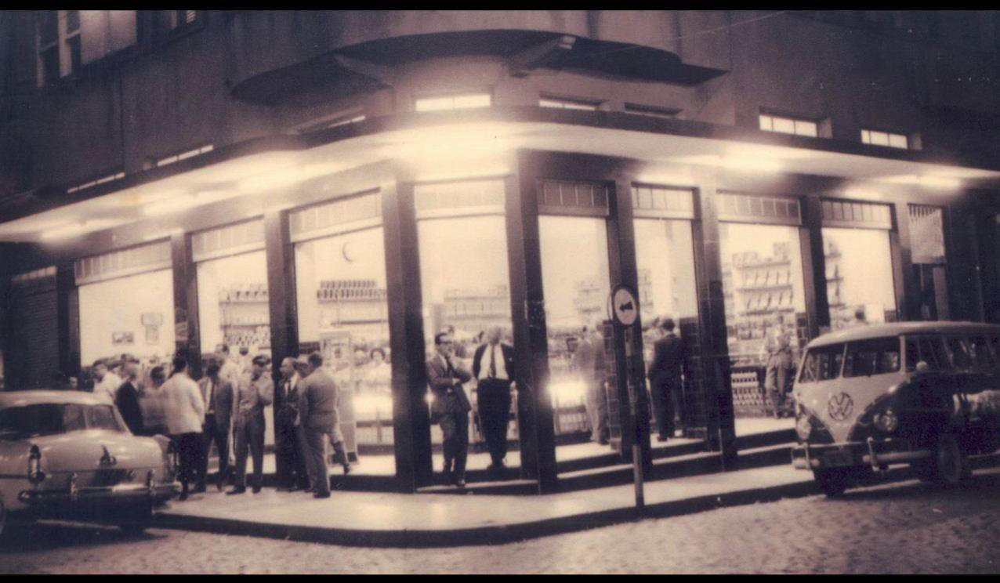

# Resumo

Na esquina das ruas Felipe Schmidt e Trajano, em Florianópolis, foi
aberto, em 1948, um Café que viria a se transformar em um tradicional
ponto de encontro e de sociabilidade da capital catarinense: o Café
Ponto Chic. Esta cafeteria tornou-se parte constituinte do cotidiano de
muitos moradores ilhéus, e acompanhou, entre um cafezinho e outro, as
profundas modificações da cidade ao longo da segunda metade do século
XX. À medida que Florianópolis foi adquirindo novas características,
igualmente o Café foi se modificando, seja com relação ao público, ao
espaço físico, ou às práticas alimentares. Através de relatos de antigos
frequentadores do Ponto Chic, esta pesquisa reflete acerca de como estes
sujeitos constroem memórias sobre esta cafeteria, e revelam suas
práticas e táticas cotidianas efetivadas neste espaço citadino. Partindo
destas experiências urbanas individuais, este trabalho investigou como
as transformações urbanas no centro de Florianópolis, a partir da
segunda metade do século XX, modificaram as práticas sociais que se
constituíram neste estabelecimento. Ao construir uma memória sobre o
Café e demais espaços de sociabilidade, os entrevistados relatam não
apenas sobre o cotidiano e a vida social no centro da cidade, mas também
sobre suas vidas e experiências, construindo, dessa maneira, uma
identidade sobre si mesmos.

**Palavras-chave:** Café Ponto Chic; Florianópolis; Memórias; Cotidiano;
Sociabilidade.

# Abstract

On the corner of Felipe Schmidt and Trajano, in Florianópolis, was
opened in 1948, a Cafe that later turn into a traditional meeting point
and sociability of Florianópolis: Café Ponto Chic. This cafeteria became
a constituent part of everyday life of many people, and accompanied,
between a coffee and another, the deep urban changes that the city
passed over the second half of the 20th century. As the city was
acquiring new characteristics, also the Cafe was changing. Through
reports of Ponto Chic's frequenters, this research reflects on how these
citizens build a memory about this coffee shop, and reveal their daily
practices and tactics realized in this city space. This paper has
investigated how urban transformations in Florianópolis, from the second
half of the 20th century, changed the social practices that constituted
in this establishment. The frequenters talks not only about the daily
life and social life in the city downtown, but also about their lives
and experiences, building, in this way, an identity upon themselves.

**Keywords:** Café Ponto Chic; Florianópolis; Memories; Quotidian;
Sociability.

Na esquina das ruas Felipe Schmidt e Trajano, em Florianópolis, foi
aberto, em 1948, um Café1 que viria a se transformar em um tradicional
ponto de encontro e de sociabilidade da capital catarinense: o Café
Ponto Chic. Esta cafeteria tornou-se parte constituinte do cotidiano de
muito moradores ilhéus, e acompanhou, entre um cafezinho e outro, as
profundas modificações da cidade ao longo da segunda metade do século

> 1 Neste trabalho, utilizado a palavra "café", em minúsculo, para a
> bebida; e "Café", em maiúsculo, para o estabelecimento, palavra
> equivalente à "cafeteria".

XX\. À medida que Florianópolis foi adquirindo novas características,
igualmente o Café foi se modificando, seja com relação ao público, ao
espaço físico, ou às práticas alimentares. Desde a década de 1950 que a
cidade de Florianópolis vem alterando significativamente sua paisagem,
com o Café Ponto Chic não foi diferente: ao longo de seus 60 anos de
existência sua "paisagem", ou seja, seu espaço físico, também sofreu
modificações, adquirindo as mais variadas funções2.

Em "A Imagem da Cidade", Kevin Linch levanta uma série de reflexões que
inspiram análises a respeito deste espaço da cidade de Florianópolis. O
arquiteto-urbanista chama atenção para o fato de que cada cidadão tem
vastas associações com alguma parte da cidade, e a imagem da cidade de
cada um está impregnada de lembranças e de significados (LYNCH, 2011, p.
1). O autor afirma:

> Os elementos móveis de uma cidade são tão importantes quanto as partes
> físicas estacionárias. Não somos meros observadores desse espetáculo,
> mas parte dele. (\...) É preciso levar em consideração não apenas a
> cidade como uma coisa em si, mas a cidade do modo como percebem seus
> habitantes (LYNCH, 2011, p. 3).

No caso desta pesquisa, estamos considerando apenas um espaço específico
da cidade, que se refere ao Café Ponto Chic e seu entorno. É neste
sentido que, através de relatos de antigos frequentadores do Ponto Chic,
esta pesquisa reflete acerca de como estes sujeitos constroem uma
memória sobre a cafeteria, e revelam suas práticas e táticas cotidianas
efetivadas neste espaço citadino. Partindo destas experiências urbanas
individuais, este trabalho identificou como as transformações urbanas no
centro de Florianópolis, a partir da segunda metade do século XX,
modificaram as práticas sociais que se constituíram neste
estabelecimento.

A abertura do Café Ponto Chic, em 1948, está inserida em um período em
que novos estabelecimentos comerciais começaram a surgir na cidade de
Florianópolis -- eram eles, os cinemas, os Cafés e as confeitarias
(COSTA, 2004, p. 37). A abertura desses novos espaços estava de acordo
com as transformações e remodelação da cidade de Florianópolis, que
ocorriam desde as primeiras décadas do século XX. De acordo com Hermetes
Reis de Araújo, o aburguesamento de uma parcela da sociedade local, a
distância social cada vez maior que separava estes das classes mais
humildes e o papel da cidade como sede do governo estadual foram fatores
responsáveis pelo desejo de transformar Florianópolis em uma cidade mais
"moderna e sadia", o que gerou distinção social clara e efetiva (ARAÚJO,
1989, p. 12 e 13).

A remodelação do espaço urbano ocorreu em diversas cidades do país,
principalmente nos maiores centros urbanos. Como afirma Reis,

> este movimento alcançou estatuto de "regeneração nacional", conforme
> foi chamada na época, e representou, particularmente e junto às
> elites, um amplo e sôfrego anseio em acompanhar o modelo de
> civilização exportado pelos países industrializados da Europa e
> Estados Unidos, visando dessa forma superar o que passou a ser
> denominado de "sociedade fossilizada do Império" (ARAÚJO, 1989, p. 9).
>
> 2 O Café Ponto Chic ainda está em funcionamento, no mesmo endereço.
> Permaneceu fechado apenas por alguns meses, no ano de 2004.

Nesse contexto, esses novos estabelecimentos -- a exemplo do Café Ponto
Chic -- representavam um sinal de modernidade, e de aproximação com o
modelo urbano mais próximo à realidade brasileira, que era o Rio de
Janeiro. Ao contrário das tabernas, onde havia bebidas e comidas
preparadas de forma simples e barata, frequentadas por pessoas que não
eram muito bem vistas pela elite, os Cafés apareceram como um espaço de
convívio mais requintado, visto como uma alternativa mais saudável de
divertimento. É dessa forma que os espaços de beber, como afirma a
historiadora Glaucia Dias Costa, não estavam mais relacionados com a
ideia de atraso e de imoralidade (COSTA, 2004). De acordo com Eliane
Veiga, no momento da inauguração, o Ponto Chic ocupava um espaço
bastante amplo -- correspondendo a duas salas comerciais -- e suas
paredes eram ornamentadas com espelhos de cristal (VEIGA, 2005), o que
pode ser um sinal de requinte e luxo. Junto com os espelhos que
decoravam as paredes, havia prateleiras que expunham sacos de café e
vidros de conserva (REINERT, 1986, p. 9). O café, por sua vez, era
tomado em pé, em balcões que, igualmente, possuíam vidros de cristais.

Através de uma fotografia do ano de 1960, quando o proprietário era
Gentil Cordioli, é possível vislumbrar a aparência do Café nos primeiros
anos de existência:

> 
>
> **Figura 1. Imagem externa do Café Ponto Chic. Fonte: Acervo de Gentil
> Cordioli Filho, 1960.**

Trata-se de uma foto do Ponto Chic no período noturno, e é possível ver
a iluminação e os vidros de cristais brilhando nos balcões, no centro do
Café. Mas existe outro balcão, onde um homem contemplativo está apoiado,
no canto direito da foto. Como é possível observar, o "cafezinho" era
tomado em pé, não havia mesas ou cadeiras. Os vidros que ornamentavam as
paredes, por sua vez, não são possíveis de observar nesta fotografia.
Nas paredes do Café, existem também as prateleiras. Na fotografia é
possível perceber que ainda não existia o calçadão da Felipe Schmidt:
estacionado na Rua Trajano, uma Kombi, modelo luxo, lançado no ano 1957;
na Felipe Schmidt, um automóvel AeroWillys, que foi produzido entre 1960
a 19623.

> 3 Informações concedidas por Rodrigo Huelsmann, designer industrial,
> especializado em restauração de veículos antigos das décadas de 50 a
> 70. Para mais informações:
> [www.huelsmann.com.br.](http://www.huelsmann.com.br/)

As personagens da fotografia são todos homens, com exceção de uma
mulher, que parece ser a atendente. Os homens estão todos vestidos de
terno e gravata, o que pode ser um sinal de distinção. É possível
perceber que são homens mais maduros, a partir de 30 e 40 anos. Em sua
maioria, os clientes estão fora do estabelecimento, em grupos na calçada
conversando. Apesar de estarem em uma cafeteria, não é possível vê-los
com uma xícara de café nas mãos. Por meio da análise desta fotografia,
percebe-se que, neste momento, ao menos no período noturno, ia-se ao
Ponto Chic principalmente para encontrar amigos e conversar.

O relato de Rogério Queiroz, que frequenta o Café desde 1959, quando
chegou à cidade, parece se encaixar na fotografia acima, e oferece
algumas pistas sobre as práticas que eram efetivadas no Café:

> Se formavam grupos e tinha rodada de café, um dia um pagava, no outro
> dia outro pagava. Eram grupos de políticos, amigos. Era um ponto de
> encontro.4

O mesmo parece ocorrer nas lembranças de Valter da Luz, proprietário do
Café entre os anos de 1968 a 1983, apesar de se referir a alguns anos
posteriores ao da fotografia, a partir do final da década de 60:

> E eram vistos lá da rua, as pessoas iam lá para ver e ser vistas. As
> pessoas gostavam de ser vistas lá. Tomavam um, dois, três, cinco
> cafezinhos para olhar as pessoas lá fora, e pras pessoas olharem pra
> eles. (\...) O forte era o cafezinho, e o papo, e a conversa. Ficavam
> até as 10 da noite conversando, mesmo em pé.5

Nas memórias de Átila Ramos -- que também frequenta o Ponto Chic desde
fins dos anos 50 -- e Rogério Queiroz, Florianópolis é recordada, até os
anos 60, como uma cidade ainda pequena, com poucos espaços de
divertimento e sociabilidade e com suas divisões políticas, onde cada
partido tinha seu espaço, seu bar e seu clube:

> Quando eu cheguei aqui \[1959\] eu acho que ainda tinha na esquina o
> Café Nacional, ali na Felipe Schmidt. Mas havia uma diferença política
> entre esses Cafés, a política era marcada pela UDN e PSD. Assim como
> os próprios clubes sociais da cidade. A cidade era pequena então tinha
> essas divisões políticas. E eu frequentava os dois né? (\...) Pra você
> ver como as coisas mudaram em Florianópolis. Antes era tudo nos
> clubes: Carnaval, Ano Novo, Réveillon. Hoje não tem mais.6
>
> Mas tinham outros Cafés também, tinha ali o Café Nacional, que ficava
> na outra esquina. Antigamente só tinha dois partidos, PSD e UDN. E um
> partido ia no Café Nacional, o outro aqui, no Ponto Chic. Tu vê, era
> tudo discriminado, sociedade fechada.7

Com relação à divisão dos espaços de convívio do centro entre PSD e UDN
é difícil, e até mesmo arriscado, afirmar que os membros desses partidos
não frequentavam os

> 4 QUEIROZ, Rogério. Entrevista concedida a Isabella Cristina de Souza.
> Florianópolis, 27 de novembro de 2012.
>
> 5 Ibidem.
>
> 6 Ibidem.
>
> 7 RAMOS, Átila. Entrevista concedida a Isabella Cristina de Souza.
> Florianópolis, 26 de novembro de 2012.

mesmos locais. Isso ficou evidente na própria memória dos entrevistados.
Ora mencionam que o Café Nacional era frequentado pela UDN, ora
mencionam o contrário. Além disso, é preciso estar ciente que os
diferentes grupos percorrem os diversos espaços da cidade,
principalmente se levarmos em consideração que estes estabelecimentos
estavam muito próximos geograficamente.

Os principais redutos de Cafés gravitavam, ao menos até a década de
1970, em torno da Praça XV de Novembro e ruas próximas: em 1946, quase
em frente à Catedral Metropolitana, foi instalado inicialmente o Café
Gato Preto; na esquina da Felipe Schmidt com a Praça XV, ficava o Café
Popular, que mais tarde tornou-se o Café Nacional (SILVA, 1999, p. 28 --
34); na frente do Ponto Chic, estava localizado a Confeitaria Chiquinho,
que fora aberto no início do século XX; no prédio ao lado do Ponto Chic,
estava o Café Rio Branco.

As memórias dos entrevistados recordam não apenas um centro dividido
entre partidos políticos, mas também demarcado socialmente. Átila Ramos
relembra os famosos *footings*, no final da década de 50, que ocorriam
na calçada do Palácio do Governador e na Felipe Schmidt. Mas esse espaço
era destinado para "as meninas e os guris de colégio". Já do outro lado
do Palácio, em frente à Praça XV,

> sempre tem esse negócio dos níveis sociais, né? Nesse lado aqui \[em
> frente ao Palácio do Governo, mas na calçada da Praça XV\] também
> tinha o *footing*, mas era de empregadas domésticas, de marinheiro,
> carpinteiro, os mais pobres eram aqui, de nível intelectual mais
> baixo. Tinha os táxis aqui \[na frente do Palácio\]. Então tinham os
> taxistas, tinham os marinheiros. E do outro lado, as garotas e guris
> de colégios, Átila Ramos, e tal.8

No processo de construção da memória sobre os bares e demais locais de
sociabilidade do centro da cidade, os entrevistados também constroem uma
identidade sobre si mesmo: dos grupos sociais que praticavam o *footing*
no centro da cidade, Átila Ramos destaca que fazia parte de um em
específico, os "guris de colégio". De uma maneira geral, é possível
perceber que os entrevistados falam mais sobre si, e da maneira como os
espaços de sociabilidade fazem parte de sua identidade, do que sobre o
Café Ponto Chic e demais bares e Cafés da cidade. Isso vai ao encontro
do que pontua Michael Pollak: a memória é um elemento constitutivo do
sentimento de identidade de grupos e de indivíduos (POLLAK, 1992, p.
205).

No comecinho da década de 1960, de acordo com Ramos, o *footing* começa
a modificar: "porque, daí, começaram a fazer uma série de prédios, a
Universidade começou a ampliar, e é nesse momento em que a cidade começa
a crescer muito"9. De fato, desde a década de 60, Florianópolis passa
por um surto de desenvolvimento, assim como o restante do país. É neste
período que são criadas a Universidade Federal e a Universidade Estadual
de Santa Catarina, que representaram uma alavanca no progresso urbano e
populacional da capital. Neste período foi construída a BR-101, ligando,
pelo litoral, as capitais do estado do Paraná e Rio Grande do Sul, que
passava pelas imediações de Florianópolis (CORREA, 2005, p. 336 -- 353).
A cidade começou a receber grandes obras como o aterro da Baía Sul, a
ponte Colombo Salles, a Avenida Beira-Mar Norte e as ligações com os
balneários. Como observa Glaucia Costa, essas mudanças urbanas ocorreram
no sentido de deixar Florianópolis uma capital mais

> 8 Ibidem.
>
> 9 Ibidem.

moderna, passando a ser vista com ares de cidade grande, principalmente
a partir da década de 1970 (COSTA, 2004, p. 108).

Nas entrevistas realizadas para esta pesquisa, é frequente nas memórias
a relação entre este surto de desenvolvimento urbano que a cidade
passara a partir da segunda metade do século XX e as modificações das
práticas de sociabilidade no centro da cidade, entre elas, o costume de
tomar um cafezinho no Ponto Chic. Essas memórias apontam, em alguns
momentos, para as transformações, muitas vezes sutis, que ocorreram na
prática de ir aos Cafés:

> Na verdade, esse período de 1968 a 1983 foi um período áureo para o
> Ponto Chic. Áureo para a cidade. Depois disso, ele \[Café Ponto Chic\]
> durou mais uns 20 anos, eu acho. Também foi um tempo bonito, não posso
> dizer que não, mas é que a cidade mudou muito. Aliás, esses 15 anos
> meus, e os 20 anos depois, nesses 35 anos Florianópolis deu um pulo
> muito grande, né? A cidade evoluiu muito, cresceu muito,
> populacionalmente. Então, vão surgindo novos negócios: surgiu o
> Mcdonalds, o Bob's, surgiram outros Cafés, a cidade foi se expandindo
> mais pra fora, mais para a periferia, saiu um pouco do centro, outros
> tipos de comércio foram sendo criados, alguns sumiram e
> desapareceram.10
>
> Mas o progresso da cidade vai tomando conta; é um monstro que vai
> acabando com tudo (\...). Isso está contribuindo para que
> Florianópolis deixe de ser aquela cidade bonita que era pra se tornar
> uma cidade essencialmente progressista, que não está de acordo com
> aqueles moradores da Ilha. Inclusive aqui, por exemplo, fizeram um
> aterro, um maior absurdo! Então essa insatisfação generalizada dos
> moradores nativos daqui, que se criaram aqui, e viram sofrer toda essa
> transformação não benéfica para a Ilha, mas destrutível.11
>
> Era um ponto de encontro \[Ponto Chic\]. Mas esse ponto de encontro é
> preciso salientar, que a cidade cresceu, a população aumentou, e não
> se encontra mais as pessoas como antes.12

As memórias são construídas com contraposições entre determinadas
práticas e suas alterações. Ou seja, primeiro os entrevistados
caracterizam como era a prática de frequentar o Ponto Chic, para depois
contrapor às modificações. Se, num primeiro momento, eles estavam
acostumados a conhecer boa parte dos transeuntes e frequentadores do
Café, agora surge o anonimato. Junto a isso, a cidade passa a se
expandir, tirando do centro o monopólio dos encontros sociais. Aparecem
novos estabelecimentos, como aponta Valter da Luz, que possibilitam
outros espaços de sociabilidade.

O tema também gerou opiniões diversas. Edy Leopoldo Tremel, cliente
assíduo do Café desde a década de 1960, possuía um coluna no Jornal
*Diário Catarinense*, intitulada

> 10 LUZ, Valter da. Entrevista concedida a Isabella Cristina de Souza.
> Florianópolis: 1º de novembro de 2012.
>
> 11 TREMEL, Edy Leopoldo. Entrevista concedida a Isabella Cristina de
> Souza. Florianópolis: 8 de novembro de 2012.
>
> 12 QUEIROZ, Rogério. Entrevista concedida a Isabella Cristina de
> Souza. Florianópolis, 27 de novembro de 2012.

"Trovas do Senadinho13", nos últimos meses de 1979. Em uma de suas
publicações, Tremel revela sua preocupação com o crescimento da cidade,
e o quanto isso pode ser perigoso para as tradições ilhoas:

> Prestem muita atenção no que vamos dizer: uma filosofia de vida todos
> nós precisamos ter. / Que nossa Ilha era um paraíso, sinceramente,
> vamos reconhecer; quando não invadida pelo progresso, era bem melhor
> de se viver. / Podíamos amar a natureza, o florianopolitano podia
> sonhar, olhar o tempo e vaticinar qual vento iria dar. / A Rua Felipe
> Schmidt e a Praça XV reuniam toda a população; eram prazerosos
> passeios, com roupa de algodão. / Veio a máquina e tomou conta, a
> ambição foi progredindo, os bons moços e as moças faceiras foram da
> cidade sumindo (continua\...).14
>
> (Continuação) As tradições foram subtraindo-se, destruíram-se os
> costumes; o amor antes vivido, o paraíso foi substituído. / A
> tranquilidade de então, o progresso engoliu sim; hoje é enfarte por
> todo lado, e derrame que não tem mais fim. / tudo isso porque a
> técnica substituiu o amor e a sensibilidade, não se tem mais
> tranquilidade. / Acontece que a Ilha não oferece condições para um
> progresso exagerado e um lucro desenfreado. / Não temos indústria, a
> Ilha é de funcionários; um contrasenso, é evidente, fechar os olhos é
> temerário. (continua\...).15

No processo de construção dessas "tradições" defendias por Tremel, são
atribuídas determinadas características e valores em contraposição às
transformações que vinham ocorrendo. Nos versos, a Ilha era
caracterizada como paraíso, como uma cidade tranquila e amorosa. A Rua
Felipe Schmidt e a Praça XV abrigavam toda a diminuta população, que era
composta por "bons moços e moças faceiras", que já estão desaparecendo.
Os florianopolitanos podiam amar a natureza, até que chegaram o
progresso e as indústrias, para destruir esse cenário de tranquilidade.

É interessante perceber que, concomitante com o crescimento vertiginoso
da população, e como reação a chegada de uma população com "hábitos
alienígenas" como menciona Edy Tremel durante entrevista16, ocorre a
construção da figura do "manezinho", o típico morador da Ilha. Como
observa Fabio Ritcher, "embora a construção do manezinho, como símbolo
da paisagem humana tradicional de Florianópolis tenha se intensificado a
partir da década de 1980, existe um processo, distinto, que lhe é
anterior, mas diretamente relacionado, trata-se da construção da
açorianidade" (RITCHER, 2008, p. 117).

> 13 Senadinho é uma Confraria criada em 1979, onde seus membros,
> intitulados "senadores", encontram- se no Café Ponto Chic. Edy
> Leopoldo Tremel, juntamente com Ludwig Wolfgang Rau, foram os
> criadores da Confraria Senadinho.
>
> 14 TREMEL, Edy Leopoldo. Trovas do Senadinho. *Diário Catarinense.*
> Florianópolis: 30 de outubro de 1979, p. 2.
>
> 15 TREMEL, Edy Leopoldo. Trovas do Senadinho. *Diário Catarinense.*
> Florianópolis: 31 de outubro de 1979, p. 2.
>
> 16 "O Ponto Chic é um ponto de comparecimento obrigatório para as
> pessoas que vem para cá, e também
>
> do ilhéu. Se transformou numa tradição, e as tradições devem ser
> mantidas, sob pena da cidade ficar absorvida por costumes alienígenas,
> que não são os nossos. Então vem pessoas do Rio Grande, do Paraná, de
> São Paulo, com outras idéias, que não viveram aquilo que nós vivemos.
> Se nós não cuidarmos vamos perder nossa identidade." TREMEL, Edy
> Leopoldo. Entrevista concedida a Isabella Cristina de Souza.
> Florianópolis: 8 de novembro de 2012.

Não restam dúvidas que essas modificações do espaço da cidade também
geraram transformações na sociabilidade do Café Ponto Chic. Se até
meados da década de 1960, o público do Café era, provavelmente, pessoas
de poder aquisitivo mais elevado -- como representantes das famílias
tradicionais e os homens públicos da cidade -- a partir da década de
1970, os frequentadores do Café passam a ser os mais diversos possíveis.
Principalmente depois da construção do calçadão da Rua Felipe Schmidt,
em 1976, que fez aumentar a circulação de pessoas pelo local.

Quando Valter da Luz menciona que sua gestão no Café foi "um período
áureo para o Ponto Chic" -- entre 1968 a 1983 -- talvez isso signifique
não apenas uma tentativa de valorização de seu trabalho, mas também
porque o então proprietário acompanhou, do ponto de vista do Café, esse
período de transição e de transformações do espaço cidade: quando os
Cafés do centro ainda tinham esse poder aglutinador, de trocas de ideias
políticas, econômicas e culturais, de um público mais delimitado, em uma
cidade com uma população diminuta, para clientes mais diversos, com uma
população cada vez mais crescente.

Um caso interessante com relação a isso é quando Luz menciona que, assim
que comprou o Café, fez uma primeira reforma no espaço físico do
estabelecimento, depois de anos com a mesma aparência. De acordo com o
comerciante, a mudança na estrutura do Café inspirou outros
comerciantes, a mudar seus estabelecimentos também. É dessa forma que
Luz vislumbra que as transformações ocorridas no Ponto Chic,
influenciaram as mudanças que estavam ocorrendo e que viriam a ocorrer
na cidade:

> Quando eu cheguei lá em 68, o mês era de outubro, ele \[Ponto Chic\]
> era uma casa assim velha, antiga, como era a cidade, sem muita
> expressão, natimorto. E as pessoas viviam assim: em torno do Ponto
> Chic, e o Ponto Chic em torno delas. Uma cidade sem muita vontade de
> crescer, se vivia assim "numa boa", e assim a coisa ia passando. Mas
> eu não me conformei muito com aquilo, e comecei a mexer a casa. (\...)
> Ah, daí que a cidade se mexeu junto! O engraçado foi isso: a própria
> cidade acabou mudando junto. "Opa, tem alguém reformando o Ponto Chic,
> eu também posso reformar a minha loja". E a cidade parece que começou
> a andar! A cidade começou a mudar junto! Se inspiraram! Eu fiz aquela
> coisa andar.17

Também é possível observar no trecho acima que Valter da Luz chama as
mudanças da cidade para si, como se fossem de sua autoria. Ao longo da
pesquisa foi possível perceber o quanto esse fato é importante na
constituição das memórias de Valter sobre o Café. Ele relatou esse mesmo
caso em outras notícias de Jornal: no Jornal *O Estado*, em cinco de
setembro de 198618, e no *A Notícia Capital*, em 24 de julho de 200519.
O tempo entre as duas notícias e a entrevista concedida é relativamente
grande, mas o depoente conta o episódio de maneira semelhante. Trata-se
de um "trabalho de solidificação da memória", nas palavras de Pollak,
quando alguns marcos ou pontos são frequentemente retomados em
entrevistas ou relatos histórias de vida. Esses aspectos recorrentes
passam a fazer parte da própria essência da pessoa, e demonstram a
identidade sobre si que determinado sujeito quer construir (POLLAK,
1992, p. 201).

> 17 LUZ, Valter da. Entrevista concedida a Isabella Cristina de Souza.
> Florianópolis: 1º de novembro de 2012.
>
> 18 REINERT, Helô. Um "senado" para o qual os votos são dispensáveis.
> *O Estado.* Florianópolis: 5 de setembro de 1986, Florianópolis, p. 9.
>
> 19 Cidade ganha novo Ponto Chic nesta terça-feira. *AN Capital.*
> Florianópolis: 25 de julho de 2005, Florianópolis.

Nesta reforma realizada por Luz, os espelhos das paredes foram
retirados. Além dos espelhos, foram removidas as prateleiras com os
sacos de café e os vidros de conserva. Mas o comerciante relata que a
reforma gerou um grande estranhamento por parte dos frequentadores do
Café e moradores da cidade:

> Então ali eu renovei tudo. Aqueles espelhos que tinham lá, era cheio
> de espelhos em volta, espelhos de cristais, eu tirei tudo! Pessoal
> tinha uma "dó danada" de quebrar aquilo tudo.20

Quando o ex-proprietário menciona em entrevista que o Café era um espaço
"natimorto e sem muita expressão", podemos concluir que a estrutura do
Café já era considerada "antiga" em 1968, provavelmente a mesma de
quando abriram o estabelecimento 20 anos antes, em 1948. O espanto com
que as pessoas ficaram ao retirarem os vidros das paredes, descrito por
Luz, também evidencia que as pessoas estavam acostumadas com aquela
estrutura há muitos anos. No entanto, é preciso estar atento para o fato
de que, durante sua entrevista, o comerciante sempre pontua sua gestão
como inovadora e grandiosa na história do Café. Luz pode ter descrito
dessa maneira como forma de enaltecer o seu papel como um proprietário
inovador. Pensando nisso, é provável que nos primeiros vinte anos alguma
reforma tenha sido realizada na estrutura do Café, mas que,
infelizmente, não foi identificada durante esta pesquisa.

Porém, uma característica que permaneceu no Café, ao menos até 200421,
foi a maneira como o café era ingerido: em pé, num balcão. Mas o balcão
não passou despercebido nas reformas de Valter Luz:

> Uma das primeiras coisas que eu mexi foi nos balcões que tinham lá.
> Tinham uns balcões compridos, com vidros de cristais, altos, daí o
> funcionário ficava lá trás, e via o freguês a partir do nariz dele.
> (\...) Mas então eu mexi naqueles balcões e a cidade vinha ver aquilo,
> sabe? Era engraçado como a cidade vinha ver aquilo, e diziam "uai,
> estão mexendo no Ponto Chic" (risos) "o que eles estão fazendo". Então
> ali eu renovei tudo.22

Em suas reformas, Valter da Luz instalou uma loja no Café, que possuía
uma característica inovadora para a cidade até então: eram as chamadas
gôndolas de auto- serviço, prateleiras onde o próprio cliente poderia se
servir. Até então, segundo o comerciante, isso não existia em
Florianópolis. As gôndolas vendiam produtos dos mais variados, de
chocolates em tempos de páscoa e natal, até calculadoras e relógios:

> Mas o que eu tinha nessa loja era tudo produto de conveniência, tudo o
> que a pessoa precisava de emergência, ia lá ao Ponto Chic, e
> encontrava. (\...) Coisas que nem se imaginava, lá no Ponto Chic
> tinha,
>
> 20 LUZ, Valter da. Entrevista concedida a Isabella Cristina de Souza.
> Florianópolis, 01 de novembro de 2012.
>
> 21 Em 2004, o Café Ponto Chic encerra suas atividades. Reabre em 2005
> devido esforços de um movimento intitulado "SOS Ponto Chic --
> Movimento Popular pela Reabertura do Café Ponto Chic", organizado por
> frequentadores do Café não conformados com o seu fechamento. Apesar de
> reabrir suas portas, o Café passou por uma grande reforma, dividindo
> seu antigo espaço com uma agência financiadora. O balcão, onde
> tradicionalmente os clientes tomavam café em pé, é substituído por
> mesas, na Rua Trajano.
>
> 22 Ibidem.
>
> tipo relógio com calculadora, máquina fotográfica, filmes, tudo o que
> turista queria, mapa, *souvenir*.23

A venda dos mais diversos produtos possivelmente gerou uma modificação
no significado de ir até o Café. Se até fins da década de 60, ia-se ao
Ponto Chic apenas para beber café e encontrar pessoas, agora havia uma
clientela que ia ao estabelecimento para comprar objetos variados. A
instalação de uma loja de *souvenir*, como mencionado no relato, atrai
outro tipo de público para o Café, os "forasteiros", ou seja, os
turistas. A venda de produtos e alimentos contribuiu para a
diversificação do público do Café que eram, até então, em sua maioria,
moradores da cidade. As gôndolas foram retiradas quando começaram a
surgir os supermercados na cidade, porque a partir de então, de acordo
com o Valter da Luz, as pessoas passaram a não comprar mais no Café.

Nos quinze anos que permaneceu no Ponto Chic, entre os anos de 1968 a
1983, Luz relembra a rotina do estabelecimento, e constrói nas suas
memórias um determinado cotidiano: o Café permanecia aberto das 7h30 até
as 22h30, inclusive sábados, domingos e feriados. Os horários de maior
movimento eram às 10 horas da manhã, e 4 horas da tarde. Duravam em
torno de uma hora, das 10 às 11, das 16 às 17 horas. Durante a semana,
os dias de maior movimento eram nas sextas e nas segundas, isso porque

> nas sextas a pessoa ia lá pra programar o final de semana. "Olha,
> amanhã nós vamos em tal lugar, tem churrasquinho lá na empresa, amanhã
> nós vamos fazer um piquenique, amanhã nós vamos passear ali". E nas
> segundas, era pra contar como foi o final de semana.24

O relato de Valter Luz, assim como dos demais depoentes nessa pesquisa,
lembra aquilo que Michel de Certeau, em "A Invenção do Cotidiano",
sugere: todo relato é uma prática do espaço, e tem relação com as
táticas cotidianas. Estas narrativas sobre os espaços produzem uma
geografia de ações e organizam caminhadas. Cria um campo que autoriza
práticas sociais (DE CERTEAU, 1994, p. 201). É neste sentido que, no
processo de construção de suas memórias, os antigos frequentadores do
Café Ponto Chic narram um determinado cotidiano para a cafeteria e o
ritmo social no centro da cidade, relacionando as modificações urbanas
de Florianópolis e as práticas efetivadas neste estabelecimento. Neste
processo, relatam sobre suas vidas e experiências, construindo, dessa
maneira, uma identidade sobre si mesmos.

> **Referências Bibliográficas**

ARAÚJO, Hermetes Reis de. *A Invenção do Litoral* -- Reformas urbanas e
reajustamento social em Florianópolis na Primeira República. São Paulo:
PUC, 1989. \[Dissertação de Mestrado em História\].

CEREZER, Larissa. Lugares da alimentação: espaços e práticas cotidianas
no centro de Florianópolis na segunda metade do século XX (1950 a 1960).
In: CAMPOS, E.; FALCÃO, L.; LOHN, R. (Orgs). *Florianópolis no tempo
presente*. Florianópolis: Editora da UDESC, 2011

> 23 Ibidem.
>
> 24 Ibidem.
>
> COSTA, Glaucia Dias. *Vida noturna e cultura urbana em Florianópolis*:
> décadas de 50, 60 e 70 do século XX. Florianópolis: Universidade
> Federal de Santa Catarina. Dissertação de Mestrado em História.
>
> CORREA, Carlos Humberto. *História de Florianópolis* -- Ilustrada.
> Florianópolis: Insular, 2005. 3ª ed.
>
> DE CERTEAU, Michel. *A invenção do cotidiano*. Artes de fazer.
> Petrópolis: Vozes, 1994.
>
> LYNCH, Kevin. *A imagem da cidade*. 3ª edição. São Paulo: Editora
> Martins Fontes, 2011

POLLAK, Michael. Memória e Identidade social. *Estudos Históricos*, Rio
de Janeiro, vol. 5, n. 10, 1992.

REINERT, Helô. Um "senado" para o qual os votos são dispensáveis. *O
Estado*. Florianópolis: 05 de setembro de 1986, p. 9.

RITCHER, Fabio. *Corpo e alma de Florianópolis*: o Patrimônio Cultural
na ação do governo do Município -- 1974 -- 2008. Dissertação em
História, UDESC, Florianópolis

> SILVA, Adolfo Nicolich da. *Ruas de Florianópolis -- Resenha
> Histórica.* Florianópolis: FFC, 1999.

VEIGA, Eliane. *Ponto Chic e Café Senadinho.* Organizado pelo Setor de
Pesquisa Histórica da Casa da Memória de Florianópolis. Florianópolis,
2005.
