# Resumo

A análise das mudanças que ocorreram no desenho e no uso dos edifícios
do Bosque dos Buritis objetiva a compreensão de seu papel na história da
cidade, o que ele era para esta, como era visto pelos usuários, os
motivos que levaram às tais transformações e o papel que assume, hoje,
para Goiânia enquanto espaço público. A escolha deste local se justifica
pelo caráter emblemático que assume para a cidade, pela sua localização
próxima ao centro da cidade e por ter passado por diversas reformas que
alteraram sua área até a configuração atual. A investigação sobre a
maneira como os espaços públicos são vivenciados em Goiânia, a
compreensão de como foram estabelecidas as relações entre os espaços e
seus usuários ao longo do desenvolvimento da cidade e como elas se
transformaram até o momento presente são fundamentais para se detectar
os problemas existentes nas propostas desses locais. Considerando ainda
que o arquiteto e urbanista é o profissional qualificado para a
elaboração do desenho urbano a análise feita oferece subsídios para se
propor formas de sanar os problemas detectados.

Palavra-chave: espaço público, Goiânia, vivência, parques urbanos

# Abstract

The analysis of the changes that have occurred in the design and use of
buildings of Bosque dos Buritis surch for an understanding of their role
in the history of the city, what it was for it, how it was viewed by the
users, the reasons that led to such transformations and the role it
takes today to Goiânia as a public space. The choice of this location is
justified by the emblematic character that it takes to the city, by its
location near the city center and by having undergone several
renovations that have altered their area until the current
configuration. The research on how public spaces are experienced in
Goiania, understanding how the relationships between spaces and their
users were established along the city\'s development and how they became
so far, is essential to detect existing problems in the proposals of
these locations. Considering that the architect and urbanist is the
qualified person for the preparation of urban design, the analysis
provides insights to propose ways to remedy the problems identified.

Keywords: public space, Goiânia, experience, urban parks

# Introdução

As propostas dos parques da cidade de Goiânia, atualmente, se apresentam
como tentativas constantes de se imitar a natureza em um contexto urbano
contemporâneo, o qual exige espaços públicos que ofereçam mais
equipamentos culturais juntamente às opções de lazer contemplativo e
ativo. Estes se limitam a oferecer uma exaustiva repetição da pista de
cooper, do playground, das quadras poliesportivas e dos equipamentos de
ginástica, somados à natureza tematizada -- lagos e jardins artificiais.
O Bosque dos Buritis há alguns anos já apresenta a proposta de ser um
parque urbano com equipamentos culturais, entretanto, a implantação
destes não favorece seus usos e não estabelece relações com o entorno.

# O Plano Original e o Parque dos Buritis

O Bosque dos Buritis, então, denominado Parque dos Buritis, previsto no
plano original de Goiânia (1933-1935), de Attílio Corrêa Lima (Figura
1), foi aprovado no Decreto Lei Nº 90-A (Figura 2), de 30 de julho de
1938, juntamente com os Setores Norte, Central, Sul e Oeste e a cidade
satélite de Campinas. De acordo com RIBEIRO (2010, p.60), Attílio
"\[\...\] tomou como

referência as ideias e princípios de vanguarda vigentes à época. Adotou
como um dos seus moldes projetuais as cidades-jardins de Howard,
adequando-os às condições físicas do local, com destaque para a
topografia e o clima".

> 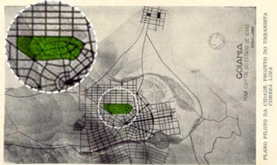
>
> Figura 1: Plano da Nova Capital de Goiás, Projeto de Attílio Corrêa
> Lima, 1935, com destaque em verde da área destina para o Bosque dos
> Buritis, sem Escala. Intervenção da autora, 2012.
>
> 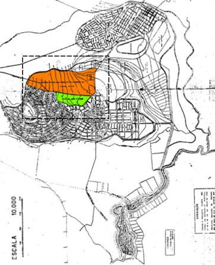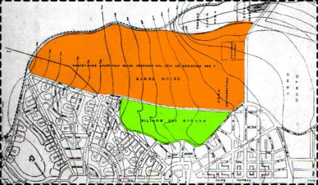
>
> Figura 2: Plano de Urbanização de Goiânia. Planta Geral de Orientação,
> aprovada pelo Decreto-Lei n° 90-A, de 1938, com destaque em verde da
> área destinada para o Bosque dos Buritis e em laranja a área destinado
> para o Setor Oeste, sem escala. Intervenção da autora, 2012.

O modelo das cidades-jardins foi elaborado como resposta ao contexto de
transformação da Revolução Industrial que se caracterizou pelo acelerado
aumento demográfico e pela mecanização dos processos produtivos. Este
novo cenário se configurou a partir de uma alta densidade urbana: as
cidades não expandiram fisicamente e passou a existir uma crescente
demanda por habitação, por equipamentos e infraestrutura urbana. A
preocupação com questões referentes à qualidade de vida como
sanitarismo, salubridade, rede de esgoto, água, se tornaram recorrentes
(CHOAY, 2005, p. 3). Com isso, os parques apresentam-se como "\[\...\]
uma das soluções para as cidades convulsionadas \[\...\]" (GUIMARÃES,
2010, p. 10). E, não são entendidos como: "\[\...\] parte integrante do
meio urbano, mas como um local de refúgio, cujo valor essencial vinha do
contraste com a ruidosa e empoeirada colmeia urbana.

O valor recreativo dos parques era também incontestável, além disso,
serviam de barreira contra um desenvolvimento contínuo da cidade."

No Plano de Attílio, predomina uma influência sanitarista, sem ignorar o
uso de lazer e os aspectos relativos ao embelezamento da cidade que os
parques proporcionariam. Verifica-se a visão das áreas verdes como os
pulmões da cidade: é possível perceber como os cursos d'águas se
relacionam com as áreas verdes, compondo as áreas livres da cidade,
"\[\...\] sendo elementos de destaque nas considerações do arquiteto
urbanista, que procurava proteger de um modo eficaz a pureza da água que
deveria abastecer a cidade" (AMMA, 2008, p.07).

Na tentativa de evitar o desmatamento das áreas verdes com uma possível
expansão desordenada da cidade, Attílio demarcou no Plano as reservas
ambientais, que teriam usos futuros de parques ou bosques, afirmando que
embora só mais tarde a administração pública pudesse urbanizá-las, as
demarcações impediriam que o governo se dispusesse das mesmas para
outros fins que não os previstos (Lima apud Diniz, 2007). Dentro dessa
lógica, definiu o Parque dos Buritis como um espaço livre, inalienável,
que não poderia ter seu uso como área de lazer e de preservação
ambiental alterado.

> O Buritizal, localizado na extremidade da Rua 26, será transformado em
> pequeno parque. Para isso será necessário drená-lo convenientemente,
> conduzindo as águas para o talvegue, em canal descoberto tirando
> partido deste para os efeitos de pequenos lagos decorativos. Este
> parque que denominado dos Buritis se estenderá por faixas ao longo do
> talvegue e medirá 50 metros para cada lado deste, no mínimo, formando
> o que os americanos denominam de Park-way (LIMA *apud* Guimarães,
> 2010, p. 38).

Desse modo, ao prever áreas verdes, Attílio relacionou a ocupação do
solo e o tamanho da cidade, regulando-se pelas barreiras físicas
existentes: os cursos d'água. Assim, reforçava a escolha do sítio mais
plano e de fácil abastecimento de água. Ademais, os limites urbanos
deveriam, aos moldes da cidade jardim, conformar um cinturão verde,
remetendo-se a ideia de delimitar o território sobre o qual a cidade se
desenvolveria, sem uma correta previsão de seu crescimento, culminando
numa ocupação espontânea e não planejada.

Isso, porque, de acordo com Panerai (2006, p.55), estudar o processo de
crescimento de uma cidade implica em recusá-la enquanto obra acabada,
estática e congelada: seu estado atual representa sempre um instante
transitório de sua evolução. Nesse sentido, entender o processo de
crescimento de Goiânia colabora para entender a inserção do Bosque dos
Buritis1 neste contexto urbano e quais implicações desse diálogo para
que se possa verificar seu potencial e possibilidades de uso tendo em
vista que se trata de um dos poucos espaços públicos presentes na região
central da cidade e que ainda conta com equipamentos culturais.

Com a valorização da área situada entre Goiânia e Campinas, na década de
1940, foram lançados inúmeros loteamentos, modificando a situação do
Parque dos Buritis: deixava de ser limite ao ser inserido na malha da
cidade, permanecendo como área verde. No entanto, foi sofrendo
modificações com perdas consideráveis de sua área original (Figura 3) e
de espécies vegetais existentes no local com doações pelo Governo do
Estado de áreas do Bosque para os Colégios Atheneu Dom Bosco e Externato
São José. Com a aprovação do Setor Oeste com o Decreto-Lei nº 574, de 12
de maio de 1947, o Bosque perdeu cerca de 70% de sua área
configurando-se, assim, o desenho que atual (AMMA, 2005). Na década de
1950, o Governo também fez doações das áreas do Bosque para a construção
do Abrigo dos Velhos, atual Fórum.

> 1 Durante a pesquisa não se encontrou dados que apresentassem os
> motivos para a alteração de nome de "Parques dos Buritis" para "Bosque
> dos Buritis".
>
> 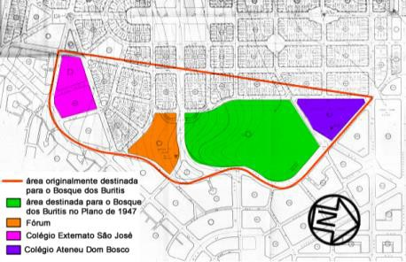
>
> Figura 3: Projeto do Setor Oeste aprovado Decreto-Lei nº 574, de 12 de
> maio de 1947, sem escala. Intervenção da autora.

## As intervenções no Bosque dos Buritis e sua configuração atual

A situação do Bosque dos Buritis foi se agravando devido à implantação
de uma feira livre no entorno do local e às ações predatórias dos
feirantes e dos próprios moradores do entorno e que passaram a utilizar
o Bosque para despejo de lixo ou que realizavam queimadas nos capinzais
nos períodos de seca (O Popular, 1977), reforçando a ideia de que
deveria ser uma área de proteção aos cursos d'água e que ao longo do
processo de urbanização da cidade não teve a devida atenção quanto a
quaisquer tratamentos paisagístico ou urbanístico.

De acordo com uma matéria de jornal (O Popular, 1977), o Governo teria
doado mais uma área do Bosque dos Buritis em frente ao Abrigo dos Velhos
para a construção de um Colégio de freiras: ele nunca foi construído,
mas a área chegou a ser desmatada e cercada (Figura 4).

> 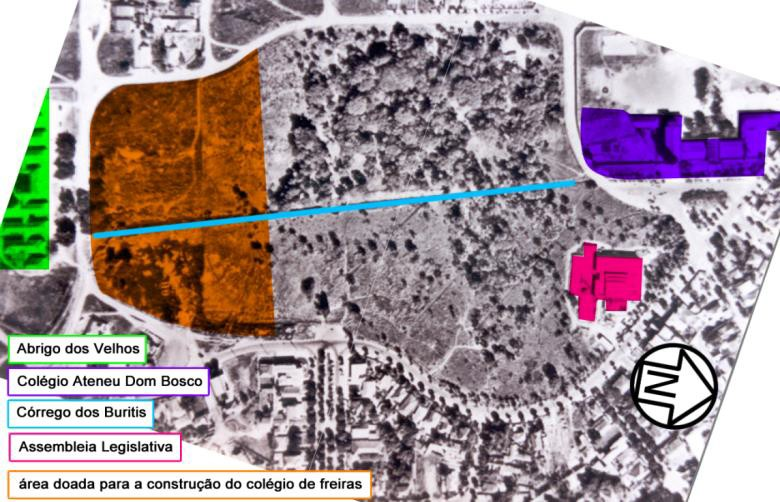
>
> Figura 4: Vista aérea da área do Bosque dos Buritis na década de 1960
> indicando a situação de desmatamento neste momento.

Ainda haviam sido instalados no Bosque a sede da Superintendência das
Obras de Pavimentação Asfáltica da Capital (PAVICAP), e um edifício da
COMURG2 que servia de almoxarifado para os funcionários responsáveis
pela limpeza do local e de seu entorno. Com isso, ao longo dos anos, a
situação só foi se agravando (Figura 5).

> 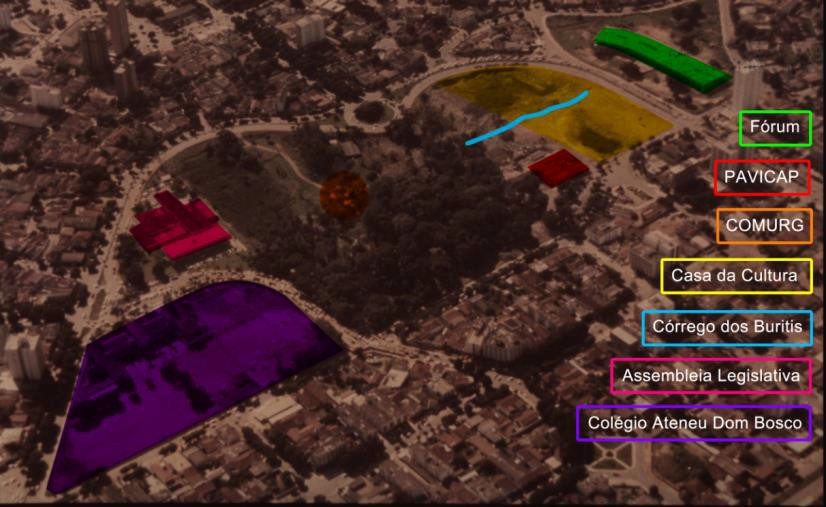
>
> Figura 5: Imagem aérea da década de 1970 apresentando as ocupações do
> Bosque dos Buritis. Intervenções da autora.

O prefeito Hélio Mauro, em 1979, propôs a execução de um projeto
paisagístico elaborado pelo arquiteto Fernando Chacel (Figura 6) com o
objetivo de recuperação do Bosque dos Buritis, sendo esta uma tentativa
de urbanização da área ao mesmo que se buscava minimizar a situação de
degradação. De acordo com Serpa (2007, p. 118) para muitos usuários dos
espaços públicos urbanos a "natureza" é compreendida como "natureza
pura" ou "intocada", determina-se a "natureza" como algo inconciliável
com a experiência humana, devendo ser protegida das ações resultantes
dos processos sociais, econômicos e políticos. Esta visão com relação à
natureza resultou em muitos questionamentos com relação à urbanização da
área ser prejudicial para a vegetação remanescente e nativa, apesar de
todas as áreas cedidas e ocupadas pelo poder público (O Popular, 1978).

Apenas após um período de quase quarenta anos, desde o plano urbanístico
de Attílio Correa Lima até a proposta de Chacel, é que as preocupações
em urbanizar e dotar o Parque dos Buritis de tratamento paisagístico
começaram a se definir, quando a área passou, de fato, a ser encarada
como um espaço público da cidade. E observa-se a importância dada ao
caráter cultural da área, à medida que se previa a instalação de
equipamentos culturais.

O projeto proposto previa a preservação das margens lindeiras aos cursos
d'água, a instalação de uma calçada externa para *cooper* e calçada
interna para passeio, plantio de árvores, instalação de mobiliário,
tratamento do córrego e a criação de um *play-ground* (CHACEL, 1972).
Paralelo a este projeto seguia outro coordenado pelo Instituto Municipal
de Planejamento que previa a construção de um equipamento cultural
dentro do Bosque: a Casa da Cultura, é partir deste momento que se passa
a analisar o Bosque dos Buritis como um espaço público que proporciona o
acesso democrático à cultura.

> 2 Durante a pesquisa não se encontrou os anos em que foram instalados
> os edifícios da PAVICAP e da COMURG dentro da área do Bosque dos
> Buritis.
>
> 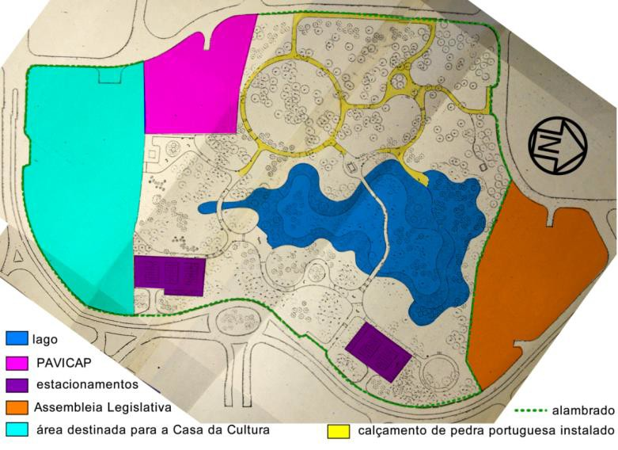
>
> Figura 6: Projeto do arquiteto Fernando Chacel para o Bosque dos
> Buritis, 1972. Intervenção da autora.

Existe, no desenho proposto por Chacel, uma clara influência modernista
que apresenta um programa mais diversificado para o Bosque dos Buritis,
"\[\...\] abrindo-se a oportunidade ao lazer ativo, sem, entretanto,
existir o abandono da atividade de contemplação \[\...\]" (MACEDO, 1999,
p.17). Além disso, existe uma ruptura formal típica da proposta moderna
apresentada pelas curvas que vão marcar os percursos e o lago da nova
proposta como que ignorando as antigas ordens vistas no exemplo do
Passeio Público do Rio de Janeiro.

As duas propostas juntas visavam estabelecer um diálogo entre o
paisagismo e a arquitetura, entretanto, isto não é visto no projeto, a
localização dos equipamentos nas bordas da área, como se não fizessem
parte dela, cria um limite entre a "natureza intocada" e a cidade, o
projeto que visava a integração do espaço público acabou propondo uma
ação de exclusão do mesmo estabelecendo um espaço fragmentado.

Em 1980, a imprensa já denunciava que as obras estavam paradas por falta
de pagamento dos funcionários encarregados (O Popular, 1982). A Casa da
Cultura nunca foi implantada apesar de terem desmatado o local em que
seria construída e de terem iniciado a execução das fundações do
edifício. O equipamento passou a ser mencionado pela imprensa como
"buraco da cultura", onde foi construído um lago, aproveitando as várias
nascentes de água presentes no local (Figura 7). Verifica-se, nessa
década, um abandono completo da área que passou a ser ponto de encontro
de usuários de drogas e de despejo de lixo, conforme as notícias dos
jornais da época.

> 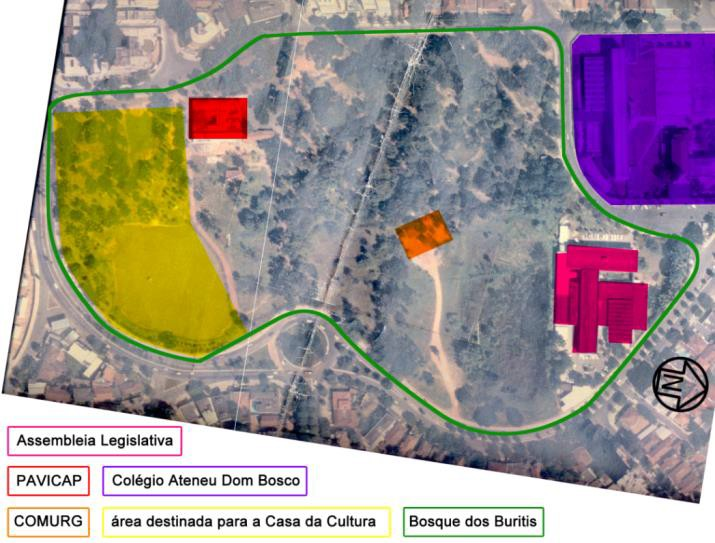
>
> Figura 7: Situação do Bosque dos Buritis em 1988. Intervenção da
> autora.

O mandato do Prefeito Nion Albernaz, na década de 1990, foi responsável
por diversas mudanças no local. O córrego foi despoluído e foi instalado
um jato d'água com alcance de 50 metros de altura no lago criado no
local do "buraco da cultura" (Figura 8), dois novos lagos foram criados,
plantaram-se novas mudas de árvores, o policiamento foi reforçado, o
edifício da COMURG foi demolido, a Superintendência de Pavimentação e
Obras da Capital (PAVICAP)3, - construído inicialmente para receber o
Hospital dos Funcionários, nunca implantado -- foi desativada e no
edifício foi implantado o Museu de Arte de Goiânia (MAG)

e o Centro Livre de Artes (CLA), até hoje em funcionamento no local, e
deu-se início a projetos culturais, como o "Domingo no Bosque", com
oficinas de artes para crianças, apresentações musicais e de dança.
Dá-se início à utilização do Bosque dos Buritis como um espaço público
que, além do lazer contemplativo, oferece equipamentos culturais.

> 3 "O então Prefeito Iris Rezende encaminhou à Câmara o projeto de lei
> criando a Superintendência de Pavimentação e Obras da Capital
> (Pavicap) logo após sua posse, em 4 de fevereiro de 1966. O projeto de
> lei chegou à Câmara de Goiânia e foi aprovado em tempo recorde, em
> apenas três dias. Em 14 de abril de 1983, o prefeito Nion Albernaz
> encaminhou projeto de lei à Câmara solicitando autorização para a
> liquidação definitiva da empresa, já iniciada em 29 de abril de 1980
> pela Lei 5.653. Informações disponíveis no Centro de Documentação da
> Câmara de Goiânia" (CUNHA, 2008, p. 96).
>
> 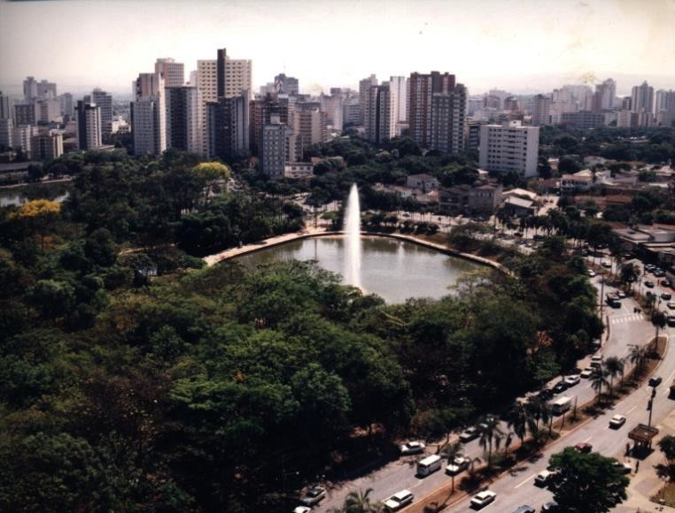
>
> Figura 8: Vista do Bosque dos Buritis após a instalação da fonte,
> 1995. Fonte: SEPLAM.

Em 1991, em declaração à imprensa, Nion Albernaz afirmou que as
intervenções no Bosque dos Buritis (Figura 9) pretendiam "\[\...\]
tornar mais bela e atrativa a principal área verde do centro de Goiânia"
(O Popular, 1991). Esses objetivos foram atingidos, entretanto, não foi
feita nenhuma alteração na área que a integrasse à cidade, o bosque se
manteve numa situação de isolamento com relação à seu entorno.
Percebe-se que a implantação de dois equipamentos culturais no local é
uma adaptação da proposta de construção da Casa de Cultura. O que se faz
é aproveitar a estrutura existente numa tentativa de concretizar a ideia
anterior sem considerar as necessidades programáticas da área. Desse
modo, a gestão pública buscou, em certa medida, atender aos anseios
prenunciados pelo Instituto de Planejamento Municipal (IPLAN),
vinculando o espaço público a atividades culturais.

> 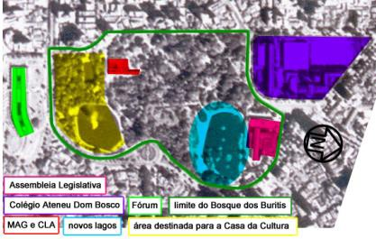
>
> Figura 9: Situação da área do Bosque dos Buritis em 1992. Intervenção
> da autora.

## O tombamento do Bosque dos Buritis

Em 1994, o Decreto nº 2.109 de 13 de setembro efetivou o tombamento do
Bosque dos Buritis juntamente com outras áreas verdes da cidade: Bosque
do Botafogo, Jardim Botânico, Cabeceira do Areião e Lago das Rosas
(Figura 10). O tombamento resultou do intuito de preservar essas áreas
verdes impedindo que estas sofressem mais desmatamento, no caso
específico do Bosque dos Buritis, o tombamento evitou que mais edifícios
fossem construídos no local.

> 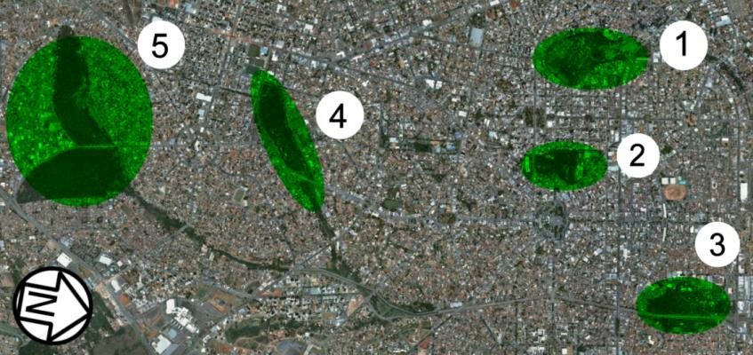
>
> Figura 10: Áreas tombadas pelo Decreto nº 2.109 -- 1. Lago das Rosas,
> 2. Bosque dos Buritis, 3. Bosque do Botafogo, 4. Cabeceira do Areião,
> 5. Jardim Botânico.

Desde esta ação do poder municipal, a configuração da área pouco se
alterou, tornando-se um bem precioso para o discurso ambiental que
permeou as administrações municipais subsequentes, inferindo sua
relevância como área de Especial Interesse Histórico e Cultural,
conforme consta nos relatórios de elaboração do Plano Integrado de
Desenvolvimento de Goiânia (SEPLAM, 1992). Este documento traçou as
diretrizes de valorização da área mesclando tanto o discurso ambiental
e/ou ecológico bem como as ações de patrimonialização da cidade. No
entanto, nem um nem outro asseguram a efetiva apropriação do bosque
enquanto espaço público e de pleno usufruto da população. Além disso,
seu potencial cultural não é em todo aproveitado.

## O Plano de Manejo e a última intervenção

Em 2005, a AMMA elaborou o Plano de Manejo da área, um instrumento de
planejamento e gestão que estabelece diretrizes com o objetivo de
promover a recuperação das áreas alteradas pelas atividades humanas,
proteger as nascentes do córrego dos Buritis, recuperar e conservar o
ambiente, no que diz respeito, ao solo, vegetação e água, facilitar e
promover a pesquisa científica e o monitoramento da área como forma de
se conhecer melhor os recursos naturais protegidos, incentivar projetos
artísticos e culturais, possibilitar oportunidades para recreação e
turismo e promover o encontro da população urbana, com a natureza (AMMA,
2005, p.104). Em 2008, tendo como base este Plano de Manejo, o Bosque
dos Buritis passou por uma última intervenção sob a administração do
prefeito Iris Rezende. O objetivo foi de reaver a área, "\[\...\]
salvaguardando seus aspectos originais e integrando as mais diversas
atividades ali desenvolvidas como forma de obter uma vivência
equilibrada e integradas ao meio ambiente \[\...\]" (AMMA, 2008, p.16),
além disso, buscou-se integrar os elementos que compõem a paisagem do
local (vegetação, água e edificações) para "formá-los, suavizá-los e
integrá-los" de maneira que fique "\[\...\] mais visível o natural,
considerando sempre que há entre a vida orgânica e a construção, pontos
de contato de inegável valor histórico \[\...\]" (AMMA, 2008, p.16).

O foco do projeto estava nas questões ambientais, os edifícios tiveram
suas fachadas reformadas, mas não passaram por nenhum tipo de
modificação que demonstrasse uma nova

visão do espaço público enquanto palco de manifestações culturais4
(SERPA, 2007, p. 187). A intervenção foi responsável pela reforma das
calçadas, o alambrado foi substituído por uma mureta, o paisagismo foi
melhorado, o mobiliário foi todo renovado. Apesar da afirmação com
relação às intenções de maximizar os usos culturais oferecidos pelo
Bosque, não foi verificada nenhuma ação nesse sentido. O tratamento foi
dado para reafirmar a imagem do cinturão verde -- visto do centro da
cidade, enquanto a parte voltada para o Setor Oeste recebeu tratamento
apenas de adequação do acesso dos edifícios, que continuam subutilizados
e que não atendem adequadamente o programa exigido por eles para
garantir seu bom funcionamento. Desse modo, fora dos horários úteis
(funcionamento das instituições e nas férias), esta parte do parque fica
a mercê da marginalidade.

# O caso do Parque de La Villette

Deve pensar no espaço público como "o lugar privilegiado do exercício da
cidadania e da expressão dos direitos civis" (BARDA, 2009, p. 49),
ligado ainda ao potencial de democratização da cultura como no caso do
Parque de La Villette apresentado por Serpa (2007, p. 184). O parque é
um local de experimentação social com jovens em situação de risco dos
bairros e municípios próximos ao local. O trabalho realizado tem por
objetivo promover a área como um lugar de inserção social, econômica e
cultural, e prevenir a exclusão e a violência no espaço público, fato
ocorrido em diversas áreas próximas do La Villette.

Um exemplo claro de como a ação é eficaz é o programa para a
qualificação profissional no setor da reprografia, trabalho que lá é
considerado uma atividade artística e não uma simples reprodução de
cópias. O trabalho da formação e qualificação funciona como uma mediação
cultural, transformando os jovens em situação de risco em "veículos
entre a produção cultural do parque e dos museus e a população da
cidade", e os resultados já são visíveis com a ampliação do público
habitual (com diploma de curso superior ou universitários) às exposições
e eventos oferecidos pelo parque. Para Serpa, o parque de La Villette
funciona como uma "prova de que a cultura e a arte são excelentes meios
de combate à violência urbana, muito mais eficazes que grades, muros ou
policiamento reforçado" (2007, p.187). O próprio arquiteto Bernard
Tschumi, autor do projeto, acredita na função do espaço público do XXI
como o "palco para a manifestação da cultura". O parque, entretanto, é
um caso isolado de um espaço público como lugar efetivo de
democratização da cultura.

É essencial que se reveja as prioridades estabelecidas nos projetos
propostos para os espaços públicos da cidade. Interpretá-los como
espaços "naturais" é limitar o potencial dos mesmos e prosseguir com a
difusão da cultura em um meio social exclusivo que pode pagar para ter
acesso a isso, "teatros, galerias de arte, museus, bibliotecas e salas
de espetáculo devem servir, portanto, como estruturas necessárias para a
consolidação de processos de gestão e produção culturais mais
democráticos e livres, sem hierarquias nem desigualdades" (SERPA, 2007,
p. 144). A hierarquização da cultura discutida por Serpa trata da
necessidade de "desconstruir a hierarquia das diferenças, que transforma
o que é diverso em desigual. A cultura popular não é melhor nem pior que
a cultura 'erudita', dos teatros, dos museus, das galerias de arte e das
casas de espetáculo da cidade" (2007, p. 143).

# Considerações Finais

Desde a primeira tentativa de dotar o Bosque dos Buritis de tratamento
paisagístico e urbanístico, percebe-se que o foco das intervenções está
na visão romântica do parque enquanto "natureza intocada", corroborando
para que, na configuração urbana da cidade, seja

> 4 SERPA (2007, p. 187) apresenta a ideia de Tschumi com relação ao
> parque do século XXI. Para este, o parque contemporâneo deve deixar de
> querer imitar a natureza e tornar-se palco para a manifestação da
> cultura. Bernard Tschumi, arquiteto vencedor do concurso do Parque de
> La Villette, Paris, 1984-87, um espaço público que está intimamente
> ligado a grandes equipamentos culturais parisienses como a Cidade da
> Música, o Zenith (teatro para concertos musicais), Cidade da Ciência,
> Geóide (cinema para exibição de filmes 3D), entre outros.

um espaço isolado e desconexo do seu entorno, e sem grandes atrativos
para sua real apropriação. E como espaço público, reconhecido como tal,
ao se pensar numa Casa de Cultura, há um uso potencial à medida que esta
permita a implantação de "\[\...\] estruturas necessárias para a
consolidação de processos de gestão e produção culturais mais
democráticos e livres, sem hierarquias nem desigualdades \[\...\]", tais
como teatros, galerias de arte, museus, bibliotecas e salas de
espetáculo. (SERPA, 2007, p. 144).

Desse modo, o espaço público contemporâneo abarca outras exigências
daquelas entendidas como "natureza intocada" ou espaços de esportes como
único lazer possível. Muito mais do que oferecer lazer contemplativo ou
ativo, os espaços públicos devem proporcionar interatividade, mediante a
associação dos usos tradicionais à democratização do acesso à cultura e
difusão das manifestações culturais, não apenas as eruditas, mas também
as chamadas populares. Para Serpa (2007, p. xx), os espaços públicos
"\[\...\] devem oferecer a possibilidade de escolha, em termos de
mobilidade e acesso a diferentes atividades, edifícios e recursos, e não
devem assumir-se como espaços restritos às necessidades de qualquer
setor da sociedade".

À exemplo do projeto que acontece no Parque de La Villette, em Paris,
deve-se repensar a função do Bosque dos Buritis dentro do contexto da
cidade contemporânea. A vontade da administração pública de manter uma
imagem de "cidade verde" está se sobrepondo à necessidade de se criar
espaços públicos que funcionem de fato como tal, uma vez que não
proporciona um espaço coletivo e de amplas possibilidades culturais.
Assim, ao se pensar no Bosque dos Buritis, deve-se refletir sobre seu
potencial de abarcar atividades culturais, tornando-o um espaço público
conforme as necessidades da sociedade contemporânea.

# Referências Bibliográficas

> ABASCAL, Eunice Helena Sguizzardi. *Cidade e arquitetura
> contemporânea: uma relação necessária.* Arquitextos, São Paulo,
> 06.066, Vitruvius, nov 2005

\<[http://www.vitruvius.com.br/revistas/read/arquitextos/06.066/410\>.](http://www.vitruvius.com.br/revistas/read/arquitextos/06.066/410)

> AGÊNCIA MUNICIPAL DO MEIO AMBIENTE. *Plante a Vida.* Disponível em:

\<[[http://www.goiania.go.gov.br/shtml/amma/plante_vida.shtml]{.ul}](http://www.goiania.go.gov.br/shtml/amma/plante_vida.shtml)\>
Acesso em: agosto de 2013.

> CHACEL, Fernando. *Projeto de Tratamento Paisagístico do Bosque dos
> Buritis.* Biblioteca da Secretaria Municipal de Planejamento e
> Urbanismo, 1972.

CHOAY, Françoise. *O Urbanismo.* Perspectiva, São Paulo, 1997.

CONSELHO REGIONAL DE ENGENHARIA, ARQUITETURA E AGRONOMIA DE

> GOIÁS. *Prêmio Crea Goiás de Meio Ambiente 2008 -- Compêndio dos
> Trabalhos Premiados.*

Goiânia, 2009.

CUNHA, Cileide Alves. Aval do Passado: Iris Rezende -- Memória e
Política (1958 -- 1982). Dissertação de Mestrado em História, FCHF.
Universidade Federal de Goiás, Goiânia, 2008.

DINIZ, Anamaria. Goiânia de Attilio Corrêa Lima (1932 -1935) -- Ideal
estético e realidade política. Dissertação de Mestrado em Arquitetura e
Urbanismo. Universidade de Brasília, Brasília, 2007.

Bosque dos Buritis ganha concurso *Eleja Goiânia*. DIÁRIO DA MANHÃ,
Goiânia, 17 dez. 1999.

GUIMARÃES, Cláudia Gomides. Parques Urbanos: sua influência no
Planejamento e Desenvolvimento das cidades. Dissertação de Mestrado em
Desenvolvimento e Planejamento Territorial. Pontifícia Universidade
Católica de Goiás, Goiânia, 2010.

MACEDO, Silvio Soares e SAKATA, Francine Gramacho. Parques Urbanos no
Brasil. São Paulo: Editora da Universidade de São Paulo, 2002.

MACEDO, Silvio Soares. Quadro do Paisagismo no Brasil. São Paulo:
Gráfica Pancrom,1999.

MANSO, Celina Fernandes Almeida. Goiânia: uma concepção urbana, moderna
e contemporânea -- um certo olhar. Goiânia: Edição do Autor, 2001.

Mais uma vez prometem. O POPULAR, Goiânia, 12 set. 1977. Buritis será
área de lazer. O POPULAR, Goiânia, 01 jun. 1978.

O Bosque dos Buritis nos planos do prof. Nion Albernaz. O POPULAR,
Goiânia, 09 mar. 1991.

PANERAI, Philippe. Análise Urbana. Brasília: Editora Universidade de
Brasília, 2006.

Permuta Entre Atual Prédio Da Assembleia E Nova Sede É Oficializada. A
REDAÇÃO. Goiânia, 22 abr. 2013. Disponível em:
\<[[http://www.aredacao.com.br/noticias/27142/permuta-]{.ul}](http://www.aredacao.com.br/noticias/27142/permuta-entre-atual-predio-da-assembleia-e-nova-sede-e-oficializada)
[[entre-atual-predio-da-assembleia-e-nova-sede-e-oficializada]{.ul}](http://www.aredacao.com.br/noticias/27142/permuta-entre-atual-predio-da-assembleia-e-nova-sede-e-oficializada)\>.
Acesso em: junho de 2013.

, . Praça das Artes. Projetos, São Paulo, 13.151, Vitruvius, jul 2013

\<[http://www.vitruvius.com.br/revistas/read/projetos/13.151/4820\>.](http://www.vitruvius.com.br/revistas/read/projetos/13.151/4820)

PREFEITURA MUNICIPAL DE GOIÂNIA. Agência Municipal do Meio Ambiente:
Plano de Manejo: Bosque dos Buritis. (2005).

. Instituto de Planejamento Municipal: Plano diretor de Goiânia (1992).

. Secretaria Municipal de Planejamento e Urbanismo: Plano diretor de
Goiânia (Lei Complementar nº. 171 de 29 de maio de 2007).

. Diário Oficial Do Município De Goiânia nº 1.256. Decreto nº 2.109,
1994.

. Secretaria Municipal de Planejamento e Urbanismo: Relatório
Diagnóstico Preliminar e Levantamento de Dados do Patrimônio Cultural -
Bens Culturais Tombados e/ou Protegidos na Capital/Município de Goiânia
(2009).

RIBEIRO, Maria Eliana Jubé. Infraestrutura verde: uma estratégia de
conexão entre pessoas e lugares -- Por um planejamento urbano ecológico
para Goiânia. Tese de Doutorado: Universidade de São Paulo, Faculdade de
Arquitetura e Urbanismo, São Paulo, 2010.

SERPA, Angelo. O espaço público na cidade contemporânea. São Paulo:
Contexto, 2007.
