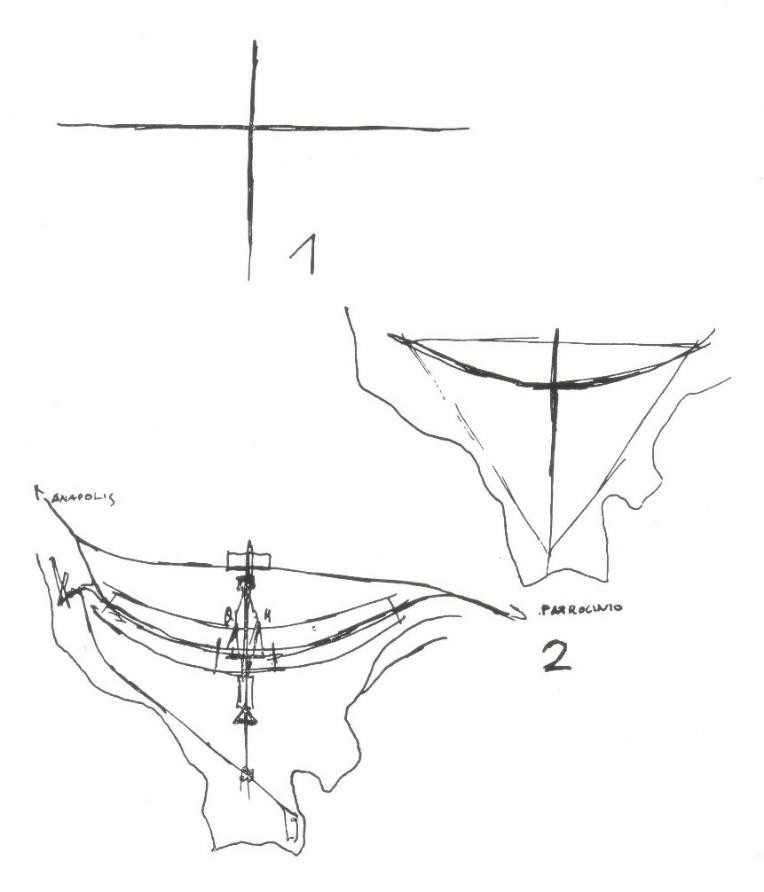
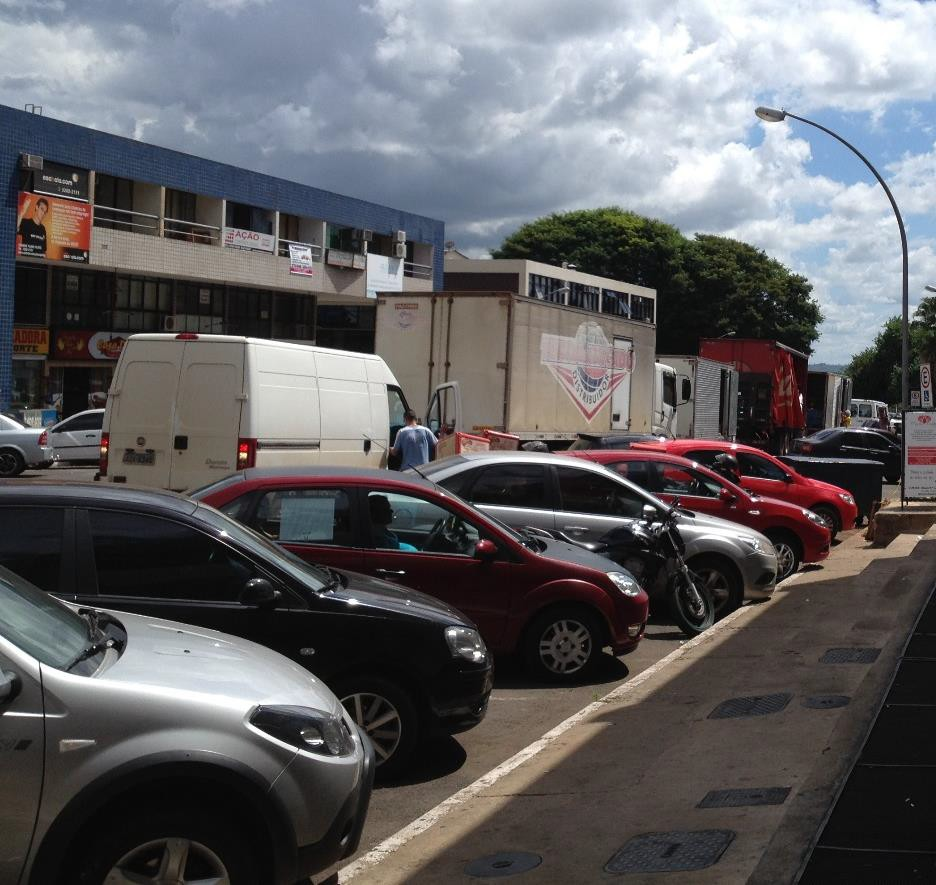
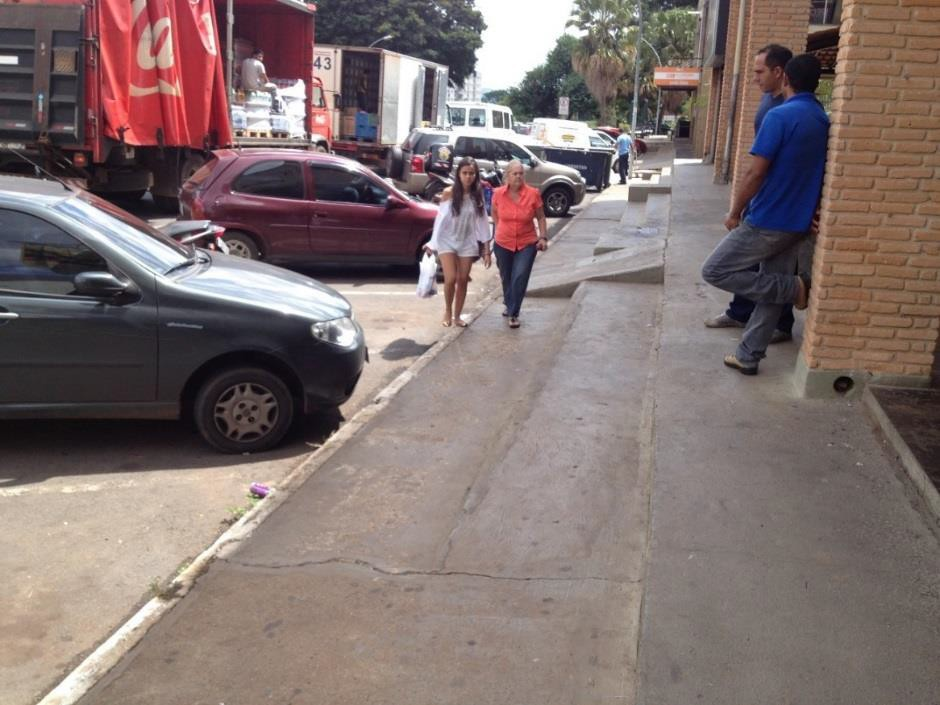
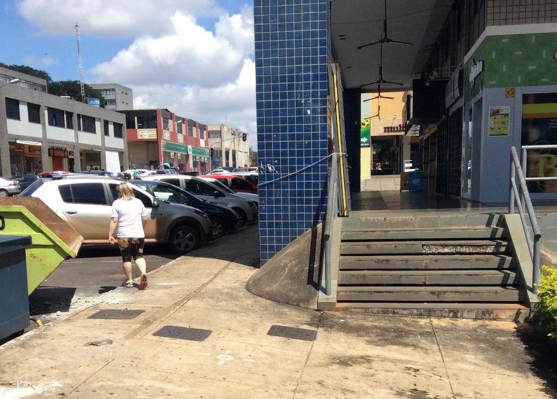
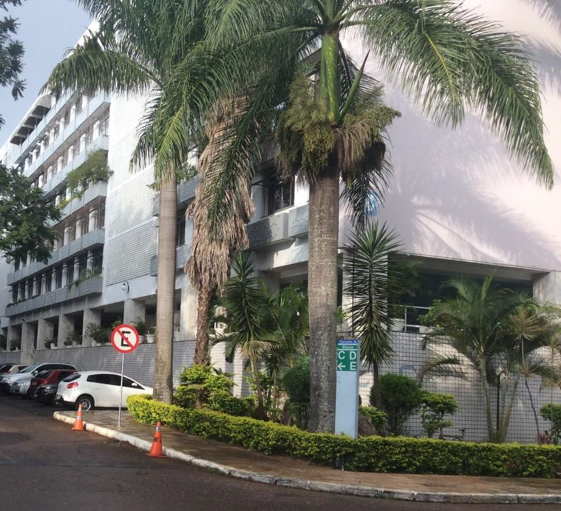

# Resumo

O presente artigo versa sobre os espaços-públicos de Brasília, com
ênfase nas "ruas" tal como hoje se encontram, e em suas "superquadras".
Trata-se de um estudo positivo, com base em dados extraídos da
realidade. Não se trata de aplicar teorias adrede formuladas ou de criar
uma nova teoria urbanística sobre Brasília. O objetivo deste estudo é o
de propor ajustes para estimular o uso e bem-estar das pessoas e, ao
mesmo tempo, preservar a cidade como Patrimônio Cultural da
Humanidade-UNESCO e, acima de tudo, Preservar seus méritos
indiscutíveis. Brasília está localizada no lado ocidental da bacia do
Lago Paranoá, com topografia de suave declividade, que nunca ultrapassa
5%. No entanto, quando analisamos de perto o que ocorre nas ruas e nas
superquadras, nos surpreendemos. Nas cidades brasileiras, como de resto
no mundo inteiro, as edificações se adaptam à topografia urbana, mas em
Brasília ocorre o oposto: se adapta a topografia aos prédios, o que cria
alguns distúrbios urbanísticos. O Plano Piloto de Brasília(PPB) foi
implantado, em certa medida, não como o nome indicava, um Plano Piloto,
mas como algo acabado, definitivo, como algo que inspirava profunda
veneração, o sagrado. A ideia do sagrado permaneceu ao longo do tempo,
como depreende-se em recente artigo em que Maria Elisa Costa revela:
*"Brasília "nasceu já pronta, como Minerva" e foi implantada exatamente
assim, como foi concebida\..." (sic)* (Costa, 2013), ou como no texto do
autor de Brasília: *"o que é preciso agora é compreendê- la",* como se a
cidade contivesse um enigma, um conteúdo a ser descoberto, que
justificaria o conceito da sacralidade *(Costa,*1988*).* As origens
desta ideia remonta ao próprio Relatório do PPB onde, no segundo
parágrafo lê-se: *\"\...apenas me desvencilho de uma solução possível,
que não foi procurada mas surgiu, por assim dizer, [já pronta]{.ul}"
(grifo nosso).* Prossegue o Autor, no 3º parágrafo: *"\...apesar da
espontaneidade original, ela foi, depois, [intensamente]{.ul} [pensada e
resolvida]{.ul}" (grifo nosso)* confirmando a afirmação anterior da
"coisa acabada".

Expor e analisar estas situações e suas ideias causadoras é fundamental
para que, por um lado, se possa promover a preservação da cidade em
harmonia com o crescimento socioeconômico e se opor à uma visão
puramente desenvolvimentista, que comprometa os valores intrínsecos de
Brasília.

Palavras chave: Preservação, Vias, Rua, Espaço Público

# Introdução

> "*\...eliminação de preconceitos e obstáculos arquitetônicos.*"
> (Art.227, §1º, II-Constituição, 1988)

Lucio Costa foi o vencedor do concurso nacional para o Plano Piloto de
Brasília (1957). Depois de mais de 50 anos de sua inauguração, Brasília
hoje enfrenta problemas que necessitam soluções, que não devem ser
postergadas. São questões crônicas, que afetam a vida cotidiana das
pessoas mas que, devido à complexidade e urgência das carências do
Distrito Federal, foram desde sempre consideradas de menor importância.
Brasília atingiu sua plenitude como cidade e dispõe de todas as
condições materiais, bem como o dever de confrontar, a um só tempo, os
desafios metropolitanos sem negligenciar aqueles outros que

afetam a qualidade de vida de seus habitantes, como os que dificultam
severamente os deslocamentos de pedestres nas "ruas" e, inclusive, no
interior das superquadras.

O presente artigo versa sobre os espaços-públicos de Brasília, com
ênfase nas "ruas" do Plano Piloto, tal como hoje se encontram. Por se
tratar de cidade tombada pelo IPHAN e considerada Patrimônio Cultural da
Humanidade pela UNESCO, aflora aqui uma questão conceitual: trata-se de
um estudo positivo, com base em dados extraídos da realidade, com vistas
a um entendimento descompromissado e proativo dos espaços públicos, das
ruas de Brasília. Não se trata de aplicar teorias adrede formuladas ou
de criar uma nova teoria urbanística sobre Brasília, pois como sugere o
Mestre *"o que é preciso agora é compreendê- la." (Costa,*1988)

Este *paper* é baseado na pesquisa conduzida pelo autor, com a
participação de 25 alunos do Curso de Arquitetura e Urbanismo, Centro
Universitário de Brasília-UniCEUB

# Desenho urbano

Como didaticamente descrito no Relatório do Plano Piloto de Brasília
(PPB), Lucio Costa, no processo do desenho urbano, concebeu em primeiro
lugar dois grandes eixos contidos num triângulo equilátero, como nos
traçados reguladores de uma cidade-ideal, na tradição que remonta a
Vitruvius e que teve uso generalizado no Renascimento, com Alberti,
Filarete, Scamozzi dentre outros. (Imagem 1)

> O tema do triângulo equilátero comparece novamente na composição dos
> edifícios da Praça dos Três Poderes, como "*vinculado à arquitetura da
> mais remota antiguidade, a forma elementar apropriada para
> conte-los."* (Costa, 9)
>
> Os setores residenciais foram colocados ao longo do eixo arqueado de
> "*função circulatória tronco*" (Costa, item 3). Imbuído das teses
> modernistas, em especial dos conceitos de Le Corbusier "*houve o
> propósito de aplicar os princípios francos da técnica rodoviária"*, e
> prossegue com a descrição da "*rede geral do tráfego de
> [automóvel]{.ul}*" (Costa, item 8, grifo nosso).

Imagem 1- Croquis de Lucio Costa, Relatório do Plano Piloto de Brasília.

> 

# O processo de implantação

O desenho do Plano Piloto de Brasília (PPB), descontado seu mérito
indiscutível, no processo de desenvolvimento e implantação foi
modificado, ajustado, adaptado às condições locais, sob vários aspectos,
sem nunca perder seu traçado original. No entanto, o projeto de Lucio
Costa foi implantado, não como o nome indicava, um plano piloto, mas
como algo acabado, definitivo, intocável, como algo que inspira profunda
veneração, com a aura do sagrado. Isto se deve a vários fatores, não
propositais mas sim, incidentais. Destacamos alguns dentre eles:

-Em parte, isto se explica pela urgência dos prazos extremamente exíguos
para a inauguração em 21/abril/1960, o que induzia a se considerar o PP
como um quase projeto- executivo, sem tempo para maiores ajustes;

> -Em parte, isso se deve às elegantes manifestações de Lucio Costa, que
> reforçava em seus inúmeros artigos, cartas e comentários a ideia da
> "coisa acabada", como no próprio Relatório do PPB, onde no segundo
> parágrafo lê-se *\"\...apenas me desvencilho de uma solução possível,
> que não foi procurada mas surgiu, por assim dizer, [já pronta.]{.ul}"
> (grifo nosso).* Prossegue o Autor, no 3º parágrafo *"\...apesar da
> espontaneidade original, ela foi, depois, [intensamente pensada e
> resolvida]{.ul}" (grifo nosso),* confirmando a afirmação anterior.

-Em parte pelo fato de que a Divisão de Urbanismo funcionava no Rio de
Janeiro até 1964, afastada do contato real, tangível, do que acontecia
ao nível do solo. Até 1966 Lucio Costa ainda participou do Conselho de
Arquitetura e Urbanismo, sempre no Rio de Janeiro. A partir desta data
não mais participou do desenvolvimento do PPB, salvo em ocasiões
especiais como no Seminário de 1974, promovido pela então Comissão do
Distrito Federal e, posteriormente, em 1985, a convite do Governador,
com a série de cartas e sugestões, consolidadas sob o título "Brasília
Revisitada".

-Em grande parte, pela maciça campanha publicitária promovida pelo
Presidente JK, em que Lucio Costa era colocado no pedestal dos gênios;

-Em parte, pelo fato de que os jovens arquitetos que trabalhavam na
equipe de detalhamento do PPB, viam Lucio Costa como um mestre de
cultura inatingível, um gênio pouco expansivo, retraído, o que inibia a
crítica.

> A ideia do sagrado permaneceu ao longo do tempo, como depreende-se no
> texto de Lucio Costa sobre Brasília: *"o que é preciso agora é
> compreendê-la",* como se a cidade contivesse um enigma a ser
> descoberto *(Costa,*1988*),* ou como em artigo recente em que Maria
> Elisa Costa, sua filha e reconhecida porta-voz, revela: *"\...foi o
> arquiteto Italo Campofiorito que "captou" a essência da proposta de
> Lucio Costa - Brasília "nasceu já pronta, como Minerva", e foi
> implantada exatamente assim, como foi concebida\...*" (sic) (Costa,
> 2013)

Vale ressaltar que o viés de intocabilidade teve o grande mérito de
ajudar a preservar a concepção original do PPB, em meio a condições
políticas e culturais à época que, de alguma forma ameaçavam a própria
existência de Brasília. A concepção do PPB, que se diferenciava da
morfologia de todas as demais cidades brasileiras foi preservada,
precisamente, pela sua intransigente defesa mas teve um preço, causou
algumas perturbações urbanísticas.

# Vias de acesso motorizado Vs. ruas

Tivesse seguido o conceito original, as ruas locais de Brasília, não
passariam de \"*vias de acesso motorizado*\", vias de serviço para o uso
exclusivo e eficiente do tráfego de automóveis. (Costa, item 16). Um
conceito em linha com a Carta de Atenas, CIAM-1933, na qual a rua não é
mais um espaço para uso das pessoas. No Relatório do PPB, Lucio Costa
não emprega palavra rua, nem suas correlatas como avenida, mas via,
eixo, pista ou estrada. Por uma vez usou a palavra rua, ao se referir a
"rua do Ouvidor", por se tratar de um nome e uma vez a palavra alameda
(\...de contorno) por faltar no repertório funcionalista uma palavra com
este cunho bucólico. Em Brasília foi, inclusive, abolida a palavra rua,
nunca empregada pelo

Governo do Distrito Federal. As \"*vias de acesso motorizad*o\" não
recebem nomes ou números de identificação, mas sim os números das
superquadras adjacentes. Neste *paper* usamos a expressão vias-locais
para distingui-las de ruas.

As superquadras foram projetadas com um pequeno comércio para suprir as
necessidades diárias dos moradores, com padaria, açougue, mercadinho,
etc., voltados para o interior das superquadras. Uma tipologia tipo *fin
de siécle XIX*. Ocorre que logo nos primeiros 7-8 anos, a incipiente
vida urbana foi forte o suficiente para subverter esta diretriz: pouco a
pouco, mas firmemente, as lojas mudaram de sentido, abriram suas portas
para as vias-locais, alterando profundamente sua relação com a
superquadra. De certa maneira, a transgressão humanizou as via-locais,
aproximando-as do conceito de rua. Estas "comerciais", como são
chamadas, não chegam a constituir ruas propriamente ditas mas, tão
somente, pequenos trechos não conectados entre si, homogêneos em sua
morfologia. Uma versão acanhada de ruas, pode-se dizer (Imagem2)

> As \"*vias de acesso motorizado*\" foram construídas com 4 faixas,
> flanqueadas em ambos os seus lados pelos comércios. Os estacionamentos
> foram dimensionados para o automóvel, sem previsão para
> carga-descarga. No entanto, o abastecimento do comércio é realizado
> por caminhões que guardam dimensões de 7 a 9 ou 10m que, ao estacionar
> invadem uma faixa de rolamento. Isto ocorre dos 2 lados da via,
> durante o horário comercial. Devido a estas invasões o tráfego
> torna-se congestionado e tumultuado, criando uma barreira para
> pedestres. Urge restaurar a qualidade de domínio público das ruas,
> referido por Hannah Arendt: \"*domínio público como um mundo comum,
> reúne-nos na companhia uns dos outros e ainda nos impede de cair uns
> sobre os outros, por assim dizer*\" (Arendt, 1958). Falta muito a
> fazer para transforma-las em pequenas ruas na acepção da palavra, com
> condições de uso pleno pela população e "*com a eliminação de
> preconceitos e obstáculos arquitetônicos*" (Art.227,

§1º, II-Constituição, 1988).

> Imagem 2- **"**Via-local"
>
> 

# As calçadas Vs. topografia

Brasília está localizada no lado ocidental da bacia do Lago Paranoá, com
topografia de suave declividade, que nunca ultrapassa 5%. O projeto do
Plano Piloto dispôs as vias-locais direcionados leste/oeste, posição em
que sempre cortam as curvas de nível. O comprimento destas vias é de
aprox. 180m, sendo que os desníveis chegam, nos casos extremos a 9,0m
mas a maioria fica entorno de 4,0m. No entanto, quando analisamos de
perto o que ocorre em suas calçadas nos surpreendemos. Nas demais
cidades brasileiras, como de resto no mundo inteiro, os prédios
adaptam-se à topografia, mas nas ditas comerciais ocorre exatamente o
oposto: a topografia adapta-se aos prédios. Assim, as calçadas
fronteiras aos prédios adquirem horizontalidade ao longo da extensão do
lote, desprezando a declividade da via e criando "*obstáculos
arquitetônicos*" referidos no texto constitucional.

> Imagem 3. Calçadas ou degraus ?
>
> 

Na Asa Norte, os edifícios das "comerciais" são muito diferentes de sua
contraparte na Asa Sul, onde subsiste a concepção original de Lucio
Costa. Os prédios são maiores e galeria obrigatória em todo o seu
perímetro, galerias horizontais. Em relação à declividade da rua, os
desníveis adquirem maior altura e surgem famigeradas escadas,
antiestéticos e inseguros apêndices, que impedem a livre circulação de
cadeirantes, de carinhos de crianças, etc.

> Poucos edifícios tem rampas mas, mesmo estas, constituem obstáculos
> devido a não seguirem as normas de segurança. Aqui estamos tratando da
> menor escala de planejamento urbano. Vale citar Jan Gehl: *\"this is
> the city as the people who will use city space experience it at eye
> level. It is not the large lines ... or spectacular placement of
> buildings that are interesting here, but rather the quality of human
> landscape.\" \* (Gehl, 2010)*
>
> Imagem 4- Escadas Vs. Calçadas
>
> 

Na Asa Sul, a maioria das calçadas em frente das lojas são construídas
horizontalmente, enquanto que a "rua" apresenta uma certa declividade.
Consequentemente, em cada linha virtual de limite entre as lojas surge
um pequeno degrau, ou uma rampinha, o que obriga os pedestres a cuidados
redobrados para não sofrerem acidentes.

> Imagem 5- Desnível: pedras portuguesas Vs. cimentado
>
> 

-   \"Esta é a cidade como as pessoas que irão usar o espaço urbano
    > experiênciam-no ao nível dos olhos. Não são as grandes linhas \...
    > ou colocação espetacular de edifícios que nos interessa aqui, mas
    > sim a qualidade da paisagem humana\". (tradução livre do autor)

A causa destes distúrbios na sintaxe urbana é uma só: a legislação
permite a alteração do gradiente das calçadas, sem atentar para a
agressão urbanística decorrente. A administração não se responsabiliza
pela pavimentação das calçadas, como também não fiscaliza as normas
existentes. Cada loja coloca o acabamento que preferir, ocorrendo
mudanças bruscas de materiais, por vezes materiais derrapantes.

# As superquadras Vs. Topografia

> A superquadra residencial (280 x 280m) constitui um dos aspectos mais
> importantes de Brasília e é muito valorizada pela população. No
> Relatório do PPB Lucio Costa recomenda: . "*dentro destas superquadras
> os blocos residenciais podem dispor-se de maneira mais variada,
> obedecendo porém a dois princípios gerais: gabarito máximo uniforme,
> talvez seis pavimentos e pilotis\..." (Costa, 16).* Mais adiante
> acrescenta*: "As quadras seriam apenas niveladas\..." (*Costa, 23).
> Note-se que as superquadras podem apresentar desníveis de 8, 9 ou até
> 11 metros. Estes 2 princípios gerais, aplicados mecanicamente
> resultaram, em inúmeros casos, em aterros enormes, que colocaram o
> pavimento térreo com pilotís, paradoxalmente, a mais de 3,00 metros
> acima do gramado circundante.
>
> Imagem 5- Pilotís a mais de 3m acima do espaço circundante
>
> 

Os prédios residenciais nas superquadra tem altura fixada em seis
pavimentos, mais pilotís, sem margem de variação. A disposição dos
blocos residências nas superquadras briga, de certo modo, contra a
topografia do sítio, devido ao fato de que a legislação não contém
previsão de qualquer tipo de interferências morfológica no conceito de
pilotís. Ao invés de se adotar altura variável para os pilotís
ajustando-o ao perfil do terreno, o que poderia ultrapassar a altura
fixada, arquitetos e engenheiros optam, ao contrário, por modificar o
perfil do terreno ajustando-o ao edifício: altera-se a topografia para
obter uma plataforma horizontal para a edificação.

A ideia de facilitar o fluxo de pessoas ao nível do solo com o emprego
obrigatório de pilotis, transforma-se em seu oposto, quando poderia ter
altura variável e se acomodar suavemente no terreno, como já acontecia
em inúmeros projetos de arquitetura na época. Percebe-se aqui,
novamente, o auto impedimento, a censura prévia e falta de flexibilidade
do legislador. As causas desta inflexibilidade são as que já foram acima
comentadas.

# Comentário final

Nas cidades brasileiras, como de resto no mundo inteiro, os edifícios se
adaptam à topografia. Lucio Costa procedeu da mesma maneira no
planejamento geral da cidade. Entretanto, no plano local observa-se a
ocorrência de uma luta entre topografia e edificações, criando sérias

perturbações urbanas. É importante discutir estas questões para que se
possa promover a adequada Preservação de nosso patrimônio, e para que se
possa confrontar a uma visão puramente desenvolvimentista, que venha a
comprometer os valores intrínsecos da concepção de Brasília.

# Referências

Arendt, Hannah. \"*The Human Condition* \". The University of Chicago
Press. Ch.7 The Public Domain, 1958, pg 64.

> Costa, Lucio. *Relatório do Plano Piloto de Brasília*, ArPDF,
> CODEPLAN, DePHA, Brasília: GDF 1991. item 16.

. Considerações fundamentais \[O Estado de São Paulo, 13 jan.1988\]. In:
Costa, Lucio. *Registro de uma vivência*. São Paulo, Empresa das Artes,
1995, p.323.

> Costa, Maria Elisa. "*A preservação de Brasília, as escalas urbanas e
> a Portaria 314*". Correio Braziliense, 2013, **p.**

Gehl, Jan. "*Cities for People*". Washington: Island Press, Ch. The
Brasilia Sindrome, 2010, pg.195.
