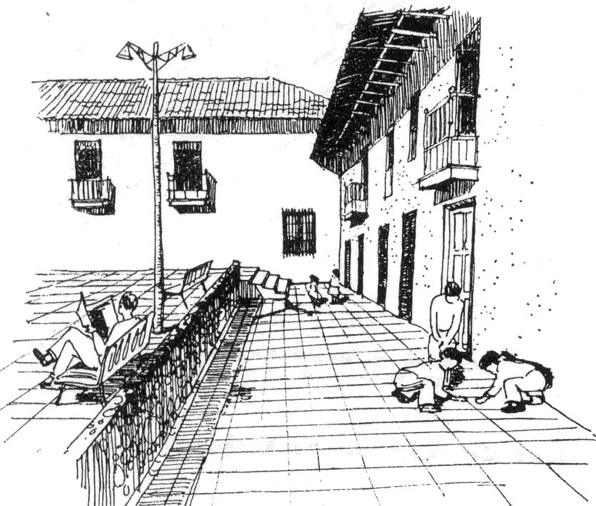
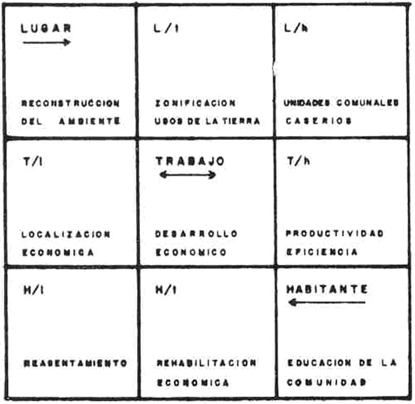

# Resumo

Esta comunicação busca discutir a atuação e experiência profissional do
arquiteto peruano Eduardo Neira Alva, em especial, no meio profissional
brasileiro entre os anos 1967 e 1974, período no qual trabalhou como
Coordenador da "Missão" enviada pelo BID à capital baiana a qual criou o
Conselho de Desenvolvimento do Recôncavo (CONDER) órgão responsável pela
elaboração de vários projetos pensando no planejamento e desenvolvimento
da região. A necessidade de enfrentar os problemas do subdesenvolvimento
da Bahia passando da escala da cidade (Salvador) à regional (Recôncavo)
ou mesmo, aplicar o conceito de "estratégia" com a finalidade de
dinamizar o desenvolvimento do Recôncavo foram algumas das suas
principais contribuições. Com isso, ele afirmava que era possível passar
do plano teórico à elaboração de princípios e políticas operacionais
reais.

Palavras-chave: Eduardo Neira Alva, Bahia, Planejamento, Urbanismo

# Abstract

This paper discusses the performance and experience of the Peruvian
architect Eduardo Neira Alva, in particular, in the Brazilian
professional environment between the years 1967 and 1974, period in
which he worked as Coordinator of the \"Mission\" sent by the IDB to
Salvador which created the *Conselho de Desenvolvimento do Recôncavo*
(CONDER) agency responsible for several projects thinking in planning
and development of the region. The need to face the problems of
underdevelopment of Bahia passing the scale of the city (Salvador) to
regional (*Recôncavo*) or even apply the concept of \"strategy\" in
order to boost the development of the *Recôncavo* were some of his major
contributions. With this, he claimed that it was possible to pass of the
theoretical level to the elaboration of principles and real operating
policies.

Keywords: Eduardo Neira Alva, Bahia, Planning, Urbanism

# Apresentação

É possível afirmar que conhecemos mais da experiência arquitetônica e
urbanística latino-americana através do "olhar estrangeiro"1 do que do
próprio olhar dos profissionais locais. Esta ideia foi acentuada pela
publicação e circulação, entre as décadas de 1940 e 1950, de uma
importante bibliografia que privilegiava e reforçava as conexões
norte-sul2. Mas, qual seria o lugar e a possível relevância das conexões
profissionais sul-sul? Qual o lugar das trocas latino-americanas na
história da arquitetura e do urbanismo? O que se sabe das articulações,
experiências e construção

> 1 Como afirma Nelci Tinem no livro *O alvo do olhar estrangeiro. O
> Brasil na historiografia da arquitetura moderna* (2006).
>
> 2 Entre eles, *Brazil Builds* (1943) de Philip Goodwin; *A Decade of
> New Architecture* (1951) de Sigfried Giedion; *Latin American
> Architecture since 1945* (1955) de Henry-Russell Hitchcock; *Modern
> Architecture in Brazil* (1956) de Henrique Mindlin, entre outros.

de redes profissionais latino-americanas na/da América Latina?3 A
presente comunicação que tem como finalidade compreender a trajetória
profissional do arquiteto peruano Eduardo Neira no meio profissional
brasileiro, em especial, no que diz respeito as suas contribuições para
o planejamento urbano e regional na Bahia, onde atuou, como
representante do Banco Interamericano de Desenvolvimento, da criação do
Conselho de Desenvolvimento do Recôncavo (CONDER), órgão estadual
encarregado da elaboração de vários projetos que tinham como objetivo
racionalizar o processo de desenvolvimento do Bahia. Para entender as
preocupações de Neira nesses temas valemo-nos da análise de uma série de
artigos, publicados em eventos nacionais internacionais, nos quais ele
discute suas bases teóricas (produto da sua experiência no Peru, na
Venezuela e no Brasil) assim como sua posição sobre o ideário
desenvolvimentista.

# Formação, possibilidades e consolidação profissional no Peru

> Eduardo Neira Alva formou-se no Departamento de arquitetura na então
> *Escuela Nacional de Ingenieros* (1942-1948), hoje *Universidad
> Nacional de Ingeniería*. Ainda, na condição de estudante, ele
> participou da formação da *Agrupación Espacio* (1947), vanguarda
> arquitetônica e urbanística peruana ligada ao movimento moderno e,
> mais precisamente, ao ideário dos CIAMs. Sua participação nesse grupo
> de

profissionais deu-lhe projeção no meio local, e isso se deve, em grande
medida, à publicação, de artigos com temáticas e conteúdos controversos
para a época4, dentre as quais podemos destacar: "Los monumentos
históricos", publicado no jornal El Comercio em 30.09.1948, no qual
criticava a posição dos arquitetos mais conservadores, que defendiam que
a área central da capital peruana não deveria estar sujeita a processos
de mudança "naturais", impossibilitando a proposta de uma arquitetura
"nova" em contextos históricos. Para sustentar e ilustrar sua posição e
argumento, Neira destacou alguns exemplos internacionais bem sucedidos
de intervenção, dentre os quais o projeto de Oscar Niemeyer para o
Grande Hotel de

Ouro Preto (1940) ganhou destaque.

> Seu desempenho como estudante na graduação garantiu-lhe a primeira
> *Medalla de Honor* outorgada pela *Sociedad de Arquitectos del Perú*,
> em 1948. É perceptível, tendo como base suas publicações, o seu
> interesse, a partir desse momento, por temas urbanísticos e de
> planejamento urbano. De fato, sua vida acadêmica como docente teve
> início efetivamente a partir do momento em que ele se vincula ao
> *Instituto de Urbanismo* da *Escuela de Ingenieros del Perú*, do qual
> foi *Jefe de Trabajos Prácticos* na disciplina Planejamento Regional
> (1951). Nesse mesmo ano, ele obteve uma bolsa de estudos do *British
> Council* para realizar um mestrado na Universidade de Liverpool, no
> *Deparment of Civic Design*, na Inglaterra, considerado por ele como a
> pátria do urbanismo moderno. Após concluir seus estudos de pós-grado
> em 1952 e
>
> 3 Parte dessas ideias foram trabalhadas no livro *Urbanismo na América
> do Sul: circulação de ideias e constituição do campo* (2009),
> organizado por Marco Aurélio A. de Filgueiras Gomes. Também nessa
> linha podemos destacar o artigo *Pan-americanismo e seu impacto na
> institucionalização do urbanismo no Brasil: 1920-1945* (1998) de
> Margareth Pereira e o livro *Arquitetando a "Boa Vizinhança":
> Arquitetura, Cidade e Cultura nas relações Brasil-Estados Unidos,
> 1876-1945* (2010) de Fernando Atique.
>
> 4 A *Agrupación Espacio* teve um espaço semanal reservado no jornal
> *El Comercio* entre 1947 e inícios
>
> da década de 1950. Eduardo Neira foi um dos responsáveis pelas
> matérias publicadas junto aos arquitetos Luis Miró Quesada e Adolfo
> Córdova. Além disso, a *Agrupación* publicou sua própria revista, a
> partir da própria iniciativa de Neira, a qual se manteve em circulação
> entre 1949 e 1951 (MARTUCCELLI, 2012, p. 88).

obter o título de mestre em *Urban Design*, viajou à Itália onde se
matriculou em um curso de verão do CIAM, em Veneza (APUNTES, 1952).

> Após retornar a Lima, Neira dividiu sua atividade profissional em duas
> frentes: como projetista e como funcionário em instituições públicas e
> privadas. Na primeira, destacamos seus projetos para o campus da
> *Pontificia Universidad Católica del Perú* (1953), o Plano Regulador
> para a cidade de Cajamarca (1954) (Fig. 1) e a Casa Neira (final da
> década de 1950). Já na segunda frente, ele assumiu o cargo de Chefe do
> Departamento de Urbanismo do Ministério de Obras Públicas (1953-1959),
> formou parte da *Sociedad de Arquitectos del Perú* (1954-1955) e foi
> vice-presidente do *Instituto de Urbanismo* da *Universidad Nacional
> de Ingeniería* (1959-1960).
>
> 
>
> Figura 1. Proposta de espaços públicos para o Plano Regulador de
> Cajamarca elaborado por Eduardo Neira Alva em parceria com os
> arquitetos Fernando Belaunde Terry, Alfredo Pérez G. e Roberto
> Vallejo. Fonte: ONPU, 1956

Paralelamente, a essas atividades, iniciou-se um processo de reflexão
teórico em torno, basicamente, a três temas: a cidade, a moradia e o
desenvolvimento regional. Pode-se afirmar que os assuntos relacionados à
moradia no Peru era um tema que conhecia bem, porém, ele vai dotá-lo de
um novo enfoque. Já os outros dois temas foram, em principio,
decorrentes da sua formação na Europa uma vez que os termos e ideias
utilizadas no meio profissional peruano constituem-se como sendo
inéditos. Ele afirmava, por exemplo, que a cidade devia ser considerada
como um fenômeno de "ecologia urbana" (NEIRA, 1954, p. 12) e que para a
solução ao problema da moradia:

> Habría que buscar el aumento de la productividad, crear nuevas fuentes
> de riqueza, buscar una mejor distribución de la renda nacional,
> aumentar la capacidad del mercado interno y el poder adquisitivo de la
> población, es decir cambiar la estructura económica del país, superar
> el absurdo y ciego centralismo que agobia al país (NEIRA, 1957, p. 7).

Nesse contexto, o artigo "El desarrollo regional y su vinculación con la
arquitectura"

destaca-se e pode ser entendido como uma tentativa de Neira por
organizar suas ideias e inquietudes sobre esses temas de forma mais
teórica do que crítica. Assim, influenciado pelas teorias de Patrick
Geddes, ele afirmava que a cidade não era mais do que o resultado da
relação do homem com o meio ambiente. Numa escala maior, a

regional, era necessário, segundo ele, levar em consideração as relações
complexas de três elementos "Lugar-Trabajo-Habitante"5 os quais
correspondiam, segundo ele, à Geografia, Economia e Antropologia (NEIRA,
1960, p. 21) (Fig. 2). Para Neira, essa trilogia serviria como
orientação aos arquitetos diante da "sociedade moderna" na medida em que
estes seriam os "interpretes de la expresión formal de la cultura de
nuestros dias" (ALVA, 1960, p. 25). Estes temas, como veremos mais
adiante, serão

retomados, revisados e aplicados em outros contextos.

> 
>
> Figura 2. Diagrama de "rotação de vida" proposto por Geddes e
> reinterpretado por Neira. Fonte: NEIRA, 1962

# Em busca de novas perspectivas: do CENDES ao BID

No Peru, Eduardo Neira havia conquistado respeito como *expert* em
planejamento urbano e regional. Isto permitiu que fosse convidado para
ministrar palestras sobre esses temas em diversos eventos nacionais. Por
outro lado, seu cargo no Ministério de Obras Públicas do país lhe
possibilitou viagens pelo continente, e fora deste, para participar de
seminários afins6, um deles se converteria num divisor de águas na sua

trajetória profissional.

Em novembro de 1956, Neira participou da reunião constitutiva da
Sociedade Interamericana de Planejamento (SIAP), em Bogotá. Na ocasião
ele conheceu o político exiliado em Porto Rico, Luis Lander7. Três anos
depois Lander ocupou o

> 5 Estes três elementos eram resultados da trilogia "Place, Work e
> Folk" proposta por Geddes no livro
>
> *Cities in evolution*.
>
> 6 Em 1955 ele recebeu uma missão de estudos na França das Nações
> Unidas (APUNTES, 1955).
>
> 7 Lander, à época, trabalhava na *Junta de Planificación* de Porto
> Rico. Além disso, em março desse mesmo ano, durante o *Seminario
> Internacional sobre Educación de Planificación* realizado nesse país,

cargo de Diretor do *Banco Obrero* durante a segunda fase da
modernização venezuelana. A possibilidade de Neira visitar Caracas
surgiu de um convite de Lander para ele avaliasse a *Oficina de
Planificación* dessa entidade ainda em 1959 (DARWICH, 2005, p. 155). Uma
das conclusões de Neira apontava para a falta de pessoal especializado
em planejamento que, no entanto, poderia ser minimizado caso fosse
criado um programa de capacitação específico.

> Assim, iniciram-se as conversações com o arquiteto Julián Ferris,
> diretor da *Facultad de Arquitectura y Urbanism*o da Universidade
> Central de Venezuela (UCV), para a criação de um instituto de
> planificação. Nesse assunto, Neira tinha uma experiência concreta na
> incorporação do *Instituto de Urbanismo del Perú* à *Escuela Nacional
> de Ingenieros* em 1949. Além disso, naquele momento ele era
> vice-presidente desse centro de estudos8 (HUAPAYA, 2012, p. 154). Após
> receber apoio da universidade, da *Oficina Central de Coordinación y
> Planificación* (CORDIPLAN), da *Sociedad Venezolana de Planificación*
> e da SIAP, Neira elaborou as bases para a criação do *Centro de
> Estudios del Desarrollo* (CENDES)9 (DARWICH, 2005, p. 155-156). O

CENDES constitua-se no primeiro programa de pós-graduação da UCV e
pretendia formar um novo "funcionário de la administración pública": o
planejador (NEGRÓN, 2012, p. 151). De fato, essa ideia guarda estreita
relação com os temas que vinham sendo discutidos na SIAP, em especial,
no 2° Encontro (1958) e 3° Encontro (1960) onde se destacava a
contribuição do planejador para o desenvolvimento econômico e social.

Diante dessa nova empreitada profissional e em vista das estreitas
expectativas no Peru (NOTAS, 1960), Neira decide mudar-se para a
Venezuela. No CENDES assumiu a cátedras das disciplinas de Economia
Regional e de Habitação Popular. Apesar de, nessas décadas, a Venezuela
já contar com uma importante experiência em matéria de planejamento
urbano, com Neira, a visão meramente física pôde ser superada ao ser
incorporado em seu discurso nomes como os de Burgess, Tinbergen,
Perroux, Alonso, Friedmann, Paelinck, Isard, entre outros (NEGRÓN, 2005,
p. 151). Ainda, em 1962 ele criou a revista *Cuadernos de la Sociedad
Venezolana de Planificación*, permitindo-lhe refletir sobre temas como
as relações homem/natureza, propostas para moradias nos trópicos e,
relações entre a organização urbana e as estruturas socioeconômicas e
culturais (NEGRÓN, 2005, p. 151). Alguns de seus artigos publicados
deste período foram "Transformación del habitat humano", "Problemática
del desarrollo regional" e "Diseño de viviendas populares en el trópico

húmedo"10.

Após essa experiência venezuelana, Neira muda-se para Washington, onde
assumiu a cargo de Assessor em Desenvolvimento Urbano (1965-1974) no
Departamento de Planejamento Político do Banco Interamericano de
Desenvolvimento (BID). Naquele momento o BID passava por reformas na sua
política de desenvolvimento ao

> havia sido indicado para formar o Comitê *ad hoc* que estava
> encarregado de elaborar os lineamentos para a criação da SIAP.
> Posteriormente, ele seria presidente dessa instituição entre 1960 e
> 1964.
>
> 8 Neira ocupou esse cargo entre 1959 e 1960. O IUEI teria uma projeção
> internacional a partir de 1961 com o apoio da OEA, a Universidade de
> Yale e as Nações Unidas (HUAPAYA, 2012, p. 163).
>
> 9 O CENDES iniciou as suas atividades em março de 1961.
>
> 10 O primeiro (1961) e o terceiro (1968) foram publicados na revista
> *Espacio y Forma* da *Facultad de Arquitectura y Urbanismo* da UCV. O
> segundo apareceu na revista *Cuadernos de la Sociedad*
>
> *Venezolana de Planificación* (1968). Parte desses temas serão
> retomados, na condição de *expert*, anos depois, no livro "Metrópoles
> (In)sustentáveis", publicado em 1997.

incorporar outras atividades como as de moradia e saneamento básico.
Isto significou que fossem consideradas propostas de ajuda econômica e
apoio técnico a projetos que levassem em consideração "planes integrales
de desarrollo urbano" (os quais deveriam servir para experimentação e
demonstração das ideias desenvolvimentistas) com a finalidade de
melhorar o planejamento, administração e financiamento de inversões
urbanas (NEIRA, 1970a, p. 294). Outro aspecto dessa nova política foi o
reconhecimento dos "asentamientos urbanos espontáneos" como sendo
elementos potencialmente dinamizadores e positivos da própria sociedade
(NEIRA, 1970a, p. 295).

# Ampliando escalas. Eduardo Neira e a Bahia

No Brasil, a segunda metade da década de 1960 criou um cenário favorável
para a recepção do ideário desenvolvimentista. Além da preocupação do
Governo Federal pelas áreas metropolitanas na Constituição Federal de
196711 (CONDER, 2014) o Governo Estadual e mais especificamente Luiz
Viana Filho, governador da Bahia (1967-1971), acreditava que a
estabilidade econômica e o desenvolvimento da Bahia

seriam consequência e resultado de sua industrialização. Para isso,
segundo ele, as ações necessárias deviam ser previamente estudadas e
planejadas, no entanto, a Bahia carecia de especialistas nesse ramo
(FILHO, 1984, p. 17). Por essa razão e em vista, também, da falta de
recursos econômicos, ele decidiu solicitar apoio ao Banco Interamericano
de Desenvolvimento (BID) ainda nos primeiros meses de ter iniciado sua
gestão. Confirmado o apoio, o BID comprometeu-se em enviar uma "Missão",
coordenada por Eduardo Neira Alva12, a qual analisaria, avaliaria e
proporia soluções

aos problemas socioeconômicos da capital baiana e da sua zona de
influência.

Os resultados do relatório elaborado pela Missão, entregues em agosto de
1967, assinalavam de que embora a Bahia cumprisse um papel importante
para a economia do país, mais especificamente através da ação da
PETROBRAS, não se havia beneficiado desses fatores de mudança13. Pelo
contrario, existiam "graves problemas de desemprego, insuficiência
alimentar, agricultura de baixa produtividade,

concentração de propriedade da terra, dependência de mercados externos,
desigualdade social e industrialização limitada e incompleta" (FILHO,
1984, p. 18). Além disso, segundo Neira, isto evidenciava um processo de
desenvolvimento "hacia adentro" (NEIRA, 1970b, p. 9). Para deter esse
quadro, a Missão considerava alguns aspectos a serem realizados, dentre
eles, podemos destacar dois: investir no setor industrial (ampliando as
atividades geradas pelo Complexo Industrial de Aratu), em especial o
petroquímico e; a necessidade de enfrentar essa problemática passando da

> 11 Anteriormente, a visão regional do país havia sido plasmada pelo
> Governo Federal quando da criação do Banco do Nordeste do Brasil
> (BNB), em 1952, e da Superintendência de Desenvolvimento do Nordeste
> (SUDENE), em 1959. Além disso, na Bahia havia sido criada a Comissão
> de Planejamento Econômico (CPE), em 1955.
>
> 12 Eduardo Neira chegou na Bahia em junho de 1967. Além dele, a Missão
> esteve constituída por Alfred Thieme (BID), Benjamin Hopenhayn
> (ILPES), David Tejada (OPS), Victor Ayub (OPS), Pedro Sisnado Leite
> (BNB) e Glauco Molibeu (SUDENE). O Governo da Bahia contou com o apoio
> de outros organismos nacionais e internacionais como o Instituto
> Latino-Americano de Planejamento Econômico e Social (ILPES) e a
> Organização Pan-Americana da Saúde (OPS).
>
> 13 Segundo Neira, as atividades da PETROBRAS caracterizavam-se como
> sendo "Exógenas" na medida em que sua administração era controlada
> desde o Rio de Janeiro e Brasília. Além disso, ele
>
> afirmava que nesse contexto a Bahia vinha cumprindo somente a função
> de centro exportador de matérias primas consolidando, ainda mais, o
> parque industrial Centro-Sur (NEIRA, 1972, p. 243-245).

escala da cidade (Salvador) à regional (Recôncavo)14.

Também, a Missão sugeriu que fosse implementada infraestrutura adequada
às novas demandas regionais e que fosse criado um órgão governamental
que tivesse como finalidade racionalizar o processo de desenvolvimento
em vista da inexistência de instituições adequadas (NEIRA, 1974, p.
244-246). Em setembro do mesmo foi criado o Conselho de Desenvolvimento
do Recôncavo (CONDER), o qual seria, posteriormente, vinculado à
Secretaria de Planejamento, Ciência e Tecnologia do Governo do Estado da
Bahia. Posteriormente, Neira, ocupou o cargo de Diretor da equipe BID/
Governo do Estado da Bahia (1971-1974) encarregada da elaboração de
alguns estudos que, segundo Neira (1974, p. 244) eram decorrentes da
identificação de "setores e projetos de especial importância para
internalizar o desenvolvimento e a definição de estruturas de apoio
necessárias para o processo de desenvolvimento" tais como: o Estudo
Preliminar do Plano de Desenvolvimento Integrado da Região Metropolitana
de Salvador, a Estratégia Preliminar e Términos de Referência para o
Programa de Desenvolvimento Integral do Recôncavo, o Projeto de Produção
de Alimentos no Recôncavo Baiano, o Projeto de Remanejamento da Orla
Marítima de Salvador e a Localização do Polo Petroquímico de Camaçari.

Esse conjunto de experiências baianas visto a nível latino-americano
deve ter sido um fato relevante para a proposta da realização, em
setembro de 1970, do 8° SIAP, em Salvador, o qual teve como tema central
a "Avaliação do Planejamento para o Desenvolvimento". É provável que
esse encontro tenha sido idealizado por Eduardo Neira na medida em que
ele mantinha relações estreitas com membros da *Junta*

*Directiva* da SIAP15. A indicação da Bahia foi uma escolha chave para
discutir a aplicação das teorias desenvolvimentistas já que, segundo
Neira, naquele momento haviam somente duas experiências que haviam
chamado a atenção dos profissionais da área: a Cidade Guayana (1961), na
Venezuela, e o Recôncavo baiano (NEIRA, 1974, p. 243). Ambos os casos,
eram exemplos concretos de que era possível passar

do plano teórico à elaboração de princípios e políticas operacionais
(NEIRA, 1974, p. 239).

Na visão de Neira, o Recôncavo baiano passava por um momento de
transição que poderia ser entendido pelo passo das atividades
tradicionais de exploração para as indústrias e, o controle de processos
de crescimento até então tidos como espontâneos (NEIRA, 1972, p. 236).
Nesse sentido, um aspecto revelador, apontado por ele, é que os estudos
realizados para a Bahia foram resultado da experimentação e aplicação de
novos conceitos sobre desenvolvimento ao invés de técnicas usuais de
planejamento regional. Mais especificamente, Neira se referia ao
conceito de "estratégia", o qual foi divulgado de forma sistemática
durante o 7° SIAP (1968) e consistia em incorporar às pesquisas os
objetivos sócio-políticos e culturais da comunidade, os atores sociais
do processo de desenvolvimento, a situação economia e social e os meios
disponíveis (VÉLIZ, 1969, p. 256). Ou seja, o desenvolvimento da região
consistiria em criar meios eficazes e autônomos manipulando de forma
criativa seu meio ambiente natural, tecnológico, cultural, social e,
também, as relações com outras regiões

> 14 Grande parte das recomendações foram resultados de ações realizadas
> pelo Governo Federal e Estadual, portanto, como afirma Neira, coube à
> Missão organizá-los num contexto comum. Isso explicou, segundo ele, o
> sucesso dessas recomendações (NEIRA, 1972, p. 237).
>
> 15 Nas gestões de 1966-1968, 1968-1970 seu contato foi o Dr. Carlos
> Zuzunaga Flóres, seu compatriota e Diretor da SIAP. Na gestão de
> 1970-1972 seu contato foi o arquiteto Carlos León Williams, Diretor da
> SIAP, também peruano e antigo colega da faculdade.

(VÉLIZ, 1969, p. 264).

A partir desse conceito Neira (1972, p. 262-271) definiu cinco elementos
que deveriam ser levados em consideração para propor soluções reais para
o desenvolvimento do Recôncavo: 1. Critérios de seleção de atividades
motrizes: era necessário identificar e determinar critérios de seleção
de indústrias que permitam maior autonomia e estabilidade à região com a
finalidade de induzir atividades locais, reinvestir em benefícios e
dinamizar os mercados internos de consumo; 2. Infraestrutura de apoio: a
experiência da CIA e o projeto do então Polo Petroquímico de Camaçari
faziam prever a necessidade de infraestrutura especializada para o
futuro parque industrial; 3. Organização e equipamento da área
metropolitana: a potencialização a eficiência do transporte do parque
industrial e da própria capital baiana significava pensar num sistema de
transporte adequado e diversificado (nas escalas urbana, estadual e
federal); 4. Mudança social: um dos pontos básicos girava em torno à
educação, considerado por Neira, como a melhor inversão em longo prazo
e; finalmente, 5. Institucionalização: havia que introduzir modificações
institucionais nos meios técnicos e administrativos da região e criar
instituições responsáveis pelas informações e analise da economia
regional. Nesse cenário de mudanças e transformações Neira ressaltava a
presencia de "una elite local de empresarios y hombres públicos que han
comprendido la necesidad del cambio y han tenido la capacidad suficiente
para introducir innovaciones importantes en la organización y
tecnología" (NEIRA, 1970b, p. 15).

É interessante, também, o fato de Neira incorporar nesse ideário as
possibilidades que o turismo teria para dinamizar a economia baiana.
Isto, segundo ele, permitiria por um lado a preservação e defesa de
monumentos históricos e artísticos do Recôncavo e, pelo outro, a
inversão, melhoramento e expansão de serviços urbanos para o transporte
e lazer (NEIRA, 1970b, p. 14 e NEIRA, 1072, p. 253).

# Considerações finais

A contribuição do arquiteto Eduardo Neira Alva para o planejamento e
desenvolvimento do Recôncavo baiano e de uma maneira geral, da Bahia,
pode ser entendida, especialmente, sob três aspectos. O primeiro tem a
ver com o novo enfoque que a figura do "planejador" assume durante as
décadas de 1960 e 1970, a qual se caracterizava pela função política e
social. Em outras palavras havia que superar o enfoque somente físico e
pensar num enfoque integral. Segundo, é importante notar como o percurso
da sua trajetória profissional e acadêmica no Peru, na Inglaterra, na
Venezuela e, posteriormente nos Estados Unidos vai lhe proporcionar uma
visão ampla e privilegiada dos problemas comuns nos países do
continente. Nesse sentido seria interessante pensar até que ponto
realidades distintas influíam e retroalimentavam, ou não, durante suas
assessorias junto ao BID e na sua própria atuação e formação
profissional. E, terceiro, merece destaque sua posição sobre a
necessidade de enfrentar os problemas do subdesenvolvimento da Bahia
passando da escala da cidade (Salvador) à regional (Recôncavo) ou mesmo,
a aplicação do conceito de "estratégia" com a finalidade de dinamizar o
desenvolvimento do Recôncavo. Com isso, ele afirmava que era possível
passar do plano teórico à elaboração de princípios e políticas
operacionais reais. Finalmente, e afastando-nos do período em estudo, é
importante mencionar sua contribuição no âmbito acadêmico ao participar
da criação do Mestrado em Engenharia Ambiental Urbana da Universidade
Federal da Bahia (MEAU/UFBA), em 1997, e sua atuação docente no Programa
de Pós-Graduação em Arquitetura e Urbanismo da mesma universidade entre
1994 e

2006\.

# Referências bibliográficas

> APUNTES a mano libre. *El Arquitecto Peruano*, ano 16, n. 181-182, não
> paginado, ago./set. 1952.

. *El Arquitecto Peruano*, ano 19, n. 110-111, não paginado, jan./fev.
1955. COMPANHIA DE DESENVOLVIMENTO URBANO DO ESTADO DA BAHIA

(CONDER). Disponível em:
[\<http://www.conder.ba.gov.br/](http://www.conder.ba.gov.br/)\>. Acesso
em: 06 jan.

2014\.

DARWICH OSORIO, G. Eduardo Neira Alva: un universitario idealista que
participó en la creación del CENDES. *Cuadernos del CENDES*, ano 22, n.
58, p. 153-157, jan./abr. 2005.

> FILHO, L. V. *Petroquímica e Industrialização da Bahia (1967-1971)*.
> Brasília: Senado Federal, Centro Gráfico, 1984.
>
> HUAPAYA ESPINOZA, J. C. *Fernando Belaunde Terry e o ideário moderno
> na arquitetura e no urbanismo no Peru entre 1936 e 1968*. 2012. 319f.
> Tese (Doutorado em Urbanismo) -- Programa de Pós-Graduação em
> Arquitetura e Urbanismo, Universidade Federal da Bahia, Salvador,
> 2012.

MARTUCCELLI, E. *Conversaciones con Adolfo Córdova*. Lima: Instituto de
Investigación de la Facultad de Arquitectura, Urbanismo y Artes --
Universidad Nacional de Ingeniería, 2012.

> NEIRA, E. El problema de la vivienda en el Perú. *Informaciones y
> Memorias de la Sociedad de Ingenieros del Perú*, vol. LVIII, p. 4-16,
> jan. 1957.

. El desarrollo regional y su vinculación con la arquitectura. *El
Arquitecto Peruano*, n. 297-298-299, p. 21-25, abr./maio/jun. 1962.

> . Imagen de la ciudad Latinoamericana. In: CALVO, A.; TOMASSINI, L.
> (orgs.). *Una década de lucha por América Latina. La acción del Banco
> Interamericano de Desarrollo*. México: Fondo de Cultura Económica,
> 1970a, p. 263- 297.

. La evolución interior del Recóncavo. In: SECRETARIA DO PLANEJAMENTO,
CIÊNCIA E TECNOLOGIA/GOVERNO DO ESTADO DA

BAHIA. *Recôncavo*. Salvador: CPE, CONDER, 1970b.

> . El concepto de estratégia aplicado al desarrollo del Recôncavo de
> Bahía. In: HARDOY, J. E.; GEISSE, G. (orgs.). *Políticas de desarrollo
> urbano y regional en América Latina*. Buenos Aires: SIAP, 1972, p.
> 236-271.

. Las políticas de desarrollo regional en América Latina. In: INSTITUTO
LATINOAMERICANO DE PLANIFICACIÓN ECONÓMICA Y SOCIAL (ILPES).

> *Planificación regional y urbana en América Latina*. México: Siglo
> XXI, 1974, p. 239- 254.
>
> . *Metrópoles (In)sustentáveis*. Rio de Janeiro: Relume Dumará, 1997.

NEGRÓN, M. Eduardo Neira y la segunda fase de la modernización de
Venezuela.

> *Cuadernos del CENDES*, ano 22, n. 58, p. 149-153, jan./abr. 2005.
> NOTAS. *El Arquitecto Peruano*, n. 273-274-275, abr./mayo/jun. 1960.

OFICINA NACIONAL DE PLANEAMIENTO Y URBANISMO (ONPU). Plan

> Regulador de Cajamarca. *El Arquitecto Peruano*, n. 224-225, ano 20,
> mar./abr. 1956.
>
> VÉLIZ, C. (org.). *América en el año 2,000. La integración y el
> desarrollo*. Lima: Sociedad Interamericana de Planificación, Instituto
> Peruano de Estudios del Desarrollo, 1969, p. 253-266.
