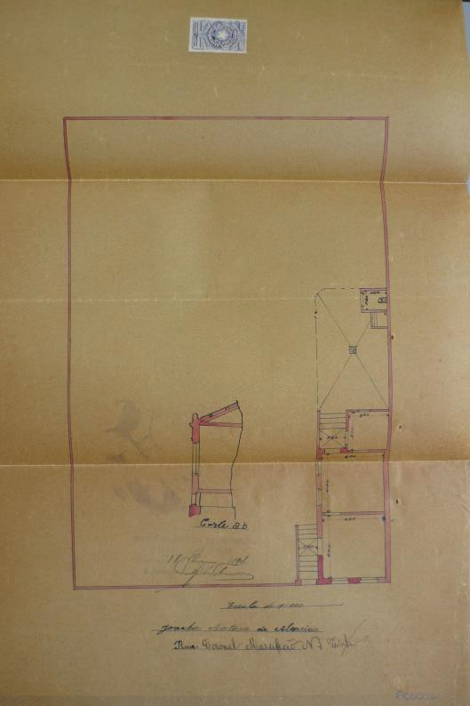

# Resumo

Este artigo pretende colocar na berlinda a intensa atuação de
construtores ainda hoje na penumbra da história recente de São Paulo.
Conhecidos como 'Práticos Licenciados' ou 'Arquitetos Licenciados'
(construtores sem diploma de engenheiro-

arquiteto) os mesmos foram mão-de-obra dominante no âmbito da construção
civil paulistana, mormente entre 1870 e 1933.1 Desse modo, no bojo da
vida citadina, a atuação dos mesmos descortina os debates sobre os rumos
da cidade, suas mazelas sociais, disputas materiais e simbólicas, seus
múltiplos sujeitos, venturas e

desventuras. Nosso intuito é deslindar alguns fios desta complexa trama,
seguir seus rastros, ritos e mitos, sobretudo no que tange aos embates
pela definição dos campos profissionais e simbólicos da profissão de
arquiteto.

Palavras-chave: Arquitetos Licenciados, São Paulo, história, profissão,
urbanização

# Abstract

This article discusses the path of a still overlooked group known as
\'Licensed praticals\' or 'Licensed Architects'- city builders without
higher education degrees whose role was dominant in São Paulo between
1870 and 1933. Thus, in the midst of city life, the performance of these
reveals the debates on the city, its social ills, material and symbolic
disputes, their multiple subjects , fortunes and misfortunes. Our goal
is to unravel a few threads of this complex plot, following their
traces, rites and myths analyzing conflicts in shaping the profession of
architects.

> Keywords: Licensed Architects, São Paulo, History, profession,
> urbanization

## O cotidiano em construção: entre mudanças e permanências

O decorrer do dia 1 de março de 1909 parecia não reservar surpresas aos
funcionários da ***Diretoria de Obras Públicas*** da Prefeitura
Municipal de São Paulo. Acostumados com uma burocracia em franca
expansão, os mesmos recebiam diariamente centenas de requerimentos
solicitando alvará de licença para construir nos mais diversos bairros
de uma cidade que duas décadas antes ainda se limitava aquém dos vales
dos rios Anhangabaú e Tamanduateí, nas ruas do antigo triângulo
colonial. Coordenados desde 1899 pelo engenheiro Victor da Silva Freire,
homem de confiança do Prefeito Antônio Prado e prócere da difusão de um
ideário urbanístico moderno na capital

> 1 O recorte cronológico adotado é balizado por pesquisas prévias e em
> andamento na Série Obras Particulares (SOP) -- coleção documental
> pertencente ao Arquivo Histórico Municipal de São Paulo (AHMWL) cujos
> requerimentos de alvarás de licença para construir constituem fonte
> crucial para a história da arquitetura e do urbanismo paulistano desde
> 1870. No que tange à data final, 1933, a baliza é o decreto de
> regulamentação da profissão de engenheiro, arquiteto e agrimensor, que
> começa a lançar no ostracismo os construtores não diplomados.

paulista, os engenheiros-fiscais e alinhadores da Diretoria de Obras
analisavam caso por caso recorrendo, se necessário, aos arbítrios do
diretor Victor Freire e quiçá do próprio prefeito Antônio Prado. No
verso de cada pedido, num procedimento burocrático ainda comum nas
repartições públicas atuais, os funcionários anotavam cuidadosamente os
detalhes do local a receber o canteiro de obras. Rua, terreno,
alinhamento, metros quadrados a serem edificados e toda sorte de normas
edilícias em voga desde o último quartel do século XIX. Em questão
estava a salubridade, a viabilidade e procedência dos arruamentos e
loteamentos, em suma, todo o aparato legal disponível (e diga-se
relativamente limitado) para o controle público da vertiginosa expansão
do espaço urbano paulistano encabeçada pelos investimentos da iniciativa
privada. Devassando as análises dos engenheiros-fiscais nos versos de
cada pedido, é possível vislumbrar parte do cotidiano não só da
Diretoria de Obras, mas também dos sujeitos que falam através das hoje
centenárias e amareladas páginas da **Série Obras Particulares (SOP)**
como segue:

> *Cidadão Dr. Prefeito Municipal,*
>
> *Diz Joaquim Antônio de Almeida que desejando construir uma casa sita
> a Avenida C. Maranhão, nº 1, vem respeitosamente pedir o necessário
> alinhamento,*
>
> *E.R.M*
>
> *São Paulo, 1 de março de 1909 Pela parte, Raul dos Santos 2*

O tom corriqueiro do pedido parece não destoar do que comumente chegava
à repartição. Todavia uma análise *a posteriori* deslinda a trama das
relações entre poder público e privado, além de trazer à luz os nomes
envolvidos nas querelas. Comecemos nossa breve análise com o tom formal,
mas um tanto intimista, do requerente ao endereçar o pedido diretamente
à figura de Antônio Prado, o "Cidadão Dr. Prefeito Municipal", algo
comum numa rede burocrática ainda em consolidação em São Paulo na
passagem do século XIX para o XX. O requerimento carrega ainda a marca
da permanência do que era comum nas epístolas da Monarquia Imperial
(1822-1889) na sigla "E.R.M", "Espera Receber Mercê". Permanência também
verificada na expressão "respeitosamente pedir necessário alinhamento",
termo usado desde meados do século XIX para que as Imperiais Câmaras
Municipais viabilizassem o alinhamento entre as testadas dos lotes e a
via pública. No entanto, em 1893, a Câmara Municipal de São Paulo altera
o procedimento exigindo a submissão de requerimento e projeto (planta,
elevação e corte), instituindo assim, além do alinhamento, o expediente
do Alvará de Licença para construir e reformar ao longo dos logradouros
paulistanos. Ao que parece, na esteira da lentidão das mudanças do
imaginário, os cidadãos da Paulicéia em profusa transformação ainda
sentiam sua cotidiana vida material com os mecanismos conceituais de
outra época, ou seja, com as permanências da mentalidade Oitocentista
daquela que era conhecida até 1872 como uma cidade feita de barro. Ao
mesmo tempo, eram tragados em definitivo pela

> 2 SOP -- Série Obras Particulares -- AHMWL-Arquivo Municipal
> Washington Luís - São Paulo - OP1909. 001.003. Para detalhes do
> projeto da referida casa ver Figura 1.

inserção de São Paulo e do Brasil nos quadros da Economia-Mundo
Capitalista no auge da Era dos Impérios, das grandes migrações e na
iminência das maiores catástrofes humanas encarnadas nas Guerras
Mundiais (HOBSBAWN,2007). Os habitantes de São Paulo vivem no limiar de
dois mundos, das cidades mudando de escala, das ruas escuras às benesses
da energia elétrica, do bonde puxado por mulas ao bonde elétrico, de uma
cidade recém-saída da mão-de-obra escrava para a marcante presença da
mão-de-obra estrangeira. Contudo, os documentos de época parecem não
corroborar certa euforia historiográfica ao lidar com a passagem para o
século XX. As mudanças, mesmo crivadas pelo gérmen transformador das
Revoluções, carregam durante algum tempo permanências que ajudam a
desvendar fragmentos da sociedade de uma época. Para tanto, voltemos ao
requerimento anteriormente citado. Dois dias

depois, no dia 4 de março, o diretor Victor Freire analisa o pedido e
encaminha para o parecer de seu subordinado o engenheiro José Sá Rocha.3
Este, depois de uma presumível visita ao local, defere o seguinte e
revelador despacho:

> *Sr. Diretor,*
>
> *Esta Rua Maranhão no Cambucy -- não é reconhecida pela Câmara*
>
> *-- Entretanto foi ha pouco tempo determinado pela Prefeitura que
> embora aprovando a planta não se daria alinhamento -- devendo ainda o
> interessado assignar um termo pelo qual se obrigue a nada reclamar da
> Prefeitura caso esta entenda fechar a rua se assim lhe convier.*

O imbróglio é conhecido no dia a dia da repartição, ruas sem registro
abertas ao sabor dos proprietários, regras de higiene e salubridade não
respeitadas, loteamentos desconhecidos e toda sorte de impasses
relativos ao avanço do perímetro urbano da cidade. Neste sentido, no
intuito de evitar a clandestinidade na construção da cidade e qualquer
tipo de ônus aos cofres municipais, os fiscais se resguardam exigindo do
interessado a assinatura de uma declaração na qual se comprometa a não
"reclamar" qualquer direito à Prefeitura. Entrementes, para que se
identifiquem os agentes que engendram o embate entre o fisco público e
as ações da iniciativa privada, lembremos algo essencial: Quem assinou o
requerimento? Quem assinou o "termo de obrigação" exigido pelo
engenheiro Sá Rocha? No requerimento, assinando pelo proprietário
interessado, consta o nome de ***Raul dos Santos***; no "termo de
obrigação", como testemunhas do interessado Joaquim Antonio de Almeida
verificam-se os nomes ***João Eusébio Peixoto, José Kanz e Fernando
Simões.*** Não há qualquer menção à função dos mesmos e nem do tipo de
conexão que os sujeitos citados possuem entre si, mas suas atuações
frequentes e a análise de outras fontes primárias nos fornecem as pistas
e apontam para a linha mestre desta breve análise, a atuação dos
construtores "anônimos" da cidade de São Paulo.

## Historiografia e esquecimento

> 3 Figura central entre os funcionários que lidavam com os imbróglios
> envolvendo proprietários, construtores e poder público na primeira
> década do século XX. Faz-se necessária uma análise mais detida sobre o
> papel destes agentes públicos a serviço da Diretoria de Obras.

Arautos da chamada "arquitetura menor" para a historiografia da
Arquitetura e do Urbanismo contemporânea e ainda no limbo do
esquecimento (mas conhecidos em demasia em seu tempo), os sujeitos acima
são exemplos da complexa teia do quadro profissional da construção civil
paulistana no referido período, a esmagadora presença de "leigos" na
linha de frente da expansão urbana diante do paulatino e implacável
discurso pela regulamentação da profissão de engenheiros e arquitetos.
Raul dos Santos, João Eusébio Peixoto, José Kanz e Fernando Simões eram
conhecidos construtores que não só atuavam como controladores de obras
em canteiros, como também se consolidaram como empreiteiros agenciadores
de obras em diversos pontos da cidade. Uma vez superada as dificuldades
da identificação e para que possamos proceder às fluidas definições do
campo profissional de tais sujeitos desde o último quartel do século
XIX, faz-se necessário pontuar brevemente o tema na historiografia.

> 
>
> Figura 1. Projeto para a construção de uma casa simples na rua Coronel
> Maranhão, nº 1 no Cambuci em 1909.
>
> Propriedade de Joaquim Antonio de Almeida. Projeto do 'Arquiteto
> Licenciado' Raul dos Santos.

Importantes pesquisas nos ensinam que a arquitetura civil e doméstica
desde tempo coloniais era reduto de mestres-de-obras (CAMPOS,1997). De
tradição lusa de longa data, de tradição germânica aqui estabelecida a
partir das primeiras décadas do século XIX e de origem italiana,
sobretudo a partir de 1880, os mestres dominam o cenário arquitetônico
até a consolidação do ensino superior de Engenharia e Arquitetura
através das primeiras levas de formados pela Escola Politécnica de São
Paulo e pelo Mackenzie College nos primeiros anos do século XX. À tal
constatação, no mais das vezes descrita de maneira anacrônica como um
caminho inexorável à "competente" e "devida" formação profissional de
ensino superior, soma-se o grandiloquente discurso da São Paulo eclética
construída pelos grandes engenheiros-arquitetos estrangeiros e sobretudo
pelo brasileiro -- mas de formação estrangeira -- Francisco de Paulo
Ramos

de Azevedo. Tal é a narrativa que domina as introduções de inúmeros
trabalhos que tratam da história do período. Dos lucros de capitais
invertidos da exportação de café aos investimentos de famílias
tradicionais, engendrou-se a narrativa da São Paulo moderna dos ilustres
escritórios técnicos não só de Ramos de Azevedo, mas também de Giulio
Micheli, Maximilian Hehl, Samuel das Neves e Victor Dubugras. Da vila de
taipa de pilão para a cidade da alvenaria de tijolos em menos de 30 anos
(1880-1910), em suma, da cidade símbolo do "progresso" brasileiro. Não
há como negar certo encadeamento verossímil na mesma narrativa. Porém, a
sedução de tal discurso nos levou a inúmeros esquecimentos. Como se
passou do domínio dos mestres ao primado dos arquitetos diplomados? Como
se formou um campo profissional de construtores na passagem da secular e
dominante mão-de-obra escrava para o trabalho assalariado? Finalmente, e
talvez a questão mais importante, o que era e o que representava ser
construtor e construir em São Paulo? No imbricar das questões levantadas
as tensões sociais inerentes ao jogo de forças, das afirmações de
classe; a constatação de que não há neutralidade em tais transformações.
É o que se verifica nos requerimentos aqui em questão.

Ainda nas caligrafias de um século atrás, busquemos algumas respostas
para as questões levantadas analisando a inserção de inúmeras pessoas no
negócio da construção civil. E é mais uma vez em nosso caso exemplar,
mote central destas breves linhas, que buscamos os fios e rastros de tal
trama. O 'termo de responsabilidade' de Joaquim Antônio de Almeida dá o
tom da inserção dos construtores já citados:

> *(\...) Pelo presente termo - declara o signatario reconhecer que a
> licença que a Prefeitura venha a conceder-lhe para construir no
> referido terreno não implica para a Municipalidade obrigação alguma de
> dar acesso a esse terreno, seja pela já nomeada Avenida que não é
> reconhecida como tendo existência oficial e que poderá ser mandada
> fechar quando se entender conveniente, seja por outro qualquer meio.
> Declara outrossim que nenhuma indennisação lhe será devida pela
> municipalidade se a Prefeitura mandar fechar a Avenida acima nomeada.
> Para constar e todos os efeitos lavrou-se este termo que será
> assignado pelo Snr. **João Eusébio Peixoto** a rogo do proprietário
> por não saber ler nem escrever e pelas testemunhas Sns. **José Kanz**
> e **Fernando Simões**(\...)4*

Além de evidenciar os mecanismos de poder estabelecidos pela Diretoria
de Obras da Prefeitura (e o típico analfabetismo de uma República feita
de poucos homens de letras e de milhões de gentes na obscura incerteza
da exclusão social), nos interessa aqui entender a recorrência dos nomes
identificados não só no termo citado, mas em milhares de requerimentos
analisados entre 1870 e 1914. Peixoto, Kanz e Simões são construtores
que figuram como testemunhas não só de proprietários, aparecem também
testemunhando as ações da Diretoria de Obras. Não eram funcionários da
mesma, mas diante de sua larga atuação como construtores, desenvolveram
um *métier* de atravessadores/facilitadores entre proprietários e a
burocracia da legislação em consolidação, vale dizer que os mesmos
tinham uma posição privilegiada diante do órgão público que passava a
ditar as regras do ato de construir. Fernando Simões seria o único dos
três que viria ganhar, décadas depois, um registro de "Arquiteto
Licenciado" pelo Livro de Registro de Práticos Licenciados do CREA na
sua seção

> 4 Termo de Responsabilidade anexado ao requerimento acima citado
> OP.1909.001.003 -- AHMWL-SP.

municipal. Simões não era um construtor diplomado e não sê-lo não era
ainda um problema para os profissionais que atuavam em São Paulo desde o
fim do século XIX. Em outras palavras, a maioria esmagadora dos
construtores de São Paulo nunca teve outra formação que não a "leiga",
entendendo a expressão como aquela que define o construtor destituído de
uma formação acadêmica superior. Portanto, entender a condição e a larga
atuação dos mesmos é perceber, nos termos utilizados para designá-los,
um período de indistinção e de formação do campo profissional do
trabalhador da construção civil. Um período de transição que envolve a
transferência da competência de construir das mãos dos chamados práticos
para o âmbito da erudição acadêmica.

## A construção da indistinção: de ilustres construtores à Práticos Licenciados

Em seu recente dicionário de profissionais da construção civil e
doméstica da cidade de São Paulo desde o período colonial, Carlos Faggin
(2009) observa:

> *Estamos autorizados a concluir que a erudição em nossa arquitetura é
> coisa recente. A improvisação prevaleceu, mas com ela a determinação e
> a disposição de fazer, apesar de tudo. E fez- se.*

O trecho acima, da introdução do "Dicionário" realizado por Faggin,
reitera uma visão pouco questionada e muitas vezes imperceptível aos
olhos do mundo acadêmico, aquela na qual só há erudição nos quadros do
ensino institucionalizado de âmbito universitário. No que diz respeito
aos construtores de São Paulo, só a partir de regulamentação da
profissão - em 1933 - que o número de construtores não diplomados passou
a declinar no quadro da produção arquitetônica paulistana. Portanto,
como aponta Faggin, só a partir da década de 1930 que se completa a
transição entre formação "leiga" e formação "erudita". Em outras
palavras, durante "350" anos a cidade foi construída por leigos e
"apesar de tudo, fez-se". Ora, a despeito do 'juízo de valor' exposto
acima, a erudição pressupõe não apenas um saber acadêmico, mas a
consolidação de um discurso e de uma prática que se não exclui os
construtores não diplomados, escamoteia as nuances dos profissionais
aqui em questão. Muitos dos construtores hoje esquecidos na história de
São Paulo eram

autodidatas, conforme atestam as memórias familiares do engenheiro
Nilton Simões, neto por via materna e paterna de dois construtores
práticos licenciados.5 Simões aponta que seu avó materno, Alberto
Tanganelli, "arquiteto licenciado" pelo CREA em 1933, natural de
Castiglion Fiorentino na região da Toscana e nascido em 28 de maio de
1887, chegou ao Brasil aos 11 anos de idade. Ainda menino aprendera com
o pai os fundamentos básicos do canteiro de obras e como servente
começou a trilhar os passos que o levariam a uma longa carreira na
profissão. *A priori*, o pai de Tanganelli imigrara já na condição de
mestre-de-obras, tendo encontrado na cidade de São Paulo um mercado da
construção civil em franca expansão. Uma vez nos canteiros, o jovem
aprendeu na prática lições de estética e harmonia, geometria e cálculo.
Já estabelecido

como "competente" profissional e gozando do prestígio adquirido por
outros tantos italianos, Tanganelli versava sobre os fundamentos da
arquitetura e das práticas do canteiro, citando lições de Vignola.
Argumentava também sobre as benesses e o uso

> 5 Entrevista concedida em 25 de janeiro de 2011 pelo Engenheiro Newton
> Simões, presidente da Racional Engenharia. Neto pela via materna de
> Alberto Tanganelli e pelo lado paterno de Raul Simões, também prático
> licenciado e irmão de Fernando Simões.

crescente do concreto armado nas edificações, aludindo ao trabalho do
Eng. Alfredo Pujol e suas experiências com a nova técnica construtiva.
Versando ainda suas memórias sobre o avô Tanganelli, Simões expõe um
pitoresco caso. Provavelmente nos idos dos anos de 1930, o avô comprara
um terreno na região de Santana. Num domingo em família colocou todos no
seu Ford 'Bigode' e resolveu visitar o dito terreno. Uma vez lá, estacou
encolerizado diante do terreno, um belo pântano típico das regiões de
várzea do rio Tietê, um grande engodo, fora tapeado pelo vendedor. De
uma rigidez excessiva, totalmente explosivo e passional, o toscano
Tanganelli foi à casa do "golpista" e se engalfinhou com o mesmo até
arrancar-lhe um pedaço da orelha com uma mordida. A história é digna de
uma boa crônica sobre a expansão urbana de São Paulo e suas desventuras.
No entanto, faz-se necessário não cair nas belas armadilhas literárias
das memórias contadas pelo neto de Alberto Tanganelli. A despeito dos
arroubos e exageros de uma trama romanesca, a realidade de Alberto
Tanganelli foi a regra e não a exceção entre os construtores de São
Paulo. De fato, a erudição e o domínio das técnicas construtivas
tradicionais era parte do conhecimento, na teoria e sobretudo na
prática, destes mesmos construtores, como já demonstrou no caso
norte-americano Mary Woods (1999). Não cabe aqui nestas linhas uma
análise mais profunda sobre a formação leiga, falemos um pouco mais
sobre os termos, sobre a condição do construtor paulistano em fins de
século.

> 
>
> Figura 2. Registro CREA, na sua seção municipal, de Alberto Tanganelli
> (avó materno do entrevistado Eng. Newton Simões) com a "Licença de
> Arquiteto" em 17 de outubro de 1934. Fonte: AHMWL-SP.

José Kanz, Fernando Simões, João Eusébio Peixoto, Alberto Tanganelli e
tantos outros construtores, assim como as designações que os
identificavam -- empreiteiros, construtores, mestres de obra,
controladores de obras, arquiteto-construtor, arquitetos licenciados e
etc. -- são a expressão da referida indistinção, entendida em parte como
a

possibilidade de ocupar posições intermediárias que não eram mais
contempladas pela tradicional condição do mestre de obras, e tão pouco
eram atendidas pelo limitado quadro de profissionais acadêmicos que só
aos poucos foram se afirmando sobre os práticos, em suma, a construção
de uma indistinção que por longo período permitiu a atuação dos não
diplomados. Ora, quando as pressões de classe do início da Era Vargas
possibilitaram a aprovação do Decreto Federal n. 23.569, de 11 de
dezembro de 1933 regulamentando a profissão de engenheiro, arquiteto e
agrimensor, criou-se uma clivagem oficial antes existente só na prática,
os construtores diplomados de um lado e nas conformidades da lei, e os
construtores "práticos licenciados" de outro ainda com permissão de
atuação desde que comprovassem mais de cinco anos no exercício da
profissão e não cometessem nenhum tipo de erro e/ou infração, do
contrário a total impossibilidade de se atuar nos termos da nova lei
(FICHER, 2005). Era o declínio de um tempo em que o exercício da
profissão esteve fora dos quadros do ensino institucionalizado, e fora
das mãos dos profissionais diplomados. Muitos construtores alcunhados a
partir de 1933 de "práticos licenciados" atuavam, a exemplo de Alberto
Tanganelli, desde o começo do século XX, porém suas sólidas carreiras
foram lançadas literalmente no túmulo do esquecimento, uma vez que
vários práticos obtiveram apenas a permissão para construir em
cemitérios. A clivagem exposta acima nos coloca outro esquecimento.
Projetar os termos "arquiteto", "mestre-de-obras", "empreiteiro",
"engenheiro-construtor" e outros no período aqui referido (1870-1933) é
incorrer em retumbante anacronismo, uma vez que não eram termos com a
exatidão das definições atuais (PARETO JR, 2011). E vai além, diante da
intensa expansão urbana e da necessidade de mão-de-obra especializada,
inúmeros foram os construtores que se valeram de "títulos" de
autodenominação. Mais uma vez, os requerimentos da **Série Obras
Particulares** nos dão a dimensão e variedade de termos utilizados pelos
agentes da construção civil: "Mestre-construtor", Architecto-
Empreiteiro", "Architecto-Construtor", "Controlador de Obras", e até
mesmo o título visto comumente entre os diplomados:
"Engenheiro-Architecto". De fato, tais termos designavam aqueles
construtores que tinham alçado voo mais largo e que, muitas vezes,
tinham deixado a condição de pedreiros para engendrarem redes
associativas de construtores, como o caso dos já citados José Kanz e
Fernando Simões, responsáveis entre ***1906 e 1914*** por **2.117**
projetos num total de **27.790** recebidos pela Diretoria de Obras no
período (PARETO JR, 2011). Ambos expressam a dinâmica de atuação dos
"leigos" ou "anônimos" sendo responsáveis por praticamente **8%** do
total de obras legalmente construídas na cidade. A indistinção dos
termos era a possibilidade de distinção num mercado de crescimento
avassalador, num momento de profunda transformação não só em São Paulo,
mas em toda a sociedade vivente no âmbito da economia capitalista. Os
conhecidos (na época) construtores de outrora e alcunhados "práticos" *a
posteriori* viveram entre dois cruciais momentos da história
contemporânea, da cidade do século XIX e sua ordem salubrista à
velocidade vertiginosa e excludente das metrópoles do século XX. Foi no
limiar de tais mudanças que toda uma geração de construtores se afirmou,
esboçou um campo profissional e um nicho de mercado de trabalho. E não
foram apenas os italianos e o prestígio passageiro dos mesmos junto às
elites tradicionais. Foi também a contribuição germânica - anterior à
italiana - fulcral na difusão do gosto eclético e das novas técnicas
construtivas. Sem contar a continuidade dos já conhecidos mestres
portugueses tão caros à arquitetura colonial e mesmo dos muitos
pedreiros pretos, pardos e pobres que foram anulados pela hegemonia das
narrativas sobre imigrantes brancos e mercado de trabalho em São Paulo
(SANTOS, 2008).Germânicos, italianos, portugueses e brasileiros -
formados por Liceus de Artes e Ofícios ou simplesmente

pela prática cotidiana - foram essenciais não só para atender a demanda
da construção civil, abriram também o caminho para a institucionalização
do ensino profissional, uma vez que sua larga atuação em todas as
regiões da cidade colocou na berlinda a necessidade de um debate sobre a
competência de construir, fomentado essencialmente pelos diplomados que
sofriam com uma feroz concorrência. Nesta lógica, vale lembrar que as
tensões sobre a regulamentação da profissão sempre envolveram os
interesses econômicos das chamadas "fatias" de mercado, ou seja, afastar
a concorrência (no caso em questão) dos não diplomados. De qualquer
maneira, compreender a formação do mercado da construção civil e da
profissão de engenheiro/arquiteto no período em questão é analisar a
trajetória dos práticos - e seus embates dialéticos na
construção/desconstrução de um 'círculo privilegiado' da
profissão(STEVENS, 2003) - e definitivamente inserir suas histórias no
amplo quadro de definição das práticas da arquitetura e do urbanismo em
São Paulo.

# Referências bibliográficas

CAMPOS, Eudes. *Arquitetura Paulistana sob o Império*: aspectos da
formação da cultura burguesa em São Paulo". Tese de doutorado em
"Estruturas Ambientais Urbanas"- Faculdade de Arquitetura e Urbanismo,
Universidade de São Paulo,1997.

FAGGIN, Carlos A.M. *Arquitetos de São Paulo*: dicionário de artífices,
carpinteiros, mestres-de-obras, engenheiros militares, engenheiros civis
e arquitetos nos primeiros 350 anos contados da fundação da cidade. São
Paulo: FAUUSP, 2009.

> FICHER, Sylvia. *Os Arquitetos da Poli:* Ensino e Profissão em São
> Paulo. Edusp: São Paulo, 2005.
>
> HOBSBAWN, E.J. *A Era das Extremos*,1914-1991. São Paulo: Cia das
> Letras,2001

PARETO JR. L. *O cotidiano em construção*: os Práticos Licenciados em
São Paulo, 1893-1933. Dissertação de Mestrado. FAUUSP, 2011.

SANTOS, Carlos José Ferreira dos. *Nem tudo era italiano*: São Paulo e
pobreza: 1890-1915. São Paulo:Anablume/Fapesp,2008.

> STEVENS,Garry.*O círculo privilegiado*: fundamentos sociais da
> distinção arquitetônica. Brasília:UNB, 2003.

WOODS, Mary N. *From Craft to Profession*. The Practice of Architecture
in Nineteenth-Century America.Berkeley/Los Angeles/London, University Of
California Press,1999.
