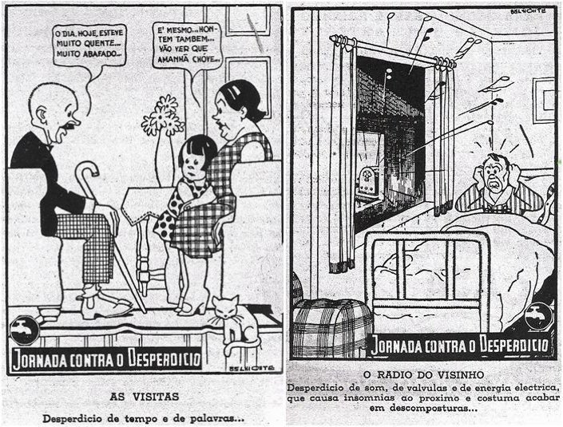
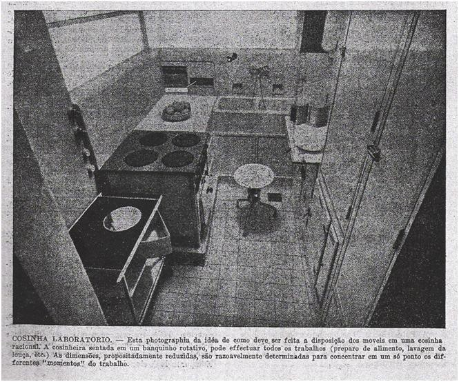

# Resumo

O texto analisa a difusão do taylorismo, no Brasil, no período
1932-1946, e sua utilização no desenho e na organização do ambiente
doméstico do trabalhador, através de pesquisa feita na Revista de
Organização Científica. Trata-se de publicação do IDORT (Instituto de
Organização Racional do Trabalho), criado no início dos anos 1930, para
difundir os métodos de organização científica do trabalho, o taylorismo,
por parte da burguesia industrial paulista, que apresentara um projeto
de modernização do país e tentava consolidar sua hegemonia e transmitir
sua concepção de mundo. Neste processo, a racionalização da produção
industrial é estendida à própria vida do trabalhador. Este quadro é
analisado sob a perspectiva do conceito gramsciano da hegemonia e de
seus estudos sobre o sistema taylorista de produção.

Palavras-chave: IDORT, organização racional do trabalho, taylorismo,
habitação operária, desenho do ambiente doméstico

# Abstract

The paper analyzes the diffusion of Taylorism, in the design and
organization of the worker's domestic environment, in Brazil, during the
period 1932-1946, through research done in the Revista de Organização
Científica (Journal of Scientific Organization). This is a publication
of IDORT (Institute of Rational Organization of Labor), created in early
1930s to spread scientific organization methods of labor, Taylorism, by
São Paulo industrial bourgeoisie, that presented a project to modernize
the country and tried to consolidate its hegemony and convey their
worldview. In this process, the rationalization of industrial production
is extended to the worker's life. This process is analyzed from the
perspective of the Gramscian concept of hegemony and his studies on the
Taylorist production system.

Keywords: IDORT, rational organization of work, Taylorism, workers\'
housing, design of domestic environment

# INTRODUÇÃO

Procura-se, através deste trabalho, entender o processo de
disciplinamento da habitação operária por parte das classes dominantes
no Brasil, que se inicia ainda no século XIX, com a demarcação de
espaços para os diferentes grupos sociais e o controle do espaço
doméstico da classe trabalhadora, através de vistorias e inspeções
sanitárias. Essa trajetória prossegue com as vilas operárias,
construídas pelo Estado ou por particulares, principalmente industriais,
na periferia da cidade, impondo todo um estilo de vida ao trabalhador,
através de um código de conduta que o acompanhava nos mínimos detalhes
da vida cotidiana, inclusive em seus momentos de lazer.

E, nos anos 1930, vemos a burguesia industrial paulista utilizando-se
dos princípios tayloristas, não apenas para organizar a produção fabril,
mas para ordenar a moradia e a vida do trabalhador, incutindo-lhe
hábitos e comportamentos necessários ao novo operário - padrão,
taylorizado. Desta forma, tentará consolidar sua hegemonia.

# O TAYLORISMO

Nas primeiras décadas do século XX, os empresários americanos abraçaram
os ideais tayloristas de maneira entusiasmada.1 Essa doutrina mostrava
que a grande causa do desperdício era a desorganização das formas de
produção. Não havia uma normatização da forma de desempenho de
determinada tarefa, nem um treinamento efetivo. Isto seria corrigido
através da análise detalhada de cada trabalho, desmembrado em seus
menores movimentos, que eram cronometrados para a redução de sua
duração. A postura ideal para cada ação também seria definida.

Este procedimento era planejado e coordenado por uma gerência
científica, constituída por profissionais especializados: engenheiros,
mestres, gerentes, administradores. Dessa maneira, o taylorismo
aprofundou a divisão social do trabalho, pois separaram-se as fases de
planejamento -- o trabalho intelectual - das tarefas de execução -- o
trabalho manual.

Em consequência, o novo campo de saber se revelará uma forma muito mais
incisiva de dominação, assegurando o controle do tempo e do próprio
trabalhador.

A experiência realizada em uma fábrica de porcelana norueguesa (Revista
de Organização Científica, IDORT, ano I, n.8-9, p.15, agosto-set. 1932)
mostra esse controle: inicialmente, as operárias trabalhavam sentadas.
Alternando períodos de trabalho em pé e sentadas, além da introdução de
uma pausa para descanso, houve um aumento na produção. Sob a aparência
da racionalidade, esta é uma situação em que se define até mesmo a
posição em que deve se manter o trabalhador.

Esta adequação foi analisada por Gramsci (2008, p.47): "A vida na
indústria demanda um tirocínio generalizado, um processo de adaptação
psicofísico a determinadas condições de trabalho, de nutrição, de
habitação, de hábitos, etc., que não é inato, natural, mas que deve ser
adquirido."

Pois, a nova estratégia de produção demandava indivíduos submissos e
produtivos: o "operário - padrão", "taylorizado", que deveria
interiorizar os novos comportamentos e hábitos de ordem, exatidão,
precisão, para que as novas formas de vida coletiva, sempre mais
complexas, se tornassem possíveis em um processo de sujeição dos
instintos naturais. (GRAMSCI, 2008, p.63-4)

E, no decorrer desta adaptação, o taylorismo transpôs os limites da
fábrica e atingiu todas as facetas da vida do trabalhador, com regras
científicas de racionalização das ações e até dos sentimentos e
pensamentos.

> As iniciativas puritanas têm como fim a conservação, fora do trabalho,
> de um certo equilíbrio psicofísico que impeça o colapso fisiológico do
> trabalhador, premido pelo novo método de produção. (\...) porque até o
> complexo humano -- o coletivo trabalhador -- de uma empresa é uma
> máquina que não deve se desmontada com grande frequência, nem ver
> renovados os seus pedaços individuais sem grandes perdas. (Ibid.,
> p.70-1)

As tentativas de aplicação do taylorismo aos diversos campos de
atividade eram discutidas de forma sistemática. Em julho de 1935, foi
realizado em Londres o *VI Congresso Internacional de Organização
Científica do Trabalho*, onde discutiram-se temas como: produção,
questões agrícolas, educação e formação profissional, economia

> 1 O taylorismo é uma doutrina desenvolvida por Frederick Taylor
> (1856-1915), a partir de seus estudos sobre a organização do trabalho,
> que datam do início do século XX. Sua obra mais conhecida, "Princípios
> de Administração Científica", foi publicada em 1911. Além dos Estados
> Unidos, o taylorismo foi aplicado em indústrias de todo o mundo,
> levando à organização do processo de trabalho contemporâneo. Nos anos
> 1920, a doutrina chega ao Brasil, quando já se consolidara nos EUA.

doméstica. Sobre esta última, indaga-se: "Em que medida a organização
científica da vida de família pode contribuir para a elevação do teor
geral de vida?" (*REVISTA DE ORGANIZAÇÃO CIENTÍFICA*, jun. 1934, n.30,
p.135-6)

# O IDORT E A DIFUSÃO DO TAYLORISMO NO BRASIL.

A adoção do taylorismo no Brasil2 está relacionada à ascensão da
burguesia paulista e à industrialização do país, cujo arranque
definitivo deu-se nos anos 1930.3

No entanto, mesmo antes da chegada do taylorismo ao Brasil nos anos
1920, já havia, por parte dos industriais, tentativas - ainda de forma
pontual - de organização do trabalho dentro da fábrica e de
disciplinarização do trabalhador.

> (\...) antes mesmo da introdução do taylorismo e do fordismo no
> Brasil, delineia-se o desejo burguês de construção da fábrica
> higiênica, espaço racional e apolítico da produção, até transformar-se
> num projeto enunciado e assumido pelo conjunto dos especialistas, do
> empresariado e do Estado. (RAGO, 1985, p.19)

Por conta disso, houve muitas revoltas operárias e resistência nos
locais de trabalho. As medidas coercitivas mostraram-se ineficazes e,
desta forma, na década de 1920, a racionalização da produção através dos
métodos tayloristas apresenta-se como uma nova "solução".

O final da década de 1920 é um período conturbado para o Brasil. Além da
depressão que atingiu a economia mundial e causou uma crise no setor
cafeeiro brasileiro, a Revolução de 1930 marca o fim da dominação da
aliança formada pelas elites patrimonialistas e cafeeiras. Da nova
aliança, que se tornará dominante, faz parte a burguesia industrial, que
já vinha se formando em São Paulo desde o final do século XIX.

Tanto as elites cafeeiras quanto a burguesia industrial são parte da
"sociedade civil", formada pelo conjunto das organizações responsáveis
pela elaboração e/ou difusão das ideologias (escolas, igrejas, partidos
políticos, sindicatos, organizações profissionais, meios de comunicação,
etc.), uma das duas esferas em que Antônio Gramsci divide o Estado. A
outra é a "sociedade política", o "Estado em sentido estrito" ou
"Estado- coerção" - conjunto dos mecanismos com os quais a classe
dominante executa as leis.

Na sociedade civil, as classes buscam exercer sua hegemonia, ou seja,
buscam ganhar aliados para suas posições mediante a direção política e o
consenso, utilizando-se dos "aparelhos privados de hegemonia", ou "os
organismos de participação voluntária, baseados no consenso e não na
coerção"; enquanto que, por meio da sociedade política, as classes
exercem uma ditadura ou, mais precisamente, uma dominação, mediante a
coerção.

Antes mesmo de chegar ao poder, a burguesia industrial já exercia a
direção política, pois se organizara e apresentara um projeto econômico
e social modernizador, que tentava envolver toda a vida da nação, já que
as antigas oligarquias não conseguiam mais resolver os problemas
coletivos, políticos e econômicos. Assim, sua supremacia entrara em
crise. Antônio Gramsci diz que: "Um grupo social pode, e mesmo deve, ser

> 2 Gramsci analisou o sistema de produção capitalista nos Estados
> Unidos e as condições da classe operária, utilizando-se do conceito de
> hegemonia. Aqui, transpõe-se esta análise gramsciana para o Brasil, na
> medida em que o modelo de produção taylorista é transferido a vários
> países, inclusive ao Brasil.
>
> 3 Apesar do crescimento expressivo da indústria paulista, em
> consequência das dificuldades de importação decorrentes da Primeira
> Guerra Mundial, quando o número de indústrias em São Paulo saltou de
> 314, em 1907, para
>
> 4.458 em 1920. Disponível em:
> \<[[http://www.ciesp.com.br/ciesp/]{.ul}](http://www.ciesp.com.br/ciesp/)\>.
> Acesso em: 12 jul. 2011.

dirigente já antes de conquistar o poder governamental. É essa uma das
condições principais para a conquista do poder".(GRAMSCI, 1971.b, p.70
*apud* GRUPPI, 1978, p.78-9)

Tentando consolidar sua hegemonia, a burguesia industrial paulista, se
organiza em diversas associações, aparelhos hegemônicos privados. Dessa
forma, procura transmitir sua ideologia, o taylorismo, pois "(\...) toda
concepção dominante (\...) torna-se portanto também fé, também ideologia
para as grandes massas, não conscientemente vivida em todos os
pressupostos e em todos os seus aspectos (\...)." (GRAMSCI, 1971b, p.7
*apud* GRUPPI, 1978, p.70)

Do conjunto de instituições criado pelos industriais paulistas, fazem
parte o CIESP (que em 1931 transforma-se na FIESP), o SENAI, o SESI, a
Escola Livre de Sociologia e Política de São Paulo e o IDORT (Instituto
de Organização Racional do Trabalho).

O IDORT teve origem em uma comissão constituída em 1929 pela Associação
Comercial de São Paulo, que gerou o Instituto Paulista de Eficiência e,
em junho de 1931, transforma-se no IDORT. (CORREIA, 2004, p. 79-81)
Entre outras ações, o IDORT criaria uma revista mensal: a *Revista de
Organização Científica*.

Transparece no editorial do primeiro número da revista, "O que somos"
(*REVISTA DE ORGANIZAÇÃO CIENTÍFICA*, jan.1932, n.1, p.1), que as ações
de grupos da sociedade civil praticamente se equiparam às do Estado.
Este fato confirma a afirmação de Gramsci, de que a sociedade civil é um
"momento do Estado ampliado" onde têm lugar relações de poder e dotado
de autonomia relativa em relação ao Estado em sentido estrito.
(COUTINHO, 2006, p.41)

> No mais alto sentido, aplica-se a toda uma Política Econômica,
> concebida e executada pelo Estado ou por um grande grupo industrial ou
> financeiro, geralmente de acordo com o Estado. (\...) o procedimento
> científico para solução dos problemas nacionais. (*REVISTA DE
> ORGANIZAÇÃO CIENTÍFICA*, jan.1932, n.1, p.1)

O IDORT identifica-se como:

> uma sociedade civil de intuitos não econômicos, com o objetivo de
> estudar, aplicar e difundir os métodos de organização científica do
> trabalho (\...) aumentar o bem estar social, por meio do acréscimo da
> eficiência do trabalho humano (\...) expresso no máximo proveito, quer
> para o indivíduo, quer para a coletividade.(\...) ao melhor
> aproveitamento de todo esforço humano empregado em qualquer das
> múltiplas manifestações da atividade moderna, não só na indústria
> (\...). Em uma palavra Racionalização exprime o nosso programa. (\...)
> As coisas precisam ser positivas e exatas. (\...) E 'racional' é o que
> está de acordo com a razão, isto é, com a inteligência humana (\...).
> (*REVISTA DE ORGANIZAÇÃO CIENTÍFICA*, jan.1932, n.1, p.1)

A palavra racionalização, em destaque no texto, já antecipa qual será o
eixo orientador da revista. Ao lado de outras palavras, como
*desperdício, economia, eficácia, organização e padronização*,
"racionalização" é um termo repetido inúmeras vezes nas várias edições
da revista, aplicado aos mais variados ramos da atividade humana.

A racionalização e, em ultima instância, o próprio taylorismo surge como
uma forma de organização da produção, a cujas leis naturais os homens e
sua ciência devem subordinar-se. É a ideia da técnica naturalizada,
imparcial. A visão do positivismo e, mesmo da sociedade, como um
organismo dominado por leis imutáveis, similar à

natureza. Gruppi (1978, p.98-9) afirma que a burguesia necessita do
positivismo como uma concepção que se prende à imediaticidade do fato e
não a supera.

O homem e a sociedade são entendidos como fenômenos naturais submetidos
a leis naturais invariáveis. O individuo é estudado como uma abstração,
sujeito a observação e experimentação, como um dado estatístico.

# O LAR IDEAL

Como se afirmou, para consolidar sua hegemonia, a burguesia industrial
paulista procura transmitir sua ideologia, da qual faz parte sua
concepção de mundo: a forma de vida burguesa. Ela é incutida na
consciência do trabalhador, mesmo que não seja vivida conscientemente. A
revista do IDORT é, assim, um veículo para a transmissão dessa
"mensagem".

O "estilo" de vida da família nuclear, reservada, recolhida em um
ambiente aconchegante e acolhedor - uma "habitação modelo -," é
apresentado ao leitor como a única maneira de se viver dignamente e
encontrar a felicidade.

Esta imagem surge como um ideal a ser atingido: o "grande objetivo da
vida do trabalhador". Ele deveria "sentir satisfação em desfrutar a casa
(\...) como parte importante de sua felicidade, como um pequeno mundo
seu (\...) em que não existe a coação inerente à vida de trabalho."
(MARTINS, 1942, p. 9)4 O tempo passado em casa era visto como um
contraponto ao mundo do trabalho.

Assim, a casa surge como o espaço para o disciplinamento dos extratos
mais baixos da sociedade, onde hábitos moralizados e costumes regrados
deveriam ser adotados. Cantanhede (1942, p.14), em uma das conferências
realizadas na *Jornada da Habitação Econômica*, assinala a necessidade
de uma assistência social para que, além da casa, fosse propiciada ao
morador a educação sobre a forma de "gozar aquilo que lhe é entregue, em
última análise ensinar o operário a morar condignamente e com
poupança.", lembrando ainda que a habitação não deveria ser um mero
abrigo, mas tornar-se um lar.

E, à mulher cabia o dever social de lidar com todas as questões
domésticas, inclusive a vigilância dos demais membros da família em
todos os detalhes cotidianos, para que reinasse a saúde física e moral
naquele ambiente. Este papel é ressaltado na revista do IDORT:

> As atividades e responsabilidades do lar recaem principalmente sobre
> os ombros da mulher, que tem de ser ao mesmo tempo, esposa, mãe e
> dona-de-casa, isto é, tem de animar o seu marido na luta cotidiana
> pela existência, dar exemplos a seus filhos e finalmente zelar pela
> boa aplicação do dinheiro que recebe mensalmente (\...). (OLIVEIRA,
> 1938, p.265)

A revista também se posicionava em relação aos comportamentos dos
diversos membros da família. A presença de estranhos ao lar deveria ser
evitada, fossem hóspedes ou visitas ocasionais, como mostram as figura 1
e 2.

> 4 Reprodução na Revista de Organização Científica da conferência dada
> por Luiz Dodsworth Martins, no Rio de Janeiro, na Jornada da Habitação
> Econômica.
>
> 
>
> Figuras 1 e 2. O desperdício. Fonte: *Revista de Organização
> Científica*, IDORT, ano VII, n.82-84, p.266, out. a dez.
>
> 1938\.

Além disso, os espaços de cada membro da família eram rigidamente
demarcados, como a "casa das sete peças": três quartos, sala, cozinha,
banheiro e varanda. O "tipo de vivenda popular mais aconselhável para a
moradia do pobre" (ANDRADE, 1942, p. 13), pois os filhos de sexos
diferentes deveriam ser separados, para "preservação da boa moral na
família", (afinal), "via de regra, o pobre é mais prolífero". (*Ibid.,
idem*)

A questão da higiene era mostrada na revista, sem meios tons:

> As estatísticas de mortalidade e de morbidade demonstram o perigo
> biológico das atuais baiucas anti-higiênicas do proletariado. (\...) a
> promiscuidade, a miséria em todas suas formas, que asilam nas
> residências anti-higiênicas, são o maior desastre da elevação
> espiritual e material do homem (\...) (Estas casas atentariam) contra
> a estabilidade e organização familiar. (OLIVEIRA, 1943, p.17)

"A boa casa" seria um "dever social a realizar." (OLIVEIRA, 1943, p.20)

A elevação espiritual era, na verdade, a manutenção do equilíbrio físico
e mental do trabalhador, apesar do ambiente massacrante da fábrica.
Nessas habitações seriam recrutadas \"novas levas de trabalhadores, que
deverão realizar suas atividades em condições de produzirem o ótimo e o
máximo." (*Ibid., idem*)

> 
>
> Figura 3. A casa vista como um local para o consumo dos mais diversos
> produtos. Fonte: *Revista de Organização Científica*, IDORT, ano VII,
> n.82-84, s.n.p., out. a dez. 1938.

A casa do trabalhador era vista, também, como forma de poupança:

> Satisfeitas as rudimentares necessidades de acomodação, (\...) o homem
> do povo (\...) escolhe alguns dos outros itens do outro capítulo:
> diversão. (\...) Deve ser educado no sentido de destinar às despesas
> com sua habitação o máximo que comportar seu salário (\...). (MARTINS,
> 1942, p. 9)

Se o trabalhador investisse sua renda na habitação, um novo mercado
consumidor surgiria, pois, assinala Martins (1942, p.5):

> O mundo precisa de consumidores, que equilibrem a produção em grande.
> O ideal social da 'incorporação do proletariado à sociedade moderna'.
> (\...) cabem as iniciativas que vai tomando o Governo de nosso País,
> que certamente se acentuarão no sentido positivo de estimular a
> formação do produtor-consumidor. (fig.3)

# A TAYLORIZAÇÃO DO LAR DO TRABALHADOR.

Conforme dissemos, o IDORT envolveu-se com questões diversas, tentando
transformar a vida dos trabalhadores.5 Além da publicação da revista,
várias "jornadas" foram

> 5 As recomendações não se limitam à casa operária, as moradias dos
> trabalhadores rurais e a casa para o funcionário público serão alvo de
> vários artigos na revista do IDORT.
>
> promovidas, entre elas a *Jornada da Habitação Econômica* em 1941,6 em
> São Paulo e no Rio de Janeiro, reunindo engenheiros, médicos,
> arquitetos.

Em relação à habitação,7 colocam-se questões como higiene, privacidade,
conforto e a conservação, fora do trabalho, de certo equilíbrio
psicofísico que impeça o colapso do trabalhador, premido pelo novo
método de produção.

Carmen Portinho8 (1943, p.19), engenheira civil que ajudou na difusão do
Movimento Moderno em arquitetura no Brasil, escreveu a favor da
racionalização da habitação nas páginas da revista do IDORT:

> (\...) a habitação dos diversos povos é uma organização pura, que
> reflete o seu progresso técnico e a sua estrutura social e econômica.
> (\...) oferecer a este homem da era maquinista (\...) o conforto, uma
> habitação digna dele e de sua época. Uma máquina de habitar bem dotada
> e organizada (\...). Adaptemos a habitação à economia moderna.

Esta ideia se repete em outros artigos da revista, como o de Martins
(1942, p.7), que afirma que: "Uma casa econômica tem de ser fabricada
como se fabrica um automóvel." Mesmo a "existência mínima" é debatida na
revista do IDORT. Oliveira (1943, p.17), citando o arquiteto Walter
Gropius, discute o conceito de "habitar" e a viabilidade da habitação
coletiva, afirmando que: A "residência mínima" seria a resultante lógica
de múltiplos fatores de ordem biológica, econômica, técnica e
psicológica. Na "residência mínima, todos os elementos supérfluos são
suprimidos. Os cômodos se agrupam de acordo com a sua função." (*Ibid*.,
p.18)

O espaço deveria ter o mesmo rendimento das máquinas, considerando-se as
dimensões e a disposição dos cômodos da habitação. (AZEVEDO, 1938,
p.227-8).

Tanto Oliveira, quanto Azevedo, mencionam a utilização de "coeficientes
de eficiência" para o desenho da habitação. Seria um campo de aplicação
de princípios científicos e cálculos precisos.9

Outra questão fundamental para a racionalização da habitação era o
desenho da cozinha, onde os princípios tayloristas foram largamente
utilizados, desde as primeiras décadas do século XX. Na *Revista de
Organização Científica* do IDORT, Bertrand (1938, p.270) assinala que o
desenho de uma cozinha e a disposição do mobiliário facilitariam

> 6 Foi um evento bastante amplo, com conferências, uma exposição -
> "Casa Popular"-, trabalhos em revistas, jornais e programas de rádio.
> Esta acabaria originando, em 1942, a Comissão Permanente da Habitação
> Econômica. Outras jornadas também aconteceram: sobre a alimentação, em
> 1940, e a *Jornada da Educação*, em 1946.
>
> 7 Deve-se ressaltar que a discussão sobre habitação era bastante
> ampla, à época, mostrando-se uma das principais
>
> questões para os arquitetos do Movimento Moderno, desde os anos 1920.
> A "existência mínima", o mínimo necessário de habitação, foi tema
> central do CIAM 2 (Segundo Congresso Internacional de Arquitetura
> Moderna), em 1929, em Frankfurt, onde também foram discutidas as
> implicações que a taylorização do trabalho doméstico teria para o
> planejamento da habitação. Porém, a racionalização do ambiente
> doméstico através dos princípios tayloristas já tivera início em 1913,
> por Christine Frederick, nos Estados Unidos.
>
> 8 Carmen Portinho (1903-2001) foi diretora do Departamento de
> Habitação Popular da Prefeitura do Distrito Federal.
>
> Influenciada pelas experiências europeias, propôs a construção de
> grandes conjuntos habitacionais populares equipados com serviços
> sociais revolucionários e, junto com o arquiteto Affonso Reidy,
> elaborou os dois exemplos mais importantes da habitação coletiva
> realizados no Rio de Janeiro na segunda metade do século XX: o
> conjunto de Pedregulho (1948) e o da Gávea (1952)
>
> 9 Os estudos de planejamento do espaço feitos pelo arquiteto russo
> Alexander Klein para a agência de habitação alemã, conhecida como Rfg,
> em busca de uma metodologia científica para a avaliação dos problemas
> funcionais e econômicos da habitação, se utilizam de coeficientes
> diversos.

a movimentação e a execução das tarefas, divididas em um "ciclo de
operações", como em uma linha de montagem fabril. (*Ibid*., p.271) Uma
imagem de uma "cozinha laboratório" ilustra o artigo. (fig.4)

> 
>
> Figura 4. A "cozinha-laboratório". Fonte: *Revista de Organização
> Científica*, IDORT, ano VII, n.82-84, p.272, out. a dez.,1938.

Oliveira (1938, p.266), aconselha o posicionamento dos equipamentos, de
acordo com o ciclo de trabalho.

# A GESTÃO CIENTÍFICA DO LAR.

Além do desenho do espaço, a própria gestão da casa deveria se equiparar
à organização da produção industrial, incluindo questões como o
desempenho das tarefas domésticas e a administração do orçamento.

À dona de casa10 caberia "exercer controle eficaz sobre os trabalhos
domésticos, escriturando um pequeno livro Caixa. (\...). No fim do ano,
poderá fazer um balancete para verificar o gasto anual". (OLIVEIRA,
1938, p.266) Quanto às compras: "Feitos os pedidos de acordo com a dona
da casa, deve esta anotar imediatamente as quantidades e qualidades no
caderno do seu fornecedor, controlando a seguir os seus preços."
(*Ibid*., p.265) Para Freitas (1943, p.20), deveria também ser feito um
"controle de estoque" e a compra dos itens necessários deveria ser feita
em grande escala.

Cada tarefa deveria ser analisada de forma minuciosa, como a sequência
de alimentos a serem cozidos. Os serviços precisavam ser atribuídos aos
empregados domésticos, "por escrito e detalhadamente, marcando dia e
hora (\...) resultando daí o andamento rápido, seguro e eficiente dos
afazeres domésticos." (OLIVEIRA, 1938, p.265) Os períodos de descanso
dos empregados também deveriam ser definidos e estimuladas suas
sugestões quanto ao serviço doméstico, em um "espírito de solidariedade
e cooperação". (FREITAS, 1943, p.21)

Até mesmo a ideia da cronometragem do tempo está presente, como na
fábrica. No preparo das refeições, "(\...) marcando o tempo dessas
operações para cada prato (\...) a

> 10 Provavelmente o público alvo da revista do IDORT não se restringia
> ao trabalhador, pois algumas vezes supõe-se a dona-de-casa executando
> as tarefas da casa e, em outros casos, o artigo dirige-se a um público
> que pode manter empregados domésticos

dona de casa (\...) ficará apta a avaliar o custo total de cada
refeição." (FREITAS, 1943, p.21)

Além da otimização no preparo, a alimentação também se relacionava à
necessidade da reposição das energias da força de trabalho. Deveriam ser
determinadas na "carta de pratos (\...) as proporções exatas de
calorias, vitaminas, cálcio, ferro e proteínas necessárias a cada
refeição." (OLIVEIRA, 1938, p.265).

> Para melhorar as condições de saúde e aumentar a capacidade individual
> de produção, iniciamos já uma política de alimentação e higiene
> individual (\...) conduzida pelos poderes públicos e pelos estudiosos
> do assunto (\...) nada se fará sem a cooperação íntima dessas duas
> forças: o Governo e o Particular. (MARTINS, 1942, p.5)

Pois: "Os processos violentos são contraproducentes. É indispensável um
trabalho prévio de convicção e propaganda. (*Ibid., idem*)

Não se trata de coerção, mas de consenso, convencimento. Os cuidados com
a alimentação e todos os outros pequenos detalhes cotidianos são
mostrados e reiterados; uma mensagem que acaba por ser plantada na
consciência do trabalhador, sem grandes questionamentos. Neste ambiente
confortável e tranquilo: "Façamos do pobre, uma criatura feliz!"
(ANDRADE, 1942, p. 13)

# CONCLUSÕES

O processo de configuração da habitação operária, por parte das classes
dominantes, inicia-se ainda no século XIX, no Brasil, de forma
coercitiva. São demarcados espaços para moradia das diversas classes
sociais, expulsando as camadas mais pobres para a periferia. As vilas
operárias mantêm esta visão, constituindo locais para encerrar o
trabalhador, distantes dos centros urbanos, que definem os menores atos
da vida cotidiana de seus moradores.

Com seu projeto de modernização do país, a burguesia industrial paulista
tenta consolidar sua hegemonia nos anos 1930 e transmitir sua concepção
de mundo à classe trabalhadora. Após adotar os princípios de organização
racional do trabalho na fábrica, ela estende esse paradigma taylorista -
posto a disposição do homem pelo desenvolvimento técnico e científico -
à esfera da vida privada.

O taylorismo "perseguirá" o trabalhador nos diferentes aspectos de sua
vida, em uma atitude paternalista que o guia na construção de seu
hábitat e de sua existência. Essa doutrina positivista liga-se apenas
aos fatos concretos e à experiência direta. O trabalhador, em
consequência, não questiona as informações que lhe são oferecidas. Não
consegue superar a imediaticidade desta situação e construir seu próprio
conhecimento, sua concepção do mundo ou fazer escolhas para sua vida,
situação apontada por Gramsci que impede que o trabalhador participe
ativamente da produção da história do mundo e seja um guia de si mesmo.

Assim, a taylorização do homem e de seu ambiente doméstico revela-se uma
forma de controle sutil e, por isso, perversa. Hábitos e comportamentos
são normatizados e naturalizados na constituição da força de trabalho e
do mercado consumidor para a indústria.

# Referências bibliográficas

ÁBALOS, I. La buena vida: visita guiada a las casas de la modernidad.
Barcelona: Editorial Gustavo Gili, c2000.

> ANDRADE SOBRINHO, J.M. A casa das sete peças. *Revista de Organização
> Científica*, IDORT, ano XI, n.125, p. 13, maio 1942.
>
> AZEVEDO, J. C. O Desperdício de Espaço. *Revista de Organização
> Científica*, IDORT, ano VII, n.82-84, p. 226-9, out. a dez. 1938.
>
> BERTRAND, J. Cosinha Racional. *Revista de Organização Científica*,
> IDORT, ano VII, n.82-84, p. 270-2, out. a dez. 1938.

BRAGA, R. Introdução. In: GRAMSCI, A. Americanismo e Fordismo. São
Paulo: Hedra, 2008.

CANTANHEDE, P. O problema da habitação sob o aspecto
econômico-financeiro.

> *Revista de Organização Científica*, IDORT, ano XI, n.126, p.13-15,
> jun.1942.

CARVALHO, V. C. Gênero e Artefato: o Sistema Doméstico na Perspectiva da
Cultura Material - São Paulo, 1870-1920. São Paulo: EDUSP/FAPESP, 2008.

CORREIA, T. B. A construção do habitat moderno no Brasil -- 1870-1950.
São Carlos: RiMa, 2004.

COUTINHO, C. N. Intervenções: o marxismo na batalha das ideias. São
Paulo: Cortez, 2006.

> FREITAS, M. A. T. Organização duma casa de família. *Revista de
> Organização Científica*, IDORT, ano XII, n.136, p.20-1, abril 1943.

GRAMSCI, A. Americanismo e Fordismo. São Paulo: Hedra, 2008.

GRAMSCI, A. Gli intelettuali e l'organizzazione della cultura. Roma,
Editori Riuniti,1971. a

GRAMSCI, A. Il materialismo storico e la filosofia di Benedetto Croce.
Roma, Editori Riuniti,1971.b

GRUPPI, L. O conceito de hegemonia em Gramsci. Rio de Janeiro: Edições
Graal, 1978.

LIGUORI, G. Estado e sociedade civil: entender Gramsci para entender a
realidade. In: COUTINHO, C. N.; TEIXEIRA, A. P. (org.) Ler Gramsci,
entender a realidade. Rio de Janeiro: Civilização Brasileira, 2003.

> MARTINS, L. D. Casa e Salário. *Revista de Organização Científica*,
> IDORT, ano XI, n.126, p.4-10, jun.1942.

MUMFORD, Eric. The CIAM Discourse on Urbanism, 1928-1960. Cambridge e
Londres: The MIT Press, 2000.

OLIVEIRA, F. B. Residência mínima: o problema da arquitetura
contemporânea.

> *Revista de Organização Científica*, IDORT, ano XII, n.135, p.17-9,
> março 1943.
>
> OLIVEIRA, F. S. Organização das Atividades Domésticas. *Revista de
> Organização Científica*, IDORT, ano VII, n.82-84, p.265-6, out. a
> dez.,1938.

PEREIRA, L. C. B. Pobres elites iluminadas. Revista Estudos Avançados,
vol.14, n..38,Jan./Abr. 2000.Disponível em:

\<[http://www.scielo.br/scielo.php?pid=S0103-40142000000100012&script=sci_arttext](http://www.scielo.br/scielo.php?pid=S0103-40142000000100012&amp;script=sci_arttext)\>.
Acesso em: 29 jul. 2011.

> PORTINHO, C. A história da habitação. *Revista de Organização
> Científica*, IDORT, ano XII, n.133, p.19-20, jan.1943.

RAGO, M. L. Do cabaré ao lar: a Utopia da Cidade Disciplinar - Brasil
(1890-1930). Rio de Janeiro: Paz e Terra, 1985.

RAGO, M. L.; MOREIRA, E. F. P. O que é taylorismo. São Paulo:
Brasiliense, 2003.

> SÁ, C. Um pioneiro da casa operária no Brasil: Amaury de Medeiros.
> *Revista de Organização Científica*, IDORT, ano XI, n.124, p.17, abril
> 1942.
