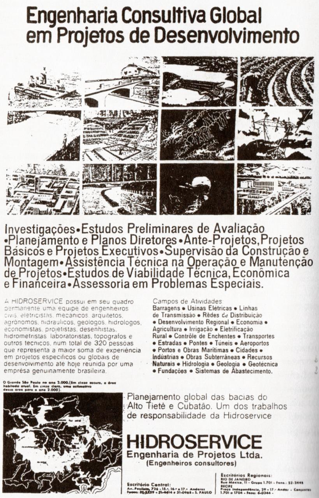

# Resumo

O trabalho propõe introduzir uma reflexão sobre a historicidade de um
personagem usualmente pouco tratado na galeria de estudos sobre os temas
do desenvolvimento territorial e urbano: o *engenheiro consultor*. As
origens da Engenharia Consultiva na verdade confundem-se com o próprio
desenvolvimento econômico do país nas primeiras décadas do séc. XX,
quando identificamos os momentos primordiais de arranque rumo à
industrialização e à urbanização. Além disso, trata-se também de um
processo evidentemente ligado à própria *afirmação de um campo
profissional*, quando os engenheiros gradualmente passam a se deslocar
das atividades manufatureiras dos canteiros de obra para os escritórios
de projeto e consultoria, reivindicando seu conhecimento *técnico e
científico* sobre o processo de produção do espaço, seu posto
propriamente *gerencial* na tarefa de contribuir ao desenvolvimento
nacional. No campo de especialidades em que transitam, estes
profissionais alcançarão o comando de grande empresas de engenharia do
setor consultivo que, por sua vez, irão se espraiar, sobretudo entre os
anos 1960 e 70, por áreas de atuação as mais diversas -- desde o projeto
de hidrelétricas, estradas e portos ao desenvolvimento de planos
diretores locais, numa movimentação alavancada pelos altos investimentos
estatais direcionados à construção da infraestrutura de um país em
franco processo de expansão urbana.

Palavras-chave: engenheiros consultores, empresas de Engenharia
Consultiva, campo profissional, desenvolvimento urbano, expansão
territorial

# Abstract

The paper proposes to introduce a reflection on the historicity of a
character usually little present in studies gallery on the themes of
territorial and urban development: the consulting engineer. The origins
of Consulting Engineering actually merge with the own country\'s
economic development in the early decades of the century XX, when we
identify the primary boot times towards industrialization and
urbanization. Moreover, it is also a course connected with the very
assertion of a professional field, when engineers gradually start to
move the manufacturing activities of construction sites to design and
consulting process offices, claiming its technical and scientific
knowledge about the process of production of space, proper managerial
post at their task of contributing to national development. In the field
of specialties in passing, these professionals achieve command of large
engineering companies in the advisory sector that, in turn, will spread,
especially between 1960 and 70, by diverse practice areas -- from design
hydroelectric plants, roads and ports to the development of local master
plans, stimulated by high state investments on building the
infrastructure of a country in a major phase of urban expansion.

Keywords : consulting engineers, Consulting Engineering firms,
professional field, urban development, territorial expansion

# Introdução

A reconstituição, em pequena escala, das particularidades de um campo
profissional específico é parte fundamental do processo de construção da
historiografia do urbano tanto quanto a aposta em grandes narrativas de
abordagem transdisciplinar. É a partir desta premissa que o presente
trabalho propõe introduzir uma reflexão sobre a historicidade de um
personagem usualmente pouco tratado na galeria de estudos sobre os temas
do desenvolvimento territorial e urbano: o *engenheiro consultor*.

As origens da Engenharia Consultiva na verdade confundem-se com o
próprio desenvolvimento econômico do país nas primeiras décadas do séc.
XX, quando identificamos os momentos primordiais de arranque rumo à
industrialização e à urbanização. Mas, além disso, trata-se, aqui, de um
processo evidentemente ligado à própria *afirmação de um campo
profissional*, quando os engenheiros gradualmente passam a se deslocar
das atividades manufatureiras dos canteiros de obra para os escritórios
de projeto e consultoria, reivindicando seu conhecimento *técnico e
científico* sobre o processo de produção do espaço, seu posto
propriamente *gerencial* na tarefa de contribuir ao desenvolvimento
nacional.

No campo de especialidades em que transitam, estes profissionais, como
se verá, alcançarão o comando de grande empresas de engenharia do setor
consultivo que, por sua vez, irão se espraiar, sobretudo entre os anos
1960 e 70, por áreas de atuação as mais diversas -- desde o projeto de
hidrelétricas, estradas e portos ao desenvolvimento de planos diretores
locais, numa movimentação alavancada pelos altos investimentos estatais
direcionados à construção da infraestrutura de um país em franco
processo de expansão urbana.

# Engenharia Consultiva: a afirmação de um campo profissional

> Até meados da década de 1940, o negócio da construção em São Paulo
> envolvia, em geral, dois tipos de firmas particulares: aquelas que
> possuíam seus operários, equipamentos e maquinaria, e aquelas que
> trabalhavam por administração \[\...\]. Ambos os tipos podiam se
> dedicar ou à tarefa unificada da construção ou a tarefas
> especializadas: estruturas de concreto armado, cantaria, carpintaria,
> detalhes de estuque, instalações elétricas e hidráulicas, serralheria,
> jardinagem e mesmo empreita de mão de obra \[\...\].
>
> As firmas particulares -- os escritórios técnicos, como às vezes eram
> chamadas -- cuidavam de todas as etapas necessárias para a realização
> de uma obra (ou da tarefa em que se especializavam): o projeto, o
> orçamento e a execução.
>
> \[\...\] Não existiam firmas que se dedicavam apenas à feitura de
> projetos, já que seu custo estava incluído no preço total da obra.
> \[\...\] o projeto não se caracterizava como mercadoria para o
> proprietário de um empreendimento imobiliário, para quem ficava,
> aparentemente, de graça (Ficher, 2005, pp. 240-41).

A anotação de Sylvia Ficher lhe serve de mote à reconstrução do contexto
em que

> *projeto* e *construção* passam a ser disputados como serviços
> específicos, clivados.

Nesse momento, ou seja, ainda em meados dos anos 1920, arquitetos
passavam a defender o exercício projetual como exclusivo de seu métier
(que, ademais, haveria de ser respeitado por seu estatuto artístico,
acima dos "problemas da engenharia na construção"1), ainda que com pouca
ressonância no campo profissional efetivo, que de

fato reunia no mesmo espaço dos negócios da construção engenheiros,
arquitetos e construtores (práticos não-diplomados), confundindo-os numa
prática de ofício comum, sem atribuições muito claras sobre o comando
das atividades.

Ficher segue seu texto nos dando pistas a respeito dessa cisão que logo
mais se efetivaria por completo, inevitavelmente, como de fato ocorreu:
a adoção da atividade exclusiva de projetista seria "o itinerário
seguido pela classe \[dos arquitetos\] para superar as falhas que via na
regulamentação quanto à sua individualidade profissional e, de quebra,
valorizar-se com a aura do trabalho artístico" (Ficher, 2005, p.244).2

Na verdade, na rotina interna de diversas empresas construtoras, essa
independência do trabalho do arquiteto já acontecia na prática. Santos
(2008) cita um depoimento de 1933, colhido do periódico A Casa, em que o
empreiteiro Eduardo Pederneiras, dos grandes de então, na cidade do Rio
de Janeiro, declara objetivamente que "o arquiteto é aquele que projeta"
e que "arquiteto e construtor são duas entidades completamente
separadas". Sua firma, dizia ele, estava organizada em seções autônomas
de projeto e construção, ainda que trabalhassem todos em regime de
cooperação. Essa separação já era comum na França e nos EUA e
certamente, segundo suas convicções, não tardaria a se oficializar no
Brasil (Santos, 2008, p.259). Sylvia Ficher (2005), por sua vez, lembra
que nos órgãos de obras públicas e nas contratações de projeto pelo
estado e pelo município de São Paulo também já era possível encontrar
indícios dessa separação há

alguns anos.3

Havia, no entanto, uma terceira figura contraposta entre arquitetos e
engenheiros -- a do já mencionado construtor não-diplomado (o mestre de
obra), o que complexificava ainda mais a condição da disputa em jogo,
visto que tornava também o papel dos engenheiros pouco preciso: seriam
eles, os engenheiros, detentores, afinal, de um conhecimento "técnico"
relacionado à segurança, à economia, à eficiência das construções ainda
não valorizado à altura de sua importância. Portanto, também aí foram
necessárias verdadeiras campanhas de apelo e legitimação do ofício,
ligadas à expansão dos cursos de engenharia, à regulamentação
profissional e também à normalização técnica do emprego dos materiais.

Na larga história da engenharia brasileira recontada por Telles (1993),
durante este processo de luta pela valorização profissional e de aumento
do mercado de trabalho, a insistência nos processos de controle do
canteiro, de administração geral e de controle técnico da obra
contribuíram para a "transição gradual dos antigos 'engenheiros
enciclopédicos' para os engenheiros especialistas nos diversos ramos da
profissão"

> 1 Como afirmara Christiano Stockler das Neves, então diretor do curso
> de engenheiro-arquiteto da Escola de Engenharia Mackenzie (Ficher,
> 2005, p.243).
>
> 2 O registro mais emblemático dessa trajetória seria o escritório de
> projetos de Rino Levi, arquiteto formado na Itália em 1926 e que, em
> meados de 1930, decide, já radicado em São Paulo, dedicar-se
> exclusivamente ao
>
> desenvolvimento projetual (Ficher, 2005, p.244-45). Mas, há outros,
> inclusive anteriores a Levi, recuperados por Rabelo (2011) e Freitas
> (2011), no Rio de Janeiro, como é o caso do arquiteto peruano Robert
> Prentice, diplomado na Inglaterra, e do escritório Heitor de Melo,
> comandado pelos arquitetos Archimedes Memória e Francisque Cuchet, o
> mais importante da cidade na década de 1920.
>
> 3 A autora cita um exemplo precoce de independência projetual: "a
> série de projetos de escolas e cadeias feita por Vitor Dubugras como
> funcionário da Secretaria da Agricultura, Comércio e Obras Públicas na
> década de 1890" (Ficher, 2005, pp.241).

(p.705). A construção de ferrovias, portos, serviços de abastecimento
d'água, minas e metalurgia já vinha fazendo destacar engenheiros
importantes, que iam aos poucos se distinguindo em cada uma dessas
áreas, como é o caso de Saturnino de Brito e Alfredo Lisboa4.

Saturnino de Brito, inclusive, é considerado por Telles (1993) como um
dos precursores da "engenharia consultiva no Brasil, com a fundação, em
1920, do escritório de engenharia que levava seu nome":

> São interessantes os anúncios e impressos desse escritório, onde está
> dito que 'não se encarrega de construções e empreitadas', dedicando-se
> somente 'a estudos, projetos e pareceres, bem como administração e
> fiscalização de obras, sob regime exclusivamente técnico' (Telles,
> 1993, p.374).

No entanto, os domínios "técnicos" do engenheiro na atividade
construtiva, o seu interesse em requisitar para si o comando e a direção
das obras, acontecerá de forma mais incisiva justamente no contexto
analisado por Roberto Estaáquio dos Santos e por Maria Luiza Freitas:
ambos, corroborando argumentos também defendidos por Telles (1993), nos
introduzem uma questão que parece fundamental para entender o modo como,
em meio aos engenheiros civis, virá a suceder-se um desmembramento
gradativo das funções do ofício -- engenheiros construtores,
projetistas, calculistas, gerenciadores

--, sugerindo que as solicitações de especialização no campo da
construção estavam, na verdade, atreladas a transformações ainda mais
amplas: a constituição e a consolidação da cultura técnica do concreto
armado no Brasil, que requisitou, numa conjuntura específica, formação e
aperfeiçoamento para seu emprego em grande escala (Santos, 2008;
Freitas, 2011).

As exigências próprias do material, a entrada de grandes empresas
construtoras no país, o desenvolvimento de pesquisa e inovação
tecnológica acirravam as fronteiras de disputa em torno da "ciência" de
sua aplicação, fazendo surgir, num movimento de duplo sentido, novos
agentes no processo de modernização do país: é na década de 1930 que se
estabelece, por exemplo, o Instituto de Pesquisas Tecnológicas em São
Paulo, como autarquia que executa, além de ensaios, pesquisas voltadas
para atender a indústria; mais adiante, se organiza a Associação
Brasileira de Normas Técnicas (ABNT), que estabelece regras para o
emprego de materiais, "padronizando métodos de ensaios e especificação
de produtos". Foi a ABNT que estudou e publicou a primeira norma oficial
e aplicável de utilização do concreto para todo o país, exatamente no
ano de 1940, a NB-1: Cálculo e execução de obras de concreto armado
(Nagamini, 1994,

p.126-27)5.

> 4 Conforme observam Gitahy & Pereira (2002), é na década de 1930 que
> os conflitos presentes no cotidiano da organização do trabalho da
> construção vão encontrar suas "saídas": de um lado, qualificando a
> atuação técnica e gerencial dos engenheiros (e também arquitetos) e,
> de outro, desqualificando o trabalho direto no canteiro do mestre de
> obras, relegado à instransponível subordinação aos diplomados
> detentores de conhecimento técnico científico.
>
> 5 Segundo Gitahy & Pereira (2002), em São Paulo, é na Escola
> Politécnica, fundada em 1893, que se inaugura o
>
> Gabinete de Resistência dos Materiais (1899), "locus em que se
> institucionaliza a pesquisa tecnológica voltada para a indústria da
> construção. \[\...\] É para o Gabinete que se voltam as atenções, nos
> anos 1920, quando vem a público a necessidade de apoio técnico à
> indústria em acelerado processo de crescimento e diversificação. De
> fato, o Gabinete autonomiza-se da Escola para atender à demanda por
> ensaios das empresas, em 1926, transformando-se no famoso Laboratório
> de Ensaio de Materiais. Em 1934, com apoio material do governo
> estadual e das empresas privadas, assume novo formato institucional,
> orçamento próprio e seu atual nome: Instituto de Pesquisas
> Tecnológicas de São Paulo" (p.27). É a reunião de laboratórios de
> materiais visando à

As teses de Santos (2008) e Freitas (2011) versam também sobre a
importância dos canteiros de inovação empreendidos pelas próprias
empresas especializadas em concreto que chegam ao Brasil no primeiro
quarto do século XX, alemãs e dinamarquesas, elas mesmas responsáveis
pela formação técnica de engenheiros e arquitetos para a lida com as
novidades construtivas de então.

Segundo sistematização feita por Nagamini (1994), em vinte anos, entre
1929 e 49, são criadas no Brasil 47 empresas ligadas ao setor da
construção (soma que exclui as inúmeras já existentes) para atender as
demandas de crescimento urbano e infraestrutural do período. Num mercado
antes dominado por firmas estrangeiras, começam a despontar aquelas que
mais tarde se tornariam as maiores empreiteiras do país, como a SERVIX e
a Camargo Correa, abrindo espaço de trabalho para os engenheiros
brasileiros. Conforme a mesma autora, toda esta movimentação fez também
surgir, paralelamente, os primeiros escritórios especializados em
cálculo estrutural:

> O projeto dos edifícios altos é feito, nessa época, pela próprias
> construtoras ou por escritórios de arquitetura; os cálculos
> estruturais, porém, são levados a efeito por escritórios de cálculo,
> dirigidos e chefiados por notáveis engenheiros especializados em
> cálculo de concreto armado (Nagamini, 1994, p.127).

Emílio Henrique Baumgart seria o maior exemplo a citar de engenheiro
que, no decurso de todos estes atravessamentos e transformações no campo
profissional, se especializa exclusivamente em cálculo,
responsabilizando-se pelo dimensionamento estrutural de obras icônicas
de nosso repertório arquitetural, caso do edifício do Ministério da
Educação e Saúde Pública, de 1938.

Nas palavras esclarecedoras de Santos (2008):

> A tecnologia do concreto, sobretudo a normalização de procedimentos
> teve um papel importante na consolidação de um lugar distinto para os
> engenheiros, em que a noção de segurança, associada com o domínio do
> conhecimento tecnológico, aparece como fonte de legitimação. \[\...\]
> A partir dos anos 1920, os laboratórios de ensaios de materiais passam
> a centralizar as experiências relativas às propriedades dos materiais,
> iniciando a organização do conhecimento e fundamentando a elaboração
> de normas técnicas para utilização de materiais de construção. O
> aumento do controle tecnológico significa o aparecimento de mais um
> poder dentro do campo -- os acadêmicos. \[\...\] Dessa forma pode-se
> considerar a tecnologia do concreto armado como um fator de
> organização da engenharia civil, pois cria-se em torno do concreto uma
> aura de complexidade e um certo misticismo em torno das propriedades
> tecnológicas do cimento e do aço. O mesmo ocorre em relação à
> organização da obra e ao seu controle tecnológico (Santos, 2008,
> pp.175-76).
>
> elaboração de normas técnicas que leva à criação da ABNT, em 1940. Os
> empenhos de normalização da construção reforçam, segundo os autores, a
> articulação daquilo que chamam de "complexo industrial da construção",
> favorecendo e intensificando a produção civil naquela época, cujo
> espelho notório seria a verticalização da cidade de São Paulo.

Pois, em meio a um processo que não se pode tomar em linearidade,
porque, ademais, envolvia não apenas uma metamorfose na configuração
produtiva, econômica e territorial do país, mas também disputas
ideológicas de toda ordem -- disputava-se mercado de trabalho,
disputava-se um estatuto profissional, disputava-se uma conceituação de
arte e de técnica, disputava-se um programa sociocultural, disputava-se
uma participação efetiva na modernidade --, embora não haja utilidade em
tentar particularizar pioneiros e paladinos nesta história, é
impossível, por outro lado, deixar de destacar alguns personagens de
reconhecida importância no meio, como, sem dúvida, é o caso de Baumgart
e Saturnino de Brito, ainda que em distintas áreas de atuação no campo
da engenharia.

Seria possível reconhecer, portanto, no emblema de Baumgart, Brito e
outros tantos que como eles delinearam trajetórias similares uma espécie
de "marco-zero" dos engenheiros consultores que mais tarde se
autodenominarão como tal. Escritórios como estes (de cálculo e/ou
projeto, pareceres, administração, fiscalização) pipocaram pelo eixo
Rio-São Paulo, sobretudo, a partir da década de 1940. E aos poucos,
começaram a derivar para outras várias áreas de atuação, cumprindo as
demandas de mais e mais especialização solicitadas pela própria evolução
do ofício. Telles encerra a questão:

> Desde a segunda metade do século \[XIX\] até a década de 1920, o
> grande empregador de engenheiros no Brasil eram as estradas de ferro,
> vindo em seguida os serviços públicos em geral (sistemas de águas e de
> esgotos, portos, rodovias, etc), sendo pequeno o número de engenheiros
> na atividade que hoje em dia chama-se propriamente 'construção civil'.
> O concreto armado, introduzido entre nós a partir dos primeiros anos
> \[do século XX\], e cuja vulgarização acentuou-se na década de 1920,
> alterou completamente esse panorama, porque, daí por diante, a maioria
> dos engenheiros passou a se dedicar ao concreto armado, na construção
> civil propriamente dita, e também no projeto e construção de pontes,
> barragens, muros, etc. Essa evolução da preferência teve reflexos
> sociais importantes: por um lado, \[\...\] afugentou muitos
> 'engenheiros-práticos' \[construtores não- diplomados\] e outros
> curiosos da construção civil \[\...\], por outro lado elevou o
> 'status' social dos engenheiros e propiciou o surgimento e
> desenvolvimento de numerosas firmas de projeto e construção, algumas
> das quais transformaram-se depois em importantes organizações de
> engenharia. Assim, os engenheiros deixaram de ser quase que somente
> funcionários públicos ou de empresas ferroviárias, passando a dirigir
> suas próprias empresas de engenharia (Telles, 1993, pp.717-18).

# Engenheiros projetistas e consultores: agentes do desenvolvimento territorial e urbano -- 1960/70

Desde seu surgimento até meados dos anos 1970, segundo Camargo (1994),
identificamos um processo gradual de diversificação das empresas de
Engenharia Consultiva, que se multiplicam em serviços para atender a
demanda, respondendo também a uma política de reserva de mercado de
consultoria já estabelecida no país,

com a multiplicação de cursos superiores e a regulamentação
profissional6.

De fato reconhecemos nesses anos a formação de importantes empresas
atuantes neste nicho de mercado, com amplo leque de atuação, como é o
caso da HIDROSERVICE Engenharia de Projetos Ltda, fundada em 1958 pelo
empresário Henry Maksoud, do CNEC - Consórcio Nacional de Engenheiros
Consultores S.A. (ainda ativo), criado em 1959, da PROMON, de 1960 e da
THEMAG, de 1961 (ambas também ativas). Já nesse momento,
caracterizavam-se, a maioria delas, por essa atuação em atividades
largamente diversificadas, de escala nacional, como demonstra o anúncio
da HIDROSERVICE, listando suas múltiplas áreas de prestação de serviços:

> 
>
> Figura 1. Anúncio da HIDROSERVICE no jornal Folha de S. Paulo (1967).
> Fonte: Feldman, 2005a.
>
> 6 Camargo (1994) mostra como gradativamente estas empresas passam a
> dominar mais e mais os setores estratégicos relacionados ao
> desenvolvimento territorial e urbano, impulsionadas pelo Estado, entre
> os anos 1960- 70: depois da entrada no setor das hidrelétricas, em
> 1957, elas direcionam-se para áreas como transportes, saneamento, meio
> ambiente e telecomunicações.

Nesse contexto, um fato curioso e importante merece destaque: segundo o
cadastro da FINEP - Financiadora de Estudos e Projetos de 1976,
registrado por Feldman (2005a), apenas 20% das empresas de Engenharia
Consultiva formaram-se antes de 1966, ou seja, do ano em que se
regulamentou o SERFHAU - Serviço Federal de Habitação e Urbanismo,
subordinado ao BNH - Banco Nacional da Habitação, cujo papel seria o de
"promover, difundir e uniformizar a prática de elaboração de planos
diretores de desenvolvimento, segundo uma postura de integração
multidisciplinar, numa perspectiva de racionalidade técnica" e de
"neutralidade da atuação governamental", como se pretendendo
distanciar-se dos vínculos fisiológicos marcadamente presentes no
Estado, valorizando-se "o saber competente, o saber técnico, na
elaboração das propostas de intervenção nas cidades" (Ferreira, 2007,
p.44).

Outros números significativos comprovam o atrelamento da regulamentação
do SERFHAU à penetração das empresas de Engenharia Consultiva no setor
que se convencionou chamar "desenvolvimento urbano": baseando-se em
dados do trabalho de Eurico Azevedo7, Sarah Feldman nos mostra que, dos
cem municípios analisados pelo pesquisador, 91% tiveram seus planos
diretores realizados a partir de 1967, em período

posterior, portanto, à arregimentação do órgão federal. Além disso, a
maioria absoluta destes planos acontece pelas mãos das consultoras
especializadas (43,7%). Sobre elas, Feldman (2005a) exemplifica sua
forma de atuação:

> \[\...\] uma mesma empresa elabora planos diretores para cidades de
> qualquer parte do Brasil, como também projetos de saneamento, de
> engenharia civil etc.
>
> \[\...\] Um levantamento \[realizado sobre os trabalhos desenvolvidos
> por uma destas empresas, a ASPLAN\] aponta que nos anos 1960 a empresa
> atua na consultoria para os Ministérios da Aeronáutica, Transportes e
> Planejamento, em grandes projetos de rodovias, abastecimento de água
> etc; além disso, elabora planos para inúmeros municípios, como
> Bragança (1966), Londrina (1968), Mogi das Cruzes (1969), Americana
> (1970), e também realiza consultorias para o setor privado (Feldman,
> 2005a, p.230).

A já mencionada HIDROSERVICE, a maior das empresas de Engenharia
Consultiva do Brasil nesse momento, desenvolveu, via SERFHAU, o plano de
desenvolvimento integrado da região metropolitana de Belo Horizonte,
então com 1.200.000 habitantes, entre 1968 e 69. De um modo geral, ao
longo de sua atuação, a empresa reuniu um número bastante expressivo de
trabalhos em seu portfólio, com um grosso de projetos desenvolvidos para
o setor público, seja no Brasil, seja em outros países da América Latina
e da África, como o Peru, Bolívia, Equador e Nigéria, para os quais se
expandiu, sobretudo, a partir da segunda metade dos anos 1970.

As mesmas ASPLAN e HIDROSERVICE são citadas também por Chiquito (2010)
como algumas das contratadas pela Comissão Interestadual da Bacia
Paraná-Uruguai (CIBPU), criada ainda em 1951, "a partir de um 'consórcio
para o desenvolvimento regional' entre setes estados brasileiros (Minas
Gerais, Goiás, Paraná, Santa Catarina, Mato Grosso, São Paulo e Rio
Grande do Sul)". Segundo a pesquisadora, a Comissão

> 7 AZEVEDO, Eurico de Andrade. "Avaliação do Planejamento Municipal no
> Estado de São Paulo". Relatório de Pesquisa, FAPESP/USP/EESC, 1976.

cumpriu um papel importante nas experiências brasileiras de planejamento
regional no pós-guerra, sobretudo no que se refere às teorias e
concepções de região e desenvolvimento que mobilizou e também pelo
grande número de convênios e contratos firmados com órgãos públicos,
instituições, universidades e empresas de consultoria nacionais e
internacionais para o trabalho de levantamento, elaboração de projetos e
estudos relativos aos estados comissionados, seus recursos naturais, as
necessidades das populações da bacia e as possibilidades de
desenvolvimento colocadas.

É interessante notar a diversidade de empresas de consultoria que
chegaram a desenvolver trabalhos para CIBPU nos seus 21 anos de
trajetória: desde a holandesa Deerns Planejamento Engenharia S.A.,
passando pelo Escritório Técnico Saturnino de Brito, pela Camargo Corrêa
S.A., pelas citadas ASPLAN e HIDROSERVICE até a Sociedade de Análises
Gráficas e Mecanográficas Aplicadas aos Complexos Sociais, a SAGMACS
(Chiquito, 2010).

É evidente, pois, o despertar do interesse econômico empresarial pelo
setor de desenvolvimento urbano, acentuado, certamente, no pós-64, a
partir da injeção vultosa de recursos gerenciados via BNH, ao qual o
SERFHAU estava submetido. Segundo Feldman (2005b), esse período
demarcaria, na verdade, o ápice de uma espécie de "tecnicização do
urbanismo", em curso no país já desde os anos 1930: a terceirização dos
serviços de consultoria especializada para o desenvolvimento dos planos
diretores -- ou, por outra, o empresariamento do planejamento -- teria a
ver com esse processo, em que se passa ao predomínio de uma "concepção
administrativa que tem como principal característica o divórcio entre a
atividade técnica e a ação política e cotidiana da administração" (p.3).

Conforme o registro de Durand (1972, p.86), do alto dos postos de
comando, estes novos "empresários de planejamento", agora imbuídos
também da tarefa de criar as diretrizes de ocupação e expansão das
cidades, circulavam pelos meandros dos gabinetes políticos, na tentativa
de garantir a contratação de planos, "enquanto os departamentos
financeiros das empresas ocupavam-se com a elevação dos custos (em
homem/hora) dos estudos e levantamentos que não cessavam de ramificar-se
e aprofundar-se". No nível das "equipes executantes", o clima era de
otimismo com a "troca de experiências, de refinamento metodológico, de
tentativa de se chegar a proposições viáveis e imediatas", que fossem
capazes de corrigir as distorções que a industrialização e a urbanização
desenfreadas provocavam do ponto de vista urbano e social no país.

O autor ressalta que a iniciativa privada, aproveitando-se do contexto
favorável de ampliação da demanda, absorvia um exército flutuante de
especialistas em seus quadros profissionais, e registra, a esse
respeito, um significativo depoimento de um arquiteto empregado em uma
firma de Engenharia Consultiva de então, que lembra a presença, ali, de
técnicos de alta qualificação profissional formados na escola lebretiana
e nas experiências do governo Carvalho Pinto, ao mesmo tempo em que
reforça o senso de oportunidade de uma HIDROSERVICE, que nasce como uma
grande empresa de projetos e mais tarde se expande para o nicho do
planejamento integrado, mencionando sua "vastíssima capacidade comercial
e penetração no governo" (Durand, 1972, p.90).

Nesse contexto, de permeabilidades e trânsitos entre os setores público
e privado, em 1966 é criada a Associação Brasileira de Consultores de
Engenharia - ABCE, congregando empresas brasileiras de engenharia
atuantes, no ramo da consultivo, em diferentes setores de
infraestrutura, indústria, mineração, energia, petróleo e gás,

transportes, recursos hídricos e saneamento, meio ambiente, etc,
demonstrando, mais do que tão somente a ampliação da demanda por
serviços dessa natureza, sobretudo o nível de organização deste campo
profissional no período.

Os números de expansão corporativa do setor registrados por Camargo
(1994) demonstram um período de bonança que engloba toda a década de
1970: com a permanência dos investimentos em áreas estratégicas da
economia brasileira, que começou a apresentar sinais claros de recessão
apenas na virada para os anos 1980, muitas empresas de Engenharia
Consultiva chegam a ultrapassar 2.000 funcionários à época, constituindo
corpos técnicos qualificados, reunidos em equipes multidisciplinares. A
PROMON, por exemplo, que entre 1960-65 contava com uma média de apenas
60 funcionários, chega a 1986 com 4.140 empregados, exatamente no
momento em que o campo profissional vê-se obrigado a se reinventar para
enfrentar a crise que exauria o setor produtivo nacional (Camargo,
1994).

# Observações finais

Presentes em algumas poucas narrativas em parte dedicadas ao estudo
sobre os saberes e experiências de produção da cidade8, é importante que
se diga que os especialistas da Engenharia Consultiva e a atuação destas
empresas no ramo do desenvolvimento territorial e urbano ainda não
mereceram da historiografia um olhar mais atento e focalizado. Nesse
sentido, as reflexões aqui presentes pretendem ser também uma

espécie de estímulo ao início desta empreitada acadêmica, de modo que
possamos alargar as fronteiras do conhecimento já acumulado sobre a
prática profissional dos planejadores e produtores do território, e,
mais do que disso, sobre a própria história da urbanização brasileira.

# Referências bibliográficas

> CAMARGO, Teresinha A. M. B. H. *As empresas de projeto de engenharia
> de grande porte no Brasil: passado, presente e a reengenharia para o
> futuro*. Tese de Doutorado. Escola Politécnica - USP. São Paulo, 1994.
>
> CHIQUITO, Elisângela. A. "A Comissão Interestadual da Bacia
> Paraná-Uruguai (CIBPU) e o planejamento regional no Brasil
> (1951-1972)". *Anais do I ENANPAQ - Encontro da Associação Nacional de
> Pesquisa e Pós-graduação em Arquitetura e Urbanismo*: Arquitetura,
> Cidade, Paisagem e Território - percurso e prospectivas, 2010.
>
> DURAND, José Carlos G. *Arquiteto: estudo introdutório de uma
> ocupação*. Tese de Doutorado, FFLCH-USP. São Paulo, 1972.
>
> FELDMAN, Sarah. *Planejamento e Zoneamento. São Paulo, 1947-1972*. São
> Paulo: Edusp/Fapesp, 2005a.
>
> . "O Arranjo Serfhau: Assistência Técnica aos Municípios/ Órgãos De
> Planejamento/ Empresas De Engenharia Consultiva". *Anais do XI
> ENCONTRO NACIONAL DA ANPUR*. Salvador, maio de 2005b.
>
> FERREIRA, Mauro. *Planejamento urbano nos tempos do SERFHAU: o
> processo de construção e implementação do Plano Diretor de
> Desenvolvimento Integrado de Franca*. Tese de Doutorado. EESC-USP. São
> Carlos, 2007.
>
> FICHER, Sylvia. *Os arquitetos da Poli: ensino e profissão em São
> Paulo*. São Paulo:
>
> 8 Como nos trabalhos de Feldman (2005a e 2005b).

FAPESP/Edusp, 2005.

> FREITAS, Maria Luiza de. *Modernidade concreta: as grandes
> construtoras e o concreto armado no Brasil, 1920 a 1940*. Tese de
> Doutorado. FAU-USP. São Paulo, 2011.
>
> GITAHY, Maria Lucia Caira & PEREIRA, Paulo Cesar Xavier (orgs.). *O
> complexo industrial da construção e a habitação econômica moderna,
> 1930-1964*. São Carlos: RiMa, 2002.
>
> NAGAMINI, Marilda. "Construção de edifícios e engenharia urbana". In
> MOTOYAMA, Shozo (coord.). *Tecnologia e industrialização no Brasil:
> uma perspectiva histórica*. São Paulo: Ed. da UNESP/CEETEPS, 1994.
>
> SANTOS, Roberto Eustáaquio dos. *A Armação do Concreto no Brasil:
> história da difusão da tecnologia do concreto armado e da construção
> de sua hegemonia*. Tese de Doutorado. Faculdade de Educação da UFMG.
> Belo Horizonte, 2008.
>
> TELLES, Pedro Carlos da Silva. *História da Engenharia no Brasil*.
> Século XX. Rio de Janeiro: Clavero Editoração, 1994.
