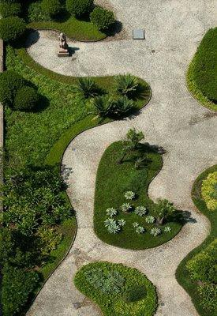
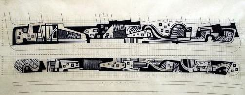
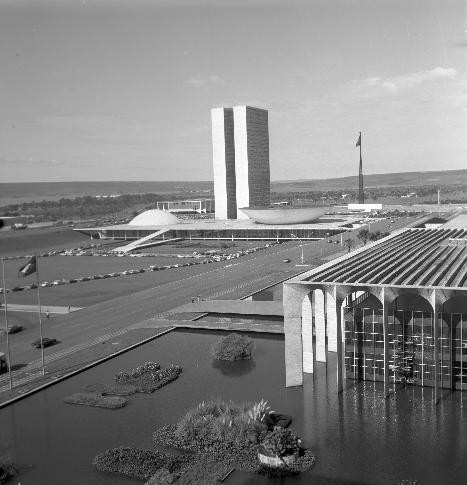
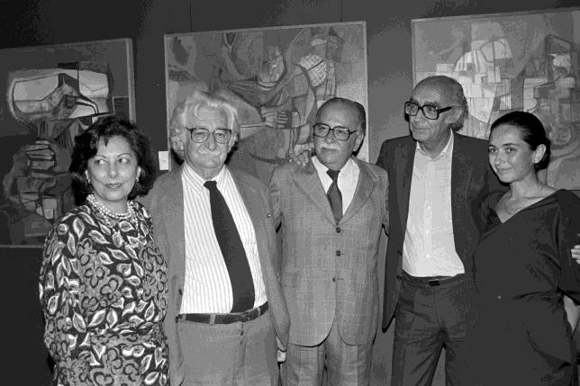
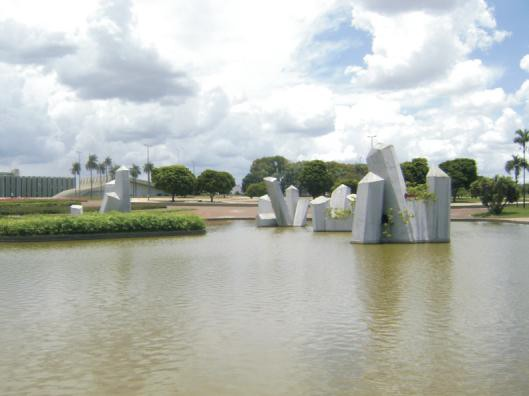
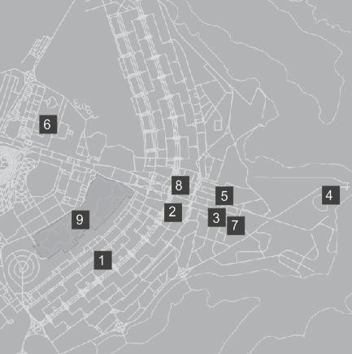

# Resumo

Roberto Burle Marx, artista-paisagista que em consonância com a
modernidade proposta pelas artes e pela arquitetura no século XX, buscou
atribuir identidade ao paisagismo moderno brasileiro combinando a
inovadora expressão plástica com o uso de espécies nativas brasileiras.
O papel desempenhado por ele tanto na elaboração de jardins para
edifícios quanto na produção do espaço urbano é de suma importância
histórica. Seu discurso modernista, representado pelos seus jardins,
praças e parques, associado as transformações de sua expressão
artística, estão materializados nas propostas para capital federal há
mais de cinquenta anos. Em julho de 2011, o governador do Distrito
Federal, Agnelo Queiroz, aprovou o decreto nº 33.040, que reconhece o
valor patrimonial e protege nove jardins de Burle Marx na capital:
Superquadra 308 Sul, Banco do Brasil, Palácio do Itamaraty, Palácio do
Jaburu, Ministério da Justiça, Praça dos Cristais, Tribunal de Contas da
União, Teatro Nacional e Parque da Cidade. O presente artigo narra uma
inédita trajetória do artista na cidade e apresenta uma listagem de
todas as suas propostas para a capital federal, incluindo os projetos
que não foram realizados, traçando um panorama de suas proposições
brasilienses e evidenciando as marcas deixadas por ele na história da
cidade.

Palavras-chave: Burle Marx, paisagismo, espaço urbano, biografia,
patrimônio

# Abstract

Roberto Burle Marx , a landscaper artist who ,in line with modernity
proposed by arts and architecture in the twentieth century , sought to
assign identity to the Brazilian modern landscaping combining innovative
artistic expression with the use of native Brazilian species . The role
played by him both in developing gardens for buildings as in the
production of urban spaces is of great historical importance . His
modernist discourse , represented by its gardens , squares and parks ,
associated to its artistic expression transformations , are embodied in
the proposals for the federal capital for over fifty years. In July 2011
, the governor of the Federal District , Agnelo Queiroz , adopted Decree
No. 33,040 , which recognizes the asset value and protects nine gardens
of Burle Marx in the Capital : Superquadra 308 South , Bank of Brazil ,
Itamaraty Palace , Palace of Jaburu , Ministry of Justice , the Crystal
Plaza , Court of Audit , National Theatre and City Park. This article
chronicles an unprecedented trajectory of the artist in the city and
shows a listing of all its proposals for the federal capital , including
projects that were not acomplished, drawing a picture of his
brasilienses propositions and showing the marks left by him in the
history of city.

Keywords: Burle Marx, landscaping, urban space, biography, heritage

# O edifício e a cidade: diferentes representações em escalas distintas

Apesar da formação em pintura, praticamente toda a produção paisagística
Roberto Burle Marx (1909-1994) é vinculada ao desenvolvimento da "nova"
arquitetura, ou seja, foi a partir do contato com os arquitetos
modernistas que Burle Marx adquiriu a base para criar seus jardins: o
edifício moderno.

Colaborador de importantes nomes da arquitetura moderna brasileira, tais
como Lucio Costa, Oscar Niemeyer, Affonso Eduardo Reidy, Rino Levi, os
irmãos Roberto e tantos outros, Marx encontrou no diálogo do edifício
com o jardim sua expressão pessoal, que passou a ser a síntese da
linguagem paisagística moderna. Assim, além de inovar na forma dos
jardins, elevava a aparência do edifício a uma dimensão superior.

No entanto, ao contrário da produção de muitos paisagistas que
restringem o fazer paisagístico a uma complementação de uma produção
arquitetônica, Burle Marx expandiu seu trabalho na dimensão do urbano. A
mesma excelência da expressão formal que ele conseguiu nos edifícios dos
colegas modernistas, ele transmitiu na síntese das propostas para o
espaço da cidade. Portanto é possível afirmar que seus trabalhos nos
edifícios e na cidade são indissociáveis tanto na forma artística quanto
quanto na expressividade do espaço criado, além de sempre ocorrem
simultaneamente durante sua vida.

Marx insere-se em uma época de produções paisagísticas ecléticas, em que
o jardim clássico e o romântico dominavam os projetos paisagísticos de
praças e palacetes no Brasil. Seus primeiros trabalhos, mesmo inovando
com a utilização de vegetação autóctone brasileira, refletem uma
configuração ainda vinculada aos cânones clássicos, com marcante
geometrização e simetria das formas, como se pode ver nas primeiras
propostas feitas para os jardins e praças de Recife.

No projeto dos jardins do Ministério da Educação e Saúde (Fig. 1), no
Rio de Janeiro em 1938, Marx consolida o uso de formas irregulares,
também conhecidas como ameboides ou biomórficas, que possuem segundo
Alvarez (2007) uma estreita referência na arte de Jean (Hans) Arp
(1886-1966) e Joan Miró (1893-1983). A fuga da rígida forma geométrica
marca a tendência que domina os projetos do final da década de 30 e da
década de 40, tais como os da Praça Salgado Filho (RJ, 1938), do
Instituto de Resseguros do Brasil (RJ, 1939), do Conjunto da Pampulha
(MG, 1942), da Praça Visconde de Mauá (RJ, 1944), da Residência Odete
Monteiro (RJ, 1948).

> 

Figura 1. Jardins do Ministério da Educação e Saúde. Fonte: Nucléo Ap
Porto, 2009

Contudo, a produção do paisagista não se restringe apenas às formas
biomórficas. A partir da década de 50 "se manifestam com notável
constância projetos com uma ordenação geométrica mais precisa" (MOTTA,
1983, p.86). Os exemplos da Praça da Independência (PB, 1952), a Praça
Bernardelli (RJ, 1955), Residência Francisco Pignatari (SP, 1956)
evidenciam que o tratamento orgânico e o geométrico coexistem em um
mesmo espaço.

A partir da década de 70, os trabalhos de paginação de piso com
elementos abstratos, intensificam-se e tornam-se constantes. O movimento
de arte Neoconcreta, surgido no Rio de Janeiro no fim dos anos cinquenta
como uma reação a rigidez do concretismo, está presente nas pesquisas do
paisagista que buscava romper com o desenho puro geométrico. Santos
(1999) define que essa expressão representa a:

> \[\...\] complexidade geométrica na qual o enigma das manchas,
> evocando múltiplas texturas, a presença perturbadora de cor e
> imediatismo dos materiais brutos se reúnem em uma composição
> anunciadora da arte Abstrata Lírica no seio da cidade. A progressão
> dos planos sobrepostos ou sequência de linhas quebradas são parte de
> um continuum em constante movimento \[\...\]. (SANTOS, 1999, p.)

Os grandes projetos públicos são a marca deste período, cujo marco é o
Passeio de Copacabana (Fig. 2). A partir de então, surgem nas principais
cidades brasileiras o que Santos (1999) chama de jardim "mineral", nos
quais a expressividade das plantas de forração da fase biomórfica é
substituída por uma radicalização do desenho da paginação de piso
principalmente em pedra portuguesa. Outras obras importantes incluem-se
nesta experiência, como o Largo da Carioca (1981) no Rio de Janeiro, o
Biscayne Boulevard (1988) em Miami e várias propostas em Brasília, entre
as quais a Praça das Fontes e a Praça dos Cristais na década de 1970.

> 

Figura 2. Projeto do Calçadão de Copacabana. Fonte: Nucléo Ap Porto,
2009

Ressalta-se, contudo que todas diferentes formas de expressão citadas
coexistem e mediante os exemplos evocados, esclarece e dá à justa medida
de sua dimensão artística e interferência tanto na arquitetura quanto na
paisagem urbana.

# A trajetória de Burle Marx em Brasília

Ao se buscar informações sobre a trajetória profissional de Burle Marx
em Brasília, constatou-se que os estudos realizados apresentavam
lacunas, não relacionando obras realizadas ou projetos elaborados. As
listas das obras do artista em Brasília não conferem entre si, o que
demandou a conferência de cada uma e a confrontação das mesmas com as
informações contidas nos arquivos do Escritório Burle Marx e Cia Ltda.

A partir da pesquisa em livros, reportagens, consultas ao arquivo
mencionado e à recorrência a entrevistas, foi possível traçar um
percurso do paisagista na Capital Federal. O envolvimento de Roberto
Burle Marx com Brasília começou antes mesmo que futura capital saísse do
papel. A participação do paisagista nos primeiros trâmites do concurso
do projeto de Brasília juntamente com Affonso Eduardo Reidy é

descrito por Kamp (2005)

> \[\...\] Então, depois de escolher e mapear cinco sítios, num dos
> quais Brasília seria construída, a missão seguinte do marechal José
> Pessoa, presidente da Comissão de Localização da Capital, foi convidar
> Affonso Eduardo Reidy para o planejamento da cidade junto com Roberto
> Burle Marx. Foram realizadas várias reuniões no ateliê do Leme, com a
> participação de Oscar Niemeyer, Rino Levi, Jorge Moreira e outros
> arquitetos de renome. Decidiram fazer um concurso com um júri
> internacional, presidido por William Holland, concurso ganho por Lucio
> Costa, autor do plano-diretor da cidade \[\...\] (KAMP, 2005, p.132).

Segundo Bruand (1991), Reidy, apoiado por Burle Marx, sugeriu que o
projeto fosse desenvolvido por um arquiteto estrangeiro, cogitando um
possível convite a Le Corbusier. No entanto "as circunstâncias tinham
mudado desde então; nesse meio tempo, a arquitetura brasileira tinha-se
imposto em escala mundial e os meios profissionais tinham plena
consciência disso, \[\...\] a reação quase unânime dos colegas obrigou
Reidy e Burle Marx a abandonarem a ideia" (BRUAND, 1991, p.355).

A parceria com nomes importantes do Movimento Moderno brasileiro, como
Lucio Costa e Oscar Niemeyer, possibilitou a Burle Marx a participação
em vários projetos paisagísticos de obras públicas na capital.
Considera-se sua primeira proposta para Brasília o projeto do Parque
Zoobotânico, de 1960-61. Nele, Marx buscava integrar a flora e a fauna
de diferentes regiões, inovando com "o desejo de evidenciar o
significado vital, ecológico, científico e artístico" do paisagismo
(MOTTA, 1983, p.117). A área prevista localizava-se nas proximidades do
Eixo Monumental, local onde atualmente encontra-se o Estádio Mané
Garrincha. Segundo Motta (1981), Burle Marx, com croquis, apresentava as
linhas gerais do projeto que compreendia aspectos peculiares a regiões
secas, como o sertão, e úmidas, como a Amazônia. O desejo de expor a
diversidade da flora e fauna brasileira em um só local pode ser encarado
como um ato de afirmação e valorização da identidade nacional, ideal
compartilhado pelos intelectuais modernistas de então.

Mesmo com um estudo preliminar e um detalhado programa de necessidades,
o Parque Zoobotânico não foi implantado. Nos anos seguintes, porém, Marx
dedicou-se a projetos de particulares em Brasília, realizando os jardins
da Embaixada dos Estados Unidos (1960) e os da Embaixada do Canadá
(1961). Em 1962, propôs para o Banco do Brasil no Setor Bancário Sul, na
área pavimentada que o circunda vários canteiros de diferentes tamanhos
que exibiam uma vegetação exuberante.

Somente em 1965, voltou a projetar jardins para o governo, com o projeto
do Ministério das Relações Exteriores, também conhecido como Palácio do
Itamaraty (Fig. 3). O edifício de autoria do arquiteto Oscar Niemeyer
evidenciou-se ainda mais com os jardins aquáticos e internos propostos
por Burle Marx, sendo esses considerados uma entre as obras mais
importantes do paisagista em Brasília.

> 

Figura 3. Palácio do Itamaraty e jardins externos. Fonte: Arquivo
Público DF, 1977 Sobre este projeto específico, Haruyoshi Ono afirmou
que

> \[...\] o embaixador Wladimir Murtinho foi quem o levou para trabalhar
> lá porque, até então, Roberto não tinha conseguido nenhum projeto por
> lá, por causa de desentendimentos no passado com o presidente
> Juscelino Kubitschek (ZAPPA, 2009, s.p.).

De acordo com Augusto Burle (2011) o motivo da briga com Kubitschek
seria decorrente de pagamento não recebido pelo projeto do conjunto da
Pampulha, quando o presidente era ainda prefeito de Belo Horizonte.
Outra polêmica dos anos 60 inclui o desejo que Burle Marx tinha de
implantar um parque na área correspondente à esplanada dos ministérios.
Kamp (2005) descreve que o parque

> \[\...\] era dividido em cinco grandes segmentos, representando a
> flora das regiões do Brasil com suas plantas mais características. Um
> grande lago cortaria todo o conjunto e este em função da diferença de
> nível, seria dividido em pequenas barragens de onde a água desceria,
> para formar um verdadeiro véu e contribuir para melhorar sensivelmente
> o microclima do seu entorno. No último segmento toda água excedente
> seria filtrada e aproveitada nas instalações do Congresso Nacional.
> (KAMP, 2005, p. 155)

Sobre este projeto, Haruyoshi Ono recordou:

> \[\...\] Roberto sempre quis plantar naquela área, que era bem
> inóspita e merecia uma arborização. Ele via as pessoas caminhando ao
> sol. Só tinha o gramado. Muitos anos depois, quando José Aparecido foi
> governador e Roberto fazia parte do Conselho da Cidade, juntamente com
> Oscar Niemeyer e Lucio Costa, nosso escritório foi chamado pelo
> governador para fazer o paisagismo dessa área, que ia da Rodoviária
> até o Congresso. Fizemos um estudo e chamamos o Lucio Costa para ver o
> que ele achava. Pusemos pequenos renques de
>
> palmeiras entremeados por alguma arborização, grupinhos de árvores
> para as pessoas terem uma área de sombra ao andar nas calçadas. Lucio
> Costa olhou e disse: "É, está muito bonito, mas não concordo com você,
> Roberto. Preferia que fosse uma área aberta para que daqui a gente
> possa ver os volumes arquitetônicos, e pelos lados também". Na mesma
> hora Roberto aceitou e comunicou ao governador. Encerramos o assunto.
> Para Roberto, sempre que houvesse um conceito que o convencesse, ele
> aceitava. (ZAPPA, 2009, s.p.)

Kamp (2005) relata que ainda em 1965, Burle Marx promoveu dois grandes
trabalhos de decoração no Palácio do Planalto, um para receber o
presidente da Itália, Giovani Gronchi, e outro para o Grão-Duque de
Luxemburgo. Nesta última obra, havia "a construção de torres de cinco
metros de altura, ornamentadas com flores e frutas. Para a decoração
foram feitos nove suportes de bambu, com plantas vivas, orquídeas e
bromélias, entre folhas vermelhas e douradas, boa parte extraída da
flora do cerrado, muito rica e totalmente desconhecida" (KAMP, 2005, p.
179 e 181).

Apesar das atuações na cidade nos anos 60, foi na década de 70 que Burle
Marx desenvolveu o maior número de projetos de grande importância, como
os jardins do Ministério das Forças Armadas (Praça dos Cristais) (1970),
do Ministério da Justiça (1970), do Tribunal de Contas da União (1972),
da Superquadra 308 Sul (1972), da Residência da Vice-presidência da
República (1975), do Teatro Nacional Rodrigo Santoro (1976) e o Parque
Pithon Farias (1976).

Especula-se ter havido um desentendimento entre Burle Marx e Oscar
Niemeyer nesse período. Todavia, Haruyoshi Ono afirmou durante uma
entrevista para o presente trabalho em 2011, que tudo não passou de
divergência de opiniões, sem que houvesse, de fato, rompimento entre
Niemeyer e Marx. Em contrapartida Santos (1999) afirma que Niemeyer não
aprovava o envolvimento de Marx com os militares "não lhe agradava nada
a neutralidade política de Burle Marx frente a ditadura militar e a
forma como se movia entre os círculos militares de Brasília" (SANTOS,
1999, p. 197).

Fora as especulações, os anos de 1970 não foram somente a época de ouro
da concepção dos jardins de Burle Marx em Brasília, mas também de seu
intenso envolvimento com eventos na cidade. Apesar de receber medalhas e
títulos de diversas instituições nacionais e internacionais desde 1941
(Medalha de Ouro da Escola Nacional de Belas Artes), foi somente em 1971
agraciado pelo Itamaraty com a Comenda de Ordem do Rio Branco em
Brasília.

O reconhecimento do artista na capital federal prosseguiu com a
exposição de pinturas, desenhos e tapeçarias na Sala de Exposições do
Setor de Difusão Cultural e na Sala de Exposições da Avenida W3 Sul, em
1975, promovida pelo Governo do Distrito Federal por meio da Secretaria
de Cultura e da Fundação Cultural do Distrito Federal. Neste mesmo ano,
Burle Marx participou da mostra de aquisição para o Acervo do Museu do
Artista Brasileiro, promovida pelo Conselho de Artes da Fundação Bienal
de São Paulo e Fundação Cultural de Brasília. E em 13 de setembro deste
ano, foi convidado pela Fundação Cultural do Distrito Federal para
proferir uma palestra com o tema "A influência das mudanças sociais nos
jardins".

Os anos 80, ao contrário da década anterior, foram para Marx de
realização de poucos

projetos em Brasília, resumindo-se a propostas particulares e reformas
de projetos anteriormente implantados. Porém, neste período o paisagista
foi convidado como conselheiro de cultura da capital. Segundo depoimento
de Haruyoshi Ono: "ele ia diversas vezes a Brasília participar das
reuniões de conselho". Essas muitas vezes entediantes eram acompanhadas
pelo exercício de preciosos desenhos em que Marx realizava em rascunho.
Sua presença como conselheiro pode ser confirmada em uma publicação da
Revista Módulo de 1989:

> Muito me alegrou o fato do Governador de Brasília, José Aparecido
> ter-me chamado para fazer parte do Conselho que trata dos atuais
> problemas da cidade. Fiquei contente, sobretudo, pela possibilidade de
> refazer uma série de projetos que, seja pela ausência de orientação
> por parte dos administradores ou pela falta de uma continuidade no
> tratamento, tornaram-se irreconhecíveis com o passar do tempo.
> \[\...\] Hoje, a possibilidade de restaurar esses projetos com o apoio
> integral do Governador deixa-me muito satisfeito porque todas essas
> obras representam momentos importantes da minha vida como paisagista.
> Não acredito que possa mexer em tudo mas creio que muita coisa poderá
> ser feita. (MARX, 1989-90, s.p.)

Nesta época foram realizadas duas exposições de suas pinturas na cidade,
em 1985 na Galeria de Arte e 1989, na Praxis Galeria de Arte, que contou
com sua presença e de várias personalidades, como o famoso escritor
português José Saramago (Fig. 4).

> 

Figura 4. Exposição na Praxis Galeria de Arte. Fonte: Arquivo Público
DF, 1988

A década de 90 foi marcada pelo processo de degradação de seus jardins
realizados em Brasília. Em 15 de maio de 1990, o Jornal BSB Brasil
publicou uma entrevista com Roberto Burle Marx durante sua visita a
Brasília para inauguração do Burle Marx Habitat, bloco de apartamentos
construídos pela Paulo Otávio Empreendimentos na quadra 107 Norte. Nesta
ocasião revelou que não estava muito satisfeito com o tratamento dado
aos jardins da capital.

> Tenho visto muitos jardins mal cuidados como o do Ministério da
> Justiça, ou da Praça dos Três Poderes onde observa-se que os
> requisitos básicos para a conservação não estão sendo cumpridos.
> \[\...\] Ontem mesmo, passando em frente ao Itamaraty, observei que o
> jardim está otimamente tratado, mas
>
> as coberturas dos esgotos foram pintadas de branco, chamando a atenção
> para um detalhe que não deveria ser notado. Isto demonstra falta de
> orientação segura no que se refere a jardins (BURLE MARX, Jornal BSB
> Brasil, 15/05/1990).

Com seu falecimento em 4 de junho de 1994, vários jornais na cidade
noticiaram seus feitos memoráveis e suas obras em meio a depoimentos de
personalidades ilustres e amigos próximos. Um dia após a sua morte o
Jornal de Brasília, publicava o desabafo de Darcy Ribeiro "raramente
surgem pessoas que merecem ser tratadas como gênio", de Oscar Niemeyer
"a morte de Burle Marx é uma perda muito grande devido a importância de
suas obras" e de Lucio Costa "o Brasil e o mundo perdem um grande homem.
Eu perco um grande amigo".

Todavia, passadas as comoções da perda do mestre paisagista, seus
jardins foram perdendo destaque e degradando-se cada vez mais. Em 1995,
o Correio Brasiliense publicou uma reportagem intitulada "Brasília
esqueceu Burle Marx" de autoria de Heloisa Daddario. Com certa
indignação a reportagem começa da seguinte forma:

> \[\...\] As pedras dos jardins do Teatro Nacional são usadas como pés
> para fogareiros para mendigos. O espelho d'água do Banco do Brasil
> serve como tanques para lavadeiras nos fins de semana. Nos dias de
> calor, vira piscina. \[\...\] O Parque da Cidade, de sua autoria foi
> tão transformado que o paisagista quando esteve aqui, um ano antes de
> morrer, chegou a dizer que o parque não tinha mais nada a ver com seu
> projeto. (DADDARIO,1995, p.6).

Manutenções pontuais em alguns jardins, sem qualquer planejamento geral,
foram feitas ao longo dos anos, mas os resultados não são
significativos. Em 2007, no entanto, por iniciativa da Prefeitura
Militar de Brasília com outras parcerias, iniciaram-se as obras de
restauração da Praça dos Cristais (figura 5). Reinaugurada em 2009, no
ano do centenário de Burle Marx, a praça restaurada trouxe vários
questionamentos quanto à preservação das outras obras na cidade e a
necessidade de tombar os modernos jardins da capital federal.

> 

Figura 5. Praça dos Cristais após restauração. Fonte: Autora, 2011

# A relação das propostas para a capital federal e o reconhecimento do valor patrimonial

É importante ressaltar que o levantamento completo das obras brasilenses
de Marx nunca foi feito. Há apenas listagens de diversos autores
evidenciando as principais

propostas. Tem-se, então, um levantamento preliminar baseado nos
levantamentos dos autores Motta (1981), Eliovson (1991) e Leenhardt
(1992). Contudo, já em primeira análise, percebe-se a ausência do
projeto paisagístico para Superquadra 308 Sul e algumas dúvidas sobre o
que foi efetivamente construído.

A primeira composição da lista foi conferida mediante pesquisas nos
arquivos do Escritório Burle Marx & CIA LTDA localizado no Rio de
Janeiro-RJ. Atualmente, o escritório conta com o maior acervo dos
projetos de Burle Marx e disponibiliza aos pesquisadores as plantas
digitalizadas de vários. Sendo assim, realizou-se uma pesquisa prévia no
cadastro do escritório das propostas para Brasília, o que permitiu
listá-los conforme a tabela 1.

Tabela 1. Obras de Roberto Burle Marx em Brasília. Fonte: Autora, 2012

> **Ano Obras Ano Obras**
>
> **1958** Palácio da Alvorada **1974** Câmara dos Deputados -- Painel
>
> Embaixada dos Estados Unidos Residência dos Diretores da Caixa
> Econômica
>
> **1960**
>
> Banco do Brasil Embaixada da Áustria
>
> Programa Parque Zoobotânico 6° COMAR (Comando da Aeronáutica)- Prédio
> do Comando
>
> Residência Arnaldo Carrilho
>
> Parque Recreativo Rogério Pithon Farias
>
> **1962**
>
> **1963**
>
> **1964**
>
> **1965** Ministério das Relações Exteriores **1980** Confederação
> Nacional dos Trabalhadores do
>
> Comércio
>
> Ministério das Relações Exteriores -- 8° Pavimento **1981** Tribunal
> Superior do Trabalho Quadras 407 e 408 Sul **1982** Residência Edgard
> H Hasselmamn
>
> **1966**
>
> **1967**
>
> Anexo da Câmara dos Deputados -- Estacionamento Parkshopping de
> Brasília Palácio da Alvorada **1985** Residência Joseph Safra
>
> Ministério das Relações Exteriores -- Esculturas Residência Moema Leão
> de Souza
>
> M. Relações Exteriores -- Estacionamento Parque Pithon Farias - Praça
> das Fontes
>
> Tribunal Federal de Recursos Ministério do Exército -- reforma Anexo
> da Câmara dos Deputados -- Estacionamento Teatro Nacional -- reforma
>
> **1968**
>
> **1969**
>
> Instituto Central de Artes da UnB Mercado das Flores
>
> Santuário D. Bosco Quadras Econômicas da F.P.T.G.
>
> **1970** Ministério do Exército Grand Circo Lar
>
> Ministério da Justiça
>
> **1972**
>
> Superquadra 308 Sul **1991** Residência Unibanco
>
> Ministério da Agricultura **1993** FUNCEF -- Fundação dos Economiários
> Federais
>
> Palácio do Desenvolvimento **1994** BID
>
> Tribunal de Contas da União **s. ano**
>
> Trevo em Brasília -- SHI Península
>
> **1973**
>
> Escola Fazendária Eron Palace Hotel BNDE
>
> Banco Central Congresso Nacional

Nota-se um aumento substancial de propostas em relação ao levantamento
dos autores

Motta (1981), Eliovson (1991) e Leenhardt (1992). Entretanto, percebe-se
que vários projetos aparecem repetidas vezes em diferentes anos.
Entende-se que a repetição ocorreu porque provavelmente Burle Marx tenha
elaborado mais de uma proposta, revisto propostas anteriores ou até
mesmo realizado reformas em alguns projetos.

Durante esse levantamento, percebeu-se que faltam alguns projetos no
arquivo (provavelmente se perderam ou não passaram de propostas
preliminares). Haruyoshi Ono afirmou que não havia um trabalho efetivo
para o arquivamento de propostas na década de 60, sendo esse trabalho
iniciado tardiamente, e por isso, muitas propostas perderam-se.

Em julho de 2011, o governador do Distrito Federal, Agnelo Queiroz,
aprovou o decreto nº 33.040, que protege nove jardins de Burle Marx na
capital. Todos os jardins tombados são destinados ao público e estão
localizados dentro do perímetro de tombamento do Plano Piloto (Fig. 6).

> 

Figura 6. Localização dos jardins tombados: 1) 308 Sul; 2) Banco do
Brasil; 3)

Palácio do Itamaraty; 4) Palácio do Jaburu; 5) Ministério da Justiça;
6)Praça dos Cristais; 7) Tribunal de Contas da União; 8) Teatro
Nacional; 9) Parque da Cidade. Fonte: Processo de Tombamento, 2009

O processo de tombamento encontra-se atualmente arquivado na Secretaria
de Cultura do DF e possui uma extensa parte teórica estruturada em dois
capítulos principais: "O artista" e "O Paisagismo para Brasília". A
primeira parte do trabalho centra-se na biografia e na produção dos
jardins de Marx até a década de 90, incluindo a descrição das plantas
descobertas por ele e os prêmios e honras que lhe foram concedidos.

> \[\...\] a importância do conjunto dessa obra como representação
> nacional, o seu valor artístico, paisagístico e histórico, assim como
> o renome de Burle Marx como seu paisagista justificam o tombamento
> desses jardins históricos como patrimônio histórico e cultural. Esse
> instituto irá assegurar a constituição de medidas de preservação,
> conservação e gestão, essenciais para manutenção desse acervo de
> relevado valor cultural, paisagístico e turístico digno da capital do
> País e da cidade de Brasília (PROCESSO DE TOMBAMENTO, 2011, s. p.).

O ponto forte do documento está na descrição da relação dos projetos
paisagísticos de Burle Marx para Brasília e no estudo referente aos
jardins tombados, esses muito bem detalhados, são acompanhados da lista
de espécies utilizadas em cada projeto e de fotos atuais. Anexo ao
processo tem-se as cópias dos projetos originais de cada jardim. O
tombamento, mesmo recente, apresenta resultados. Alguns jardins contam
hoje com placas de identificação e informações gerais para auxiliar os
visitantes.

O processo de tombamento, além de simbolizar o reconhecimento da
importância dos jardins do artista, fundamental para a valorização de
sua obra, permite que a capital federal seja conhecida tanto por sua
arquitetura imponente e pelo desenho urbano inovador, quanto pelo seu
primoroso paisagismo.

# Referências bibliográficas

> ÁLVAREZ, Darío. *El Jardín en La Arquitectura del Siglo XX: Naturaleza
> Artificial en La Cultura Moderna*. Barcelona: Reverté, cop. 2007.
>
> BRUAND, Yves. *Arquitetura Contemporânea no Brasil*. São Paulo,
> Perspectiva, 1991.
>
> BURLE, Augusto. *Brasília, Roberto, Oscar, Juscelino e Guignard Sobre
> o projeto para o eixo monumental que não aconteceu*. Disponível em:
> <http://www.vitruvius.com.br/revistas/read/minha> cidade/11.131/3920.
> (Acesso em 11/05/2011).
>
> DADDARIO, Heloisa. *Brasília esqueceu Burle Marx*. Correio
> Brasiliense, p.6, Brasília, 25 de maio de 1995.
>
> ELIOVSON, Sima. *Jardins de Burle Marx*. Rio de Janeiro: Salamandra,
> 1991. Ed. Salamandra.
>
> JORNAL BSB BRASIL. *Burle Marx, Planta Exótica*, s. p., Brasília,
> 15/05/1990. JORNAL DE BRASÍLIA. *Morre aos 84 anos o paisagista Burle
> Marx*, s. p., Brasília-

DF, 05/06/1994.

KAMP, Renato. *Burle Marx*. Rio de Janeiro, R K F Produções Culturais,
2005.

> LEENHARDT, Jacques. *Nos Jardins de Burle Marx*. Editora Perspectiva,
> São Paulo, 1992.

MARX, Roberto Burle Marx*. Brasília 26 anos*. Módulo, Revista de
Arquitetura, Arte e Cultura, 1989-90.

> MOTTA, Flávio L. *Roberto Burle Marx e a nova visão da paisagem*. São
> Paulo: Nobel, 1983.

PROCESSO DE TOMBAMENTO. *Jardins de Burle Marx*. Secretaria de Cultura
do Distrito Federal, Brasília, 2011.

> SANTOS, César Floriano dos. *Campo de Producción Paisajística De
> Roberto Burle Marx "El Jardín Como Arte Público"*. Tese de doutorado.
> Departamento de Composición Arquitectónica, Escuela Técnica Superior
> de Arquitectura. Madrid, 1999.

ZAPPA, Regina. Regina Zappa Entrevista Haruyoshi Ono -- 19 Maio 2009.
In: Roberto Burle Marx: Uma Experiência Estética - Paisagismo e Pintura.
Editora Queen Books, Rio de Janeiro, 2009.
