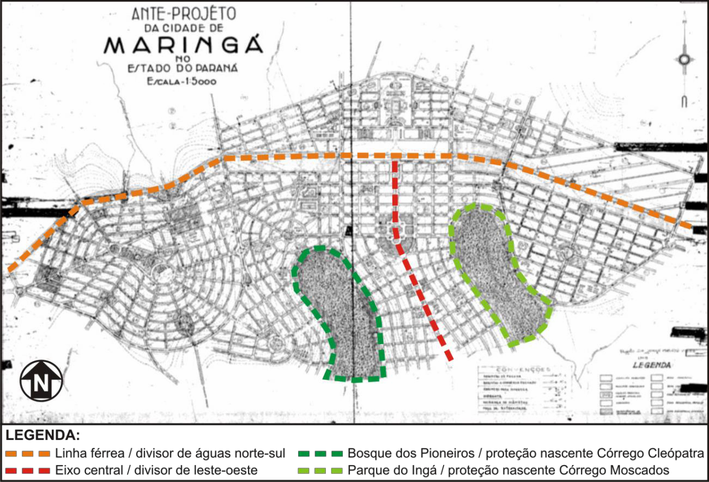
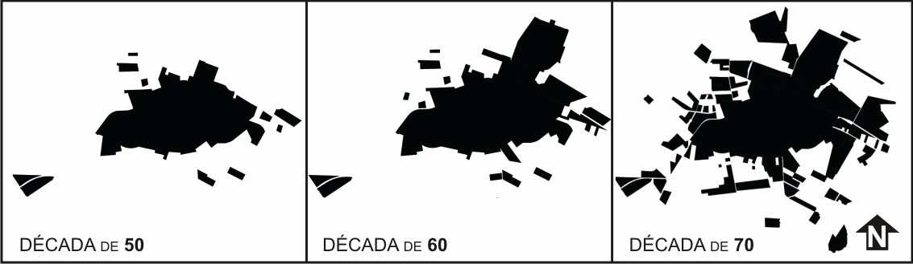
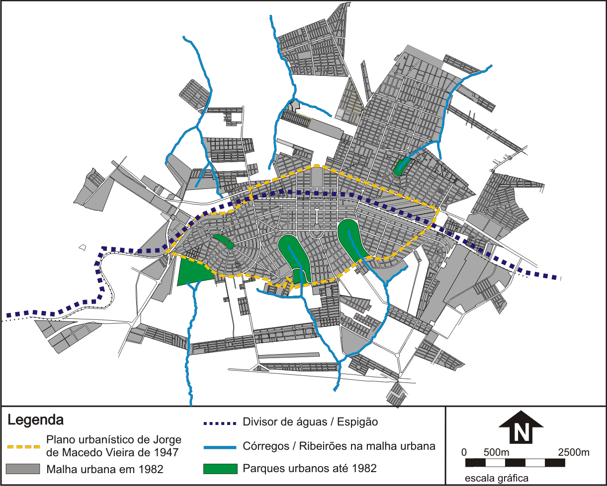
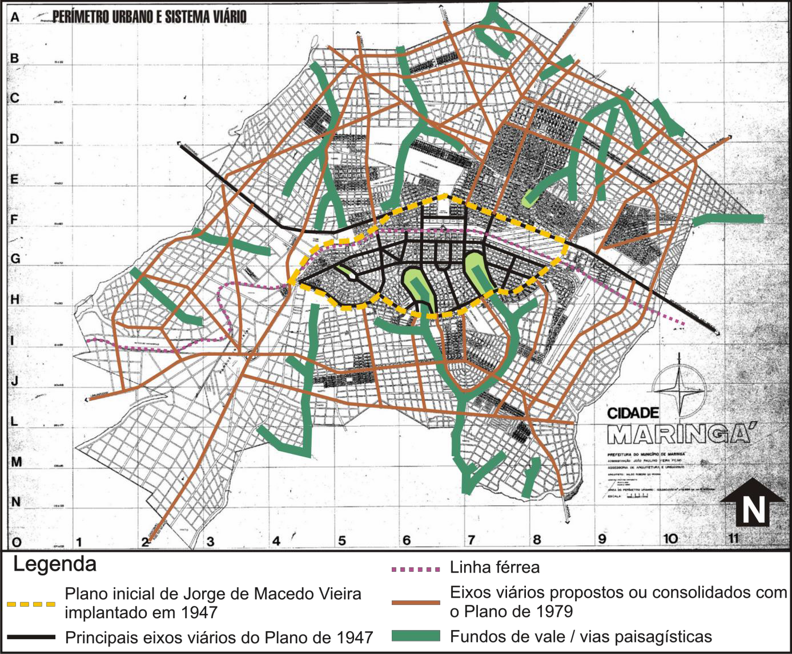

# Resumo

A cidade de Maringá-PR, implantada *ex-novo* em 1947 a partir de um
empreendimento privado, apresenta em seu plano inicial referências
teórico- urbanísticas que lhe concederam uma destacada qualidade
ambiental, amoldando-se ao sítio e preservando importantes estruturas
naturais. Tem-se, por hipótese, que este fato influenciou as
regulamentações urbanísticas posteriores, sendo o Plano de Diretrizes
Viárias de 1979 a expressão máxima da preocupação ambiental em termos
legais, garantindo a não ocupação e preservação de fundos de vale.
Assim, este trabalho tem por objetivo analisar as condicionantes e
soluções propostas no Plano de Diretrizes Viárias de 1979, com foco na
avançada solução ambiental proposta. Metodologicamente, a pesquisa se
vale da análise documental e iconográfica em fontes primárias de acervos
da Prefeitura Municipal de Maringá e do Museu da Bacia do Paraná, além
do levantamento da literatura pertinente. Como resultado verificou-se
que o Plano de Diretrizes Viárias de 1979 resolveu com êxito as questões
a que se propôs, solucionando a desarticulação viária entre a área
planejada e os loteamentos surgidos a posteriori, disciplinando a
ocupação com o meio natural, tendo na implantação de parques lineares e
vias paisagísticas nas áreas de fundos de vale seu maior destaque do
ponto de vista ambiental, solução esta que perdura até o presente.

Palavras-chave: fundos de vale, legislação urbana, preservação ambiental

# Abstract

The city of Maringá-PR, implanted *ex-novo* in 1947 from a private
enterprise, presents theoretical and urbanistic references in its
initial plane that granted a highlighted environmental quality, shaping
it to the site and preserving important natural structures. This
research hypothesis is that this fact influenced the subsequent urban
regulations, and the 1979 Guidelines for Road Network Plan is the
ultimate expression of environmental concern in legal terms, ensuring
non occupancy and preservation of the valley floors. Therefore, this
study aims to analyze the constraints and proposed solutions in the 1979
Guidelines for Road Network Plan, focusing on the advanced environmental
solution proposed. Methodologically, the research is worth of
documentary and iconographic analysis of primary sources collections of
the Maringa City Hall and the Paraná Basin Museum, beyond relevant
literature research. As result, it was found that the 1979 Guidelines
for Road Network Plan successfully resolved the matters proposed,
solving the road disconnection between the planned area and the
allotments arising after, disciplining the occupation with the natural
environment, and the deployment of linear parks and scenic (landscape)
roads in the areas of valleys floor its biggest highlight of the
environmental point of view, a solution that continues to the present.

Keywords: valleys floor, urban legislation, environmental preservation

# Introdução

Implantada ex-novo a partir de um plano moderno encomendado por uma
empresa privada - Companhia Melhoramentos Norte do Paraná (CMNP) -, a
cidade de Maringá (1947), projetada pelo engenheiro paulistano Jorge de
Macedo Vieira que empregou modernas técnicas na concepção do plano
inicial - apresentando influências teóricas e urbanísticas europeias e
norte americanas - já nasce com uma qualidade ambiental destacada.

Embora as questões ambientais e a pressão pela preservação dos recursos
naturais ainda não estivesse na pauta das principais discussões
urbanísticas, a experiência profissional de Macedo Vieira na Cia. City
em São Paulo -- quando esta implantava bairros jardins na cidade,
coincidindo com a estada de Barry Parker no Brasil no momento em que
prestava serviços à companhia (1917-1919) -- e as obras literárias com
quem teve contato, levantadas em seu acervo por Cordovil (1910) como: o
livro de Nelson Lewis, The Planning of the modern city, publicado em
Nova Iorque em 1916; o livro L'art de bâtier les villes, de Camilo
Sitte, traduzido por Camille Martin em 1918; O livro de Henrique Dumont
Vilares, Urbanismo e indústria em São Paulo; além de diversos boletins
técnicos do Instituto de Engenharia e revista especializadas, que
abordaram artigos de Saturnino de Brito; matéria sobre a nova capital de
Goiás, Goiânia; o urbanismo na Inglaterra de Patrick Albercombrie, entre
outras publicações; demonstram uma formação pluralista onde técnica e
estética urbana caminhavam juntas, fato que explica a preocupação com a
topografia, com a drenagem, com a hierarquia e com as funções urbanas em
suas obras.

Em linhas gerais, o plano urbanístico de Maringá (Fig. 1) possui, como
diretrizes de implantação principais: o eixo da ferrovia implantado no
sentido leste-oeste no divisor de águas das bacias do Rio Ivaí ao sul e
do Rio Pirapó ao norte; e o eixo central que o corta transversalmente em
direção ao sul, também implantado no divisor de água de duas micro
bacias, a do Córrego Cleópatra e a do Córrego Moscados. Para preservar a
nascente destes dois córregos abraçados pela malha urbana proposta,
Vieira implantou dois grandes parques urbanos, decisão esta bastante
acertada do ponto de vista ambiental pois, ao mesmo tempo que estruturam
a forma urbana conformando limites visuais para diferentes bairros,
assume importante papel na drenagem. Destaca-se ainda o traçado urbano
que respeita a conformação natural do sitio, variando da malha xadrez
nas áreas planas ao orgânico nos relevos mais acidentados; a divisão das
funções urbanas pela adoção do zonning e locação de centros secundários
intra- bairros; e o expressivo plano de arborização realizado a
posteriori de autoria do Engenheiro Agrônomo Luís Teixeira Mendes.

> 
>
> Figura 1. Anteprojeto da cidade de Maringá. Fonte: Acervo do Museu da
> Bacia do Paraná -- modificado pelos autores

A hipótese aqui levantada é a de que a qualidade ambiental do plano
inicial influenciou as principais regulações urbanísticas posteriores,
principalmente nos aspectos que tangem a preservação de fundos de vale
na malha urbana, uma vez que, comparado com a legislação no âmbito
federal, Maringá sempre se mostrou mais rigorosa, com padrões mais
rígidos, buscando a preservação destas áreas. Esta provável influência,
teve expressão máxima no Plano de Diretrizes Viárias em 1979 que, além
da solução viária proposta, necessária para conexão entre a área
planejada e os novos loteamentos que surgiam desconectados, introduziu
no município uma avançada visão no tratamento das áreas de vale que
perdura até os dias atuais.

Observou-se nas principais regulamentais urbanísticas municipais
anteriores ao plano de 1979 -- Código de Posturas e Obras de 1959 (Lei
n° 34/59) e o Plano Diretor de Desenvolvimento de Maringá de 1968 (Lei
n° 621/68) -- importantes diretrizes de preservação ambiental. A lei de
1959, em diversos artigos (n°: 488,489,490,876,877), restringe
intervenções estruturais em cursos d'água (construção de açudes,
barragens, tapumes, etc.); destina ao departamento competente da
prefeitura estabelecer uma distância mínima da construção em relação aos
cursos d'água; proíbe o corte ou derrubada da vegetação ripária; e
demarca os parques concebidos por Macedo Vieira como Zonas Verde,
proibindo a edificação nestes espaços, reconhecendo sua importância
paisagística. Já no plano de 1968, destaca-se o artigo 14° da Lei de
Loteamentos (Lei n° 625/68) que o compunha e disserta sobre a faixa
mínima não edificável em fundos de vale ou talvegues sendo que, a
dimensão desta era proporcional à área em hectares da bacia hidrográfica
contribuinte, expressa em hectares, determinando para bacias de até 50
ha, faixa não edificável de 4m em cada margem do curso d'água; de 50 a
100 ha, a faixa sobe para 6m; chegando a 70m de área não edificável para
bacias acima de 25.000 ha.

Importante ressaltar que, no caso do Código de Posturas e Obras de 1959,
ainda não havia uma regulamentação federal para a ocupação destas áreas
-- O Código Florestal de 1934 não estabelecia as margens de cursos
d'água como área de preservação permanente, o que ocorrerá apenas com
Código Florestal de 1965 -, ficando então a cargo dos municípios
estabelecerem estes parâmetros. No caso do Plano Diretor de
Desenvolvimento de Maringá de 1968, destaca-se uma divergência
metodológica observada entre a legislação municipal e o Código Florestal
(Lei Federal n° 4.771) aprovado três anos antes, em 1965, que
determinava faixas mínimas de preservação em cada margem, em função da
largura do corpo d'água, estipulando, por exemplo, uma faixa mínima de 5
metros de preservação para cursos d'água com até 10m de largura. Dessa
forma, de acordo com o Plano Diretor, as bacias com até 50 ha que
estabeleciam 4 metros de preservação estariam em desacordo com a
legislação federal, e mesmo para as demais bacias, por não guardarem
relação com a largura do curso d'água e sim com a área da bacia, esta
inconformidade também poderia ocorrer. Contudo, o fato de inserir na Lei
de Loteamentos um valor numérico de área non aedificandi é uma notória
evolução.

Assim, este trabalho tem por objetivo analisar as condicionantes e
soluções propostas no Plano de Diretrizes Viárias de 1979, com foco na
avançada solução ambiental proposta, plano este que constitui o segundo
grande momento de intervenção urbana no município -- sendo o primeiro o
plano moderno de Macedo Vieira. Metodologicamente, a pesquisa se vale da
análise documental e iconográfica em fontes primárias em acervos da
Prefeitura Municipal de Maringá e do Museu da Bacia do Paraná, além do
levantamento da literatura pertinente.

# O Plano de Diretrizes Viárias de 1979

A implantação urbana pensada por Vieira -- para abrigar aproximadamente
200.000 habitantes - teve como base um zoneamento por funções urbanas,
separado nas seguintes zonas: zona comercial; zona industrial; zona de
armazéns; e zonas residenciais principal, popular e operária. De acordo
com Rodrigues (2004), tal fato levou desde o início a uma ocupação
urbana segregada em classes. Comprova a tese de Rodrigues, o valor dos
lotes comercializados nas zonas residenciais no período, por exemplo: na
zona residencial popular os lotes foram comercializados no valor entre
Cr\$3.000,00 e Cr\$10.000,00; já nas zonas residenciais principais este
valor sobe, entre Cr\$10.000,00 e Cr\$40.000,00 (LUZ, 1997).

Além dos altos valores do solo, a CMNP apresentava uma série de regras
visando a rápida ocupação do plano urbano. Tais fatos levaram outras
empreendedoras a lotear glebas rurais nos arredores de Maringá,
oferecendo assim terras a preços mais baixos, o que levou ao surgimento
de uma série de pequenos loteamentos, desconexos da malha urbana, sem a
qualidade do plano original. Meneguetti (2009) afirma que em 1950, com o
plano da cidade ainda não totalmente implantado, já existiam mais de 12
loteamentos periféricos e uma população urbana de 7.270 hab. e 31.318
hab. na zona rural. Ao final da década de 50 já eram 47.592 hab. urbanos
e 56.539 rurais. Em fins dos anos 60 a população urbana já ultrapassava
os 100.000, enquanto a rural caia para cerca de 21.000. Ao final da
década de 70 a população urbana passava dos 160.000. Este expressivo
crescimento, ocorrido principalmente na região norte da cidade, não foi
combatido pelas legislações municipais, levando a uma malha fragmentada
e descontínua em diversos pontos (Fig. 2).

> 
>
> Figura 2. Expansão urbana nas décadas de 50, 60 e 70. Fonte:
> Meneguetti, 2009 -- modificado pelos autores

O crescimento ocorrido na década de 70 foi o mais intenso. Fatores como
a modernização da agricultura na região e, em Maringá, a instalação da
Universidade Estadual de Maringá em 1969, contribuíram para este
fenômeno. A falta de diretrizes viárias definidas para os loteamentos
surgidos pós-área planejada, levou ao surgimento de uma série de
problemas de conexão viária. Houve tentativas pontuais de combater este
problema, como no caso da avenida Mandacaru cujas leis n°698/69 e Lei
n°861/71 autorizaram a desapropriação de uma faixa de terras, incluindo
edificações existentes no caminho, com o intuito de dar continuidade e
alargar a via (CORDOVIL, 2010). Outras leis de desapropriação foram
aprovadas neste período visando a conexão entre o plano inicial e os
novos loteamentos, ações que, entretanto, apenas remediavam os problemas
de desarticulação viária que persistiam. Este modo de crescimento também
impactou negativamente as áreas de fundos de vale, pois, ao ser
implantada no divisor de águas de duas bacias, as áreas das nascentes
ficaram expostas ao avanço da urbanização e, embora as leis anteriores
demonstrassem preocupação com a preservação destas áreas, havia
dificuldades em legitimá-las nos loteamentos que surgiam nas áreas
rurais (Fig. 3).

> 
>
> Figura 3. Expansão urbana nas décadas de 50, 60 e 70. Fonte: Base de
> Cordovil, 2010 -- modificado pelos autores

Tais fatores levaram o então prefeito João Paulino Vieira Filho a
designar como assessor de arquitetura e urbanismo o arquiteto Nildo
Ribeiro da Rocha Neto, para comandar o Plano de Diretrizes Viárias,
finalizado em 1979. Este é considerado o mais importante plano de
expansão de Maringá, sendo realizado em cima das cartas
planialtimétricas, com curvas de metro em metro e escala 1:2000,
realizado em 1977. De acordo com Cordovil (2010), antes mesmo deste
levantamento aerofotogramétrico, o arquiteto já trabalhava nas novas
diretrizes viárias do município, sobrevoando algumas áreas juntamente
com um colega arquiteto, onde desenhavam os rumos de forma precária para
depois passarem para a prancheta.

Dessa forma, o plano coordenado por Ribeiro da Rocha teve então dois
desafios principais: conciliar o plano de Jorge de Macedo Vieira com as
expansões urbanas descontínuas; e harmonizar a ocupação do sítio urbano
com as restrições ambientais presentes. Além disso, conciliar os
interesses dos loteadores com os da administração pública e lidar com as
limitações técnicas, foram fatores inerentes ao processo de elaboração.

O principal desafio presente na tarefa de traçar a expansão da cidade
foi conciliar as variáveis morfológicas -- topografia, fundos de vale e
loteamentos existentes -- com o plano urbanístico de Vieira, considerado
por Nildo Ribeiro como o "embrião" ou "célula mãe" de sua proposta,
sobretudo em relação à manutenção da largura das vias, embora houvesse
grande pressão imobiliária para reduzi-las. As diretrizes do plano são
descritas pelo arquiteto:

> O segundo Plano (o primeiro seria o Plano Diretor de 1968) coordenava
> e orientava o crescimento urbano, estabelecendo regras e normas para
> loteamentos e corrigindo as distorções que a cidade novamente vinha
> sofrendo. \[\...\] O que fizemos juntamente com os técnicos da
> Assessoria de Arquitetura e Urbanismo foi criar um novo perímetro
> urbano, englobando todos os loteamentos, legalizados ou não, e
> traçando a malha dentro dele, baseada nos padrões do plano original.
> Esse trabalho foi realizado garantindo o direito de propriedade e a
> preservação dos mananciais e meio ambiente (ROCHA, 2004,
>
> p.17 apud CORDOVIL, 2010).

O novo perímetro urbano desenhado possuía 12.825 ha e, de acordo com
Rocha (2004b), foi pensado para abrigar 600.000 hab. -- na época,
Maringá possuía cerca de

160.000 hab. -, projetando este crescimento para o ano 2000, o que não
ocorreu. Em 2000 a população de Maringá era de 288.653 hab. e, no último
censo realizado em 2010 a população levantada foi de 357.077 hab. (IBGE,
2012). Todo o perímetro apresentado no plano foi traçado em forma de
diretrizes que deveriam ser respeitadas quando da aprovação de novos
loteamentos. A preocupação ambiental também é forte característica do
plano, sobretudo em relação ao tratamento proposto para as áreas de
fundos de vale.

Embora tenha havido grande preocupação com o plano de Vieira, a proposta
de expansão urbana difere substancialmente, predominando o traçado
retilíneo, que pouco tem relação com a topografia do sítio. De acordo
com Cordovil (2010) em alguns pontos chegou a ser pensado um traçado
mais orgânico, acompanhando o relevo, porém a proposta foi rejeitada
pelos topógrafos, alegando dificuldade de execução. O plano traçado por
Ribeiro da Rocha era extremamente restritivo, pois as vias em forma de
diretrizes por ele traçada praticamente "loteava" todo o perímetro
urbano da cidade, uma vez que conformavam "quadras" de aproximadamente
280x280m, onde loteadores teriam liberdade de composição.

O objetivo central do plano foi dar continuidade e consolidar os
principais eixos viários existentes - alguns deles continuação do plano
inicial, outros estradas rurais - e ainda a criação de novas ligações,
ora com vias radiais iniciadas na parte planejada, ora com vias
perimetrais, promovendo a ligação entre aquelas. Este sistema radial-
perimetral1 consolidou o crescimento radioconcêntrico que já havia
acontecendo de maneira natural, embora de forma descontínua, atuando em
contraponto ao sistema de crescimento linear que chegou a ser pensado no
Plano Diretor de 1968, porém sem ser

implantado.

Se a solução viária apresenta prós e contras -- pois de fato solucionou
o problema da desarticulação viária, porém imprimiu uma morfologia
simplificada --, a solução ambiental adotada se mostrou extremamente
avançada. Para evitar a degradação das áreas de fundos de vale que
vinham sendo cada vez mais expostas com o crescimento da *urbe*, Ribeiro
da Rocha criou as vias paisagísticas, que margeavam os canais, distando
60 m de suas margens, faixa esta que seria ocupada por reserva natural e

> 1 Preconizado pelo urbanista francês EugèneHénard e pelo urbanista
> germânico Stubben, foi amplamente utilizado como solução de ligação
> periferia-centro em cidades como Berlim, Moscou, Paris e São Paulo.

conformariam parques lineares. Villalobos (2003) explica que estes
parques foram pensados não somente de forma conservacionista uma vez que
dois usos foram previstos nestas áreas: A residência do fiscal
ambiental, que cuidaria de uma porção do fundo de vale; e a inserção de
áreas especiais, como pontos de reciclagem de resíduos sólidos urbanos.

O avanço ambiental proposto no plano é bastante significativo, sobretudo
se analisarmos que o Código Florestal de 1965 (Lei n° 4771/65) previa
apenas 5 m de faixa de preservação. No mesmo ano de aprovação do Plano
de Diretrizes Viárias, foi aprovada a Lei Lehmann (Lei Federal nº
6766/79) que aumenta esta faixa non aedificandi para 15m em cada margem,
mesmo assim, área quatro vezes menor ao implantado em Maringá. Os
benefícios trazidos por esta ação são múltiplos, como por exemplo:
manutenção da biodiversidade; melhoria do microclima urbano; proteção
dos recursos hídricos e florestais; aumento da área permeável no solo
urbano; potencial local de lazer para população; e aumento da qualidade
da paisagem urbana.

Villalobos (2003) cita como possível influência da solução ambiental
empregada no plano, o livro *Design WithNature*, publicado em 1969. Obra
de Ian McHarg, planejador urbano e paisagista que concentrou sua prática
e estudos na forma de conciliar os avanços da urbanização com a
capacidade de suporte do meio. É de McHarga autoria do plano de ocupação
para a região conhecida como *The Valleys* - região noroeste da cidade
de Baltimore nos Estados unidos -, área de destacada beleza natural com
seus vales, fazendas e remanescentes florestais, que vinha sofrendo
intensa pressão por urbanização com a expansão da cidade. Como solução,
McHarg propôs uma forma de ocupação que conciliava a ocupação urbana com
a capacidade de suporte do meio, controlando densidades e usos,
recuperando áreas naturais e conservando a qualidade natural da
paisagem. O plano elaborado em 1969 tinha capacidade de absorver 110.000
pessoas nos próximos 40 anos. Em seus princípios de conservação das
áreas de fundos de vale, propõe o uso para recreação nestes espaços e a
conservação de cada margem em seu estado natural numa largura de 200 pés
(60,96 metros) (MCHARG, 1992).

De fato a proposta para os fundos de vale de McHarg e Ribeiro Rocha
guardam bastante semelhança, porém não se pode afirmar com certeza que o
autor do plano tenha tido como referência o plano de Baltimore. Em
entrevista concedida a Cordovil (2010), Ribeiro da Rocha afirma que um
dos motivos que o fez adotar tal solução foi a ocorrência de áreas
públicas à beira dos cursos d'água -- doadas pelos loteadores por força
de lei. A referência conceitual, no entanto, não é revelada.

Apesar dos parques lineares não terem se efetivado tal qual pensado pelo
arquiteto, as faixas dos 60 m não foram ocupadas. Meneguetti (2009)
ressalta que tal fato foi fundamental para que, ainda hoje, fosse
possível a implantação de um sistema de áreas livres com caráter
ecológico, com pequenas intervenções. Não fosse tal diretriz de
ocupação, que inclusive influenciou legislações municipais posteriores e
se mantém até hoje, muito provavelmente estes espaços teriam sido
ocupados e loteados, o que geraria perda ambiental bastante
significativa. A figura 4 demonstra de forma sintetizada as
condicionantes e propostas do plano.

> 
>
> Figura 4. Principais condicionantes do Plano de Diretrizes Viárias de
> 1979. Fonte: Prefeitura Municipal de Maringá -- modificado pelos
> autores

Pode-se apontar assim como pontos principais do plano: a solução viária
que adotou a expansão dos principais eixos do plano inicial de forma
radial e criação de vias perimetrais conectando estas; a adoção da malha
xadrez em praticamente todo o perímetro projetado, em função da pressão
imobiliária e da facilidade de execução; e a preservação das áreas de
fundos de vale, com adoção de 60 m de faixa non aedificandi em cada
margem até a via paisagística. Dessa forma, Ribeiro da Rocha conseguiu
cumprir seus principais desafios: o de conectar as expansões urbanas com
o plano inicial, harmonizando-as com a paisagem natural presente.

# Conclusão

A cidade de Maringá, nascida de um empreendimento de capital privado em
1947, teve dois grandes momentos de intervenção urbana: seu plano
inicial, em 1947, elaborado pelo engenheiro Jorge de Macedo Vieira que
adotou modernas técnicas de planejamento, demonstrando grande
sensibilidade com as áreas naturais; e o Plano de Diretrizes Viárias de
1979, do arquiteto Nildo Ribeiro da Rocha motivado, sobretudo, por
questões viárias, mas que, empregou uma avançada visão ambiental no
tratamento dado às áreas de fundos de vale.

As Diretrizes Viárias de 1979 resolveram com êxito as problemáticas a
que se propôs, conectando os loteamentos existentes e disciplinando a
ocupação dos novos loteamentos, o que resultou em uma articulação viária
bastante satisfatória até os dias atuais. O fato do plano apresentar
solução morfológica simplificada, comparada ao

plano inicial, deve ser relativizada em função das condicionantes
presentes em 1979 serem de ordem mais complexa, lidando com questões
como: interesses imobiliários; dificuldade de execução; e limitações
físicas (áreas naturais x plano inicial x loteamentos desconectados).
Por sua vez, o plano inicial apresentava apenas o traçado da ferrovia
como condicionante.

Embora os parques lineares não tenham se efetivado tal qual previsto por
Ribeiro da Rocha, a solução proposta para as áreas de fundos de vale foi
outra importante contribuição. Ela garantiu a preservação destes espaços
fundamentais para a manutenção da biodiversidade na área urbana e
permitiu que hoje fosse viável se pensar em um sistema de áreas livres
com caráter ecológico. O tratamento dado aos fundos de vale guarda
bastante relação com as técnicas de planejamento ambiental da época e
ainda vigentes, preconizada por arquitetos da paisagem como o norte
americano Ian McHarg, conciliando a preservação dos recursos naturais
atrelados a inserção urbana, valorização da paisagem e exploração do
potencial recreativo destes espaços.

# Referências bibliográficas

> BRASIL. *Código Florestal Brasileiro -- Lei Federal nº 4771*. DF:
> Congresso Federal, 1965.
>
> BRASIL. *Lei Federal n° 6766, de 19 de dezembro de 1979, que dispõe
> sobre o parcelamento do solo urbano e dá outras providências*. DF:
> Congresso Federal, 1979.
>
> CORDOVIL, F. C.. *A aventura planejada: engenharia e urbanismo na
> construção de Maringá, PR 1947 -- 1982*. 2010. 636f. Tese (Doutorado
> em Arquitetura e Urbanismo). Escola de Engenharia de São Carlos,
> Universidade de São Paulo, São Carlos, 2010.

IBGE. *IBGE Cidades -- Maringá-PR*. 2012. Disponível em:
<http://www.ibge.gov.br/cidadesat/link.php?codmun=411520> Acesso em: 07
jul. 2012.

> LUZ, F.. *O Fenômeno Urbano numa Zona Pioneira: Maringá*. Maringá:
> Prefeitura, 1997.
>
> MARINGÁ, P. M.. *Código de Posturas e Obras de Maringá - Lei nº
> 34/59*. Maringá, 1959.
>
> MARINGÁ, P. M.. *Plano Diretor de Desenvolvimento de Maringá -- Lei n°
> 621/68*. Maringá, 1968.
>
> MARINGÁ, P. M.. *Lei de Loteamentos - Lei n° 625/68.* Maringá, 1968b.
>
> MARINGÁ, P. M.. *Lei n° 698/69 -- Autoriza a desapropriação de
> loteamentos na Estrada Mandacaru*. Maringá, 1969.
>
> MARINGÁ, P. M.. *Lei n° 861/71 - Autoriza a desapropriação de uma
> faixa de terras para abertura da segunda pista da Av. Mandacaru*.
> Maringá, 1971.
>
> MCHARG, I. *Design With Nature*. 25th anniversary edition, Jon Wiley &
> Sons, 1992.
>
> MENEGUETTI, K. S.. *Cidade Jardim, Cidade Sustentável. A Estrutura
> Ecológica Urbana e a Cidade de Maringá*. Maringá: EDUEM, 2009.

ROCHA, N. R. Entrevista. Entrevistador: Edson Massari no Programa Ponto
de Equilíbrio, Jornal do Povo, 13 ago. 2004.

ROCHA, N. R. *Entrevista* com Nildo Ribeiro. Entrevistador: Lincoln
Souza. Jornal Matéria Prima. 16 set. 2004.

> RODRIGUES, A. L.. *A pobreza mora ao lado: segregação espacial na
> região metropolitana de Maringá*. 2004. 258f. Tese (Doutorado em
> Ciências Sociais) -- Pontifícia Universidade Católica de São Paulo,
> São Paulo, 2004.
>
> VILLALOBOS, J. U. G.. *Maringá: Fundos de vale, política, legislação e
> situação ambiental*. In: Dalton Aureo Moro. (Org.). Maringá Espaço e
> Tempo. Ensaio de Geografia Urbana. Maringá - PR: Programa de
> Pós-Graduação em Geografia. UEM, v. 1000, p. 201-238, 2003.
