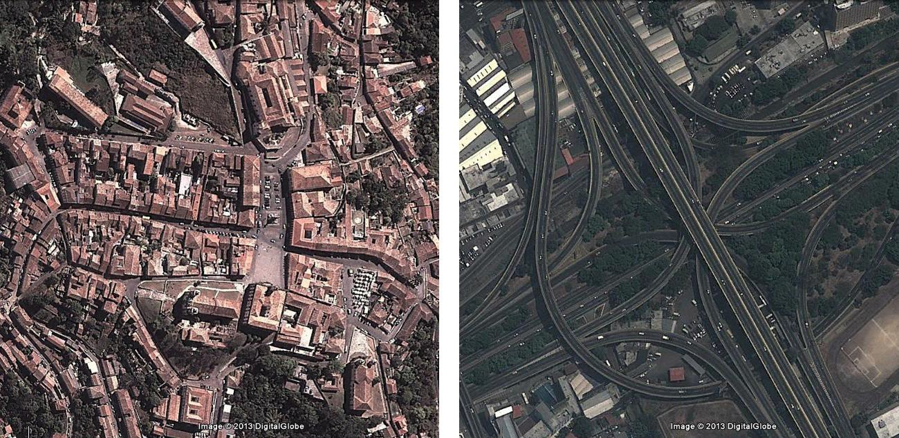
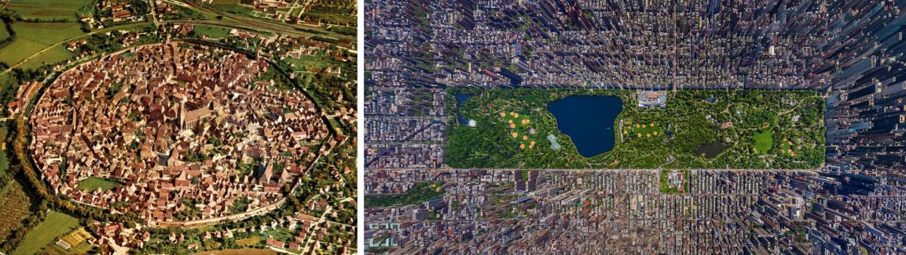
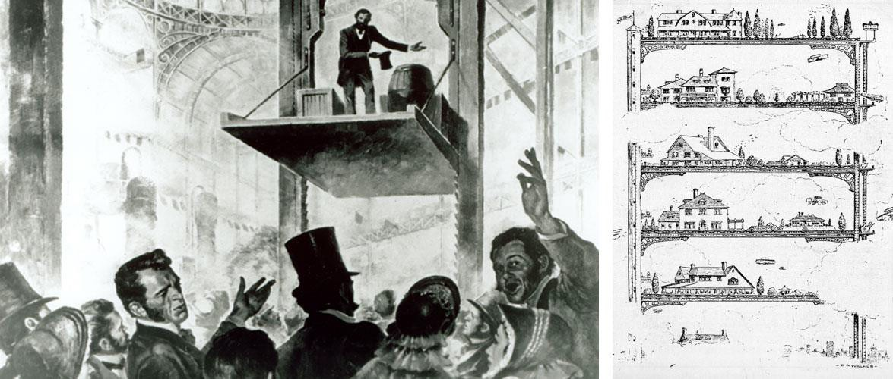
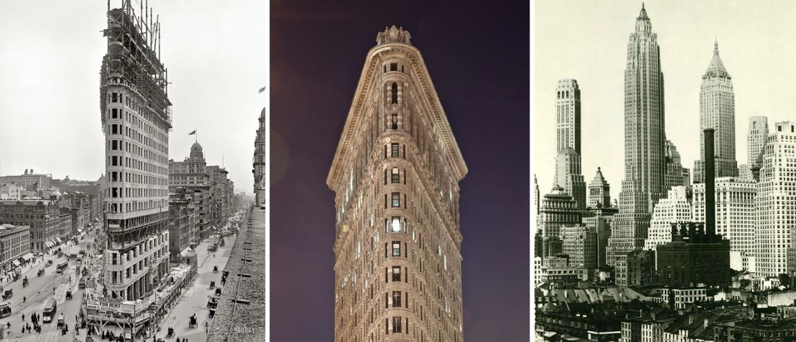
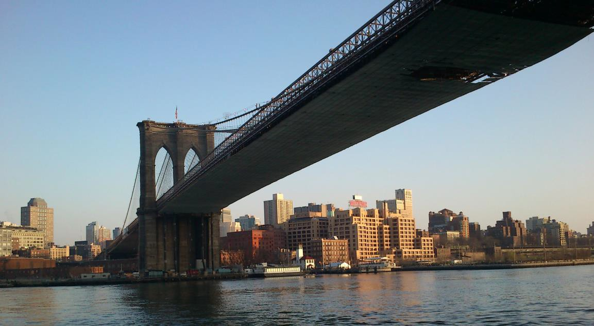
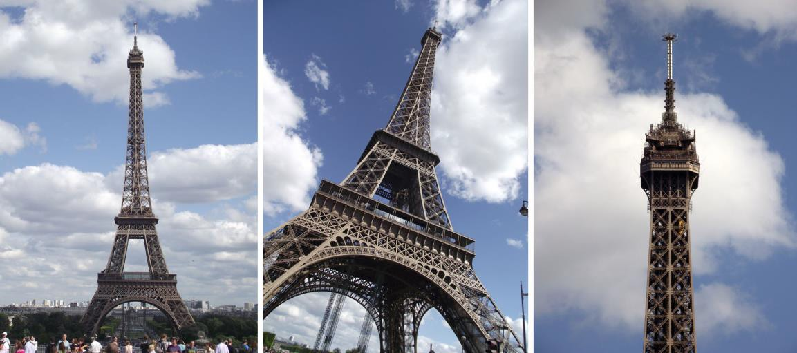
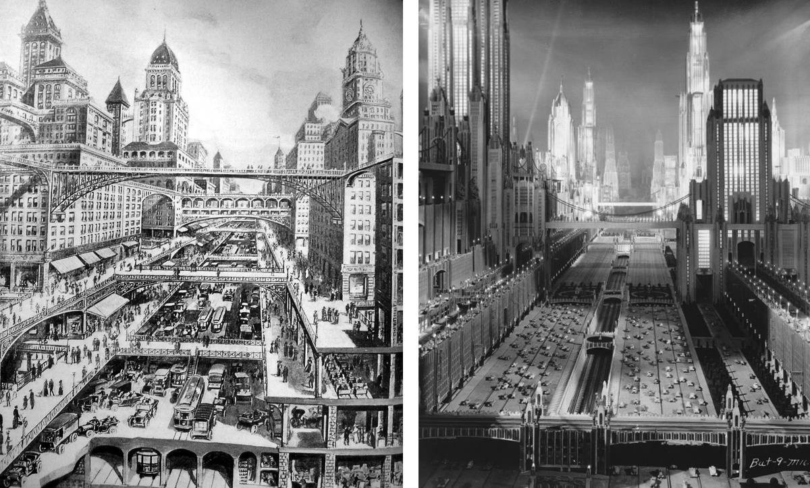
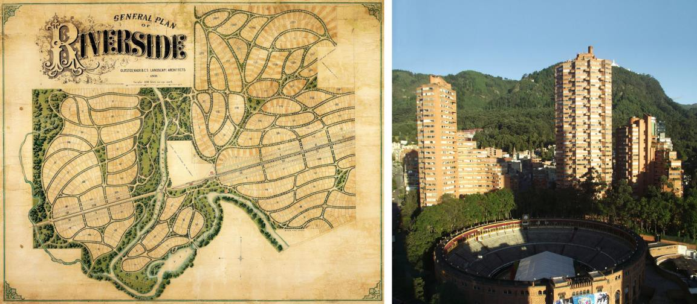

# Resumo

O advento da industrialização traz consigo profundas modificações às
áreas urbanas, por todo o mundo. A era da mecanização, desenvolvida
principalmente ao longo do século XIX e consolidada no século XX provoca
mudanças definitivas na própria noção de tempo e uma ruptura na escala
urbana que atribui novos significados à ideia mesma de cidade e
urbanização. O crescimento urbano fruto destas mudanças promove
alterações importantes na relação entre o homem e a natureza e,
consequentemente, entre as cidades e o campo circundantes. Parte
importante destes câmbios devem-se ao desenvolvimento de novas
tecnologias e conhecimentos, notadamente o conhecimento de materiais
estruturais e técnicas para o seu cálculo, a invenção do elevador de
segurança -- que permitiu a verticalização destas estruturas e a
multiplicação do solo urbano --, e o desenvolvimento dos meios de
transportes ferroviários e rodoviários. A combinação de todos estes
fatores dariam origem a diversas postulações urbanísticas e
arquitetônicas dentre as quais destacam-se, em extremos opostos, as
cidades-jardim e as torres isoladas em meio a áreas verdes e públicas. O
presente artigo parte da convicção de que a atualização das
interpretações possíveis de tais acontecimentos e o entendimento de suas
bases conceituais à luz das teorias contemporâneas são pontos relevantes
no debate de questões que envolvem o manejo e planejamento de um futuro
desejável para as metrópoles latino-americanas.

Palavras-chave: Arquitetura, escala urbana, urbanização,
industrialização, América

# Abstract

The advent of industrialization brings profound changes to urban areas,
throughout the world. The age of mechanization, developed mainly during
the nineteenth century and consolidated on the twentieth, brings
permanent changes in the very notion of time and a break in the urban
scale that assigns new meanings to the ideas of the city and
urbanization . The urban growth result of these changes bring important
modifications in the relationship between man and nature and, therefore,
between the cities and the surrounding countryside. Important part of
these exchanges are due to the development of new technologies and
skills, especially the knowledge of structural materials and techniques
for their analysis, the invention of the safety elevator -- which
allowed to the vertical growth of these structures and the
multiplication of urban land -- and the development of transportation
facilities: rails and roads. The combination of all these factors would
originate several architectural and urban postulations among which stand
out, at opposite ends, of the garden cities and the isolated towers and
superblocks, risen amidst green and public areas. This article departs
from the conviction that the update of the possible interpretations of
such events and the conceptual understanding of their basis, in the
light of contemporary theories, represent relevant points in the
discussion of issues surrounding the management and planning of a
desirable future for Latin American metropolises .

Keywords: Architecture, urban scale, urbanization, industrialization,
America

> Ao mudar nossa imagem do tempo, modificou-se nossa relação com a
> tradição. Melhor dizendo, porque mudou nossa ideia do tempo, tivemos
> consciência da tradição. (Octavio Paz, apud FRECHILA: 1989, p.7.)

# Mudança de escalas e tempos

No princípio do romance *Os dados estão lançados*, de Jean-Paul Sartre
(*Les jeux sont faits*, 1947), o personagem principal sente em um dado
momento um impulso inexplicável de dirigir-se a determinado ponto da
cidade, a um edifício desconhecido. Ao entrar, depara-se com uma espécie
de repartição pública, onde é informado que está agora oficialmente
morto. Desconcertado, ele sai à rua e percebe que há muito mais pessoas
do que antes. Um grupo acerca-se dele, explicam que muitos daqueles
estão, como eles próprios, mortos, e dispõem-se a ajudá-lo em sua
adaptação à nova condição. O recém-chegado pergunta a eles como faria
então para distinguir dentre os vivos e os mortos. Os homens não têm
dúvida em responder: -- Preste atenção : os vivos têm pressa.

A parábola acima parece pertinente para entender um pouco do que
provavelmente sentiram muitas das pessoas que se viram em dado momento
envolvidas pelos desdobramentos da revolução industrial. O mundo que
agora era movido pela máquina não era o mesmo de antes, nem era igual o
tempo. A presença da máquina, e a mentalidade por trás da lógica de sua
invenção impuseram ao mundo naquele momento -- quiçá inadvertidamente --
uma mudança na própria lógica do tempo. Se uma atividade qualquer levava
agora a metade do tempo para ser realizada, o tempo havia então sido
reduzido à metade do que era antes. O ritmo de produção imposto pela
máquina, resulta assim em um colateral encurtamento do tempo, ou, por
outro lado, em sua aceleração. À medida que mais e mais eficientes e
rápidas se tornam as máquinas, maior é o achatamento do tempo que se
observa. As cidades responderão a esse impacto, não apenas em termos
temporais, mas também espacialmente.

> Com 7.300 hectares, o centro histórico de Paris -- praticamente todo
> ele contido no interior da muralha erigida no século XVIII, a já
> demolida muralha dos *Fermiers Généraux* -- representa hoje uma
> porcentagem ínfima da aglomeração. A mesma constatação pode ser feita
> em todas as grandes cidades. A grande Londres ocupa um território de
> cinquenta quilômetros de diâmetro, enquanto sua área central, a
> *City*, pode ser atravessada a pé em menos de meia hora. Em Nova York,
> Manhattan -- que antes das extensões de 1810 se restringia à área ao
> sul da Rua Houston -- só foi inteiramente ocupada em fins do século
> XIX, enquanto, à exceção do Brooklyn, seus demais distritos, os
> *boroughs*, eram ainda pequenos e tranquilos arrabaldes. Em Brasília,
> \[...\] a "cidade histórica", isto é, o Plano Piloto, abriga menos de
> um quinto da população da aglomeração e representa apenas uma porção
> menor da área urbanizada. Ao longo do século XX, constata- se nas
> cidades uma inversão da relação entre o centro antigo e sua periferia,
> esta última passando a representar, em superfície e população, a
> parcela maior da aglomeração. Tal inversão ocorre não apenas nas
> grandes metrópoles e nas capitais, mas alcança também cidades menores.
> (PANERAI: 2006, p.13)

Conforme colocado de modo perspicaz por Philippe Panerai, é ao longo dos
últimos cem anos, e principalmente nas últimas seis décadas decorridas
desde a intensificação do uso do automóvel, que as aglomerações urbanas
sofrem uma transição de escala sem precedentes, que viria alterar
radicalmente toda a concepção de urbanidade que se tinha até finais do
século XIX.

> O espraiamento vem acompanhado por uma esgarçadura no tecido urbano. A
> evolução dos modos de vida urbana engendra um consumo expressivo de
> espaços. \[...\] Ela vai ficando abarrotada com uma heterogênea massa
> construída, na qual ocorrem rupturas de escala impressionantes: um
> trevo viário ocupa a mesma área que uma cidadezinha antiga. (PANERAI:
> 2006, pp.13-14)
>
> 
>
> Figura 1.: Na mesma escala, à esquerda Praça Tiradentes, em Ouro
> Preto, Minas Gerais e à direita entroncamento urbano em Caracas,
> Venezuela, conhecido como "La Araña". Fonte: Google

No entanto, com notável lucidez, Panerai se priva de tratar a questão
com a grandiloquência cataclísmica que muitas vezes acompanha tal sorte
de constatações em relação às cidades contemporâneas e, ao contrário,
aborda objetiva e pragmaticamente o assunto e convida o leitor a
acompanhar sua reflexão:

> \[...\] não se pretende propor uma nova terminologia para designar a
> cidade contemporânea. Continuaremos a chamá-la, como sempre, de
> cidade, pois estamos convencidos de que essa cidade não é menos urbana
> que aquela do passado, apenas a sua urbanidade é que é de outra ordem.
> \[...\] Se a perda da forma urbana tradicional anunciada por Carlo
> Aymonino (1966) testemunha nossa dificuldade em ler a cidade atual e
> nossa confusão diante de uma situação que não corresponde mais às
> nossas referências, é necessário indagar porque não conseguimos
> entender a cidade. \[...\] É preciso perguntar que outros modelos
> podem nos ajudar, hoje, a pensar a aglomeração como totalidade, a
> descrever sua forma, a identificar suas partes \[\...\]. (PANERAI:
> 2006, p.14-15)

Se modifica-se a escala de tempo e muda também a própria dimensão física
da cidade, e sua percepção -- fruto das alterações sociais, econômicas e
tecnológicas engendradas pelas novas condições gerais -- mudaria também
a própria forma com que o homem passa a relacionar-se com sua vida e
suas ideias, e ainda a percepção de sua escala relativa neste contexto,
como propõe Scully:

> O modo de vida antigo, cristão, pré-industrial, pré- democrático, foi
> progressivamente se rompendo à sua volta, de modo que o homem obteve
> um lugar jamais ocupado por um ser humano antes. Ao mesmo tempo,
> tornou-se um átomo minúsculo em um vasto mar de humanidade, um
> indivíduo que se reconhece como sendo definitivamente solitário.
> Portanto, vacilou entre o desejo frenético de encontrar algo mais
> amplo a que pertencer e a paixão igualmente avassaladora para
> expressar a sua própria individualidade e agir por conta própria. A
> arquitetura moderna refletiu as tensões desse estado mental e
> materializou o caráter da época que a gerou. (SCULLY Jr.: 2002, p.15)

O crescimento desmesurado e descontrolado observado nas cidades da
América ao longo do século XX veio tornar realidade o potencial de
reprodutibilidade da quadrícula ortogonal urbana que em geral
caracteriza as cidades do continente. Neste processo a quadrícula foi
repetida *ad nauseam*, sua adaptação forçada a relevos distintos e, em
tempos mais recentes, permitida toda sorte de liberdades à especulação
imobiliária urbana, já no século XX. Resultam daí as cidades
características da América, e particularmente as da América Latina. Em
geral destituídas de noções de conjunto ou unidade, as grandes cidades
latino-americanas tenderam a espraiar-se indefinidamente pelo
território, perdendo em continuidade e limites claros. Dessa lógica
derivam cidades tão distintas quanto São Paulo, México, Los Angeles,
Caracas ou Belo Horizonte, compartilhando entre si a perda de
importantes referenciais urbanos e, via de regra, uma retumbante feiura.
Quanto a este último fator, a análise de Liernur é bastante precisa, e
busca delimitar a questão:

> Mas será que as favelas do Rio e os bairros miseráveis de Rosário, os
> barracos desmoronando que cercam Caracas, as esquálidas *medianeras*
> de Buenos Aires, as intermináveis periferias escangalhadas da Cidade
> do México, os lixões infinitos a céu aberto, o *smog* sobre Santiago,
> o cheiro podre dos tugúrios de Lima, os esgotos transbordados, bairros
> nunca acabados, os cartazes toscamente besuntados, toda essa imensa
> paisagem de nossas cidades, em sua absoluta carência de forma e
> limites, são uma versão fim de século daquele sublime universo dos
> temporais, dos monstros, das tumbas e dos vulcões que celebraram os
> românticos? \[...\] Mais apropriado, ao contrário, me parece
> considerar que à destruição permanente das formas -- políticas,
> sociais, culturais, e urbanas -- nesta porção do planeta corresponde
> aplicar outra categoria: a da fealdade.
>
> É que há que admiti-lo. Por mais que hoje repintemos suas relíquias,
> ou inventemos pequenas ordens espelhadas, vistas de perto nossas
> cidades são, em sua maior parte, isso: feias.
>
> Mark Cousins propôs recentemente uma sugestiva análise desta condição,
> a da fealdade, várias de cujas hipóteses podem ajudar-nos. Para
> começar, Cousins considera que a fealdade não constitui uma categoria
> dependente da beleza, algo assim como seu negativo. O feio é mais bem
> uma característica que escapa à estética. A fealdade nega a verdade.
> Desde Aristóteles pertence ao reino do erro. \[...\] Cousins sustenta
> ainda que dado que os objetos existem por si mesmos e como
> representação de si mesmos, o feio se produz como um transbordamento
> de matéria sobre a representação. Por isso a fealdade é uma condição
> contaminante: consome um espaço maior que o que ocupa sua forma
> externa. O feio é voraz, um excesso que ameaça, porque consiste na
> súbita aparição de uma interioridade da qual a referência externa não
> pode dar conta. A fealdade é matéria sem significado. \[...\] Mas a
> fealdade não é só o que não deveria estar aí: é ainda o que não está
> mas poderia estar. É certo que esta condição não é exclusiva das
> metrópoles e modernas cidades deste lado do mundo. Mas sua magmática
> extensão é das mais provocadoras. \[...\] Que ocorre se observamos
> deste modo nossas cidades, desagregadas e sem forma? (LIERNUR: 2010,
> p.90-93)

Deste modo, para nós latino-americanos, além do desconcerto provocado
pelo encurtamento exponencial do tempo imposto pelos crescentes avanços
tecnológicos, da perda da forma e dos limites urbanos que impõem
dificuldades à leitura e apreensão da cidade e a condição humana no
mundo moderno, temos ainda de lidar (e se possível, mitigar e combater)
-- por mais desconfortável que seja aceitá-lo -- com a lamentável e
crescente fealdade das cidades que construímos.

# Homem e natureza, cidade e campo

O crescimento urbano dos séculos XIX e XX provocado pela
industrialização traz consigo uma profunda transformação na relação até
então existente entre o homem e a natureza. Tal transformação reflete-se
diretamente na alteração da dialética entre a cidade e o campo,
estabelecida desde as primeiras aglomerações urbanas. Se a cidade antiga
ou tradicional era tida antes de tudo como espaço seguro onde abrigar-se
dos perigos e incertezas da natureza desconhecida e selvagem do lado de
fora, a partir do aumento em suas dimensões, tal concepção altera-se de
maneira extrema.

> 
>
> Figura 2: À esquerda, cidade medieval na Bávária, cercada pela
> natureza. À direita, o Central Park, em Nova York.

No contexto da América, Marina Waisman aborda o tema da dualidade
cidade-campo, ou homem-natureza, tanto sob o aspecto de uma diferença
fundamental entre as ocupações do Norte e do Sul do continente, quanto
da gradual evolução e persistência do urbano que aqui se observa:

> O tecido tradicional de uma cidade também possui uma elevada carga
> significativa. A tradição europeia mediterrânea da rua com fachadas
> contínuas se repete nas cidades da América espanhola, e o significado
> urbano da fachada parece ter tal relevância que, como é sabido, em
> zonas quase descampadas de pequenas populações rurais, encontra-se a
> tipologia de casas de paredes-meias, paredes que, frequentemente,
> limitam terras vagas, e instauram assim o significado de \'cidade\' em
> oposição a \'campo\'1. Essa tradição
>
> urbana, ou talvez deveríamos dizer essa vocação urbana, contrastante
> com a vocação rural anglo-saxônica, modificou- se em boa parte desde a
> incorporação do subúrbio tipo cidade jardim, que introduz outros
> significados como resultado de uma nova semantização da cidade, que
> não entende já como o lugar da vida plena e da eclosão da cultura, mas
> como a condensação dos males acarretados pela civilização industrial,
> motivo pelo qual se tenta acabar com aquela oposição cidade/campo e
> incorporar os significados do campo na cidade. (WAISMAN: 2013, pp.
> 176-177)

Ao expandir-se exponencialmente, a cidade moderna se hipertrofia a ponto
de perder de vista seus limites, e assim o contato direto com a
natureza, rompendo a dualidade clara de tal relação. À medida que a
cidade cresce, altera-se gradualmente o significado atribuído à
natureza, ao ponto de inverter-se a relação original. A natureza passa
neste momento a ser considerada como lugar desejado de sossego e
descanso que libertaria das angústias e incertezas o homem urbano
moderno, refletindo-se tanto na adoção do modelo de cidades jardim ou
condomínios campestres -- como um retorno ilusório à vida rural --
quanto pela incorporação de áreas verdes e parques na malha urbana, como
tentativa de transpor um pedaço de natureza para o interior do contexto
urbano denso. Todavia, em ambas as modalidades, também a natureza
passaria, a partir de então, a ser planejada.

# Tecnologia, mobilidade e verticalização

Outro aspecto que de não deve ser desconsiderado na abordagem da
arquitetura na era industrial é o desenvolvimento de novas tecnologias,
abrindo possibilidades antes inexistentes para a construção de toda
sorte de estruturas. Em se tratando de tecnologia, os aportes fruto do
empirismo anglo-saxônico, transmutado na América em pragmatismo técnico
e obsessão com o avanço tecnológico estadunidenses destacam-se como
pontos fundamentais. No que tange ao avanço da nova arquitetura em uma
escala urbana, três principais avanços podem ser destacados.

> 1 Fenômeno semelhante pode ser também observado em várias partes do
> Brasil, tanto em pequenas cidades do interior de Minas Gerais,
> aglomeradas, em um trecho de estrada, quanto em vilas do sul da Bahia,
> com suas casas dispostas ombro a ombro ao redor do recorrente
> "quadrado", ou ao longo de vielas de areia fofa.

Embora possa parecer secundário, o primeiro destes avanços, ou se
poderia chamar, invenções, é o advento de um elevador no qual se pudesse
confiar. O desenvolvimento de estruturas verticais não faria sentido
algum se não houvesse a possibilidade de aceder aos pisos superiores por
um meio seguro e confortável que não o uso de escadas. Reside aí a
importância da invenção do elevador de segurança, apresentado ao mundo
por Elisha Otis na Exposição Mundial de Nova York em 1853 e sem o qual a
verticalização das construções não teria sido possível.

> 
>
> Figura 3: Em 1853, Elisha Otis apresenta o elevador de segurança. À
> direita, fantasia acerca da multiplicação do solo urbano promovida
> pela verticalização. Fonte: KOOLHAAS, Delirious New York
>
> Na era das escadas, todos os pavimentos acima do segundo eram
> considerados inadequados para uso comercial e todos acima do quinto,
> inabitáves. Desde 1870 em Manhattan, o elevador tem sido o grande
> emancipador de todas as superfícies horizontais acima do solo. O
> aparato de Otis recupera todos os incontáveis planos que estiveram
> flutuando no fino ar da especulação e revelam sua superioridade em um
> paradoxo metropolitano: quanto maior a distância da terra, maior o
> contato com o que ainda resta da natureza (i.e., luz e ar). O elevador
> é a suprema profecia auto-realizada: quanto mais ele sobe, mais
> circunstâncias indesejáveis deixa para trás. Estabelece também uma
> relação direta entre repetição e qualidade arquitetônica: quanto maior
> o número de pisos empilhados ao redor do fosso, mais eles se fundem em
> uma forma única. O elevador produz a primeira expressão estética
> baseada na ausência de articulação. Em 1880 o elevador conhece a
> estrutura metálica, apta a suportar os territórios recém-descobertos
> sem ocupar muito espaço. Através do apoio mútuo destas duas
> revoluções, qualquer terreno agora pode ser multiplicado *ad
> infinitum* para produzir a proliferação de área de piso chamada
> arranha-céu. (KOOLHAAS: 1994, pp.25-27)
>
> 
>
> Figura 4: À esquerda, edifício Flatiron em construção. No centro, o
> coroamento do mesmo edifício, já finalizado. À direita, verticalização
> da zona de *Lower Manhattan*. Nova York, EUA.

Um segundo ponto de desenvolvimento tecnológico, e talvez o mais
importante, é o aumento no conhecimento dos materiais, conjuntamente com
evolução do cálculo estrutural. Em substituição às paredes portantes,
primeiramente seriam adotadas estruturas de ferro, seguindo-se as ligas
metálicas -- onde destaca-se o aço carbono -- e então o aprimoramento e
propagação do concreto armado, também em grande medida dependente da
tecnologia dos metais. Como a maioria das evoluções tecnológicas do
período, tais tecnologias foram inicialmente desenvolvidas no intuito da
adoção em estruturas industriais e pontes, mas seriam logo empregadas em
todo tipo de construções. Giedion acrescenta que:

> A engenharia estrutural nasceu dos novos métodos de cálculo e
> desenvolvimento da produção de metais ferrosos. Para fins de cálculo,
> todos os componentes estruturais eram concebidos como elementos
> lineares -- forças obrigadas a seguir e agir numa direção
> predeterminada -- de modo que seu comportamento pudesse ser medido e
> calculado de antemão. Essas cargas eram conduzidas através de vigas,
> treliças e arcos, como através de um canal. A pré-fabricação e a
> padronização seguiram, naturalmente, esse procedimento linear. \[...\]
> A engenharia estrutural do século XX segue um caminho diferente. É
> cada vez maior a tendência de acionar todas as partes de um sistema
> estrutural, em vez de concentrar o fluxo das cargas em linhas ou
> canais únicos. \[...\] Esse desenvolvimento requer um material mais
> flexível do que treliças lineares de aço. Por volta de 1900, o
> desenvolvimento do concreto armado já possibilitava a construção de
> cascas. \[...\] Múltiplas possibilidades podem derivar de combinações
> de cascas com curvatura dupla ou única, ou ainda de formas espaciais
> complexas como os paraboloides hiperbólicos, gerados por retas. Os
> cabos -- o mais flexível dos materiais construtivos -- adquirem uma
> importância sintomática para o concreto pré-fabricado. (GIEDION: 2004,
> pp. 10-11)

Neste aspecto, duas obras paradigmáticas de finais do século XIX
destacam-se. Uma delas é a ponte do Brooklyn, construída entre 1867 e
1883 para estabelecer a necessária ligação entre a ilha de Manhattan e o
Brooklyn, na outra margem do *East*

*River*. Projetada pelo engenheiro, filósofo e inventor de origem alemã
John Augustus Roebling, aluno dileto de Hegel2, sua construção foi
cercada por uma série de dramas envolvendo a família de Roebling3. A
ponte do Brooklyn fez uso inédito de cordoalhas de aço fabricadas *in
loco*, artesanalmente -- como de fato toda a construção da ponte o foi
--, avanço técnico que teria grande importância no desenvolvimento
posterior das estruturas de concreto protendido. Mas talvez ainda mais
importante tenha sido o estabelecimento de uma nova escala vertical que
mudaria a fisionomia da cidade de Nova York e, haja visto sua influência
global, de boa parte da América.

> Acontece que a obra que será provavelmente nosso monumento mais
> duradouro, e transmitirá algum conhecimento de nós para a posteridade
> mais remota, é uma obra de pura utilidade; não um santuário, não uma
> fortaleza, não um palácio, mas uma ponte. (SCHUYLER: 1883)4
>
> 
>
> Figura 5: Ponte do Brooklyn, Nova York. John A. Roebling e Washington
> A. Roebling. 1887-1889. Foto do autor

Quando inaugurada a ponte do Brooklyn, em 1889, suas torres de pedra
talhada eram não apenas muito maiores que qualquer estrutura então
existente em Nova York, mas também a mais alta estrutura da América do
Norte. Quando da chegada do homem à lua, uma senhora entrevistada em
meio à comoção nas ruas de Nova York diria que, embora emocionante,
aquilo não era nada comparado com a inauguração da ponte do Brooklyn, à
qual estivera presente.5 Desafortunadamente, Washington Roebling

> 2 Citado no documentário "Ken Burns\' America -- Brookly Bridge, 1981.
>
> 3 John A. Roebling sofre um acidente durante a realização das
> prospecções prévias ao início da obra. Em virtude de sua morte, a
> construção da ponte seria conduzida por seu filho, o também engenheiro
> Washington A. Roebling. Posteriormente, Washington também ficaria
> gravemente doente, em virtude dos longos períodos sob altas pressões
> atmosféricas a que fora submetido no interior do sistema de *caissons*
> adotados nas fundações da ponte. Os dez anos finais da construção
> seriam acompanhados por sua esposa, Emily.
>
> 4 Montgomery Schuyler. *\"The Bridge as a Monument,\" in Harper\'s
> Weekly* (26 de Maio de 1883). Citado no documentário *Ken Burns\'
> America -- Brookly Bridge*, 1981.
>
> 5 Citado no documentário "Ken Burns\' America -- Brookly Bridge",
> 1981.

somente assistiria à tal inauguração do mesmo local de onde havia
acompanhado a última década da construção: desde a janela de seu
apartamento em Brooklyn Heights.

Outra obra paradigmática, representativa do cálculo estrutural baseado
em elementos lineares, é a Torre Eiffel, construída em Paris entre 1887
e 1889 como ponto alto da Exposição Universal de 1889. Funde-se aqui
pela primeira vez a verticalização estrutural e o uso do elevador, como
coloca Giedion:

> É curioso notar que o primeiro elevador para uma construção com as
> proporções de um arranha-céu moderno tenha sido construído com fins
> nada comerciais, tampouco estritamente práticos. Ele foi destinado a
> uma estrutura que brotava muito mais da fantasia que das necessidades
> cotidianas do homem -- a Torre Eiffel. (GIEDION: 2004, pp. 10-11)
>
> 
>
> Figura 6: Torre Eiffel. Gustav Eiffel, Paris. 1887-1889. Foto do
> autor.

Por fim, um terceiro ponto a ser mencionado é o desenvolvimento das
tecnologias de transporte terrestre, que viriam alterar tanto as escalas
urbanas quanto as relações entre grandes distâncias que, antes da
industrialização, levavam longos tempos para serem percorridas. Os
primeiros desenvolvimentos das estruturas e trilhos de ferro fundido,
associadas à evolução das máquinas a vapor, fariam com que as ferrovias
se tornassem parte constituinte da paisagem não apenas urbana, mas
também rural, uma vez que este seria o principal meio de transporte
entre longas distâncias a partir de finais do século XIX. Já no século
XX, a crescente adoção do uso de automóveis particulares e o consequente
desenvolvimento da engenharia viária -- uma vez mais encabeçada pelos
Estados Unidos -- trariam novas condições para o planejamento urbano e
para a arquitetura a ser concebida a partir deste momento.

Outro fator relevante, decorrente dos avanços em mobilidade, é
justamente a alteração que a perspectiva em movimento traz ao
entendimento do mundo em um sentido mais amplo. Identificar este câmbio
é relevante porque, segundo Giedion (2004), "forçou a incorporação do
movimento como um elemento indissociável da arquitetura", levando à
incorporação na arquitetura, como coloca Collins (1970), de novas ideias
que "buscavam incorporar à arquitetura os efeitos de paralaxe causados
pelo movimento do ponto de vista."

O advento, avanço e difusão destas tecnologias -- mobilidade vertical,
sistemas

estruturais novos e engenharia viária -- ensejariam no princípio do
século XX inúmeras especulações acerca dos efeitos de sua aplicação nas
metrópoles por investigadores como Werner Hegemann, Louis Bonnier,
Antonio Sant\'Elia, Mario Chiattone e Harvey Wiley Corbett6, sendo
provavelmente as ilustrações publicadas

por este último na revista *Scientific American,* em 1913, uma das mais
eloquentes. Sedutora naquele momento, a ideia da aplicação conjunta de
sistemas de transporte por trilhos, tráfico automotivo, ruas elevadas de
pedestres, construções verticalizadas e pontes que interligariam os
edifícios acabaria por realizar-se concretamente em situações tão
díspares como por exemplo o Rockefeller Center em Nova York, o Conjunto
Nacional em São Paulo, ou as torres do Parque Central em Caracas.

> 
>
> Figura 7: Especulações urbanas de Harvey Willey Corbett. Fonte: Scenes
> of the world to come, Jean-Louis Cohen.

# Cidades jardim e torres na natureza

As principais tentativas de conciliar no âmbito urbano as múltiplas e
cada vez mais complexas atividades humanas propostas para a cidade
moderna levam em conta o desejo de articular de modo harmônico a cidade
e a natureza. Dentre as diversas gradações possíveis de estabelecer os
parâmetros de tal relação, destacam-se dois extremos. A cidade-jardim
*versus* a torre na natureza: de um lado o retorno ao bucolismo
campestre e de outro a organização total da vida urbana como modo de
ordenar o mundo, como colocado por Adrián Gorelik a partir da teoria
sobre Nostalgia e Plano, elaborada por Manfredo Tafuri:

> Nostalgia para ordenar o caos do presente e Plano para neutralizar o
> medo do futuro: na encruzilhada desses dois impulsos nasce a cultura
> arquitetônica de vanguarda na década de 1930 na América Latina.
> Nostalgia e Plano: toda indagação sobre as vanguardas
> latino-americanas deve encarar o
>
> 6 Ver COHEN, Jean-Louis. *Scenes of the World to Come: European
> Architecture and the American Challenge 1893-1960,* pp. 30-37 e, do
> mesmo autor, *The future of architecture since 1889*, p. 75.
>
> problema de uma cultura arquitetônica cuja configuração moderna
> reconhece essa origem cruzada, porque ela afeta a própria noção de
> vanguarda. (GORELIK: 2005, p. 15)

Estes dois modelos podem ser entendidos como formas extremas de mediação
da dialética entre o homem e a natureza, entre a cidade moderna e o
campo, agora também ordenado e controlado. Entre eles podem ser
situados, em diversas gradações, os diversos modelos urbanísticos e
arquitetônicos propostos no período -- tanto os que ficaram no papel
quanto aqueles que a partir de tais ideias foram concretizados, em todo
o mundo. Em um extremo, a tipologia de residências unifamiliares
inseridas em uma vizinhança bucólica com seu próprio jardim, afastada do
caos urbano; no extremo oposto, a ideia da concentração máxima de
moradias mínimas em blocos verticais como estratégia de liberação de
grandes áreas verdes de uso público e coletivo. Em comum, a mesma
questão: uma perda gradual do ambiente tradicional da rua, espaço no
qual acontecimentos se sobrepõem, desconhecidos se cruzam e o inesperado
se dá. Em suma: o espaço onde a cidade acontece.

Entende-se que, na revisão e aprofundamento de algumas das questões aqui
discutidas, à luz da realidade contemporânea, há o potencial de
identificar elementos e articulações que possam ser úteis para promover
melhorias sensíveis nas metrópoles latino-americanas. Muitos dos
aspectos positivos presentes nas concepções urbanas modernas das
primeiras décadas do século XX foram obliterados pelas críticas a tais
concepções promovidos a partir dos anos de 1960. No entanto, um adequado
e atual cotejamento das proposições originais das vanguardas modernas,
sem perder de vista as críticas eventualmente pertinentes, e em conjunto
com as propostas das últimas décadas do século XX, podem aportar avanços
concretos para a realidade urbana atual, tendo em vista que ela é
efetivamente distinta daquela de meio século atrás. Ater-se às críticas
pós-modernas nos dias de hoje sem sua devida reinterpretação
significaria abrir mão de possibilidades que, embora talvez fossem de
fato impertinentes nas nossas cidades há setenta anos (os edifícios de
habitação de grande escala talvez sejam o melhor exemplo disso) podem
apresentar hoje uma pertinência urbana que não deveria ser desprezada. O
entendimento geral das questões de fundo aqui tratadas -- e que
suscitaram tais proposições -- pode ser um bom ponto de partida.

> 
>
> Figura 8: À esquerda, planta da cidade-jardim de Riverside, de Olmsted
> e Vaux. À direita, Residencial Torres del Parque, em Bogotá, de
> Rogelio Salmona. Foto do autor.

# Referências bibliográficas

> BURNS, Ric. *New York: A Documentary Film.* PBS. 1999 (vídeo
> documentário em 8 capítulos)
>
> BURNS, Ken. *Ken Burn\'s America -- Brooklyn Bridge.* PBS. 1981.
> (vídeo documentário)
>
> COHEN, Jean-Louis. *Scenes of the World to Come: European Architecture
> and the American Challenge 1893-1960*. Paris: Flammarion, 1995.
>
> COHEN, Jean-Louis. *The Future of Architecture Since 1889*. London and
> New York: Phaidon, 2012.
>
> COLLINS, Peter. *Los Ideales de la arquitectura moderna e su evolución
> (1750-1950)*. Barcelona: Gustavo Gili, 1973. \[título original inglês:
> Changing ideals in modern architecture: 1750-1950, 1965\]
>
> FRECHILLA, J. J. Martin. *Desde la arquitectura, la ciudad moderna:
> ilusiones y quimeras.* Caracas: CID / FAU / UCV, 1989.
>
> GIEDION, Sigfried. *Espaço, Tempo e Arquitetura: O desenvolvimento de
> uma nova tradição.* São Paulo: Martins Fontes, 2004.
>
> GORELIK, Adrián. *Das Vanguardas a Brasília: Cultura Urbana e
> Arquitetura na América Latina.* Belo Horizonte: Editora UFMG, 2005.
>
> KOOLHAAS, Rem. *Delirious New York: A Retroactive Manifesto for
> Manhattan*. New York: Monacelli, 1994.
>
> LIERNUR, Jorge Francisco. *Arquitectura, em teoría: Escritos*
> 1986-2010. Buenos Aires: Nobuko, 2010.
>
> PANERAI, Philippe. *Análise Urbana.* Brasília: Editora UNB, 2006.
>
> SCULLY Jr., Vincent. *Arquitetura Moderna - a arquitetura da
> democracia.* São Paulo: Cosac & Naify, 2002.
>
> WAISMAN, Marina. *O interior da história: historiografia arquitetônica
> para uso de latino-americanos.* São Paulo: Perspectiva, 2013.
