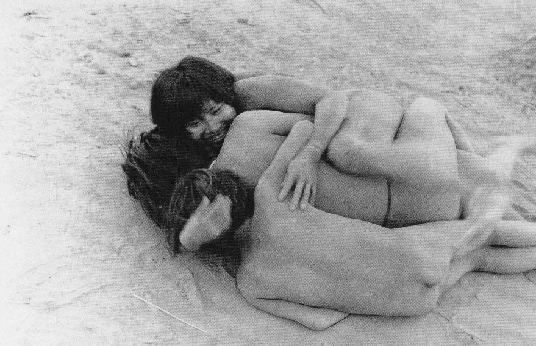
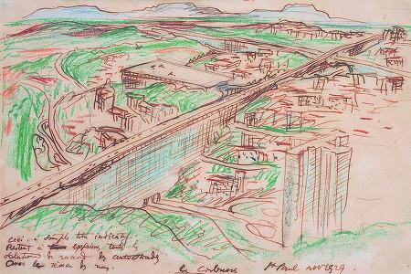
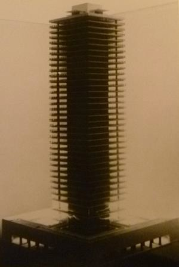
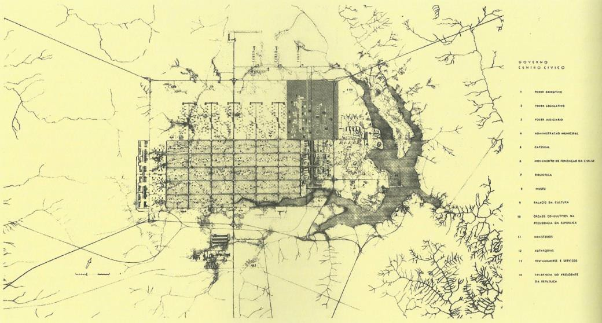
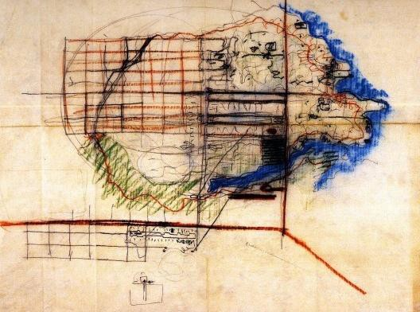

# Resumo

Em um momento no qual a história do urbanismo se apresenta como uma
plataforma importante de revisão crítica de modelos e práticas de
planejamento, parece produtivo examinar ideias e projetos vencidos nas
disputas processadas no campo especializado. Este artigo se debruça
sobre três propostas urbanísticas produzidas em meados do século XX no
Brasil que jamais saíram do papel: a hipótese modernista de uma cidade
antropofágica, apresentada em 1930 na forma de uma conferência pelo
engenheiro Flávio de Carvalho; o projeto de Gregori Warchavchik e
Vilanova Artigas para o concurso do Paço Municipal de São Paulo, em
1939; e a proposta da equipe coordenada por Artigas para o concurso de
Brasília em 1956. Pensadas como dispositivos de vanguarda, cada uma
delas seria apresentada conforme as respectivas circunstâncias de
produção, priorizando a explicitação de suas coordenadas teóricas e
espaciais básicas. Oferecendo-se, porém, enquanto visões dissonantes ou
concorrentes de cidade, elas se impõem à reflexão histórica em suas
potencialidades imaginárias e conceituais que talvez nos ajudem a
repensar o lugar específico do modernismo arquitetônico no universo de
representações da vida urbana e discursos urbanísticos no Brasil.

**Palavras chave**: urbanismo, modernismo, cidades, Flavio de Carvalho,
Gregori Warchavchik, Vilanova Artigas

# Abstract

In a time when planning history presents itself as an important platform
for the critical review of urban models, it seems productive to examine
projects and ideas which have been aborted within the specialized field.
This article focuses on three planning proposals produced in
mid-twentieth century Brazil that have never been put in practice: the
modernist assumption of a cannibalistic city, presented in 1930 as a
lecture by the engineer Flávio de Carvalho; the entry presented by
Gregori Warchavchik and Vilanova Artigas São Paulo' City Hall
competition in 1939; and the team proposal coordinated by Artigas for
Brasilia's competition in 1956. Seen as avant-garde devices, they would
be presented according to their own specific circumstances of
production, through their basic theoretical and spatial guidelines.
Emerging as dissonant or competing visions of the city, they suggest to
historical research certain visionary and conceptual potentialities.
Maybe through them we might be able to contribute to the rethinking of
the specific role played by architectural modernism in the realm of
urban life's representations and planning discourses in Brazil.

**Keywords**: urban planning, modernism, cities, Flavio de Carvalho,
Gregori Warchavchik, Vilanova Artigas

# Introdução

Tradicionalmente, a historiografia da arquitetura vem negligenciando as
transformações processadas no campo urbanístico. A omissão é ainda mais
evidente

quando se observa que ela é também reiterada no tratamento da produção
arquitetônica do século XX, e particularmente da arquitetura moderna,
que, como se sabe, elegeu o urbanismo como um de seus cavalos de batalha
na afirmação do espaço disciplinar e profissional que se configurava. A
tendência não é exclusiva ao Brasil, mas aqui ela vem sendo acompanhada
pela desatenção também por parte da historiografia do urbanismo à
produção urbanística dos arquitetos modernistas. Excetuando-se talvez o
interesse despertado pelo plano de Lucio Costa para Brasília, a verdade
é que ainda hoje poucos são os trabalhos dedicados ao estudo da produção
modernista em urbanismo. (GOMES, 2009)

Em um momento, portanto, no qual a história do urbanismo se apresenta
como uma plataforma importante de revisão crítica de modelos e práticas
de planejamento, parece produtivo examinar ideias e projetos
negligenciados pela historiografia talvez porque derrotados no interior
das disputas processadas no campo especializado. Este artigo se debruça
sobre três propostas urbanísticas produzidas em meados do século XX no
Brasil que jamais saíram do papel: a hipótese modernista de uma cidade
antropofágica, apresentada em 1930 na forma de uma conferência pelo
engenheiro Flávio de Carvalho; o projeto de Gregori Warchavchik e
Vilanova Artigas para o concurso do Paço Municipal de São Paulo, em
1939; e a proposta da equipe coordenada por Artigas para o concurso de
Brasília em 1956. Pensadas como dispositivos de vanguarda, cada uma
delas seria apresentada conforme as respectivas circunstâncias de
produção, priorizando a explicitação de suas coordenadas teóricas e
espaciais básicas. Oferecendo-se, porém, enquanto visões de cidade
dissonantes ou concorrentes, elas se impõem à reflexão histórica por
suas potencialidades imaginárias e conceituais. Talvez, por aí, possamos
contribuir para repensar o lugar específico do modernismo arquitetônico
no universo de representações da vida urbana e de discursos urbanísticos
no Brasil.

# Desnudando a cidade burguesa

Em 28 de junho de 1930, durante a IV Congresso Pan-Americano de
Arquitetos, realizado no Rio de Janeiro, Flavio de Carvalho (1899-1973),
que desde 1928 vinha se envolvendo com o movimento Antropofágico de São
Paulo, apresentou uma tese intitulada \"A cidade do homem nu\". Nela, o
engenheiro falaria em nome de um modelo de cidade totalmente diferente
do "organismo urbano burguês", próprio a um \"homem máquina do
classicismo", que por meio da repetição de antigos ritos, rotinas e
desejos limitados vinha aniquilando \"no homem o gosto pela vida, o
entusiasmo de produzir coisas, o desejo de mudar.\" (CARVALHO, 1930)
Tratava-se de pensar uma cidade para o homem do futuro, herdeiro do
antropófago nu, destituído de tabus escolásticos e filosofias
ultrapassadas. Esse novo homem do futuro surgia livre para "penetrar no
desconhecido" e investigar as "coisas do universo e da vida, para
conhecer a alma do homem, torna-la métrica e utilizá-la no bem-estar da
cidade". Enquanto tal, ele exigia um mecanismo urbano totalmente
redimensionado: \"um gigantesco motor em movimento", capaz de
transformar "a energia das ideias em necessidades para o indivíduo,
realizando o desejo coletivo, produzindo felicidade, isto é, a
compreensão da vida e do movimento\". Esta \"metrópole antropofágica\"
que nasceria na América (não mais como as fortalezas no processo de
conquista colonial) deveria ser, portanto,

> Um centro de sublimação natural dos desejos do homem, um centro de
> reanimação de desejos exaustos; um grande centro de produção de vida
>
> orgânica, de seleção e distribuição dessa vida em formas de energia
> útil ao homem. (CARVALHO, 1930)

Enquanto tal, ela deveria ser zoneada de modo consistente com a
realização de tais propósitos. Seu plano concêntrico, com zonas
circulares rigorosamente posicionadas, funcionaria para garantir o
equilíbrio orgânico de toda a cidade. Dominada por um "centro de
pesquisas", voltado à seleção, ordenamento e distribuição de todas as
energias da cidade segundo critérios científicos, a cidade conteria
neste primeiro anel urbano, localizado em sua orla, também um "centro de
ensino e orientação do homem" e um "centro hospitalar". Um segundo anel
da cidade, separado deste primeiro anel científico por um grande parque
circular, conformaria um "centro de gestação": uma máquina imensa onde
"a vida poderia ser estudada e catalogada". O terceiro anel da cidade
seria precisamente a sua "zona erótica", estratégica no plano de Flávio
de Carvalho, posto que configurando

> Um imenso laboratório, onde se agitam os mais diversos desejos, onde o
> homem nu pode encontrar a sua alma antiga, pode projetar a sua energia
> solta em qualquer sentido, sem repressão, onde ele realiza desejos,
> descobre novos desejos, forma o seu novo ego, orienta a sua libido e
> destrói o ilógico. (CARVALHO, 1930)

Vizinho a ela, estaria o grande anel habitacional e, por fim, no núcleo
central da cidade as funções de administração, que se comunicavam com
todos os demais setores através de uma rede subterrânea de transportes.
Gestão urbana, habitação, erotismo, corpo, lazer, saúde, educação e
ciência, tais as principais funções de uma cidade, a serem escalonadas
geometricamente de modo a finalmente realizarem o antropófago do futuro.

> 

Claude Levi-Strauss. Crianças Nambiquara, Mato Grosso, Brasil,
1937-1938. Fonte: Instituto Moreira Salles

À época, a conferência causou escândalo no público presente. Mesmo antes
de ser proferida, a imprensa já vinha alardeando sua participação com
tema tão dissonante no ambiente solene da Escola Nacional de Belas
Artes. No dia 28, a manchetes se multiplicam alardeando a sua tese.
Oswald de Andrade concede entrevista apresentando o engenheiro no Diário
da Noite: "Flávio de Carvalho é uma das grandes forças do Movimento
Antropofágico brasileiro. Coloco-o ao lado de Pagu, como temperamento e
como criador, pois é, de todos nós, quem mais tem trabalhado." (ANDRADE,
1930) O Jornal do Brasil publica entrevista com o próprio Flávio,
apresentando-o como "antropófago entusiasta" que vinha provocando
escândalo e pavor em São Paulo: "a audácia e a irreverência de suas
ideias tão profundamente demolidoras, tem sido razão de surpresa e
discussões extraordinárias." (JORNAL DO BRASIL, 1930) Segundo um de seus
biógrafos, a plateia estava lotada. Mesmo antes de iniciar a leitura de
sua tese, sentia-se certo clima de repulsa e indignação. Durante a sua
fala, irrompem apartes, gritos de protesto e interrupções. Grupos
inteiros se retiram do anfiteatro. Diante das ameaças, um pelotão da
polícia é convocado, distribuindo pelo palco e as galerias durante toda
a conferência. (TOLEDO, 1994) A verdade é que nela não se atacava
simplesmente as \"concepções cristãs da família e da propriedade
privada\" em nome da liberação dos desejos e da libido, mas se
conclamava os presentes a retirarem as "suas máscaras de civilizados" e
assumirem "as suas tendências antropófagas, reprimidas pela conquista
colonial\" e pela formação acadêmica a que estavam sujeitos. Tratava-se
de encarar essas tendências recalcadas com sinceridade e orgulho, de
modo a que se pudesse "caminhar sem deus para uma solução lógica do
problemas da vida da cidade, do problema da eficiência da vida\"
(CARVALHO, 1930). Em suma, não passaria despercebido ao público que a
exposição daquele plano da cidade do homem nu passava por um ataque
frontal aos valores herdados da civilização cristã, europeia e colonial.
Não por acaso, ao final de sua fala, diante do rumor ensurdecedor que
tomara conta do auditório, a mesa diretora propôs encerrar-
imediatamente a sessão.

Não resta dúvidas de que a conferência, além de performance
vanguardista, propunha- se a desafiar na linha antropofágica os
pressupostos etnocêntricos de base à cultura urbanística, confrontando a
elite pan-americana da arquitetura com seus projetos nacionais
monolíticos e mal resolvida mentalidade colonizada. Sua posição de
marginalidade era desse modo tão previsível quanto necessária. A reação
furiosa da corporação ao tema antropofágico revela não apenas uma
impermeabilidade epistemológica, mas a incapacidade de pensar a utopia
urbanística em seus termos políticos fundadores, isto é, de enfrentar o
planejamento da cidade como parte de uma revisão global dos valores
ético-morais e das cosmologias sociais. O resultado é que doravante "a
cidade do homem nu" passaria a figurar na história da arquitetura como
episódio anedótico e desvairado, sem consequência alguma sobre o curso
das discussões e invenções urbanísticas. Nem mesmo enquanto expressão de
uma forma de pensar, uma \"consciência participante", inseparável da
"existência palpável da vida", como se lê no Manifesto Antropofágico: "A
transformação permanente do Tabu em totem. (\...) Roteiros. Roteiros.
Roteiros. Roteiros. Roteiros." (ANDRADE, 1928) Em outras palavras,
também nesse campo, a cidade antropofágica jamais viria a ser
vislumbrada como proposição de uma outra perspectiva de vida e
pensamento, capaz de imputar \"um valor primário da alteridade\"
(SZTUTMAN, 2010, p.14), ou antes, a possibilidade de se trocar de ponto
de vista com o seu inimigo, fosse ele o europeu, o não-humano ou o
leigo.

# Improváveis passos cívicos

Em 1929, Le Corbusier chegaria no Brasil, em grande medida incentivado
por seu compatriota Blaise Cendrars, que desde 1924 vinha regularmente
visitando o país. Antes disso, aliás, em 1922, Oswald de Andrade,
interessado na estética canibalista, já havia se aproximado do autor da
Anthologie Nègre, livro publicado no ano anterior, que contribuíra para
rejuvenescer a moda primitivista em Paris (EULÁLIO, 2001, p.23).
Cendrars, assim como Le Corbusier, aludiriam à essa revolução cultural
em potencial simbolizada por alguns destes homens nus da América do Sul:
segundo Cendrars, livres do trabalho cansativo e de todos os tipos de
fetiches, abertos para o futuro e alógicos porque essencialmente
anti-nostálgicos, o oposto dos "homens- museu" da Europa; segundo
Corbusier, aqueles \"homens completamente nus\" tinham se livrado de
todas as contingências externas por meio do desenvolvimento de suas
próprias ferramentas (LE CORBUSIER, 1980, p.22). Em seu "Prólogo
Americano", escrito após a sua turnê pelo Brasil, Le Corbusier
referiu-se à juventude antropofágica paulistana, que o teria apresentado
a ideia de um rito exotérico

> De uma comunhão com as melhores forças. O repasto era parcimonioso,
> dele participavam cem ou quinhentas pessoas que iriam comer a carne do
> inimigo capturado. Esse guerreiro era valoroso; assimilavam-se as suas
> virtudes, porém ele, por sua vez, havia comido a carne dos próprios
> guerreiros da tribo. Assim, ao comer sua carne, assimilava-se a
> própria carne de seus ancestrais. (LE CORBUSIER, 2004, p.29)

Foi Cendrars quem sugeriu a Paulo Prado, um patrono local da vanguarda
modernista, que o hospedasse e garantisse boas diárias ao visitante em
São Paulo. O próprio Flavio de Carvalho e o crítico de arte Geraldo
Ferraz (que então estava no comando de uma sessão cultural no *Diário de
São Paulo*, que vinha publicando a segunda dentição da *Revista de
Antropofagia*) foram convocados a mostrar pessoalmente a cidade a Le
Corbusier, realizando também a primeira entrevista do arquiteto em
terras brasileiras. Nela, o visitante criticaria a mecanização excessiva
da cidade, de acordo com ele, tão prejudicial quanto as cidades sem
planejamento. Com ele, visitaram diferentes bairros e algumas das
primeiras casas modernistas brasileiras projetadas pelo arquiteto
ucraniano Gregori Warchavchik. Muito tem sido dito - talvez até demais -
sobre a importância desta ligação local com o movimento moderno
internacional de arquitetura e do forte papel desempenhado por Le
Corbusier na atualização da prática nacional em face das realizações
internacionais. No entanto, frequentemente subestimou-se o complexo mapa
das vanguardas que ele conheceu no Brasil, nem sempre muito benevolente
com a atitude moralizadora dos vanguardistas europeus.

Quase nada, por outro lado, vem sendo lembrado do impacto das ideias de
Corbusier em um meio de planejamento urbano então dominado por uma elite
profissional e burocrática de engenheiros, completamente alheios às
experimentações modernistas, ainda que atualizadíssimos no panorama
revolvido do urbanismo moderno (LEME, 1999; MALTA, 2000). Pois na
verdade o foco de seu discurso no Brasil e o interesse de seu público,
pelo menos em São Paulo, onde ele passou a maior parte de seu tempo na
viagem de 1929, era mais em urbanismo do que sobre \"a revolução
arquitetônica contemporânea\". Como se sabe, em 1922, Corbusier
apresentou seus planos para uma \"Cidade Contemporânea de três milhões
de habitantes\", cidade protótipo viável concebida como um grande motor
na qual ele basearia o seu *Plan Voisin* para Paris. Diferentemente dos
sistemas europeus, com base em uma disposição hierárquica de

torres envidraçadas isoladas, seus desenhos para São Paulo, assim como
para Montevidéu e o Rio de Janeiro, propunham linhas contínuas de
megaestruturas que atravessavam a paisagem natural e a topografia local,
tendo acima vias expressas elevadas sobre uma enorme estrutura
habitacional linear, e ao chão um piso livre para uso público e a
vegetação. Em São Paulo, onde a paisagem natural e histórica não era
tanto um ready-made, como no Rio, a nova estrutura deveria ligar
diferentes colinas de tal forma que pudesse redefinir totalmente a
expansão da cidade para baixo, produzindo uma espécie gigantesca de
arranha-terra. Não é de admirar que, apesar de desconsiderar como de
costume os bairros históricos, a estrutura horizontal em forma de cruz
proposta não coubesse nos esquemas rádio-concêntricos então localmente
dominantes, nem convergissem exatamente para os interesses imediatos do
explosivo mercado imobiliário local.

> 

Le Corbusier. Esquema urbanístico para São Paulo, 1929. Fonte: Fundação
Le Corbusier

Crescendo de acordo com taxas demográficas explosivas, São Paulo vivia
então seu primeiro grande pico de metropolização. Polo de grandes
convulsões políticas e muita tensão subjetiva, sua indústria estava
passando por um rápido processo de concentração, ativando uma mobilidade
social sem precedentes no país. Se os progressos nas linhas de montagem
locais ainda eram relativamente tímidos, as mudanças qualitativas na
cultura e na sociedade estavam chegando e o velho Eldorado do café
começava a ser entendido como uma terra de velocidade e vertigem, de
imigrantes e de máquinas, automóveis e motopia. (SEVCENKO, 1992)

Warchavchik foi talvez o arquiteto local que mais se beneficiou naquele
momento do contato com Le Corbusier. Desde 1927, Warchavchik vinha
planejando e construindo em São Paulo aquelas que são consideradas as
primeiras casas modernistas do Brasil, organizando concorridas
exposições de arte e de arquitetura e tomando parte de debates
acalorados na imprensa. Foi com base no capital simbólico que já então
acumulava que Le Corbusier o convidaria para se integrar à rede
internacional dos arquitetos modernos como delegado sul-americano ao
CIAM de 1930. Apesar de efetivamente não chegar a tomar parte dos
congressos que viriam a ser organizados, enviou através de Siegfried
Giedion uma tese acerca dos limites postos ao projeto

moderno em um país de industrialização incipiente. A partir de 1933, é
verdade, Warchavchik viria a se afastar dos embates da profissão,
cedendo espaço à emergência de um novo polo de vanguarda arquitetônica
que vinha se rearticulando no Rio de Janeiro, um pouco antes e
imediatamente após a segunda visita de Le Corbusier ao Brasil. (LIRA,
2011)

Ao final daquela década, contudo, o arquiteto voltaria à atividade. Um
de seus marcos de retorno foi justamente um projeto urbano. De fato, em
1939, Warchavchik se associaria ao jovem engenheiro-arquiteto João
Batista Vilanova Artigas, para disputar o concurso da prefeitura de São
Paulo para a construção do Paço Municipal. Tratava- se de enfrentar a
velha falta de uma sede própria para o poder municipal. Dentre os 48
projetos inscritos, 12 foram selecionados pela comissão julgadora e
publicamente expostos e criticados. De acordo com um dos críticos do
certame, o complexo deveria funcionar como a \"casa da cidade\", e sua
arquitetura deveria ser capaz de estabelecer uma espécie de \"padrão\"
ou \"exemplo\" para uma cidade que estava crescendo muito rapidamente.
Como tal, ele deveria responder a duas preocupações básicas: manter a
\"physique du rôle\" e expressar o caráter do povo de São Paulo. (O
ESTADO DE S. PAULO, 10/5/1939)

O projeto vencedor, embora revelando perfeito *savoir-faire* de seus
autores, era uma obra fria, um grande edifício sem qualquer grandeza nem
dignidade. Na verdade, para o crítico, apenas dois projetos mereceriam
um comentário mais generoso: \"Paraquedas\", projetado por Flávio de
Carvalho, que se definia por uma elevada torre de vidro, plantada no
centro de São Paulo, como se tencionasse desenhar na cidade, qual um
grande compasso da política, um novo círculo de cidadania. (O ESTADO DE
S. PAULO, 13/5/1939)

"Paraquedas" e "Praça Cívica", projetos
apresentados por Flavio de Carvalho e Gregori Warchavchik,
respectivamente, ao concurso do Paço Municipal de São Paulo de 1939.
Fonte: Biblioteca da FAU-USP

O outro projeto era justamente o \"Praça Cívica\", projetado por
Warchavchik e Artigas, visto por ele como uma lição eloquente de
arquitetura, planejamento e utilidade social. Seu partido horizontal,
ciente do Palácio da Justiça e da Catedral da Sé adjacentes; seu
contraste entre a torre elevada para abrigar os arquivos municipais e
sustentar o tradicional relógio da cidade, indicando claramente a função
do edifício; e sua corajosa solução de suprimir uma quadra inteira de
modo a permitir reconfigurar uma nova silhueta edificada como moldura
continua da grande praça comum, sob a qual funcionaria um terminal
central de transportes públicos; tudo isso conspirava para a definição
do paço municipal como core da cidade, um centro cívico acessível porque
articulado à malha urbana. (O ESTADO DE S. PAULO, 13/5/1939)

Na verdade, o projeto de Warchavchik e Artigas foi o único dos doze
selecionados que enfrentou o problema proposto em termos urbanísticos,
recompondo inclusive os elementos básicos do programa arquitetônico
previamente definido: preocupações espaciais iriam fazer convergir uma
atitude em face das estruturas preexistentes com a observância das
demandas contemporâneas, atentando simultaneamente para o programa
oficial e a vida cultural pública, para os simbolismos sociais e as
infraestruturas urbanas. Sua plataforma de vanguarda parecia então se
deslocar de um princípio estético- produtivo para uma aposta liberal na
civilidade. É revelador, no

entanto, que não só projeto de Warchavchik e Artigas não tenha
convencido o júri, mas que a despeito das inúmeras iniciativas
subsequentes de organização de concursos similares, a maior cidade do
país nunca tenha realmente conseguido resolver o problema de uma sede
apropriada para a sua prefeitura.

# Limites de uma utopia realista

É curioso perceber que enquanto Warchavchik, depois daí, viria cada vez
mais a se converter em um arquiteto-empresário característico, com forte
atuação no mercado imobiliário em detrimento do setor público, Artigas
iria evoluir para um dos principais nomes das novas vanguardas que se
afirmavam no Brasil a partir da Segunda Guerra Mundial, implementando
uma agenda ético-política contundente no interior do campo intelectual,
profissional e poético da arquitetura.

Um dos arquitetos mais promissores do início dos anos 1940, membro
fundador da secção paulista do Instituto de Arquitetos do Brasil em 1943
e da Faculdade de Arquitetura e Urbanismo da Universidade de São Paulo
em 1948, Artigas logo se tornaria um dos nomes principais da ideologia
nacional-desenvolvimentista em arquitetura, advogando simultaneamente em
favor da racionalização construtiva do projeto e de uma função social da
arquitetura. Em meados do anos 1950, com efeito, ele viria a
protagonizar uma espécie de retorno a um grau zero da arquitetura de
vanguarda no Brasil, desafiando tanto a aposta liberal de Warchavchik no
mercado como o *establishment* arquitetônico carioca, a quem ele até
então apelara no confronto com a modernidade politécnica e que doravante
acusaria de irresponsabilidade social, formalismo e crescente
convencionalismo. Na realidade, ligado ao Partido Comunista desde 1945,
Artigas se tornara no início da década seguinte o principal porta-voz do
discurso arquitetônico anticapitalista e anti-imperialista no Brasil,
deslanchando no país uma vigorosa investigação nas áreas de design e
produção. E nessa nova agenda arquitetônica o seu engajamento com a
arquitetura pública viria a desempenhar papel de destaque. (ARTIGAS,
2004; KAMITA, 2000; KATINSKY, 2003; GABRIEL,

2003; THOMAZ, 2005)

Em 1955, Artigas organizou uma grande equipe para tomar parte do
Concurso para o Plano Piloto da Nova Capital Federal. Nela seria reunido
um grupo inteiro de arquitetos experientes, professores universitários e
recém-graduados pela FAU-USP: arquitetos como Carlos Cascaldi, também
seu colega e colaborador nas obras de Londrina, no Paraná, Paulo de
Camargo e Almeida, que vinha trabalhando com planejamento urbano desde a
década de 1930 no Rio de Janeiro, o economista Mario Wagner Vieira da
Cunha, também professor da USP junto à Escola de Administração, e o
historiador e crítico de arte Flávio Motta, professor da FAU-USP, além
de ex- alunos ali de ambos, como Julio Roberto Katinsky, Ubirajara
Giglioli e Heitor Ferreira de Souza. A equipe envolveria ainda um leque
abrangente de conselheiros em planejamento regional e zoneamento,
administração e legislação pública, agricultura, produção de energia,
saneamento, saúde, educação, cultura e lazer. (BRAGA, 2010, p.65) Os
quinze desenhos apresentados no concurso, cuidadosamente ilustrados e
legendados, e o memorial excepcionalmente longo e detalhado que a eles
se somava, claramente oferecendo-se como uma utopia realista. Brasília
deveria trabalhar para a integração nacional, não só simbolicamente mas
regional e demograficamente, bem como política e economicamente. Com
base em uma nova rede de rotas e estradas, a cidade deveria desempenhar
um papel fundamental na ocupação do Brasil Central, interrompendo o
complexo colonial de dependência, promovendo uma estratégia de

desenvolvimento regional mais equilibrado e trabalhando para o
fortalecimento de um mercado interno e a melhoria das condições de vida
dos interioranos.

> 

Vilanova Artigas e equipe. Plano Piloto da Nova Capital Federal, 1957.
Fonte: Biblioteca da FAU-USP

Segundo os autores, o estabelecimento da nova capital não deveria ser
reduzido a uma questão de *layouts* de rua ou de estética urbana.
Deveria ser definido a partir da afirmação geográfica de um sistema
coerente de organização espacial. Diferentes escalas deveriam ser assim
consideradas: a escala nacional, o nível regional do Distrito Federal e
seus recursos agrícolas e ambientais assim como as povoações e cidades
vizinhas, os campos potencialmente rurais e verdes ao redor da zona
urbana, a estrutura interna da cidade capital, seus diferentes setores e
micro zonas. Além de múltiplas escalas, a revisão do plano também
deveria ser prevista em no máximo vinte anos, levando-se em consideração
os possíveis efeitos territoriais e demográficos que a sua implantação
certamente causaria, inclusive mudanças dentro da população local e a
possível fixação de parte da força de trabalho empregada no construção
da cidade após a sua conclusão. É importante ressaltar que esta foi a
única proposta apresentada no concurso que levou essa hipótese em
consideração, antecipando também a construção de uma seção inteira de
habitação para abrigar a população empregada no canteiro de obras como
zona de permanente do plano piloto. (CASCALDI, 1957)

> 

Vilanova Artigas e equipe. Plano Piloto da Nova Capital Federal, 1957.
Fonte: biblioteca da FAU-USP

Assim como boa parte das propostas apresentadas, inclusive a vencedora,
o projeto definia que cidade deveria ter um crescimento limitado em
tamanho e população. A sua setorização, entretanto, deveria observar
tanto a organização da sociedade local como um todo como as escalas da
pequena comunidade, permitindo soluções urbanísticas e arquitetônicas
coerentes com cada uma delas. A definição de zonas e setores, portanto,
não seria baseada em fronteiras estritamente legais ou polaridades
funcionais, mas articuladas através dos modos de vida aqui que em cada
um deles teriam lugar. Uma malha ortogonal maciça estruturaria a cidade
em sua totalidade, as zonas residenciais, verdes, comerciais,
industriais, administrativas e militares sendo definidas por variações
de tipologia, ritmo e densidade. As áreas destinadas para a sociedade em
geral seriam localizadas próximas ao lago Paranoá, incluindo um parque
nacional, uma área comercial e o centro administrativo e civil da
capital, concebido de forma a tornar-se um espécie de ímã regional e
nacional e não prejudicar as atividades diárias no interior da cidade.
(CASCALDI, 1957)

Procedendo desta maneira, fica evidente a tomada de posição do Plano de
Artigas no debate contemporâneo sobre o planejamento e o desenvolvimento
no país. Combinando uma abordagem objetiva da vida urbana e regional com
uma reflexão sobre o papel político de uma capital em um país
subdesenvolvido, parecia-se tomar distância seja do civismo liberal de
Warchavchik seja do manifesto anti-civilizatório de Carvalho. Como se a
arquitetura devesse encaminhar seus poderes vanguardistas a uma
finalidade construtiva, absolutamente necessária. Tratava-se, portanto,
de afirmar uma visão diversa da modernidade, que se desdobrava em uma
outra maneira de se referir à arquitetura da vida coletiva futura. Se o
acentuado princípio de realidade recomendava-lhe atenção às diversas
escalas espaciais e temporais de planejamento da nova capital, a sua
derrota em face do plano de Lúcio Costa parecia reiterar a necessidade
de uma sobrecarga monumental em seu valor de "autoconsciência da

epopeia arquitetônica, política e cultural, para simbolizar a vontade
estatal de desenvolvimento e integração nacional". (GORELIK, 2005,
p.184) Fragilizado talvez por seu pendor pelo processo de urbanização da
sociedade e do território em detrimento de sua forma final, uma vez
realizado, o plano de Artigas dificilmente teria se convertido no museu
vivo da modernidade em que Brasília, para o bem ou para o mal, tão
precocemente se tornou.

> ∗

Esta linha tortuosa, que une obras de vanguarda tão diferentes está
repleta de conotações críticas. Quais são as raízes e significados de
sua aparente discrepância na história do urbanismo no Brasil? Que elos,
lacunas e disputas revelam entre si? Como elas se relacionam com o
legado das vanguardas, com seus círculos locais de articulação com as
formas concretas de produção da arquitetura e da cidade? Até que ponto
elas respondem, ou antes até que ponto a sua fortuna ou seu infortúnio
remetem às condições da modernidade cultural e ao esquema emblemático da
modernização no Brasil?

# Referências

> ANDRADE, O. Manifesto Antropofago. In *Revista de Antropofagia,* ano
> 1, n.1, p. 3 e 7, maio de 1928.

ANDRADE, O. A cidade do homem nu. Algumas palavras de Oswald de Andrade.

> *Diário da Noite*, Rio de Janeiro, 28/6/1930.
>
> ARTIGAS, J. B. V. *Caminhos da arquitetura*. São Paulo: Cosac e Naify,
> 2004.
>
> BRAGA, M. *O Concurso de Brasilia: sete projetos para uma capital.*
> São Paulo: Cosac Naify/ Imprensa Oficial/MCB, 2010
>
> CAMPOS, C.M. *Os rumos da cidade: urbanismo e modernização em São
> Paulo.* São Paulo: Senac, 2002.

CARVALHO, F. de. Uma these curiosa. *Diário da Noite*, Rio de Janeiro,
1/7/1930

> CASCALDI, C. *Brasília: futura capital federal, plano piloto;
> relatório apresentado à comissão julgadora do Concurso para o Plano
> Piloto da Nova Capital Federal*, São Paulo, em 1957.
>
> O ESTADO DE S. PAULO. O Paço Municipal. *O Estado de S. Paulo*, São
> Paulo, 10/5/1939, p. 7.
>
> O ESTADO DE S. PAULO. O Paço Municipal. *O Estado de S. Paulo*, São
> Paulo, 13/5/1939, p. 7.
>
> EULALIO, A. *A aventura brasileira de Blaise Cendrars.* São Paulo:
> Edusp/ Imprensa Oficial/ Fapesp, 2001.
>
> GABRIEL, M. F. *Vilanova artigas: uma poética traduzida*. São Carlos,
> EESC/USP, 2003. (Dissertação de Mestrado).
>
> GOMES, M.A.F. *Urbanismo na América do Sul: circulação de ideias e
> constituição do campo, 1920-1960*. Salvador: EDUFBA, 2009
>
> GORELIK, A. *Das vanguardas a Brasília: cultura urbana e arquitetura
> na América Latina.* Belo Horizonte: Editora da UFMG, 2005.

JORNAL DO BRASIL. A architectura numa concepção audaciosa. *Jornal do
Brasil*, Rio de Janeiro, 28/6/1930.

> KAMITA, J. M. *Vilanova Artigas*. São Paulo: Cosac e Naify, 2000.
> KATINSKY, J. *Vilanova Artigas*. São Paulo: Instituto Tomie Ohtake,
> 2003. LE CORBUSIER. *L'art décoratif d'aujourd'hui.* Paris: Arthaud,
> 1981.
>
> LE CORBUSIER. *Precisões sobre um estado presente da arquitetura e do
> urbanismo.* São Paulo: Cosac Naify, 2004.
>
> LEME, M.C. da S. (org.) *Urbanismo no Brasil, 1895-1965.* São Paulo:
> Nobel/ FAU- USP/ Fupam, 1999.
>
> LIRA, J. *Warchavchik: fraturas da vanguarda.* São Paulo: Cosac Naify,
> 2011
>
> SEVCENKO, N. *Orfeu extático na Metropole: São Paulo, sociedade e
> cultura nos frementes anos 20.* São Paulo: Companhia das Letras, 1992.
>
> SZTUTMAN, R. (org.) *Encontros: Eduardo Viveiros de Castro.* Rio de
> Janeiro: Azougue, 2008.
>
> THOMAZ, D.E. *Vilanova Artigas: A liberdade na inversão do olhar*. São
> Paulo: FAU/USP, 2005 (Tese Doutorado).
>
> TOLEDO, J. *Flavio de Carvalho: o comedor de emoções.* São Paulo:
> Brasiliense/ Campinas: Editora da Unicamp, 1994.
