# RESUMO

A imagem da cidade guarda em si um significado de apelo não somente
visual, mas fundamentalmente desenvolve um sentido de lugar. Esta imagem
é em grande parte influenciada pela arquitetura de edifícios voltados
para o setor terciário da economia, que promove, de certa maneira, uma
visão oficial da sociedade. Resgatar a história destas edificações nos
permite um conhecimento atual e passado de suas relações e, com isso,
nos faz entender como tal sociedade é articulada e de que forma ocorrem
suas interações. Por tal motivo, esta pesquisa está baseada
principalmente no estudo de quatro edifícios, destinados ao uso
comercial, edificados entre os anos de 1911 a 1948. Localizados no
centro de Florianópolis, lugar que ainda hoje detém certo ar de
Província e preserva um acervo histórico de valor cultural e
paisagístico. Identificar os processos de modificação ocorridos nas
fachadas comerciais de quatro exemplares localizados a oeste da Praça XV
é, no fundo, uma tentativa de resgatar uma memória urbana. O patrimônio
cultural não é somente uma construção meramente material, ele é de certa
forma uma memória institucionalizada e a leitura iconográfica nos
permite adentrar no universo das formas e, mais do que isso, permite
resgatar a memória coletiva.

Palavras-chave: memória urbana, Florianópolis, patrimônio cultural,
design visual, arquitetura

> Abstract
>
> *The city's image has a meaning that it isn't only visual appeal, but
> it's fundamentally develops a sense of place. This image is largely
> influenced by the architecture of buildings of the tertiary sector of
> the economy that promotes an official vision of society. Rescuing the
> history of these buildings, it allows us a current and past knowledge
> of their connections and thereby, it makes us understand how such a
> society is articulated and how their interactions occur. For this
> reason, this research is based primarily on the study of four
> buildings intended for commercial use, built between the years
> 1911-1948. They are located in downtown Florianopolis, a place that
> still holds air of Province and preserves a historical record of
> cultural and scenic value. Identify the modification processes
> occurring in commercial facades of four buildings located west of
> Praça XV, it's basically an attempt to rescue an urban memory.
> Cultural heritage isn't only merely a construction material, it is, in
> some ways, an institutional memory and iconographic reading allows us
> to enter the world of forms and, more than that, lets rescue the
> collective memory.*
>
> *Keywords: urban memory, Florianópolis, cultural heritage, visual
> design, architecture*

# Introdução

A ilha de Santa Catarina foi fundada pelo bandeirante paulista Francisco
Dias Velho, em 1662, porém a localidade só começou a prosperar quase um
século depois, em 1726, quando foi elevada à condição de Vila de Nossa
Senhora do Desterro.

O recorte geográfico escolhido para a pesquisa foi exatamente o centro
da cidade de Florianópolis, devido à importância que tal local tem na
construção e resgate da memória coletiva:

> Os centros das cidades têm sido identificados como o lugar mais
> dinâmico da vida urbana, animados pelo fluxo de pessoas, veículos e
> mercadorias decorrentes da marcante presença das atividades
> terciárias, transformando-se no referencial simbólico das cidades.
> (VARGAS, 2009)

A Praça XV de Novembro é o núcleo central histórico de Florianópolis e o
local escolhido pelo bandeirante paulista para fundação da vila. A
partir da praça partem as ruas mais antigas, que se expandiram
inicialmente para o Leste e posteriormente para Oeste desta.

Uma destas ruas, localizada a oeste da praça, é a Rua Felipe Schmidt.
Sua origem remonta ao século XVIII e, embora tivesse pequena extensão,
desde o início do século XX se transformou numa das principais vias da
cidade, sendo reconhecida pelo seu significado social para a população,
participando do cotidiano das pessoas e contribuindo na construção da
memória coletiva.

Até a década de 1920, a rua conservava traços arquitetônicos,
tipicamente coloniais (VEIGA, 1993). Em 1926 foi inaugurada a Ponte
Hercílio Luz, que deu um novo perfil urbano para a capital, tirando a
ilha do isolamento em que se encontrava até aquele ano. A Rua Felipe
Schmidt passou a ser, então, a principal via de acesso do centro da
cidade até a ponte. Devido à mudança da morfologia da malha urbana e ao
crescimento da cidade, com o aumento significativo de automóveis, o
então prefeito Mauro Ramos decidiu pelo alargamento da via, que até
então mantinha suas características originais.

Em 1928 ocorreu o início das obras que demoliram uma quantidade não
registrada de casas térreas e sobrados típicos da arquitetura portuguesa
e açoriana. Segundo Veiga a via:

> Foi alargada por volta da década de 30, o que provocou uma
> modernização edilícia, afastando-a de sua velha aparência colonial. Os
> prédios mais antigos tiveram de ser demolidos, ao exigir-se um recuo;
> outros tiveram suas fachadas reformadas, adotando uma decoração
> eclética. Alguns especialmente construídos por grandes e tradicionais
> firmas comerciais da cidade, passaram a adotar linhas similares,
> caracterizando visual próprio da empresa. Tais prédios podem ser
> observados ainda hoje. (VEIGA, 1993)

A segunda grande transformação da rua aconteceu a partir de 1976, quando
esta se tornou exclusiva para pedestres. A criação do calçadão foi uma
decisão do então prefeito Esperidião Amin, que inspirada no modelo
curitibano, determinou o fim do reinado do automóvel, no trecho entre a
Praça XV de Novembro e a Rua Álvaro de Carvalho. Até porque, àquela
altura, com a inauguração da segunda ponte - a Colombo Salles, o uso da
Felipe Schmidt deixou de ser prioritário como via de acesso à Ponte
Hercílio Luz.

Devido à importância de tal via para a cidade, elencou-se 04 edifícios
situados no cruzamento das ruas Felipe Schmidt e Trajano (Fig. 1), por
serem alguns dos exemplares mais significativos da arquitetura comercial
da cidade e pela disponibilidade de acervo fotográfico da região.

> 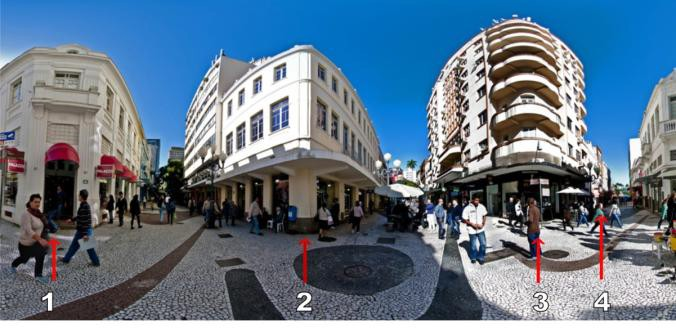
>
> Figura 1. Foto Panorâmica com a indicação dos 04 edifícios analisados:
> Livraria Central (01), Confeitaria Chiquinho (02), Ponto Chic (03) e
> Restaurante *Fast Food* (04). Fonte: autora, 2013.

Este estudo tem como principal objetivo a identificação do processo de
modificação dos parâmetros de merchandising visual aplicados em fachadas
comerciais através de quatro estudos

de caso, com a finalidade de identificar as tendências estéticas,
técnicas e, possivelmente, legislativas que influenciaram a alteração
das fachadas comerciais na cidade de Florianópolis.

# Métodos e Procedimentos

Foram consideradas para a elaboração deste estudo três etapas: coleta de
dados, análise e discussão dos resultados.

Para a coleta do material visual dos quatro edifícios analisados, foram
realizados levantamentos *in loco*, para obtenção de fotografias atuais.
Além disso, foram feitas buscas de fotografias antigas no acervo da Casa
da Memória, bem como junto ao Instituto Histórico e Geográfico de Santa
Catarina, com o intuito de coletar material suficiente para ajudar a
identificar quais modificações ocorreram nas fachadas comerciais destes
exemplares.

Após isso, foi feita inicialmente a organização e sistematização dos
dados obtidos, para posterior análise do material levantado. Com isso,
foi possível identificar prováveis agrupamentos que possibilitaram uma
organização e consequente leitura desse material, por meio de uma série
de pontos em comum. Pretendia-se assim, avaliar padrões e modificações
das fachadas comerciais, conciliadas com a busca de contextualizações
histórica e da legislação vigente na época.

Por fim, realizada a análise dos dados, espera-se compreender o porquê
das mudanças observadas, estabelecer uma cronologia das alterações
urbanas e possíveis interferências da legislação na alteração das
fachadas.

# Resultados e Discussão

> **Edifícios 01 -- Livraria Central (1928)**

Fundada em 15 de abril de 1910, a Livraria Central dos irmãos alemães
Alberto Entres e Godofredo Entres, logo se destacou entre as demais
livrarias e gráficas. Situada desde sempre na Rua Felipe Schmidt, número
14, esquina com a Rua Trajano (Fig. 2). Além de livraria, era
responsável pela publicação de diversos livros e impressos, como o Guia
do Estado, frutos da tipografia mantida no mesmo edifício.

Em 1928, o prédio da Livraria começou a ser demolido em virtude do
alargamento da Rua Felipe Schmidt (Fig. 3) e em seu lugar foi construído
uma nova edificação de dois pavimentos (Fig. 4).

> 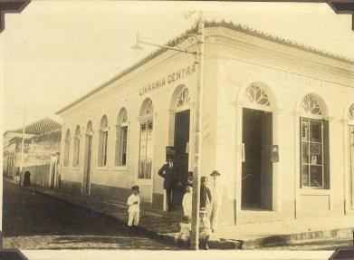
>
> 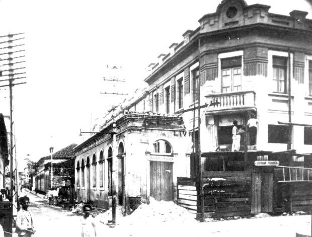Figura 2. Edifício da Livraria
> Central (1911-1928) Fonte:
>
> ENTRES, 1935.

Figura 3. Em 1930 durante o alargamento da rua Felipe

> Schmidt antes da demolição total da antiga Livraria e durante a
> construção do novo edifício. Fonte: Acervo da Casa da Memória

Durante a Primeira Guerra Mundial, a Livraria Central foi um dos alvos
dos conflitos envolvendo brasileiros e alemães. Sua localização, próxima
à Praça XV de Novembro, núcleo

central da cidade e palco das principais manifestações sociais, acabou
por deixar o edifício à mercê do "patriotismo quebra-vidraças"1.

Quando estourou a guerra diversas prisões foram feitas em Florianópolis,
entre elas do proprietário Alberto Entres. Por tal motivo, a livraria
enfrentou dificuldades em se manter neste período. Pouco depois do fim
da Segunda Guerra, Entres faleceu e, com isso, sua Livraria foi
transferida a um grupo de associados, que lhe deu a denominação de
Livraria e Papelaria Recorde, no início da década de 1950 (Fig. 5). A
livraria deixou de ocupar todo o edifício, abrigando nas salas
desocupadas outros dois estabelecimentos comerciais: um pequeno estúdio
fotográfico e uma lotérica.

> 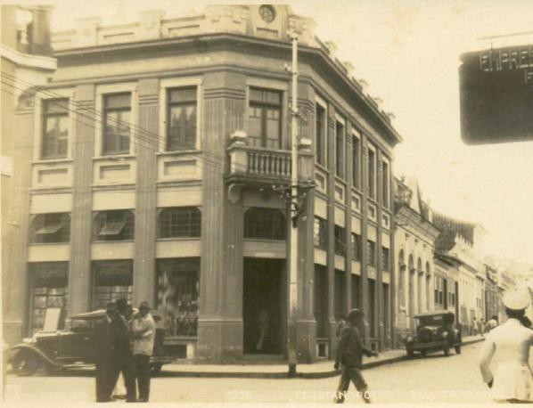
>
> 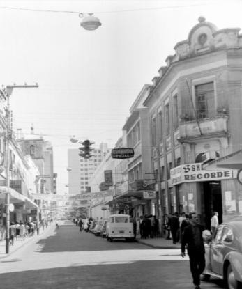Figura 4. Livraria Central (1935).
> Fonte: Acervo do IHG/SC.
>
> Figura 5. Livraria Recorde (1950). Fonte: Acervo da Casa da Memória.

Com a substituição do proprietário, algumas modificações ocorreram na
fachada: a retirada dos balaustres da varanda superior, com o fechamento
do vão do guarda-corpo e a instalação de uma placa de comunicação visual
em toda a esquina com as seguintes informações: "canetas livraria"
(fachada da Rua Felipe Schmidt), "Sheaffer Recorde" (fachada da
esquina), "esferográficas papelaria" (fachada da Rua Trajano).

Já no fim da década de 1970 houve aumento exacerbado do número das
placas de comunicação visual, a instalação de 3 toldos nas janelas do
pavimento superior e diversos ares-condicionados nas janelas (Fig. 6).

> 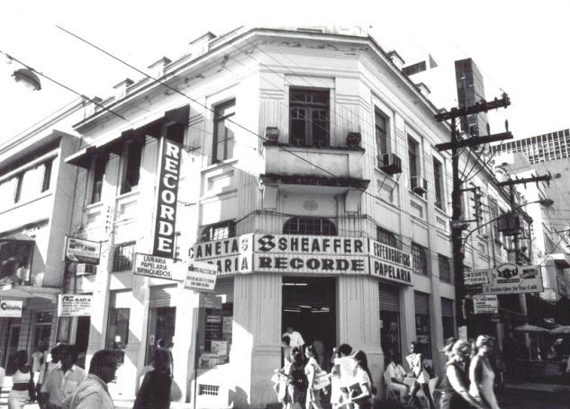
>
> Figura 6. Livraria Recorde (final da década de 1970). Fonte: Acervo da
> Casa da Memória.

Em 1986, as edificações da área central que possuíam valor histórico
significativo foram tombadas, entre elas o edifício da Livraria Central.
O imponente sobrado de esquina foi tombado a nível P22. Em 1990 foi
aprovado o Decreto nº 040/1990 que regulamenta a redução

> 1 *O Dia.* 17/07/1918 -- expressão cunhada pelo jornal "O Dia", ao
> referir-se ao apedrejamento de residências e estabelecimentos
> comerciais de alemães durante a Guerra.
>
> 2 Categoria P2 -- Imóvel participa de conjunto arquitetônico cujo
> interesse histórico está em ser pertencente a esse conjunto, devendo
> seu exterior ser totalmente conservado ou restaurado, mas podendo

do IPTU sobre imóveis que possuam valor histórico, artístico e/ ou
cultural - classificados como P1 e P2 - podendo a redução ser de até
100% conforme o estado de conservação do bem. (DIAS, 2005)

Possivelmente foi devido a estes fatores, que ocorreu a redução
significativa de placas (Fig.7), com a instalação de apenas uma com
tamanho reduzido e perpendicular a parede (Fig. 8). Tal como, a
eliminação de todos os toldos do andar superior e a colocação de um
toldo amarelo no chaveiro que ocupou uma das portas, antes destinada ao
estúdio fotográfico.

> 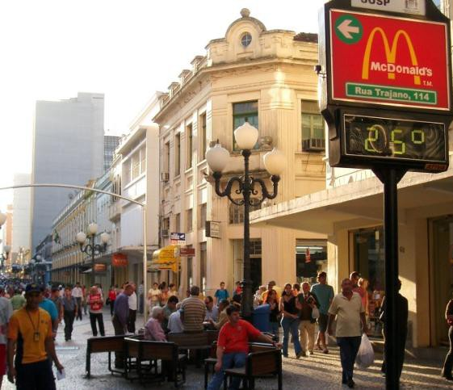
>
> 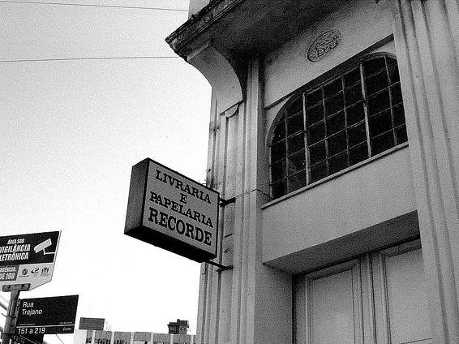Figura 7. Livraria Recorde (2007).
> Fonte: <http://identidadecatarinense.blogspot.com.br/2007/04/rua->
> felipe-schmidt-o-corao-da-cidade.html
>
> Figura 8. Placa de identificação (2008). Fonte:
> <http://www.flickr.com/>

A livraria foi um dos poucos estabelecimentos da rua que mantiveram sua
atividade original até os fins dos anos 2000. Após este período foi
ocupada, até a presente data, por uma loja de sapatos, que retirou quase
todos os aparelhos de ar-condicionado, restando apenas um, bem como o
toldo que identificava o chaveiro (Fig. 9). Porém instalou sete toldos
no pavimento térreo, fez o fechamento interno das janelas intermediárias
e recentemente pintou os detalhes da edificação da mesma cor da
identidade visual da marca (Fig. 10).

> 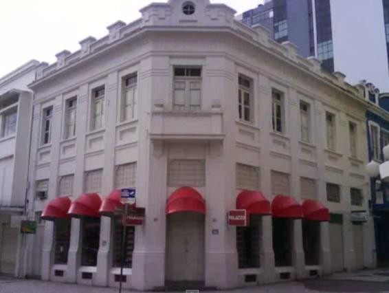
>
> 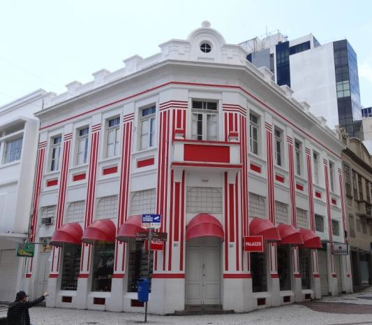Figura 9. Loja de calçados (20011).
> Fonte: autora, 2011.
>
> Figura 10. Situação atual da edificação (2013). Fonte: autora, 2013.

# Edifícios 02 -- Confeitaria Chiquinho (1926)

Em 11 de janeiro de 1904, em um casarão colonial situado na Rua Felipe
Schmidt esquina com Trajano, Francisco Künzer, o seu Chiquinho, instalou
sua confeitaria (Fig. 11). Em 1915, a viúva vendeu o estabelecimento
para Luiz Catani, proprietário até 1917. Um ano depois, Theodoro Ferrari
associou-se a empresa Catani para, em 11 de agosto de 1921, comprar o
prédio do sócio.

> haver remanejamento interno desde que sua volumetria e fachadas não
> sejam afetados e mantenham suas formas originais. (Plano Diretor,
> 1997)
>
> 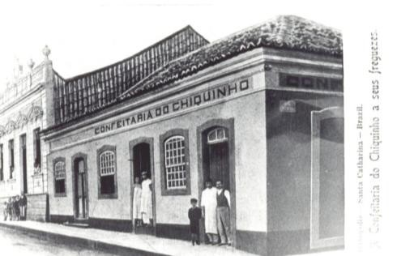
>
> Figura 11. Casarão colonial que abrigava a Confeitaria do Chiquinho de
> 1904-1924. Fonte: Acervo da Casa da Memória.

Em 1924, Theodoro mandou demolir o casarão e construiu em seu lugar
outro de três pavimentos (Fig. 12). A confeitaria ganhou um novo prédio,
elegante e moderno, a mais alta construção de Florianópolis, e segundo a
matéria do jornal A Gazeta de 10/04/1954, "a mais alta do estado
inteiro". A inauguração foi um acontecimento social na cidade, que
ocorreu quase na mesma época da inauguração da Ponte Hercílio Luz.

> 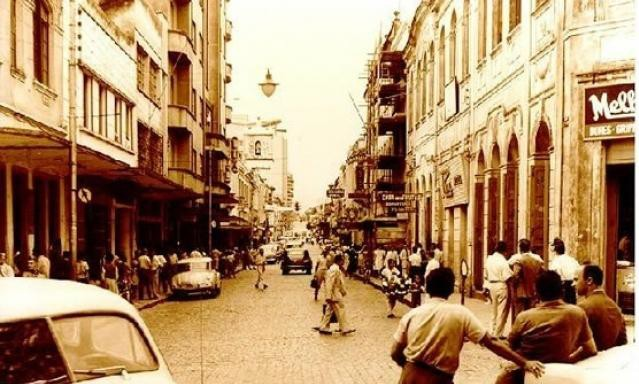
>
> Figura 12. Construção do novo edifício (à direita) da Confeitaria do
> Chiquinho (1925-1926). Fonte: Acervo da Casa da Memória.

A confeitaria funcionava no andar térreo (fig. 13), em conjunto com um
requintado restaurante, onde se ofereciam banquetes oficiais; e no
segundo andar era onde estava estabelecido o escritório da firma, que
mais tarde foi ocupado pela sede da Rádio Guarujá e um cinema.

> 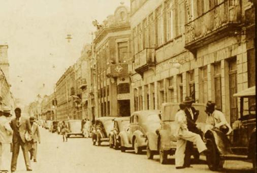
>
> Figura 13. Vista à direita da Confeitaria do Chiquinho em 1936. Fonte:
> Acervo da Casa da Memória.

A Confeitaria do Chiquinho não era apenas um local de passagem, a
clientela era feita de fregueses habituais e conhecidos, que faziam
deste local ponto de encontro. E mais do que isso, além de ser
considerada a confeitaria da moda, era o principal ponto de referência
da cidade. A partir do final da década de 1950, principalmente nas ruas
adjacentes à Praça XV, onde antes a Confeitaria do Chiquinho reinava
absoluta, houve um aumento significativo de estabelecimentos desse tipo.

Em 1954, quando completou 50 anos, ela era a mais antiga casa comercial
deste ramo na cidade. Desde sua construção até esta data, as duas únicas
modificações percebidas na fachada (fig.14), foram a inclusão em alto
relevo da inscrição "Confeitaria Chiquinho" nas duas fachadas do
edifício (fig.15) e a instalação da marquise em todo o perímetro da
edificação.

> 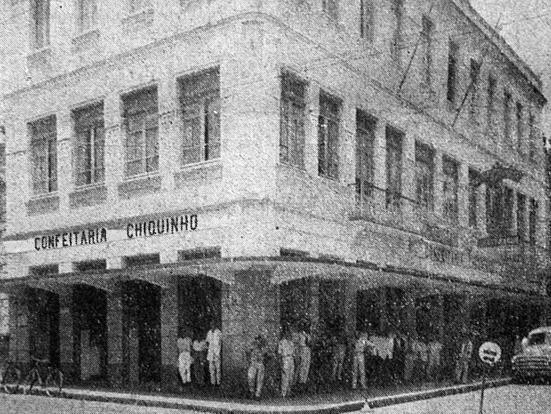
>
> 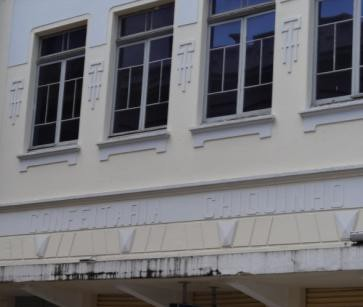Figura 14. Vista da esquina da
> Confeitaria do Chiquinho em 1954. Fonte: A GAZETA, 10/04/1954.
>
> Figura 15. Inscrição "Confeitaria Chiquinho" existente na fachada até
> hoje (2013). Fonte: autora, 2013.

Em 1967, ocorreu o fechamento da Confeitaria Chiquinho, que foi sentido
por alguns com certa melancolia e saudosismo. Em janeiro de 1968, Raul
Caldas Filho publicou no "Jornal O Estado" a crônica intitulada "A
empada, ah, a empada!"3 e antes dele, o poeta local Hermes da Fonseca
publicou no jornal "A Gazeta", o poema "O Chiquinho vai fechar"4 a
propósito do fim das atividades da confeitaria, o que para ele foi uma
consequência infeliz, mas inevitável, do progresso pelo qual a cidade
vinha passando.

Depois da década de 1970, o prédio foi ocupado por uma loja de
eletroeletrônicos. A fachada sofreu uma modificação significativa. O
pavimento térreo teve a maior parte de suas esquadrias substituídas por
portas de ferro, restando apenas uma original (fig. 16). Os onze vãos de
acesso para a Rua Felipe Schmidt se transformaram em cinco vãos maiores,
além de um vão menor. Além disso, praticamente todo o revestimento do
térreo com os negativos foram removidos.

> 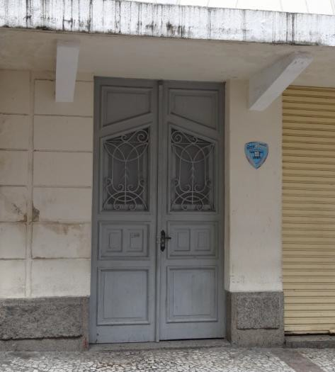
>
> Figura 16. Esquadria e parte do revestimento original das paredes à
> esquerda (2013). Fonte: autora, 2013.

O segundo pavimento em toda sua totalidade foi encoberto por um letreiro
(fig.17), que prejudicou a visualização do imóvel e se constitui numa
interferência direta sobre a fachada, rompendo as relações espaciais ali
existentes.

> 3 A confeitaria era conhecida pelas melhores empadinhas de
> Florianópolis. **O Estado**. Caderno 2. Florianópolis, 14/01/1968.
>
> 4 "O Chiquinho vai fechar". FONSECA, Hermes Gomes da. In.: **A
> Gazeta**, dezembro de 1967.
>
> 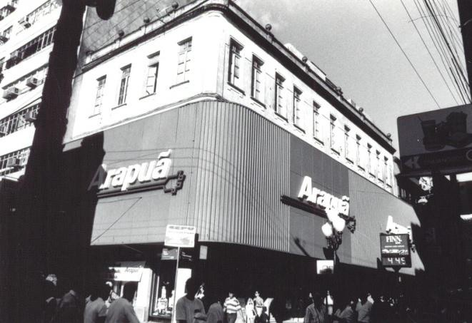
>
> 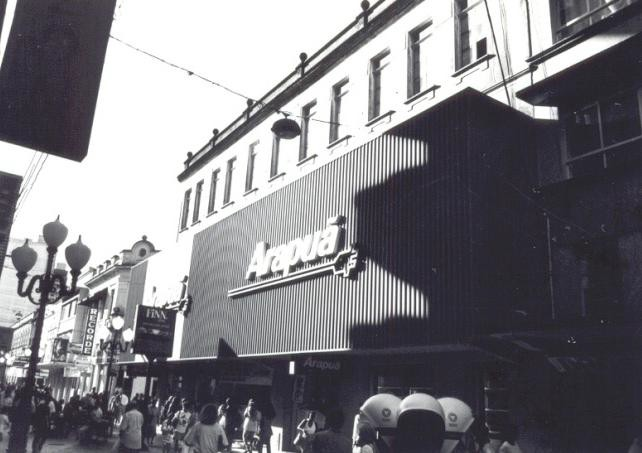Figura 17. Edifício da Confeitaria
> Chiquinho ocupado pela loja de eletroeletrônicos em meados da década
> de 1990.
>
> Fonte: Acervo da Casa da Memória.

Em 1986, igual aos demais edifícios de valor histórico do Centro de
Florianópolis, o edifício foi tombado a nível P2 (DIAS, 2005). O
tombamento junto com os incentivos fiscais criados para estimular a
preservação dos edifícios históricos, foram possivelmente os
impulsionadores para as modificações ocorridas após a desocupação da
edificação da loja de eletroeletrônicos.

A partir do ano 1999, a edificação sofreu uma grande restauração, onde
se buscou restabelecer os elementos arquitetônicos modificados. Com a
retirada do letreiro, que encobria grande parte da fachada, foi possível
visualizar os elementos que outrora estavam escondidos (pg.18). Além
disso, todas as placas de comunicação foram removidas, sendo instaladas
apenas duas placas perpendiculares à edificação, uma em cada fachada da
esquina, com o nome da livraria megastore que começou a funcionar ali a
partir de 2000.

> 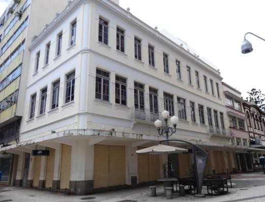
>
> Figura 18. Situação atual da edificação (2013). Fonte: autora, 2013.

# Edifícios 03 -- Ponto Chic (1948)

Na década de 1940 as confeitarias e os cafés da cidade eram considerados
elegantes estabelecimentos e frequentá-los eram sinal de urbanidade e
civilidade. Foi nesse momento histórico, em 1948, que começou a
funcionar o Café Ponto Chic (fig. 19). Localizado no térreo do edifício
de seis pavimentos5 (fig. 20), construído pela família libanesa Massad,
na esquina da Rua Felipe Schmidt com Trajano, a frente da Confeitaria
Chiquinho. Fundado por Mário Couto e Álvaro Millen da Silveira, foi o
tradicional ponto de encontro de pessoas da cidade. O estabelecimento
tornou-se popular entre funcionários públicos, políticos e cidadãos,
onde mulheres e negros não tinham inicialmente permissão para entrar.

> 5 Além do café, nos pavimentos superiores funcionou o Lux Hotel e um
> requintado restaurante.
>
> 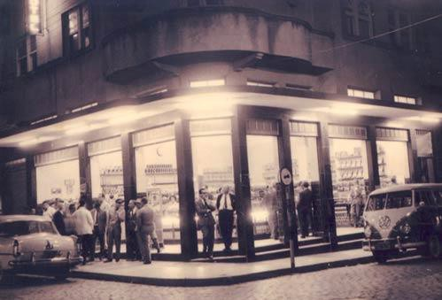
>
> 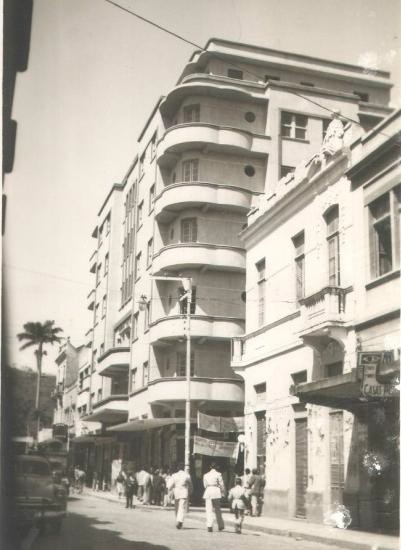Figura 19. Café Ponto Chic em
> funcionando possivelmente na década de 1950/1960. Fonte:
> <http://www.clicrbs.com.br/>
>
> Figura 20. Edifício São Jorge. Fonte:
> <http://produto.mercadolivre.com.br/>

Em 1968, com a mudança de proprietário, o Ponto Chic resolveu atrair o
público feminino, através de uma promoção de café grátis. No inicio "os
homens se espantaram, mas logo virou o assunto preferido" (Notícias do
Dia, 24/03/12).

Até o início da década de 1970, é interessante notar que não havia
nenhuma placa ou qualquer outra comunicação visual que indicasse o nome
do estabelecimento na fachada (fig.21). O Ponto Chic era conhecido por
todos, mas seu nome não estava demarcado em lugar algum.

> 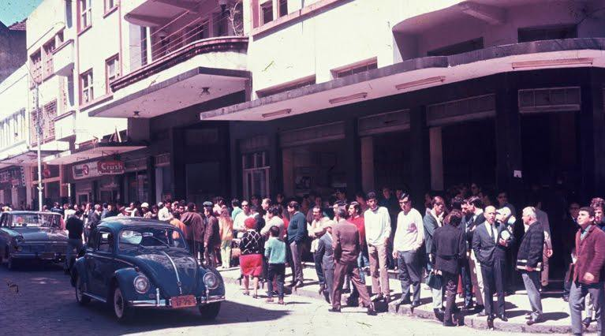
>
> Figura 21. Ponto Chic em funcionamento no início da década de 1970.
> Fonte:
> [[http://ndonline.com.br/florianopolis/colunas/ponto-final/25961-base-tecnica-para-o-transporte-maritimo.html]{.ul}](http://ndonline.com.br/florianopolis/colunas/ponto-final/25961-base-tecnica-para-o-transporte-maritimo.html)

Em setembro de 1978, esse espaço de convivência foi marcado pela criação
de uma confraria que reunia os mais assíduos frequentadores do café,
denominado S.P.Q.F - *Senatus Populusque Florianopolitanus*, ou "Senado
para Qualquer Fofoca", como alguns brincam. Essa entidade acabou
entrando para o anedotário da cidade e contribuiu para a formação de uma
das mais notórias tradições: distribuir anualmente diplomas para aqueles
que eram eleitos seus senadores. Desta iniciativa surgiu o apelido com o
qual o Ponto Chic ficaria conhecido por todos - o Senadinho (SOUZA,
2013).

Em 30 de novembro de 1979, o escolhido para receber a primeira homenagem
foi João Baptista Figueiredo (fig. 22), o então presidente da República,
que acabou sendo alvo de manifestações populares contra o sistema
ditatorial vigente na época. O episódio ficou conhecido como a
"Novembrada" 6.

> 6 Às 11h do dia 30 de novembro de 1979, Figueiredo seguiu em direção
> ao Senadinho, onde tomou um café. No tradicional Ponto Chic iria
> receber uma homenagem, o diploma de \'Amigo do Senadinho\', mas acabou
> levando um tapa de um dos manifestantes. (Fonte:
> [[http://www.clicrbs.com.br/especial/br/novembrada/home,397,5627,Home.html]{.ul}](http://www.clicrbs.com.br/especial/br/novembrada/home%2C397%2C5627%2CHome.html))
>
> 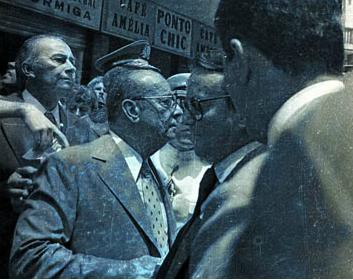
>
> Figura 22. O presidente João Baptista Figueiredo em frente ao Ponto
> Chic em 1979. Fonte:
> [[http://www.clicrbs.com.br/especial/br/novembrada/home,397,5627,Home.html]{.ul}](http://www.clicrbs.com.br/especial/br/novembrada/home%2C397%2C5627%2CHome.html)

No fim da década de 1970 diversas transformações já haviam ocorrido ao
Senadinho. Muitas placas foram inseridas na sua fachada (fig.23) com as
inscrições: "ponto chic" e "café Amélia". Algumas delas demonstram a
clara diversificação dos serviços da cafeteria, como, por exemplo,
"fotocópias, plastificação", "brinquedos, souvenirs" e "presentes". Além
disso, em 1976, com a criação do calçadão foi registradas as iniciais do
SPQF no piso petit-pavé, bem como um desenho, que representa um plenário
com sete cadeiras e a mesa do presidente (fig. 24).

> 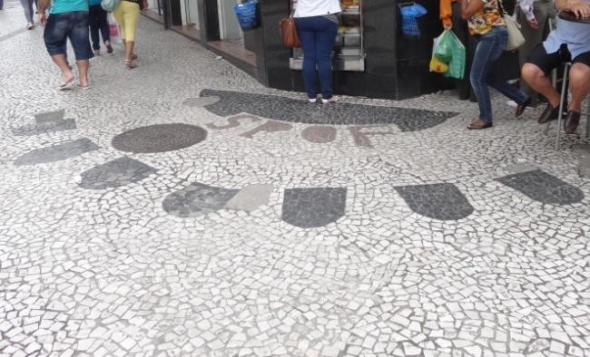
>
> 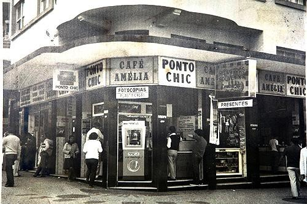Figura 23. Ponto Chic em 1979.
> Fonte: Acervo da Casa da Memória.
>
> Figura 24. Inscrição "SPQF" com o desenho do plenário com as sete
> cadeiras e a mesa (2013). Fonte: autora, 2013.

Após isso, a fachada sofreu uma nova modificação. O modismo dos
letreiros luminosos acabou alcançando a fachada do Ponto Chic (pg. 25),
que inseriu o nome popular "Senadinho" ao estabelecimento.

> 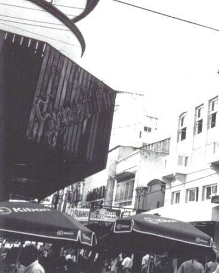
>
> Figura 25. Letreiro luminoso do \"Senadinho\" possivelmente no fim dos
> anos 1980, início dos anos 1990. Fonte: Acervo da Casa da Memória.

Em setembro de 2004, o Ponto Chic encerrou suas atividades, sob o
argumento do alto custo do aluguel, segundo consta na reportagem do
jornal Diário Catarinense em 30/10/04:

> Fontes ouvidas pelo Diário Catarinense afirmam que o último
> proprietário do Ponto Chic não conseguiu manter o café aberto porque o
> aluguel, avaliado entre R\$ 8 mil e R\$ 10 mil, ficou muito caro.
> Calcula-se que, só de luvas, o interessado em abrir um negócio neste
> endereço teria de pagar entre R\$ 300 mil e R\$ 400 mil, o que
> inviabilizaria a manutenção do Ponto Chic caso aparecesse um
> empresário disposto a dar continuidade ao café.
>
> Após quase um ano fechado e após muita pressão popular, o Café reabriu
> suas portas no dia 05 de agosto de 2005. Num dos requerimentos
> enviados à prefeitura solicitando a reabertura do Senadinho,
> argumentava que o local onde funcionou por mais de 50 anos o
> tradicional Café já faria parte da cultura de Florianópolis:
>
> Na realidade o CAFÉ PONTO CHIC, embora pertença de direito a uma firma
> comercial, na prática pertence de fato ao Povo de Florianópolis que o
> utiliza como seu referencial e marcação de encontros, e, seu
> desaparecimento se constituirá numa perda irreparável não apenas na
> paisagem cultural da Ilha de Santa Catarina, como também, aos usos e
> costumes de seus habitantes.7 (RICHTER, 2009)

Desde agosto de 2005 até a presente data, o Café Ponto Chic é mantido
por uma financeira (fig. 26). Segundo acordo firmado com a Prefeitura, a
empresa se comprometeu a manter o tradicional ponto do Centro
funcionando no mesmo espaço que a sua agência, além da exigência de
manter os nomes \"Senadinho\" e \"Café Ponto Chic\" apresentados em
placas de identificação (fig.27).

> 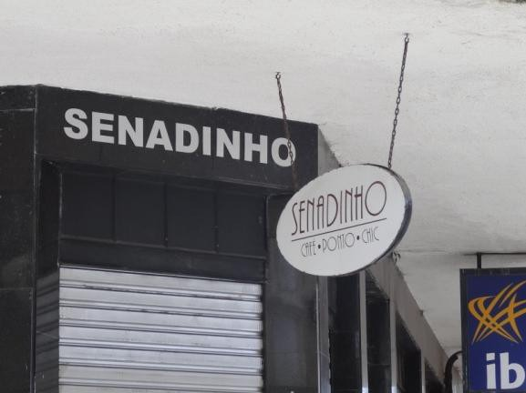
>
> 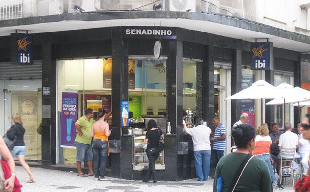Figura 26. O Senadinho na situação
> atual (2013). Fonte: autora, 2013.
>
> Figura 27. Placas de identificação do estabelecimento (2013). Fonte:
> autora, 2013.

É possível verificar que o nome "Café Ponto Chic" possui pouco destaque
em comparação com o letreiro Senadinho e que a agência da financeira
acabou por ocupar grande parte do espaço destinado ao café, reduzindo-o,
das oito portas que ocupava em seus tempos áureos, a míseras duas.

A importância do Senadinho não se deve ao valor histórico da edificação,
que é tombada apenas a nível P38, mas sim pelo seu valor de patrimônio
imaterial. O caso do Senadinho serve para refletir sobre a relação entre
convivência cotidiana, memória coletiva e patrimônio. Não é à toa que há
até poucos anos havia a tradição de quando morria alguém conhecido na
cidade, os amigos pregavam um aviso na fachada de mármore do Ponto Chic
para comunicar a todos. É um exemplo ímpar na vivência da memória
coletiva do povo de Florianópolis.

> 7 Alguns clientes do estabelecimento não conformados com seu
> fechamento criaram o movimento "SOS Ponto Chic - Movimento Popular de
> Reabertura do Café", iniciando uma série de ações que procuravam
> justificar o Café enquanto um Patrimônio da cidade.
>
> 8 Pertence a categoria P3 o imóvel adjacente à edificação ou conjunto
> arquitetônico de interesse
>
> histórico podendo ser demolido, mas ficando a reedificação ou
> edificação sujeita a restrições a serem definidas em legislação
> complementar, capazes de impedir que a nova construção ou utilização
> descaracterize as articulações entre as relações espaciais e visuais
> ali envolvidas. (Plano Diretor, 1997)
>
> **Edifício 04 -- Restaurante *Fast Food* (1911)**

O belo sobrado de estilo eclético (Fig. 28) está localizado na Rua
Trajano, número 114 e foi construído em 1911, conforme consta na sua
fachada (Fig. 29).

> 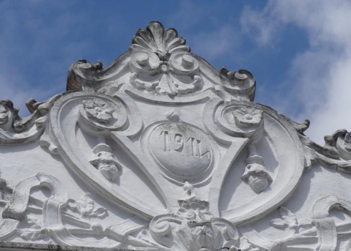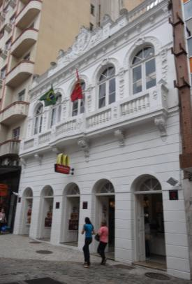
>
> Figura 28. Situação atual da edificação (2013). Fonte:
>
> autora, 2013. Figura 29. Datação na fachada (2013). Fonte: autora,
> 2013.

Há poucos registros sobre sua construção e ocupação inicial, porém
sabe-se que naquele tempo a via já possuía caráter comercial, abrigando
atraentes construções onde funcionavam os principais escritórios das
empresas de importação, bares, hotéis e restaurantes. Ter seu negócio
localizado nesta rua era sinônimo de status, bem como o estilo da
edificação, que por se tratar de um sobrado confirma tal pressuposto.

Com o passar dos anos o endereço se valorizou ainda mais, porém os belos
prédios de outrora foram muitos substituídos por enormes edifícios de
escritórios ou descaracterizados para se adaptar a outros usos.

O sobrado resistiu aos avanços da especulação imobiliária, e durante a
década de 1980 abrigou uma rede varejista nacional (fig.30).

> 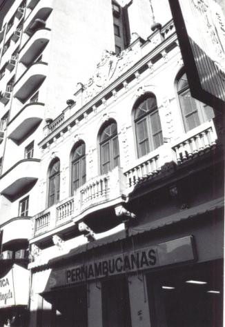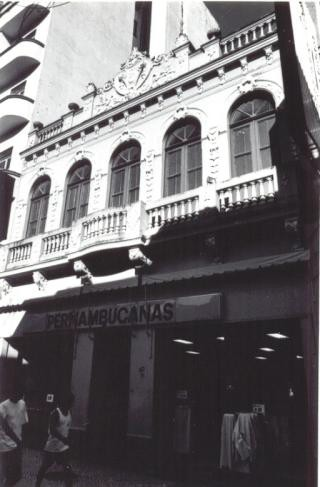

Figura 30. Loja da rede varejista brasileira (década de 1980). Fonte:
Acervo da Casa da Memória.

Pode-se inferir que as principais alterações feitas foram no pavimento
térreo com a modificação das portas originais e abertura de novos vãos,
substituindo os possíveis cinco vãos do térreo por apenas três.

Além disso, foi instalada uma placa de comunicação visual com a
indicação do nome da empresa em 2/3 da largura da edificação, bem como a
instalação de um toldo na largura total da edificação.

Tanto o tombamento da edificação em nível P2, quanto o Decreto nº
040/1990, são provavelmente os motivos que levaram na década de 1990, o
restauro ocorrido na fachada da

edificação, com o retorno aos cinco vãos originais, a recuperação das
esquadrias e revestimento do pavimento térreo (fig.28).

Desde então, o espaço é ocupado por uma rede multinacional de fast food,
que passou a utilizar toldos individuais, com a mesma largura dos vãos
das portas. Primeiramente utilizaram toldos bicolores (fig.31) que foram
substituídos por toldos com apenas uma cor (fig.32), conforme profere as
normas do Projeto Renovar (IPUF, 1993). Também em respeito às normas
deste projeto, a comunicação visual foi limitada a uma só placa na
fachada, fixada perpendicularmente à parede na altura do pavimento
térreo.

> 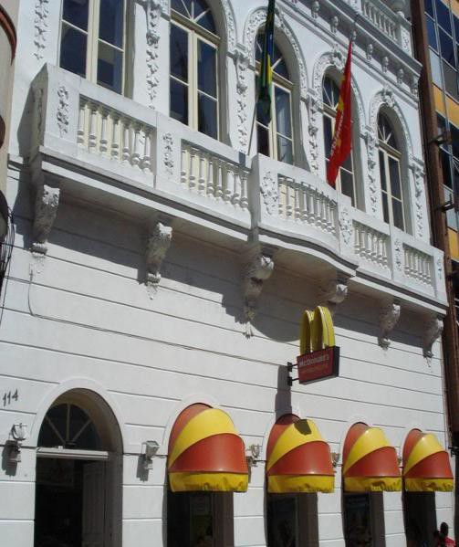
>
> 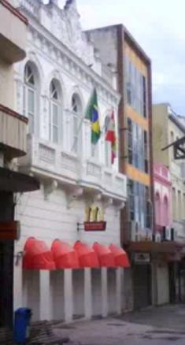Figura 31 - edificação já restaurada
> (2007). Fonte: <http://www.skyscrapercity.com/showthread.php?t=541915>
>
> Figura 32 -- edificação com toldos. Fonte:
> [www.youtube.com](http://www.youtube.com/)

# Considerações Finais

Após a organização e sistematização dos dados foi possível identificar e
agrupar três padrões das modificações ocorridas nas fachadas comerciais
das quatro edificações analisadas.

O primeiro padrão identificado é até a década de 1970, onde poucos eram
os recursos de comunicação visual aplicados na fachada, sendo limitada,
no caso em que existia, a apenas uma placa de identificação com o nome
do estabelecimento.

O segundo padrão observado ocorreu durante as décadas de 1970 a 1990, o
aumento contínuo de elementos visuais na fachada, chegando ao ápice da
poluição visual com a depreciação da fachada. A arquitetura passa a ser
apenas um anteparo da comunicação visual. Observa-se até certa
competição entre os estabelecimentos, para criar anúncios cada vez
maiores e mais chamativos.

O terceiro e último padrão, ocorreu após a década de 1990, quando há uma
regressão com clara redução no tamanho e quantidade dos anúncios, bem
como certa padronização da comunicação visual. Tal busca pela retomada
da valorização do patrimônio, provavelmente deve-se ao fato que em 1993
o IPUF publicou um manual de recuperação do casario. A cartilha do
Projeto Renovar, como uma maneira de evitar e/ou minimizar os problemas
causados pela falta de informação, acabou surtindo efeito. O manual que
traz informações sobre o patrimônio histórico de Florianópolis bem como
aspectos técnicos sobre a manutenção e valorização das edificações
tombadas, ajudou a melhorar as fachadas como um todo, uma vez que dentre
os aspectos regulamentados estão as orientações técnicas para a
colocação da comunicação visual e dos toldos.

Na mesma década foram criados incentivos fiscais para estimular a
preservação dos edifícios históricos por parte dos proprietários, que
definiam o valor de desconto do IPTU, conforme o estado de conservação
da edificação e a adequação da fachada aos aspectos regulamentados pelo
Projeto Renovar.

O fato é que tais medidas legislativas parecem ter surtido efeito. Após
a década de 1990 ficou claro as modificações sofridas nas fachadas, com
a redução significativa das obstruções destas por elementos de
comunicação visual e toldos.

Compreender os motivos das mudanças observadas e estabelecer uma
cronologia das alterações urbanas nos permite entender como a história
dos estabelecimentos está intimamente atrelada ao processo de
transformações urbanas e simultâneas modificações nas condutas e nas
relações de seus habitantes.

# Bibliografia

> DIAS, Adriana Fabre. **A reutilização do patrimônio edificado como
> mecanismo de proteção: uma proposta para os conjuntos tombados de
> Florianópolis.** 2005. p. 110 - 111. Dissertação (Mestrado em
> Arquitetura e Urbanismo) - Centro Tecnológico, Universidade Federal de
> Santa Catarina, Florianópolis, 2005
>
> ENTRES, Alberto. **Livraria Central: 25 annos.** Álbum comemorativo.
> Florianópolis: Livraria Central, 1935.
>
> INSTITUTO DE PLANEJAMENTO URBANO DE FLORIANÓPOLIS. **Valorização do**
>
> **Casario Histórico de Florianópolis: Manual de Recuperação.**
> Florianópolis: IPUF, 1993.
>
> RICHTER, Fábio Andreas. **Corpo e alma de Florianópolis: O patrimônio
> cultural na ação do governo do município -- 1974 a 2008.** Dissertação
> apresentada ao Programa de Pós- Graduação em História da Universidade
> do Estado de Santa Catarina. Florianópolis: UDESC, 2009.
>
> SOUZA, Isabella Cristina de. **Ponto Chic, um ponto de encontro:
> memórias sobre um Café passado.** Anais do VII Encontro Regional Sul
> de História Oral. Foz do Iguaçu, 2013.

Disponível em:

\<[[http://www.sul2013.historiaoral.org.br/resources/anais/5/1376568954_ARQUIVO_TRABAL]{.ul}](http://www.sul2013.historiaoral.org.br/resources/anais/5/1376568954_ARQUIVO_TRABALHOCOMPLETOISABELLACDESOUZAENCONTROREGIONALHISTORIAORAL.pdf)
[[HOCOMPLETOISABELLACDESOUZAENCONTROREGIONALHISTORIAORAL.pdf]{.ul}](http://www.sul2013.historiaoral.org.br/resources/anais/5/1376568954_ARQUIVO_TRABALHOCOMPLETOISABELLACDESOUZAENCONTROREGIONALHISTORIAORAL.pdf)\>

Acesso em: 02 dez. 2013.

> VARGAS, Heliana Comin; CASTILHO, Ana Luisa Howard**. Intervenções em
> centros urbanos: objetivos, estratégias e resultados.** 2.ed. rev.
> Barueri, SP: Manole, 2009.
>
> VEIGA, Eliane Veras da. **Florianópolis: memória urbana.** 2. ed.
> Florianópolis: Fundação Franklin Cascaes, 1993.

# Fontes

Acervo da Casa da Memória -- Florianópolis/SC

Acervo do Instituto Histórico e Geográfico de Santa Catarina- IHG/SC.
Acervo do Jornal "O Dia". (1915 a 1918).

Acervo do Jornal "A Gazeta" (1954 e 1967) Acervo do Jornal "O Estado".
(1941 a 1942).
