# Resumo

A Exposição do Centenário da Independência de 1922 representou um marco
no processo de modernização na cidade do Rio de Janeiro que ocorreu de
forma mais acelerada nas primeiras décadas do século XX, especialmente a
partir da Reforma Pereira Passos. Seu caráter simbólico estende-se além
do fato de ter representado a primeira exposição internacional realizada
no país para exibir o progresso e o potencial do país. Mais que a
promoção da cidade e do país no cenário internacional, contribuiu com
modificações em sua estrutura espacial, com consequências em sua imagem
e paisagem, sobretudo no centro, com o desaparecimento de um importante
marco físico e histórico, o morro do Castelo, como também com o
desaparecimento de marcos arquitetônicos e com a criação de novas áreas
de expansão para a cidade proveniente da área do morro e da área criada
através do aterro. O artigo se orienta para a sua inserção no processo
de modernização da cidade do Rio de Janeiro, entre 1822 e 1930. Busca-se
esclarecer os antecedentes e razões que concorreram para a sua
realização e o seu papel no processo de modernização, que ocorria
através de transformações do espaço urbano, sobretudo na área central
com modificações significativas na estrutura e no ambiente construído da
cidade e que contribuíram para alguns aspectos da sua configuração
atual. Analisa-se, ainda a produção do espaço, destacando-se a atuação
do Engenheiro Carlos Sampaio na preparação da cidade para a Exposição.

Palavras chave: Rio de Janeiro, Exposição Internacional do Centenário da
Independência, intervenções urbanas, modernização da cidade, projetos
urbanos

# Abstract

The Centenary of Independence Exposition in 1922 was an important mark
in the modernization of the city of Rio de Janeiro, which occurred at a
fast pace in the early decades of the twentieth century, especially with
the urban renewal program under Mayor Pereira Passos, which saw the
replacement of many structures with public buildings that are still
important elements of the city's architecture. The event was symbolic,
as the first international exposition held in Brazil, and served to show
off the progress and potential of the city and country. But more than
promote the city and country in the international arena, it contributed
to changes in the spatial structure, especially in the downtown region,
with important consequences for the cityscape. Chief among these was the
demolition of Castelo Hill, despite its historic importance as the
location occupied by the first Portuguese settlers, to create more flat
space, including by using the removed earth as landfill in the bay. The
article highlights the exposition's role in the process of modernizing
Rio de Janeiro between 1822 and 1930, clarifying the antecedents and
reasons for its realization, with particular focus on the
transformations of the urban space that are still evident today and the
work of the engineer Carlos Sampaio in preparing the city of the
exposition.

Keywords: Rio de Janeiro International Exposition of the Centenary of
Independence urban interventions, modernization of the city, urban
projects

# Introdução

As comemorações do Centenário da Independência de 1922 sob a forma de
uma Exposição internacional representam um importante marco, que se
traduziu em avaliação e demonstração do progresso do país e em
idealizações quanto ao seu futuro. Ao mesmo tempo, simbolicamente a
exposição acenava para os outros países com o potencial desenvolvimento
brasileiro, descortinando-o e criando visibilidade para investimentos
externos.

No contexto da pesquisa que realizamos, trata-se da oportunidade de
refletir sobre o processo de transformação urbana pelo qual a cidade
passou através de intervenções radicais e muitas vezes polêmicas,
motivadas pela necessidade de modernização em nome do progresso, como a
do arrasamento do morro do Castelo em andamento nesse período.

Buscamos compreender o papel da Exposição Internacional do Centenário da
Independência de 1922 no processo de modernização da cidade do Rio de
Janeiro a partir da proclamação da Independência do Brasil em 1822,
momento de construção de novos valores para a nação, quando teve início
uma série de medidas para solucionar os problemas relacionados
especialmente a saneamento e saúde pública. Foram criadas comissões para
estudar as principais questões que afetavam a cidade e apontadas
soluções, das quais muitas só seriam realizadas durante o período da
Primeira República (1889-1930). Caracterizado por inúmeras intervenções
urbanas, muitas delas monumentais, sobretudo nas administrações dos
prefeitos Francisco Pereira Passos (1902-1906) e Carlos Sampaio
(1920-1922), que contribuíram significativamente para a transformação da
cidade sob o aspecto urbanístico, político, social e econômico.

A questão da Exposição do centenário da Independência de 1922 sob o
ponto de vista das representações é tratada neste artigo a partir da
reflexão sobre as razões de sua realização e sobre o seu impacto no
processo de modernização que se desenvolvia na cidade do Rio de Janeiro
através de importantes transformações do espaço urbano, sobretudo na
área central da cidade. Pretendemos arguir a sua relevância ou não para
a configuração espacial atual da cidade.

O papel da Exposição no processo de modernização da cidade, nos leva,
ainda, a analisar a atuação dos agentes sociais produtores do espaço
urbano, destacando-se a de Carlos Sampaio, justificada por sua
participação direta como prefeito (1920-1922) e presidente da Comissão
da Exposição do Centenário, momento em que tem oportunidade de realizar
complementarmente uma série de intervenções urbanas, tais como a criação
e recuperação de vias, canalização de rios, construção de pontes e
túneis, construção e recuperação de equipamentos públicos, criação de
praças, para preparar a cidade para o evento.

# O processo de modernização e a cidade do Rio de Janeiro

Anos antes do centenário da Independência em 1922, órgãos da imprensa1
demonstraram a preocupação com sua celebração, refletindo sobre o
passado em diversas áreas, especialmente balanços sobre os últimos cem
anos, forçando "a

> 1 Em 1917 a revista Eu Sei Tudo publicou o artigo "Noventa e cinco
> anos de Independência" afirmando o momento como oportuno para
> despertar estudos sobre nossa nacionalidade, marcar rompimentos e para
> nos tornarmos um povo civilizado.

intelectualidade a tomar pé da situação nacional, compreender as causas
do atraso do país e formular um programa de ação para superá-lo."
(MOTTA, 1992, p.26)

No âmbito do urbanismo a partir de 1822, identificamos períodos e fatos
significativos no processo de modernização da cidade do Rio de Janeiro.
Durante o regime monárquico (1822-1889), destacam-se a criação de
instituições responsáveis pelas transformações urbanísticas ocorridas na
cidade, além de normas e atos voltados para o controle, regulamentação e
planejamento do espaço urbano.

Em 1842, o relatório de Henrique Beaurepaire Rohan, Diretor de Obras
Municipais apresentado à Câmara Municipal, indicava as ações
consideradas necessárias para a remodelação da capital. As propostas
focavam principalmente a salubridade pública e o embelezamento da
cidade.

A partir da segunda metade do século XIX, as mudanças da sociedade
brasileira em consequência do esgotamento do modelo de produção
escravagista, transferiram os capitais antes "empregados no tráfico
negreiro e na agricultura", para aplicações em "oportunidades abertas
com a modernização e a expansão da economia", concentradas nos setores
de transportes, portuário e de geração e transmissão de energia (KESSEL,
2004, p.1).

O Rio de Janeiro, como capital do país, atraiu grande parte dos
investimentos responsáveis pela viabilização de uma série de reformas
urbanas julgadas necessárias, pois a cidade sofria com problemas como
falta d'água, epidemias frequentes de doenças tropicais, transportes e
serviços portuários precários.

Em 1874, o Ministro do Império, João Alfredo Correa de Oliveira, nomeia
uma comissão destinada a elaborar um plano de melhoramentos para a
cidade, formada pelos engenheiros Francisco Pereira Passos, Jerônimo
Rodrigues de Moraes Jardim e Marcellino Ramos da Silva. Essa gerou dois
relatórios entregues em 1875 e 1876 ao Imperador D. Pedro II, propondo
soluções urbanísticas para sanear e embelezar a capital, contestadas por
privilegiarem áreas próximas ao Palácio Imperial e não preverem a
participação da iniciativa privada. Mesmo não sendo executadas,
inspiraram um modelo de concessão, baseado na "colaboração entre o
capital estrangeiro, o governo e os engenheiros na realização de
cirurgias urbanas" (KESSEL, 2004, p.2)

O arrasamento do morro do Senado, no centro da cidade, foi um marco no
período podendo ser considerada a maior intervenção do século XIX,
gerando uma esplanada e terrenos edificáveis na área do morro e na área
do Canal do Mangue aterrado com o material resultante. Essas novas áreas
foram criadas com a colaboração do governo municipal e do Banco
Auxiliar, tornando-se valorizadas para a venda e construção.

A chegada do século XX anunciou um novo período de desenvolvimento e
transformações para a cidade, após o advento da República em 1889. Logo
nos primeiros anos, começou a se delinear o novo centro
político-administrativo do Governo Federal do Período Republicano
(1889-1930) no entorno da Praça Floriano Peixoto - atualmente conhecida
como Cinelândia -, de maneira totalmente distinta dos outros que o
antecederam - o Largo do Paço, atual Praça XV, no Período Colonial e o
Campo de Santana, no Período Imperial. Enquanto nos dois últimos o
processo de formação aconteceu de forma gradual, o centro republicano
formou-se rapidamente como resultado de intervenções drásticas,
complementares e simultâneas realizadas pelos governos municipal e
federal (SISSON, 2008, p.84).

> 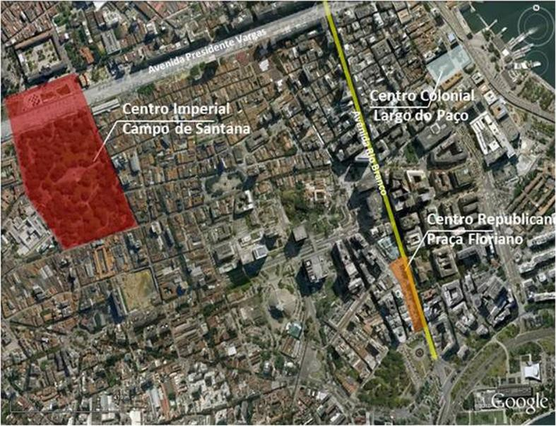
>
> Figura 1.Os três centros político administrativos do Rio de Janeiro,
> com base no estudo de Sisson (2008). Elaboração própria sobre base
> imagem do Google Earth.

As maiores transformações ocorridas no centro da cidade do Rio de
Janeiro, então Capital Federal, e visando a promoção de sua imagem
perante o cenário internacional, tiveram início no governo do presidente
Rodrigues Alves, que após sua posse, em 19022, nomeou o engenheiro
Francisco Pereira Passos para prefeito do Distrito Federal,
conferindo-lhe amplos poderes para a modernização do porto e a
remodelação da cidade. A partir de então, foi empreendida uma série de
reformas com inspiração nas realizações de Haussmann para a modernização
de Paris na segunda metade do século

XIX\.

Durante este processo, o Conselho Municipal foi suspenso, foi sancionada
uma nova legislação de posturas e desapropriações para facilitar a
concretização das propostas que rapidamente transformaram a cidade. O
programa de embelezamento e saneamento criou condições favoráveis para a
expansão e modernização dos serviços urbanos, através de concessões a
empresas estrangeiras.

> 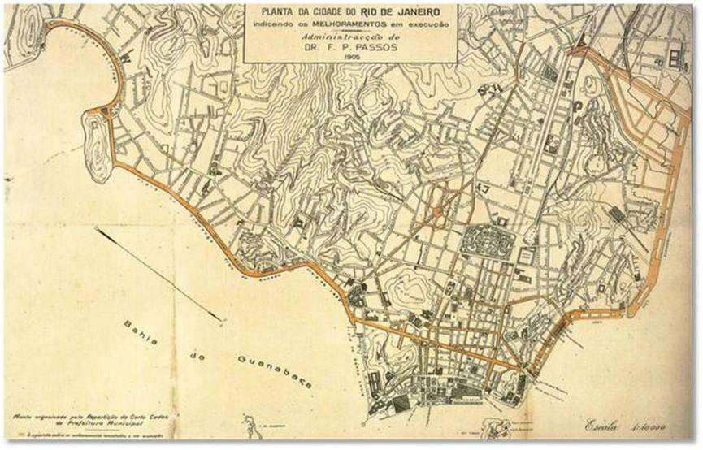Figura 2. Planta do Rio de Janeiro de
> 1905 indicando os "Melhoramentos" em execução da administração Pereira
> Passos. Fonte: CZAJKOWSKI, 2000, p. 68.
>
> 2 Em 29 de dezembro de 1902.

Entre as intervenções realizadas pelo Governo Federal, a abertura da
Avenida Central, atual Avenida Rio Branco, foi uma das mais radicais,
transformando a imagem do centro da cidade. A obra previa a demolição de
702 casas, passando por 21 ruas, e o arrasamento parcial de dois morros,
o do Castelo e o de São Bento, nos extremos da Avenida. As demolições
foram resultado de uma extensa desapropriação, removendo a arquitetura
remanescente da cidade colonial que abrigava uma população de baixa
renda, que migrou para bairros vizinhos ou passou a ocupar as encostas
dos morros.

A Avenida Central, inaugurada em 15 de novembro de 1905, se tornou o
símbolo da *Belle-Époque* carioca, complementada pela Praça Floriano,
onde se localizava o conjunto de novos edifícios públicos mais
representativos do poder republicano: o Palácio Monroe, o Teatro
Municipal, a Biblioteca Nacional, a Escola de Belas Artes e o prédio do
Supremo Tribunal Federal.

No caso da reforma Pereira Passos, a construção do novo centro
republicano, além de sua constituição como lugar de intenso significado
cultural, representou a construção de símbolos do poder e de uma nova
ordem para a sociedade.

> 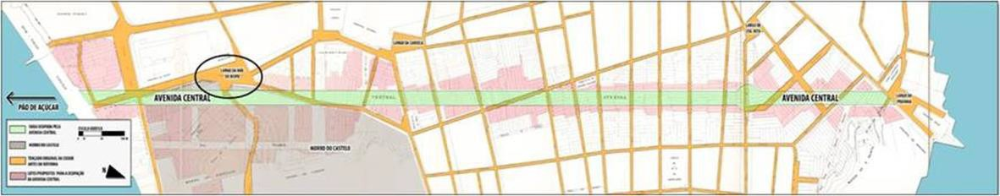
>
> Figura 3. Traçado da Avenida Central, 1904. Em cinza, os limites dos
> morros do Castelo e São Bento. Em amarelo, as vias existentes antes da
> abertura da Avenida, marcada em verde. Em rosa, os lotes
> desapropriados e demolidos para dar lugar à nova Avenida. Em destaque
> no círculo o espaço onde se formaria a Praça Floriano.
>
> Fonte: MATTOS, 2010, p.38.

Por outro lado, a abertura da Avenida Central e o surgimento das novas
tipologias representam uma ruptura, não apenas no sentido arquitetônico
e urbanístico, que transformou em sua essência o centro da cidade em
relação à cidade colonial, mas também no modo de vida e costumes da
população, o que deu início a uma nova relação com os espaços. No
exemplo da implantação dos edifícios da Biblioteca Nacional, do Teatro
Municipal e da Escola de Belas Artes no entorno da Praça Floriano, a
estrutura monumental estabelecida através da relação entre eles e a
Avenida Central, rasgou a malha colonial obrigando a reestruturação dos
lotes. Na concentração de edificações notáveis no entorno da Praça
Floriano Peixoto verifica-se que "os espaços públicos mais importantes
atraem a implantação de monumentos". (PANERAI, 2006, p.78)

> 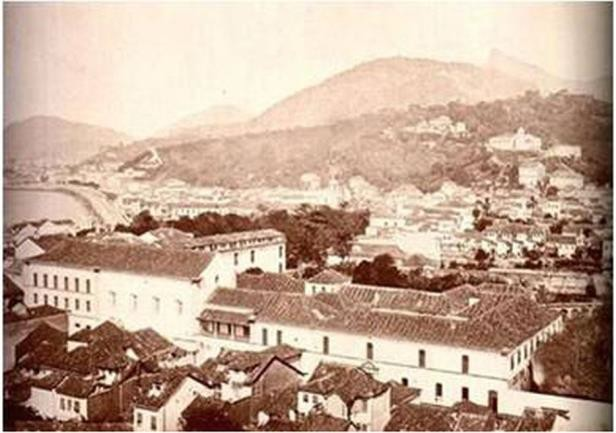Figuras 4 e 5. Convento da Ajuda no
> século XIX e Praça Floriano Peixoto após inauguração da Avenida
> Central, com o convento da Ajuda à direita. Fontes: LADEIRA, 2011;
> KOK, 2005, p.85.
>
> 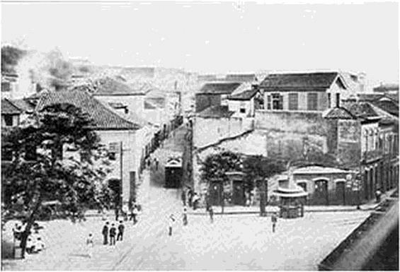Figuras 6 e 7. Quadra onde foi
> construído o Teatro Municipal em 1903 (em frente ao quiosque) e depois
> da abertura da Avenida central. Fontes: LEITE, 2000, p.308 e KESSEL,
> 2008, p.72.

# A Administração Carlos Sampaio (1920-1922) e a Exposição do Centenário

> A virada da década de 1910 para a de 1920 foi marcada por um
> sentimento nacionalista após a Primeira Guerra Mundial (1914-1918). A
> política externa do Brasil havia levado o país à participação na
> guerra, assegurando um lugar na Conferência de Paz de Paris e na Liga
> das Nações. Com a aproximação do Centenário da Independência, vários
> jornais cariocas iniciaram uma campanha que objetivava pressionar o
> governo a adotar medidas para a realização de uma grande comemoração.
>
> A ideia começou a tomar forma em 1920 com o projeto apresentado pelo
> deputado Costa Rego autorizando o Poder Executivo a realizar a
> Exposição que, a princípio, foi concebida como nacional (LEVY, 2013,
> p.11). Apesar das dificuldades econômicas enfrentadas no início dos
> anos de 1920, o presidente Epitácio Pessoa decidiu pela celebração,
> sediando na Capital a Exposição Universal do Rio de Janeiro. Para
> isso, seria necessário que a cidade fosse saneada e embelezada, o que
> resultou em uma década, de reformas urbanas no Centro e na Zona Sul.
> Nesse ponto entra a participação de Carlos Sampaio.
>
> Sampaio ingressou na administração da cidade em substituição ao
> Prefeito Sá Freire, como parte da intenção do Presidente Epitácio
> Pessoa em acelerar a preparação da cidade para a visita dos Reis da
> Bélgica em 1920 e para as festas do primeiro Centenário da
> Independência do Brasil, em 1922. Apesar de participar anteriormente
> como agente executor de concessões a empresas estrangeiras, afirma3
> seu apoio a um Estado promotor de intervenções urbanas e seu ideal de
> executar reformas da mesma magnitude
>
> das realizadas na administração Pereira Passos.
>
> A cidade foi preparada para a comemoração do Centenário da
> Independência, através da execução de um plano de obras, que previa,
> entre outras realizações, a finalização do desmonte do Morro do
> Castelo, em 1922. Proposta defendida desde o final do século XVIII,
> como medida de combate à insalubridade e ao desafogamento do tráfego.
>
> O arrasamento gerou intensa polêmica. O debate através da imprensa
> carioca apoiava-se em diferentes interpretações "do que seria uma
> cidade sintonizada com a modernidade do século XX". De um lado estavam
> os "sacrílegos" representados pela Revista da Semana com apoio da
> Careta e do Correio da Manhã, do outro os "tradicionalistas",
> representados pelo Jornal do Brasil. (MOTTA, 2013, p.55)
>
> Sampaio comparava o Castelo a um "dente cariado" na linda boca que era
> a Baía de Guanabara. O *Jornal do Brasil*, por sua vez, defendia que
> "o Rio de Janeiro deveria se mirar no exemplo dos países modernos e
> civilizados, onde a natureza era protegida dos interesses
> "utilitários" e preservada na sua "exuberância"." O grupo dos
> tradicionalistas defendia a submissão da natureza à cultura. (MOTTA,
> 2013, p.55-56)
>
> A visão do Castelo como símbolo degradado do passado colonial
> português, aliado à necessidade de situar a Exposição do Centenário em
> um local de destaque na paisagem e na estrutura da cidade, encobriam
> as razões econômicas relacionadas à criação de terrenos na área
> supervalorizada do centro, que por si só justificariam o arrasamento,
> decretado em 1921. A obra monumental consumiu grande volume de
> recursos, além do que estava previsto, o que levou o Estado a contrair
> dívidas para a sua realização.
>
> Carlos Sampaio foi acusado de corrupção, por ser um dos donos da
> empresa que recebeu, no final do século XIX, a concessão para a
> demolição do morro. Além disso, estudos feitos na época mostravam que
> a realização de "obras de embelezamento no morro custariam bem menos,
> cerca de um terço do valor gasto no desmonte." (BARROS, 2002)
>
> Com o Castelo, desapareceu um importante patrimônio religioso: a
> Igreja de São Sebastião, o Colégio dos Jesuítas, além de outros
> símbolos como as "casas dos pretos", onde eram realizados cultos de
> origem africana; o relógio da torre e o observatório astronômico, que
> indicavam o significado histórico do lugar.
>
> Higienizar e modernizar a cidade significava a eliminação dos lugares
> insalubres e também da cidade colonial e seus "valores culturais
> relacionados ao período imperial, valorizando a inserção cultural e
> econômica europeias, principalmente pela absorção da visão do mundo
> francês." A construção de um "novo centro mais moderno, significaria a
> construção simbólica de um novo país, instaurado pela ordem
> republicana." Os discursos higienista e estético legitimaram as
> reformas de Passos e Sampaio. (BARROS, 2002)
>
> Na área resultante do arrasamento do Castelo foram construídos os
> pavilhões da Exposição do Centenário da Independência, -- movimentando
> intensamente o centro do Rio de Janeiro --, inaugurada em 7 de
> setembro de 1922 e encerrada oficialmente na administração do
> Presidente Artur Bernardes e do Prefeito Alaor Prata, em 2 de julho de
> 19234.
>
> 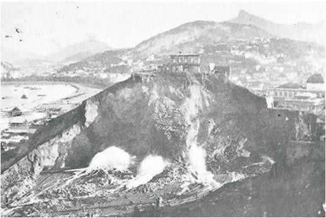Figuras 8 e 9. Arrasamento do Morro
> do Castelo e vista da construção da Exposição. Na fig. 9, o aterro
> onde foram construídos os pavilhões e décadas depois deu origem ao
> Aeroporto Santos Dumont. Fonte: LEVY, 2013, p.16 e 19.
>
> 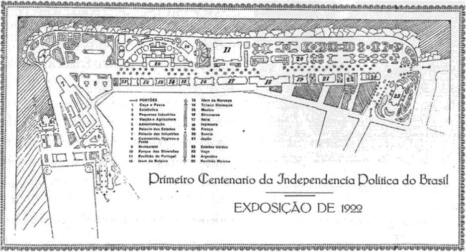
>
> Figura 10. Mapa do projeto da Exposição de 1922. Fonte: KESSEL, 2008,
> p.82.
>
> 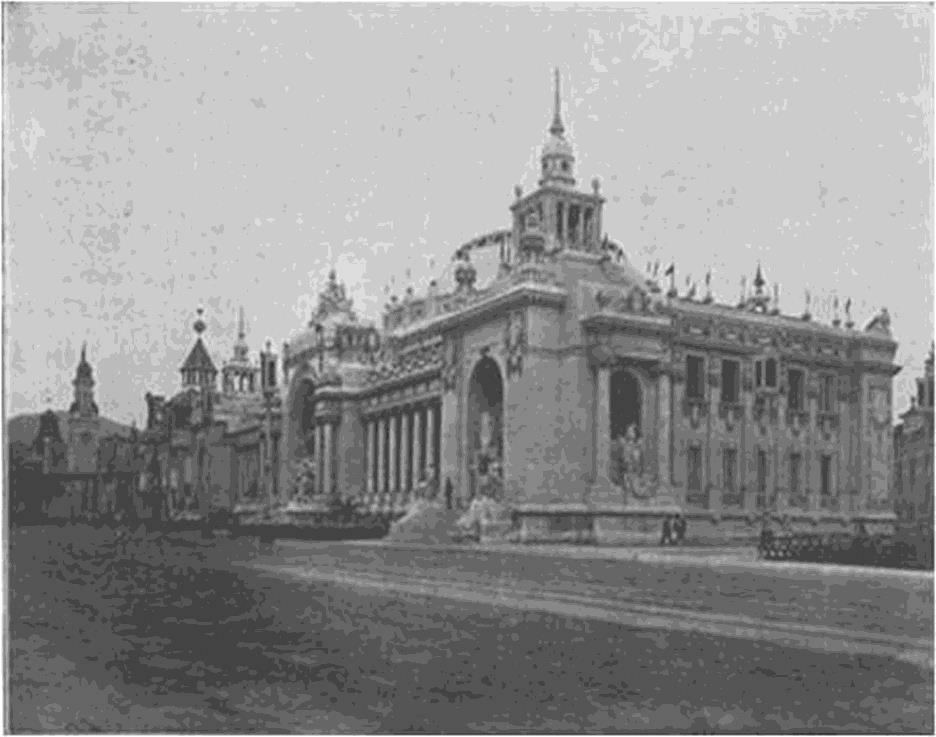
>
> Figura 11. Pavilhão de Festas. Fonte: Livro de Ouro da Exposição,
> 1923, p.22.

O período de preparação da Exposição do Centenário foi representativo
para os debates arquitetônicos que vinham se desenvolvendo. Parte dos
arquitetos criticavam a arquitetura da cidade onde predominavam
resquícios do período colonial, apesar da Reforma de Pereira Passos.
Defendiam um estilo ligado às tradições e ao ambiente brasileiro,
fugindo do estrangeirismo dominante nas artes em geral. A defesa do
estilo neocolonial, concebido como uma busca dos "elementos essenciais"
do colonial como inspiração, se fortaleceu ao mesmo tempo apresentando
ambiguidades, já que o discurso do processo de modernização da cidade
apontava para a eliminação dos resquícios coloniais (LEVY, 2013,
p.21,25).

Na Exposição, o ecletismo estava fortemente presente e o neocolonial
ficou associado ao evento e também ao prefeito Carlos Sampaio que se
engajou em campanha para que os projetos dos pavilhões fossem assinados
e executados por arquitetos e defendeu a utilização na arquitetura de
elementos estilizados da fauna e da flora brasileira "para a criação de
um estilo nacional." (LEVY, 2013, p.21)

A Exposição do Centenário tinha como objetivo mostrar internacionalmente
o progresso do país, valorizando as suas conquistas. Participaram 14
pavilhões estrangeiros5 e a Exposição foi considerada um sucesso, apesar
das falhas na concretização de obras que não foram concluídas a tempo
para o dia da inauguração6.

Alguns pavilhões, sobretudo os nacionais, foram construídos em caráter
permanente para depois abrigarem funções públicas. Quase todos foram
demolidos, ou imediatamente após o encerramento da Exposição ou nas
décadas seguintes.

Entre os vestígios da Exposição do Centenário estão o Pavilhão de Honra
da França -- réplica do Petit Trianon, atual sede da Academia Brasileira
de Letras; o Pavilhão do Distrito Federal, atual Museu da Imagem e do
Som; o Pavilhão da Estatística, atual centro Cultural da Saúde; o
Pavilhão das Grandes Indústrias, uma adaptação do conjunto formado pelo
antigo Arsenal de Guerra formado pela Casa do Trem e o Forte do
Calabouço, atual Museu Histórico Nacional; e, um dos torreões do antigo
Mercado Municipal, que foi adaptado para a Exposição recebendo uma
fachada falsa para abrigar o Pavilhão das Indústrias Particulares, atual
Restaurante Albamar.

> 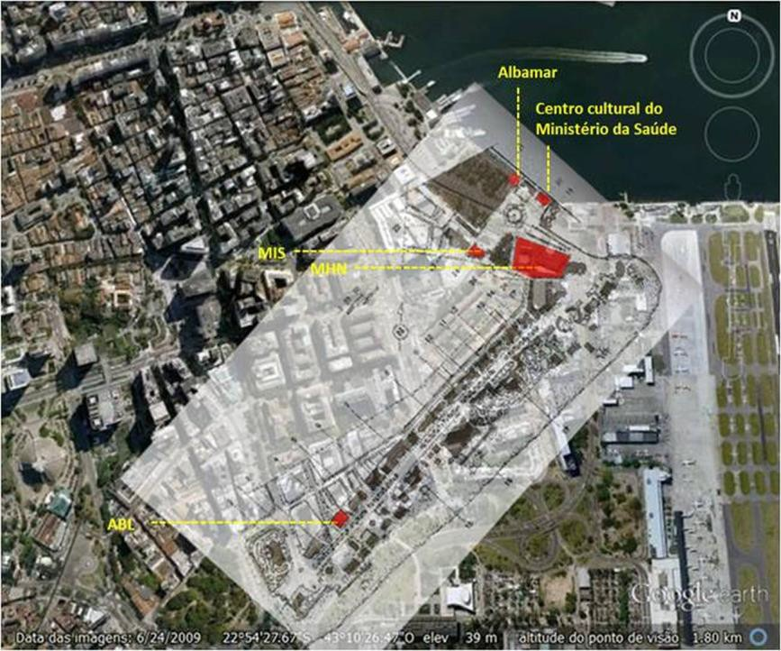
>
> Figura 12. Mapa da Exposição do Centenário (LEVY, 2010, p.150)
> sobreposto na imagem de satélite de 2009 (Google Earth). Em vermelho
> os edifícios remanescentes. Elaboração Própria.

A Exposição deixou como legado para a cidade três hotéis encomendados
para o evento. O Hotel 7 de Setembro, o Copacabana Palace e o Hotel
Glória. Durante este período inaugurou-se o Palácio Tiradentes e o
Centro Republicano começou a receber a configuração atual. Sampaio
efetuou o recuo nos terrenos do Convento da Ajuda, na Praça Floriano. O
novo edifício do Conselho Municipal (Palácio Pedro Ernesto) foi
inaugurado em 1923, representando o último de escala monumental, símbolo
do poder público, completando o conjunto representativo da Praça
Floriano.

> 5 França, Estados Unidos, Bélgica, Portugal (representado por dois
> pavilhões), México, Inglaterra, Dinamarca, Itália, Noruega, Suécia,
> Tchecoslováquia, Argentina, Japão.
>
> 6 Alguns canteiros e jardins ficaram prontos às vésperas e alguns
> pavilhões foram inaugurados meses depois.
>
> 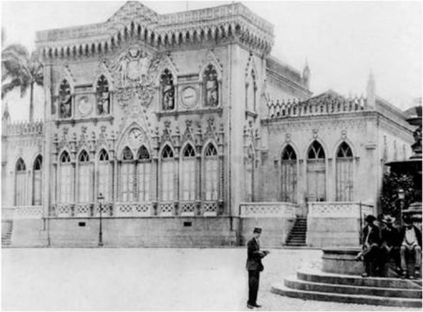Figuras 13 e 14. Antigo edifício do
> Conselho Municipal e o novo edifício (Palácio Pedro Ernesto)
> inaugurado em 1923. Fontes: GONÇALVES, 2004, p. 130 e revista O Malho,
> edição 1099, 28 de julho de 1923, p.21.
>
> 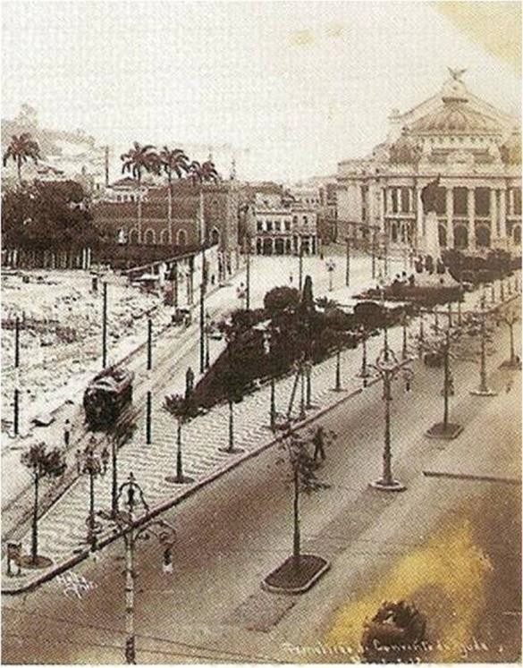Figuras 15 e 16. Praça Floriano após
> a demolição do Convento e após a modificação do recuo e da construção
> do Palácio Pedro Ernesto. Fontes: MÁXIMO, 1997, p.49 e ERMAKOFF, 2003,
> p.32.

Na reforma urbana empreendida em nome da Exposição do Centenário e da
visita dos reis da Bélgica, o volume das demolições, aterros, obras e
alargamentos no centro consumiu grandes investimentos obtidos a partir
de empréstimos de bancos estrangeiros.7

Apesar de Sampaio ter deixado "a prefeitura do Distrito Federal
praticamente falida" (BARROS, 2002), sua administração realizou
intervenções marcantes, que tiveram como consequência uma significativa
transformação na paisagem e na estrutura da cidade, especialmente no
centro. O morro do Castelo, que até esse momento representava um marco
simbólico, histórico e geográfico na paisagem da cidade e mantinha
relação com a Praça Floriano, de onde era possível vê-lo parcialmente e
os edifícios históricos pertencentes a ele, não existem mais, alterando
definitivamente a

> 7 A arrecadação de impostos da Prefeitura e o aval do governo federal
> constituíam a garantia dos financiamentos. KESSEL, 2004, p.7.

paisagem local. Outros marcos, como a Santa Casa de Misericórdia e a
Igreja de Santa Luzia, originalmente situados à beira mar, permaneceram,
mas sua presença foi atenuada no novo contexto urbano.

> 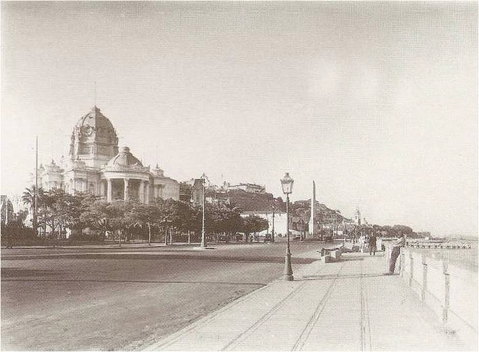
>
> Figura 17. Palácio Monroe com obelisco e Morro do Castelo ao fundo.
> Uma paisagem do centro do Rio de Janeiro não mais existente. Fonte:
> (NONATO e SANTOS, 2000, p.337).
>
> 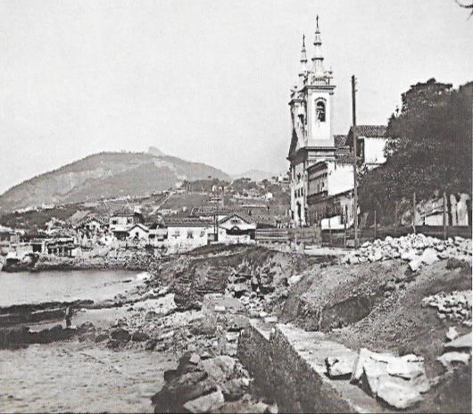Figuras 18 e 19. Igreja de Santa
> Luzia antes do aterro e recentemente (2007). Fontes: ERMAKOFF, 2003,
> p.23 e Arquivo pessoal.

A maior intervenção urbana da administração Carlos Sampaio, considerada
também a maior do século XX (BARROS, 2002), não se resolveu de forma
completa. O processo de arrasamento do morro não foi concluído no
momento da exposição, estendendo-se até o final da década de 1920.
Problemas legais decorrentes dos contratos assinados entre a prefeitura
e os bancos impediriam a urbanização da área, que só teria a sua
ocupação iniciada na década de 1930.

Para o vazio deixado no lugar do morro e para o criado pelo aterro,
foram realizados alguns projetos. Na planta de 1935 a malha viária já
tinha sido disposta, adotando o traçado com base no Plano Agache, mas a
ocupação e consolidação da área só ocorreram posteriormente.

> 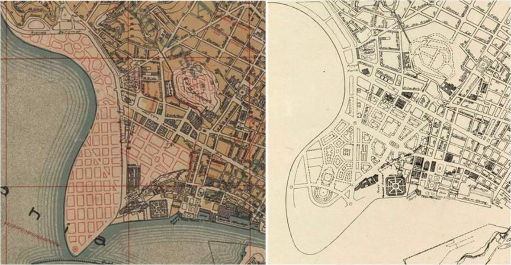
>
> Figura 20. Detalhes de plantas de 1923 e 1928. Propostas para os
> vazios criados com o arrasamento do Castelo. As duas apresentam na
> área do morro uma via ligando a Rua Primeiro de Março e a proposta do
> que parece ser uma praça. A de 1923 demonstra falta de integração do
> projeto para o aterro com o restante, ao contrário da de 1928. Fonte:
> Biblioteca Nacional. Disponível em:
> <http://objdigital.bn.br/acervo_digital/> div\_ cartografia /
> \>cart522721.jpg
>
> \>[;
> http://objdigital.bn.br/objdigital2/](http://objdigital.bn.br/objdigital2/)
> acervo_digital/div_cartografia /cart1 75364/ cart 175364.jpg\>. Acesso
> em: 25 fev. 2014.
>
> 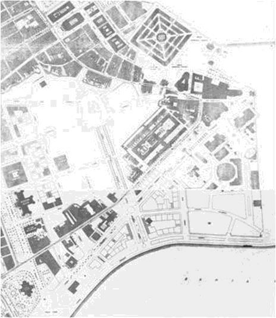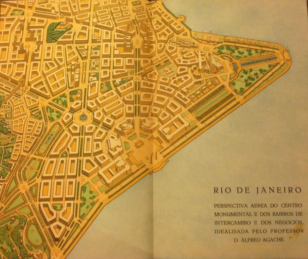
>
> Figuras 21 e 22. Plano Agache para o Centro e detalhe da planta de
> 1935. Fontes: AGACHE, 1930, p.158 e Instituto Pereira Passos.

# A Exposição, o último grande projeto da Velha República

A Exposição do Centenário da Independência de 1922 representou um marco
no processo de modernização na cidade do Rio de Janeiro que ocorreu de
forma mais acelerada nas primeiras décadas do século XX, especialmente a
partir da Reforma Pereira Passos. Sua importância estende-se além do
fato de ter representado o maior evento republicano do início do século
XX ou apenas a primeira exposição internacional realizada no país para
exibir seus avanços -- do ponto de vista industrial, econômico e social.

Seu caráter simbólico foi inegável. Entretanto, mais que a promoção da
cidade e do país no cenário internacional, contribuiu com modificações
em sua estrutura espacial, com consequências em sua imagem e paisagem,
sobretudo no centro, com o desaparecimento

de um importante marco físico, histórico e simbólico -- o morro do
Castelo --, como também com o desaparecimento de marcos arquitetônicos e
a partir da criação de novas áreas de expansão para a cidade proveniente
da área do morro e da área criada na orla através do aterro, além de
obras como a canalização de rios, abertura de túneis, vias e construção
de edifícios marcantes do centro.

Na preparação da cidade como palco para a Exposição do Centenário os
projetos do governo priorizaram em sua maioria as áreas mais valorizadas
da capital republicana, com o propósito de torná-la adequada para
recepcionar os visitantes estrangeiros e promover a imagem da capital do
país no cenário nacional e internacional.

A imagem que se pretendeu passar representou um progresso, que não
correspondeu à verdadeira realidade da cidade. Durante o processo de
modernização se desenvolveram paralelamente duas cidades. Uma convertida
no lugar de representação da modernidade, do progresso e do espetáculo,
refletindo os ideais da população mais abastada. E outra na qual esse
mesmo ideal excluiu a maioria da população fazendo crescer uma cidade
caracterizada por condições insalubres de vida e pela precariedade de
serviços essenciais como transporte, iluminação, abastecimento de água e
redes de esgoto.

No contexto das intervenções a mobilização da paisagem através da
atuação do Estado se reveste de significativo conteúdo simbólico,
especialmente na reforma Pereira Passos, responsável pela construção do
novo centro republicano, e na reforma Carlos Sampaio, que sob muitos
aspectos complementou as intervenções de Passos. Parece evidente durante
todo o processo de modernização da cidade do Rio de Janeiro, o caráter
destruidor das intervenções, com a negação dos aspectos culturais,
sociais e naturais, resultando em uma paisagem expressivamente alterada,
especialmente com o desaparecimento dos morros e os sucessivos aterros
na orla.

Podemos dizer ainda que a Exposição do Centenário representa o
fechamento de um ciclo, especialmente na política do país. A crise
política iniciada nas eleições de 1922 gerando a crise militar que deu
origem ao movimento tenentista culmina com o fim da Velha República na
Revolução de 1930, com a tomada do poder por Getúlio Vargas. O quadro de
dirigentes do país muda e a influência política dos grupos oligárquicos
é transferida para os grupos tenentistas. A partir de então, buscou-se a
construção de uma nova nação, o que gerou reformas em diversos setores
como os de educação, saúde, finanças, administração pública e gestão
urbanística. Para a arquitetura a Exposição significou um momento de
experimentação e os anos de 1920 se mostram como um período de transição
do ecletismo para o modernismo. No urbanismo faz parte das grandes
cirurgias e projetos urbanos, o último da Velha Republica.

# Referências Bibliográficas

> AGACHE, Alfred. *Cidade do Rio de Janeiro, extensão, remodelação,
> embellezamento*. Paris: Foyer Brésilien, 1930.

BARROS, Paulo Cezar. Onde nasceu a cidade do Rio de Janeiro? (um pouco
da história do Morro do Castelo). *Revista Geo-Paisagem* (on line),
Niterói, RJ, v.1, n.2, jul./dez. 2002. Disponível em:
<http://www.feth.ggf.br/origem%20do%20rio%20de%20janeiro.htm>\>. Acesso
em: 28 fev. 2014.

CZAJKOWSKI, Jorge (Org.). *Do cosmógrafo ao satélite*: mapas da cidade
do Rio de Janeiro. Rio de Janeiro: Centro de Arquitetura e Urbanismo,
2000.

ERMAKOFF, George (Org.). *Rio de Janeiro 1900-1930*: uma crônica
fotográfica. Rio de Janeiro: G. Ermakoff Casa Editorial, 2003.

HERMES, Maria Helena da Fonseca. O antigo Hotel Balneário Sete de
Setembro: Arquitetura eclética de tendência clássica.
[*[19&20]{.ul}*](http://www.dezenovevinte.net/19e20/19e20II3/index.htm),
Rio de Janeiro, v. II, n. 3, jul. 2007. Disponível em:

\<<http://www.dezenovevinte.net/arte%20decorativa/hotel_balneario.htm>\>.
Acesso em: 28 fev. 2014.

> INSTITUTO MUNICIPAL PEREIRA PASSOS. *Carlos Sampaio, vida e obra*. Rio
> de Janeiro: IPP, 2008. (Coleção Prefeitos do Rio)

KESSEL, Carlos. *Carlos Sampaio, urbanista carioca*. Seminário de
História da Cidade e do Urbanismo. V.8, n.1, 2004. Disponível em:

\<<http://www.anpur.org.br/revista/rbeur/index.php/shcu/article/view/929>\>.
Acesso em: 28 fev. 2014.

> .*Tesouros do Morro do Castelo*: Mistério e história nos subterrâneos
> do Rio de Janeiro. Rio de Janeiro: Jorge Zahar Ed., 2008.
>
> KOK, Glória. *Rio de Janeiro na época da Avenida Central*. São Paulo:
> Bei Comunicação, 2005.

LADEIRA, Leonardo. *Convento da Ajuda*: memória da primeira casa
conventual feminina do Rio de Janeiro. In: Rio&Cultura. Coluna
Patrimônio Histórico, 2011. Disponível em:

\<<http://www.rioecultura.com.br/coluna_patrimonio/coluna_patrimonio.asp?patrim_cod>

=69\>. Acesso em: 28 fev. 2014.

LEITE, Fernando França. *Rio de Janeiro*: uma viagem no tempo. Rio de
Janeiro: OR Produtor Editorial Independente, 2000.

> LEVY, Ruth Nina Vieira Ferreira. A Exposição do Centenário e o meio
> arquitetônico carioca do início dos anos 20. *Revista do Programa de
> Pós-Graduação em Artes Visuais EBA UFRJ*, Rio de Janeiro, 2004,
> p.39-43.
>
> (org.). *1922/2012 90 anos da Exposição do Centenário*. Rio de
> Janeiro, RJ: Casa Doze, 2013.

LIVRO de Ouro Comemorativo do Centenário da Independência do Brasil e da
Exposição Internacional do Rio de Janeiro: 7 de setembro de 1822 a 7 de
setembro de 1922 -- 7 de setembro de 1923. Rio de Janeiro: Edição do
Annuario do Brasil (Almanak Laemert), 1923.

MARANHÃO, Ricardo. *Cinelândia*: retorno ao fascínio do passado. Rio de
Janeiro: Letra Capital, 2003. 112p. : il.

MATTOS, Guilherme Meirelles Mesquita de. *Desenhando a história do Rio*:
A evolução da forma urbana do centro da cidade do Rio de Janeiro.
Niterói, RJ: \[s.n.\],

2010\. Monografia (Graduação) -- Universidade Federal Fluminense,
Faculdade de Arquitetura e Urbanismo.

MÁXIMO, João. *Cinelândia***:** breve história de um sonho. Rio de
Janeiro: Salamandra, 1997.

MOTTA, Marly da Silva. *A nação faz cem anos*: a questão nacional no
centenário da Independência. Rio de Janeiro: Editora FGV: CPDOC, 1992.
129p.

> . A nação faz cem anos: o Centenário da Independência no Rio de
> Janeiro. In: LEVY, Ruth (org.). *1922/2012 90 anos da Exposição do
> Centenário*. Rio de Janeiro, RJ: Casa Doze, 2013. p.51-60.
>
> NONATO, José Antonio; SANTOS, Nubia Melhem (Orgs.). *Era uma vez o
> Morro do Castelo*. Rio de Janeiro: IPHAN, 2000.

PANERAI, Philippe. *Análise urbana*. Brasília: Editora Universidade de
Brasília, 2006. 198p.

RABHA, Nina Maria de carvalho Elias (Coord.). *Planos Urbanos:* Rio de
Janeiro, O século XIX*.* Rio de Janeiro: Instituto Pereira Passos, 2008.

REZENDE, Vera F. Planos e regulação urbanística: a dimensão normativa na
cidade do Rio de Janeiro. In: OLIVEIRA, Lúcia Lippi (Org.). *Cidade*:
história e desafios. Rio de Janeiro: Ed. FGV, 2002. p.256-281.

> SAMPAIO, Carlos. *Obras da Prefeitura do Rio de Janeiro*: 8 de junho
> de 1920 a 15 de novembro de 1922. Lisboa: Lumen, 1924. (Memória
> Histórica)
>
> SANT'ANA, Thaís Rezende da Silva de. *A Exposição Internacional do
> Centenário da Independência*: modernidade e política no Rio de Janeiro
> dos anos 1920. Campinas, SP: Universidade Estadual de Campinas, 2008.
> Dissertação (Mestrado)

SANTOS, Julio Cesar Ferreira. Os Titãs do Capitalismo na Modernização do
Território Brasileiro: Intervenções Urbanas e Concessões Públicas
durante a Primeira República (1889-1930). *Scripta Nova. Revista
Electrónica de Geografía y Ciencias Sociales***.** Barcelona:
Universidad de Barcelona, vol. XVI, n.418 (38), nov., 2012. Disponível
em: <http://www.ub.es/geocrit/sn/sn-418/sn-418-38.htm>

SISSON, Rachel. *Espaço e poder*: os três centros do Rio de Janeiro e a
chegada da Corte Portuguesa. Rio de Janeiro: Arco, 2008.
