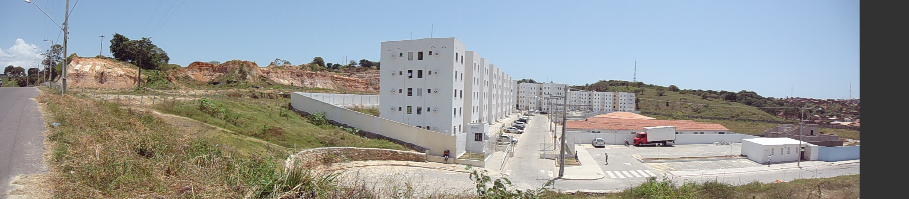
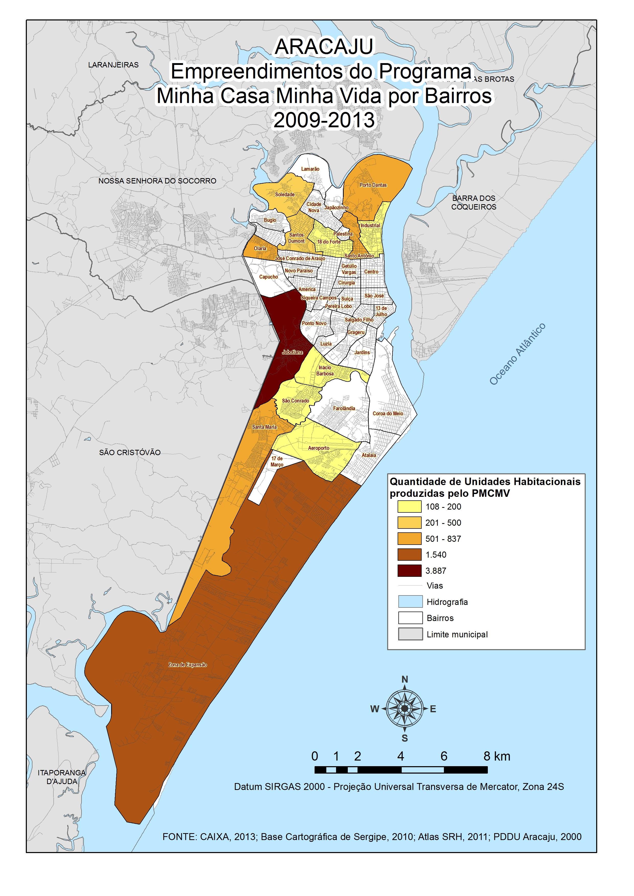
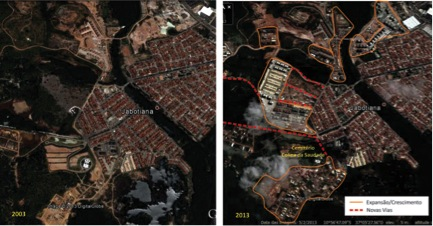
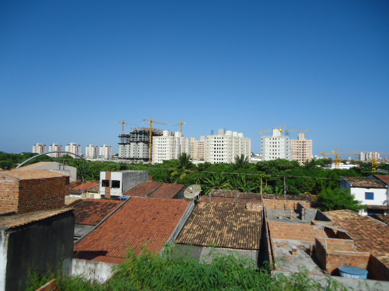

Resumo

Aracaju, capital do Estado de Sergipe, tem sido alvo de intervenções dos
setores público e privado para construção de empreendimentos
residenciais pelo Programa Minha Casa Minha Vida - PMCMV, lançado em
2009 pelo Governo Federal. O objetivo era oferecer condições de
ampliação do mercado imobiliário e atender famílias com renda de até 10
salários mínimos, na tentativa de reduzir o déficit habitacional do
país. Entretanto, um dos maiores entraves é a questão da terra
urbanizada que, de acordo com o capital imobiliário encarece o produto,
tendo como alternativa a ocupação de áreas distantes, desvalorizadas e
ausentes de infraestrutura. Assim, este artigo busca avaliar a
implantação do PMCMV em Aracaju, e as dinâmicas que caracterizam a
produção dos conjuntos habitacionais em direção aos limites municipais,
em bairros sem oferta de infraestrutura e serviços públicos e com baixo
valor da terra. O resultado é a busca pela valorização fundiária em
função dos investimentos públicos e privados, além da incorporação de
novos produtos do mercado imobiliário, como a disseminação da tipologia
apartamento, em bairros antes caracterizados pela moradia horizontal e
lotes vazios. Destaca-se a exclusão social e territorial resultantes,
quando se verifica o pequeno número de empreendimentos destinados ao
segmento de baixa renda (0 a 3 salários mínimos), equivalendo à apenas
13,11% do total das moradias entregues até 2013 pelo programa; porém,
84,09% do déficit habitacional de Aracaju estão concentrados na faixa de
renda de 0 a 3 salários mínimos. Verifica-se o incentivo aos novos
produtos imobiliários, sobretudo criando novos "bairros" sem oferta de
infraestrutura e serviços públicos, com impactos na mobilidade urbana,
agravando a exclusão socioespacial, proveniente do financiamento de
moradias na franja urbana periférica. Isso é resultado da ausência de
planejamento urbano e da implementação dos instrumentos de controle da
especulação fundiária.

**Palavras-chave:** Programa Minha Casa Minha Vida, políticas públicas,
habitação, mercado imobiliário

# Abstract

Aracaju, capital of the state of Sergipe, has been the target of
interventions in the public and private sectors for the construction of
residential projects by the Programme My Life My House (Minha Casa Minha
Vida -- PMCMV) launched in 2009 as part of the Growth Acceleration
Programme (Programa de Aceleração do Crescimento -- PAC) implemented by
the Federal Government. The goal was to provide conditions for expanding
the housing market and cater for families with incomes up to 10 minimum
national wages, in an attempt to reduce the housing deficit existing in
the contry. However, one of the greatest obstacles is the issue
regarding urbanized land which makes the product more expensive and as
an alternative fosters the occupation of distant, devalued areas lacking
infrastructure. Thereby, this article aims to assessing the
implementation of the PMCMV in Aracaju, and the dynamics that
characterize the production of urban space towards municipal limits in
neighborhoods without provision of infrastructure and public services
and low land value. The result is the pursuit of land values ​​in terms
of public and private investments, besides the incorporation of new
products in the housing market, like the dissemination of bachelor
apartments in neighborhoods, once characterized by horizontal and empty
housing lots. The social and territorial exclusion, when considered the
small number (13.11%) of residential projects aimed at serving the
low-income segment (0-3 National minimum wages), while 84.09% of the
housing deficit in Aracaju is concentrated within that wage range. Thus,
there is the incentive to new real estate products, especially creating
new districts without provision of infrastructure and public services,
with impact on urban mobility, worsening socio exclusion from the
housing financing in peripheral urban fringe. This is a result of the
lack of urban planning and of implementation of the control instruments
of land speculation.

**Keywords:** Program Minha Casa Minha Vida, public policies, housing,
housing market

# Introdução

No Brasil, o direito à terra e à moradia adequada é garantido desde 1988
pela Constituição Federal, através dos artigos n°182 e 183, e reafirmado
em 2001, pelo Estatuto da Cidade, em seu artigo 2°, devendo este ser
promovido e protegido nas cidades através dos seus Planos Diretores e
concretizado por meio de implementação de políticas públicas e
normatizações. Entretanto, a concretização deste direito ainda é um
sonho distante da realidade.

A partir de 2000, com a injeção de financiamentos de bancos
internacionais, como o Banco Interamericano de Desenvolvimento -- BID, e
federais, como a CAIXA, e sobretudo em 2007, com o lançamento de
programas habitacionais como o Programa de Aceleração do Crescimento --
PAC, o mercado privado se viu atraído para seguir o eixo da produção
habitacional voltada para o segmento econômico.

Em Aracaju, o cenário da produção habitacional de forma dispersa e
fragmentada na periferia urbana, mostra a participação ativa e
privilegiada dos agentes imobiliários e efetivação dos seus interesses,
na condução do processo de expansão da cidade. O Estado abandonou seu
papel de protagonista na promoção da moradia, para tornar-se mediador,
viabilizador e parceiro do setor imobiliário, especialmente na escolha
de locais de implantação dos empreendimentos, como sucede no Programa
Minha Casa Minha Vida -- PMCMV (CARDOSO, et all, 2013).

Diante disso, a tentativa desse artigo é de discutir os primeiros
resultados da implantação do PMCMV em Aracaju, bem como dinâmicas que
caracterizam a atual produção dos conjuntos habitacionais em direção aos
limites municipais, em bairros sem oferta de infraestrutura e serviços
públicos e com baixo valor da terra

Para realização deste artigo foram realizados levantamento bibliográfico
e documental através de pesquisa em órgãos públicos, informações sobre
empreendimentos, visitas ao local, bem como elaboração de tabelas e
cartogramas, que traduzem espacialmente, a inserção desses
empreendimentos habitacionais no tecido urbano de Aracaju.

Aracaju no contexto da produção habitacional

Aracaju situa-se na porção leste do Estado de Sergipe, com uma área de
182 Km^2^ que ocupa 0,79% do território sergipano e abriga 614.577
habitantes, conforme estimativas do IBGE para 2013 (Fig. 1).

{width="6.0in"
height="1.9583333333333333in"}

Figura 1.Localização do Estado de Sergipe e Aracaju. Fonte: IBGE,
Editado por Sarah França, 2011.

O seu crescimento se caracterizou pela materialização da desigualdade
sócio-espacial consequente da ação dos atores, a partir de novas
concepções sobre o papel do Estado e da indústria imobiliária. A
exclusão social traduziu-se pela ocupação informal nos loteamentos
precários, o que levou o poder público a planejar políticas
habitacionais e de provisão de infraestrutura. Por outro lado, a
proliferação dos produtos imobiliários acirraram cada vez mais o cenário
de segregação sócioespacial.

Após 1964, a implementação do Banco Nacional de Habitação -- BNH foi uma
alternativa para promoção da moradia de interesse social, embora não
tenha atingido resultados satisfatórios. Numa fase posterior, a COHAB --
Companhia Estadual de Habitação permitiu a construção de conjuntos
habitacionais dispersos (20.579 unidades habitacionais entre 1968 e
2002), como Bugio e Santa Tereza, Governador Augusto Franco, no bairro
Farolândia e Jornalista Orlando Dantas, no bairro São Conrado.

Outro órgão responsável pela produção habitacional foi o INOCOOP, também
com financiamento do BNH, construiu 5.956 moradias em diversos bairros
entre 1970 e 2003. Dentre esses, destacaram-se os Conjuntos Sol Nascente
e Juscelino Kubitschek, responsáveis pela dinamização do bairro
Jabotiana, e os Conjuntos Inácio Barbosa e Beira Rio, norteadores do
crescimento e valorização do bairro Inácio Barbosa (FAPESE/SEPLAN,
2010).

A implementação desse programa trouxe um grande contingente populacional
para a capital, na esperança de "ganhar uma casa" e na tentativa de
aliar habitação e emprego, o que nem sempre ocorreu (FRANÇA, 1999).
Aqueles que não foram contemplados, sem lugar pra morar, ocuparam
terrenos vazios, loteamentos irregulares, locais sem oferta de
infraestrutura e áreas ambientalmente frágeis. O entorno desses
conjuntos habitacionais também foi utilizado, com o objetivo de criar
formas de pressão sobre o governo para a obtenção da casa própria.

Diante do excludente panorama do mercado formal de moradias, recorrente
do recuo das políticas do Estado, nos últimos 30 anos, o quadro de
precariedade se alargou. O resultado foi a crescente ocupação informal
em loteamentos periféricos, nos bairros Olaria, São Conrado, Santos
Dumont, Coroa do Meio, Coqueiral, Santa Maria, que agravou o cenário de
dispersão urbana. Distante do centro urbanizado, essas casas foram
construídas em etapas, no sistema de mutirão, sem acompanhamento técnico
de engenharia e arquitetura, sem financiamento e desrespeitando a
legislação fundiária, urbanística e edilícia.

O adensamento, o incremento do valor fundiário, a escassez de terras
urbanizadas, o empobrecimento da população, a mobilidade social
descendente e os movimentos intraurbanos associados à dificuldade de
acesso ao mercado imobiliário formal foram fatores importantes,
relacionados ao brusco avanço no número de assentamentos precários em
Aracaju.

De fato, esses problemas decorreram da falta de políticas habitacionais
municipais, da aplicação de instrumentos urbanísticos, institucionais,
financeiros e outros, que poderiam ser articulados com ações e políticas
adotadas de forma participativa. Aliás, a fragilidade legislativa que
garantem o direto à cidade, conforme preconizou a Constituição Federal
de 1988 e o Estatuto da Cidade em 2001, influenciou e ainda influencia a
formação de inúmeros assentamentos precários.

O Plano Diretor de Desenvolvimento Urbano de Aracaju, promulgado em
2000, definiu diretrizes para política habitacional, a fim de garantir o
acesso de todos à moradia digna através de processos democráticos, bem
como assegurar a reserva de Áreas Especiais de Interesse Social -- AEIS
para o inserção de empreendimentos habitacionais, embora isso não tenha
sido difundido ao longo desses anos.

As primeiras iniciativas da gestão municipal após a aprovação do Plano
Diretor, se voltaram para a adoção de políticas habitacionais e de
provisão de infraestrutura. Elaborado em 2001, o Plano de Erradicação de
Moradias Subnormais -- PEMAS, identificou 23.751 moradias distribuídas
em 72 assentamentos irregulares, seja do ponto de vista jurídico (posse
da terra), quanto do urbanístico (carência de infraestrutura e serviços)
(PMA/SEPLAN, 2001).

Nesse estudo, contabilizou-se 1.056 domicílios situados em áreas de
risco, concentrados na antiga Terra Dura, Porto Dantas, Santos Dumont,
Cidade Nova e Soledade. 3.186 moradias estavam em área de preservação ou
pública, grande parte às margens de mangues, lagoas ou rios, como na
Coroa do Meio, Santos Dumont, Jardim Centenário e São Conrado. Por fim,
10.380 domicílios necessitavam de melhorias habitacionais e urbanas,
como infraestrutura, localizados na Coroa do Meio, na Terra Dura, no
Porto Dantas (PMA/SEPLAN, 2001), que viriam a ser definidas como áreas
prioritárias. A partir desse diagnóstico, um conjunto de ações e
projetos de recuperação dessas áreas precárias proporcionou novos rumos
à cidade.

Um dos primeiros projetos de urbanização de favelas, do Programa Moradia
Cidadã, componente do Programa Nacional HabitarBrasil/BID, prometeu
retirar da precariedade famílias com renda de até três salários mínimos.
Considerado um marco na política habitacional municipal[^1], tinha o
intuito de integrar as ocupações irregulares à cidade, garantindo a
segurança da posse, tratando questões socioeconômicas, ambientais e
urbanísticas. A primeira intervenção foi no bairro Coroa do Meio
(Loteamento Jardim Atlântico), seguidos do Santa Maria (Ocupações do
Arrozal e do Canal Santa Maria) e, mais recentemente, Porto Dantas, no
Coqueiral (Fig.2).

{width="5.989583333333333in"
height="8.677083333333334in"}

Figura 2. Políticas Habitacionais, Aracaju, 1964 a 2012. Fonte:
PMA/SEPLAN, 2014

O Projeto Integrado de Urbanização da Coroa do Meio, um dos maiores
destaques, teve como premissa elevar o padrão da qualidade de vida da
população, de forma integrada no âmbito social, ambiental, fundiário.
Para isso, foram erradicadas 652 palafitas, com a construção de moradias
no próprio local, beneficiando cerca de 3.050 famílias. O realização do
trabalho social junto à comunidade no acompanhamento e gestão do
projeto, proporcionou não apenas moradia digna e legalizada, mas a
ressocialização dos moradores e integralização para manutenção com a
área (PMA/SEPLAN, 2014).

Outra intervenção de grande impacto social, urbano e ambiental, o
*Projeto Bairro 17 de Março* foi implementado na Zona de Expansão
Urbana, que recebeu 2.012 famílias residentes das áreas precárias do
bairro Santa Maria. A construção deste novo bairro resultou em 2.562
unidades habitacionais, sendo 2.042 casas e 480 apartamentos, além da
implantação de toda infraestrutura urbana, e áreas reservadas para
comércios e serviços necessários (FRANÇA, 2011) (Fig. 2).

O *Projeto de Urbanização da "Invasão" do Coqueiral* teve como objetivo
a melhoria das condições de habitabilidade em ocupações irregulares dos
bairros Porto Dantas e Japãozinho, cujas intervenções se relacionavam à
construção de 600 unidades habitacionais, regularização fundiária, e
dotação de infraestrutura com financiamento do Programa Habitar Brasil
BID. Além disso, foram construídas 369 moradias pelo Programa Minha Casa
Minha Vida, para reassentar famílias removidas das áreas de risco,
insalubridade ou construções precárias (PMA/SEPLAN, 2014) (Fig.2).

Outra estratégia foi o Programa de Arrendamento Residencial - PAR,
criado em 2001, pelo Governo Federal para contribuir na diminuição do
déficit habitacional entre as classes mais carentes da sociedade (Lei
Federal n°10.188/2001). Essa estratégia funcionou mediante participação
da Prefeitura Municipal (seleciona os beneficiados), CAIXA
(financiador), construtoras (executa as obras construção das casas e
infraestrutura) e Ministério das Cidades (repasse de verbas).

A adesão a esse programa resultou na construção de 8.560 habitações
(entre casas e apartamentos) em Aracaju, destinados à classe média baixa
e distribuídos em 36 empreendimentos situados nas zonas norte, oeste e
sul (CAIXA, 2010). A concentração dessas unidades gerou a necessidade da
adequação de serviços públicos e de saneamento básico a fim de atender a
nova demanda. Bairros como Jabotiana, Lamarão, Farolândia, Aeroporto e
Zona de Expansão tornaram-se alvo desse programa e deveriam ser
considerados no momento do planejamento de novas ações, tendo em vista
novos níveis de adensamento (FRANÇA, 2011) (Fig. 2).

Esses projetos habitacionais elaborados pela Prefeitura Municipal
resultaram na construção de 14.674 moradias entregues de 2001 a 2012.
Destacaram-se não somente pelas obras, mas também pelo enfoque nos
aspectos da urbanização e do ambiental, com acompanhamento social,
planejamento da mobilidade das famílias e organização destas no local do
projeto. Outro elemento positivo foi a recuperação ambiental de áreas
degradas, como o manguezal dos bairros Coroa do Meio e Santa Maria, com
o plantio de mudas de árvores no Morro do Avião (Tabela 1).

Tabela 1. Programas Habitacionais da Gestão Municipal, Aracaju,
2000-2013. Fonte: Elaboração da autora, com dados coletados na SEPLAN,
2013.

  **Projeto**     **Número de Unidades Habitacionais**
  --------------- --------------------------------------
  Coroa do Meio   652
  Santa Maria     1.900
  Porto Dantas    600
  Lamarão         410
  17 de Março     2.562
  PAR             8.560
  **Total**       **14.674**

Contudo, ainda que a Prefeitura Municipal venha atuando na promoção de
moradia de interesse social, em 2010, o Plano de Habitação de Interesse
Social de Aracaju, registrou um déficit habitacional de 20.851 unidades
(distribuídos em 44 assentamentos), apontando uma redução de 13,3% em
relação à 2001 (23.751 moradias precárias) (FAPESE/PMA, 2010).
Entretanto, considerando o número de unidades habitacionais produzidas,
o déficit sofreu uma pequena queda, podendo-se inferir que as moradias
construídas não foram direcionadas às famílias de baixa renda.

O déficit habitacional espelha a quantidade de moradias que devem ser
construídas para suprir as necessidades decorrentes. Em 2010, Aracaju
dispunha de 3.915 habitações em situação precária e 1.024 improvisadas,
9.398 correspondiam às coabitações e 6.514 com ônus excessivo de
aluguel. Essa soma resultou 20.851 moradias, sendo 19.955 provenientes
de famílias com rendimentos entre 0 a 3 SM, o que correspondeu à 12,6%
do total de domicílios do município (FAPESE/PMA, 2010).

Diante disso, constata-se que é grande a carência por habitação em
Aracaju, assim como a necessidade de dotação de infraestrutura nos
assentamentos precários, especialmente para o atendimento daquelas
categorias de renda mais baixa que não conseguem se inserir em programas
que comprometem parte do salário familiar.

O Programa Mınha Casa Mınha Vıda em Aracaju: do Discurso à Realidade

Em março de 2009, o Programa de Arrendamento Residencial -- PAR foi
substituído pelo Programa Minha Casa Minha Vida -- PMCMV (Lei Federal
n°11.977/2009), criado pelo Governo Federal como estratégia de
impulsionar a economia do país e garantir condições de ampliação do
acesso ao mercado habitacional, para atendimento das famílias com renda
de até 10 salários mínimos (SM). O financiamento de novas moradias dá-se
através de parceria entre construtoras e o setor público, através da
União, CAIXA e Prefeitura Municipal.

A Prefeitura Municipal de Aracaju aderiu ao Programa Minha Casa Minha
Vida em 30/04/2009, com o pronunciamento do então Prefeito Edvaldo
Nogueira, afirmando que "*o projeto vai contribuir para a redução do
déficit habitacional de Aracaju e aumentará o investimento na construção
civil e na geração de emprego*"[^2]. O detalhe era que a construção das
moradias seria executada diretamente através das construtoras,
permitindo celeridade às obras, sem as limitações e burocracias do poder
público. O objetivo era, complementarmente, alavancar o setor da
construção civil em meio à crise econômica que assolava o país.

O Programa se divide em dois eixos de atendimento: faixa de renda entre
0 a 3 salários mínimos por família (denominada de interesse social), com
subsídios do orçamento da União; e entre 3 a 10 SM por família (mercado
"popular" ou "econômico"), com recursos provenientes do FGTS. Aracaju
oferece empreendimentos para esses dois eixos, embora a oferta de
moradia esteja inversamente proporcional à demanda necessária para
diminuir o déficit habitacional (95,70% correspondem à faixa de renda de
0 a 3 SM).

Na faixa de rendimento de 0 a 3 SM houve uma produção de apenas 2
empreendimentos, localizados em bairros periféricos, sendo seu entorno
caracterizado por grandes vazios e precária infraestrutura. Essa
produção soma 650 moradias, com mais 612 unidades habitacionais em
análise de projeto pela CAIXA, totalizando 1.262 casas (Tabela 2).

Tabela 2. Aracaju: Distribuição das Unidades Habitacionais por Faixas de
Renda -- PMCMV, 2009 a 2013. Fonte: FAPESE/PMA,2010

                                     **Até 3 SM**   **De 3 a 10 SM**   **Total**
  ---------------------------------- -------------- ------------------ -----------
  Número de Unidades Habitacionais   1.262          8.196              **9.458**

O primeiro empreendimento do PMCMV, o Residencial Jardim Santa Maria,
foi entregue em novembro de 2011, no bairro Santa Maria, com condições
de infraestrutura insuficiente e fora do tecido urbano, com entorno
cercado de grandes glebas. Conta com 281 casas dotadas de dois quartos,
sala, banheiro, cozinha e área de serviço, com adequação para pessoas
portadores de necessidades especiais.

Já o Residencial Jaime Norberto Silva, localizado no bairro Porto
Dantas, apresenta tipologia residencial verticalizada, composto por 18
blocos com 360 apartamentos e também por 9 casas para pessoas com
necessidades especiais. Está inserido na franja periférica, tendo em seu
entorno terrenos vazios somados à infraestrutura deficiente (Fig.3).

  {width="5.864583333333333in" height="1.375in"}
  ----------------------------------------------------------------------------------------------------------------------------------------
  Figura 3. Residencial Jaime Norberto Silva e o entorno grandes lotes, sua inserção na franja periférica. Fonte: Sarah França, dez/2013

Diante disso, verifica-se que Aracaju apresenta uma peculiaridade. A
pequena quantidade de empreendimentos voltados para a faixa de 0 a 3 SM,
demonstra a dificuldade no acesso à terra urbanizada para a produção de
habitação de interesse social, frente à grande demanda de terra para as
faixas de 3 a 10 SM. A hipótese é de que o principal entrave se encontra
na característica do mercado imobiliário local e na rentabilidade maior
para os empreendimentos destinados à classes econômicas maiores.

Outro fator se deve às facilidades institucionais e legislativas que
agilizam a implementação desses empreendimentos. Em dezembro de 2009,
foi promulgada a Lei Municipal n°93, que estabeleceu critérios relativos
à definição das Zonas Especiais de Interesse Social -- ZEIS vinculadas
ao PMCMV. Entretanto, apesar de flexibilizar a legislação para os
empreendimentos localizados nas ZEIS definidas no Plano Diretor de
Aracaju, isso não foi suficiente para incentivar o mercado imobiliário a
construir moradias nessas localidades.

Aquelas famílias que recebem de 3 a 10 SM encontram uma oferta de
moradias muito superior: em 67 empreendimentos construídos, resultando
8.196 unidades habitacionais espalhados por todo o tecido urbano.

No total foram construídos 71 empreendimentos entre 2009 e 2013, numa
soma de 9.458 unidades habitacionais, cujos empreendimentos estão
localizados sobretudo em bairros da porção norte, oeste e sul, como Zona
de Expansão Urbana e Jabotiana. que somam 5.427 moradias correspondendo,
a 57,38% da produção total em Aracaju (Fig. 4 e Tabela 3).

{width="5.96875in"
height="8.791666666666666in"}

Figura 4. Programa Minha Casa Minha Vida, 2009 a 2013. Fonte: Elaboração
da autora, 2014, Dados CAIXA, 2013.

Tabela 3. Aracaju, Empreendimentos do Programa Minha Casa Minha Vida por
Bairros, 2009-2013. Fonte: Elaboração da autora, com dados coletados na
CAIXA, 2013

  **Bairro**         **N° de Unidades Habitacionais**   **% Do Total**
  ------------------ ---------------------------------- ----------------
  Zona de Expansão   1.540                              16,28
  Industrial         155                                1,64
  18 do Forte        108                                1,14
  Jabotiana          3.887                              41,10
  Aeroporto          198                                2,09
  Santo Antônio      528                                5,58
  Inácio Barbosa     120                                1,27
  Santos Dumont      226                                2,39
  Olaria             608                                6,42
  Soledade           240                                2,54
  Santa Maria        597                                6,31
  Porto Dantas       837                                8,84
  São Conrado        176                                1,86
  Sem Definição      238                                2,52
  **Total Geral**    **9.458**                          **100,00%**

O PMCMV proporcionou ao mercado a livre escolha da localização dos
empreendimentos, em um cenário de ausência de instrumentos de controle
do valor da terra. Isso proporcionou a atenuação da periferização da
produção habitacional, que ocorreu intensamente nos bairros Jabotiana e
na Zona de Expansão Urbana, áreas de maior crescimento imobiliário nos
últimos anos.

Nessas localidades, principalmente no bairro Jabotiana, na zona oeste de
Aracaju, a concentração de empreendimentos do PMCMV na faixa de 3 a 10
SM deu-se de forma contínua, sendo localizados próximos uns aos outros,
potencializando os impactos da transformação no espaço urbano, em que o
uso residencial predominantemente horizontal dá lugar ao processo de
verticalização da moradia.

Esses empreendimentos são de tipologia fechada, em que os condomínios
são enclaves fortificados, conforme denomina Caldeira (2000),
reproduzindo com especificidades, efeitos negativos na sociedade,
refletidos no espaço segregado. Os condomínios foram constituídos com
mais de 2 torres e um maior número de apartamentos, de 2 e 3 quartos de
até 80 metros quadrados, com oferta de infraestrutura interna de um
clube privativo (Fig. 5, 6 e 7).

  {width="5.84375in" height="3.0520833333333335in"}                                                                         
  ---------------------------------------------------------------------------------------------------------------------------------------------------------------------- ------------------------------------------------------------------------------------------------------------------------------------------------------------------------------------------------------------------------------------
  Figura 5. Imagem Satélite Bairro Jabotiana em 2003 -- Ocupação predominantemente horizontal. Fonte: Google Earth, 2013, com modificações por Sarah França, dez/2013.   Figura 6. Imagem Satélite Bairro Jabotiana em 2013 -- Ocupação verticalizada no entorno do Cemitério Colina da Saudade, e às margens do Conj. Santa Lúcia. Fonte: Google Earth, 2013, com modificações por Sarah França, dez/2013.
  {width="5.96875in" height="1.8020833333333333in"}                                                            
  Figura 7. Bairro Jabotiana. Fonte: Sarah França, dez/2013                                                                                                              
                                                                                                                                                                         

Além disso, constata-se a valorização da terra em bairros antes pouco
visados pelo mercado, como o Santo Antônio e Olaria, em função dos
investimentos públicos, contribuindo para a produção de novas
periferias, onde a expansão, fragmentação e segregação sócioespacial
tornam-se constantes. Os terrenos de melhor localização são objeto de
lançamentos imobiliários voltados para segmentos de renda mais elevada,
fora do PMCMV, ou então ao aguardo do crescente aumento da mais-valia
fundiária.

Cabe observar, que o acesso à moradia instituída pela Política Nacional
de Habitação - PNH, relaciona-se com a ampliação do acesso a terra
urbana, com infraestrutura e serviços, garantindo o uso social do espaço
e combatendo a especulação imobiliária através da implementação dos
instrumentos urbanísticos de regulamentação do mercado para promoção de
moradia de interesse social.

Sobre a oferta de infraestrutura, há que se considerar que, por estarem
localizados afastados do núcleo urbano, o nível destes serviços não é
satisfatório. Há alguns casos, como no bairro Jabotiana e Zona de
Expansão, em que a ausência de saneamento básico (esgotamento sanitário
e drenagem urbana) é fortemente contrastada pelo grande número de
unidades habitacionais espalhados, intercalados com glebas vazias ao
aguardo da valorização da terra.

Paralelamente, essa inserção dispersa dos empreendimentos do PMCMV em
Aracaju também acarreta sérios impactos no tocante à mobilidade, por
estarem situados distantes dos núcleos polarizadores de oferta de postos
de trabalho e com precária ou inexistente rede viária. Entretanto, ainda
que seja estabelecido pela Portaria do Ministério da Cidade
n°140/2010[^3], a escolha dos beneficários de acordo com a proximidade
com seus locais de emprego, isso é posto de lado no momento de sua
escolha. Alguns desses empreendimentos estão localizados em áreas sem
pavimentação e acesso do transporte coletivo, dificultando o
deslocamento dos moradores, como pode ser verificado na Zona de Expansão
Urbana e Jabotiana.

Embora desfavoráveis em termos de acessibilidade, a localização dos
empreendimentos tende a ser definida principalmente em função da
necessidade de adequação do valor da terra aos valores determinados pela
normativa do programa e as margens de lucro das empresas, frente ao
mercado de terras (LIMA, et all, 2013).

Outra vertente deste programa é a participação das "entidades", sendo
necessária a organização de cooperativas habitacionais, associações e
demais entidades privadas sem fins lucrativos. Denominado Conjunto Jael
Patrício de Lima, o empreendimento em construção, localizado no bairro
Santa Maria, contará com cerca de 800 unidades habitacionais, sendo 180
entregues na primeira etapa, está inserido no Programa Minha Casa Minha
Vida Entidades através da Central de Movimento Popular -- CMP/SE.

As obras têm sido realizadas através do sistema de autogestão pelos
próprios moradores com recursos do Fundo Nacional de Habitação de
Interesse Social -- FNHIS[^4], cujo resultado tem sido a formação ou
fortalecimento de lideranças locais. Atrelados a isso, o grande
diferencial está na ausência do fator da lucratividade favorecem o uso
de tecnologia e participação de assessorias técnicas na realização e
acompanhamento desses projetos junto aos seus futuros moradores,
garantem melhor qualidade da moradia, no tocante à arquitetura e à
infraestrutura local.

# Contradições e Possíveis Caminhos

Neste trabalho, buscou-se discutir os primeiros resultados da
implementação do Programa Minha Casa Minha Vida em Aracaju-SE entre 2009
e 2013. Para tanto, observou-se a baixa efetividade da inserção da
famílias de renda inferior a 3SM, caracterizadas como as mais
necessitadas por apresentarem maior dificuldade de acesso aos
financiamentos da moradia.

O Poder Público tem responsabilidade na dissociação entre as políticas
urbana, habitacional, fundiária e de infraestrutura, causando um
descompasso na garantia do direito à cidade, e incentivando, cada vez
mais, o mercado imobiliário na busca incessante pelo lucro. A
possibilidade da implantação dos instrumentos urbanísticos da Estatuto
da Cidade e da efetivação das diretrizes estabelecidas pelo Plano
Diretor tem-se dissolvido de forma muito incipiente nas práticas da
gestão municipal.

Diante disso, os agentes envolvidos (proprietários de terras,
incorporadores e construtores) destacam que o alto valor da terra em
áreas urbanizadas é um dos entraves para o andamento do programa. Fica
evidente a importância do entrelaçamento das políticas fundiária,
habitacional e de infraestrutura/urbanização de modo a garantir o acesso
à terra urbanizada com valor reduzido, permitindo que os empreendimentos
sejam construídos e direcionados em áreas de interesse social, e em
maior proporção para àqueles que se concentram na faixa de renda de 0 a
3 SM.

Os empreendimentos do Programa Minha Casa Minha Vida em Aracaju tem sido
responsáveis pela segregação espacial, fragmentação do tecido urbano e
valorização fundiária, resultando numa cidade cada vez mais excludente.
A periferização das unidades habitacionais, inclusive próximas dos
antigos conjuntos residenciais do BNH, é uma reprodução das velhas
experiências com nova leitura, porém repetição dos mesmos entraves.

Esses projetos tem norteado o crescimento de Aracaju para novas
direções, como a Jabotiana e a Zona de Expansão, com o aumento do número
de moradias para uma faixa de renda de 3 a 10SM. É importante realizar,
concomitantemente, obras de infraestrutura, sistema viário e serviços
públicos, para que esses novos moradores estejam integrados no tecido
urbano.

Por outro lado, apesar de observados os problemas na efetivação do
programa que tem distanciado a população do direito à cidade e à
moradia, em termos quantitativos, não se pode deixar de mencionar, que
em apenas quatro anos de existência, o PMCMV já superou os números de
produção habitacional do Programa de Arrendamento Residencial (6.830
moradias) durante seus 8 anos de atuação.

Entretanto, faz-se necessário projetos habitacionais voltados para a
população de renda baixa (0 a 3 SM), que não consegue ter acesso à
moradia em áreas estruturadas no tocante ao serviços e proximidades com
os postos de trabalho. A oferta desse tipo de moradia tem se tornado
cada vez mais incipiente em Aracaju.

# Referências Bibliográficas

CALDEIRA, Teresa Pires. *Cidade de Muros: crime, segregação e cidadania
em São Paulo*. São Paulo: 34 ed./ EDUSP, 2000.

FRANÇA, Sarah Lúcia Alves França. *A produção do espaço na Zona de
Expansão Urbana de Aracaju: dispersão urbana, condomínios fechados e
políticas públicas*. Niterói: Dissertação de Mestrado, Universidade
Federal Fluminense, 2011.

FRANÇA, Vera Lúcia Alves França. *Aracaju: Estado e Metropolização*. São
Cristóvão: UFS, 1999.

LIMA, José Júlio Ferreira; PONTE, Juliano Pamplona Ximenes; RODRIGUES,
Roberta Menezes; NETO, Raul Ventura; MELO, Ana Carolina Campos de. A
promoção habitacional através do Programa Minha Casa Minha Vida na
Região Metropolitana de Belém. In CARDOSO, Adauto Lúcio (org.) *O
Programa Minha Casa Minha Vida e seus efeitos territoriais.* Rio de
Janeiro: Letra Capital, 2013.

PREFEITURA MUNICIPAL DE ARACAJU. *Diagnóstico da Cidade de Aracaju. 3
Produto.* Relatório. Aracaju: PMA/EMURB, 2014.

\_\_\_\_\_\_\_\_\_\_\_\_\_\_. *Plano Estratégico de Moradias
Subnormais*. Aracaju: PMA/SEPLAN, 2001.

PREFEITURA MUNICIPAL DE ARACAJU/ FUNDAÇÃO DE APOIO À PESQUISA E EXTENSÃO
DE SERGIPE - FAPESE. *Plano Local de Habitação de Interesse Social*.
Aracaju: PMA/SEPLAN, 2010.

[^1]: O projeto foi um dos vencedores na sexta edição do Prêmio Melhores
    Práticas em Gestão Local 2009-2010, cujo sucesso se constitui num
    modelo a ser seguido em outros projetos.

[^2]: <http://www.infonet.com.br/cidade/ler.asp?id=85126&titulo=cidade>,
    acessado em 06/02/2014).

[^3]: Esta Portaria estabelece que o poder público municipal pode
    definir critérios relacionados à localização, priorizando candidatos
    que habitam ou trabalham próximos à região do empreendimento de
    forma a evitar deslocamentos intraurbanos extensos e desnecessários.

[^4]: Disponível em \<http://www.youtube.com/watch?v=Ln2R-s6Y_ag,\>.
    Acesso em: 26 nov. 2013.
