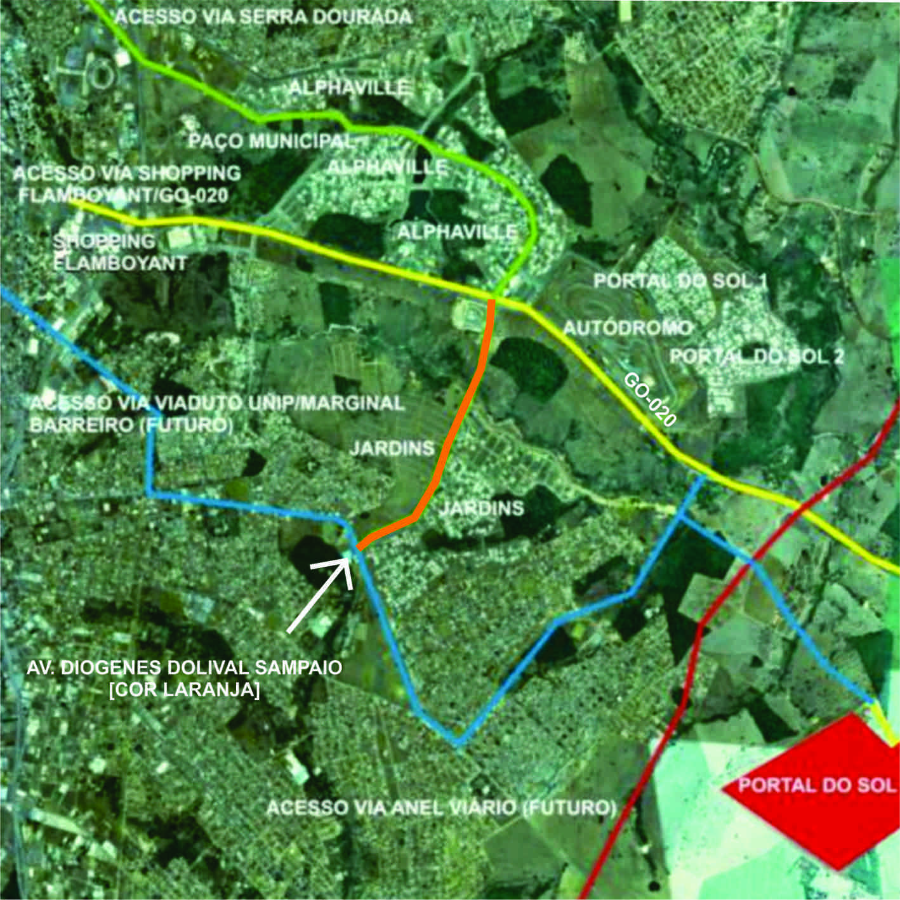

# Resumo

O presente artigo pretende a análise e a compreensão do fenômeno dos
condomínios horizontais em Goiânia, tendo como recorte a Região Sudeste
da cidade. Para atingir este objetivo, este trabalho será estruturado a
partir de referenciais teóricos e do estudo de caso. A primeira parte,
sobre a conceituação e caracterização da paisagem será apoiada no texto
*Paisajes* de Ignasi de Solà-Morales, perpassando pelos conceitos de
lugar e não-lugar de Marc Augé presentes no livro Não-Lugares:
Introdução a uma Antropologia da Supermodernidade, a análise da
banalização da paisagem feita por Francesc Muñoz no texto *Paisajes
banales:* *bienvenidos a la sociedade del espectaculo*, além dos
conceitos de outros estudiosos do assunto, estruturando então a
discussão sobre o impacto que a implantação em massa dos condomínios
horizontais proporcionou na paisagem da Região Sudeste de Goiânia.

Palavras-chave: Paisagem Urbana, Goiânia, Condomínios Horizontais

# Abstract

This article seeks to analyze and understand the phenomenon of
horizontal condominiums in Goiânia, having as clipping the Southeast
Region of the city. To achieve this goal, this work will be structured
based on the theoretical framework and the case study. The first part,
about the conceptualization and characterization of the landscape will
be supported in *Paisajes* Ignasi de Solà-Morales text, passing by the
concepts of place and non-place of Marc Augé in the book Non-Places:
Introduction to an Anthropology of Supermodernity, the analysis of the
trivialization of the landscape taken by Francesc Muñoz in the text
*Paisajes banales: bienvenidos a la sociedade del espectaculo,* beyond
the concepts of other students of the subject, then structuring the
discussion of the impact that mass deployment of horizontal condominiums
provided in the landscape of the Region Southeast of Goiânia.

Keywords: Urban Landscape, Goiânia, Horizontal Condominiums

## Introdução {#introdução .list-paragraph}

Goiânia é uma das poucas cidades brasileiras previamente planejadas,
atualmente é uma cidade de 80 anos, alçada à condição de metrópole
através da lei complementar n°27, 1999, com uma população de mais de
dois milhões de habitantes (IBGE, Estimativa 2011) e uma região
metropolitana que abrange 20 municípios (lei complementar n°78 de 25 de
março de 2010).

A partir da década de 1990, com a constituição da Região Metropolitana,
a cidade se depara com uma nova realidade, caracterizada pelo lançamento
de numerosos condomínios horizontais, concentrados em sua grande maioria
na Região Sudeste da cidade, fato este que alterou profundamente o
tecido urbano e a paisagem da região.

A Região Sudeste de Goiânia está localizada limítrofe e conurbada com os
municípios de Aparecida de Goiânia e Senador Canedo. Sua população é de
43.699 habitantes, ou seja, apenas 4% do atual contingente populacional
da cidade. Em contrapartida é a sétima região da cidade em área
territorial. É uma área de planejamento instituída primeiramente no PDIG
2000 (Plano Diretor Integrado de Goiânia, SEPLAM, 1992) como distrito 58
-- Jardim Vitória e atualmente como Região Sudeste pela atual
regionalização da cidade proposta pela Prefeitura de Goiânia (ver figura
01).

{width="4.729166666666667in"
height="4.729166666666667in"}

Figura 1. Goiânia e regionalização da cidade. Fonte: autora

Os primeiros loteamentos da região datam da década de 1950, porém a
ocupação mais intensiva se iniciou na década de 1990 e atualmente vem
aumentado exponencialmente, com a implantação dos condomínios
horizontais que em sua maior parte ocupam as margens da Rodovia GO-020
(ver figura 03). É uma região que se caracteriza ainda, por uma vasta
extensão territorial, em princípio constituída como área rural,
concentrada nas mãos de poucos proprietários, que as utilizaram como
estoque especulativo à longo prazo, fator este que determinou e ainda
determina a ocupação da região.

Por ser um dos principais vetores de expansão da cidade, portanto, a
Região Sudeste foi a localidade eleita como recorte capaz de
exemplificar o fenômeno dos condomínios horizontais em Goiânia, o
período a ser estudado 1993-2013, é marcado por um intensa ocupação
territorial, difusa da que até então a região comportava. Os condomínios
horizontais passam a dominar a paisagem local, alterando a configuração
da região e consequentemente do tecido urbano do entorno e da cidade.
Compreender as alterações que a inserção destes condomínios horizontais
provocou na paisagem da Região Sudeste de Goiânia, através da análise de
vários autores estudiosos do assunto é o principal objetivo do presente
artigo.

# Conceituação de paisagem

O conceito de paisagem possibilita variadas interpretações, por se
tratar de assunto multidisciplinar analisado por várias disciplinas tais
como a arquitetura paisagística, a geografia, arqueologia, entre outras.
A conceituação que pretendemos abordar é a da paisagem urbana e para tal
intento, recorremos ao arquiteto e escritor catalão Ignasi de
Solà-Morales.

Para Ignasi de Solà-Morales o conceito de paisagem remete à nossa
relação com a cidade, ou seja, a cidade como paisagem, visão esta que
têm estreita relação com a nossa experiência de morar. Solà-Morales
destaca ainda três características formais para análise de paisagem: o
primeiro seria estabelecer os limites do conceito de paisagem; o segundo
a compreensão de sua condição superficial (a palavra superficial
aplicada aqui não no sentido de algo que não têm valor, que é trivial ou
banal, mas sim no sentido de superfície visível, tangível, transitável);
e por fim o terceiro: a característica da paisagem, natural ou urbana,
de incorporar em seu espaço, as noções de tempo e movimento. Como
atributos essenciais da experiência da paisagem, o autor destaca porque
a topografia ou a multidão de estímulos, mensagens e formas que nos
bombardeiam em nosso deslocamento pela cidade, ocorrem ligados
inevitavelmente a experiências de deslocamento, a vagar, a mover-se
através de caminhos e mudanças de rota, surpreendidos pela permanente
surpresa que se apresenta aos nossos olhos.

A cidade contemporânea, a metrópole, a megalópole difusa, sem limites,
em permanente processo de formação e devastação, não seria
compreensível, portanto, através de uma visão que encontra na ordem dos
traçados o suporte de uma inteligibilidade estável. Para o autor, mesmo
o movimento moderno pretendia através da definição das áreas e da
infra-estrutura de transportes, reconhecer-se como uma estrutura simples
e apreensível.

Em uma situação de contínua construção e destruição, de permanente
crescimento e renovação, de mutação e obsolescência a condição
imprevisível da cidade se converte em seu verdadeiro modo de exposição.
A cidade atual se apropria de sua energia, mas também os seus conflitos
sociais, geológicos, ambientais, aceitando fatalmente conviver com eles.

A arquitetura desta situação individualista cujo espaço público tende a
converter-se em paisagem tem características muito específicas, mas que
se repetem em várias cidades do mundo. Portanto, a cidade de Goiânia não
está alheia a estes processos, pelo contrário, sua população têm
vivenciado cotidianamente situações que são similares a todo o planeta.

É sobre estes conflitos e tensões aparentes que o presente artigo
pretende recorrer para analisar a paisagem dos condomínios horizontais
na Região Sudeste de Goiânia. Compreende-se através das idéias de
Solà-Morales que analisar a paisagem requer estas surpresas,
descontinuidades de rotas, desvios de caminho e que, portanto, uma
paisagem de qualidade deve ter diversidade. Mais adiante iremos
verificar que essas qualidades não são encontradas na região em análise,
não há diversidade, a paisagem é monótona, os elementos arquitetônicos
encontrados resumem-se em a uma infinidade repetitiva de muros,
portarias e paisagens tematizadas (lagos artificiais, bosques, entre
outros).

{width="4.729166666666667in"
height="2.3645833333333335in"}

Figura 02 -- Vista do Residencial Alphaville Ipê/ Fonte: CAMPOS \[2007\]

Portanto, as ações necessárias para a análise da paisagem para
Solà-Morales, requerem transitar, vaguear, surpreender-se, ações estas
complexas de serem realizadas na região em estudo (especialmente na
rodovia GO-020 e nas avenidas que concentram os condomínios), pois há
ausência de calçamento, de iluminação adequada, insegurança permanente
frente às portarias fortemente protegidas, a própria violência urbana e
à alta velocidade do tráfego local que inviabiliza e até atenta com a
vida dos poucos indivíduos que se arriscam a estas atividades, ou seja,
não há transeuntes, demonstrando ser uma área com pouca ou nenhuma
acessibilidade, fato este que parece ser intencional, como se a própria
vida urbana fosse algo não muito bem vindo por ali (ver figura 02).

# Conceituação de lugares e não-lugares

A dissertação de mestrado de CAMPOS (2007) dedica-se ao estudo crítico
dos condomínios horizontais fechados como manifestação de não-lugares na
cidade de Goiânia, no período de 1990-2006.

Para o autor os condomínios horizontais fechados são fruto do New
Urbanism e de reflexões desenvolvidas a partir de 1960, alicerçadas no
retorno à cidade tradicional. Ao proporem uma paisagem pitoresca e
bucólica, anunciam a salvação de seus moradores das mazelas urbanas,
contraditoriamente, tendo como foco a vida em comunidade, apostando na
criação de uma localidade.

O pensamento do antropólogo Marc Augé (1994) esclarece acerca das
ambiguidades que permeiam o mundo atual globalizado, através da
formulação do conceito de não-lugar. Augé, ao invés do termo
pós-modernidade, prefere a utilização da palavra supermodernidade para
dar a idéia de continuidade, pois entende o pós-modernismo como um
movimento que apregoa a ruptura. O autor defende assim o conceito de
não-lugar como um espaço de passagem, incapaz de dar forma a qualquer
tipo de identidade. Procurando fundamentar a sua tese, discute a
capacidade da antropologia de analisar e compreender a cidade atual,
caracterizada por ele como supermodernidade.

As principais características desta nova sociedade são definidas pelo
autor pelas figuras de excesso[^1] um novo entendimento da categoria de
tempo, que devido ao nosso mundo high tech é hoje bastante acelerado; a
revolução das telecomunicações que provocou o encolhimento do mundo e
uma alteração da escala planetária que por sua vez resultam em
concentração urbana, migração populacional e na produção de não-lugares:
aeroportos, vias expressas, hotéis, centros comerciais, supermercados,
etc. por onde circulam pessoas e bens, espaços este que se repetem no
mundo todo e por fim fatores estes que enfraquecem o referencial
coletivo, gerando assim um egocentrismo exacerbado, porém sem identidade
própria.

Ou seja, o não-lugar caracteriza-se por não ser relacional, identitário
nem histórico, tendo como exemplos as auto-estradas, os aeroportos e
supermercados, são espaços de ninguém, não geradores de identidade. Já
em oposição a este espaço o autor cita o espaço antropológico,
necessariamente criador de identidade, fomentador de relações pessoais
em um tempo e espaço previamente definido. Identitário porque está
ligado a idéia do nascimento, pois o lugar de nascimento é constitutivo
da identidade individual, demarcando assim as fronteiras entre eu e os
outros; além de histórico porque fala da história nativa,
desconsiderando a história como ciência.

Portanto, os condomínios horizontais fechados significam um retorno à
cidade tradicional, por meio da proposição de uma paisagem bucólica e
pitoresca, tendo como foco a recuperação da vida em comunidade,
apostando assim na criação de um lugar.

# Paisagens Banais

Já o ensaio de Muñoz discorre sobre o conceito de urbanização banal do
território explicando como as alterações nas formas e funções urbanas
através da metropolização das cidades deram lugar a uma cidade
multiplicada que o autor procura explicar a partir de três processos
simultâneos que seriam: a multiplicação dos atributos da centralidade, a
multiplicação da escala e tipologia dos fluxos de mobilidade e a
multiplicação das formas de se habitar um território.

> Esta nova situação metropolitana tem produzido consequências como a
> aparição de novos artefatos urbanos. Os containers e a ampla galeria
> dos chamados "não-lugares" (Augé, 1992) são bons exemplos. Foi assim
> que surgiu uma "geografia objetivada" e seu progresso define o que
> denominaríamos mais tarde como "paisagens a-territoriais" (Muñoz,
> 2002), caracterizados por uma segregação funcional e a padronização
> dos critérios morfológicos. Paisagens que podem aparecer em qualquer
> território e que não pertencem a nenhum lugar." (MUÑOZ, 2005, p.78,
> tradução nossa).

Muñoz aponta também o surgimento de várias teorias que tentam explicar
essas importantes mudanças na tipologia e na estrutura metropolitanas
das cidades, algumas refletindo sobre os novos atributos de centralidade
espacial[^2], outros têm explicado a cidade global, a metrópole, a
pós-metrópole, entre outros. O autor ressalta que estes estudos foram
desenvolvidos ao mesmo tempo em que as políticas urbanas experimentaram
um processo de simplificação e festivalização, concebidas com a
finalidade de conseguir uma maior participação da cidade nos mercados de
produção e consumo globais. Como exemplo desta nova gestão urbana ele
cita a maioria dos projetos de reformulação de orlas marítimas, antigas
áreas industriais e centros históricos, que exemplificam a importância
de três processos que interagem entre si: a especialização econômica e
funcional do território, a segregação morfológica dos ambientes urbanos
e a tematização da paisagem. Três processos que definem o que o autor
conceituou como território banal ou urBANALização.

O autor defende a tese de que, em muitos casos, esses processos de
urbanalização implicam na construção de uma nova cultura urbana
associada a estas novas paisagens, utilizando assim a arquitetura e o
desenho urbano como instrumentos de produção em massa para a produção de
paisagens comuns, que não pertencem a nenhum território, estratégias que
têm a ver, com o uso e a manipulação da história. Simulação, seleção e
imitação de elementos específicos mostram que apenas fragmentos do
passado que podem ser simplificados e facilmente compreendidos têm lugar
no novo espaço urBANAL.

Sobre a questão da falta de complexidade das políticas urbanas, o autor
procura salientar a transição de um tipo de intervenção urbana concebida
como um instrumento de regeneração ou revitalização da cidade, às
intervenções que definiram como sua principal prioridade vender a cidade
como mais um produto do mercado global, o que demonstra uma mudança no
modo de gestão da cidade.

Finalizando, para Munõz (2005), nesse processo de venda de cidades e
lugares, as políticas urbanas têm contribuído em grande parte para o
cenário final, porque têm assumido como sua principal tarefa a
transformação econômica e física de alguns fragmentos específicos da
cidade, previamente selecionados na estrutura urbana, o que explica em
parte, porque determinadas regiões da cidade, no nosso estudo de caso
representado pela Região Sudeste, recebem tantos benefícios em termos de
investimentos seja da iniciativa privada, seja do poder público, em
detrimento de outras regiões tão promissoras quanto ou mais carentes de
Goiânia.

# O contexto da inserção dos condomínios em Goiânia

Sobre o conceito de cidade mundial, apesar de MOYSÉS acreditar que ele
não possa ser diretamente aplicado ao caso de Goiânia, a presença de
grandes equipamentos urbanos na atualidade se insere no contexto dessa
nova trama.

Assim, na região metropolitana de Goiânia, esse movimento, intensificado
na década de 1990 e que vêm aumentando exponencialmente na Região
Sudeste, se caracteriza pelo lançamento de inúmeros condomínios
horizontais fechados, verticalização de alto padrão construtivo, Malls e
mega-empreendimentos (como o Centro Cultural Oscar Niemeyer) que atingem
todas as classes sociais.

> "Na verdade, os condomínios fechados não constituem total novidade
> (\...). O que desperta a atenção, desde os anos 90, é o aumento do seu
> número e sua disseminação pelo país. Na verdade, denota-se certa
> "popularização" dessa fórmula, com a reprodução dos condomínios
> horizontais fechados, extrapolando os limites geográficos das grandes
> cidades e se instalando em muitas cidades do interior do país, e com o
> mercado imobiliário acenando com modelos mais acessíveis à parcelas de
> menor poder aquisitivo da população." (MOYSÉS, 2007, p.44).

Ou seja, o processo de banalização e tematização da paisagem, descritos
anteriormente por MUÑOZ são aqui claramente perceptíveis. Em Goiânia o
primeiro condomínio fechado, o Privê Atlântico, foi implantado ainda no
final da década de 70 como conjunto habitacional voltado para classe
média, formado por casas pré-construídas e lotes para posterior
construção, e só na década de 90 recebeu status de condomínio fechado
pelo poder público. Todos os outros condomínios de grande porte têm sua
implantação a partir da metade da década de 90, e, como lembra BERNARDES
& SOARES JÚNIOR, atualmente "configuram em ícones da paisagem urbana da
grande Goiânia". Lembram que apesar de Goiânia caracterizar cidade de
médio porte, ela é considerada hoje "a terceira capital do país em
número de condomínios fechados, proporcionalmente ao número de
habitantes". (MOYSÉS, 2007).

# Definição de Condomínio Horizontal Fechado

Várias são as denominações ou subdivisões para os condomínios fechados,
no presente artigo iremos nos deter na identificação realizada por
MOYSÉS (2008, pg.02) que os diferencia entre condomínios horizontais
fechados e conjuntos residenciais seriados, todos eles com unidades
residenciais isoladas, de alto padrão arquitetônico, com áreas
superiores a 500m². Existem outros condomínios de menor porte existentes
em Goiânia e na Região em estudo que figuram na SEPLAM como condomínios
residenciais ou habitações seriadas, apesar de alguns possuírem sistemas
sofisticados de segurança, altos muros e outras características que os
aproximam dos condomínios fechados.

{width="5.322916666666667in"
height="3.4479166666666665in"}

Figura 03 -- Região Sudeste e os Condomínios Horizontais Fechados --
Ocupação por Décadas/ Fonte: autora

Goiânia conta atualmente com mais de trinta condomínios fechados
(SEPLAM), sendo que a região sudeste comporta atualmente treze deles
(ver mapa 02): Portal do Sol I (2001), Complexo Alphaville Flamboyant
(2001) -- três etapas; Portal do Sol II (2002), Jardins Atenas (2003),
Jardins Milão (2005), Jardins Munique (2010), Jardins Paris (2003),
Jardins Valência (2008), Jardins Verona (2008) e Portal do Sol Green
(2011) e Portal do Sol Garden (2013). Dentre os conjuntos residenciais
seriados de maior porte, temos: Privê dos Girassóis (1999) e Housing
Alphaville Flamboyant (2001). Sobre os condomínios Portal do Sol Green e
Portal do Sol Garden há ainda uma curiosidade: tratam-se do mesmo
empreendimento que foi lançado em 2005 com o nome de Goiânia Golf
Residence, implantado em área originalmente rural e que precisou ser
redefinido como área de expansão urbana no último plano diretor da
cidade (2007). Porém o lançamento não teve o retorno esperado, talvez em
função da proximidade com o Parque Memorial de Goiânia (cemitério
ecumênico), e foi repartido em dois novos condomínios.

Como observa MOYSÉS (2007), outro ponto a ressaltar é denominação dada a
estes empreendimentos, elementos centrais do marketing imanente a essa
tipologia residencial. Os nomes dos condomínios fechados fazem apologia
a lugares de países centrais e lugares valorizados pela elite para cada
tipo de residência, tendo, por exemplo: Atenas, Milão, Munique, Paris,
entre outros; além de nomes americanizados como Housing, Golf Residence
e o próprio Alphaville.

Outro fator que comprova a nossa afirmação de como esse fenômeno é
recente é o próprio mapa (ver figura 03) que exemplifica que a
instalação deste tipo de empreendimento começou na década de 1990, foi
intensificado na década de 2000 e prossegue a todo vapor na presente
década.

# Consequências da implantação dos condomínios para a Região Sudeste

> "A ação do poder público na região metropolitana de Goiânia, Estado e
> Município, tem sido necessária para a expansão desse tipo de
> empreendimento. Cabe ressaltar que a malha urbana da cidade tem sido
> modificada ao longo da década de 1990, graças à parceria da Prefeitura
> com as incorporadoras com o propósito de assegurar a viabilidade
> jurídica para a implantação desses empreendimentos. Conforme BERNARDES
> & SOARES JÚNIOR, "houve a criação de um sistema viário exclusivo e de
> uso coletivo (avenidas, ruas e viaduto), que interliga regiões, antes
> separadas e modificadas vias intermunicipais, alterando o cotidiano
> das mesmas". (MOYSÉS, 2007, p.45).

{width="4.729166666666667in"
height="4.729166666666667in"}

Figura 04 -- Abertura de novas vias na Região Sudeste/ Imagem: Google
Maps

Tal fato pode ser comprovado na figura 04, que demonstra que a abertura
da Avenida Diógenes Dolival Sampaio viabilizou a implantação dos
condomínios Jardins Atenas e Jardins Paris. É importante ressaltar a
estratégia da FGR Urbanismo S.A. que lançou primeiro o condomínio
Jardins Atenas, mais distante da principal via de acesso, a rodovia
GO-020, para somente após considerável valorização do empreendimento,
lançar o condomínio Jardins Paris e posteriormente, os Jardins Valência,
Verona e Munique - estes últimos viabilizados pela abertura de uma nova
via: a Marginal Barreiro. Há ainda o projeto de ampliação do Anel Viário
que interligaria toda a região metropolitana e passa próximo a estes
condomínios.

A própria rodovia estadual GO-020, principal acesso aos municípios de
Senador Canedo e Bela Vista, foi absorvida pela implantação de
condomínios em suas margens ou próximos à ela, gerando um desvirtuamento
de seu uso e um inchaço de fluxo de veículos que já demonstra o
esgotamento de sua caixa viária em alguns momentos, principalmente no
horário do *rush*.

{width="4.791666666666667in"
height="3.1979166666666665in"}

Figura 05 -- Rodovia GO-020/ Fonte:
[www.agetop.go.gov.br](http://www.agetop.go.gov.br). Acesso em: jan.
2014

Recentemente ela passou por reformas que basicamente se consistiram na
duplicação e o recapeamento do trecho entre o Autódromo Internacional de
Goiânia (que serve de acesso aos condomínios) até o Centro Cultural
Oscar Niemeyer (novo cartão postal da cidade), além da instalação de
nova iluminação, gramagem dos acostamentos e taludes e implantação de
palmeiras, demostrando que a intenção ali não é propriamente a
manutenção da via, mas um embelezamento de uma área considerada nobre
além de um dos principais acessos da cidade.

Ou seja, todo esse processo leva a uma periferização das áreas centrais
da metrópole, seguido inclusive pelos órgãos públicos que passam a
integrar esse novo eixo de expansão urbana, com a migração da Prefeitura
Municipal de Goiânia do centro da cidade para a região sudeste,
produzindo assim uma nova centralidade, ação esta que é justificada
pelos órgãos públicos como ações vitais para a promoção do
desenvolvimento e dinamização da cidade, com o aumento de atividades
comerciais e sociais nessas áreas, entre outros fatores, o que gera uma
arrecadação maior de receitas para o município nesse sentido.

MOYSÉS (2007, pg.46) ressalta que as áreas que estão sendo ocupadas na
região sudeste de Goiânia com funções públicas (órgãos governamentais) e
privadas (condomínios horizontais fechados de alto luxo) são resultado
de uma visão de planejamento de longo prazo, de um grupo empresarial
local muito dinâmico. Este grupo, proprietário de uma vasta gleba de
terra rural, reteve este espaço para futuras especulações e hoje está
colhendo os frutos desta retenção. Teve como ponto de partida a
construção do Autódromo Internacional de Goiânia e do Estádio Serra
Dourada em meados dos anos 1970. Nos anos 1980 lançou o Shopping
Flamboyant, o primeiro de Goiânia e da RMG, no meio do nada, fora da
área urbanizada, e cujo empreendimento já expandido várias vezes, sem
muita pressa, foi forçando o poder público a intervir na área de modo
que esta intervenção viabilizasse os interesses de longo prazo. Assim
como este grupo empresarial de caráter familiar, outros também
pavimentam sua aproximação com o poder público e vão entronizando suas
concepções de cidade e de cidadania junto ao executivo (no planejamento
urbano), ao legislativo (na formulação das leis urbanísticas) e até
mesmo nos fóruns onde a participação social é mais ampla, como por
exemplo, nas plenárias das Conferências municipais e estaduais da cidade
e nas audiências públicas. (MOYSÉS, 2007, p.46).

Conclusão: de uma área até então tida como rural, fora de mão, de
ocupação lenta e rarefeita a Região Sudeste passa a ser a bola da vez,
uma região nobre, valorizada e dinâmica que se converte em uma nova
centralidade urbana graças à proximidade com o Jardim Goiás e a esse
dinamismo do capital privado. A alteração na paisagem têm sido
dramática, porém aos moldes da cidade globalizada dos novos tempos, com
benfeitorias cirurgicamente pontuais, paisagens tematizadas e
banalizadas e ares de cidade contemporânea.

# Considerações Finais

A análise dos vários autores citados neste artigo leva a crer que o
fenômeno da falência no nosso atual modelo de cidade não passa
despercebido, e que a resposta da arquitetura e urbanismo em face estes
problemas está longe de nos oferecer uma resposta satisfatória. A
crescente privatização dos espaços da cidade até então tido como
públicos, ou de responsabilidade do poder público, têm levado a um
aumento agravante da segregação social e urbana e apesar de todos estes
problemas - perceptíveis até para os cidadãos comuns -- parecem longe de
esgotar sua fórmula, replicada mundo afora.

A tendência globalizada de simplificar tudo, criar fórmulas de sucesso e
repeti-las mundo afora parece ter encontrado seu nicho (ou eco) na
arquitetura e os condomínios horizontais com suas paisagens tematizadas
e homogeneizadas, de fácil apreensão, parecem ser um sintoma deste mesmo
mal.

A região estudada exemplificou várias das estratégias que são utilizadas
para alavancar determinadas localidades da cidade, o que em um primeiro
momento não seria um problema, pelo contrário, a cidade é uma estrutura
dinâmica e esses processos são relativamente comuns. O problema aqui é
relegar a gestão das cidades à inciativa privada, que visa primeiramente
o lucro e que nem sempre investe em áreas apropriadas, ou ainda, investe
em localidades que não haviam sido planejadas para esta nova finalidade
e rapidamente esgotam sua capacidade de adensamento, provocando uma
saturação de acessos, forçando benfeitorias de parte do poder público
entre outros fatores.

Reavaliar a disciplina da arquitetura e urbanismo e o próprio papel que
os arquitetos e urbanistas exercem ou deveriam exercer na sociedade,
quer como planejadores, quer como projetistas, faz-se necessário, sob
pena de perdermos através da negligência, campo para outros estudiosos,
talvez mais predispostos à compreensão e organização das nossas cidades.

# Referências

AUGÉ, Marc. *Não-lugares: introdução a uma antropologia da
supermodernidade*. Tradução de Maria Lúcia Pereira. Campinas: Papirus,
1994.

CAMPOS, Roberto Cintra. *Não Lugares: Condomínios fechados em Goiânia
(1990-2006*). Dissertação (Mestrado Institucional em Arquitetura). 2007.
Universidade Federal do Rio Grande do Sul. Goiânia/ Porto Alegre.

GOOGLE Maps. Disponível em: \<<https://maps.google.com.br>\>. Acesso em:
jan. 2014.

MOYSÉS, Aristides; Silva, Eduardo Rodrigues da; Borges, Elcileni de
Melo; Ribeiro, Marcelo Gomes (2007). *"Da formação urbana ao
empreendedorismo imobiliário: a nova face da metrópole goianiense".*
Revistar Mercator, Volume 06, n°12, 2007. Disponível:
\<http://www.mercator.ufc.br/index.php/mercator/article/viewArticle/45\>.
Acesso em: nov. 2013

MOYSÉS, Aristides; Borges, Elcileni de Melo (2008). *"Condomínios
horizontais fechados na Região Metropolitana de Goiânia: recriação ou
negação da cidade".* Simpósio Espaço Metropolitano, Turismo e Mercado
Imobiliário, Fortaleza -- CE.
Disponível:\<<http://web.observatoriodasmetropoles.net/download/gthab/Textos_ref/05_Ary_Elcileni.pdf>\>.
Acesso em: nov. 2013

MOYSÉS, Aristides; Borges, Elcileni de Melo (2009). *"Dinâmica
imobiliária e a nova paisagem urbana da RM de Goiânia: o impacto da
produção de Alto Nível".* XIII Encontro Nacional da ANPUR, Florianópolis
- SC. Disponível em:
\<<http://www.observatoriodasmetropoles.ufrj.br/dinamica_imobiliaria_ary_anpur_09.pdf>\>.
Acesso em: nov. 2013

MUÑOZ, Francesc. *"Paisajes banales: bienvenidos a la sociedad del
espectáculo",* En Solà-Morales, Ignasi de; Costa, Xavier (eds.),
Metrópolis, ciudades, redes, paisajes (pg. 78-93) Gustavo Gili,
Barcelona, 2005.

SOLÀ-MORALES, Ignasi. *Territorios*,(pg.152-161),
Gustavo Gili, Barcelona, 2002.

[^1]: Figuras de excesso: tempo, espaço e a figura do ego, do indivíduo.

[^2]: Centralidade espacial -- cidade difusa, periferias flexíveis e as
    *edge cities* (MUÑOZ, 2005, p.79).
