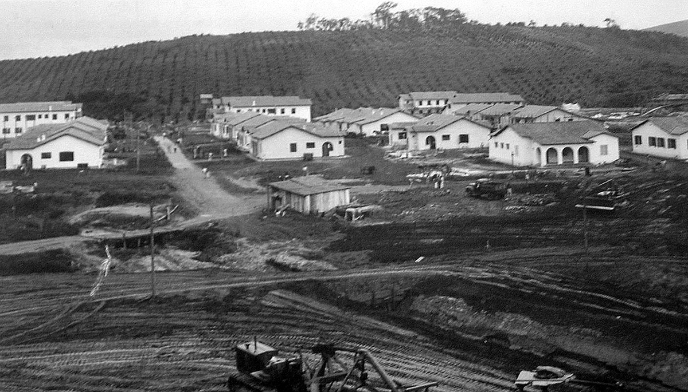

# Resumo

O planejamento urbano exerceu um papel relevante na expansão da rede
urbana brasileira na Era Vargas (1930-1945). As cidades passaram a
ser vitrines pedagógicas do que deveria ser o Brasil urbano. Na
mesma época iniciou-se uma nova fase de industrialização brasileira,
com a criação da Companhia Siderúrgica Nacional (CSN), em 1941.
Indústria e urbano estão na base do capitalismo nacionalista e da
modernidade racionalista, captados pelas ações empreendidas por
Vargas. O Plano Regional para o Médio Paraíba Fluminense e o Projeto
da Vila Operária da CSN em Volta Redonda, ambos elaborados pelo
arquiteto e urbanista Attílio Corrêa Lima, são o foco desta
reflexão, por revelar a importância que têm para a historiografia
sobre a temática urbano-industrial no período. Volta Redonda, antigo
distrito de Barra Mansa, foi sendo transformado em um centro urbano
de importância regional, com o adensamento industrial do Médio Vale
do Paraíba, no eixo Rio-São Paulo. A urgência na instalação da CSN e
a necessidade de construção da cidade para atender aos operários fez
com que a proposta original do Plano fosse divida. Entretanto, o
projeto da Vila Operária, construída para atender à usina, não
bastou para receber as habitações necessárias para abrigar os
operários da CSN. O Plano Regional visava preparar o espaço para as
intensas transformações que viriam com as industriais e o processo
de urbanização, com o intuito de planejar a ocupação do território,
sob grande demanda de mão de obra. Durante a execução do plano e
projeto Corrêa Lima externa denúncias de desvios que interferiam nos
mesmos e menciona os interesses econômicos e as pressões dos
proprietários de terras contra os planos, vista por ele como herança
fundiária perversa do lugar. As alterações e não execução do
planejamento, sujeito aos interesses do capital, deixaram um rastro
na região que se estende até o presente.

Palavras-chave: planejamento urbano, desenvolvimento regional, Era
Vargas, industrialização, CSN

# Abstract

The urban planning exerted a significant role in the expansion of
the Brazilian urban network in the Vargas age (1930-1945). At the
same time began a new phase of Brazilian industrialization, with the
creation of the Companhia Siderúrgica Nacional (CSN) in 1941.
Industry and urban were the foundations of nationalist capitalism
and rationalist modernity, captured by actions started by Vargas.
The Regional Plan for Médio Paraíba Fluminense and the Attílio
Corrêa Lima's Project of the Vila Operária in Volta Redonda, both
elaborated by this architect and urbanist are the focus of this
thought, because they represent to be important to the
historiography on the subject until these days. Volta Redonda, old
district of Barra Mansa, was being transformed into an urban center
of regional importance, with the industrial density of the Médio
Vale do Paraíba, in the Rio-São Paulo axis. The urgency in the
installation of the CSN and the need to build the city for the
workers' demands made the original proposal divided in two parts.
However, the Project of the Vila Operária, built to attend the
industry wasn\'t enough to answer adequately to the CSN's workers.
The Regional Plan was intended to prepare the space for the intense
transformations that come with the industries and urbanization
process in order to plan for the occupation of territory, under high
demand for labor. During the execution of the planning and the
project Attílio Corrêa Lima lights upon the deviates that interfered
in these instruments and mentions the economic interests involved,
in addition to the pressure from landowners against the plans, seen
by him as land inheritance perverse of the place. The changes and
the non-execution of the planning, submit to the interests of
capital, left a trail that extends to the present in this region.

Keywords: urban planning, regional development, Vargas Age, Brazil
industrialization, CSN

# Introdução

Na Era Vargas, entre 1930 e 1945, o planejamento urbano teve papel
relevante na expansão da rede urbana brasileira, na ocupação dos grandes
vazios territoriais existentes no país e na modernização das cidades.
Foram elaborados programas e planos que mobilizaram e conclamaram
arquitetos e engenheiros para responder às novas demandas, sendo a
principal delas o crescimento populacional das cidades. Cada nova
cidade, fábrica ou colônia agrícola teve caráter exemplar para os demais
lugares do país. As cidades passaram a ser vitrines pedagógicas do que
deveria ser o Brasil urbano, instrumentos de promoção do governo Vargas.

Na época, foram realizados importantes planos urbanísticos para as
capitais: Plano de Remodelação, Extensão e Embelezamento da Cidade do
Rio de Janeiro, de Alfred Agache, 1930; conjunto da Pampulha em Belo
Horizonte, 1943; plano de urbanização de Curitiba, também de Agache,
entre 1941-43 (parcialmente implantado); Plano de Grandes Avenidas de
Prestes Maia em São Paulo, 1930; três planos urbanísticos para Porto
Alegre, elaborados por Arnaldo Gladosch; quatro planos urbanísticos para
Recife, entre 1932 e 1942, com os de 1936 e 1942 de Attílio Corrêa Lima.

Em 1933 Corrêa Lima[^1] elaborou o plano original para Goiânia,
inspirado na Cidade-jardim de Ebenezer Howard. A nova capital de Goiás
foi inaugurada em 1940 e considerada exemplo de capital administrativa.

No Estado do Rio de Janeiro durante a década de 1940-50 houve a
exigência legal pelo governo estadual da realização de planos diretores
para os municípios. Ainda nessa década, o estado lançou o programa
"Plano de Urbanização das Cidades Fluminenses", dividindo o estado em
duas áreas de planejamento, cujas responsabilidades ficaram com os
escritórios estabelecidos no Rio de Janeiro: Attílio Corrêa Lima para o
Sul Fluminense e Coimbra Bueno e Companhia Ltda. para o Norte
Fluminense. Contudo segundo Azevedo (2012), a iniciativa oficial não
conseguiu instituir um efetivo processo de planejamento permanente.

Os planos desenvolvidos nesse período tinham uma abordagem mais
abrangente, conforme observado no estudo apresentado por Corrêa Lima
para o Plano Regional. Mas com o decorrer do tempo, foram sendo
priorizados planos setoriais, como habitação, transporte e saneamento.

Attílio Corrêa Lima trabalhou intensamente em projetos governamentais
durante o governo Vargas. Além dos mencionados anteriormente ele
realizou os projetos da Vila Operária da CSN (1941) e dos conjuntos
residenciais de grande porte em Várzea do Carmo e Heliópolis em São
Paulo (1943), e estava trabalhando no Plano Regional do Vale do Paraíba
Fluminense e no estudo para a Cidade dos Motores da Fábrica Nacional de
Motores (FNM, 1943), em Duque de Caxias-RJ. Porém, seu trabalho foi
abruptamente interrompido por um acidente aéreo em 27 de agosto de 1943,
que levou ao seu falecimento prematuro.

# A Implantação da Companhia Siderúrgica Nacional (CSN)

No Estado Novo (1937) o Presidente Getúlio Vargas afirma para a nação
que a siderúrgica seria indispensável para a criação da indústria de
base e a industrialização do Brasil. A proposta de implantação da CSN em
Volta Redonda, então distrito de Barra Mansa, transforma-se em projeto
de nacionalidade e paradigma urbano provido pelo Estado.

Após estudos iniciais foi formada em 1940 a Comissão Executiva do Plano
Siderúrgico[^2] com o objetivo de criar uma companhia nacional e
executar a construção da usina siderúrgica, estando sob direção direta
do presidente da república. Em 9 de abril de 1941 foi fundada no Rio de
Janeiro a CSN. A empresa serviu de modelo para a constituição da moderna
sociedade brasileira, associado tanto os aspectos econômicos,
industriais e tecnológicos, quanto a experiência nos campos social e do
urbanismo. Ela criou normas sociais com amplitude que ultrapassaram sua
atuação direta e desempenhou ações sociais em relação a seus empregados
e familiares (LOPES, 2003).

Na década de 1930-40 teve início a industrialização da região do Médio
Vale do Paraíba fluminense, concomitante com a chegada de trabalhadores
rurais deslocados de suas antigas funções, fruto do declínio do café.
Barra Mansa era polo de atração e crescimento, como importante
cruzamento ferroviário.

Fatores como os caminhos traçados para o escoamento do café, a
disponibilidade das ferrovias, a abundância de água garantida com o rio
Paraíba do Sul e de energia elétrica influenciaram na escolha do lugar.
Isto somado às articulações políticas para a implantação da CSN e ao
fato da região estar entre o Rio de Janeiro e São Paulo, cujo eixo já
respondia por 75% dos consumidores de aço, foram as razões
preponderantes para a escolha de Volta Redonda.

A proposta do complexo siderúrgico em Volta Redonda incluiu o projeto da
Vila Operária que lhe deu suporte, construídos em conjunto segundo
modelo modernizante, enquanto símbolo e síntese do pensamento
nacionalista de Vargas e do Estado Novo, que também visava uma profunda
reforma administrativa e política.

Em 1940 o governo do Estado do Rio de Janeiro decide solicitar ao
arquiteto e urbanista Attílio Corrêa Lima uma proposta de trabalho para
a urbanização das áreas que sofreriam impactos mais imediatos com
implantação da siderúrgica. Não bastavam construir habitações para os
operários, era necessário preparar o espaço para receber a grande usina
planejando a ocupação do território que certamente teria forte demanda.
O plano regional seria o modelo de cidade do Estado Novo para outros
lugares de industrialização futura.

A proposta inicial foi entregue por Corrêa Lima no final de 1940 e
incluía um plano regional que abrangeria 25 km^2^, estendendo-se 18 km
de Barra Mansa até a Vila de Pinheiros, em Piraí, com a usina ao centro,
em Volta Redonda[^3]. A proposta incluía:

-   Plano de conjunto: localizando as futuras indústrias, núcleos
    urbanos, lavouras, sistema viário, reserva florestal, entre outros;

-   Plano de urbanização de Barra Mansa: previa a remodelação da cidade
    e sua extensão racional, de acordo com as tendências locais e
    adaptação as condições futuras pela convergência de capitais
    industriais atraídos pela siderúrgica;

-   Projeto da Vila Operária para Volta Redonda -- prevendo o máximo
    rendimento e conforto e o mínimo de despesas e manutenção,
    estabelecendo categorias e tipos de habitação, equipamentos urbanos,
    centro comercial e infraestruturas.

No entanto, a urgência na instalação da CSN e o interesse da Comissão do
Plano Siderúrgico na construção da cidade para atender aos operários fez
com que a proposta fosse divida em duas. O plano do Vila Operária da CSN
teria sua elaboração imediata, sob responsabilidade da comissão,
enquanto os demais itens da proposta de Corrêa Lima, incluindo o plano
regional, seriam objeto de contrato efetivo com o Estado do Rio de
Janeiro em maio de 1941.

# O Projeto da Vila Operária da CSN

O projeto traçado da Vila Operária de Volta Redonda, construída para
atender a usina, é facilmente inidentificável. Na elaboração do projeto
Corrêa Lima seguiu os preceitos racionalistas, com as funções urbanas
separadas e bem definidas: habitar, trabalhar, recrear e circular. Isto
induzia à especialização das áreas e ao ordenamento racional dos fluxos,
com vias claramente hierarquizadas, separando, inclusive, o trânsito
local das demais circulações.

{width="3.75in"
height="4.71875in"}

Figura 1. O plano urbanístico e a planta industrial da usina eram
apresentadas em um plano geral. Fonte: LOPES, 2003.

A divisão das funções urbanas pode ser facilmente percebida na planta do
plano geral. A usina foi planejada junto à margem direita do rio Paraíba
do Sul[^4]. A área comercial foi localizada junto à usina, separando os
setores fabril ao norte e residencial ao sul. O antigo povoado da
estação, localizado no extremo leste, também foi referenciado no plano.
O higienismo de então era requisitado tanto para as construções quanto
para os padrões e regulamentos de uso dos espaços públicos e privados.

No centro da área comercial foi projetada uma via larga destinada ao
comércio (Rua 14), com edificações de dois pavimentos construídos sobre
galerias cobertas no térreo. No extremo oeste desta rua comercial foi
indicado o local para o edifício da prefeitura, próximo à entrada da
usina. Neste local foi posteriormente edificado o escritório central da
CSN, sede da indústria. O plano previa ainda a construção de um
cineteatro na área comercial. Provisoriamente foi edificado um cinema
chamado de Poeirinha pelo trabalhadores.

O projeto previa hospital, posto saúde e escola, equipamentos de lazer e
áreas verdes. Os equipamentos médicos (hospital e ambulatório), foram
localizados à leste, no sopé do morro do Laranjal. No extremo sul da
ocupação foi prevista uma escola mista junto ao parque e uma creche
localizada ao lado do centro comercial, no caminho entre a área
residencial e a entrada principal da usina. Um hotel comercial foi
previsto próximo à então estação ferroviária e, um outro, para atender
aos estrangeiros foi planejando no alto de um morro à oeste, onde se vê
a usina e a cidade. Não foram planejados equipamentos policiais,
presídio e nem cemitério. Já uma igreja católica foi implantada no alto
de uma elevação, fruto da presença do catolicismo na cultura e política
nacionais.

A estação ferroviária da EFCB[^5] não recebeu muito destaque no plano. A
antiga estação e os edifícios no entorno foram demolidos, sendo
eliminados ainda antigos caminhos.

Próximo à área da estação foi planejado a implantação dos acampamentos
provisórios, com edificações elaboradas em *kits* pré-fabricados de
madeira vindos de trem do Paraná. No canteiro de obras foram construídas
centenas de habitações coletivas também de madeira, além de escritórios,
restaurantes, hospital provisório, instalações de apoio a extração de
matérias primas básicas disponíveis no local e uma central de concreto.
As instalações foram dotadas de infraestruturas básicas de saneamento e
energia.

À oeste também foi edificado um bairro-acampamento para os operários
menos qualificados, chamado Rústico com casas de pau-a-pique, com
supervisão sanitária de especialistas, comprovando o avanço deste tipo
de habitação no país que já era utilizado desde o tempo do Brasil
colônia.

Os extratos sociais se distanciavam nos espaços segundo as categorias
profissionais e o padrão salarial. Isto pode ser percebido no plano, que
evidencia a segregação residencial, com a estratificação social
acompanhando a topografia. Ela se revelava pelo tamanho dos lotes e das
tipologias residenciais: quanto mais alto o cargo ocupado na empresa,
mais distante da usina e mais alta era a localização da residência.

Os bairros mais altos, o Laranjal à leste foi destinado aos técnicos e
diretores da empresa, assim como o Hotel Bela Vista à oeste que
hospedavam os consultores norte-americanos. Os dois bairros eram
exceções à regra de preservar os morros como áreas de reflorestamento. O
perfil dos profissionais passava por consultores, engenheiros e técnicos
especializados até chegar a base, em que os chamados "arigós"
despenhavam os serviços mais desqualificados (LOPES, 2003).

Por outro lado, no bairro Conforto localizado imediatamente à frente da
usina, os operários conviviam com a poluição. E a sede da Fazenda Santa
Cecília, preservada e situada num vale afastado da Usina, servia como
residência do presidente da CSN.

A questão habitacional foi alvo de debate na época. A discussão se
dividia entre as tipologias da habitação -- casa unifamiliar versus
edifício multifamiliar --, envolvendo aspectos das relações entre
arquitetura e cultura. Corrêa Lima preferia edifícios multifamiliares,
mas a direção da CSN considerava a casa térrea como a tipologia mais
propícia aos hábitos daquela época. Daí, a escolha das casas individuais
e, dessa forma, o modelo não estava relacionado apenas ao moderno
(LOPES, 2003). Mesmo os bairros voltados para os operários menos
qualificados possuíam padrões de habitação superiores aos da média das
habitações brasileiras, contando com infraestruturas e arborização, além
dos serviços de manutenção então prestados pela CSN, mantendo-se os
alugueis do imóveis com valores simbólicos.

O plano estabelecia ainda um cinturão verde na margem esquerda do rio
Paraíba, com o reflorestamento dos morros de forma a desestimular a
ocupação nas encostas, para onde o vento levava a poluição. Ao mesmo
tempo, o espaço urbano seria muito arborizado, com um grande parque que
atravessaria a cidade, acompanhando o eixo do ribeirão Cachoeira, que
foi retificado. Posteriormente foram construídas próximas ao parque as
instalações esportivas, o Recreio do Trabalhador. A ênfase no esporte e
nas celebrações civis e militares ia ao encontro da construção integral
do homem novo.

O Presidente Vargas destacava em seus discursos a importância de
orientar a produção do campo para o atendimento das áreas urbanas.
Assim, o potencial agropecuário seria desenvolvido na Fazenda Santa
Cecília, com sua produção incrementada para abastecer a força de
trabalho industrial.

A CSN e a Vila Operária foram edificadas segundo um "modelo autárquico"
típico das cidades monoindustriais. A empresa utilizava diversas
estratégias para educar, vigiar e controlar o trabalhador dentro e fora
da fábrica. E a Vila foi construída à imagem e semelhança da usina:
casas, serviços, lazer, áreas públicas e privadas, oferecidas como
desdobramentos da fábrica. O sistema numérico das ruas permitia a
rigorosa definição da posição de cada elemento na Vila Operária. Havia,
assim, um duplo controle dos trabalhadores. A presença da usina com seus
enormes galpões marcam a paisagem da cidade, observados de todas as
perspectivas.

Vila e Usina simbolicamente se integravam e completavam, crescendo
juntas como uma única unidade espacial e, neste sentido, com disciplina
na forma de aglomeração da massa trabalhadora, diferente das vilas
fabris tradicionais (SOUZA, 1992).

{width="4.71875in"
height="2.6979166666666665in"}

Figura 2. Construção da Vila Operária, maio/1942. Fonte: MOREIRA;
BRANDT, 2005.

A mão de obra para a construção da usina foi sempre crescente, sendo 762
trabalhadores em 1941, chegando a 6.164 em 1942 e atingindo 13 mil
durante a década de 1940-50. No segundo semestre de 1943 foram entregues
as primeiras 462 habitações da Vila Operária e começaram a circular
ônibus da CSN com transporte coletivo. Em março de 1942 a CSN já contava
com 3.850 empregados, enquanto a população da cidade era estimada em 10
mil habitantes. Em 1946, ano do início da operação da usina, esses
números eram de 11.719 empregados da CSN e 26.507 habitantes na cidade.
Em 1948, ano da inauguração, eram 3.003 habitações na Vila Operária,
sendo interrompida a construção das moradias. Foi levantada uma cerca
marcando o perímetro da usina.

# O Plano Regional

O contrato entre Corrêa Lima e Estado do Rio de Janeiro para elaboração
do Plano Regional de Urbanização de Barra Mansa e da Vila de Pinheiros
foi assinado em maio de 1941[^6]. O plano buscava dar orientação
urbanística de modo à combater os impactos esperados pela implantação do
projeto siderúrgico, o que justificou seus amplos propósitos. Os
objetivos principais do plano eram de planejar e ordenar as ocupações,
remodelando as partes urbanas e adaptando as condições futuras para
servir como centro de expansão e convergências de capitais e novas
indústrias, a serem atraídos em decorrência da implantação da usina
siderúrgica em Volta Redonda.

O plano deveria também expandir a urbanização até a Vila de Pinheiros,
melhorando a conexão entre os centros urbanos existentes, estabelecendo
o local das futuras indústrias, núcleos de habitação, pequenas lavouras,
rede de viação, reservas florestal, entre outros. Este plano deveria
conter a sistematização e coordenação dos antigos e novos setores da
vida urbana, observado o trânsito, comunicações, zoneamento e
legislação.

O escopo do plano abrangia o levantamento planimétrico da região tendo
como eixo a estrada de rodagem com 18km de extensão que ligava Barra
Mansa à Pinheiros, levantamento topográfico semi-expedito do eixo e de
precisão da cidade de Barra Mansa e da Vila de Pinheiros[^7]. Foram
utilizados ainda os levantamentos realizados para a construção da Vila
Operária em Volta Redonda. Posteriormente parte deste levantamento foi
entregue à Prefeitura de Barra Mansa. Acompanhando o plano viria um
memorial descritivo, proposta de legislação para o zoneamento e reservas
florestais, Código de Obras e Urbanismo e o plano de financiamento das
obras (PAULA, 2009).

A partir do levantamento seriam produzidas as plantas cadastrais da
cidade e, em seguida, deveriam ser elaborado por Corrêa Lima o plano de
ligação entre Barra Mansa e Pinheiros, conectando ambos ao então
distrito de Volta Redonda, localizado entre os dois núcleos urbanos.

{width="2.0833333333333335in"
height="4.770833333333333in"}

Figura 3. Montagem das Folhas VI e VII do Levantamento Planimétrico em
escala 1/5000. Só foram encontradas as folhas referentes ao município de
Barra Mansa. Fonte: PAULA, 2009.

Em Barra Mansa o plano previa um conjunto de alamedas, sendo que a
principal acompanhava o sentido do rio Paraíba do Sul e as demais seriam
transversais a primeira, conectando equipamentos urbanos e acessos à
cidade. As alamedas foram projetadas com canteiros centrais arborizados,
dividindo os fluxos e trazendo conforto nas proximidades da margem do
rio, qualificando a via que seguiria linearmente em direção a outras
centralidades urbanas. O projeto das alamedas tinha influência do modelo
da Cidade-jardim (PAULA, 2009).

A grande alameda principal ajardinada seria iniciada no extremo norte de
Barra Mansa, em uma grande rotatória, e nortearia todo o plano de
urbanização deste município, localizada entre rio Paraíba e a via
férrea. Após o centro urbano de Barra Mansa esta alameda continuaria
numa faixa estreita entre a ferrovia e o rio, em direção ao distrito de
Volta Redonda, encontrando o projeto da Vila Operária da CSN.
Posteriormente esta via seguiria ao longo do rio até a Vila de
Pinheiros. Segundo Paula (2009) esta via tinha o objetivo claro de
desenvolver a margem direita do rio Paraíba, mas sem competir com a
ferrovia.

A partir desta via principal surgiriam alamedas transversais menores que
penetravam a cidade, absorvendo o fluxo nos pontos estratégicos, junto
aos edifícios públicos ou cruzando a via férrea para alcançar caminhos
que levam para fora da cidade. O urbanista indicou no plano os locais
para a implantação de equipamentos, como o mercado municipal e a estação
rodoviária, construída posteriormente.

O Código de Obras de Barra Mansa elaborado por Corrêa Lima era parte
integrante do plano regional e foi promulgado em 1945. Este baseava-se
nos modelos europeus de cidade, prevendo afastamentos mínimos das
edificações, frontal e laterais, o que proporciona maior ventilação e
conforto térmico e melhorava a qualidade de vida urbana.

Entretanto, as obras de execução do plano regional em Barra Mansa foram
interrompidas com a fim do Estado Novo e a mudança do governo municipal
em 1945. O único componente do plano regional que permaneceu foi o
código de obras.

Durante um período Corrêa Lima desempenhou um duplo papel ao acompanhar
a materialização do projeto de Volta Redonda e atuar junto à Prefeitura
de Barra Mansa na elaboração de parte do plano regional. Nesta
prefeitura o urbanista ficou por um tempo como responsável por aprovar
os projetos de obras particulares, tanto no município quanto no distrito
de Volta Redonda. Contudo, este não consegui influir ou antecipar as
transformações urbanas que estavam acontecendo (LOPES, 2003).

# Desenvolvimento e Conflitos Urbanos

Em um primeiro momento a CSN centralizava e dirigia o desenvolvimento,
implantando e administrando a usina e o núcleo urbano entre 1941 e 1954,
ano de emancipação de Volta Redonda. Ela também mantinha patrimônio,
equipamentos e mobiliário urbano. A empresa divulgava as "facilidades"
oferecidas na Vila Operária.

E na transformação dos antigos trabalhadores rurais em operários urbanos
eram passadas instruções de uso dos espaços públicos e privados. A
utilização das habitações era ensinada às mulheres, sendo impostos
padrões funcionais, higiênicos e de comportamento que se estendiam às
festas, diversões e comemorações, no convívio da vizinhança.

Porém, a tranquilidade da cidade contrastava com o trabalho duro, no
ambiente opressor da Usina. O tempo e os hábitos cotidianos eram ditados
pelo cartão de ponto, que controlava as horas trabalhadas nos três
turnos ininterruptos.

Na Vila Operária, território da CSN, era mantido um controle quase que
absoluto da vida social. Para garantir a ordem a empresa dispunha de uma
polícia própria com controle fortemente militarizado, tanto na usina
quanto na cidade. Trabalhadores tiveram problemas psicológicos motivados
pelo rígido controle e pelo fato da usina ser vista de toda a Vila
Operária. Técnicos que deixaram o lugar comparavam Volta Redonda a uma
guarnição militar (SOUZA, 1992).

Também nos equipamentos de esporte e lazer a disciplina da usina estava
presente, organizando o cotidiano. Em documentos e publicações, a CSN se
refere à "família siderúrgica" como meio de "criar" laços sociais entre
dirigentes e operários, passando a ideia do Estado neutro, acima das
classes sociais, que confere benefícios e zela pela população (MOREIRA,
2003).

Como a oferta de residências pela CSN era ínfima em relação à demanda de
seus operários, surge paralela à Vila Operária a "Cidade Livre", que
abrigava aqueles menos qualificados e os desmobilizados com o término da
construção. Na margem esquerda do rio Paraíba em Volta Redonda e em
Barra Mansa se desenvolveu uma cidade pobre e não planejada, com
crescimento acelerado e desvinculada dos interesses diretos da CSN.
Nesse ambiente urbano confuso cresceu a especulação imobiliária, com
loteamentos sem respeito à legislação urbanística, sem infraestrutura,
arruamentos, calçadas e alinhamentos. No caso de Volta Redonda, apesar
de contemporânea à Vila planejada, esta parte da cidade era chamada
"Cidade Velha", pelos aspectos das ruas e casas, notadamente de padrões
mais baixos e manutenção precária.

Atíllio Corrêa Lima denunciou de forma contundente os rumos do processo
de urbanização ao Prefeito de Barra Mansa, dirigindo uma carta em abril
de 1943 lembrando que o projeto da cidade industrial de Volta Redonda
tratava-se de um "núcleo urbano racional". Posteriormente, enviou outra
carta, desta vez dirigida ao Secretário de Viação e Obras Públicas do
Estado. Nela, o urbanista renovou suas denúncias e mencionara os
interesses econômicos envolvidos e as pressões dos proprietários de
terras contra os planos de Volta Redonda e o regional em elaboração, que
na sua visão eram influências perversas da herança fundiária (LOPES,
2003).

Mas ao mesmo tempo, a CSN colaborava com materiais para a montagem de
barracos, fazendo vista grossa aos excluídos e tentando mitigar as
emergências e tensões sociais por não conseguir fornecer abrigo em
número suficiente para os seus empregados. Consequentemente, a empresa
colaborava indiretamente para expansão desenfreada que Corrêa Lima
fortemente denunciou até a vésperas de sua morte.

A não adoção do planejamento levou à ocupação das áreas mais distantes e
periféricas de difícil acesso, com loteamentos clandestinos nos terrenos
das antigas e decadentes fazendas de café, bem como ocupações
irregulares, principalmente nas encostas dos morros e margens de rios.
E, assim, em 1949 surgem as primeiras favelas de Volta Redonda, as então
chamadas Morro dos Atrevidos e Vila dos Índios, relacionadas à
desmobilização dos trabalhadores da construção civil (LOPES, 2003).
Essas ocupações foram sendo adensadas, desafiavam o controle urbanístico
e dando origem a comunidades segregadas e conflitos sociais e culturais
que perduram até hoje.

# Referências Bibliografias

AZEVEDO, Marlice Nazareth Soares. O espaço fluminense e a intervenção
urbana no Estado Novo. In: REZENDE, Vera (Org.). *Urbanismo na Era
Vargas: a transformação das cidades brasileiras.* Niterói:
EdUFF/Intertexto, 2012. p.177-196.

BENTES, Júlio Cláudio Gama.; COSTA, Maria de Lourdes P. M. A
Cidade-Empresa e a Empresa na Cidade: Volta Redonda e a Companhia
Siderúrgica Nacional. In: X SEMINÁRIO DE HISTÓRIA DA CIDADE E DO
URBANISMO -- X SHCU*.* *Anais.* Recife: UFPE,2008, CD-ROM.

MOREIRA, Regina da Luz.; BRANDY, Maurette. *CSN um sonho feito de aço e
ousadia*. Rio de Janeiro: CSN/CPDOC-FGV, 2005.

MOREIRA, Ruy. Ascensão e Crise de Paradigma Disciplinar.
In:\_\_\_\_\_\_. *A Reestruturação Industrial e Espacial do Estado do
Rio de Janeiro.* Niterói: GERET/NEGET/GECEL,2003.

# LOPES, Alberto Costa. *A aventura da forma: urbanismo e utopia em Volta Redonda.* Rio de Janeiro: E-papers,2003.

PAULA, Aloísio Lélis. *O Papel da Ferrovia na Configuração do Território
de Barra Mansa-RJ.* Dissertação de Mestrado, UFF/PPGAU, Niterói,2009.

PIQUET, Rosélia. *Cidade-Empresa: presença na paisagem urbana
brasileira*. Rio de Janeiro: Jorge Zahar, 1998.

SOUZA, Cláudia Virgínia Cabral. *Pelo Espaço da Cidade: aspectos da vida
e do conflito urbano em Volta Redonda.* Dissertação de Mestrado,
UFRJ/IPPUR, Rio de Janeiro,1992.

[^1]: Attílio Corrêa Lima se formou engenheiro-arquiteto na Escola
    Nacional de Belas Artes (ENBA) em 1925 e tornou-se urbanista pelo
    Instituto de Urbanismo da Universidade de Paris, retornado ao Brasil
    em 1931. Durante o período vivido na França foi realizado o primeiro
    Congresso Internacional de Arquitetura Moderna (CIAM), em que foram
    afirmados os ideários do urbanismo racionalista.

[^2]: Comissão formada em 04/03/1940.

[^3]: "Proposta para o Estudo do Plano Regional de Urbanismo para Volta
    Redonda, no Vale do Paraíba, onde será instalada a Usina
    Siderúrgica", datada de 25 de dezembro de 1940, destinada ao
    Secretário de Viação e Obras Públicas do Estado do Rio de Janeiro. O
    atual município de Pinheiral naquela época era a vila de Pinheiros.

[^4]: O projeto da siderúrgica foi elaborado pela empresa
    norte-americana Arthur G. Mc.Kee & Co.

[^5]: E.F. Central do Brasil.

[^6]: Diário Oficial, 11/05/1941.

[^7]: Este levantamento foi realizado pelo Escritório Técnico de
    Topografia e Urbanismo de Niterói, junho/1941.
