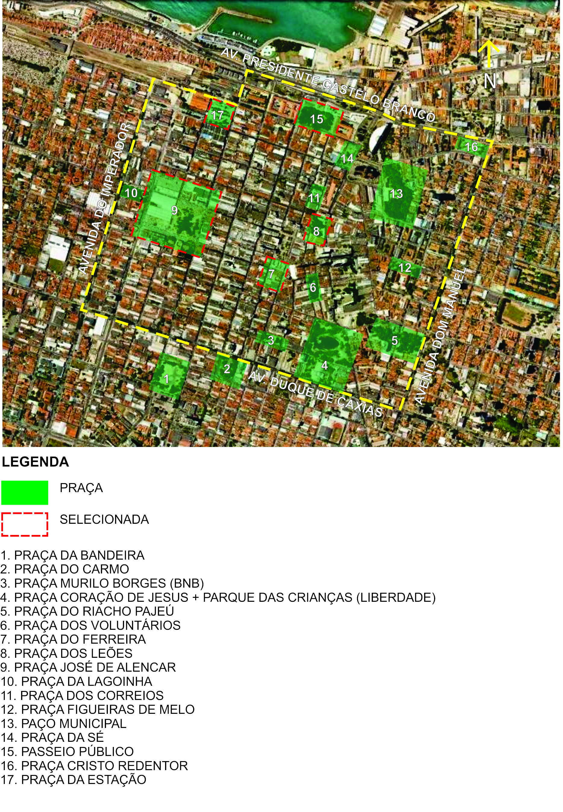

# Resumo

A incursão sobre a área histórica do centro de Fortaleza revela uma
herança patrimonial bastante relevante, tanto em aspectos arquitetônicos
quanto urbanísticos. Utilizando-se do referencial teórico-metodológico
da morfologia e história urbana de autores como Aldo Rossi (2001) e José
Lamas (2010), foi possível, em um percurso predefinido, identificar no
acervo patrimonial existente, temporalidades e espacialidades que
possibilitam a leitura de uma história da forma urbana desta área. A
análise perpassa sobre os elementos categorizados em fatos urbanos e
fatos arquitetônicos, reconhecendo-os através de uma parte da rede de
praças do bairro (Praça do Ferreira, Praça José de Alencar, Praça dos
Leões, Passeio Público e Praça da Estação). A partir desse estudo, foi
possível a compreensão dos elementos responsáveis pela formação urbana
da área central fortalezense.

Palavras-chave: patrimônio cultural, morfologia urbana, história urbana,
centro da cidade de Fortaleza

# Abstract

The route of the historic area of the Fortaleza downtown reveals a very
important heritage asset , both as architectural and urban aspects .
Relying on the theoretical and methodological references of urban
history and morphology of authors such as Aldo Rossi (2001) and José
Lamas (2010), was possible in a pre-established route to identify the
existing asset base , temporality and spatiality that makes possible a
reading of an urban historical form in this area . The analysis goes
through on the categorized elements in urban and architectural facts ,
recognizing them through a part of the network of neighborhood squares
(Square Ferreira, José de Alencar Square, Square of Lions, Public
Promenade and Station Square). From this study , it was possible to
understand the factors responsible for the urban formation of the
central area of Fortaleza.

Keywords: cultural heritage, urban morphology, urban history , Fortaleza
downtown

## Introdução

O presente artigo objetiva analisar a área central de Fortaleza, sob o
enfoque teórico-metodológico da morfologia urbana e da história urbana
presente na obra de Lamas (2011) e de Rossi (2001), visando compreender
as relações existentes entre arquitetura e cidade para identificar os
valores patrimoniais encontrados nessa área, repleta de significados e
simbologia para a memória da cidade, a partir do processo de construção
e apreensão das diversas temporalidades e espacialidades materializadas
nos edifícios e espaços urbanos remanescentes.

Foi realizada uma análise na área delimitada para que se possa
compreender as dinâmicas existentes em cada trecho. Setorizou-se o
bairro com base nas praças, pois se percebe que há nesses sistemas de
espaços públicos um trajeto que remonta à história urbana da cidade e
que em seu entorno há os marcos edificados (fatos arquitetônicos).
Grande parte desses bens culturais encontra-se protegidos pelas
instâncias governamentais, havendo dessa forma o reconhecimento
institucional sobre a representatividade desses equipamentos. A escolha
por esse percurso se fez pois eles foram implementados no período de
consolidação de Fortaleza como centro hegemônico do Ceará conhecido por
Fortaleza *Belle Époque* (1850-1930).

O bairro é o "marco zero" fortalezense e passa por um processo de
esvaziamento e degradação assim como boa parte das áreas centrais das
demais capitais brasileiras. Sua arquitetura e seu traçado urbano são
testemunhos das transformações e permanências vivenciadas ao longo dos
quase 288 anos de fundação.

O trecho delimitado para o presente estudo compreende as avenidas do
Imperador, Duque de Caxias, Dom Manuel e Presidente Castelo Branco, pois
se acredita que nesse recorte há uma representatividade do objeto de
trabalho. (Figura 1)

{width="5.770833333333333in"
height="4.375in"}

Figura 1. Trecho do bairro Centro a ser analisado. Fonte: Base Google
Earth adaptada pela autora, 2014.

## A Cidade como Arquitetura: morfologia urbana e arquitetônica

Identificar os valores patrimoniais arquitetônicos e urbanísticos na
área central de Fortaleza requer a análise conjunta do acervo edificado,
com o traçado urbano e os acontecimentos que permearam a consolidação
dessa herança para os dias atuais.

Na perspectiva de Rossi (1977) morfologia urbana define-se como "o
estudo das formas da cidade". Para compreender a produção dessas formas,
é necessário o aporte de outros campos disciplinares que possuem
interfaces com o campo disciplinar da arquitetura e urbanismo, tais
como: Geografia, Sociologia, Economia e Antropologia.

Na obra de Rossi (2001), o autor analisa a cidade através de dois
olhares: o primeiro consiste em considerá-la como um artefato
arquitetônico e o segundo, seria compreendê-la através do estudo de seus
entornos, de seus fatos urbanos (elementos que constituem a estrutura da
cidade).

Outra consideração abordada por Rossi é sobre o significado das
permanências no tempo presente, que se constituem como um passado que é
ainda experimentado no momento atual. A identificação dessas
permanências dar-se-á através dos monumentos, das edificações, do
traçado urbano e do plano. É por meio dessas permanências que a história
urbana pode ser comprovada e recontada.

Dialogando com Lamas (2011), entende-se que a cidade pode ser lida como
um objeto arquitetônico, fato corroborado com a seguinte passagem:

À morfologia urbana interessam, em primeiro lugar, os instrumentos de
leitura urbanísticos e arquitecturais -- partindo do princípio de que as
disciplinas de concepção do espaço têm instrumentos de leitura que lhes
são próprios: a leitura da cidade como facto arquitectural.(LAMAS, 2011
p.41)

Para o autor, o significado de forma urbana seria o meio urbano
apreendido como uma arquitetura, ou seja, uma série de equipamentos
arquitetônicos correlacionados pelo espaço. Conclui que forma é,

> aspecto da realidade, ou modo como se organizam os elementos
> morfológicos que constituem e definem o espaço urbano, relativamente à
> materialização dos aspectos de organização funcional e quantitativa e
> dos aspectos qualitativos e figurativos. (LAMAS, 2011, p.44)

Desta forma há uma fragmentação dos elementos da análise da morfologia
urbana a partir de escalas existindo uma analogia com a arquitetura,
correlacionando os elementos arquitetônicos com os urbanísticos. Nessa
leitura da urbe é considerada a "passagem do tempo", ou seja, as marcas
que o tempo histórico imprime na forma urbana. Ele trabalha com o
conceito de elementos morfológicos identificáveis, que são aqueles
essenciais que compõem a forma urbana. São considerados esses
componentes: o solo, os edifícios, o lote, a fachada, o logradouro, o
traçado (rua), a praça, o monumento, a vegetação e o mobiliário urbano.

## Fortaleza e seus percursos

A colonização cearense se procedeu a partir dos sertões, ao longo do
século XVII, através da dinâmica da pecuária e da agricultura que
promoveram a permanência de habitantes. Nesse contexto, as vilas que
apresentavam destaque no cenário da capitania eram aquelas que estavam
inseridas nessa conjuntura.

Fortaleza, um povoado que surgiu às margens do Forte de Nossa Senhora de
Assunção, foi elevada a categoria de vila em 1726, e recebeu por
imposição da Coroa portuguesa, a função de sede administrativa da
capitania do Ceará. A vila como núcleo administrativo possuía uma
importância socioeconômica diminuta nesse período, pois não estava no
foco da dinâmica econômica.

A hegemonia de Fortaleza como o núcleo urbano foi iniciada somente a
partir de meados do século XIX e teve sua consolidação na segunda metade
deste mesmo século. A emancipação do Ceará diante de Pernambuco em 1799
foi um dos fatores decisivos nesse processo, pois foi necessário dotar a
vila com a infraestrutura condizente ao status e função de sede
político-administrativa.

Na segunda metade do século XIX, Fortaleza assim como boa parte das
cidades brasileiras, sofreu transformações arquitetônicas e urbanísticas
que objetivam a inserção do padrão das cidades modernas europeias em
detrimento da morfologia urbana e da arquitetura civil colonial. Durante
esse momento foi edificado grande parte do acervo arquitetônico de
interesse patrimonial remanescente nos dias atuais, como,

(\...) Santa Casa de Misericórdia (1861), Cadeia Pública (1866),
Assembléia Legislativa (1871), Asilo de Mendicidade (1877), Escola
Normal (1884), Quartel do Batalhão de Segurança (1880), Estação da
Estrada de Ferro de Baturité (1880), além dos mais antigos, como o
Palácio do Governo, Mercado Público, Palácio Episcopal, Tesouraria da
Fazenda (1895), conferiram a Fortaleza a marca de capital da Província.
(LEMENHE, 1991, p.123)

Seguindo os princípios urbanísticos europeus do século XIX baseado na
tríade de embelezamento, fluidez e higienização, Fortaleza recebe
intervenções em seu desenho urbano. O traçado xadrez de 1818, elaborado
pelo engenheiro Silva Paulet (Planta da Villa e Porto da Fortaleza) foi
consolidado por Adolfo Herbster, que a este acrescenta três *boulevards*
(atuais avenidas Dom Manuel, Duque de Caxias e Imperador), a funcionarem
como os vetores de expansão e os limites da cidade.

O bairro possuía uma rica efervescência até meados do século XX.
Paulatinamente nas últimas décadas vem assistindo um esvaziamento com um
caráter predominantemente comercial, atividade que algumas vezes se
torna predatória dos espaços públicos (praças e ruas) e do conjunto
arquitetônico, que se transforma em estacionamentos ou quando são
descaracterizados.

Apesar do monopólio do comércio, foi louvável a iniciativa da Prefeitura
Municipal de Fortaleza em retornar ao antigo paço, na área central. Há
ainda algumas outras instituições que tem sede no Centro, como Iphan
(Instituto do Patrimônio Histórico Artístico e Nacional), DNOCS
(Departamento Nacional de Obras Contra as Secas),Sefaz (Secretaria da
Fazenda do Ceará) entre outras.

Os equipamentos voltados ao lazer e entretenimento no bairro necessitam
de intervenções. Eles são marcantes na memória dos fortalezenses, como o
Cine São Luiz e o Theatro José de Alencar, ambos exerceram papéis
fundamentais na formação cultural da cidade, e que por falta de gestão e
de recursos, entraram num processo de degradação.

A análise se inicia pela Praça do Ferreira, seguindo pelas praças José
de Alencar, General Tibúrcio (dos Leões), Passeio Público e finaliza na
Praça Castro Carreira (da Estação).(Figura 2)

{width="5.770833333333333in"
height="8.09375in"}

Figura 2. Sistema de praças do Centro de Fortaleza.Fonte: Base Google
Earth adaptado pela autora, 2014

## Praça do Ferreira

Considerada o "Coração do Centro", foi nomeada em homenagem ao político
Boticário Ferreira, responsável pela ordem de urbanizar o espaço em
1871.

O lugar possui em seu entorno uma série de edificações que compõem uma
multiplicidade dos estilos arquitetônicos que perpassaram não só na
história de Fortaleza, como também, a do Brasil. Há diversos exemplares
em bom estado de *artdéco*, eclético e moderno. Embora essas edificações
estejam bem conservadas, com a unidade potencialpresente, estão
mascaradas por letreiros ou por cores fortes que não se enquadram no
padrão adequado que ressaltaria a ambiência requerida pelo lugar. Sobre
isso, na Carta de Brasília de 1995 aborda que,

(\...) é necessário criar normas especiais que assegurem a manutenção do
entorno primitivo, quando for possível, ou que gerem relações harmônicas
de massa, textura e cor. (CONE SUL, 1995, p.326)

{width="5.760416666666667in"
height="3.3854166666666665in"}

Figura 3. Praça do Ferreira. Fonte: sobralcultural.blogspot.com.br

A praça foi objeto de intervenções em 1991, projeto dos arquitetos
Delberg Ponce de Leon e Fausto Nilo que buscou remontar diversos
elementos simbólicos das várias fases da praça. (Figura 3)

Um dos fatos arquitetônicos mais marcantes é o Cine São Luiz de 1958.
Foi tombado em 1991 pela Secultfor (Secretaria de Cultura de Fortaleza).
Sua arquitetura é representativa do estilo *art déco*. O térreo, onde
funcionava o cinema, está sendo restaurado com previsão de ser entregue
no segundo semestre de 2014. Nos andares superiores está funcionando a
Secult (Secretaria da Cultura), órgão de proteção cultural do estado.

Uma edificação bastante representativa do estilo eclético adjacente à
praça é o Palacete Ceará. Foi edificado nos anos de 1920. Em 1982, foi
vítima de um incêndio e seu espaço interior foi destruído, as fachadas
resistiram ao incidente e no ano seguinte, como medida de salvaguarda,
teve seu tombamento estadual decretado.

O Hotel Excelsior é um dos principais marcos da praça. Foi erguido onde
antigamente se localizava o Hotel Central. Desde 1987, a edificação não
funciona com a função original. Inaugurado em 1932, era a mais alta
torre de Fortaleza. O seu terraço era panorâmico, onde se podiam avistar
as serras ao sul e o mar ao norte. É conhecido na contemporaneidade
pelas canções natalinas entoadas pelas crianças durante as festividades
de final de ano.

A Farmácia Oswaldo Cruz fundada em 1934 é um dos pontos comerciais mais
tradicionais da cidade. A edificação de 1927 se encontra em processo de
tombamento municipal.

Há mais duas edificações verticalizadas na praça. O Hotel Savanah e o
Edifício Sul América. O hotel em traços modernistas e inaugurado em
1963. Em 1983 foi fechado. Atualmente o imóvel está sendo adaptado para
receber uma filial da Faculdade Maurício de Nassau. Infelizmente somente
a volumetria que está sendo preservada. O Sul América foi inaugurado em
1953, com cerca de dez pavimentos e em traços do *artdéco*. Pertencia ao
grupo Sul América até 1968, quando foi revendido, mas permanecendo o uso
comercial no imóvel.

A malha urbana sofreu alterações significativas, o plano de Hélio
Modesto em 1962, propôs a transformação das ruas convencionais Guilherme
Rocha e Liberato Barroso, em vias pedonais. Dessa maneira o logradouro
adquiriu maiores contornos.

## Praça José de Alencar

O espaço público foi aformoseado em 1903. Devido aos protestos contra o
governo do oligarca Nogueira Accioly, em 1912, o lugar foi alvo
depredações, necessitando ser remodelada posteriormente. A praça na
década de 1970 funcionava como um terminal de ônibus, formando um dos
primeiros terminais de porte da capital cearense. Essa intervenção
acarretou na degradação do ambiente urbano, desvalorizando um bem
notoriamente relevante.

O Theatro José de Alencar é um dos símbolos mais conhecidos de Fortaleza
que a praça possui em seu entorno. Seu nome é homenagem ao romancista e
político cearense José Martiniano de Alencar. Em 1929, por razões das
comemorações do romancista, a praça foi renomeada tal como é conhecida
atualmente. O teatro em estilo eclético foi inaugurado em 1910. (Figura
4)

{width="4.125in"
height="2.4270833333333335in"}

Figura 4. Theatro José de Alencar. Fonte: Pbase.com/alexuchoa

Todavia, o partido escolhido objetivava tornar a praça uma área de
contemplação do conjunto, celebrar a união do objeto arquitetônico com o
contexto urbano, dialogando com os preceitos do projeto de cidade do
final do século XIX e início do XX. Sobre esses desdobramentos, tem-se
que,

Confirmando a presença de um dos princípios do projeto estético das
cidades brasileiras daquele período, definia-se uma estruturação da
paisagem onde cada elemento da morfologia urbana - edifícios, praças,
vias de circulação - passava a ser tratado de uma forma integrada, que
valorizava mutuamente todos os elementos, construindo um cenário para
exibição dos signos do progresso: o teatro monumental e a praça
aformoseada. (MOURA FILHA, 1998, p.12)

A Igreja do Patrocínio foi inaugurada em 1852. Sua arquitetura é
singela, em traços harmônicos, proporcionais com desenho neoclássico. No
final de 2013, recebeu por iniciativa privada uma pintura em cores
fortes. O argumento é que receberia um destaque e poderia ser observada.
A igreja está em processo de tombamento municipal desde 2012.

A Estação José de Alencar é uma obra contemporânea dos anos 2010. Foi
inaugurada em julho de 2013, após muitos entraves, disputas entre a
Prefeitura de Fortaleza e os comerciantes que ocupavam o lugar. O
sistema de transporte entrou em operação em fase de testes no final de
2012 e a previsão do funcionamento pleno está para 2014. Estima-se que
esse equipamento fomentará o fluxo de usuários ao bairro e a Praça José
de Alencar se consolidará como um dos principais pontos de acesso.

A sede do Iphan Ceará se localiza na Antiga Escola Normal. Edificação de
1884, adjacente ao Theatro José de Alencar, possui seus traços
ecléticos. A edificação foi a Escola Normal até 1923. Foi tombada pelo
Estado em 1968.

O Lord Hotel foi célebre por ser receber grandes personalidades em seu
período áureo entre os anos de 1960 a 1970. Construído em 1956, foi
tombado em 2005 pela Prefeitura de Fortaleza. Devido às obras do
Metrofor, teve sua existência ameaçada, mas por intermédio da
resistência de alguns moradores, foi mantido e se encontra em processo
de restauração.

O Centro de Saúde José de Alencar (CSJA) é uma edificação modernista da
década de 1960. Obedecendo as diretrizes da arquitetura moderna, o
edifício em concreto possui as fachadas bem delineadas em brises
verticais.

A conservação da praça é precária, por ter um uso intenso e ao comércio
ambulante, muitos de seus monumentos estão escondidos ou depredados. A
paginação do piso está em vários trechos desgastada ou quebrada e os
canteiros estão mal cuidados. Um desprestígio com o logradouro tão
simbólico para a memória do fortalezense e também fortemente inserido no
contexto da cidade e do bairro.

## Praça dos Leões

A Praça dos Leões ou Praça General Tibúrcio é uma das mais elegantes do
bairro. Inicialmente era um areal que servia como área de congregação da
Igreja de Nossa Senhora do Rosário. Durante o governo de Idelfonso
Albano (1923-1924) foi aformoseada, ganhando novos jardins, Ponte (2010)
esclarece, "O ajardinamento da praça obedeceu ao *estilo romântico ou
Jardim Inglez*(sic) com caminhos e canteiros sinuosos. (PONTE, 2010,
p.60)

Com desenho eclético, possui uma escadaria icônica trabalhada com
balaustrada que acompanha a mudança de nível de cerca de 3 m. As
esculturas de leões foram trazidas da França. Outro ornamento presente
na área desde 2005 é uma homenagem à escritora Rachel de Queiroz, uma
escultura em tamanho real está localizada em um dos bancos. (Figura 5)

{width="3.7291666666666665in"
height="2.8020833333333335in"}

Figura 5. Praça dos Leões. Fonte: panoramio.com, 2008

Dos elementos de seu entorno tem-se notadamente a Igreja do Rosário. É a
mais antiga de Fortaleza, data de 1730, possui traços da arquitetura
colonial. Foi tombada em 2006 pelo município.

O Museu do Ceará que foi construído para ser a sede da Assembleia
Provincial do Ceará teve sua inauguração em 1871. O prédio de estilo
neoclássicoé tombado em duas instâncias: em 1973 pelo Iphan, quando
ainda era sede da Assembleia Legislativa do Estado e em 2006 pela
Secultfor. Em 1977, a Assembleia foi transferida e o imóvel passou a
abrigar a Academia Cearense de Letras. No ano de 1990 foi restaurado e a
sediar o museu.

O Palácio da Luz é outro marco de valor patrimonial no entorno da praça.
Foi construído com mão de obra indígena no final do século XVIII. Em
1814 foi adquirido pelo governo e passou a sediar a Câmara Municipal. Em
1839 sofreu acréscimos. Foi tombado em 1968 pela Secult e em 2006 pela
Secultfor. Atualmente é sede da Academia Cearense de Letras.

Edifício General Tibúrcio é um marco contrastante com o entorno e se
relaciona com o espaço público de forma diferenciada, pois ele avança
sobre o passeio. Possui 15 andares, sendo um dos mais verticalizados no
perímetro da área central.

## Passeio Público

A Praça dos Mártires é considerada a mais antiga praça da cidade.
Situada às margens da Fortaleza de Nossa Senhora da Assunção era
conhecida como Largo do Paiol, pois havia no lugar da atual Santa Casa,
um depósito de pólvora.

Em 1825, houve a execução dos participantes da província na Confederação
do Equador: Azevedo Bolão, Feliciano Carapinima, Francisco Ibiapina,
Padre Mororó e Pessoa Anta, razão de ser nomeada como Mártires.

No período de 1879 e 1880, o logradouro foi remodelado, tendo os seus
três níveis bem delimitados. Esses patamares setorizavam a vida pública
do fortalezense, pois o acesso a um nível estava intrinsecamente
relacionado com a classe social dos usuários. O primeiro plano, o único
remanescente nos dias atuais, era o espaço da elite, continha esculturas
que eram réplicas de célebres esculturas, jardins, coreto, café,
mobiliário elegante. No segundo, havia um espaço densamente arborizado,
com um lago e um cassino, onde se reuniam as pessoas da classe média. O
terceiro, reservado para as pessoas mais humildes, possuía um lago
artificial que era alimentado pelo Riacho Pajeú.

Ao longo do século XX, com o processo de esvaziamento do Centro e o
surgimento de outros espaços públicos, o Passeio Público foi se tornando
subutilizado. Tombado pelo Iphan em 1965 e pela Secultfor em 2006. Em
2007, teve início a última restauração da praça realizada pela
Prefeitura de Fortaleza. Após essa intervenção, o espaço ganhou
vivacidade. O antigo café funciona diariamente como restaurante atraindo
muitas pessoas. O ar bucólico e nostálgico ao caminhar por suas alamedas
é recorrente nos frequentadores da praça.(Figura 6)

{width="5.770833333333333in"
height="2.8854166666666665in"}

Figura 6. Passeio Público.Fonte: http://sincom.org.br/, 2014

A Fortaleza de Nossa Senhora da Assunção é um dos principais marcos
fortalezenses, dando origem ao nome da capital. Foi edificada no lugar
de um forte erguido pelo capitão holandês Matias Beck, em 1649, tendo
sido batizado *Fort Schoonenborch*. Em 1654, os portugueses expulsaram
os holandeses. Em 1812, a atual fortaleza começou a ser construída
segundo o desenho do engenheiro Silva Paulet, concluída em 1822. Passou
por outras intervenções ao longo do século XIX. Nos anos de 1948, foi
reformada para ser sede da 10ª Região Militar. Desde 2008 é tombada pelo
Iphan.

A Santa Casa da Misericórdia constitui uma das mais importantes
edificações do entorno do Passeio Público, foi inaugurada em 1861,
exemplar da arquitetura eclética na cidade, teve sua proteção decretada
pela Prefeitura de Fortaleza em 2011.Apesar das crises financeiras, a
Santa Casa continua exercendo sua função original.

O Antigo Hotel do Norte é um imóvel datado do final do século XIX. Foi a
sede da Sociedade União Cearense entre os anos de 1895 e 1935 e
posteriormente abriga a repartição dos Correios. Ainda em 1935, o imóvel
foi adquirido pela "*The Ceará Tramway Light & Power Co. Ltd*.",
companhia inglesa que explorou a produção e o consumo de energia
elétrica e o serviço de bondes da cidade. Sofre acréscimos provavelmente
após 1935, seguindo as mesmas características arquitetônicas ecléticas e
construtivas. No início da década de 1980 o imóvel é desocupado e passa
por processo de degradação até que em 2004 é tombado pelo Estado e
inicia o processo de restauro. Em 2007 é palco do evento de ambientações
"Ceará Cor" e teve sua reabertura. Foi anunciado para ser sede do IAB
Ceará, Museu da Indústria e Instituto de Música Thomaz de Souza Brasil,
no entanto, sete anos após o último evento, a edificação permanece
fechada, entrando novamente por um processo de má conservação.

## Praça da Estação

A Praça da Estação, oficialmente denominada de Praça Castro Carreira
possui em seu entorno imediato um dos principais bens responsáveis pela
consolidação de Fortaleza como núcleo hegemônico do Ceará, a Estação
João Felipe.

A praça por volta dos anos de 1830 era conhecida como Campo da Amélia.
Era lugar para a prática de esportes hípicos. No terreno onde atualmente
se localiza a estação ferroviária, era o antigo cemitério, inaugurado em
1848 (Cemitério de São Casimiro). Por motivos de salubridade, foi
transferido em 1866 para a Jacarecanga (na época uma área com pouca
ocupação). Em 1871, com a inauguração da ferrovia, passou a ser
conhecida como Praça da Estação. Em 1900 foi aformoseada seguindo as
influências europeias.

No ano de 1991 ela recebeu a atual conformação de terminal rodoviário, o
que acarretou uma desvalorização de seu entorno. Atualmente, a praça é
lugar para comércio ambulante, abrigo de moradores de ruas e um intenso
movimento de ônibus (municipais e intermunicipais).

A Estação João Felipe foi inaugurada em 1873. Adquiriu as
características arquitetônicas como é conhecida na contemporaneidade na
reforma de 1880. Ressalta-se que a estrada de ferro era o acesso de
muitos dos flagelados da seca e que se aglomeravam na praça. Visando
solucionar os problemas dos retirantes, resolveu-se contratá-los para a
construção do novo prédio da estação. Em 1983 foi tombada pelo estado.

Em janeiro de 2014, ela foi desativada. Será destinada para um
equipamento cultural, a Pinacoteca do Estado do Ceará. Além dessa
função, a estação abrigará a sede do Iphan, o Centro de Referência da
Arqueologia do Ceará e o Centro de Referência Documental. A previsão de
conclusão é de dezembro de 2014, uma obra orçada em 22 milhões de reais.
Os antigos trilhos cederão espaço às obras subterrâneas do Metrofor.

Os galpões que conformam o entorno, a oeste da Praça da Estação, são
datados de 1925. Com traços ecléticos, eles agregam harmonia ao conjunto
da estação. Foram construídos para exportação, importação e
almoxarifado. Atualmente, sediam o escritório do Metrofor.\
\
Outro fato arquitetônico é a antiga Cadeia Pública, que abriga o Centro
de Turismo do Ceará (Emcetur), é patrimônio tombado pelo Estado desde
1982. Foi edificada a partir de 1850, mas sendo finalizada em 1866.
Possui seus traços seguindo o estilo neoclássico. Teve sua função
original mantida até 1967, ano que foi inaugurado o Presídio Paulo
Sarasate e os presos foram transferidos. Sofreu intervenções em 1973
para abrigar o equipamento ligado ao turismo, mas procurou preservar as
características originais do edifício.

Percebe-se que apesar da existência desses ícones arquitetônicos e
urbanístico da história da cidade, o bairro se encontra desprestigiado,
necessitando de intervenção que resgate e valorize o significado dessa
área. O bairro precisa ser reconhecido como um circuito de subconjuntos
articulados por essa rede de espaços públicos.

Do exposto, entende-se que o centro de Fortaleza pode ser apreendido
como uma enciclopédia, que abriga o acervo arquitetônico da história
local e internacional. Em suas praças e edifícios, estão impressas as
marcas do tempo que persistem e são apropriadas na contemporaneidade.
Calvino (2006), afirma que,

Poderia então dizer que Paris, eis o que é Paris, é uma gigantesca obra
de consulta, uma cidade que se consulta como uma enciclopédia: na
abertura da página, ela lhe dá uma série de informações de uma riqueza
como nenhuma outra cidade. (CALVINO, 2006, p. 187).

## Considerações finais

O presente trabalho realizou uma leitura urbana e arquitetônica sobre
área central histórica de Fortaleza. O trecho selecionado foi escolhido
por ser notoriamente reconhecido tanto pelas instâncias governamentais
quanto pelos fortalezenses como berço da capital cearense.

Entende-se que é necessário se debruçar sobre as demais praças e espaços
públicos existentes no bairro para o completo panorama da
representatividade do acervo patrimonial da área. Pretende-se ampliar o
estudo para os demais equipamentos ainda não analisados.

Ressalta-se que o conjunto de espaços analisados no trabalho constitui
na memória da cidade como os mais representativos na formação urbana do
Centro, pois fazem parte de um circuito bastante percorrido até os dias
atuais.

Anseia-se que as iniciativas do poder público possam celebrar a
importância do bairro em seus múltiplos significados (cultural,
político, social e econômico) e reavivar o coração de Fortaleza,
inserindo nos planos de desenvolvimento urbano e não como está sendo
gerido atualmente, como um trecho isolado do restante da urbe.

## Referências bibliográficas

BRANDI, Cesare. *Teoria da restauração*. Tradução por Beatriz Mugayar
Kühl; apresentação Giovanni Carbonara. São Paulo: Ateliê Editorial,
2004. Coleção Artes & Ofícios.

CALVINO, Italo. *Eremita em Paris*. 1.e.d. São Paulo: Companhia das
Letras, 2006

CONE SUL. Carta de Brasília 1995. In: CURY, Isabelle. (Org.) *Cartas
Patrimoniais*. 3ª ed.rev.aum.Rio de Janeiro: IPHAN, 2004.

LAMAS, José M. Ressano Garcia. *Morfologia Urbana e Desenho da Cidade.*
6.e.d. Lisboa: Fundação Calouste Gulbenkien, 2011.

LEMENHE, Maria Auxiliadora. *As Razões de uma Cidade*: conflito de
hegemonias. Fortaleza: Stylus Comunicações, 1991.

MOURA FILHA, Maria Berthilde. *O cenário da vida urbana a concepção
estética das cidades no Brasil da virada do século XIX e XX*. In: V
Seminário de história da cidade e do urbanismo, 1998, Campinas. V
Seminário de história da cidade e do urbanismo, 1998.

PONTE, S. R.*Fortaleza Bellle Époque:* reforma urbana e controle social
1860-1930. 4ª E.d. Fortaleza: Edições Demócrito Rocha, 2010.

ROSSI, Aldo. *A Arquitetura da Cidade.* 2.ed. São Paulo: Martins Fontes,
2001.

ROSSI, Aldo. Para una arquitectura de tendencia. Escritos: 1956-1972,
1977. In: PEREIRA, Renata Baesso. *Tipologia arquitetônica e morfologia
urbana. Uma abordagem histórica de conceitos e métodos.* Arquitextos
(São Paulo), v. 13, p. 4421, 2012. Disponível em:
\<http://www.vitruvius.com.br/revistas/read/arquitextos/13.146/4421\>.
Acesso em: 10 jan. 2014.
