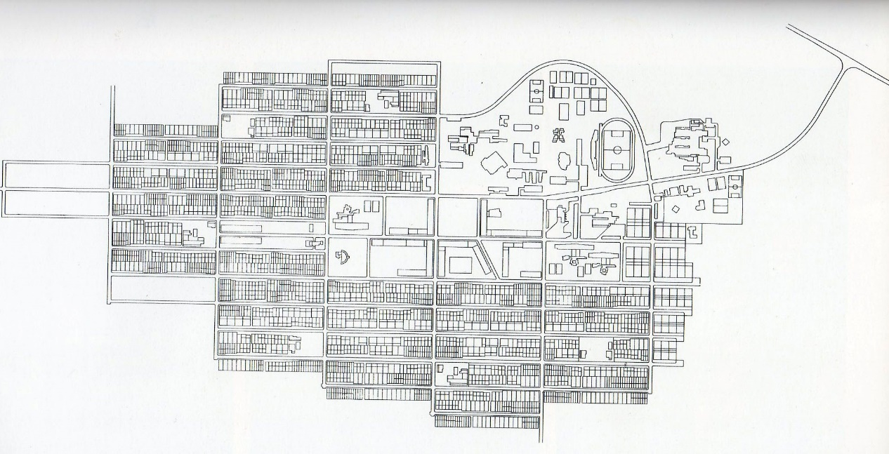

# Resumo

O projeto de uma cidade nova contém em si a potência da intervenção
sobre uma nova sociedade que se forma, diretamente influenciada pelo
novo espaço que ocupa. Ao arquiteto criador do novo núcleo, cabe ao
mesmo tempo a busca pela cidade ideal e as limitações impostas pelas
condições sociais, econômicas e culturais impostas pelas condições reais
de seu trabalho. Aos utópicos, do renascimento ao modernismo, a rigidez
geométrica aparece como a expressão espacial da necessidade de suprimir
o tempo e a transformação que, na cidade ideal, só podem conduzir à
corrupção. Avesso à utopias mas, ao mesmo tempo, longe do conformismo,
Joaquim Guedes faz de sua experiência no projeto da cidade nova de
Caraíba uma investigação sobre as possibilidades do urbanismo diante de
uma estratégia de equilíbrio dinâmico em uma cidade aberta que não pode
nem deseja evitar sua própria transformação.

Palavras-chave: Joaquim Guedes, Caraíba, Cidades Novas, Cidades Ideais,
Urbanismo

Abstract

The design of a new towns contains within it the power of intervention
on a new society that forms directly influenced by the new space it
occupies. It is up to the architect creator of the new core to search
for the ideal city and simultaneously the constraints imposed by social,
economic and cultural conditions imposed by the real conditions of their
work. For those who are utopian, from Renaissance to Modernism,
geometric stiffness appears as the spatial expression of need to
eliminate the time and the transformation that in the ideal city can
only lead to corruption. Averse to utopias but at the same time far from
resignation .Joaquim Guedes makes his experience in the design of the
new town called Caraíba an investigation into the possibilities of
urbanism project on a strategy of dynamic equilibrium in an open city
which may not even want to avoid its own transformation.

Keywords: Joaquim Guedes, Caraiba, New Towns, Ideal Cities, Urbanism

## Corpo do Texto

Historicamente, a cidade se apresenta como um ambiente criado pelo homem
a partir de suas necessidades e possibilidades, quase sempre em oposição
à natureza selvagem, ora vista como caótica, ora vista como divina, que
de qualquer modo deve permanecer apartada do espaço urbano. A cidade,
criada e habitada pelo homem, surge como uma recriação da própria
natureza e, logo, como a possibilidade da superação dos conflitos não
apenas entre o homem e seu meio, mas também entre os próprios homens.
Assim, a construção da cidade -- especialmente de novas cidades - se
torna um caminho para a realização de *utopias*, tanto física como
socialmente estáveis. Ao participar da experiência de projetar uma
cidade nova, também o arquiteto paulista Joaquim Guedes precisa,
necessariamente, encontrar uma forma de relacionar-se com essas
expectativas e, ao mesmo tempo, com as inevitáveis limitações que a
realidade do fazer arquitetônico impõe. Ainda assim, encontra entre a
perspectiva utópica e o pragmatismo conformista um caminho para guiar
seu urbanismo. Declarado avesso à utopias e defensor do livre
desenvolvimento das cidades, Guedes procura encontrar para as novas
cidades um equilíbrio dinâmico capaz de através da inevitável e
bem-vinda transformação.

A relação do homem com a cidade acompanha historicamente a relação do
homem com o mundo natural em que habita. FEITOSA (2004) destaca, assim,
três períodos distintos da relação entre homem e natureza no ocidente: a
natureza da tradição grega aristotélica, composta por tudo o que tem em
si mesmo a fonte de seus movimentos; a natureza pós revolução científica
do século XVI, controlada como fonte de matéria prima e energia para
produção e consumo em um paraíso tecnológico idealizado como os
retratados em *Utopia* (1516) de Tomas Morus ou *Nova Atlântida*
(1478-1535) de Francis Bacon e, a natureza pós segunda guerra mundial,
permeada de cenários catastróficos ou *distopias* como as apresentadas
em *Admirável Mundo Novo* (1932), de Aldous Huxley, *1984* (1948), de
George Orwell ou o filme *Blade Runner* (1982), de Ridley Scott.

O projeto de cidades novas após o renascimento carrega em si o desejo
utópico da construção da cidade ideal, o que corresponderia à criação de
uma sociedade ideal, como ilustram os projetos e tratados de urbanismo
de Leonardo da Vinci, Alberti ou Filarete, que procuram uma cidade
modelo perfeita tanto em seus edifícios quanto em suas instituições
(Figura 2). Influenciada pelo neoplatonismo renascentista, a perfeição
política só poderia corresponder a perfeição matemática da forma
geométrica. Para ARGAN (1998), a ciência urbanística de Alberti é
tipicamente humanista, ou seja, baseada no domínio do furor irracional
da natureza pela racionalidade humana. A geometria aparece, assim, sob o
posicionamento do arquiteto-demiurgo que carrega o ato da criação
urbanística com uma carga ideológica oculta sob o discurso do próprio
urbanismo como ciência, ou ainda como técnica ou arte. Segundo SICA
(1977, p. 72), o antropocentrismo alterou as relações entre realidade e
ideal, fazendo surgir a utopia da cidade e do Estado "como produto de
una forma mentis que quiere crear verdades capaces de guiar, o juzgar, a
la historia." A cidade ideal divina torna-se, agora, obra humana,
baseada no sentido de consciência civil e identificada política e
culturalmente com a pólis grega apresentada na República de Platão. Para
GARIN (1996, p.60), o pensamento urbanístico da renascença resulta de um
encontro matemático entre beleza e funcionalidade como um tipo de busca
da razão difusa que existe no seio de toda a Natureza:

> Alguém que, além do urbanismo e da arquitetura em geral, examinasse a
> concepção filosófica da natureza presente num Alberti ou num Da Vinci,
> encontraria muitas analogias entre os dois artistas, justamente na
> idéia comum de (λόγι), de "razões seminais", de leis matemáticas
> imanentes, que o homem descobre no fundo do ser para inserir entre as
> coisas naturais as próprias obras (\...). Homem e natureza, razão
> humana e lei natural, integram-se reciprocamente; e a cidade
> construída segundo a razão e na medida do homem, mas também a cidade
> que corresponde perfeitamente à natureza no homem.

{width="5.770833333333333in"
height="6.125in"}

Figura . Três painéis retratando a cidade ideal renascentista,
atribuídos a Luciano Laurana ou Giorgio Martini -- ou ainda a Fra
Carnevale, Piero della Franchesca ou Alberti. Óleo e têmpera sobre
madeira, 0,60 x 2m, 0,78 x 2,17m e 1,24 x 2,34m respectivamente. Fonte:
WIKIMEDIA, 2013.

{width="5.208333333333333in"
height="4.604166666666667in"}

Figura . Sforzinda de Filarete. Fonte: BENEVOLO, 2003.

Assim, o desafio de se projetar novas cidades estimula o desejo da
utopia, que se torna uma de suas características mais fortes e fortalece
a posição demiúrgica do arquiteto-criador, cujo traço possui a potência
de conduzir o destino da cidade e seus moradores. Sobre isso, segundo
GUEDES (1981, p.8):

> Somente quem já teve alguma vez a oportunidade de traçar o primeiro
> risco de uma obra, edifício (não importa o tamanho) ou cidade, conhece
> a gravidade, a densidade, os significados, os compromissos e a
> invenção existentes num simples traço sobre o papel.
>
> Risco e traço aqui querem dizer idéias, números, conceitos,
> realidades, vida.

O urbanismo modernista não rompe essa tradição, também carregando alta
dose da utopia renascentista como observamos nas propostas de Le
Corbusier ou Lúcio Costa, por exemplo. Essa herança pode ser detectada
na própria imagem profissional do arquiteto, que não se restringe a um
técnico da construção apenas, mas coloca-se sobretudo como um pensador,
humanista versado nas artes e em diferentes assuntos.

Particularmente na primeira metade do século XX, este humanismo deposita
suas esperanças no desenvolvimento científico e tecnológico que, natural
e forçosamente, conduziriam o homem ao bem estar físico e social como
imposição de seu processo normal de evolução. Em *O Novo Humanismo
Científico e Tecnológico,* artigo de Lúcio COSTA (1997, p.393) escrito
em 1961, diz o autor:

> Os homens de ciência e, de um modo geral, os donos da tecnologia,
> presos cada qual ao campo restrito do respectivo domínio, subestimam o
> seu valor conjunto. Serão eles, no entanto, que levarão afinal a
> humanidade de volta ao "paraíso perdido".

Para Costa, o processo tecnológico acabará por reconciliar opostos e
resolver dilemas entre, por exemplo, individualismo e coletivismo, arte
autônoma e arte social e, por fim, o dualismo arquitetônico entre as
tradições orgânico-funcional e plástico-ideal (Figura 3), flor e
cristal, expressas pelos eixos nórdico-oriental e
mesopotâmio-mediterrâneo como já defendido em *Considerações sobre arte
contemporânea*, quando afirma o caráter sintético da arquitetura moderna
(COSTA, 1997, p.247):

> É na fusão desses dois conceitos, quando o jogo de formas livremente
> delineadas ou geometricamente definidas se processa espontâneo ou
> intencional -- ora derramadas, ora contidas -, que se escondem a
> sedução e as possibilidades virtuais ilimitadas da arquitetura
> moderna.

{width="5.760416666666667in"
height="4.322916666666667in"}

Figura . Diagrama dos eixos Nordico-Oriental e Mesopotamio-Mediterrâneo
na história da arte e da arquitetura.

Nos projetos de Le Corbusier e de Costa verifica-se uma natureza
utópica, em seu aspecto conciliador, estável e definitivo, uma síntese
dos processos históricos que lhe precederam. A supressão da dimensão
temporal das cidades, característica da construção da utopia, implica em
modelo sintético que não pode ser transformado sem ser corrompido,
condição essa que aborta consequentemente as diferenças e os conflitos
que historicamente colocam a cidade em incessante movimento, atrelando a
estagnação física à social e vice-versa.

Assim como houvera sido na Atlântida platônica, nas cidades-fortaleza
renascentistas ou nos modelos dos chamados *socialistas utópicos* no
século XIX, também a utopia modernista se encaminha para a perfeição
geométrica como sua expressão formal. A linha reta das tramas axiais e a
regularidade das unidades de habitação se desdobram no retângulo áureo
estabelecido por Corbusier para a *Cidade Contemporânea para 3 Milhões
de Habitantes* (Figura 3), percebido apenas a voo de pássaro, ou então
pelo arquiteto criador diante da prancheta. Protegido por uma grande
área verde não edificada - o retângulo - forma fechada expressa a
imutabilidade da cidade: qualquer acréscimo ou retirada só pode resultar
na corrupção da regularidade física e social da utopia.

{width="5.6875in"
height="3.8958333333333335in"}

Figura . Cidade Conemporânea para 3 Milhões de Habitantes, de Le
Corbusier. (Fonte: LE CORBUSIER, 2000)

De fato, Lúcio Costa considera um equívoco a leitura recorrente que
relaciona a forma geométrica corbusieana à metáfora mecanicista
antinatural, normalmente em oposição ao desenho orgânico de Frank Lloyd
Wright, posição compartilhada por MONTANER (2008) para quem as formas
geométricas, citando Jorge Wagensberg e D'Arcy Thompson, são as formas
fundamentais não apenas das máquinas, mas também das estruturas da
natureza, de modo que não podem ser fundamentais para este tipo de
classificação de projetos arquitetônicos ou urbanísticos mas sim sua
capacidade orgânica de crescer e transformar-se e com a libertação de
suas energias naturais externas e libidinais internas.

É a imobilidade, e não a geometria, portanto, o argumento capaz de
colocar Corbusier em uma posição distante do chamado organicismo.
Lembremo-nos da adoção também por Howard da forma geométrica como
referencial em sua proposta para as cidades jardins (Figura 5). No
entanto, há diferenças fundamentais: em primeiro lugar, a constelação de
núcleos circulares do esquema visava justamente uma articulação dinâmica
entre eles, extraindo do modelo exatamente sua capacidade de crescimento
e não sua imobilidade. Além disso, embora constituindo um esquema
fundamental, o que se viu foi que as cidades-jardim construídas puderam
se adaptar livremente ao sítio sem abdicar dos princípios de sua
composição.

{width="5.760416666666667in"
height="4.166666666666667in"}

Figura . Esquema das cidades-jardim de Howard. Fonte: HOWARD, 1996 e
PRUDON, 1949.

Quando Joaquim Guedes projetou Caraíba, hoje Núcleo do Pilar, uma
*company town* para a mineração de cobre no sertão da Bahia, viu-se
frente ao desafio de fazer nascer uma cidade do nada, isolada, marcada
pela forte presença de uma empresa, numa região de clima hostil, com 75%
da população de origem rural, a maioria analfabeta, ganhando menos de
três salários mínimos, vivendo em um ambiente de trabalho intenso com
forte tendência à segregação social e espacial.

{width="5.760416666666667in"
height="2.9375in"}

Figura . Planta baixa da cidade de Caraíba, hoje Núcleo do Pilar
(distrito de Jaguarari), de Joaquim Guedes. Fonte: CAMARGO, 2000.

As condições naturais para a implantação desse núcleo, conforme descrito
por GUEDES (1981), eram pouco amigáveis: vegetação característica da
caatinga, bela porém pouca e árida, clima seco e com altas temperaturas,
especialmente durante o dia, minimamente atenuadas pelos ventos SE e E.
Caraíba, afinal, como todas as cidades, tinha o desafio de dominar e
recriar a natureza a fim de possibilitar a fixação do homem naquele
local. Ao contrário destas difíceis condições, a cidade imaginária de Le
Corbusier não encontra nenhuma dificuldade geográfica maior do que uma
suposta trajetória solar que sequer é alterada pela desconhecida
latitude do plano. Não há falta ou excesso de umidade ou calor ou
qualquer acidente geográfico, a não ser pelo rio convenientemente
colocado à margem da cidade junto à zona industrial para o escoamento da
produção. Diferentemente, as dificuldades geográficas e ambientais de
Caraíba estão presentes desde a escolha do local para a construção da
cidade, que deveria estar protegido da bacia de rejeitos da mina de
cobre, cujos trabalhadores a cidade deveria abrigar. A natureza marca
também as previsões para o desenvolvimento econômico da região. O solo
pobre descarta a agricultura como possibilidade de desenvolvimento
futuro, considerada por Guedes como uma alternativa inviável à
manutenção econômica do núcleo urbano no caso de esgotamento da mina de
cobre -- ameaça prevista para as primeiras décadas após a fundação, mas
até os dias de hoje não se concretizou.

Guedes reconhece que o desenvolvimento tecnológico, fruto da
inteligência humana é capaz de dominar a natureza e reverter a situação:
é possível irrigar o sertão e fazê-lo fértil. No entanto, se a técnica
existe, a utopia encontra a realidade inviabilizada pelo custo de sua
implantação. Assim, declarando-se avesso a utopias, Guedes questiona se
o arquiteto deve projetar uma nova cidade imaginando que dispõe de
técnicas que não pode realmente implantar, tradições que não pode
superar ou imaginando que não exista sobre o solo, por exemplo, as
linhas que demarcam a propriedade privada?

Se projetar uma cidade mineira sem classes é ilusório, ingênuo e
anti-histórico em nossa realidade, quais seriam hoje os critérios
capazes de definir a forma urbana, expressando positivamente e
criativamente suas hierarquias e conflitos, seus caminhos de
transformação? (GUEDES, 1981, p.235):

Ao ter a consciência de que não pode construir a utopia, os *caminhos de
transformação* são, para Guedes, a forma pela qual a própria cidade pode
definir os caminhos de sua direção. Guedes retira, assim, a potência
demiúrgica do profissional arquiteto, colocando-o como um agente entre
muitos da constituição da cidade, papel inicial que deve ser gradual mas
inevitavelmente substituído pela dinâmica da própria cidade que, viva,
se transformará segundo seus próprios desígnios.

De fato, Guedes já havia demonstrado entendimento semelhante quando,
recém-formado, apresentou proposta para o Plano Piloto de Brasília com o
grupo STAM, em 1957. A ideia de que Brasília deveria constituir-se em
uma cidade aberta, de crescimento natural e libertada da exclusiva
função administrativa causou, segundo GUEDES (1972), a desclassificação
do projeto. De fato, o vencedor do concurso, Lúcio Costa, era resistente
ao crescimento e à transformação da cidade, defendendo rigidamente a
manutenção do seu desenho. COSTA (1997) propõe, por exemplo, que no caso
da instalação de painéis luminosos em área próxima ao eixo monumental,
outros painéis deveriam ser instalados no lado oposto a fim de
reestabelecer a simetria da paisagem (Figura 8). Como comentamos
anteriormente, essa rigidez formal corresponde a uma imaginada
estabilidade/rigidez social, ilusória, cuja maior consequência foi o
crescimento desordenado das cidades satélite.

{width="5.770833333333333in"
height="4.15625in"}

Figura . Esquema para o crescimento de Brasília conforme projeto do
grupo STAM. Fonte: Acervo pessoal de Teca Guedes.

{width="5.760416666666667in"
height="4.322916666666667in"}

Figura . Fotografia de Brasília apresentada por Lúcio Costa com a
legenda: "Como se pode ver, já é mais que tempo de providenciar os
painéis luminosos do lado sul, restabelecendo assim a simetria proposta
no Plano Piloto." Fonte: COSTA, 1997.

Entendemos que a renúncia à utopia resulta, portanto, na desconstrução
da forma pura. As gradativas transformações sociais não podem se
restringir à harmonia alcançada por um desenho monopolizado por um único
criador. Tanto o retângulo áureo corbusieano como os eixos de Lúcio
Costa denunciam qualquer acréscimo ou subtração ao plano original que
não esteja devidamente incorporado à figura geométrica ideal. Em sua
perfeição geométrica, qualquer alteração ao retângulo só pode
representar a corrupção de sua forma tanto física quanto social. A
cidade geométrica não é feita para se transformar, quando muito pode se
multiplicar.

Em seus estudos para Caraíba, Guedes utiliza-se inicialmente do
retângulo como base para a distribuição dos elementos (Figura 9). Define
os eixos principais, norte-sul e leste-oeste, a grande praça central e o
sistema de praças menores que desde os primeiros croquis condicionam o
projeto. No entanto, em determinado momento e sem explicação aparente,
Guedes simplesmente desfaz o retângulo, adicionando e removendo quadras,
e introduz uma longa curva ao norte, que resulta em uma conformação
urbana distinta da anterior (Figura 6). Apesar da malha em grelha, não
mais se inscreve em uma forma geométrica rígida.

{width="5.760416666666667in"
height="2.8645833333333335in"}

Figura . Croqui de Guedes mostrando uma Caraíba retangular. Fonte.
GUEDES, 1982.

A opção pela forma geométrica pode ser facilmente justificável, quase
autoexplicativa. Realmente, ela sintetiza alguns conceitos fundamentais
sobre os quais se estrutura a própria ideia de cidade. O primeiro deles
é a relação entre *centro* e *limite*, que está expresso, segundo
TREVISAN (2009), desde o antigo hieróglifo egípcio para *cidade:* um
círculo dividido por dois eixos que se encontram em seu centro.

{width="5.760416666666667in"
height="4.354166666666667in"}

Figura . Hieroglifo egípcio para *cidade*. Fonte: TREVISAN, 2009.

*Centro* e *limite* configuram e determinam originalmente, no desenho da
cidade, a relação entre esta -- e o homem, seu construtor -- e a
natureza. A acrópole grega, monte dedicado aos templos mais importantes,
ou o *mundus* romano, cova aberta no encontro entre *cardo* e o
*decumanus maximus* onde o *áugure*, o fundador da nova cidade,
depositando um punhado da terra natal tomava posse da nova terra
instituindo um santuário em homenagem aos *manes*, os espíritos dos
antepassados são expressões do *axis mundi*, o eixo vertical que liga o
plano terreno aos planos superiores ou inferiores. Esses eixos possuem
um papel fundamental na medida em que representam a nova conexão entre a
natureza usurpada e transformada pelo homem na cidade e os deuses que
dela devem novamente tomar posse. Da mesma forma, a muralha aparece como
a expressão da necessidade de um *limite* identificável com a natureza.
Tão sagradas quanto o centro, a acrópole ou o *mundus*, a muralha também
era palco de seus próprios rituais sagrados. Assim, para SICA (1977) a
função da muralha não é apenas a proteção contra inimigos externos, mas
também a contenção do crescimento da cidade a fim de evitar a
contaminação de sua ordem pelo caos natural. Segundo PERULLI (2012), a
*lira* era o sulco que delimitava a cidade que, se fosse infinita,
perderia completamente o sentido de modo que *delirar* significa estar
fora dos limites da cidade, vagando sem rumo algum na natureza infinita
que, portanto, não pode oferecer referência alguma. Um dos desafios da
cidade moderna consiste em lidar com a dissolução desses limites, cada
vez mais imprecisos e fluidos.

Dessa forma, a estratégia de Guedes em desfazer o retângulo inicial
procura enfraquecer os limites da cidade, neste caso, como contenção. Ao
romper com a rigidez geométrica, Guedes indica desde cedo seu desejo de
que a cidade se transforme conforme o desejo de seus habitantes, viva,
cresça e se expanda libertando-se não apenas da mina de cobre como única
fonte de renda mas também de seu arquiteto criador.

Quando Guedes imagina uma Caraíba aberta, não limita-se a uma abertura
interna, mas também às cidades vizinhas, sendo este um dos princípios
que norteiam o projeto. Sendo a região carente de quase todo o tipo de
infraestrutura, o núcleo é imaginado como um difusor desses serviços o
que, segundo depoimento de MANINI (2013), levou Guedes a posicionar o
hospital e a escola de 2º grau junto o eixo principal de entrada na
cidade, por exemplo, de modo a torna-lo acessível aos habitantes das
cidades próximas. Caraíba é, assim, não apenas um núcleo urbano, mas
também um difusor de serviços e progresso para toda a região.

Parte dessa estratégia é absorvida das influências dos teóricos
ingleses, especialmente do biólogo Patrick Geddes que, como afirma o
próprio GUEDES (1972), deu ao urbanismo a condição de complexidade e
interdisciplinaridade em oposição à tendência moderna da especialização.
São importantes também as experiências de Guedes nas pesquisas sociais e
demográficas desenvolvidas na SAGMACS do padre Lebret, por quem Guedes
nutria profunda admiração e por quem chegou a cursar, por um período, o
curso de sociologia como ferramenta para uma percepção mais completa da
cidade. Graças a essas experiências, Guedes é capaz de ampliar o modelo
modernista em favor de uma resposta ao mesmo tempo mais possível e menos
definitiva. Assim, observa-se que a aversão às utopias não pode ser em
momento algum confundida, em Guedes, com conformismo. Ao contrário, o
arquiteto possui uma visão bastante particular sobre o papel de seu
urbanismo na construção dinâmica, e não estática, do progresso e do
futuro, escapando às tentações misóginas e totalitárias tão comuns aos
utopistas.

## Referências bibliográficas

ARGAN, Giulio Carlo. História da Arte como História da Cidade. São
Paulo: Martins Fontes, 1998.

COSTA, Lúcio. Registro de Uma Vivência. São Paulo: Empresa das Artes,
1997. 2ª ed.

FEITOSA, Charles. Explicando a Filosofia com Arte. Rio de Janeiro:
Ediouro, 2004. 2ª reimp.

GARIN, Eugenio. Ciência e vida civil no Renascimento italiano. São
Paulo: Unesp, 1996.

GUEDES Sobrinho, Joaquim Manoel. Considerações sobre planejamento
urbano, a propósito do Plano de Ação Imediata de Porto Velho. Tese de
Doutoramento -- Faculdade de Arquitetura da Universidade de São Paulo,
1972.

\_\_\_\_\_\_\_\_\_\_. Um projeto e seus caminhos. Tese de Livre Docência
- Faculdade de Arquitetura e Urbanismo da Universidade de São Paulo --
FAUUSP, São Paulo, julho de 1981.

MANINI, Luiz. Depoimento \[jun. 2013\]. Entrevistadores: Mônica
Junqueira de Camargo, Rogério Penna Quintanilha e Gabriele Rodrigues
Pereira. São Paulo: s/ ed., 2013.

MONTANER, Josep Maria. Sistemas arquitectónicos contemporâneos.
Barcelona: Gustavo Gili, 2008.

PERULLI, Paolo. Visões da Cidade. São Paulo: SENAC, 2012.

SICA, Paolo. La imagem de la ciudad. De Esparta a Las Vegas. Barcelona:
Gustavo Gili, 1977.

TREVISAN, Ricardo. Cidades Novas. Tese de Doutorado -- Programa de
Pesquisa e Pís-Graduação -- Faculdade de Arquitetura e Urbanismo da
Universidade de Brasília. Brasília, 2009.
