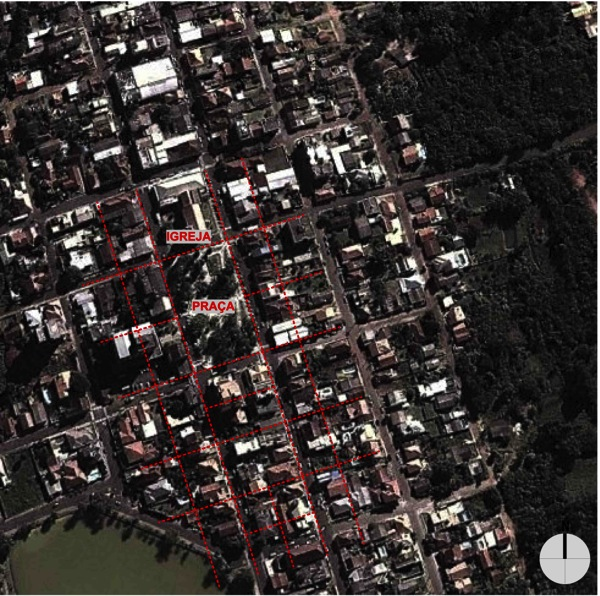

# Resumo

Geralmente, os traçados urbanos não são analisados sobre a óptica do
patrimônio. Quando se fala na ocupação da América Latina, valoriza-se a
discussão sobre as estruturas implantadas pelos colonizadores ibéricos,
ao invés de analisar-se a condição prévia. O presente ensaio discute os
tipos de traçados urbanos, suas características e analisa a ocupação no
extremo sul do Brasil. Quatro cidades são investigadas como estudo de
caso: Rio Grande; Rio Pardo; Taquari e Pelotas. Tal análise se faz em
três momentos: o momento prévio à chegada dos colonizadores; o de
implantação de um dos sistemas (Português ou Espanhol) e a situação
atual.

Palavras-chave: Traçados Urbanos; Rio Grande do Sul.

# Abstract

Usually, the urban patterns are not analyzed as an heritage
conservation. When one discuss the occupation of the Latin America
scholars focus on the urban structures set by the Iberian colonizers
instead of analyze the previous situation. Here we discuss the kinds of
urban patterns, its characteristics and analyze the occupation of the
south of Brazil. Four case study cities are investigated: Rio Grande;
Rio Pardo; Taquari and Pelotas. The analysis occurs in three moments:
the time prior to arrival of the colonizers; the deployment of the
systems (Portuguese or Spanish) and the current situation.

Keywords: Urban Patterns; Rio Grande do Sul State.

# Introdução: o patrimônio traçado

Segundo o Conselho Internacional de Monumentos e Sítios (ICOMOS),
patrimônio é o conjunto de bens culturais que determinada comunidade
reconhece como de valor histórico, artístico, arquitetônico,
arqueológico e ambiental, e que, portanto, entende que deva ser
preservado para as gerações futuras. A identidade cultural brasileira é
configurada por uma série de bens culturais que refletem quem somos e
onde vivemos e são caracterizados por valores afetivos, artísticos e
históricos e por isso constituem bens a preservar.

1.  Quando analisamos os traçados urbanos do período colonial
    brasileiro, sabemos sobre a importação e a imposição de modelos para
    o território recém-descoberto, mas pouco se discute (ou se estuda)
    sobre as estruturas prévias à colonização. Entendemos essa discussão
    prévia como algo que constitui uma riqueza das cidades brasileiras,
    e, neste ensaio, propomo-nos discutir essas questões, privilegiando
    a preservação do patrimônio desses traçados ao invés de simplesmente
    descreve-los morfologicamente.

    A América Latina apresenta basicamente dois sistemas de configuração
    urbana estabelecidos pelos colonizadores ibéricos: o sistema
    Português e o sistema Espanhol implantados nas respectivas áreas
    sobre o domínio de cada um deles. O sistema português apresenta duas
    vertentes básicas. A primeira é a vernácula, que apresenta grande
    relação com o território. A segunda é a erudita, baseada em sistemas
    ortogonais. A vertente vernácula escolhe minuciosamente os sítios
    para a fundação das cidades, os locais proeminentes para a
    implantação dos edifícios institucionais, e a definição das
    principais vias estruturantes. A componente erudita se baseia em
    sistemas ortogonais e envolve o processo de planejamento. Cada
    vertente é associada a uma época histórica ou cultura urbanística.
    No traçado espanhol, tem-se uma organização mais rígida,
    estabelecida a partir de uma malha ortogonal.

**Ocupação urbana brasileira: modelo imposto *pelos* portugueses ou
*para* os portugueses?**

O território brasileiro foi gradualmente ocupado pelos portugueses após
as primeiras incursões franceses e as eminentes ocupações da região
nordeste do Brasil. Até lá, a ocupação do território costeiro não tinha
sido capaz de erguer mais que algumas simples feitorias.

A divisão do território em capitanias hereditárias foi esforço para
reverter esse processo e origina uma série de cidades entre o nordeste e
o sudeste. O processo de ocupação iniciado na região nordeste, e que se
expande até à região da atual São Paulo, é marcado pelo período
renascentista português e absorve este seu modelo urbano graças às
Ordenações Manuelinas e à facilidade de implantação das cidades em
sítios altos e acidentados que o novo território conquistado oferecia.

Essa forma de ocupação duraria mais de um século e deixaria uma marca da
colonização portuguesa nas cidades brasileiras que foram fundadas e
desenvolveram-se neste período. Uma marca de um traçado tanto regular
quanto orgânico, representando respectivamente as corrente eruditas e
vernacular do urbanismo português. As figuras 1 e 2 mostram
respectivamente as cidades de Diu (Portugal), de traçado vernacular; e
de Recife (Brasil), com traçado erudito.

{width="3.189583333333333in"
height="3.1013888888888888in"}

Figura 1. Desenho da cidade de Diu e fortificações do século XVI,
exemplo de traçado renascentista vernacular português. Fonte: LAMAS,
2007.

{width="2.7597222222222224in"
height="3.1013888888888888in"}

Figura 2. Desenho da cidade de Recife, com traçado erudito. Fonte:
LAMAS, 2007.

De acordo com Weimer (2004), o território rio-grandense foi ocupado
tardiamente por não possuir interesses econômicos, segundo julgamento da
Coroa portuguesa. Durante boa parte do século XVII, as terras do sul do
Brasil ficaram sob domínio dos espanhóis e apenas no início do século
XVIII a Coroa desenvolveu estratégias para a efetiva ocupação do Estado
do Rio Grande do Sul.

Assim, a ocupação das zonas de fronteira com os territórios espanhóis
(oeste missionário e o extremo sul do Brasil) seria diferente (RHODEN,
1999). Ela ocorreria em regiões meridionais, em sítios planos, perto de
grandes pradarias, tanto perto quanto longe da costa.

Paralelamente ao desenvolvimento da ordenação Pombalina pelo Marquês de
Pombal (Plano da Baixa de 1755), as ocupações da América portuguesa
adotariam cada vez mais a rigidez de traçado que seu concorrente
implantou nas zonas platinas. Assim, as cidades fundadas nesse período
apresentariam traçados similares àqueles determinados pelas leis das
Índias e passariam a aplicar essas ordenações com mais firmeza,
desconsiderando muitas vezes acidentes geográficos importantes. A tabela
1 estabelece paralelos entre os traçados portugueses na sede da coroa e
na região da colônia.

Tabela 1. Influência da Morfologia urbana portuguesa no Brasil colonial

+----------------------+----------------------+----------------------+
|                      | **Renascentista (XVI | **Barroco (XVII --   |
|                      | - início do XVII) -- | XVIII) - Pombalino** |
|                      | Manuelinas**         |                      |
+======================+======================+======================+
| > **Traçado          | Ordenações           | Ordenações Filipinas |
| > português aplicado | Manuelinas:          | substituem as        |
| > a Portugal**       | estrutura urbana     | tradicionais         |
|                      | composta de muro     | ordenações           |
|                      | fortificado          | Manuelinas           |
|                      | retangular, castelo  |                      |
|                      | numa extremidade,    | Terremoto de 1755:   |
|                      | largo com igreja     | reconstrução da      |
|                      | central e ruas       | cidade de Lisboa     |
|                      | retilíneas.          | (plano de Manuel     |
|                      |                      | Maia) instaura um    |
|                      | Localização das      | novo modelo mais     |
|                      | cidades em sítios    | rígido de            |
|                      | altos e acidentados  | estruturação urbana  |
|                      | como estratégia      |                      |
|                      | militar.             | Ordenações           |
|                      |                      | Pombalinas: traçado  |
|                      | Cidade dividida em   | regular (retidão) e  |
|                      | duas partes:         | decorativo, larguras |
|                      |                      | exatas das ruas,     |
|                      | \- parte alta:       | desconsideração da   |
|                      | tradicionalmente     | topografia natural,  |
|                      | para defesa, ganha   | determinação de      |
|                      | função residencial.  | pé-direito,          |
|                      |                      | localização das      |
|                      | \- parte baixa:      | sacadas e "janelas   |
|                      | função de negócios e | de peito".           |
|                      | trocas mercantis     |                      |
|                      |                      | Traçado regular:     |
|                      | Tecido regularizado  | novidade em          |
|                      | reticular, mas com   | Portugal, mas já     |
|                      | adaptações claras às | utilizado nos        |
|                      | condições            | domínios             |
|                      | topográficas. Ex;    | ultramarinos.        |
|                      | Bairro Alto.         |                      |
|                      |                      | Simetria nas         |
|                      |                      | fachadas do Terreiro |
|                      |                      | dos Paços: praça do  |
|                      |                      | Comércio             |
+----------------------+----------------------+----------------------+
|                      | {width="2.48125in" | image4.png){width="2 |
|                      | height="2            | .1395833333333334in" |
|                      | .772222222222222in"} | height="2.           |
|                      |                      | 7847222222222223in"} |
|                      | Planta típica de     |                      |
|                      | Damião -- Século     | Planta da « Baixa »  |
|                      | XVII. Fonte: acervo  | de Lisboa, Eugênio   |
|                      | A.H.U Lisboa.        | dos Santos -- 1756.  |
|                      | RHODEN, 1999         | Fonte: FRANÇA, 1989  |
+----------------------+----------------------+----------------------+
| > **Traçado          | Ocupação da costa    | Aplicação das        |
| > português aplicado | brasileira           | Ordenações           |
| > ao Brasil**        |                      | Pombalinas nas       |
|                      | Estratégia militar : | cidades do interior  |
|                      | sítios altos e com   | do Nordeste          |
|                      | visão para o mar,    | brasileiro.          |
|                      | escolhidos           |                      |
|                      | estrategicamente     | Expansão do traçado  |
|                      | para conquista e     | para as cidades de   |
|                      | manutenção da        | fronteira: Amazônia, |
|                      | ocupação frente a    | Sul do Brasil até    |
|                      | outros colonizadores | fortificações do     |
|                      | (Holandeses,         | litoral              |
|                      | Franceses)           |                      |
|                      |                      | Traçado: marcação da |
|                      | Aplicação da ordem   | praça central,       |
|                      | Manuelina nas        | localização da       |
|                      | cidades, com grande  | igreja, presidio,    |
|                      | adaptação à          | pelourinho, câmara e |
|                      | topografia.          | outros edifícios     |
|                      |                      | públicos no seu      |
|                      | Cidades fundadas no  | entorno.             |
|                      | período: Salvador,   |                      |
|                      | Rio de Janeiro,      | Ruas residenciais    |
|                      | Olinda, Recife, São  | alinhadas e se       |
|                      | Luiz                 | expandindo a partir  |
|                      |                      | da praça             |
+----------------------+----------------------+----------------------+
|                      | {width=" |                      |
|                      | 2.772222222222222in" |                      |
|                      | height="1.           |                      |
|                      | 1520833333333333in"} |                      |
|                      |                      |                      |
|                      | Planta de Salvador   |                      |
|                      | -- Bahia. Fonte:     |                      |
|                      | História de          |                      |
|                      | Salvador. Cidades    |                      |
|                      | Baixa e Alta         |                      |
+----------------------+----------------------+----------------------+

# Estudos de caso

Os estudos de caso selecionados mostram cidades gaúchas que, sob
influência deste novo modelo, possuem características bem particulares e
diferenciadas das cidades oriundas da primeira colonização. Esse traçado
inicial é um fator determinante na organização das atividades e no
simbolismo dessas cidades, constituindo assim uma riqueza
histórico-cultural a ser valorizada. Analisaremos o processo de formação
das cidades de Rio Grande, Rio Pardo, Taquari e Pelotas, em três
momentos distintos: o de formação, o de sobreposição de traçados e a
situação atual.

# Rio Grande

A história de ocupação da cidade de Rio Grande confunde-se com a própria
história do território rio-grandense. Por se tratar de ponto
estratégico, em 1737, a coroa designou uma equipe de militares para
construção dos fortes no canal, providenciando a defesa do território.
Chegando ao local, encontraram um povoado já instalado.

A cidade foi a primeira fundada no extremo sul do país e abrigou uma
fortaleza militar, dotada de presídio, denominada Jesus Maria José. A
fundação do forte marca a origem do povoamento, que passa de freguesia a
povoado de Rio Grande de São Pedro. A figura 3 mostra a organização da
vila em 1755 com o posicionamento do forte.

{width="2.404861111111111in"
height="6.126388888888889in"}

Figura 3. Rio Grande segundo uma interpretação livre de um desenho
intitulado: Demonstração da vila de São Pedro de Rio Grande -- aprox.
1755. Fonte: WEIMER, 2004.

A figura 3 mostra que a organização da vila está estruturada a partir de
uma rua principal, ao longo da qual estão dispostas as edificações,
acompanhando a sinuosidade da praia. Segundo Weimer (2004), durante a
conformação da vila, a Coroa portuguesa estava em negociações do tratado
de Madri, razão pela qual o traçado parece ser espontâneo e não de
acordo com as Ordenações Reais.

Colonizada pelos "chegados" das Ilhas dos Açores e da Madeira em 1755, a
cidade permaneceu sob domínio português por 30 anos. Com As disputas
entre os conquistadores ibéricos, o território passou ao domínio
espanhol de 1763 a 1776 e os portugueses se deslocam para o outro lado
do canal, em São José do Norte.

{width="3.8604166666666666in"
height="4.7340277777777775in"}

Figura 4. Primeira ocupação de Rio Grande de São Pedro (atual cidade de
Rio Grande). A circunferência a direita mostra a ocupação de São José do
Norte. Fonte: Arquivo Histórico do Exército, 07-05-1639 apud OLIVEIRA;
SOUZA, 2014, adaptado pelos autores.

{width="3.0in"
height="2.316666666666667in"}

Figura 5. Imagem de satélite mostrando a cidade atual de Rio Grande/RS.
Fonte: Google Earth (data da aerofoto: 2014).

{width="4.139583333333333in"
height="2.734027777777778in"}

Figura 6. Planta da Vila do Rio Grande de São Pedro do Sul tirada em
ordem da Câmara Municipal em 5 de 8 de 1829. A cor preta indica o que
está edificado e cercado, a cor verde mostra o que está devoluto e em
termos de ser edificado e a cor amarela os cômodos que limitam o terreno
arenoso e incapaz de se fazer reassentamento. Fonte: Secretaria
Municipal de Coordenação e Planejamento da Prefeitura do Rio Grande,
2014, adaptado pelos autores.

{width="5.164583333333334in"
height="3.3291666666666666in"}

Figura 7. Imagem de satélite da atual cidade de Rio Grande/ RS.
Destacamos a área original comparando-a ao crescimento da cidade e a rua
General Bacelar que manteve caráter comercial. Fonte: Google Earth (data
da aerofoto: 2014).

Percebe-se que a cidade de Rio Grande não foi inicialmente projetada
(planta de 1755- figura 3). Entretanto, aos poucos, o modelo de traçado
português foi sendo imposto (planta de 1829 - figura 6). Na conformação
atual (aerofotos de 2014 - figuras 5 e 7), percebe-se que a cidade se
expandiu. Mantiveram-se tanto o traçado xadrez (adaptando-o quando
necessário) quanto as características originais de uso dos espaços. A
Rua General Bacelar exemplifica essa estratégia: manteve o caráter
comercial, conforme originalmente previsto.

# Rio Pardo

O povoado de Rio Pardo, juntamente com o de Triunfo, foi formado por
lagunenses e paulistas que se estabeleceram próximos ao rio Jacuí,
enquanto os portugueses tentavam retomar Rio Grande.

No ano de 1752, foi construído na cidade o forte Jesus Maria José e, a
partir dele, o povoado foi se conformando. Em 1809, Rio Pardo foi
elevada a categoria de vila. A planta datada de 1829 já mostra a
ocupação bastante dispersa no território.

O crescimento da cidade se deu a partir da estruturação do eixo da Rua
Andrade Neves (figura 8), divisor de águas e via que contém as
edificações de maior importância da cidade. Ela se conforma de maneira
linear em função da formação geológica da colina onde se situa a cidade.
Tal organização supõe que não houve planejamento envolvido, uma vez que
a expansão do povoado apresenta ruas relativamente irregulares (Weimer,
2004).

{width="2.9875in" height="4.025in"}

Figura 8. Rio Pardo -- 1829 -- Desenho baseado no levantamento de Johann
M. Buff. Fonte: WEIMER, 2004, adaptado pelos autores.

{width="3.5569444444444445in"
height="2.8354166666666667in"}

Figura 9. Imagem de satélite da atual cidade de Rio Pardo/ RS.
Destacamos a área original comparando-a ao crescimento da cidade e a Rua
Andrade Neves, e a Rua Júlio de Castilhos. Fonte: Google Earth (data da
aerofoto: 2014).

{width="3.303472222222222in"
height="3.379861111111111in"}

Figura 10. Imagem de satélite da atual cidade de Rio Pardo/ RS.
Destacamos a Rua Andrade Neves, eixo inicial e a Rua Júlio de Castilhos,
conectora da cidade ao forte. Fonte: Google Earth (data da aerofoto:
2014).

Percebe-se que o sistema de conformação da cidade de Rio Pardo foi
vernáculo. Ao território não foi imposto um traçado regular. A partir da
implantação de alguns equipamentos (o forte e as edificações principais
no eixo da Rua Andrade Neves) o traçado urbano foi se desenvolvendo,
mantendo-se as edificações de maior importância e valor histórico. O
eixo da Rua Júlio de Castilhos, conector do forte à à área central é
exemplo de tentativa de preservação do traçado urbano. Essa via foi
tombada pelo patrimônio e registrada como a primeira rua calçada do
município.

# São José do Taquari

Em 1752, chegam os primeiros casais açorianos no território
rio-grandense e, em função disso, o urbanismo passou a uma nova fase,
iniciando com o projeto de São José do Taquari, do governador José
Custódio de Sá e Faria (Weimer, 2004).

O projeto do povoado (figura 11) apresenta características marcantes do
urbanismo pombalino, como a implantação de duas praças, uma civil
(pelourinho) e outra religiosa. A igreja sempre teve papel de destaque
nos projetos das cidades, já que toda a cidade girava e se organizava ao
redor da mesma. Assim, o prédio da Câmara foi implantado junto à igreja
e, no projeto, nem todas as quadras foram divididas em cinco lotes por
testada. Ainda, o projeto serviu de modelo durante um século e meio e
foi considerado pioneiro (Weimer, 2004).

{width="2.0in" height="3.50625in"}

Figura 11. São José do Taquari -- 1767: Proj. José Custódio de Sá e
Faria. Fonte: WEIMER, 2004.

{width="3.5694444444444446in"
height="3.4680555555555554in"}

Figura 12. Imagem de satélite da atual cidade de Taquari. Fonte: Google
Earth (data da aerofoto: 2014).

{width="4.0in" height="3.975in"}

Figura 13. Imagem de satélite da atual cidade de Taquari. Em tracejado
vermelho: núcleo inicial proposto em 1767 sobreposto ao traçado atual.
Fonte: Google Earth (data da aerofoto: 2014).

Percebe-se que o sítio permanece com traçado retilíneo (figuras 12 e
13), porém foram feitas adaptações, como o remembramento do quarteirão
entre as duas praças propostas e também da praça civil. O terreno de
pouco desnível possibilitou a implantação e continuidade do traçado.

# Pelotas

A atual cidade de Pelotas começou a organização do seu território em
1812, com o estabelecimento da freguesia de São Francisco de Paula.
Tornou-se vila em 1832 e em 1835, a cidade de Pelotas.

O primeiro núcleo urbano surgiu em 1815, a partir da capela São
Francisco de Paula e, para o terreno escolhido "foram traçadas doze ruas
em uma área aproximada de 53 hectares" (Cruz, 1984). O traçado do
Primeiro Loteamento (figura 14) seguiu o traçado regular, as dimensões
dos quarteirões são semelhantes, próximas de um quadrado e as ruas
possuem larguras similares (Oliveira; Ferraz, 2014).

{width="3.0in"
height="1.975in"}

Figura 14. Mapa da cidade de Pelotas. 1815. Fonte:
http://www.anpur.org.br/site/anais/ena14/ARQUIVOS/GT7-957-543-20110106101758.pdf\#page=20&zoom=160,0,265

Quando Pelotas, em 1835, deixou de ser a Vila São Francisco de Paula e
tornou-se cidade, foi elaborado o projeto do Segundo Loteamento (figura
15). A segunda planta urbana apresenta a expansão da cidade em direção
sul, próximo ao cais do porto. Nesse projeto foram acrescentadas quinze
ruas transversais, mas o traçado reticulado se manteve sem modificar o
traçado anterior.

{width="2.5319444444444446in"
height="3.2909722222222224in"}

Figura 15. Mapa da cidade de Pelotas. 1835. Fonte:
http://www.anpur.org.br/site/anais/ena14/ARQUIVOS/GT7-957-543-20110106101758.pdf\#page=20&zoom=160,0,265

Característica forte do traçado regular da cidade diz respeito ao número
de ruas longitudinais e transversais, que se equilibram. A diferenciação
entre o Primeiro e Segundo Loteamento ocorre pela largura das vias, que
são mais estreitas no Primeiro e se alargam na segunda Planta.

{width="3.975in" height="3.025in"}

Figura 16. Imagem de satélite da atual cidade de Pelotas/RS. Destacamos
a área do núcleo inicial da cidade. Fonte: Google Earth (ano da
aerofoto: 2014).

{width="2.847916666666667in"
height="2.683333333333333in"}

Figura 17. Imagem de satélite da atual cidade de Pelotas/RS. Destacamos
a área do núcleo inicial da cidade. Fonte: Google Earth (ano da
aerofoto: 2014).

Ao longo dos anos, os projetos de expansão da malha urbana (figuras 16 e
17) mantiveram as características do traçado inicial. Ou seja, os
projetos iniciais da cidade, com características urbanísticas coloniais
se mantem ao longo dos anos.

# Considerações finais

Nos exemplos analisados, observa-se que o vínculo entre a tradição de
ocupação e o terreno se mantem. As características físicas do sítio
determinam a geometria de urbanização em grande parte dos exemplos
durante a situação prévia à chegada dos colonizadores. As cidades
analisadas vinculam-se a um rio, núcleo inicial dos povoados e linha que
define as características de distribuição das vias e das edificações. No
caso de Rio Grande, a lógica inicial de ocupação está relacionada à
atual laguna. 

Com a chegada das milícias reais, instituem-se novas regras que procuram
configurar o território segundo as premissas do traçado português
(depois do Tratado de Madrid, 1750). Ora mantém-se a mesma
característica de ocupação (como na proposta de Taquari) ora assume-se
novo traçado, geralmente mais ortogonal. Nesse caso, dependendo das
características do terreno, impõe-se a permanência do traçado erudito
(Rio Grande) ou adequa-se o traçado à topografia (Rio Pardo). Pelotas
figura como um caso atípico em que o núcleo inicial vinculou-se a praça
e não a uma rua, como nos outros casos analisados. Além disso, tal área
não corresponde a atual porção central do município.

Por fim, se há alguma contribuição a sublinhar nas colocações descritas
acima, elas se resumem a:

\- dar continuidade aos esforços no sentido de chamar a atenção para a
necessidade de valorização da cultura prévia ao período colonial que
mostra organizações urbanas significativas, até então relativamente
esquecidas ou postas de lado pela historiografia; e

\- destacar a relevância da implantação desses arranjos uma vez que não
só as edificações históricas isoladas têm importância, mas o conjunto
delas dispostas no espaço urbano, relacionadas a um todo espacial,
temporal e simbólico maior. 

# Referências bibliográficas

CRUZ, Glenda. *Espaço construído e a formação econômico-social do Rio
Grande do Sul: uma metodologia de análise e o espaço urbano de Pelotas.*
Dissertação de Mestrado. PROPUR-UFRGS. Porto Alegre, 1984.

FRANÇA, José Augusto. *A reconstrução de Lisboa e a arquitetura
Pombalina.* Lisboa: Biblioteca Breve, 1989.

LAMAS, José Manuel Ressano Garcia. *Morfologia urbana e desenho da
cidade.* Porto: Fundação Calouste Gulbenkian, 2007.

RHODEN, Luiz Fernando. *Urbanismo no Rio Grande do Sul: origens e
evolução.* Coleção Historia n° 28. Porto Alegre: EDIPUCRS, 1999.

OLIVEIRA, Ana Lúcia Costa de; SOUZA, Célia Ferraz de. A regularização do
traçado e as práticas urbanísticas na urbanização da região do portal de
acesso da laguna dos patos/RS Rio Grande, São José do Norte e Pelotas
(1737-1822). *Revista Memória em Rede.* Pelotas, v.4, n.10,
Jan./Jun.2014. Disponível em: \<www.ufpel.edu.br/ich/memoriaemrede\>.
Acesso em 28 mar 2014.

WEIMER, Günter. *Origem e evolução das cidades rio-grandenses.* Porto
Alegre: Livraria do Arquiteto, 2004.

Google Maps. Disponível em: \<https://www.google.com.br/maps\>. Acesso
em: 28 mar 2014.

História de Rio Pardo. Disponível em:
\<http://www.riopardo.rs.gov.br/site/home/pagina/id/111/?HISTORIA-DE-RIO-PARDO.html\>.
Acesso em: 28 mar 2014.

Crescimento urbano e hidrografia natural: conflitos e articulações no
espaço-tempo. Disponível em:
\<http://www.anpur.org.br/site/anais/ena14/ARQUIVOS/GT7-957-543-20110106101758.pdf\>.
Acesso em 30 mar 2014.

Secretaria Municipal de Coordenação e Planejamento da Prefeitura do Rio
Grande. Disponível em:
\<http://www.riogrande.rs.gov.br/pagina/index.php/secretarias+6d77a1,,smcp.html\>.
Acesso em 27 mar 2014.

Conselho Internacional de Monumentos e Sítios (ICOMOS). Disponível em:
\<http://www.icomos.org/fr/\>. Acesso em 25 mar 2014.

História de Salvador. Cidades Baixa e Alta. Disponível em:
\<http://salvadorhistoriacidadebaixa.blogspot.com.br/2009/11/ladeira-da-jequitaia.html\>.
Acesso em 28 mar 2014.
