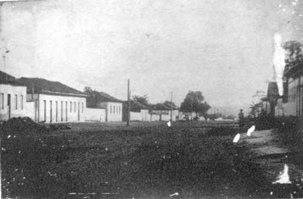
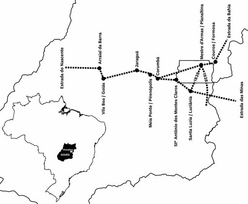
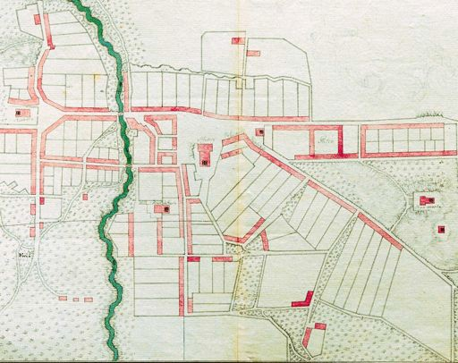
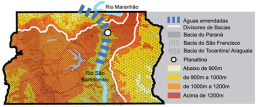
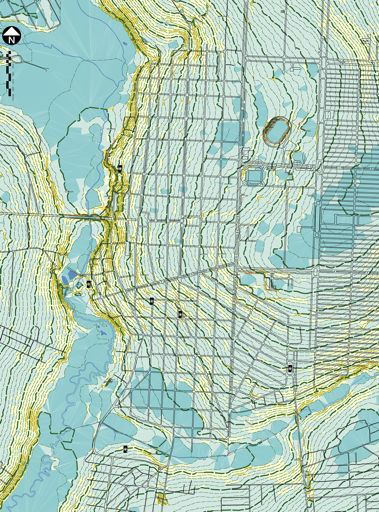
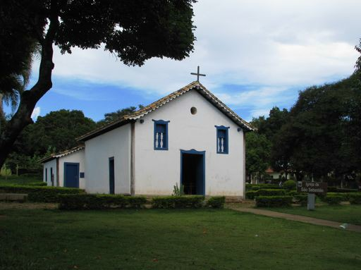
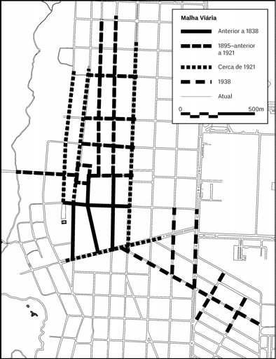

# Resumo

Este trabalho estuda o processo de urbanização de Planaltina, arraial
goiano estabelecido na primeira metade do século XIX. Dotada de uma
malha em forma de retícula irregular, Planaltina desmente diversos
cânones da história da urbanização vernácula brasileira, tais como a
escolha do sítio, proporções de lotes e densidade de ocupação: foi
edificada num vale, com lotes largos e rasos, amplos afastamentos
laterais e pouco controle sobre o alinhamento das edificações à testada
do lote. Comparam-se essas características com os padrões típicos de
arraiais setecentistas, ressaltando transformações no modo de
apropriação do sítio urbano no período que se segue ao ciclo do ouro. A
partir do início do século XX, verifica-se um processo de adensamento
urbano e subdivisão de lotes, intensificado devido à pressão demográfica
e imobiliária causada pela transformação de Planaltina em cidade
satélite de Brasília.

# Palavras-Chave

Goiás, Urbanização Vernácula, Século XIX, Planaltina

# Abstract

This paper examines the patterns of urbanization in Planaltina, a town
founded during the period of economic slump in Goiás state comprised
between the decline of gold mining in the late eighteenth century and
the construction of the new state capital, Goiânia, in the 1930s. Laid
out on a rough grid sometime after 1811, this town belies several key
concepts of the "canonical" Portuguese-Brazilian city, such as site
selection, lot proportion, and density: it was built by a valley, with
wide and shallow lots having ample side yards, and its houses are often
misaligned. These features are compared with eighteenth-century towns in
central Brazil, highlighting general changes in urban patterns after the
collapse of the gold-mining economy in the region. Starting in the early
twentieth century, infill begins to occur, with lots being subdivided
either lengthwise or breadth wise, as well as changes in the historic
centre brought about more recently by the demographic and economic
effects of planned extensions to the city.

# Keywords

Goiás, Vernacular urbanism, Nineteenth century, Planaltina

# Introdução

Este trabalho analisa os padrões urbanísticos no processo de crescimento
de Planaltina (Fig. 1), assentamento goiano fundado em 1811 e
incorporado no Distrito Federal (Fig. 2), a 35 km*1* de Brasília. Sua
configuração urbana inicial e crescimento

*1*Distâncias indicadas por via terrestre.

subsequente desafiam lugares-comuns da urbanização brasileira
pré-moderna (Fig. 3). A cidade também ilumina um período precariamente
conhecido da história urbana do Planalto Central: aquele compreendido
entre o fim do ciclo do ouro e a introdução das vilas ferroviárias no
início do século XX.

A primeira parte do texto resume a história do povoamento
luso-brasileiro do Planalto Central e da fundação de Planaltina. Em
seguida, a descrição morfológica do assentamento está apresentada
segundo seus três elementos estruturadores: espaço público, parcelamento
do solo e tipologia edilícia. A partir dessa descrição, ensaia-se uma
reconstrução do processo histórico de crescimento urbano de Planaltina.

> {width="4.802083333333333in"
> height="3.15625in"}
>
> *Figura 1. Avenida Goiás, Planaltina, c. 1965. Autoria desconhecida,
> acervo da Secretaria de Estado de Cultura do Distrito Federal*
>
> {width="6.010416666666667in"
> height="4.947916666666667in"}
>
> *Figura 2. Planaltina no contexto das estradas em Goiás, 1736--1938.
> Adaptado de Ana Laterza*

# Povoamento do Planalto Central Território e Fronteira

O sertão goiano era conhecido dos portugueses desde a expedição de
Domingos Grou em 1580, sendo regularmente percorrido por bandeiras e
entradas ao longo do século *XVII* (Vianna 1961--1975, vol. II.2, p. 75)
Na mesma época, há evidências de sitiantes paulistas no atual sudeste do
Estado (Holanda 1981--1989, vol. I.1, p. 293) A descoberta de ouro na
região provocou o desenvolvimento de uma rede urbana na região,
constituída essencialmente entre 1727 e 1743 e concentrada sobretudo
numa faixa leste-oeste entre as atuais cidades de Goiás e Paracatu. O
sistema de estradas da capitania, fundada em 1744, partia de um tronco
principal, a Estrada do Nascente, ligando a sede em Vila Boa (atual
cidade de Goiás) a Meia Ponte (atual Pirenópolis). Daí, o caminho seguia
inicialmente o rumo sudeste, por Santa Luzia (atual Luziânia), ao passo
que a Estrada da Bahia, originalmente uma picada de contrabando, acabou
por ser regularizada conectando a primeira a Couros (atual Formosa). A
partir dessas estradas --- pouco mais do que caminhos de mulas ---, o
Norte da capitania era acessível somente por picadas inconstantes
descendo as inóspitas chapadas do Planalto Central.

O declínio do ciclo do ouro, que em Goiás se iniciou na década de 1770
(Bertran 2011, 252), levou ao desaparecimento de alguns arraiais e à
estagnação da maioria

dos demais. Nessa capitania, a depressão econômica que se seguiu foi
especialmente longa e severa (Furtado 1977, 107), o que levou à
designação do século XIX em Goiás como o "século do silêncio" (Garcia
2010, 11) No início daquele século, de fato, a diocese de Goiás era a
menos populosa da colônia (Simonsen 1937, v. II, p. 328)

# Urbanização

Excetuando-se Meia Ponte (ver Fig. 1) --- importante encruzilhada
comercial --- no seu auge, nenhum assentamento da província antes do
século XX excedeu dez mil habitantes. Vila Boa estagnou em 8.000
moradores, ao passo que Santa Luzia, terceiro maior núcleo urbano de
Goiás, não tinha mais que três mil habitantes. A maioria das vilas e
arraiais tinha apenas algumas centenas de pessoas. Além disso, essa
população mal podia ser denominada propriamente "urbana", como sinalizou
o viajante francês Auguste de Saint-Hilaire em 1819:

> \[...\] afora alguns trabalhadores braçais e comerciantes, todos os
> habitantes de Santa Luzia trabalham a terra, e só vêm à cidade aos
> domingos e dias festivos; assim, durante a semana, não se vê ninguém
> nas casas nem nas ruas (Saint-Hilaire 1848, 2:14)

A maioria das vilas goianas seguia o padrão canônico do arraial de
mineração, assentado ao longo de cristas de morros e nas proximidades
dos cursos d'água de onde se extraía o ouro aluvial (Fig. 3). A
publicação do livro *Raízes do Brasil*, de Sérgio Buarque de Holanda, em
1936, contendo o famoso capítulo "O semeador e o ladrilhador",
cristalizou uma interpretação desses arraiais como "desleixados"
(Holanda 1971), em contraposição ao caráter "ordenado" das cidades
espanholas. Em que pese o questionamento dessa visão a partir do final
da década de 1960 --- o livro *Evolução Urbana do Brasil*, de Nestor
Goulart Reis Filho, foi um marco nessa inflexão ---, a reinterpretação
da urbanização brasileira como processo multifacetado foi demorado e,
pode-se arriscar, incompleto. Assim, algumas características dos
assentamentos urbanos do período colonial continuaram a ser consideradas
como quase universais: implantação em topos ou cristas de morros, lotes
estreitos e profundos, casas geminadas evoluindo para sobrados com o
enriquecimento de uma parte da população.

> {width="6.291666666666667in"
> height="4.989583333333333in"}
>
> *Figura 3. Planta da Vila Boa de Goiás, c. 1790. Acervo do Museu
> Botânico Bocage, Lisboa*

# Apanhado Histórico de Planaltina Antecedentes e Contexto Geográfico

O sítio conhecido como Mestre d'Armas, que deu origem à atual
Planaltina, foi mencionado pela primeira vez num documento escrito em
1773 pelo secretário do governador da Capitania de Goiás, de passagem
pelo local (Bertran 2011, 289) Sabe- se, também, que as primeiras
sesmarias na área foram concedidas a partir de 1741, antes mesmo da
fundação do arraial mais próximo, Couros (Bertran 2011, 307)

O Planalto Central permaneceu, como já foi visto, num estado de
estagnação demográfica e econômica até os anos 1880. Essa foi uma época
de intenso crescimento econômico no Centro-Oeste, cujas população e
renda *per capita* dobraram até o início do século XX (Buescu 1978,
233). A pecuária exportadora foi o principal motor desse crescimento,
que precedeu em várias décadas a chegada da ferrovia em Goiás, em 1912.
Mesmo assim, a expansão da rede ferroviária parou em 1922 em Pires do
Rio, 200 quilômetros ao sul de Santa Luzia, sendo retomada somente com a
construção de Goiânia.

Foi nesse contexto de desenvolvimento pecuarista que o sítio de Mestre
d'Armas (Fig. 4) teve seu auge. O local, cortado pelo ribeirão de mesmo
nome, fica próximo à antiga Estrada Real dos Goyazes, que ligava a
capital à Bahia, a 950 metros de

altitude. Ao norte da estrada, uma borda de chapada quase intransponível
abriga a nascente do Rio Maranhão, principal afluente do Tocantins. Ao
sul do sítio estende-se o amplo vale do Rio São Bartolomeu, que corre
rumo ao então despovoado sudeste de Goiás. A vegetação nativa do cerrado
já havia sido de longa data contaminada pela invasão do capim-gordura,
planta africana própria para a pecuária.

> {width="6.291666666666667in"
> height="2.6354166666666665in"}
>
> *Figura 4. Situação geográfica do sítio de Mestre d'Armas, por Ana
> Laterza*

A Estrada da Bahia ainda era no final do século XIX a principal rota da
área, ligando os dois núcleos urbanos mais próximos, Corumbá de Goiás
--- 150 quilômetros para o oeste --- e Couros --- quarenta quilômetros a
leste. A antiga Contagem de São João das Três Barras, próxima ao vale do
Maranhão, era o estabelecimento governamental mais próximo de Mestre
d'Armas.*2* O mais antigo documento que se conhece mencionando
Planaltina, o relatório de 1773 da viagem do Governador D. José de
Almeida escrito por seu secretário Tomás de Souza (Bertran 2011, 289),
indica que o sítio já era habitado e conhecido pelo nome do ribeirão
vizinho. Bertran (Bertran

2011, 369) sugere que o nome Mestre d'Armas decorra de um ferreiro ou
professor de esgrima estabelecido às margens desse ribeirão por volta de
1751. Antes mesmo dessa data, em 1741, já há sesmarias concedidas no
local. A maioria das cartas de sesmaria na área data de 1746 a 1772, ano
em que Couros foi elevado à condição de vila.

# Fundação e Crescimento

Em 1810, os proprietários de três sesmarias financiaram a construção de
uma capela expiatória dentro de uma doação de meia légua quadrada de
terra*3*, na encosta entre a margem oriental do Ribeirão Mestre d'Armas
e a margem norte do Córrego do Atoleiro. A consagração da capela a São
Sebastião ocorreu em 20 de janeiro de 1811.

O local escolhido para a doação (Fig. 5) parece pouco propício para o
desenvolvimento de um núcleo urbano. A vizinha vila de Couros já
cumpria, desde finais do século *XVIII*, as funções administrativas e
comerciais urbanas para a região, e oferecia um pouso para os viajantes.
Além disso, segundo o historiador do Arquivo Público do Distrito Federal
Elias Manoel da Silva (Silva 2012, 1), o pouso de gado

*2*A contagem foi desativada em 1823, e sua localização exata é
desconhecida atualmente.

*3*Aproximadamente 18 quilômetros quadrados.

mais frequente na região era junto à Lagoa Bonita, cerca de sete
quilômetros a norte e mais próximo da estrada. Além disso, a Missão
Cruls apontou em seu relatório que o sítio era pouco sadio: tanto o
Ribeirão Mestre d'Armas quanto o seu afluente, o Córrego do Atoleiro,
são rasos --- um metro de profundidade, em média --- e têm uma vazão
pequena. Por isso, suas margens são pantanosas, especialmente na larga
várzea do Mestre d'Armas, e as suas águas são impróprias para consumo
(Cruls 1947, 128--

129\) Indícios arqueológicos (Barbo 2010, 178) e práticas atuais de
ocupação das fazendas, no entanto, indicam que a escolha de locais
próximos a matas de galeria era habitual para casas de fazenda, e que os
seus construtores evitavam tanto as cristas muito expostas quanto a
adjacência imediata às estradas.

> {width="4.9375in"
> height="6.666666666666667in"}
>
> *Figura 5. Situação topográfica do centro histórico de Planaltina.
> Fonte: IPHAN,*
>
> *2013*

Ainda assim, o transporte parece ter tipo um papel relevante na
localização do sítio. A distância de Mestre d'Armas à estrada não devia
exceder uma hora de caminhada.

Além disso, situa-se no centro de um triângulo cujos vértices são o
pouso de gado da Lagoa Bonita, a nascente conhecida como Águas
Emendadas, e o ponto onde o Ribeirão Mestre d'Armas deságua no Rio São
Bartolomeu. Águas Emendadas é um extenso topo de chapada cuja nascente
verte *tanto* para o sul no Córrego Cortado, afluente do Mestre d'Armas,
quanto para o norte no Córrego Vereda Grande, afluente do Maranhão.
Mesmo não sendo a Lagoa Dourada das lendas do século XVI, Águas
Emendadas é, portanto, a passagem mais fácil para o norte, conduzindo à
distante (570 quilômetros) vila de Natividade, antiga sede da Comarca do
Norte de Goiás --- atual Estado do Tocantins. O vale do Rio São
Bartolomeu e o do Descoberto, no qual ele deságua, formavam extensa área
de pasto para o gado. Além disso, fornecem uma passagem conveniente para
o sul de Goiás, e daí para Paracatu, a caminho do Rio de Janeiro.

Essa passagem foi concretizada em 1838, com a abertura de um caminho
ligando Couros a Santa Luzia passando por Mestre d'Armas (Castro 1986,
20) (ver Fig. 1). Nesse mesmo ano, Mestre d'Armas já era chamado de
arraial e não mais de sítio, numa decisão da assembleia provincial
anexando o local à jurisdição da Vila dos Couros e desmembrando-o de
Santa Luzia. A nomenclatura indica que a essa altura o terreno doado à
Igreja em Mestre d'Armas já possuía um parcelamento residencial. Mais
ainda, a decisão legislativa, que implicou dois outros sítios vizinhos,
sugere que a influência de Santa Luzia, terceiro maior núcleo urbano da
província e antigo arraial aurífero, estava decaindo ao longo do seu
extremo norte. Em contrapartida, Couros se estabelecia como o polo
comercial mais ativo no leste da Província, devido aos curtumes que lhe
deram nome, e que eram alimentados pela pecuária dominante na região:
note-se que dois dos três signatários da petição aprovada pela
legislatura eram residentes de Couros e proprietários de fazendas em
Mestre d'Armas (Castro 1986, 21).

# Auge e Declínio

Nos anos seguintes, o arraial teve sua vinculação a Santa Luzia e Couros
trocada repetidas vezes, até que em 19 de agosto de 1859, foi
constituído Distrito Municipal da Vila dos Couros. No entanto, foi só em
1870 que recebeu o *status* correspondente de freguesia. Por essa
ocasião, a capela foi ampliada para comportar sacristia e consistório, e
um registro local de nascimentos e óbitos foi estabelecido. A paróquia
ainda não era, todavia, considerada suficientemente importante para ser
regularmente curada, de acordo com o Anuário do Estado de Goiás para
1886.

Por fim, em 19 de março de 1891, a assembleia estadual erigiu Mestre
d'Armas em vila. Tal decisão pode ter sido um reconhecimento da
importância crescente do local, que começava a competir com a vizinha
Formosa --- novo nome da antiga Couros. De fato, o Anuário de 1910
(Azevedo 1910, 171--172) não menciona Formosa, mas sim Mestre d'Armas,
ao contrário do que fazia o Anuário de 1886. O autor do Anuário de 1910
descreveu Mestre d'Armas em detalhe, atribuindo-lhe um milhar de
habitantes na área urbana e outros tantos na zona rural. Trata-se de
números bastante incomuns para a época, na qual 80% da população vivia
no campo; caracterizaria, outrossim, um núcleo comercial bastante ativo,
contando possivelmente também com alguma atividade manufatureira. O
verbete cita ainda a existência de cem casas construídas em cinco ruas e
duas praças, uma das quais abriga a Igreja. Havia ainda doze oficinas e
quatro lojas.

Mestre d'Armas continuou crescendo e ganhando em importância durante a
primeira

metade do século XX, mas não tomou parte na industrialização que começou
no Estado nos anos 1940. Conhecida como Planaltina desde 1917, a vila
ganhou notoriedade nacional quando, a 7 de setembro de 1922, o
Engenheiro ferroviário Balduíno de Almeida fez erguer a Pedra
Fundamental da Nova Capital do Brasil, num morro a dez quilômetros da
área urbana. Planaltina foi a primeira localidade de Goiás, fora a
capital, a ter uma estação de energia --- em 1925 --- e uma linha
telefônica. Em 1935, foi construído a leste da vila o segundo campo de
aviação do Estado, depois do Aeroporto de Goiânia, como parte de uma
rota planejada entre Buenos Aires e Belém. Hosannah Pinheiro Guimarães
foi o único planaltinense a alcançar o cargo de vice- governador do
Estado, nos anos 1930. Em 1938, ao completar um século de existência, o
caminho que ligava Planaltina a Luziânia foi substituído por uma estrada
de rodagem chegando até Ipameri, principal parada da ferrovia no sul do
Estado. Nessa época, a antiga Estrada da Bahia já havia sido desviada
para passar pelo centro de Planaltina.

A construção de Goiânia a partir de 1932, no entanto, reorientou os
eixos econômicos de Goiás, em detrimento da importância comercial que
Planaltina vinha alcançando. Sua população urbana estagnou em 2.000
habitantes, ao passo que vilas antes menores que isso atingiam a dezena
de milhar, sobretudo no caminho que ligava a nova capital ao Sul do
Estado. Nenhum edifício público novo foi inaugurado em Planaltina após
1942. A fundação de Brasília alterou inteiramente o destino da vila. A
sede municipal, incorporada ao perímetro do Distrito Federal, tornou-se
uma cidade- satélite povoada em grande parte por migrantes de outras
regiões. Com mais de cem mil habitantes, o conjunto urbano da Planaltina
atual impões pressões imobiliárias severas sobre o centro histórico,
ameaçando seu patrimônio arquitetônico.

# Morfologia e Desenvolvimento Urbano

O desenvolvimento urbano de Planaltina, desde suas origens no início do
século XIX até o projeto de expansão como cidade-satélite de Brasília em
1966, pode ser divido em quatro fases.

# Primeira Fase: Estabelecimento do Arraial

Em 1811, foi consagrada a pequena capela de São Sebastião, na margem
esquerda do Ribeirão Mestre d'Armas (Fig. 6). Segundo Bertran,
sepultamentos tiveram lugar no sítio da capela a partir de 1812 (Bertran
2011). Posteriormente, atrás da capela e mais longe do ribeirão,
estabeleceu-se uma malha irregular com uma rua leste-oeste e três
norte-sul, definindo quatro quarteirões com lotes grandes e
irregulares*4* Esse primeiro passo deu origem ao assentamento urbano
inicial, identificado como um arraial já em 1838. A essa altura, foi
aberta uma estrada ligando Couros a Santa Luzia, passando por um local
hoje desconhecido do sítio de Mestre d'Armas. O leito raso do ribeirão

prestava-se a uma multiplicidade de passagens além da única ponte
existente hoje no centro histórico da cidade. A nave principal da capela
é a única edificação que pode ser datada com segurança a esse primeiro
período. Quando da elevação do sítio a freguesia, em 1880, a capela foi
ampliada com a construção de sacristia, consistório e capela-mor. No ano
seguinte, estabeleceu-se um mourão ao seu lado, indicado que até

> *4*A identificação da atual Rua Treze de Maio com o eixo leste-oeste
> fundador do assentamento urbano foi feita por Ana Laterza durante a
> elaboração do *Inventário do Setor Tradicional de Planaltina* (PHAN
> 2013), da qual participamos.

então o largo da capela continuava sendo o principal espaço público do
povoado.

> {width="6.28125in"
> height="4.708333333333333in"}
>
> *Figura 6. Capela de São Sebastião, Planaltina*

# Segunda Fase: Malha Ortogonal

Em data incerta, esse assentamento foi ampliado com o estabelecimento de
uma malha viária ortogonal a norte e leste do núcleo original (Fig. 7)
Sabe-se que entre 1895 e 1899 foram construídas as principais
edificações em volta da Praça do Jenipapo --- hoje Praça Salviano
Monteiro, atual ponto central do casco histórico. A abertura dessa
praça, portanto, e da atual Avenida Goiás, que corta o centro histórico
de leste a oeste, pode ser atribuída à última década do século XIX: a
morfologia dos seus lotes difere significativamente daquela do
parcelamento original. Em 1910, Mestre d'Armas é descrita no Anuário de
Goiás como compreendendo duas praças e cinco ruas --- as quatro do
parcelamento original, mais a Avenida Goiás. A abertura da avenida e da
segunda praça parece ter sido seguida de perto pelo estabelecimento de
uma malha ortogonal bem maior, com lotes ainda de dimensões irregulares
mas atrelados a eixos perpendiculares. Em 1893, dois anos depois de
Mestre d'Armas ser elevada à categoria de vila, registrou-se a
implantação de um novo cemitério, ao sul da área urbanizada e
delimitado, atualmente, em sua testada leste pela mesma malha ortogonal.

> {width="4.604166666666667in"
> height="5.96875in"}
>
> *Figura 7. Desenvolvimento da malha viária de Planaltina*

# Terceira Fase: Avenidas Perimetrais

Por volta de 1921, essa malha foi completada com a abertura de três
avenidas perimetrais: duas na direção norte-sul, enquadrando a malha
existente, e uma na direção sudoeste-nordeste, acompanhando uma suave
crista do terreno (ver Fig. 7). Na Avenida Marechal Deodoro, no extremo
leste da vila, foram construídos os dois maiores edifícios públicos de
Planaltina --- nome adotado em 1917. O primeiro foi a Casa de Câmara e
Cadeia, construída entre 1926 e 1932 na interseção da avenida com a Rua
Treze de Maio, único eixo leste-oeste do povoado original. O segundo
teria sido a nova Igreja Matriz, monumental obra neogótica iniciada na
década de 1930, abandonada ainda incompleta nos anos 1940, e
reconstruída no mesmo local em 1980. Na Avenida Salvador Coelho,
formando o limite oeste da vila e interligando as duas praças,
instalaram-se os Correios, cartório, e o principal armazém (década de
1920), assim como as únicas clínica (1926) e farmácia (1938) da
localidade.

# Quarta Fase: Vila Vicentina

Até 1966, o crescimento urbano de Planaltina permaneceu quase que
inteiramente delimitado por essas três avenidas, com a inauguração da
Prefeitura (1942)

incentivando, provavelmente, a ocupação do trecho norte da vila. A
abertura da estrada de rodagem para Ipameri, em 1938, seguida da
instalação de padres vicentinos nas proximidades do assentamento,
provocaram um vetor de urbanização para sudeste, com a criação de uma
nova malha ortogonal alinhada com a estrada (ver Fig. 7). Todo esse
conjunto urbano existente ou em formação foi segregado em 1966 pela
implantação de um trecho urbano modernista, chamado Setor de Integração,
que visava a isolar as famílias tradicionais residentes no centro
histórico das massas de migrantes que se estabeleceriam nas novas
expansões projetadas para Planaltina.

A distribuição de moradias construídas até essa época mostra a
consolidação, em Planaltina, de uma separação de níveis de renda. As
casas maiores e mais ricas se concentravam no trecho oeste da vila,
especialmente em torno das duas praças (ver Fig. 1). O início da estrada
para Ipameri, então conhecido como Rua da Palha, e a Avenida Marechal
Deodoro abrigavam as casas mais pobres, muitas delas cobertas com choça.
Em 1969, o Governo do Distrito Federal introduziu, para uso em novos
loteamentos, um modelo de habitação popular de baixo custo, o qual foi
também extensivamente aplicado nas expansões norte e sul do centro
histórico.

# Considerações Finais

Em que pese a escassez de documentos históricos e, sobretudo, de
projetos, a análise morfológica permite reconstruir o crescimento urbano
de Planaltina. Essa reconstituição contribui para preencher a lacuna no
conhecimento histórico acerca da urbanização no interior do Brasil
durante o século XIX. Ela indica também que, mesmo com poucos registros
escritos e orais, é possível reunir informações dispersas e,
confrontando-as com os mapas recentes, reconstruir as principais
características do processo de urbanização.

As características da ocupação urbana assim reconstruídas lançam luz
sobre o período de transição situado entre o declínio dos arraiais de
mineração e a difusão de planos urbanos de arquitetos e engenheiros
profissionais no interior do Brasil. Nota-se o questionamento de alguns
cânones da urbanização brasileira, tais como a ocupação em topos de
morros, os lotes estreitos e profundos, e a construção de igrejas em
pontos centrais. Em vez disso, Planaltina apresenta um sítio próximo a
uma várzea, lotes largos e rasos, e um crescimento urbano que se afastou
do largo da capela.

Ainda assim, restam limitações não desprezíveis nesse conhecimento. A
atribuição de datas às diversas fases de crescimento urbano não pode ser
feita apenas com base na morfologia, e costuma depender de conhecimentos
transmitidos oralmente. Além disso, padrões urbanos e arquitetônicos são
mais duradouros em sítios afastados dos grandes centros, e se sobrepõem
durante muito tempo --- assim, verifica-se a introdução de plantas
ecléticas e do tijolo cozido em 1926, mas plantas coloniais e a
construção em adobe persistiram até pelo menos 1965. Por fim, espera-se
que essa combinação de análise morfológica e registros históricos
não-gráficos possa ser extrapolada para outros assentamentos vernáculos,
onde a falta de documentação sistemática tem dificultado o preenchimento
de lacunas no conhecimento da urbanização brasileira do século XIX.

# Referências Bibliográficas

> Azevedo, Francisco Ferreira dos Santos. 1910. *Annuario Historico,
> Geographico E*
>
> *Descriptivo Do Estado de Goyaz*. Uberaba / Araguari/ Goiás: Livraria
> Seculo XX / Aredio de Souza.

Barbo, Lenora de Castro. 2010. "Preexistência de Brasília : Reconstruir
O Território Para Construir a Memória." PhD thesis, Brasília:
Universidade de Brasília: Faculdade de Arquitetura e Urbanismo.
[*http://repositorio.unb.br/handle/10482/8547*.](http://repositorio.unb.br/handle/10482/8547)

> Bertran, Paulo. 2011. *História Da Terra e do Homem no Planalto
> Central: Eco- História Do Distrito Federal : Do Indígena Ao
> Colonizador*. Brasília: Editora UnB.
>
> Buescu, Mircea. 1978. "Inégalités Régionales Au Brésil Dans La Seconde
> Moitié Du XIXe Siècle." *Revista Do Instituto Histórico E Geográfico
> Brasileiro* 321 (December): 222--233.
>
> Castro, Mário. 1986. *A Realidade Pioneira*. Brasília: Thesaurus.
>
> Cruls, Luís, ed. 1947. *Relatório Da Comissão Exploradora Do Planalto
> Central*. Brasiliana Série 5.ª 258. São Paulo: Nacional.
> *<http://www.brasiliana.com.br/obras/relatorio-da-comissao-exploradora-do-planalto->
> central-do-brasil*.
>
> Furtado, Celso. 1977. *Formação Econômica Do Brasil*. São Paulo:
> Companhia Editora Nacional.
>
> Garcia, Ledonias Franco. 2010. *Goyaz, Uma Província Do Sertão*.
> Goiânia: PUC-GO

/ Cânone.

> Holanda, Sérgio Buarque de. 1971. *Raízes Do Brasil, 1936-1971*. 6th
> ed. Rio de Janeiro: José Olympio.
>
> ---------, ed. 1981--1989. *História Geral Da Civilização Brasileira*.
> São Paulo: Difel.
>
> Instituto do Patrimônio Histórico e Artistico Nacional. 2013.
> *Inventário Do Setor Tradicional de Planaltina*. Brasília: IPHAN.
>
> Saint-Hilaire, Augustin François César Prouvençal de. 1848. *Voyage
> Aux Sources Du Rio de S. Francisco Et Dans La Province de Goyaz*. Vol.
> 2. Voyages Dans L'interieur Du Brésil 3. Paris: Arthus Bertrand.
> [*http://archive.org/details/voyagesdanslinte47sain*.](http://archive.org/details/voyagesdanslinte47sain)
>
> Silva, Elias Manoel da. 2012. *De Mestre d ́Armas a Planaltina:
> Reflexão Histórico- Crítica Sobre a Fundação Da Cidade*. Brasília:
> Edição própria.
>
> Simonsen, Roberto C. 1937. *História Econômica Do Brasil, 1500--1820*.
> São Paulo: Companhia Editora Nacional.
>
> Vianna, Hélio. 1961--1975. *História Do Brasil*. 4th ed. São Paulo:
> Melhoramentos.
