# Resumo

Este trabalho tem o objetivo de examinar as contribuições que o Projeto
do Bairro residencial da Praia de Belas, elaborado por Edvaldo Pereira
Paiva e Carlos Maximiliano Fayet, em 1953, traria à cidade Porto Alegre,
capital do Rio Grande do Sul, Brasil. O projeto não realizado, que
provoca o confronto entre a grande escala da superquadra moderna e a
escala recorrente do quarteirão tradicional, é uma das tantas versões
pensadas para a enseada da Praia de Belas, um lugar que é uma obra do
tempo. Sua existência se reduz a duas imagens e um pequeno texto no
Plano de 1959, mas o restrito material com força de poema enuncia um
espaço e evoca seus tempos. "Tempo e espaço (\...) são também o lugar em
movimento, ou aquilo que nos transformou em seres históricos e que nos
mantém em uma viagem no tempo aleatória e absurda, porém totalmente
coerente" (CUNHA, 2013, p. 65). A partir dessa ideia, pretende-se
construir uma narrativa capaz de mostrar o lugar em movimento num
percurso através de seus tempos: o passado, representado por seus
precedentes; e o futuro desejado em seu próprio tempo, os otimistas e
ousados, anos 1950**.** Tempos que correspondem aos planos urbanísticos
realizados para a cidade em 1914, 1936, 1943, 1951 e 1959, os três
primeiros, elaborados de acordo com o modelo haussmaniano; os dois
últimos, filiados ao modelo corbuseano. Em termos
teórico-metodológicos**,** parte- se da explicitação dos modelos, da
natureza utópica do plano urbanístico e da ideia do projeto como
ferramenta intelectual capaz de realizar a *mimese* do modelo e a
colagem entre tempos e modelos morfológicos.

Palavras-chave: Plano Urbanístico, Projeto, Praia de Belas, Haussmann,
Le Corbusier, Brasília

# Abstract

This research aims to examine the contribution that the design of the
residential neighborhood of Praia de Belas, designed by Edvaldo Pereira
Paiva and Carlos Maximiliano Fayet, in 1953, would bring to the city
Porto Alegre, capital of Rio Grande do Sul, Brazil. The unrealized
project, which causes large-scale confrontation between the modern and
the applicant superquadra range of traditional block, is one of the many
versions designed for cove of Praia de Belas, a place that is a work of
time. Its existence is reduced to two pictures and a little text in Plan
of 1959, but the restricted material strength poem sets out a space and
evokes his times. \"Time and space ( \... ) are also the place to go, or
what made us historical beings and that keeps us on a journey in time
random and absurd, but entirely consistent\" (CUNHA, 2013, 65). From
this idea, we intend to construct a narrative able to show the place in
motion a journey through his times: the past, represented by its
predecessors, and wanted their own time in the future, optimistic and
bold, 1950s. Times corresponding to the urban plans for the city
conducted in 1914, 1936, 1943, 1951 and 1959, the first three, drawn up
in accordance with the Haussmann style, the last two members to
corbusean model. In theoretical and methodological terms, we start from
the explicit models, the utopian nature of urban planning and design
idea as an intellectual tool capable of performing the mimesis model and
the bonding between times and morphological models.

Keywords: Urban plan, design, Praia de Belas, Haussmann, Le Corbusier,
Brasília

# O Projeto do Bairro residencial da Praia de Belas: tempos e modelos

Esta pesquisa se insere na área temática do Discurso Profissional e tem
o objetivo de examinar as contribuições que o Projeto do Bairro
residencial da Praia de Belas, elaborado por Edvaldo Pereira Paiva e
Carlos Maximiliano Fayet em 1953, traria à cidade Porto Alegre, capital
do Rio Grande do Sul, Brasil. O projeto não realizado estabelece um
confronto entre a grande escala da superquadra moderna e a escala
recorrente do quarteirão tradicional; e é uma das tantas versões
pensadas para a enseada da Praia de Belas, um lugar que é uma obra do
tempo. Sua existência se reduz a duas imagens e um pequeno texto no
Plano de 1959, mas o restrito material com força de poema enuncia um
espaço e evoca seus tempos. "Tempo e espaço (\...) são também o lugar em
movimento, ou aquilo que nos transformou em seres históricos e que nos
mantém em uma viagem no tempo aleatória e absurda, porém totalmente
coerente" (CUNHA, 2013, p. 65). A partir dessa ideia, pretende-se
construir uma narrativa capaz de mostrar o lugar em movimento em um
percurso através de seus tempos: o passado, representado por seus
precedentes; e o futuro desejado em seu próprio tempo, os otimistas e
ousados, anos 1950**.** Tempos que correspondem aos planos urbanísticos
realizados para a cidade em 1914, 1936, 1943, 1951 e 1959, os três
primeiros, elaborados de acordo com o modelo haussmaniano; os dois
últimos, filiados ao modelo corbuseano. Em termos
teórico-metodológicos**,** parte-se da explicitação dos modelos, da
natureza utópica do plano urbanístico e da ideia do projeto como
ferramenta intelectual capaz de realizar a *mimese* do modelo e a
colagem entre tempos e modelos morfológicos.

# Plano urbanístico: retrato e modelo

O Plano urbanístico é o instrumento de ação sobre a cidade
característico da era moderna. Pré-figuração de um tempo-espaço de
desejo sobreposto a uma cidade real, "diagrama do devir histórico de uma
sociedade, forma específica de intencionalidade" (ARGAN, 2001, p. 51),
reintroduzindo o antigo tema da cidade ideal e da utopia: uma palavra de
origem grega, que designa um lugar que não existe \-- *ou-topos*, "não
lugar", e *eu-topos*, lugar de felicidade, exemplificada na *Utopia* de
*Thomas Morus,* publicado por volta de 1516. O espaço utópico de Morus
vincula uma organização social perfeita, não apenas a um espaço
paradisíaco, mas a um espaço novo, com uma dupla dimensão: uma
artística, de lugar*;* e uma funcional, de modelo ou protótipo:

> A primeira imagem, que chamarei *retrato* porque pinta os traços
> espaciais que fazem de Utopia uma individualidade única, é fruto, até
> na particularidade de suas construções, das contingências de sua
> geografia, física e de sua história. A segunda imagem, que denominarei
> *modelo* porque retém de Utopia apenas traços espaciais mal
> localizados e reproduzíveis, depende, ao contrário, exclusivamente da
> ordem humana e de um estrito sistema de normas culturais. Essas duas
> imagens permanecem distintas (\...), descendo da escala do território
> à da cidade e da casa (CHOAY, 1985, p. 153).

Modelo, por definição, é o que serve de objeto de imitação. Os Planos
urbanos modernos adotam dois tipos de modelos genéricos: o haussmaniano
e o corbuseano.

# Modelo Haussmaniano

O modelo haussmaniano surge a partir das reformas realizadas pelo Barão
Georges- Eugène Haussmann em Paris após a Revolução Francesa. A
estratégia utilizada partia de uma concepção da cidade como um sistema
de partes independentes que deveria atender a tres requisitos
fundamentais: *embelezamento*, *saneamento* e os problemas relativos à
*circulação*, trinômio que se tornou a definição da palavra-conceito
*melhoramentos*.

A técnica utilizada é a sobreposição de uma malha geométrica de novas
avenidas ao antigo traçado medieval, um elemento que embeleza a cidade
com suas longas perspectivas e racionaliza as obras de infraestrutura e
saneamento. A obra é única, *retrato* das peculiaridades de Paris, mas
se torna embrião do urbanismo como ideologia e ciência interdisciplinar:
*modelo* de cidade figurativa, conformada por quarteirões de ocupação
periférica, perfurados por rua corredor, pátio, praça e parque,
princípios aplicáveis a outros contextos.

A partir de Haussmann, os planos tornam-se projetos de ação total sobre
a cidade. O paradigma orientou diversos projetos urbanísticos
brasileiros, como o Plano da Cidade do Rio de Janeiro, de Alfred Agache,
1928, o Plano de Avenidas de São Paulo de 1930 e os planos urbanos de
Porto Alegre anteriores aos anos 1950. (MACHADO, 2003) (Fig.1)

> 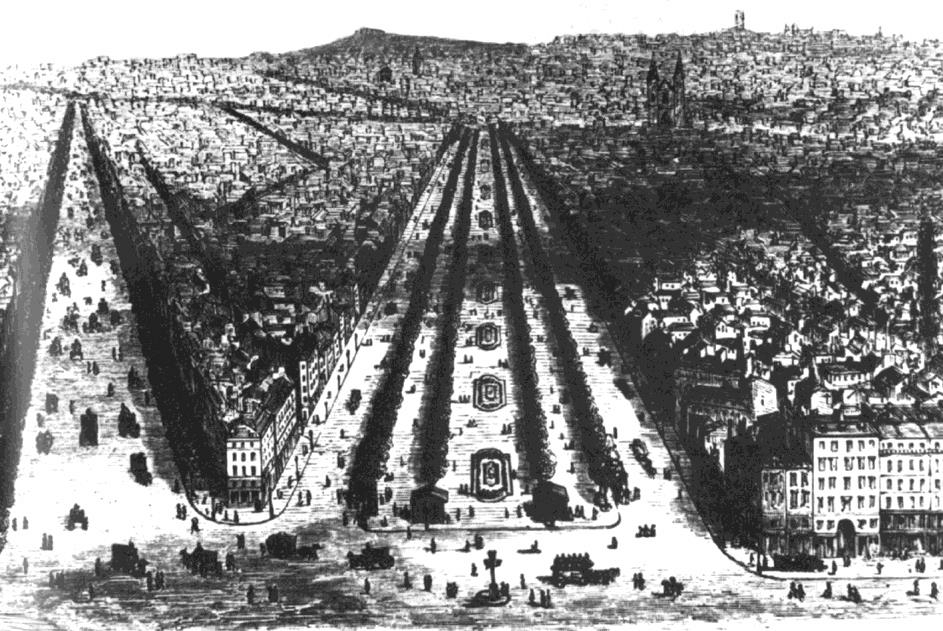
>
> Figura 1: Modelo haussmaniano. Paris, Bulevar Richad-Lennoir,
> 1861-1863. Fonte: ROWE; KOETTER,1978

# Modelo Corbuseano

O modelo corbuseano surge a partir do projeto e do texto *La Ville
Radieuse,* 1924-32, a segunda proposta ideal sobre terreno fictício
plano, concebida por Le Corbusier a partir de duas malhas giradas a 45
graus. O seu esquema antropomórfico que estrutura as faixas de uso
paralelas, inspiradas na Cidade Linear do urbanista russo Nikolay
Alexandrovich Milyutin, representa uma evolução em relação ao esquema
anterior da *Ville Contemporaine* de 1922, cujo esquema concêntrico,
desenvolvido em torno de um ponto central correspondente ao centro de
negócios (*cité d´affairs*), não permitia o crescimento ilimitado da
cidade. A separação entre veículos e pedestres é lograda pela elevação
da cidade acima de um parque contínuo (MONTEYS, 1996, p. 42-48).

As unidades de vizinhança, superquadras 400 por 400 metros de lado,
surgem como alternativa ao quarteirão tradicional e constituem a
vertente racionalista do conceito criado por Clarence Arthur Perry para
o plano de Nova Iorque de 1929: áreas residenciais autônomas,
organizadas em torno de uma escola, delimitadas por serviços e
equipamentos de uso coletivo, dotadas de áreas verdes e de um sistema
hierarquizado de vias de acesso (CASTRO; BEM; GIANSANTE, 2005, p. 3-4).

A *Ville Radieuse* é uma representação neoplatônica do sonho de comunhão
do homem com o meio ambiente corretamente ordenado e do mundo moderno
como um momento de retorno à ordem. Símbolo da superação da era
histórica pela era tecnológica, na qual noção de progresso confundia-se
com a ideia de destino (ARGAN, 2001, p. 23). (Figs. 2 e 3)

A partir da segunda metade do século XX, essa nova ordem formal do
espaço social com traços utópicos é reinterpretada no Projeto
residencial do bairro Praia de Belas e no projeto do Plano Piloto de
Brasília, elaborado por Lucio Costa em 1957.

> 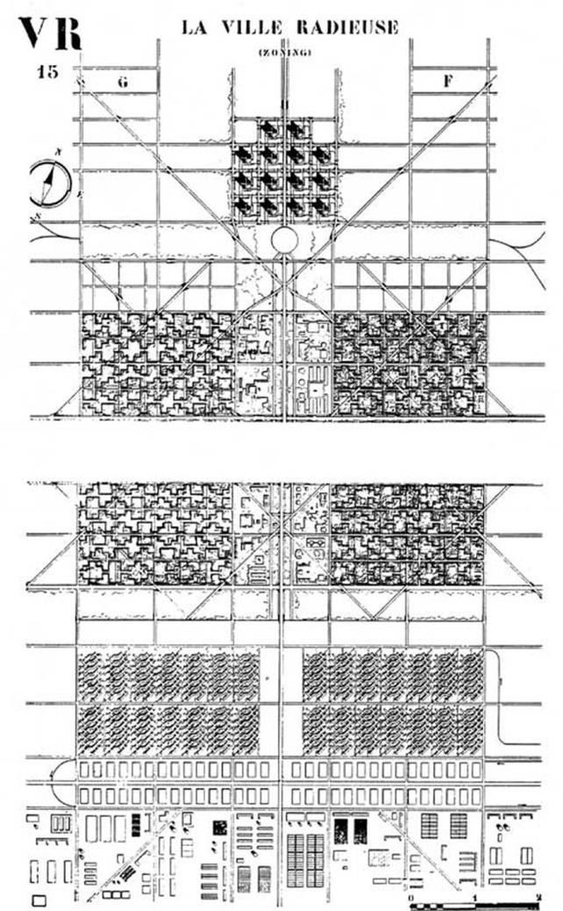
>
> Figura 2. Ville Radieuse, Plano. Fonte:
> [[http://www.fondationlecorbusier.fr]{.ul}](http://www.fondationlecorbusier.fr/)
>
> 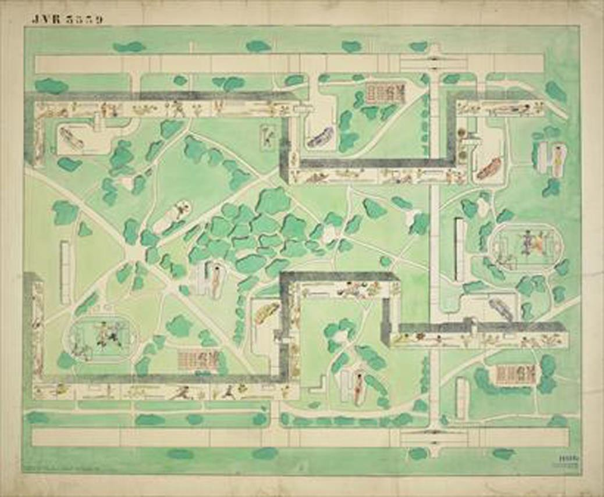
>
> Figura 3. Unidade de vizinhança da *Ville Radieuse*. Fonte:
> [[http://www.fondationlecorbusier.fr]{.ul}](http://www.fondationlecorbusier.fr/)

# Brasília

Brasília, posterior ao Projeto da Praia de Belas, não é referência e sim
verificação das qualidades do modelo corbuseano construído. A ideia de
utilizar o conceito de Unidade de Vizinhança no projeto da nova capital
brasileira é anterior ao Plano Piloto, onde Lucio Costa realiza uma
interpretação própria do modelo corbuseano, contraposição ao conceito de
"condomínio" fechado e privativo: um módulo formado por quatro grandes
quarteirões com 280 X 280 metros de lado, circundados por uma faixa de
vegetação, no encontro dos quais, localiza-se a Igreja e a Escola
Secundária. As extremidades abrigam o Posto de Saúde, a Biblioteca
Pública, o Cinema, o Clube de Vizinhança e os comércios locais. Os seus
interiores arborizados destinam-se às áreas de lazer.

O módulo de quatro quadrados se repete ao longo das Asas, norte e sul do
plano e constitui a expressão máxima da ideia de cidade no parque, com
sua setorização de atividades, ruas internas com formas orgânicas,
hierarquia de vias de acesso e blocos de habitação coletiva com seis
pavimentos sobre *pilotis*. Oscar Niemeyer desenvolveu a proposta dos
blocos residenciais das SQS 107, 108, que em conjunto com as SQS 307 e
308, conformam a unidade de vizinhança modelo, composta por onze
edifícios (CORBIOLI, 2014).

As superquadras diferem do quarteirão convencional em termos de escala e
parcelamento: "possuem um tipo de propriedade do solo urbano
diferenciado, próprio do Plano Piloto. Os edifícios ocupam *projeções*,
e não *lotes*, que definem uma quota de construção somente acima do
*pilotis* e no subsolo*"* (MATOSO, 2011). Desta forma, a arquitetura
flutua sobre um jardim contínuo. Entretanto, ao contrário dos
gigantescos espaços conformados pelos *rédans* da *Ville Radieuse*, a
disposição dos blocos em torno de espaços abertos variados no interior
das superquadras mantém viva a ideia de pátio delimitado da cidade
tradicional. Surpreendentemente, a

experiência do passeio por algumas superquadras reproduz a deliciosa
sensação de proteção e acolhimento do miolo de quarteirão espanhol, só
que arborizado e condizente com um país tropical: "as *superquadras*
residenciais são talvez um dos cenários urbanos mais bem-sucedidos e
menos conhecidos daqueles que nunca habitaram a cidade" (MATOSO, 2009).
(Fig.4)

> 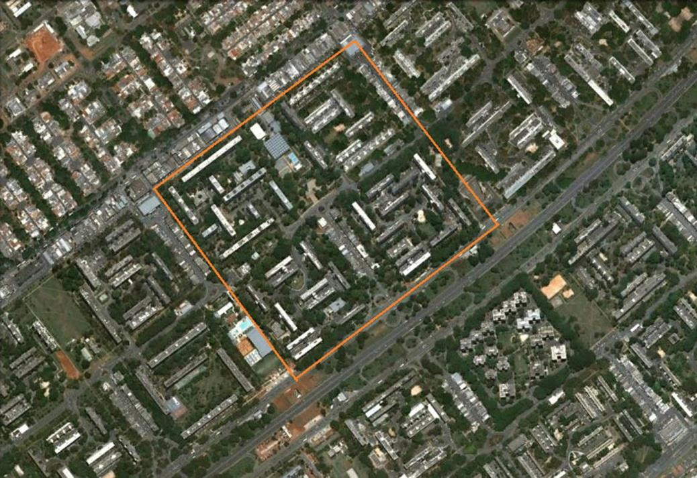
>
> Figura 4. Brasília: Superquadras 107, 108, 307 e 308. Fonte: Google
> Earth

A escala residencial estabelece um contraste com a escala grandiosa do
Eixo Monumental, cujo caráter abstrato, cenográfico e futurista alude,
paradoxalmente, aos eixos e perspectivas de Paris, aos gramados verdes
ingleses, à pureza de Diamantina e aos terraplenos e arrimos chineses do
começo do século XX. Entretanto, a realidade de Brasília distancia-se do
Plano de Lucio Costa. Além das tesourinhas, vistas por alguns moradores
como "labirintites viárias" (CUNHA, 2013, p. 66), outros problemas são
apontados, como mostra o filme de Joaquim Pedro de Andrade, 1967:

> Na verdade, a descrição quase que científica de Brasília funciona como
> um contraponto ao que está por vir, ou seja, às contradições que o
> título do filme indica. *Brasília: contradições de uma cidade nova*
> percebe o rumo da cidade, percebe não ser plausível enfatizá-la como
> apoteose arquitetônica, como muitos ainda a veem. São contradições que
> desconstroem o mito socialista de sua fundação, com antíteses do tipo:
> "a superquadra é o reino da vida familiar confortável" (\...) Brasília
> encarna o conflito básico da arte brasileira, fora do alcance da
> maioria do povo. O plano dos arquitetos propôs uma cidade justa, sem
> discriminações sociais, mas a medida que o plano se tornava realidade,
> os problemas cresciam para além das fronteiras urbanas em que se
> procurava conter. Na verdade são problemas nacionais, de todas as
> cidades brasileiras, que nesta, generosamente concebida, se revelam
> com insuportável clareza (CUNHA, 2013, p. 66).

# Duas matrizes

Se o modelo haussmaniano afirma a norma da cidade tradicional, o modelo
corbuseano surge como sua antítese morfológica e perceptiva. O primeiro
corresponde a uma matriz urbana figurativa; o segundo a uma matriz
urbana abstrata (PETERSON, 1980). O antagonismo perceptivo entre ambas é
descrito por Comas:

> O formato da cidade ideal moderna pode ser descrito como a acumulação
> de objetos construídos em um contínuo tratado como parque basicamente
> indiferenciado, cortado por autopistas e caminhos. Em contraposição, o
> formato da cidade tradicional pode ser descrito como a acumulação de
> espaços vazios \-- ruas e praças, configuradas por fachadas contínuas
> alinhadas \-- dentro de uma massa construída predominantemente
> indiferenciada, perfurada por pátios e quintais privados. Desde o
> ponto de vista perceptivo, no formato tradicional, a figura é o
> espaço, o fundo é construção. No formato modernista, a figura é o
> edifício, o fundo é paisa- gem (COMAS, 1986, p. 128). (Fig. 5)
>
> 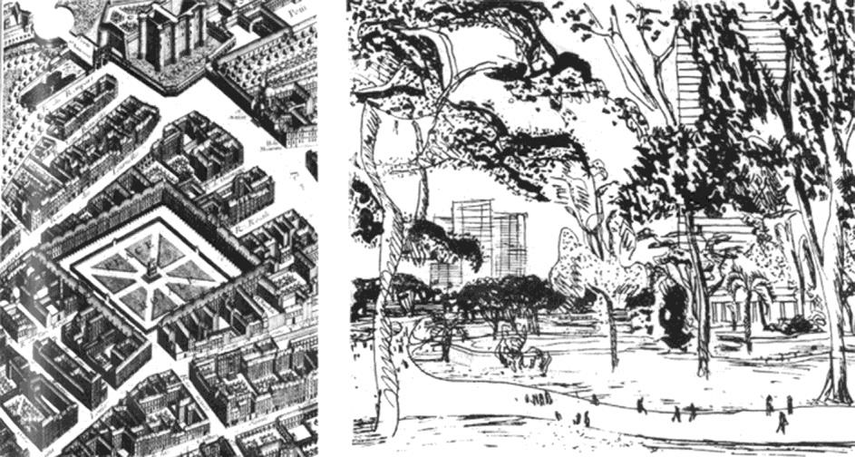
>
> Figura 5. Matrizes figurativa e abstrata: *Place des Voges* e *Ville
> Radieuse*. Fonte: ROWE; KOETTER, 1978, p. 55

A cidade no parque representa não apenas uma visão ideal, otimista e
alegórica da civilização industrial da era da máquina, mas uma tentativa
de ruptura e superação dos padrões formais e comportamentais
tradicionais.

# O Projeto do Bairro residencial da Praia de Belas e seus tempos

Os três primeiros tempos do Projeto do Bairro residencial de Praia de
Belas adotam o modelo haussmaniano: o primeiro corresponde ao Plano de
Melhoramentos e Orçamentos, elaborado em 1914 por Moreira Maciel, no
qual a orla era concebida como um grande *boulevard* \-- a Avenida Porto
\-- ligando o porto reformado à Praia de Belas, destinada a um cais de
saneamento. Apesar de não concretizado integralmente, o plano gerou
ideias para a cidade que futuramente possibilitariam a realização do
Projeto de 1953, como a obra de prolongamento da Avenida Borges de
Medeiros em 1927, estabelecendo a conexão do centro com a enseada da
Praia de Belas. (Fig. 6)

> 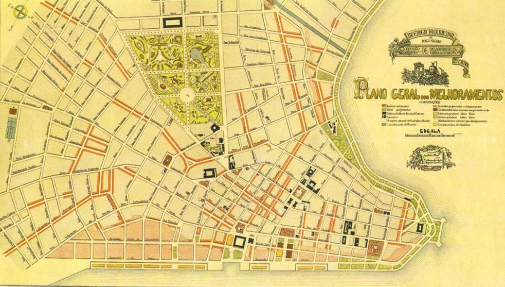
>
> Figura 6. Plano de Melhoramentos de Moreira Maciel, Porto Alegre,
> 1914. Fonte: ELARQA. v.33. 2000.

O segundo tempo corresponde à *Contribuição ao Estudo da Urbanização de
Porto Alegre*, 1936, um estudo que propõe reformas na cidade e trata a
Praia de Belas como um caso específico, sugerindo, além da sua conexão
com o centro através de uma avenida marginal, o saneamento, a ocupação
residencial e a ampliação da enseada através de aterros. (Fig. 7)

> 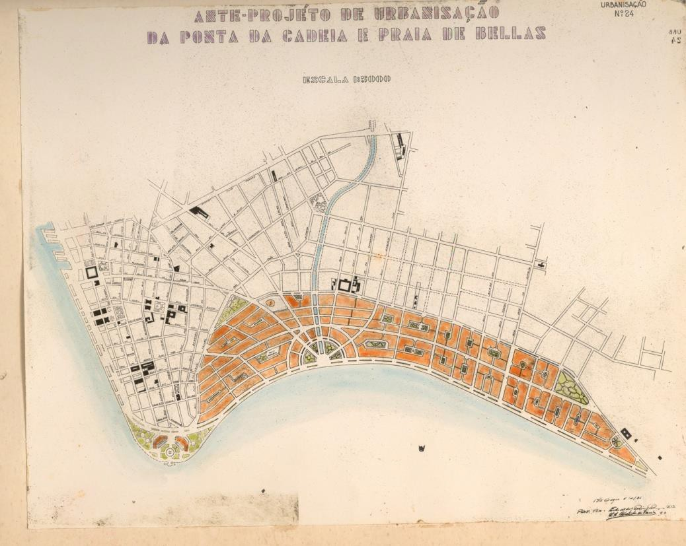
>
> Figura 7. Bairro Praia de Belas na Contribuição ao Estudo da
> Urbanização de Porto Alegre, 1936.Fonte: PMPA

O terceiro tempo se traduz no Plano Gladosch de 1943, no qual a Praia de
Belas é igualmente apresentada como um projeto específico. O plano se
caracteriza pela criação de uma malha de áreas verdes e de um sistema
viário radial, no qual a Avenida Beira Rio ajardinada se destaca,
estabelecendo um maior contato da cidade com o rio Guaíba. A área de
aterros da Praia de Belas seria parcelada através do prolongamento do
traçado viário existente, gerando quadras de 60 a 70 m de largura

por 200 a 250 m de comprimento; e lotes de 12m de frente, por 35 m de
fundos, que abrigariam 42.000 pessoas, numa densidade de 300 hab/ha.
(Fig. 8 e 9)

> 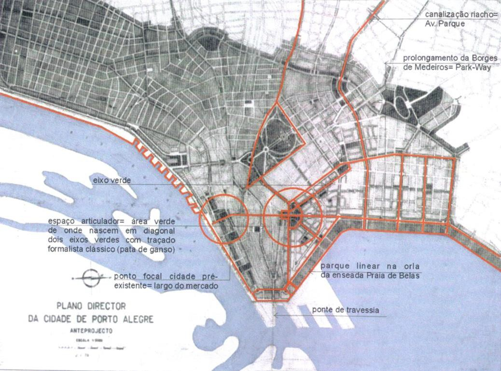
>
> Figura 8. Plano Gladosh. Fonte: BOHRER, 2001
>
> 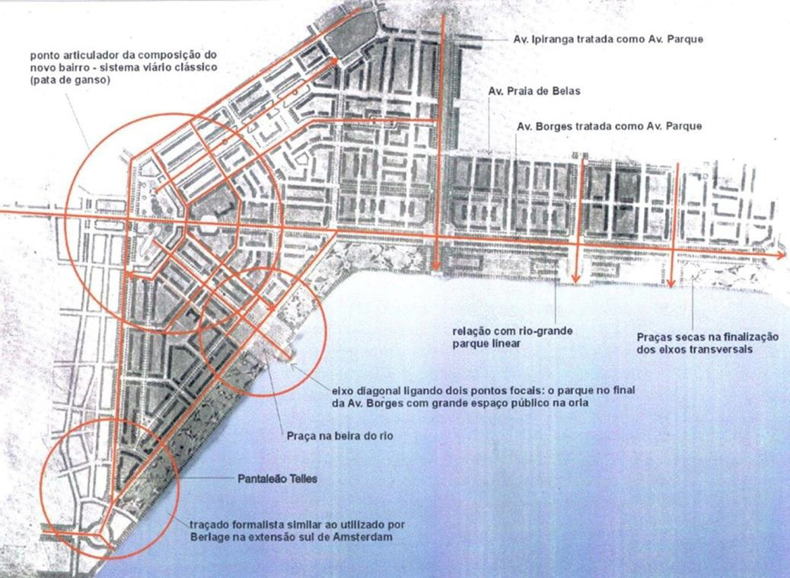
>
> Figura 9. Praia de Belas no Plano Gladosch. Fonte: BOHRER, 2001

Os dois últimos tempos filiam-se ao modelo corbuseno. O quarto tempo
corresponde ao Pré-Plano de Porto Alegre, elaborado em 1951 por Edvaldo
Paiva e Demétrio Ribeiro, no qual a área da Praia de Belas adquire
feições de um bairro moderno que embasa a versão de 1953. (Fig. 10)

> 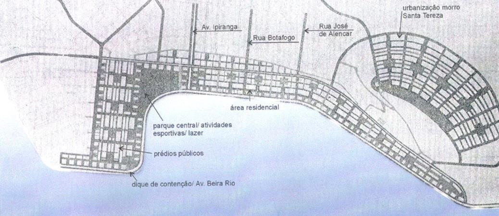
>
> Figura 10. Pré Plano. Fonte: BOHRER, 2001

O quinto tempo é o plano de 1959, o primeiro plano diretor de Porto
Alegre em forma de lei, no qual os ideais da Carta de Atenas se traduzem
no zoneamento de uso do solo urbano, na abertura de perimetrais, na
criação de mecanismos para a regulamentação das edificações visando a
paulatina substituição das tipologias então vigentes pelo prisma sobre
*pilotis*, afastado das divisas do lote e na concepção da Praia de Belas
como bairro residencial modelo (MACHADO, 2003).(Fig. 11)

> 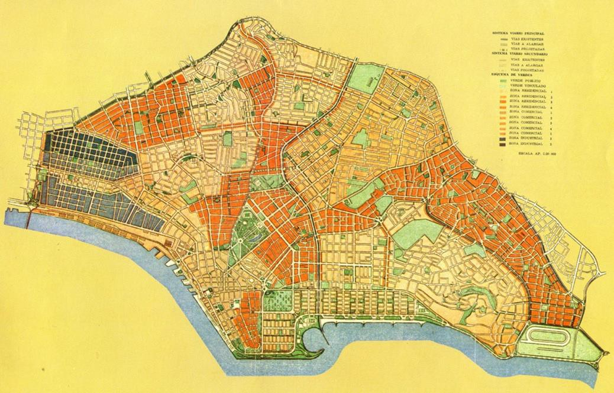
>
> Figura 11. Plano de 1959. Fonte: PMPA

# O Projeto do Bairro residencial da Praia de Belas e suas superquadras

O Projeto do Bairro residencial da Praia de Belas elaborado por Edvaldo
Pereira Paiva e Carlos Maximiliano Fayet em 1953, metonímia do plano de
1959, traz a superquadra a Porto Alegre, não como fato, nem como
sugestão, mas como projeto. O novo bairro seria implantado sobre 300 ha
de aterro hidráulico, um terreno artificial e plano protegido
longitudinalmente das cheias periódicas por um dique na altura de 6,00m,
sobre o qual se desenvolveria a Avenida Beira Rio, uma via rápida
ligando a península central à Ponta do Dionísio, na zona sul da cidade.
Transversalmente, o terreno seria cortado pela Avenida Ipiranga,
construída em ambos os lados do Riacho canalizado.

O desenho do conjunto, em forma de "L", é análogo ao avião do Plano
Piloto de Brasília, mas de forma assimétrica. Estrutura-se a partir do
prolongamento da Avenida Borges de Medeiros e de um eixo diagonal
traçado entre a antiga Ponte de Pedras e a baía artificial criada acima
da desembocadura do arroio Dilúvio, onde se localiza o centro esportivo
proposto, com um estádio para 100 mil pessoas, acompanhado de um grande
ginásio coberto, iate clube e cassino. Esse eixo é a diagonal de uma
superquadra de 22 ha, de uso público, na qual estão dispostas barras
residenciais de 20 pavimentos. A partir do eixo, arma-se a "asa" menor,
a leste, \-- a parte do aterro que alarga a península da área central da
cidade \--, e a "asa" maior, ao sul, correspondente ao aterro que amplia
a enseada da Praia de Belas.

O traçado viário hierarquizado subdivide as "asas" em avenidas
transversais ao rio, que delimitam unidades de vizinhança, subdivididas
em quadras parceladas em lotes de 15 por 30 m, resultando numa densidade
de 15 a 20 ha, servidas por ruas do tipo "entra e sai" e circulação para
pedestres. As ruas locais seguem a forma dos *Rédans da Ville Radieuse,*
e os blocos residenciais dispostos em torno de espaços verdes
reinterpretam a Cidade Jardim e as *Unités Habitationels*. (Fig. 12 e
13)

> 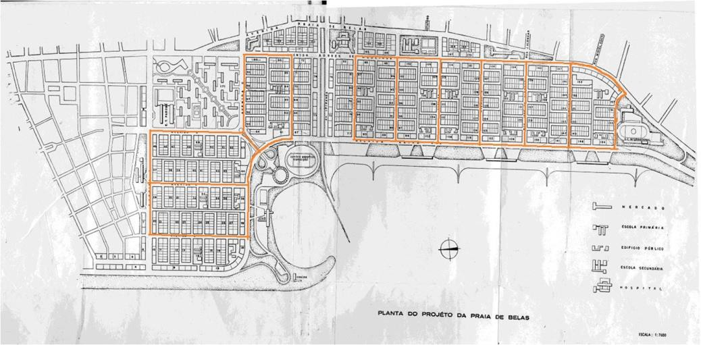
>
> Figura 12. Bairro Residencial da Praia de Belas, 1953. Fonte: Plano
> Diretor de Porto Alegre, 1964
>
> 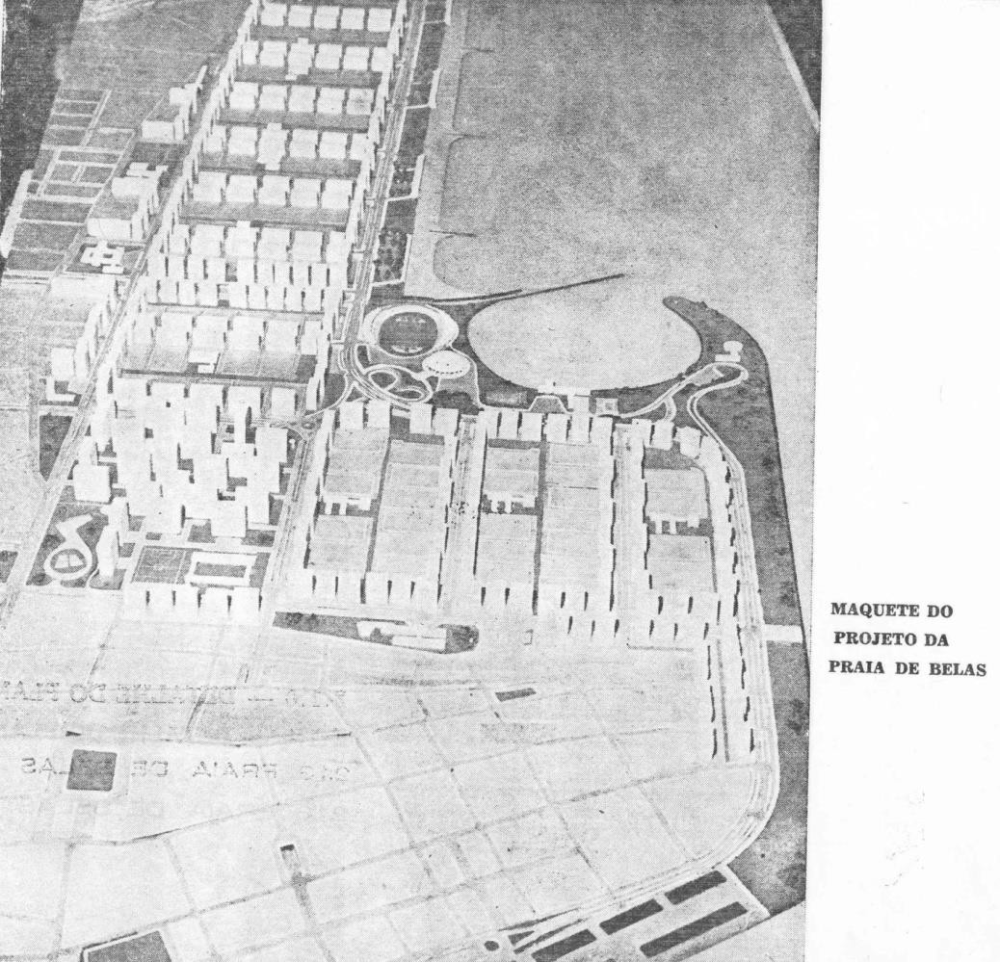
>
> Figura 13. Bairro Residencial da Praia de Belas, 1953. Fonte: idem

Os 1.870 lotes abrigariam 120.000 habitantes, resultando em uma
densidade de 400 hab/ha. Mercados de abastecimento implantam-se na
junção das diversas unidades e cada uma é dotada de uma escola primária
e uma secundária, um espaço verde público e setores para recreação
infantil. Um hospital complementa o conjunto.

Tipologicamente, preconiza-se o edifício modernista isolado do lote,
sobre *pilotis*, com térreo mais três pavimentos. Sobre as avenidas
longitudinais paralelas ao rio, Avenida Borges de Medeiros e Avenida
Beira Rio, estipulam-se lotes um pouco maiores e adota-se o
edifício-barra com 10 pavimentos, estacionamentos próprios, recuos de 6
m de frente e fundos, e de 4 m nas laterais. Nas ruas secundárias, são
previstos edifícios de 11 m de altura.

O novo desenho da enseada aproxima a cidade e a natureza. A faixa
litorânea entre o Rio Guaíba e a Avenida Beira Rio é formada por três
grupos de balneários em dois níveis: o da avenida, com bares e
restaurantes, e o da praia, com os vestiários. De acordo com Paiva,

> Essas são as características do projeto aprovado e em vias de execução
> imediata. Traçado racional, econômico e salubre. Conservação da
> integridade do terreno, continuidade de jardins e parques. Boa e
> uniforme orientação das vivendas. Caminhos próprios para os pedestres,
> protegidos e separados do trânsito veicular. Segurança e amplitude do
> espaço livre, para uso das crianças e recreio dos adultos. A futura
> Praia de Belas, assim concebida, adquirirá uma fisionomia totalmente
>
> distinta dos outros bairros da capital rio-grandense. A própria vida
> de seus habitantes adquirirá, seguramente, outro caráter. A natureza
> entrará a formar parte do ambiente cotidiano. Árvores, ar puro e sol
> deixarão, assim, de ser meros acidentes na vida do homem urbano
> (PAIVA; FAYET, 1956, p. 35).

Essa versão gaúcha dos grandes bairros de habitação coletiva do
Movimento Moderno, como o *Toulouse le Mirail,* não se concretizou.

# O papel do projeto

A implantação o Projeto do Bairro residencial da Praia de Belas
pressupõe o confronto entre as duas matrizes, figurativa e abstrata
provocando, em princípio, uma ruptura formal e social no processo mais
ou menos contínuo de construção da cidade. Questão específica e genérica
dos anos 1950 na América Latina: a inserção da arquitetura moderna na
cidade tradicional através de projetos e planos urbanos. (Fig. 14)

> 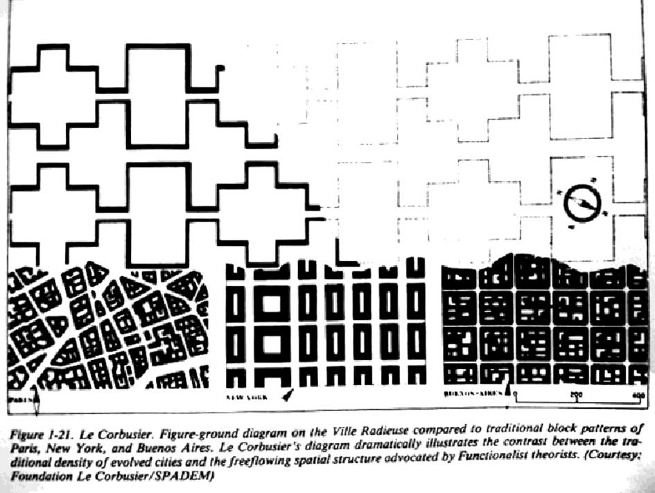
>
> Figura 14. Tecido corbuseano e tradicional. Fonte:
> [[http://www.fondationlecorbusier.fr]{.ul}](http://www.fondationlecorbusier.fr/)

Se em Brasília a superquadra é a célula que gera a cidade, em Porto
Alegre a superquadra é um elemento que contrasta com o quarteirão
tradicional, em termos de escala e conceito. O confronto de modelos
propicia, contudo, para os arquitetos da época, o desenvolvimento de
estratégias projetuais capazes de promover costuras e colagens entre
escalas tão distintas.

Trata-se de um confronto entre modelos e entre um modelo e a realidade
de uma cidade, originada de um modelo que já se tornou vida. Se o modelo
é algo para ser imitado, o projeto é a ferramenta intelectual capaz de
realizar a *mimese*, que não é simples cópia, valorizando seus
princípios e violando as suas regras.

A estratégia do Projeto da Praia de Belas consiste em deformar, no bom
sentido, os conceitos modernistas em função das características do
contexto. O conjunto representa uma ruptura com o modelo da cidade
tradicional em termos de escala,

organização e divisão do solo, hierarquização de vias e distribuição de
equipamentos. Mas a autonomia endossada pelo cinturão de edifícios em
altura localizados nas avenidas principais é amenizada pelas
continuidades estabelecidas entre a malha proposta e a existente, de
origem portuguesa. Essa adequação pressupõe a alteração das dimensões da
unidade de vizinhança original corbuseana.

As grandes torres conferem um caráter urbano ao conjunto, compatível com
a escala do centro e protegem a área residencial da poluição sonora e
visual das avenidas. Contrastam talvez demasiadamente com os blocos
baixos de habitação coletiva dos interiores das unidades de vizinhança
que, ainda assim, constituem a escala de morar suburbana típica e
aconchegante da cidade jardim. Em termos de fundo e figura, as
superquadras conformam uma escala intermediária entre o tecido mais
denso da cidade antiga e a paisagem do Guaíba.

Soluções como o Projeto do Bairro residencial de Praia de Belas
demonstram como um projeto capaz de articular modelo e circunstância
torna-se uma peça ativa na grande colagem que é a cidade. Sua dupla
condição espacial de *retrato* e de *modelo*, alude à Utopia de
Morus**:** obra de arte arquitetônica total em conjunto com uma
reformulação das suas questões de teoria e método.

No Projeto da Praia de Belas, o espaço *retrato* corresponde às suas
particularidades, como a proposição de uma nova orla, na qual a
habitação rodeada de verde aproximaria Porto Alegre do Rio Guaíba. O
espaço *modelo* se expressa através dos ideais de universalidade,
reprodutibilidade, zoneamento de usos, traçados reguladores e na nova
escala morfológica de superquadras que se opõem à tradição, o futuro
desejado no tempo do projeto.

Um filme sobre a Praia de Belas colocaria de fato a orla do Guaíba em
movimento, mostrando a mutação do espaço ao longo do tempo. Um final
feliz e ficcional poderia se desenhar com a triunfante cena moderna: o
cenário de bairro jardim enunciado pelo projeto reinventando a relação
da cidade com o rio e possibilitando uma vida coletiva justa e em
harmonia com a natureza.

Mas o projeto não se concretizou e talvez o modelo de paraíso dos anos
1950 não fosse viável atualmente, tempo caracterizado pela paranoia da
violência que esvazia os espaços urbanos públicos. Um filme realista
sobre a Praia de Belas mostraria certamente o fracasso do modelo: os
*pilotis* convertidos em estacionamentos e as superquadras fechadas com
cercas elétricas. Entretanto, o Projeto do bairro residencial da Praia
de Belas de 1953 faz parte da memória da cidade, marcando o primeiro
passo do movimento da cidade em direção à modernidade.

# Bibliografia

> ARGAN, Giulio Carlo. *Projeto e Destino*. São Paulo: Editora Ática,
> 2001.
>
> BOHRER, M. D. *O Aterro Praia de Belas e o Aterro do Flamengo*. 2001.
> 220 f. Dissertação (Mestrado em Arquitetura) Programa de Pesquisa e
> Pós-graduação em Arquitetura, Universidade Federal do Rio Grande do
> Sul, Porto Alegre.

CASTRO, L. G. R.; BEM, J. P. de; GIANSANTE, A. E. Recuperação urbana na
cidade de São Paulo: uma abordagem projetual para novas áreas
residenciais em antigas áreas destinadas a indústrias. XI Seminario de
Arquitectura Latinoamericana, 2005. Disponível em:

\<[http://www.rafaellopezrangel.com/Reflexiones%20sobre%20la%20arquitectura%20](http://www.rafaellopezrangel.com/Reflexiones%20sobre%20la%20arquitectura%20y%20el%20urbanismo%20latinoamericanos/Design/archivos%20texto/T2C01.pdf)
[y%20el%20urbanismo%20latinoamericanos/Design/archivos%20texto/T2C01.pdf](http://www.rafaellopezrangel.com/Reflexiones%20sobre%20la%20arquitectura%20y%20el%20urbanismo%20latinoamericanos/Design/archivos%20texto/T2C01.pdf)\>.
Acesso em: 17 jan. 2014.

CHOAY, Françoise. *A regra e o Modelo*: sobre a Teoria da Arquitetura e
do Urbanismo. São Paulo: Editora Perspectiva, 1985.

COMAS, C. E. O espaço da Arbitrariedade: considerações sobre o conjunto
habitacional BNH e o Projeto da cidade brasileira. *Projeto*, São Paulo,
n. 91, p. 127- 130, 1986.

CORBIOLI, N. Oscar Niemeyer: Superquadras, Brasília. Disponível em:

\<[http://arcoweb.com.br/projetodesign/arquitetura/oscar-niemeyer-superquadras-](http://arcoweb.com.br/projetodesign/arquitetura/oscar-niemeyer-superquadras-brasilia-08-02-2008)
[brasilia-08-02-2008](http://arcoweb.com.br/projetodesign/arquitetura/oscar-niemeyer-superquadras-brasilia-08-02-2008)\>.
Acesso em: 17 jan. 2014.

CUNHA, R. Cinema: o planejamento contradito. *O Pioneiro século 21*,
Brasília, DF, ano 12, n. 14, p. 64-67, abril 2013.

ELARQA. v.33. 2000.

> MACHADO, A. S. *A borda do rio em Porto Alegre: arquiteturas
> imaginárias, suporte para a construção de um passado*. 2003. 374 f.
> Tese (Doutorado em História)

\- Programa de Pós-Graduação em História, Universidade Federal do Rio
Grande do Sul, Porto Alegre.

MATOSO, D. A invenção da Superquadra. Resenha, 2009. Disponível em:

\<<http://docomomobsb.org/2009/07/22/a-invencao-da-superquadra/>\>.
Acesso em: 17 jan. 2014.

MATOSO, D. Reforma dos blocos de apartamentos funcionais da Câmara dos
Deputados, superquadra norte 302, blocos F e G, Brasília, DF. In:
PELLEGRINI, A. C. e VASCONCELOS, J.C. (orgs.) *Bloco (7)*, arquiteturas de morar. Novo
Hamburgo: Universidade Feevale, 2011. p. 56-76.

MONTEYS, Xavier. *La gran máquina*: la ciudad em Le Corbusier.
Barcelona: Ediciones del Serbal, 1996.

PAIVA, E.; FAYET, C. M. Urbanização da Praia de Belas em Porto Alegre,
R. G. S.

> *Revista Habitat*, Porto Alegre, v. 32, 1956.
>
> PETERSON, S. Space and Anti-Space*. The Harvard Architectural Review*,
> Cambridge, MA, v. 1, 1980.
>
> ROWE, C.; KOETTER, F. *Ciudad Collage.* Barcelona: Gustavo Gili, 1978.
