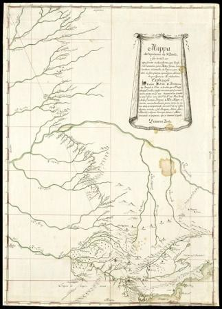
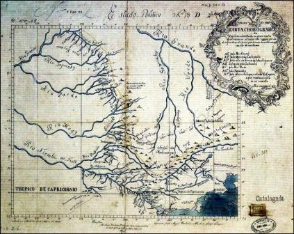
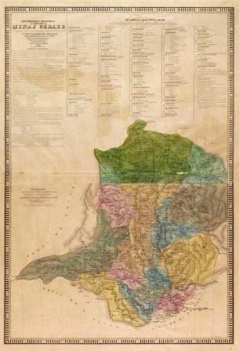
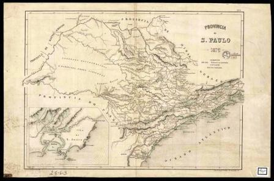

# Resumo

O desenvolvimento histórico de um determinado contexto se faz sobre e
com o espaço terrestre, e, dessa forma, toda formação social também é
territorial, pois, necessariamente, o social se espacializa. Neste
sentido, o objetivo deste trabalho é analisar e discutir os conflitos
políticos acerca dos limites territoriais entre São Paulo e Minas Gerais
e as articulações sociais dos entrantes mineiros, conferindo destaque ao
significado de território e aos processos de formação, ocupação e
transformação do que é hoje o território ocupado do nordeste paulista. A
questão acerca das disputas territoriais entre paulistas e mineiros
começou no ano de 1720, quando ocorreu a primeira demarcação oficial. A
partir dessa data, houve inúmeras e sucessivas tentativas de encerrar
essas disputas, situação que só foi resolvida em 1935, quando foram
efetivamente definidos e aceitos entre as partes os limites respectivos.
Paralelamente aos conflitos políticos, a migração de mineiros para o
nordeste paulista marcou a conformação social desse espaço físico. A
história da formação desse território revela, portanto, uma sociedade
específica em um espaço determinado, num intercâmbio contínuo que
possibilitou a humanização dessa área, materializando a sociabilidade
numa paisagem e numa estrutura territorial.

Palavras-chave: Disputas e formação. São Paulo e Minas Gerais. Conflitos
políticos. Articulações sociais. Território nordeste paulista.

# Abstract

The historical development of a given context is done upon earth and
space, and in that sense, every social formation is also territorial as
necessarily social articulations are spatialized. In this sense, the aim
of this paper is to analyze and discuss the political conflicts about
the limits of São Paulo and Minas Gerais and social articulations of
incoming miners, giving special emphasis to the meaning of territory and
the processes of training, occupation and transformation of what is now
the territory of northeastern São Paulo. The question about the
territorial disputes between paulistas and mining began in the year 1720
was the first official demarcation. From this date there have been
numerous and repeated attempts to try to end these disputes, a situation
that was only resolved in 1935, when they were effectively defined and
agreed between the parties the limits. Parallel to the political
conflicts migration of miners to the northeast of São Paulo provided
that in the social, space. The history of the formation of the territory
of northeastern São Paulo reveals therefore, a particular society at a
particular place, in a continuous exchange that enabled the humanization
of this area, materializing the sociability of a landscape and a
territorial structure.

Keywords: Disputes and training. São Paulo and Minas Gerais. Political
conflicts. Social joints. Territory northeast São Paulo.

# Introdução

O território é, antes de qualquer ideia, o resultado de relações de
poder, o que significa que não há um território sem que, antes, ocorra
uma trama de relações sociais. Em suma, "o território é um produto
socioespacial de relações sociais que são econômicas, políticas e
culturais e de ligações de redes internas e externas." (SAQUET, 2013, p.
81).

Um território pode ser formado por intermédio de uma construção militar
(como resultado de conquista), como construção política (área de
exercício de domínio), como construção econômica (atividades
produtivas), como construção jurídica (legitimidade do espaço) e, por
fim, como construção ideológica (identidade social alicerçada em uma
base

espacial). "A constituição de um território é, assim, um processo
cumulativo, a cada momento um resultado e uma possibilidade -- um
contínuo em movimento." (MORAES, 2005, p. 45).

O significado desse termo também pode estar associado a natureza e
sociedade; economia, política e cultura; ideia e matéria; identidades e
formas de representações; apropriação, dominação e controle;
descontinuidades; conexão e redes; domínio e subordinação; degradação e
proteção do meio ambiente; terra, formas espaciais e relações de poder;
diversidade e unidade. Assim, "cada combinação específica de cada
relação espaço- tempo é produto, acompanha e condiciona os fenômenos e
processos territoriais." (SAQUET, 2013, p. 24).

Como o objetivo deste trabalho é discutir a ocupação, formação e
transformação do território nordeste paulista, segundo os conflitos
históricos entre São Paulo e Minas Gerais, o significado de território
que melhor define a escala socioespacial deste estudo é o conceito de
território compreendido como fato social e político. Antonio Carlos
Robert Moraes acrescenta que o território não se restringe apenas a um
lugar de ação pragmática, mas num espaço de trocas materiais e
espirituais e da vida (MORAES, 2013, p. 101). Assim, assumimos para este
momento a ideia de território como produto das relações de poder, dos
conflitos de interesses e das articulações sociais.

# Disputas políticas e territoriais entre paulistas e mineiros

Em 23 de novembro de 1709, D. João V, rei de Portugal, determinou a
criação da Capitania de São Paulo, que foi desmembrada da Capitania do
Rio de Janeiro. A Capitania paulista compreendia terras dos atuais
estados de Mato Grosso, Mato Grosso do Sul, Rondônia, Goiás, Tocantins,
Minas Gerais, São Paulo, Paraná, Santa Catarina e Rio Grande do Sul. Em
1714, teve início o desbravamento da região de São João d'El Rei em
busca de riquezas minerais, que logo foram encontradas em abundância.

Com o intuito de obter maior controle sobre as terras ricas em ouro e
pedras preciosas, a Coroa portuguesa determinou, em 1720, a criação da
Capitania das Minas de Ouro, desmembrada da Capitania de São Paulo (Fig.
1). Com a criação da nova Capitania pelo alvará régio, fez-se necessária
a primeira demarcação oficial entre terras paulistas e mineiras:

> Hei por bem que na Capitania de São Paulo se crie hum novo governo e
> haja nelle hum Governador com a mesma jurisdicção, prerrogativas e
> soldo de oito mil cruzados cada anno, pagos em moeda e não em oitavos
> de ouro, e lhe determino por limites no sertão, pela parte que confina
> com o Governo de Minas, os mesmos confins que tem a comarca e
> ouvidoria de São Paulo com a comarca e ouvidoria do Rio das Mortes e
> pela parte marinha quero que lhe pertença o porto de Santos, e os mais
> daquella costa, que lhe ficão ao Sul, aggregando-se-lhe as Villas de
> Paraty, de Ubatuba e da Ilha de São Sebastião que desannexo do Governo
> do Rio de Janeiro. (*apud* Cintra, 1935, p. 8).
>
> Rio Grande
>
> Rio Sapucaí Mirim
>
# Capitania de Minas Gerais
>
> Rio Pardo
>
> Rio Mogi Guaçu
>
# Capitania de São Paulo
>
> Figura 1: Indicação da área de conflito no *Mappa da capitania de S.
> Paulo, e seu sertão em que devem os descobertos, que lhe forão tomados
> para Minas Geraes\...*, século XVIII, elaborado por Francisco Tosi
> Columbina. A mancha em verde indica as zonas de litígio. Fonte:
> Fundação Biblioteca Nacional
>
> Disponível em[: \<
> http://objdigital.bn.br/acervo_digital/div_cartografia/cart1033415.jpg](http://objdigital.bn.br/acervo_digital/div_cartografia/cart1033415.jpg)
> \>; Acesso em: 31 out. 2013.

Nestes tempos do século XVIII, o que valorizava os novos territórios,
conferindo motivo à sua ocupação e povoamento, eram os descobertos de
ouro (DOCUMENTOS INTERESSANTES (v. XI), 1896, p. 14). Essa assertiva,
possivelmente, foi a justificativa encontrada para que a Capitania das
Minas de Ouro mudasse "furtivamente o marco do morro do Caxambú para a
serra da Mantiqueira" (CINTRA, 1935, p. 9), como infere a representação
que o governador de São Paulo, Antonio da Silva Caldeira, nomeado em
1727, enviou ao rei de Portugal, na qual solicitava que as divisas
fossem restabelecidas.1

Uma vez consumada a usurpação de parte do território de São Paulo, foi
anulada a demarcação dos limites de 1720. No ano de 1731, D. João V, por
meio da Provisão Régia de 23 de fevereiro e a pedido do governador
paulista, determinou novas divisas:

> Fui servido por resolução de 20 deste mez e anno em consulta do Meu
> Conselho Ultramarino ordenar que o governador dessa Capitania (S.
> Paulo) se alargue para os montes (Serra da Bôa Vista) que ficam entre
> a Villa de Guaratinguetá e Rio das Mortes; pelo que ordeno ao
> governador das Minas que convosco
>
> 1 Segundo Cintra, era extremamente inconveniente tomar como referência
> de limites entre as duas Capitanias apenas um marco de pedra, em um
> determinado morro de uma região sertaneja. Pouco depois da emancipação
> das Minas, começaram os conflitos. Nesse momento, quando a comarca de
> São João d'El Rei, também conhecida como Rio das Mortes, mudou sem
> maiores explicações o marco, o governador de São Paulo, na época
> Antonio da Silva Caldeira, nomeado em 1727, enviou uma carta ao Rei de
> Portugal sobre a mudança e que de pronto fosse estabelecido o morro do
> Caxambú ou *Bôa Vista* como marco, que poderá ser observado na figura
> 2 (CINTRA, 1935, p. 9).
>
> **ajuste os limites**, que por esta devem ter hum e outro governo, e
> me dareis conta para o approvar. (*apud* CINTRA, 1935, p. 10, grifo
> nosso).

Essa segunda demarcação, prevista na Provisão Régia de 23 de fevereiro
de 1731, suscitou dúvidas pelo fato de ter ficado incompleta em
decorrência de o governador mineiro não cumprir o que determinava a
Coroa. Além desse fato, a descrição da Provisão Régia de 1731 deixou a
responsabilidade de legitimar as divisas em comum acordo para ambos os
governadores, o que, de fato, não aconteceria, pois estava em disputa o
interesse por futuras áreas auríferas.

O conde de Bobadella, Gomes Freire de Andrade, então governador da
Capitania do Rio de Janeiro, preocupado com a situação, enviou um ofício
ao Rei, em 1747, para que uma nova demarcação fosse estabelecida entre a
Capitania de São Paulo e a Capitania das Minas do Ouro. Em 30 de abril
de 1747 foi emitida a Provisão Régia que determinava a serra da
Mantiqueira como limite entre as duas Capitanias.

Entretanto, paralelamente à questão da divisão civil entre as duas
Capitanias, havia ocorrido a divisão eclesiástica entre dois bispados, o
de São Paulo e o de Mariana, "a bulla creando em 1745 os bispados de São
Paulo, Marianna e Goyaz marcou os limites dos dois primeiros em termos
que admittiam diversas interpretações." (DOCUMENTOS INTERESSANTES (v.
XI), 1896, p. 38).

A conformação territorial adotada por Portugal tinha como condição gerar
rendimentos; assim, tributações, impostos e outros tipos de encargos
foram promulgados. Como alternativa para pagar os impostos reais, as
capitanias buscaram na ampliação de suas fronteiras novas áreas
contribuintes. Segundo Beatriz P. S. Bueno, em seu estudo sobre a
formação da Capitania de São Paulo (1532-1822), na lógica do processo de
colonização, a mudança por áreas de interesse e a importância quanto ao
controle metropolitano em determinada região condicionava a redefinição
das outras regiões (BUENO, 2009, p. 270).

Quando da publicação da terceira demarcação (ano de 1747), já se dava
notícias de novas descobertas em terras da Capitania de São Paulo. Os
mineiros encontravam-se intimidados pelos paulistas em razão do conflito
anterior, assim, ao contrário da violência, Minas Gerais movimentou seu
abundante ouro com interesse nas novas descobertas. O resultado foi
infeliz: o aniquilamento da Capitania de São Paulo, que foi anexada à
Capitania do Rio de Janeiro em 1748. Para Beatriz P. S. Bueno, a partir
de então, a Capitania de São Paulo deixou de ter um governo autônomo,
ficando como simples comarca. "Escapando aos olhos fixos de Portugal,
desenvolveu-se ao sabor das circunstâncias." (BUENO, 2009, p. 278).

A Carta Régia de 9 de maio de 1748 decretou que D. Luís de Mascarenhas,
defensor de São Paulo, deveria voltar para Lisboa. Goiás e Mato Grosso
foram desmembrados do território paulista. Nessa mesma Carta, o Rei de
Portugal concedeu plenos poderes ao governador da Capitania do Rio de
Janeiro para que demarcasse novas divisas "entre S. Paulo e Minas, pelo
Rio Grande e pelo rio Sapucahy, ou por onde lhe parecesse." (CINTRA,
1935, p. 14).

O conde Gomes Freire governou as Capitanias de São Paulo, Minas Gerais e
Rio de Janeiro até sua morte, em 1763. Para substituí-lo, o governo de
Portugal nomeou o conde da Cunha como vice-rei do Brasil e governador
especial do Rio e de São Paulo. Para a administração da Capitania de
Minas foi nomeado Luís Diogo Lobo da Silva.

No ano seguinte (1764), a metrópole taxou o imposto de cem arrobas de
ouro por ano. Os habitantes das minas se mostraram descontentes com o
tributo; em setembro desse mesmo ano, Luís Diogo saiu para "dar um giro
pelos confins da mesma comarca (São João d'El Rei)" (*apud* CINTRA,
1935, p. 18) e, nesse "giro", avançou um pouco mais sobre as terras
auríferas paulistas.

O conde da Cunha, preocupado com a situação de São Paulo, enviou uma
representação à Coroa sugerindo o restabelecimento da Capitania
paulista. Em Carta Régia de 4 de fevereiro de 1765, a Coroa respondeu a
representação do conde com parecer positivo para o restabelecimento de
São Paulo e nomeando D. Luiz Antônio de Souza Botelho Mourão, o Morgado
de Mateus, como Governador e Capitão General da mesma Capitania.

> Segundo Heloísa L. Bellotto, a restituição da autonomia da Capitania
> não tinha como dever apenas uma necessidade geral, geopolítica e
> administrativa, mas também atendia a uma necessidade econômica, o
> renascimento da agricultura (BELLOTTO, 1979, p. 45). A pesquisadora
> Maria Fernanda Derntl, em trabalho recente, acrescenta que a Coroa
> Portuguesa impôs também uma nova agenda para a Capitania de São Paulo
> sob o governo de Mateus, a de povoar com sentido de reorganizar a
> distribuição espacial da população. "Povoar aproximava-se da noção de
> urbanizar." (DERNTL, 2013. P. 74-75).

No ano de 1765, em razão das disputas entre mineiros e paulistas acerca
dos limites das Capitanias, o conde da Cunha organizou uma "Junta" com
homens ilustrados daquele tempo para que pudessem fazer as demarcações,
seguindo as formalidades legais da época. Essa "Junta" ficou conhecida
como *Assento da Junta do Rio de Janeiro* e estabeleceu novos limites
conforme o mapa elaborado pelo Morgado de Mateus em 1766 (Fig. 2):

> **Rio Grande**
>
# Rio Sapucaí Mirim
>
# Rio Pardo
>
# Rio Mogi Guaçu
>
# A2 A1 A4 A3
>
# A5
>
# A7
>
# A6
>
> Figura 2: Interpretação da divisa entre Minas e São Paulo na Carta
> *Chorografica* da Capitania de São Paulo\...; elaborada pelo Morgado
> de Mateus. A linha de cor vermelha e os códigos (A1, A2, A3, A4, A5,
> A6 e A7) definem as divisas entre Minas Gerais e São Paulo. A linha de
> cor amarela define o caminho de Goiás. Fon[te:
> Novo](http://www.novomilenio.inf.br/) Milenio
>
> Disponível em[: \<
> http://www.novomilenio.inf.br/santos/mapa41g.htm](http://www.novomilenio.inf.br/santos/mapa41g.htm)\>;
> Acesso em: 31 out. 2013.

A legenda deste mapa, no alto, do lado direito, apresenta alguns códigos
e refere-se a alguns pontos que foram utilizados como marcos divisórios.
A delimitação das divisas se inicia no primeiro quadrante depois da
linha do Trópico de Capricórnio, lado direito; tendo como ponto de
partida o rio Grande (A1), o traçado percorre o morro do Caxambu (A2),
morro pertencente às Gerais; em seguida a linha transpassa a serra da
Mantiqueira (A3), em seguida passa novamente pelo morro do Caxambu (A4),
depois segue pelo rio Verde (A5), para logo depois alcançar o rio
Sapucaí (A6) mineiro, por fim chega ao morro do Lopo (A7) e segue seu
trajeto pela estrada de Goiás.

No Brasil Império, entre os anos de 1827 e 1879, tanto a Província de
São Paulo como a Província de Minas Gerais emitiram uma série de
representações, pareceres e entendimentos

que não avançaram. Segundo Maria Fernanda Derntl, a Coroa, de certo
modo, sempre favoreceu discretamente os mineiros, já que o alargamento
de seus territórios lhe renderia maiores vantagens fiscais (DERNTL,
2013, p. 131).

Com a instauração da República no Brasil (1889), novamente mineiros e
paulistas tentaram chegar a um acordo acerca das divisas de seus
estados. Convênios, acordos, projetos, decretos, relatórios, entre
outros, foram elaborados, porém, nenhum deles proporcionou uma
conciliação de comum acordo. Foi somente em 25 de maio de 1935 que o
Decreto Constitucional do Governador de São Paulo, Armando de Salles
Oliveira, conseguiu a fixação de uma linha conciliatória "para a solução
definitiva da questão de limites." (CINTRA, 1935, p. 104).

Colocava-se, assim, fim a um conflito que perdurou por mais de dois
séculos. Paralelamente a esses acontecimentos, o nordeste do estado de
São Paulo, com os entrantes mineiros, foi perdendo gradualmente o
*status* de sertão para formar um território, não mais entendido como
elemento natural ou artificial, mas como produto das relações sociais e
políticas a partir das quais, ao longo desse período de conflito, uma
rede de cidades se formou.

# Mineiros em terras paulistas: a formação territorial do nordeste de São Paulo

O movimento migratório de mineiros em direção às terras paulistas,
especialmente ao nordeste, começou de maneira tímida e pouco expressiva,
a partir das últimas décadas do século XVIII, mas, já nos primeiros anos
do século XIX, houve uma intensificação desse movimento.

Segundo Cláudia Damasceno Fonseca, essa disseminação de mineiros em
direção às terras próximas e incultas não pode ser justificada
exclusivamente pela exaustão da economia mineira que começou a partir do
século XVIII. "Durante este período, o povoamento dissemina-se pelas
regiões periféricas, afastadas dos principais centros de poder, e
deve-se menos à mineração que às atividades agropecuárias e comerciais."
(FONSECA, 2011, p. 34).

Era fato o descontentamento geral dos habitantes da Capitania de Minas
Gerais com o pagamento do Imposto Real (lei de dezembro de 1750). Se
moradores e governantes não conseguissem atingir tal cifra, era cobrada
deles a "derrama"; uma vez não atingidas as arrobas de ouro, caberia a
todos da Capitania mineira se juntarem e doarem o que tinham em ouro e
pedras preciosas até atingir as cem arrobas estabelecidas.

Outro fator a ser analisado é a Lei da Polícia de 25 de junho de 1765.
Para Heloísa L. Bellotto, essa lei regulava a movimentação de cidadãos
(BELLOTTO, 1979, p. 94). De certa maneira a lei de 1765 buscava
controlar a saída e o regresso de paulistas. O Morgado de Mateus, com o
objetivo de restabelecer a Capitania de São Paulo, adotou uma política
de controle e povoamento. Essa vigilância por parte das autoridades
paulistas foi mencionada pelo Governador das Minas, Bernardo José de
Lorena2, em carta de 1765:

> Esta Capitania \[Minas Gerais\] pela sua vastíssima extensão e igual
> Povoação quase circular, não permitte darem-se Despachos para sahirem
> della os seus habitantes como na de S. Paulo se pratica, motivo porque
> não posso alterar o que sempre se observou, por evitar infinito
> incommodo a estes Povos (*apud* Cintra, 1935, p. 39).

Segundo Lucila R. Brioschi, desde fins do século XVIII os criadores
mineiros começaram a descer a Serra da Mantiqueira, procurando se
estabelecer em São Paulo, precisamente nas terras da então freguesia de
Franca, momento em que existia uma incipiente

> 2 Bernardo José de Lorena governou a Capitania de São Paulo entre os
> anos de 1788 e 1797. Em 1797, logo depois de deixar o cargo de
> governador de São Paulo, assumiu o cargo de Governador da Capitania de
> Minas Gerais, que exerceu até 1805.

rede urbana. Esses entrantes das Gerais "dedicavam-se sobretudo à
criação de gado e à formação das tradicionais roças de milho, feijão,
mandioca e outros gêneros usados no seu sustento e ração complementar
para as criações." (BRIOSCHI, 1995, p. 39).

Aparentemente, os primeiros mineiros que se aventuraram pelo nordeste
paulista não vieram de maneira despreparada. Havia uma sistemática mais
ou menos regular. Antes de migrarem, a maioria dos entrantes buscava
informações com familiares que ainda estavam nas Gerais sobre os
parentes que já haviam se estabelecido no então Sertão do Rio Pardo,
território que pertencia à vila de Mogi Mirim, e sobre as localidades em
que se encontrariam terras boas e incultas. "Somente após a instalação
das primeiras benfeitorias e colhidos os primeiros frutos, o restante da
família passava para a nova moradia." (BACELLAR; BRIOSCHI (orgs.), 1999,
p. 66).

Em fins do século XVIII, o interesse por parte dos mineiros nessa região
era modesto. No início do século XIX, esses números sofrem alterações,
em razão da formação da Freguesia de Franca em 1804. (PICCINATO JUNIOR,
2012, p. 53). No ano de 1804, o número de mineiros nessas terras
representavam 24,7%, contra 4,6% de outras origens, para um total de
terras desocupadas de 71,7%. Em 1824, quando já haviam sido fundadas as
Freguesias de Casa Branca e Batatais, respectivamente nos anos de 1814 e
1815, o número de mineiros passou para 75%, de outras origens caiu para
3% e o total de terras ainda incultas representava 22% (CHIACHIRI FILHO,
1986, p.141).

A naturalidade dos migrantes das Gerais entre os anos de 1804 e 1824
era, em sua maior parte, das comarcas centrais das Minas Gerais. Da
Comarca do Rio das Mortes migraram 310 mineiros, representando um total
de 40,61%; da Comarca do Rio das Velhas, 213, equivalendo a 27,90%; da
Comarca de Ouro Preto, 83, ou seja, 10,87% do total; da Comarca de
Paracatu, 81 mineiros, representando 10,87%; e da Comarca do Serro
Frio,3 apenas um entrante foi registrado, porcentagem de 0,13%.
Populações de outras regiões do Brasil (Goiás, Rio de Janeiro e São
Paulo) e de Portugal, juntas, representaram apenas 9,42% 4 (Fig.3).

> 3 Nos livros de casamentos da Igreja Matriz de Franca encontramos
> referência à Comarca do Serro Frio, na
>
> *Carta topografhica\...,* essa Comarca está escrita como Comarca do
> Ferro Frio.
>
> 4 As porcentagens referem-se à quantidade de noivos originários dos
> núcleos urbanos das Comarcas de Minas Gerais e de outras regiões do
> Brasil. Fonte: Livros de casamentos da Igreja Matriz de Franca.
>
> **C. de Paracatu**
>
# C. do Ferro
>
# C. do Rio Frio das Velhas
>
# C. de Ouro Preto
>
# C. do Rio das
>
# Mortes
>
> Figura 3: Interpretação nossa na *Carta topographica e administrativa
> da província de Minas Geraes*, 1849, de Visconde de Villiers de L\'lle
> Adam. Destacamos nesta Carta as Cormarcas de origem dos entrantes
> mineiros no nordeste de São Paulo. Fonte: Fundação Biblioteca
> Nacional.
>
> Disponível em: \<
> [http://objdigital.bn.br/objdigital2/acervo_digital/div_cartografia
> cart67925/cart67925\_
> 13.jpg](http://objdigital.bn.br/objdigital2/acervo_digital/div_cartografia%20cart67925/cart67925_%2013.jpg)
> \>; Acesso em: 31 out. 2013.

Outro aspecto interessante refere-se à estrutura familiar. O número de
famílias formadas por "casal+filhos" destacava-se em relação às demais
estruturas, como "casal+agregados", "casal só", entre outros. O número
de famílias formadas por casal mais os filhos era de 24 no ano de 1801;
no ano de 1817, os números chegam a 169 famílias e, em 1825, já se
somavam

292 famílias (BRIOSCHI, 1995, p. 169). A família nuclear foi a
responsável pelas articulações sociais que resultaram na formação
territorial do nordeste do estado de São Paulo.

São Paulo buscou, por meio da política de *povoar* do Morgado de Mateus,
respaldo para manter o território nordeste paulista sob sua
administração, pois Minas Gerais, por meio da Vila de Jacuí tentava
anexar essa região à sua Capitania. "Durante a administração do Conde de
Palma5 a questão local de maior importância foi a dos limites entre
Franca e Jacuhy, que já antes tinham reclamado simultaneamente a
passagem da categoria de freguezia para a de Villa." (DOCUMENTOS
INTERESSANTES (v. XI), 1896, p. 59). Franca foi fundada como Freguesia
da Vila de Mogi Mirim em 1804, durante o governo de Antônio José da
Franca e Horta (1802-1811). Para a formação territorial da nova
freguesia, o governo da Capitania de São Paulo destinou o território
entre o rio Mogi Guaçu e o rio Grande, terras estas

desmembradas da Vila de Mogi Mirim (Fig.4).

> 5 O conde de Palma, Francisco de Assis Mascarenhas, foi governador de
> Goiás entre os anos de 1804 e 1809; depois se tornou governador da
> Capitania das Minas Gerais durante os anos de 1810 a 1814 e, em
> seguida, passou a governar a Capitania de São Paulo, entre os anos de
> 1814 e 1819, assumindo depois a Capitania da Bahia.
>
> **Rio Grande**
>
# Rio Sapucaí Mirim
>
# Rio Pardo
>
# Rio Mogi Guaçu
>
> Figura 4: Em destaque, as terras que foram desmembradas da vila de
> Mogi Mirim para formar a Freguesia de Franca em 1805; interpretação
> feita sobre o Mapa da Província de São Paulo, 1879, de Claudio
> Lomellino de Carvalho. Fonte: Biblioteca Nacional (adaptado pelos
> autores)
>
> Disponível em: \<
> <http://objdigital.bn.br/objdigital2/acervo_digital/div_cartografia/cart168295/cart168295.jpg>
> \>; Acesso em: 08 jan. 2014.

Em 1814, a então Freguesia de Jacuí, pertencente à Vila de Campanha-MG,
foi elevada à condição de Vila. Sentindo-se ainda mais fortalecida, já
que Franca se manteve como Freguesia, Jacuí continuou com as investidas
sobre as terras da região de Franca. Preocupados com a situação, os
administradores civis e eclesiásticos paulistas atenderam aos pedidos
para a criação de mais duas freguesias. Em 1814, foi fundada a Freguesia
de Casa Branca e, em 1815, a de Batatais, ambas subordinadas à Vila de
Mogi Mirim, e, novamente, o território do nordeste paulista passou por
uma reconfiguração (Fig. 5).

> **Rio Grande**
>
# 1
>
# Rio Sapucaí Mirim
>
# 2
>
# 3 Rio Pardo
>
# Rio Mogi Guaçu
>
> Figura 5: Em destaque a Freguesia de Franca (**1**), Freguesia de
> Batatais (**2**) e a Freguesia de Casa Branca (**3**). Interpretação
> feita sobre o *Mapa da Província de São Paulo*, 1879, de Claudio
> Lomellino de Carvalho Fonte: Biblioteca Nacional Disponível em: \<
> <http://objdigital.bn.br/objdigital2/acervo_digital/div_cartografia/cart168295/cart168295.jpg>
> \>; Acesso em: 08 jan. 2014.

Mesmo com a formação das três freguesias, a Vila de Jacuí ainda
alimentava o desejo de domínio dessas terras. Em 1821, a freguesia de
Franca foi elevada ao *status* de vila,

> consequentemente, ela passou a ter o direito de se autogerir, de
> possuir uma câmara e a jurisdição de um território e terras para a
> renda. Dessa forma, as Freguesias de Batatais e Casa Branca passaram
> para a responsabilidade da Câmara de Franca.
>
> Os desmembramentos territoriais na área em litígio entre paulistas e
> mineiros coformaram historicamente uma rede urbana complexa (Tabela
> 1).
>
> Tabela 1: Desmembramento territorial e urbano do nordeste paulista.
> Fonte: Quadro do desmembramento territorial- administrativo dos
> municípios paulistas, 1995 (pranchas em anexo).

+----------------------+----------------------+----------------------+
| > **Franca** (1804)  | > **Casa Branca**    | > **Batatais**       |
|                      | > (1814)             | > (1815)             |
+======================+======================+======================+
| > Ituverava (1847)   | > Caconde (1841)     | > Cajuru (1850)      |
| >                    | >                    | >                    |
| > Igarapava (1851)   | > São Simão (1842)   | > Ipuã (1859)        |
| >                    | >                    | >                    |
| > Rifaina (1873)     | > Mococa (1856)      | > Santo Antônio da   |
| >                    | >                    | > Alegria (1866)     |
| > Patrocínio         | > Divinolândia       | > Morro Agudo (1872) |
| > Paulista (1874)    | > (1865)             | >                    |
| >                    | >                    | > Nuporanga (1873)   |
| > Jeriquara (1885)   | > Santa Rita do      | >                    |
| >                    | > Passa Quatro       | > Jardinópolis       |
| > Buritizal (1897)   | > (1870) Ribeirão    | > (1892)             |
| >                    | > Preto (1870)       | >                    |
| > São José da Bela   | >                    | > Cássia dos         |
| > Vista (1897)       | > São José do Rio    | > Coqueiros (1899)   |
| > Itirapuã (1900)    | > Pardo (1874) Santa | > Brodósqui (1902)   |
| >                    | > Cruz das Palmeiras | >                    |
| > Pedregulho (1902)  | > (1881) Serra Azul  | > São Joaquim da     |
| >                    | > (1885)             | > Barra (1902) Sales |
| > Cristais Paulista  | >                    | > Oliveira (1906)    |
| > (1910)             | > Tambaú (1892)      | >                    |
| >                    | >                    | > Guaíra (1908)      |
| > Ribeirão Corrente  | > Santa Rosa do      | >                    |
| > (1910)             | > Viterbo (1896) São | > Orlândia (1909)    |
| >                    | > Sebastião da Gama  |                      |
| > Restinga (1911)    | > (1896) Itabi       |                      |
| >                    | > (1898)             |                      |
| > Guará (1914)       | >                    |                      |
| >                    | > São Sebastião da   |                      |
| > Miguelópolis       | > Gama (1898)        |                      |
| > (1927)             | > Tapiratiba (1906)  |                      |
| >                    | >                    |                      |
| > Aramina (1934)     | > Pontal (1907)      |                      |
|                      | >                    |                      |
|                      | > Serrana (1912)     |                      |
|                      | >                    |                      |
|                      | > Padrópolis (1916)  |                      |
+----------------------+----------------------+----------------------+

# Conclusão

> Este trabalho buscou esclarecer que território não significa
> necessariamente a circunscrição de um espaço territorial, é
> fundamental a atuação de outros elementos, de outras condicionantes.
> As análises e discussões apontaram que um território é o conteúdo de
> suas relações, é o que acontece em sua unidade interna e externa, numa
> relação de indivíduos historicamente condicionados.
>
> O processo de urbanização empregado por São Paulo demonstra um
> raciocínio inteligente das autoridades civis e eclesiásticas paulistas
> na questão de domínio do território. Com o decorrer do tempo, novos
> núcleos urbanos foram surgindo, ocasionando novos desmembramentos
> territoriais, complicando ainda mais as investidas de Minas Gerais.
> Tal situação, contudo, não significou o fim dos problemas, apenas os
> deslocou de lugar, ou seja, as disputas, até 1935, passaram a se
> concentrar nas áreas limítrofes. À margem dessa conjuntura,
> identificamos a sutileza dos paulistas em fazer dos entrantes mineiros
> os atores sociais que ajudaram a construir o território do nordeste
> paulista.
>
> Conclui-se que, na construção do território do nordeste paulista, os
> indivíduos são e estão em relação com outros indivíduos mediante um
> processo correlato em que articulações e conflitos circunscrevem e
> espacializam uma unidade. Neste caso, essa unidade se deu pela
> presença de uma população mineira, embora governada por paulistas.

# Referências bibliográficas

BACELLAR, C. de A. P., BRIOSCHI, L. R.(orgs.). *Na Estrada do
Anhanguera:* uma visão regional da história paulista. São Paulo:
Humanitas FFLCH/USP, 1999.

> BELLOTTO, H. L. *Autoridade e conflito no Brasil colonial:* o governo
> do Morgado de Mateus em São Paulo: 1765-1775. São Paulo: Conselho
> Estadual de Artes e Ciências Humanas, 1979.

BRIOSCHI, L. R. *CRIANDO HISTÓRIA:* paulistas e mineiros no nordeste de
São Paulo (1725-1835). 1995. 266f. Tese (Doutorado em Sociologia).
Faculdade de Filosofia, Letras e Ciências Humanas da Universidade de São
Paulo, São Paulo, 1995.

> BUENO, B. P. S. *Dilatação dos confins:* caminhos, vilas e cidades na
> formação da Capitania de São Paulo (1532-1822). *Anais do Museu
> Paulista:* História e Cultura Material, v. 17, n. 2, p.251-294,
> jul.-dez. 2009.
>
> CHIACHIRI FILHO, J. *Do Sertão do Rio Pardo à Vila Franca do
> Imperador.* Ribeirão Preto: Ribeirão Gráfica e Editora Ltda., 1986.
>
> CINTRA, A. *A questão de limites entre São Paulo e Minas.* São Paulo:
> Typografia Paulista, 1935.

DERNTL, M. F. *MÉTODO E ARTE:* urbanização e formação territorial na
Capitania de São Paulo, 1765-1811. São Paulo: Alameda, 2013.

DOCUMENTOS INTERESSANTES PARA A HISTÓRIA E COSTUMES DE S. PAULO.

Vol. XI. *Divisas de S. Paulo e Minas Gerais*. São Paulo: Typografia, 1896. 
Disponível em: \<
[http://www.delphos.biblioteca.unesp.br/bd/bfr/or/10.5016_10-ORD
CISP-06-](http://www.delphos.biblioteca.unesp.br/bd/bfr/or/10.5016_10-ORD%20CISP-06-11_volume_11/)
[11_volume_11/](http://www.delphos.biblioteca.unesp.br/bd/bfr/or/10.5016_10-ORD%20CISP-06-11_volume_11/)\>;
Acesso em: 29 out. 2013.

> FONSECA, C. D. *Arraiais e vilas d'el rei:* espaço e poder nas Minas
> setecentistas. Belo Horizonte: Editora UFMG, 2011.
>
> MORAES, A. C. R. *Território e História no Brasil*. São Paulo:
> Annablume, 2005. MORAES, A. C. R. *Território na geografia de Milton
> Santos*. São Paulo: Annablume, 2013.

PICCINATO JUNIOR, D. *Terra urbana, patrimônio fundiário:* uma análise
histórica da apropriação do solo na configuração do urbano no nordeste
paulista (1800-1930). 2012. 341f. Dissertação (Mestrado em Urbanismo) --
Programa de Pós-Graduação em Arquitetura e Urbanismo, Pontifícia
Universidade Católica de Campinas, 2012.

SÃO PAULO (ESTADO) SECRETARIA DE ECONOMIA E PLANEJAMENTO. COORDENADORIA
DE PLANEJAMENTO REGIONAL. INSTITUTO GEOGRÁFICO E

> CARTOGRÁFICO. *Quadro do desmembramento territorial-administrativo dos
> municípios paulistas*. São Paulo: IGC, 1995.
>
> SAQUET, M. A. *Abordagens e concepções sobre território*. 3. ed. São
> Paulo: Outras Expressões, 2013.
