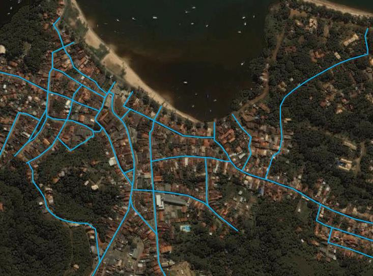

# Resumo

Esta pesquisa procurou construir uma sinopse do processo de urbanização
do atual território brasileiro durante o Século XVIII. São apresentados
os resultados de um banco de dados com um inventário de informações
históricas e configuracionais dos núcleos urbanos cuja data de fundação
é atribuída a esse século. Os dados obtidos foram espacializados em
mapas por meio do uso de ferramentas digitais de geoprocessamento. Além
da compilação e organização dos dados, foram feitas séries temporais
analisando a incidência de certas variáveis, como o uso de traçados
geométricos, ao longo do tempo e identificadas polarizações de tipos
urbanos em certas partes do território, assim como a vinculação desses
tipos a atividades econômicas predominantes em cada assentamento. Os
resultados são cotejados com entendimentos correntes na historiografia
sobre evolução urbana no Brasil.

Palavras-chave: urbanização brasileira, cidade colonial, forma urbana

# Abstract

This research has tried do build a synopsis of the urbanization process
implemented throughout the actual Brazilian territory during the XVIIIth
century. The output of a database containing an inventory of both
historical and configurational informations on the diverse urban
settlements arisen in that century. The data obtained were connected
with the location of the urban nucleuses using GPS digital tools.
Besides gathering and organizing the concerned data, timelines were made
to analyze the

incidence of certain variables, such as the adoption of geometrical
grids, overtime. The research aimed, as well, to eventually identify the
concentration of certain 'urban types' in particular parts of the
Brazilian territory, and to explore the relation of those 'types' with
the predominant economic activity of each settlement. The results are
discussed having as a background the current understandings presented in
the historiography of urban evolution in Brazil.

Keywords: Brazilian urbanization, colonial city, urban form

# Apresentação

Esta comunicação apresenta os resultados de um levantamento dos núcleos
urbanos implantados -- ou consolidados -- no atual território brasileiro
durante o século XVIII. O levantamento é a parte de uma investigação
mais abrangente acerca da configuração urbana dos assentamentos
planejados a partir de traçados geométricos regulares. A intenção
inicial foi a de construir um quadro sinótico das principais motivações
para seu estabelecimento e das características dos atributos físicos
desses assentamentos, associados a uma cronologia de sua implantação e
desenvolvimento, assim como aos aspectos de localização territorial.

Os resultados serão apresentados por meio de mapas e gráficos e também
de textos interpretativos sobre os resultados do levantamento. Na
interpretação, os resultados obtidos serão analisados à luz de
entendimentos correntes na historiografia sobre evolução urbana no
Brasil colonial.

# Metodologia

O estudo teve como fonte principal a base de dados sobre cidades
brasileiras do Instituto Brasileiro de Geografia e Estatística (IBGE),
disponível no banco de dados denominado *Cidades@*. Nessa plataforma,
estão disponíveis uma série de dados geográficos, estatísticos,
socioeconômicos, políticos e históricos organizados por estados e seus
respectivos municípios. De grande valia foram, particularmente, pequenos
textos abordando o histórico das cidades, disponibilizadas juntamente
com cada dossiê. Na grande maioria dos casos, não há a identificação dos
autores desses textos, constando como fonte tão somente o próprio IBGE.
As informações históricas oferecidas são heterogêneas em conteúdo,
havendo as mais detalhadas e completas e as mais sucintas e deficientes.
Assim, as informações obtidas a partir dessa fonte serão citadas como
oriundas do portal *Cidades@*.

Foi empregada, igualmente, uma base georreferenciada contendo a
localização das sedes dos municípios brasileiros, sua codificação e
demais informações agregadas em uma planilha eletrônica. A partir dessa
base, foram selecionados os municípios com data de fundação entre o ano
de 1701 e 1800, cujos dados passaram a compor uma nova planilha
específica para o século XVIII. Os dados coletados foram, então,
agregados a ela e referenciados, variável por variável, a sua
localização em um mapa do território brasileiro por meio de ferramentas
computacionais de geoprocessamento.

Quanto aos critérios para o estabelecimento do recorte histórico da
pesquisa, partiu-se de um entendimento corrente na literatura de que a
urbanização no território brasileiro se intensifica e assume
características distintas a partir da descoberta de minérios valiosos no
interior da colônia, o que se dá a partir de 1690. Desse período em
diante, a política da coroa portuguesa para com sua colônia
sul-americana se altera para um contexto em que a fundação de núcleos
urbanos é estratégia central para seu sucesso. É particularmente
significativo nesse recorte o chamado "período pombalino", de 1750 a
1777, no qual a atuação política do Marquês de Pombal se faz notar --
dentre outros aspectos -- por meio da intensiva política de urbanização,
sobretudo na bacia amazônica. O recorte temporal se fecha em 1808,
quando a transferência da corte portuguesa para o Rio de Janeiro altera
substancialmente o caráter colonial do Brasil. Assim, de maneira a
evitar eventuais distorções ou omissões foram considerados no banco de
dados, também, os assentamentos fundados na última década do Século XVI
e na primeira do Século XIX (considerando a primeira fundação, não
necessariamente a data de elevação à condição de vila). Curiosamente,
não ocorreram registros de

núcleos inicialmente fundados entre 1775 e 1810.

As variáveis, ou temas, que compuseram o banco de dados foram os
seguintes:

[Ano do 1º assentamento]{.ul} -- refere-se à data em que a povoação
obteve a primeira instância de oficialidade, seja em nível civil ou
eclesiástico, ainda que em categoria hierarquicamente inferior à de
vila;

[Nome do 1º assentamento]{.ul} -- refere-se à toponímia original do
assentamento, ou àquela sob a qual a localidade alcançou a primeira
instância de reconhecimento oficial;

[Categoria do 1º assentamento]{.ul} -- designa o status alcançado na
primeira instância de reconhecimento oficial. Foram categorizados em:
lugar, aldeamento (indígena), povoado, arraial, freguesia e vila;

[UF atual]{.ul} -- refere-se à unidade da federação onde se encontra o
município segundo a divisão territorial brasileira atual. Inicialmente,
tentou-se consignar a província ou capitania da fundação original,
porém, tal dado mostrou-se ser de difícil e controversa determinação, de
maneira que foi abandonado no decorrer da pesquisa;

[Ano da 1ª elevação]{.ul} -- registra a data em que o núcleo urbano
alcançou um status superior ao inicial;

[Categoria da 1ª elevação]{.ul} -- designa o status alcançado após a
primeira elevação. Neste caso, as categorias resumem-se a vila ou
cidade;

[Nome da 1ª elevação]{.ul} -- refere-se à toponímia adotada quando da
primeira elevação de categoria;

[Ano da 2ª elevação]{.ul} -- registra a data em que o núcleo urbano
alcançou sua segunda elevação de categoria;

[Categoria da 2ª elevação]{.ul} -- designa o status alcançado após a
segunda elevação. Neste caso, resume-se à categoria de cidade;

[Ex-novo]{.ul} -- registra se o assentamento ao qual se refere a "data
de fundação" constante na base do IBGE foi implantado em local
anteriormente desprovido de ocupação urbana. Em alguns casos, foram
computados nessa categoria núcleos que mesmo originários de povoações
pregressas foram intencionalmente construídos em local distinto, ainda
que próximo do núcleo fundacional;

[Existe planta?]{.ul} -- nesse campo foi consignada a existência ou não
de plantas, mapas, croquis ou outros registros gráficos coevos da
espacialização da configuração urbana do assentamento. Como não poderia
deixar de ser, a principal fonte dessa informação é o exaustivo
levantamento trazido à luz pelo professor Nestor Goulart dos Reis Filho,
Imagens de vilas e cidades do Brasil Colonial (REIS FILHO, 2000);

[Nome atual]{.ul} -- refere-se à toponímia atualmente válida para o
município;

[Tipo de traçado]{.ul} -- essa variável designa o tipo de traçado urbano
adotado no núcleo fundacional do assentamento. A informação foi obtida
por meio de observação de fotos aéreas do núcleo urbano utilizando-se a
ferramenta Google Earth. Trata-se de uma análise preliminar e subjetiva
que, naturalmente, poderá sofrer ajustes com base na obtenção de mapas e
informações mais acurados. Foram definidos alguns "tipos"

de traçado que foram estabelecidos com base nos modelos propostos em
obras basilares da historiografia sobre a evolução urbana no Brasil
(HOLANDA, 1936; SMITH, 1954; REIS FILHO, 1968; SANTOS, 1968; DELSON,
1979; MARX, 1991;

TEIXEIRA, 2012) e que serviram para categorizar as cidades
setecentistas. São estes:

> [Linear]{.ul} -- designa as cidades cujo traçado foi se estabelecendo
> linearmente ao longo dos caminhos e estradas. Não necessariamente se
> refere a um único vetor de crescimento, podendo ser conformado por
> várias ruas interligadas. Porém, neste caso, as "ilhas" formadas pelas
> ruas não configuram quarteirões com lotes confrontantes fundo a fundo.
> Um caso modelar para esta categoria na amostragem é a cidade de Minas
> Novas-MG (Fig. 1).
>
> 
>
> Figura 1 -- Minas Novas -- MG - Traçado linear, com ruas se
> configurando paralelamente aos principais caminhos. Fonte: desenho do
> autor sobre foto aérea Google Earth 2013.
>
> 
>
> Figura 2 -- Itacaré -- BA - Traçado irregular, edifícios
> significativos implantados nos pontos altos, ruas sinuosas adaptadas à
> topografia e aos acidentes geográficos. Fonte: desenho do autor sobre
> foto aérea Google Earth 2013.
>
> [Irregular]{.ul} -- corresponde ao modelo mais frequentemente
> associado à urbanização de origem portuguesa, caracterizado pela
> implantação dos edifícios mais significativos nos pontos mais altos do
> relevo e sistema de ruas sinuosas,
>
> adaptadas ao relevo e aos acidentes geográficos, em uma configuração
> muitas vezes referida, também, como "orgânica". A cidade de Itacaré-BA
> (Fig. 2) apresenta um bom exemplo desse tipo.
>
> [Híbrido]{.ul} -- refere-se aos casos onde há um ordenamento
> geométrico de referência, podendo ser linear ou em malha ortogonal,
> associado a um traçado mais adaptado ao relevo e demais
> características do sítio. Em geral, o trecho de maior regularidade
> corresponde à paróquia de fundação, seu adro e áreas adjacentes,
> correspondendo, grosso modo, às instruções contidas nas *Constituições
> Primeiras do Arcebispado da Bahia* e sua influência na configuração
> das cidades coloniais brasileiras, conforme a análise de Murillo Marx
> (MARX, 1991). O centro histórico de São Luís do Paraitinga-SP (Fig. 3)
> pode ser apontado como um bom exemplo desse modelo. A partir da Praça
> da Matriz, absolutamente regular, a malha urbana se adapta à
> sinuosidade das margens do rio, em um padrão de lotes estreitos e
> profundos característico da urbanização de origem portuguesa.
>
> 
>
> Figura 3 -- São Luís do Paraitinga -- SP - Traçado híbrido, maior
> regularidade em torno da Igreja Matriz e seu adro. A malha conceitual
> se adapta à sinuosidade das margens do rio em um padrão de lotes
> estreitos e profundos, típicos da urbanização de origem portuguesa.
> Fonte: desenho do autor sobre foto aérea Google Earth 2013.
>
> 
>
> Figura 4 -- Itapetininga -- SP - Traçado geométrico/ortogonal. Malha
> de ruas se cruzando em ângulo reto, conformando quarteirões quadrados
> ou retangulares. Fonte: desenho do autor sobre foto aérea Google Earth
> 2013.
>
> [Geométrico/ortogonal]{.ul} -- refere-se às cidades implantadas
> segundo uma malha de ruas ortogonais conformando quarteirões quadrados
> ou retangulares. Em tais casos é pressuposto um maior controle sobre a
> forma urbana e uma sujeição dos
>
> elementos naturais do terreno a uma ordem geométrica pré-estabelecida.
> As cidades com características de traçado regular que passam a ser
> mais correntes ao longo do Século XVIII e, principalmente, durante o
> chamado período 'pombalino' (1750-1777) são modelares desse tipo
> urbano, conforme demonstrado por Roberta Marx Delson (DELSON, 1979). O
> núcleo urbano de Itapetininga-SP demonstra bem esse tipo, conforme
> Figuras 4 e 5.
>
> 
>
> Figura 5 -- vista aérea de Itapetininga - SP. Autor: Fábio de Barros.
> Fonte: Google Earth/Panoramio. Data desconhecida.

[Observações sobre o traçado]{.ul} -- foram registrados aspectos
singulares ou marcantes de cada cidade analisada, muitas vezes
estabelecendo relações de similaridade entre elas, ou certas estratégias
de localização em relação aos condicionantes naturais do território.

[Objetivos estratégicos]{.ul} -- a partir das informações contidas no
histórico de cada cidade, buscou-se identificar a motivação principal ou
objetivo estratégico que o estabelecimento de determinada povoação
procurou atender. A partir das incidências mais comuns, foi definido um
conjunto de alternativas: porto, mineração, comércio, defesa,
agropecuária e outros. Na categoria 'outros', as incidências mais
frequentes são de aldeamentos indígenas e pousos para tropas e/ou
bandeiras.

# Apresentação e análise dos dados

Nesta seção, os dados serão apresentados e discutidos a partir dos mapas
produzidos com a espacialização das diversas variáveis constantes do
banco de dados.

[Ano do primeiro assentamento]{.ul}

Os núcleos urbanos foram organizados, conforme a data de instalação do
primeiro

> assentamento, em quatro grupos. O primeiro referente ao primeiro
> século de colonização (1532 a 1600), o segundo refere-se ao segundo
> século de colonização (1601 a 1700). Os terceiro e quarto grupos
> abrangem o Século XVIII (1701 a 1750, e 1751 a 1775). Essa divisão foi
> estabelecida para abordar separadamente o período 'pombalino',
> reputadamente profícuo no processo de urbanização do território
> brasileiro.
>
> A primeira observação a ser registrada é quanto à necessidade de
> questionamento do critério para estabelecimento de data de instalação
> do assentamento utilizada pelo IBGE. Naturalmente, aquele instituto
> deve se basear na data de elevação oficial à condição de vila.
> Contudo, esse entendimento parece apresentar distorções da realidade
> factual. Dois exemplos ilustram isso: o caso de São Vicente-SP, que
> consta como instalado em 1700, ao passo em que é reconhecido na
> bibliografia específica como o primeiro núcleo urbano instalado no
> Brasil (1532); e Recife-PE, notadamente uma das cidades mais
> importantes das Américas na primeira metade do Século XVII e onde há
> registro de uma ocupação urbana continuada desde 1561, mas à qual é
> atribuído o ano de instalação de 1709.
>
> Dentre as 85 cidades integrantes da amostragem, menos da metade (39)
> tiveram sua instalação inicial no próprio Século XVIII. Ainda assim, é
> o século com maior incidência no período pesquisado.
>
> A Figura 6 demonstra, no Século XVI, uma predominância total de
> assentamentos na faixa litorânea leste que vai da Capitania de
> Itamaracá à de São Vicente. Todos os dez assentamentos instalados
> nesse período se situam no trecho.
>
> 
>
> Figura 6 -- Núcleos urbanos por ano
> do primeiro assentamento. Fonte: autor/2013
>
> Figura 7 -- Núcleos urbanos por categoria do primeiro assentamento.
> Fonte: autor/2013

O Século XVII testemunha o avanço territorial pelos sertões do nordeste,
sobretudo impulsionado pela expansão dos currais de gado a partir da
Bahia e de Pernambuco. Marca, ainda, a consolidação da conquista da
costa norte do país, a penetração na bacia amazônica e uma ainda tímida
expansão rumo à atual região sul.

Na primeira metade do Século XVIII, fica evidente a importância do
advento da economia mineradora. A localização dos núcleos urbanos desse
período ilustra o percurso dos aventureiros em busca de minas de pedras
e metais preciosos na região das minas gerais, avançando para oeste na
direção dos atuais estados de Mato Grosso (Cuiabá, 1719) e Goiás (Goiás,
1727). Essa atividade também é determinante para a fundação de povoações
na região mineradora da Bahia (Rio de Contas, 1718; Senhor do Bonfim,
1750).

Por sua vez, na segunda metade do Século XVIII, não se observa uma
ênfase na fundação de núcleos urbanos em uma região específica. Por
outro lado, percebe-se certa concentração de casos de instalação de
aldeamentos indígenas (sete dentre dezenove). O que é coerente com o
contexto da expulsão das missões jesuíticas do Brasil por Pombal (1759);
quando a coroa portuguesa passa a interferir diretamente na vida das
populações nativas, por meio de uma politica de aculturação para a qual
a conversão dos aldeamentos em vilas nos moldes portugueses era
essencial. Mais adiante, será abordada a relação dos núcleos urbanos
desse período com o tipo de traçado.

[Categoria do primeiro assentamento]{.ul}

A distribuição dos núcleos urbanos segundo a categoria do primeiro
assentamento não apresenta nenhuma polarização notável, conforme Figura 7. 
Considerando que foram registradas tanto denominações civis quanto
eclesiásticas, não é possível estabelecer uma relação de hierarquia
entre as diversas categorias.

Digna de nota é a concentração dos assentamentos que se iniciaram a
partir de aldeamentos indígenas quase que exclusivamente na região
litorânea e na bacia amazônica, salvo alguns exemplos no sertão
nordestino. Também se observa que as cidades que integram o eixo de
expansão da economia mineradora se originaram de arraiais.

São raros os casos de assentamentos que já nasceram com o status de
"vila". De 85, somente seis foram fundadas nessa condição: Fortaleza-CE;
Pitangui-MG; Bragança- PA; Alcobaça-BA; Guimarães-MA e Lages-SC.

[Ano da primeira elevação]{.ul}

Os dados tabulados para esse quesito foram computados em quatro
intervalos cronológicos, conforme Figura 8. A partir de sua observação,
é possível notar que grande parte dos núcleos mineradores, então de
recente formação, já alcança sua elevação ao status de vila nas
primeiras décadas do Século XVIII (1700 a 1738), enfatizando mais ainda
a importância que a atividade mineradora rapidamente adquiriu.

O período seguinte (1742 a 1776), no entanto, é o mais profícuo em
termos de elevação de categoria (38 de 85). Correspondendo, grosso modo,
ao chamado período pombalino. Esse dado é coerente com o papel que a
urbanização das populações nativas e a forte marcação da autoridade real
nos espaços urbanos mais isolados

representavam para a política portuguesa do período. [Categoria da
primeira elevação]{.ul}

Conforme se observa na Fig. 9, a grande maioria dos assentamentos
componentes do banco de dados possuía, ou alcançou, ao longo do Século
XVIII a condição de Vila. As poucas exceções são de núcleos já erigidos
com a condição de Vila e que foram alçados à condição de cidade.

> 
>
> Figura 8 -- Núcleos urbanos por ano
> da primeira elevação. Fonte: autor/2013

[Ano da segunda elevação]{.ul}

> Figura 9 -- Núcleos urbanos por categoria da primeira elevação. Fonte:
> autor/2013

Esse conjunto de núcleos urbanos alcançará a representação política
plena ao longo do Século XIX, sendo alçadas ao status de cidade.
Percebe-se que a independência brasileira da coroa portuguesa
intensifica esse processo, pois das 85 integrantes, 57 são elevadas no
período imperial (1922-1889).

[Fundação ex-novo]{.ul}

As informações obtidas na base de dados históricos do IBGE sobre os
municípios permitiram inferir que quinze dentre os 85 teriam sido
implantados voluntariamente em local anteriormente desprovido de
ocupação urbana. Seja em região anteriormente inexplorada, seja próximo
a povoado pré-existente, porém em localização marcadamente distinta da
anterior (Fig. 10).

Ao se analisar esse grupo de assentamentos fundados ex-novo em conjunto
com os dados relativos ao tipo de traçado, percebe-se que sua grande
maioria apresenta configuração geométrica-ortogonal (10) ou híbrida (3).
Somente dois deles apresentam configuração irregular: Sousa-PB e
Tefé-AM.

Por outro lado, não se constata nos dados obtidos uma ênfase tão
expressiva na fundação de novos assentamentos ex-novo no período
Pombalino. Dentre as quinze incidências, nove foram instaladas nesse
período.

[Existência de 'plantas históricas']{.ul}

Este item servirá principalmente para o desenvolvimento de novas etapas
da pesquisa, quando se pretende analisar comparativamente a configuração
atual dos núcleos urbanos setecentistas com aquela contida nos diversos
desenhos e plantas que definem seu traçado, localização dos principais
edifícios, etc..

A Figura 11 representa os núcleos para os quais foram encontrados
registros gráficos históricos sobre sua concepção. Uma parcela
relativamente pequena (20%) conta com plantas históricas, sendo 17
dentre os 85. Tais núcleos não apresentam uma polarização geográfica
notável, sendo distribuídos em quase todo o território.

> 
>
> Figura 10 -- Núcleos urbanos
> fundados ex-novo. Fonte: autor/2013

[Tipo de traçado]{.ul}

> Figura 11 -- Núcleos urbanos que possuem 'plantas históricas'
> conhecidas. Fonte: autor/2013

Na Figura 12, os tipos de traçado foram espacializados por meio de
cores. Dois tons de verde designam os traçados com características
geometrizantes, o mais escuro para os traçados geométricos rigorosamente
ortogonais; e o mais claro para os casos em que a grelha apresenta
variações, sobretudo resultado de adaptações às particularidades do
sítio, aos quais se chamou "híbrido". Os traçados não regulares, do
ponto de vista geométrico, foram graficados na cor laranja -- para os de
configuração mais linear -- e vermelho, para os de malha irregular.

A maior incidência é de núcleos com traçado irregular (38),
correspondendo a 44,7% da amostra, seguidos pelos de traçado
geométrico-ortogonal e hibrido com 19 de cada caso, correspondendo a
22,35% do total.

Na análise do mapa à luz da historiografia da evolução urbana no Brasil,
pareceu ser relevante avaliar a correlação do tipo de traçado com duas
outras variáveis do banco de dados: ano da primeira instalação e
objetivos estratégicos. No caso da cronologia de instalação, tal análise
será útil para corroborar ou não a percepção de que ao longo do Século
XVIII a Coroa Portuguesa passou a privilegiar a adoção de modelos
urbanísticos de geometria mais regular e a tomar mais medidas visando ao
cumprimento mais rigoroso dessa prefiguração no processo de ereção do
assentamento. A correlação do tipo de traçado com os objetivos
estratégicos será interessante para aferir mais especificamente a
existência de predominância de um tipo para as cidades mineradoras.
Posto que, frequentemente, tais cidades são associadas a uma formação
paulatina ao longo dos caminhos que levavam às bocas de mina, resultando
em figuras de geometria irregular ou linear.

Os dados relativos à primeira correlação estão graficados junto com a
Figura 12. Mantivemos os mesmos intervalos cronológicos estabelecidos na
Figura 6. Dele se depreende que, de fato, há um aumento no número de
núcleos urbanos que apresentam alguma regularidade geométrica (traçado
geométrico/ortogonal ou híbrido) já a partir do Século XVII. Neste
século, os traçados desse tipo equivalem

\(10\) ao somatório dos núcleos com traçados irregulares e lineares.

Na primeira metade do Século XVIII, ainda que o número de casos desses
traçados pouco se altere (11), sua participação proporcional é reduzida
em função do maior número de fundações com traçados irregulares (18) e
lineares (4). Nesse período, é marcante o surgimento de núcleos
mineradores. Sua vinculação a traçados predominantemente irregulares
será discutida na próxima seção.

Para a segunda metade do Século XVIII -- correspondendo, grosso modo, ao
período pombalino -- os dados, de fato, corroboram as análises de que o
planejamento urbano de núcleos que apresentavam os atributos de
regularidade e ordem eram fatores relevantes para o êxito da política de
colonização e exploração do território brasileiro (DELSON, 1979). A
amostragem aponta que 72,72% dos núcleos urbanos instalados nesse
período possuem um traçado geométrico/ortogonal ou híbrido.

[Objetivos estratégicos]{.ul}

Os dados relativos aos objetivos estratégicos que determinaram a
fundação do assentamento estão espacializados e sintetizados em gráficos
na Figura 13. Os núcleos urbanos apoiados em uma economia de base
agropecuária respondem pela maior parte dos casos (36%). A distribuição
espacial desses casos não aponta para uma polarização territorial.
Destaca-se apenas a ausência de fundações desse tipo na região das minas
gerais.

Os núcleos voltados à mineração são a segunda maior incidência (20%) e
sua localização se restringe às zonas mineradoras de Minas Gerais,
Bahia, Mato Grosso e Goiás.

É digna de nota, ainda, a existência de cidades portuárias mesmo em
regiões do interior (Barra-BA, 1680; Jacobina-BA, 1697), demonstrando a
importância do modo de transporte aquaviário para as estratégias
portuguesas de domínio de um território tão vasto.

Ao se analisar a correlação entre os objetivos estratégicos e os tipos
de traçado,

conforme demonstra gráfico anexado à
Figura 13, percebe-se uma vinculação marcante das cidades mineradoras
com os tipos de traçado mais irregulares (lineares e irregulares), pois
82% dos casos se enquadram nessa categoria. Assim, é possível ratificar
o entendimento corrente de que as cidades mineradoras, no mais das
vezes, apresentam configurações que não se atrelam a traçados com
geometria regular. Ainda, que tais cidades se distanciem de um
crescimento 'aleatório' ou 'orgânico', posto que sua configuração
derivasse de uma sensível e ponderada composição que incorpora os
elementos do sítio natural (BASTOS, 2011).

> 
>
> Figura 12 -- Núcleos urbanos por tipo de traçado. Fonte: autor/2013
>
> Figura 13 -- Núcleos urbanos por objetivo estratégico e correlações
> com traçado. Fonte: autor/2013

# Considerações finais

A realização desta pesquisa demonstrou a necessidade de aperfeiçoamento
nas bases de dados existentes sobre as cidades brasileiras. Ainda que
seja uma poderosa ferramenta de pesquisa, a plataforma Cidades@ do IBGE
poderia se beneficiar de uma maior integração com as pesquisas
desenvolvidas no meio acadêmico. Estas, por sua vez, necessitam de
instâncias encarregadas de produzir sínteses transversais agrupando os
resultados dos estudos de caso produzidos isoladamente, de forma a
possibilitar um entendimento mais compreensivo das características do
processo de urbanização a cada século.

Os resultados obtidos demonstraram e corroboraram certos entendimentos
já consolidados na historiografia sobre evolução urbana no Brasil.

No caso particular das cidades com traçado geométrico regular, a
pesquisa sugere que sua importância já começa a se demonstrar no Século
XVII, com núcleos urbanos em número tal que equivalem àqueles de traçado
não geométrico.

Porém, para muito além da abordagem que polariza a problemática da forma
da cidade colonial luso-brasileira entre traçado regular x traçado
irregular, os dados

parecem sugerir a existência de um tipo específico de traçado construído
a partir da emergência de núcleos urbanos mineradores e que têm
atributos e lógicas próprias de apropriação do espaço que não se resumem
àqueles associados às características da cidade medieval portuguesa. Não
se trata aqui da superação de um modelo urbano por outro que lhe seria
qualitativamente superior. As informações demonstram que diversos
modelos persistiam sendo aplicados concomitantemente, sugerindo que para
a definição da forma urbana dos assentamentos coloniais concorriam
fatores que não se resumem aos interesses da Coroa Portuguesa, mas que
eram, em diferentes medidas, condicionados por aspectos econômicos,
sociais e ambientais específicos do território onde se instalavam.

# Referências bibliográficas

> ARAÚJO, Renata K. M. *As Cidades da Amazónia no século XVIII*: Belém,
> Macapá e Mazagão. Porto: Faup Edições, 1998.
>
> BAETA, Rodrigo E. *Teatro em grande escala: a cidade barroca e sua
> expressão na América Hispânica*. Tese de doutorado. Salvador: UFBA,
> 2011.

BASTOS, Rodrigo Almeida. "O regime retórico da estrutura
artístico-construtiva das vilas setecentistas no Brasil-colônia". In:
*Reunião Anual da SBPC Anais*. Cuiabá: SBPC, 2004. Disponível em:
<http://200.189.244.60/programa_sbpc56ra/sboccontrole/textos/RodrigoBastos.htm>

. "Regularidade e ordem das povoações mineiras no século XVIII". In:
*Revista do IEB*, n. n. 44, 2007. Disponível em
<http://www.revistasusp.sibi.usp.br/pdf/rieb/n44/a03n44.pdf> acessado em
09.10.2011.

> DELSON, Roberta M. *Novas vilas para o Brasil-Colônia*: planejamento
> espacial e social no Século XVIII. Brasília: Alva-CIORD, 1997 (C1979).

HOLANDA, Sérgio B. de. "O semeador e o ladrilhador". In: São Paulo:
Companhia das Letras, 1997 (C1936).

> \_. *Raízes do Brasil*.

IBGE -- Instituto Brasileiro de Geografia e Estatística. *Cidades@*.
Banco de dados disponível em
\<\<[www.ibge.gov.br\>](http://www.ibge.gov.br/)\>. Acessado de
20.02.2013 a 09.03.2013.

> MARX, Murillo. *Cidade no Brasil*: terra de quem? São Paulo: Nobel,
> 1991.
>
> REIS FILHO, Nestor G. *Contribuição ao estudo da evolução urbana no
> Brasil: 1500- 1720*. São Paulo: Livraria Pioneira, 1968.
>
> SANTOS, Paulo F. *Formação de cidades no Brasil colonial*. Rio de
> Janeiro: UFRJ, (2001)(C1968).
>
> SMITH, Robert C. "Urbanismo colonial no Brasil". Texto apresentado no
> *II Colóquio Internacional de Estudos luso-brasileiros*. São Paulo:
> 1954.
>
> TEIXEIRA, Manoel C. *A forma da cidade de origem portuguesa.* São
> Paulo: Unesp, 2012.

TREVISAN, Ricardo. *Cidades novas*. Tese de doutorado. Brasília: UnB,
2009.
