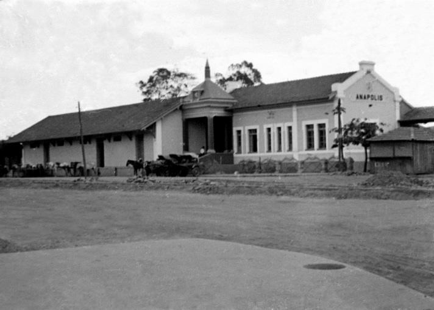
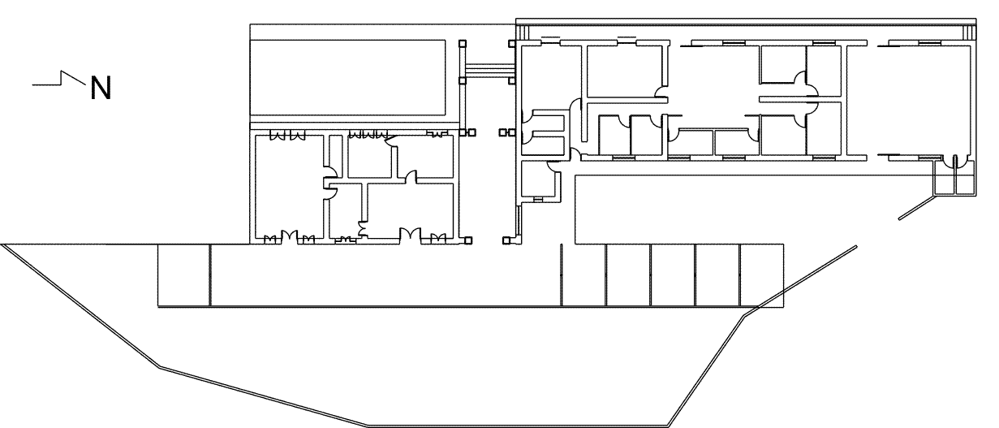
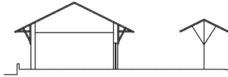
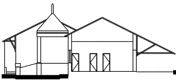
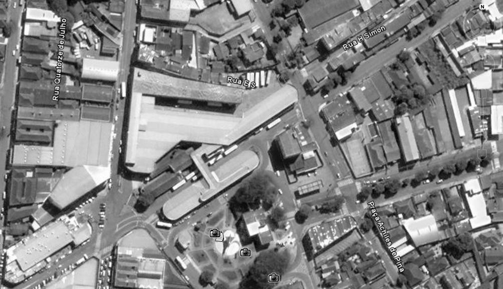
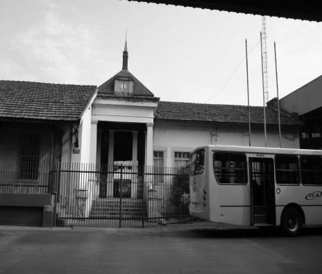

# Resumo

As ferrovias marcaram a história do Brasil no século XVIII e XIX como o
grande meio unificador dos mercados produtores e consumidores,
contribuindo para a expansão e consolidação da economia do país. A
história de Goiás e da cidade de Anápolis encontram-se ligadas nesse
processo, trazendo com a chegada da ferrovia muitas transformações e
progresso. As estações de trem se tornariam pontos de concentração nas
cidades, como aconteceu em Anápolis, cujo edifício da estação construído
em estilo eclético, possuía significativa relevância dentro da malha
urbana e da memória histórica da cidade. O edifício atualmente um
monumento tombado, é um patrimônio edificado da cidade que possui
valores de antiguidade, por ser um dos últimos representantes desse
momento histórico. Porém nas últimas décadas, passou por um processo de
isolamento e confinamento, estando atualmente seu acesso e visualidade
restritos, configurando a perda quase completa de suas características
originais através do descaso e do abandono.

Palavras-chave: Patrimônio, Estação de Ferro, Anápolis

# Abstract

The railways marked the history of Brazil in the eighteenth and
nineteenth century as the great unifier among the producers and consumer
markets, contributing to the expansion and consolidation of the
country\'s economy. The story of Goiás and the city of Anápolis is
connected in this process, since the arrival of the railroad brought a
lot of changes and progress. Train stations would become points of
concentration in cities, as happened in Anápolis, whose station building
built in eclectic style, has significant importance within the urban
fabric and the historical memory of the city. The building is a monument
topple built patrimony of the city that has values of antiquity, being
also one of the last representatives of that historic moment. But in
recent decades, has undergone a process of isolation and confinement,
currently being restricted their access and visuality, setting the
almost complete loss of its original features through neglect and
abandonment.

Keywords: Patrimony, Railway Station, Anápolis

> **As ferrovias**

As linhas ferroviárias ao longo do território brasileiro se configuraram
como testemunhos de uma época em que o avanço dos trilhos significava
para as cidades, finalmente a chegada da modernidade. O final do século
XIX e o início do século XX foram marcados por profundas transformações
no cenário da economia no Brasil, estando na agricultura, principalmente
na cultura do café, o elemento chave da expansão das fronteiras de
ocupação e de intervenções em âmbito nacional. A estruturação da
circulação da produção cafeeira e de outras mercadorias era a principal
demanda relacionada ao transporte, questão que seria resolvida nos
planos da malha ferroviária projetados ainda pelo Império.

As concessões eram a forma encontrada para atrair os investidores
britânicos para a construção das linhas férreas, devido aos desafios da
implantação de um sistema de estradas de ferro no Brasil. Atendiam a
objetivos, ligados essencialmente ao capital estrangeiro, na tentativa
de aumentar e consolidar a economia exportadora. Inocêncio (2000, p. 94)
afirma que "as ferrovias no Brasil, no final do século XIX, seguiram o
estágio clássico de direcionamento para as áreas de expansão e
regionalização da produção"; centros de produção agrícola e de mineração
deveriam se interligar aos portos, alcançando significativamente o
objetivo de melhorar o transporte das mercadorias.

Entretanto, os planos viários de cada concessão foram elaborados sem o
ordenamento de um sistema unificado, nem tampouco todas as linhas dos
planos foram executadas. A malha descontínua trazia prejuízos ao mercado
consumidor e também inviabilizava o transporte de passageiros. Somente
no início do século XX, o Governo buscaria retomar o controle das linhas
traçando estratégias de unificação e diretrizes, levando finalmente em
consideração as demandas e os mercados consumidores.

As iniciativas de expansão ferroviária partiriam da região Sudeste, a
qual concentrava a maior parte do capital consumidor e exportador. Desta
forma seria possível dinamizar a ligação das novas terras agricultáveis
com a região, através da expansão em direção do interior do país.

# A Estrada de Ferro Goiás

A Estrada de Ferro Goiás (EFG) estava nos planos do Governo que visavam
a integração econômica entre os estados de São Paulo, Minas Gerais e o
mercado produtor agrícola em expansão de Goiás. Seu ponto de partida
seria a cidade de Araguari-MG, que desde o ano de 1896 sediava o ponto
terminal da Companhia de Estradas Ferro Mogiana (CMEF) e da Estrada de
Ferro Oeste de Minas (EFOM). Os trilhos passariam por diversas
localidades, percorrendo o sudoeste do estado até a capital, que até o
início do século XX era a cidade de Goiás.

> A Penetração da estrada de ferro em solo goiano foi importante no
> sentido de inserir a economia do Estado na economia nacional. O
> projeto de expansão da ferrovia, com ponto inicial em Araguari, previa
> a passagem por Anápolis, prosseguindo para a cidade de Goiás, tendo
> Aruanã como ponto final. (POLONIAL, 2000, p.56)

A respeito da execução dos trechos da EFG, Nunes (2007, p.197) esclarece
que:

> \[\...\] a estrada de ferro chegou a Cumari, Goiandira e Ipameri em
> 1913, a Catalão e Roncador, 1914, a Pires do Rio em 1922, a Vianópolis
> em 1924, a Silvânia em 1930 e a Leopoldo de Bulhões um ano depois.
> Vê-se assim que até 1931, o avanço dos trilhos, além de lento,
> perfazia um trecho pequeno, cerca de 287km.

Entre a cidade de Leopoldo de Bulhões e a Cidade de Goiás, restariam
cerca de 200 km de trilhos a serem construídos. Quando em 1933 foi
confirmada a transferência da

capital para a nova cidade de Goiânia os planos foram mantidos, pois
haviam sido iniciadas as obras do trecho entre Leopoldo de Bulhões e
Anápolis e também a construção da estação. Dessa forma, apesar de ter
sido projetado um ramal de ligação até Goiânia, a estação de Anápolis se
tornaria o ponto terminal da EFG, fator essencial para a consolidação da
cidade como principal entreposto comercial do estado entre as décadas de
1930 e 1950.

# Estação de Ferro de Anápolis.

A Estação de Ferro de Anápolis seria um dos trinta pontos de embarque e
desembarque projetados para a (EFG), ligando os estados de Minas Gerais
e Goiás. Projeto de autoria do engenheiro Wenefredo Barcelar Portela, a
Estação Ferroviária (Prefeito José Fernandes Valente), foi construída
entre os anos de 1933-1935, sendo inaugurada no dia 7 de setembro, em
meio a muitas festividades.

A expectativa da chegada dos trilhos movimentou a economia, incentivando
os moradores a fazerem investimentos na espera do retorno vindo dos
visitantes. A população da cidade tenderia a aumentar, fato que
realmente aconteceu devido ao número de imigrantes vindos da região
Sudeste. Imigrantes de outros países, como Síria, Itália e Japão,
buscavam melhores terras agricultáveis e oportunidades de trabalho
escassas em outras regiões do Brasil.

"Para receber a estrada de ferro, a cidade experimentou mudanças
significativas na sua fisionomia urbana, com a reforma de antigos
prédios, públicos ou privados, residenciais ou comerciais." (POLONIAL,
2000, p. 67). A localização da estação na cidade também provocou
mudanças no traçado urbano: o cemitério, que ficava em frente da nova
estação foi transferido para um local mais afastado e os terrenos
próximos foram desapropriados, a fim de abrigar os armazéns que dariam
suporte à ferrovia.

A estação foi edificada com
características das construções ferroviárias do início do século XX. A
população como um todo aguardava a chegada dos trilhos, esperando que
houvesse na cidade a mesma transformação ocorrida nas outras onde os
trilhos já haviam chegado.

> Figura 1: Estação de Ferro de Anápolis - 1935. Fonte: Acervo
> Iconográfico do Museu Histórico de Anápolis.

# Ambiência e situação atual.

O edifício funcionou efetivamente como estação de embarque e desembarque
de passageiros e mercadorias, entre os anos de 1935 e 1976. Após a sua
desativação, os trilhos foram retirados do traçado urbano, após inúmeras
reclamações da população, restando apenas o edifício e suas plataformas.
O embarque foi transferido para a estação Engenheiro Castilho, em região
mais afastada do centro da cidade.

Segundo inventário do Conselho Municipal do Patrimônio Histórico e
Cultural de Anápolis (COMPHICA, 2008, p. 32), o edifício foi construído
em estilo eclético, empregando tijolos cozidos de uma vez, em sistema de
alvenaria autoportante e sua cobertura utilizava telha francesa com
suportes em madeira. (figuras 2 a 4). O forro originalmente em madeira
foi substituído por forro de gesso. O piso executado em ladrilho
hidráulico também foi substituído gradativamente por cimento queimado e
granitina. Considera-se o estado atual da edificação como regular,
carecendo diversas intervenções de conservação e restauro.

0 1 2 4

> Figura 2: Estação de Ferro de Anápolis - 1935. Planta do térreo.
> Fonte: Acervo Iconográfico do Museu Histórico de Anápolis.
>
> 

0 1 2 4

> Figuras 3 e 4: Estação de Ferro de Anápolis - 1935. Cortes
> transversais demonstrando a relação do edifício com a plataforma.
> Fonte: Acervo Iconográfico do Museu Histórico de Anápolis.

Não existem registros oficiais de intervenções realizadas no edifício,
apesar das alterações nos revestimentos, supressão ou adição de
esquadrias, o fechamento do entorno com gradil, entre outros. Após a
desativação da estação, o prédio foi utilizado pela administração da
prefeitura, passando por pequenas reformas durante a década de 1990.

Tombado como patrimônio histórico municipal, pela Lei Municipal n°
1.824, de 03 de Janeiro de 1991, o edifício da estação ferroviária é
considerado bem inalienável. (PREFEITURA DE ANÁPOLIS, 1991, p.1). A
mesma lei proíbe a destruição, a demolição ou a mutilação de suas
instalações. No entanto, para compreender a situação atual do edifício é
necessário conhecer a sequência de ocorrências que o levaram até o
estágio atual de total abandonado.

Uma década após a desativação da estação, no ano de 1986 a prefeitura
concede à empresa de transportes urbanos (TCA), que desde 1963 realizava
o transporte de passageiros na cidade, a autorização para construir no
pátio de manobras da estação o seu terminal de ônibus. A construção, por
si já alterava a dinâmica da mobilidade do espaço ao redor e da cidade,
pois o projeto conferiria integração total ao transporte de passageiros
ao direcionar todos os ônibus para um único terminal localizado no
centro da cidade.

Devido ao aumento da demanda, no ano de 1998 através de um termo aditivo
a prefeitura concedeu a exploração completa do espaço da estação para a
TCA. Executada a ampliação do terminal ao redor do edifício (figura 5),
restringiu-se o seu acesso a apenas uma única lateral, obstruindo
completamente a sua visibilidade e descaracterizando o seu caráter
monumental.

> 
>
> Figura 5: Localização da Estação de Ferro de Anápolis e Terminal
> Urbano. Imagem aérea Fonte: Google Earth, 2005

Um novo processo licitatório para a concessão do transporte público na
cidade de Anápolis foi aberto no ano de 2008, incluindo no edital a
demolição da ampliação do terminal, entre outras modificações no sistema
de transporte. Pela necessidade de estudos de impacto e viabilidade e
outras diligências, o processo licitatório até o ano de 2013 não havia
sido concluído.

Concomitante a esse processo, o Ministério Público de Goiás (MP-GO),
transitava julgamento em 2011, de uma matéria, cujo objetivo era
assegurar a visibilidade e o acesso da população ao antigo prédio da
Estação Ferroviária de Anápolis. (ROSA, 2013). No final do ano de 2013 a
promotoria determinou a demolição da parte ampliada do terminal.

A sentença não foi cumprida até o momento. A alegação da prefeitura e da
TCA é a de que há a necessidade de se finalizar o processo de licitação
e executar modificações estruturais no sistema de transporte, antes de
demolir a ampliação. No entendimento do MP-GO, as duas ações estariam
desvinculadas uma da outra, sendo, portanto, sentenças condenatórias
distintas. A sentença tem embasamento no Decreto- Lei n. 25, de 30 de
novembro de 1937, cujo Art. 18 dispõe que:

> \[\...\] sem prévia autorização do Serviço do Patrimônio Histórico e
> Artístico Nacional, não se poderá, na vizinhança da coisa tombada,
> fazer construção que lhe impeça ou reduza
>
> a visibilidade, nem nela colocar anúncios ou cartazes, sob pena de ser
> mandado destruir a obra ou retirar o objeto, impondo-se neste caso a
> multa de cinquenta por cento do valor do mesmo objeto.

Esse impasse, para a cidade de Anápolis, pode ser o início de uma
questão considerada como um paradigma da preservação ferroviária.
Ferreira (2009), Coelho (2002), Souza & Naves (2011), apresentam em seus
trabalhos casos semelhantes de cidades, em que a ferrovia foi
significativa para o desenvolvimento urbano. Nestes casos, somente
através de muitas lutas contra a especulação imobiliária e os interesses
particulares, que foram assegurados os direitos de preservação do
patrimônio.

# Patrimônio em Anápolis

Em Anápolis existem apenas oito edifícios tombados por leis municipais,
sendo que seis são de propriedade da prefeitura. São eles e suas
respectivas datas de tombamento: (Mercado Municipal, 1984, Estação
ferroviária, Cadeia pública, Museu Histórico e Antigo Fórum, 1991, Casa
JK, 2003 e Colégio Estadual Antesina Santana e Colégio Couto Magalhães,
2005). Até o momento não existem edifícios tombados por órgãos do Estado
ou da União.

Todos os edifícios encontram-se preservados e ocupados, exceto o da
Estação ferroviária. Porque ele especificamente, não obteve a mesma
atenção, se foi tombado pela mesma Lei Municipal e é de igual
importância para a história arquitetônica da cidade?

A ocupação de um edifício histórico e o seu constante uso são os
principais fatores que impedem a sua deterioração e consequente perda de
valor histórico. Enquanto os outros edifícios se mantiveram ocupados
ininterruptamente, a estação encontra-se vazia, há mais de uma década.
Corrobora para este fato o isolamento físico (figuras 4 e 5) em que a
estação se encontra. Com sua visibilidade totalmente obstruída pelo
terminal de ônibus e o acesso limitado, torna-se difícil permitir que a
população usufrua deste bem.

> 
>
> Figura 6 e 7: Fotografias atuais da Estação de Ferro de Anápolis.
> Fonte: (Lucas Vargas, 2014)

Chiarotti (2011, p18) apresenta um levantamento aprofundado sobre a
história dos bens patrimoniais da cidade, as leis de tombamento, os
edifícios e as políticas públicas que têm sido executadas nas últimas
décadas em busca da preservação. Segundo o autor a questão da
preservação e conservação na cidade é tardia e ações de resgate
histórico tem se originado mais de iniciativas civis do que de debates
políticos.

O COMPHICA criado em 2002, tem executado levantamentos em outras
edificações em busca da conservação do patrimônio histórico da cidade e
atuado na preservação dos bens já tombados. A falta de pessoal técnico
especializado e da implementação de políticas públicas têm dificultado a
prática destas ações, tendo ocorrido, nos últimos anos infelizmente,
perda significativa de edificações, demolidas ou descaracterizadas.

# Considerações sobre Patrimônio

Uma edificação ou objeto recebem a classificação de monumento, quando
suas características são essenciais para a identificação de um período
histórico ou sua relevância e valores têm maior significância dentro de
um contexto.

Choay (2001, p.31), afirma que "o surgimento do conceito de monumento
nasceu em Roma, no século XV, ao se configurarem obras arquitetônicas
remanescentes de épocas passadas, como essenciais para o entendimento da
cultura e embasamento do conhecimento." Com o passar dos séculos, a
noção de Patrimônio, seria caracterizada como elemento de identidade
social e merecedor de proteção e conservação, a partir da conceituação
dos monumentos e do seu estabelecimento como disciplina teórica no
século XVIII.

O conceito moderno de restauração e metodologias sistematizadas de
intervenções em patrimônios se consolidam na França, ainda no século
XVIII, através da pesquisa de Viollet le Duc, cuja doutrina defendia o
restauro através de práticas que iam além da conservação e do restauro.
Nesta época a França passava por um crescimento econômico e "a ruptura
com o passado que esses movimentos geraram, propiciaram o
estabelecimento de uma identidade nacional e, conseqüentemente, o
surgimento do sentimento de proteção aos edifícios e ambientes
históricos." (SANTOS, 2005. p.1).

Na mesma época, John Ruskin na Inglaterra, considerava que era
necessário respeitar a edificação, devendo evitar falsas descrições ao
se reconstruir partes danificadas, sob pena de perder sua autenticidade.
Admitia, portanto, pequenas intervenções, no sentido de conservar o
estado atual da edificação, permitindo assim observar a ação do tempo
sobre o monumento.

As bases das teorias atuais de conservação, preservação e restauro,
iniciadas nas pesquisas de Viollet le Duc e Ruskin, seriam estabelecidas
pelo arquiteto italiano Camilo Boito, no século XIX, reafirmando a
necessidade da visualização do processo de deterioração, como forma de
manter o valor histórico. As decisões de restauro e mesmo os acréscimos
que poderiam ter sido executados ao longo do tempo, deveriam ser
mantidos, como testemunhos da história, devendo-se evitar as ações
estilísticas de falsificação.

No início do século XX, o historiador austríaco Alois Riegl,
conceituaria estágios para a classificação dos monumentos. Sob a visão
de Riegl (2006, p.43):

> \[\...\] por monumento, no sentido mais antigo e verdadeiramente
> original do termo, entende-se uma obra criada pela mão do homem e
> edificada com o propósito preciso de conservar presente e viva, na
> consciência de gerações futuras, a lembrança de uma ação ou destino
> (ou a combinação de ambos).

De acordo com a origem poderiam ser considerados os monumentos como

intencionais, históricos ou artísticos, tendo ainda valores de
rememoração a ser levados em consideração na caracterização do objeto,
tais como: valor de antiguidade, valor histórico e valor de rememoração
intencional.

Um monumento intencional teria em sua idealização e realização
características de um objeto significativo, enquanto os monumentos
artísticos e históricos necessitariam da representação do tempo para
receber essa classificação. Segundo o autor não seria possível dissociar
as características artísticas das históricas, sem prejuízo para a
compreensão do monumento como um todo, sendo, dessa forma, todo
monumento histórico também artístico.

Ainda sob a ótica de Riegl os valores de rememoração estariam ligados à
observação que se faz do monumento. O valor de antiguidade seria
facilmente detectado pela presença de algo diferente do que é executado
atualmente ou seu estado de conservação deteriorado confirmaria a
passagem do tempo. No entanto, para o valor histórico, essa degradação
não seria útil, pelo observador conceber nesse processo uma perda. O
valor histórico incluiria a satisfação obtida pelo observador, em saber
que determinado monumento não possui apenas qualidades estéticas e
artísticas. Por fim, o valor de rememoração intencional agiria sobre os
monumentos intencionais em busca da preservação contínua, para que
aquele objeto jamais perdesse as suas características que o tornaram um
monumento.

> A grande contribuição dessa obra do historiador da arte vienense
> reside no fato de se apresentarem, através dos diferentes tipos de
> valor atribuídos aos monumentos, decorrentes das distintas formas de
> percepção e recepção dos monumentos históricos em cada momento e
> contexto específicos, os contrastantes meios para sua preservação.
> (CUNHA, 2006, p.4)

A fundamentação conceitual de Riegl permite enfim, que o sujeito
responsável pela preservação, seja inserido num contexto em que o juízo
crítico será a base de suas escolhas. Dessa forma os resultados obtidos
terão sempre um raciocínio lógico e considerações e justificativas em
que possam se apoiar suas ações.

# Considerações Finais

A estação de trem de Anápolis poderia ser considerada, como um monumento
histórico, cujos valores estariam demarcados tanto na arquitetura
utilizada na edificação, como na própria representatividade que ela
possui. Sua localização era um marco da cidade, pois se encontrava em
amplo largo, sem nenhuma edificação de grande importância em sua
proximidade. O valor histórico surgiria, após a passagem do período da
ferrovia, tendo efetivado o seu valor de antiguidade através da obtenção
do aspecto de envelhecido.

Estes valores seriam essenciais para a caracterização da relevância do
edifício como sinônimo de uma época. Entretanto, o impacto causado pela
situação atual no observador é negativo e impede a criação de um
significado pessoal. O pequeno contato com os símbolos físicos da época
da ferrovia também criam distanciamento de uma parcela da realidade
histórica e impede os moradores, observadores ou visitantes obter a
verdadeira noção da importância que época da ferrovia teve para

formação da cidade.

# Referências bibliográficas

> ANÁPOLIS, MUSEU HISTÓRICO. *Acervo Iconográfico.* Museu Histórico
> "Alderico Borges de Carvalho". 2014.
>
> BRASIL. *Decreto lei nº 25, de 30 de novembro de 1937.* Organiza a
> proteção do patrimônio histórico e artístico nacional. 5p.
>
> CHIAROTTI, TIZIANO MAMEDE. Pa*trimônio histórico e cultural: do
> município de Anápolis.* Anápolis: Kelps, 2011, 84p.
>
> CHOAY, Françoise. *A alegoria do patrimônio*. São Paulo: Unesp, 2001.
>
> COELHO, GUSTAVO NEIVA. *Patrimônio ferroviário tombado em Goiás.*
> Goiânia: Ed. Trilhas Urbanas, 2002.

CUNHA, CLÁUDIA DOS REIS. Alois riegl e o culto moderno aos monumentos.
*Resenhas online.* São Paulo. v.5, 054 (02) jun/2006. Disponível em
<http://www.vitruvius.com.br/revistas/read/resenhasonline/05.054/3138>
Acessado em dez/2013

> COMPHICA. Conselho Municipal do Patrimônio Histórico e Cultural de
> Anápolis. *Inventário de Proteção do Acervo Cultura do Município de
> Anápolis.* Ficha da Estação Ferroviária. Jun/2008.
>
> FERREIRA, AROLDO MÁRCIO. *Urbanização e arquitetura na região da
> estrada de ferro Goiás. -- E.F. Goiás: cidade de Pires do Rio, um
> exemplar em estudo.* 1999. Dissertação (Mestre em História) Faculdade
> de Universidade Federal de Goiás. Goiânia, 1999. 278 p.

INOCÊNCIO, MARIA ERLAN. Algumas reflexões sobre o crescimento/estagnação
de Ipameri-Goiás a partir das ferrovias. *Espaço em Revista*.
Catalão-GO. v3, (1) p. 93- 103. 2000.

NUNES, HELIANE PRUDENTE. Os imigrantes árabes em Goiânia. In LIMA-
FILHO, MANOEL FERREIRA; MACHADO, LAIS APARECIDA. *Formas e tempos*

> *da cidade.* Goiânia: UCG, 2007. p.193-212.
>
> PREFEITURA DE ANÁPOLIS. *Lei nº 1824 de 03 de Janeiro de 1991.*
> Determina o tombamento de prédios pertencentes ao Município, que
> menciona e dá outras providências. Anápolis, 2p.
>
> POLONIAL, JUSCELINO. *Ensaios sobre a história de Anápolis*.
> Associação Educativa Evangélica. 2000. 177p. Editora Kelps.

SOUZA, ALEXANDRE JAIRO CAMPOS DE; NAVES, MARIA CONSUELO

FERREIRA MONTES. Araguari-MG: três décadas de preservação dos
remanescentes culturais da Estrada de Ferro Goiás. *In Revista UFG*, v.
13, n° 11, p. 62-68, jul / 2011.

> RIEGL, ALOIS. *O Culto aos monumentos modernos.* Sua essência e sua
> gênese. Goiânia: UCG, 2006.
>
> ROSA, CRISTINA. *MP exige cumprimento de sentença para demolir
> obstrução à antiga Estação Ferroviária de Anápolis.* 2013. Disponível
> em
> <http://www.mpgo.mp.br/portal/noticia/mp-exige-cumprimento-de-sentenca-para-dem>
> olir-obstrucao-a-antiga-estacao-ferroviaria-de-anapolis\#.UtwYThBTvcs.
> Acessado em dez/2013.

SANTOS, ANA CAROLINA MELARÉ DOS. Viollet-le-duc e o conceito moderno de
restauração. *Resenhas online.* São Paulo. v.4, 044 (01) ago/2005.
Disponível em
<http://www.vitruvius.com.br/revistas/read/resenhasonline/04.044/3153>
Acessado em dez/2013.
