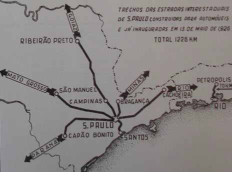
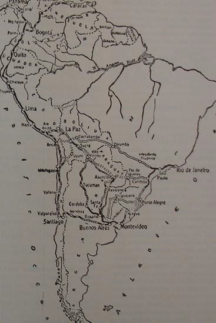
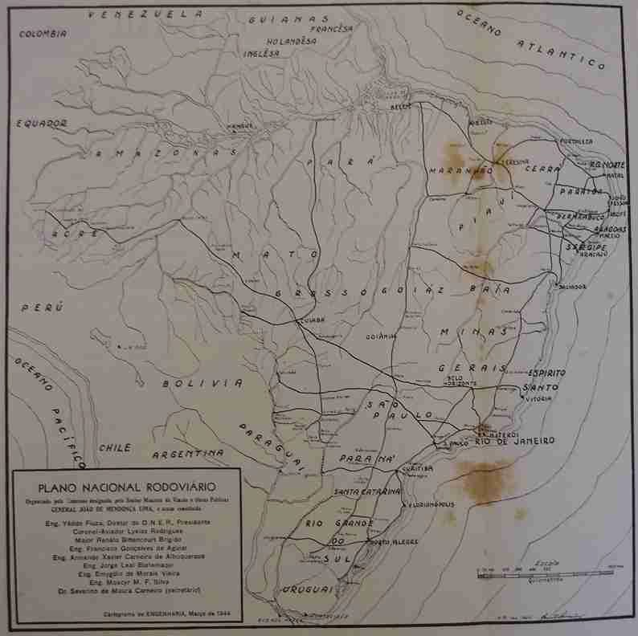

# Resumo

O objetivo é apresentar como a infraestrutura rodoviária atuou na
urbanização do território paulista a partir da necessidade de integração
da cadeia produtiva industrial, na primeira metade do século XX. Nossos
objetos de estudos são os planos rodoviários pioneiros que foram
implantados ou influenciaram o desenho da malha rodoviária paulista,
propostos entre 1913 e 1944, especificamente o Plano de Viação de São
Paulo, o Plano Nacional Rodoviário e o Plano da Rodovia Panamericana,
que abrangem as escalas regional, nacional e internacional. A partir
desses planos é possível identificar a predominância de um modelo
morfológico radial que articulou o território consolidando a estrutura
de polos urbanos já existentes. De um modo geral, demonstraremos como a
repercussão desses planos definiu áreas melhor equipadas e, portanto
propícias à urbanização. E como essa urbanização esteve condicionada
pela necessidade de integrar a cadeia produtiva industrial, tendo em
vista a função estratégica do Estado de São Paulo de principal produtor
e mercado consumidor do país. Concluiremos, portanto que as escolhas de
implantação dos planos rodoviários - na escala regional, nacional e
internacional -; dos seus principais eixos; e da valorização dos centros
urbanos repercutiram na formação do território submetendo o processo de
urbanização paulista à lógica produtivista industrial.

Palavras-chave:

Infraestrutura, Rodovias, Urbanização, Estado de São Paulo, Planos
Rodoviários, Cadeia Produtiva

# Abstract

The goal is to present as road infrastructure influenced the
urbanization of the State of São Paulo from the need for integration of
industrial chain, in the first half of the twentieth century. Our cases
are the pioneers road plans that were implemented or influenced the
design of the highway in São Paulo, between 1913 and 1944, specifically
the *Plano de Viação de São Paulo*, the *Plano Nacional Rodoviário* and
the *Plano da Rodovia Panamericana*, at the regional, national and
international scales. From these plans it is possible to identify the
prevalence of a radial model that articulated the territory
consolidating the structure of existing urban centers. Overall, we
demonstrate how the impact of these plans defined areas better equipped
and therefore conducive to urbanization. And like that urbanization was
conditioned by the need to integrate the industrial production chain,
from the State of São Paulo\'s producer and consumer market. We conclude
that the choices deployment of road plans - regional , national and
international level; their principal axes; and the importance of urban
centers affected the formation of the territory undergoing the process
of urbanization of State of São Paulo to productivist industrial logic.

Keywords:

Infrastructure, Roads, Urbanization, State of São Paulo, Highway Plans,
Industrial Chain

# Introdução

O desenho das rodovias sobre o território paulista representa uma
importante estratégia para a integração da atividade industrial paulista
que, no início do século XX, firmava-se como principal atividade
econômica do Estado. A passagem do predomínio de uma economia agrícola
para uma economia industrial, entre as décadas de 1920 a 1940 no Estado
de São Paulo, provocou uma reestruturação territorial afim de integrar
as atividades da cadeia produtiva. Essa transformação territorial
vinculada às novas atividades econômicas exigiu a implantação de novas
formas de transporte terrestre tendo em vista a substituição das
ferrovias pelas estradas.

O apoio à abertura de estradas foi pioneiramente incentivado por
Washington Luis que utilizou de todos os artifícios políticos nas suas
gestões como secretário de estado (1906-1912), deputado (1912-1913),
prefeito (1914-1919), governador (1920-1924) e presidente da república
(1926-1930) para promover o modelo rodoviário como principal sistema de
transportes.

Além do apoio de Washington Luis, houve uma organização institucional
que mobilizou incentivos privados e públicos para o desenvolvimento das
rodovias. Congressos paulistas, realizados entre 1917 e 1923
sistematizaram as principais diretrizes técnicas e divulgaram as
qualidades do novo sistema de transporte automotor (SICILIANO, 1967, p.
29). E em 1921 foi criada, pela lei 1.835-C, a Inspetoria de Estradas de
Rodagem, na época subordinada à Diretoria de Obras Públicas e atrelada à
Secretaria da Agricultura (D´ALESSANDRO, 1967, p. 27). O Estado de São
Paulo foi, assim precursor na organização institucional e influenciou a
organização federal. Paralelamente à essa organização institucional,
decorreram soluções para o território através de três principais planos
e suas repercussões.

# O Plano de Viação de São Paulo, 1913: o Modelo Radial

A organização administrativa refletiu as transformações econômicas e
reverteu os recursos públicos para a abertura de estradas e construção
de rodovias. O marco desse processo é o Plano de Viação para São Paulo
(1913) que, embora seja o segundo plano rodoviário do Estado de São
Paulo, foi o embrião da estrutura rodoviária paulista. O primeiro Plano
de Viação de Rodagem foi elaborado na vigência da presidência (da
província) de Campos Salles em 1896 (D´ALESSANDRO, 1967, p. 24). E o
segundo Plano de Viação foi elaborado em 1913 por Clodomiro Pereira da
Silva, engenheiro e consultor técnico da Secretaria de Agricultura do
Estado de São Paulo. Foi entregue na vigência do governo de Francisco de
Paula Rodrigues Alves, sendo Washington Luis prefeito da Capital. Nesse
plano ficaram estabelecidas as principais diretrizes que, passado um
século, permanecem na malha rodoviária paulista.

A estrutura do território paulista está baseada nas rodovias radiais.
São elas as

principais ordenadoras da produtividade econômica e responsáveis pela
consolidação da urbanização paulista. Para estabelecer essa base, o
Plano partiu da importância dos elementos geográficos e do processo de
urbanização como fundamentais para a organização das formas de
transporte (SECRETARIA DA AGRICULTURA, 1913, p. 20). A opção por linhas
radiais justificou-se pela posição da Capital, no limite leste do
Estado; pela geografia, principalmente a hidrografia, quase paralela
descendo a oeste da capital; pelo processo de urbanização em curso e
pela presença já consolidada das vias férreas que ligavam os principais
núcleos do interior à Capital.

> Penso que para satisfazer às primeiras necessidades, bastaria crear
> boas estradas de rodagem ente as príncipes cidades do Estado,
> particularmente da Capital aos pontos vizinhos mais proximos: a
> Santos, Jundiahy, Campinas, Sorocaba, Mogi das Cruzes, etc. (\...).
> (SECRETARIA DA AGRICULTURA, COMMERCIO E OBRAS PUBLICAS, 1913, p. 34)

A ausência das vias transversais é constatada pelo autor e justificada
pela grande escala de produção e escoamento para poucos pontos
concentrados, ou seja pela valorização das atividades produtivas. A
questão produtiva predominou no desenho dessas vias desenhando a
estrutura territorial sobre a qual foi concebido o plano de viação:

> Estas serão estradas de rodagem commerciaes, mas que servirão
> necessariamente a interesse de ordem administrativa e política; mas o
> *interesse predominantemente actual* (grifo do autor) será de ordem
> econômica. (SECRETARIA DA AGRICULTURA, COMMERCIO E OBRAS PUBLICAS,
> 1913, P. 48)

As principais rodovias, hierarquicamente denominadas de "estradas
especiais", constituíram-se, por fim, como os principais troncos
radiais:

> Das *estradas especiaes*, entendo que o Governo deve promover, desde
> já o estabelecimento das seguintes:
>
> 1º. de São Paulo a Taubaté 2º. de São Paulo a Santos
>
> 3º. de São Paulo a Campinas, Piracicaba e Ribeirão Preto
>
> 4º. de São Paulo a Avaré, por Sorocaba. (SECRETARIA DA AGRICULTURA,
> COMMERCIO E OBRAS PUBLICAS, 1913, p. 50).

Dessa forma, os quatro troncos radiais previstos deram origem às quatro
principais rodovias que cruzam o Estado de São Paulo, atualmente: a
Dutra; a Anchieta; a Anhanguera; e a Regis Bittencourt. Seu traçado
privilegiou as relações econômicas ao buscar interligar a capital às
fronteiras regionais.

O desenho desse traçado que se definiu em 1913 foi responsável pela
estruturação paulista, influenciando e sendo influenciada pela
urbanização do seu território através da valorização de algumas cidades
em desenvolvimento e através da constituição de

regiões econômicas que gozaram de
intensa produtividade ligada à concentração industrial na Capital. De
certo, as maiores influências podem ser representadas por três, das
quatro, rodovias: a ligação com o Rio de Janeiro, por constituir-se no
principal parque industrial do país; a ligação com Santos, pela
importância da exportação e importação; e a entrada para o interior via
Campinas, regiões historicamente com maior índice de urbanização e
desenvolvimento.

> Figura 1: Estradas interestaduais inauguradas até 1926. Fonte: Revista
> DER, No. 67, 1952

# São Paulo no Circuito Internacional da Atividade Industrial: a Rodovia Panamericana, Década de 1920 à Década de 1940

Na década seguinte ao Plano de Viação, nos anos 1920, o contexto
internacional foi marcado pela crise da bolsa de Nova York que afetou a
economia mundial. Nos Estados Unidos, a crise econômica bem como a
experiência recente da Guerra Mundial direcionou as decisões da economia
internacional pela proteção militar e autossuficiência americana. A
opção por uma política de importação de matéria-prima e exportação de
bens manufaturados foi a garantia da constituição de um mercado forte e
protegido das instabilidades do período bélico. Para essa concretização,
contudo a rodovia tornou-se numa importante estratégia de integração do
mercado internacional produtivo pelo atendimento às necessidades da
América Latina com os produtos norte-americanos. A partir de então a
política norte-americana divulgou um plano rodoviário internacional,
cujo resultado deveria ser a constituição de uma rodovia que ligasse as
três Américas e proporcionasse a ampliação do mercado consumidor.

Tecnicamente, sucederam-se duas iniciativas de destaque nos congressos
internacionais e que foram relevantes para o desenho da respectiva
rodovia. Na VI Conferência Internacional Americana, realizada em Havana
em 1928, foram envolvidas várias organizações (a União Pan-americana, o
Congresso Pan-Americano de Estradas de Rodagem - na sua segunda edição
-, a Confederação Pan-americana de Educação Rodoviária, o Instituto
Pan-americano e os governos a elas vinculados). Ficou estabelecido:

> Aprovar plenamente a iniciativa de construir uma estrada internacional
> americana, e recomendar a todos os membros da União Pan-Americana, que
> cooperem em todo o possível à pronta realização do dito projeto.
> (PENTEADO, 1943, p. 384)

A proposta era ligar todas as capitais latino-americanas através de um
sistema linear que aproveitasse as rodovias já existentes e construísse
as que fossem necessárias, como foi o caso das obras nas rodovias da
América Central. O objetivo foi estabelecer um trajeto internacional que
integrasse todos os principais pólos consumidores aos Estados Unidos e
os articulasse com possíveis fornecedores de matéria-prima.

No II Congresso Internacional de Estradas de Rodagem, realizado no Rio
de Janeiro em 1929, houve a representação brasileira de Timoteo Penteado
que atestou as ligações propostas e sugeriu alterações, sobretudo nas
ligações da capital federal, Rio de Janeiro, às capitais de outros
países:

> Tivemos em consideração que, do ponto de vista brasileiro, o problema
> não comporta uma só estrada, mas diversas estradas internacionais
> pan-americanas, porque, em síntese, a *Rodovia Pan-americana* (grifo
> do autor) se reduz à ligação, entre elas, de todas as capitais dos
> países americanos por ótimas estradas de rodagem. (PENTEADO, 1943, p.
> 384)

A proposta original ligava Rio de Janeiro-São Paulo-Porto
Alegre-Montevideo- Buenos Aires numa única linha. Apenas a capital
Buenos Aires tinha ramificações a outros países e o Rio de Janeiro
constituía-se como ponto final do trajeto. Penteado propôs outras
estradas pan-americanas que ligassem Rio de Janeiro a Assuncion e La
Paz, passando por São Paulo, estendendo as ramificações da rodovia e
tornando o Rio de Janeiro um pólo concentrador e São Paulo um importante
entreposto. A proposta de Penteado buscou articular as duas principais
capitais regionais brasileiras ao sistema internacional proposto.

Décadas depois, nos anos 1940 no período da II Guerra Mundial, houve um
reforço norte-americano em concluir rapidamente o percurso total e
garantir, entre os objetivos econômicos (pouco expostos, mas muito
evidentes na primeira fase), mais um recurso de defesa que unisse os
países aliados aos Estados Unidos. Foi na década de 1940 que surgiram as
justificativas ideológicas para reafirmar o empreendimento e garantir
que a sua finalização - cerca de 87% (!) do traçado já estava operando
-- ocorresse, sobretudo a partir dos financiamentos norte-americanos.

Através do Banco de Importação e Exportação norte-americano, os EUA
disponibilizaram empréstimos de aproximadamente US\$ 78,000,000.00 aos
países da América Central e México (principalmente) e América do Sul,
num período inferior a 20 anos. Os argumentos utilizados nessa década
confirmaram a finalidade da rodovia de integrar o mercado
norte-americano.

> Nosso país (EUA) também depende dos produtos da América Central e do
> Sul para fortalecer sua economia de tempo de paz. (\...) Com a
> melhoria dos meios de transporte e comunicação, esses produtos terão
> seu emprego acrescido nas indústrias dos Estados Unidos e seu comércio
> aumentado nos demais países americanos. A rodovia panamericana será um
> fator importante na consecução desse resultado. (\...) (ROADS AND
> STREETS, 1943, p. 54)

Ao todo, seis programas de melhorias vinculadas ao transporte terrestre
continental garantiriam a melhoria do desenvolvimento econômico
norte-americano.

1.  A melhoria dos transportes no interior dos vários países e entre
    eles e os Estados Unidos:

> (\...) As exportações norte-americanas desses produtos (produtos de
> massa, como trigo, arroz ou feijão escassos nos países da América
> Central) (complemento nosso) são insignificantes, mas a melhoria dos
> transportes e o aumento resultante da capacidade de consumo abririam
> mercados adicionais aos produtos norte-americanos.

2.  Desenvolvimento de novas regiões e novos recursos naturais, com o
    aumento do consumo das importações americanas:

> (\...) Daí resultaria um notável aumento do movimento turístico para
> os Estados Unidos e da importação americana por esses portos.

3.  Melhor emprego e manutenção das estruturas econômicas:

> A construção rodoviária e novas empresas asseguradas por melhor
> transporte garantirão emprego no atual período de dificuldades
> econômicas. (\...)

4.  Maior intercâmbio turístico aumentaria grandemente, dos Estados
    Unidos, na direção sul, (\...) e que o mesmo movimento desses pontos
    para a nossa terra teria também notável desenvolvimento. (\...)

5.  Melhor mercado para nossos automóveis, peças, equipamento de
    garagem, etc.:

> O tráfego da rodovia através do México e da América Central até a zona
> do Canal resultaria na ampliação do mercado para os automóveis e
> caminhões norte-americanos. (\...)

6.  Valor defensivo". (ROADS AND STREETS, 1943, pp. 54, 55 e 56)

O que resulta desses esforços é o predomínio territorial do mercado
norte-americano. A rodovia pan-americana cumpriria seu papel de
articular os núcleos mais produtivos de toda a América de forma
hierarquizada a um sistema produtivo centralizado nos Estados Unidos. O
Estado de São Paulo, especificamente sua Capital São Paulo, protagonizou
um trecho dessa passagem definida pelo tronco principal da rodovia, e se
tornou parte desse mercado articulado ao Rio de Janeiro. As futuras
Rodovias Dutra e Regis Bittencourt, por sua vez, integraram-se ao
sistema produtivo internacional reforçando o padrão radial que se
consolidou no território nacional e, em especial no Estado de São Paulo.
Nesse processo, consolidou-se a estrutura radial (prevista pelo Plano de
1913) como principal desenho para o transporte paulista integrado ao
mercado regional e internacional.

> 
>
> Figura 02: Proposta da Rodovia Panamericana. Fonte: Revista DER**.**
> No. 59, 1950

# Plano Nacional Rodoviário, 1944: o Atendimento aos Centros Econômicos Produtivos Consolidados

Diretamente vinculado ao desenvolvimento econômico regional do país, o
Plano Nacional Rodoviário foi proposto com a finalidade de equipar o
território nacional evidenciando o viés econômico da concepção e da
implantação da infraestrutura de transportes terrestres.

Podemos afirmar que, dentre os esforços empreendidos pelo poder público,
o Plano Rodoviário Nacional, de 1944, foi o ápice dos esforços de
integração do mercado consumidor por meio da circulação de produtos no
período de industrialização nacional. Definido pelo Decreto No. 15.093
de 20 de março de 1944, foi elaborado por Comissão específica presidida
por Yedo Fiuza, diretor do D.N.E.R.

O partido adotado do Plano gerou um padrão cartesiano de rodovias sobre
o território nacional. A orientação pelos eixos N-S e E-W definiram a
estrutura de uma grelha ortogonal que se sobrepôs à geografia do
território nacional ajustando-se às regiões urbanizadas e polarizadas.
Essa estrutura estabeleceu-se por pontos de partida ou de chegada que
estavam vinculados às capitais estaduais ou às cidades mais importantes
das principais regiões. O desenho em grelha gerou poucos cruzamentos e
essa escassez valorizou essas próprias cidades, pois elas se
transformaram nos entroncamentos e nos entrepostos das principais
rodovias. Essas cidades, que podem ser consideradas nós do sistema
quadricular, ganharam importância desproporcional por corresponderem,
não apenas aos centros urbanos já consolidados, mas também a elementos
estruturantes valorizados pelo novo sistema logístico.

Dessa grelha, poucas rodovias avançaram para o interior do país,
sobretudo nos seus quadrantes norte e centro-oeste, comprovando a
permanência de vias radiais originadas pelos centros. A malha, por assim
dizer, é muito mais escassa nessas

porções e muito adensada no Sudeste e no Nordeste pelas vias estruturais
e pelas suas ramificações privilegiando os principais centros urbanos.
Podemos perceber um sistema concentrado entre Salvador e Fortaleza e
entre São Paulo e Rio de Janeiro, com extensões pontuais a outros
centros regionais mais distantes. Considerando que o principal parque
industrial do país já estava consolidado no eixo Rio de Janeiro-Belo
Horizonte-São Paulo e que a maior concentração populacional alongava-se
historicamente pela costa brasileira, o Plano Nacional correspondeu à
intenção de integrar produtor e mercado consumidor a partir de um
sistema logístico eficiente. É notório o objetivo em atender à
produtividade das regiões já consolidadas sem o cuidado em desenvolver
as regiões com poucas oportunidades.

São Paulo, Capital, foi privilegiada pela sua posição no mapa econômico
nacional, disputando com o Rio de Janeiro a maior produtividade
industrial. Assim o Plano Nacional transformou-a em importante
articulador regional/territorial, ligando São Paulo diretamente ao Rio
de Janeiro, a Belo Horizonte, a Curitiba, a Corumbá e à Goiânia, como já
previa o Plano de Viação do Estado (1913). Mas, não só, pois o plano
integrou-se ao contexto internacional ao atender aos princípios da
Rodovia Panamericana, pois o considerou na definição do principal eixo
Rio-São Paulo.

> (\...) aproveitando essa transversal, é indicada, como trecho
> brasileiro da Rodovia Panamericana, a diretriz, que tem os seguintes
> pontos principais de passagem: Rio de Janeiro -- São Paulo -- Campinas
> -- Rio Claro -- Araraquara -- Rio Preto -- Presidente Vargas -- Campo
> Grande -- Corumbá. (DEPARTAMENTO NACIONAL DE ESTRADAS DE RODAGEM,
> 1944, p. 10)

Dessa forma, o Plano Nacional inseriu o mercado nacional, em especial o
carioca e o paulista, no sistema produtivo internacional. Possibilitou à
capital paulista a função estratégica de entreposto regional na rota:
Rio de Janeiro-Montevideo-Buenos Aires- La Paz adotando as premissas da
Rodovia Panamericana (DEPARTAMENTO NACIONAL DE ESTRADAS DE RODAGEM,
1944, p. 8).

Nesse plano, São Paulo estava atravessado por três das cinco principais
rodovias que estruturaram o sistema proposto (duas - Rodovia I e Rodovia
IV -, no sentido N-S; e uma -- Rodovia XVII -, no sentido E-W). As
outras duas rodovias (XXIV e XXV), com caráter regional, estabeleceram a
triangulação RJ-MG-SP e, embora com curtas distâncias supriram os
principais centros produtivos possibilitando o desenvolvimento e a
produtividade articulados ao restante do país. A concentração logística
correspondeu, claramente à concentração de riquezas desses três estados.

Algumas particularidades são essenciais para compreender a importância
desse sistema para o Estado de São Paulo. A Rodovia I - Getulio Vargas
tem importância por ligar o Norte ao Sul do país beirando a costa e,
portanto consolidando importantes eixos ferroviários ou viários já
existentes. Para o Estado de São Paulo, é a consolidação de um
importante corredor de desenvolvimento definidor do processo de
urbanização concentrada. É a rodovia cujo traçado corresponde ao da
Rodovia Dutra e ao da Rodovia Regis Bitencourtt.

A Rodovia IV - Transbrasiliana poderia ter criado um importante
entreposto econômico na cidade de Rio Preto e outro em Ourinhos, por
estabelecer, na primeira cidade, o cruzamento dos eixos N-S/E-W do país
(cruzamento da IV x XVII) e na

segunda um entreposto intermediário entre os estado de São Paulo e
Paraná. Não atendia, contudo aos principais centros e, consequentemente
não foi implantada.

A Rodovia XVII Transversal do Estado de São Paulo, no Plano Nacional, é
a rodovia de maior importância regional para o território paulista
porque estabelecia um eixo comercial integrando o litoral ao interior do
país. Foi a rodovia cujo traçado correspondeu ao sistema composto pelas
rodovias Anchieta/Imigrantes, Anhanguera/Bandeirantes e Washington Luis.
Foi o único eixo longitudinal do Estado; passava por três capitais
estaduais (São Paulo, Campo Grande e Corumbá) e integrava a diretriz
Pan-americana de estabelecer a ligação entre o Rio de Janeiro e La Paz
(Bolívia). Seu traçado respeitou os divisores d´água ao seguir a linha
férrea existente e se opôs à lógica secular do desenvolvimento
concentrado no litoral. Foi, portanto o eixo que, ao contrariar a regra
de desenvolvimento da costa leste proporcionaria desenvolvimento e
concentração de riqueza no sentido oeste do país, em especial do Estado
de São Paulo.

Rodovia XXIV -- Foi a rodovia cujo traçado correspondeu à Fernão Dias.
Ligou duas importantes capitais e estabeleceu um corredor produtivo no
interior de São Paulo sendo fundamental para o circuito turístico e sua
consolidação como região paulista, conhecida por Sul de Minas. Embora de
curta distância, em relação às principais rodovias nacionais,
estabeleceu uma ligação histórica superando a topografia acidentada das
serras, principalmente da Serra da Cantareira e da Mantiqueira.

Por fim, a Rodovia XXV Ligação Resende-Araraquara também integrava as
diretrizes da Rodovia Pan-americana de ligação com o interior e
vislumbrava um importante centro econômico, Araraquara, a ser integrado
à produção industrial de Resende. Sua importância seria comprovada pela
desconcentração do desenvolvimento, espraiando os recursos sem deixar de
articular os dois principais estados do país. Possivelmente o motivo de
não ter sido construída.

A notoriedade dos eixos N-S efetivaram-se com as ligações de São Paulo
com Rio de Janeiro, Belo Horizonte e Curitiba. São Paulo, Capital, foi
evidentemente a cidade com maior importância nessa análise regional.
Mas, nesse contexto é importante destacar a importância dada às cidades
do interior: Ourinhos, Araraquara e Rio Preto por serem nós rodoviários
de um sistema regional e nacional. Ourinhos, por cumprir o papel de
entrada e saída para o Paraná; Araraquara, por garantir a continuidade
de sua importância histórica de "boca do sertão" e estabelecer a ligação
entre São Paulo-Rio de Janeiro; e Rio Preto, com maior importância, por
estar no cruzamento dos dois principais eixos N-S x E-W do país. Nota-se
que as rodovias concretizadas, ao menos parcialmente em território
paulista, garantiram a consolidação daqueles que seriam os principais
espaços com alto padrão de desenvolvimento econômico reforçando a
importância da implantação das rodovias no processo de urbanização
territorial ao ser capaz de influenciar o desenvolvimento de algumas
regiões privilegiadas.

> 
>
> Figura 03: Plano Nacional Rodoviário. Fonte: Revista Engenharia
> Mackenzie. No. 85, 1944

# Considerações Finais

Toda infraestrutura concebida na escala regional tem, na sua origem, o
estímulo à produtividade. Ao contrário dos equipamentos de abrangência
local, aqueles que se destinam à escala regional são propostos com a
finalidade de incentivarem as atividades produtivas, sobretudo as
industriais se considerarmos o Estado de São Paulo ao longo do século
XX. Nessas condições e nesse contexto, podemos considerar que, pelas
evidências, o modelo produtivo predominante esteve baseado na cadeia
produtiva fordista que considerava um sistema de fornecedores e
produtores satélites de diversos níveis, organizados hierarquicamente e
direcionados a um polo concentrador, a Capital paulista. Na leitura de
Allen Scott, a integração da cadeia produtiva é um importante
condicionador das relações de urbanização:

> Fordist industrialization between about 1920 and 1965 was based more
> than anything else on propulsive growth pole sectors marked by
> powerful internal economies of scale. In its archetypal embodiment it
> consisted of industries like cars, machinery, domestic appliances,
> etc. which, together with their associated constellations of direct
> and indirect input suppliers, generated massive urban and regional
> concentrations of capital and labor as exemplified by the classic
> North American manufacturing metropolis. (SCOTT, 1998, p. 65)

Ao nosso ver, esse modelo direcionou a urbanização territorial do Estado
de São Paulo porque a concepção rodoviária, ao atender ao aumento da
produtividade interna, baseou-se nos princípios da cadeia produtiva
fordista e se tornou, assim a principal responsável pela articulação
entre o polo produtivo central e os demais polos

intermediários, responsáveis pelo fornecimento de matérias-primas e
manufaturados, constituídos como satélites fornecedores. Essa ação
valorizou algumas cidades ao longo dessas rodovias e reforçou o processo
de urbanização pelos investimentos e facilidades de acessos.

A urbanização do Estado de São Paulo pautou-se, entre outras
condicionantes, pela organização territorial entre as cidades e a
infraestrutura de circulação. E a infraestrutura de circulação,
predominantemente a rodoviária foi concebida para garantir o
desenvolvimento econômico das regiões paulistas a partir da integração
da cadeia produtiva industrial. Na ideia de Allen Scott, um exemplo de
espaço econômico baseado na produtividade industrial:

> One of these is represented by pyramid-like industrial complexes where
> large lead plants (often possessing a wide scope of internalized
> production activities) sit at the top of transactional hierarchies of
> smaller input suppliers, service providers, and subcontractors. This
> polarized organizational form is typical of the car or aerospace
> industries. (...) (SCOTT, 1998, p. 78)

A relação entre as principais cidades estaduais e as rodovias que a
atendem demonstra que a grande maioria delas está distribuída ao longo
das principais rotas produtivas -- eixos propostos e consolidados entre
1913 e 1944 pelos planos estadual, nacional e panamericano (São Paulo,
Santos, Taubaté, Campinas, Piracicaba, Araraquara, São José do Rio
Preto, Ourinhos, Sorocaba e Avaré, diretamente abordadas pelos planos
rodoviários; bem como outras cidades que se localizam ao longo desses
eixos, como São Bernardo do Campo, São José dos Campos, São Carlos,
Ribeirão Preto, Guarulhos, Jundiaí, etc.). Assim, o modelo rodoviário
que se implantou no Estado de São Paulo, concebido nas suas diferentes
escalas a partir da década de 1910, reproduziu, no espaço, as relações
da cadeia produtiva fordista e consolidou uma estrutura territorial
hierarquizada, polarizada e concentrada que pode ser identificada pela
predominância da Capital paulista e pela relação das demais cidades à
ela.

# Referências Bibliográficas

> CURY, Alberto Bitar. Da Organização de um Plano Rodoviário. *Revista
> Engenharia Mackenzie*. Vol. XV, No. 85, 1944, p. 13 a 20.

D´ALESSANDRO, Alexandre. Retrospecto do Rodoviarismo Paulista. *Revista
DER*. Vol. 28, No. 103/104, 1967, p. 22-28.

DEPARTAMENTO NACIONAL DE ESTRADAS DE RODAGEM. *Plano*

> *Rodoviário Nacional*. Rio de Janeiro, s/n, 1944.

GALVÃO, J. Tozzi. O Brasil e o Plano Rodoviário Transcontinental.
*Revista DER,*

Volume XVII**,** No. 59, 1950, p. 47-50.

NETTO, Américo R. A origem da "rodovia" no Brasil. *Revista DER*. Vol.
XVII, No. 67, 1952, p. 41-47

PENTEADO, Timoteo. A Rodovia Pan-Americana, *ENGENHARIA*, Volume I, No.
11, 1943, p. 383-384.

ROADS AND STREETS. A Linha Vital do Novo Mundo. *A Rodovia*. No. 45,
1943, p. 53 a 57.

SECRETARIA DA AGRICULTURA, COMMERCIO E OBRAS PUBLICAS. *Plano*

> *de Viação. Relatorio apresentado ao Dr. Secretario da Agricultura,
> pelo Consultor Technico da Secretaria, Engenheiro Clodomiro Pereira da
> Silva*. São Paulo: Tip. Levi, 1913.
>
> SCOTT, Allen J. *Regions and the world economy. The coming shape of
> global production, competition, and political order*. New York, Oxford
> University Press Inc., 1998.

SICILIANO, Lauro de Barros. Rodoviarismo Histórico. *Revista DER*. Vol.
28, No. 103/104, 1967, p. 29 e 30.
