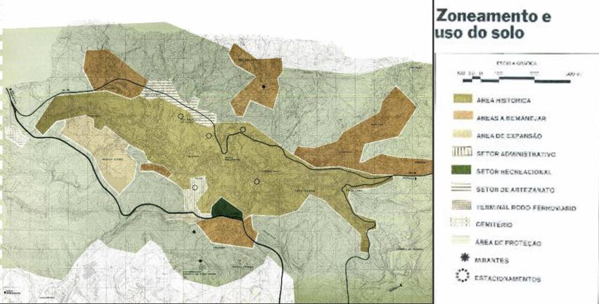
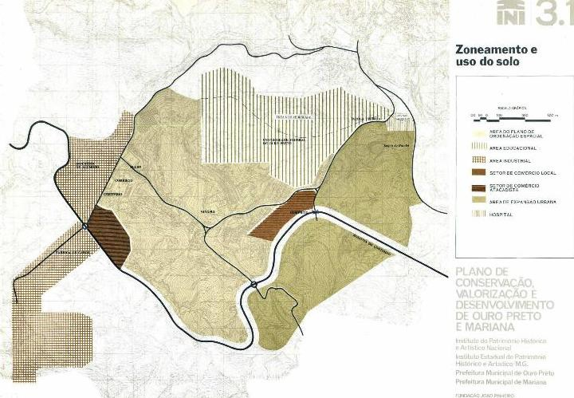
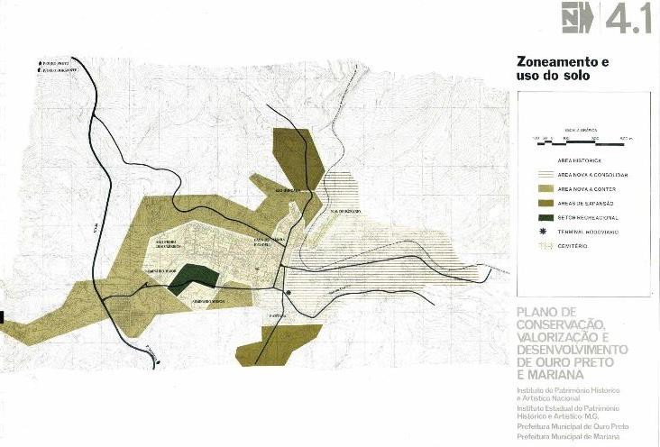
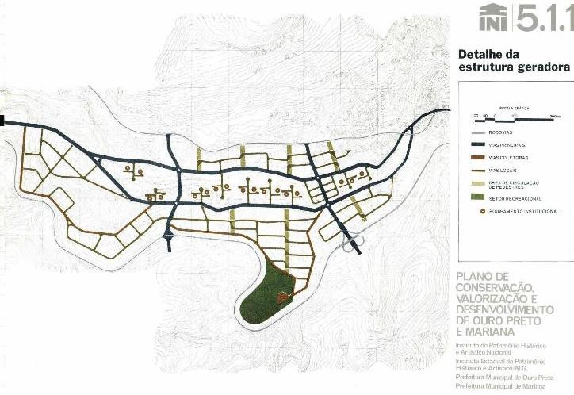
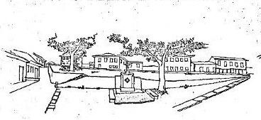

# Resumo

Em 21 de maio de 1973, o Instituto do Patrimônio Histórico e artístico
Nacional (IPHAN), Instituto Estadual do Patrimônio Histórico e Artístico
de Minas Gerais (IEPHA-MG) e as prefeituras municipais de Ouro Preto e
de Mariana contrataram a Fundação João Pinheiro para elaborar um plano
de defesa de Ouro Preto e Mariana, por Cr\$3.2 milhões e prazo de
execução até Janeiro de 1975.

O convênio resultara da necessidade de se elaborarem planos de
salvaguarda das cidades históricas brasileiras apontadas pela missão do
perito Michel Parent, que as visitara em 1966 e 1967, em relatório
publicado pela UNESCO em março de 1968. Posteriormente, a UNESCO enviara
o arquiteto português Alfredo Viana de Lima que de outubro a dezembro de
1968 elaborou o *Plano de Conservação e Valorização de Ouro Preto*,
vulgarmente citado como *Plano Viana de Lima.*

# Plano Viana de Lima

Era inevitável que um trabalho dessa complexidade realizado em apenas
dois meses por um arquiteto estrangeiro, resultasse superficial no trato
do problema urbano. O Plano Viana de Lima concebia Ouro Preto como uma
"cidade de arte", a designação que lhe dera Michael Parent, e propugnava
a máxima recuperação possível da ambiência antiga sugerindo medidas de
pronto rejeitadas pela população local tais como:

a)  a transferência do Monumento ao Tiradentes, de estilo acadêmico do
    Sec. XIX, na praça central de cidade para o bairro da Barra, cujos
    edifícios exibem estilo semelhante;

b)  bloqueio do transito de veículos motorizados na Praça Tiradentes,
    dificultando a relação entre as duas metades de Ouro Preto (Vila
    Rica e o arraial da Conceição de Antonio Dias) contrariando o
    objetivo de unificação que motivara a construção da praça fora, por
    volta de 1750.

As instituições envolvidas com a preservação do patrimônio mineiro
percebiam a necessidade de revisão e detalhamento das linhas gerais
definidas no projeto do arquiteto português. Nessa conjuntura
apresentava-se a Fundação João Pinheiro, através de seu Centro de
Desenvolvimento Urbano, com equipe própria experiente em planejamento e
agilidade para contratação temporária de técnicos, estagiários e
serviços especializados se necessários ao projeto.

A iniciativa era do governo federal, que cobriu a maior parte dos
custos, em parceria com o governo mineiro, os quais induziram a adesão
das prefeituras de ambos os municípios tanto para dar-lhes voz na
definição dos trabalhos de planejamento quanto comprometê-las com os
resultados e as ações consequentes. Naturalmente encontrou resistência
dos poderes locais que de início o viam como interferência externa a que
tiveram que aderir.

> No entanto o *Plano de Conservação Valorização e Desenvolvimento de
> Ouro Preto e Mariana* (FJP, 1975) não foi apenas o desenvolvimento do
> *Plano Vianna de Lima.*

Dele difere em extensão, profundidade e conceituação do planejamento de
uma cidade caracterizada pela sua herança urbanística e arquitetônica.

A equipe da FJP via cidade histórica como as outras, cada qual com suas
especificidades sobre um conjunto maior de características comuns.
Entendia o termo "histórica" como adjetivo.

A substância em questão é a cidade com população e demandas atuais, e
sua preservação depende da qualidade de vida da população e das
possibilidades financeiras da administração pública. Se a renda da
cidade decai, isso se reflete negativamente na conservação da
arquitetura e de todo o equipamento urbano. Por outro lado o crescimento
desordenado acarreta pressões. Casas se transformam em lojas, novos
prédios proliferam no tecido antigo, e o uso intenso da rua pelos
veículos automotores danifica o pavimento e abalam as velhas estruturas.

Considerou-se, pois que Ouro Preto e Mariana antes de serem cidades
históricas, eram cidades com população e problemas urbanos comuns. O
caráter de monumento a ser preservado havia de ser considerado, mas
visar apenas este objetivo não atenderia às necessidades do presente nem
absorveria pressões que deterioravam o acervo que se pretendia valorizar
e proteger.

# A organização do projeto

A equipe encarregada do projeto se compôs de cerca de 25 técnicos
permanentemente locados ao projeto mais a participação eventual de 19
outros do quadro da fundação, 62 estagiários 27 dos quais eram alunos da
escola de Minas e Metalurgia da UFOP, 10 consultores, e 4 funcionários
de apoio administrativo, ou seja, cerca de 120 pessoas estiveram
envolvidas nesses trabalhos durante cerca de um ano e meio. Era um grupo
composto em sua maioria por profissionais jovens com menos de cinco anos
de exercício profissional, e outros eram pessoas notórias no seu campo
de atuação, alguns dos quais conhecidos também por sua postura crítica
em relação à situação política no Brasil sob ditadura.

Estas características foram eventualmente apontadas pelos setores
conservadores de Minas Gerais, mas não tiveram força suficiente para
impedir a contratação da Fundação João Pinheiro pelo consorcio que o
encomendava.

Assim, pela primeira vez uma equipe multidisciplinar compostas de
arquitetos, urbanistas, economistas, sociólogos, engenheiros
sanitaristas, técnicos em administração, historiadores, advogados,
paisagistas, botânicos e agrônomos era reunida para o planejamento de
cidades históricas e se propunha a compatibilizar preservação com o
desenvolvimento.

A equipe era subdivida em setores segundo os campos de conhecimento e as
matérias tratadas, mantendo-se entretanto intensa realimentação
reciproca sobretudo na fase em que se elaboravam propostas de
intervenção.

Os setores então estabelecidos e conteúdo dos respectivos trabalhos
assim ficaram definidos:

1 -- Setor físico -- territorial.

Diagnóstico da estrutura física do conjunto das duas cidades, do
distrito de Passagem de Mariana e do bairro de Saramenha de Ouro Preto.
Proposição de áreas de expansão

urbana, de projetos de paisagismo, dossiês preliminares para projetos de
restauração arquitetônica, do sistema viário que faria a ligação dos
quatro núcleos urbanos já existentes e das áreas de expansão,
anteprojeto de consolidação das leis urbanas, e demais produtos próprios
do trabalho de urbanismo.

> 2 -- Setor Social

Identificação das características demográficas de Ouro Preto e Mariana,
sua evolução histórica; identificação das tendências presentes e
projeção para os 20 anos seguintes. Diagnóstico e proposições do sistema
de ensino de 1º e 2º grau, do sistema de saúde, assistência e promoção
social, lazer e habitação em ambas as cidade.

3.  -- Setor econômico.

Identificação dos aspectos da estrutura econômica, fontes de renda e
empregos, e estratégia de desenvolvimento para ambas a s cidades.

4.  -- Setor de infraestrutura

Diagnóstico dos sistemas de abastecimento de água, de esgotos pluviais e
sanitários, de Energia elétrica e Comunicações, e projeto de limpeza
urbana para ambas as cidades e elaboração de relatórios técnicos
preliminares de intervenções a serem executadas.

5.  -- Setor institucional e administrativo.

Proposição de anteprojeto de lei de organização, regimentos interno
plano de classificação e estatuto dos funcionários, código tributário,
assim como manuais de orçamento, de contabilidade, de tesouraria, de
controle de patrimônio, de arquivo, de protocolo, etc.

# Procedimento

Desde o início percebeu-se que o projeto geraria uma quantidade enorme
de informações e projetos setoriais, que se tornariam ineficazes se
agrupados num único documento. Seria necessário um relatório síntese
explicitando as premissas adotadas, os procedimentos e as proposições de
caráter mais geral, mas também diversos relatórios parciais dirigidos
aos órgãos públicos encarregados do trato de aspectos específicos como
as secretarias de saúde, e de educação, a EMBRATEL, CEMIG, DER, etc.,
que, aliás, colaborariam com os trabalhos de planejamento.

Aos contratantes do plano, IPHAN, IEPHA e prefeituras municipais de Ouro
Preto e Mariana, foram entregues quinhentas copias impressas do
Relatório Síntese, de todos os relatórios parciais e dos anteprojetos de
consolidação das leis urbanas a serem encaminhados às respectivas
Câmaras Municipais.

A cada etapa do trabalho se promoveram seminários abertos à população,
previamente divulgados pelos meios de comunicação local. Estes
seminários, embora tenham gerado algum aperfeiçoamento no rumo das
proposições em elaboração, não renderam entretanto contribuição de
importância desejada. A plateia se reduzia aos alunos da Escola de Minas
que haviam atuado como estagiários, ao pessoal das entidades
participantes do projeto, representantes dos contratantes do plano, e
poucos cidadãos interessados em refletir sobre sua própria cidade.
Estávamos em época de ditadura e não havia organizações civis plenamente
representativas. Assim os debates eram superficiais e a participação da
plateia se caracterizava muito frequentemente mais por pedidos de

explicação e por manifestação de interesses individuais do que por um
posicionamento coletivo,

O próprio prefeito de Ouro Preto, na época, não compareceu a esses
seminários senão quando levado pelo proprietário de determinada área,
que a principio parecia apropriada para absorver o crescimento
populacional, foi descartada por se haver constatado ser o habitat do
Peripatus Acacioi1, uma espécie de fóssil vivo, elo da evolução entre
anelídeos e artrópodes.2.

O prefeito de Mariana mostrava-se mais colaborativo visto que então sua
cidade se encontrava em fase de decadência econômica ou estagnação,
pouco a pouco se transformando em cidade dormitório para trabalhadores
da sede municipal de Ouro Preto e da indústria de alumínio instalada
desde 1945 em Saramenha, tornando-se a principal fonte de renda de todo
a região.

Mais produtivo mostrou-se o trabalho contínuo junto às instituições de
atuação em âmbito estadual, como por exemplo, a CEMIG (Companhia
Energética de Minas Gerais) que aceitou a proposição e realizou, pouco
tempo depois, a substituição da fiação aérea por rede subterrânea em
todo o centro histórico de ambas as cidades. Assim também o fez a
TELEMIG (Telecomunicações de Minas Gerais S/A) que já iniciara essa
substituição da rede enquanto decorriam os trabalhos da Fundação João
Pinheiro.

O IPHAN, e o IEPHA tinham apenas a experiência de ações pontuais de
restauração de edifícios isolados, tombamentos e promoção de estudos da
história da arte e da arquitetura brasileira, ainda que alguns dos seus
dirigentes percebessem a natureza diferente do problema então em causa.
Assim à equipe da FJP cabia também a criação e transferência de
conhecimento e metodologia serem apropriadas por estas instituições.

À falta de experiências anteriores de planejamento de preservação e
desenvolvimento de cidades históricas, foi necessário inventar a própria
metodologia de trabalho, conjugando a observação do objeto em questão
com o conhecimento e a experiência adquirida em trabalhos anteriores
ainda sob influência dos modelos e padrões difundidos pelo SERFAU na
década anterior, em especial aqueles então designados sob o título Plano
de Desenvolvimento Urbano Integrado.

# O sistema interurbano

> 1 Em 1975, o córrego do Tripuí em Ouro Preto era o único lugar
> conhecido de ocorrência da espécie no planeta. Mais recentemente,
> também foi encontrado em um córrego da África do Sul.
>
> 2 Anelídeos são minhocas e sanguessugas; artrópodes são insetos,
> crustáceos, aranhas, piolho-de-cobra, entre outros.
>
> Figura 1. Sistema Interurbano Ouro Preto -- Saramenha -- Passagem --
> Mariana. Fonte; Google Maps 2014. (Informações adicionais pelo autor)

Os estudos preliminares de diagnostico revelaram a relação de
complementariedade entre os quatros assentamentos urbanos. Moradores de
Mariana e Passagem deslocavam-se diariamente em direção a Ouro Preto e
Saramenha onde tinham emprego ou demandavam os serviços mais
diversificados que nos demais núcleos e lazer. Apenas as sedes
municipais tinham hospitais sendo o maior deles o da Santa Casa de
Misericórdia de Ouro Preto que atendia pacientes de toda região. O único
cinema ficava em Ouro Preto que também acolhia a maioria dos espetáculos
de teatro na sua Casa de Ópera, e a maioria dos shows de música popular
se realizavam na Praça Tiradentes.

Os estudos de evolução demográfica por sua vez reforçavam o entendimento
de Ouro Preto como polo principal do conjunto visto que esta cidade
apresentara na década de 1950-1960, a taxa de crescimento anual fora de
5,3% em Ouro Preto e 3,8% em Mariana e na década seguinte (1960-1970) de
5,5% ao ano e 1,9% respectivamente, quando a média de crescimento
vegetativo da população brasileira era de 2,9% ao ano; ou seja, Ouro
Preto continuava a inchar com índices crescentes enquanto Mariana
apresentava índices decrescentes, embora ainda não negativos.

Era necessário, portanto, definir áreas de expansão urbana que abrigasse
a população atraída por Ouro Preto aliviando a pressão pela abertura de
novos bairros ou adensamento de sua área de maior interesse histórico e
paisagístico e simultaneamente corrigir o desequilíbrio de crescimento
do sistema.

Ora, o sítio natural onde se desenvolvera Ouro Preto é visivelmente
inadequado para o assentamento urbano que nascera e crescera pela
fartura do ouro dos córregos que atravessam o estreito vale compreendido
entre a Serra do Ouro Preto ao norte e os morros do Gambá e do Cruzeiro
ao sul. Era evidente que a solução não poderia ser encontrada no entorno
imediato de Ouro Preto no qual 80% dos terrenos apresentavam altas
declividades e/ou instabilidade das camadas geológicas.

> Figura 2. Ouro Preto - Topografia da região vizinha. Fonte Arquivo
> Público Mineiro.

.

# Áreas de expansão urbana

Ainda assim era possível atender uma
pequena parte do crescimento de Ouro Preto em novo bairro planejado na
região denominada Buraco Quente, a oeste do centro histórico e do qual
não seria visível em razão da acidentada topografia da região. Porém
essa área tem a restrita dimensão de 30 hectares e não pode abrigar mais
de 4.5000 pessoas numa densidade de 150 hab./ha, cerca de 4,4% do
acréscimo de população previsto nos vinte anos seguintes. Tratava-se
portanto de uma válvula de escape da pressão por novas moradias a ser
usada parcimoniosamente.

.

> Figura 3. Ouro Preto- Proposição. Fonte: FJP. 1975

Em Saramenha, uma área de 150 hectares, já então em processo de
urbanização espontânea de baixa densidade, tinha a capacidade de abrigar
12.000 habitantes a uma densidade média de 150 hab./há. 11,4% do
acréscimo de população, com a vantagem de diversificar a população
daquele bairro até então composta quase exclusivamente por empregados da
ALCAN. A área em questão também estaria invisível a partir de Ouro
Preto, escondida pelo Morro do Cruzeiro no topo do qual se localizam
edifícios da Universidade e da Escola Técnica Federal de Ouro Preto.

> 
>
> Figura 4. Saramenha. Proposição. Fonte:FJP. 1975.

Diferentemente de Ouro Preto, a cidade e o município de Mariana
apresentam uma topografia menos acidentada.

O crescimento populacional da sede de Mariana seria absorvido por duas
áreas de expansão (Mata Cavalos e Santana), cerca de 25 hectares no
total, e pelo adensamento da área nova da cidade, na margem norte do Rio
do Carmo que divide quase meio a meio a sua atual mancha urbana, ficando
o centro histórico na margem sul. Juntas as duas áreas de expansão
desenhadas então e o adensamento da parte mais nova abrigariam 7.5000
habitantes, 7,2% do acréscimo de população prevista então para o sistema
no horizonte do plano.

> 
>
> Figura 5. Mariana. Proposição. Fonte: FJP, 1975

Restava encontrar lugar para 77% do crescimento previsto nos vinte anos
seguintes. Para tanto se projetou um novo núcleo urbano concebido
conforme os padrões do urbanismo contemporâneo, sem os constrangimentos
a que obrigava a defesa do patrimônio histórico das duas cidades
monumentos nacionais.

Identificou-se na vizinhança do povoado de Passagem uma extensa área de
topografia favorável capaz de abrigar uma cidade para cerca de 35.000
habitantes, O novo assentamento ocupando inicialmente 150 hectares de
uma área total de 350 hectares absorveria inicialmente 34% do acréscimo
de população e, uma vez consolidada, poderia ser expandida para abrigar
o restante (43%) do crescimento populacional previsto para a região.

O terreno escolhido ficava a 8 km de Ouro Preto, 3 km de Mariana, cerca
de 10 km de Saramenha; e todo o conjunto de rodovias existentes, bem
como a via férrea, já convergia para Passagem, facilitando sua ligação
com os outros três núcleos urbanos

considerados. Apresentava porém dois inconvenientes: o primeiro deles
era se localizar no Município de Mariana, no limite deste com Município
de Ouro Preto, cujo prefeito então se opunha radicalmente a "colocar
35000 eleitores no município vizinho" segundo sua própria expressão
verbal; o segundo era a necessidade de desapropriar a terra pertencente
a uma única empresa que exigia valores exorbitantes por ela. Faltou
então a determinação política em estâncias mais altas do governo
estadual e federal que conduzissem as negociações a bom termo e o
projeto jamais foi concretizado.

> 
>
> Figura 6. Passagem, Mariana. Proposição de novo núcleo urbano. Fonte:
> FJP, 1975.

.

A "cidade nova" de Passagem afinal não foi construída, mas as outras
áreas de expansão propostas são hoje realidade embora não tenham seguido
com precisão o traçado então imaginado. Multiplicaram-se construções
indesejáveis em alguns bolsões de terreno outrora desocupados dentro do
tecido urbano de Ouro Preto, mas aparentemente o problema não atingiu
proporções catastróficas, em consequência de transformações importantes
no quadro observado em 1973-1975; principalmente pela implantação da
siderúrgica Açominas, a 38 km de Ouro Preto, no município de Ouro
Branco, cujas instalações iniciadas em 1976 significaram a criação de
cerca de 5000 empregos diretos, e pelo revigoramento da economia de
Mariana desde a abertura de minas da empresa

Samarco, responsável por 4,5% da produção brasileira de minério de
ferro·.

Tais empreendimentos vultosos não eram sequer imaginados na ocasião de
elaboração do Plano da FJP.

Mas as proposições do Plano de Conservação, Valorização e
Desenvolvimento de Ouro Preto e Mariana não se limitaram a proposição de
abrigo para o crescimento populacional. Também foram propostas medidas
mais viáveis de imediato, entre elas, melhorias no sistema de esgotos,
abastecimento de água e coleta de lixo, restaurações de edificações e
tratamento paisagístico dos logradouros públicos e a reforma da
administração municipal então desordenada, em cada um dos núcleos
urbanos considerados. E para orientar de forma contínua o
desenvolvimento posterior do sistema interurbano, onde cada unidade
apresentava algum grau de especialização funcional, buscou-se
identificar a vocação assim como a influência positiva ou negativa das
funções a que atendiam cada um dos núcleos, no seu interior. Deste modo
poder-se- ia respeitar as tendências espontâneas e imaginar mecanismos
institucionais e intervenções de desenho urbano que corrigissem aquelas
prejudiciais à qualidade de vida da população local ou ao patrimônio
histórico a ser preservado e valorizado.

# As Funções Urbanas e Seus Efeitos

# Residência e Comércio

A função residencial e de comércio local era atendida por todos eles,
entretanto era evidente a necessidade de limitar sua expansão em Ouro
Preto, pois seu crescimento produzia a proliferação de novas unidades
habitacionais e a substituição de uso das antigas edificações e
acarretaria não só a intensificação do transito de veículos mas também a
deterioração da relação entre a cidade e o sítio natural que ocupa, uma
das características mais marcantes da sua imagem.

Pretendia-se desestimular sobretudo a expansão do comércio de caráter
regional em Ouro Preto, um dos principais fatores da forte polarização
que aquele núcleo exercia sobre os demais. Caberia estimular este tipo
de comércio na nova urbanização de Passagem de Mariana, mais central e
com acessos diretos a partir de Ouro Preto, Saramenha e Mariana. Nos
centros antigos o comercio atenderia as necessidades mais corriqueiras e
daria suporte às funções principais de cultura, educação, turismo que se
revelavam como atividades propícias simultaneamente à preservação do
acervo histórico, á criação de empregos e ao desenvolvimento de melhores
condições de vida da população local.

# Cultura e educação

A Universidade Federal de Ouro Preto, parte da qual funciona na cidade
vizinha, tem tanta importância quanto o turismo na economia dos dois
municípios, se considerados o aporte dos salários diretos de seus
servidores, e dos recursos financeiros dos estudantes, por via de bolsas
de estudo ou de mesadas enviadas pelos familiares. Além disso, população
estudantil contribui significativamente para a preservação de casarões
transformados em repúblicas e em pousadas onde se hospedam jovens
turistas nos feriados prolongados durante os Festivais de Inverno
promovido pela Universidade Federal de Minas Gerais; ou ex-alunos que
voltam no dia 12 de Outubro para visitar e serem homenageados nas
republicas em que moraram como estudantes.

Assim pois a contribuição da Universidade, e secundariamente da Escola
Técnica Federal de Ouro Preto, para a animação e peculiaridade da
ambiência das duas cidades, conduziu, entre as recomendações de natureza
institucional, a propor ampliação daquela universidade então quase
restrita aos renomados cursos de geologia, engenharia de minas,
bioquímica e letras. Recomendava-se, porém evitar-se a criação de campus
universitário isolado e defendia-se certo grau de especialização
localizando os cursos de ciências naturais e tecnologia em Ouro Preto, e
os cursos de natureza humanística em Mariana, que por ser sede de
bispado, abriga ainda hoje importantes arquivos do

período colonial.3

# Função industrial

> 3 Em 1976 a Fundação João Pinheiro elaborou para a Universidade
> Federal de Ouro Preto seu *Plano de estruturação e implantação: UFOP
> Belo Horizonte:*

Propunha-se o impedimento de instalações industriais de médio ou grande
porte dentro do perímetro de tombamento de ambas as cidades e nas novas
áreas de ocupação residencial; sendo, porém estimulada, na proximidade
destas, a instalação de pequenos estabelecimentos voltados à manufatura
de objetos de pedra-sabão, couro, madeira e pedras semipreciosas; e no
interior das duas cidades, pequenas indústrias de caráter não poluidor
tais como padarias, gráficas, confecções de tecido, sapataria e
semelhantes.

# Lazer e Recreação

Era deficiente a oferta de equipamentos de lazer e recreação ativa nos
quatro núcleos estudados, principalmente em Ouro Preto cujo sítio
natural não era propicio à instalação de campos de esporte ou piscinas
senão realizando corte e desbastamento das encostas com evidentes
inconvenientes paisagísticos e de segurança, dada a instabilidade
geológica de grande parte da região.

No interior mesmo da região de maior importância como patrimônio
histórico, uma extensa área desocupada entre o bairro do Pilar e a Rua
São José, na várzea do córrego do Caquende, havia improvisados campos de
pelada, escondidos por vegetação, que foram incorporados ao projeto de
parque urbano ali proposto. À oeste da área de expansão do Buraco
Quente, assim como na vertente sul do morro do Cruzeiro perto da
universidade e da escola técnica, havia área suficiente para ginásios de
esporte e equipamentos semelhantes, aos quais se teria acesso por
rodovia proposta para ligação entre todas as áreas de expansão
previstas, entre si e com os núcleos antigos.

Em Mariana, uma área livre de 4,5 hectares, plana e de fácil acesso,
possibilitava sem inconvenientes a instalação de campos de esportes e
atividades correlatas tais como posto medico, bares, etc.

Para lazer contemplativo, indicavam-se pontos de descanso, com bancos,
ao longo de passeios que seriam criados ou recompostos ao longo dos
córregos que atravessam o vale de Ouro Preto, assim como agenciamento de
locais dos quais se descortinavam panoramas de notável beleza e do
entorno de alguns chafarizes onde se propuseram a construção de lajeados
sobre os quais blocos pedra de faces planas serviriam de bancos.

> 
>
> Figura 7. Ouro Preto - Largo do Frei Vicente Botelho. Anteprojeto
> paisagístico. Fonte FJP, 1975.

# Conclusão

O Plano de Conservação, valorização e desenvolvimento de Ouro Preto e
Mariana foi um trabalho de amplitude até então nunca encetado a respeito
das cidades históricas brasileiras.

Nossa presente limitação de espaço e tempo impede um relato mais
detalhado, mas o material produzido está disponível no site da Fundação
João Pinheiro.

A comunidade internacional, e nosso ministério da cultura, tem
reexaminado conceitos e emitido cartas de princípios a serem observados
no trato da herança urbanística e arquitetônica da humanidade, creio
pois que passados quarenta anos deste projeto, seria proveitosa a sua
reavaliação visando constatar o acerto ou erro dos métodos de trabalho,
das previsões e propostas ali contidas.

# Referências

> ANONIMO. *Planta da Cidade de Ouro Preto- Organizada por ordem do
> Exmº. Sr. Dr.Luiz Eugenio Horta Barboza, Presidente da Província.*
> Leipzig: Gravure de Giesecke &Devrient, 1888. Disponível em \<\<
> [[http://www.siaapm.cultura.mg.gov.br]{.ul}](http://www.siaapm.cultura.mg.gov.br/)\>
>
> FUNDAÇÃO JOÃO PINHEIRO. Centro de Desenvolvimento Urbano. *[Plano
> de](http://www.bibliotecadigital.mg.gov.br/consulta/consultaDetalheDocumento.php?iCodDocumento=48824)
> [conservação, valorização e desenvolvimento de Ouro Preto e
> Mariana](http://www.bibliotecadigital.mg.gov.br/consulta/consultaDetalheDocumento.php?iCodDocumento=48824):
> relatório síntese: parte 1*. Belo Horizonte: \[1975\].
>
> *[Plano de conservação, valorização e
> desenvolvimento](http://www.bibliotecadigital.mg.gov.br/consulta/consultaDetalheDocumento.php?iCodDocumento=48824)
> [de Ouro Preto e
> Mariana](http://www.bibliotecadigital.mg.gov.br/consulta/consultaDetalheDocumento.php?iCodDocumento=48824):
> relatório síntese: parte 2.* Belo Horizonte: \[1975\].

Disponível em \<
[[http://www.bibliotecadigital.mg.gov.br]{.ul}](http://www.bibliotecadigital.mg.gov.br/)\>

> *[Estrutura econômica e estratégia de
> desenvolvimento](http://www.bibliotecadigital.mg.gov.br/consulta/consultaDetalheDocumento.php?iCodDocumento=48771)
> [para a região de Ouro Preto e
> Mariana](http://www.bibliotecadigital.mg.gov.br/consulta/consultaDetalheDocumento.php?iCodDocumento=48771):
> plano de conservação, valorização desenvolvimento Ouro Preto-Mariana*.
> Belo Horizonte: \[1975\] 1 v. (não paginado).

Disponível em \<
[[http://www.bibliotecadigital.mg.gov.br]{.ul}](http://www.bibliotecadigital.mg.gov.br/)\>

> *[Aspectos Demográficos em Ouro
> Preto-Mariana.](http://www.bibliotecadigital.mg.gov.br/consulta/consultaDetalheDocumento.php?iCodDocumento=48593)*
> Belo Horizonte: \[1975\]. 25p.: il. Disponível em \<
> [[http://www.bibliotecadigital.mg.gov.br]{.ul}](http://www.bibliotecadigital.mg.gov.br/)\>
>
> [*Plano de Conservação, Valorização e
> Desenvolvimento*](http://www.bibliotecadigital.mg.gov.br/consulta/consultaDetalheDocumento.php?iCodDocumento=48640)
>
> *[- Ouro
> Preto/Mariana](http://www.bibliotecadigital.mg.gov.br/consulta/consultaDetalheDocumento.php?iCodDocumento=48640):
> Paisagismo: unidade de proposição nº 2: Ouro Preto*. Belo Horizonte:
> \[1975\]. 1v. (não paginado).
>
> PARENT, Michael. *Proteção e valorização do patrimônio cultural
> brasileiro no âmbito do desenvolvimento turístico e econômico.* In
> LEAL*,* Claudia Feierabend Baeta*. As Missões da UNESCO no Brasil:
> Michel Parent. \[tradução de Rejane Maria Lobo Vieira\]; organização e
> texto de. -- Rio de Janeiro: IPHAN, COPEDOC, 2008. Disponível em\<
> [[http://portal.iphan.gov.br/baixaFcdAnexo.do?id=3855]{.ul}](http://portal.iphan.gov.br/baixaFcdAnexo.do?id=3855)*
