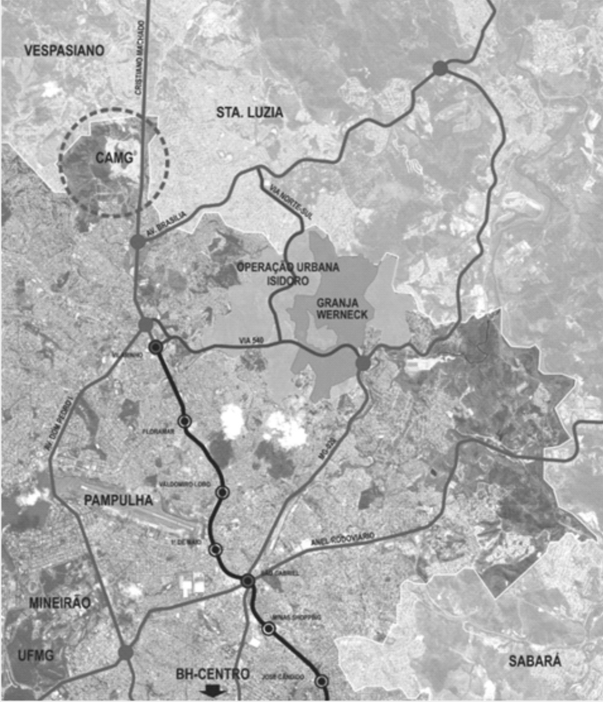
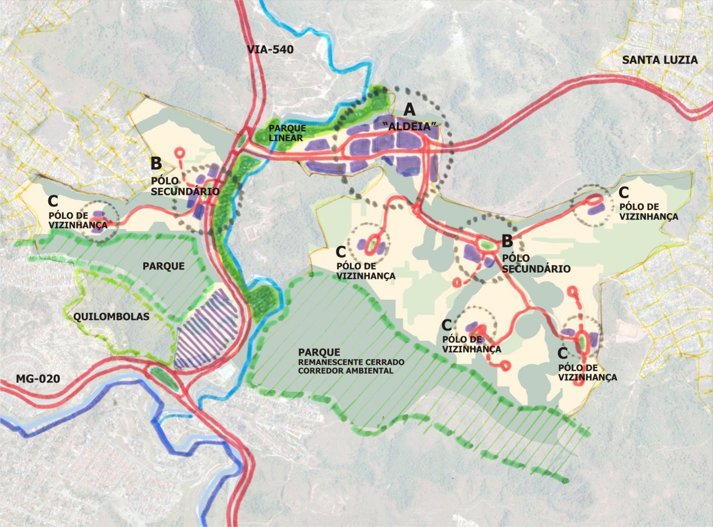
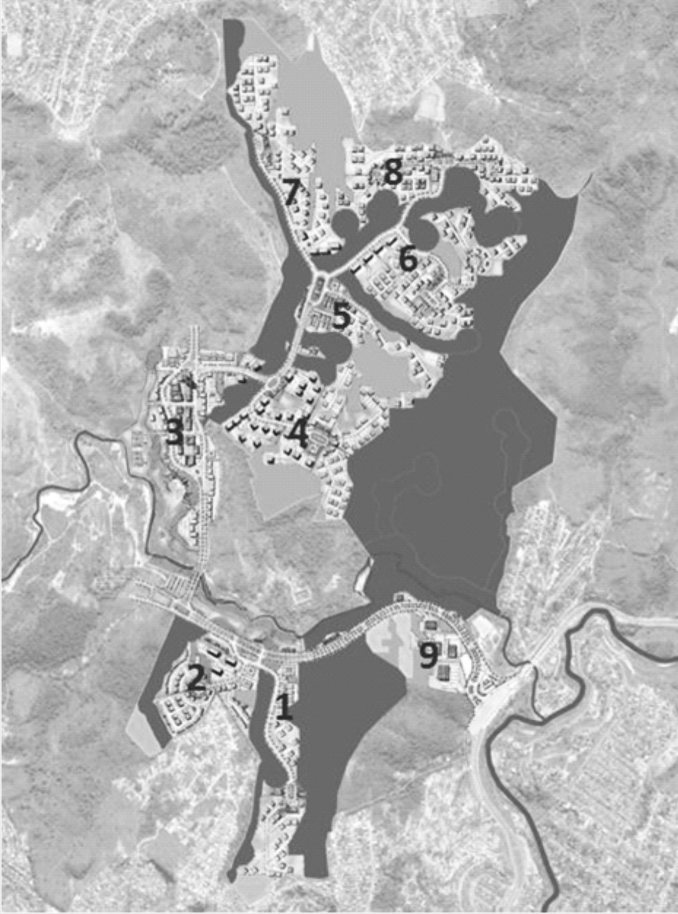
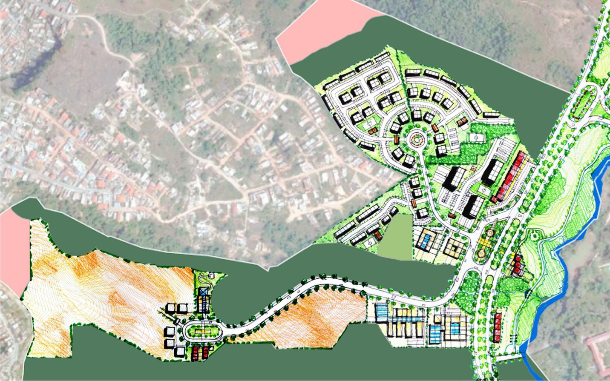

# Resumo

Este artigo parte de uma tese de Doutorado, que trata de uma crítica
sobre as novas fronteiras imobiliárias de Belo Horizonte, capital de
Minas Gerais. Tem como referência a Operação Urbana denominada Granja
Werneck, recentemente licenciada e em fase de implantação em Belo
Horizonte. A análise permeia as possíveis relações com as teorias do
urbanismo moderno apresentadas pela pensadora francesa Françoise Choay,
especificamente o progressismo e o culturalismo, bem como o pensamento
contemporâneo do teórico americano Edward W. Soja, que procura
contextualizar os recentes processos de reestruturação das metrópoles. O
artigo conclui que as teorias do século XIX continuam, apesar da
crítica, a serem utilizadas (consciente ou não) como fontes inspiradoras
e legitimadoras dos projetos dos empreendimentos urbanísticos
contemporâneos.

Palavras-chave: Belo Horizonte, Urbanismo Moderno, Novas fronteiras
imobiliárias.

> **The Influence of Modern Urbanism in Recent Productions of
> Contemporary Urban Space: Granja Werneck Urban Operation**, **Belo
> Horizonte**

# Abstract

This article part of a doctoral dissertation is a critique of the new
real estate borders of Belo Horizonte, capital of Minas Gerais. Its
reference Urban Operation called Granja Werneck newly licensed and under
implementation in Belo Horizonte, capital of Minas Gerais. The analysis
pervades the possible relations with the \"scientific theories of
urbanism\" presented by french thinker Françoise Choay, specifically
progressivism and culturalism and contemporary thought the American
theorist Edward W. Soybeans that aims to contextualize the recent restructuring of the
metropolis. The article concludes that the theories of the nineteenth
century remain, despite the criticism, to be used (consciously or not)
as sources of inspiration and legitimating projects of contemporary
urban developments.

Keywords: Belo Horizonte, Granja Werneck, New real estate borders.

# Introdução

Segundo revelou a professora Françoise Choay (1998), as contrapartidas
com pretensões científicas do urbanismo moderno surgiram no final do
século XIX, reunindo desde os livres pensadores, até os chamados
especialistas da questão urbana. A autora, em seu livro "O urbanismo:
utopias e realidades: uma antologia", lançado em 1965, elaborou um vasto
estudo sobre as principais teorias urbanas, do final do século XIX a
meados do século XX. Transcorridos quase 50 anos de sua publicação, o
livro ainda é uma referência teórica nos cursos de arquitetura e
urbanismo, principalmente nas disciplinas de projeto de urbanismo. Choay
(1996, 1998) revela no livro citado e em publicações de décadas mais
tarde, que o urbanismo moderno foi uma das vertentes da teoria urbana
mais influentes no século XX. Essa vertente, segundo a autora de
inspiração utópica, é subdividida em três versões, progressismo,
culturalismo e naturalismo.

Sem pretensão de esgotar o assunto, tentará este artigo demonstrar que,
apesar das fortes críticas que receberam, as ideias do urbanismo moderno
continuam a influenciar a atual produção dos projetos imobiliários das
metrópoles contemporâneas. Essas grandes cidades foram denominadas pelo
professor e geógrafo americano Edward W. Soja, como pós-metrópoles
(Soja, 2000).

Para a análise dessa produção urbana contemporânea, considerou-se a
Operação Urbana denominada Granja Werneck, recentemente licenciada
ambientalmente. Compreende a ocupação de umas das últimas áreas livres
da cidade de Belo Horizonte, envolvendo a construção de um grande
empreendimento imobiliário, contendo unidades residenciais, comerciais e
institucionais, previsto para receber aproximadamente uma população de
350 mil pessoas, o que corresponde a quase 12% da população atual de
Belo Horizonte. O empreendimento obteve a licença prévia em agosto de
2010 e a licença de implantação em 2012.

# As Teorias do Urbanismo Moderno: Progressismo e Culturalismo

Uma das mais representativas vertentes do urbanismo moderno é denominada
por Choay (1996) como o modelo progressista. Para a autora, a concepção
progressista teve por base a convicção de que a era industrial
representou um rompimento radical com o passado, não mais se
justificando que as cidades se prendessem às antigas estruturas urbanas,
que não apresentariam correspondência com as necessidades e
possibilidades geradas pela indústria e pelas conquistas do saber humano
que lhe deram origem e sustentação. "Como no pré-urbanismo progressista,
encontra-se, pois na base do urbanismo progressista uma concepção da era
industrial como ruptura histórica radical" (Choay, 1998:20). Leonardo
Benevolo (1998) e Lewis Mumford (1985-1990) (1998) consentem com Choay
(1998), ao afirmarem que a crítica progressista dizia respeito a uma
presumível desordem na distribuição espacial das funções urbanas da
cidade capitalista. Essa desordem se expressaria, sobretudo, em
conflitos e incompatibilidades entre funções e entre estas e o meio
urbano e natural (Choay, 1970). Caberia então ao teórico progressista
estabelecer uma nova concepção de cidade, que

assegurasse esta correspondência. Entre os modelos urbanos
representativos dessa vertente do urbanismo moderno, Choay (1998)
destaca a *Cité Industrielle* (Cidade Industrial) e a *Ville Radieuse*
(Vila Radiante), concebidos respectivamente pelos arquitetos franceses
Tony Garnier (1869-1948) e Le Corbusier (1887-1965). Com relação a
Garnier, Benevolo exalta "\[\...\] a sua visão um pouco utópica da
cidade, o cândido verniz de classicismo -- que só fazem crescer a
admiração por este personagem, modesto e grande, que ainda deve ser
devidamente avaliado pela crítica contemporânea" (Benevolo, 1998:344). A
partir de 1928, o modelo iniciado com Garnier passa a ser difundido
através de um grupo internacional conhecido como CIAM (Choay, 1996). Em
1933, esse grupo propõe um documento síntese dos preceitos do urbanismo
moderno, a Carta de Atenas. Esta constitui a base das propostas dos
urbanistas progressistas. Porém, segundo Choay, a Carta de Atenas "tomou
emprestada a maior parte das citações que se seguem a Le Corbusier
\[\...\]" (1998:20). Para a autora, Le Corbusier é o pensador onde a
utopia encontrou sua ancoragem mais sólida e a imagem revelada em seus
desenhos e sua visão de uma sociedade global aproximando-o ao pensamento
utópico de Thomas More (1478-1538) (Choay, 1980).

A segunda linha básica de definição do urbanismo moderno, a
Culturalista, propugnava também a retomada da ordem e, ao contrário da
primeira, das dimensões humanas do espaço urbano do passado. O inglês
Ebenezer Howard (1850-1928) foi o principal teórico. Com suas motivações
políticas e sociais, sua proposta se materializou em um paradigma de
organização espacial claro e definido: o da Cidade Jardim (Howard,
1996). Existe um consenso entre autores como Mumford (1998), Benevolo
(1998), Choay (1998) e Hall (2011) sobre a importância que representaram
as suas ideias para a ciência do urbanismo. Benevolo (1998) considera,
que a influência de Howard e do movimento que criou encerram a linha de
pensamento dos utopistas, tornando-se um divisor entre as concepções da
cidade irrealizável para com a cidade realizável. Por sua vez, Hall
afirma que "Ebenezer Howard leva a palma, como a mais importante e
singular personalidade de toda a história do urbanismo" (Hall,
2011:103). Já Mumford (1998), considera Howard a grande referência do
ideário urbano contemporâneo, dedicando inúmeras páginas do livro "A
Cultura das Cidades" para analisar e enaltecer o seu ideário. Mumford
afirma, que "o gênio de Howard revelou-se no combinar os órgãos
existentes da cidade numa composição mais ordenada, baseada no princípio
da limitação orgânica e do crescimento controlado" (Mumford, 1998:552).

# A Operação Urbana do Isidoro -- Empreendimento Granja Werneck

O empreendimento imobiliário denominado como Granja Werneck trata-se de
um projeto urbanístico desenvolvido pela iniciativa privada, e resultado
de uma demorada e detalhada negociação com o Estado. Consiste em uma
operação urbana[1](#_bookmark0) de uma grande área vazia em Belo
Horizonte,

1.  []{#_bookmark0 .anchor}O Estatuto das Cidades define no seu Artigo
    32 que Operação Urbana é um conjunto de intervenções e medidas
    coordenadas pelo Poder Público, com a participação dos
    proprietários, moradores, usuários

denominada como Isidoro, que localiza-se ao norte de Belo Horizonte,
próxima à divisa com o município de Santa Luzia, com uma área aproximada
de 933 ha (SMMA, 2010) (Fig. 1).

> 
>
> Figura 1 \-- Localização da Operação Urbana do Isidoro. Fonte: SMMA,
> 2010.

Dentro das propriedades que englobam a "Operação Urbana do Isidoro"
situa-se uma grande área denominada como Granja Werneck, com cerca de
350 hectares. Está localizada dentro dos limites da Regional Norte,
correspondendo a cerca de 1/3 da área da Operação Urbana do Isidoro
(FIG. 2). Segundo a LPUOS n° 7166/96 (modificada pelas Leis n° 8137/00 e
9959/11) essa área era caracterizada por ZP2 (regiões, predominantemente
ocupadas, de proteção ambiental, histórica, cultural, arqueológica ou
paisagística ou em que existam condições topográficas ou geológicas
desfavoráveis, onde devem ser mantidos baixos índices de densidade
demográfica) e ZPAM (regiões que, por suas características e pela
tipicidade da vegetação, destinam-se à preservação e à recuperação de
ecossistemas). Tais zoneamentos inviabilizariam a ocupação da área,
sendo necessária, para atender os interesses particulares
principalmente, a realização da operação urbana, a qual introduziu novos
parâmetros para ocupação daquela área.

O início da aprovação dos projetos urbanísticos na PBH da Operação
Urbana da Granja Werneck, que faz parte da Operação Urbana Isidoro,
deu-se em maio de 2010 com o pedido de

permanentes e investidores privados, com o objetivo de alcançar em uma
área transformações urbanísticas estruturais, melhorias sociais e
valorização ambiental (BRASIL, 2001).

Licença Prévia para o licenciamento ambiental. Atualmente, em fevereiro
de 2014, a PBH aguardava a apresentação dos projetos executivos para a
emissão da Licença de Implantação, autorizando assim o início das obras.

# Similaridades do Projeto Urbanístico

A infraestrutura básica projetada para a Granja Werneck está
dimensionada para um adensamento máximo de aproximadamente 67.620
unidades residenciais e não residenciais, que poderá ser atingido, a
partir da utilização dos parâmetros urbanísticos excepcionais
estabelecidos na Operação Urbana. Segundo o cronograma apresentado pelo
empreendedor, o projeto será implantado em fases, divididas em bolsões
residenciais e comerciais, sendo o primeiro, ao sul, situado entre a
MG-020 e a comunidade Quilombola Mangueiras (PBH, 2010) (Fig. 2).

> 
>
> Figura 2 - Bolsões e etapas de implantação do parcelamento da Granja
> Werneck. Fonte: PBH, 2010.

Essa comunidade, descendente de escravos, tem sua origem no final do
século XIX. Atualmente, a área ocupada pela comunidade na capital
mineira possui grande valor imobiliário. Oficialmente, a Prefeitura
reconhece que o território tem apenas dois hectares, dez vezes menos do
que estimam os quilombolas, que reivindicam 20 hectares. No quilombo
Mangueiras, além de conviverem com a incerteza sobre o futuro, as 12
famílias que vivem no local, ao todo 57 pessoas, ainda são obrigadas a
conviver com a degradação ambiental provocada pelas ocupações
irregulares no entorno e as pressões por invasão. Ao redor do quilombo,
os bolsões de ocupação do projeto Granja Werneck terão um mix de usos
que *"visa trazer diversidade e animação ao projeto*" (PBH, p. 301,
2010). O que o projeto da Granja Werneck procura, pelo menos no
discurso, é evitar um processo de

gentrificação[2](#_bookmark1). Essa "elitização" da cidade é uma
tendência, que tem a disseminação pelo mundo através de Haussmam e irá
acompanhar as políticas de intervenção no espaço das cidades na
modernidade. Entretanto, dificilmente os equipamentos previstos no
entorno deixarão de impactar no cotidiano da comunidade. Soja (2000)
ressalta como o processo de reestruturação urbana tem resultado, no caso
de Los Angeles, na acentuação segregação e na segmentação urbana, em
termos de etnia, classes e mesmo de categorias ocupacionais. O que, de
certa forma, aproxima-se de Belo Horizonte e do empreendimento Granja
Werneck.

Observa-se, que na Granja Werneck o traçado urbano, no sentido adotado
na Cidade Jardim, tem um papel diferenciado a cumprir, quer na definição
de uma circulação estrutural de conjunto, quer na definição de um
conjunto de pequenas comunidades, de vida interiorizada e autônoma.
Embora, as vias dificilmente apresentariam a dimensão e a presença do
verde natural corno as concebidas por Howard (2011) para a Cidade
Jardim.

A ocupação proposta também prevê a criação de centralidades em
diferentes escalas e níveis hierárquicos, dependendo de sua localização
e dos usos e equipamentos que irão abrigar. A principal centralidade do
projeto terá abrangência maior, tanto pela sua localização próxima às
vias que fazem ligações regionais, como pelos seus usos, que compreendem
principalmente comércio, serviços e equipamentos comunitários de maior
porte e com maior público (Fig. 3). Lefebvre (1991) revela, que o espaço
produzido por esses grupos imobiliários tende para a homogeneidade,
porque ele reduz as diferenças (particularidades), separando as funções
da prática social. Esse espaço produzido, que o autor denomina como
abstrato, apoia-se em enormes centros comerciais, de grandes unidades de
produção, fundamentais para o capitalismo.

2.  []{#_bookmark1 .anchor}O neologismo inglês gentrification, trata-se
    do vocábulo cunhado pela socióloga britânica Ruth Glass em 1964 para
    referir-se aos processos de subistituição de populações operárias
    pela classe média em Londres, como resultado das operações de
    renovação do Estado. Desde a antiguidade, este fenômeno tem sido
    traduzido como aburguesamento (o vocábulo \"aburguesamento\" - foi
    utilizado para denominar a renovação de Paris pelo prefeito
    Haussmann - Smith, 1996), aristocratização, requalificação social e
    a ideia de elitização (HERRERA, 2001).

> 
>
> Figura 3 - Setorização pretendida na concepção da Granja Werneck.
> Fonte: PBH, 2010.

Nas propostas progressistas e culturalistas a centralidade foi uma
preocupação dos principais mentores intelectuais. Hausmann remodelou o
centro de Paris, abrindo grandes avenidas em direção ao Arco do Triunfo,
melhorando as condições físicas e ambientais para a burguesia francesa.
Nas concepções progressistas das Cidades Industrial, Contemporânea e
Radiante, e culturalistas de Howard, o centro era o espaço destinado aos
comércio ou os grandes empreendimentos e o ponto de irradiação das
principais vias. Entretanto, cabe destacar que o centro para Howard não
possuía as mesmas densidades construtiva e demográfica propostas por Le
Corbusier.

Segundo o EIA, "a intenção é implantar moradias com diferentes
tipologias, voltadas principalmente para famílias com diferentes perfis
e, em segundo plano, considerando-se as faixas de renda" (EIA, 2010,
p.255). As famílias que ocuparem os imóveis terão, dentro do próprio
projeto, alternativas de comércio, serviços, equipamentos comunitários e
de lazer, que atenderão também aos moradores do entorno. No que diz
respeito às edificações, o número de pavimentos é diversificado, mas os
apartamentos terão dois ou três quartos, além da adoção de diferentes
tipologias de construção com diferentes gabaritos (por exemplo, quatro,
oito ou doze pavimentos). Essa padronização dos edifícios residenciais
justificada, dentre outros, pelo processo construtivo, comunga com os
princípios modernistas da produção em série, da eficiência, não
importando as características locais ou mesmo geográficas.

A proposta proporciona a preservação das áreas ambientalmente
importantes, formando parques e corredores ecológicos e promove "o uso
planejado". No discurso dos autores, o projeto "\[\...\] planejado
resgata de certa forma a vida em comunidade, essa relação com os
vizinhos, reduzindo problemas, transtornos do deslocamento diário entre
casa e trabalho" (PBH, 2010, p.265). Existem autores, como Jane Jacobs
(2000) que discutem bastante esse discurso do "uso planejado" tão
próprio do moderno de proporcionar "a vida em comunidade". Na visão da
autora, existem outros fatores que proporcionam esse sentido de
comunidade, nos quais o planejamento, a higiene física, não está
presente.

Observa-se que os espaços residenciais criam um ambiente de isolamento
ainda maior, não bastasse a distância da cidade, o ambiente do edifício
possibilitará todas as comodidades, como fazer ginástica ou praticar um
esporte favorito, relaxar e promover reuniões. Na verdade esse
isolamento nas unidades habitacionais não deixa de ser uma das
consequências do controle modernista das funções urbanas. Controle este
também, com menor intensidade, presente no ideário da Cidade Jardim
(Fig. 4).

> 
>
> Figura 4 - Plano de ocupação do setor 5. Fonte: EIA, 2010.

A ideia das superquadras se faz presente também na concepção da Granja
Werneck. Essa forma de ocupação espacial, que iniciou com os socialistas
utópicos Robert Owen (1771-1858) e Charles Fourier (1772-1837), foi
proposta pelo movimento modernista, como um novo módulo de organização
espacial urbana, ao se apresentarem indivisa, coletiva, funcionalmente
especializada e com macro escala física, confrontariando claramente as
quadras do modelo de tradicionalmente limitadas na escala, divididas em
lotes individuais e indefinidas quanto às formas de uso e ocupação do
solo. Além disso, pela eliminação dos lotes individuais, apresentam-se
as superquadras modernistas sem os problemas dos múltiplos acessos
marginais das quadras parceladas tradicionais, bem como,

pelas suas grandes dimensões, sem a multiplicidade de vias e cruzamentos
que caracterizam fisicamente o modelo tradicional.

Há um discurso no projeto da Granja Werneck, com relação ao planejamento
de também gerar segurança. "Todos poderão morar em um bairro planejado,
bonito, com estrutura completa e segurança 24 horas" (EIA, 2010, p.269).
Isto significa, na visão de Soja, morar em verdadeiras "\[\...\] Cidades
Carcerárias, espaços que se assemelham a fortalezas e que contam com
sofisticadas tecnologias de vigilância e detenção, respondendo a uma
ecologia do medo" (2000, p.234). Reforçando esse ideário de segurança, o
desenho urbano da Granja Werneck acaba por utilizar padrões de
arruamentos sem conexão ou continuidade com a malha viária externa,
mesmo que o discurso seja de aparente integração com o entorno. Assim
"\[\...\] observa-se uma inédita tendência a mesclar o desenho urbano, a
arquitetura e a maquinaria policial em uma estratégia de seguridade
global" (SOJA, 2000:238). Por exemplo, na organização do sistema viário,
foi criado um sistema de ilhas, isto é, cada residencial é provido de um
único acesso, embora não sendo controlado por portaria, acaba por
favorecer a segurança. Dentro das ilhas existirão pequenos condomínios,
onde o acesso será rigidamente controlado. Essas ilhas não deixam de ser
uma apropriação formal dos esboços da Cidade Jardim.

A análise do processo de ocupação da Granja Werneck, como também de
outras produções, como os recentes *Alphavilles* de Belo Horizonte,
apresentam vários dos estereótipos observados em outros condomínios
brasileiros e nos subúrbios norte-americanos, especialmente aqueles que
são vinculados à idéia de status social, simbolicamente expresso em
componentes de paisagem, arquitetura das edificações, artefatos,
mobiliário urbano e utilitário, ornamentos, enfim, dos elementos gerais
de utilização cotidiana do espaço condominial. Isto acaba tornando-se
uma forma de regulação social, em cima das maneiras pelas quais
relacionamos nossas imagens com a própria realidade.

Em sentido amplo, esta reestruturação por que passam as grandes
metrópoles advogada por Soja, é marcada pelo "crescente poder político e
social das simulações do real como substitutos lógicos e comportamentais
para eventos e condições materiais reais." Invariavelmente evocam uma
vida ideal, sonho ou melhores condições e até condições ideais, que
podem ser expressos em modelos espaciais que se tornarão objetos de
desejo e verdadeiras ideologias como as expressas no empreendimento
Granja Werneck.

Assim, o urbanismo científico acaba operando com uma estratégia de
classe, através da reprodução de seus interesses, alienando as outras
classes e impedindo que estas tomem consciência de tal processo. Essas
ideologias alienam, pois "\[\...\] quebram a unidade dialética do pensar
e do atuar" (ARANHA; MARTINS, 1993). Almejar padrões externos significa
desejar objetos que reproduzem todo um processo de alienação. Em Marx, a
alienação refere-se a uma situação resultante dos fatores materiais
dominantes da sociedade, caracterizada por ele sobretudo no sistema
capitalista, em que o

trabalho humano se processa de modo a produzir objetos separados do
alcance de quem os produziu, para se transformarem, indistintamente, em
mercadorias (DEBORD, 1997).

O projeto urbano do empreendimento Granja Werneck, concebido segundo os
parâmetros da eficiência, ocasiona, assim, a alienação da própria
existência humana, que passou a ser constrangida a se adequar à nova
dinâmica urbana, organizada de forma lógica e matemática. Isto condiz
com o discurso dos arquitetos modernos, para os quais as cidades
configuradas de acordo com uma lei geral, com uma organização global,
constituídas segundo a racionalidade industrial, deveriam formar um todo
ordenado, uma unidade coerente, com funções bem definidas, assumindo a
estrutura de uma grande máquina industrial (TAFURI, 1985). Como veículos
da indústria cultural produzem uma estandartização e uma racionalização
da produção cultural e, ao mesmo tempo, conservam também "formas de
produção individual" (ADORNO, HOIKEIMER, 1985). Trata-se, no entanto, de
um pseudo-individualismo, no qual a propaganda e a manipulação possuem
papel fundamental.

Assim, percebe-se que neste processo de exaltação da urbanização, as
lutas, a sua autonomia e as formas de organização da vida cotidiana
dessa população não são levadas em consideração. Existe uma reprodução
de fórmulas de uma sociedade. Essa forma de dominação da burguesia sobre
o proletariado, sua lógica e sua história, sobre todos os membros da
sociedade é, na perspectiva de Guy Debord, caracterizada como
"espetáculo", com toda uma história de relacionamento entre o poder e a
política, que se confunde com a existência dessas modalidades de
organização social e do agir humano. O espetáculo na sociedade
corresponde "\[\...\] concretamente uma fabricação de alienação". Embora
a política de erradicação dos males seja, pelo menos no discurso, algo a
ser conquistado, as intervenções demonstram a desestruturação das
condições de vida da população afetada (DEBORD, p. 32, 1997).

Considerando o empreendimento Granja Werneck, sob a ótica do
Culturalismo, poderiam ser considerados alguns pontos de confronto como
o traçado viário proposto, concebido apenas com o objetivo de criar
áreas para comercialização, não correspondendo ao sentido adotado nas
cidades jardins, onde o sistema viário tem um papel diferenciado a
cumprir, quer na definição de uma circulação estrutural de conjunto,
quer na definição de um conjunto de pequenas comunidades, de vida
interiorizada e autônoma. Outro aspecto é que a posse da terra no modelo
da Granja Werneck é essencialmente privada, impedindo o controle de todo
o processo urbano pelo poder público e a coletividade, atributos
importantes na concepção do culturalismo de Howard. Também, os lotes
produzidos na Granja Werneck, abrem-se invariavelmente para vias
indiferenciadas de circulação, não apresentando as formas de
relacionamento viário próprias das Cidades Jardins, que proporcionam a
valorização de espaços vicinais, a mitigação do tráfego automotor por
áreas verdes e uma circulação de pedestres em vias próprias, articulando
a habitação com áreas verdes internas e áreas de interesse (Fig. 4).

> Os pilares deste projeto na versão dos estudos apresentados são a vida
> em *"comunidade e a preservação ambiental onde montamos uma espécie de
> uma cabala aonde a gente tem uma infraestrutura completa, comércio e
> serviços, uma associação comunitária, lazer e bem estar, segurança,
> saúde, educação* \[\...\]" (EIA, 2010, p.300). Para Jane Jacobs
> (2000), certos pensamentos dominantes sobre uma vida com mais
> qualidade na cidade estão ligados a ter nesses espaços, escolas,
> parques, moradias mais limpas e organizadas. Porém, não existe nenhuma
> relação entre uma boa moradia e um bom comportamento e mais, "\[\...\]
> um bom abrigo é um bem útil em si enquanto abrigo, quando tenta-se
> justificar um bom abrigo com o pretenso argumento de que ele fará
> milagres sociais e familiares estamos enganando a nós mesmos" (JACOBS,
> p.125, 2001). Um prédio escolar funcional, novo, com salas
> confortáveis, não garante uma educação exemplar. Da mesma maneira, não
> existem garantias de que famílias de classe média ou classe alta
> possam constituir bons bairros e famílias pobres das favelas não
> consigam fazê-lo.

# Considerações Finais

Verifica-se que a produção do espaço em Belo Horizonte continua a
apresentar uma riqueza de processos e de contradições, que provocam um
acirramento da fragmentação e da heterogeneidade de seu espaço. O
capital exige, a cada momento histórico, condições para a sua
reprodução. O momento atual de esgotamento dos espaços de expansão da
cidade, apoiado em uma representação cada vez maior do setor terciário
moderno que não pode ocupar qualquer área da cidade, reflete na busca
por grandes empreendimentos, na remodelação do espaço da cidade, nas
parcerias publico/privado e no acirramento das diferenças entre
centro/periferia.

Observa-se, que os grandes empreendimentos imobiliários desenvolvidos em
Belo Horizonte, continuam tendo similaridades com as concepções do
Urbanismo Moderno. Vale destacar, que as teses progressistas e
culturalistas foram amplamente apropriadas pelo mercado imobiliário. No
projeto da Operação Urbana da Granja Werneck, essas características
estão presentes, demonstrando antes de tudo, as possibilidades da
integração entre o desenho urbano e a arquitetura como instrumento para
as ideologias.

Inserida nas utopias do urbanismo científico, como pode-se verificar no
caso da Granja Werneck, a ideologia torna-se um conjunto lógico, um
sistema de representações (ideias e valores) e de normas de conduta para
o usuário, que direcionam os membros da sociedade, indicando o que devem
pensar e como devem pensar, o que devem valorizar e como devem
valorizar, o que devem sentir e como devem sentir, o que devem fazer e
como devem fazer. Principalmente na ideologia progressista que vem desde
o Renascimento, sendo, portanto, um corpo de regras e de preceitos de
caráter regulador, cuja intenção é fornecer uma explicação racional para
as diferenças sociais, políticas e culturais, sem jamais atribuir tais
diferenças à divisão da sociedade em classes, a partir da esfera da
produção.

Finalmente, embora se considerem superadas as teses modernistas e mesmo
culturalistas, como responsáveis por um modelo apriorístico e utópico de
cidade, rigidamente totalizante e generalizante, é indiscutível que
muitos dos valores eleitos por seus autores, frutos de suas
sensibilidades para com os problemas gerados pela era industrial,
permanecem como fortes referências conceituais para o planejamento
urbano contemporâneo, continuando presentes, embora encaradas de
diferentes formas, as preocupações com a higiene e o conforto ambiental
urbano, com a presença do verde, com a organização da circulação
motorizada, com o ordenamento das funções sociais urbanas, com o
controle das densidades construtiva e demográfica e com a estética do
meio urbano.

O projeto Granja Werneck não deixa de ser a reprodução socioespacial de
processos que vêm ocorrendo nas principais cidades do mundo. Essas novas
fronteiras imobiliárias, novas como fronteiras espaciais e sociais, mas
não como projeto, vêm dando origem a centralidades, estendendo-se no
território, em consequência dos processos de implosão/explosão do núcleo
central das cidades e de reestruturação produtiva, produção flexível e
compressão tempo-espaço.

Embora com algumas conotações diversas dos teóricos utopistas do
urbanismo cientifico, empreendimentos como a Granja Werneck tentam
vender uma utopia de uma sociedade ideal, em convívio harmonioso com a
natureza e com os "*vizinhos"*, inquietando o imaginário como uma
estratégia de marketing. Esse convívio depende muito mais de uma
estrutura social mais ampla do que o simples desenho urbano de um
bairro. As ideias presentes nas teorias do "urbanismo científico"
continuam sendo apropriadas por grupos sociais e inseridas no
inconsciente das pessoas, como produtos que estas deverão desejar.

# Referências

> BELO HORIZONTE. *Lei de parcelamento, ocupação e uso do solo de Belo
> Horizonte -- Lei 9959*. 12 de dezembro de 2010.
>
> BENEVOLO, L. *História da Arquitetura Moderna.* São Paulo, Editora
> Perspectiva, 1998. BRASIL. *Cartilha do Estatuto das Cidades.*
> Brasília. Câmara Federal, 2001.
>
> CARLOS, Ana Fani A.; Souza, Marcelo L. Sposito, Maria Encarnação B.
> (orgs.)*. A Produção do Espaço Urbano: agentes e processos, escalas e
> desafios.* SP: Contexto, 2011.
>
> CHOAY, Françoise. *City Planning in the XIXth Century.* New York,
> Brasiller, 1970.
>
> CHOAY, Françoise. *Destinos da Cidade Européia: Seculos XIX e XX.*
> (Artigo). Paris, Centro Pompidou, 1996.
>
> CHOAY, Françoise. *O urbanismo: utopias e realidades: uma antologia.*
> São Paulo: Editora Perspectiva, 1998.
>
> DELLA MANNA, Eduardo. *Broadacre City: meio ambiente, desenvolvimento
> sustentável e ecologia social.* A r q u i t e x t o s , S ã o P a u l
> o , 0 8 . 0 9 5 , V i t r u v i u s , a b r 2 0 0 8
> [[http://www.vitruvius.com.br/revistas/read/arquitextos/08.095/148]{.ul}](http://www.vitruvius.com.br/revistas/read/arquitextos/08.095/148).
> Consultado em 01 de dezembro de

2011\.

> EIA*. Estudo de Impacto Ambiental. Relatório de Impacto Ambiental da
> Granja Werneck. Processo de Licenciamento Ambiental da Granja
> Werneck.* Prefeitura de Belo Horizonte, 2010.
>
> FRAMPTON, Kenneth. *História Crítica da Arquitetura Moderna.* São
> Paulo, Martins Fontes 2003. FREITAG, Barbara. *Teorias da Cidade.*
> Campinas (SP): Papirus, 2006.
>
> HALL, Peter. *Cidades do Amanhã: uma história intelectual do
> planejamento e do projeto urbanos no século XX.* São Paulo: Editora
> Perspectiva, 2011.
>
> HOWARD, Ebenezer. *Cidades-Jardins de amanhã.* São Paulo, Hucitec,
> 2011.
>
> JACOBS, Jane. *Morte e vida de grandes cidades*. São Paulo: Martins
> Fontes, 2000.

LEFÉBVRE, H. The production of space. Oxford, OX, UK; Cmabridge, Mass,
USA:Blackwell, 1991. MONTE-MÓR, R. L. *As teorias urbanas e o
planejamento urbano no Brasil.* In: Diniz & Crocco (Eds.), Economia
Regional e Urbana: contribuições teóricas recentes (pp. 61-85). Belo
Horizonte: Editora UFMG, 2006.

> MUMFORD, Lewis. *A cidade na história: suas origens, transformações e
> perspectivas.* São Paulo: Martins Fontes, 1998.

MUSÉE URBAIN TONY GARNIER. [http://www.museeurbaintonygarnier.com/
anglais/2_1.html](http://www.museeurbaintonygarnier.com/%20anglais/2_1.html).
Consultado em 31 de maio de 2013.

> PBH. Prefeitura de Belo Horizonte*. Cadastro de áreas verdes.* Belo
> Horizonte, 2011.
>
> SMMA. Secretaria Municipal de Meio Ambiente de Belo Horizonte*.
> Processo Administartivo de Licenciamento Ambiental Empreendimento
> Granja Werneck, n° 01.123.432.675.589.78..* Belo Horizonte, 2010.
>
> SOJA, Ed. W. *O desenvolvimento metropolitano pós-moderno nos EUA:
> virando Los Angeles pelo avesso.* In: SANTOS, M.; SOUZA, M. A. A.;
> SILVEIRA, M. L. (org.). Território: globalização e fragmentação. São
> Paulo: Hucitec : Anpur, 1994.
>
> SOJA, Ed. W. *Postmetropolis: Critical Studies of Cities and Regions.*
> Oxford: Backwell, 2000.
