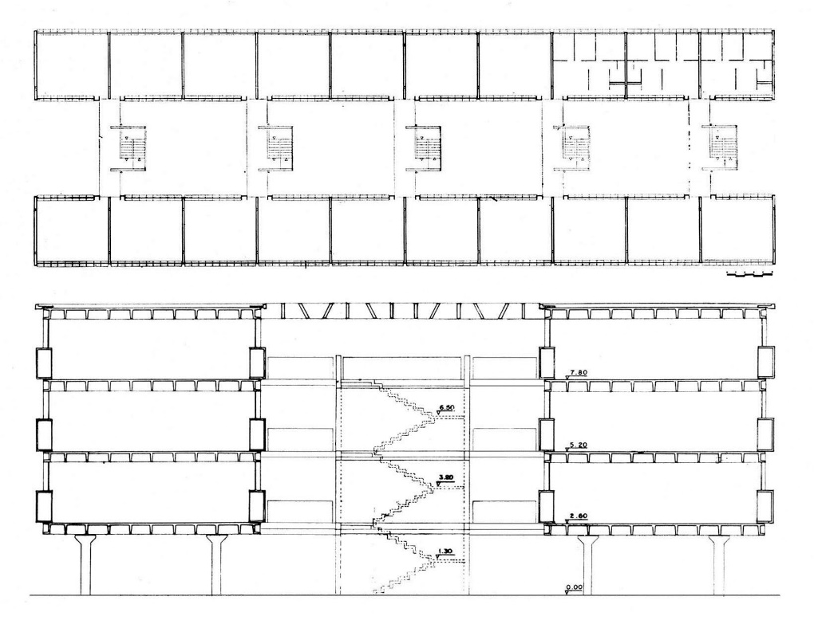

 
> **Eixo temático:** Território

# Resumo

**A habitação de interesse social com recursos Banco Nacional de
Habitação no Brasil -- 1964/1986**

O desenvolvimento das iniciativas oficiais no provimento de habitações
para a população de baixa renda no Brasil pode ser dividido em três
fases, de acordo com os órgãos financiadores. A primeira delas, a partir
de 1937 com o início da intervenção estatal através da experiência dos
Institutos de Aposentadoria e Pensões - IAPs. A segunda, com a criação
do Banco Nacional de Habitação - BNH, uma das primeiras iniciativas do
regime militar instalado em 1964; e a terceira, o período pós-BNH,
depois da extinção do banco em 1986, desarticulando o programa
habitacional no país. As iniciativas fomentadas pelos IAPs marcaram a
introdução de conceitos modernos em habitação coletiva no país.
Promovida pelo BNH, esta produção sofreu declínio na qualidade
arquitetônica, ocupou a periferia das cidades sem infra-estrutura
adequada, trazendo uma acepção negativa: o chamado "padrão BNH". O texto
está centrado na busca de relações entre dois temas: a arquitetura
moderna brasileira e os conjuntos de habitação coletiva promovidos pelo
BNH. Buscou-se uma apreciação de conjuntos habitacionais despida de
qualificação apriorística, de modo a investigar a interdependência entre
os projetos arquitetônicos e a doutrina da arquitetura moderna.

Palavras-chave: arquitetura moderna, habitação social, habitação para
baixa renda

# Abstract

**Social interest housing with resources from Banco Nacional da
Habitação in Brazil -- 1964/1986**

The development of official initiatives to provide housing for the
low-income population in Brazil can be divided into three phases,
according to financing agencies. The first phase begins in 1937 with
interventionism through the experience of the Institutos de
Aposentadoria e Pensões (IAPs). The second phase starts with the
creation of the Banco Nacional de Habitação (BNH), one of the first
actions of the military regime, installed in 1964. The third phase, the
post-BNH period, after its dissolution in 1986, is the disarticulation
of the national housing program. The initiatives fomented by the IAPs
marked the introduction of modern concepts in terms of collective
housing to the country. Promoted by BNH, such production faced a
declined in architectural quality, occupied the cities' outskirts
without proper infrastructure, and added a negative meaning to the
so-called "BNH standard". The present text is focused on the search for
the relations between two themes: the modern Brazilian architecture and
the housing complexes promoted by BNH. The aim is an appreciation of the
housing complexes, without any *a priori* qualifying sense, so to
investigate the interdependency between those architectural projects and
modern architectural theory.

Key words: modern architecture, social housing, low-income housing

**\
A habitação de interesse social com recursos Banco Nacional de Habitação
no Brasil -- 1964/1986**

# Introdução

O século XX iniciou com a idéia de que a cidade seria construída através
de um processo evolutivo e acumulativo de experiências, com ocupação
contínua do território, onde os diversos usos se complementavam. Esta
ótica foi profundamente alterada ao longo do século, pelo advento do
urbanismo moderno com a segregação dos usos. A habitação continuou a ser
parte fundamental no desenho das cidades, constituindo a maior parte do
território urbano. No entanto, se na cidade tradicional a moradia estava
miscigenada aos demais programas, na cidade moderna, através do
zoneamento funcional, passou a ocupar áreas segregadas e revelou o
compromisso da arquitetura moderna com a habitação.

As primeiras experiências modernas com a busca de soluções
arquitetônicas para o provimento da habitação em larga escala remonta ao
período entre guerras europeu. No Brasil, as preocupações governamentais
com a carência habitacional são identificáveis ao longo da história
através de várias iniciativas. Tem origem nos anos 30 com a criação das
Carteiras Imobiliárias dos Institutos de Aposentadorias e Pensões,
possibilitando a aplicação de seus recursos na habitação econômica.

{width="3.9375in"
height="2.5729166666666665in"}

Figura 1 -- Conjunto Residencial Prefeito Mendes de Moraes (Pedregulho),
Rio de Janeiro, Arq. Affonso Eduardo Reidy, 1946-1958. Fonte: HITCHCOCK,
1955.

O desenvolvimento das iniciativas oficiais no provimento de habitações
para a população de baixa renda no Brasil pode ser dividido em três
fases, de acordo com os órgãos financiadores. A primeira delas marcou o
início da intervenção estatal com a experiência dos **Institutos de
Aposentadoria e Pensões -- os IAPs**, que através de suas carteiras
prediais atuavam de forma fragmentária atendendo apenas aos associados a
partir de 1937; a **Fundação da Casa Popular -- FCP**, instituída por
decreto federal em 1º de maio de 1946, foi a primeira iniciativa de
âmbito nacional voltada unicamente à população de baixa renda; e o
**Departamento de Habitação Popular -- DHP**, órgão da Prefeitura do
então Distrito Federal, criado no mesmo ano. Deste período, o exemplar
arquitetônico destacado foi o **Conjunto Residencial Prefeito Mendes de
Moraes**, de Affonso Eduardo Reidy em 1946. A segunda fase se definiu
com a implantação do **Banco Nacional de Habitação -- o BNH**, uma das
primeiras ações do regime militar recém-instalado em 1964; e a terceira,
o período pós-BNH, teve início com a extinção do banco em 1986,
desarticulando o programa habitacional no país, restando aos estados e
municípios a busca de alternativas para tratar de sua carência de
habitações.

# O contexto em que nasce o Banco Nacional de Habitação - BNH

Juscelino Kubitschek assumiu a Presidência da República em 1956,
cumprindo sua promessa de construir a nova capital do país no planalto
central. Os "cinqüenta anos em cinco", *slogan* de sua campanha
eleitoral, e a construção de Brasília trouxeram desenvolvimento
econômico e modernização, mas deixaram endividamento e a habitação
social relegada a um segundo plano. Seu sucessor, Jânio Quadros, eleito
em 1960, teve uma rápida passagem pela presidência, assumindo o poder no
início de 1961 e renunciando em agosto do mesmo ano. Com a renúncia de
Jânio, João Goulart, seu substituto legal, é empossado Presidente da
República no dia 7 de setembro de 1961, após resistências dos setores
mais conservadores por identificá-lo como líder democrático e populista.
Por falta de apoio no Congresso Nacional, Jango não conseguiu implantar
as Reformas de Base, com as quais pretendia a volta do crescimento
econômico e a diminuição das desigualdades sociais. Isolado, procurou
apoio na mobilização popular, representada pelo emblemático comício na
Central do Brasil, no dia 13 de março de 1964. A reação das Forças
Armadas, com apoio de setores conservadores da sociedade civil,
contrários às mudanças não tardou. João Goulart foi deposto em 31 de
março de 1964, substituído por uma junta militar que conferiu ao
Congresso Nacional a atribuição de eleger o novo mandatário. Desta
forma, o Marechal Humberto de Alencar Castelo Branco foi o primeiro
Presidente da República escolhido indiretamente, iniciando um longo
período de regime militar no Brasil.

Eleito em 11 de abril de 1964, Castelo Branco tomou posse no dia 15 do
mesmo mês, em meio a grande tensão popular. Como regime imposto, sem
legitimidade, necessitando tomar medidas anti-inflacionárias como a
contenção salarial, a demonstração de atenção aos apelos populares
despertados no governo Goulart era oportuno.

Em menos de trinta dias de governo Castelo Branco encaminhou ao
Congresso Nacional o Plano Nacional de Habitação -- PNH. Através da Lei
Federal n◦ 4.380, de 21 de agosto de 1964, foi criado o Banco Nacional
de Habitação -- BNH[^1], como centralizador das operações financeiras do
Plano Nacional de Habitação. A referida lei previa o caráter social da
instituição determinando limites mínimos de recursos a serem destinados
para habitação de baixa renda.

# O desempenho do BNH -- década de 70

A partir de sua criação em 1964, o BNH passou por um período de
estruturação até 1967 com a implantação do Sistema Financeiro da
Habitação, quando foram organizados os órgãos captadores de recursos a
serem gerenciados pelo Banco e destinados aos financiamentos para o
Plano Nacional de Habitação. O principal agente foi Fundo de Garantia
por Tempo de Serviço -- o FGTS, suporte para a concretização do BNH,
constituindo sua maior fonte de recursos. Dava-se início no país a uma
mentalidade de poupança de apoio institucional, até então inexistente, e
que serviria de fonte de recursos financeiros necessários ao
desenvolvimento do programa habitacional. Estes aportes financeiros
viabilizaram o início de uma atuação mais efetiva do BNH, com a
construção de inúmeros conjuntos habitacionais, entre os quais se
destaca o **Conjunto Habitacional Zezinho Magalhães Prado**, o
CECAP-CUMBICA em Guarulhos, projeto dos arquitetos João Batista Vilanova
Artigas, Paulo Mendes da Rocha e Fábio Penteado, em 1967.

{width="4.697916666666667in"
height="1.7916666666666667in"}

Figura 2 -- Conjunto Habitacional Zezinho Magalhães Prado, Guarulhos,
São Paulo, Arq. João Batista Vilanova Artigas, Paulo Mendes da Rocha e
Fábio Penteado, 1967. Fonte: Revista Acrópole, n. 372, 1970.

A década de 70 foi o período de consolidação do BNH, com a promoção de
conjuntos habitacionais com qualidade arquitetônica que deixava a
desejar, mas numa escala de produção bem maior. A conseqüência foi o
surgimento de críticas generalizadas abrangendo o afastamento dos
conjuntos em relação aos centros urbanos, falta de transporte adequado e
de equipamentos, além da crítica à qualidade julgada como deficiente das
edificações.

{width="4.583333333333333in"
height="3.4375in"}

Figura 3 -- Conjunto Habitacional Jardim América, Porto Alegre, RS, Arq.
Clóvis Ilgenfritz da Silva e Ignez d´Avila Pinto, 1972-1974. Fonte:
acervo da autora.

Com problemas de inadimplência e buscando soluções para dificuldades
encontradas no resultado financeiro de suas atividades, o BNH passou por
uma série de mudanças que o afastaram de seu perfil inicial no
atendimento à população de baixa renda. Ainda nos primeiros dez anos,
procurando manter sua capitalização, modificou a população alvo
voltando-se ao atendimento de faixa de renda mais alta, além de ampliar
sua abrangência com a criação de novos programas.

Entre 1979 e 1983 a economia do Brasil sofreu um forte golpe com a crise
do petróleo, num momento em que a dívida externa já estava fora de
controle. Nos anos de 1983 e 1984 esta crise se acentuou, com a queda da
produção habitacional e a redução na concessão de novos financiamentos.
O BNH entrou em sérias dificuldades com inadimplência generalizada,
drástica redução na captação de recursos, somados a inúmeros imóveis sem
comercialização e contestação organizada de mutuários frente às fórmulas
de correção financeira das prestações, se comparadas aos reajustes
salariais.

# A extinção do BNH

As dificuldades enfrentadas pelo BNH conduziram à sua extinção em 21 de
novembro de 1986, através do Decreto-Lei 2.291, com a incorporação de
suas atividades à Caixa Econômica Federal[^2]. O período de atuação do
Banco, entre 1964 e 1986, coincidiu com a instalação, o auge e a
extinção do regime militar, concedendo financiamentos habitacionais em
escala sem precedentes no Brasil. Teve atividade mais intensa entre o
início do "milagre econômico brasileiro"[^3], nos primeiros anos da
década de 70 e a crise econômica a partir do início dos anos 80.

As iniciativas em habitação social, fomentadas pelos IAPs, FCP ou DHP
eram designadas como *conjuntos residenciais*. Promovida pelo BNH, esta
produção assumiu a designação de *conjuntos habitacionais* e, ao longo
do tempo, passou a trazer em si uma acepção negativa: o chamado *"padrão
BNH"*.

Os *conjuntos habitacionais* ocuparam vazios urbanos e expandiram a
periferia das grandes e médias cidades. Tais conjuntos eram formados de
pequenas casas em lotes privatizados, ou por blocos de apartamentos
implantados numa área coletivizada, em sua maioria sem elevador ou
*pilotis*. Esta produção gerou críticas que muitas vezes confundiram o
BNH, como agente financeiro, com os conjuntos habitacionais por ele
financiados. Eram apontados problemas como qualidade da execução, falta
de infraestrutura e afastamento em relação aos centros urbanos.

# As críticas aos conjuntos habitacionais promovidos pelo BNH

O equívoco sobre os encargos do BNH, atribuindo-lhe a responsabilidade
sobre a qualidade arquitetônica dos conjuntos por ele financiados, está
disseminado nas publicações contemporâneas ao seu período de existência.
O papel do Banco, como agente financeiro, foi muitas vezes sobreposto ao
compromisso com a excelência do projeto arquitetônico.

A dimensão dos conjuntos habitacionais do BNH, muitas vezes chegando a
mais de mil unidades habitacionais, sem a infraestrutura adequada, em
localização periférica, com espaços abertos sem configuração espacial ou
caracterização de uso, usando a repetição de um mesmo modelo de
edificação, independente da localização e costumes regionais, resultou
em projetos que não consideram especificidades comprometendo a qualidade
das habitações.

A ligação entre a arquitetura moderna e a então chamada *habitação
popular* marcou presença na produção dos IAPs, FCP e DHP pelo caráter
inovador em expressivo número de conjuntos habitacionais construídos. Se
naquele período a investigação arquitetônica de um grupo significativo
de profissionais desta área, comprometidos com a doutrina moderna,
esteve próxima das realizações habitacionais para a população de baixa
renda, na produção do BNH isto se perdeu. A produção da habitação
econômica se afastou do debate e da investigação arquitetônica, fazendo
com que a diversidade tipológica, presente nos projetos de conjuntos
habitacionais dos IAPs, FCP ou DHP, sofresse importante restrição nas
iniciativas financiadas pelo BNH.

# Arquitetura moderna brasileira e o BNH

O caráter messiânico do movimento moderno fez com que o projeto para
habitação coletiva em grande escala fosse um dos principais temas das
discussões em torno da arquitetura e do urbanismo. A discussão sobre a
habitação para as massas esteve associada à arquitetura moderna desde as
especulações do período entre guerras europeu através dos Congressos
Internacionais de Arquitetura Moderna, os CIAMs.

Criado em 1964, com atuação mais efetiva a partir de 1967 e extinta em
1986, o BNH teve na década de 70 o período de atividade mais intensa. Os
anos 70 correspondem no Brasil ao predomínio na Escola Paulista, com a
variante do *Brutalismo* como tendência ainda moderna, e forte
influência da concretização da cidade moderna em Brasília. O caráter
protagonista do movimento moderno não admitia diversidade de estilos.
Seus preceitos que tinham caráter de dogmas, entre eles a idealização do
homem-tipo, desconsideravam as diferenças culturais. Desta forma, todas
as pessoas teriam as mesmas necessidades, ou deveriam se adaptar a esse
"maravilhoso mundo" que a nova arquitetura anunciava. Era a promessa de
uma vida melhor, num ambiente mais organizado, em que cada função teria
seu espaço segregado conforme propagava a ideologia da *cidade moderna*.
Nesta idéia de ordenamento, a falta de diversidade não seria um
incômodo, pois todos seriam iguais. A ausência de precedentes também
marcou esta arquitetura, onde o princípio da *tábula rasa* sustentou o
paradigma da criação a partir do nada. A desconsideração com as
diferenças e os precedentes culturais levou à construção do ideal do
*homem-tipo* da arquitetura moderna. Numa atitude determinista, a
padronização da humanidade corresponderia uma
*unidade-habitacional-tipo* repetida à exaustão.

O movimento moderno atribuiu à arquitetura o papel de agente de
transformação social, trazendo uma mensagem promissora. A adaptação dos
usuários à nova arquitetura seria um processo espontâneo uma vez que,
aos olhos modernistas, oferecia a melhor forma de morar. Tal convicção
trazia a certeza de que habitantes de favelas e barracos ao rés-do-chão
se transformariam em moradores de conjuntos habitacionais em altura de
forma natural. Era o poder da nova arquitetura não só em ordenar a
cidade como determinar o comportamento das pessoas. Todos estes
paradigmas arquitetônicos fizeram parte da construção da uma base
conceitual subjacente ao chamado *padrão BNH*.

A partir destas considerações não parece infundado levantar a hipótese
de que conceitos, idealizações ou estabelecimento de padrões e modelos,
presentes na doutrina moderna, possam ter influenciado fortemente a
monotonia gerada pela repetição de elementos, presente nos conjuntos
habitacionais financiados pelo BNH.

A verdade é que os bons presságios não se confirmaram. Banalizado,
distorcido, aplicado de forma redutiva ou adaptada, a presença do ideal
da cidade moderna é perceptível nos conjuntos BNH. Sendo assim, pode-se
considerar que a falta de qualidade arquitetônica no período BNH não se
deve *somente* a restrições financeiras ou normativas do Banco. Uma
forte influência de paradigmas arquitetônicos e urbanísticos,
transmitida pela participação de arquitetos comprometidos com os
princípios da arquitetura moderna, bem interpretados ou não, teve
importante papel na definição do *padrão BNH*.

{width="3.46875in"
height="3.0104166666666665in"}

Figura 4 -- Conjunto Habitacional Ponta da Praia, Santos, São Paulo,
Arq. Oswaldo Corrêa Gonçalves, Paulo Buccolo Ballario e José Wagner
Leite Ferreira, 1967. Revista Acrópole, n. 350, 1968.

Nos conjuntos promovidos pelo BNH, questões econômicas descartaram os
pilotis de Le Corbusier. A simples ocupação do térreo não se deteve na
busca de uma solução para a falta de privacidade dos apartamentos junto
ao solo. A relação entre o público e o privado desconsiderou a
possibilidade de espaços abertos privatizados ou situações
intermediárias como semiprivado ou semipúblico. *Redent* e blocos
serpenteados ou curvos deixaram de ser modelos. Quarteirões periféricos
foram descartados. Sem preocupação com a configuração urbana, barras
paralelas isoladas ou unidas por circulações verticais e seccionadas em
edifícios com forma de "H" tornaram-se modelos consagrados. A difusão
destes modelos teve como consequência conjuntos de edifícios iguais,
onde a falta de diversidade confunde a identificação e aborrece pela
falta da excepcionalidade. Com estas características, os conjuntos
habitacionais receberam a adjetivação de *padrão BNH*, repetido à
exaustão.

No momento em que a arquitetura moderna no Brasil já tinha assistido ao
ocaso da Escola Carioca, e o despontar da arquitetura paulista com a
rusticidade do concreto aparente e a exploração de grandes vãos e
balanços, os anos 60 trouxeram ainda a materialização da cidade moderna
em território nacional através de Brasília. A exploração das
potencialidades plásticas do concreto armado e o fascínio por uma nova
ordem urbana, que isolava os edifícios e segregava funções, predominaram
no panorama urbano do Brasil nesta década.

Os conjuntos habitacionais financiados pelo BNH podem ser comparáveis as
superquadras modernistas materializadas em Brasília, com base na
semelhança do porte, na divisão programática entre habitação, seus
complementos, e no emprego de edificações isoladas, dissociadas da rua e
dispostas sobre espaços contínuos, coletivos e indiferenciados. O
questionamento sobre a validade do endosso da superquadra modernista
como esquema normativo para os projetos de habitação econômica no Brasil
daquele período é justificável. Se em Brasília um orçamento generoso
permitiu que as superquadras fossem constituídas de barras edificadas de
seis pavimentos sobre *pilotis*, com elevador, estacionamento em subsolo
e cercadas de exuberantes jardins, restrições financeiras deixaram de
lado estes recursos nos conjuntos habitacionais promovidos pelo BNH[^4].

{width="2.1979166666666665in"
height="2.1875in"}

Figura 5 -- Superquadra. Fonte: desenho apresentado por Lúcio Costa no
Concurso Nacional para o Plano Piloto de Brasília em 1956.

Creditáveis às limitações de orçamento, as supressões não tiveram
soluções compensatórias favoráveis. A eliminação dos pilotis, por
exemplo, resultou em apartamentos sem privacidade que, numa adaptação,
poderiam ter os espaços abertos adjacentes privatizados, não
significasse isto uma contradição às prescrições normativas modernas.
Por outro lado, enquanto as superquadras de Brasília mantêm uma relação
com o traçado urbano, onde quatro delas formam uma unidade de vizinhança
conectada ao sistema viário, o conjunto habitacional BNH é, na maioria
dos casos, precariamente vinculado à trama de vias do entorno.

Alguns aspectos corriqueiros e insatisfatórios nos conjuntos de
habitação coletiva promovidos pelo BNH podem ser citados: dificuldade de
apropriação e uso coletivo dos espaços abertos, percebidos como áreas
residuais sem identificação com os moradores; ausência de privacidade
dos apartamentos térreos; e dificuldade de orientação pela
repetitividade de blocos iguais. Fatores que caracterizam a maioria das
obras financiadas pelo Banco.

A *Cidade Funcional* foi o tema proposto para o IV CIAM em 1933,
realizado a bordo do *Patris II*, entre Atenas e Marselha. O relatório
do encontro foi redigido por três membros da delegação suíça, M. Moser,
R. Steiger e S. Giedion, num tom ponderado, deixando de lado as questões
mais polêmicas. Com autoria não claramente reconhecida de Le Corbusier,
um texto mais contundente que define as diretrizes da cidade moderna,
**La charte d´Athenes**[^5] é publicado em 1943, incorporando ideias
propostas no Congresso e ausentes na redação do relatório final.

Segregada funcionalmente pelo zoneamento[^6], a cidade moderna delineada
pela **Carta de Atenas** previa edificações em altura isoladas entre si
sobre uma área pública, contínua e indiferenciada. As circulações se
distinguiriam por tipo e capacidade de tráfego: veículos e pedestres não
se cruzariam. As edificações deveriam ser implantadas independentemente
da trama viária. Em nome da insolação, o alinhamento das edificações
junto às circulações era indesejado[^7].

Desta forma, os bairros multifuncionais seriam substituídos por zonas de
uso exclusivo; em lugar de ruas, reunindo pedestres e automóveis,
surgiria um sistema segregado entre estes dois tipos de circulação;
grandes áreas indivisas e contínuas substituiriam os quarteirões
parcelados, onde o solo coletivizado seria o protagonista. A Carta
propunha ainda o abandono dos espaços intermediários entre os domínios
público e privado. Seria a apoteose das grandes áreas coletivas e
contínuas, contrapostas às áreas privativas das edificações.

Com a concretização de Brasília, as premissas normativas da cidade
funcional encontraram condições favoráveis de aplicação nos projetos
arquitetônicos dos conjuntos habitacionais brasileiros do período BNH.
Tornaram-se paradigmas, onde grandes áreas sem parcelamento,
centralização de projeto e capital eram previstas.

A mecânica do sistema de concretização da cidade moderna, partindo da
reprodução de tipos de células habitacionais para formar o edifício, e
da repetição deste, elevado à categoria de modelo, num conjunto maior,
foi operativa no pós-guerra europeu. Da mesma forma, esta sistemática
foi vista como uma solução eficiente para atender a demanda
habitacional, quando no Brasil um montante de recursos financeiros sem
precedentes foi disponibilizado pelo Banco Nacional de Habitação.

{width="4.635416666666667in"
height="3.5625in"}

Figura 6 -- Conjunto Habitacional Zezinho Magalhães Prado, Guarulhos,
São Paulo

Planta e corte dos edifícios. Fonte: Revista Acrópole, n. 372, 1970.

Barras paralelas, ligadas por circulações verticais múltiplas, formadas
pela justaposição de edifícios em "H", podem ser soluções aceitáveis,
dependendo do afastamento entre edificações e do térreo em pilotis, como
**no Conjunto Zezinho Magalhães Prado, o CECAP-Cumbica** em Guarulhos.
Especialmente neste caso, a distância entre as barras contribui para a
privacidade, melhor insolação e ventilação. Permanece nesta obra, no
entanto, o problema da identificação das unidades, fruto da repetição
seriada do edifício-modelo. O projeto apresentou como paliativo o uso de
diferentes cores, um sistema de numeração nas empenas cegas das barras,
e indicação com letras nos acessos às circulações verticais.

{width="3.1458333333333335in"
height="1.8333333333333333in"}

Figura 7 -- Conjunto Habitacional Zezinho Magalhães Prado, Guarulhos,
São Paulo. Fonte: FERRAZ, 1997.

A doutrina da **Carta de Atenas** previa o uso coletivo do solo
vinculado à adoção de pilotis no pavimento térreo, como uma interface
entre o espaço público e privado. O projeto de Vilanova Artigas, Paulo
Mendes da Rocha e Fábio Penteado para o CECAP de Guarulhos foi um modelo
seguido que, quando passou a ocupar o térreo, repetindo o pavimento tipo
sem uma efetiva adaptação, se tornou questionável. Neste caso, as
barreiras geradas pela ocupação neste nível romperam a continuidade
espacial e compartimentaram o espaço aberto. Situação agravada, em
alguns casos, pela redução do espaço entre as barras, ou ainda pela
adição de mais um pavimento tipo. Por outro lado, esta ocupação
dificultou ainda mais a localização do ingresso às edificações, onde
este percurso passou a ocorrer entre as barras, através das duas
fachadas extremas em empenas cegas, que não demonstram o acolhimento
necessário à aproximação do pedestre.

{width="2.40625in"
height="4.145833333333333in"}

Figura 8 -- Conjunto Habitacional Ponta da Praia, Santos, São Paulo.
Fonte: Revista Acrópole, n. 350, 1968.

Enquanto a premissa do uso de pilotis no térreo permite o solo coletivo
e indiferenciado, a ocupação deste pavimento é incompatível com a
condição de coletividade no espaço aberto circundante e do requisito da
privacidade. No caso dos conjuntos financiados pelo BNH, o paradigma
arquitetônico do solo coletivo preponderou em projetos onde a restrição
orçamentária determinou a ocupação do térreo com apartamentos,
desconsiderando a necessidade de privatização das áreas abertas
adjacentes às unidades junto ao solo.

Os conjuntos habitacionais do período BNH apresentam problemas que podem
estar ligados à obediência irrestrita ou entendimento equivocado de
paradigmas que teriam impedido aos arquitetos, mediante uma nova
demanda, procurar soluções alternativas às prescrições normativas da
**Carta de Atenas**. A relação investigativa entre arquitetura e
habitação social, própria do movimento moderno, onde este tema era um
dos principais objetos de projeto e que, de certa forma, perdurou no
período pré-BNH, foi aos poucos se desfazendo durante a atuação do
Banco. Desta forma, os projetos sofreram adaptações pela imposição de
redução orçamentária, banalizando e abastardando soluções modernas e
consagradas, que talvez demandassem transformações paradigmáticas não
efetivadas.

[^1]: O **BNH** foi concebido como um órgão central normativo e
    orientador do Sistema Financeiro da Habitação, e suporte material do
    Plano Nacional da Habitação. De acordo com sua concepção, era
    complementado pelos seguintes órgãos: os Agentes Financeiros,
    entidades públicas ou privadas de captação e aplicação de poupança
    como as Caixas Econômicas, Associações de Poupança e Empréstimo e as
    Sociedades de Crédito Imobiliário; os Agentes Promotores, entidades
    públicas ou privadas que associavam a execução de programas
    setoriais de construção de habitações às atividades financeiras
    referentes à sua comercialização como as Companhias de Habitação --
    **COHABs**, e cooperativas habitacionais; os Agentes para Atividades
    Complementares, com a incumbência de desenvolver atividades de
    natureza técnica como os Institutos de Orientação às Cooperativas
    Habitacionais -- **INOCOOPs**; e os **Agentes Especiais**, como o
    Serviço Federal de Habitação e Urbanismo -- SERFHAU, o Banco do
    Brasil e o Banco Nacional de Desenvolvimento Econômico -- BNDE.

[^2]: Banco público orientado para o desenvolvimento econômico e social
    do país, a Caixa Econômica Federal é uma instituição financeira
    atuando como agente de políticas públicas e responsável pelo Fundo
    de Garantia do Tempo de Serviço (FGTS).

[^3]: O \"milagre econômico brasileiro\" foi a denominação dada à época
    de excepcional crescimento econômico ocorrido durante o Regime
    Militar no Brasil.

[^4]: COMAS, Carlos Eduardo Dias. "O espaço da arbitrariedade".
    **Revista do Servidor Público**, Brasília: FUNCEP, jan. / mar. 1983.

[^5]: ***La charte d´Athenes***. Tradução consultada: **La Carta de
    Atenas**. Buenos Aires: Editorial Contémpora, 1950.

[^6]: "El zoneamiento es la operación que se hace sobre un plano de
    ciudad con el fin de dar a cada función y a cada individuo su justo
    lugar."

    **La Carta de Atenas**, 1950, ítem 15, p. 56.

[^7]: "Las construcciones elevadas a lo largo de las vías de
    comunicación y alrededor de las encrucijadas son prejudiciales a la
    habitación: ruidos, polvo, gases nocivos.

    Si se está dispuesto a tener en cuenta esta interdicción, se
    atribuirán de aquí en adelante zonas independientes a la habitación
    y a la circulación. La casa, desde entonces, no estará ya soldada a
    la calle por su vereda.

    La habitación se levantará en un medio propio, en el que gozará del
    sol, aire puro y del silencio.

    La circulación se desdoblará en vías de tráfico lento para uso de
    peatones y vías de tráfico rápido para uso de coches. Estas vías
    llenarán su función sin acercarse sino ocasionalmente a la
    habitación."

    "El tradicional alineamiento de las habitaciones al borde de la
    calle no asegura el asoleamiento sino a una parte mínima de las
    viviendas."

    "\... que se prohíba el alineamiento de las habitaciones a lo largo
    de las vías de comunicación."

    "\... que, implantadas a gran distancia la una de la otra, dejen el
    suelo libre a favor de amplias superficies verdes."

    **La Carta de Atenas**, 1950, item 16, p. 57; item 17, p. 58; item
    27, p. 68; e item 29, p. 70.

    ## Referências bibliográficas {#referências-bibliográficas .list-paragraph}

    Banco Nacional da Habitação. *BNH: projetos sociais*.  Rio de
    Janeiro: Portinho Cavalcanti, 1979.

    Banco Nacional da Habitação. *Documenta*, Rio de Janeiro.

    COMAS, Carlos Eduardo Dias. "O espaço da arbitrariedade". Revista do
    Servidor Público, Brasília: FUNCEP, jan. / mar. 1983.

    FERRAZ, Marcelo Carvalho. *Vilanova Artigas*. São Paulo: Instituto
    Lina Bo e P. M. Bardi, 1997.

    HITCHCOCK, Henry-Russel. *Latin American Architecture since 1945*.
    New York: The Museum of Modern Art, 1955.

    *La carta de Atenas*. Buenos Aires: Editorial Contémpora, 1950.

    Revista *Acrópole*, São Paulo, n. 350, 1968.

    Revista *Acrópole*, São Paulo, n. 372, 1970.
