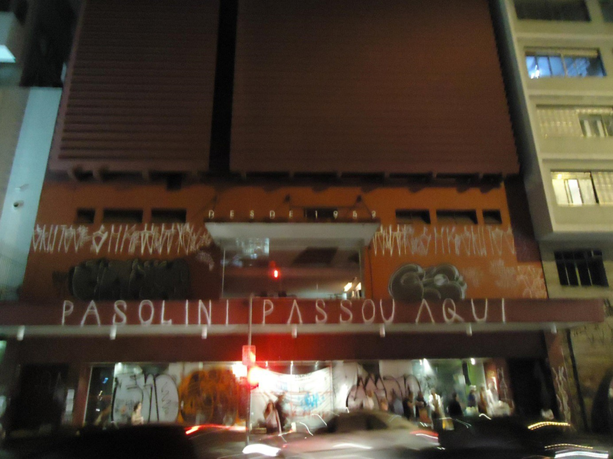

# Resumo

No início de 2011, o Cine Belas Artes, tradicional sala exibidora do
chamado "cinema de arte" em São Paulo, foi ameaçado de fechamento.
Diversas manifestações foram realizadas pela sociedade civil em busca da
salvaguarda da sala de cinema. Tendo em vista tal fenômeno, o presente
estudo propõe uma investigação sobre o valor do Cine Belas Artes como
bem cultural da cidade e da possibilidade de sua inclusão no rol do
Patrimônio Cultural de São Paulo, a fim de subsidiar discussões acerca
de sua preservação e cooperar para o debate de maior amplitude sobre os
critérios de atribuição de valor predominantes e novas formas de atuação
para a preservação e conservação do Patrimônio Cultural no meio ambiente
urbano.

> **Palavras chave:** Patrimônio Cultural, patrimônio imaterial, cinemas
> de rua.

# Abstract

In early 2011, Cine Belas Artes, traditional exhibitor room called \"art
cinema\" in São Paulo, was threatened with closure. Several
demonstrations were held by civil society in pursuit of safeguarding the
cinema hall. Given this phenomenon, this study proposes an investigation
into the value of Cine Belas Artes as a cultural wealth of the city and
the possibility of it's inclusion in the list of Cultural Heritage of
São Paulo in order to support discussions about its preservation and
cooperate for discussion of greater amplitude on the criteria for
assigning value prevailing and new ways of working for the preservation
and conservation of cultural heritage in the urban environment.

> **Keywords:** Cultural Heritage, imaterial heritage, street's cinema

# Introdução

Em janeiro de 2011 o Cine Belas Artes, criado em 1943, residente da Rua
da Consolação, em São Paulo, desde 1952, recebeu nova ameaça de
fechamento (a última havia sido em 2003) que se cumpriu em março de 2011. 
Devido à pressão pública realizada através de diversas
manifestações (abaixo assinado, passeatas, campanhas em redes sociais e
restaurantes e artigos em jornal e revistas especializadas por parte de
intelectuais) foi aberto no Conpresp (Conselho Municipal de Preservação
do Patrimônio Histórico, Cultural e Ambiental da Cidade de São Paulo) e
no Condephaat (Conselho de Defesa do Patrimônio Histórico, Arqueológico
Artístico e Turístico) processos de tombamento do edifício que até o dia
18/03/2011[1](#_bookmark0) abrigou o cinema.

O presente trabalho não pretende provar o valor do Cine Belas Artes,
cuja existência é um dos pressupostos da investigação, mas compreender
os motivos que levaram o caso de seu fechamento à singular comoção
pública e agitação social. A questão fundamental consiste na busca das
motivações que levaram centenas de paulistanos a sair nas ruas, realizar
passeatas, lotar o cinema em seu último mês de funcionamento e suas
consequências propositivas para problemáticas da disciplina do
Patrimônio Cultural.

Procurando apreender tal fenômeno, compreendemos a relação da sala de
cinema com a vida na metrópole através do fenômeno de
*territorialização* (Carlos,1996), ou seja, de demarcação social do
espaço e construção de significados e valores em aspectos com tendências
# objetivas** e **subjetivas

> []{#_bookmark0 .anchor}1 A Folha de São Paulo, Ilustrada, publicado no
> dia 18/03/2011.

Ao primeiro grupo de aspectos concerniu a análise do Cine Belas Artes
como equipamento cultural da cidade, relevante na difusão de uma cultura
cinematográfica específica e, junto com outros cinemas de rua,
engendrador de uma *mancha cultural* importante para a vida de
determinados grupos sociais em São Paulo (Magnani, 1987). A fim de
compreendê-lo, recorremos a estudos anteriores sobre o circuito de
cinemas de rua da Av. Paulista (Stefani, 2003; Torres, 1996; Almeida,
1995) e às entrevistas com frequentadores do Cine Belas Artes realizadas
por Almeida (1995). Como bibliografia complementar, nos valemos de
autores que tratam da trajetória de desenvolvimento das centralidades
culturais em São Paulo, como Frúgoli, 2000 e Santoro, 2004.

Quanto à análise subjetiva, coube a observação da construção de um
*lugar de representação* e um *lugar de vivência* ao redor do Cine Belas
Artes. O *lugar de representação é* revelador e contenedor de um desejo
urbano, que em última instância, coloca-se como um projeto social, o de
*vivência,* equipara-se à experiência cotidiana do espaço. Para
averiguar a construção desses *lugares, v*alemo-nos de entrevistas
realizadas por Almeida (1995) dezesseis anos antes do fechamento, por
Ornelas (2011), realizadas durante o mês do fechamento, e por nós (2012)
um ano após o ocorrido[2](#_bookmark1) Como referenciais teóricos,
recorremos a pensadores que tratam da relação de construção do
significado e da identidade no espaço, como Meneses, 2006; Hall, 2006;
Veiga, 2005; Carlos, 1996; Magnani, 1987; Arantes, 2006, entre outros.

# O *lugar* de cinema

Para a compreensão das valorações construídas acerca do Cine Belas Artes
por seus usuários, fez-se necessária a construção de um patamar
analítico para o caso. Esse local privilegiado para a observação foi
construído, fundamentalmente, a partir dos conceitos de *lugar* e
*espaço,* de forma a aprofundar a interação entre práticas sociais e
espaço físico, como expresso na valoração simultânea de características
materiais e imateriais do Cine Belas Artes. Seguindo Ana Fani Carlos, se
assente que:

> Lugar é a porção do espaço apropriável para a vida (\...) é o bairro,
> é a praça, é a rua, e nesse sentido poderíamos afirmar que não seria
> jamais a metrópole ou mesmo a cidade *lato sensu* a menos que seja a
> pequena vila ou cidade -- vivida/conhecida/reconhecida em todos os
> cantos. (\...) A metrópole não é 'lugar', ela só pode ser vivida
> parcialmente (Carlos *apud* Veiga, 2005: 44).

Um *espaço* está cercado de outros espaços. Um *lugar* está cercado de
significados. A existência de um *lugar* depende de sua apropriação por
um indivíduo ou grupo. *Espaços* são apenas as localidades, os endereços
e constituições físicas da cidade. *Lugares* são espaços compreendidos
na vida de seus habitantes.

Existe um *espaço* para todos: a cidade. Porém sobre esse mapa do espaço
se sobrepõe milhares de outros mapas de *lugares*, constituídos pela
afetividade cotidiana de cada indivíduo. Cada um estabelece relações
singulares com a cidade e se apropria de elementos e de forma distinta
do *espaço*. Agora imaginemos todos esses mapas da cidade sobrepostos:

> Se, por hipótese absurda, pudéssemos levantar e traduzir graficamente
> o sentido da cidade resultante da experiência inconsciente de cada
> habitante e depois sobrepuséssemos por transparência todos esses
> gráficos, obteríamos uma imagem muito semelhante a uma pintura de
> Jackson Pollock, por volta de 1950: uma espécie de mapa imenso,
> formado de linhas e pontos coloridos, um emaranhado inextricável de
> sinais, de traçados aparentemente arbitrários, de filamentos
> tortuosos, embaraçados, que mil vezes se cruzam, se interrompem,
> recomeçam e, depois de estranhas voltas, retornam ao ponto de onde
> partiram. (Argan, 1990: 178)

2.  []{#_bookmark1 .anchor}Durante o processo de pesquisa, o autor
    envolveu-se diretamente em ações e discussões acerca da preservação
    do Cine Belas Artes ocorridas em São Paulo. Dessa maneira, para além
    da voz captada através das entrevistas, destaca-se como importante
    dado para a pesquisa a própria experiência do autor e sua vivência
    da cidade.

Nesse mapa virtual é possível imaginar que agregando os mais distintos
trajetos há certos pontos de convergência, de adensamento. Estes podem
dar-se por diversos motivos, podem delimitar-se de diversas formas. São
esses os *lugares* que transcendem a representatividade individual. O
passeio da Av. Paulista e o bairro do Bexiga, em São Paulo, são exemplos
deste fenômeno. Magnani (1987) associa grande parte dessas significações
urbanas às práticas de lazer, sendo essas grandes agregadoras da vida
coletiva paulistana no espaço comum..

Notamos que parte da importância do Cine Belas Artes, manifesta em sua
defesa, está diretamente relacionada com a particular atividade
desenvolvida nesse *espaço* em tensão com o resto da cidade. Assim,
destacam-se na determinação do *lug ar* objetivo o uso e a localização.
Todos os cinemas citados nas entrevistas (CineSESC, Unibanco, Espaço
Itaú Frei Caneca, Cine Livraria Cultura e Reserva Cultural) possuem as
mesmas qualidades referenciadas ao Belas Artes: programação diversa do
circuito comercial e fácil acesso de transporte público. Dessa forma,
constitui-se um circuito das salas de "cinema de arte" da Av. Paulista
caracterizdo como uma *mancha[3](#_bookmark2)* urbana que concentra 90%
das poltronas destinadas à exibição do "cinema de arte" na cidade,
agrupadas em seis salas localizadas no polígono formado pela Av.
Paulista, Rua da Consolação e Rua Augusta.

O Cine Belas Artes é um dos vértices dessa formação urbana (Stefani,
2007), portanto, um *lugar* nodular na vida urbana de São Paulo para
determinado grupo social. Assim, a nosso ver, este possui
características que transcendem uma sala de cinema, beirando, em
interação com seus arredores, a configuração de um centro cultural.
Dessa forma, pode-se dizer que os aspectos objetivos constituintes do
*lugar* Cine Belas Artes, uso e localização, fundamentam a valoração do
cinema como parte basal de um notável polo cultural no cenário do lazer
urbano paulista.

A fim de tratar do caráter subjetivo da produção desse *lugar,* partimos
da análise da prática discursiva, tanto plural como subjetiva.
Procuramos encontrar na fala de nossos entrevistados os momentos em que
o particular, individual, transita ao comum, coletivo. No conjunto o
fizemos buscando as constantes discursivas enunciadas. Nos particulares,
procuramos compreender os momentos em que o discurso apoia-se em
questões de maior amplitude do que a experiência individual ou que
procura reforçar a própria experiência vivida no cinema. Assim, buscamos
cartografar a ambiência psíquica do Cine Belas Artes enquanto parte da
complexa e difusa da trama dos sentidos produzidos no meio ambiente
urbano.

# *Lugar* de representação

Para além da resolução do caso do Cine Belas Artes e através dele, os
entrevistados proferiam discursos sobre a cidade, revelando como a
desejam e imaginam. É de grande valor aqui a distinção feita por Harvey
(*apud* Haesbaert, 2011) entre *lugar de representação* e *lugar
vivido.* O *lugar vivido* é aquele da experiência, seu discurso é
restrito à esfera de locações específicas e suas relações com grupos e
indivíduos. Já o *lugar de representação* é construído como suporte para
uma reflexão mais ampla da cultura, ele representa alguma coisa. O
desejo de permanência do Cine Belas Artes, a nosso ver, representa o
desejo de uma radical transformação no processo de construção do
ambiente urbano de São Paulo.

Dessa maneira, tecemos a hipótese da construção do *lugar* Cine Belas
Artes a partir da constituição de uma identidade de caráter político, na
qual a coluna vertebral desse *constructo* está na maior estima do valor
de uso em detrimento do valor de troca na produção do espaço urbano.
Assim, o capital especulativo imobiliário e os "cinemas de *shopping*"
emergem nesse discurso enquanto signos do hegemônico, enquanto o grupo,
organizado ou não, de ex-

3.  []{#_bookmark2 .anchor}O termo *mancha*, precisa Magnani, designa
    "uma área contgua do espaço urbano dotada de equipamentos que marcam
    seus limites e viabilizam -- cada qual com sua especifcidade,
    competndo ou complementando -- uma atvidade ou prátca predominante"
    (Magnani, 1987:3).

usuários vêm-se como antagonistas através de seus próprios signos:
cinemas de rua, vida nas ruas, etc.

O Cine Belas Artes figura como um *lugar de representação* quando passa
a ancorar um determinado desejo irradiador para todo o urbano, tornando
a preservação, dentro dos discursos analisados, um passo \"emblemático\"
para uma mudança nos processos de construção da cidade e,
consequentemente, de toda a sociedade. Em suma, o Belas Artes é feito
sinédoque de um desejo de cidade a conquistar.

Dessa maneira, o Cine Belas Artes como *lugar de representação* é ícone
para uma ideia que transcende sua particularidade. A constante de alguns
juízos (aversão ao mercado imobiliário e aos *shoppings centers*;
apologia aos cinemas de rua, à acessibilidade, à permanência em
detrimento à destruição) nos depoimentos coletados nos permitem
construir um panorama de que há por detrás do interesse no caso do Cine
Belas Artes uma vontade, um desejo de transformação, tanto da
configuração urbana de São Paulo, quanto de seu processos de construção.
É saliente que todas as formulações surgem em oposição, negação, ao
existente. São simultaneamente criticas e propositivas:

> Mas de qualquer forma, o movimento em defesa do Cine Belas Artes é
> emblemático: hoje em dia, a cidade está nas mãos da especulação
> imobiliária - a preservação e a reabertura do Belas Artes significará
> uma vitória da cultura, da arte e de todos os valores humanos mais
> elevados sobre a ganância, a cobiça e esse poder brutal da especulação
> imobiliária (Jorge, 45 anos).

A movimentação social e a própria preservação do Belas Artes são tidos
por seus defensores como uma transformação para além da resolução do
caso em particular. Ao tratar de \"ganância\" e o \"poder brutal da
especulação imobiliária\", Jorge trata da cidade toda. O \"caso
emblemático\" que propõe se refere ao aspecto difusor de problemáticas
urbanas que o caso Belas Artes levantou através da mobilização social e
das mídias como *lugar de representação.*

# *Lugar* vivido

A segunda face da construção do *lugar* Cine Belas Artes diz respeito ao
*lugar vivido.* Esse, em contraste com o *lugar de representação*,
refere-se à experiência corriqueira, coletiva ou individual, de um
espaço. A construção desse *lugar,* ao invés de estar relacionado a
significações de caráter icônico ou metafóricas, vincula-se aos
significados produzidos a partir do contato direto com o espaço. O
*lugar de vivência,* diferentemente do de representação, não existe fora
experiência do espaço.

A experiência do cinema coopera na construção da memória e do afeto,
bases para a elaboração do *lugar* Belas Artes. Dessa maneira, a partir
dos discursos dos ex-usuários, pode- se aferir alguns dos aspectos
construtivos da singularidade desse *lugar de vivência*, cuja
manutenção, manifesta na valoração do uso e da localização, é a
principal reivindicação da busca pela salvaguarda do Cine Belas Artes.

Filmes e salas do circuito e alternativos não são *a priori* passíveis
de julgamento de valor. Mas há talvez, uma distinção de posicionamento e
valoração da experiência cinematográfica pelos diferentes públicos. Os
cinemas da Paulista abrigam, em maioria, públicos distintos dos cinemas
de shopping (Almeida, 1995). A apropriação por determinados grupos
sociais, em geral de jovens universitários e intelectuais (Simões, 1990)
do Belas Artes transcende o mero uso, no sentido estritamente funcional,
tornando-se ponto de encontro, de espera, de pausa, de conversas, enfim,
de certa sociabilidade urbana.

Distintos púbicos realizam distintas apropriações (\"cinema de arte\" e
cinema comercial) de seus espaços. Seguindo as observações de Stefani
(2007) e Almeida (1996), o público do \"cinema de arte\" estabelece
relação sentimental e afetiva com os espaços de exibição, constituindo
muitas vezes até certos \"ritos\" em sua frequência. Esse fenômeno
possivelmente

está associado tanto com a relação com o consumo do produto exibido,
assim como com a escassez destes espaços de exibição na cidade. Deste
modo ambos concluem que possivelmente estes espaços engendram certa
identidade, consolidando-se como *lugares* da cidade para estes grupos.

Em contrapartida os frequentadores dos *multiplex* não estabelecem
vinculo sólido com seus espaços de exibição. Independentemente se se
encontra em um *shopping center* ou não, para ambos os autores, o
costume de ir ao cinema está para esse indivíduo assim como uma gama de
outras atividades de lazer, ou seja, é apenas mais um entretenimento
entre outros. Outro fator determinante talvez seja a homogeneidade dos
espaços e programação nos *multiplex* de forma que constituem espaços
indistintos (assim como o produto que oferecem) e, portanto, desprovidos
de qualquer singularidade capaz de engendrar uma identidade, beirando o
que Augé (2010) denomina de *não-lugares.*

Dessa forma, o *lugar vivido* do Cine Belas Artes constitui-se a partir
da soma de vivências coletivas e individuais, estando diretamente
relacionados o espaço e a localização do cinema, com seu público e os
ritos e valorações desse rito que ali se estabelecem. Uso, programação,
localização e espaço encontram-se plenamente fundidos na vivência do
*lugar*, tornando a preservação completa desses aspectos condição *sine
qua non* para a preservação do *lugar* Cine Belas Artes.

# Considerações finais

Grande parte da problemática desenrolada pelo caso do Cine Belas Artes
diz respeito à decisão de que modelo e instrumentos seriam adequados à
sua preservação. A dificuldade está concentrada, dentre outras, na ideia
de preservação do uso. O uso, tradicionalmente no Urbanismo é tratado de
forma restrita a seu caráter utilitário e funcional. Este conceito de
uso esquadrinha as experiências da cidade, reduzindo-as a seu caráter
quantitativo. Entre o lazer e o trabalho, há a vida de todos habitantes
da cidade. Uma sala de cinema não é nem somente funcional, nem somente
lazer, mas uma experiência coletiva e individual multifacetada.

O objetivo inicial de pesquisa foi entender a mobilização realizada em
torno do Cine Belas Artes e suas consequências propositivas para
problemáticas da disciplina do Patrimônio Cultural. A conclusão do
artigo dá-se, portanto, no entrecruzamento entres estas duas frentes de
investigação. Este encontro não chega à dimensão de uma proposta, por
mais que possa insinuar caminhos.

> 
>
> Figura. 1. Fachada do Cine Belas Artes. Fotografia: Autor, 2011.

A quantidade de grafites que cobriram o cinema após seu fechamento é
reveladora da posição de seu destaque no imaginário urbano. Como a relva
da floresta que encobre velhas construções, os grafites e pichações
atestam o abandono. Protestam por meio da intensificação do processo de
degradação, como catalisadores ou lamentosos oráculos do destino a que
está fadado o edifício. "Pasolini passou aqui" é a síntese das
valorações atribuídas ao Belas Artes. A primeira, mais literal, diz
respeito à sua posição no circuito exibidor paulista, parte do circulo
afetivo de determinados grupos ligados a uma cultura cinematográfica. A
outra, como descrita pelo próprio autor (*O Estado de São Paulo,
05/12/2011*), surge da metáfora sobre o destino de Pasolini, que morreu
atropelado, assim como, nas palavras dos entrevistados, o foi, por
outras forças, o Belas Artes.

A compreensão da mobilização ao redor da salvaguarda da sala de cinema
em questão teve seu desenvolvimento primordial envolta do conceito de
*lugar*. Foi a partir dele e da busca por uma compreensão especifica de
sua construção no caso estudado que formulamos e organizamos nossas
percepções acerca desse fenômeno social.

Para tanto, lançamos duas hipóteses para a sustentação e elaboração do
*lugar* Belas Artes. A primeira procura compreender o Cine Belas Artes
enquanto *lugar de representação,* ícone do desejo urbano do grupo
social analisado. A segunda aborda o cinema enquanto *lugar vivido*,
tendo como foco a construção do *lugar* a partir da experiência
subjetiva e coletiva daquele espaço.

Assim, observamos dois *lugares* distintos para um mesmo espaço.
Lidamos, para a primeira, na matriz do *lugar de representação*, ou
seja, o Belas Artes enquanto um *lugar* no imaginário da cidade. Na
segunda o *lugar* é construído menos pelos discursos que o cercam e mais
pelas vivências, experiências e memórias acumuladas naquele espaço.

Para cada *lugar* há um debate patrimonial distinto. Por isso nos
propomos a pensá-los separadamente, mas não completamente apartadas, mas
antes camadas conspícuas de um

mesmo fenômeno. A valoração do edifício que comporta o Cine Belas Artes,
sob a ótica do *lugar de representação* e de memória, está relacionada à
idéia de monumento. Esta noção, na modernidade, está associada
diretamente com o intricado entre as ideias de rememoração e projeto
político (Fonseca, 1997). Foi assim que o SPHAN construiu uma ideia
nação brasileira em sua primeira fase de atuação (durante a gestão de
Rodrigo Melo Franco de Andrade) (Fonseca, 1997), estratégia seminal da
noção moderna de patrimônio surgida na França, em consonância com a
formulação de projeto social e político proposta por Arantes (2006).

A operação de memória/rememoração pensada para o Belas Artes é de menor
escala, porém opera de maneira semelhante. O ato de preservar supõe o
ato de esquecer. Esquecer o Belas Artes, simbolicamente, significa
esquecer um desejo urbano, em todos os aspectos antes formulados. Por
outro lado preservá-lo denota o reconhecimento dessas mesmas qualidades
e aspirações. Assim como, por exemplo, o Obelisco de São Paulo foi
erguido em memória à Revolução Constitucionalista de 1932, com o
objetivo de firmar certa identidade paulistana e manter acesa a chama
dos ideais marcados por aquele movimento.

Se entendemos o Belas Artes como monumento paulistano é no estrito
sentido da lembrança, da permanência da memória enquanto propulsora do
imaginário urbano e de suas consequentes transformações. Seria antes
enquanto *lugar de memória,* como proposto por Pierre Nora (1993), do
que um saudosismo. Retomando ao binômio da história dos "vencedores" e
dos "derrotados" podemos pensar que a preservação do Belas Artes seria a
construção de um monumento aos "derrotados", mantendo acesa a chama da
luta de identidades, criadas e sustentadas pela oposição (Hall, 2006),
que foram construídas ao redor deste espaço enquanto elemento simbólico,
*lugar de representação.* Preservar o Belas Artes seria instituir aos
grupos sociais que se articulam ao discurso de desejo urbano aqui
caracterizados um lugar de resistência, um *lugar de memória* que mantém
o conflito de interesses na produção do espaço urbano em aberto, que
reforça essas contradições ao invés de neutralizá-las a fim de atingir
uma suposta "unanimidade".

Se pensado o monumento Belas Artes na matriz da experiência e vivência
do cinema, do *lugar vivido,* chegamos à outra formulação. Entramos em
consonância com o pensamento urbano característico dos anos 60/70, do
apelo à pequena escala e da valoração de dados subjetivos no pensamento
da produção da cidade. O monumento Belas Artes, nesse caso, não trataria
exatamente de uma memória coletiva e comum como no outro, mas de um
amálgama de memórias e afeto individuais depositados em um mesmo objeto.
O foco da valoração é a manutenção da experiência e das práticas dos
grupos sociais ligados a esses espaços, que são interdependentes.

Ao contrário do monumento anterior, este não seria um objeto que procura
confluir em si uma única memória, uma espécie de meta-narrativa comum,
mas um objeto que contempla a multiplicidade da experiência urbana,
equiparando esse valor ao das "grandes" narrativas históricas. Valoriza
o cotidiano do cidadão comum, pretende apenas atuar enquanto mantenedor
de um determinado modo de vida na cidade, à maneira como são realizadas
ações patrimoniais junto à comunidade indígenas, como o tombamento da
Cachoeira do Iauaretê (Arantes, 2009).

Tangenciando o pensamento de Magnani (1987) sobre as manchas urbanas,
consideramos que o Cine Belas Artes junto com o Cinearte (atual Cine
Livraria Cultura), Cine Unibanco, CineSESC e Reserva Cultural,
constituem juntos um lugar para a cidade. Como proferido por muitos de
nossos entrevistados e de Almeida (1990): são os "cinemas da Paulista",
compartilhando identidade e público específicos. O Cine Belas Artes não
é o *luga*r de cinema de arte na cidade, mas um dos *lugares*, o *lugar*
de cinema é constituído pelo conjunto. Dessa maneira, pensar a
permanência do Belas Artes unicamente enquanto *lugar vivido* só faria
sentido se pensada em conjunto.

As duas noções de monumento propostas não são excludentes, mas
complementares enquanto dão conta de diferentes camadas do fenômeno
estudado. Por último cabe analisar estas duas propostas sob a luz das
problemáticas patrimoniais levantas pelo trabalho. Ambas contemplam
tanto a noção do patrimônio enquanto projeto social, ou seja, um olhar
mais amplo para o patrimônio como fenômeno social e parte atuante na
concorrência para a produção do espaço urbano. Ambas também consideram a
dissolução da distinção entre materialidade e imaterialidade, tanto no
que diz respeito à valoração do espaço enquanto recipiente da
experiência e afeto de grupos sociais paulistanos quanto na valoração
pelo valor simbólico do edifício, em que a criação do símbolo é uma
operação "imaterial", imaginativa, que pousa sobre uma estrutura física.

Para a ação efetiva das duas hipóteses seria necessário o cerceamento do
direito de propriedade privada a fim de garantir a preservação proposta.
Poderia ser realizada por meio de um acordo, como no caso citado em
2004, porém se não há consentimento do proprietário se faz necessária a
intervenção do setor público. Os instrumentos utilizados poderiam ser a
desapropriação ou o tombamento. A utilização do tombamento, como já
mencionado, é limitada tanto pela legislação como em sua eficácia. Nesse
caso o tombamento seria útil enquanto gesto político inaugural para uma
ação seguinte de desapropriação, de convencimento do proprietário ou de
negociação para uma PPP. A desapropriação por sua vez garante a posse de
propriedade ao Estado, mas assim como tombamento, não garante a
preservação. Essa é possível através de ações contundentes da sociedade
civil organizada e do Estado para mobilizar patrocinadores e
especialistas para retomar o uso do local, como ocorrido na reabertura
do cinema realizada em 2004.

Essa ação, realizada pela produtora O2 Filmes junto à distribuidora
Pandora Filmes, pode ser significada como uma ação de preservação
material e imaterial do cinema independente dos instrumentos oficiais. O
edifício então se encontrava em condições materiais inviáveis para
desenvolver sua atividade. A reforma do edifício, realizada por Roberto
Loeb, agiu sobre o material de acordo com sua valoração imaterial, ou
seja, a nosso ver, não consiste em um processo de restauro
arquitetônico, mas de restauro de uso, de urbanidade. Dessa forma o
arquiteto sentiu-se livre para criar novos espaços de convivência (como
o hall do segundo andar, a abertura para a Rua da Consolação e a
lanchonete no térreo) assim como reconfigurar livremente as salas de
exibição. Note-se que essa ação conseguiu equilibrar o interesse
financeiro e mercadológico dos entes envolvidos com a interpretação e
respeito ao valor social atribuído para aquele espaço.

A ideia dessa recuperação foi revitalizar aquele *lugar* tão caro à
cidade de São Paulo. Por isso foi imprescindível a associação de André
Sturmn na direção das atividades do cinema. A recuperação tanto do
caráter de programação que o cinema havia desenvolvido até os anos 90,
assim como de suas atividades de teor cultural, garantiram, junto à
recuperação das instalações, que aquele voltasse a ser um *lugar* da
cidade. As movimentações ocorridas no começo de 2011, reunindo desde
jovens até idosos, são a prova da eficiência desta ação de preservação,
verdadeiramente efetiva não só na preservação da memória, mas também da
vida na cidade, contemplando a esfera de valor que aqui lidamos: a
manutenção do *lugar*.

# Bibliografia

Acervo de recortes de jornal da Cinemateca Brasileira. Acervo digital da
Folha de São Paulo.

> ALMEIDA, Heloísa Buarque de. *Cinema em São Paulo - hábitos e
> representações do público (anos 40/50 e 90).* Dissertação de mestrado,
> FFLCH-USP, São Paulo, 1995.

ANTUNES, Fátima Martin Rodrigues Ferreira. Parecer técnico ao processo
de tombamento do Cine Belas Artes. DPH, São Paulo, 2011.

> ARANTES, Antonio A. *O patrimônio cultural e seus usos: a dimensão
> urbana* in Habitus, Goiânia, n. 4, jan/jun 2006.
>
> ARGAN, Giulio Carlo. *História da Arte como História da Cidade.* Ed.
> Martins Fontes, São Paulo, 1992.
>
> AUGÉ, MARC. *Não-lugares. Introdução a uma antropologia da
> supermodernidade.* Ed. Papirus, São Paulo, 2010.
>
> CASTRIOTA, Leonardo Baci. *Patrimônio Cultural: Conceitos, Políticas,
> Instrumentos.* Ed. Annablume, São Paulo, 2009.
>
> CHAGAS, Mário e ABREU, Regina. *Memória e Patrimônio: ensaios
> contemporâneos.* Ed. Lamparina, Rio de Janeiro, 2002.

Entrevistas com Afonso Junior, abril, 2012; com Jorge Rubies, março,
2012; e Hirao, março, 2012.

> FONSECA, Maria Cecília Londres. *O patrimônio em processo: trajetória
> da política federal de preservação no Brasil.* Ed UFRJ, Rio de
> Janeiro, 1997.

FRÚGOLI Jr, Heitor. *Centralidade em São Paulo*: trajetórias, conflitos
e negociações na metrópole. São Paulo: Cortez; Edusp, 2000.

> HALL, Stuart. *A identidade cultural na pós-modernidade.* DPeA, São
> Paulo, 2006. LYNCH, Kevin. *A imagem da cidade.* Ed. 70, São Paulo,
> 2011.
>
> MAGNANI, José Guilherme. *Da Periferia ao Centro: pedaços e Trajetos.
> Revista de Antropologia,* São Paulo, 35, 1987.
>
> MENESES, Ulpiano Toledo Bezerra de. *A cidade como bem cultural --
> Áreas envoltórias e outros dilemas, equívocos e alcance na preservação
> do patrimônio ambiental urbano* in *Patrimônio: atualizando o debate.*
> IPHAN, São Paulo, 2006.

NEVES, Deborah R. Leal; SILVA, Mário A. Medeiros da Silva; ZAGATO, José
A. Chinelato. Parecer técnico ao processo de tombamento do Cine Belas
Artes. UPPH, São Paulo, 2012.

OLIVEIRA, Licia M. Alves. Parecer técnico ao processo de tombamento do
Cine Belas Artes. DPH, São Paulo, 2011

ORNELAS, Fábio. *A esquina do cinema.* Documentário realizado para o
trabalho de finalização de Pós-Graduação em Vídeo-Jornalismo na PUC-SP,
São Paulo, 2012.

> SANTORO, Paula Freire. *A relação da sala de cinema com o espaço
> urbano em São Paulo: do provinciano ao cosmopolita.* Tese de mestrado,
> FAU-USP, São Paulo, 2004.
>
> STEFANI, Eduardo Baider. *A geografia dos cinemas no lazer paulistano
> contemporâneo: redes e territorialidades dos cinemas de arte
> multiplex.* Tese de mestrado, FFLCH-USP, São Paulo, 2003.
>
> TORRES, Lilian de Lucca. *Programa de Paulista: lazer no bexiga e na
> avenida Paulista com a rua da Consolação* in TORRES, Lilian de Lucca e
> MAGANANI, José Guilherme. *Na Metrópole: textos de antropologia
> urbana,* Edusp, São Paulo, 1996.
>
> VEIGA, Ana Cecília Rocha. *A materialidade da dimensão intangível do
> patrimônio cultural urbano.* Teses de mestrado, UFMG, 2005.
