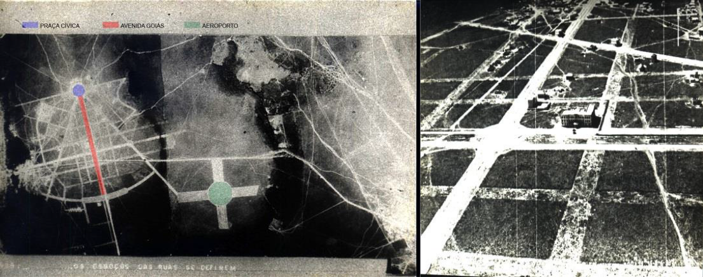
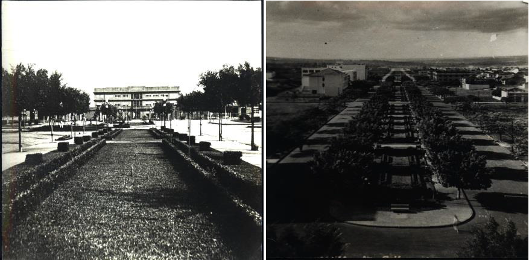
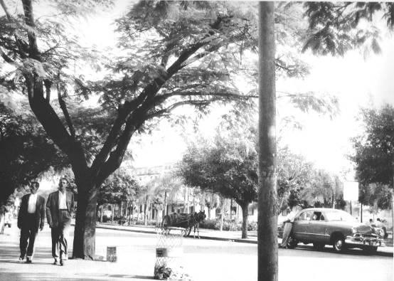
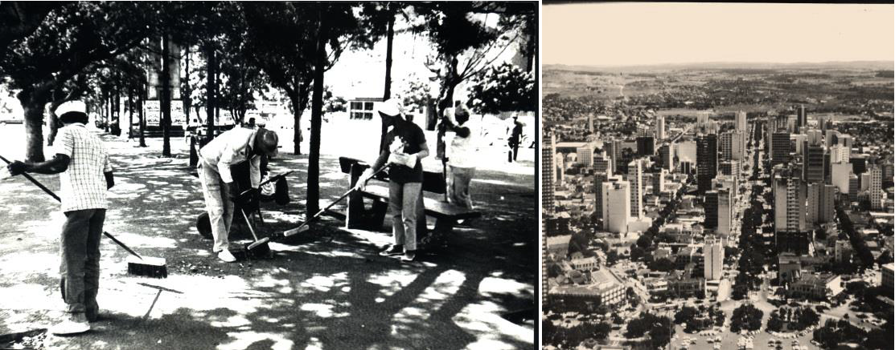
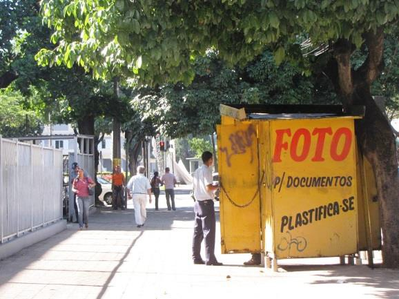
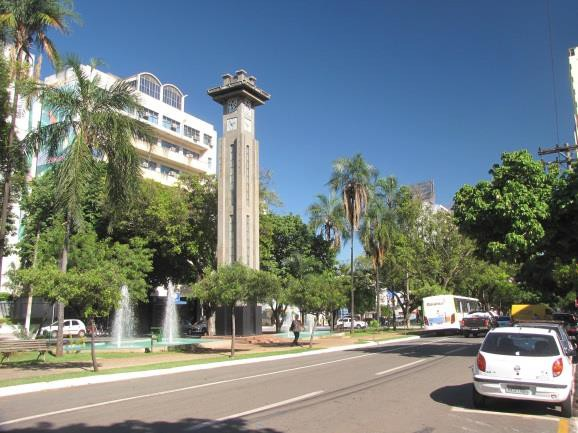
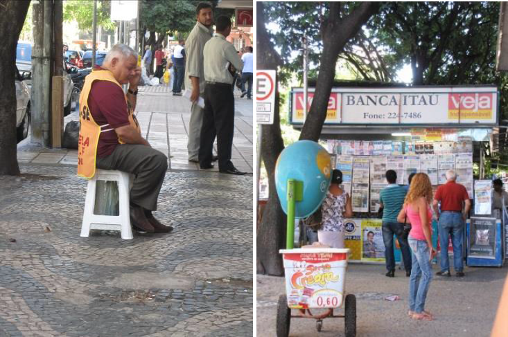
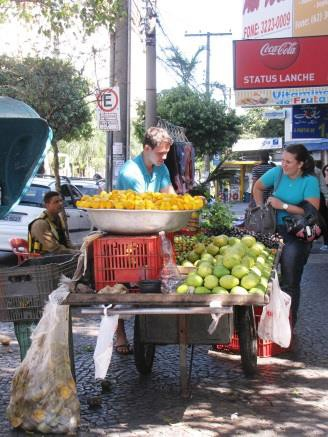

# Resumo

Este trabalho estuda Goiânia a partir de seus bairros. Visa elaborar uma
versão de sua história mesclando aspectos arquitetônicos, urbanísticos e
antropológicos. Essa abordagem se sustenta pelo entendimento da cidade
como forma e conteúdo, como artefato ou obra de arte, desdobrada em
lugar de vivências e de sentimentos, em ininterrupta interação.
Portanto, aos aspectos morfológicos da cidade, sobrepõe-se o
reconhecimento das relações que a moldam. Objetivando privilegiar o
cotidiano, elegemos como interesse da pesquisa a principal avenida da
cidade, a Av. Goiás. Eixo cívico da cidade que interliga o Palácio das
Esmeraldas, sede do governo estadual, à antiga estação de trem da
Estrada de Ferro Goiás, essa avenida foi traçada no sentido Norte-Sul, à
semelhança de um *Cardus Maximum*. De antigo lugar de *footing* a espaço
ocupado pelas grandes manifestações políticas, a história dessa rua, de
suas modificações morfológicas e de sua ocupação, traduz o dia a dia da
capital de Goiás ao longo de seus oitenta anos.

Palavras-chave: Goiânia, Av. Goiás, Cotidiano, Apropriação

# Abstract

This paper analyses the city of Goiânia, capital of Goiás State, through
its neighbourhoods, seeking to formulate a version of its history that
blends architectural, urban, historical, and anthropological aspects.
Underlying this approach is the concept of city as form and content, as
an artefact or work of art that unfolds itself as a place of experiences
and feelings, in an everlasting interaction. The city\'s morphological
aspects, therefore, are superimposed by an awareness of the relations
which shape it. To privilege daily life, this study elected Avenida
Goiás, Goiânia\'s main avenue, as the object of analysis. The avenue,
which stands as the city\'s civic axis linking Palácio das Esmeraldas,
home to the state government, and the old train station of Estrada de
Ferro Goiás, was designed following a north-south orientation, similarly
to a *Cardus Maximum*. From its former status as a place for *footing*
to its current backdrop for massive political manifestations, this
street, in its morphological changes and occupation, offers a particular
view of Goiânia\'s daily life in the past 80 years.

Keywords: Goiânia, Av. Goiás, Daily life, Appropriation

# A rua

Spiro Kostof (1992) afirma, em *City assembled,* que a história da rua
está ainda para ser contada quer como forma quer como instituição. O
autor esclarece que essas dimensões indissociáveis inspiram questões
específicas. No correspondente à forma, lembra-nos de que a rua
constitui-se, em geral, de um leito carroçável, de calçadas e de
edifícios que a margeiam em ambos os lados; lembra-nos também de que uma
rua se articula a outras, como é pavimentada, como são suas calçadas,
arborização e regularidade, se é curva ou reta, aspectos todos relativos
a sua morfologia. Ainda em termos de forma, ao se considerar os tipos de
edifícios, as ruas podem ser classificadas e diferenciadas. Nesse
sentido, Kostof aponta as ruas cobertas, as aleias, os bulevares, entre
outras. Paralelamente ao aspecto formal da rua, nosso autor

salienta sua natureza institucional, sua função econômica e seu
significado. Em suas palavras, a história da rua implica a compreensão
do conteúdo e do continente:

> The purposes of the street tradiditionally have been traffic, the
> Exchange of goods, and social exchange and communication. All three
> are inseparably related to the form of the street -- the material ways
> in which these activities are housed and hosted by the street
> structure. The street, in Joseph Rykwert's phrase, is human movement
> institutionalized -- and human intercourse institutionalized. In this
> way, therefore, the history of the street is about both container and
> content. If the correspondence of the two cannot be perfectly
> synchronic, it is because the frame of the street is more permanent
> than the uses made of it. (KOSTOF, 1992, p. 189).

Detivemo-nos neste autor, citando-o tão longamente, porque nossa
ambição, ao tratarmos da rua mais importante de Goiânia, é, na medida
das nossas possibilidades, superar a ingênua cisão entre forma e
conteúdo, objeto de sua crítica. Como arquitetas e urbanistas, nossa
formação tende a privilegiar a primeira parte desse duo, isso porque
nossos olhos são treinados para perceber larguras, comprimentos, volume,
texturas, cores, formas, luzes, sombras -- o sentido da visão está
sempre mais alerta e sensível às solicitações e estímulos captados na
cidade. Alguém pode contra- argumentar que essa supersensibilidade da
visão não é atributo específico dos arquitetos, mas de todo homem
pós-renascentista, considerando que a invenção da perspectiva e da
imprensa definitivamente alterou nossa forma de perceber o mundo.
Seremos obrigadas a concordar, todavia esclarecemos que aos arquitetos
ensina-se a perceber os detalhes. Ora, constatar esta peculiaridade de
nossa formação não implica necessariamente um sinal de distinção
galhardamente exibida. Muito pelo contrário, pode tornar-nos míopes
diante daquilo que João do Rio identificou como a "alma encantadora das
ruas". Talvez sejam os poetas, os cronistas, enfim os homens das letras,
aqueles mais aptos a perceber o "conteúdo das ruas". Os exemplos são
vários: Baudelaire e Poe são lembrados por João do Rio, o *flâneur par
excelence* que melhor observou o Rio de Janeiro:

> Flanar é ser vagabundo e refletir, é ser basbaque e comentar, ter o
> vírus da observação ligado ao da vadiagem. Flanar é ir por aí, de
> manhã, de dia, à noite, meter-se nas rodas da população, admirar o
> menino da gaitinha ali à esquina, seguir com os garotos o lutador do
> Cassino vestido de turco, gozar nas praças os ajustamentos de fronte
> das lanternas mágicas, conversar com os cantores de modinha das
> alfurjas da Saúde, depois de ter ouvido *dilettanti* de casaca
> aplaudirem o maior tenor lírico \[\...\]; é ver os bonecos pintados a
> giz nos muros das casa, após ter acompanhado um pintor afamado até sua
> grande tela paga pelo Estado; é estar sem fazer nada e achar
> absolutamente necessário ir até um sítio lôbrego, para deixar de lá
> ir, levado pela primeira impressão, por um dito que faz sorrir, um
> perfil que interessa, um par jovem cujo riso de amor causa inveja
> \[\...\]. (RIO, 1997, p. 50-51).

A forma e o conteúdo como compreensão mais complexa da rua passaram a
ser nosso objetivo e nos orientaram para realizar uma primeira
aproximação "etnográfica" da Av. Goiás. Antes, porém, de nos ocuparmos
em descrever o que pudemos observar nesta importante rua de Goiânia, nos
lembremos da significação do termo avenida, que anuncia suas
inseparáveis dimensões.

Choay (MERLIN; CHOAY, 2005) explica que avenida deriva do particípio
passado do verbo francês *avenir*, originário do latino *advenire*. O
termo serve para designar, no sentido próprio e no figurado, um caminho
que nos leva a um destino, por extensão, depois a uma aleia de árvores
conduzindo a um castelo e enfim a uma larga via urbana arborizada. Nas
palavras da historiadora das formas urbanas:

> Nesta acepção, a avenida objeto da arte dos parques e jardins (cf.
> Laugier, Patte) é uma criação da idade clássica (Versalhes, por
> exemplo) que acolhe a circulação das carroças, os desfiles militares,
> as festas urbanas e encontra-se conotada por esse aparato.
>
> Esta tradição de prestígio foi prosseguida pelo urbanismo do século
> XIX. É ilustrada na França por Paris de Haussmann, que criou
> "sistemas" de avenidas, em torno de *ronds-points,* e tornou as
> avenidas da Impératrice (hoje avenida Foch) e dos Champs-Élysées
> modelos copiados no mundo inteiro. No continente americano, as
> avenidas, por oposição às ruas, são simplesmente as vias maiores de
> uma forma de loteamento regular e ortogonal. A cidade de Nova York
> comporta avenidas paralelas, orientadas norte-sul e cortadas por um
> sistema de ruas perpendiculares numeradas de sul para norte. (MERLIN;
> CHOAY, 2005, p. 103-104).1

Diante das explicações de Choay para o termo avenida, observamos que a
Avenida Goiás foi concebida nos moldes do urbanismo francês. Attílio
Correa Lima, seu projetista, foi aluno do Instituto Francês de
Urbanismo, onde concluiu sua graduação como urbanista. A importância
formal da Av. Goiás e dos elementos que a compuseram -- a extensão, a
largura, os jardins, as árvores, os passeios, o coreto e o relógio --
alinham-se à tradição dos desenhos de cidade que caracterizaram os
ensinamentos dessa instituição. De fato, a Avenida Goiás conduz a um
"palácio", não o daqueles dos reis absolutistas, mas a do estado laico,
que se esforçava em pleno século XX para avançar a ocupação do interior
do Brasil, no desafio de integração de um país continental.

# Goiânia, um bairro, uma rua

Para a construção de Goiânia confluíram os interesses de Getúlio Vargas,
manifesto na Marcha para o Oeste, e o das elites econômicas e políticas
locais, representadas pelo interventor do Estado, o médico Pedro
Ludovico Teixeira. A cidade projetada pelo urbanista Attílio Corrêa
Lima, em princípios da década de 1930, abarcava os setores Central e
Norte e os esboços das áreas residenciais ao sul e a oeste.
Posteriormente, o plano inicial de Goiânia foi alterado por Armando de
Godoi (1935) e pela equipe técnica do Estado (1947).

> 1 Tradução livre de Elane Ribeiro Peixoto.

O traçado do Setor Central, segundo Attílio Correa Lima, adota o
"partido clássico de Versailles, Carlsruhe e Washington, pelo aspecto
monumental e nobre, como merece a capital do grande Estado
(evidentemente guardando as devidas proporções)" (LIMA apud MANSO, 2001,
p. 99). A opção do urbanista não excluía a suavização do aspecto
monumental com a utilização de generosa arborização nas vias que
convergem para o centro administrativo. A monumentalidade mesclou-se ao
pitoresco, advindo da cidade-jardim. Embora suavizada, a monumentalidade
da estrutura central da cidade permaneceu manifesta na largura das três
avenidas principais que a constituem e no seu desenho radiocêntrico.
Essa geometria era um recurso para oferecer perspectivas marcantes a
partir do centro administrativo e cívico da nova capital. Reforça esse
efeito a regularidade formal e construtiva do conjunto arquitetônico
proposto para a cidade. A partir do desenho em *pate d'oie*, o traçado
de Goiânia compreendia uma malha ortogonal, com ruas internas às quadras
comerciais e algumas praças. O zoneamento da cidade foi pensado em
detalhe, incluindo suas áreas verdes. Foram propostos a arborização das
ruas, alguns parques e *parkways --* previstas ao longo do Córrego
Botafogo --, além dos limites urbanos demarcados por um cinturão verde
no plano de Godói, no qual a cidade deveria expandir-se por meio de
satélites.

Entre as principais avenidas da cidade destaca-se a Avenida Pedro
Ludovico, a atual Avenida Goiás. Constituía e ainda constitui o eixo
monumental que conectava o centro cívico e administrativo da capital do
Estado à Estação Ferroviária. Simbolicamente, efetivava a ligação entre
o "dentro" e o "fora", entre o poder local e o mundo exterior.
Sobretudo, concretizava a inserção da modernidade, pela possibilidade de
circulação e de fluxos entre o comércio (via ferrovia) e o Estado, como
defendiam os sansimonianos na Paris do século XIX (PICON, 2001). Correa
Lima justificava as dimensões da avenida por suas atribuições: "\[\...\]
pela sua largura excepcional e pelo seu aspecto luxuoso, prestar-se-á
para as demonstrações e festas cívicas" (LIMA apud MANSO, 2001, p.113).

Sua dimensão causava estranhamento aos moradores da cidade, acostumados
às ruas acanhadas de pedras da antiga capital, a cidade de Goiás.
Todavia, em virtude do tratamento paisagístico, a avenida assemelhava-se
a uma alameda, propícia ao *footing* da população goianiense, assim
pensava seu urbanista.

Inicialmente, a avenida caracterizou-se por meio de uma ocupação de usos
diversos: residencial, comercial, prestação de serviços e industrial.
Essa ocupação propiciou variadas construções, a começar por uma das
primeiras de Goiânia, o Grande Hotel. O cruzamento da Av. Goiás, o eixo
Norte-Sul da cidade, com a Avenida Anhanguera, seu eixo Leste-Oeste, era
considerado, pelo autor do projeto, como a área mais central da cidade,
onde se implantaria o comércio. Na Av. Goiás, abaixo da Av. Paranaíba,
no setor Norte, mesclavam-se o comércio, a indústria e as habitações
destinadas aos trabalhadores. Esses usos constituíram um dado importante
na formação da paisagem de Goiânia.

A forma urbana deveria expressar a imagem de modernidade pretendida para
Goiás e imputada a Goiânia. Era objetivo do Setor Central espelhá-la,
pois a nova capital seria conhecida por meio de sua materialidade. A
construção dos edifícios administrativos, do hotel e das casas para
funcionários do Estado, coordenada pelo poder público, confirmava essa
intenção pela adoção de linguagens arquitetônicas inovadoras, como o
ecletismo, o neocolonial e o *art déco.* E por suas soluções técnicas,
eram edifícios

de alvenaria e não mais de adobe ou taipa. Do mesmo modo, os
construtores locais compartilhavam esse gosto e também o reproduziam,
apesar das dificuldades e limitações. Ao lado da imagem "moderna" das
construções e das ruas distintas por números, elaboravam-se outras,
mesclando-as às vivências da terra, exemplo dado pelos nomes das
avenidas da cidade em lembrança aos grandes rios de Goiás -- Araguaia,
Tocantins e Paranaíba.

As primeiras imagens oficiais da cidade mostram a abertura da Avenida
Goiás como um rasgo no chão em pleno sertão, sem pessoas, sem
apropriação. Ao mesmo tempo, apresentam o Grande Hotel em construção
como um esqueleto vazio, sem entranhas (Fig. 1 e 2).

> 
>
> Fig. 1 e 2. Implantação do Plano de Attílio C. Lima, Avenida Goiás e
> Grande Hotel, década de 1930. Fonte: SEPLAM.

Nos anos 1940, os canteiros da avenida são mostrados, mas ainda como
paisagem congelada. Há muitos lotes vazios e não se mostravam pessoas
(Fig. 3 e 4).

> 
>
> Fig. 3 e 4. Avenida Goiás, década de 1940. Fonte: SEPLAM.

Se nos anos 1930 e 1940 o setor Central de Goiânia era um canteiro de
obras, na década de 1950 seus contornos são mais nítidos e sua forma é
mais facilmente percebida através das fotografias de Hélio de Oliveira
(2008). As árvores ganharam um bom porte, as ruas estavam calçadas,
vários eram os edifícios construídos e as pessoas circulavam pela
cidade. Bicicletas, carros, caminhões, carroças, jardineiras e pessoas
dividiam os espaços urbanos num movimento contínuo característico de
cidades relevantes, em termos de tamanho e de dinâmica (Fig. 5 e 6).
Engraxates atendem seus clientes na rua, mulheres conversam na calçada,
homens engravatados transitam apressados, há guardas de trânsito sob as
sombrinhas. A cidade pulsa. Os pioneiros apontam os *footings*
domingueiros, em que as moças e os rapazes buscavam sua alma gêmea num
incessante subir e descer nas calçadas da grande alameda. O

jornal *Folha de Goyaz*, de 27 de março
de 1958, comenta sobre os *footings* nos finais de semana e pede a
proibição de trânsito de veículos nas avenidas Goiás e Anhanguera em
determinado período noturno, para favorecer o passeio do grande número
de pessoas.

> Fig. 5 e 6. Avenida Goiás, década de 1950. Fonte: OLIVEIRA, 2008.

Nesta época, Goiânia poderia ser considerada um polo na região
Centro-Oeste, especificamente no que concerne às atividades
agropecuárias. Seu centro comercial acolhia diversas atividades e
oferecia variados serviços, como os bancários e outros voltados ao lazer
e à cultura.

Na década de 1960, o centro da cidade adensou-se, em virtude da
verticalização de edifícios consentida pelo poder público, justificada
pela demanda de habitação e pela oportunidade de bons negócios
imobiliários. Todavia, a concentração das atividades comerciais e dos
serviços manteve-se e atraía cotidianamente a população residente em
outros bairros da capital. A arquitetura moderna encontrava seu lugar,
especialmente entre os edifícios institucionais, habitacionais e
comerciais, construídos na Av. Goiás. São exemplos dessa época a sede do
INSS, projeto de Eurico Calixto Godoi, e a sede do Banco do Estado de
Goiás, de Elder Rocha Lima.

Cada vez mais, Goiânia aproximava-se de uma metrópole. A nova condição
implicava alterações nas relações sociais e pessoais, como atesta o
*Jornal 4º Poder* (1964, p. 3): "Problemas da cidade que se agravam
dia-a-dia: pontos e engarrafamentos". Esta notícia discorre sobre a
dificuldade em estacionar os carros no centro da cidade, por causa da
quantidade de pontos de carros de aluguel, bem como sobre o
congestionamento em horas particulares do dia, equiparando Goiânia às
metrópoles brasileiras.

Nos anos 1970, investiu-se em transporte coletivo. O modelo adotado em
Goiânia era o de Curitiba. Foi implantado um sistema integrado de
transportes que possibilitava, ao morador das cidades próximas e dos
bairros mais distantes, o deslocamento para o centro da cidade
utilizando uma única passagem de ônibus. O centro popularizou-se e,
concomitantemente, a população de maior poder aquisitivo mudou-se para
outros bairros. O comércio alterou-se e, nos anos seguintes, o de luxo
transferiu-se para os *shoppings centers*. O modelo de Curitiba não se
limitou ao sistema de transporte, ele provocou uma alteração radical na
Av. Goiás, seus canteiros centrais desapareceram, dando lugar a um
calçadão. Criaram-se faixas exclusivas para a circulação dos ônibus, que
ladeavam o calçadão central, os edifícios em altura se multiplicam e,
cada vez mais, a rua foi preenchida pelas pessoas que nela trabalhavam,
moravam e passeavam (Fig. 7 e 8).

> 
>
> Fig. 7 e 8. Canteiro central da Avenida Goiás e verticalização, final
> da década de 1970. Fonte: SEPLAM.

A partir da década de 1980, simultaneamente à metropolização da cidade,
a progressiva popularização do centro avançou com as alterações de usos
e o desaparecimento de serviços significativos para a cidade. Entre
eles, podem-se citar o lazer oferecido pelos cinemas e restaurantes, a
presença dos bons hotéis e lojas tradicionais, o abandono de um
importante clube social -- o Jóquei Clube de Goiás.

Nos anos 1990, os camelôs elegeram a Av. Goiás como seu local de
comércio, pois seu calçadão central era perfeito para abrigar suas
barracas. As bancas perfiladas exigem proteção e logo lonas de plástico
azul são estendidas como cobertura, nos lembrando um mar artificial. Por
anos, a população transitou no labirinto das barracas comprando
relógios, óculos e pilhas do Paraguai. Essa situação, quando percebida e
avaliada, motivou sucessivas tentativas de recuperação do centro da
cidade, vinculando-o a sua proposta inicial. Porém, a maior parte dessas
iniciativas se resumiu a projetos de requalificação urbana inconclusos.
O Setor Central foi ocupado pelo comércio popular dos camelôs, pelas
lojas de R\$ 1,99 e, principalmente, por uma população oscilante, que
nele transita somente durante o dia.

Nos anos 2000, algumas ações conseguiram recuperar, em termos, a
esperança de restituir mais importância ao centro histórico da cidade e
de sua principal avenida. Na prefeitura da cidade, institui-se o
GECENTRO, um grupo de profissionais de diversas áreas reunidos para
pensar e programar ações para a região central. Entre as ações
implementadas estava a realização de um concurso público, organizado
para a recuperação da Av. Goiás. O projeto vencedor, do arquiteto Jesus
Cheregatti, buscou, com acerto, recompor uma feição mais próxima à
avenida de outrora, em que os novos canteiros centrais, a presença de
bancos, o desenho de qualidade da pavimentação e as sombras de
caramanchões propiciaram usos diversos por quem transita pela avenida.

Nesse mesmo contexto, surgiram outras ações pontuais que visavam
estimular a ocupação do centro pela população de toda cidade. A
inauguração do Centro de Referência e Memória no Grande Hotel,
acompanhada dos *shows* de chorinho às sextas-feiras, e a recuperação do
tradicional Cine Ouro, com espetáculos teatrais e musicais, além do
tombamento pelo IPHAN dos edifícios *art déco* e do projeto urbanístico
do centro da cidade em 2003, são exemplos a serem lembrados. Porém nem
todos foram bem-sucedidos.

Os planos e as tentativas de requalificar o centro de Goiânia não param.
A Av. Goiás permanece com um importante significado para a cidade. Os
projetos de mobilidade urbana, com propostas de implantação de metrô ou
veículo leve sobre trilhos, incluem

a avenida. Além da sua importância histórica e estratégica, percebe-se
nitidamente sua relevância afetiva. São milhares de pessoas que
diariamente por ali transitam, numa mistura confusa com carro e ônibus.
É um lugar carregado de sentido, transparecendo o caráter relacional da
cidade. A Av. Goiás é um recorte para observar a cidade em processo e
suas práticas urbanas.

# Etnografia urbana: a cidade vivida

João do Rio (1997, p. 28-29), nas suas *flaneries* pelo Rio de Janeiro
do início do século XX, dizia: "\[\...\] eu amo a rua. \[\...\] a rua é
um fator da vida das cidades, a rua tem alma!". A sua declaração de amor
às ruas vinha da riqueza de sua apropriação: a rua se torna honesta,
ambígua, infame e muitos outros adjetivos, pois incorpora a ação humana.
Em conformidade com essa postura, aproximando-se da inclinação
etnográfica (O'DONNELL, 2008) de João do Rio, optamos por verificar como
a Av. Goiás nos permite reconhecer a cidade.

A opção etnográfica favorece a aproximação com o cotidiano e,
simultaneamente, com aqueles que experimentam a cidade, tornando-os
praticantes ordinários, como os definiu De Certeau (1994). Da mesma
forma, a pesquisa avizinha-se de Michel Agier (2011), que nos seus
estudos de antropologia urbana entende a cidade não como uma abstração
teórica, mas como relacional e situacional, uma cidade viva: "a cidade
já não é considerada 'uma coisa' que eu possa ver nem 'um objeto' que eu
possa apreender como totalidade. Ela transforma-se num todo decomposto,
um holograma perceptível, 'apreensível' e vivido em situação" (AGIER,
2011, p. 38). A compreensão desses autores nos permite a adoção da
etnografia urbana como uma estratégia de pesquisa, objetivando
descrições densas, como sugere Geertz (1989), e reconhecendo as
apropriações sensíveis da cidade, neste caso, particularmente, de uma
rua.

Diante da postura multidisciplinar, os procedimentos metodológicos
estendem-se pelas fases da pesquisa: na sua concepção, realização e
conclusão. Na concepção, tornou-se fundamental o conhecimento da
avenida, por meio de revisões bibliográficas e de rastreamento de
informações primárias no arquivo histórico da cidade. Durante os
trabalhos de campo, realizados em horários e dias diferentes, efetuamos
observações e registros *in loco*, em blocos de anotações, fotografias,
desenhos das atividades da rua e conversas com as pessoas. Na fase de
conclusão do trabalho, analisamos o material, desenhamos o necessário e
produzimos artigos e relatórios.

Atualmente, a Avenida Goiás é ocupada distintamente em dois momentos: os
dias da semana e os finais de semana: os dias da semana, de segunda a
sábado pela manhã, e o final de semana, do sábado à tarde ao domingo. A
distinção deve-se ao fluxo de pessoas decorrente dos usos dos edifícios
lindeiros à rua, que funcionam, na sua maioria, em horário comercial,
gerando grande movimentação durante a semana e quase nenhuma nos finais
de semana. Os poucos edifícios habitacionais da Av. Goiás são
insuficientes para gerar movimentos significativos aos domingos. As
calçadas e bancos estão sempre vazios, as portas do comércio fechadas,
um ou outro carro ou ônibus circula e poucos são os transeuntes. O ritmo
da avenida modifica-se, o zunzum frenético que a anima durante a semana
é substituído por um silêncio de cidade do interior, com sua típica
lentidão. A exceção refere-se à parte mais ao norte da avenida, próxima
à Praça do Trabalhador, quando aos domingos pela manhã ocorre a Feira
Hippie, grande feira de produtos variados, principalmente roupas
fabricadas em confecções de fundo de quintal, misturadas aos
indefectíveis produtos da Rua 25 de Março de São Paulo.

No decorrer da semana, a ocupação
espacial da rua divide-se em "faixas", com características específicas
de apropriação. A primeira faixa compreende o espaço entre a Praça
Cívica e a Rua 2, onde estão os edifícios de instituições públicas,
comerciais, de escritórios, bancos, casas de empréstimo e residenciais.
Nela, constatamos a existência de um elemento característico e
recorrente em toda sua extensão: o quiosque. Não foram objetos previstos
no plano original da cidade, mas tornaram-se parte da paisagem urbana.
São feitos de chapas metálicas, à semelhança de contêineres, possuem as
instalações necessárias ao funcionamento da atividade que lhe são
correspondentes. As dimensões, cores e formas são variadas. Os quiosques
localizam-se nas calçadas e oferecem serviços diversos, como vendas de
lanches, caldo de cana, revistas, jornais e fotografias para documentos.
Esse último serviço, a cargo de lambe-lambe, tornou-se muito útil (Fig.
9 e 10). A Secretaria do Trabalho, situada nesta parte da avenida,
demanda as famosas fotografias 3x4 para os documentos. Em outros tempos,
elas eram retocadas com o grafite de um lápis. O preço acessível e a
facilidade oferecida pela proximidade mantêm os fotógrafos ocupados
durante boa parte do dia. Hoje, o trabalho de alguns lambe-lambes
modernizou-se, e as velhas câmaras foram substituídas por máquinas
digitais e impressoras a jato de tinta. Ainda assim, a cabine do velho
fotógrafo no meio da calçada é a intersecção entre passado e presente.

> 
>
> Fig. 9 e 10. Avenida Goiás, quiosques. Fonte: Acervo da Pesquisa,
> 2012.

Apesar de todos os usos, o movimento de pessoas nessa parcela da avenida
não é muito significativo. Nos canteiros centrais, sob as pérgolas ou
árvores, é fácil encontrar pessoas sentadas nos bancos, envolvidas em
conversas animadas ou simplesmente vendo o movimento. A exceção ocorre
no canteiro fronteiriço à Praça Cívica, onde está o relógio *art déco*,
que se ergue solene em meio a um espelho d'água. Ali as pessoas não
permanecem. O pedestal do relógio, um dos símbolos da cidade, foi
colocado no final da década de 1930 e inaugurado no batismo cultural em 1942. 
De acordo com o jornal *O Popular* de setembro de 1999, o aparelho
foi fabricado por uma empresa paulista com tecnologia italiana,
funcionou precariamente até sua primeira restauração, em 1984. De lá
para cá, percebe-se o esforço em preservá-lo -- a construção e a
máquina. Podemos destacar as alterações no espelho d'água que o cerca e
a iluminação que buscou valorizá-lo (Fig. 11 e 12).

> Fig.11 e 12. Relógio e bancos do
> canteiro central da Av. Goiás. Foto: Acervo da Pesquisa, 2012.

A segunda faixa de ocupação da Av. Goiás localiza-se entre a Rua 2 e a
Rua 3, transversais à avenida, que conta com um bom número de
estabelecimentos comerciais e de prestação de serviços, contribuindo
para o aumento do fluxo de pedestres. Trata-se de um trecho da avenida
com alguns edifícios *art déco* remanescentes do período inicial da
cidade e outros de aspecto moderno com mais de dez pavimentos,
resultantes da expansão imobiliária dos anos de 1960. Ao contrário da
faixa anterior, nesse trecho, as financeiras ou casas de empréstimos são
frequentes e surgem acompanhadas da presença de jovens, que gesticulam,
abordam os passantes, convidando-os a entrar. Em pé, os jovens
utilizam-se das palavras para seduzir os transeuntes, acompanhando-os e
distribuindo *flyers*. Outra figura característica dessa parte da
avenida são os homens trajados em amarelo, anunciando a compra e troca
de ouro. São homens idosos, sentados em tamboretes, que nada falam,
apenas se expõem como tabuletas. Tabuletas amarelas.

Da Rua 3 até a Av. Anhanguera e dessa até a Rua 4, encontra-se a
terceira faixa da avenida, a mais dinâmica. Esse trecho importante tem
como centralidade a Praça do Bandeirante, localizada no cruzamento da
Av. Goiás com a Av. Anhanguera, que abriga um aglomerado de instituições
financeiras, sendo cruzamento dos dois grandes eixos de transporte na
metrópole. Nessa praça, que não é uma praça, concentram-se e
dispersam-se fluxos que acarretam usos e apropriações diversificados no
setor Central de Goiânia. Se tivéssemos de escolher o verdadeiro *core*
da cidade, ele seria ali.

Nesse trecho, com significativa aglomeração de pessoas, encontra-se um
maior número de bancas de lanches e jornais, assim como uma grande
variedade e quantidade de vendedores ambulantes, que oferecem
mercadorias variadas -- frutas, doces, livros usados, bijuterias de
*hippies*, picolés, mapas de Goiânia e de Goiás, *chips* para celulares,
óculos pirateados, correntes reluzentes. Há também a oferta de serviços,
tais como a venda e troca de ouro e os préstimos dos engraxates. Esses
usos informais proliferam em meio a um comércio popular, caracterizado
por lojas de utilidades que vendem desde sapatos, roupas e
eletrodomésticos até produtos chineses de R\$1,99. Essas lojas, por
vezes, têm música alta ou algum locutor convidando os passantes para
conferir as promoções (Fig. 13, 14 e 15).

> Fig.13, 14 e 15. Homens-tabuleta,
> banca de revista, loja de produtos chineses. Foto: Acervo da Pesquisa,
> 2012.

A dinâmica nesse trecho é constituída pelo ir e vir apressado dos
transeuntes, misturado à gritaria dos vendedores, à música das lojas, à
presença constante dos compradores de ouro, ao som dos carros e ônibus,
ou ao apelo de alguma manifestação reivindicatória. Em meio a essa
correria, reconhece-se o encontro, seja entre o vendedor e o comprador,
ou entre conhecidos ou desconhecidos, ou ainda entre aqueles que param
para descansar, observar ou prosear sentados nos bancos dos canteiros
centrais. As sensações geradas pelo trânsito e sons da multidão
misturam-se aos odores dos doces e das frutas orvalhadas em exposição
nos carrinhos ambulantes. É o pequi amarelinho, o abacaxi suculento, a
cocada tentadora, enfim, um mundo de cores, sabores, sons e cheiros que
povoam o cotidiano daquela rua.

Da Rua 4 até a Av. Paranaíba, outra
faixa da avenida, embora haja nela certo número de instituições
financeiras, o comércio popular prevalece, tanto nos edifícios como nas
calçadas. São camelôs de produtos variados, engraxates, quiosques de
jornal e chaveiros, serviços informais, como aferição de pressão
arterial e venda de artesanatos. No canteiro central, é grande o número
de pessoas sentadas nos bancos à sombra das árvores. Em função desse
comércio e do Camelódromo -- local de comércio informal, instalado na
Av. Paranaíba, resultante da retirada dos camelôs do canteiro central da
Av. Goiás --, o fluxo de pessoas ainda é significativo, gerando
apropriações correspondentes aos usos mencionados. Numa das calçadas
laterais desse trecho da avenida, um sorridente cantor chamou nossa
atenção, pois empunhava seu violão, cantava e vendia seus CDs. A rua é
pública, as pessoas são livres para escutar sua música e assim o fazem.
Essa ocupação espontânea propicia apropriações intermitentes que oscilam
diante do artista. Esse caso se repete ao redor do homem do gato ou da
cobra, do contador de casos, enfim, daqueles que fazem da rua seu meio
de sobrevivência (Fig. 16 e 17).

> Fig.16 e 17. Usos da Avenida Goiás. Ambulante de frutas e cantor.
> Foto: Acervo da Pesquisa, 2012.

A faixa compreendida entre a Av. Paranaíba e a Praça do Trabalhador,
nossa última escala, apresenta uma alteração de usos e apropriações da
avenida. A presença de transeuntes nas calçadas torna-se pequena, se
comparada às outras faixas. Os usos de comércio e prestação de serviço
têm outras características: roupas ou livros usados, conserto de câmeras
fotográficas, farmácias, clínica, igreja evangélica, oficinas mecânicas,
loja de material de construção são exemplos de ocupações. A
característica dispersa desses usos contribui para a pouca presença de
serviços informais e quiosques nas calçadas. A exceção está nas
proximidades do Restaurante Cidadão, logo abaixo da Avenida Paranaíba,
onde é grande o número de pessoas sentadas nos bancos dos canteiros
centrais e na calçada fronteiriça ao local de refeições. Pudera: a
refeição completa custa R\$ 1,00.

As nuances das apropriações verificadas ao longo da avenida conferem
riqueza e veracidade a sua forma. As alternâncias entre os dias da
semana em contraposição aos domingos, a flutuação de transeuntes em
função dos usos disponíveis, a ocupação dos comerciantes informais em
oposição aos usos institucionalizados, a sazonalidade das pessoas, as
cores, os cheiros, os sons, enfim, tudo isso outorga vida à matéria.
Essa constatação deriva da observação cuidadosa das práticas dos
espaços, enxergando a cidade relacional que existe em função das pessoas
que a fazem, estendendo o reconhecimento de sua forma para o conteúdo
que abriga (KOSTOF, 1992).

# A cidade das pessoas

A Av. Goiás é parte da memória da gente goianiense, incluindo as nossas.
Tomamos a liberdade de deixar neste texto de fechamento o nosso
registro. Lembramos como a avenida de nossa infância foi palco para os
desfiles cívicos do 7 de Setembro, quando a Educação Moral e Cívica era
parte de nosso aprendizado escolar. Olhávamos fascinadas as fanfarras do
Liceu -- o colégio público para os meninos do ginásio e científico. As
bandas passavam e na frente delas as balizas, que as conduziam com
malabarismos a nos provocar o desejo de um dia assumir tão importante
posição.

Metran de Mello (2006), em uma de suas crônicas, menciona "Maria, a
louca do Palácio das Esmeralda". Era uma mulher que vivia nas colunatas
do palácio do governo e perambulava pela avenida. Crianças pequenas, nós
a temíamos, imaginando ser uma espécie de Medusa que nos transformaria
em estátuas de sal.

Na adolescência, aos domingos, não faltávamos à Feira Hippie em busca de
brincos e alpargatas de lona ou camisetas Hering pintadas com a técnica
*tie die*. Era sempre um momento esperado a aparição de um personagem
interessante: Mauricinho. Era um rapaz performático que poderia
concorrer até com certa vantagem com Elke Maravilha. Apresentava-se com
roupas coloridas e extravagantes, muitas vezes pintava seu cachorrinho
de cores inesperadas, *pink*, por exemplo. Mauricinho andava de
bicicleta pela cidade. Vê-lo era sempre um acontecimento, pois suas
roupas e excentricidades eram na verdade um apelo à diferença.

Anos mais tarde, quando estudantes da faculdade, saímos em campanha para
as Diretas Já, muito emocionadas, vimos Brizola, Ulisses Guimarães a
reclamar o direito de voto. Era o fim na ditadura militar.

No breve espaço de tempo de nossa infância à juventude, a Av. Goiás se
modificou muito. A grande avenida arborizada e de prédios baixos mudou
sua escala com a construção dos edifícios em altura. O calçadão
substituiu os canteiros, postes pequenos de ferro fundido com globinhos
de proteção para as lâmpadas deram lugar a

outros mais altos e com iluminação mais eficiente, os banquinhos foram
retirados. A Avenida perdeu seu charme de bulevar e ficou mais parecida
com as ruas de cidades norte-americanas. Mais gente começou a transitar
pelo centro, certos usos desapareceram, dando lugar a outros.

O centro congestionou-se, apareceram os indefectíveis terrenos de
estacionamento, muita gente mudou de residência, as lojas mais luxuosas
fecharam suas portas. A Av. Goiás e o centro da cidade voltaram aos
debates depois de muitas transformações. O discurso sobre preservação e
importância do patrimônio histórico tornou-se consensual e as políticas
de reabilitação das partes históricas de Goiânia apareceram nas vozes
dos políticos e nas reivindicações de alguns goianienses. A Av. Goiás
recuperou em parte sua imagem inicial, por meio de intervenções de
desenho urbano. Mas é claro, como toda recuperação, ela é uma espécie de
lembrança apagada, na verdade é outro real.

Antecedem nossas lembranças outras, de gente mais velha, e também as
daqueles que nos sucederão. A Avenida Goiás se estende por um passado e
um futuro que também nos pertencem. O estudo de suas mudanças ao longo
do tempo só se torna verdadeiramente inteligível quando a compreendemos
como suporte de vida.

Este pequeno ensaio de história e etnografia urbana aproxima-se do
cotidiano da cidade e, por conseguinte, de seus moradores. A próxima
etapa da pesquisa destina-se a transformar o nosso olhar acadêmico em
linguagens acessíveis ao público em geral. A pesquisa foi contemplada
com recursos da agência de fomento de Goiás (FAPEG), tornando possível
ampliar a divulgação de seus resultados. A Av. Goiás vai migrar para uma
história em quadrinhos, buscando divertir e educar crianças e adultos no
*site* que mantemos, assim como vai originar um caderno, ou livreto, de
uma coleção orientada a revelar a história da cidade para ser
distribuída na rede municipal de ensino. O centro e a sua rua principal
vão apresentar a história de todos na cidade que escolheram, ressaltando
a importância de sua participação na construção dessa narrativa.

# Referências

> AGIER, M. *Antropologia da cidade*: lugares, situações e movimentos.
> São Paulo: Terceiro Nome, 2011.

CORREIO OFFICIAL. Goiânia, n. 3370, 19 fev. 1937. Arquivo Histórico
Estadual (AHE).

> DE CERTEAU, M. *A invenção do cotidiano:* 1. Artes de fazer. Tradução
> de Ephraim Ferreira Alves. Petrópolis: Vozes, 1994.

FOLHA DE GOYAZ. Goiânia, 27 mar. 1958. Arquivo Histórico Estadual (AHE).

> GEERTZ, C. *A interpretação das culturas*. Rio de Janeiro: Livros
> Técnicos e Científicos, 1989.

JORNAL 4º PODER. Goiânia, 27 jan. 1964. Pasta n. 69. Arquivo Histórico
Estadual (AHE).

> KOSTOF, S. *The city assembled*. Londres: Thames & Hudson, 1992.

MANSO, C. F. A. *Goiânia*: uma concepção urbana, moderna e
contemporânea: um certo olhar. Goiânia: Edição do Autor, 2001.

MELLO, M. M. de. *Goiânia*: cidade de pedras e de palavras. Goiânia: Ed.
UFG, 2006.

> MERLIN, P.; CHOAY, F. *Dictionnaire de l'urbanisme et de
> l'aménagement*. Paris: PUF, 2005.

O'DONNELL, J. *De olho na rua*: a cidade de João do Rio. Rio de Janeiro:
Jorge Zahar, 2008.

> OLIVEIRA, H. *Eu vi Goiânia crescer*: décadas de 50 e 60. Goiânia: Ed.
> do Autor, 2008.

O POPULAR. Goiânia, 16 set. 1999. CEDOC Jornal O Popular.

PICON, A. Racionalidade técnica e utopia: a gênese da haussmanização.
In: SALGUEIRO, H. A. (Org.). *Cidades e capitais do século XIX*:
racionalidade, cosmopolitismo e transferência de modelos. São Paulo:
Edusp, 2001. p. 65-101.

> RIO, J. do. *A alma encantadora das ruas*: crônicas. Organização de
> Raul Antelo. São Paulo: Companhia das Letras, 1997.

Imagens do Acervo da Pesquisa (2011, 2012, 2013).

Imagens da SEPLAM (Secretaria Municipal de Planejamento).
