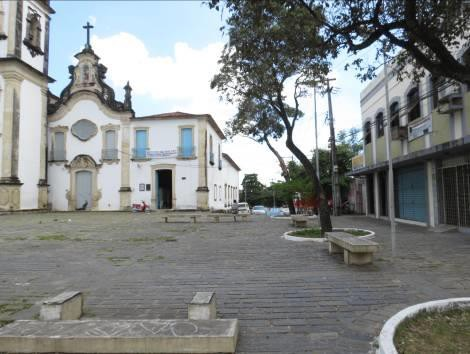
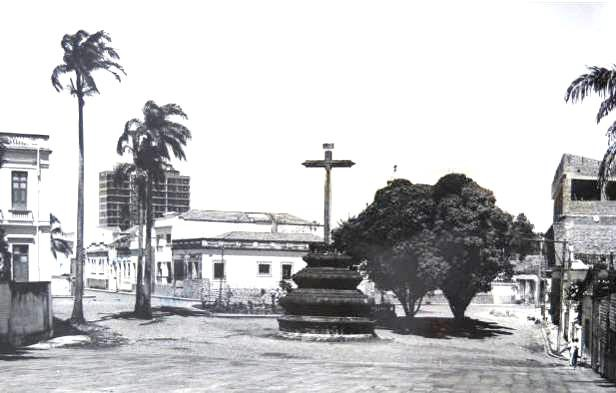

# Resumo

Em 1937, quando foi institucionalizada a conservação do patrimônio no
Brasil, o Decreto-lei 25 delineou o tipo de bem que interessava à
construção da identidade nacional: aqueles referentes a fatos memoráveis
da história, ou dotados de excepcional valor arqueológico, etnográfico,
bibliográfico ou artístico. No âmbito do patrimônio de "pedra e cal",
estes critérios direcionaram para conservação de monumentos
selecionados, principalmente, a partir da atribuição de um valor
artístico, com prioridade para os remanescentes da arquitetura religiosa
dos séculos XVI/XVIII. Estes monumentos, tratados de forma isolada
através dos tombamentos, foram alvo das ações de conservação do
patrimônio durante décadas, até que, no decorrer dos anos de 1980 e
1990, a pressão exercida pelo intenso desenvolvimento urbano no Brasil
levou a transitar para a necessária "revitalização" ou "requalificação"
dos centros históricos. Neste contexto, ocorreram na cidade de João
Pessoa intervenções que ultrapassaram os limites dos monumentos,
abrangendo espaços livres públicos contidos em seu centro histórico,
delimitado em 1984. Foram alvo de "revitalização" as praças São
Francisco e Dom Adauto e, tomando estas como estudo de caso, nosso
objetivo é verificar se, de fato, ultrapassávamos no Brasil a
valorização do "monumento histórico e artístico" e assumíamos a defesa
dos centros históricos. Partimos da premissa de que os monumentos de
"pedra e cal" continuavam como protagonistas nas ações de conservação do
patrimônio, uma vez que as referidas praças foram priorizadas por terem
como ponto focal os conjuntos monásticos dos franciscanos e carmelitas,
respectivamente, tombados pelo Iphan desde os anos de 1950.

Palavras-chave: conservação, monumentos, centros históricos, década
1980, praças, João Pessoa

# Abstract

When heritage conservation was institutionalized in Brazil back in 1937,
the Decree-Law 25 defined the type of goods that were applicable for the
construction of a national identity: those related to history memorable
facts and those provided with outstanding archaeological, ethnographic,
bibliographic or artistic values. As to the "stone and mortar" legacy,
the criteria pointed to the conservation of monuments chosen mainly due
to their artistic value, with priority given to remaining
sixteenth-to-eighteenth-century religious architecture. Treated
separately by means of listings, those monuments had been objects of
heritage conservation actions for decades up to the eighties and
nineties, when pressure exerted by intensive urban planning in Brazil
led to the "revival" and "requalification" of historic centres. Within
that context there were interventions in the city of \|João Pessoa that
went beyond the physical limits of monuments, encompassing public open
spaces of the historic centre demarcated from 1984. Considering São
Francisco and Dom Adauto squares as case studies, as they had undergone
that process of "revitalization", the objective of the present work is
to verify if the valorization of the historical and artistic monument in
Brazil was transcended and the protection of historic centres was in
fact adopted. The essay takes for granted the "stone and mortar"
monuments as continuing protagonists in heritage conservation actions
since the above cited squares had been prioritized for having monastic
premises of Franciscans and Carmelites as focal points, both listed by
IPHAN from the fifties.

Keywords: conservation, monuments, historical centres, 1980's, squares,
João Pessoa

# Introdução

No decorrer das décadas de 1980 e 1990, a conservação do patrimônio no
Brasil transitava entre a predominante prática de tombamento e
restauração de monumentos de "pedra e cal" tratados de forma

isolada, e o reconhecimento da necessária conservação dos centros
históricos. Perante a meta de "revitalizar" ou "requalificar" áreas
urbanas, a intervenção em espaços públicos livres passou a ser um dos
meios de promover a manutenção dos centros históricos. Neste contexto,
ocorreram na cidade de João Pessoa intervenções nas praças São Francisco
e Dom Adauto e, tomando estas como estudo de caso, nosso objetivo é
verificar se, de fato, ultrapassávamos, no Brasil, a valorização do
"monumento histórico e artístico" e assumíamos a defesa dos centros
históricos. Até onde inserimos na prática preservacionista do final do
século XX o avanço conceitual vigente nos documentos internacionais e
nacionais daquela época? Partimos da premissa de que os monumentos de
"pedra e cal" continuavam como protagonistas nas ações de conservação do
patrimônio, uma vez que as referidas praças foram priorizadas por terem
como ponto focal os conjuntos monásticos dos franciscanos e carmelitas,
respectivamente, tombados pelo Iphan desde a década de 1950.

# O contexto nacional

Quando da institucionalização da proteção do patrimônio no Brasil, em
1937, o Decreto-lei 25 especificou o alvo da sua atenção: os bens móveis
e imóveis selecionados por estarem vinculados a fatos memoráveis da
história nacional, ou devido à atribuição de um excepcional valor
arqueológico, etnográfico, bibliográfico ou artístico. Esta ideia foi
perseguida e reiterada durante décadas e guiou a prática da conservação
do patrimônio brasileiro.

Tal prática foi direcionada, em grande parte, para o tombamento de bens
imóveis, tratados de forma isolada, selecionados pelo valor artístico,
com prioridade para os remanescentes da arquitetura religiosa dos
séculos XVI/XVIII. Com isso foram colocadas em segundo plano, ações no
sentido de preservar os conjuntos urbanos, os valores paisagísticos,
etc.

Entre as décadas de 1950 e 1960 as mudanças no modelo de desenvolvimento
do país -- expressas na industrialização, no intenso desenvolvimento
urbano, na valorização do solo urbano -- revelaram a necessidade de
renovação conceitual e de uma revisão das práticas institucionalizadas
no Brasil, uma vez que aquelas vigentes não eram apropriadas para
enfrentar os problemas que se colocavam, como por exemplo, a proteção
das cidades históricas e dos centros históricos das grandes cidades.

Assim, nos anos de 1970 e 1971, os Compromissos de Brasília e Salvador
-- resultantes do I e II Encontro de Governadores -- trouxeram outras
perspectivas para proteção do patrimônio no país. O Compromisso de
Salvador, buscando ultrapassar o conceito de monumento, propôs a criação
de uma "legislação complementar no sentido de proteção mais eficiente
dos conjuntos paisagísticos, arquitetônicos e urbanos de valor cultural
e de suas ambiências", adotando, portanto, o que já era determinado
pelos documentos internacionais1.

Em paralelo, a estagnação do patrimônio construído estava "consolidando
a ideia de que as cidades antigas seriam entraves para as atividades
inerentes ao processo de concentração, centralização e reprodução do
capital" (MAGALHÃES, 2013, p.6). A saída encontrada era transformar o
sítio histórico em bem de consumo, gerando renda e permitindo a junção
do caráter econômico ao preservacionista.

Neste sentido, em 1973 foi criado o Programa Integrado de Reconstrução
das Cidades Históricas do Nordeste (PCH), cujo objetivo era uma ação
integrada que revitalizasse a nível econômico, social e físico o
patrimônio histórico, através da criação de infraestrutura adequada ao
desenvolvimento de atividades turísticas e do uso de bens culturais como
fonte de renda para áreas carentes do Nordeste. O interesse, entretanto,
fincava-se ainda sobre o monumento histórico isolado, sendo exigido que
cada um dos estados envolvidos no PCH apresentasse um "programa de
restauração e preservação para o período de 1976 a 1979,

> 1 II Encontro de Governadores para a Preservação do Patrimônio
> Histórico, Artístico e Arqueológico e Natural do Brasil. Disponível em
> [http://portal.iphan.gov.br/portal/montarPaginaSecao.do?id=17575&sigla=Institucional&retorno.](http://portal.iphan.gov.br/portal/montarPaginaSecao.do?id=17575&amp;sigla=Institucional&amp;retorno)
> Acessado em 14/02/2014.

indicando os monumentos a serem restaurados, o cronograma de execução,
os roteiros turísticos" (SPHAN/ Pró-Memória, 1980, p.38-39).

No ano de 1979, o PCH foi integrado às políticas de ação da SPHAN
(Secretaria do Patrimônio Histórico e Artístico Nacional), que estava
sob a direção de Aloísio Magalhães e, segundo avaliou Peregrino (2012,
p.84):

> (\...) desde o estabelecimento do SPHAN até a gestão de Aloísio
> Magalhães havia uma forte tendência ao tombamento de conjuntos
> arquitetônicos ligados ao Barroco, que representavam a herança
> europeia, branca e cristã, enfim, a cultura da elite.
> Institucionalmente essas escolhas eram justificadas pelo processo
> acelerado de urbanização que ameaçava tais bens culturais de
> desaparecimento, no entanto a proteção deles foi prioridade do SPHAN
> por cerca de 40 anos.

Essa ideia não deixara de ser dominante, pois segundo Sant'Anna (1995,
p.156) "inicialmente a ideia era incluir no PCH apenas dez cidades
nordestinas, consideradas as mais importantes em termos patrimoniais,
denominadas "cidades barrocas", o que revela uma visão ainda bastante
presa ao valor artístico como principal critério de seleção".

# O contexto preservacionista na Paraíba

Considerando as recomendações do Compromisso de Brasília2, quanto à
descentralização da conservação do patrimônio no Brasil, o Governo da
Paraíba criou em 1971 o IPHAEP: Instituto do Patrimônio Histórico e
Artístico do Estado da Paraíba. Até então a preservação do patrimônio
histórico da Paraíba estava exclusivamente a cargo da Superintendência
Regional do IPHAN de Pernambuco e, neste sentido, o IPHAEP vinha
desempenhar um importante papel, sendo o órgão responsável pelo primeiro
cadastramento e tombamento dos Bens Culturais, Artísticos e Históricos
do estado, em 1978.

Na década de 1980 quando a política preservacionista do Brasil ampliou o
acervo de cidades e centros históricos tombados, consagrando as "áreas
urbanas como principais objetos patrimoniais e centro do discurso
preservacionista" (SANT'ANNA, 1995, p.224), o IPHAEP adotou a mesma
linha e, em 1982 efetuou o tombamento do Centro Histórico de João
Pessoa.

Em 1987, foi criada a Comissão Permanente de Desenvolvimento do Centro
Histórico de João Pessoa (CPDCH), cuja função era implantar ali um
Projeto de Revitalização (PRCH) que passou a integrar o Programa de
Preservação do Patrimônio Cultural da Íbero-América, mantido pela
Agência Espanhola de Cooperação Internacional (AECI).

Como metas iniciais deste Projeto de Revitalização foram "priorizadas
ações que visavam o resgate emergencial de monumentos que se achavam há
vários anos abandonados" (CPDCHJP, 2002, p. 29). Na mesma época, o
"planejamento municipal limitava-se apenas aos aspectos urbanísticos não
se preocupando com os aspectos da preservação do patrimônio histórico"
(CPDCHJP, 2002, p.7)3. Da mesma forma, tanto IPHAN quanto IPHAEP não
dispunham de mecanismos para revitalização do Centro Histórico, havendo
ações apenas de tombamento e restauração de monumentos, mas sem a
elaboração de um plano que regesse

as intervenções.

> 2 I Encontro de Governadores de Estado, Secretários Estaduais da Área
> Cultural, Prefeitos de Municípios Interessados e Presidentes e
> Representantes de Instituições Culturais. Disponível em:
> [http://portal.iphan.gov.br/portal/baixaFcdAnexo.](http://portal.iphan.gov.br/portal/baixaFcdAnexo)
> Acessado em 14/02/2014.
>
> 3 CPDCH (Comissão Permanente de Desenvolvimento do Centro Histórico de
> João Pessoa). Centro Histórico de João Pessoa Monumento Nacional.
> *Projeto de Revitalização do Centro Histórico de João Pessoa --
> Convênio Brasil Espanha*. Outubro, 2002.

Um relatório emitido pela equipe responsável por este Projeto de
Revitalização, em 09 de abril de 1987, registrou que o Centro Histórico
de João Pessoa "não tinha merecido uma atenção maior, em forma de uma
proposta que o contemplasse como um todo. \[\...\] Mereciam destaque até
então apenas a produção colonial de grandes monumentos isolados quase
sempre ligados ao poder da Igreja e do Estado"4. A confirmação disso
está na execução de projetos pontuais na cidade de João Pessoa, desde o
ano de 1982, sendo exemplo a restauração do conjunto arquitetônico dos
franciscanos. No entanto, tais obras ocorridas nos monumentos

preconizavam as intervenções propostas para o entorno, como relata o
documento a seguir referido:

> O projeto de revitalização das Praças Dom Adauto, São Francisco e
> Anthenor Navarro, \[tinha como objetivo\] recuperá-las como espaços de
> recreação e lazer da comunidade, além de valorizar os prédios de valor
> Histórico e conjuntos homogêneos que compõem seu entorno (conjunto
> Franciscano, conjunto Carmelita, casarão de azulejos, Igreja de São
> Pedro Gonçalves, casario do início do século na Praça Anthenor
> Navarro). 5

Nota-se como era recorrente a ideia de que intervir nas praças São
Francisco e Dom Adauto constituía uma ação coadjuvante à restauração da
Igreja de São Francisco e Igreja de Nossa Senhora do Carmo:

> Com a execução de obras nos conjuntos Franciscanos e Carmelitas, é
> oportuno incorporar o agenciamento das áreas circundantes (praças)
> como prioritário para a integral revitalização do núcleo "Cidade
> Alta". Nesse sentido, foram contemplados com projetos especiais de
> reurbanização as Praças Dom Adauto e São Francisco, recuperando essas
> áreas livres, valorizando os monumentos existentes no seu entorno e
> eliminando elementos contaminantes dos mesmos. 6

Diante das intervenções realizadas e dos relatos da época, percebemos
que a ênfase estava sobre os monumentos edificados, apreciados como
marcos do patrimônio local que concediam à cidade o "*status*" de
histórica, transformando o seu centro em área de interesse turístico e
econômico. Neste momento, os memoriais descritivos e justificativos dos
projetos classificavam tais intervenções como "revitalização", talvez
por julgar necessário dar "nova vida" aos lugares que eram considerados
"mortos".

Datado de 1988, o projeto de revitalização da Praça Dom Adauto "foi
desenvolvido com o objetivo de recuperar a unidade do conjunto de
singular valor histórico arquitetônico onde a proposta visa realçar os
monumentos religiosos dos Carmelitas e as edificações do século XIX". De
acordo com levantamento que integra tal projeto, esta praça se
encontrava organizada em "3 módulos planos e retangulares sendo o módulo
central de maior extensão". A cobertura vegetal existente era composta
de 15 árvores de grande porte que formavam uma "barreira verde",
impedindo "a visualização do conjunto arquitetônico da Ordem dos

> 4 Documento S/N, elaborado pela Equipe do Projeto de Revitalização do
> Centro Histórico de João Pessoa, em 09 de abril de 1987, que traz 18
> pontos de abordagem, interesse e atuação referentes ao dito projeto.
> Está disponível na Biblioteca do IPHAN/PB. Consultado em novembro de
> 2013.
>
> 5 Documento de 01 de junho de 1988, fruto da I Reunião de Avaliação
> Interna das Atividades do GAPLAN/ IDEME/ Projeto Nordeste, que foi
> elaborado pela Comissão Permanente de Desenvolvimento do Centro
> Histórico de João Pessoa -- CPDCHJP. Está disponível na Biblioteca do
> IPHAN/PB. Consultado em novembro de 2013. O GAPLAN -- Gabinete de
> Planejamento, era responsável pelo planejamento do uso do solo,
> trabalhando juntamente com o IDEME - Instituto de Desenvolvimento
> Municipal e Estadual, que fornecia informações para o planejamento do
> município e do estado da Paraíba, e com o Projeto Nordeste que
> propunha o desenvolvimento desta região.
>
> 6 Idem.

Carmelitas\".7

Um problema a ser enfrentado era a circulação de automóveis, priorizados
na organização dos espaços urbanos. Como resultado, a Praça Dom Adauto
encontrava-se "descaracterizada existindo espaços desarticulados por
vias de tráfego secundário e invasão do comércio de lavagem de carros,
impedindo a utilização dessa área como área de lazer e preservação
ambiental" (CDCHJP, 1988). Perante este quadro, o IPHAEP, em parecer
datado de 05 de setembro de 1988, solicitou a "execução de um calçadão
em torno da Ordem Terceira do Carmo" e a retirada da circulação do
automóvel em toda a área da praça, justificando que estas medidas
visavam "proteger a igreja do tráfego, uma vez que se apresentam
rachaduras em sua parede,

comprometendo desta forma a estrutura do monumento" 8 (Figuras 1 a 4).

> 2
>
> 1
>
> 2 3
>
> 4

N

> 3 4

Figura 1; 2; 3; 4: Planta esquemática da Praça Dom Adauto e vistas da
Praça Dom Adauto em 1967 (2) e 1988 (3 e 4).

Fontes: Arquivo Eclesial da Paraíba (1); Projeto de Revitalização da
Praça Dom Adauto (2; 3; 4).

Em oposição aos três canteiros que constituíam a Praça Dom Adauto, o
projeto propôs a criação de três "ambientes" distintos, embora com um
piso contínuo e uniforme.9 Desta forma seriam "valorizadas" as
potencialidades de cada setor da praça. O primeiro ambiente (A) deveria
ser convidativo a diversos usos, em especial a convivência, apresentando
arborização e mobiliário adequados para tal. Vale ressaltar que à frente
do Palácio do Bispo - antigo convento do Carmo cuja fachada fora
reformada em linguagem neoclássica - propôs-se a inserção de um renque
de palmeiras que pudesse amenizar o impacto daquela edificação sobre

> 7 O Projeto de Revitalização do Centro Histórico de João Pessoa que
> faz referência a Praça Dom Adauto foi elaborado em 1988. Está
> disponível na sede da Comissão Permanente do Centro Histórico.
> Consultado em novembro de 2013.
>
> 8 Parecer emitido pelo IPHAEP e endereçado ao Escritório de
> Revitalização do Centro Histórico de João Pessoa, em 05 de setembro de
> 1988. Está disponível na Biblioteca do IPHAN/ PB. Consultado em
> outubro de 2013.
>
> 9 Projeto de Revitalização da Praça Dom Adauto, 1988. Disponível na
> Comissão Permanente de Desenvolvimento do Centro Histórico de João
> Pessoa. Consultado em outubro de 2013.

os monumentos remanescentes do período colonial. Na execução do projeto,
as palmeiras foram substituídas por árvores de copa alta e rala que
cumprem a mesma função.

O segundo ambiente (B) deveria ser "um espaço aberto para contemplação,
sem interferências visuais". Ou seja, para contemplação dos monumentos:
Igreja do Carmo, Igreja de Santa Teresa de Jesus e a Casa de Oração dos
Terceiros, sendo removida a vegetação que reduzia a visualização dos
mesmos. Ao contrário, no terceiro ambiente (C), foi indicada a
implantação de espécies vegetais de copa mais densa visando minimizar ao
máximo as "interferências visuais" causadas pelas edificações de "2ª
ordem" ali presentes10 (Figura 5).

> N
>
> A B C
>
> 
>
> Figura 5: Projeto proposto para revitalização da Praça Dom Adauto,
> 1988. Fonte: Comissão Permanente de Desenvolvimento do Centro
> Histórico de João Pessoa, editado pelas autoras.

Notadamente, ainda que a proposta de intervenção tenha sido intitulada
"Projeto de Revitalização da Praça Dom Adauto", o ponto focal de sua
concepção foi valorizar os monumentos e "camuflar" elementos
arquitetônicos existentes em seu entorno, mas considerados de "2ª
ordem".

Como resultado dessa intervenção, observamos a unificação dos pisos que
transformou a Praça Dom Adauto em um amplo "calçadão" onde o pedestre
pode usufruir de um passeio com áreas de cobertura vegetal e algum
sombreamento, possibilitando também a percepção do lugar com seu entorno
edificado onde são valorizados os monumentos tombados (Figuras 6 a 10).

> 
>
> 10 Idem.
>
> 
>
> Figura
> 6; 7; 8; 9; 10: Praça Dom Adauto após a execução do projeto. Fonte:
> Anne Camila Cesar Silva, 2013.

Quanto à Praça de São Francisco, que antecede o adro da igreja e
convento da ordem franciscana, estava distribuída em função da
circulação de carros que se fazia entre a Rua Vigário Sarlen e a Ladeira
de São Francisco, restando apenas um pequeno canteiro e o cruzeiro em
torno do qual circulavam os carros (Figuras 11 a 13).

1 2

> 2
>
> 1
>
> Figura 11; 12; 13: Praça São Francisco em 1981e planta baixa da
> disposição da praça em 1988. Fontes: IPHAN/PE (11; 12); Projeto de
> Revitalização da Praça Dom Adauto (13), Comissão Permanente de
> Desenvolvimento do Centro Histórico de João Pessoa, editado pelas
> autoras.

No projeto para esta praça também teve evidência a preocupação de coibir
a má utilização do espaço público e de isolar o monumento da circulação
de veículos, favorecendo o pedestre ao criar um pavimento contínuo que
integraria o mesmo a uma "sequência de visitação turística", assim
definida na época:

> A análise das características e da distribuição das praças do Centro
> Histórico de João Pessoa revelou que estes logradouros estão dispostos
> de tal forma que constituem sequencias de espaços passiveis de serem
> estruturados como percursos, são elas: a
>
> sequência formada pelas praças Dom Adauto, São Francisco e Dom Ulrico
> e pelos trechos de ruas que as interligam. Deve ser a primeira a
> entrar em obras, em vista dos trabalhos de recuperação em andamento
> nos conjuntos carmelita, franciscano e beneditino.11

Mas o ponto principal era valorizar o monumento, trabalhando seu entorno
edificado de modo a direcionar a atenção do observador para a igreja e
convento dos franciscanos. Assim, na análise desenvolvida quando da
concepção da proposta de revitalização desta praça foi observado que
"Suas fachadas laterais foram comprometidas por duas massas de
edificações de grande porte". À margem leste há um prédio neoclássico
com dois pavimentos, considerado melhor integrado ao contexto e, na
margem oposta, uma construção mais recente que "além de possuir maior
altura, é de péssima qualidade arquitetônica". Os demais prédios
voltados para a praça "são térreos e não causam maiores transtornos" 12
(Figuras 14 e 15).

> 1
> 2
>
> Figura 14; 15: Praça São Francisco em 1981, com a indicação da
> edificação neoclássica (1) e da construção mais recente (2). Fonte:
> IPHAN/PE.

Como resultado destas análises, observamos a proposta apresentada em
1988, como parte do Projeto de Revitalização do Centro Histórico de João
Pessoa. Buscando minimizar os impactos visuais do entorno sobre a praça
e o monumento, foram mantidas as espécies arbóreas no lado leste, à
frente da edificação recente que representava uma interferência, de modo
a "camuflar" sua presença com a vegetação de copa densa. Na margem
leste, diante da edificação considerada "de boa qualidade
arquitetônica", foi proposto um renque de palmeiras imperiais que não
escondia tal edificação e também direcionava o olhar do observador para
a Igreja de Santo Antônio. Assim a praça foi redefinida, centrando a
atenção sobre o monumento, valorizando-

o e consequentemente preservando-o13.

O projeto primava por favorecer o pedestre e suprimir a circulação dos
automóveis. Para tanto foi abolida a rua que cruzava a Praça São
Francisco e proposto um piso em desenho radial cujo centro estava
marcado pelo Cruzeiro, restaurado em 1971, destacando-o no *layout* da
praça14. No entanto, esta proposta não foi concretizada, sendo executado
um piso único em pedra, que atendeu ao objetivo de dar continuidade ao
ambiente e o distanciamento adequado para o resguardo do monumento,
permitindo sua contemplação .

> 11 Publicação "João Pessoa, o reconhecimento de uma antiga cidade",
> São Paulo, agosto de 1988. Disponível na Biblioteca do IPHAN/PB.
> Consultado em outubro de 2013.
>
> 12 Idem.
>
> 13 Projeto de Revitalização da Praça Dom Adauto, 1988. Disponível na
> Comissão Permanente de Desenvolvimento do Centro Histórico de João
> Pessoa. Consultado em outubro de 2013.
>
> 14 Idem.
>
> 1
>
> 1

Legenda

> Calçadão Rua Vigário Sarlen
>
> Proposta de piso radial ao entorno do Cruzeiro Renque de Palmeiras
> lateral leste
>
> Árvores de copa densa que permaneceram a lateral oeste

Figura 16; 17: Planta/ Proposta do Projeto de Revitalização da Praça São
Francisco em 1988. Fonte: CDPCH.

> 

Figura 18; 19: Praça São Francisco, 2013. Fonte: Anne Camila Cesar
Silva, 2013.

Os projetos destas duas praças: Dom Adauto e São Francisco, foram
marcantes na trajetória das intervenções patrimoniais ocorridas em João
Pessoa, tendo em vista que ocorreu não somente uma mudança estrutural do
espaço público, mas abriu espaço para introdução de um novo
direcionamento na conservação do seu centro histórico. Mesmo assim,
questionamos: se estas praças não apresentassem em seu perímetro dois
monumentos de interesse nacional receberiam na década de 1980 alguma
obra de "revitalização"?

Vemos que em todo o Brasil estava em foco a conservação dos centros
históricos, como noticiava, por exemplo, a Revista Projeto, periódico de
relevância nacional que certamente refletia o que estava em voga ao
final da década de 1980. Alimentando as discussões da época, há notícias
sobre diversos eventos cujo enfoque era a preservação do patrimônio: o I
Seminário Brasileiro para preservação e revitalização de Centros
Históricos, promovido pelo ICOMOS15, o Arq-América 9016 e o II
Arquimemória17.

> 15 Realizado em Itaipava/RJ, significou um passo importante na
> discussão e sistematização de critérios visando uma política de
> preservação e revitalização. Teve como produção a Carta de Petrópolis.
> (Revista Projeto nº 127; novembro/ 1989; p. 150)

No mesmo periódico havia referência à restauração de monumentos, do
período colonial ou não, a exemplo do Teatro Municipal de São Paulo.
Também era considerável o número de reportagens sobre a "revitalização"
de núcleos históricos, como Olinda/ PE (Revista Projeto, nº 99, Maio de
1987; p. 91) e São Luís do Maranhão (Revista Projeto, nº 118,
Janeiro-Fevereiro de 1989; p. 132-136).

No entanto, não localizamos notícias sobre projetos de intervenção em
espaços livres públicos, que fossem então valorizados como ambientes de
importância histórica, arquitetônica e social. Isso reforça nossa
hipótese de que as praças Dom Adauto e São Francisco, aqui analisadas,
também não foram selecionadas para intervenção por seus valores
intrínsecos para a história e memória da cidade de João Pessoa. Suas
requalificações estavam subjugadas aos monumentos ali presentes, os
verdadeiros protagonistas e pontos focais das intervenções realizadas
nesses espaços públicos considerados "dignos" de conservação devido à
presença de monumentos que serviriam para impulsionar o turismo.

# Referências bibliográficas

MAGALHÃES, S. R. O Programa de Cidades Históricas: a descentralização de
uma Política Nacional de Preservação do Patrimônio Cultural*.* In:
*Encontro Internacional ARQUIMEMÓRIA 4*: sobre preservação do patrimônio
edificado. Salvador -- Bahia, 14-17 de maio de 2013.

PEREGRINO, M. SPHAN/ Pró-Memória: abertura política e novos rumos para a
preservação do patrimônio nacional. *Revista Confluências Culturais*, 2012. 
Disponível em:
[http://periodicos.univille.br/index.php/RCC/article/view/357.](http://periodicos.univille.br/index.php/RCC/article/view/357)
Acesso em 12 de dezembro de 2013.

> SANT'ANNA, M. *Da cidade-monumento à cidade-documento: a trajetória da
> norma de preservação de áreas urbanas no Brasil (1937 -- 1990)*.
> Salvador, 1995*.* (Dissertação de Mestrado do Programa de Pós-
> graduação em Arquitetura e Urbanismo da Universidade Federal da
> Bahia).
>
> SPHAN/ Pró-Memória. *Proteção e Revitalização do Patrimônio Cultural
> no Brasil: uma trajetória*. Brasília: Ministério da Educação e
> Cultura, 1980.
>
> 16 Realizado em março de 1989, em Salvador/BA. Pretendia analisar em
> "profundidade as condições atuais em que se encontra o patrimônio" bem
> como a "qualidade de vida no continente americano" (Revista Projeto,
> nº 127, novembro/ 1989, p. 34).
>
> 17 II Encontro Nacional de Preservação de Bens Culturais (Arquimemória
> II), realizado de 26 a 30 de agosto de 1987, em Belo Horizonte/ MG.
> "Representou passo importante no esforço para consolidação de uma
> consciência política em tono da necessidade de medidas mais eficazes
> para a preservação de bens culturais do país" (Revista Projeto, nº
> 104, Outubro/ 1987, p.42).
