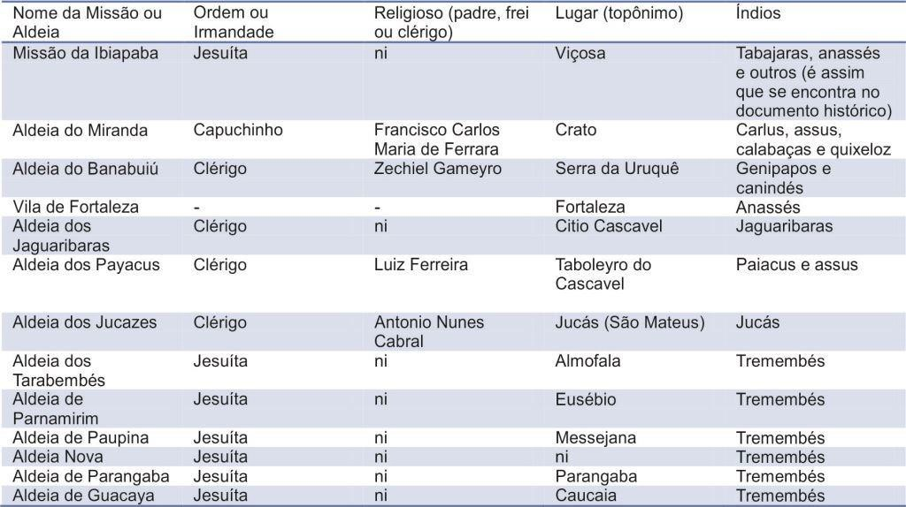
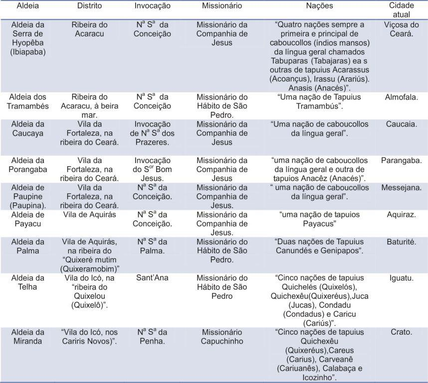
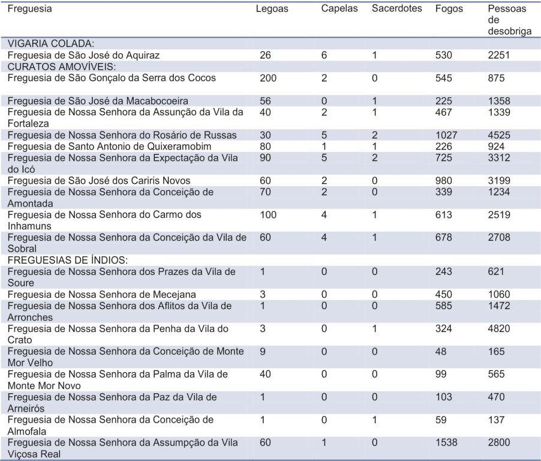
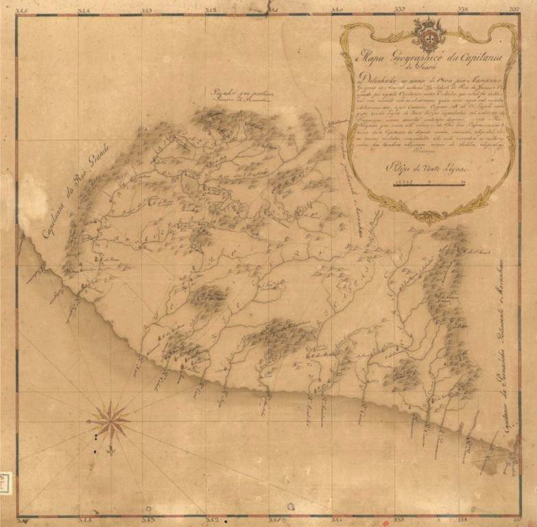
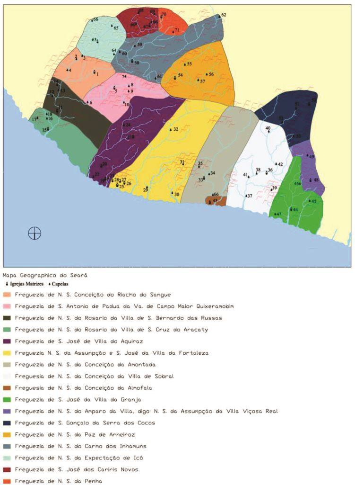
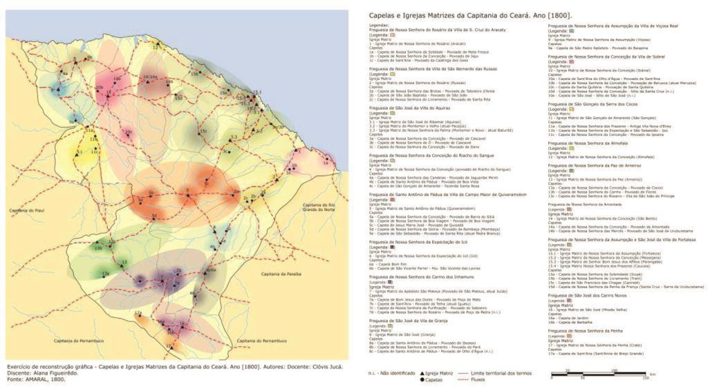

# Resumo

O Ceará foi tardiamente colonizado. Durante o século XVIII, os
boiadeiros e suas boiadas cruzaram o território cearense. A fixação dos
boiadeiros, os sesmeiros do sertão, aliada à da Igreja - domesticando a
população indígena que resistia à expansão do criatório - e à
participação do Estado português - com a fundação das vilas cearenses -
significou a possibilidade de capitalização em torno da atividade
comercial da pecuária. A fazenda de gado espalhada no sertão foi sede da
ocupação.

Ao lado de uma ou de outra fazenda, terras foram doadas aos santos pelos
próprios conquistadores para a realização dos atos religiosos, onde
foram erguidas algumas das primeiras capelas do território, outras foram
edificadas nos primeiros aldeamentos. No correr do século, enquanto
construíam edifícios religiosos em local previamente determinado pelo
Bispo de Pernambuco, o Estado Português cuidava de demarcar as áreas de
freguesias. Possivelmente em decorrência da baixa rentabilidade da
pecuária, uma única freguesia colada fora fundada no Ceará durante o
século XVIII, confirmando que o território despertou pouco interesse
para Coroa.

Palavras-chave: Capitania do Ceará, Igreja, Estado português, Agentes
econômicos

# Abstract

The Ceará was later colonized. During the eighteenth century, the
cattlemen and their herds crossed the territory of Ceará. The fixation
of the cattlemen, the sesmeiros of the hinterland, allied to the Church
- taming the indigenous population that resisted the expansion of the
breeding - and the participation of the Portuguese State - with the
founding of villages in Ceará - meant the possibility of capitalization
around the commercial activity livestock. The cattle farm in the outback
was the headquarters of the occupation.

Beside one or other farm, earth were donated to the saints by the
conquerors themselves to the achievement of religious acts, which were
erected some of the first chapels in the territory, others were built in
the early settlements. In the course of the century, while constructing
religious buildings on site previously given by the Bishop of
Pernambuco, the Portuguese State tended to demarcate the areas of
parishes. Possibly due to the low profitability of livestock, just one
parish "colada" was founded in Ceará during the eighteenth century,
confirming that the territory aroused little interest to Portugal.

Keywords: Captancy of Ceará, Church, Portuguese State, Economics agents

# Introdução

O artigo discute os primórdios da fixação da Igreja no espaço
territorial cearense. Contribui com a reflexão identificando as áreas do
território e os lugares da fixação, estabelecendo a relação entre a
gênese dos aglomerados e a construção das primeiras ermidas e capelas.
Também evidencia a pouca importância da capitania para o Estado
português considerando o número de freguesias coladas instaladas no
território.

# A pecuária e a ocupação do território

No final do século XVII e nos primeiros anos do século XVIII, ordens
régias portuguesas proibiram a atividade da pecuária na faixa litorânea
do nordeste brasileiro, reservando-a para a economia açucareira (JUCÁ
NETO, 2012). Expulsos do litoral, os

criadores de gado com suas boiadas partiram em direção à capitania do
Maranhão em busca de novas pastagens.

Durante o século XVIII, os boiadeiros e suas boiadas cruzaram o
território cearense. Em relação a outras áreas do Brasil, a ocupação do
território foi tardia. A despeito de sua baixa produtividade e pequena
rentabilidade, a economia pecuarista atribuiu sentido à ocupação e deu
forma e conteúdo à Capitania. A fixação dos boiadeiros, os sesmeiros do
sertão, aliada à da Igreja - domesticando a população indígena que
resistia à expansão do criatório - e à participação do Estado português
- com a fundação das vilas cearenses - significou a possibilidade de
capitalização em torno da atividade comercial da pecuária. A fazenda de
gado espalhada no sertão foi sede primeira da ocupação.

Ao lado de algumas fazendas, terras foram doadas aos santos pelos
próprios conquistadores para a realização dos atos religiosos, onde
foram erguidas algumas das primeiras capelas do território. Além das
ermidas erguidas no entorno das fazendas, outras foram edificadas nos
aldeamentos.

Predominantemente, as primeiras celebrações aconteceram em altares
móveis, frágeis, de madeira roliça; noutras situações as ermidas eram
simples palhoças de taipa de sopapo com uma pequena cruz indicando a sua
função. Inicialmente, inexistiam capelas construídas com alvenaria de
tijolo. Assim como as fazendas de gado, hoje são raras as capelas do
século XVIII.

A doação de terras para a construção das primeiras ermidas ao lado das
fazendas de gado, juntamente com a formação dos primeiros aldeamentos
indígenas significava o início da constituição do patrimônio religioso
no Ceará.

# A fixação da Igreja no território

A fixação da Igreja no Ceará também ocorreu tardiamente se comparada com
o restante da terra brasileira. O processo de conversão1 da capitania
não foi diferente daquele empreendido em outras regiões brasileiras,
antecedendo o poder civil. Também como no restante do Brasil, a
conversão dos sertões do Ceará realizou-se gradativamente, seguindo os
caminhos do povoamento, da construção de capelas pelos colonizadores e a

consequente ampliação da rede de freguesias no território.

Além daqueles que se fixaram temporariamente, vários religiosos foram
proprietários de sesmarias ou estavam \"integrados em congregações
beneficiadas com doações de terras\" (NOBRE, 1986, P.246).

É possível presumir que, ao contrário da atividade produtiva do açúcar,
concentradora de mão de obra, a atividade extensiva da pecuária e sua
extrema dispersão tenham dificultado a instalação da Igreja.

O projeto jesuítico na Capitania do Ceará prendeu-se ao surgimento de
algumas pequenas \"missões anteriormente estabelecidas pelos inacianos
em Parangaba, Caucaia e Paupina, nas proximidades da Serra da Ibiapaba,
\[\...\] da Serra de Baturité \[\...\] dos Cariris-Novos\", e na
instalação do Real Hospício2 jesuítico em Aquiraz3.

As missões de Parangaba, Caucaia, Paupina, das serras da Ibiapaba, de
Baturité e dos Cariris Novos foram transformadas em vilas no reinado de
D. José I. Os novos topônimos impostos pelas autoridades portuguesas
foram, respectivamente, os de

> 1 Tal como Fonseca (2011, p. 83), entendemos a Conversão em uma dupla
> acepção; tanto a cristianização dos espaços originalmente ocupados por
> povos "pagãos", como a "ideia de sua metamorfose, de sua transmutação
> em territórios controlados por autoridades que exercem funções de
> cunho tanto religioso como civil".
>
> 2 Segundo Serafim Leite (1943, p. 73), "entende-se por Hospício uma
> casa ou Residência Grande, cabeça de toda Missão, diferente das casas
> das Aldeias. A ela se acolheriam os missionários das Aldeias para
> repousar de vez em quando; e dela, os missionários \[\...\] iriam
> fazer missões às Aldeias e ao sertão. Seria também uma como enfermaria
>
> geral \[\...\] A este conceito primitivo acresceu mais tarde outro, de
> estudos, vindo a ser este Hospício o primeiro Seminário e o primeiro
> estabelecimento oficial de Latim e Humanidades no Ceará".
>
> 3 O Real Hospício de Aquiraz foi destruído em 1854.

Arronches (Parangaba), Soure (Caucaia), Messejana, Vila Viçosa Real e
Monte-mor o Novo da América (Baturité). As missões dos Tremenbés, no rio
Aracati-Mirim, e a dos Pacajús, no rio Choró, tornaram-se
respectivamente Almofala e Monte-mor o Velho da América (Pacajus), mas
permaneceram como simples povoados (NOBRE, 1986, p.242). De acordo com
Nobre (1980, p. 211), antes mesmo da expulsão dos jesuítas do Brasil em
1759, a possibilidade de tornar o Ceará uma província jesuítica já havia
fracassado devido à criação das vilas, das freguesias, das dificuldades
de comunicação no território, das brigas entres sesmeiros e povoadores,
das "deliberações das autoridades superiores sediadas em Pernambuco,
Bahia" e em Portugal, "da insuficiência de recursos para uma organização
de maior vulto" e em decorrência da baixa produtividade da atividade
econômica da pecuária.

O território cearense também foi pontuado por ermidas, capelas,
aldeamentos pequenos e efêmeros que tiveram à frente, em sua maioria,
padres seculares, os Clérigos do Hábito de São Pedro. Além dos
oratorianos, carmelitas e capuchinhos percorreram o território,
aldeiando a população indígena.

Como afirma Bueno (2009), durante o período colonial as instâncias de
poder organizavam-se, hierarquicamente, \"em instituições irradiadas a
partir das \'cidades reais\'\". Essas instituições \"administrativas,
jurídicas e eclesiásticas sobrepunham seus territórios no espaço\". Eram
\"tentáculos metropolitanos na distante \'Conquista\', cumprindo papéis
distintos\" na lógica da ocupação territorial.

Algumas ermidas espalhadas pelo sertão, após a autorização do bispado de
Pernambuco, foram transformadas em capelas curadas, visitadas pelo
capelão residente da capitania e dependentes das paróquias mais
próximas. Com o tempo, no entorno de algumas dessas capelas se
organizaram pequenas povoações, alterando a dispersão reinante,
vagarosamente, pela materialidade construída dos incipientes núcleos e a
institucionalização dos mesmos4. Com o aumento do número de \"pessoas de
desobriga\" ou o crescimento do núcleo adstrito às capelas, o bispo
pernambucano era solicitado para a criação de uma paróquia, ou
freguesia. Se colada, a freguesia teria um vigário dedicado unicamente a
ela, remunerado pela Coroa.

# O lugar de alguns primeiros aldeamentos

No final do século XVII, diante da sangrenta "guerra dos bárbaros", o
Rei de Portugal D. Pedro II entendeu que a forma possível de pacificação da região seria
o "estabelecimento de aldeias de índios nos sertões de Açu, Jaguaribe e
Piranhas". Seriam duas aldeias em cada sertão, segundo ordem régia do
governador de Pernambuco Caetano de Melo Castro datada de 6 de março de
1664 (NOBRE, 1980, p. 229). Possivelmente nas aldeias fundadas nos
últimos anos do século XVII e por todo o século XVIII, uma rudimentar
capela fora construída.

Em 20 de agosto 1696, o capitão mor do Ceará Pedro Lelou5 escreveu da
Fortaleza de Nossa Senhora da Assunção do Ceará Grande ao Rei de
Portugal D. Pedro II afirmando a inexistência de sacerdotes e religiosos
que assistissem aos gentios na capitania cearense. O documento
apresentou ainda um genérico e reduzido panorama quantitativo

dos aldeamentos existentes na capitania cearense.

> 4 Como afirma Murilo Marx (1991, p. 18), a institucionalização de
> "tantas e tão dispersas comunidades" se dava pela oficialização das
> ermidas "de sua capelinha visitada por um cura, o pela sua elevação um
> dia a matriz, elevação que significava a ascensão de toda uma região
> inóspita \[\...\] ao novo status de paróquia ou freguesia". Ainda de
> acordo com o autor, o que se obtinha não era somente o acesso à
> assistência religiosa, mas "o reconhecimento da comunidade de fato e
> de direito perante a igreja, portanto perante o próprio Estado".
>
> 5 Projeto Resgate. AHU-ACL-N-Ceara. Cx. 1. Doc. 37.
>
> \[\...\] há quatro aldeias de gentio potiguaras. Estes são domésticos
> e batizados, mas mal instruídos na fé por falta de haver nesta
> capitania sacerdotes ou religiosos que lhes assistam e lhes ensinem a
> doutrina porque mal há um para todas, ficando elas distantes uma das
> outra 2, 4, 6 e 8 léguas e assim mais há uma nação de tapuias
> jaguaribaras que estão aldeados, e alguns destes batizados, mas
> gentílicos no seu trato e sem doutrina por alta de terem quem os vá
> catequizando e exortando nela. Há outra nação de tapuias paiacus que
> assiste este na Ribeira de Jaguaribe que pedem: se querem aldear, e
> batizar seus filhos, que lhes deem sacerdotes para isso. E há outra
> nação de tapuias anacés que também pedem lhes deem sacerdote para se
> aldearem a batizarem.

Até o início do século XVIII, quatro aldeamentos encontravam-se sob os
cuidados dos Clérigos do Hábito de São Pedro no Ceará. Não nos foi
possível determinar suas durações. Dos quatro, dois estavam localizados
na Ribeira do Jaguaribe e dois nas proximidades da futura vila de
Fortaleza. Em 1696, os índios paiacus foram reunidos na Aldeia de Nossa
Senhora da Madre de Deus (Aldeia Velha), a meia légua do monte Arerê,
atual Itaiçaba, na Ribeira do Jaguaribe, sob a ação do clérigo
oratoriano João da Costa (Rocha, 2001, p. 22). Em 1697, os índios
jaguaribaras e anacés foram aldeados em Parnamirim, a sete léguas de
Fortaleza, pelo clérigo João Leite de Aguiar (NOBRE, 2001, p. 231). No
ano seguinte, em 1698, Nobre faz referência a um aldeamento nas
proximidades da futura vila de Nossa Senhora da Assumpção, sob a atenção
do também clérigo João Alvares da Encarnação (NOBRE, 2001, p. 231). Em
1699, o clérigo padre João da Costa cria um novo aldeamento (Aldeia
Nova) na Aldeia de Nossa Senhora das Montanhas, localizada a 24 léguas
da antiga Aldeia Velha. Rocha (2001, p. 78) assevera que o aldeamento
provavelmente localizava-se onde hoje se situa a cidade de Morada Nova.

Além da missão dos jesuítas na serra da Ibiapaba, definitivamente
instalada por volta de 1695, também no início do século XVIII
identificamos a presença de padres da Companhia de Jesus em missão na
Ribeira do Jaguaribe. Segundo Rocha (2001, p. 79), em 1700, o jesuíta
João Guinzel6 reuniu índios baiacus na Missão de Nossa Senhora da
Anunciada ou Anunciação7 (Aldeia do Jaguaribe), nas proximidades da
atual cidade de Tabuleiro do Norte.

Em 1702, de acordo com Geraldo Nobre (1980, p. 238), estando em missão
pelo sul do Ceará, o padre João de Matos Serra, vigário colado da vila
de Aquiraz (STUDART, 1923, p. 303), fundou o Arraial Novo, sob a
invocação de Nossa Senhora do Ó, onde hoje é a cidade do Icó, e aí
aldeiou os índios icós.

Henrique Luís Pereira Freire de Andrada, governador da capitania de
Pernambuco, escreveu ao rei D. João V, em 17398, apresentando uma
relação das missões e aldeias da capitania pernambucana. Na capitania do
Ceará, anexa à capitania de Pernambuco, foram inventariados treze
aldeamentos (Tabela 1). Sete aldeias eram ministradas por jesuítas, uma
por capuchinho, quatro por clérigos e a vila de Fortaleza não fica

especificado a ordem ou irmandade.

> 6 Segundo Serafim leite (1043, p. 76), 0 jesuíta João Guinzel é o
> mesmo padre jesuita João Guedes, um dois fundadores do Real Hospício
> de Aquiraz no Ceará.
>
> 7 Studart Filho escreveu que, em 1700, "o padre João Guedes, com ajuda
> do padre Vicente Vieira, fundou a Aldeia de
>
> Nossa Senhora da Anunciada, onde reuniu ao Baiacus do Jaguaribe"; apud
> Nobre (1980, p. 235). O padre João Guedes pertencia à Companhia de
> Jesus, ver Serafim Leite (1953, p.94).
>
> 8 Projeto Resgate. AHU_ACL_CU_015. Cx. 55. D. 4767.

A "Descrição de Pernambuco com parte da sua história e legislação até o
Governo de D. Marcos de Noronha em 1746 e mais alguns documentos até
1758" (tabela 2) apresentou a situação das aldeias no Ceará em meados do
século XVIII (ROCHA, 2001, p. 247). Segundo o documento o território
cearense possuía nove aldeamentos. Os jesuítas encontravam-se
basicamente no litoral, excetuando a aldeia da Ibiapada, no alto da
serra homônima. Já clérigos do Hábito de São Pedro achavam-se no
processo de conversão do sertão. Somente a aldeia de Miranda, no Cariri,
que dará origem a atual cidade do Crato encontrava-se sob a ação de um
capuchinho, o frei Carlos Ferrara.

Em 1757, o Catálogo da Companhia de Jesus no Brasil relacionou somente
cinco aldeias no Ceará: Parangaba, Paupina (Messejana), Caucaia, Payacus
e Ibiapapa. (NOBRE, 1980, p. 225).

Tabela 1. Fonte: Projeto Resgate. AHU_ACL_CU_015. Cx. 55. D. 4767.

> 
>
> Tabela 2. Fonte: NOBRE, 1980, p.247.
>
> 

# Primeiras capelas e igrejas

Em alguns casos, após o erguimento das fazendas de gado, os sesmeiros
requeriam permissão ao bispado de Pernambuco9 para construção de uma
ermida, onde poderiam ouvir as missas celebradas por capelães. A
permissão significava assistência religiosa. As ermidas eram construídas
em terras doadas10 por um ou mais de um proprietário de terra,
contribuindo para a formação do patrimônio eclesiástico na capitania
cearense. Juntamente com a fixação dos boiadeiros, a Igreja reafirmava,
assim, sua presença no território instalando-se nas terras oferecidas.

Em 20 de agosto de 1696, o capitão mor do Ceará Pedro Lelou em missiva
ao rei de Portugal D. Pedro II afirmou que a capitania cearense não
possuía igreja matriz e nem curato11. Que as únicas capelas eram as das
aldeias e da Fortaleza de Nossa Senhora da Assunção.

> O povo desta capitania não tem matriz, nem curato nem há mais igreja
> fora das aldeias que a capela desta fortaleza, e nela o capelão faz
> ofício de vigário causa de haver pouca obediência na infantaria por
> ele os querer reger e meter-se em toda a
>
> 9 As paróquias do Ceará eram subordinadas ao Bispado de Pernambuco e
> este, ao Arcebispado da Bahia, criado em 1676.
>
> 10 Em troca da doação de "terras para o santo, seu patrimônio ou da
> sua capela", eram rezadas missas para o doador e sua família, em vida
> e após a morte (MARX, 1991, p.26).
>
> 11 Projeto Resgate. AHU-ACL-N-Ceara. Cx. 1. Doc. 36.
>
> governança, com autoridade de vigário; e sendo só não pode acudir a
> toda obrigação; também se deve atender nesta parte ao bem das almas.

Geraldo Nobre (1980, p. 242) assevera que, provavelmente, \"excluídas a
do Forte de Nossa Senhora da Assumpção e as das aldeias dos
missionários\", a capela dedicada à Nossa Senhora do Ó cujo patrimônio
fora doado pela família Montes na ribeira do rio Salgado, no lugar da
futura matriz de Nossa Senhora da Expectação do Icó, foi a primeira a
erigir-se no Ceará. A Carta Régia fundacional da Vila de Nossa Senhora
da Expectação do Icó, de 1738, determinou a criação de uma \"nova Villa
no Icó junto aonde se acha a Igreja Matriz\"(JUCÁ NETO, 2012).

Por volta de 1793, Manuel da Cunha Pereira, o capitão comandante da
Ribeira do Jaguaribe, pediu licença à rainha D. Maria I para edificar
uma ermida em homenagem a Nossa Senhora das Dores, em sua fazenda
chamada Boqueirão, localizada na freguesia das Russas12. O documento
expressa os procedimentos que provavelmente todos os detentores de
terra, durante o século XVIII, deviam ter seguido ao requerer ao bispado

de Pernambuco a construção das primeiras capelas no território cearense.
A requisição implicava na doação de terras para o orago correspondente à
igreja, contribuindo para o patrimônio religioso da capitania do Ceará.

> Diz Manoel da Cunha Per.a Cap.m Comand.e da Ribeira de Jaguaribe,
> Capitania do Ceará Grande no Bispado de Pern.co que elle pertende
> edificar na sua fazenda do Boqueirão Freg.a da Russas \[\...\] hua
> Ermida a Nossa Snr.a das Dores; a qual se faz necess.a para nella
> ouvirem Missa o Sup.te e Sua Fam.a e igualm.te os Povos circunvizinhos
> q\' distar da moradia do Sup.te Seis legoas a Ermida mais próxima
> \[\...\] a Sua Pied.e lhe conceda faculd. de p.a d.a fundação
> concorrendo a Licença do Ordinário a patrimônio Canônico.

# Freguesias

Além da construção das ermidas e capelas, e sua elevação à condição de
igreja matriz, o bispo de Pernambuco cuidou de ordenar a demarcação dos
limites das freguesias13 cearenses, que seriam frequentemente
percorridas por padres visitadores angariando fundos para os cofres
portugueses.

Em sua maioria, as vilas foram fundadas onde já existiam as sedes das
paróquias, o que confirma a precedência da organização religiosa quanto
à organização político- administrativa (NOBRE, 1980, p. 246). Durante o
século XVIII, o número de freguesias superou o número de vilas criadas
no Ceará. A capitania alcançou o século XIX com 17 freguesias e 14
vilas.

Em 17 de fevereiro de 1777, D. Tomás da Encarnação Costa e Lima, bispo
de Pernambuco, apresentou ao rei de Portugal D. José I14 uma relação de
todas as igrejas paroquiais que pertenciam ao bispado pernambucano - que
se estendia desde a foz do São Francisco até Fortaleza, no Ceará,
fazendo limite com o do Pará, a oeste, e com o arcebispado da Bahia, ao
sul -, abrangendo várias capitanias. Segundo o bispo todas as

capelas do bispado ou eram de

> 12 Projeto Resgate. AHU_ACL_CU_017. Cx. 12. Doc. 693.
>
> 13 As freguesias "designavam o templo -- a igreja matriz -, \[\...\] a
> povoação \[\...\], o conjunto dos fregueses, e por fim, o
>
> território paroquial, que incluía a povoação sede, áreas rurais e, por
> vezes, sertões residuais" (FONSECA, 2011, p. 84)
>
> 14 Projeto resgate. AHU_ACL_CU_015. Cx. 126. D. 9545.
>
> engenhos necessárias para a celebração do Santo Sacrifício da Missa e
> administração dos Sacramentos aos trabalhadores dos mesmos, ou são
> edificadas pelos povos circunvizinhos com patrimônio competente, nas
> distancias grandes das suas Matrizes para o referido fim dos
> Sacramentos e Santo Sacrifício, conservando-se nelas hum Sacerdote com
> licença do próprio Parocho, sem alguns encargos de encapellados.

De acordo com o documento, no território cearense havia uma vigaria
colada, 19 amovíveis e 34 capelas (tabela 3).

As Paróquias, "freguesias coladas" ou "colativas" possuíam "vigários
colados", "padres perpétuos" que eram nomeados pelo Rei e recebiam os
"benefícios eclesiásticos", as "côngruas". Já os Curatos ou paróquias
encomendadas possuíam padres encomendados, temporários, "nomeados pelo
bispo e remunerados pela população"; ou seja, não recebiam côngruas.
Para subsistirem as paróquias "cobravam da população as "conhecenças",
que eram taxas diferenciadas (e em geral muito elevadas) para cada tipo
de celebração ou sacramento" (FONSECA, 2011, p. 83). A Coroa só criava
freguesia colada quando lhe convinha.

A Instalação de Freguesias Coladas como medida de controle implicava em
investimentos por parte do Estado Português. Daí porque as sedes
paroquiais nos sertões do Brasil localizavam-se em pontos estratégicos
do território brasileiro. Como afirma Fonseca (2011, p. 83), a
instalação "supunha a existência de povoamento estável e de certa
prosperidade nas zonas que seriam incluídas dentro da freguesia"15.

Para efeito de comparação lembramos que em 1778, a região das Minas
Gerais possuía 50 freguesias coladas (FONSECA, 2011, p. 97), São Paulo
13 e o Ceará em 1775 apenas uma. A presença de uma única freguesia
colada na capitania cearense é indicativa do pequeno interesse da Coroa
em relação ao Ceará, na medida em que implicava o pagamento das
"congruas" em um território pautado pela baixa rentabilidade econômica.
Como no restante do Brasil, o estabelecimento da estrutura eclesiástica
no Ceará dependeu, primordialmente, da iniciativa dos habitantes. O que
diferia de outras regiões do território brasileiro foi a ausência de
capital local, associada à baixa rentabilidade da pecuária, que
possibilitasse maiores investimentos por parte dos habitantes, durante o
processo de fixação da Igreja.

Em 1800, o visitador Mariano Gregório do Amaral correu a capitania
demarcando os limites das freguesias cearenses, identificando suas
matrizes e capelas. O espaço territorial do Ceará encontrava-se
definitivamente ocupado pela igreja. Possuía 17 freguesias e apresentava
uma rede eclesiástica com 22 igrejas Matrizes e 47 capelas (figura 01,
02 e 03). A maioria das igrejas matrizes e capelas encontravam-se nas
estradas coloniais delineadas pelo eng. Silva Paulet16 em sua *Carta
Marítima e*

> *Geográfica da Capitania do Ceará* de 1817.
>
> Tabela 3. Fonte: Projeto Resgate. AHU_ACL_CU_015. Cx. 126. D. 9545.
>
> 15 Fonseca (2011, p.105) justifica o elevado número pela importância
> econômica da região mineradora que implicava na necessidade de "se ter
> "pastores" da confiança do rei na direção das comunidades mineradoras,
> sobretudo durante o apogeu da produção aurífera".
>
> 16 "Antonio José da Silva Paulet. -- Coronel do Real Corpo de
> Engenheiros. \[\...\] Por Dec. de 13 de Maio de 1811 foi nomeado
> Ajudante de Ordens do Governo do Ceará, que assumiu a 19 de Março de
> 1812. (STUDART, 1923, p. 278
>
> -- 279)
>
> 
>
> 
>
> Figura 1. Mapa Geográfico da Capitania do Ceará. 1800
>
> Fonte: Mapa Geográfico da Capitania do Ceará. Autor: Mariano Gregório
> do Amaral \[1800\].
>
> Biblioteca Nacional do Rio de Janeiro.
>
> 
>
> Figura 2. Vetorização mapa original. Mapa Geográfico da Capitania do
> Ceará. 1800.
>
> Fonte: Mapa Geográfico da Capitania do Ceará Autor: Mariano Gregório
> do Amaral \[1800\]. Biblioteca Nacional do Rio de Janeiro.
>
> 
>
> Figura 3. Reconstrução gráfica -- Freguesias, Igrejas Matrizes e
> Capelas da Capitania do Ceará. Ano 1800.
>
> Fonte: Mapa Geográfico da Capitania do Ceará. Mariano Gregório do
> Amaral \[1800\]. Biblioteca Nacional do Rio de Janeiro./ Carta
> Marítima e Geográfica da Capitania do Ceará de 1817. José da Silva
> Paulet. GEAEM. Lisboa.

# A Igreja, o Estado, os agentes econômicos e a população indígena: uma ação integrada

A fixação da Igreja no Ceará foi orquestrada por párocos que ou, na
maioria das vezes, acompanhavam os primeiros desbravadores ou fundaram
aldeamentos, congregando a população indígena que resistia à expansão da
pecuária. A rede eclesiástica cearense precedeu a rede civil, mas em
termos jurídicos ficava submetida à autoridade portuguesa, assim como
ocorreu no restante do território brasileiro. No entorno das primeiras
fazendas de gado, com suas ermidas, e dos aldeamentos a gênese urbana se
faz presente. Como no restante do Brasil, a fixação -- construção de
capelas e Igrejas Matrizes -- dependeu basicamente dos habitantes
locais. As ações foram individuais ou associadas em irmandades.

De maneira dispersa, até as primeiras décadas do século XVIII, a Igreja
fixou-se nas proximidades da foz do rio Jaguaribe, nas áreas adjacentes
à Fortaleza de Nossa Senhora da Assumpção, na serra da Ibiapada -- mais
especificamente onde hoje se encontra a cidade de Viçosa do Ceará - e em
alguns pontos do interior da capitania, como ocorreu no lugar da atual
cidade do Icó. Somente a partir de 1738 a administração civil portuguesa
fixou no sertão do Ceará, inicialmente nas proximidades do Icó. O Icó
foi elevado à condição de vila somente em 1738. Por todo o século XVIII,
a dispersão da Igreja juntamente com a fundação de vilas no território
foi paulatinamente sendo alterada.

Embora a Coroa não tenha proibido a instalação de ordens religiosas na
Capitania cearense, como ocorreu na zona mineradora, no Ceará não
encontramos conventos e residências de ordens regulares com porte
arquitetônico como as que foram construídas em outras regiões do Brasil.
Supomos que a não fixação de ordens regulares em edificações de grande
porte, deveu-se às condições da conquista pautadas por uma extrema
adversidade: as secas, as brigas por posse de terra entre os sesmeiros,
a resistência indígena à expansão da pecuária e pela pequena
produtividade e baixa rentabilidade da economia pecuarista, atividade
econômica que atribuiu forma e conteúdo ao território.

Finalmente, afirmamos que a compreensão da organização do espaço
territorial do Ceará setecentista não pode desconsiderar as múltiplas
ações integradas entre a Igreja, os representantes da atividade
pecuária, a população indígena e o Estado português. Os agentes
envolvidos na ocupação do território uniram-se de diversas formas e em
tempos diferenciados, transformando o espaço.

# Referencia Bibliográfica

BUENO, B. P. Dilatação dos confins: caminhos, vilas e cidades na
formação da Capitania de São Paulo (1532-1822). *Anais do Museu
Paulista*, São Paulo, v. 17, n. 2, 2009.

> FONSECA, C. D*. Arraiais e Vilas D'El Rey. Espaço e poder nas Minas
> Setecentistas*. Ed UFMG. Belo Horizonte. 2011.
>
> JUCÁ NETO, C. R. *Primórdios da Urbanização no Ceará*. BNB/UFC. 2012.
>
> LEITE, Padre Serafim Soares, S. J. *História da Companhia de Jesus no
> Brasil (séculos XVII-XVIII),* 3. Rio de Janeiro: Instituto Nacional do
> Livro. 1943
>
> MARX, M. *Cidade no Brasil*: *terra de quem?* São Paulo: Edusp; Nobel,
> 1991.
>
> NOBRE, G. da S. *História eclesiástica do Ceará*, 1. Fortaleza:
> Secretaria de Cultura e Desportos, 1980.
>
> ROCHA, L. M. da. *Russas*: *200 anos de emancipação política*.
> Fortaleza: Banco do Nordeste, 2001.
>
> STUDART, G. Barão de. Figuras do Ceará Colonial. In: *Revista do
> Instituto do Ceará*. Tomo XXXVII. Typ. Minerva. Fortaleza. 1923.
