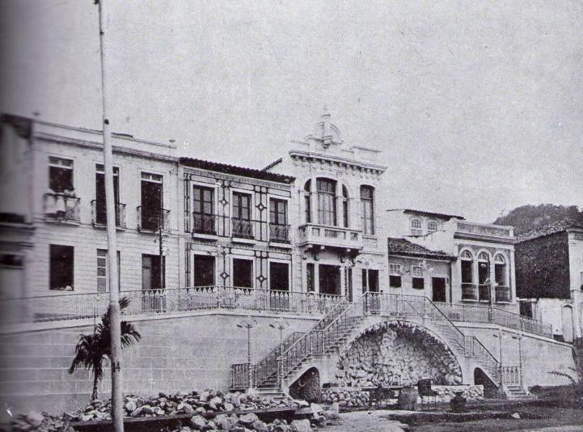

# Resumo

Este artigo trata da remodelação de determinado espaço público de
Vitória, Espírito Santo, a Praça João Clímaco, nos primeiros anos do
século XX, evocando representações republicanas, com o firme propósito
de eliminar traços coloniais e atribuir feições modernas ao ambiente
urbano da capital capixaba. O artigo pauta-se em pesquisa baseada no
exame de dados documentais relacionados a relatórios de governos,
periódicos locais, cartografia e iconografia envolvendo período entre a
segunda metade do século XIX e as duas primeiras décadas do século XX. O
recorte temporal refere-se à época de promissor desenvolvimento
econômico no Espírito Santo, propiciando melhoramentos urbanísticos em
Vitória. Este recorte teve também como hipótese o interesse do poder
público pela construção de infraestrutura de embelezamento na cidade,
tendo em vista a visita de D. Pedro II, em 1860, marcando o início do
período estudado, e a inauguração do Parque Moscoso em 1912, marcando o
fim do período, com a materialização da representação de modernidade
almejada. O destaque atribuído à Praça João Clímaco, tornando-se objeto
de interesse deste artigo, advém de vários aspectos. Um deles diz
respeito a sua longevidade, considerando ter sido, sempre, espaço livre
contíguo às principais edificações institucionais religiosas, denotando
também, sua localização privilegiada. Outro aspecto ainda, se refere ao
empreendimento público de transformação da área realizado de modo a
torná-lo representação dos tempos republicanos e a se caracterizar como
ponto de partida para a modernização dos espaços adjacentes. Os
documentos examinados, além de permitir o registro cronológico desta
transformação, demonstram que a Praça João Clímaco se constituiu em
elemento estratégico da modernização capixaba no ensejo da República,
estimulando a instauração de uma urbanidade social e a irradiação de uma
fisionomia moderna em seu entorno. Constatou-se também, no período
estudado, o despertar pelo usufruto do espaço público em Vitória,
associado à contemplação da paisagem.

Palavras-chave: remodelação urbana, espaço público, praça, representação
da República

# Abstract

This article deals with the remodeling of a public space in Vitória,
Espírito Santo, João Clímaco Square in the early XX Century, evoking
republican representations, with the intention of eliminating colonial
traits and to assigning modern features to the urban environment of the
State capital. The article researched on documental data from government
reports, local periodicals, cartography, iconography involving the
period between the second half of the XIX century and the first decades
of the XX century. The time frame refers to the time of a promising
economical development in Espírito Santo, favoring urban improvement in
Vitória. This time frame also had as a hypothesis the government
interest in building the beautification infrastructure in the city, in
view of the Emperor 's visit in 1860, establishing the beginning of the
studied period, and marking the end of the period, the opening of
Moscoso Park in 1912 as the materialization of the desired
modernization. The emphasis given to João Clímaco Square, becoming the
object of interest of this article comes from several aspects. One

of them relates to its longevity, as it has always been an open space
adjacent to major religious institutional buildings, denoting its prime
location. Another aspect refers to the government area transformation
venture, carried out in order to make it representative of republican
times, to characterize as starting point for the modernization of the
adjacent spaces. The documents examined, besides enabling the
chronological register, show that João Clímaco Square has been a
strategic element of Capixaba's modernization during the Republic,
stimulating the establishment of a social urbanity and the spread of a
modern face in its surroundings. During the studied period it was also
observed the awakening for the use of public space in Vitória,
associated to the contemplation of the landscape.

Keywords: urban remodeling, public space, square, republican
representation

# Introdução

A construção de infraestrutura visando o saneamento e o embelezamento de
cidades brasileiras, sobretudo das capitais, tornou-se ação
empreendedora do poder público, durante o século XIX, alcançando o ápice
no advento da República. Vitória, cidade que remete ao período colonial
brasileiro, até a segunda metade do século XIX não havia experimentado
avanço econômico expressivo, o que repercutia em suas modestas
proporções urbanas. Nesta ocasião, a situação começou a se transformar a
partir da imigração europeia, que contribuiu para a ocupação do
território, para a ascensão econômica vinculada à cultura cafeeira,
repercutindo em melhoramentos urbanos na capital. Até meados do século
XX, o Espírito Santo manteve sua economia pautada na agro exportação,
enquanto as obras públicas na capital ocorriam em articulação com a
cotação do café no mercado internacional.

Neste contexto, este artigo busca tratar de uma das primeiras obras de
remodelação urbanística realizada em Vitória, em ambiente emblemático,
tendo em vista sua localização diante do Convento Jesuítico de São
Tiago, edificação colonial, que passou na República, a abrigar o Palácio
do Governo, recebendo ornamentos ecletizantes. Trata-se do Largo da
Misericórdia, transformado na Praça João Clímaco. Este espaço emergiu a
partir de pesquisa documental que buscou compreender a relação da
população de Vitória com a contemplação da paisagem e em que medida o
embelezamento urbano teria contribuído para a construção deste
interesse. Ao longo da pesquisa foram examinados relatórios de governo,
periódicos locais, cartografia e iconografia de 1860 a 1916,
correspondendo respectivamente, ao ano da visita do imperador D. Pedro
II, na expectativa da realização de obras para recebê-lo e alguns anos
depois da construção do Parque Moscoso, elemento decisivo da
modernização de Vitória, na expectativa de abranger relatos sobre a
utilização do mesmo.

Diante dos exemplares que emergiram da pesquisa, a transformação do
Largo da Misericórdia na Praça João Clímaco, chamou a atenção
inicialmente, por tratar-se, como indicado, de espaço livre público
marcante na configuração colonial de Vitória e fronteiriço à edificação
mais importante da cidade. O aprofundamento do estudo demonstrou que sua
transformação gerou efeito irradiador, tornando-se juntamente ao seu
entorno o ambiente mais representativo da República nos primeiros anos
do século XX.

O artigo trata então da remodelação da Praça João Clímaco, apresentando
a seguir, aspectos da paisagem remodelada, evolução das práticas da
população sobre este espaço e o novo cenário do poder a partir de
representações da recente República.

# De Largo da Misericórdia à Praça João Clímaco: por uma paisagem remodelada

O espaço público em questão recebeu inúmeras denominações, desde Largo
do Palácio e Largo da Misericórdia, em referência aos principais
edifícios do entorno, passando posteriormente a Largo Afonso Brás (Fig.
1), jesuíta construtor do convento (DERENZI, 1995, p. 82), e em 1883,
para Largo do Dr. João Clímaco, padre, advogado e ex-deputado (O
ESPÍRITO SANTENSE, 1883).

> 
>
> 
>
> Figura 1: Planta da Vila da Victória datada de 1767 de autoria do
> Engenheiro José Antônio Caldas, com intervenção da autora. Fonte:
> Biblioteca Nacional. Acessível em:
> [[http://www.bn.br/portal/]{.ul}.](http://www.bn.br/portal/)

A formação desse espaço remonta à presença da Companhia de Jesus em solo
capixaba, em meados do século XVI, a partir da implantação do conjunto
Jesuítico de São Tiago no platô da cidade Alta, sítio a partir do qual
se desenvolveu o núcleo urbano de Vitória (SANTOS, 2001, p. 76). Segundo
Souza (2000) o Largo Afonso Brás, que correspondia ao espaço à frente da
sede da Companhia de Jesus, adquiriu o aspecto formal que a implantação
dos primeiros templos religiosos determinou.

O largo colonial contava com dois edifícios principais, que se
defrontavam um em cada extremidade: o Colégio e Residência de São Tiago
e a Igreja da Misericórdia, sendo os outros lados formados por casario
contínuo, numa conformação típica da colonização portuguesa. Devido à
sua privilegiada posição na urbe, o antigo largo também mantinha
estreito contato, por meio de ruas estreitas e tortuosas, com outras
edificações religiosas da vizinhança imediata, como a Igreja de São
Gonçalo Garcia, a Capela Santa Luzia e a Igreja Matriz de Nossa Senhora
da Vitória (Fig. 1).

O templo jesuítico recebeu durante o intervalo de décadas para sua
efetiva conclusão uma arquitetura imponente, especialmente se comparada
às demais existentes de aspecto bastante simplório. Este juntamente com
outros edifícios religiosos mencionados, além do pelourinho e da Casa de
Câmara e Cadeia, que complementavam a configuração do entorno do largo,
contribuíram para a formação do papel que o espaço viria a desempenhar
ao longo de sua existência, "tanto no plano real quanto simbólico -- de
centro de irradiação dos poderes político-administrativo e religioso da
capitania" (PRADO, 2002, p. 158).

Em 1848 consta em relatório oficial, início de obras de "aformoseamento
da praça em frente ao palacio, e á construcção de uma rampa em logar das
antigas escadas" (ESPÍRITO SANTO, 1848, p. 40) e em 1872, solicitação de
auxílio à câmara para calçamento no Largo da Misericórdia (ESPÍRITO
SANTO, 1872). No entanto, a Figura 2, de autoria de André Carloni, que
retrata o espaço no ano de 1906, ilustra a existência de um largo com
características formais ainda de origem colonial.

> 
>
> Figura 2: Cidade Alta - Antigo Largo Afonso Brás em 1906. Ao fundo o
> antigo colégio de São Tiago, já Palácio do Governo, com seus aspecto
> colonial. À esquerda o conjunto de casas que viriam a ser demolidas
> para ampliação e ajardinamento da Praça João Climaco. Autor: André
> Carloni. Fonte: Elmo Elton. Acessível em:
> [[http://legado.vitoria.es.gov.br/baiadevitoria/]{.ul}.](http://legado.vitoria.es.gov.br/baiadevitoria/)
> Acesso: 04-05-2011.

Em 1907, "\[\...\] com o intuito de sanificar o logar e de fazer
desapparecer da Praça Dr. João Clímaco, fronteira ao Palacio do governo,
o quarteirão de casas velhas quasi em ruinas, que tão mau aspecto dão á
nossa Capital" (ESPÍRITO SANTO, 1907, p.9) foi decretada a
desapropriação por utilidade pública do quarteirão ali localizado,
visando a construção de um jardim público. Na administração de Jeronymo
Monteiro, em

1908, levou-se a cabo a demolição dessas edificações, quando o "largo
sofreu transformação radical em planta e perfil. Para aplainá-la (sic)
construiu-se muro de arrimo, coroado por balaustrada, fronteiro a atual
rua Nestor Gomes que não é outra senão o final da antiga rua Professor
Santos Pinto" (DERENZI, 1995, p. 81), conforme a Figura 3.

> 
>
> 
>
> Figura 3: Trecho do Mapa de Vitória datado de 1910. Detalhe para a
> área constituída pela Praça João Clímaco. Mapa reproduzido pela
> Coordenação de Revitalização Urbana -- SEDEC/GPU/CRU -- Prefeitura
> Municipal de Vitória, com base no mapa original pertencente ao acervo
> do Arquivo Histórico do Exército. Fonte: PMV- SEDEC/GPU/CRU.

O partido urbanístico adotado possibilitou a criação de um "terraço"
(DERENZI, 1995), garantindo a abertura de novas perspectivas ainda não
exploradas daquele ponto de vista. Depois de nivelado, o espaço
tornou-se "\[\...\] um largo ajardinado, onde se vê um bello pavilhão no
centro e uma fonte luminosa, \[\...\]" (O ESTADO DO ESPIRITO SANTO,
1909). O pavilhão mencionado correspondia ao coreto de formato hexagonal
assentado sob base de concreto, ladeado por balaustrada em madeira e
encimado por cobertura adornada, cujo acesso se dava por pequena
passarela protegida por guarda corpo de concreto imitando troncos de
árvore, conforme modelo à época em voga ao gosto romântico inglês (Fig.
4).

O espaço criado sobre área resultante da demolição do casario existente
ora

desapropriado não só ampliava, bem como modificava sobremaneira o
traçado do largo outrora colonial, desafogando-o em uma de suas faces. A
remodelação e inclusão do jardim, constituído por canteiros orgânicos
dispostos de maneira simétrica, vinha ao encontro da tendência já
observada desde a metade do século XIX de "multiplicação de jardins
residenciais, praças, parques e iniciativas de arborização viária em
diversos centros urbanos pelo Brasil afora" (HETZEL e NEGREIROS, 2011,
p. 57).

Anteriormente iluminado a querosene e posteriormente a gás, o espaço
recebeu, em 1909, pouco tempo após sua remodelação, iluminação elétrica.
Ainda durante a administração de Monteiro são instalados dezesseis
"bancos de ferro com encostos e assentos de madeira" (DIÁRIO DA MANHÃ,
1909) que convidavam à permanência. Todos estes artifícios iriam induzir
novas formas de ocupação do espaço.

> 
>
> Figura 4: Praça João Clímaco ajardinada em 1910. À esquerda chafariz
> localizado no interior da praça e à direita, o coreto. Ao fundo, muro
> de arrimo de logradouro de acesso ao casario elevado, localizado em
> frente a praça. Autor desconhecido. Fonte: Biblioteca Central - UFES.
> Disponível em:
> [[http://legado.vitoria.es.gov.br/baiadevitoria/]{.ul}.](http://legado.vitoria.es.gov.br/baiadevitoria/)
> Acesso: 04-05-2011

# Práticas no Espaço e População Usuária

O antigo largo participou ativamente das práticas cotidianas da
população vitoriense atuando como palco principal de atividades de
diversas naturezas, em especial as vinculadas aos principais agentes
modeladores das cidades coloniais brasileiras: a Igreja e o Estado, de
acordo com Souza e Ribeiro (2009). A presença de ambos, coexistindo nas
edificações que lhe faziam frente e entorno foi fundamental para
garantir sua utilização como cenário singularmente dotado da capacidade
em agregar desde festividades religiosas às cívicas, além de regozijos
populares que geralmente as acompanhavam. Era também constante destino
de procissões religiosas, bem como de folguedos infantis, sendo, durante
muito tempo, local onde os habitantes buscavam "amparo físico e
espiritual" (PRADO, 2002, p. 159). O espaço neste sentido permitia, até
meados da primeira década do século XX, o convívio de diferentes camadas
sociais, na medida em que as práticas que nele ocorriam eram destinadas
à população de um modo geral.

A remodelação do espaço acompanharia a introdução de outras formas de
apropriação

do mesmo, em especial as que remetiam ao novo modo de vida e de
socialização que vinha sendo adotado no território brasileiro face às
recentes expectativas de civilidade e de modernidade advindos com a
República.

O periódico Diário da Manhã (1908, 1909 e 1911, nº 59) ilustra a
introdução da prática do corso em dias pré-estabelecidos, nos quais se
observava maior concorrência de frequentadores quando da participação de
bandas de música no local que eram comumente anunciadas. A alusão ao Rio
de Janeiro e a tudo que lhe dizia respeito como sinônimo de progresso
teria influência direta não apenas na produção de espaços urbanos, bem
como nas questões referentes ao comportamento, aos costumes, sendo
também percebida no modo como a sociedade vitoriense passou a se
relacionar entre si e a relacionar-se com o meio. Nestes moldes,
observa-se o incentivo a uma elitização do espaço. Com frequência
noticiava-se a elevada concorrência do espaço por famílias e por pessoas
mais abastadas, especialmente do sexo feminino, que conforme Araújo
(1993) têm as formas de socialização ampliadas e diversificadas à medida
que se intensificava o processo de urbanização e desenvolvimento
socioeconômico das cidades brasileiras.

As características peculiares de constituição do espaço lhe conferiram
um caráter cívico e religioso não atribuído a nenhum outro da cidade até
aquele momento. A partir de então, o espaço passou a ser mencionado como
"\[\...\] um ponto aprasivel, de excellente recreio \[\...\]" (O ESTADO
DO ESPIRITO SANTO, 1909). De fato ele já se destacava como palco
privilegiado do convívio social dos moradores de Vitória; no entanto, as
práticas diferem-se das originais e estas passam a coexistir.

# O cenário do poder republicano e os novos olhares sobre a paisagem remodelada

O escopo de melhoramentos promovido no início da administração de
Jeronymo Monteiro que se estendia da instalação e melhoria dos sistemas
de infraestrutura às intervenções de caráter estético-salubrista
empreendidas em vários pontos de Vitória, incluindo a Praça João
Clímaco, foi responsável por introduzir novos ares de civilidade à
cidade.

Com o advento da República, a imagem demasiadamente ligada à autoridade
religiosa impressa na Praça João Clímaco desde sua gênese mostrou-se
inadequada a este novo ideário. Nesta perspectiva, considerando o papel
preponderante deste espaço na urbe é compreensível que o mesmo tenha
sido entendido como ponto estratégico para a legitimação e irradiação do
imaginário republicano, tornando-se um dos maiores alvos das
intervenções realizadas na gestão de Monteiro.

A alteração de seu aspecto colonial conferiu-lhe uma imagem mais
condizente com o espírito republicano e o ensejo do progresso da elite
capixaba. Como seria de se imaginar, as intervenções empreendidas no
antigo largo repercutiram na paisagem e não passaram despercebidas pelos
moradores locais, conforme registros no Diário da Manhã (1910). Por
outro lado, em que pese à ação positiva atribuída aos melhoramentos, as
novas feições adquiridas pela Praça João Clímaco clamavam por uma
modificação em seu entorno, considerado destoante aos olhos da população
(O ESTADO DO ESPIRITO SANTO, 1909).

Dessa maneira, a remodelação das edificações localizadas em seu entorno,
dotadas do despojamento e da simplicidade característicos das
construções coloniais constituiu-se como a segunda etapa da estratégia
de alteração do aspecto indesejado do espaço,

considerado inconvenientemente ligado ao passado.

Com a condução de Monteiro, entre os anos de 1908 e 1912,
providenciou-se a contratação de projetos direcionados às edificações
contíguas à praça, que tinham como principal objetivo a remodelação do
patrimônio edilício de propriedade do Governo de acordo com a estética
arquitetônica da época. Estes propunham uma nova feição aos edifícios
existentes, num esforço claro em apagar as marcas de um passado de
domínio português e em criar ícones capazes de legitimar o regime
republicano e a imagem de uma Vitória civilizada.

Dentre as intervenções realizadas têm-se as melhorias empreendidas no
'paredão', que correspondia ao muro de arrimo da rua de acesso às
edificações situadas em cota elevada, localizada ao lado do Palácio do
Governo e em frente à Praça João Clímaco. Remodelado aos padrões da
estética urbana instaurada, o muro recebeu escadaria com gradil
metálico, acomodada sob uma gruta de caráter romântico (Fig. 5).

> 
>
> Figura 5: Muro da Praça João Clímaco, Vitória, 1912. Aos fundos,
> edificações que já adquiriram tratamento eclético. Fonte: EPÍRITO
> SANTO,\..., p.172. BCUFES/ Coleção Mário Aristides Freire. Acessível
> em:
> [[http://web2.ufes.br/arteeducadores/projeto/imagens.html]{.ul}.](http://web2.ufes.br/arteeducadores/projeto/imagens.html)
> Acesso em: 20/01/2014.

Em sequência, se juntaram a esta intervenção, as obras de remodelação do
Palácio do Governo, que de acordo com Jeronymo Monteiro não podia
continuar "\[\...\] com a sua vetusca feição conventual, em contraste
com as linhas de architectura dos edifícios novos e em flagrante
infracção das posturas municipaes. \[\...\]" (ESPÍRITO SANTO, 1913, p.
243), conforme a Figura 6. Assim, o edifício recebeu tratamento
ecletizante, de maneira a obter maior suntuosidade, culminando na
transferência de sua entrada principal, antes orientada para a praça,
voltando-se para a escadaria em frente ao cais do Imperador (Fig. 7). No
mesmo contrato foi incluída a reconstrução dessa escadaria, agora
fronteiriça à entrada do Palácio, conforme relatório de governo: "em
substituição á antiga escadaria, recta e simples, foi construida alli
uma nova, de bella perspectiva, capaz de fazer honra a qualquer centro
civilisado" (ESPÍRITO SANTO, 1913, p. 243).

> 
>
> Figura 6: Trecho da Praça João Clímaco em primeiro plano e atrás,
> antigo Colégio de São Tiago, sede do governo e a Igreja São Tiago, em
> 1908, antes da reforma com acesso pela Praça João Clímaco. Fonte:
> TATAGIBA, José. A história das primeiras ruas, ladeiras praças e
> monumentos históricos -- Vitória Cidade Presépio. Vitória: 2008, p.
>
> 163\. Acessível em[:
> http://web2.ufes.br/arteeducadores/projeto/imagens.html](http://web2.ufes.br/arteeducadores/projeto/imagens.html)
>
> 
>
> Figura 1: Palácio do Governo remodelado e com acesso principal voltado
> para a escadaria reconstruída, 1912. Fonte: EPÍRITO SANTO,\..., p.134.
> BCUFES/ Coleção Mário Aristides Freire. Acessível em:
> [[http://web2.ufes.br/arteeducadores/projeto/imagens.html]{.ul}.](http://web2.ufes.br/arteeducadores/projeto/imagens.html)
> Acesso em: 20/01/2014.

Outras edificações oficiais contribuíram para a imagem renovada do
local, como a Escola Normal, ampliada e com nova roupagem estilística e
a Igreja da Misericórdia (Fig. 8), desapropriada e demolida em 1911
(DIÁRIO DA MANHÃ, 1911, nº77) visando à edificação do novo Congresso
Legislativo (Fig. 9).

> 
>
> Figura 8: À frente Igreja da Misericórdia. Festividade cívica na
> praça, 1910. Fonte: Biblioteca Central
> ([http://legado.vitoria.es.gov.br/baiadevitoria/]{.ul}). Acesso:
> 04-05-2011
>
> 
>
> Figura 2: À frente o novo Congresso estadual, construído no local da
> antiga Igreja da Misericórdia, 1912. Fonte: ESPÍRITO SANTO, 1913, p.
> 446.

Com efeito, as mudanças empreendidas pelo Estado para modernização de
seu patrimônio edilício foram lentamente acompanhadas pelas edificações
particulares localizadas no entorno da praça, iniciando o processo de
transformação do aspecto simplório das construções coloniais da
arquitetura civil privada existente.

# Considerações finais

Este conjunto de iniciativas embelezadoras1 realizadas pelo Estado tinha
em comum a "expressão arquitetônica da negação do mundo luso-brasileiro,
\[\...\], e sua substituição pelo ecletismo europeu" (ESPÍRITO SANTO,
2009, p.515). O ensejo em construir uma imagem modernizada da urbe, a
partir da renovação de sua paisagem foi evidenciado por Jeronymo
Monteiro na 'Exposição sobre os negócios do Estado no quadriênio de 1908
a 1912' (ESPÍRITO SANTO, 1913). Prado (2002) desenvolve este pensamento
afirmando que "necessário se fazia construir ícones republicanos
representando a liberdade, fruto do novo modelo de governo frente ao
passado de subjugação a Portugal" (PRADO, 2002, p.164). Para a autora a
descaracterização e/ou demolição de antigos templos religiosos para
remodelação do Palácio do Governo e construção de uma nova sede para o
Congresso Legislativo, respectivamente, representavam o enfraquecimento
dos signos tradicionais de poder "frente às mudanças de valores
ideológicos, morais e estéticos que impuseram novos referenciais
\[\...\]" (PRADO, 2002, p. 148).

A estratégia adotada pelo Estado de imposição destas duas edificações na
Praça João Clímaco, conformando praticamente um paço, fez com que este
trecho da cidade passasse a "concentrar toda a arquitetura
representativa do Estado, que detinha o poder simbólico projetado pela
sociedade, estrutura essa destinada a preservar a ordem" (PRADO, 2002,
p.164).

O esforço conjunto de remodelação da paisagem local teve diferenciadas
repercussões no seio da sociedade. Grande parte dos relatos encontrados
acerca da Praça João Clímaco e do seu entorno correspondia a menções de
embevecimento face às alterações realizadas que resultaram em uma
profunda transformação do espaço, entendida como algo belo e grandioso.
Nestes casos, combinam-se a percepção burguesa no que tange às
realizações do Estado e o senso da ordem civilizada do período inicial
republicano (DIÁRIO DA MANHÃ, 1912 e 1916). No entanto, também foram
observadas abordagens negativas, em especial, demonstrações de pesar
quanto à perda do acervo patrimonial anteriormente edificado, denotando
uma sensação de pertencimento da população quanto aos mesmos (DIÁRIO DA
MANHÃ, 1911, nº 80, DIÁRIO DA MANHÃ, 1911, nº86 e DERENZI, 1995).

Deste modo, as ações de modernização da paisagem local foram encobrindo
com sucesso os vestígios do Brasil - colônia ainda muito presentes no
tecido da praça no início do século XX, dotando-a de uma aparência mais
'moderna'. As melhorias recebidas no antigo largo colonial somadas às
remodelações realizadas nas edificações contíguas ao mesmo atuaram na
construção de um cenário, que cumpriu o objetivo de legitimar o
imaginário republicano, na medida em que apagou os vestígios físicos da
paisagem colonial existente.

# Referências

> ARAÚJO, R. M. B. de. *A vocação do prazer: a cidade e a família no Rio
> de Janeiro republicano*. Rio de Janeiro: Rocco, 1993.
>
> DERENZI, L. S. *Biografia de uma Ilha*. Vitória: PMV/Secretaria
> Municipal de Cultura e Turismo, 1995.
>
> *DIÁRIO DA MANHÃ*, Vitória: 16/071908 nº 260.
>
> 1 A remodelação das fachadas do Palácio, Escola Normal, muro em frente
> à praça e escadaria de acesso ao cais são de autoria de Justin
> Norbert, e o projeto do Congresso Legislativo, de André Carloni.
>
> *DIÁRIO DA MANHÃ*, Vitória: 17/01/1909 nº13. *DIÁRIO DA MANHÃ*,
> Vitória: 21/08/1910 nº224. *DIÁRIO DA MANHÃ*, Vitória: 04/03/1911, nº
> 59. *DIÁRIO DA MANHÃ*, Vitória: 22/03/1911 nº 77. *DIÁRIO DA MANHÃ*,
> Vitória: 25/03/1911 nº 80. *DIÁRIO DA MANHÃ*, Vitória: 31/03/1911
> nº86. *DIÁRIO DA MANHÃ*, Vitória: 02/06/1912 nº 148. *DIÁRIO DA
> MANHÃ*, Vitória: 12/08/1916, nº302.

ESPÍRITO SANTO. Secretaria de Estado da Cultura. Conselho Estadual de
Cultura.

> *Patrimônio Cultural do Espírito Santo.* Vitória: SECULT, 2009.

ESPÍRITO SANTO, Presidente, 1848 *Relatório\...* (Luiz Pedreira de Couto
Ferraz), Rio de Janeiro, Typographia do Diário de N. S. Vianna.

ESPÍRITO SANTO, Presidente, 1872 *Relatório\...* (Francisco Ferreira
Coelho), Vitória, Typographia do Estado.

ESPÍRITO SANTO, Presidente, 1907 *Mensagem\...* (Henrique da Silva
Coutinho), Vitória, Papelaria e Typographia Nelson Costa.

ESPÍRITO SANTO, Presidente, 1909 *Mensagem\...* (Jeronymo de Souza
Monteiro), Vitória, Imprensa Oficial.

> ESPÍRITO SANTO, Presidente, 1913 (Jeronymo de Souza Monteiro).
> *Exposição sobre os negócios do Estado no quadriênio de 1908 a 1912*.
> Vitória, Papelaria e Typografia Nelson Costa.
>
> HETZEL, Bia (Org.); NEGREIROS, Silvia (Org.). *Glaziou e as raízes do
> paisagismo no Brasil*. Rio de Janeiro: Manati, 2011.
>
> *O ESPÍRITO-SANTENSE*, Vitória: 1883, nº 69.
>
> *O ESTADO DO ESPÍRITO SANTO*, Vitória: 23/09/1909.
>
> PRADO, M. M. *A modernidade e o seu retrato: imagens e representações
> das transformações da paisagem urbana de Vitória (ES) - 1890/1950*.
> (Dissertação de Mestrado) Salvador, PPGAU/FA/UFBA, 2002.
>
> SANTOS, P. F. *Formação de Cidades no Brasil Colonial*. Rio de
> Janeiro: Editora UFRJ, 2001.
>
> SOUZA, L. P.; RIBEIRO, N. P. (Org.). *Urbanismo colonial: Vilas e
> cidades de matriz portuguesa.* Rio de Janeiro: CTRL C., 2009.

SOUZA, L. P. de. Sagrado estratégia e espaço: O sagrado como Estratégia
da Companhia de Jesus na construção do espaço urbano da Vila de Nossa
Senhora da Vitória. In *Anais do Seminário de História da Cidade e do
Urbanismo*, v. 6, n.3,
[[http://www.anpur.org.br/revista/rbeur/index.php/shcu/article/viewFile/833/808]{.ul}](http://www.anpur.org.br/revista/rbeur/index.php/shcu/article/viewFile/833/808),
2000.
