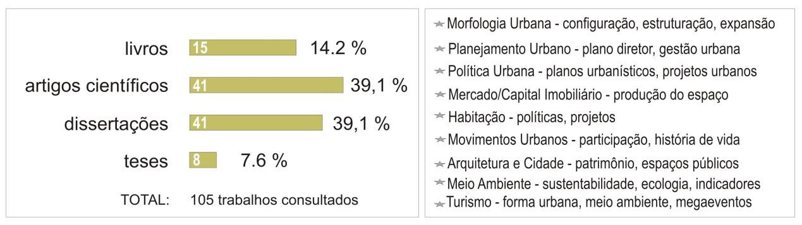
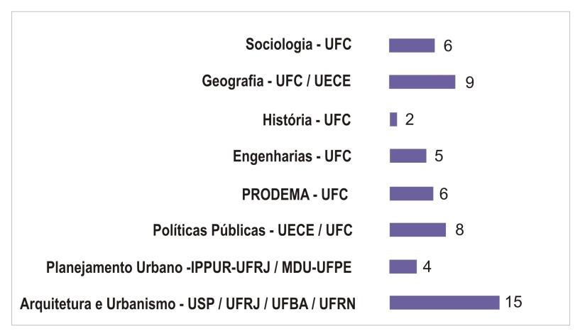

# Resumo

Este trabalho tem por objetivo refletir acerca do atual estágio da
historiografia sobre o urbanismo em Fortaleza, partindo de um balanço
panorâmico do já amplo catálogo dos estudos urbanos sobre a cidade.
Fundamentalmente centrado na análise de textos técnicos e científicos,
este levantamento busca identificar os marcos e referências ligados à
constituição de uma história da prática urbanística local, e que
aparecem com a contribuição de diferentes áreas de conhecimento em um
quadro de pesquisas marcado por um forte historicismo. Consideramos aqui
a hipótese de que um dos maiores entraves ao desenvolvimento de uma
cultura urbanística local encontra-se exatamente na ausência de reflexão
sobre as ações passadas de condutas técnico- administrativas cujos
elementos constitutivos ainda não foram completamente elucidados e muito
menos codificados. Ao reivindicar a urgência do amadurecimento de uma
história do urbanismo em Fortaleza, este artigo destaca algumas questões
epistemológicas que resistem como hesitações na investigação
historiográfica desta disciplina.

**Palavras-chave**: história do urbanismo, prática urbanística,
Fortaleza-Ce

# Abstract

This paper aims to reflect upon the current stage of Fortaleza urbanism
historiography by drawing up a wide balance of the already extensive
catalogue of the city urban studies. Mainly focused on the analysis of
scientific and technical texts, this survey tries to identify landmarks
and references linked to the constitution of a local urbanistic practice
history. These practices appear with the contribution of different
knowledge areas in a framework of research characterized by a strong
historicism. We suppose that one of the biggest barriers to the
development of a local urbanistic culture lies precisely in the lack of
reflection about the previous actions of technical and administrative
practices whose constituent elements have not been fully elucidated or
codified. By claiming the urgency of the maturation of a history of
urbanism Fortaleza, this article highlights some epistemological
questions who resist as hesitation for historiographical research in
this discipline.

**Keywords**: history of urbanism, urbanistic practice, Fortaleza-Brazil

# Introdução

Com bastante frequência, e sempre com grande estranheza, um tanto de
profissionais do urbano reclamam em voz alta que cidades como Fortaleza
não têm urbanismo, sob a alegação de que se desenvolvem no caos da
improvisação de projetos desconectados. Tal conjectura equivale a
afirmar que lá também não existe uma história do urbanismo; isso porque
historicizar o urbanismo de uma cidade sem urbanismo constituiria uma
perda de tempo, um conhecimento irrelevante, não desvendando outra
verdade que não seja: a cidade não tem urbanismo.

Assim como outras grandes cidades brasileiras que, a partir da segunda
metade do século passado, ganharam expressão urbana pelo crescimento
vertiginoso e desordenado, a capital cearense não é um centro gerador de
estudos e de novas práticas do urbanismo, se notabilizando mais pela
ausência de concepção de utopias, experimentações ou inovações e,
sobretudo, pela importação quase sempre oblíqua, tardia e desinformada
de modelos propostos em centros urbanos mais influentes do país e do
exterior. Diante dessa realidade, é de se duvidar se há ali, de fato,
alguma cultura urbanística digna de registro historiográfico.

Mas decididamente todo fenômeno de urbanização, por subordinado e
irrefletido que seja, traz em si algum suporte teórico e prático que
processa representações, ferramentas e meios de ação para a configuração
material do lugar. Sechi (2006) lembra que teoria e prática do urbanismo
são plurais: elas são aquelas do técnico que estuda e propõe, do
político eleito que decide, do administrador que controla, do construtor
que realiza; enfim, dos sujeitos que as promovem, de suas intenções, das
técnicas utilizadas, dos resultados esperados, dos êxitos obtidos, dos
problemas que induzem a novas transformações.

O conjunto dessas ações -- que aqui chamamos de prática urbanística --,
é resultado das relações dialéticas complexas entre os grupos sociais e
o espaço que eles ocupam, pois como adverte Halbwachs, o espaço
urbanizado é a materialidade que ratifica as relações sociais. Para
evidenciar o conteúdo dessa singularidade, o historiador do urbanismo
talvez deva fazer como o imperador mongol que, diante das descrições
muito parecidas que Marco Polo fazia de todas as cidades, procurava
"\...diferenciá-las \[\...\] desmontando a cidade pedaço por pedaço,
reconstruindo-a de outra maneira, substituindo ingredientes,
deslocando-os, invertendo-os" (CALVINO, 1990, p.43).

Este trabalho tem por objetivo refletir acerca do atual estágio da
historiografia sobre o urbanismo em Fortaleza, partindo de um exame do
já amplo catálogo dos estudos urbanos sobre a cidade. Fundamentalmente
centrado na análise de textos acadêmicos, este levantamento tem como
base os marcos e referências ligados à constituição de uma disciplina
que ainda não possui um estatuto definitivo, e que aparecem com a
contribuição de diferentes áreas de conhecimento em um quadro de
pesquisas marcado por um forte historicismo.

Consideramos aqui a hipótese de que um dos maiores entraves ao
desenvolvimento de uma cultura urbanística local encontra-se exatamente
na ausência de reflexão sobre as ações passadas de condutas
técnico-administrativas cujos elementos constitutivos ainda não foram
completamente elucidados e muito menos codificados. Ao reivindicar a
urgência do amadurecimento de uma história do urbanismo em Fortaleza,
este artigo destaca algumas questões epistemológicas que resistem como
hesitações na investigação historiográfica desta disciplina.

# Em referência ao balanço dos estudos urbanos sobre Fortaleza

De início, é preciso enfatizar que o balanço efetivado abrangeu um
conjunto de estudos técnico-científicos já divulgados e que, mesmo
originado em áreas distintas de conhecimento, trazem questões de
interesse para uma história do urbanismo em Fortaleza, ainda que
tratadas em diferentes níveis de profundidade. Esta base de análise
revela não apenas os percursos trilhados como denota o significativo
numérico dos estudos urbanos sobre a capital cearense. Uma primeira
constatação é o caráter fragmentado desta produção e que a maior parte
das contribuições -- principalmente sob a forma de artigos, dissertações
e teses -- ser bastante recente. Ao que tudo indica, estamos diante de
um campo de estudo ainda em construção, com tudo o que isto implica em
termos de lacunas e indefinições.

Preliminarmente encontramos dificuldade em precisar qual o conteúdo
intrínseco a uma história do urbanismo, que em muito se emaranha com a
noção de história urbana ou da cidade. Acompanhamos a perspectiva
daqueles que afirmam ser necessário diferenciar "história urbana" de
"história do urbanismo", mesmo que os dois termos se confundam, tanto na
linguagem comum e nas práticas de ensino como também no direito público.
Para a historiadora italiana D. Calabi (2003), esta confusão se deve, em
certa medida, à existência de um hiato intelectual decorrente das
dificuldades encontradas pelo urbanismo em reconhecer seu âmbito e
especificidades próprias. Há também um hiato institucional na medida em
que com muita frequência a fonte de origem dessas produções seja a
mesma, brotando nas mesmas estruturas institucionais onde se desenvolvem
os trabalhos acadêmicos e programas de pesquisa e, sendo divulgadas nos
mesmos colóquios, seminários e conferências.

Em termos formais, a história urbana pode ser entendida como um campo do
conhecimento, não como uma disciplina isolada, na acepção comum do termo
\"disciplina\". Um campo em que convergem historiadores de diferentes
áreas de conhecimento, e não uma forma de conhecimento em si mesmo. Já a
história do urbanismo esteve, por muito tempo, inserida no âmbito da
história da arte e/ou da arquitetura com pouca ou nenhuma ênfase em
aspectos econômicos, sociais ou políticos, e basicamente
referenciando-se na dimensão estética e formal, próxima ao âmbito da
história da produção cultural (LEMAS, 2009).

Mais recentemente, os historiadores do urbanismo ampliaram seu objeto de
estudo, abarcando não apenas os modos de ação do poder público mas
também dos setores privados, obrigando-se, portanto, a enfrentar novas
escolhas teóricas e metodológicas. E mais ainda, parece que hoje não é
possível desenvolver uma reflexão sobre ferramentas conceituais do
urbanismo sem fazer história, fato que amplia as relações da ação
urbanística com as particularidades de uma cidade (PINSON, 2003; SECHI,
2006, CALABI, 2012).

# Dos registros românticos à contribuição dos programas de pós-graduação

Os relatos que interessam a uma historiografia do urbanismo em Fortaleza
começam muito tardiamente. Até a década de 1970 observa-se tão somente a
composição intermitente de pequenos textos de caráter descritivo e
memorialista, escritos por intelectuais, cronistas e amantes da cidade,
sendo o caso dos esforços do Barão de Studart, Thomas Pompeu de Souza
Sobrinho, Carlos Studart Filho e Raimundo Girão. Deste período, ganha
destaque uma linha de trabalho firmada a partir da Revista do Instituto
do Ceará, que publica matéria sobre a formação do território e origem
das

cidades cearenses e sobre os primeiros planos para Fortaleza. A
contribuição ao urbanismo desses escritos depende muito mais da
habilidade do leitor de separar as representações emotivas da cidade dos
rápidos registros sobre estratégias políticas e ação instrumental
orientada para a transformação do espaço urbano.

A partir dos anos 1980, surge o trabalho pioneiro de Liberal de Castro.
Arquiteto atuante e fundador-professor do Curso de Arquitetura e
Urbanismo da Universidade Federal do Ceará, este estudioso começa a
preencher um vazio e dá conteúdo à compreensão da evolução urbana de
Fortaleza, através de sua já clássica análise da morfologia da cidade em
que pondera sobre as origens e características físicas do traçado,
articulando tais atributos ao papel dos diversos agentes produtores do
espaço. Ainda nesta década, surgem os primeiros artigos e pesquisas
acadêmicos, num momento em que este tipo de produção era bastante raro.
Nesses trabalhos, a prática urbanística, quando comentada, o é apenas de
modo pontual e secundariamente, não merecendo maior atenção dos
pesquisadores, que centram seus esforços na compreensão de fenômenos
emergentes como a expansão urbana, a segregação socioespacial ou o
crescente papel do turismo não organização material do espaço.

Aliás, esta preocupação em caracterizar a origem e evolução dos novos
eventos urbanos continuará a ser o destaque do interesse investigativo
dos trabalhos científicos que se multiplicam no início do novo século,
quando se passa a explorar objetos diversos relacionados a momentos e
processos distintos da urbanização local. O grosso da produção se detém
em um período de tempo mais recente, compreendo as duas ou três últimas
décadas, e é realizada por profissionais egressos de diferentes
programas de pós-graduação; primeiramente em Geografia, Sociologia e
História, e em seguida em Arquitetura e Urbanismo.

> Tabela 1- Balanço da produção técnico-acadêmica e relação dos
> principais eixos temáticos. Fonte: levantamento do autor, jan. 2014.
>
> 
>
> Tabela 2- Relação quantitativa de dissertações e teses elaboradas em
> programas de pós-graduação que trataram de temas de interesse para uma
> história do urbanismo de Fortaleza. Fonte: levantamento do autor, jan.
> 2014.
>
> 

Toda esta produção abarca um leque diversificado de eixos temáticos que
revela um ponto de inflexão na organização da pesquisa sobre a cidade e
o urbano, na medida em que as análises se ajustam aos objetivos mais
específicos das áreas de concentração de cada programa de pós-graduação,
demarcando campos e cruzamentos teórico-metodológicos coerentes com cada
uma dessas áreas. Em sua maioria, esses trabalhos fazem estudos de caso
da cidade de Fortaleza -- ou de parte dela, quer como território
político-administrativo, quer como subsistema técnico --, e cujos
processos investigativos evidenciam diferentes estilos narrativos,
estratégias expositivas e modalidades de discurso que tencionam cada um
a seu modo as coordenadas conceituais sobre o urbano.

Mas qual é efetivamente o aporte desses trabalhos para uma história do
urbanismo de Fortaleza? Em um comentário (muito) breve, é possível
afirmar que a contribuição mais significativa da Sociologia se faz pela
escolha metodológica de introduzir os habitantes não como simples
categorias contábeis, agenciados em tipos familiares e séries
estatísticas, mas como atores com direito de intervir sobre a definição
de seu lugar de vida. Já as pesquisas na área da Geografia contribuíram
com o afinamento conceitual de categorias como espaço-tempo, com
destaque para a leitura sobre escalas e singularidades dos territórios
urbanizados.

Em outra medida, a pesquisa sobre o urbano em Fortaleza experimentou uma
notável influência dos programas de pós-graduação interdisciplinares --
com destaque para as temáticas relacionadas ao planejamento urbano, ao
meio ambiente e às políticas públicas --, tratando questões centrais
como "habitação", "turismo" ou "transportes", agora interpeladas sob o
enfoque de conceitos mais amplos -- tais como governança, participação
democrática e sustentabilidade --, embaralhando funções e
responsabilidade do poder público e da sociedade civil. Reconhecemos,
portanto, os préstimos desses esforços que lançam luzes sobre as ações
urbanizadoras e suas mediações com a política, a ciência e a cultura.
Tal condição nos faz lembrar que, por mais autônomo que seja, todo
escrito de história é tributário de um horizonte de expectativa e da
demanda social de uma época.

Todavia essa acumulação e diversificação de trabalhos ainda não foi
suficiente para forjar no plano epistemológico uma coerência temática
nem a provar que a história do urbanismo em Fortaleza se inscreve em um
espaço científico legítimo, com destaque para seu objeto e a
especificidade de seus métodos e conteúdos. Não podemos esquecer que uma
profusão de estudos sobre a cidade e seus territórios não apaga de modo
algum os ingredientes e prerrogativas específicas do urbanismo: a
leitura do espaço e a estimulação do projeto. Ainda falta uma melhor
apreensão dos processos de decisão e das condições de viabilidade e
eficácia das intervenções urbanísticas através de uma instrução mais
aprofundada de seus aspectos econômicos, sociais e políticos.

Guardamos, assim, a impressão de que este progresso do conhecimento no
campo dos estudos urbanos não "alargou" a consciência ou domínio social
para uma história do urbanismo em Fortaleza. Admitimos, não obstante,
que talvez seja preciso recorrer à sociologia do conhecimento para
melhor certificar como um campo de conhecimento acentua outro saber. Ou
seja, como um tipo de conhecimento favorece um ou outro tipo e forma de
conhecimento, constituindo assim um sistema de conhecimento (GURVITCH,
1960). Sempre é possível considerar, como Marx, que existe uma função
social do conhecimento.

# Algumas considerações epistemológicas sob a luz de uma história do urbanismo em Fortaleza

Reivindicar o aperfeiçoamento da história do urbanismo em cidades como
Fortaleza significa, para nós, trazer ao debate questões epistemológicas
sobre as condições de validade do discurso e dos meios de demonstração
dos métodos desta disciplina. Uma epistemologia do urbanismo pode nos
ajudar a melhor compreender que ele se situa entre duas acepções
inseparáveis: a primeira como disciplina positivista que faz uso das
contribuições metodológicas das ciências sociais; a segunda como um modo
de ação do poder público, especializado e planificador.

Daí porque o historiador do urbanismo se vê confrontado não apenas com
um estado de espírito, de mentalidade e de cultura de um grupo social
historicamente e geograficamente situado (FIJALKOW, 2013), mas também
com a ideia de que a cidade seja uma sorte de força ativa, autônoma,
embora se insira como um subsistema que só faz sentido dentro de uma
rede urbana regida pela "urbanização do capital" (JANSEN, 1996). A
seguir, distinguimos três questões que interessam a uma episteme
urbanística, em especial para o caso de Fortaleza.

## Os encargos da periodização histórica e dos modelos de representação

Os historiadores se deparam com um problema constante em seu ofício:
explicar determinadas periodizações históricas, para contextualizar o
objeto de pesquisa. No caso dos profissionais que lidam com o homem no
tempo e no espaço, é preciso ter em mente que uma categorização temporal
é o produto de um lugar social específico, visando um discurso de
normatização para que os eventos passados possam ser inteligíveis às
necessidades atuais. Em outras palavras, é preciso dominar a divisão do
tempo em períodos, em pedaços de tempo submetidos à mesma lei.

Constatamos que ainda falta compreender melhor o processo histórico -- a
ordenação dos acontecimentos segundo uma sequência sistemática, lógica e
objetiva -- do urbanismo em Fortaleza. Esse conhecimento se faz
necessário porque existem hiatos temporais e inúmeras passagens obscuras
(sobretudo ao longo do século XX), em que não se sabe exatamente como a
cidade se comportava em sua conduta técnico- administrativa. Uma
periodização consistente possibilitaria novas reflexões a partir de
novos conjuntos de relações e de proporções, revelando as leis objetivas
internas do seu procedimento e assim facilitando novas sínteses
científicas.

Este tipo de avanço ficou evidente na última década, por exemplo, com o
ressurgimento do interesse de pesquisadores sobre os processos iniciais
de urbanização do Ceará nos séculos XVIII-XIX, cujo conteúdo produziu
uma significativa "mudança" do tempo histórico. Os trabalhos sobre
organização territorial e origem das cidades cearenses, reacendem a
hipótese explicativa de que o passado aparece como fonte privilegiada de
questionamento e compreensão da "norma" histórica em crise, passando por
representar uma estratégia conceitual para a compreensão e reapropriação
do presente.

Qual a melhor periodização para uma história do urbanismo em Fortaleza?
Eis um desafio para os historiadores. Considerando que pode haver tantas
divisões possíveis quanto houver pontos de vista cultural, etnográfico e
ideológico, e mesmo escalas de observação, não há como definir um único
padrão de períodos. Uma primeira possibilidade já foi lançada com
trabalhos que situam as bordas cronológicas do

urbanismo local a partir das datas de elaboração dos planos
urbanísticos. É preciso que se diga, entretanto, que em geral esses
trabalhos ainda são fortemente regidos pelo processo descritivo, atentos
mais às justificativas das proposições ali contidas -- sobretudo no que
se refere à expansão urbana -- do que a uma análise crítica sobre
modelos, conceitos e normas.

Uma alternativa de periodização ainda por ser sintetizada seria a de
considerar a noção de "prática urbanística", cuja abrangência contribui
inclusive para evitar a já alongada polêmica sobre as distinções entre
urbanismo e planejamento urbano1. De fato, esta noção pode ser
surpreendentemente útil, pois em um determinado momento histórico, uma
prática urbanística pode ser descrita em um "modelo de representação"
(GRAWITZ, 1996), capaz de acomodar um conjunto específico de princípios,
métodos, estruturas organizacionais, mecanismos institucionais,
proposições e realizações. Cada modelo sofre a influência de múltiplas
fontes e causas, embora sempre traduza de modo particular as ideias em
circulação, revelando-se plenamente

em função das possibilidades e limitações de uma cidade, ou seja,
somente ganha contornos nítidos quando confrontada às especificidades de
um lugar.

## A disciplina urbanística como sistema social: atores e léxico do urbanismo local

Não restam dúvidas que a história do urbanismo deva refletir sobre a
criação de instrumentos funcionais técnico-administrativos para o
controle da cidade, embora se deva também identificar sua história
institucional e reconhecer sua história social, através do exame das
atividades dos grupos que estão no poder. Calabi (2012) lembra que é
possível inclusive construir uma história cultural do urbanismo, por
intermédio de referências aos promotores e aos destinatários das ideias,
ao debate e às lutas ideológicas.

No caso de Fortaleza, evidenciamos duas relevantes lacunas
historiográficas: ausência de conhecimento sistematizado sobre o papel
das instituições e dos professionais e sobre o léxico produzido na
cultura urbanística local. No primeiro caso, saber como centros de
estudo, órgãos governamentais e de classe influenciam o pensamento e a
ação sobre a cidade poderia esclarecer muitos aspectos ainda
ininteligíveis. Ainda está para ser ampliado o conhecimento sobre o
comportamento dos diferentes atores, quer como agentes contestatórios,
quer como atores-parceiros em ações urbanísticas

específicas2.

Certamente são muitos os obstáculos a este tipo de investigação. No que
se refere às instituições públicas, em especial a Prefeitura de
Fortaleza, os pesquisadores em uníssono reclamam da dificuldade de se
chegar aos documentos oficiais -- os originais de projetos, planos,
termos administrativos --, e de poder avaliar por dentro os hábitos
institucional-administrativos. Ademais, é preciso levar em conta que a
falta de sistematização de acervo, arquivamento e controle documental,
dificulta o resgate da

> 1 Nesta perspectiva, tanto a disposição para o desenho projetivo e o
> caráter monodisciplinar do urbanismo, como as preocupações com as
> diferentes escalas da ocupação do território e o recorte
> interdisciplinar do planejamento urbano, encontram-se inseridos no
> lastro de uma prática urbanística.
>
> 2 É possível citar, por exemplo, o caso da Universidade Federal do
> Ceará. Embora alguns esforços já tenham sido feitos no sentido de
> compreender como a abertura e expansão dos campi afetaram a morfologia
> da cidade, quase nada ainda foi dito sobre a repercussão urbana do
> conhecimento produzido em seus laboratórios de pesquisa ou sobre os
> acordos de cooperação entre universidade e gestores urbanos.

memória urbanística, que não raro se encontra refém do depoimento oral
(e das idiossincrasias) de algum técnico mais dedicado.

No que se refere aos profissionais diretamente ligados ao urbanismo,
também não dispomos ainda de esforços de pesquisa que busquem esclarecer
seu espaço profissional e conceitual; ao contrário do que aconteceu em
outras cidades brasileiras, onde as pesquisas já revelaram a
contribuição de arquitetos, engenheiros e demais profissionais do urbano
(LEME, 1999). Não há investigações sobre a formação profissional local e
regional, e pode-se estender esta afirmação para o campo produtivo, onde
não se explora estudos sobre as relações da produção urbanística
considerando o papel de agentes como os escritórios de arquitetura e
urbanismo, os laboratórios de pesquisa tecnológica, as empresas de
construção civil, etc. Resta-nos, portanto, elucidar e trazer ao debate
questões como: o tempo da criação, as identidades profissionais, as
especialidades e competências, a cultura organizacional e as ambições
políticas.

Complementarmente, não podemos esquecer que os textos e o léxico
produzidos em uma prática urbanística refletem não apenas os
particularismos da cidade, mas também as mutações que ela sofre no
tempo. Como se sabe os conceitos tiram sua significação do contexto de
onde eles saem; eles podem mudar de sentido de acordo com a maneira como
eles são considerados (FAUCHEUR, 1999). Daí a importância de se
identificar estes escritos, apesar da fluidez das significações. Cada
prática urbanística desenvolve um léxico que se enriquece com a
diversificação progressiva das técnicas e dos métodos concernentes às
intervenções urbanas, às ferramentas jurídicas e aos procedimentos
administrativos.

## O urbanismo em mutação e a democracia técnica: novos dilemas da pesquisa

Uma frente de pesquisa que vem se tornando cada vez profícua nos últimos
anos, se refere aos estudos de caso sobre as grandes obras de
intervenção urbana. Em geral, esses trabalhos desenvolvem uma análise
crítica sobre o caráter mercadológico, espetacular e autoritário dessas
ações pontuais e fragmentadas, em geral denunciadas como oportunistas,
disfuncionais, elitistas, segregacionistas, etc. Apesar da coerência
dessas críticas, ainda nos falta entender melhor as razões e implicações
desta *démarche* urbanística que é o "projeto urbano". É preciso ter em
vista que o urbanismo sofre com os perigos do tempo longo e com as
reviravoltas das situações econômicas e políticas.

No Brasil, firmou-se o entendimento de que projeto urbano é um genuíno
produto da supremacia neoliberal no contexto das cidades, e como tal ele
deve ser analisado. Epistemologicamente, entretanto, o projeto urbano
parece ser uma nova especificidade metodológica que veio substituir o
urbanismo normativo, sendo entendido como um processo interativo de
concepção e de realização visando dispositivos concretos que se precisam
ao longo do processo. Para os urbanistas europeus não se pode
desvincular a ideia de projeto urbano da noção de "governança" que advém
da evolução do exercício democrático, e que modifica as condições de
elaboração da ação urbanística recompondo os jogos de poder e os modos
de decisão em matéria de planejamento urbano, com destaque de enfoque
para o mundo associativo (PINSON, 2003).

Mesmo que entre nós, neste lado do equador, essa percepção conceitual
seja recebida com forte suspeição e ceticismo, na medida em que na
prática tudo se comporta de

modo diferente, fica a incômoda questão: sob o efeito desta nova
concepção metodológica que parece subordinar a materialização da
resposta urbanística à sua elaboração projetual, o que vem a ser então o
urbanismo na contemporaneidade? Eis uma questão que pode animar um bom
número de pesquisadores, inclusive porque diz respeito a seu próprio
papel social.

Uma possibilidade de resposta talvez se encontre naquilo que alguns
especialistas chamam de pesquisa "*en plein air*", já que o urbanismo
depara-se numa época em que a concepção dos artefatos técnicos não pode
mais se restringir a laboratórios ou escritórios confinados. Isso
implica investir em proposições alternativas orientadas para a produção
de "espaços híbridos" (no sentido de espaço de negociação e ação
política entre atores) em um contexto de "democracia técnica" (CALLON,
LASCOUMES et BARTHE, 2001). Esta perspectiva da democracia técnica
ajudaria a pensar uma abordagem não-instrumental do projeto urbano,
através da formação de redes sóciotécnicas nas quais os atores sociais,
que não participam do mesmo universo cognitivo e de interesses, se
encontrariam implicados na coprodução de saberes e reformulações de
demandas.

Para o caso dessa proposição não se mostrar viável, cabe-nos insistir no
fato de que existe uma ordem social da ciência. As análises de Latour
(1994) demonstram a existência de sistemas de trocas, de círculos de
credibilidade em que o capital científico se encontra como o produto --
ou o contra-dom -- de um conhecimento simbólico, podendo desencadear
reinvestimentos materiais. As redes sociais da ciência permitem analisar
os processos de construção desses círculos de credibilidade. Não se pode
descartar, portanto, que o desenvolvimento dos segmentos profissionais
no urbanismo se faz não apenas a partir de disciplinas ou de hibridação
de disciplinas, mas também pelas interfaces entre as demandas de
projetos e a pesquisa. Neste contexto, os processos de acreditação podem
ser tão influenciados pela conjuntura política ao ponto de relativizarem
qualquer justificação teórica.

# Conclusão

Afinal, qual é o papel social da história do urbanismo: revelar, como o
personagem da caverna na alegoria platônica as mitificações incrustadas
do tempo, ou reatualizar e ampliar o rol das ficções urbanas?
Acreditamos, como Perrot (1975), que a história do urbanismo permite
elucidar que a cidade não pode se reduzir a um simples quadro espacial,
que a cidade é como um alambique onde o quantitativo se transforma em
qualitativo. E mais que isso, uma história do urbanismo pode contribuir
decisivamente para um saber de ação, saber sobre a ação, e saber para a
ação. Considerar a disciplina urbanística como um ator social remete à
hipótese de uma eficiência da descrição sobre a ação, a ser encorajada
por nossas instituições de pesquisa pelo fato mesmo da hibridação do
estudioso e do político.

Em um contexto de divisão crescente do trabalho, e Fortaleza não foge à
regra, as estruturas organizacionais e os mecanismos institucionais da
ação no urbano se diversificaram profundamente. Novas funções
especializadas resultaram da transformação contínua das competências
assumidas por profissionais, em especial o arquiteto-urbanista, da mesma
forma que o papel de gestores e habitantes terá variado sensivelmente ao
longo do tempo. Identificar esses atores, bem como sua produção material
e seus dispositivos operacionais, permitiria elucidar os desafios
políticos e sociais de uma cidade que ainda acredita não possuir uma
história do urbanismo.

# Referências Bibliográficas

> BOURDIEU, Pierre. *Raisons pratiques. Sur la théorie de l´action*.
> Paris: Seuil, 1994.

CALABI, Donatella. *Entrevista*. Em
[[http://www.vitruvius.com.br/]{.ul}](http://www.vitruvius.com.br/),
2003. Acesso em 10/01/2014.

> . *História do urbanismo europeu. Questões, instrumentos, casos
> exemplares*. São Paulo: Perspectiva, 2012.
>
> CALLON, M; LASCOUMES, P.; BARTHE, Y. *Agir dans un monde incertain.
> Essai sur la démocratie technique*. Paris: Le Seuil, 2001.
>
> CALVINO, Ítalo. *As cidades invisíveis*. São Paulo: Companhia das
> Letras, 1990.
>
> FAUCHEUR, Véronique. *Quand les mots et les concepts voyagent*. In
> Urbanisme, n°304, Paris, jan-fév 1999, pp76-80.
>
> FIJALKOW, Yankel. *Une epistemologie empirique de l\'urbanisme est
> elle possible?*

I[n
http://sociologie.celeonet.fr/documents/.](http://sociologie.celeonet.fr/documents/)
2013. Acesso em 30/01/2014. GRAWITZ, Madeleine. *Méthodes des sciences
sociales*. 10ª ed. Paris: Dalloz, 1996.

> GURVITCH G. *Les problèmes de la sociologie de la connaissance*. In
> Traité de sociologie. Paris: PUF, 1960, pp.103-136.
>
> JANSEN, Harry Jansen. *Wrestling with the Angel: problems of
> definition in urban historiography*. In Urban History, 23/3, 1996, pp.
> 277-299.
>
> LACASE, Jean-Paul. *L´Urbanisme existe, je l´ai rencontré du côtè du
> pouvoir*. In Annales de Recherche Urbaine, nº44-45, 1989, pp. 34-39.
>
> LEMAS, Nicolas. *Pour une épistémologie de l'histoire urbaine
> française des époques modernes et contemporaines comme
> histoire-problème*. In Histoire\@Politique. Politique, culture,
> société, n°9, sept./déc. 2009. Ver em:
> [[www.histoire-politique.fr]{.ul}.](http://www.histoire-politique.fr/)
>
> LATOUR, Bruno. *Le métier de chercheur*. Paris: INRA, 1994.
>
> LEME, Maria Cristina da Silva (coord.) *Urbanismo no Brasil.
> 1895-1965*. São Paulo: Studio Nobel; FAUUSP; FUPAM, 1999.
>
> KUHN, Thomas. *A Estrutura das Revoluções Científicas*. São Paulo:
> Perspectiva, 1975.
>
> MERTON, R.K. *The sociology of Science*. Chicago: University Press of
> Chicago, 1973.
>
> PERROT, Jean-Claude. *Genèse d´une ville moderne. Caen au XVIIIe
> Siècle. Paris-La Haye: Mouton*. Paris: EHESC, 1975.
>
> PINSON, Daniel. *L´Urbanisme: une discipline indisciplinée?* In
> Futures, août, 2003. Ver em
> [[www.pagesperso-orange.fr/d.pinson.urb/]{.ul}](http://www.pagesperso-orange.fr/d.pinson.urb/)
>
> POPPER, Karl. *A lógica da pesquisa científica*. São Paulo: Cultrix,
> 2013.
>
> SECCHI, Bernardo. *Primeira lição de urbanismo*. São Paulo:
> Perspectiva, 2006.

VÁSQUEZ, Adolfo S. *Filosofia da práxis*. Buenos Aires: Clacso; São
Paulo: Expressão Popular, 2007.

> WILLIAMS, Michael. *Problems of Knowledge: A critical introduction to
> epistemology*. Oxford: Oxford University Press, 2001, pp.01-05.
