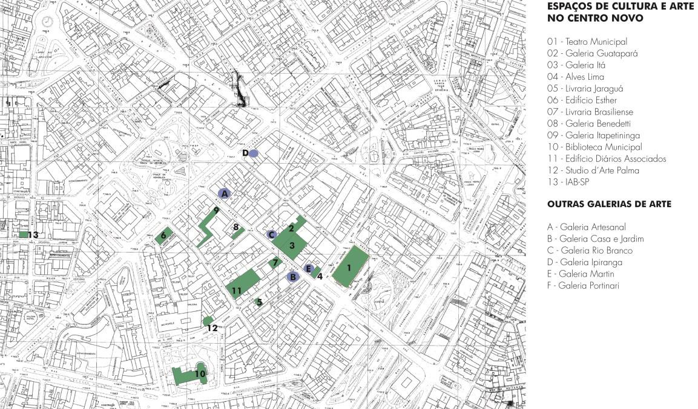
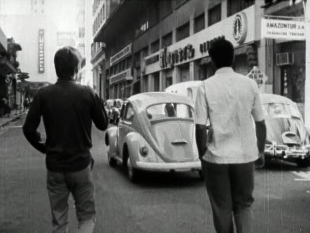
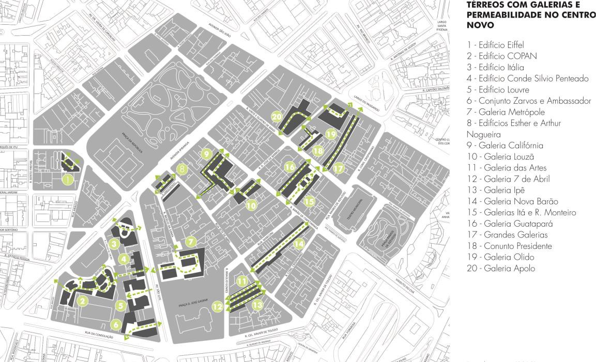

# Resumo

Entre as décadas de 1940 e 1960, um fluxo alto e constante de pessoas
deslocava-se na região do Centro Novo de São Paulo, gerando encontros
inesperados e inusitados entre os mais diversos grupos. Nas novas vias
(abertas ou alargadas) na gestão do então prefeito Prestes Maia, ou nos
térreos dos novos arranha-céus que configuravam a paisagem urbana, os
novos hábitos da vida moderna eram expostos. Aqueles espaços eram os
legítimos lugares de debate e trocas, espaço para o público que exercia
as mais diversas atividades na região: trabalho, habitação, lazer e
circulação. Nos bares, cafés, restaurantes, confeitarias, livrarias,
bibliotecas, primeiros museus ou galerias comerciais era possível
encontrar conhecidos e estranhos que se deslocavam em uma região que se
apresentava como o grande foco dos investimentos governamentais. Durante
sua gestão, Prestes Maia incentivaria, a partir de dispositivos legais,
a criação de espaços de fluidez e passagem nos térreos dos edifícios
dispostos ao longo de vias específicas, incentivando assim a
sociabilidade em um determinado espaço da cidade. Considerando os
diversos aspectos de transformação urbana da cidade entre as décadas de
1930 e 1960, entre eles a abertura e alargamento de novas vias e a
verticalização do Centro da cidade, o artigo buscará apresentar a íntima
relação que se estabeleceu entre os novos hábitos culturais e os espaços
onde estes se manifestam em meados do século XX na área central da
cidade de São Paulo. A pesquisa parte da análise da legislação
existente, da análise urbana e morfológica da área, além do levantamento
e descrições dos percursos dos usuários , de projetos de arquitetura,
filmes, registros literários que expõem um período de grande relevância
na história da cidade de São Paulo.

**Palavras-chave:** arquitetura moderna, Centro, metrópole,
sociabilidade, São Paulo, modernização

# Abstract

Between the 1940s and 1960s, there was a high and constant flow of
people moving down in the Centro Novo of Sao Paulo, and creating
unexpected and unusual encounters among different groups. In the new
avenues and streets, built during the administration of Mayor Prestes
Maia, or even in the ground floor of new skyscrapers that were part of
the urban environment, new habits of modern life were exposed. Those
spaces were legitimate places for debates and exchange, and also a space
for the public that used to do diverse activities in the area: work,
housing, leisure, and circulation. In bars, cafes, restaurants,
bakeries, bookstores, libraries, first museums, or commercial galleries,
it was possible to find known and unknown people who were moving in an
area that was presented as the main focus of government investment.
During the administration of Mayor Presets Maia, some legal devices
encouraged the conception of flow spaces and passages in the ground
floor of buildings located along specific avenues, thereby promoting
sociability in a particular area of the city. Taking into account the
various aspects of urban transformation of the city between the 1930s

and 1960s, including the opening and expansion of new routes and
uprighting of downtown, this paper aims to present the intimate
relationship established between the new cultural habits and the spaces
where these habits become apparent during the mid- twentieth century in
the central area of São Paulo. This research is based on literary
records that expose a period of great importance in the history of the
city of Sao Paulo, including the review of existing legislation, a
morphological analysis of the urban area, survey and descriptions of
routes of users, architectural designs, and films.

**Keywords:** modern architecture, downtown, metropolis, sociability,
Sao Paulo, modernization

# Introdução

A partir da década de 1930, o Centro Novo1 da cidade de São Paulo, a
área localizada a oeste do Vale do Anhangabaú, o passou por uma forte
transformação urbana estimulada pela execução das obras viárias do Plano
de Avenidas2 e pela construção de novos edifícios na região. As
transformações tratadas neste texto referem-se especialmente às
espaciais e culturais, possibilitadas especialmente pelo forte
crescimento econômico pelo qual a cidade passou com a produção de café e
com o

início da industrialização.

É importante ressaltar que, além das transformações físicas da
metrópole, era visível uma mudança no modo de vida urbano presente nas
mais diversas atividades que ocorriam na cidade. Novos habitantes de
diversos lugares misturavam seus hábitos e tradições dando origem a uma
cultura bastante rica. Além disto, foi um período de grandes novidades
na vida cultural com o aumento do número de cinemas, teatros, galerias
de arte e o aparecimento dos primeiros museus; tudo isso, em função de
uma rica produção da cultura urbana local.

Para se ter uma ideia mais clara de tais transformações, Petrone
registrou que, na década de 1950, a cidade apresentava dezoito
estabelecimentos de ensino superior, três universidades, quinze
estabelecimentos de ensino agrícola e industrial, 106 livrarias, 150
cinemas, oito teatros e cinco cines-teatros, doze estações de radio e
três de televisão (PETRONE, 1955, p.118). Estes novos hábitos se
refletiam inclusive nos novos desenhos arquitetônicos espalhados de
espaços pelo centro da cidade.

Em meados do século XX, o entorno da Praça da República abrigou uma
quantidade muito grande de pessoas que trabalhavam, habitavam e se
divertiam nos novos edifícios. Esta região funcionava durante o dia como
espaço do trabalho e comércio, enquanto a noite era um centro de lazer.
Estava também ocupada por edifícios de habitação cujo programa
integrava-se a essa mistura de usos e de tempos, além de promover uma
integração de tipos e de grupos.Nas suas proximidades, era possível
encontrar diversos eventos de interesse da população que por ali
circulava.

> 1 Será utilizado o termo *Centro Novo* em referência à área atualmente
> conhecida como distrito República, enquanto *Centro Velho* seria a
> região do distrito Sé.
>
> 2 Plano de Avenidas (1930), apresentada pelo engenheiro Prestes Maia
> ao prefeito Pires do Rio (1926-1930), propunha a criação de um grande
> anel de circulação que permitisse maior facilidade de deslocamento
> pela cidade sem cruzar o Centro. Para tanto, propunha a abertura de
> novas e o alargamento de antigas avenidas.

Ali, nos espaços urbanos e arquitetônicos, se formou uma rede de
sociabilidade tão marcante que algumas dessas experiências podem ser
vislumbradas em obras da literatura, cinema, poesia, fotografia e artes
plásticas, que retratam o período. Esse texto busca compreender os
aspectos que levaram a essa sociabilidade e como a mesma pode ser
vislumbrada a partir de relatos e registros de usuários do período.

## A construção de um núcleo de encontros

A área do Centro Novo passou por uma forte transformação entre os anos
1930 e 1960. Em oposição à ideia de cidade dispersa que se fortalecia
neste momento -- com a formação das periferias e a expansão da cidade
industrial -- aquela região demonstrava uma vitalidade urbana graças às
diversas funções ali implantadas (atividades culturais, comércio,
serviço, habitação) e aos espaços construídos. Sua agitação atraiu
investidores para os poucos terrenos vazios disponíveis e para a
realização de novos empreendimentos imobiliários. Neste período, as
casas e chácaras existentes na região foram substituídas por novos
arranha-céus que rompiam a escala horizontal da cidade e apresentavam
propostas espaciais modernas.

Os investimentos imobiliários naquela região eram incentivados pelo
poder público. Já em 1940, o decreto-lei nº 41, do prefeito Prestes
Maia, atuava sobre a avenida Ipiranga e suas construções, incentivando
diretamente a criação de espaços de fluidez e passagem nos térreos dos
edifícios dispostos ao longo desta via, conforme descrito abaixo:

> Art. 9 -- As construções com mais de 20 pavimentos deverão ter ao
> nível do passeio público reentrância (portal, galeria, colunata ou
> arcada aberta), ocupando, no mínimo, 1/3 da frente do lote, com
> profundidade e superfície nunca inferiores, respectivamente a 3,5ms e
> 30m2.
>
> Parágrafo único -- estudará a Prefeitura a concessão oportuna de
> favores especiais para os prédios que não possuírem corpos super
> elevados (art. 4) e cujos pavimentos térreos apresentem recuos,
> galerias, colunatas ou arcadas, equivalentes a uma ampliação dos
> passeios, utilizáveis para mesas de café, bares, etc (PREFEITURA DO
> MUNICÍPIO DE SÃO PAULO, 1941).

É importante ressaltar nessa lei a presença do termo "favores
especiais", demonstrando o grande interesse do governo municipal para a
construção de tais espaços de conveniência, incentivando-os ao
atrelá-los ao desejo da iniciativa privada em construir edifícios cada
vez mais altos, em prol de uma maior rentabilidade econômica.

A legislação incentivava a verticalização naquela via e conjugava-a à
necessidade de térreos permeáveis, de encontros e sociabilização,
semelhante aos foyers dos cinemas, que pudessem ser oferecidas aos
transeuntes áreas de repouso e de permanência -- como cafés, bares,
restaurantes (COSTA, 2010). O uso de colunatas, arcadas e recuos nas
entradas dos edifícios era um artifício de projeto que garantia proteção
no caso de

intempéries e sinalizava a possibilidade de ter um espaço permeável nos
térreos. O desenvolvimento de novas tecnologias construtivas - uso do
concreto armado, de elevadores,entre outros - possibilitava a construção
em altura nos terrenos que antes abrigavam chácaras de uso das famílias
mais abastadas

Assim, dentro de um edifício com limites urbanos muito bem definidos
pelos lotes tradicionais, eram criados lugares que possibilitavam as
trocas e encontros entre os usuários da região central, funcionando como
espaços semi-públicos ao longo das grandes vias. Outro aspecto relevante
do artigo 9º daquele decreto-lei era a intenção de passar para as mãos
da iniciativa privada a possibilidade de criar os espaços públicos da
cidade.

Neste sentido, é importante ressaltar que a ideia de espaços públicos,
aqui defendida, relaciona-se aos locais de encontro, de contatos
públicos casuais ou de sociabilidade. Facilmente reconhecidos nas ruas,
praças, largos e avenidas, neste momento, essas relações ocorriam também
nos cafés, confeitarias, livrarias, foyer de espera dos cinemas,
corredores das galerias, entre outros. Parte da definição de Sennett que
defende que o próprio termo "público", a partir do século XIX, "veio a
significar uma vida que se passa fora da vida da família e dos amigos
íntimos; na região pública, grupos sociais complexos e díspares teriam
que entrar em contato inelutavelmente" (SENNETT, 1998, p.32).

Os espaços públicos do Centro Novo constituíam-se como mediadores de
possíveis encontros e trocas de experiências, sociais e comunicativas,
constituindo lugares de permanência e não somente de passagem. Espaços
de usos, sobretudo, coletivos e marcados pela diversidade de atividades
que ali ocorrem.

A ideia já estava presente em um dos desenhos apresentados por Prestes
Maia no Plano de Avenidas (1930), onde um dos edifícios monumentais
esboçados pelo autor apresentava um ambiente de convivência, semelhante
a um terraço com café, onde as pessoas se encontravam e vislumbravam a
paisagem.

Assim, era possível vislumbrar um perímetro onde a sociabilidade da
metrópole era exercida de maneira mais intensa. O depoimento da
socióloga Maria Arminda do Nascimento Arruda retrata a importância da
região no contexto cultural da cidade:

> A cidade era imensa, mas o centro, onde a vida mundana se desenrolava,
> era um quadrilátero reduzido, onde todos os lugares poderiam ser
> alcançados a pé. Do Teatro Municipal à Avenida São João, passando pela
> Praça Júlio Mesquita, alcançando as ruas do Arouche, Bento Freitas e
> Rego Freitas, atravessando pela 7 de Abril ou Barão de Itapetininga,
> para desaguar na 7 de Abril, rumo à Praça Dom José Gaspar, de volta à
> Biblioteca Municipal, daí até a rua Maria Antonia (ARRUDA, 2001,
> p.64).

## Espaços de encontro e a vida cultural

A partir da década de 1930, a área de estudo converteu-se em polo de
atividades artísticas e culturais da cidade. Sua vocação como área de
lazer demonstrava-se já no século XIX quando várias touradas ocorriam
naquele espaço conhecido no período

como Praça dos Curros (REIS FILHO, 1976). Ainda na primeira metade do
século XX, muitos dos episódios mais marcantes da cultura paulistana
aconteceram em espaços localizados nesta região. Ali foram criados os
primeiros museus, instaladas as principais galerias de arte, construídos
os principais cinemas, de maneira que, em um perímetro de poucas
quadras, era possível encontrar diversos eventos de interesse da
população que por ali circulava. O mapa 1 apresenta a implantação de
alguns desses espaços na cidade e demonstra o quanto concentravam-se em
uma determinada área.

> 
>
> Figura 1 -- mapa da implantação dos espaços de cultura e arte do
> Centro Novo

Um dos espaços fundamentais na sociabilidade de São Paulo no período
analisado era a Biblioteca Mario de Andrade. Projetada pelo arquiteto
francês Jacques Pilon, com 23 andares, foi finalizada no ano de 1942.
Sua altura era ainda mais ressaltada pela implantação na praça Dom José
Gaspar, cercada por um jardim, tangenciada pelas novas vias do Plano de
Avenidas proposto e executado por Prestes Maia. Sua posição estratégica
- na Praça Dom José Gaspar - tangente às ruas São Luis, Barão de
Itapetininga e próxima à Praça da República.

Seu programa atestava o interesse da metrópole em incentivar a educação
e o desenvolvimento cultural da população. Nos arredores da Biblioteca
Municipal, na década de 1950, formou-se um dos principais espaços de
discussão da cidade. Estudantes secundaristas, profissionais,
pesquisadores e interessados das mais diversas áreas tinham acesso a um
precioso acervo bibliográfico. O interior da Biblioteca reunia em suas
salas de leitura, um público bastante diversificado em busca das mais
diversas atividades.

As ruas próximas eram povoadas de pessoas que se deslocavam para um dos
pontos de encontro reconhecidos da cidade:

> E aquela parte da frente na Biblioteca, onde estão as escadas, era
>
> um ponto de encontro. Você não precisava\... você marcava um encontro,
> eu vinha aqui e ficava zanzando.(\...) Você marcava até encontro com a
> namorada. Ficava sentado lá naquele patamar da escada. Ficava todo
> mundo sentado ali, batendo papo, e eventualmente entrava e pegava um
> livro. Afinal, você precisava justificar de alguma forma a vinda à
> Biblioteca. (\...) Na verdade, aqui era um ponto de encontro no
> centro: você podia se encontrar num bar ou na Biblioteca. Ninguém
> tinha dinheiro, porque num bar você precisava despender alguma coisa,
> na Biblioteca ficava mais fácil. E vinha aqui o Roberto Piva, Roberto
> Ruggero, Antonio Franceschi, todo mundo, Cláudio Willer, todo mundo
> vinha aqui. (GIOGERTTI, 2005).

Já Bento Prado Jr descreve que os bares localizados nas proximidades da
Biblioteca Municipal funcionavam como uma extensão das discussões que se
iniciavam em seu interior. "Passar de um lado para o outro não implicava
em salto ou descontinuidade, que compensava a perda da exclusividade ou
da hegemonia" (PRADO JR, 1992, p. 17). Segundo o autor, "era como se a
sociedade global pudesse se espelhar inteira no espaço estreito do bar,
numa forma antes comunitária que societária" (PRADO JR, 1992, p. 18).
Assim, os bares assumiram um forte papel sociabilizador ao reunir um
público variado de estudantes, professores, escritores, artistas e
dramaturgos.

> Bares eram espaços de vivência ampla, de estímulo aos sentidos e do
> cultivo ao intelecto. (\...) Distintos por seus trajes ou pela bebida
> consumida, conviviam francamente, sem tensões, numa globalidade antes
> comunitária que societária. Um estilo de sociabilidade em que
> amenidades, arte e literatura, filosofia e política, comungavam
> permanentemente, recriando a magia dos bares parisienses, no estilo
> sedutor de seus cafés (ARRUDA, 2001, pp.61-62).

Parte da efervescência da região devia-se à presença de alguns cursos da
Faculdade de Filosofia, Ciências e Letras na região. Nos primeiros anos
de funcionamento da Universidade de São Paulo, ainda na década de 1930,
aquela Faculdade estava instalada nas dependências da Antiga Escola
Normal. Em 1949, foi transferida para sede própria na rua Maria Antonia,
a algumas quadras do endereço original. No entanto, a circulação dos
alunos, professores e funcionários pela área central ocorria com a mesma
naturalidade de sempre. A filósofa Marilena Chauí relembra sua época de
aluna da Faculdade de Filosofia, Ciências e Letras, quando os mais
importantes eventos de sua geração aconteciam no entorno da Biblioteca
Municipal:

> Que acontecimento, o primeiro número do "Jornal da Tarde", lido ainda
> quente das prensas, tão intelectual Avenida São Luiz, Barba Azul, Pari
> Bar, ponto de encontro das celebridades, dos professores estrangeiros.
> Cinemas. Praça da República. Ipiranga-esquina-da-São João. Salada
> Paulista, Bar do Jeca (CHAUÍ, 1988, p. 241).

A região também era ponto de encontro de uma população que se mostrava
cada vez mais interessada em novos bens de consumo. Neste contexto,
destacava-se a rua Barão de Itapetininga que se configurou como espaço
voltado para o comércio de luxo

disposto para um público de profissionais que atuavam na região e também
à elite paulistana -- residente nos bairros próximos. Lucia Helena Gama
assim descreve a via:

> a Barão virou a rua mais grã-fina daqui \[do Centro\]; já a chamam até
> de Via Veneto, com suas lojas de moda, livrarias, e muitos escritórios
> de profissionais liberais, advogados. Depois da reforma do viaduto
> ganhou uma nova vida comercial e social, com presença constante de
> jornalistas, escritores e políticos (GAMA, 1998, p. 95).

Novos programas consolidavam-se nos novos edifícios e ou nos espaços
adaptados. A I Exposição de Arte Moderna da Sociedade Pró-Arte Moderna
(SPAM) ocorreu, em 1932, na rua Barão de Itapetininga (ALMEIDA, 1976).
Segundo Paulo Mendes de Almeida, "o programa da SPAM era vasto.
Propunha-se estreitar as relações entre os artistas e as pessoas que se
interessam pela arte em todas as suas manifestações, promover
exposições, concertos, conferências, reuniões literárias" (ALMEIDA,
1976,

p\. 42). Na rua Barão de Itapetininga ainda se localizavam várias
livrarias da cidade, espaço de encontro de intelectuais, a exemplo da
Livraria Jaraguá e da Brasiliense. Além disso, diversas galerias de arte
se implantaram na região: Galeria Itapetininga, Benedetti, Domus, entre
outras.

Nas proximidades, o edifício Esther abrigou a sede do Instituto dos
Arquitetos do Brasil, seção São Paulo, logo em sua inauguração, em 1943.
Ali, os arquitetos se reuniam para discutir as novidades da classe
profissional, planejar congressos e divulgar a arquitetura moderna. Em
1947, a nova sede da instituição foi construída e, já em 1950, abrigou a
I Exposição da Oficina de Artes (ODA). O I Congresso Brasileiro de
Arquitetos -- organizado pelo IAB-SP -- ocorreu na Biblioteca Municipal
Mario de Andrade, em 1945, assim como a Exposição Municipal de Urbanismo
de 1950.

Também no Centro Novo localizavam-se os principais cinemas da cidade,
numa região que seria conhecida como \"cinelândia paulista\". As
primeiras salas de cinemas implantaram-se nas proximidades das linhas de
bondes, utilizando-se da facilidade de acessos por esta rede de
transporte coletivo. Após a construção das grandes vias do Plano de
Avenidas, as salas foram construídas ao longo dos novos eixos viários ou
nos novos bairros mais distantes, entre eles o Brás. Os cinemas faziam
parte de um conjunto de equipamentos urbanos que estavam associados à
mudança no modo de vida da sociedade. Assistir aos filmes mais recentes,
estar em dia com as novidades cinematográficas, reconhecer as melhores
salas eram atividades associadas a um modo de vida moderno, fazendo
parte da vida social desta população urbana e atraindo um público cada
vez maior e mais heterogêneo. Segundo Sevcenko, "o cinema, assim como os
bondes e os estádios, alinha multidões de estranhos enfileirados ombro a
ombro num arranjo tão fortuito e normativo como a linha de montagem"
(SEVCENKO, 2003, p.95).

Um curta metragem realizado em meados da década de 1960 apresentava um
passeio descompromissado de dois amigos pelas ruas do Centro de São
Paulo, a maneira de um flaneur. \"Documentário\" - filme dirigido por
Rogério Sganzerla - trazia alguns dos dilemas daquela geração, assim
como demonstrava percursos e espaços de sociabilidade da cidade em
meados do século XX. É desta ação -- o simples ato de flanar -- que
conduz "a quase narrativa" do filme \"Documentário\". Baseia-se no
hábito

de caminhar pela cidade, sem rumo ou destino certo, tão comum em meados
do século

XX\. Demonstra a importância que o costume de se reconhecerem na rua
assumiu para aquela geração quando, no filme, apresenta-se uma cena em
que um dos personagens propõe ao outro que circulassem pela rua Barão de
Itapetinga para encontrar algum conhecido.

> 
>
> Figura 2 - Cena do curta metragem \"Documentário\" de Rogério
> Sganzerla

Se o caminhar pelas ruas do Centro permitia encontros inusitados e
rápidos pelas ruas, diante da situação de deslocamento e velocidade que
a época impunha, no interior dos edifícios, a situação se invertia.
Diversos estabelecimentos criavam seu público cativo que se reunia com
certa frequência.

As galerias construídas nos térreos de alguns edifícios modernos
funcionavam como áreas de circulação e de permanência do público que se
deslocava apressado por diversas ruas e encontravam um local para uma
pausa, descanso ou debate. Cinemas, livrarias, cafés e bares da região
eram espaços dedicados aos encontros e debate que assumiam uma
importância cada vez maior na vida social de São Paulo. Ali, as novas e
velhas gerações interagiam.

Se no final do século XIX, Jules Martin propunha uma rede de galerias
que se conectavam entre as principais ruas do \"triângulo histórico\",
seria no Centro Novo que uma concentração de galerias caracterizariam um
sistema com pontos definidos por essa tipologia. Ali, vinte galerias se
conectavam e propunham rotas alternativas. Seus programas eram diversos
e expunham os novos hábitos dos homens modernos: cinemas, cafés,
livrarias, lavanderias, cabeleireiros entre outros. Entre as décadas de
1950 e 1960, este tipo de arquitetura ganhou força no Centro de São
Paulo, tendo inclusive o incentivo legal do poder municipal para sua
proliferação por algumas vias específicas do Centro.

Nessas galerias, a fronteira entre o público e o privado mostra-se
bastante nebulosa, uma vez que os acessos eram facilitados, os
corredores funcionaram como eixo de circulação e os pontos comerciais
geraram pontos de permanência. A permeabilidade no pavimento térreo
possibilitava o aparecimento de novos caminhos por dentro das quadras e
contribuía na ligação entre espaços urbanos, funcionando, elas mesmas,
como novos lugares públicos. Nos dizeres de Argan, "o edifício não
interrompe o movimento da cidade, a arquitetura não fecha nem segrega, e
sim filtra e intensifica a vida" (ARGAN, 1992, p.197).

> 
>
> Figura 3 -- mapa das galerias e percursos na região do Centro Novo

Esta rede de galerias torna as quadras muito mais permeáveis pela
presença de espaços vazios em meio à alta concentração de edifícios da
região. Estes espaços de circulação estabelecidos no térreo mudaram a
densidade da malha urbana no nível do pavimento térreo.. Esta ligação
entre os caminhos é fortalecida pelo próprio projeto das galerias que
muitas vezes estabelece ou ressalta a presença de uma vizinha. Exemplo
mais conhecido é a conexão entre a Galeria Itá e a R. Monteiro onde a
ligação entre as duas ruas por um caminho interno à quadra era um dado
de projeto para a equipe de Rino Levi. A conexão entre os edifícios é
ressaltada pelas grandes aberturas, pelos acessos facilitados, pelos
desenhos das calçadas que se prolongam.

## Considerações finais

O enriquecimento da cidade pela exportação de café ou pelos primórdios
da industrialização possibilitou as ações mais intensas de intervenção
sobre a estrutura urbana da cidade, tais como a criação de um circuito
de vias de rápida velocidade, promovendo deslocamentos mais eficientes e
apontando novas áreas de investimento. A região próxima à Praça da
República foi um dos espaços que sofreu as intervenções

urbanas mais fortes nesse período, tendo sido foco direto diversos
investimentos imobiliários.

Na região do Centro Novo, a multidão e os veículos eram cada vez mais
numerosos na cidade de São Paulo. Nice L. Muller afirmava sobre o Centro
de São Paulo: \"basta percorrê-lo, em qualquer hora do dia, para que se
observe o formigamento de suas ruas, o deslocamento apressado da massa
de pedestres, o movimento ininterrupto de veículos nas vias em que ainda
é permitida circulação\" (MULLER, 1958, p.170).

O texto buscou apontar que essa região se configurava como espaço
efetivo de trocas de ideias e encontros, núcleo fundamental de
atividades culturais e políticas. Esta sociabilidade diversa estava
ligada aos novos hábitos da vida moderna que se manifestava nos novos
espaços construídos da cidade: cinemas, lojas de departamento, galerias
de arte, museus, cafés e livrarias. O texto apresentou diversos relatos
e registros que apresentavam a apropriação dos espaços de sociabilidade
do período, sejam eles reconhecidamente públicos ou privados.

# Referências

> ALMEIDA, Paulo Mendes de. *De Anita ao Museu*. São Paulo, Editora
> Perspectiva, 1976.
>
> ARGAN, Giulio Carlo*. Arte moderna. Do iluminismo aos movimentos
> contemporâneos*. São Paulo, Companhia das Letras, 1992.
>
> ARRUDA, Maria Arminda do Nascimento. *Metrópole e cultura. São Paulo
> no meio do século XX.* São Paulo, Editora da Universidade do Sagrado
> Coração, 2001.
>
> CHAUI, Marilena. *Um lugar chamado Maria Antonia*. In Santos, M.C.L.
> dos. Maria Antonia: uma rua na contramão. São Paulo, Nobel, 1988.
>
> COSTA, Sabrina Studart Fontenele. *Relações entre o traçado urbano e
> os edifícios modernos no centro de São Paulo. Arquitetura e Cidade
> (1938/1960).* São Paulo, Faculdade de Arquitetura e Urbanismo, 2010.
> (tese de doutorado).
>
> GAMA, Lúcia Helena. *Nos bares da vida: produção cultural e
> sociabilidade em São Paulo, 1940-1950.* São Paulo, Editora SENAC São
> Paulo, 1998.
>
> MULLER, Nice L. *A área central da cidade.* In: AZEVEDO, Aroldo
> (org.). Cidade de São Paulo: estudos de geografia urbana. São Paulo,
> Companhia Editora Nacional, 1958.
>
> PETRONE, Pasquale*. A cidade de São Paulo no século XX. In: SILVA,
> Raul de Andrade (org.). A evolução urbana de São Paulo*. São Paulo,
> s.n., 1955.

PRADO JR, Bento.*A biblioteca e os bares na década de 50*. São Paulo,
Revista da Biblioteca Mario de Andrade, Secretaria Municipal de Cultura,
Prefeitura Municipal de São Paulo, 1992, n. 50, pp. 16-18.

> PREFEITURA DO MUNICÍPIO DE SÃO PAULO. *Decreto-Lei n.41, de 3 de
> agosto de 1940.* In: Decretos-Leis e Decretos do município de São
> Paulo do ano de 1940, pp. 42-46. São Paulo, 1941b.

REIS FILHO, Nestor Goulart. *São Paulo:* vila cidade metrópole. São
Paulo, Prefeitura do Município de São Paulo, BankBoston, 2004.

> SANTORO, Paula. *A relação da sala de cinema e o espaço urbano em São
> Paulo: do provinciano ao cosmopolita*. (dissertação de mestrado). São
> Paulo, FAU-USP, 2004.
>
> SEVCENKO, Nicolau. *Orfeu extáltico na metrópole: São Paulo, sociedade
> e cultura nos frementes anos 20.* São Paulo, Companhia das Letras,
> 2003.
