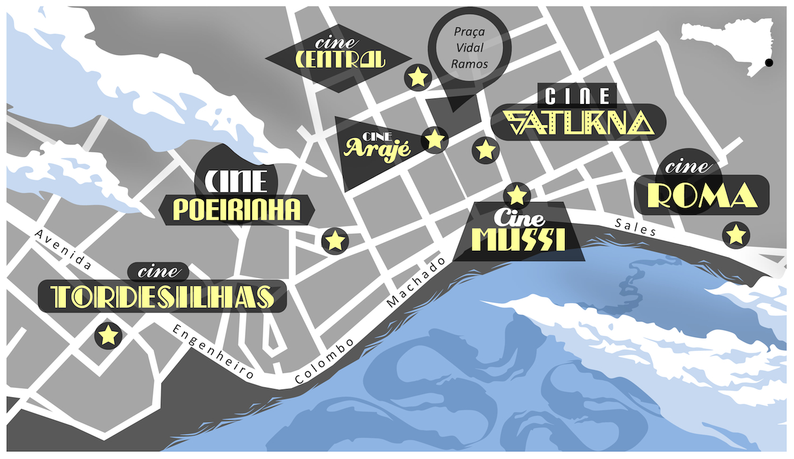
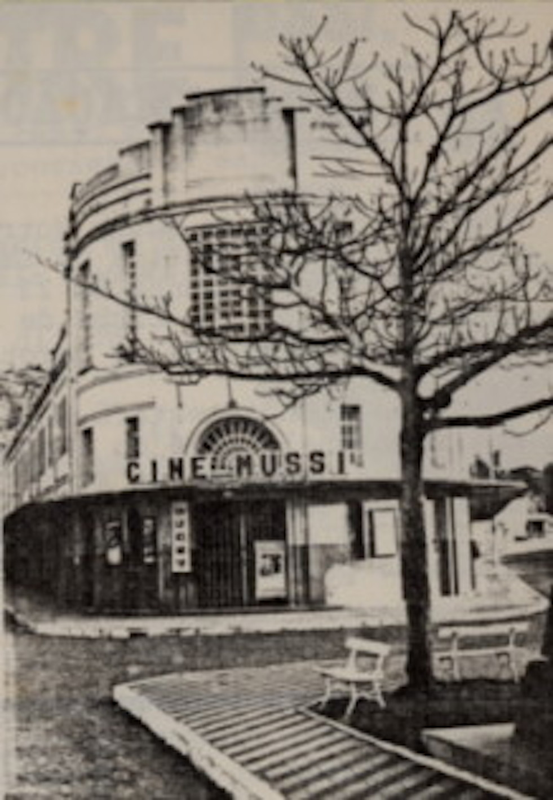
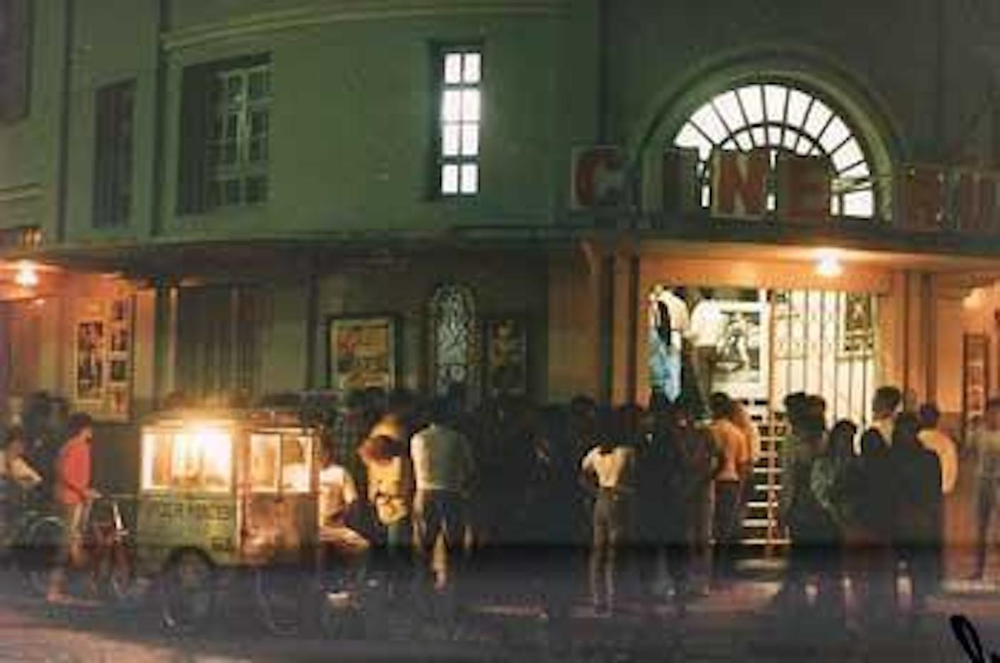
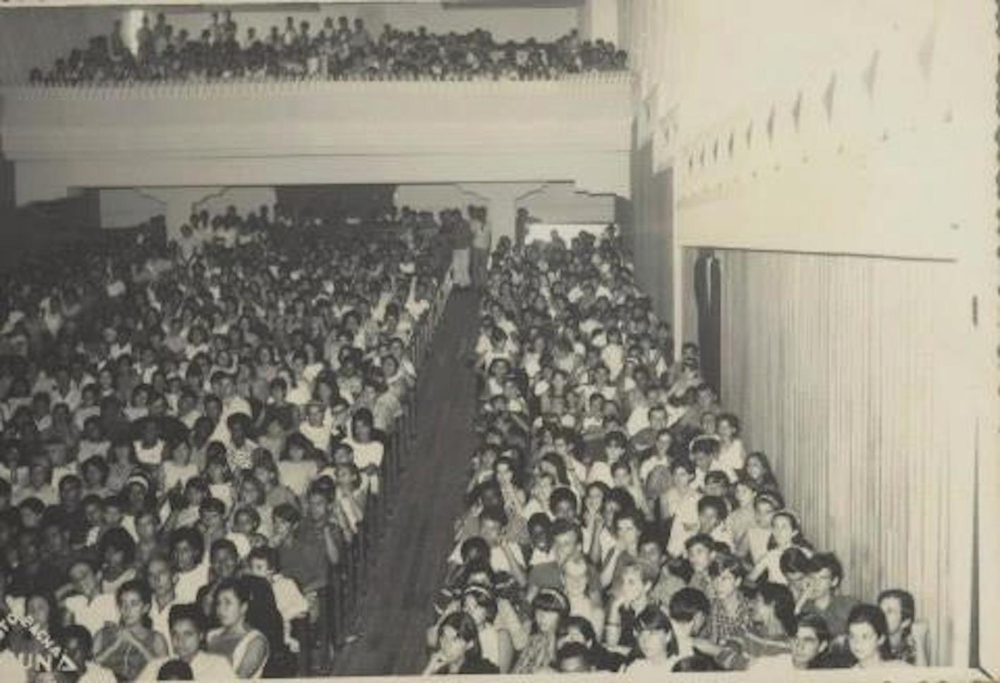

# Resumo

Este artigo é fruto da prática de eleição das antigas salas de cinema de
rua das cidades brasileiras como objeto de pesquisa e extensão
universitária. Parte de uma análise ampla da organização espacial do
setor exibidor da indústria cinematográfica brasileira contemporânea
para uma reflexão histórica sobre os desdobramentos das transformações
desta organização na cidade de Laguna-SC. Seu foco é refletir sobre como
o processo de fechamento das salas de cinema de rua vivido por grande
parte das cidades pequenas brasileiras impacta estas cidades em termos
de sociabilidade urbana, principalmente o centro tradicional onde
localizavam-se. Para tanto, utiliza-se de aportes do campo da Economia
Politica da Arte e da Cultura e de investigações acerca da História Oral
da cidade de Laguna.

Palavras-chave: Cinema Brasileiro, Salas de cinema, Centro Tradicional,
Laguna-SC

## **Abstract**

This article results of election of the ancient \_ street Cinema of
Brazilian cities as objects of University Research and Extension. Begins
with a analysis of exhibitor sector spatial organization of the
contemporary Brazilian film industry for a historical reflection on the
consequences of the transformations of this organization in the city of
Laguna-SC. Their focus is to reflect on how the process of closing of
street cinemas lived for most Brazilian towns impacts these cities in
terms of urban sociability, particularly the traditional center where
were located. For that, it uses inputs from the area of Political
Economy of Art and Culture and investigations about the Oral History of
Laguna.

Keywords: Brazilian Cinema, Movie theaters, Traditional Center,
Laguna-SC

# Introdução

Este artigo é fruto da tradução de uma pesquisa de doutorado no campo da
geografia do cinema para a prática universitária extensionista em
Laguna, pequena cidade do litoral sul de Santa Catarina. Tal prática é
uma proposta que visa congregar projetos de investigação e experiência
acerca dos antigos e dos possíveis espaços de exibição cinematográfica
na cidade. Mediante iniciativas de pesquisa, documentação e exibição
visa promover espaços de contemplação, rememoração e debate sobre o
processo de fechamento das salas de cinema de rua vivenciado por esta e
por diversas cidades pequenas de Santa Catarina a partir dos anos 1990,
e refletir acerca de alternativas para o retorno do cinema a esta cidade
e o reencontro da população com esta esfera da cultura.

Parte, portanto, de uma análise ampla da organização espacial do setor
exibidor da indústria cinematográfica brasileira contemporânea para uma
reflexão histórica sobre os desdobramentos das transformações desta
organização na cidade de Laguna, com foco na seguinte questão: Como o
processo de fechamento das salas de cinema de rua vivido por grande
parte das cidades pequenas brasileiras impacta estas cidades,
principalmente o centro tradicional onde localizavam-se em termos de
sociabilidade urbana?

Colocando as antigas salas de exibição da cidade de Laguna no centro da
investigação, o artigo explora através de entrevistas com
informantes-chave, reveladores da história oral da cidade, a
sociabilidade urbana motivada por estas salas em boa parte do século XX.
Após seu fechamento, o centro tradicional perde seu movimento noturno,
momento em que a imagem deste como um "lugar perigoso" começa a se
formar.

## **Uma passagem por questões nacionais: salas de exibição e o público brasileiro de cinema**

Segundo dados da ANCINE (2011), enquanto 100% das cidades brasileiras
com mais de 500 mil habitantes possuem hoje salas de cinema, assim como
67% das com mais de 100 mil, nos municípios entre 20 e 50 mil esta
porcentagem cai para 7%, e nos com menos de 20 mil é de 0,2%. O interior
de Santa Catarina sofreu com o movimento nacional de fechamento das
salas de cinema no início dos anos 1990, de forma que atualmente, grande
parte das cidades que até então tinham o cinema como um lazer
tradicional, perderam este hábito cotidiano.

O Estado de Santa Catarina conquista certo destaque junto ao mercado
exibidor nacional, em grande parte devido a Rede Arco Íris, fundada em
Lages em 1961 e que hoje administra um total de 87 salas, a grande
maioria da região sul (ANCINE, 2011). Não obstante reconhecermos que no
sul e sudeste brasileiro as salas aparecem em maior número e são mais
bem distribuídas, são os dados absolutos que demonstram a real situação.
No Brasil, apenas 7% dos municípios possuem uma sala de cinema; na
região sul, 87 dos 1101 municípios contam com uma sala de exibição (o
que corresponde a 8% do total, apenas um ponto percentual acima da média
nacional). Em Santa Catarina apenas 31 dos 293 municípios possuíam, no
ano de 2010, um cinema (ANCINE, 2011).

As 2352 salas de exibição comercial que temos atualmente no Brasil estão
concentradas, na verdade, entre 686 pontos de exibição, metade destes
localizados em municípios com mais de 500 mil habitantes. Estes 686
pontos estão distribuídos entre 392 cidades, das quais, apenas 86 têm
mais de uma sala de exibição. Metade das salas de exibição, dos
ingressos vendidos e da renda de bilheteria dos cinemas está concentrada
nos estados do Rio de Janeiro e de São Paulo. A média nacional de
ingressos por habitante é de 0,8, enquanto na França este número é de
3,4, e no México de 1,7 (ANCINE, 2011).

Desde os anos 1970 até hoje, houve uma queda na ordem de 1000 no número
de salas de exibição instaladas em nosso país. Esta queda, além de estar
relacionada à expansão da televisão, está também associada ao surgimento
de novos padrões tecnológicos para os quais poucos empresários
brasileiros estavam preparados para se adaptar.

A partir dos anos 1990 ocorre a entrada de grandes empresas estrangeiras
no segmento de exibição no Brasil (Cinemark, UCI, por exemplo). Estas
introduzem em nossa realidade o conceito de multiplex: "caracterizado
pela reunião de várias salas sob uma mesma unidade arquitetônica,
invariavelmente associada a grandes empreendimentos comerciais
(shoppings centers), e com grande oferta de blockbusters". (ANCINE,
2011, p. 34). A entrada do multiplex no Brasil representa sobretudo a
entrada no mercado nacional dos grandes exibidores estrangeiros.
Atualmente 80% das salas de cinema no Brasil estão instaladas em
shopping centers e cerca de 470 estão equipadas com projetores digitais
e 3D que seguem os padrões técnicos ditados por Hollywood.

Esta "ditadura da tecnologia" inaugurou um processo de valorização
crescente dos aparatos técnicos das salas, e tornou sua modernização
urgente. É interessante notar que desde os anos 1950 já apareciam
manifestações de resistência a este processo cíclico de
modernização-exclusão tecnológica:

> Os "fãs", aqueles que verdadeiramente merecem a denominação, não
> espiam apenas o que passa pela Cinelândia e nos cinemas de luxo de
> Copacabana e Tijuca. Eles lêem, ao contrário, os nomes de todas as
> casas exibidoras, as de Cavalcanti, Irajá, e Braz de Pina. É claro que
> eles gostam de refrigeração e poltronas estofadas. Mas que importa
> todo esse conforto, coisa secundária quando se tem que aturar as
> canastrices de um realizador que insiste em confundir cinema com
> outras artes? Mil vezes um pulgueiro da rua Larga ou da praça 11, ou
> então os dezesseis milímetros ao ar livre de Anchieta\... (NORONHA,
> 1953).

A concentração nos pontos mais lucrativos do território nacional é um
dos principais motivo que pode ser elencado para explicar a diminuição
do número de salas de cinema no Brasil, e o desaparecimento das salas de
cinema da cidade em questão: Laguna, Santa Catarina.

# Exibições cinematográficas em Laguna: das salas para as ruas

Desde 1991, cerca de 430 salas de cinema de rua já encerraram suas
atividades: as grandes salas dos anos 1930 chegam aos anos 1970
obsoletas tecnicamente e seu modelo de grandes saguões e plateias de
mais de 1000 lugares não resiste à especulação imobiliária dos centros
urbanos, pois já não lucravam o suficiente. Com o fechamento das salas
de rua, os centros tradicionais das cidades perderam movimento noturno e
viram enfraquecer seu caráter de lugar de encontro e sociabilidade
urbana.

Segundo registros obtidos principalmente através da história oral de
moradores mais antigos, Laguna teve em sua história 7 salas de cinema
distribuídas pelo (hoje) centro tradicional (Figura 1) Neste artigo
focaremos em duas destas salas, sobre as quais obtiveram-se mais
informações, os antigos Cine Mussi e Cine Roma.

{width="4.723333333333334in"
height="2.7333333333333334in"}

Figura 1 -- Localização das salas de cinema já existentes no centro da
cidade de Laguna. Elaborado por João Paulo Mota.

# O cinema que passou pelo Cine Mussi: testemunhos de papel

O Cine Mussi (Figura 2) foi inaugurado no dia 17 de dezembro de 1950, e
fechou suas portas em 1992. Nestes mais de quarenta anos de história,
muitos foram os filmes, nacionais e importados, que passaram por sua
tela. O primeiro deles foi "A Valsa do Imperador", uma comédia musical
dirigida por Billi Wilder. Na época, este filme havia sido indicado ao
Oscar de Melhor Trilha Sonora, Roteiro de Musical e Figurino.

{width="3.27in"
height="4.723333333333334in"}

Figura 2 -- Vista do Cine Mussi. Fonte: Acervo IPHAN -- Escritório
Técnico-Laguna

Em nossas investigações sobre a história deste cinema encontramos no
Arquivo Histórico Municipal um artigo jornalístico com data de 23 de
dezembro de 1950 relatando a inauguração da sala:

> *Constituiu um acontecimento de marcante significação para a vida de
> nossa terra, a inauguração, no domingo último, dia 17 do corrente, do
> majestoso Cine-Teatro Mussi, de propriedade dos irmãos Mussi, chefes
> da importante firma comercial Tecidos João Mussi S.A., dessa praça. O
> ato inaugural, que teve lugar as 15 horas, revestiu-se de expressiva
> solenidade, comparecendo ao mesmo grande parte da população lagunense,
> representada por elementos de todas as classes sociais, e bem assim as
> bandas de música "União dos Artistas" e "Carlos Gomes". \[\...\]
> Depois do ato religioso e das felicitações apresentadas por partes dos
> visitantes aos membros da família Mussi, grande foi o número de
> pessoas que afluiu para o interior do Cine-Teatro, ansiosas por
> conhecer e admirar a artística e luxuosa ornamentação interna do
> mesmo. Para maior deleite dos presentes os irmãos Mussi, num gesto de
> cavalheirismo e gentileza, determinaram que se fizesse então uma
> demonstração dos maravilhosos efeitos luminosos da sala de projeção,
> demonstração que foi assistida com vivo interesse e sob aplausos da
> assistência que ocupava literalmente o recinto, instalada nas
> confortáveis poltronas da platéia, tendo sido na mesma ocasião
> exibidos na tela dois jornais esportivos através dos quais lhe foi
> dado apreciar a excelente qualidade do equipamento projetor e sonoro
> do Cine-Teatro Mussi. Em sua sessão de estréia, que teve inicio as 21
> horas, o referido cine-teatro, obteve também seu primeiro êxito de
> bilheteria, pois que, por estar a casa inteiramente lotada, foram seus
> proprietários obrigados a mandar suspender a venda de entradas, antes
> do inicio da sessão, verificando-se ter sido grande o número de
> pessoas que por esse motivo tiveram que voltar a seus lares. O filme
> programado para essa memorável noite -- "A Valsa do Imperador" --
> agradou a generalidade dos expectadores, pelo seu colorido
> irrepreensível -- pela beleza de seus musicais e pelas suas cenas
> deslumbrantes.*

Um ano depois, outro artigo publicado em um jornal corrente da época
relata que o Cinema Mussi, em seus primeiros 365 dias de existência,
havia "brindado o nosso povo com o que de melhor têm produzido os
estúdios cinematográficos". Não somente películas eram apresentadas na
casa, que recebia também óperas, shows famosos como o de Grande Otelo e
a Orquestra Cigana de Gabor Radies, conjunto de fama internacional que
se apresentou no Cine Mussi em seu primeiro ano de vida.

A inauguração do Cinema Mussi ocorre em uma época de amadurecimento do
cinema brasileiro. Até a década de 1910 as exibições de filmes no Brasil
eram esporádicas e ambulantes, sendo que a instalação das primeiras
salas regulares ocorre entre 1908 e 1913. Nas primeiras décadas do
século XX o que sustentava a produção cinematográfica brasileira eram os
cinejornais e os documentários (BERNARDET, 2008). Foi após a Revolução
de 30, com o Governo Vargas, que nosso cinema ganha estrutura de
produção industrial. Nesta época, o cinema era utilizado pelo Estado
como forma de educação e propaganda, pois era, depois da imprensa, o
meio de comunicação mais importante. Cerca de 2000 filmes foram
produzidos pelos órgãos Estatais de 1930 até 1941 e distribuídos em
escolas, centros operários, agremiações esportivas, sociedades culturais
e casas de exibição pública (MENDONÇA, 2007).

As iniciativas privadas de industrialização do cinema nacional
começariam a aparecer somente dez anos mais tarde, com empresas como a
Vera Cruz, a Brasil Vita e a Cinédia. Se a Vera Cruz teve vida curta, em
virtude de problemas financeiros, pouco mais de uma década, o mesmo não
aconteceu com a Atlântida, que se converteu na maior produtora das
famosas chanchadas brasileiras nos anos 1940, 1950 e 1960.

Nos anos 1960, como reação a falência de várias companhias
cinematográficas, surge o Cinema Novo, com uma proposta de cinema
inspirada no Neo-realismo italiano, de conteúdo político e baixo custo
de produção (JOHNSON, 1993). Apesar de sempre ter se preocupado com o
público, no sentido de que se identificou com as aspirações e os
interesses do povo, paradoxalmente, o Cinema Novo não conseguiu atrair o
interesse deste público. Já nos anos 1970, um movimento de cinema
independente conhecido como Boca do Lixo veio para retomar o sucesso do
cinema popular da Atlântida, freqüentemente com filmes de teor
pornográfico. A Embrafilme (Empresa Brasileira de Cinema) criada na
Ditadura Militar, existiu de 1969 até 1990 e tornando-se o maior
programa de fomento da indústria nacional na história do cinema
brasileiro. Outros órgãos como o CONCINE (Conselho Nacional de Cinema,
1976-1990) e o FUNCINE (Fundação do Cinema Brasileiro - 1988-1990),
foram frutos deste período que se constitui certamente como o de maior
sucesso da produção cinematográfica brasileira, as décadas de 1970 e
1980.

Em 1990, com o Governo Collor, todos estes órgãos que sustentavam a
produção e a distribuição do cinema nacional foram extintos. Em 1993, no
Governo Itamar Franco, a criação a Lei do Audiovisual reativa o sistema
de incentivo Estatal ao cinema. Inicia-se então a fase conhecida como
Cinema de Retomada, um momento onde não se verifica uma unidade política
ou estética entre os filmes, mas em que os investimentos estatais
proporcionaram ampliação da produção nacional. Entretanto, a crítica
recorrente é que a Lei do Audiovisual investe somente em produção, que é
o primeiro elo de uma cadeia que envolve (ou pelo menos deveria
envolver) a distribuição, a exibição em salas, a televisão, o dvd, o
mercado externo e a internet. Ao mesmo tempo, há a deficiência do setor
exibidor. Comenta em texto Gustavo Dahl (1993), um grande crítico,
estudioso e ativista do cinema nacional:

> A sala de exibição foi vítima, há cerca de uns quinze anos, de uma
> política predatória por parte das distribuidoras de filmes importados.
> Decididas a otimizar seus resultados, elegeram o topo do mercado as
> melhores salas - como prioritário e desabasteceram de cópias outros
> 90% feito de salas de bairro, periferias, cidades pequenas e médias do
> interior. O resultado é que no período o país passou de quatro mil
> salas de exibição para mil e quatrocentas. Como tradicionalmente em
> qualquer país é a sala o primeiro e principal veículo do filme
> nacional, foram as produções brasileiras as principais prejudicadas
> por esta política de terra arrasada.

Para ilustrar este retrocesso, podemos comparar o mapa de hoje com o
cenário de 1975, quando, segundo dados da ANCINE (Agência Nacional de
Cinema e Audiovisual), o Brasil possuía cerca de 3300 salas, uma para
cada 30 mil habitantes, 80 % delas no interior, sendo que, atualmente
esta proporção está em 88 mil habitantes por sala.

**"Nós Temos O Melhor Cinema Que Existe": relatos de uma tela
imaginária**

"Meu nome é Maurício de Paula Carneiro, natural de Laguna. Espalhado
pelo mundo e de volta a Laguna. Casado, três filhos, cinco netos.
Aposentado, 66 anos". Assim começa nossa conversa com este senhor que é
muito mais do que acaba de descrever. É portador de uma incrível memória
e conhecimento sobre a história dos cinemas de Laguna, especialmente o
Cine Mussi, onde trabalhou por 8 anos na década de 1960. "Comecei como
baleiro e acabei na bilheteria". O Cine Mussi possuía uma bomboniere que
vendia balas para as pessoas que aguardavam a próxima sessão e também
durante os intervalos dos filmes mais longos, como E o Vento Levou.
"Quando o Cine Mussi foi construído, ele era um dos cinemas mais lindos
do Brasil. Santa Catarina não tinha cinema igual. Nós tínhamos orgulho
de dizer *nós temos o melhor cinema que existe*". "Nós tivemos o
privilégio de passar um filme nacional pela primeira vez no Brasil.
Assalto ao Trem Pagador, esse filme foi lançado aqui em Laguna".

Na sala de sua residência, Mauricio nos conta que em "seu tempo"
existiam além do Cine Mussi também o Cine Central e o Cine Roma. O
primeiro localizava-se onde hoje está o Centro Cultural, e o segundo no
edifício atual da Funerária Santo Antônio. O Cine Central e o Cine Mussi
eram de propriedade da família Mussi, cujos irmãos casaram-se com duas
moças de uma família de cinema da cidade de Florianópolis, a família
Daush.

"Tinha filme todos os dias; às 19:30 começava a sessão" (Figura 3). Aos
domingos as sessões eram três: às 14:00 para as crianças e outras às
18:30 e 20:30. Entre os filmes nacionais, faziam sucesso os da Derci
Gonçalves. Comumente o filme que passava no sábado e domingo no Cine
Mussi era re-exibido na segunda-feira no Cine Central. O Cine Central,
que pegou fogo em 1977, era o Teatro 7 de setembro. Era menor e mais
simples que o Cine Mussi, mas possuía duas escadas laterais, camarotes e
um pequeno hall de espera.

{width="4.723333333333334in"
height="3.1333333333333333in"}

Figura 3 -- Plateia do Cine Mussi. Fonte: Acervo IPHAN -- Escritório
Técnico-Laguna

O Cine Mussi possuía duas máquinas de projeção. Como os filmes vinham em
rolos, quando um estava para terminar o projecionista preparava-se para
soltar o outro. "Ele é tão rápido que você nem vê passando de um filme
para outro." Por vezes esta troca ocorria mais de uma vez, como nos
filmes mais longos que possuíam quatro, cinco e até dez rolos. "A tela
do Cine Mussi era como a gente assistir o cinemascope; era a tela toda.
Antigamente ela era quadrada, depois veio o quatro dimensões que era a
tela toda com som estéreo. Quando vinha uma coisa moderna todo mundo
vinha ver. Hoje não, hoje o som não é mais igual, som mesmo de qualidade
não tem."

O Cine Mussi em seu auge estava constantemente com seus 1000 lugares
lotados (Figura 4). "Tinha sessão que fazia volta na quadra: Sissi, a
Imperatriz; Sissi, seu Destino; Bem-Hur; Os Reis dos Reis; E o Vento
Levou\...". E, é claro, os filmes da Derci. A música que mais tocava no
início das sessões era o Concerto n. 1 para Piano, do Tchaikovsky, até
que o gongo soava para avisar que o filme iria começar. Apagavam-se as
luzes e a viagem imaginária começava. Até que certo dia esta luz não
mais se ascendeu.

{width="4.723333333333334in"
height="3.23in"}

Figura 4 -- Plateia do Cine Mussi. Fonte: Acervo IPHAN -- Escritório
Técnico-Laguna

"A televisão, ela acabou com o cinema". Responde enfático nosso
interlocutor quando questionado sobre o fechamento do Cine Mussi. Com a
queda no público causado por esse novo entretenimento que move o público
das salas de cinema de rua de 1000 lugares para o isolamento das salas
de suas casas, as produções tornaram-se caras e a bilheteria não dava
conta de cobrir as despesas com os funcionários.

**Entre latarias, bang-bangs e caratês: primeiras histórias do Cine
Roma**

O Cine Roma foi inaugurado em 1965 e fechou suas portas em 1982. O que
antes era a sala de espera do cinema, hoje é uma sala mortuária, e o
salão de projeção, o auditório, foi por muitos anos uma oficina. Ao
contrário do Cine Mussi, praticamente tudo que se sabe sobre o Roma faz
parte da história oral da cidade; há pouquíssimos registros sobre esta
sala nos arquivos públicos oficiais. Para saber mais sobre ele,
recorremos ao Sr. Walmor Bittencourt que por muitos anos ali trabalhou.
O Sr. Walmor nasceu em Laguna no ano de 1938 e é morador do Bairro
Progresso.

Logo que foi inaugurado, o Cine Roma foi equipado apenas com grandes
bancos de madeira de pinho, cada um deles com aproximadamente 6 metros
de comprimento. Com o tempo, foram encomendadas cadeiras de marceneiros
locais. De cem em cem e em certo momento o cinema chegou a contar com
cerca de 400 lugares. Além destes, na parte superior, ao lado da cabine
de projeção, havia alguns poucos lugares reservados para os
frequentadores mais assíduos, como uma espécie de camarote informal. "Às
vezes lotava", nos conta o Sr. Walmor. Curiosamente, o maior sucesso de
bilheteria do Cine Roma foi o Espelho da Vida, um filme indiano de 1958.
Porém quando o cinema fechou o movimento já não era suficiente para
preencher 100 cadeiras.

Na ocasião da inauguração do cinema, o filme a ser projetado foi
Espadachim Vingador, um filme de 1961. Sr. Walmor nos conta que este
tipo de filme era o que o pessoal que trabalhava com projeção chamava de
capa-espada: *"*É, tipo Zorro. Quando era fita romana, aquela romana do
tempo de Cristo, era '*lataria'*, porque eles usavam aquelas armaduras.
Quando era um faroeste era um '*bang-bang'*. E quando era '*caratê*'.
Tudo tinha um apelido. A gente chegava lá, esse é caratê, esse é
bang-bang, essa aqui é lataria."

# Considerações Finais

A concentração das salas de exibição brasileiras nas grandes cidades se
dá em virtude da concentração territorial imposta por nossa formação
sócio-espacial e pela pressão tecnológica vinda das *majors* e uma
concentração econômica da indústria cultural em escala mundial.

Esta concentração, além de ser decorrente de nossa rede urbana desigual,
responde à exigência de máxima rentabilidade imposta pelas corporações
internacionais da indústria cultural que asfixiam o cinema brasileiro,
mantido nas salas graças à cota de tela. Essa exigência é embasada pela
transposição para o ramo comercial do modelo de economias de escala e
escopo, neste caso, aumentando o número de filmes exibidos por uma mesma
sala e concentrando estas opções em pontos privilegiados do território
nacional e das cidades. As exigências tecnológicas tornam este mercado
cada vez mais restrito.

Entretanto, mesmo acreditando que o gosto é uma questão de acesso, é
preciso admitir que a simples existência de uma sala de cinema na cidade
não garante, por si só, o acesso de toda população ao cinema. Embora a
sala de cinema seja a mais importante e a primeira janela para o filme
nacional, o sucesso deste canal depende de iniciativas anteriores de
formação de público.

Nos últimos anos podemos observar que as salas de exibição comercial
estão distribuindo-se mais democraticamente no espaço urbano. Isso
ocorre em virtude de sua crescente localização em shopping centers que
exploram cada vez mais as periferias (mesmo que isto tenha significado
grandes perdas em termos de sociabilidade urbana no momento do
fechamento das salas de cinema de rua tradicionalmente localizadas nos
centros das cidades, que garantiam parte do movimento noturno destas
áreas). Não obstante, as barreiras simbólicas (e materiais, como o preço
do ingresso que no ano de 2010 atingiu a média de R\$ 10,00) à entrada
das classes populares são ainda fortes.

No entanto, mesmo constatando que os freqüentadores habituais das salas
de cinema são as classes A e B (BOTELHO, 2009), é preciso reconhecer que
as classes populares buscam seu acesso ao cinema por outros meios.

A totalidade das análises realizadas pelos autores trabalhados nesta
pesquisa, ao abordarem a indústria cinematográfica brasileira levam em
conta apenas os agentes que atuam comercialmente no setor. Porém, o
cinema chega nas regiões, cidades ou bairros em que as salas comerciais
são ausentes através de cineclubes, da Programadora Brasil, do SESC e
dos Pontos de Cultura. Atualmente, os canais alternativos vêm
desempenhando para a democratização do acesso da população ao cinema.

# Referências Bibliográficas

AGÊNCIA NACIONAL DO CINEMA -- ANCINE. *Salas de Exibição*: Mapeamento.
Rio de Janeiro, 2011. Disponível em: \<www.ancine.gov.br\>. Acesso em 10
dez. 2011.

BERNARDET, Jean-Claude. *Historiografia clássica do cinema brasileiro*:
metodologia e pedagogia. São Paulo: Annablume, 2008.

BOTELHO, Isaura. As práticas do audiovisual na Região Metropolitana de
São Paulo. In: MELEIRO, Alessandra (Org.). *Cinema e Economia Política*.
São Paulo: Escrituras, 2009.

DAHL, Gustavo. *O cinema e os vícios do sistema (1993).* Arquivo Gustavo
Dahl, Cinemateca Brasileira. Acesso em fevereiro de 2012.

JOHNSON, Randal. Ascensão e queda do cinema brasileiro, 1960-1990.
*Revista USP*. Dossiê Cinema. N. 19, set/ou/nov 1993.

MENDONÇA, José Luiz Riodade de. *Cinema e Indústria*: o conceito de modo
de produção cinematográfico e o cinema brasileiro. Tese de Doutorado em
Comunicação, USP, 2007.

NORONHA, Jurandir. Programação dos bairros. *Diário Trabalhista*. 14 de
agosto de 1953. Fonte: Acervo de Livros e Documentos da Cinemateca
Brasileira. Biblioteca Paulo Emílio Sales Gomes. Acesso em janeiro de
2012.
