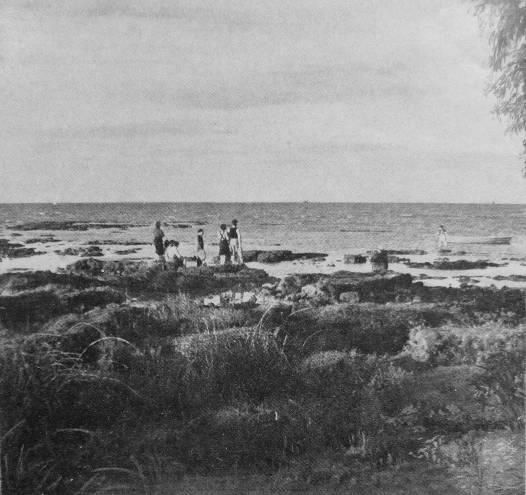
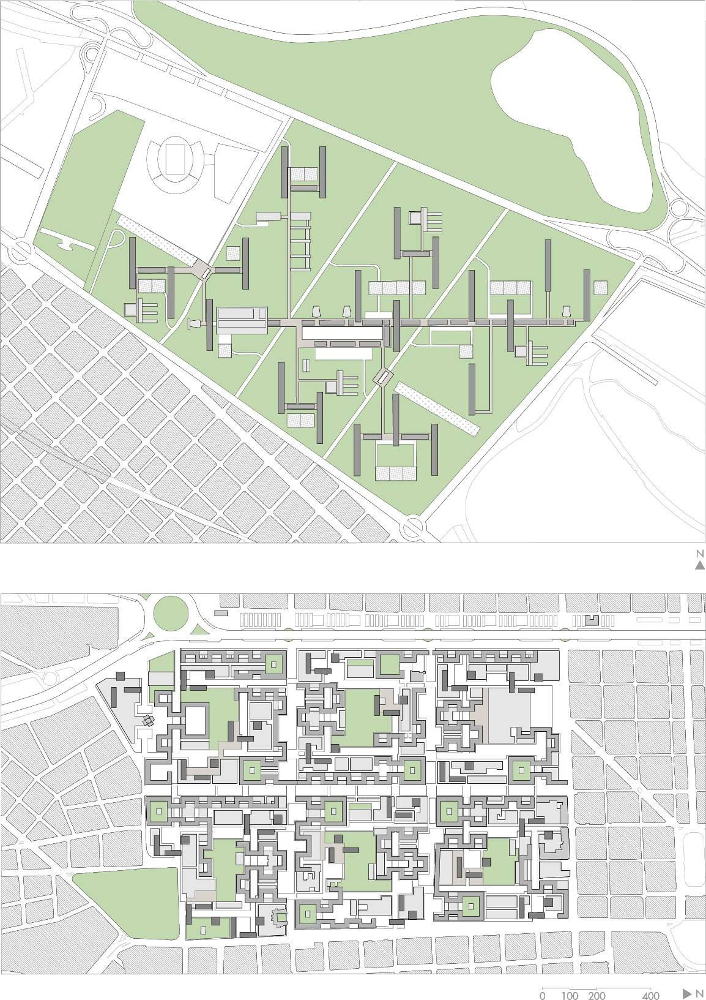

# Resumo

Ainda que os planos para Bajo Belgrano (1948-49) e para Barrio Sur
(1956) não tenham sido construídos, colocam uma sequencia importante ao
estudo da cidade moderna e à carreira de Antonio Bonet Castellana.
Trata-se de planos para novos bairros em Buenos Aires, nos quais a
habitação é reconhecida como programa capaz de renovação urbana, tanto
de áreas que eram pouco formalizadas, no caso de Bajo Belgrano, como de
áreas tradicionalmente constituídas ainda que subutilizadas como em
Barrio Sur. Os planos para Bajo Belgrano e Barrio Sur são discursos
distintos. Mas existiriam componentes intercambiáveis entre essas
proposições? Estudos recentes têm investigado ambos os planos
separadamente e pouco se têm discutido sobre as relações entre eles,
possíveis através do personagem comum Antonio Bonet Castellana. Este
texto tem por objetivo confrontar estes planos, explorando suas
diferenças e semelhanças, suas relações com a cidade existente, bem como
suas contribuições ao conhecimento sobre a cidade moderna.

Palavras-chave: Bajo Belgrano, Barrio Sur, Antonio Bonet Castellana,
cidade moderna, habitação coletiva

# Abstract

Although the plans for Bajo Belgrano (1948-49) and for Barrio Sur (1956)
were not built, they state an important sequence to the study of the
modern city and to Antonio Bonet Castellana's career. Both plans propose
new districts in Buenos Aires, in which housing is recognized as a
program capable of urban renewal, such as of areas that were slightly
formalized as in Bajo Belgrano, such as of areas that were traditionally
constituted but underutilized as in Barrio Sur. The plans for Bajo
Belgrano and for Barrio Sur are two different discourses. Despite this,
are there some interchangeable components? Recent studies have been
investigating both plans separately, and less has been discussed about
the relationship between them, possible through the common character
Antonio Bonet Castellana. By this perspective, this text aims to compare
these plans, exploring their differences and their similarities, their
relationship with the existing city, and their contributions to modern
city knowledge.

Keywords: Bajo Belgrano, Barrio Sur, Antonio Bonet Castellana, modern
city, collective housing

# Introdução

Em duas entrevistas concedidas no início da década de 1980,
respectivamente para as revistas "Summa" e "Dos Puntos", Antonio Bonet
Castellana relata os planos não construídos para Bajo Belgrano (1948-49)
e para Barrio Sur (1956) em sequência, explicando-os como trabalhos
relacionados. Trata-se de planos para novos bairros em Buenos Aires, nos
quais a habitação é reconhecida como programa capaz de renovação urbana,
tanto de áreas que eram pouco formalizadas, no caso de Bajo Belgrano,
como de áreas tradicionalmente constituídas ainda que urbanisticamente

estagnadas como em Barrio Sur. Entre esta explicação não há menção aos
projetos realizados em Punta Ballena (1945-48), ao Conjunto habitacional
TOSA (1952), ou mesmo a parceria com Ferrari Hardoy no Plano para
Necochea-Quequén (1952). Entre Bajo Belgrano e Barrio Sur, Bonet coloca
em evidência uma evolução crítica de determinados aspectos
constituintes, alertando que no primeiro a área de verde dedicada ao
projeto surpreende pelo tamanho; e que para o último, o verde deixa de
ser dominante para ser um dentre os demais componentes do espaço aberto
projetado (BONET in BOBZIN, 1983, p. 45-46; in PETRINA, 1983, p. 21).

Bajo Belgrano e Barrio Sur são também explicados em sequência um pouco
mais tarde por Katzenstein e colaboradores, quem os coloca como projetos
vinculados com as distintas abordagens desenvolvidas dentro dos
Congressos Internacionais de Arquitetura Moderna (CIAM). "Desde os
edifícios soltos em jardins" como em Bajo Belgrano, até o uso da
"densidade para levar a cabo propostas onde se guardava o espírito
tradicional de ruas e praças, tal como em Barrio Sur" (KATZENSTEIN et
al., 1985, p. 19-20, tradução nossa). Para os autores a comparação
interessa, pois Barrio Sur "expressa um ponto de vista oposto \[ao de
Bajo Belgrano\] com suas edificações contínuas e a estreita relação do
setor remodelado com a cidade existente" (KATZENSTEIN et al., 1985, p.
92, tradução nossa).

Estudos recentes têm investigado Bajo Belgrano e Barrio Sur
separadamente, mas com um argumento diferente ao de Katzenstein e
colaboradores: entendendo-os como proposições que apontam outras
transformações a partir das noções via CIAM; e que ambos se relacionam
com realidade urbana de Buenos Aires, e não só Barrio Sur. Para Ballent
(2009, p. 236, tradução nossa), Bajo Belgrano "se encontra completamente
afastado da repetição mecânica de 'receitas', com as quais se costuma
associar a arquitetura e o urbanismo produzido ou inspirado pelos CIAM"
e que a importância dada ao "estudo histórico da cidade pouco tinha que
ver com um urbanismo de 'tabula rasa'". Ainda sobre Bajo Belgrano,
Cabral (2010, p. 92-93) destaca o uso de equipamentos preexistentes como
o Estádio do River Plate (1938), que é reconhecido no projeto "como
parte ativa da composição", bem como a preocupação em formalizar um
sistema de circulação pedestre. Sobre Barrio Sur, Liernur (2011, p. 91;
89, tradução nossa) o coloca como projeto em que "se considerou a
resolução do problema da habitação em relação à estruturação urbana" de
Buenos Aires, integrando-se a cidade existente.

Os planos para Bajo Belgrano e Barrio Sur são proposições que
compreendem o imaginado no contexto urbano, como tantos os exemplos de
cidade moderna que por diversos motivos ficaram sem construir. Aqui são
entendidos como discursos de Antonio Bonet Castellana que se referem a
dois tempos da cidade moderna, bem como a dois cenários distintos de
Buenos Aires. Mas existiriam componentes intercambiáveis entre estas
proposições? Este texto tem por objetivo confrontar estes planos,
explorando suas diferenças e semelhanças, suas relações com a cidade
existente, bem como suas contribuições ao conhecimento sobre a cidade
moderna. Para tanto, o texto se estrutura por meio da comparação,
apresentando Bajo Belgrano para depois explicar Barrio Sur. Aos dois
projetos se procurou seguir uma descrição comum, iniciada pelo lugar em
que a proposta se estabelece seguida de como ela se organiza, para então
compreender seus componentes e relações mais específicas.

# Bajo Belgrano e a cidade sobre o verde

Bajo Belgrano é um dos trabalhos elaborados por Bonet, Jorge Ferrari
Hardoy e Jorge

Vivanco, em meio ao Escritório do Plano de Buenos Aires (EPBA,
1947-1949). Trata- se de uma proposta de bairro para 50.000 habitantes,
número derivado de pesquisas sobre a população presente em bairros de
Buenos Aires à época (ALVAREZ, 1991, p. 358; BALLENT, 2009, p. 235-236),
mais precisamente nos bairros Boca, Flores e Belgrano, fazendo uso de
"índices baseados na realidade" (EPBA, 1953, p. 20), para então conceber
uma proposta alternativa à cidade de quadras.

Na época, a área destinada ao projeto, apesar de configurada pela quadra
de origem espanhola, não era totalmente preenchida (Fig. 1). Em frente
ao Rio da Prata, a porção de 170 hectares conhecida como Bajo Belgrano e
circundada pelo o que hoje são a Rua Pampa e as avenidas Guillermo
Udaondo, Libertador e Leopoldo Lugones, apresentava terrenos inundáveis
e "com grande proporção de baldios" (EPBA, 1953,

p\. 21). A situação geográfica era oportuna para montar um contato
direto com a natureza, recuperando o sol, o ar, a luz "com uma magnífica
área de lazer e inclusive de veraneio" garantida pela proximidade com
rio (EPBA, 1953, p. 21, tradução nossa). Neste sentido, as áreas
dedicadas para o verde e lazer se colocam como importantes na proposta,
bem como a incorporação de equipamentos urbanos preexistentes e
adjacentes à área de projeto, tal como o Estádio do River Plate (1938),
a sede do Tiro Federal Argentino (1891), e o Projeto de Parque
Costanero.

> 
>
> Figura 1. Área de projeto à época. Fonte: EBPA, 1953, p. 20; 1949a.

A área é subdividida pelo plano em quatro grandes porções através do
prolongamento das atuais vias Juramento, Blanco Encalada e Manoel
Ugarte, que servem como estrutura de vinculação entre a nova cidade e a
existente, e oportunizam o desenvolvimento do trânsito veicular no
interior do bairro. Tais porções não são preenchidas pelo modelo da
quadra, mas sim pela transformação desta em 20 blocos habitacionais
intitulados "quarteirões verticais" de 180 metros de comprimento, 18 de
largura, 50 de altura e 2300 habitantes cada (EPBA, 1953, p. 48),
desenvolvidos sobre *pilotis*. Os blocos, ou os novos quarteirões, são
implantados de modo a obter uma insolação homogênea, estabelecendo sua
maior dimensão no sentido norte-sul,

concordando com o Estádio preexistente em vez de concordar com a
ortogonalidade sugerida pelas vias1. A maior densidade, próxima de 2952
frente aos 66 habitantes por

> 1 Para saber mais, ver: CABRAL, C. P. C. Uma máquina para jogar em
> Buenos Aires 1938-1978. *ARQTEXTO*, Porto Alegre, n. 17, p. 47-60,
> 2010.
>
> 2 Densidade calculada segundo o número de 50.000 habitantes e área
> total de 170 hectares.

hectare da época (EPBA, 1953, p. 26), e a menor ocupação resultantes
propiciam o desenvolvimento de áreas de lazer e de verde de modo
expandido, completando a operação de conversão do tecido tradicional em
tecido moderno, de peças sobre o verde, exemplificada nos fotogramas do
filme de divulgação "La ciudad frente al río" (1949) (Fig. 2).

> 
>
> Figura 2. Fotogramas do Filme "La ciudad frente al río" (EPBA, 1949)
> Fonte: "Arquitectes: Antoni Bonet", disponível em:
> [http://www.youtube.com/watch?v=oWTmDxevM_o,](http://www.youtube.com/watch?v=oWTmDxevM_o)
> acesso em nov. 2012.

Contudo, em vez de confirmarem este esquema simplificado, os diferentes
blocos de habitação, ou "quadras verticais", são conectados entre si por
uma megaestrutura de passeios cobertos, organizada transversalmente
(Fig. 3). Nas palavras do grupo "estas circulações corrigem os
inconvenientes que puderam produzir os grandes espaços abertos e
constituem, ao mesmo tempo, um elemento indispensável à escala humana"
(EPBA, 1953, p. 49, tradução nossa). Tal estrutura é preenchida por
comércio e moradia desses comerciantes, e oportuniza o estabelecimento
de escolas, centros de saúde, equipamentos esportivos, entre outros
programas de suporte à habitação fora dos blocos, em edifícios baixos e
diferenciados. A estratégia também favorece o estabelecimento de praças
e explanadas com o intuito de "recuperação da tradicional função latina
da praça como o centro da vida de relação" (EPBA, 1953, p. 39, tradução
nossa), além da implantação de uma "*Rambla* de Comércios e Explanada
Cívica" no centro compositivo do conjunto. Como Cabral (2010, p. 93; 96)
aponta, esta soma de elementos faz de Bajo Belgrano mais crítico
enquanto solução de espaço aberto que sua simples redução à área verde.

> 
>
> Figura 3. Maquete do Plano para Bajo Belgrano. Fonte: ALVAREZ; ROIG,
> 1996, p. 119; EPBA, 1953, p. 35.

O plano é subdividido em 10 unidades menores, descritas como "unidades
de vizinhança", que são reunidas a partir de dois blocos de habitação e
um pequeno comércio (EPBA, 1953, p. 37), e não a partir de um centro
escolar como sugere o

CIAM via Sert (1947, p. 70). Observando apenas o bloco, percebe-se uma
ativa exploração de sua seção no processo de projeto, que se dá pela
investigação de duas tipologias: a do bloco escalonado, de sacadas a céu
aberto e circulação horizontal aberta localizada em fachada; que evolui
para o bloco reto, composto por fita dupla de unidades e circulação
horizontal central, com maior possibilidade de se desenvolver em altura
(EPBA, 1953, p. 49). Ambas as tipologias apresentam diversidade quanto à
configuração das unidades, que se desenvolvem em duplex. Essas unidades
são acessadas pelas "circulações horizontais ou 'ruas do bloco' \[que\]
se definem pela vida a se desenvolver entre as famílias de uma quadra de
bairro" (EPBA, 1953, p. 49, tradução nossa), estendendo no plano
vertical os percursos pedestres iniciados no térreo.

Bajo Belgrano é apresentado no "IV Congresso Interamericano" (1949) e
posteriormente publicado em "Revista de Arquitectura" (1953) como
alternativa à cidade tradicional, demonstrando outras possibilidades de
organização frente ao aumento populacional. Por um lado, o plano é
mostrado como solução à cidade com falta de sol e de ar, características
associadas ao discurso CIAM (BALLENT, 2009, p. 33); a estas se poderiam
somar outras, como a insistência em uma maior densidade e menor
ocupação, a separação entre os trânsitos de veículos e pedestres, e a
adoção da ideia de unidade de vizinhança. Por outro lado, o plano também
é explicado a partir das estruturas urbanas que existem na cidade, seja
a partir da quadra tradicional, que é transformada, ou a partir dos
equipamentos preexistentes e que se vinculam a proposição. Neste sentido
aqui se destaca a importância dedicada ao estudo da cidade como aponta
Ballent, e a crítica à ocupação do espaço aberto colocada por Cabral.

# Barrio Sur e a cidade sobre a cidade

Sete anos depois de Bajo Belgrano, Bonet é convidado pelo presidente do
Banco Hipotecário Nacional a "fazer e estudar um projeto com uma
proposta de delimitação" (BONET in KATZENSTEIN et al., 1985, p. 95,
tradução nossa), organizando uma equipe entre oito arquitetos e doze
colaboradores3 para a elaboração de um plano de reabilitação. A proposta
é pensada para 450.000 habitantes, distribuídos sobre uma

área de 200 hectares próxima a Plaza de Mayo, limitada pelas avenidas
Paseo Colón, 9 de Julio, Belgrano e a Rua Caseros, incluindo o
preexistente Parque Lezama como área complementar (Fig. 4). Diferente de
Bajo Belgrano, a área de atuação de Barrio Sur não se dá sobre um
terreno pouco ocupado, mas sim sobre uma das áreas mais antigas da
cidade, e à época, subutilizada. Tal condição pretendia ser revertida
pelo plano através do uso da habitação, defendida como programa
importante para o centro da cidade.

A área limitada é dividida em seis grandes setores equivalentes, cada
qual substituindo aproximadamente 16 quadras e abrigando 75.000
habitantes. Esta divisão é feita pela manutenção de vias existentes,
sendo elas as ruas Perú, San Juan e Independencia, a manter o trânsito
veicular. Ao centro de cada setor são implantados edifícios de programas
especiais, áreas de lazer e de verde; para a periferia, implanta- se o
comércio, programa que configura o limite de cada um dos setores bem
como a continuidade entre plano e cidade existente. Sobre esta
estrutura, o que antes era

> 3 Colaboraram com Bonet: Luis H. Aberastain Oro, Horacio Baliero,
> Nélida Gurevich, Eduardo Polledo, Próspero
>
> E. Poyard, Victor Sigal, César A Vapñarsky e Severo A. Yantorno
> (arquitetos); Jorge A. Martucci (engenheiro); Osvaldo Lauersdorf
> (agrimensor); Eduardo Bell, Oscar N. Candioti, Raúl Pastrana
> (maquetes); Carmem Córdova de Baliero, Carlos Castiglione, Carlos E.
> Dourge, Justo J. Solsona, Fernando L. Tiscornia (desenhos). Alfredo
> Hlito (representação), e Aníbal G. Larumbe (fotografia) (BONET, 1957,
> p. 63).

ocupado pelo tecido tradicional de quadras e lotes, é rearranjado em
três tipos de edifícios -- a torre, de 100 metros de altura; a grega, de
30 metros de altura; e o edifício baixo, de 6 metros de altura. Tais
edifícios organizam uma densidade de

2.250 habitantes por hectare4, e se orientam de acordo com a lógica
ortogonal colocada pela cidade existente, ou seja, segundo os eixos
norte-sul e leste-oeste e não

conforme uma única orientação (Fig. 5).

> 
>
> Figura 4. Área de projeto à época. Fonte: BANCO HIPOTECARIO NACIONAL,
> 1957; HABITAT, 1958, p. 28.
>
> 
>
> Figura 5. Maquete do Plano para Barrio Sur. Fonte: Arquivo Histórico
> Colégio de Arquitetos da Catalunha, acesso em fev. 2013.

Os três tipos de edifícios utilizados em Barrio Sur -- a torre, a grega,
e o edifício baixo

-- são vinculados entre si por uma rede de percursos pedestres que se
expande por todo o plano. Esta rede não resulta do uso de um único
elemento, mas sim da interação entre os três tipos de edifícios,
intermediados pelo edifício baixo. Desta manipulação de componentes
resultam espaços abertos que variam desde pequenas praças até explanadas
cívicas e áreas de verde, diversificação relacionada com a preocupação
de Bonet (in BHN, 1957) com uma maior "adequação dos espaços exteriores"
(Fig. 6). Associado à rede pedestre se implantam diferentes programas de
suporte à habitação, tais como escolas, centros culturais e esportivos,
entre outros, que animam o percurso por entre os setores do projeto. Ao
centro de todo o conjunto, sobre a Rua Perú, e nas interseções desta com
as avenidas Independencia e San Juan, instala-se o que Bonet

> 4 Densidade calculada segundo o número de 450.000 habitantes e área
> total de 200 hectares.  chama de "centro comercial". Elemento passível de
associação com a ideia de rua comercial, que em meados da década de 1950
será característica comum entre diversos bairros de Buenos Aires (ABOY,
2010, p. 4).

> 
>
> Figura 6. Diferentes componentes do percurso pedestre. Fonte: Arquivo
> Histórico COAC, acesso em fev. 2013; BHN, 1957.

Cada um dos seis setores é divido em três "grupos de vizinhança" com
25.000 habitantes cada, dotados de comércios, uma escola e uma capela
(BHN, 1957). Exceto a cifra de habitantes e o programa idealizado, esta
divisão não se expressa claramente nos desenhos publicados sobre o
plano, possivelmente por se tratar de um plano diretivo -- a ser
completado ao longo de dez anos de obra e por diferentes arquitetos.
Desta forma, os componentes habitacionais permanecem abstratos, com
exceção de um conjunto de duas torres que Bonet teve a oportunidade de
melhor definir. Em relação às torres, Bonet desenvolve os tipos
norte-sul e leste-oeste, ambas retangulares, que abrigam 2.500
habitantes cada. A torre norte-sul tem as unidades organizadas em
duplex, e circulação horizontal lateral, que ocupa parte da fachada
orientada a sul; a torre leste-oeste tem as unidades desenvolvidas a
cada piso, e circulação horizontal central, de modo a ocupar com
unidades as fachadas ensolaradas a cada face do edifício. Já a grega
compõe um tipo semelhante ao *redent* de Le Corbusier, constituindo um
tecido contínuo, elevando-se sobre ruas, e se adaptando por entre as
quadras adjacentes à área de projeto. Por fim, o edifício baixo é aqui
entendido como uma estratégia de projeto. Por não ter uma forma
definida, a existir

como um retângulo, um quadrado, ou alguma forma especial, tal componente
oportuniza a manutenção de edifícios existentes no interior do plano5,
bem como o controle do grande espaço aberto, regulando a área de verde
dedicada à proposição.

Barrio Sur foi publicado em diversas revistas de arquitetura à época,
tal como a argentina "Mirador" (1957), as brasileiras "Módulo" (1957) e
"Habitat" (1958), e as europeias "Revista Nacional de Arquitectura"
(1956), "Bauen und Wohnen" (1958), e "Cuadernos de Arquitectura" (1959),
atingindo projeção internacional. Como vínculo ao discurso CIAM, além do
mencionado para Bajo Belgrano, pode-se citar as preocupações colocadas
para a 8ª edição, que evocam a importância de se atuar no centro das
cidades, ou no "coração da cidade", bem como a preocupação com uma
melhor adequação à escala humana (SERT in CIAM, 1952, p. 4; 11). Porém,
ao mesmo tempo, as decisões tomadas para conceber Barrio Sur travam
vínculos com a

> 5 Bonet especifica 30 edifícios de importância histórica, artística,
> social e/ ou econômica a serem mantidos pelo plano (BHN, 1957).

cidade que existe, seja pela adoção da forma da quadra, pelo respeito a
alinhamentos urbanos preexistentes, ou pela contenção das áreas de verde
organizadas para o projeto.

# Entre Bajo Belgrano e Barrio Sur

A justaposição entre Bajo Belgrano e Barrio Sur coloca uma pergunta
metodológica: cidade, bairro, setor, ou unidade de vizinhança, em quais
das medidas os planos são comparáveis? A resposta demandaria
considerá-los em relação ao problema populacional que determinaram
resolver (50.000-5.000/ 450.000-75.000-25.000); a área ocupada (170/ 200
ha.); e a estrutura programática montada. Esta pergunta coloca em
evidência o quão diferentes podem ser Bajo Belgrano e Barrio Sur.
Entretanto o que se pretende não é equiparar os planos, mas
investigá-los enquanto estratégias de revisão da cidade existente, e que
neste sentido incorporam elementos comuns. Para tanto, o primeiro
movimento expresso por Bajo Belgrano e Barrio Sur é partir da estrutura
urbana tradicional para então prosseguir em outra lógica (Fig. 7).

A quadra de Buenos Aires é questionada enquanto módulo urbano
pertinente, sendo entendida por Bonet (in BHN, 1957) como elemento
urbanístico "fora de escala", e sofre transformações. Em Bajo Belgrano a
organização de faixas espaçadas a cada três quadras (aproximadamente), e
que não são interrompidas por todo o limite do projeto, altera a forma
quadrada inicial, compondo uma parcela alongada e ampliada. Em Barrio
Sur a estrutura formal da quadra é mantida, mas também se agiganta,
envolvendo 16 quadras existentes; a ideia da quadra é trocada pela a de
setor, que se preenche de três tipos distintos de edifícios. A
deformação da quadra em Bajo Belgrano e a ampliação desta em Barrio Sur
aproximam a estrutura viária com o módulo de 400 metros sugerido por Le
Corbusier (1924, p. 162) como ideal para o trafego veicular da cidade
moderna. Esta nova medida interrompe a solução compartilhada entre o
trânsito de carros e pedestres, que passam a se estabelecer como
sistemas independentes.

Assim tanto Bajo Belgrano quanto Barrio Sur se preocupam em montar um
sistema de percursos pedestres (Fig. 8, 9), característica que não é tão
comum na tradição moderna como lembra Cabral (2010, p. 93). Ainda que
com estratégias distintas -- Bajo Belgrano e a megaestrutura de passeios
cobertos, Barrio Sur e o percurso resultante da interação entre seus
edifícios componentes -- os percursos pedestres montados por ambos são
preenchidos de programas animadores, como comércio, bem como de
componentes de lazer e vida cívica, como praças e esplanadas. Existe em
Bajo Belgrano e em Barrio Sur a comum associação de um componente de
circulação com outros de permanência, a montar um contexto mais complexo
em relação aos usos do espaço aberto e do nível térreo do que as
críticas à cidade moderna costumam sugerir. E se a preocupação de Bonet
com um sistema pedestre em Barrio Sur pode ser associada às discussões
em meio ao CIAM VIII (1951), não explica a mesma preocupação já presente
em Bajo Belgrano. Ambos os planos também preveem uma concentração
comercial no centro compositivo do projeto. No caso de Bajo Belgrano,
esta concentração central de serviços já era parcialmente discutida
pelas proposições de Steiger e Moser (SERT, 1947, p. 71), e no caso de
Barrio Sur pelas recomendações de Sert (in CIAM, 1952, p. 6) em relação
à ênfase aos centros de vida comunitária. Entretanto outra leitura
possível de ser feita é a sensibilidade destas propostas em relação ao
contexto local que se delineava, favorável ao desenvolvimento da rua
comercial.

> 
>
> Figura 7. Planos para Bajo Belgrano e Barrio Sur em mesma escala.
> Fonte: Redesenho do autor.
>
> 
>
> Figura 8. Sistemas de percursos
> pedestres: Bajo Belgrano (esquerda) e Barrio Sur (direita). Fonte:
> EPBA, 1953 p. 42; CUADERNOS DE ARQUITECTURA, 1959, p. 10.

Se a montagem de uma rede pedestre aproxima Bajo Belgrano de Barrio Sur,
o tratamento quanto à área de verde dedicada ao espaço aberto os
diferencia, confirmando a observação de Bonet de que há uma alteração
frente à relação cidade e natureza proposta. Em Bajo Belgrano a área de
verde é contínua, e não se limita pelos componentes edificados do
projeto, mas sim por seus limites de atuação. O verde separa Bajo
Belgrano da cidade existente, diferenciando-a como pedaço de "cidade
futura". Em Barrio Sur, ao contrário, o verde é controlado pelos
componentes edificados, e se limita à área central de cada um dos
setores planejados. Assim, Barrio Sur aparece como mais integrado à
cidade existente como observam Katzenstein e colaboradores (1985) e
também Liernur (2011). Contudo o que esta diferença coloca é que o
trecho de cidade esparsamente ocupado sobre o qual Bajo Belgrano é
pensado difere da ocupação densa de uma das áreas mais antigas da
cidade, e que é enfrentada em Barrio Sur.

> 
>
> Figura 9. Percurso pedestre: Bajo Belgrano (esquerda) e Barrio Sur
> (direita). Fonte: EPBA, 1949a; Arquivo Histórico COAC, acesso em fev.
> 2013.

Uma consequência deste diferente tratamento do espaço aberto e verde é
que Bajo Belgrano se faz menos denso que Barrio Sur, apresentando 295
habitantes por hectare, frente a 2.250. Esta densidade é ocupada em Bajo
Belgrano por vinte barras sobre *pilotis* espaçadas pelo território, e
separadas dos edifícios que abrigam os programas de suporte à habitação.
Já em Barrio Sur a densidade é distribuída entre torres, gregas e
edifícios baixos, e os programas de suporte à habitação podem se
misturar a essas tipologias, expandido as possibilidades de ocupação do
nível térreo. Assim, de Bajo Belgrano para Barrio Sur há uma ampliação
quanto às experimentações possíveis para as tipologias habitacionais,
bem como a diversificação entre programas que coincidem

em um mesmo tipo.

# Conclusão

Visando o tema do congresso, bem como o respectivo eixo temático
"Discurso Profissional", este texto procurou confrontar duas proposições
não construídas que Antonio Bonet Castellana participa, referidas pelo
arquiteto como discursos relacionados. Este texto não esgota as relações
possíveis entre estes projetos, mas constitui um começo, contribuindo
para um estudo mais detalhado sobre a cidade moderna. Como resposta à
pergunta inicial, tem-se que entre Bajo Belgrano e Barrio Sur o que há
em comum não são componentes exatos, os quais diferem em suas
especificidades, mas estratégias de projeto, vinculadas à cidade
existente ao mesmo tempo em que revisam suas estruturas.

Assim a quadra tradicional é reorganizada em novas parcelas, cujo
sistema viário é ampliado e as circulações entre veículos e pedestres
separadas. Contudo tais parcelas não são equivalentes entre si,
existindo em Bajo Belgrano uma abstração maior do que em Barrio Sur, já
que os componentes edificados daquela proposição deixam de coincidir com
a parcela desenhada para se orientar conforme outra lógica. Da mesma
maneira, tanto Bajo Belgrano quanto Barrio Sur organizam centros
comerciais e sistemas de percursos pedestres preenchidos de programas e
elementos. Tais características são aqui destacadas como contribuições
importantes para o estudo da cidade moderna, organizando um espaço
aberto diferente da ideia de blocos soltos sobre o verde, comumente
associada a essas proposições ou ao discurso CIAM. Porém cada sistema
pedestre é pensado de forma distinta: ainda que a preocupação de ambos
seja com o grande espaço aberto, o sistema montado para Barrio Sur se
realiza de forma mais expandida, distribuindo-se sobre o território em
vez de se limitar a uma estrutura unitária.

Desta maneira, o verde contínuo de Bajo Belgrano é controlado quando
aplicado em Barrio Sur, diferença que também se desdobra em
concentrações distintas. Esse predomínio de áreas abertas em Bajo
Belgrano ou de áreas construídas em Barrio Sur pode ser relacionado com
as abordagens inseridas no marco CIAM, mas também pode ser entendido em
relação à cidade que existe, já que o tecido comum entre estes pedaços
de cidade moderna respondem a diferentes contextos. Assim, Barrio Sur se
desenvolve como cidade concentrada por cima da cidade constituída,
enquanto que Bajo Belgrano se dá sobre o vazio e reivindica o verde como
elemento compositivo.

# Referências

ABOY, R. Ciudad, espacio doméstico y prácticas de habitar en Buenos
Aires en la década de 1950. Una mirada a los departamentos para las
clases medias. *Nuevo Mundo Mundos Nuevos*, Debates, 2010. Disponível
em:

\<[http://nuevomundo.revues.org/59215\>](http://nuevomundo.revues.org/59215).
Acesso em: 13 dez. 2013.

> ALVAREZ, F. *El sueño moderno en Buenos Aires (1930-49)*. 1991. 477 f.
> Tese (Doutorado em Arquitetura) - Departamento de Composição
> Arquitetônica, Universidade Politécnica da Catalunha, Barcelona, 1991.
>
> ALVAREZ, F.; ROIG, J. *Antoni Bonet Castellana 1913-1989*. Barcelona:
> Colegio de Arquitectos de Catalunya/ Ministério de Fomento, 1996.
>
> BALLENT, A. *Las huellas de la política. Vivienda, ciudad y peronismo
> en Buenos Aires, 1943-1955*. Bernal: Universidade Nacional de Quilmes:
> Prometeo 3010, 2009. 280 p.
>
> BANCO HIPOTECARIO NACIONAL. *Plan de Remodelación de la zona sudeste
> de la Capital Federal. Estudio Urbanístico, Legal y Financiero*.
> Buenos Aires: 1957. 49 p.

BOBZIN, A. Encuentros: Antonio Bonet. *Dos Puntos*, Buenos Aires, n. 10,
p. 43-51, julho 1983.

BONET, A. Plan de Remodelamiento de la Zona Sud de Buenos Aires.
*Mirador*, Buenos Aires, n. 2, p. 63-77, junho 1957.

> . Remodelamiento de la zona sur de Buenos Aires. *Cuadernos de
> Arquitectura*, Barcelona, n. 37, p. 8-13, 3o trimestre 1959.

CABRAL, C. P. C. Uma máquina para jogar em Buenos Aires 1938-1978.

*ARQTEXTO*, Porto Alegre, n. 17, p. 47-60, 2010.

> CIAM. *The Heart of the City: towards the humanisation of urban life*.
> Londres: Lund Humphires, 1952. 185 p.
>
> EPBA. *3a. Fundación de Buenos Aires.* Vigor: 1949a.
>
> . Exposición de Urbanismo*. IV Congresso Histórico-Municipal
> Interamericano*. Buenos Aires: Municipalidad de la ciudad de Buenos
> Aires, outubro, 1949b. 39 p.

. Urbanización del Bajo de Belgrano. Un barrio para 50.000 habitantes.

> *Revista de Arquitectura*, Buenos Aires, n. 369, p. 17-75, 1953.
>
> KATZENSTEIN, E. et al*. Antonio Bonet. Arquitectura y Urbanismo en el
> Río de la Plata y España*. Buenos Aires: Espacio Editora, 1985. 266 p.

LE CORBUSIER. *Urbanisme*. Paris: G. Gres, 1924. 285 p.

> LIERNUR, J. F. Las "villas miseria", el "Barrio Sur" y la "Revolución
> Libertadora". Una aproximación a la más importante propuesta de
> vivienda colectiva de Antonio Bonet. In: SHIMDT, C.; IBARLÚCIA, R.
> (Ed.). *1as Jornadas de Historia y Cultura de la Arquitectura y de la
> Ciudad. Historia, Estetica y Teorías de la Arquitectura: Grande Obras
> de la Arquitectura en la Argentina (1910-1980)*. Buenos Aires:
> Universidad Torcuato di Tella, 2011. p. 84-99.

PETRINA, A. Reportaje: Antonio Bonet, o el espíritu del Movimiento
Moderno.

*Summa*, Buenos Aires, n. 188, p. 19-22, junho 1983.

PROJETO de Remodelação da Zona Sul de Buenos Aires. Antonio Bonet.
*Módulo*, Rio de Janeiro, n. 7, p. 32-35, fevereiro 1957.

PROJETO de Urbanização para Buenos Aires. *Habitat*, Rio de Janeiro, n.
47, p. 62- 75, março-abril 1958.

> RAMOS, I. Noticia sobre urbanismo. *Revista Nacional de Arquitectura*,
> Madri, n. 178, p. 35-39, outubro 1956.
>
> SERT, J. L. *Can our cities survive? An ABC of urban problems, their
> analysis, their solutions*. Cambridge: The Harvard University Press,
> 1947. 259 p.

SLUM-SANIERUNG in Buenos Aires. *Bauen und Wohnen*, Munique, n. 3, p.
74-78, março 1958.
