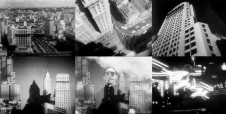
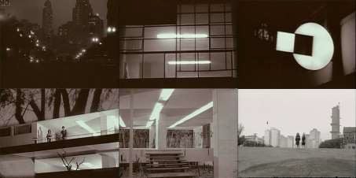
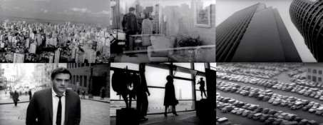
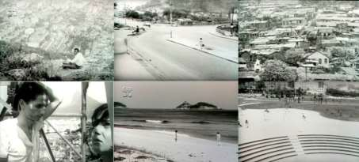

# Resumo

O trabalho aborda as representações das cidades através do cinema, e sua
atuação na composição de imaginários. São exploradas especialmente as
obras cinematográficas que se utilizam da captação de imagens da
metrópole em si, partindo das Sinfonias Urbanas do cinema de vanguarda
dos anos 1920, passando pelo neorealismo italiano e chegando à
cinematografia moderna brasileira. Sobre a cidade de São Paulo e seu
imaginário de "Cidade Máquina", percorrem-se as obras *São Paulo
Synphonia da Metropole* (Adalberto Kemeny e Rudolf Rex Lustig, 1929),
*Simão o Caolho* (Alberto Cavalcanti, 1952), *Noite Vazia* (Walter Hugo
Khouri, 1964) e *São Paulo Sociedade Anônima* (Luís Sérgio Person,
1965). Já sobre o Rio de Janeiro, "Cidade Samba", são abordadas as obras
*Rio 40 Graus* (1955) e *Rio Zona Norte* (1957), ambos de Nelson Pereira
dos Santos, *Cinco Vezes Favela* ([Marcos
Farias,](http://pt.wikipedia.org/w/index.php?title=Marcos_Farias&amp;action=edit&amp;redlink=1)
[Miguel Borges,](http://pt.wikipedia.org/wiki/Miguel_Borges_(cineasta))
[Cacá](http://pt.wikipedia.org/wiki/Cac%C3%A1_Diegues)
[Diegues,](http://pt.wikipedia.org/wiki/Cac%C3%A1_Diegues) [Joaquim
Pedro de Andrade](http://pt.wikipedia.org/wiki/Joaquim_Pedro_de_Andrade)
e [Leon Hirszman](http://pt.wikipedia.org/wiki/Leon_Hirszman), 1962) e
*A Grande Cidade* (Cacá Diegues, 1966).

Palavras-chave: Cidade, Cinema, Imaginário, Rio de Janeiro, São Paulo

# Abstract

The work examines the representation of cities through film, and its
performance in composing imageries. Are especially approached
cinematographic works that capture images of the metropolis itself, like
the Urban Symphonies of 1920's avant-garde cinema, Italian neorealism,
and finally the Brazilian modern filmmaking. About the city of São Paulo
and its imagery of \"Machine City\", are presented the movies *São Paulo
Synphonia da Metropole* (Adalberto Kemeny and Rudolf Rex Lustig, 1929),
*Simão o Caolho* (Alberto Cavalcanti, 1952), *Noite Vazia* (Walter Hugo
Khouri, 1964) and *São Paulo Sociedade Anônima* (Luís Sérgio Person,
1965). About Rio de Janeiro, "Samba City", are discussed *Rio 40 Graus*
(1955) and *Rio Zona Norte* (1957), both by Nelson Pereira dos Santos,
*Cinco Vezes Favela* ([Marcos
Farias,](http://pt.wikipedia.org/w/index.php?title=Marcos_Farias&amp;action=edit&amp;redlink=1)
[Miguel Borges,](http://pt.wikipedia.org/wiki/Miguel_Borges_(cineasta))
[Cacá](http://pt.wikipedia.org/wiki/Cac%C3%A1_Diegues)
[Diegues,](http://pt.wikipedia.org/wiki/Cac%C3%A1_Diegues) [Joaquim
Pedro de Andrade](http://pt.wikipedia.org/wiki/Joaquim_Pedro_de_Andrade)
and [Leon Hirszman](http://pt.wikipedia.org/wiki/Leon_Hirszman), 1962)
and *A Grande Cidade* (Cacá Diegues, 1966).

Keywords: City, Cinema, Imageries, Rio de Janeiro, São Paulo

# Cinema e Cidade: Representações

Desde o surgimento do cinema, ao final do século XIX, as imagens
produzidas por este meio estiveram estreitamente ligadas à formação e
difusão do imaginário da cidade moderna. Se os primeiros filmes da
história já se dedicavam a cenas essencialmente urbanas -- a saída dos
funcionários de uma fábrica, a chegada do trem na estação -- com o
passar dos anos, e com o desenvolvimento das linguagens
cinematográficas, os retratos inicialmente descritivos ou factuais se
diversificaram e refinaram, criando uma extensa gama de representações e
ressignificações da urbe, variáveis em suas tonalidades e intensidades,
dialogando com específicas conjunturas temporais, geográficas e
estéticas.

Em alguns dos momentos da história do cinema, as cidades fílmicas -- que
podem

resultar da construção de cenários, efeitos e trucagens -- se aproximam,
seja por questões artísticas ou técnicas , das "cidades reais", tendo
suas imagens captadas diretamente do meio urbano.

Um dos pioneiros e mais contundentes momentos de encontro do cinema com
a "cidade real" acontece nas primeiras décadas do século passado, quando
fascinados pela vitalidade da metrópole, que se tornava o locus por
excelência da vida moderna, os cineastas levaram suas câmeras para as
ruas, compondo verdadeiras odes à modernidade sob a forma das Sinfonias
Urbanas. Inseridas no ambiente de experimentações vanguardistas do
cinema do período entre guerras, esta alcunha em geral recai sobre uma
série de filmes desenvolvidos durante a década de 1920 onde as cidades e
os elementos urbanos atuam como substrato-base para a composição
estética e narrativa da obra. O termo "Sinfonia" faz referência direta
ao filme de Walter Ruttman, *Berlim, a Sinfonia da Metrópole* (*Berlin:
Die Sinfonie der Großstadt*, 1927) que, embora não seja o pioneiro do
"gênero", é uma obra emblemática. Podemos citar também *Apenas as Horas*
(*Rien que les Heures*, 1926), do brasileiro Alberto Cavalcanti sobre
Paris, *Um homem com uma câmera* (Tchelovek s kinoapparatom, 1929) de
Dziga Vertov, sobre as cidades da União Soviética, a brasileira *São
Paulo, Synphonia da Metropole* (1929), de Adalberto Kemeny e Rudolf Rex
Lustig, além de uma série de curtas-metragens . Em um breve período,
cada uma das grandes metrópoles possuía sua própria "Sinfonia".

Nestes filmes, embora as imagens tenham sido captadas a partir das
cidades reais, suas composições, advindas da montagem e das linguagens
particulares de cada uma das obras, resultaram em peças ímpares que,
embora conformassem um retrato cauteloso em relação à metrópole moderna,
ainda guardavam uma dose de otimismo, baseada na promessa, nas
possibilidades de um novo mundo.

Logo após a Segunda Guerra Mundial, quando já havia caído por terra boa
parte destas aspirações positivas, a cidade cinematográfica novamente se
liberta do ambiente controlado dos estúdios e mergulha nas ruas. Este
momento, que acontece no Neo-Realismo Italiano e se estende para os
outros movimentos do cinema moderno, é identificado por Filippelli como
um ponto de inflexão na história da relação entre o cinema e a cidade,
quando irrompe na tela a cidade real. Segundo o autor, ali o cinema leva
inscrito em sua condição estética o ideal da conquista do urbano, e a
apropriação da cidade contemporânea configura um momento inevitável na
consolidação de sua linguagem. (FILIPPELLI, 2008, pp. 30-31)

É nesse contexto de busca da "cidade real" renovado pelo Neo-realismo
Italiano -- que ofereceu ao cinema brasileiro, mais do que modelos
estéticos, "uma atitude moral ao mostrar como debruçar-se sobre a
realidade local, principalmente sobre o mundo popular" (FABRIS, 2007) --
que viria a se desenvolver a cinematografia moderna brasileira das
décadas de 1950 e 1960, alvos de nosso estudo. Nestas obras, as câmeras
não apenas mergulharão nas ruas, mas adentrarão as periferias e subirão
os morros, em filmes emblemáticos que subverterão a "ordem" das
sinfonias, fazendo as imagens da cidade se renderem aos acordes sinuosos
do samba.

## Quais Cidades, Quais Cinemas?

As décadas de 1950 e 1960 configuraram um período de profundas
transformações nas cidades -- e na sociedade -- brasileiras. Conforme
apontou Lopes (2008, pp. 23- 24), o ritmo da urbanização no período
entre 1940-1960 é especialmente

impressionante: enquanto a população total cresce no período pouco mais
de 70%, a população das cidades, com destaque para aquelas com mais de
500 mil habitantes, mais que triplicam. Foi ainda durante a década de
1960 quando a população urbana do país ultrapassou, em números
absolutos, a população rural.

Embora o crescimento urbano não seja um fenômeno exclusivo do Brasil ou
de outros países em desenvolvimento, Brito e Souza (2005, p. 49) apontam
que a grande novidade, neste caso, foi a velocidade do processo de
urbanização, muito superior à dos países capitalistas mais avançados.

Este processo de urbanização é impulsionado pela industrialização que,
de acordo com Lopes (2008, p. 60), provoca pronunciados desníveis
socioeconômicos no país, ao mesmo tempo em que se cria a rede de
transportes e de comunicações, unificando em um mercado nacional as
várias regiões brasileiras, gerando as condições básicas das migrações
internas. Neste movimento, são atraídos para as grandes cidades -- em
especial Rio de Janeiro e São Paulo -- antigos moradores do meio rural,
inclusive de outras regiões do país, principalmente do Nordeste, com a
promessa de emprego e melhores condições de vida.

Entretanto, esta promessa, em grande parte dos casos, não chegava a se
cumprir: mesmo aqueles que conseguiam empregos, ou sub-empregos,
acabavam por ficar às margens do prometido "progresso", já que a
agressiva expansão das cidades fez com que grande parte dos novos
habitantes ficassem alijados da infraestrutura urbana, e em condições
precárias de moradia, fosse em bairros periféricos ou em ocupações
irregulares de terrenos, como os morros. A situação destas regiões
periféricas configurava um contraste absoluto ao imaginário propagado
naquele período que vinculava a metrópole à "euforia de um progresso
marcado por símbolos urbanos" (BONDUKI, 1998, p. 266), ilustrado pelas
avenidas, pelos arranha-céus, pelos automóveis, pela indústria e pelo
desenvolvimento.

É importante apontar ainda que a expansão urbana, conforme apontam Brito
e Souza, configurava um dos componentes fundamentais das mudanças
estruturais da sociedade brasileira, que deve ser entendida como "a
construção irreversível da hegemonia do urbano, não só como o locus
privilegiado das atividades econômicas mais relevantes e da população,
mas também como difusora dos novos padrões de relações sociais --
inclusive as de produção -- e estilos de vida." (BRITO & SOUZA, 2005,
pp. 48-49)

Nesse contexto, a "hegemonia do urbano" viria a se estender, no âmbito
cultural, também para a produção cinematográfica nacional.

É importante pontuar nas décadas de 1930 e 1940 a produção do cinema
brasileiro se concentrava quase que exclusivamente no Rio de Janeiro, e
a grande maioria das obras orbitava entre o melodrama e a comédia,
gêneros de grande apelo popular e que, de acordo com Catani e Oroz
(1997, p. 309), narravam histórias que representavam o universo
simbólico dos espectadores da época, como metáfora das "cidades semi-
rurais". Os autores apontam também a importante presença das chanchadas,
que a partir dos anos 40 passam a se dedicar ao cotidiano do homem
urbano, abordando temas como a "a carestia, a falta de água, as
deficiências do transporte urbano, a demagogia eleitoreira, a corrupção
política, a indolência burocrática, o empreguismo generalizado no
serviço público, etc." (CATANI & OROZ, 1997, p. 314)

Já a década de 1950, uma das mais complexas na história do cinema
brasileiro, viria renovar a produção cinematográfica nacional tanto nos
modos de produção como em sua linguagem. A criação da Companhia Vera
Cruz, que tinha como objetivo a instalação de um modelo industrial de
produção cinematográfica, foi dirigida por Alberto Cavalcanti e trouxe
técnicos europeus com o intuito de "profissionalizar" a atividade no
Brasil. Mesmo tendo vida breve -- criada em 1949, entrou em declínio já
em 1954 -- a Companhia realizou dezenas de obras, e impulsionou a
criação de outros estúdios, como Maristela, Multifilmes e Kinofilmes,
que acabaram por incluir São Paulo no mapa da produção cinematográfica
nacional. Entre os filmes produzidos neste contexto, obras como *Simão o
Caolho* (1952) de Alberto Cavalcanti e *Na Senda do Crime* (1954), de
Flaminio Cerri, já direcionam o olhar para a cidade a partir das grandes
mudanças do período.

Foi também na década de 1950 que se iniciaram as transformações na
linguagem cinematográfica, com o chamado "cinema de autor" -- inaugurado
por *Rio 40 Graus* (1955), de Nelson Pereira dos Santos -- que viria
abrir caminhos para a consolidação do Cinema Moderno brasileiro, em
especial sob a forma do Cinema Novo.

É interessante observar, conforme já apontou Pinto (2013, p. 15), que os
"filmes urbanos" não eram então um ponto pacífico neste contexto, já que
alguns dos cinemanovistas, marcados por uma formação de esquerda,
tendiam a ver esse tipo de produção como "burguesa" e "alienante",
atrelada ao imaginário da modernidade, que mascarava as mazelas sociais.
Sob este ponto de vista, os filmes rurais estariam mais próximos da
realidade. Entretanto, outros cineastas acreditavam que "a cidade
deveria ser representada em toda a sua complexidade metropolitana,
porque -- essa, sim -- representaria a realidade que desejavam
desvendar".

Desta forma, através do olhar destes cineastas -- entre eles Nelson
Pereira dos Santos, Cacá Diegues, Walter Hugo Khoury, Luiz Sergio Person
-- as cidades foram filmadas em seus plenos processos de crescimento e
transformações, e ressignificadas em obras cinematográficas que ajudaram
a conformar o imaginário da metrópole moderna brasileira.

## São Paulo, Cidade Máquina

A cidade de São Paulo -- e não o Rio de Janeiro, a então capital federal
-- foi a "grande metrópole moderna" brasileira escolhida para ser
retratada, nos anos 1920, através de uma Sinfonia Urbana: *São Paulo,
Synphonia da Metropole*, de Adalberto Kemeny e Rudolf Rex Lustig, em 1929. 
A obra, de certa forma, inaugura o imaginário cinematográfico da
capital paulista sob o signo de "máquina produtiva" brasileira.

Apesar da obra realizada na década de 20, a produção de filmes no
Estado, em especial no que diz respeito a longas-metragens de ficção,
era muito limitada até a década de 1950, quando aconteceram os esforços
de industrialização da atividade cinematográfica, como a criação da
Companhia Cinematográfica Vera Cruz, e de estúdios como Maristela e
Multifilmes, que viriam a incluir São Paulo no eixo das produções
fílmicas do país.

Em seu livro *São Paulo em Preto & Branco*, Waldir Salvadore (2005, p.
19) aponta que as décadas de 1950 e 1960 demarcam dois extremos do
conceito da cidade sobre si própria: dos discursos oficiais
triunfalistas, compostos por um otimismo que, muitas vezes, beirava a
ingenuidade, à constatação desiludida, poucos anos depois, da

crescente deterioração da qualidade de vida e do empobrecimento da
população da metrópole periférica. Nas palavras do autor,

> a mancha da cidade que, se ainda apresentava uma escala relativamente
> humana nos anos 40, no decorrer das duas décadas seguintes explode
> numa verdadeira "metástase" urbana, destrói-se e reconstrói-se de
> forma vertiginosa, perde- se nos labirintos que criou, dilui-se nas
> massas anônimas que em ondas gigantescas vêm povoá-la. As letras, o
> cinema e as artes em geral, de resto, acompanham e registram a seu
> modo esse processo de fragmentação, de massificação, de estilhaçamento
> da identidade urbana e humana da metrópole que "não pode parar". Uma
> metamorfose violenta e traumática
>
> -- aliás, marca permanente da evolução de São Paulo no século XX --
> suprimindo marcos urbanos, tradições, espaços públicos, formas de
> convivência, esgarçando o tecido social e transformando a cidade no
> que Francisco Weffort chamou com propriedade de um imenso acampamento
> de obras. (SALVADORE, 2005, p. 18)

Esta "metamorfose violenta e traumática" do tecido da cidade é mostrada
com maestria, e com uma inegável dose de saudosismo, na obra *Simão o
Caolho* (1952), de Alberto Cavalcanti. O diretor brasileiro, pioneiro do
"gênero" das Sinfonias Urbanas com *Rien que les heures*, filmado em
Paris em 1926, já havia demonstrado naquele filme sua preocupação com a
passagem do tempo, retomada em seu filme de 1952, que bebe diretamente
das vanguardas europeias. Em uma sequência de aproximadamente dois
minutos que representa o salto temporal de 1932 para 1952, Cavalcanti
revisita a estética dos filmes de vanguarda, sem perder o "contexto
tupiniquim": iniciada com um muro que cai, e que tem o ruído confundido
com os "canhões" da Revolução de 32, a sequência segue com uma montagem
ritmada de planos de detalhe que aqui substituem as engrenagens das
máquinas por rudimentares processos da construção civil, seguida por uma
colagem de edifícios aos moldes de *Metropolis* de Paul Citröen ou dos
cartazes de *Berlim, a Sinfonia da Metrópole*; segue-se para uma
vertiginosa vista do topo de um edifício, a partir de onde é mostrado o
*skyline* da São Paulo da década de 1950, e finaliza-se com uma série de
planos noturnos, com enfoque nas luzes e na publicidade de neon. Apesar
da apresentação da metrópole nesta cena -- que é quase uma licença
poética de Cavalcanti -- Simão transita por um ambiente urbano, em
especial o bairro onde mora, que apresenta características quase rurais,
contando com casas com galinheiros nos quintais.

> 
>
> Figura 1 -- Fotogramas do filme *Simão, o Caolho* (Alberto
> Cavalcanti, 1952)

Estes resquícios interioranos se perderão nos filmes urbanos que
retratarão São Paulo nos anos seguintes.

*Noite Vazia* (1964), de Walter Hugo Khouri, é uma obra essencialmente
noturna, e tem grande parte de sua trama desenvolvida entre quatro
paredes. Mesmo assim, apresenta uma interessante abordagem da cidade. A
obra se inicia com uma tomada das ruas a partir de um carro em
movimento, tipo de plano que será recorrente nos filmes ambientados na
capital paulista, denotando uma nova forma de flânerie possibilitada
pelo automóvel, um dos símbolos do desenvolvimentismo do período. Seus
personagens, que frequentam espaços desenhados por elegantes linhas
modernas, vagueiam pela cidade na tentativa de preencher o vazio de suas
vidas -- ou de sua noite, como sugere o título da obra -- o que se
mostra uma tentativa vã. Com o nascer do dia, os personagens estão tão
entediados como estavam no início da noite.

> 
>
> Figura 2 -- Fotogramas do filme *Noite Vazia* (Walter Hugo Khouri,
> 1964)

Este vazio enunciado pelo filme de Khouri viria se repetir naquela que
é, talvez, a obra mais significativa sobre a capital paulista daquele
período, *São Paulo S.A.* (1965), de Luis Sergio Person. Como o título
denota, a São Paulo de Person é uma cidade indústria, uma sociedade
anônima, em todas as interpretações possíveis. Situada no cerne da
discussão sobre o desenvolvimentismo, os personagens estão sempre
buscando algo que não conseguem alcançar: parecem ser todos levados pelo
mecanismo implacável da metrópole-máquina.

> 
>
> Figura 3 -- Fotogramas do filme *São Paulo S.A.* (Luís Sérgio Person,
> 1965)

O personagem principal, Carlos, assim como fará Calunga em *A grande
cidade* (Cacá Diegues, 1967), vagueia pela cidade, dialoga com ela ou
apesar dela. Entretanto, seu vagar não é aquele de quem não tem nada a
perder, como será o do personagem carioca, mas o de quem não tem nada a
ganhar. Apesar de possuir tudo o que a cidade lhe pode oferecer, ela
representa uma prisão e, ao resolver se libertar dela, ao final do
filme, se vê impelido a voltar, adentrando por suas periferias como em
uma imagem de pesadelo. Ao habitante metropolitano só resta um destino:
deixar-se levar por suas engrenagens e "recomeçar, recomeçar, mil vezes
recomeçar".

## Rio De Janeiro, Cidade Samba

A cidade do Rio de Janeiro, além de desde cedo ter se estabelecido como
principal polo produtor de cinema do país foi também, muito
provavelmente, a cidade brasileira mais presente nas telas, tanto em
produções nacionais como internacionais. Capital Federal até 1960, seu
status de "capitalidade" , como coloca Carlos Eduardo P. de Pinto (2013,
p. 14), persistiu ainda durante alguns anos após a transferência da
capital para Brasília , sendo que o "imaginário" carioca acabava por
representar, como metonímia, a imagem do próprio Brasil.

Antônio Rodrigues, em seu livro *O Rio no Cinema* destaca que a evolução
da mitologia e da imagem do Rio no cinema acompanhou, em certa medida, a
evolução da realidade da cidade e da percepção desta, passando da
"contemplação do belo quadro geográfico e de um ambiente marcado pela
alegria de viver para filmes em que a cidade é vivida na sua banalidade
cotidiana, e depois para a anormalidade da violência e da
instabilidade." (RODRIGUES, 2008, p.15)

Se até o início da década de 1950 a representação cinematográfica do Rio
consistia em um "Éden tropical hedonista, sem complexidade e
representativo de todo o Brasil" (PINTO C. E., 2013, p. 14), foi em *Rio
40 graus* (1955), de Nelson Pereira dos Santos, que a cidade foi
mostrada pela primeira vez com suas veias abertas e sua crua realidade.
Ao subir o morro, mais do que "apenas" mostrar a favela, a obra constrói
uma interpretação sobre ela, que a exibe de forma simpática (PINTO C.
E., 2013, p. 41). Esta mudança de perspectiva não foi bem-vinda para
alguns dos setores conservadores da sociedade, e inaugurou uma série de
discussões públicas que só viriam aumentar a visibilidade da obra.

> Figura 4 -- Fotogramas do filme *Rio Zona Norte* (Nelson Pereira dos
> Santos, 1967)

*Rio 40 Graus*, entretanto, seria apenas o primeiro de uma série de
outros filmes que viriam abordar de forma rica e complexa as questões
urbanas da cidade do Rio de Janeiro, com destaque para *Rio Zona Norte*
(1957, Nelson Pereira dos Santos), *Cinco Vezes Favela* (Marcos Farias,
Miguel Borges, Cacá Diegues, Joaquim Pedro de Andrade e Leon Hirszman,
1962), e *A Grande Cidade* (1966, Cacá Diegues).

Os dois filmes de Nelson Pereira dos Santos se dedicam a mostrar nas
telas os habitantes das regiões marginalizadas da cidade, contraposta à
imagem da Cidade Maravilhosa. É interessante notar que, em *Rio 40
Graus*, o diretor "inaugura" a apropriação da favela como elemento de
identidade da cultura popular no cinema, e que *Rio Zona Norte*
apresenta uma ácida crítica sobre o processo de apropriação dessa mesma
cultura popular pelos artistas e intelectuais.

*Cinco Vezes Favela*, filme em cinco episódios, dirigidos por cineastas
diferentes, chama a atenção pela abordagem direta às questões urbanas em
suas tramas. Em *Um Favelado*, de Marcos Farias, é abordada a falta de
possibilidades de um morador da favela, desempregado, se inserir na
sociedade; o personagem é levado a participar de um crime, acabando
linchado e preso. *Zé da Cachorra*, de Miguel Borges, insere sua trama
em uma favela "grilada", abordando o acordo informal dos moradores com o
suposto "dono" da favela, em um retrato das disputas sobre o solo urbano
que adquire contornos de uma nova forma de coronelismo. *Escola de
Samba, Alegria de Viver* trabalha as relações da comunidade do morro com
a Escola de Samba local. Em *Couro de Gato*, de Joaquim Pedro de
Andrade, um grupo de crianças sai à caça de gatos para serem vendidos a
uma fábrica de tamborins; na obra, chamam atenção não apenas o contraste
entre o conforto em que vive o gato "de madame" roubado e a vida
precária dos próprios meninos, mas também a impossibilidade de um dos
garotos manter o animal para si, já que não tem condições de alimentá-lo
e acaba vendendo-o para a fábrica. Por fim*, Pedreira de São Diogo*, de
Leon Hirszman, aborda o dilema de um grupo de trabalhadores de uma
pedreira que se vê dividido entre atender o comando do chefe -- detonar
uma carga grande de dinamite -- e manter a segurança do local que
habitam, uma favela sobre o próprio morro da pedreira. Mesmo que o final
da maioria dos episódios seja trágico, o desfecho de *Pedreira de São
Diogo* confere à obra um encerramento otimista e de caráter alegórico: a
comunidade do morro se mobiliza e, unida, faz com que o dono da pedreira
desista da explosão.

> Figura 5 -- Fotogramas do filme *Cinco Vezes Favela* (Marcos Farias,
> Miguel Borges, Cacá Diegues, Joaquim Pedro de Andrade e Leon Hirszman,
> 1962)

Por fim, *A Grande Cidade*, de Cacá Diegues, como o próprio título
indica, configura uma "ode" à "grande cidade", o Rio de Janeiro. A obra
reúne uma série de questões intrínsecas ao acelerado crescimento urbano:
a migração, impulsionada pela oferta de trabalho na construção civil e
pelo sonho de uma vida melhor; a falta de infraestrutura e a
precariedade das habitações nas favelas; a criminalidade, à qual muitos
dos migrantes acabam por ser conduzidos a aderir. Mais do que um
retrato, o filme compõe uma crítica ácida e irônica aos processos
inerentes à urbanização e à "vida moderna", sob o ponto de vista de
Calunga, personagem que atravessa o filme da mesma forma que vagueia
pela cidade, como um flâneur que, por não ter nada a perder, pouco se
importa com as tragédias à sua volta; em suas próprias palavras, "só
tenho medo é da morte, que ela é fiel. E o resto, que se dane".

> 
>
> Figura 6 -- Fotogramas do filme *A Grande Cidade* (Cacá Diegues,
> 1966)

## Considerações Finais

Inseridas em um contexto demarcado por um crescimento urbano desmedido e
contraditório, as obras cinematográficas produzidas no Brasil nas
décadas de 1950 e 1960 participam ativamente da construção do imaginário
de nossas metrópoles, dotado de visões muitas vezes adversas, mas não
excludentes entre si.

A cidade de São Paulo, que teve como pioneira representação
cinematográfica uma Sinfonia Urbana ainda em 1929, reafirma, nas décadas
de 1950 e 1960, seu status de metrópole como máquina produtiva, como
lócus do progresso e da vida moderna. Embora sejam retratados alguns
bairros que apresentam fortes relações de vizinhança

e mesmo características semi-rurais, como em *Simão o Caolho*, na
filmografia consultada as favelas ou assentamentos periféricos não
chegam a compor o universo cinematográfico, mesmo que já fizessem parte
da realidade da cidade. A representação fílmica da capital paulista
possui olhar direcionado para os dilemas de seus habitantes que, com
maior ou menor poder aquisitivo, se enquadram no perfil desenhado pelas
rígidas engrenagens da metrópole formal.

Já o Rio de Janeiro, antiga Capital Federal e polo cinematográfico
nacional, teve seu imaginário de "Éden tropical" retrabalhado a partir
dos anos cinquenta, quando a "Cidade Maravilhosa" foi contraposta -- ou
passou a ser somada -- ao seu território limítrofe, às margens
resultantes do crescimento urbano desigual, os espaços dos subúrbios,
das favelas e dos morros. Neste processo, alguns dos elementos
representativos da cultura popular destas localidades foram incorporados
como constitutivos da ideia de Cultura nacional.

Através de suas características específicas, as representações
cinematográficas destas duas cidades ajudam a compor o imaginário da
metrópole de um país em plenas transformações que, ao mesmo tempo em que
deseja se afirmar como locus do progresso e da vida moderna, busca
constituir seu diferencial nas bases de sua cultura popular, tramitando
em um terreno fronteiriço entre a sinfonia e o samba.

# Referências bibliográficas

> BONDUKI, N. (1998). *Origens da habitação social no Brasil:
> Arquitetura Moderna, Lei do Inquilinato e Difusão da Casa Própria*.
> São Paulo: Editora Estação Liberdade.
>
> BRITO, F. (2006). *O deslocamento da população brasileira para as
> metrópoles*. Estudos Avançados, 20, 221-236.
>
> BRITO, F., & SOUZA, J. d. (2005). *Expansão urbana nas grandes
> metrópoles: o significado das migrações intrametropolitanas e da
> mobilidade pendular na reprodução da pobreza*. Perspectiva, 19, 48-63.
>
> CATANI, A. M., & OROZ, S. (1997). Indústria Cinematográfica na América
> Latina: Um Paradigma de Modernidade - Anos 30-40-50. In: T. M.
> BESSONE, & T. A. QUEIROZ, *América Latina: Imagens, Imaginação e
> Imaginário* (pp. 305-323). São Paulo: Edusp.

FABRIS, M. (jul/dez de 2007). A questão realista no cinema brasileiro:
aportes neo- realistas. *ALCEU*, 8, 82-94.

> FILIPPELLI, R. (2008). *El plano justo: cine moderno de Ozu a
> Gordard*. Buenos Aires: S. Arcos.
>
> LOPES, J. R. (2008). *Desenvolvimento e mudança social: formação da
> sociedade urbano-industrial no Brasil*. Rio de Janeiro: Centro
> Edelstein de Pesquisas Sociais.

PINTO, C. E. (2010). Uma grande cidade a 40 graus: o Cinema Novo e a
representação crítica da modernidade . *Anais: Encontro Regional da
ANPUH - RIO*. Rio de Janeiro: Associação Nacional de História.

> PINTO, C. E. (2013). *Imaginar a cidade real: O Cinema Novo e a
> representação da modernidade carioca (1955-1970)*. Niterói: Tese.
> Curso de Pós-graduação em História da Universidade Federal Fluminense.
>
> RODRIGUES, A. (2008). *O Rio no cinema*. Rio de Janeiro: Nova
> Fronteira.
>
> SALVADORE, W. (2005). *São Paulo em preto & branco: cinema e sociedade
> nos anos 50 e 60*. São Paulo: Annablume.
