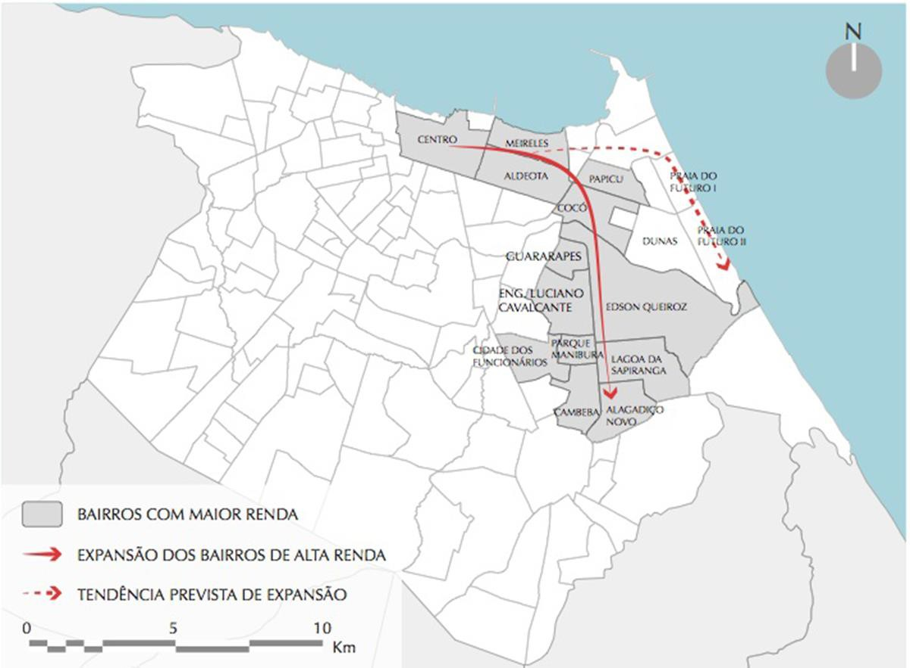
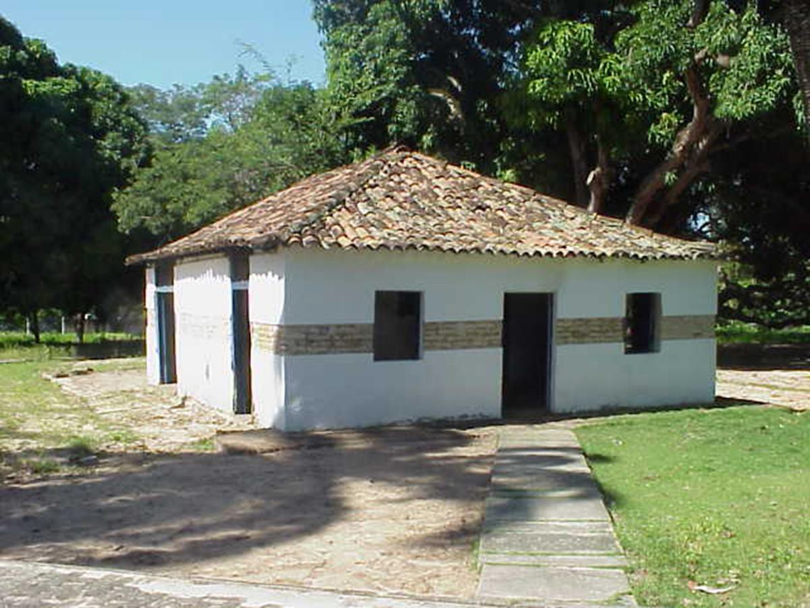
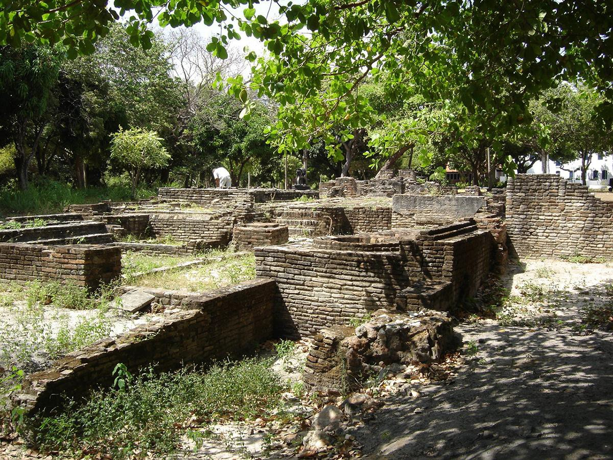
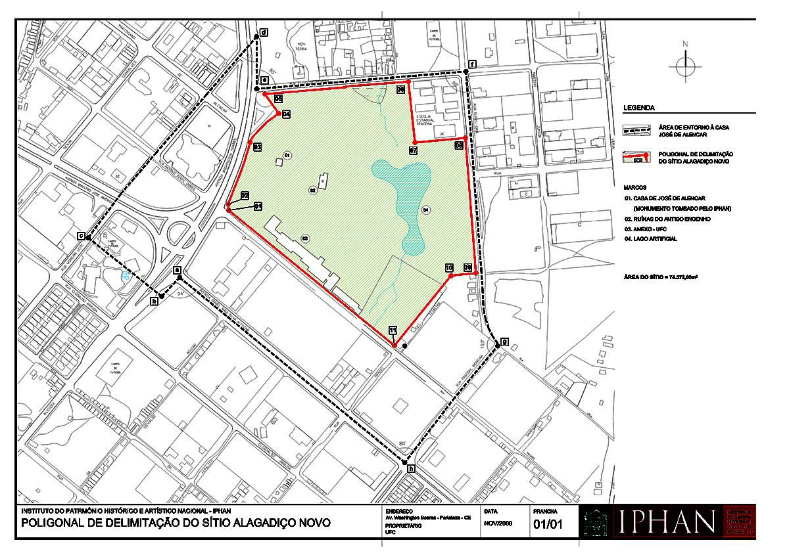

# Resumo

A finalidade deste trabalho é fazer um apanhado histórico da ocupação do
Sítio Alagadiço Novo -- primeira morada do escritor romântico José de
Alencar -- investigar a natureza de sua relação com o meio, refletir
sobre as opções políticas e ações adotadas com vistas à sua preservação
e descrever o seu estado atual. Busca-se, por este modo, compreender a
relação do sítio histórico com a cidade de Fortaleza, demonstrar sua
importância para as dinâmicas urbanas e para a cultura local e provocar
a discussão sobre novas possibilidades urbanísticas, em decorrência do
relacionamento entre bem patrimonial, produção do ambiente construído e
a participação comunitária.

Palavras-chave: patrimônio cultural, sítio histórico Alagadiço Novo,
Fortaleza-Ce

# Abstract

The objective of this endeavor is to develop a historical overview of
the Sítio Alagadiço Novo -- birthplace of the romantic writer, José de
Alencar -- focusing on how it harmonizes with the environment in which
it is located, and reflecting on policy options and actions taken which
will impact its preservation and shed light on its current condition.
The goal, then, is to better understand the relationship with this
historic site in relation to the city of Fortaleza: highlighting its
importance in terms of urban dynamics and local culture, and ultimately
beginning a conversation which will discuss new urban possibilities
directly related to the relationship between the site, the production of
the built environment and the community participation.

Keywords: cultural heritage, historic site Alagadiço Novo,
Fortaleza-Brazil

# Introdução

A finalidade deste trabalho é fazer um apanhado histórico da ocupação do
Sítio Alagadiço Novo -- primeira morada do escritor romântico José de
Alencar -- investigar a natureza de sua relação com o meio, refletir
sobre as opções políticas e ações adotadas com vistas à sua preservação
e descrever o seu estado atual. Busca-se, por este modo, compreender a
relação do sítio histórico com a cidade de Fortaleza, demonstrar sua
importância para as dinâmicas urbanas e para a cultura local e provocar
a discussão sobre novas possibilidades urbanísticas, em decorrência do
relacionamento entre bem patrimonial, produção do ambiente construído e
a participação comunitária.

O Sítio Alagadiço Novo, por ter sido o palco central das vidas de
personagens importantes para a narrativa cearense -- o escritor José de
Alencar, pioneiro da literatura romântica brasileira, e seu pai, José
Martiniano de Alencar, político de grande relevância na reconstituição
da economia do Estado, nos anos 1830 -- deve ser compreendido, hoje,
como um local de resgate histórico e de trocas culturais e assimilado
pela comunidade como um sagrado relicário da história distante, mas
tangível para a cidade contemporânea.

A abordagem será feita a partir das dinâmicas de ocupação experimentadas
pelo setor sudeste do Município de Fortaleza, onde se localiza o Sítio
Alagadiço Novo, e compreenderá a formação dos loteamentos e bairros
atuais, passando por eventos históricos relacionados à chegada da
família Alencar. A descrição da situação atual do Sítio e de seu acervo
será empreendida no sentido de entender seu imenso potencial cultural,
paisagístico, patrimonial e educacional.

O trabalho culmina com uma proposição, relacionada com a necessidade de
se adotarem políticas públicas capazes de nortear a ação dos atores
envolvidos na gestão patrimonial, do Sítio Alagadiço Novo. A adoção de
novas estratégias administrativas tem por fim transformar o Sítio
Alagadiço Novo em um indutor do desenvolvimento urbano da região em que
está situado, tendo como força motriz sua história e seu potencial para
articular atividades econômicas e culturais em prol do desenvolvimento
social e da construção da identidade de um povo e fortalecimento da
cidadania.

# Sítio Alagadiço Novo: ocupação histórica

O Sítio Alagadiço Novo constitui, hoje, um dos equipamentos culturais
mais importantes da cidade de Fortaleza e do Estado do Ceará. Localizado
em bairro homônimo, está situado no distrito da Grande Messejana, zona a
que o Sítio está intimamente vinculado em razão de fatos históricos, que
remontam às primeiras ocupações indígenas, ali existentes antes mesmo da
chegada de Pero Coelho de Sousa ao Ceará, em 1603. Messejana, ou
Mecejana - grafia utilizada por Alencar em 'Iracema' - tem um passado de
independência, foi vila e posteriormente município (FUCK JR, 2004),
antes de se tornar bairro de Fortaleza.

O Distrito de Messejana origina-se da Nação Potiguara, aglomerados
indígena que vivia em uma aldeamento criado pela Coroa Portuguesa
quando, em 1607, chegam ao território os padres jesuítas Francisco Pinto
e Luís Pernambuco (PEREIRA, 2010). Ao desenvolver suas atividades de
catequese os missionários se estabelecem no local e fundam a aldeia de
São Sebastião de Paupina a qual, mais tarde, em 1760, será

promovida à categoria de vila através de Carta Régia passando a
chamar-se Vila Nova Real de Messejana (FUCK JR, 2004).

Sob a autoridade da Coroa Portuguesa, a ocupação da região se desenvolve
e consolida-se como zona residencial, baseada em atividades agrícolas. É
neste contexto que, no século XIX, quando o Estado do Ceará encontra-se
sob o comando político da capitania de Pernambuco, a área é parcelada,
cada parcela transformada em sítios, os quais são concedidos a
empreendedores do Sul do País. Advém dessa época, e como consequência
dessa política de inserção fundiária, o estabelecimento da família
Alencar no Sítio Alagadiço Novo, um dos primeiros a firmar-se nas
proximidades da Vila de Messejana (RIBEIRO, 1982).

Em 1806, o Padre José Martiniano de Alencar, nascido no Crato, filho da
revolucionária Bárbara de Alencar, firma-se no local a que dá o nome de
Alagadiço Novo, em alusão aos ecossistemas constituintes da região.
Alencar traz consigo as primeiras mudas de cana-de-açúcar a serem
plantadas em suas novas terras, cultura que apresenta uma boa adaptação
local, levando-o a instalar em sua propriedade o primeiro engenho a
vapor do Ceará. A partir deste, multiplicam-se os engenhos e a produção
açucareira regional. (RIBEIRO, 1982)

É durante esse período de prosperidade econômica que vem ao mundo o
herdeiro mais célebre do padre Alencar, filho da união com sua prima
legítima Ana Josefina de Alencar. José de Alencar, o escritor, nasce em
1º de março de 1829 no Sítio Alagadiço Novo, onde vive os primeiros nove
anos de sua vida. Dotado de natureza abundante e belas paisagens, o
Sítio vem a exercer profunda influência na mente do pequeno Alencar,
fato que, posteriormente, o levará a produzir descrições preciosas de
lugares e lendas de sua terra natal.

Mais tarde, com o pai eleito Senador do Império, Alencar, deixa o sítio
de sua infância e vai para a Corte, no Rio de Janeiro, onde inicia sua
brilhante carreira multidisciplinar, atuando como jurista, político,
jornalista, dramaturgo e finalmente escritor. O escritor adquire
projeção nacional para sua obra e irrompe como o maior nome do movimento
romântico no Brasil. Sua importância histórica, política e afetiva para
o Estado do Ceará é imensa, as personagens por ele criadas tornaram-se
ícones e até hoje vivem na memória e nas vidas dos cearenses, em nomes
de ruas, praças e obviamente em manifestações culturais que envolvem a
vida e a obra de Alencar.

O Sítio da Família Alencar teve o mesmo destino das outras propriedades
concedidas pela Coroa na região: após um período de hibernação econômica
de quase meio século, devido às grandes secas de 1877-79 que assolaram o
Estado, essas terras foram novamente parceladas, originando-se daí os
diversos bairros que vieram a constituir o setor sudeste de Fortaleza
(FUCK JR, 2004, p. 174).

Após a morte do romancista, a casa em que nasceu Alencar e a área
remanescente do Sítio Alagadiço Novo continuam sob o domínio e posse de
descendentes da família, que a relegaram ao abandono, situação que
perdurou até o ano de 1929, quando a Prefeitura de Fortaleza, sob a
gestão de Álvaro Weyne, compra a casa (OLIVEIRA, 2011) e parte da área
adjacente "doando-a para o Museu Histórico do Estado, na ocasião
presidido pelo Sr. Eusébio de Sousa" (DUARTE, 2004, p. 40).

Somente em 1964 são executadas, pela Prefeitura Municipal de Fortaleza,
as primeiras obras de "restauração" do imóvel, conforme noticia o
arquiteto José Liberal

de Castro, em carta enviada ao então presidente do DPHAN, Rodrigo Melo
Franco de Andrade. Tendo em vista que as obras referidas não atendiam às
necessidades do Sítio e à sua importância histórica, O DPHAN, em 10 de
agosto do 1964, promove o tombamento do bem e sua inscrição no livro
histórico sob o número 376, Processo Nº 0649-T-62.

Pouco depois, em 26 de dezembro do mesmo ano, o Presidente da República
Humberto de Alencar Castello, parente na linha materna de José de
Alencar, chega à cidade para inauguração da Escola de Arquitetura da
Universidade Federal do Ceará e aproveita a ocasião para declarar seu
desejo de que a Universidade "tomasse conta da Casa de José de Alencar"
e do Sítio Alagadiço Novo que, àquela altura, encontrava-se em vias de
ser loteado. Para "tomar conta" do bem, conforme desejo do Presidente, a
UFC adquiriu a área por desapropriação amigável e sobre ela mantém, até
hoje, o direito de posse e de propriedade.

Na obra História Abreviada da UFC, o ex-reitor Martins Filho comenta
sobre a aquisição, em 1965, da casa e de oito hectares de terras
adjacentes e respectiva incorporação ao patrimônio histórico da
Universidade, constituição de meios necessários à sua conservação. Um
mês depois, ocorre a cerimônia de inauguração do Parque Alagadiço Novo
com lançamento da edição comemorativa de cem anos de Iracema.

Ainda no mesmo ano, o departamento de obras da Universidade executa o
projeto, elaborado por Liberal de Castro e a obra de um pavilhão vizinho
à casa histórica com o intuito de melhor servir aos visitantes do
parque. Tempos depois, para consolidar o controle da UFC sob o imóvel, é
criada, através da Resolução Nº196, de 23 de dezembro de 1966, a "Casa
de José de Alencar", órgão suplementar de administração da Universidade
do Ceará subordinado diretamente à Reitoria.

Foi assim, graças ao Presidente Castello Branco e sob a responsabilidade
da Universidade Federal, que o Sítio Alagadiço Novo sobreviveu até
nossos dias, embora o ameacem frequentes problemas relacionados com a
conservação das edificações, que põem em risco a manutenção de seus
valores patrimonial e histórico. Com o objetivo de proteger e preservar
o bem dos danos oriundos da ação do tempo e da falta de cuidados
especializados, o Instituto do Patrimônio Histórico e Artístico Nacional
(IPHAN) por meio do Processo Nº 01458.002242/2008-98 promoveu "a
extensão do tombamento da Casa Natal de José de Alencar, Fortaleza,
Estado do Ceará \[para a\] área remanescente do sítio onde nasceu José
de Alencar, Messejana, Município de Fortaleza, Estado do Ceará" (DIÁRIO
OFICIAL de 20 de Abril de 2012).

A inserção do Sítio Alagadiço Novo na consolidação urbana do setor
sudeste de Fortaleza

O setor sudeste da cidade de Fortaleza, capital do Ceará, constitui,
segundo DIÓGENES, parte do vetor 4 de crescimento da cidade e é
configurado pelos eixos das avenidas Washington Soares e Maestro Lisboa,
que se desenvolvem rumo ao litoral leste do Estado. Os padrões de
apropriação e produção do espaço neste setor são heterogêneos e perfazem
o que se chama de "zona nobre" nas cidades brasileiras, porque "abrange
uma mistura de bairros residenciais, comércio e serviços elitizados,
além de apresentar intensa valorização imobiliária, crescente
verticalização e alguns bolsões de favelas, que resistem em determinados
trechos." (DIÓGENES, 2012, p. 242)

Até o começo do século XX, esse setor apresenta-se praticamente
desabitado e fora do perímetro urbano da Capital; alguns obstáculos
físicos, como o Rio Cocó, mantiveram impedida a integração da área ao
tecido urbano existente. Somente em 1972 as zonas constitutivas da
região sudeste vêm a ser incorporadas à malha urbana do Município, pelo
Plano de Desenvolvimento Integrado da Região Metropolitana de Fortaleza
- PLANDIRF (DIÓGENES, 2012, p.243).

O processo de ocupação da área inicia-se a partir do estabelecimento de
grandes propriedades rurais por famílias abastadas. Segundo FUCK JR,
essas propriedades são desmembradas e vendidas, originando loteamentos
e, posteriormente, os atuais bairros da região, como Alagadiço Novo,
Cambeba, o antigo bairro Água Fria, o Colosso, entre outros. Essa
dinâmica configura um processo de incorporação urbana de novas áreas a
leste da cidade e é intensificado a partir dos anos 1940.

É interessante observar que esse modo de transição contraria a lógica
tradicional de crescimento da maioria das cidades litorâneas
brasileiras, pois o vetor de ocupação direciona-se para sudeste e não
avança sobre a orla, como esperado. A inviabilização do crescimento rumo
à Praia do Futuro (Fig. 1) resulta "em parte, da ausência de
infraestrutura e da presença de favelas, mas, principalmente \[\...\]
das altas taxas de salinidade apresentadas, que dificultaram a moradia
naquela orla." (DIÓGENES, 2012, p. 250).

> 
>
> Figura 1. Mapa de Fortaleza: previsão de expansão. Fonte: DIÓGENES,
> Beatriz Helena Nogueira. Dinâmicas Urbanas Recentes da Área
> Metropolitana de Fortaleza. Tese de doutorado. USP. São Paulo, 2012.

Outro fator de grande importância vem a se somar às circunstância acima
descritas: na década de 1970-1980 a região da Aldeota, "reduto das
classes mais abastadas", passa por intensa valorização, cujo resultado é
a diminuição de opções para a construção de moradias. Então, a procura
por novos terrenos em Fortaleza cresce vertiginosamente e a população
recorre à porção sudeste da cidade, em busca de locais mais reservados,
com mais espaços verdes e qualidade de visuais.

Cabe atribuir aos proprietários daquelas terras a responsabilidade pelo
processo inicial de desenvolvimento da área, já que muitos terrenos
foram por eles cedidos ao Estado, para construção de equipamentos
públicos que, implantados, forneciam quase imediatamente a
contrapartida, sob a forma de melhorias na infraestrutura e valorização
das terras. Dessa política de "beneficiamento mútuo" tem origem a
duplicação da Av. Washington Soares, empreendimento essencial à efetiva
ocupação de toda a região, já que promove a alteração da acessibilidade
a grande parte da Metrópole. (DIÓGENES, 2012, p. 252)

Além dos loteamentos e equipamentos institucionais e educacionais, como
a Universidade de Fortaleza, ocorre, a exemplo de outros bairros da
cidade, um deslocamento massivo de comércio e serviços para a região,
legitimando, por esse modo, a "\[\...\] lógica da produção do espaço da
expansão metropolitana contemporânea, \[lógica esta\] comandada por
grandes empreendimentos imobiliários de elite e de serviços avançados"
(DIÓGENES, 2012, p. 252).

Em meio ao conjunto de atrativos naturais da região, próximo a zonas de
bom comércio e serviços de qualidade, o Sítio Alagadiço Novo, em face de
sua relação com uma das personagens mais importantes da literatura e da
política do Estado, barrou o avanço da especulação imobiliária que sobre
ele se projetava, tornando-se, assim, testemunha preciosa de uma das
páginas mais importantes da sua História e agregando ao seu valor
histórico um inestimável potencial para requalificar o desenvolvimento
urbano, cultural e econômico da região.

Com efeito, a implantação de equipamentos culturais, como bibliotecas,
cinema, teatro e salas de aula, por exemplo, se voltados diretamente
para a produção de conhecimento e valorização da memória do Sítio, tem a
real possibilidade de vitalizar e gerar novos tipos de ocupação e usos
no bairro e, na sequência, robustecer atividades econômicas decorrentes
dos usos culturais.

Elementos preservados do Sítio: uma breve descrição

A área atual do Sítio Alagadiço Novo apresenta aproximadamente sete
hectares de área densamente arborizada, mas que não significa, de acordo
com informações colhidas nos arquivos da 4a SR/IPHAN, um terço da que
foi originalmente adquirida pelo Padre Alencar. No entanto, é possível
afirmar que esta última parcela representa a porção mais representativa
do primeiro complexo, já que contém os elementos importantes da história
da família. Mesmo dotado de infraestrutura ineficiente, o Sítio possui
equipamentos que o transformam em um complexo de grande potencial
paisagístico, educacional e histórico.

Destaca-se no conjunto de elementos a casa histórica (Fig. 2), pequena
edificação a oeste da área, que é o ponto cardeal do complexo histórico,
pois é o local de nascimento José de Alencar. Edifício de construção
simples, com "piso em tijoleira, paredes em tijolo e cal, madeiramento
em carnaúba tipo caibro junto e cobertura em

telha vã. Apresenta um só nível e telhado em quatro águas, com
acabamento em beira- seveira. As fachadas não possuem qualquer elemento
decorativo." (SOUZA, 1995, p.67)

> 

Figura 2. Casa Histórica. Fonte: Acervo da 4aSR/IPHAN

Apesar de sua extrema simplicidade o edifício apresenta valor
inestimável para a história da arquitetura cearense, no dizer de Liberal
de Castro:

> A pequena casa de Alencar, independentemente de seu valor
> histórico-sentimental, tem alto significado arquitetônico, pois
> documenta o processo evolutivo do emprego da carnaúba como material de
> cobrimento, informando-nos do estádio atingido nos primeiros anos do
> século passado, ainda em fase de transição técnica, quando deve ter
> sido construída. (CASTRO, 1973, p.16).

Encontram-se ainda resquícios de uma residência de maior porte,
"construída na vizinhança imediata da Casa Natal e possivelmente
levantada três anos após o nascimento de José de Alencar para a
realização de reuniões sociais." (DUARTE, 2004, p. 40). A residência da
família não teve a mesma sorte da pequena casa histórica, pois foi
demolida antes mesmo do tombamento deste último imóvel pela SPHAN.
(OLIVEIRA, 2011)

Outros elementos ainda preservados do Sítio, encontram-se próximos à
casa histórica: trata-se das ruínas do engenho instalado por Alencar (o
pai), referidas anteriormente (Fig. 3). São resquício do primeiro
engenho a vapor do Ceará e se constituem em peça

de fundamental importância para o entendimento da cultura cearense, dado
que foi um instrumento basilar da economia local. Mediante prospecções
arqueológicas realizadas no ano 2000, pelo arqueólogo Marcos Albuquerque
da Universidade Federal de Pernambuco, alguns artefatos importantes ao
entendimento do antigo engenho foram encontrados e levados ao museu
localizado no pavilhão anexo, construído pela UFC.

> 

Figura 3. Ruínas do engenho. Fonte: Acervo da 4aSR/IPHAN Sobre a
necessidade de intervenção

É possível inferir que o domínio e posse da UFC sobre o Sítio Alagadiço
Novo provavelmente lhe garantiu longevidade e relativa qualidade de
manutenção, o que se nota em vista da parceria harmônica celebrada com a
4a SR/IPHAN. Apesar disso, é visível o quão delicada é a situação atual
do equipamento, de uma maneira geral subutilizada, prestando-se
unicamente a um tipo de turismo simplório, que não condiz com o
potencial e o prestígio do local.

Apesar das tentativas precedentes, não se implantou nenhum programa de
ações com a finalidade de transformar o Complexo em uma instituição de
renome, com qualidade estrutural e técnica para atrair público de maior
peso, interessado na vida e na obra de José de Alencar, assim como na
história da região em que se insere o Complexo. Das poucas iniciativas
em prol da preservação e da utilização do lugar, destaca-se o I Simpósio
Nacional Casa de José de Alencar, promovido pela UFC sob o comando da
ex-diretora do Instituto de Cultura e Arte (ICA) da UFC e da Casa de
José de Alencar, Ângela Gutiérrez.

Nesse evento discutiu-se, além da vida e obra de Alencar, as
perspectivas e os rumos a serem tomados para transformar o Sítio
Alagadiço Novo em importante fundação de

fomento à pesquisa e à vida cultural do Estado. Participaram do
congresso professores e pesquisadores da UFC, a administração da casa e
representantes do IPHAN. Sobre o tema assim discorreu Angela Gutièrrez:

> "\[\...\] é intenção da Universidade transformar a CJA em uma casa
> voltada para a cultura e a pesquisa, nos moldes, por exemplo, da Casa
> de Rui Barbosa ou do Instituto de Estudos Brasileiros -- IEB. Como
> casa de cultura, a Casa de José de Alencar deve abrir-se à comunidade,
> favorecendo a realização de lançamentos literários, de acontecimentos
> artísticos, de exposições, enfim, construindo forte entrelaçamento não
> só com especialistas e interessados em arte como com os habitantes de
> sua vizinhança, e, mesmo, em sua atuação com pólo turístico."
> (GUTIÉRREZ, 2004, p. 8).

Contudo, os propósitos discutidos no evento não se concretizaram,
propósitos que são mais do que sonho, são constatações da essencialidade
de providências com finalidade de preservação esse nicho da cultura
cearense. A despeito de a UFC acenar com a possibilidade de construir no
local uma nova sede para o ICA, os projetos não se materializam e o
Sítio não vê qualquer modificação em sua estrutura física ou política e
sofre até hoje a deletéria ação do tempo e do esquecimento,
consequências diretas da falta de uso promotor de sua memória e de sua
história.

Fisicamente, a ausência de políticas públicas para a manutenção do
Sítio, personificado na Casa de José de Alencar, são visíveis. Os
visitantes que aportam ao complexo não utilizam mais que ínfima parte de
todo o equipamento, limitam-se unicamente a fazer refeições na cantina
do pavilhão da UFC e a pequenas caminhadas ao redor da casa natal e das
ruínas do engenho. Os jardins são mais utilizados por crianças, mas não
possuem nenhum tratamento ou infraestrutura que possa torná-lo passível
de usos mais sofisticados ou mesmo para receber um público mais
representativo de um lugar de alto valor patrimonial e histórico.

Sobre a inserção urbanística do sítio, cumpre ressaltar a fragilidade e
a situação de risco em que atualmente se encontra o Sítio, ladeado por
uma grande rodovia expressa e por lotes residenciais unitários de
arquitetura inexpressiva e introvertida (Fig. 4), grande é a pressão que
sobre ele se exerce tanto da especulação imobiliária como da necessidade
de desafogar o trânsito que se intensifica na área.

É uma situação delicada, pois o sítio encontra-se em meio a uma dinâmica
hostil, que se reflete diretamente na sua utilização e valoração, tanto
por parte do público cearense quanto do publico externo. Ignora-se o
imenso valor patrimonial e de referência cultural, histórica e literária
do lugar. Soma-se a isso a intensa descaracterização ambiental da
região, decorrente do processo de avanço da malha urbana de Fortaleza,
ambiente em que o sítio emerge como um dos últimos refúgios verdes de
relativa extensão, o que lhe confere valor ainda maior como espaço livre
para a cidade.

> 

Figura 4. Inserção urbanística do Sítio Alagadiço Novo. Fonte: Acervo da
4aSR/IPHAN

A área não é dotada de tratamento paisagístico que possibilite melhor
uso do complexo, o mobiliário é ínfimo e não há direcionamento dos
fluxos de visitação ou ordenamento de vegetação, o que criaria um
conforto visual muito maior para aqueles que visitassem o local. A
programação visual e, consequentemente, a sinalização do local, é
deveras incipiente, não apresentando, muitas vezes, a indicação de
direções, de ambientes e do tipo de vegetação existente no local, assim
como sua importância.

O estado de deterioração percebido no Sítio Alagadiço Novo leva à
conclusão de que esses elementos devem ser repensados e reformulados em
escala tanto macro quanto micro, para que se entenda e se harmonize a
dinâmica do sítio e se possibilite uma estada agradável àqueles que, por
acaso venham a usufruir deste patrimônio cearense.

Das possibilidades: o uso do patrimônio como "instrumento" do
desenvolvimento urbanístico

O caso do Sítio Alagadiço Novo reflete com perfeição as lacunas da
política de conservação predominante no Brasil; uma política que ainda
adota o processo de tombamento e conservação como único meio de salvação
dos bens e costumes culturais de uma comunidade. Como compreender a
existência de um bem portador de comprovados valores histórico e
patrimonial sem que, no entanto, lhe seja dado algum tipo de uso que
sedimente seu laço com a população? Qual a valorização que lhe é
dedicada quando este é relegado a uma situação de subsistência
assegurada quase que exclusivamente pela lei de seu tombamento?

Em uma sociedade globalizada e quase desprovida de lembranças de seu
passado, como a cidade de Fortaleza, as ações relacionadas à gestão do
Patrimônio Cultural deveriam trabalhar com instrumentos mais poderosos,
com o objetivo de resgatar o cabedal de conhecimentos, técnicas e
costumes de uma sociedade que se torna a cada dia mais apática e sem
identidade. Não é a toa que F. Choay afirma, em seu 'Alegoria

do Patrimônio', que uma sociedade sem memória pode transformar-se em uma
sociedade sem autoestima, que não produz e que, consequentemente, não se
desenvolve completamente. (CHOAY, 2001)

Retirada do contato com seu patrimônio, a comunidade perde suas bases
culturais e não cresce de maneira saudável. É a partir desta linha de
pensamento, e baseando-se em sua vasta experiência de trabalho na área,
que DE VARINE define: "O patrimônio (natural e cultural, vivo ou
sacralizado) é um recurso local que só encontra razão de ser em sua
integração nas dinâmicas de desenvolvimento. Ele é herdado,
transformado, produzido e transmitido de geração em geração. Ele
pertence ao futuro." (DE VARINE, 2012, p. 20-21)

Empreendendo um discurso que toma o mesmo rumo, DUARTE, ao tratar da
evolução das políticas patrimoniais no Brasil, aponta uma problemática
comum ao tratamento de diversos sítios brasileiros e que pode ser
observada sem restrições na situação do Sítio Alagadiço Novo: "Os sítios
históricos têm sido tratados de forma isolada no bojo das propostas de
desenvolvimento local e carecem de ser integrados à dinâmica desse
processo, tanto do ponto de vista físico-territorial quanto do sócio-
econômico e do programático." (DUARTE, 2012 p. 148-149)

No mesmo texto, o autor realiza uma separação cronológica das formas de
tratamento e gestão de sítios históricos no Brasil desde a "fase
heroica" do IPHAN, quando o conceito de sítio histórico ainda consistia
naquele de "cidade-monumento" e onde "a ênfase estética, pela via de uma
idealização do passado, definia o patrimônio cultural edificado digno de
preservação"; passando pela "fase moderna" onde o predomínio era o do
conceito de "cidade-documento", o qual preconizava "o estudo das etapas
de formação e desenvolvimento da cidade e a identificação das marcas dos
processos históricos deixados no espaço" (SANT'ANNA, apud DUARTE, 2012,
p. 107). Por fim, chega a um modelo gerencial do qual o autor toma
partido, um modelo mais atual e esporádico, que compreende os sítios
históricos a partir do conceito de "cidade- instrumento", onde, como em
DE VARINE, o patrimônio é visto como fator base para o desenvolvimento
local da cidade.

É justamente sob a ótica do patrimônio como "instrumento" do
desenvolvimento que se deve compreender o sítio histórico aqui descrito.
Ao funcionar como vetor de transmissão de um passado e de uma história
longínquos, o Sítio Alagadiço Novo ensejará um sólido renascimento
cultural da região, ao vincular a importância da figura de José de
Alencar à história da terra cearense.

Um equipamento que chegasse a promover tal efeito certamente
impulsionaria o desenvolvimento mais qualificado da região em que está
inserido. No entanto, para isso, diversas medidas devem ser adotadas com
fins de enriquecer a missão da entidade já existente. É o caso, por
exemplo, de transformar o equipamento em uma casa de cultura, como já
foi proposto pelo I Simpósio Casa de José de Alencar, antes referido e
promovido pela Universidade Federal, proprietária do bem.

A possibilidade de se implantar um equipamento, como dito por GUTIÈRREZ
em citação anterior, aos moldes da Casa de Rui Barbosa no Rio de
Janeiro, está em perfeita harmonia com as qualidades observadas no Sítio
Alagadiço Novo. Não seria muito afirmar que a figura de Alencar, por si
só, justificaria os esforços de preservação e tratamento do local
visando a transmissão do valor de suas obras para a

cultura nacional. Para melhor entender esta ideia, vale aqui lembrar a
missão da referida instituição carioca:

> A missão da Fundação Casa de Rui Barbosa é promover a preservação e a
> pesquisa da memória e da produção literária e humanística, bem como
> congregar iniciativas de reflexão e debate acerca da cultura
> brasileira. Desta forma, a instituição pode contribuir para o
> conhecimento de diversidade cultural e para o fortalecimento da
> cidadania, assegurando a implementação das demais políticas do
> Ministério da Cultura. (FUNDAÇÃO CASA DE RUI BARBOSA)

Por "fortalecimento da cidadania" pode-se muito bem inferir que uma das
metas almejadas é justamente a promoção do desenvolvimento local ligado
diretamente à ideia de educação e de valorização cultural, o que se
impossibilita com a utilização do patrimônio com fins exclusivos de
consumo turístico, afinal, este tipo de uso

> \[\...\] não é suficiente para garantir sua vida e não contribui senão
> limitadamente para o desenvolvimento e apenas à satisfação de um
> pequeno grupo. O patrimônio enquanto isso deve servir a todos e ao
> conjunto das dimensões do desenvolvimento, isto é, não apenas à
> cultura e ao turismo, mas também à sociedade em seu todo, à educação,
> à identidade e à imagem, ao emprego ou à inserção social, etc. (DE
> VARINE, 2012, p. 83)

É, pois, essencial para a manutenção dos valores culturais do Sítio
Alagadiço Novo e para a implementação de uma dinâmica segura entre ele e
o povo cearense, que se proporcione ao local as qualidades de permanente
enriquecimento cultural através do estímulo à criatividade e à produção
de conhecimento local. Fecha-se, por esse modo, um ciclo que tem por
base a premissa do desenvolvimento coletivo e a formação da cidadania,
pois finca raízes no substrato do patrimônio comum e não aceita, para
sua própria sobrevivência, os modelos tradicionais de conservação
cultural, afinal: "\[\...\] a esterilização sob o pretexto de conservar
um valor raro, leva inevitavelmente à perda de uma grande parte de seu
significado". (DE VARINE, 2012, p. 64)

# Considerações finais

O Sítio Alagadiço Novo é palco central da vida e da obra de José de
Alencar, fato que o legitima como bem a ser preservado; seu valor é
fundamentalmente histórico e memorial para o Ceará, sobretudo no que diz
respeito a sua dinâmica de expansão urbana. Assim, como outros sítios
que fizeram parte da política de concessão de terras da Coroa na região,
o Sítio Alagadiço Novo configurou o embrião de um dos diversos bairros
atuais da porção sudeste da cidade e sobreviveu, em parte, aos nossos
dias devido à memória de seus ilustres moradores.

Ao assumir esses valores do Sítio Alagadiço Novo, a comunidade e os
gestores públicos devem aceitar a responsabilidade para com esse
patrimônio e os deveres consequentes, relacionados à manutenção digna do
local. É de suma importância que a comunidade perceba que não se deve
"ter acesso" à cultura, mas, sim, que cultura se constrói, se preserva,
se mantém e é a alma da comunidade (DE VARINE, 2012), fato que muitas
vezes está ligado ao tipo de educação padronizada promovida pelas

escolas brasileiras. A comunidade, detentora de um patrimônio deve se
ver como responsável direta dessa herança e, com isso, ser capaz de
perceber na sua produção passada a motivação para continuar a se
desenvolver.

É imprescindível que qualquer modelo de gestão do patrimônio tenha como
foco principal o desenvolvimento local, a partir da criatividade e do
uso que a comunidade detentora fará do elemento patrimonial, pois "uma
vez "musealizado" \[esse elemento\] ficará morto definitivamente" (DE
VARINE, 2012, p. 2012).

Isto posto, as políticas públicas devem aproveitar a vocação do Sítio
Alagadiço Novo para induzir um processo mais sofisticado de
desenvolvimento urbanístico da região, em que o equipamento seja
trabalhado com vistas a manter-se em permanente contato com a população,
a partir de usos constantes e adequados.

# Referências Bibliográficas

CASTRO, José Liberal de. Pequena Informação Relativa à Arquitetura
Antiga no Ceará. Fortaleza, Editora Henriqueta Galeno, 1973.

CHOAY, Françoise. A Alegoria do Patrimônio, São Paulo, UNESP. 2001.

DE VARINE, Hugues de. Raízes do Futuro - O Patrimônio a Serviço do
Desenvolvimento Local. Porto Alegre. Medianiz, 2012.

DIÓGENES, Beatriz Helena Nogueira. Dinâmicas Urbanas Recentes da Área
Metropolitana de Fortaleza. Tese de doutorado. USP. São Paulo, 2012.

DUARTE, Romeu. Sítios Históricos Brasileiros: Monumento, Documento,
Empreendimento e instrumento. O Caso de Sobral-CE. Tese de Doutorado,
FAUUSP. São Paulo, USP, 2012.

DUARTE, Romeu. A Casa Natal de José de Alencar e o Projeto Alagadiço
Novo. In: Simpósio Nacional Casa José de Alencar, I, 2004, Fortaleza.
Anais\...sobre o tema: "José de Alencar e a Cultura Brasileira",
organizado por Angela Gutiérrez, Vera Moraes, Fernanda Coutinho e Ana
Remígio, Fortaleza: Universidade Federal do Ceará, 2004. p. 40-42.

FUCK JR., Sérgio Cesar de F. Aspectos históricos da expansão urbana no
sudeste do município de Fortaleza, Ceará -- Brasil. In: Caminhos de
Geografia - revista online. Fortaleza, 2004.

GUTIÈRREZ, Angela Maria Rossas Mota de. Casa de José de Alencar - Casa
de Cultura e de Pesquisa: Uma Utopia Possível. In: Simpósio Nacional
Casa José de Alencar, I, 2004, Fortaleza. Anais\...sobre o tema: "José
de Alencar e a Cultura Brasileira", organizado por Angela Gutiérrez,
Vera Moraes, Fernanda Coutinho e Ana Remígio, Fortaleza: Universidade
Federal do Ceará, 2004. p. 7-8.

MARTINS FILHO, Antônio. História abreviada da UFC. Fortaleza: Casa de
José de Alencar, 1996.

PEREIRA, Katiane Maciel. Messejana da Educação: a ação educacional da
Igreja Católica na produção espacial (século XX). Dissertação
(Mestrado). UECE. Fortaleza, 2010.

OLIVEIRA, Marcia Pereira de. O Acervo Museológico da Casa de José de
Alencar. In: Revista Museu, 2011.

RIBEIRO, Esaú. Memorial e História de Messejana. Fortaleza, EDITEL,
1982.

SANT'ANNA, Márcia Genésia de. Da Cidade Monumento à Cidade Documento - A
Trajetória da Norma de Preservação de Áreas Urbanas no Brasil. Salvador:
Dissertação de Mestrado, Universidade Federal da Bahia, 1995.

SOUZA, Simone. Guia dos Bens Tombados do Ceará. Fortaleza, SECULT, 1995.
Site da Fundação Casa de Rui Barbosa[,
http://www.casaruibarbosa.gov.br](http://www.casaruibarbosa.gov.br/)

Acesso em: Março de 2014

Documentos diversos pertencentes ao Acervo da 4aSR/IPHAN
