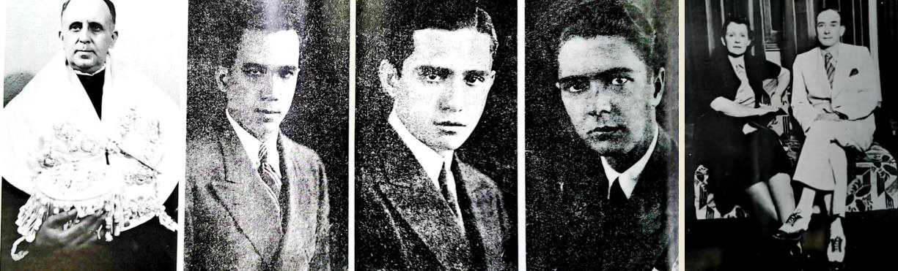

# Resumo

A história do urbanismo como discurso de um campo profissional
específico, será configurada em Goiânia a partir da publicação do
opúsculo *1983 -- Goiânia: 50 anos* de Edgar Graeff, e, posteriormente,
*Goiânia: Evoluções do plano urbanístico*, de Narcisa Cordeiro. Até
meados dos anos de 1980 o urbanismo em Goiânia aparece entrelaçado à
história da cidade; seja como história presente em publicações oficiais,
seja como história contada por memorialistas, porém sempre sobressaindo
a sua utilização politica. Nessas publicações, questões de ordem
prática, sobretudo politicas, se sobrepõem à formação de um campo
urbanístico especifico. É a partir da inserção acadêmica de Graeff, e,
mais especificamente da publicação de *1983 -- Goiânia: 50 anos*, que o
urbanismo em Goiânia começa a estruturar-se como um discurso pertinente
ao seu campo próprio e especifico.

Palavras-chave**:** urbanismo; cidade; discurso profissional; política.

# Abstract

Summary the history of urbanism as speech of a specific professional
field, will be configured in Goiânia from the publication of the booklet
1983 -- *Goiânia: 50 years* of Edgar Graeff, and, later, *Goiânia:
Evolutions of the urbanístico plan*, Narcisa Cordeiro. Until middle of
the years of 1980 urbanism in Goiânia appears interlaced to the history
of the city; be as history present in official publications, whether as
counted history for memorialistas, standing out its use policy. In these
publications, questions of practical order, especially politics, overlap
to the formation of a specific urban field. It is from the academic
insertion of Graeff, and, more specifically of the publication of *1983
- Goiânia: 50 years*, that urbanism in Goiânia starts to structuralize
itself as a pertinent speech to its proper field and specifies. words,
in an only paragraph. Word-key: urbanism; city; professional speech;
politics.

# Abstract

Keywords: urbanism; city; professional speech; politics.

# Introdução

> O presente texto é referente à pesquisa intitulada *Metodologias do
> projeto urbano: mudanças contextuais e morfológicas em Goiânia (1933
> --1973)1.* Durante a revisão bibliográfica, constatou-se que a partir
> de meados dos anos de 1980 em diante, algumas publicações passaram a
> distinguir-se por sua abordagem específica da história do urbanismo,
> em relação à história da cidade como um todo. O ponto marcante dessa
> distinção de abordagem histórica foi a publicação do opúsculo *1983 --
> Goiânia: 50 anos* de Edgar Graeff e, posteriormente, *Goiânia:
> Evoluções do plano*
>
> *urbanístico* de Narcisa Cordeiro.

Anteriormente à publicação desses dois livros de abordagem especifica
sobre história do urbanismo, a quase totalidade das obras sobre a
história de Goiânia segue o teor politico de escrita reproduzindo, de
certo modo, a escrita histórica de Ofélia Monteiro (1938), e outras
publicações oficiais. O que será observado, é que nessas publicações

> 1 Pesquisa cadastrada na Pro-Reitoria de Pesquisa da Universidade
> Estadual de Goiás, participam dois alunos de PIBIC/UEG -- Natana Lemos
> e Matheus Möller.

que reproduzem a história oficial, o urbanismo aparece subsumido aos
atos políticos. Consequentemente, observa-se que dos anos de 1990 até os
dias atuais, as duas obras inaugurais sobre o urbanismo em Goiânia
também inaugurarão dois modos distintos de abordagem: uma em que
prevalecem as questões teóricas e históricas mais gerais do campo do
urbanismo, e, outra em que podemos identificar uma história do urbanismo
local, à jusante da historia da cidade com forte teor politico.

# Hiato urbanístico e prevalência política

O surgimento nos anos de 1930 da segunda capital de Goiás, Goiânia,
esteve ligado não apenas a interesses políticos locais. Havia também
naquele período aspirações pelo Estado moderno, inserido no território
brasileiro, e como tal, pertinente ao nível conceitual de "nação" e
"civilização" ocidental. Nesse afã, os políticos locais apropriaram-se
de conceitos mais amplos como o de urbanismo, a partir dos quais se
inseriram como modernos, civilizados, aptos a serem partes da Nação como
um todo. Dessa maneira, por questões de ordem prática, o urbanismo
enquanto conhecimento técnico e racional foi adaptado aos interesses
políticos locais, servindo como uma marca na construção da identidade
moderna do Estado de Goiás.

Uma das consequências desse atrelamento à prática política, é que o
urbanismo como campo de conhecimento em Goiânia e em Goiás deixou
grandes hiatos de crítica e teoria. A crítica, e, consequentemente,
formulação de teoria e história do urbanismo em Goiânia surgirá cerca de
cinquenta anos após o inicio da construção da cidade -- como se verá
mais adiante, após a vinda de Edgar Graeff para lecionar na Universidade
Católica de Goiás resultando na publicação do opúsculo *1983 -- Goiânia:
50 anos.* Até o cinquentenário de Goiânia, as publicações sobre a
cidade, sejam elas oficiais ou obras de memorialistas, tratavam o
urbanismo apenas de modo utilitarista.

No relatório de Pedro Ludovico Teixeira a Getulio Vargas em 1933, é
possível ver essa instrumentalização politica do urbanismo:

> Julgou o Governo que seria de boa política submeter a escolha, à
> apreciação de técnicos em matéria de urbanismo, pelo que convidou os
> drs. Armando Augusto de Godói, urbanista conhecido em todo o Brasil,
> Benedito Neto de Velasco, engenheiro civil e construtor do Distrito
> Federal e Américo de Carvalho Ramos, engenheiro, detentor de diversos
> cursos de aperfeiçoamento e especialização, realizado no estrangeiro
> (TEIXEIRA, 1973: 124).

Esse atrelamento do urbanismo à imagem de seu uso politico vai aparecer
em inúmeras outras fontes, sejam obras de publicações oficiais, sejam em
escritas memorialistas, variando por vezes na forma ou no método. Como é
o caso, por exemplo, do muito citado e estudado *Como nasceu Goiânia*,
de autoria de Ofélia Monteiro, publicado pelo Estado de Goiás em 1938.
Como diz Oliveira (1999: 167) a obra de Monteiro é um "museu escrito" da
politica; para Arrais (2008: 94; 108), trata- se de uma "história
universal, objetiva e garantidora de conhecimento positivo". Prefiro
pensar que Monteiro teve a intenção de expor os feitos heroicos dos
políticos, sobretudo Pedro Ludovico Teixeira, como uma coleção de fatos,
pessoas, planos, projetos e seus projetistas, bem como as edificações,
interligando-os de forma não linear, ou seja, uma *bricolagem*.

No ano seguinte à publicação de *Como nasceu* Goiânia, Pedro Ludovico
Teixeira envia o segundo relatório sobre a construção de Goiânia a
Getulio Vargas. Conforme

pequeno excerto abaixo.

> O traçado da cidade, composto dos Setores Central, Sul e Norte, com
> área total de 5.853.945 metros quadrados, tendo 3.593.938 metros
> quadrados de área útil de lotes prevista para uma população de 50.000
> almas, recomenda, pelos seus característicos, os técnicos brasileiros
> encarregados do projeto. (\...) Rigorosamente norteadas por um plano
> diretor pré- estabelecido, levantam-se as edificações, em progressão
> extraordinária (TEIXEIRA, 1939: 28).

Tendo em vista o "conhecimento técnico" exposto de diversas maneiras,
como comprovações empíricas da concretização da cidade e enfatizando que
a cidade nasce dos conceitos do abstrato ao concreto, pareceria óbvio
que o Interventor desse maior visibilidade aos engenheiros construtores
Jerônimo e Abelardo Coimbra Bueno, ou ao menos os citassem nominalmente,
o que não ocorreu. À página 30, Teixeira cita Correia Lima e Armando
Godoy como autores dos projetos urbanos, mas em momento algum cita os
engenheiros Coimbra Bueno como autores das alterações feitas nos
projetos, não reconhecendo sequer o trabalho que efetuaram como
engenheiros construtores da cidade entre 1935 e 1938: "levantaram-se as
edificações em progressão extraordinária" (Ibid).

Portanto, além da *bricolagem* de Monteiro (1938) e da maneira
cientificista e politica desses relatórios sumariamente citados acima,
há outro aspecto que mostra o entrelaçamento do urbanismo à politica
feita pelo interventor. Trata-se da omissão dos nomes dos engenheiros
Abelardo e Coimbra Bueno. Uma leitura atenta das *Memórias* de Pedro
Ludovico Teixeira (1974) pode revelar a provável razão do "apagamento da
memória" referente aos engenheiros Coimbra Bueno, já que nesta obra
Teixeira procura deixar bastante claro que a edificação da cidade estava
totalmente sob o seu controle, inclusive as tarefas que os engenheiros
Coimbra Bueno tinham a executar: "Tenho um programa de realização para
este ano \[1936\], no que se refere a nova Capital, e quero levá-lo a
efeito" (pág. 140).

Os embates políticos entre Teixeira e os engenheiros Coimbra Bueno, e os
consequentes apagamentos de seus feitos, ensejaram uma publicação
apócrifa dos engenheiros, a qual circulou durante a inauguração oficial
de Goiânia, em 19422. Trata-se do livro de *A luta na epopéia de
Goiânia: uma obra da engenharia nacional*, escrito por Geraldo Teixeira
Álvares, em que os engenheiros Coimbra Bueno não são apresentados como
coadjuvantes, mas sim como atores principais, sobretudo no que se refere
à construção da cidade. Ou seja, por meio do autor, respondem ao
"apagamento da memória" ocorrido no segundo relatório de Teixeira a
Vargas.

Posteriormente, com a falta de adequada preservação e arquivamento de
documentos em Goiás, a maioria dos projetos urbanos originais, bem como
os projetos de suas alterações se perderam e o livro de *A luta na
epopéia de Goiânia: uma obra da engenharia nacional* acabou se tornando
uma importante fonte de pesquisa documental. Contudo, é interessante
observar que, mesmo sendo os atores principais dessa obra que se tornou
importante fonte de pesquisa documental, a interpretação politica dada
por Pedro Ludovico Teixeira prevaleceu na historiografia goiana, como se
pode ver em alguns trabalhos que tratam da história de Goiânia.

Por exemplo, seguindo a interpretação politica dada por Teixeira sobre
os engenheiros

> 2 Após 1942 essa obra jamais foi reeditada, tratando-se de uma obra
> raríssima atualmente.

Coimbra Bueno, para Unes (2001), a sua contratação em 1935 teve
consequências nefastas para a cidade, pois modificaram o projeto já
existente, de acordo com o seu interesse particular. Para Ribeiro
(2004), os irmãos Coimbra Bueno foram movidos pela ganância
especulativa, sendo assim, advogaram em causa própria ao redirecionar o
crescimento da cidade na direção em que estavam situadas as suas
propriedades, que, de rurais passaram a ser urbanas. Resultando disso a
inversão da direção prevista para Norte, ocorreu a expansão inversamente
para Sul.

Essa interpretação dada aos Coimbra Bueno os coloca como personagens que
deveriam ser banidos da história por carregarem sobre si o fardo de uma
imagem inescrupulosa, gananciosa e antiética. É sem dúvida, uma
consequência dos embates políticos que, em Goiás relegou o urbanismo a
mera ferramenta utilitária. Para Maciel (1996: 161), os irmãos Coimbra
Bueno não faziam parte do ofício do urbanismo ou do planejamento urbano
em sentido mais amplo e estavam muito mais próximos de sujeitos
capitalistas interessados em participar de um bom negócio.

Quatro anos após a publicação de *A luta na epopéia de Goiânia: uma obra
da engenharia nacional* as tentativas de protagonismo politico de
Jeronimo Coimbra Bueno foi para além da obra escrita. Após ter sido
eleito Governador do Estado de Goiás nas eleições diretas de 1946,
colocou sua equipe de engenheiros para desenharem de modo definitivo o
núcleo central de Goiânia. Porem, sua ambição politica era ainda maior,
já que ao mesmo tempo em que governava o Estado de Goiás, também atuava
na membro da Comissão Polli Coelho, pretendendo com isso deslocar a
capital federal para o estado de Goiás, o que de fato acabou acontecendo
dez anos depois.

Em 1950, no discurso que fez na Assembléia Legislativa do Estado de
Goiás em defesa de suas ambições políticas, Coimbra Bueno disse o
seguinte:

> Aqueles que estão viciados em medir a ação dos Governos, pelo numero
> de metros de fachadas, inauguradas nas Capitais,
>
> -- nós poderíamos, parafraseando D. João VI ao responder com a frase,
> que para eles, ainda hoje seria moderna: "abramos 'as portas' de Goiás
> para os Brasileiros e para o mundo". (Diário Oficial, 15/07/1950).

Como se vê nesse discurso de defesa politica, Coimbra Bueno se apresenta
como um ideólogo da interiorização da capital federal. Com isso, desloca
o urbanismo de seu campo especifico, fazendo-o subsumir no serviço da
geopolítica. Vale ressaltar então, que embora fosse engenheiro, Coimbra
Bueno não trazia a baila especificidades inerentes ao pensamento próprio
do campo do urbanismo, mas fazia dele um instrumento de prática
politica. A essa altura, não é difícil perceber que ausência de um campo
organizado do urbanismo em Goiânia e Goiás, se deveu fortemente à sua
instrumentalização politica. A qual, só vai alterando os seus métodos,
porém sempre redundando em fins de teor político.

Como se não fosse suficiente o que disse anteriormente sobre essa
relação desigual entre campo politico e campo urbanístico em Goiás, só o
fato de Goiânia ter tido, no período em que Coimbra Bueno foi
Governador, dois engenheiros que foram prefeitos da Capital em
sequencia3 e mesmo assim não terem conseguido mobilizar a classe de
engenheiros em torno das discussões sobre urbanismo, mostra que os
engenheiros

> 3 Os engenheiros Ismerino Soares de Carvalho e Eurico Viana, ambos
> formados em engenharia no Estado de Minas Gerais.

atuantes em Goiás ainda nem tinham espírito corporativo, e tampouco
formação teórica e critica. Consequentemente, agindo de modo similar aos
políticos, esses engenheiros fizeram prevalecer a praticidade e a
urgência de urbanizar o sertão do Planalto Central.

É possível observar, portanto, que provavelmente a equipe de engenheiros
que permaneceu nos quadros do Estado desde 1938, não tinha a formação
urbanística necessária para discussões mais aprofundadas sobre os
problemas urbanos que foram surgindo com projetos de novos loteamentos
aprovados e expansão generalizada da cidade nos anos de 1950. Na
verdade, no bojo dessa expansão urbana, os loteamentos que foram
surgindo foram dando continuidade ao "efeito de plantismo" marcante nas
alterações feitas pelos engenheiros sobre o projeto original de Attilio
Correia Lima.

Os anos de 1950 presenciarão a atuação discreta de Ewald Janssen4,
migrante alemão contratado pelo governo do Estado para elaborar
pareceres técnicos a respeito do processo de urbanização de Goiânia.
Porém, embora detivesse algum conhecimento teórico sobre urbanismo e
sobre cidades de um modo geral, a atuação de Janssen não

foi suficiente para mudar esse quadro politico do urbanismo, ao
contrário, o reforça. Porque Janssen não tinha nenhuma inserção
acadêmica, nem no Brasil, nem na Alemanha. Além disso, a sua atuação
técnica pareceu bastante conveniente à politica local, já que a sua
condição de imigrante o colocava de certo modo como um *outsider* em
relação aos engenheiros que atuavam em Goiânia.

No final dos anos de 1950, por causa dos inúmeros problemas urbanos
decorrentes da enorme expansão da cidade, o governo do Estado de Goiás
contratou o urbanista Luis Saia, o qual entre meados de 1959 e início de
1963, elaborou um profundo trabalho de levantamentos e pesquisas,
resultando em dois tomos de cerca de duzentas páginas cada5. Saia fora
naquele momento contratado para elaborar um novo Plano Diretor para
Goiânia, justamente porque era um dos expoentes do urbanismo no Brasil
da década de cinquenta -- tendo publicado inúmeros artigos, conhecido
por suas palestras e cursos ministrados no IAB de São Paulo.

Porém, veio à tona novamente a assimetria entre urbanismo e politica em
Goiás, e dessa vez com grande acirramento, já que à medida que o
arquiteto foi expondo o Plano a público, suas ideias foram sendo
rejeitadas pelos mais diversos atores e setores goianienses, desde os
empresários até a Escola de Engenharia e o Clube de Engenharia
(MEDEIROS, 2010: 222-223).

Esse enorme hiato entre politicas de urbanização e formação do campo do
urbanismo começará a ser diminuído após a inserção do SERFHAU em Goiás,
implantando a sua politica de planejamento municipal integrado em
Goiânia, a partir de 1968. Talvez por se tratar de uma instância
politica de âmbito federal, após a elaboração e implantação do Plano de
Desenvolvimento Integrado de Goiânia (PDIG), houve um "despertar"
(MEDEIROS, 2010) para a formação do campo do urbanismo, sobretudo a
partir da criação da Secretaria Municipal de Planejamento, prevista no
PDIG, e as suas consecutivas atuações nas proposições sobre os aspectos
urbanos de Goiânia.

Outro fator que contribuiu para a contração desse hiato entre politicas
de urbanização e formação do campo do urbanismo em Goiás foi a criação,
também em 1968, do curso de Arquitetura e Urbanismo da Universidade
Católica de Goiás, lugar de fala

> 4 Estrangeiro de nacionalidade alemã, técnico em topografia contratado
> como Engenheiro pelo Estado de Goiás.
>
> 5 Oliveira (1985) fez um estudo pioneiro sobre o teor do Plano Saia,
> tendo resgatado, junto aos familiares, dois Tomos escritos, sem,
> entretanto, nenhum mapa ou ilustração dos vários produzidos
>
> pelo arquiteto. O que restou do Plano Diretor de Luis Saia,
> encontra-se em Goiânia, na biblioteca da Secretaria Municipal de
> Planejamento -- SEPLAM.

acadêmico a partir do qual Edgar Graeff vai formular uma história do
urbanismo em Goiânia, e onde formou-se a arquiteta e urbanista Narcisa
Cordeiros, como veremos a seguir, os dois primeiros autores que publicam
e inauguram obras especificas sobre história do urbanismo em Goiânia, e,
as duas principais formas de abordar a história do urbanismo em Goiás.

## Edgar Graeff e Narcisa Cordeiro: discursos fundantes

No decorrer dos anos de 1970 e 1980, seja pela atuação da SEPLAM
norteada pelo PDIG de Jorge Wilheim, seja pelas contribuições da escola
de Arquitetura e Urbanismo da UCG formando arquitetos e urbanistas que
passam a trabalhar nos órgãos públicos de planejamento em Goiás, não
somente será reduzido o hiato entre as politicas de urbanização em
Goiânia e o campo específico do urbanismo. A partir da publicação de
*1983 -- Goiânia: 50 anos* de Edgar Graeff (1985), será possível
observar características de um campo do urbanismo em inicio específico
de Goiânia. Quatro anos após a publicação de *1983 -- Goiânia: 50 anos*,
Narcisa Cordeiro publica *Goiânia: Evoluções do plano urbanístico.*
Apresentando características distintas, essas obras não somente fazem
parte de biografias e trajetórias profissionais diversas, como são
determinadas por estas. Graeff expressa a sua trajetória consolidada
como professor, pesquisador e crítico de arquitetura, reconhecido
nacionalmente. Cordeiro, uma arquiteta de atuação local, cujas
pretensões eram ser inseridas dentre os chamados "intelectuais goianos",
cujos *locus* de atuação são o Instituto Histórico e Geográfico de Goiás
(IHGG), a Academia Feminina de Artes e Letras Goiana (AFLAG).

Embora guardem em si estas distinções, ambos os livros falam de Goiânia
a partir de seu urbanismo, isso faz com que os urbanistas e sua produção
para Goiânia sejam vistos pelo através do filtro das questões
especificas e próprias ao campo do urbanismo, as quais extrapolam o
âmbito politico local.

O que ambos os livros tem em comum, é que os referidos autores os anos
de 1990 até o presente passaram a servir de referencia em termos de
formatação de discursos inerentes ao campo do urbanismo. Portanto,
fundamentalmente irão contribuir para desenvolvimento de diversas
pesquisas posteriores sobre a história do urbanismo em Goiânia, das
quais resultaram quantidade considerável de publicações, além de
monografias acadêmicas, dissertações e teses. Por exemplo, irão
disseminar, o vasto uso do termo "urbanismo barroco" no caso de Graeff,
e, no caso de Cordeiro, forte associação entre urbanismo e história
oficial da cidade.

Importante observar que, Embora a ênfase de Ofélia Monteiro em sua
*bricolagem* tenha sido produzir uma história oficial de Goiânia,
utilizando, contudo o urbanismo como discurso de racionalidade e
modernidade, esse estilo de escrita foi reproduzido quase cinquenta anos
depois por Narcisa Cordeiro, a qual, embora tenha dado mais ênfase ao
urbanismo do que à politica local, continuou associando em sua escrita,
variados elementos que ancoram a historia oficial a cidade.

**Graeff e suas "cogitações" em torno da "identidade profunda" de
Goiânia** Conforme foi dito acima, Graeff e Cordeiro apresentam
características distintas sobre o modo como desenvolvem seus discursos
urbanísticos a respeito de Goiânia. Graeff construiu a sobre obra
teórica e crítica a partir da noção de composição do espaço
arquitetônico, embora partindo de Bruno Zevi, Leonardo Benévolo e Lewes
Munford, procurava identificar as especificidades da arquitetura
brasileira, e com isso rebatia as críticas feitas desde os anos de 1950
à arquitetura brasileira no cenário internacional. Com esse intuito,
desde o inicio dos anos de 1970 Graeff passou a trabalhar na pesquisa
*Oito vertentes e dois momentos de Síntese da arquitetura brasileira*, e
daí em diante trabalhou com essa temática por cerca de quinze anos.

Em 1979 Graeff publica nos Cadernos Brasileiros de Arquitetura da
Editora Projeto o livro *Edifício* essencial sobre as suas analises até
então apreendidas acerca da noção de "morada do homem" -- "a arquitetura
só poderá recuperar efetivamente seu prestígio na medida em que lhe for
dado concentrar suas atenções no planejamento e na construção da "morada
do homem" (GRAEFF, 1979, p. 71) .

> No terceiro capítulo de *Edifício*, Graeff amplia a noção de "morada
> do homem" compreendendo o espaço arquitetônico a partir da necessidade
> humana de morar, desde o edifício até o espaço urbano como um todo.
> Essa ampliação de escala a respeito da "morada do homem" é um dos
> produtos da pesquisa *Oito vertentes e dois momentos de Síntese da
> arquitetura brasileira.* Porem, essa pesquisa lhe rendeu diversas
> outras publicações, dentre as quais *1983 -- Goiânia: 50 anos*.

Desde meados dos anos de 1970 Graeff havia sido contratado como
professor e consultor na Universidade Católica de Goiás. Tendo sido
expulso em 1968 da Universidade de Brasília pela ditadura dos militares,
Graeff passou a atuar profissionalmente em Goiânia. Desse modo, Goiânia
foi uma das cidades que Graeff estudou para elaborar o processo de
ampliação da escala da morada humana do edifício para a cidade como um
todo, conforme exposto na citação acima. Embora apresentada de modo
bastante sintético no folheto nº 2 da coletânea *Oito vertentes e dois
momentos de Síntese da arquitetura brasileira / 1983 -- Goiânia: 50
anos* é possível compreender a noção de morada humana observada na
cidade de Goiânia.

A "escala humana" de Goiânia estaria nas "contradições" presentes em
diversos aspectos do plano urbanístico elaborado por Attilio Correia
Lima. A "humanidade" da cidade estaria estampada nessas "contradições",
a partir das quais seria possível a compreensão de sua "identidade
profunda". Por exemplo, Graeff critica Yves Bruand que vê semelhanças no
"sinal da cruz" de Goiânia como prefiguração de Brasilia.

> 
>
> Figuras 1 e 2: Edgar Graeff identifica grafismos do "sinal da cruz" no
> Plano de Attílio Correia Lima. Fonte: GRAEFF, 1985:33.

Essa crítica de Graeff a Bruand, é uma forma de desconstruir as
superficialidades em busca do que chama de uma "identidade profunda". "O
que aí temos não passa de um sinal gráfico, pouco expressivo, como
tantos outros. O cruzamento da avenida Goiás com a Paranaíba, também
evoca o cruzamento dos eixos de Brasilia, mas esta é uma semelhança
irrelevante" (GRAEFF, 1985, p. 33).

Graeff utiliza essa crítica feita a Bruand como forma de construir o seu
argumento sobre a cidade como "morada humana", sugerindo que
provavelmente Goiânia tenha

precedido Brasilia precisamente em sua "identidade profunda", qual seja,
a de um "construir frondoso" -- referindo às árvores que ocupam os
canteiros centrais e as calçadas das principais avenidas de Goiânia --
configurando uma "cidade parque" profundamente contraditória à concepção
barroca que referencia a centralidade visual da cidade capital, assim
como havia ocorrido em Versalhes, Whashington e Kalshue. Por isso diz
Graeff à pagina 11:

> Tentar descobrir o que esses arquitetos tinham na cabeça e no coração
> quando conceberam Goiânia, constitui o primeiro objetivo deste
> trabalho, que não presume ser um ensaio e muito menos uma pesquisa
> científica e, se faz falta uma classificação, um rótulo, creio que se
> pode arquivá-lo no escaninho das cogitações cordiais, se é que existe
> isso. (GRAEFF, 1985, p. 11).

Para Graeff, falar em cogitações cordiais não se tratava apenas de uma
licença poética, mas sim uma forma de compreender o que estava além dos
grafismos do projeto urbano, no caso do uso do *patte d'oie* acreditava
tratar-se de um equívoco, porque "o famoso pé-de-pato não passa
realmente de uma imagem gráfica, um rosto capaz de esconder diferentes
corações" (GRAEFF, 1985, p. 18).

> 
>
> Figura 3: Edgar Graeff identifica grafismos no Plano de Attílio
> Correia Lima, O patte d'oie. Fonte: GRAEFF, 1985:33.

Conforme diz à página 27, o traçado em asterisco por si só não constitui
patrimônio ou ideologia de quem quer que seja, existindo simplesmente em
disponibilidade, o que vai imprimir sentido e significado ás suas
potencialidades funcionais e expressivas é o uso que delas se faz. Como
diz á página 27, o que ao seu modo seria um elogio a Goiânia, talvez
dessas "contradições" das quais se ocupa no decorrer de todo o livro,
"tenham resultado a vitalidade e a graça que ainda hoje Goiânia exibe,
apesar de todos os pesares, e das deformações que vem sofrendo sob o
impiedoso império do capitalismo selvagem". (GRAEFF, 1985, p. 27).

Graeff identifica a contradição e o equivoco do grafismo como inerente à
cultura de morar em Goiânia.

> 
>
> Figuras
> 4, 5 e 6: asteriscos tornaram-se á "cultura de morar" impregnando a
> contradição como "identidade profunda". Fonte: GRAEFF, 1985, p. 19-22.

Porém, ao identificar a contradição e o equivoco do grafismo como
inerente à cultura de morar, finda por constituir uma vertente uma
vertente bem menos explorada da historia do urbanismo em Goiânia, qual
seja, a vertente crítica, que se recusa a seguir os ditames da história
oficial.

Ao analisarmos algumas observações feitas por Graeff sobre o urbanismo
em Goiania, podemos perceber que o autor desenvolve as análises que
vinha fazendo sobre a arquitetura brasileira, especificamente sobre as
relações entre arquitetura e cultura. Como diz á página 27, o que ao seu
modo seria um elogio a Goiânia, talvez dessas "contradições" das quais
se ocupa no decorrer do livro, "tenham resultado a vitalidade e a graça
que ainda hoje Goiânia exibe, apesar de todos os pesares, e das
deformações que vem sofrendo sob o impiedoso império do capitalismo
selvagem". (GRAEFF, 1985, p. 27). Sem duvidas, essa foi uma forma
heterodoxa de elogiar Goiânia por seus cinquenta anos.

# Breve comentário sobre a história urbana de Narcisa Cordeiro

A arquiteta Narcisa Cordeiro, formada pela Universidade Católica de
Goiás em 1974, prestou diversos serviços para a ENCOL uma das maiores
empresas que atuava no setor da construção civil nos anos de 1970 em
Goiânia, para quem fez os projetos urbanos do conjunto residencial
Parque das laranjeiras na região Sul da cidade, e o conjunto residencial
Goiânia II na região Norte. Após atuar cinco anos como arquiteta e
urbanista autônoma, foi convidada para atuar na Secretaria Municipal de
Planejamento no ano de 1979, onde juntamente com as funcionárias da
biblioteca passou a organizar um acervo documental baseado em
depoimentos de antigos moradores, com os quais também foram coletados
mapas e fotos.

Ao ser indagada sobre a pertinência desse trabalho memorialístico por
uma Secretaria de Planejamento, Cordeiro assegurou ser fruto de sua
própria historia de vida, já que desde tenra idade foi influenciada por
"goianos ilustres" que residiam em sua vizinhança a ser também uma
espécie de guardiã da memória da cidade . Dentre esses Goianos ilustres
cita Euridice Natal e Silva, mãe de Colemar Natal e Silva, sendo este
último o fundador do Instituto Histórico e Geográfico de Goiás, uma das
instituições que reúnem tais "goianos ilustres" e da qual Cordeiro veio
a tornar-me membro.

Além dessa justificativa baseada na sua própria historia de vida havia
também o contexto das preocupações memorialistas dos chamados
"intelectuais goianos", como por exemplo José Mendonça Teles havia
publicado em 1977 no livro Fronteira uma crônica intitulada A cidade em
memória, em que propunha que o Palacio das Esmeraldas fosse transformado
em Museu Histórico de Goiânia, além de listar todo o patrimônio
edificado que encontrava-se descaracterizado.

Segundo Cordeiro, o trabalho de pesquisa memorialística que realizou na
SEPLAN desde 1980, tinha como objetivo a publicação de um livro
comemorativo em 1983,

durante o cinquentenário de Goiânia, tal como fez Graeff. Contudo,
conforme seus relatos, o referido órgão municipal se recusou a se
responsabilizar pelas interpretações, conceitos, teorias e críticas que
viessem a ser feitas pela autora. Assim sendo, o livro que veio a se
chamar Goiânia: evoluções do plano urbanístico só veio a ser publicado a
expensas da própria autora, seis anos após o previsto, após Cordeiro já
ter deixado de trabalhar na Secretaria.

Na verdade, o teor do livro nada tinha a ver com a homenagem heterodoxa
que Graeff tinha feito em 1985 a Goiânia. Muito pelo contrário. Contendo
as mesmas formalidades e aspectos oficiais que tem Como nasceu Goiânia
de Ofélia Monteiro (1938), Goiânia documentada e Goiânia Global de Oscar
Sabino Junior (1960 e 1980), Evoluções do plano urbanistico reproduz as
versões oficialmente conhecidas pela "plêiade dos intelectuais goianos".
Com o diferencial de que se detem mais detalhadamente nos projetos de
Attílio Correia Lima e dos engenheiros Coimbra Bueno, tratando de reunir
e publicar informações oficiais referentes ao assunto. E é esse
diferencial que, embora ancorado na historia oficial, vai transformar
Cordeiro em uma das primeiras autoras a fazer uma historia do urbanismo
em Goiânia.

> 
>
> Figura 6: Colemar Natal e Silva, fundador do IHGG; Figuras 7 e 8:
> Jerônimo e Abelardo Coimbra Bueno; Figura 9: Venerando de Freitas
> Borges; Figura 10: Gercina Borges e Pedro Ludovico Teixeira. Alguns
> personagens que compõem a narrativa oficial sobre a história de
> Goiânia. Fonte: CORDEIRO e QUEIROZ, 1990, p. 8; 11.

O modo como Cordeiro estabelece seus vínculos com os personagens e a
politica oficial, fica ainda mais evidente um ano após ter publicado
Evoluções do plano urbanístico, quando juntamente com a sua ex-colega de
SEPLAN resolve ampliar o livro publicado em 1989, intitulando a nova
obra de historia do urbanismo em Goiânia de Goiânia: embasamentos do
plano urbanístico original, também edição das autoras. Logo nos
agradecimentos e dedicatória do referido livro, podemos ver a vinculação
que tem com o trabalho feito na SEPLAN no início dos anos de 1980, ao
citar as funcionárias da biblioteca do órgão público, também os
personagens que em geral cederam o acervo documental que ainda hoje
existe:

> 
>
> Figura 11: Página de agradecimentos e homenagens. Fonte: CORDEIRO e
> QUEIROZ, 1990.

Em Goiânia: embasamentos do plano urbanístico original, Cordeiro e
Queiroz farão maior uso das entrevistas feitas com Abelardo e Jeronimo
Coimbra Bueno, e esse é um aspecto interessante para a história do
urbanismo em Goiânia, porque coloca esses personagens como decisivos
para a configuração da cidade. Partindo dos relatos das memórias dos
Coimbra Bueno, as autoras irão narrar acontecimentos que envolveram a
feitura dos planos, o que até então pouco ou quase nada havia sido nesse
sentido.

O resultado é que, o nome de Armando de Godoy, que aparece diversas
vezes na história narrada por Graeff (1985) e até mesmo por Bruand 1980
, pouco aparece na narrativa de Cordeiro e Queiroz. No lançamento de
Goiânia: embasamentos do plano urbanístico original, ocorrido no CREA-GO
Abelardo e Jeronimo Coimbra Bueno foram homenageados pelas autoras.

> 
>
> Figura 12: Abelardo e Jeronimo Coimbra Bueno foram homenageados por
> Narcisa Cordeiro no lançamento do livro Goiânia: embasamentos
>
> do plano urbanístico original. Fonte: arquivo de Narcisa Cordeiro.

Interessante observar que, reforçando novamente a tendência à
oficialidade de sua escrita, as autoras procuram filiar-se ao discurso
ecológico (CORDEIRO e QUEIROZ, 1990: 28) então em voga na prefeitura de
Goiânia no início dos anos de 1990.

# Considerações

As analises dos livros considerados nesse texto, possibilitaram
identificar o surgimento das especificidades discursivas, a partir das
quais foi possível constituir o campo do urbanismo de conhecimento
teórico e histórico em Goiânia e Goiás. Essa trajetória é caracterizada
pelo deslocamento da centralidade politica na escrita da história de
Goiânia. Além disso serve também para mostrar nesse campo do urbanismo
em Goiânia, que genealogia do uso indiscriminado do termo "urbanismo
barroco" pode estar relacionada à pouca clareza de distinções entre
grafismos em "identidade profunda". Provavelmente essa tenha sido a
razão de tão amiúde propagação do termo "barroco" na historiografia do
urbanismo de Goiânia, sem, contudo atentar para o contexto da teoria que
Graeff vinha desenvolvendo sobre o espaço arquitetônico brasileiro,
porque somente no escopo dessa teoria é que pode-se compreender com
maior clareza a especificidade e profundidade do próprio campo do
urbanismo, e, mais ainda da especificade do discurso fundante de Edgar
Graeff, a partir do livro *1983: Goiânia 50 anos*. Importa portanto
salientar a complexidade que o referido livro esconde, e atentar para os
cuidados de sua leitura apressada, o que pode resultar em práticas
superficiais, tão criticadas ao longo de todo o texto em busca de uma
"identidade profunda" para Goiânia.

Por outro lado a forte presença da historia oficial tecendo as
narrativas escritas em Evoluções do plano urbanístico e Goiânia:
embasamentos do plano original podem também esconder um viés de aparente
superficialidade. Essas distinções também são importantes para
compreender a importância do discurso fundante de Narcisa Cordeiro para
a configuração do campo do urbanismo em Goiânia. Ao inserir os
personagens Jeronimo e Abelardo Coimbra Bueno na história do urbanismo
de Goiânia pelo viés de suas próprias memórias, ocorre uma abordagem
inusual desses personagens que foram estigmatizados por suas atividades
politicas e imobiliárias. Talvez a característica triunfante da história
oficial acabe dando o tom maior e mais influente no trabalho empreendido
por Cordeiro. Porém, um olhar mais atento ás contradições, como queria
Graeff, poderá contribuir para o conhecimento da identidade mais
profunda da história do urbanismo em Goiânia, e, por meio dessa
perspectiva conhecer as metodologias do projeto que antecederam as
superficialidades de seus grafismos.

## Referencias

> BRUAND, Yves. *Arquitetura contemporânea no Brasil.* São Paulo:
> Editora Perspectiva, 2002 \[1980\].
>
> CORDEIRO, Narcisa. *Evoluções do plano urbanístico.* Goiânia: Edição
> da autora, 1989.
>
> CORDEIRO, Narcisa e QUEIROZ, Normalice de. *Goiânia: embasamentos do
> plano original.* Goiânia: Edição das autoras, 1989.
>
> GRAEFF, Edgar Albuquerque. *1983: Goiânia 50 anos.* Goiânia: MEC/SECU,
> 1985.
>
> . *Relações de parceria: cultura e arquitetura.* In Revista MODULO,
> edição 61 / novembro de 1980.

. *Edifício*. Cadernos Brasileiros de Arquitetura. São Paulo: Editora
Projeto, 1979.

> . *Cidade utopia.* Belo Horizonte: Vega, 1979.

. Arte e técnica na formação do arquiteto. São Paulo: Studio Nobel:
Fundação Vilanova Artigas, 1995.

> MEDEIROS, Wilton de Araujo. *Goiânia metrópole: sonho, vigília e
> despertar -- 1933/1973.*
>
> MONTEIRO, Ofélia. *Como nasceu Goiânia.* São Paulo: Revista dos
> Tribunais, 1938. Revista Projeto, nº 50. Notícias -- *Nos 50 anos de
> Goiânia, discussões sobre a cidade.* SABINO JUNIOR, Oscar. *Goiânia
> documentada.* Goiânia: Serviço de documentação Museu Estadual, 1960.
>
> . *Goiânia Global.* Goiânia: Oriente, 1980.

## Arquivos consultados:

Núcleo de Documentação e Divulgação (ndd) da PUC/GOIÁS. Arquivo
particular de Narcisa Cordeiro.

Secretaria Municipal de Planejamento -- SEPLAN. Arquivo Histórico
Estadual de Goiás (IHGG) - Goiânia

\- Pasta dos Governadores (nº 1) -- Pedro Ludovico Teixeira Diário
Oficial (15/07/1950).

TEIXEIRA, Pedro. Ludovico. *Memórias*. Goiânia: Livraria Editora Cultura
Goiana, 1973.

> . *Relatório ao Exmo Presidente da Republica pelo Dr. Pedro Ludovico
> Teixeira -- Interventor Federal*. Goiânia: Oficinas Gráficas da
> Imprensa Oficial, 1933.

. Relatório ao Exmo Presidente da Republica pelo Dr. Pedro Ludovico
Teixeira -- Interventor Federal. Goiânia: Oficinas Gráficas da Imprensa
Oficial, 1939.

. Relatório ao Exmo Presidente da Republica pelo Dr. Pedro Ludovico
Teixeira -- Interventor Federal (1940-1942). Goiânia: Oficinas Gráficas
da Imprensa Oficial, 1943.
