# Resumo

O trabalho busca analisar o Plano de Remodelação, Extensão e
Embelezamento da cidade de Cabo Frio, desenvolvido pelo escritório
técnico Coimbra Bueno, entre 1942 e 1943. Assim como Cabo Frio, outras
cidades foram objeto de planos e projetos, como Niterói, Petrópolis,
Araruama, Atafona, Barra do Piraí, Maricá, Nova Iguaçu e Magé,
consagrando o Estado do Rio de Janeiro como uma unidade federativa que
se preocupava com o urbanismo, considerado elemento auxiliar fundamental
na administração pública. Na concepção desses trabalhos, o urbanismo era
visto como instrumento de transformação da cidade, baseando-se na ideia
de que o conhecimento técnico e científico poderia responder, por si só,
a necessidade de resolução dos problemas urbanos. Essa corrente estava
associada, no caso brasileiro, a governos fortes, intervencionistas, que
tratavam a cidade de forma global, acreditando ser capaz de, através do
planejamento, controlar e guiar as transformações urbanas.

Palavras-chave: território, urbanismo, plano, Cabo Frio

# Abstract

The work analyzes the *Plano de Remodelação, Extensão e Embelezamento da
cidade de Cabo Frio*, developed by the office of Coimbra Bueno, between
1942 and 1943. As well as Cabo Frio, other cities were object of plans
and projects, such as Niterói, Petrópolis, Araruama, Atafona, Barra do
Piraí, Marica, Nova Iguaçu and Magé, enshrining the Rio de Janeiro State
as a federal unit that was interested in urbanism considered essential
auxiliary element in the public administration. In these studies
concept, urbanisme was seen as a city transformation tool, based on the
idea that scientific and technical knowledge could answer, by itself,
the need to address urban problems. This current was associated, in the
Brazilian case, the strong, interventionist governments, who treated the
city as a whole, believing it to be able to, through planning, control
and guide the urban transformations.

Keywords: territory, urbanism, city plan, Cabo Frio

# Introdução

No Brasil que se urbanizava, após as grandes intervenções urbanas que
tiveram lugar no início do século XX no mundo ocidental, os pressupostos
progressistas prevaleceram na organização das cidades, materializados,
dentre outros procedimentos, pelas práticas de zoneamento e de controle
do uso do solo.

De modo geral, no período compreendido pelo Estado Novo, verifica-se a
intensificação da centralização política e administrativa baseada
especialmente na ação dos interventores estaduais nomeados pelo poder
central que se voltaram também para o campo do investimento urbano, onde
se observa uma relação estreita do setor de obras públicas com a
iniciativa privada e da construção civil, que teve significativas
repercussões nas cidades.

Nesse contexto, foram criados vários órgãos públicos com funções de
compilação de dados, regulação, coordenação, controle e supervisão,
alguns incumbidos de levantar dados necessários ao conhecimento da
realidade nacional, tendo o município como unidade de levantamento.

No Estado do Rio de Janeiro, a política urbanizadora era dirigida para o
desenvolvimento das cidades interioranas com potencial turístico ou
industrial e para a modernização do centro urbano da capital. Com o
Decreto-Lei 125/1940, foi lançado o plano de urbanização das cidades de
Maricá, Saquarema, Araruama, São Pedro D´Aldeia, Cabo Frio, Angra dos
Reis e São João da Barra. Nota-se neste decreto, em seu art. 5º que
"outras prefeituras poderão gozar das vantagens desta lei, desde que o
Governo o determine por Decreto", o que pressupõe a possibilidade de
extensão aos demais municípios do estado essa prerrogativa.

Na prática, pode-se dizer que o território estadual foi dividido em duas
áreas de planejamento sob a responsabilidade de dois escritórios
distintos, o do arquiteto Attilio Corrêa Lima e dos irmãos Coimbra
Bueno. À Corrêa Lima foi atribuído o Plano de Urbanização da Cidade de
Barra Mansa e Volta Redonda1, com vistas ao crescimento dessas áreas em
função da instalação da Usina Siderúrgica Nacional. Já à empresa dos

irmãos Coimbra Bueno foi atribuído o desenvolvimento dos planos de
urbanização das cidades de Araruama, Cabo Frio e São João da Barra,
incluindo a estação balneária de Atafona.

Em 1942, foi organizada no Museu Nacional de Belas Artes uma exposição
com todos os planos das cidades com potencial turístico ou industrial.
Recorrendo-se a matérias de jornal da época -- Correio da Manhã, de 13
de agosto de 1942, tomou-se conhecimento de pranchas, fotografias e
maquetes apresentadas, relativas às cidades de Niterói, Petrópolis,
Atafona, Araruama, Maricá, Barra do Piraí, Nova Iguaçu e Magé2, em
número de dez, elegendo o Rio de Janeiro como um dos Estados que mais se
voltava

para o urbanismo.

> 1 O Decreto-Lei que autoriza o desenvolvimento do plano de urbanização
> da região delimitada por Barra Mansa e Volta Redonda ainda não foi
> localizado no Diário Oficial do Estado do Rio de Janeiro. Foram
> encontradas menções ao plano, como por exemplo o despacho do
> Interventor no dia 29 de março de 1941, em que aprova um ofício do
> Secretário de Viação e Obras Públicas, com a alteração na proposta do
> arquiteto Attilio Corrêa Lima, dentre outras.
>
> 2 Muitos desses documentos não foram localizados pelo grupo de
> pesquisa Levantamento Documental Urbanismo no Brasil -- LDUB/UFF.

Nesse artigo será dada especial atenção ao plano de Cabo Frio em função
dos documentos levantados, como os decretos localizados no Diário
Oficial do Estado do Rio de Janeiro e documentos de autoria do
escritório dos irmãos Coimbra Bueno, com a sugestão para o código de
obras e o álbum oferecido ao Secretário de Obras do Estado contendo as
plantas e perspectivas do plano.

# A política pública no âmbito do planejamento urbano

O contexto político era de centralização política e financeira e
descentralização administrativa, constituindo a Era Vagas como um
importante momento no processo de institucionalização do urbanismo e do
planejamento urbano no Brasil. A intenção para a capital e demais
cidades fluminenses era de modernização e desenvolvimento das cidades do
interior com potencial turístico ou industrial.

No processo de reforma da administração pública, que teve início no
governo provisório de Getúlio Vargas, foram criadas duas instituições,
os Departamentos das Municipalidades e as Comissões dos Planos. A
primeira, instalada junto aos governos estaduais para dar assistência
técnica às cidades do interior; a segunda, vinculada à administração
municipal.

Estabeleceu-se, assim, uma estrutura política autoritária e
centralizadora em que os municípios e estados estavam subordinados às
ordens federais. Cada município tinha um prefeito nomeado pelo
interventor federal nos estados. À essa estrutura aliou-se uma visão
técnica da administração. Os Departamentos da Municipalidade, criados
inicialmente para fiscalizarem as finanças municipais, incorporaram
funções específicas do campo do urbanismo e passaram a desempenhar o
papel de um órgão técnico municipal. Já as Comissões de Planos tinham
seu formato associado a conselhos consultivos constituídos por cidadãos
brasileiros não vinculados ao serviço público ou a empresas
subvencionadas.

Pode-se dizer que as Comissões de Planos, muitas extintas na década de
1940, se constituíram em embriões das instituições que mais tarde se
voltaram para a elaboração de planos, como os Departamentos de Urbanismo
das Prefeituras; e propiciaram um espaço privilegiado de debate e
atuação profissional do urbanista.

No entanto, os debates ocorridos nas Comissões revelaram que a figura do
plano ainda não estava bem definida.

> As inúmeras denominações utilizadas -- Plano de Conjunto, Plano
> Regulador do Desenvolvimento, Plano Geral do Município, Plano de
> Expansão e Remodelação -- esta terminologia nebulosa expressa um
> universo em formação, a busca de um formato para um plano. (FELDMAN,
> *in* Rezende E, 2012, p. 38-39).

A partir do final da década de 1940, uma nova concepção de plano se
apresentava, na qual o zoneamento era o instrumento por excelência para
adequar a ordem espacial à ordem produtiva industrial, a base para o
controle do crescimento urbano. A elaboração dos planos a princípio sob
a responsabilidade desses escritórios contratados pelo Estado, passou a
ocorrer posteriormente nas instituições estaduais de urbanismo que
atuavam na assistência técnica aos municípios e também deram lugar a
criação de instituições privadas, como por exemplo o Instituto
Brasileiro de Administração Municipal -- IBAM, criado em 1952,

# Os planos e projetos para as cidades do Estado do Rio de Janeiro

O movimento modernizador não se restringiu somente à capital do Estado.
Através da Secretaria de Viação e Obras Públicas, do Departamento
Geográfico, do Departamento de Engenharia e do Departamento de
Municipalidades houve iniciativas de organizar, por meio de mapas,
levantamento de dados estatísticos locais, planos de urbanização e
assistência técnica e jurídica, as cidades do interior fluminense,
realçando o protagonismo do planejamento urbano nesse período.

Segundo Azevedo (*in* Rezende, 2012, p. 184), nesse momento, "o Brasil
passava por um processo de mudança no mundo rural e intensa urbanização,
em que o turismo tomava importância e um novo perfil industrial se
revelava".

Nesse sentido, o Interventor Federal no Estado do Rio de Janeiro assinou
o Decreto-Lei nº 125, em 03 de agosto de 1940, no qual ficava a
Secretaria de Viação e Obras Públicas

> autorizada a entrar em entendimento com as Prefeituras de Maricá,
> Saquarema, Araruama, São Pedro D´Aldeia, Cabo Frio, Angra dos Reis e
> São João da Barra, por intermédio do Departamento das Municipalidades,
> para organizar os planos de urbanização de suas sedes e vilas.
>
> 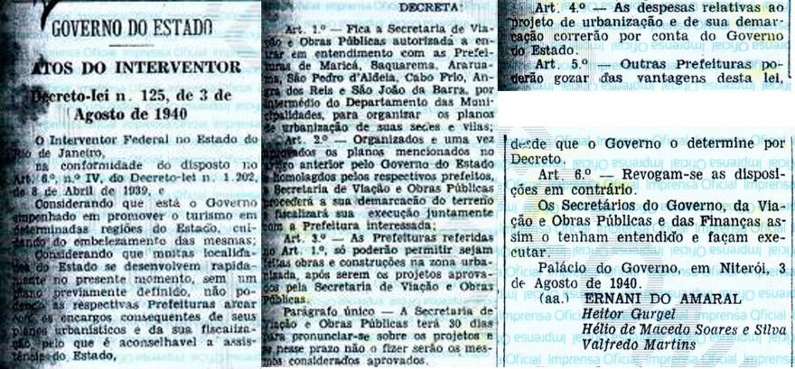
>
> Figura 1: Decreto-Lei nº 125/1940, D.O de 04 de agosto de 1940. Fonte:
> Acervo da Nova Imprensa Oficial do Estado do Rio de Janeiro.

Chama-se a atenção para o Art. 3º, que diz que só serão permitidas obras
e construções na zona urbanizada. Em 30 de janeiro de 1941, o
Decreto-Lei nº 21, o prefeito de Cabo Frio define as zonas urbanas e
suburbanas da cidade. Destaca-se que, nesse momento, a vila de Armação
de Búzios era sede do 3º distrito, e a vila de Arraial do Cabo sede do
4º distrito do município de Cabo de Frio.

Em 1941, o Decreto-Lei nº 305 autoriza as Prefeituras do Estado, com a
assistência do Departamento de Municipalidades, a contratar os estudos e
projetos para execução de obras de redes de abastecimento de água e de
esgoto, assim como ampliação e remodelação das instalações existentes.

Percebe-se, dessa forma, especial atenção do poder público no que diz
respeito ao desenvolvimento urbano dos municípios do interior
fluminenses. Entende-se que a viabilização das obras de infraestrutura,
através do Decreto-Lei nº 305/1941, e a definição das zonas urbanas e
suburbanas de Cabo Frio, através do Decreto-Lei nº 21/1941, tinham como
objetivo preparar o território municipal para receber os planos de
urbanização a que se referia o Decreto-Lei nº 125/1940, demonstrando o
empenho em

se promover o turismo no Estado do Rio de Janeiro através do ordenamento
e embelezamento de algumas de suas regiões.

Dessa forma, na prática, o território estadual foi dividido em duas
áreas de planejamento sob a responsabilidade de dois escritórios
distintos, o do arquiteto Attilio Corrêa Lima e dos irmãos Coimbra
Bueno, cujos planos apresentavam propostas, no primeiro caso, centradas
nas possibilidades de crescimento da região sul fluminense com a
presença da Companhia Siderúrgica Nacional; e no segundo caso, que
representavam os interesses na criação de áreas de expansão e de
loteamentos novos3, especialmente em áreas de

interesse turístico.

Attilio Corrêa Lima já tinha desenvolvido importantes projetos
anteriormente, como sua tese-plano para Niterói e o Plano de Goiânia.
Tinha também atuado como professor de urbanismo no curso de arquitetura
da Escola de Belas Artes do Rio de Janeiro. Os irmãos Coimbra Bueno,
engenheiros, contrataram a assessoria do urbanista francês Alfred
Agache.

Alfred Agache também era um profissional renomado. Desenvolveu o Projeto
de Extensão, Remodelação e Embelezamento da cidade do Rio de Janeiro à
convite do prefeito Prado Junior, em 1927. Passou a trabalhar como
consultor da empresa dos irmãos Coimbra Bueno no final da década de
1930.

Em linhas gerais, os projetos para as cidades turísticas tinham como
principal sustentação o estabelecimento de uma rede de hotéis-cassino,
como o Park Hotel de Araruama, cuja construção foi viabilizada pelo
Decreto-lei nº 257, de 10 de maio de 1941. No entanto, a proibição do
jogo em 1945 tornou esse equipamento ocioso, levando ao esvaziamento e
falência de muitos desses hotéis.

Percebe-se, contudo, que a iniciativa do governo infelizmente não
conseguiu promover o planejamento urbano efetivo e permanente do Estado.
Nas décadas seguintes, constata-se que o caráter abrangente desses
planos foi sendo substituído por propostas setoriais -- de habitação,
saneamento, transporte, etc.

# O Plano de Remodelação, Extensão e Embelezamento da cidade de Cabo Frio

No Decreto nº 3076, de 15 de janeiro de 1947, fica aprovado pelo
Interventor Federal no Estado do Rio de Janeiro, o plano de urbanização
de Cabo Frio, nos termos do Decreto-Lei nº 125/1940, ficando o
loteamento das quadras e as demais áreas da cidade por parcelar a serem
aprovadas oportunamente pelo Secretário de Viação e Obras Públicas.

> 3 Segundo Portaria nº 390, no D.O. de 06 de agosto de 1941, a
> fiscalização dos planos de urbanização das cidades de Araruama e São
> João da Barra, com sua estação balneária de Atafona, e da região
> compreendida entre a cidade de Barra Mansa e a Vila de Pinheiros,
> segundo contratos com as firmas Coimbra Bueno & Cia Ltda. E Attilio
> Corrêa Lima, estava a cargo do engenheiro Aldari Henriques Toledo, em
> substituição ao técnico especializado Carlos de Albuquerque Correia
> Gondim.
>
> 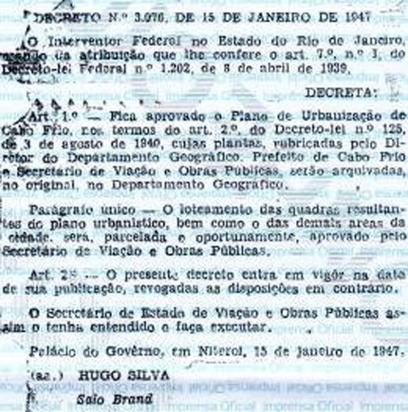
>
> Figura 2: Decreto nº 3.076/1947, D.O de 17 de janeiro de 1947. Fonte:
> Acervo da Nova Imprensa Oficial do Estado do Rio de Janeiro

Durante 1942 e 1943, o escritório dos irmãos Coimbra Bueno desenvolveu o
plano de urbanização da cidade de Cabo Frio, intitulado Plano de
Remodelação, Extensão e Embelezamento da cidade.

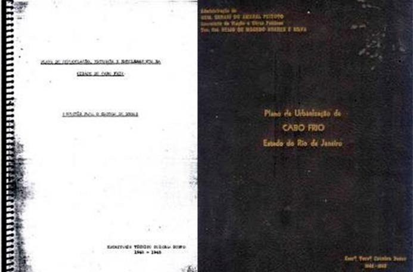Compunha o Plano, um documento
denominado Sugestão para o Código de Obras, com toda a legislação
urbanística que deveria orientar o crescimento da cidade; e um conjunto
de plantas e perspectivas, assinadas pelo Escritório Técnico Coimbra
Bueno.

> Figura 3: Sugestão para o código de obras e álbum contendo as plantas
> e perspectivas do Plano de Remodelação, Extensão e Embelezamento da
> Cidade de Cabo Frio, Coimbra Bueno, 1942-1943. Fonte: Acervo do
> laboratório de pesquisa LDUB-Niterói.

No capítulo 2 do Código de Obras, foi tratado o zoneamento da cidade,
sendo definidas as zonas urbana (ZU), suburbana (ZS) e rural (ZR). A ZU
foi dividida em 6 bairros -- comercial, industrial, portuário,
residencial, turismo, popular -- em ordem decrescente de importância,
conforme indicado na figura abaixo.

> 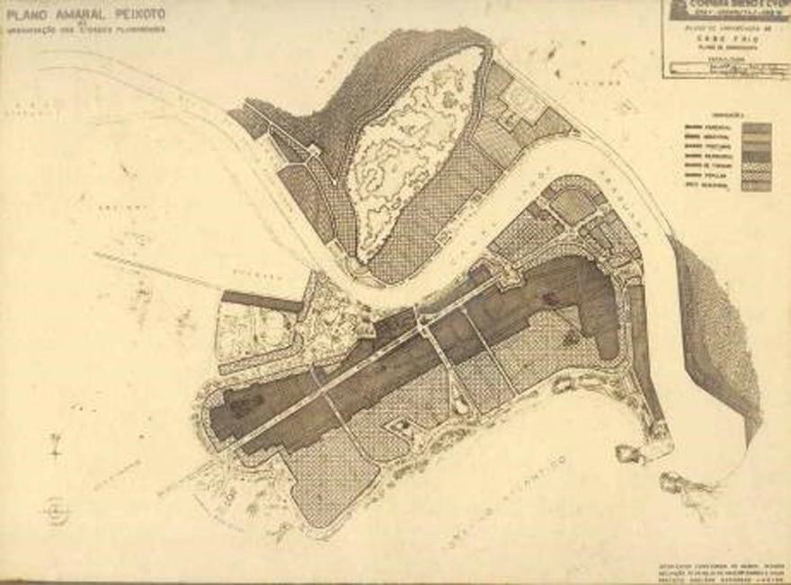
>
> Figura 4: Zoneamento. Plano de Remodelação, Extensão e Embelezamento
> da Cidade de Cabo Frio, Coimbra Bueno, 1942-1943. Fonte: Acervo do
> laboratório de pesquisa LDUB-Niterói.

Importante destacar que o bairro de turismo seria destinado
exclusivamente a casas, não sendo permitidas construções do tipo
apartamento. Já nos bairros residências são permitidas as construções
destinadas a comércio, porém nos lotes de esquina. O Plano também fala,
nos capítulos 3 e 4, sobre os profissionais habilitados a projetar,
calcular e construir, e das condições para a concessão das licenças para
obras, respectivamente. O capítulo 6 destina-se aos arruamentos e
loteamentos, tendo sido determinado que as larguras mínimas das ruas --
15 a 18m nas ruas de maior circulação, e 12m nas ruas residenciais,
sendo 6m para a caixa de rolamento e o restante para os passeios
laterais, que não poderiam ser inferior a 2m.

Sobre os loteamentos, definiram testadas e áreas mínimas por zonas
urbana e suburbana. As testadas poderiam variar de 9m para habitação
proletária a 15m na área rural, e as áreas dos lotes de 225m² a 525m²,
respectivamente. Previa-se o desmembramento no caso de terrenos
localizados em quadra existente fora desses padrões em até 3 lotes, com
testada mínima de 10m e área mínima de 300 m². Na figura 4 observa-se um

zoneamento rígido e seletivo de usos que se rebate na configuração
morfológica, através dos gabaritos. O número de pavimentos e altura dos
edifícios4, na zona urbana eram distintos por bairro: 4 pavimentos no
bairro comercial (BC), 3 pavimentos no bairro industrial (BI), 2
pavimentos no bairro portuário (BP), 3 pavimentos nos bairros
residenciais (BR1 e BR2), e 2 pavimentos no bairro de turismo (BT);
sendo que os prédios não deveriam ultrapassar 2 vezes a largura do
respectivo logradouro, tratando-se dos bairros BC e BI, e 1,5 vezes
tratando-se dos demais bairros. Permitia-se prédios com um número maior
de pavimentos desde que 1) o afastamento entre a construção e o
alinhamento seja acrescido de módulos de 2m, de acordo com o número de
pavimentos

excedidos, e 2) entre a construção e as divisas não houvesse distância
inferior à metade do afastamento entre a construção e o alinhamento do
logradouro público.

> 4A taxa de ocupação máxima era definida por bairros: BC, 80% da área
> do lote, BI e BP 70%,BT 40% e BR1 e BR2 60%, respectivamente; nas
> áreas suburbanas 30%, e na zona rural 20%.

O Código de Obras do Município de Cabo Frio também abordava as questões
de conforto ambiental, com definições a respeito da ventilação e
iluminação, pé-direito dos compartimentos e estética dos edifícios
visíveis do logradouro público. Tratava da colocação de anúncios e
letreiros nas fachadas. Além de definir tipos de habitações proletárias,
legislava sobre construções destinadas a fins especiais: prédios,
hotéis, salas de espetáculos, padarias, açougues, oficinas de
automóveis, posto de gasolina, hospitais e escolas5, dentre outras.

O documento ainda tratava dos materiais de construção, das normas a
serem seguidas no cálculo das construções, com indicação do peso por m²,
conforme material empregado e tipo de uso de cada espaço. Fala, ainda,
sobre vistorias, embargos e multas.

Como se verifica, as definições detalhadas acerca do uso e ocupação do
solo e as relativas à construção constituíram-se num documento que
regularia o crescimento da cidade de Cabo Frio.

> 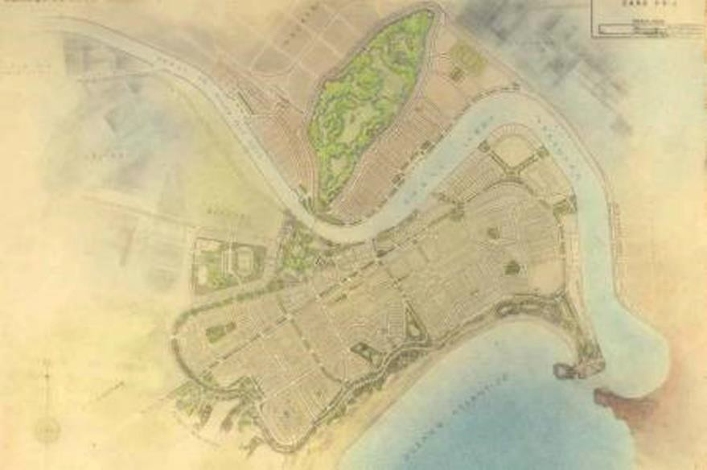
>
> Figura 5: Planta Geral do Plano de Remodelação, Extensão e
> Embelezamento da Cidade de Cabo Frio, Coimbra Bueno, 1942-1943. Fonte:
> Acervo do laboratório de pesquisa LDUB-Niterói.

# Contexto histórico do desenvolvimento urbano da cidade nos anos que antecederam e sucederam a elaboração do Plano

O município de Cabo Frio, uma das primeiras e principais entradas do
Brasil no século XVI manteve-se num relativo isolamento físico até o
final da década de 1930, quando então se construiu a linha ferroviária.
A estrutura urbana da cidade, portanto, pouco se modificou nesse
período, mantendo-se quase inalteradas as características de uma pequena
cidade colonial.

As alternativas econômicas eram restritas, mas se destacaram as
atividades salineiras que demandaram a implantação de infraestrutura na
região, concretizada por uma série de iniciativas que marcaram a
primeira metade do século XX. A construção da ferrovia Niterói-Cabo Frio
na década de 1930, a construção da rodovia Amaral Peixoto na

> 5Deve-se remarcar o tratamento detalhado das escolas: um pavimento com
> salas proporcionais ao número de alunos, no máximo 40 alunos em cada (
> 1m² por aluno) e devendo prever uma latrina para cada grupo de 15
> alunos e um lavatório para cada grupo de 30 alunos.

década de 1940, a implantação da Cia. Nacional de Álcalis em 1943 e da
Refinaria Nacional de Sal em 1949, assim como a construção da ponte
Feliciano Sodré, ligando a porção da restinga ao continente constituíram
medidas que quebraram esse histórico insulamento.

Nas décadas de 1940 e 1950, além da construção da rodovia Amaral Peixoto
(RJ-106), que ligava a região da cidade do Rio de Janeiro à cidade, a
construção da ponte Feliciano Sodré, que permitiu cruzar o Canal de
Itajurú e acessar Cabo Frio de automóvel a partir da margem continental,
possibilitou o desenvolvimento do turismo na cidade. Às questões de
transporte, se somaram outras de ordem econômico-social e cultural, como
a valorização da paisagem do litoral, que gerou uma demanda de terras
urbanizadas, propiciando o aumento do valor do solo.

Tais transformações podem ser demonstradas por dados estatísticos: em
1940, a população urbana do primeiro distrito de Cabo Frio era de 5.826
habitantes; em 1960

13.153 habitantes; e, em 1980, já ultrapassava 40.000 habitantes, quase
triplicando o número anterior. (IBGE, 2000 *in* FUNDAÇÃO CIDE, 2009).

A indústria salineira cabo-friense, que já sofria pressões relativas às
desvantagens na concorrência de seu produto com o sal extraído e
beneficiado no nordeste, passou também a ser confrontada por esse
aumento do preço do solo que incidia exatamente nos locais onde estava
situada, levando-a ao colapso e à reconfiguração destes locais, isto é,
a uma adaptação das antigas formas geográficas, ainda que parcialmente,
a novas funções. Esse aumento ocorreu devido às vantagens de acesso às
águas do Canal de Itajurú e da lagoa de Araruama, objeto valioso no
contexto da nova lógica que se impunha. (MELO, 2011)

Houve um intenso surto de especulação imobiliária nos anos que
antecederam à inauguração da ponte Rio-Niterói; entre os anos de 1970 e
1972, foram concedidas mais de 4.000 licenças para novas construções,
enquanto que nos quatro anos anteriores haviam sido liberadas somente
200 autorizações. Muitas destas novas instalações respondiam a uma
demanda por residências de veraneio.

De modo geral, pode-se dizer que, em Cabo Frio, a criação de
infraestrutura para as atividades de pesca, extração e beneficiamento do
sal até a década de 1940 propiciou a possibilidade de desenvolvimento da
atividade turística. A partir da década de 1950, o turismo ganhou força,
mas ainda compartilhando o uso do espaço com a atividade salineira. Com
a expectativa de construção da ponte Rio-Niterói, na década de 1970, que
viria a facilitar o deslocamento dos moradores da capital fluminense à
região, a lógica de ocupação territorial passou a ser hegemonicamente
ditada pela atividade turística e pela especulação imobiliária e não
mais pela atividade salineira.

Dessa forma, o plano de urbanização de Cabo Frio não se viabilizou na
íntegra, uma vez que ao ordenamento territorial e embelezamento da
cidade se sobrepuseram outros interesses de caráter econômico-social
resultantes do seu súbito crescimento a partir do final da década de 1940. 
Como se observou, as facilidades de acesso à cidade, com a
construção de rodovias, além de incentivar o turismo atraiu também o
mercado imobiliário. Dessa forma, os documentos que compunham o plano,
como o próprio Código de Obras, foram sendo revisados e substituídos,
gerando a necessidade de novos planos que atendessem a nova ordem de
crescimento urbano, ditada pela forte especulação imobiliária.

# 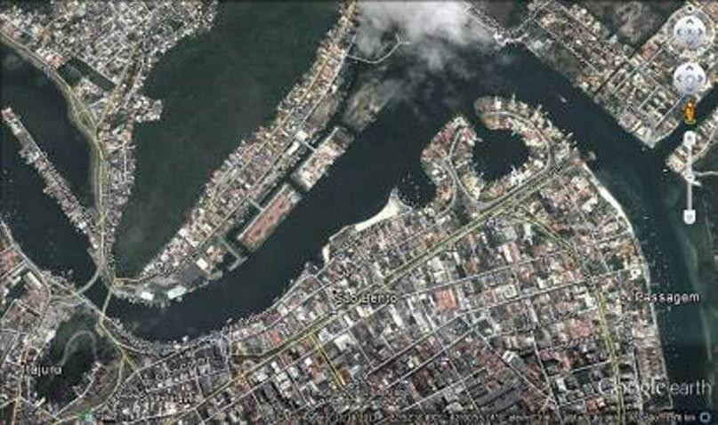Aproximações do Plano com a realidade da cidade

No plano de urbanização de Cabo Frio, estava prevista a contenção do
crescimento urbano dentro dos limites estabelecidos no projeto de
alinhamento e dragagem do Canal de Itajurú, viabilizado no Decreto nº
3002/1938, que destinava verbas para execução da obra de estreitamento
do canal de 450 para cerca de 100 metros, resultando na criação e
utilização de novas áreas sobre a lâmina d'água.

As novas áreas, que seriam destinadas para a construção de espaços
públicos, como novas avenidas e jardins, foram limitadas a abertura de
algumas poucas ruas fora das margens do canal. Fatores como a construção
da ferrovia Niterói-Cabo Frio, as melhorias no Porto do Forno e a
instalação da Companhia Nacional de Álcalis em Arraial do Cabo,
transformaram o Porto de Cabo Frio em opção secundária para a atividade
econômica e para o transporte aquaviário da região, abandonando-se então
o projeto de alinhamento e dragagem do canal.

No entanto, algumas das propostas do Plano foram resgatadas e adaptadas
aos novos interesses que se sucederam, servindo de base para um novo
plano de urbanização da cidade, elaborado pela prefeitura em 1957.
Neste, o alinhamento e os aterros antes sugeridos tomaram nova forma.
Foram respeitados os mesmos limites, mas propostos lotes menores, uma
praça e um campo de futebol.

O projeto de 1957, apesar de pequenas alterações, foi efetivamente
utilizado como base para a construção do novo solo. No entanto, o
processo foi marcado por fins predominantemente especulativos, numa área
que estava se valorizando rapidamente e que já carecia de terras, sendo
então utilizado o antigo projeto para legitimar a construção das
edificações e dos aterros hoje existentes.

> 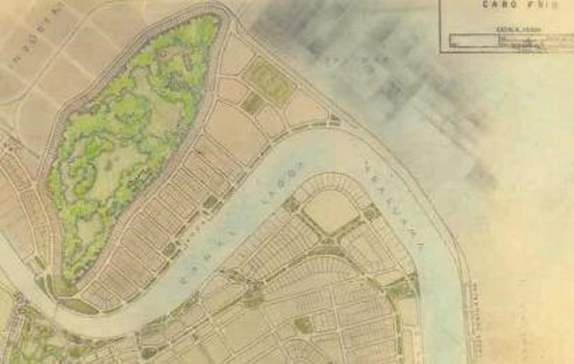
>
> Figura 6: Proposta e situação atual dos lotes e aterros do Canal de
> Itajurú. Fonte: Plano de Remodelação, Extensão e Embelezamento da
> Cidade de Cabo Frio, Coimbra Bueno, 1942-1943; e Google Earth, 2014.

Outras referências do plano de urbanização de 1943 podem ser encontradas
no traçado urbano atual da cidade. Como exemplo, próxima à entrada do
Canal de Itajurú, foi proposta uma praça, atualmente utilizada como
terminal turístico para transatlântico.

> 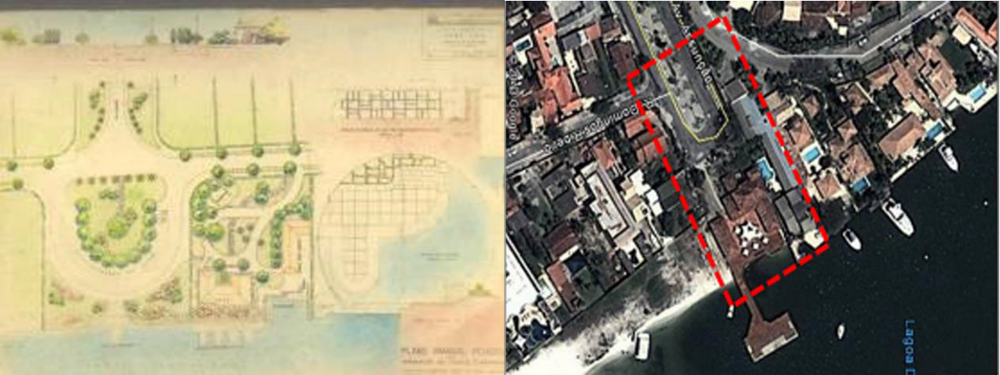Figura 7: Proposta e situação atual da
> praça na final da Av. Assunção. Fonte: Plano de Remodelação, Extensão
> e Embelezamento da Cidade de Cabo Frio, Coimbra Bueno, 1942-1943; e
> Google Earth, 2014.

Da mesma forma, também foi proposta uma praça na Av. Parque, atual Av.
do Contorno.

> 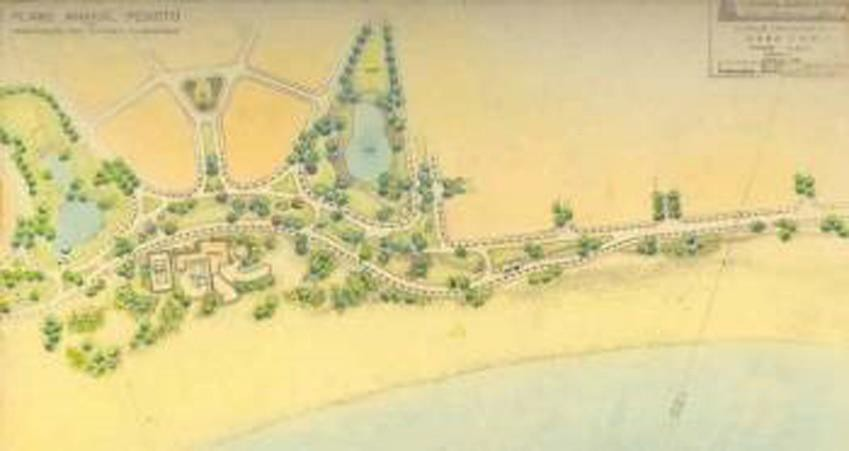
>
> 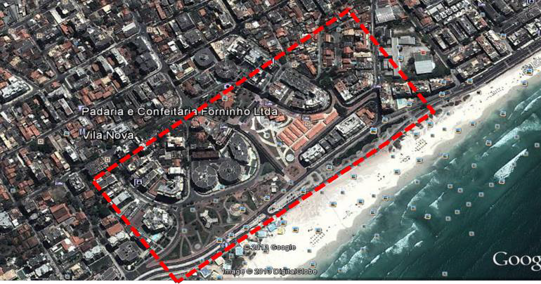
>
> Figura 7: Proposta e situação no início de 2013 da praça na Av. Parque
> (atual Av. do Contorno). Fonte: Plano de Remodelação, Extensão e
> Embelezamento da Cidade de Cabo Frio, Coimbra Bueno, 1942-1943; Google
> Earth, 2014.

No entanto, a praça, localizada na orla da Praia do Forte, foi objeto de
recente projeto de urbanização que lhe conferiu nova forma. Foram
instalados quiosques em nível elevado, e banheiros públicos e
estacionamento em nível semienterrado, como mostra a figura abaixo.

> 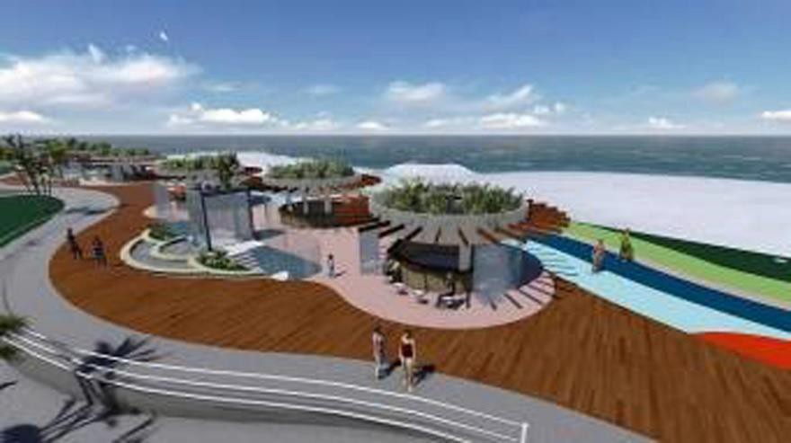
>
> Figura 8: Atual Praça dos Quiosques na orla da Praia do Forte, Cabo
> Frio. Fonte não identificada.

Outro exemplo é o Estádio Municipal. Apesar de não ter sido construído
no local proposto pelo plano, parte do lote projetado para o mesmo
possui até hoje um campo de futebol.

> 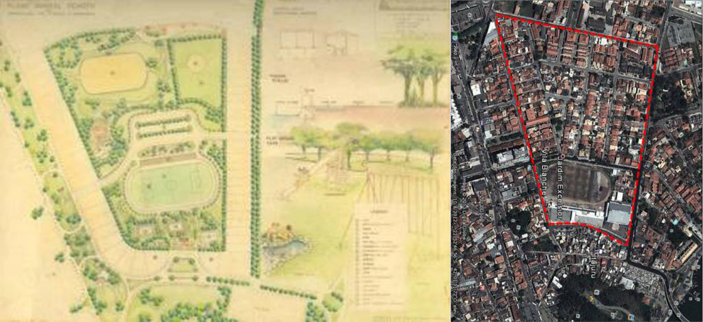
>
> Figura 9: Proposta e situação atual do quarteirão projetado para o
> Estádio Municipal. Fonte: Plano de Remodelação, Extensão e
> Embelezamento da Cidade de Cabo Frio, Coimbra Bueno, 1942-1943; e
> Google Earth, 2014.

A partir de 1959, com a efetiva preocupação do poder público municipal
com o turismo na região de Cabo Frio, foram criados órgãos para cuidar
da atividade turística e do reordenamento urbano da cidade. A resolução
nº33 de 23 de outubro de 1959 criou a Comissão Municipal de Planejamento
e Turismo de Cabo Frio - COMUPLATUR. O artigo 8º desta resolução
afirmava que "a COMUPLATUR seria um órgão consultivo e coordenador,
podendo através de seus técnicos, (\...), apreciar (\...) anteprojetos
de leis, posturas, plano diretor, pedidos de licença de edificação,
loteamentos, etc." Uma nova resolução criou em 1962 o Departamento de
Turismo de Cabo Frio -- DTCF. Segundo o art. 5º, o poder público
colocava sob a responsabilidade do novo órgão toda a elaboração do Plano
Diretor Municipal, que deveria:

> (\...) apreciar e opinar sobre todos os projetos de urbanização
> loteamentos particulares e municipais, obras públicas, balneários,
> hotéis, parque ou qualquer realização que implique
>
> no embelezamento, defesa paisagística da cidade e do município de Cabo
> Frio, as quais deverão ser obrigatoriamente submetidas à aprovação do
> DTCF.

# Considerações finais

O Plano de Remodelação, Extensão e Embelezamento da cidade de Cabo Frio
apesar de sua intenção reguladora e da ênfase higienista expressa nas
inúmeras propostas de parques e praças, característicos do urbanismo
técnico científico, mostra a importância que adquirem as avenidas
litorâneas, a ideia da cidade turística, o valor outorgado ao
embelezamento e a presença de profissionais arquitetos e urbanistas
junto aos engenheiros, já prevê correntes de modernização da cidade.

Não se pode deixar de considerar a importância que assume nesse contexto
o ato de viajar e veranear, que se torna uma atividade típica,
explicando a construção de grandes hotéis. No Brasil, somado ao
incentivo à construção de hotéis 6 também se construíram numerosos
complexos balneários nas cidades litorâneas, como foi o caso de
Araruama, Cabo Frio e Atafona, por exemplo. Em Araruama, um hotel
turístico chegou a ser

construído.

Em Cabo Frio, apesar do Plano não ter sido efetivamente executado,
tampouco incorporado integralmente nos planos e projetos que o
sucederam, percebe-se nítidas influências no traçado urbano da cidade,
embora este tema seja ainda objeto de uma investigação mais aprofundada.

Percebe-se que a vocação turística de Cabo Frio foi se transformando nos
anos posteriores ao desenvolvimento do Plano, configurando um cenário
que não mais condizia às pretensões políticas e modermizadoras de cidade
balneária, tendo se configurado um quadro de grande especulação
imobiliária em toda a Região dos Lagos, que orientou a ocupação urbana a
partir de então.

Suspeita-se que o crescimento da especulação imobiliária seja efeito
também da melhoria das condições de acesso às cidades da região, como a
abertura da Rodovia Amaral Peixoto na década de 1940 e, posteriormente,
a Ponte Rio-Niterói, na década de 1970, cujos resultados se fizeram
sentir nos anos seguintes com a intensa transformação da Região dos
Lagos face às mudanças culturais que tornaram essas áreas locais
privilegiados de lazer.

# Referências bibliográficas

> ABREU, M. A. *Evolução Urbana do Rio de Janeiro*. Rio de Janeiro:
> Iplan-Zahar, 1988.
>
> AGACHE, A. H.. *Cidade do Rio de Janeiro, extensão, remodelação,
> embelezamento*. Paris: Foyer Bresilien, 1930.
>
> ARANGO C. S. Ciudad y arquitectura. *Seis generaciones que
> construyeron la America Latina moderna*. Mexico: FCE-Colombia,
> Conaculta, 2012.
>
> AZEVEDO, M. N. S. de; COSTA, M. S. O Urbanismo do início do século XX:
> a Escola Francesa de Urbanismo e suas repercussões no Brasil:
> *trajetórias de Alfred Agache e Attílio Corrêa Lima*. Niterói, 2012.
>
> 6 Nos anos de 1920, o então presidente Epitácio Pessoa convocou vários
> empresários para incentivar a construção de hotéis no Rio de Janeiro
> capazes de alojar os turistas que viriam para as celebrações do
> Centenário da Independência em 1922, como exemplo, foram construídos
> os luxuosos hotéis Gloria e Copacabana Palace.

AZEVEDO, M. N. S. de; O espaço fluminense e a intervenção urbana no
Estado Novo. *In* REZENDE, V. (organizadora). *Urbanismo na Era Vargas*:
a transformação das cidades brasileiras. Niterói: Editora da UFF,
Intertexto, 2012.

> COIMBRA BUENO. Escritório Técnico. *Plano de Remodelação, Extensão e
> Embelezamento da Cidade de Cabo Frio*. Rio de Janeiro, 1942-1943.
>
> . Plano de Remodelação, Extensão e Embelezamento da Cidade de Cabo
> Frio*. Sugestão para o Código de Obras*. Rio de Janeiro, 1942-1943.

FELDMAN, S. As Comissões de Planos da Cidade na Era Vargas. *In*
REZENDE, V. (organizadora). *Urbanismo na Era Vargas*: a transformação
das cidades brasileiras. Niterói: Editora da UFF, Intertexto, 2012.

> LIMA, A.C. L. *Tese Avant Projet d'aménagement et extension de de la
> ville de Niterói au Brésil*. Paris, 1932.

MELO, E. S. O. de. Gênese da urbanização turística em cabo frio
(1950-1978). XIV ENCONTRO NACIONAL DA ANPUR. Rio de Janeiro, maio de
2011.

> PINHEIRO, E. P. *Europa, França e Bahia: difusão e adaptação de
> modelos urbanos (Paris, Rio e Salvador)*. Salvador: EDUFBA, 2002.

REZENDE, V. (organizadora). *Urbanismo na Era Vargas*: a transformação
das cidades brasileiras. Niterói: Editora da UFF, Intertexto, 2012.

Outros:

Acervo da Nova Imprensa do Estado do Rio de Janeiro. Niterói-RJ.
