# Resumo

A relação entre a cidade de Vitória e as águas presentes em seu
território foi historicamente marcada por situações de conflito,
expressas em sua paisagem. A construção e o crescimento das cidades
pressupõe, naturalmente, a adaptação do meio para permitir e
potencializar as atividades humanas, criando-se condições necessárias à
fixação do homem no espaço geográfico. Tais transformações são
determinadas socialmente de acordo com as necessidades e preceitos de
cada momento histórico. O presente artigo objetiva analisar a evolução
dessa relação determinada pela construção do aglomerado urbano no
entorno da Baía de Vitória, sítio físico sobre o qual a cidade cresceu e
que compreende a própria baía, além dos cursos d'água que nela desaguam,
os quais banham os seguintes municípios da Grande Vitória: Vitória,
Cariacica e Vila Velha. Objetiva, também, caracterizar as duas fases
identificadas dessa relação no decorrer de cinco séculos de ocupação. A
primeira fase identificada, que abrange desde o início da colonização
até o início do século XX, pode ser caracterizada por situações de
convivência e relativa harmonia entre os elementos hídricos da paisagem
e a ocupação urbana. A partir daí, porém, processou-se um grande
crescimento e expansão da cidade, por conta do comércio de café e,
sobretudo, pelo processo de industrialização, quando a cidade ganha
outros contornos. No século XX começa a configuração do que
identificamos como uma segunda fase, em que se acirram as situações de
conflito na relação entre a cidade e suas águas.

Palavras-chave: rios e córregos, Baía de Vitória, paisagem urbana,
relação cidade- sítio, história urbana

# Abstract

The relationship between the city of Vitória and the waters present in
its territory has been historically marked by situations of conflict,
expressed in its landscape. The construction and growth of cities
presupposes, naturally, the adaptation of the environment to enable and
enhance human activities, creating the necessary conditions to people
settle in geographical space. Such transformations are socially
determined according to the needs and precepts of each historical
moment. This article aims to analyse the evolution of this relationship
determined by the construction of the urban areas surrounding the
Vitória's Bay, physical site on which the city grew and which comprises
the bay itself, in addition to the water courses that flow into it,
which bathes the following municipalities in Great Vitória: Vitória,
Cariacica and Vila Velha. It also aims to characterize the two phases
identified in this relationship over the course of five centuries of
occupation. The first phase identified, which spans from the beginning
of colonization until the early twentieth century, can be characterized
by the coexistence and relative harmony between the water elements of
landscape and urban occupation. From there, however, a major growth and
expansion of the city took place, on behalf of the coffee trade and,
above all, by the process of industrialization, when the city assumes
other setup. In the 20th century begins the configuration of what we
identify as a second phase, in which the conflict situations arrise in
the relationship between the city and its waters.

Keywords: rivers and streams, Vitória's Bay, urban landscape,
relationship between city and physical site, urban history

# Introdução

A relação entre as cidades brasileiras e as águas presentes em seus
territórios tem sido marcada pelas situações de conflito. A construção e
o crescimento das áreas urbanas pressupõem adaptações do meio natural
para possibilitar e potencializar a realização das atividades humanas.
Tais adaptações, decorrentes da apropriação do sítio físico pelo homem
para sua transformação em áreas urbanas, ora passa pela incorporação das
características e elementos naturais à sua paisagem e ao seu desenho,
ora pela supressão e/ou exclusão.

A forma urbana e o desenho da cidade podem determinar situações
harmônicas ou de conflito nas relações entre os assentamentos urbanos e
as águas de seu território, uma vez que decorrem das necessidades
colocadas socialmente em cada momento histórico. Assim, a paisagem,
compreendida como resultado dos processos naturais e antrópicos de
transformação do meio, evidencia as etapas das relações entre a cidade e
seu sítio. As paisagens urbanas são constituídas a partir da interação
entre homem e natureza, a qual consequentemente determina certas
relações entre o ambiente construído e o natural, caracterizadas por
sobreposição, dominação, ruptura, continuidade ou complementação, que
permeiam o meio urbano, qualificando-o e constituindo-o. E ao tratar da
cidade de Vitória, Klug afirma: "o estudo dos processos históricos e
naturais que levaram às transformações da paisagem ajuda a compreender
os problemas, as qualidades e as especificidades da paisagem da cidade"
(KLUG, 2009, p. 14).

Este artigo objetiva analisar o caso específico dessas relações entre a
expansão do aglomerado urbano do contexto urbano da Grande Vitória
(compreendido pelos municípios de Vitória, Cariacica e Vila Velha) e a
Baía de Vitória. Portanto, se trata de focar as relações entre o
desenvolvimento urbano e o entorno imediato da Baía de Vitória bem como
dos cursos d'água que nela desaguam. Para tanto, buscar-se-á
caracterizar as fases identificadas dessa relação, que passou do
convívio à negação no decorrer de cinco séculos de ocupação urbana,
analisando-se os episódios que influenciaram e determinaram a paisagem
atual da citada baía. Mapas, textos, relatos e trabalhos
historiográficos compõem o material consultado, a partir do qual foi
possível traçar os caminhos seguidos pelas cidades na ocupação e
transformação de seu sítio, sobretudo no que se refere ao meio hídrico.

# A Baía de Vitória: sítio físico da Grande Vitória

Podemos considerar a Baía de Vitória como o exutório da Bacia do Rio
Santa Maria, configurando uma região estuarina onde se instalaram os
municípios de Vitória, Vila Velha e Cariacica. A configuração espacial
dessa baía determina sua divisão em três setores distintos (Figura 1). O
primeiro deles é o canal sul, também conhecido somente como Baía de
Vitória, que se estende desde sua barra até a foz do Rio Marinho no
sentido leste-oeste e divide os municípios de Vitória e Vila Velha. Na
porção mais interna localiza-se outro setor, conhecido como Baía
Noroeste, que se estende no sentido norte-sul, desde a foz do Rio Santa
Maria até a foz do Rio Marinho, e divide os municípios de Vitória e
Cariacica. Já o último setor, o Canal de Camburi, estabelece a divisão
entre a porção insular do município de Vitória e a porção continental.

> 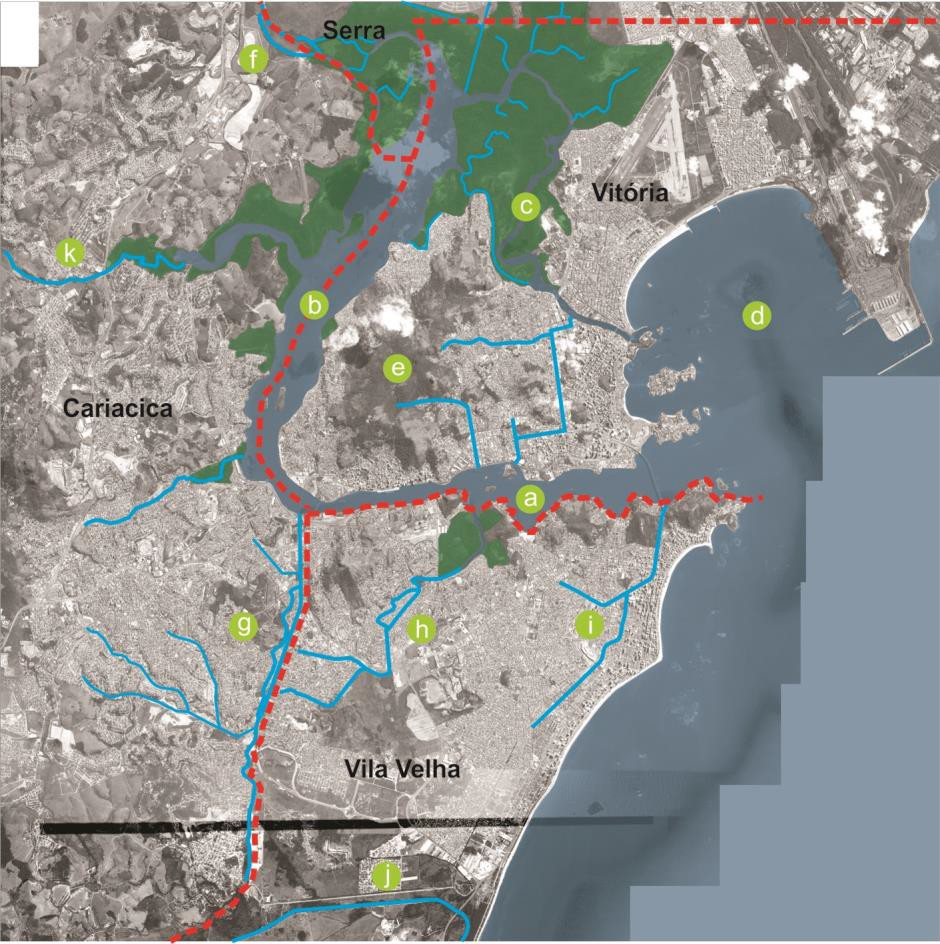
>
> Figura 1. Mapa do aglomerado urbano no entorno da Baía de Vitória,
> onde identificam-se: a) Baía de Vitória; b) Baía Noroeste; c) Canal de
> Camburi; d) Baía do Espírito Santo; e) Ilha de Vitória; f) Rio Santa
> Maria; g) Rio Marinho; h) Rio Aribiri; i) Canal da Costa e Bigossi; j)
> Rio Jucu; k) Rio Bubu.

Na hidrografia do continente destacam-se alguns rios como o Santa Maria,
que é o de maior volume e deságua na porção norte da baía, e o Aribiri e
o Marinho, localizados no município de Vila Velha e que deságuam nas
proximidades do centro de Vitória. Outros cursos e canais (naturais ou
construídos) de menor expressão compõem a rede hidrográfica da região.
Antes dominada por manguezais, a baía ainda conserva grande extensão
territorial com essa vegetação ao norte da Ilha de Vitória, entrecortada
por canais naturais e artificiais e que possuem seu regime de águas
atrelado ao movimento das marés.

Localizada no interior da baía de Vitória, a parte insular é a que lhe
dá a forma de um canal. A Ilha de Vitória é a maior das que compõem um
arquipélago que contava com um grande número de ilhas menores, mas que
foram conectadas por sucessivos aterros. O conjunto é marcado por um
relevo acidentado, com destaque para o Maciço Central na porção
centro-oeste da mesma, onde localizam-se as nascentes dos córregos que
também deságuam na baía.

Em Vila Velha, os rios Marinho e Aribiri, além dos canais da Costa e
Bigossi, entre outros, cortam as áreas planas e alagadiças do município.
Influenciados diretamente pelo regime de marés, esse conjunto de cursos
deságua na margem sul da baía pontuada por morros que se estendem da
barra até a foz do Rio Marinho. Já no município de Cariacica, de relevo
ondulado, encontram-se rios e córregos encravados nos fundos de vale.
Alguns desses são tributários do Rio Marinho, enquanto outros

lançam suas águas na baía.

Assim, a configuração espacial da Baía de Vitória, levando em
consideração os aspectos físicos e naturais de seu sítio, demonstra uma
interação entre os variados ambientes que a compõe, estabelecida
principalmente pelos rios e cursos de água que tecem relações
hidrológicas complexas. Mas a riqueza dessas relações foi muito alterada
pela ocupação urbana, de modo que suas características e elementos,
antes incorporados ao desenho, à paisagem e ao cotidiano urbano, foram
deformados ou mesmo suprimidos com o tempo.

# Da muralha à cidade-presépio

A Vila de Vitória foi fundada no século XVI na região insular pelos
portugueses, uma vez que a antiga sede da Capitania do Espírito Santo,
localizada no continente e próxima à entrada da Baía de Vitória, fora
abandonada. Conforme Oliveira (2008), o motivo para tal decisão era a
vulnerabilidade da Vila Velha a ataques de indígenas, além da
dificuldade de estabelecer comunicação por via terrestre com o interior
da colônia em função dos terrenos alagados que a limitavam. Dessa
maneira, a Vila de Vitória contava com a baía para proteger-se dos
atacantes, além de permitir acesso facilitado por via aquática entre a
capital e as terras produtivas do interior, localizadas principalmente
em Cariacica.

> 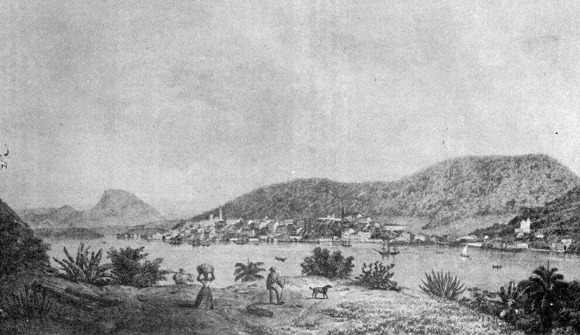
>
> Figura 2. Desenho do final do século XVIII, de Vitória vista de Paul
> (Vila Velha). Fonte: MEMÓRIA, 2014.

Vitória ocupou uma elevação que se destacava no Maciço Central da ilha e
que era contornada pelas águas da baía. No entorno dessa elevação
localizavam-se áreas de mangue, que limitaram a expansão do núcleo
urbano inicial. Na Figura 2, percebe-se um estágio em que a vila já
havia se desenvolvido até ocupar toda a colina, harmonizando a nova
paisagem com os elementos naturais do sítio. Serafim Derenzi descreveu
tal paisagem ~~resultante~~ onde se destacam os elementos hídricos e
ambientes relacionados a eles como fatores aos quais a vila se
incorporou:

> Na segunda metade do século XVIII a capital do Espírito Santo, vista
> do continente, tem belo aspecto paisagístico. Lembrando um feudo
> medieval encastelado na grimpas das montanhas a se espalhar em áreas
> tranqüilas de um belo lago. O casario, nascendo do mar, entremeia-se
> com o resto de vegetação nativa e morre em torno do 'Colégio' e da
> Matriz. As torres assimétricas de Santiago dão-lhe um harmonioso
>
> equilíbrio que se casa com o plano de fundo, coberto de mata secular e
> vigorosa. Não há separação definida entre as águas e a terra. O mar
> entra pela prainha e, nos baixios de Roças Velhas, dilui-se nos
> mangues, que se confundem com o mataréu das colinas. Nas marés menores
> descobrem bancos de areia, que, pouco a pouco, aterrados, se
> transformam em embarcadouros e trapiches (DERENZI, 1965, p. 95).

Vitória era abastecida com produtos vindos das fazendas localizadas nas
áreas continentais, os quais eram transportados por embarcações que
atracavam nos trapiches e pequenos cais construídos nas margens da baía.
Importante considerar, também, as atividades pesqueiras e artesanais que
abasteciam a vila com peixes e outros produtos do mar.

A população da vila obtinha água das fontes alimentadas pelos cursos
d'água que vertiam do Maciço Central, dois deles identificáveis na
Figura 3. Tais cursos, segundo Broedel (1994), tinham sua vazão
diminuída nos períodos de estiagem, o que obrigava a obtenção de água
potável em outros locais, inicialmente no Rio Marinho e, posteriormente,
no Rio Jucu. Este último não deságua na Baía de Vitória, mas, conforme
Martins (1993), fora ligado por fazendeiros ao Rio Marinho com a
construção de um canal no século XVIII.

> 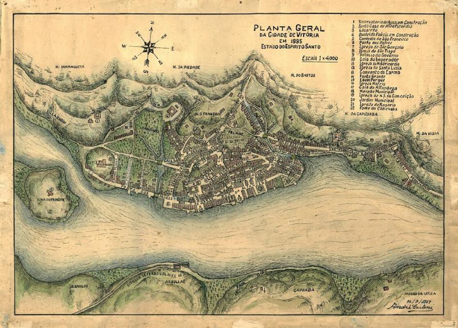
>
> Figura 3. "Planta Geral da Cidade de Vitória", 1895, onde
> identificam-se os modos como o assentamento urbano se moldava junto
> aos cursos d'água. Fonte: MEMÓRIA, 2014.

Percebe-se que a cidade moldava seus espaços permitindo o convívio e o
acesso à baía e aos elementos hídricos de toda a região. As edificações
se implantavam ao longo da linha d'água da baía, sem separação por meio
de qualquer via que a margeasse. A principal maneira de contato entre
cidade e canal acontecia por meio de ancoradouros e trapiches. Essa
configuração foi mantida até o século XIX, com pequenas modificações e
ampliações das instalações urbanas em aterros, naquele então realizados
com lixo e entulhos nas áreas alagadas próximas. Os córregos e suas
nascentes permaneciam inalterados, entremeando-se nos manguezais que
bordejavam toda a ilha.

Com a descoberta de pedras preciosas e ouro no interior da Capitania,
ficou proibida a criação de novos povoamentos entre Vitória e o
interior. Além disso, toda a população deveria se dirigir e povoar o
litoral como reforço aos sistemas de defesa ~~do~~ das riquezas
recém-encontradas, reforçados por meio de fortificações acrescentadas à
paisagem da região da baía (LIMA JUNIOR; SOARES; BONICENHA, 1994).
Assim, a partir do século XIX até o início do século XX, a relação entre
a cidade e as águas começa a se modificar. Os limites e a escala da
cidade ganham outros contornos em comparação aos da baía, e foram
empreendidas modificações físicas em canais, córregos e manguezais.

Ao final do período colonial, findada a proibição de expansão para o
interior, a cidade de Vitória experimentou uma fase de crescimento. E a
partir do final do século XIX, as riquezas advindas do comércio de café,
que tinham Vitória como ponto final de escoamento do interior do estado,
incrementaram esse crescimento e possibilitaram a instalação de
infraestruturas urbanas até então inexistentes.

O Projeto do Novo Arrabalde, de autoria de Saturnino de Brito e datado
de 1896, orientou a expansão da ocupação da ilha para as praias
localizadas a leste. O projeto do novo bairro (Figura 4), descontínuo ao
Centro devido extensos manguezais, previa uma área seis vezes maior do
que a do antigo núcleo urbano, além de um traçado regular muito
diferente do assentamento colonial. A implantação do Novo Arrabalde se
fez sobre os areais próximos ao litoral da ilha, mas contou com áreas
aterradas sobre manguezais em seu interior. O projeto previu, também,
uma via marginal à orla marítima, possibilitando o acesso da população
às praias. Previu, ainda, que o acesso entre o "Centro" e o Novo
Arrabalde se faria por uma estrada que se estenderia ao longo da base
dos morros, denominada de Avenida Vitória e que foi elevada em relação
às áreas de mangue circundantes, interferindo na dinâmica hídrica da
região.

> 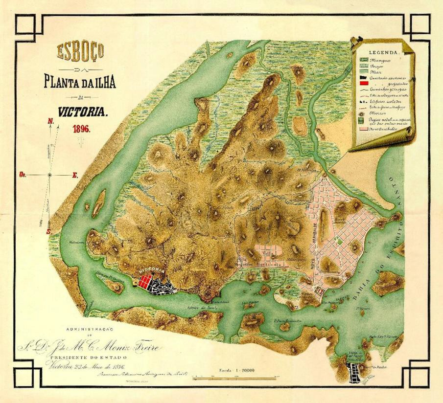
>
> Figura 4. Planta da Ilha de Vitória em 1896 com inserção do Novo
> Arrabalde. Fonte: BRITO, 1896.

O Plano de Melhoramentos da Capital do início do século XX dotou a
cidade de Vitória com novos serviços como abastecimento de água, bondes
elétricos, rede de esgoto, entre outros. Isso modificou a dependência da
população da vila em relação à água captada na ilha, uma vez que a
captação passou a acontecer nas nascentes do Córrego Duas Bocas, em
Cariacica. Além disso, as áreas de mangue que limitavam o núcleo urbano
inicial, as regiões do Campinho e da Prainha, são aterradas, e sobre
elas são criados, respectivamente, o Parque Moscoso (Figura 5) e a Praça
Costa Pereira. Por conta disso, os cursos d'água nesses locais foram
suprimidos. Ao final dos melhoramentos, a cidade parecia acabada,
apresentando um aspecto modernizado (Figura 6) e "foi nesse momento que
Aerobaldo Lélis \[\...\] criou a legenda: Vitória, cidade-presépio"
(MARTINS, 1993, p. 101).

> 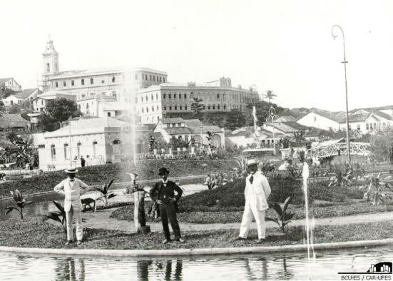
>
> 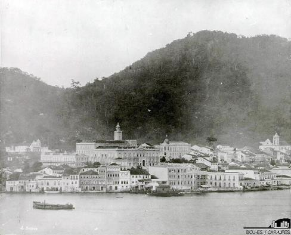Figuras 5. Foto do Parque Moscoso nas
> primeiras décadas do século XX. Fonte: MEMÓRIA, 2014.
>
> Figuras 6. Foto de Vitória a parir do continente nas primeiras décadas
> do século XX. Fonte: MEMÓRIA, 2014.

Outros aterros ocorreram nas proximidades da antiga vila durante este
período, possibilitando a abertura de novas ruas e a criação de mais
terreno para a expansão da cidade. Abriam-se novas frentes para a baía,
com vias margeando-a e cais para atracação de embarcações. Enquanto os
córregos e áreas de mangue perdiam espaço no cotidiano urbano de
Vitória, a baía ganhava destaque ao colocar-se como o único modo de
acesso à cidade, além de servir de palco para a realização de disputas
de regatas (Figura 7) e festividades religiosas, como a procissão
marítima da Festa de São Pedro, apreciadas pela população debruçadas nas
margens (LIMA JUNIOR; SOARES; BONICENHA, 1994).

> 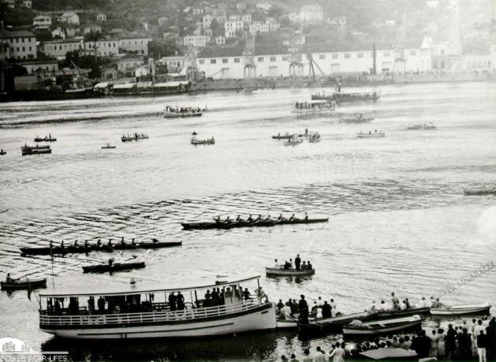
>
> Figuras 7. Foto de regata na baía com a população acompanhando nas
> margens, nas primeiras décadas do século
>
> XX\. Fonte: MEMÓRIA, 2014.

# Novos tempos: portos, indústrias e aterros

Ao longo do século XX, a relação entre a cidade e as águas do território
da Baía de Vitória é caracterizada principalmente pelas intensas
modificações e degradações promovidas pelo crescimento da cidade. A
expansão passa a ocorrer tanto em novas áreas da ilha como nas terras
continentais, e o início desse período é marcado pelo aumento do
comércio do café e pela intensificação das atividades portuárias (CAMPOS
JUNIOR, 2002).

A construção do Porto de Vitória inicia-se no governo de Jerônimo
Monteiro (1908- 1912) e até meados do século XX são finalizados os novos
cais e armazéns. Dessa maneira, as instalações portuárias constituíram
uma barreira física entre a cidade e a baía, dificultando o acesso e a
percepção desta. Posteriormente, ocorreram outros aterros, como o da
Esplanada Capixaba e o da Vila Rubim, ambos criando terreno para a
expansão da cidade, sendo que o último anexou a Ilha do Príncipe à Ilha
de Vitória, desfazendo o canal que as separava. Tais aterros definiram
os atuais contornos da ilha junto ao Centro de Vitória.

Ao final da década de 1920, Vitória passa a contar com acesso por via
terrestre a partir da construção da Ponte Florentino Avidos (MARTINS,
1993). Assim, o acesso à cidade a partir dos municípios de Cariacica e
Vila Velha foi facilitado, permitindo a extensão das linhas férreas até
o porto, ampliando a capacidade de escoamento da produção de café. Por
outro lado, como ressalta Mendonça (2006), a percepção que se tinha da
cidade e de sua paisagem é influenciada por essa nova modalidade de
acesso, antes realizada exclusivamente por via marítima.

Conforme plantas cadastrais da década de 1940, novas áreas são ocupadas
no interior da Ilha de Vitória, como os bairros de Jucutuquara e
Maruípe, entre outros, além de outros bairros localizados na porção
continental do município. Os cursos d'água que atravessavam essas
antigas fazendas são inicialmente canalizados (Figura 8), passando a
constituir parte da rede de drenagem da cidade e, posteriormente, foram
tamponados na medida em que o esgoto lançado sem tratamento comprometeu
a qualidade de suas águas e a salubridade do ambiente urbano (DANIEL;
DADALTO, 1999).

> 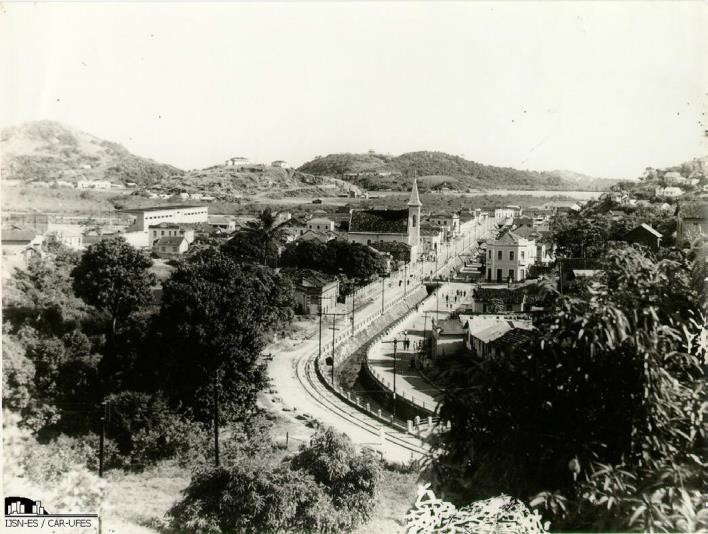
>
> Figuras 8. Foto do Bairro de Jucutuquara com o córrego canalizado, na
> década de 1930. Fonte: MEMÓRIA, 2014.

Porém, a expansão urbana sobre o sítio não fica restrito somente à Ilha
de Vitória. A facilidade de acesso terrestre em função da Ponte
Florentino Avidos (Figura 9) fez com que novos bairros surgissem nos
municípios de Vila Velha e Cariacica, ocupando inclusive locais
suscetíveis a alagamentos tanto às margens de canais artificiais como de
rios.

> 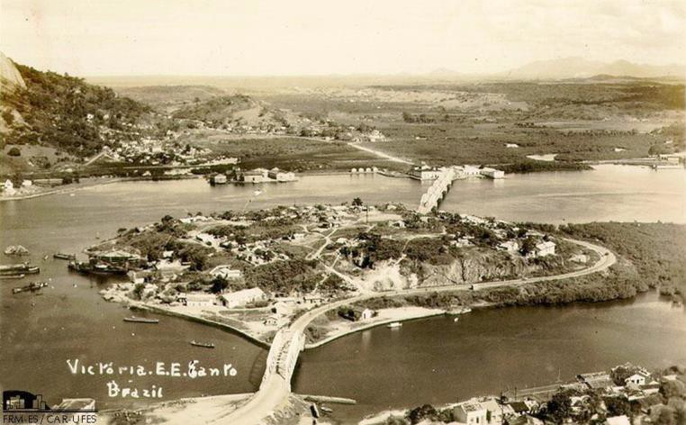
>
> Figuras 9. Foto da Ponte Florentino Avidos ligando Vitória ao
> continente, década de 1920. Fonte: MEMÓRIA, 2014.

Vasconcellos (1993) comenta que a partir da década de 1940, a base
produtiva do estado se transforma por incentivo do governo à
industrialização. Ele ressalta que Jones dos Santos Neves "conduziu o
início do processo de modernização industrial, que implicou num
reordenamento do espaço urbano da Capital" (op. cit., p. 115). Essa
conformação viria consolidar-se na Grande Vitória a partir da segunda
metade dos anos 1960. O ritmo de expansão e crescimento da cidade, que
até a década de 1960 ocupava esparsamente áreas na ilha e no continente,
ganha impulso com a implantação dos Grandes Projetos Industriais e dos
portos de Tubarão e Praia Mole na região continental de Vitória. A
economia dos municípios se dinamiza com a criação de novas atividades
econômicas, ligadas principalmente à indústria siderúrgica e às
atividades portuárias.

Em função disso, foi necessário disponibilizar novos terrenos para o
crescimento da cidade. Na Ilha de Vitória, foram concluídos os aterros
dos mangues encontrados entre a área do Novo Arrabalde e o Centro de
Vitória. Essa região constituiu-se em novos bairros (Bento Ferreira,
Ilha de Monte Belo, Ilha de Santa Maria e Forte São João). Estes foram
limitados ao sul por uma avenida que redefiniu os limites da Baía de
Vitória, desfazendo as reentrâncias de água, as quais definiam um limite
impreciso entre terra e água. Os aterros incorporaram a Ilha de Santa
Maria e Ilha de Monte Belo à Ilha de Vitória, além de suprimir grande
parte dos canais naturais que permeavam o mangue. Os canais artificiais
foram posteriormente tamponados e tiveram suas margens concretadas,
constituindo a rede pluvial da cidade. Além disso, estes não escaparam
do contexto de poluição hídrica que atingiu os diversos corpos d'água da
Grande Vitória.

Também a região da Enseada do Suá foi local de um grande aterro, na
década de 1970, conquistando uma extensa porção de mar e
disponibilizando-a para a expansão da cidade. Assim, foram anexadas
diversas ilhas à Ilha de Vitória, modificando seu desenho original, a
exemplo dos aterros anteriores. A praias que ali existiam (do Canto,
Comprida, de Santa Helena e do Suá) foram substituídas por outras,

distanciadas do tecido urbano existente. Posteriormente, o tratamento
dado ao aterro incluiu um grande parque urbano ao longo de sua orla,
enquanto o restante do aterro recebeu novo arruamento, cumprindo-se
assim sua função imobiliária.

> 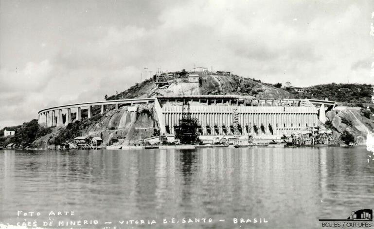
>
> Figuras 10. Foto do Cais de Paul com linhas férreas instaladas no
> Morro Pela Macaco para o transbordo do minério para exportação, 1949.
> Fonte: MEMÓRIA, 2014.

Enquanto isso, a margem sul da baía (Figura 10), no lado oposto ao
Centro de Vitória, foi ocupada por novas instalações portuárias (Cais de
Paul, Cais de Capuaba, Terminal de Vila Velha) que, em conjunto com as
linhas férreas, constituíram novas barreiras impedindo o livre acesso às
suas águas.

A região oeste da ilha manteve-se à parte das maiores modificações sobre
o sítio e, também, sobre os elementos hídricos da região. Esta se
configurava, junto com os morros da ilha, a última fronteira de ocupação
na porção insular de Vitória. Enquanto isso, a fronteira urbana
expandia-se continuamente nos municípios de Vila Velha e Cariacica.

A expansão da cidade nesses locais deve-se ao crescimento populacional,
intensificado pela chegada de migrantes vindos do interior do estado e
de outras unidades da Federação, atraídos pelas promessas de emprego e
renda em decorrência da industrialização da Grande Vitória. Porém, esse
contingente populacional acabou não sendo totalmente absorvido pela
economia local (VASCONCELLOS, 1993). Assim procedeu-se a formação de
novas periferias na Grande Vitória, tanto loteamentos regulares como
invasões, instalando-se em locais ainda desocupados.

> Nenhum dos municípios que passou a integrar a região então chamada
> Grande Vitória possuía infra-estrutura para receber o fluxo de pessoas
> do interior e de outros Estados que deslocavam-se em suas direções
> (VASCONCELLOS, 1993, p. 137).

Assim, os manguezais, que ainda existiam no oeste da Ilha de Vitória e
passaram a servir como local para despejo de lixo, foram ocupados por
palafitas a partir de 1977 (Figura 11). Os moradores da região
utilizavam-se desses resíduos tanto para promover o aterro dos
manguezais, como para conseguir o sustento de suas famílias (ALMEIDA;
GOBBI, 1983). As alterações promovidas impactaram severamente o
ecossistema dos manguezais da região, de modo que, ao final dos anos
1980, iniciaram-se as primeiras obras de urbanização na região, contendo
a expansão urbana sobre os manguezais e sua degradação.

> 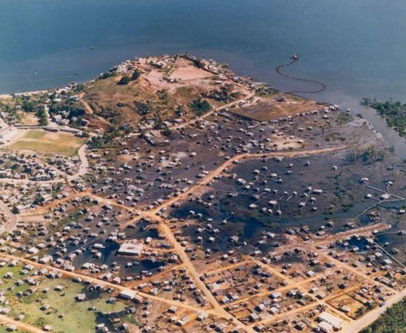
>
> Figuras 11. Foto das palafitas sobre os manguezais da Baía Noroeste,
> década de 1980. Fonte: Arquivo Público Municipal - PMV.

Vale ressaltar que os cursos d'água que desaguavam nessa região não
escaparam ao destino imposto aos demais córregos da ilha, sendo
canalizados e tamponados. Em relação ao Maciço Central, a criação do
Parque Estadual da Fonte Grande no final da década de 1980 impediu a
ocupação de grande parte das vertentes, protegendo e possibilitando a
recuperação das matas, conservando-se assim as nascentes e cabeceiras
ali existentes. Também a criação da Estação Ecológica da Ilha do
Lameirão contribuiu para a conservação dos manguezais remanescentes.

A expansão das áreas urbanas nos municípios de Cariacica e Vila Velha
ocorreu seguindo o curso de novas vias. Loteamentos e invasões
perpetuaram-se ao longo das rodovias Carlos Lindenberg e Jerônimo
Monteiro, que ligavam o Centro de Vitória ao Centro de Vila Velha. As
áreas urbanas estenderam-se até as margens dos cursos d'água da região,
principalmente dos rios Aribiri e Marinho (Figura 12), e ocuparam as
áreas alagadiças, determinando a retificação de seus cursos e a
canalização de seus leitos em determinados trechos. Os manguezais que se
estendiam pela foz do Rio Aribiri foram ocupados até que as obras de
urbanização servissem de contenção, restando ainda manguezais protegidos
no Parque Natural Municipal Morro da Mantegueira.

> 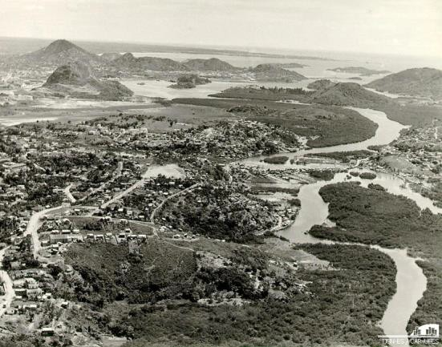
>
> 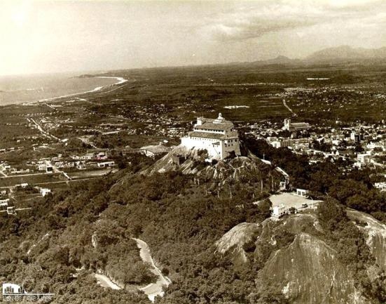Figuras 12. Foto de novas áreas
> urbanas às margens do Rio Aribiri em Vila Velha, realizada na década
> de 1970. Fonte: MEMÓRIA, 2014.
>
> Figuras 13. Foto de Vila Velha onde vê-se a formação de novos bairros
> próximo ao litoral do município, realizada na década de 1970. Fonte:
> MEMÓRIA, 2014.

Já no município de Cariacica, a expansão urbana acompanhou a Rodovia
José Sete e a BR-262, ocupando as cabeceiras e os vales de córregos e
rios. Também na região próxima ao litoral de Vila Velha os canais
artificiais tiveram suas margens ocupadas, como o caso dos canais da
Costa e Bigossi, entre outros (Figura 13). Posteriormente, também a
Rodovia do Contorno constituir-se-ia num vetor de crescimento da cidade.

Nas últimas décadas do século XX, duas novas pontes foram construídas,
ampliando- se a comunicação de Vitória com Vila Velha e Cariacica. A
primeira localizada próxima à Ponte Florentino Avidos, e a segunda na
entrada da Baía de Vitória. Ambas deram melhores condições de circulação
a toda cidade, fazendo com que novos bairros nos municípios continentais
continuassem surgindo, suprimindo continuamente as áreas alagadiças e
ocupando as margens dos canais de drenagem urbana. As facilidades de
circulação terrestre acabaram por determinar uma drástica redução do
transporte marítimo de pessoas, culminando na extinção do transporte
coletivo por via aquática e o abandono dos terminais aquaviários ainda
na década de 1980.

Atualmente, a relação entre a cidade suas águas na Grande Vitória é
marcada por um mosaico de situações que varia desde a incorporação delas
na paisagem urbana, até sua negação, ressaltada pela degradação a que
foram submetidas (Figuras 14 e 15).

> 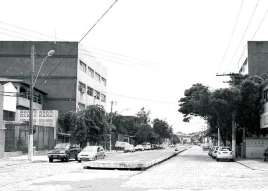
>
> 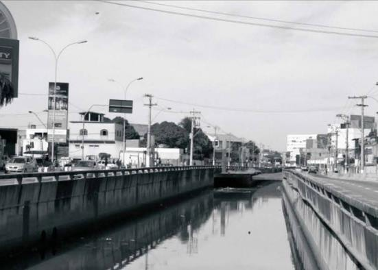Figura 14. Foto de canal tamponado
> em Vitória, 2009. Figura 15. Foto de canal poluído com esgoto em Vila
>
> Velha, 2009.

# Considerações Finais

Pode-se perceber que os usos e apropriações dos elementos hídricos, o
desenho urbano e o tratamento dispensado aos espaços de água
alteraram-se ao longo do tempo segundo os preceitos e necessidades de
cada momento. O desenvolvimento e a aplicação de novas técnicas, além da
disponibilização de recursos foram fatores determinantes para que fossem
superadas as limitações colocadas pelo sítio à expansão urbana.

As dimensões territoriais da baía de certa maneira condiciona sua
inserção no desenho e na paisagem da Grande Vitória, mas os canais, rios
e córregos não. Assim, é necessário repensar o modo como a cidade lida
com suas águas, para que ela se aproprie efetivamente dessas, explorando
as potencialidades que elas oferecem. Dessa maneira, vê-se necessária
uma redefinição do papel das águas urbanas no contexto das cidades para
a construção de uma relação mais harmônica.

# Agradecimentos

Agradecemos a Fundação de Amparo à Pesquisa do Espírito Santo (FAPES),
pelo apoio com o qual foi possível o desenvolvimento deste artigo.

# Referências bibliográficas

> ALMEIDA, A. de; GOBBI, H. *Lugar de toda pobreza*. 2. ed. \[Vitória
> ?\]: Unigraf, 1983.
>
> BRITO, F. S. R. *Projecto de um novo arrabalde dotado dos servicos de
> abastecimento d\'agua e drenagem*: relatorio apresentado ao cidadao
> Snr. Dr. J. de Mello C. Moniz Freire. Rio de Janeiro: Typ. Leuzinger,
> 1896.
>
> BROEDEL, D. *A Cesan e sua história*. \[Vitória ?\]: Artgraf, 1994.
>
> CAMPOS JUNIOR, C. T. *A construção da cidade*: formas de produção
> imobiliária. Vitoria: Floricultura, 2002.

DANIEL, Sandra; DADALTO, Zanete. *Jucutuquara*. \[Vitória, ES?\]:
Secretaria Municipal de Cultura, 1999.

> DERENZI, L. S. *Biografia de uma ilha*. Rio de Janeiro: Pongetti,
> 1965.

KLUG, Letícia Beccalli. *Vitória*: sítio físico e paisagem. 1. ed.
Vitória, ES: EDUFES, 2009.

LIMA JUNIOR, C. B.; SOARES, S. C.; BONICENHA, W. *Baía de Vitória*:
aspectos históricos e culturais. Vitória: Fundação Ceciliano Abel de
Almeida, 1994.

MARTINS, J. D. B. A cidade reconstruída. In: ABREU, C. (org.); MARTINS,
J. D.

B. (org.); VASCONCELLOS, J. G. M. (org.). *Vitória*: trajetórias de uma
cidade. \[Vitória, ES?\]: Instituto Histórico e Geográfico do Espírito
Santo, 1993. p. 61-102.

MEMÓRIA visual da Baía de Vitória. Disponível em:

\<<http://legado.vitoria.es.gov.br/baiadevitoria/>\>. Acesso em: 13 fev.
2014.

MENDONÇA, E. M. S. Relatos e iconografias de viajantes até o século XIX
na identificação dos atuais referenciais paisagísticos de Vitória. In:
SIMPÓSIO REGIONAL DE HISTÓRIA, 2006, Vitória. *Anais*\... Vitória, UFES,
2006.

> OLIVEIRA, J. T. *História do Estado do Espírito Santo*. 3. ed.
> Vitória: Arquivo Público do Estado do Espírito Santo: Secretaria de
> Estado da Cultura, 2008.

VASCONCELLOS, J. G. M. A delicadeza perdida. In: ABREU, C. (org.);
MARTINS, J. D. B. (org.); VASCONCELLOS, J. G. M. (org.). *Vitória*:
trajetórias de uma cidade. \[Vitória ?\]: Instituto Histórico e
Geográfico do Espírito Santo, 1993. p. 133-148.
