# Resumo

O presente artigo analisa a permanência e a apropriação do Pátio do
Colégio pela sociedade paulistana, no período entre a expulsão da
Companhia de Jesus de São Paulo em 1760 até as comemorações do IV
centenário de fundação da cidade de São Paulo. Observando os discursos e
representações iconográficas produzidas nesse período -- em especial nos
periódicos de cada época -- busca-se analisar as diversas contribuições
na continuidade do Pátio do Colégio no imaginário popular paulistano que
auxiliaram, em grande medida, no processo de reconstrução de todo o
conjunto iniciado na década de 1950.

> **Palavras-chaves:** Pátio do Colégio, Memória, Imaginário popular,
> Discursos

# Abstract

This article analyzes the permanence and ownership of the Pátio do
Colégio (Courtyard of the College) by the São Paulo society in the
period between the expulsion of the Society of São Paulo in 1760 until
the celebration of the fourth centenary of São Paulo's foundation.
Watching the speeches and iconographic representations produced in this
period - in particular in the journals of each season - we seek to
observe the various contributions to the continuity of the Courtyard of
the College in São Paulo's popular imagination that helped largely in
the process of rebuilding the schooll and church started in the 1950s.

**Keywords:** Courtyard of the College, Memory, Popular imaginary,
Speeches

# Introdução

Desde sua fundação em janeiro de 1554, o Pátio do Colégio é reconhecido
como ponto focal da colonização do interior do Brasil e local exato da
fundação da cidade de São Paulo. O conjunto de seu território esteve sob
os cuidados da Companhia de Jesus até sua expulsão da cidade em 1760, em
um processo que é tratado como um indicador de secularização do
território. O valor simbólico do conjunto urbano do Pátio do Colégio
fazem do lugar um território quase obrigatório na historiografia sobre a
cidade de São Paulo, porém -- de forma geral -- observa-se a
predominância da análise pelas diversas transformações físicas ocorridas
no local -- construção, destruição e reconstrução do Pátio do Colégio.

Desde o primeiro historiador da Capitania de São Paulo, o padre
beneditino Frei Gaspar da Madre de Deus (1975), que escreveu em finais
do século XVIII, a literatura reconhece o sitio do colégio dos jesuítas
como ponto focal da colonização do interior do Brasil. Em consonância
com Frei Gaspar, um conjunto de autores atenta prioritariamente para a
função do Pátio como espaço originário da cidade1. A partir da década de
1930, quando muda a

> 1 Madre de Deus, 1975\[1746\], pp. 119-141; Ab Saber, 2004, pp11-14;
> Kehl, 2005.

correlação de forças e a ideia do retorno da igreja e do colégio
progressivamente se fortifica, a historiografia tende também a uma
mudança de tom, interessando-se mais pelo processo de agregação de
atores sociais em torno do discurso da reconstrução.2

Outro conjunto de autores atenta para a longa duração; Maria Aparecida
Lomonaco (2004), Hernani Donato (2008) e Benedito Lima de Toledo (2004),
evidenciam as sucessivas transformações e reocupações pelos quais passou
o conjunto.. Em *São Paulo -- Vila, Cidade, Metrópole*, Nestor Goulart
(2004) descreve cronologicamente todo o percurso do Pátio e observa
desde a importância de sua localização no sítio escolhido pelo grupo de
jesuítas, um local não apenas ideal para a educação da população local
mas também, um ponto estratégico para a defesa da simples aldeia que ali
fora criada, até sua total transformação após a expulsão da Companhia de
Jesus do Brasil. Nestor relata as transformações arquitetônicas e
urbanísticas do Pátio, atentando principalmente para os personagens
sociais laicos responsáveis pelas mudanças no território.

Alguns autores, como Levino Ponciano (2007), Maria Cristina Wolff (1996)
e Candido Campos (2002) revelaram-se mais interessados na construção do
conjunto republicano no processo de modernização da cidade na passagem
do império para a república. Solange Ferraz de Lima (2003) observa,
através da construção de uma série histórica da iconografia do Pátio,
(cartões postais e fotografias), os distintos modos de apropriação da
cidade em relação ao do Pátio do Colégio. Observa a perda progressiva de
significados e práticas sociais do conjunto do Pátio do Colégio onde,
primeiro perde-se a função religiosa, depois perde-se a função política
com a transferência do palácio do governo para Campos Elísios. A partir
da década de 1940 o Pátio volta ao debate sob a perspectiva do
patrimônio e de uma narrativa laudatória ao passado paulista. Lofego
(2004) analisa o debate ocorrido em torno das comemorações do IV
Centenário, onde segundo o autor, o Pátio do Colégio não teria sido o
foco nas discussões da época.

Em que pesem as grandes diferenças de orientação política e intelectual
de todos os autores que lidaram com a problemática das sucessivas
destruições e reconstruções do conjunto desde o final do século XIX,
ainda foi pouco estudado o Pátio do Colégio que *não* foi destruído,
aquele que permaneceu no imaginário social, como símbolo sagrado e
cívico, importante representante da identidade de São Paulo.

No presente artigo busca-se observar a permanência dos significados
religiosos e simbólicos pela sociedade paulistana. Para tal análise, o
texto será subdivido em quatro temáticas principais: Toponímia
(utilização do nome *Pátio do Colégio* ao longo do tempo); dimensão do
sagrado (a permanência da função e memória religiosa); Educação (o lugar
do Pátio na formação intelectual paulistana) e o progresso de São Paulo
(o Pátio como origem de uma cidade em crescimento); a partir da
desapropriação da Companhia de Jesus em São Paulo (1670) até a sua
devolução e reconstrução iniciada na década de 1950.

> **Toponímia : a utilização do nome *Pátio do Colégio* ao longo do
> tempo.**
>
> 2 Maria Aparecida Lomonaco, , O Pátio do Colégio. In: Eduardo Bueno
> (org), *Os nascimentos de São Paulo.* Rio de Janeiro: Ediouro, 2004.
> "Em razão do seu significado histórico, o Pátio do colégio --
> denominado, a partir de 1930, Praça João Pessoa -- tornou-se o palco
> das principais manifestações da Revolução Constitucionalista de 1932,
> embora já não abrigasse o Palácio do Governo. Entretanto, encerrados
> os combates começaram a se erguer as primeiras vozes em defesa das
> velhas tradições paulistas, levando um grupo mais exaltado a arrancar
> as placas onde estava gravado o novo nome do logradouro, que
> desfigurava por completo o significado do local de origem da cidade,
> secularmente conhecido como Pátio do Colégio. Era o início de um
> processo que se acirraria ao longo do tempo". (nota: mas ela não fala
> da resistência a isso. )

Mesmo com as constantes tentativas de apagamento da presença dos
religiosos da Companhia de Jesus em território paulistano -- como a
destruição dos documentos jesuíticos após a expulsão em 1760 e as
diversas intervenções no conjunto arquitetônico do Pátio e seu entorno
da imagem do antigo colégio jesuíta e sua igreja ao longo do tempo 3 --
a

permanência do pátio do colégio como importante local para a cidade pode
ser observada através dos discursos publicados nos principais periódicos
em cada época e das representações iconográficas do conjunto
reproduzidas mesmo quando o antigo colégio já não se fazia presente no
local.

Assumido inicialmente pela Coroa Portuguesa e posteriormente pelos
governadores da primeira republica 4 , o conjunto sofreu diversas
intervenções, tanto na sua linguagem arquitetônica quanto no seu entorno
imediato. O *"terreiro que hoje designamos como Pátio do Colégio"*
(Toledo 1983, p.62), foi renomeado como Largo do Palácio e o antigo
colégio dos jesuítas foi aos poucos modernizado. Considerado ainda como
Pátio do Colégio, o Palácio do Governo é retratado pelos viajantes e
artistas -- como no desenho de Thomas

> Ender em 1818 (Figura 1) e as fotografias de Militão Augusto de
> Azevedo no início da década de 1860 (Figura 2). Em seu *Álbum
> Comparativo da Cidade de São Paulo,* Militão mostra a imagem do
> Palácio do Governo em evento cívico buscando enfatizar a importância
> do local para a cidade, entretanto, a legenda faz menção à antiga
> igreja e colégio jesuíta (FIGURA 02): "*Igreja e Convento do Collegio
> Provincial servindo de Palacio do Governo, Thesouraria Geral e
> Provincial, Assembleia Provincial, Collectoria e Correio (edificação
> dos jesuítas em 1673)."*
>
> 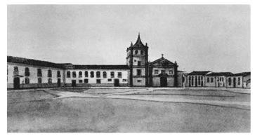
>
> **Figura 1** -- Pátio do Colégio - Imagem Original Thomas Ender
> (1818)
>
> 3 Segundo Donato (2008, p. 163), "Os livros Tombos, Registros,
> Fabrica, Receita e Despesa, Batizados, Casamentos e Óbitos e volumosa
> massa de variados documentos foram levados a Lisboa e, tornou-se voz
> corrente, incinerados em fogueira de praça pública."
>
> 4 Salgado (1976,p. 105) relata: "Foi o paço de dois Imperadores e de
> uma Princesa Imperial. Três vezes regente do Império, e residencia de
> tres Presidentes da Republica. \[...\] nele tiveram morada Bispos
> Diocesanos, Capitães-Generais, Governadores da Capitania, presidentes
> da Província e do Estado de São Paulo, de 1765 a 1908.
>
> 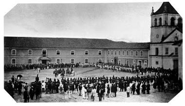
>
> **Figura 2 --** Pátio do Colégio -- Militão A. Azevedo. (1862)

Ainda nesse momento, a imagem do antigo Pátio do Colégio se mantinha
viva na memória da sociedade paulistana. No anúncio publicado no jornal
*Estado de São Paulo* de 1886 pode-se observar a permanência -- no já
nomeado Largo do Governo -- do nome *Pateo do Collegio* como referência
para o local do leilão de materiais de construção da Tesouraria da
Fazenda que em breve seria reformada:

> 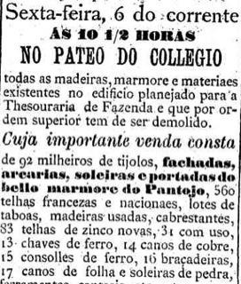
>
> **Figura 3** -- Anuncio de leilão -- Jornal Estado de São Paulo.p.02.
> 05/08/1886.

Assim, como o anuncio acima, pode-se encontrar diversos eventos comuns à
sociedade da época, publicados no mesmo jornal (*Estado de São Paulo*)
entre 1875 a 1879, que também eram referenciados ao Pátio do Colégio e a
travessa do Colégio:

> 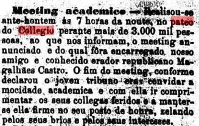
>
> **Figura 4** -- Meeting acadêmico no Pátio do colégio Jornal Estado
> de São Paulo. 11/09/1878.
>
> 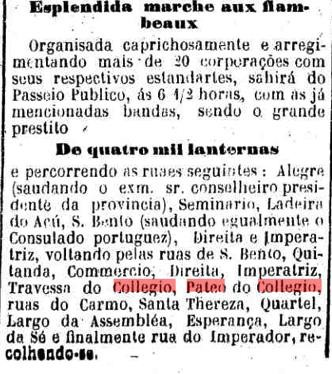
>
> **Figura 5** -- Procissão que tinha como percurso o Pátio do Colégio
> Jornal Estado de São Paulo. 07/05/1882.

Podemos assim perceber que as modificações físicas e a modificação do
nome de tal território não foram suficientes para o apagamento da
memória tão cara para a sociedade da época. No texto "Carta de uma
roceira", publicado na coluna *Variedades* do jornal *Estado de São
Paulo*, ainda podemos perceber, nas impressões de uma visitante nos anos
de 1875, a permanência do nome *Pateo do Collegio* como referência para
o local:

> A noite fui passear pela cidade, para ve-la iluminada, enfeitada e
> animada. Dirigi-me para a Sé, onde tinha de haver *Te-Deum,* ação
> graças pela chegada dos soberanos. A egreja estava iluminada, e com
> muito povo n'porta e no interior. Ali estava ha alguns minutos quando
> ouvi uma voz esganiçada gritar: Viiiva o imperador! Responderam
> algumas vozes todos em tom de tiple, e imediatamente 6 a 8 galopios
> apontaram para *o Pateo do Collegio* precedendo uma carruagem em que
> vinham SS.MM. que no apearem, entraram na igreja, e
>
> foram fazer suas orações como bons christãos que são. (Carta\...,
> 1874; grifo meu)
>
> 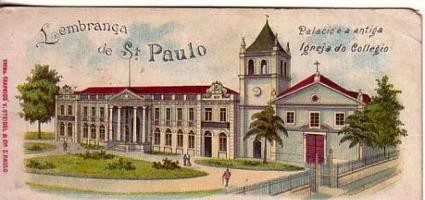

**Figura 6** -- Cartão postal Palácio e antiga igreja do Collegio --
Século XIX.

**Fonte**: Site
\<<http://saudadesampa.nafoto.net/photo20091217074656.html>\>

Em 1932, uma curiosa manifestação ilustrou a importância do nome *Pateo
do Collegio* para a identidade paulistana: A batalha das placas. Após a
demolição da igreja Bom Jesus (1896) e com as reformas do Palácio do
Governo já concluídas, o novo governo, estabelecido anteriormente à
revolução constitucionalista de 32, decide mudar o nome da placa que
identificava o Pátio do Colégio para o nome de João Pessoa. Essa atitude
sem a consulta do povo ofendeu, segundo Donato (2008), e travou uma
batalha de trocas de placas.

> "Certa madrugada, três vultos esgueiraram-se entre o cinza da garoa,
> então ainda um traço característico de São Paulo. Um subiu ao ombro do
> outro, recebeu do terceiro uma alavanca de motorneiro de bonde,
> arrancou a placa e martelou, no mesmo lugar, uma outra, improvisada
> porém significativa: "Pátio do Colégio". E sumiram antes que a guarda
> da Secretária de Estado se aproximasse" (Donato, 2008, p.235).

Durante o período da manhã, a representação da política dominante
trocava a placa para João Pessoa e a noite esse mesmo grupo mudavam para
Pátio do colégio resultando, em 1936, no ato municipal nº1053 --
publicado no jornal Estado de São Paulo -- que re-oficializava o nome do
local como \"Pátio do Colégio\" e não mais \"Largo do Palácio\",
reafirmando que mesmo diante das constantes mudanças realizadas no local
de fundação da cidade, a memória antiga do local prevalecia. O jornal
Estado de São Paulo publicou tal resolução:

> "Nos últimos anos, talvez por causa dos numerosos centenários que
> temos festejados, observa-se uma tendência de evocar a infância da
> nossa capital, tanto nos livros como nas designações das ruas e
> praças. Deve-se notar que para isso muito tem trabalhado organizações
> culturaes como o Instituto Histórico e Geographico e a Academia
> Paulista de Letras. Ainda hontem o dr. Fabio Prado, prefeito da
> capital pelo acto 1053, que denomina "Pateo do Collegio"(Fundação de
> São Paulo -- 25 de Janeiro de 1551) o largo onde está o Palácio do
> Governo, justifica assim sua feliz iniciativa: "\[\...\] Considerando
> que no largo do Palácio, em torno da igreja do Collegio do Senhor Bom
> Jesus, foi fundada esta cidade; considerando que esse largo teve
> diversas denominações, sendo uma das mais antigas a de Pateo do
> Collegio, dada espontaneamente pelos primeiros povoadores;
> considerando que repor nesse
>
> local o nome primitivo e symbolico é ir ao encontro de uma aspiração
> collectiva, atendendo ainda ao que requereu mais de uma associação,
> entre as quais o nosso Instituto Histórico e Geographico e Academia
> Paulista de Letras; considerando que essa denominação equivale também
> a um preito aos invictos edificadores da terra e evoca a tradição e a
> história, por isso que vem do tempo heroico da conquista, da catechese
> e da fundação da cidade de São Paulo. Decreta -- Art. 1º -- Fica
> denominado Pateo do Collegio ( Fundação de São Paulo em 25 de Janeiro
> de 1554) o largo onde está o Palácio do Governo. \[\...\]" (Pateo\...,
> 1936)

Diante da decisão, diversas manifestações de agradecimentos foram
enviadas ao prefeito -- como o IHGSP5, Academia de Letras e
personalidades da sociedade da época -- e noticiadas pelo jornal Estado
de São Paulo no dia 07 de Abril de 1936. Entre elas, vale destacar uma
importante declaração: a do grupo dos jesuítas que já se encontravam em
São Paulo nesse momento:

> A respeito dessas entrevistas, manifestaram-se diversas entidades,
> dentre as quaes o Instituto Histórico e Geographico e a Academia
> Paulista de Letras, cumprimentando o Prefeito da capital pela
> deliberação tomada e aplaudindo seu gesto. Cumprida a promessa o sr.
> Fabio Prado tem recebido inúmeras cartas, telegramas e
> visitas.\[\...\] Cumprida a promessa o sr. Fabio Prado tem recebido
> inúmeras cartas, telegramas e visitas. Dentre os telegramas, salienta-
> se o recebimento dos Jesuítas de São Paulo:
>
> *"Gratamente surpresos vem os jesuítas que ora labutam na Terra de
> Santa Cruz, especialmente nesta antiga Piratininga, agradecer
> sinceramente a v. Exa. a distinção que lhes fez, com a reposição da
> designação de Pateo do Collegio, evoncando a catechese e a fundação da
> Paulicéa" -- José Santi . Reitor do Collegio São Luiz.* \[\...\] A
> propósito dessa feliz iniciativa do sr. Prefeito Municipal temos
> recebidos numerosas cartas em que os seus signatários expressam o seu
> enthusiasmo pela reposição do nome de "Pateo do Collegio", de tão
> profundo significado para esta cidade. Dentre essas cartas, algumas
> sugerem que o acto da substituição das placas deve assumir um caracter
> festivo, interessando São Paulo inteiro. Acrescentam, por exemplo, que
> deve realizar-se em presença das crianças das escolas, como uma
> verdadeira festa da cidade de São Paulo de Piratininga. Registrando
> aqui as suas sugestões, atendemos as numerosas cartas que nos tem sido
> enviadas. (Pateo do Collegio\..., 1936; grifo meu).

A reportagem acima explicita a opinião desse importante grupo, até o
momento, silenciado e indica um outro grande aspecto que auxiliou e
fortaleceu a não destruição do Pátio do Colégio no imaginário
paulistano, a dimensão do sagrada no local.

# A dimensão do sagrado no Pátio do Colégio

> 5 IHGSP -- Instituto Histórico Geográfico de São Paulo. Constituído em
> 1° de novembro de 1894, foi um dos mais importantes espaços de
> formulação ideológica das elites intelectuais paulistas na virada do
> século XIX, onde discutiam-se aspectos da preservação do patrimônio
> local e regional, inserindo-os em uma lógica própria de valorização da
> história .

Em 1896, ocorre o desabamento do teto da Igreja Bom Jesus, último
remanescente do conjunto jesuítico, decidindo-se pela demolição completa
da antiga igreja. A igreja Bom Jesus foi substituída por um edifício
administrativo e a praça que existia anteriormente na lateral do
edifício foi alargada que permitiu a construção do "primeiro conjunto
urbanístico da capital \[\...\] palco de manifestações cívicas" (Campos,
2002, p.8). Mesmo com a decisão de demolição, podemos perceber
declarações de descontentamento perante a perda da última testemunha do
conjunto jesuíta. O General Couto Magalhães escreve suas considerações
ao Diário Popular em janeiro de 1896, antes da demolição de fato da
antiga igreja:

> "Amigo e Sr. Lisboa. -- Soube, com grande pesar, que há o projeto de
> ser desapropriada a veneranda igreja do Colégio, para ser substituída
> por algum edifício de arquitetura francesa e dispendiosa que, saindo
> do impostos pagos pelos paulistas, dos quais um grande número já sofre
> fome e miséria, destrói um monumento de imenso valor histórico. Um dos
> erros dos governantes brasileiros está na tendência de inovar tudo sem
> atenção à história de nossa raça. \[\...\] *De janeiro de 1554 a
> janeiro de 1896 vai a longa série de trezentos e quarenta e seis anos!
> Nesse longo período, iguais quase ao de toda a história do Brasil,
> quantas mães de família, quantos pais, quantos filhos não têm dobrado
> o joelho no solo sagrado do velho templo, a Deus pelos seus e pela
> pátria?* \[\...\] Consinta apenas que, por intermédio de seu jornal,
> em que antigamente eu colaborei, peça ao Sr. Rui de Pina, que o mostre
> e o consulte com seus amigos, pois estou certo que, se o fizer, não há
> de consentir que a picareta dos italianos ou outra apague do largo do
> Palácio a única figura que recorda as origens de São Paulo e sua linga
> e gloriosa história. Couto Magalhães". (Diário popular, 1896. Grifo
> meu.)

Além da crítica que Magalhães faz acerca da influência francesa de
beleza e modernização -- característico do final século XIX na cidade de
São Paulo -- e a grande presença de mão de obra estrangeira oriunda da
imigração europeia, o general e futuro presidente da Província de São
Paulo, considera a igreja como um importante símbolo da memoria nacional
e um território sagrado para a sociedade paulistana. A carta demonstra
não apenas um descontentamento diante da possível demolição mas, a
tentativa de mudar tal decisão na busca de preservar parte da memória
que restara. A discussão acerca de preservar ou não a antiga igreja não
se limitou aos políticos e autoridades religiosas da época, Donato
(2008) cita a presença da manifestação popular perante a demolição:

> "Os grandes decidiram. Os pequenos, os do povo discutiram. A questão
> demolir ou restaurar empolgou São Paulo. A grita em favor e contra a
> medida extrema levantou-se de variados setores e grupos. Protestos
> ergueram-se, de viva voz ou escritos -- ainda eram moda os manuscritos
> pregados em portas, paredes, postes--, levados aos jornais. Até contra
> o presidente, até de católicos e contra o bispo que concordara com a
> derrubada." (Donato, 2008, p.223)

Com a igreja demolida, o processo de laicização do território e
apagamento da memória jesuíta, estava aparentemente consolidado. Porém,
houveram esforços por parte da igreja, religiosos e simpatizantes da
história do Pátio em recolher as possíveis relíquias e materiais de
construção que pudessem ser encontradas com a demolição. Segundo Geraldo
Dutra de Moraes (1979), as relíquias foram separadas e recolhidas na
igreja de São Pedro que receberam, posteriormente, diversas destinações
como a Igreja do Imaculado Coração de

Maria em São Paulo (Acolhendo imagens de madeira e o altar mor da igreja
adaptado para uma das capelas da igreja), o Museu Paulista (Lousa
tumular de Afonso Sardinha e Maria Gonçalves Rodrigues e Pia de água
benta em pedra Lavrada), o Museu de Arte Sacra (imagem de São Paulo, São
Francisco, Nossa Senhora do Livramento e o altar da sacristia do Pátio)
e o Colégio jesuíta em Itu (taboas do assoalho e alfais utilizadas no
pátio).

Os restos mortais do Chefe Tibiriçá e outros ilustres paulistas, também
encontrados no processo de exumação, foram transladados inicialmente
para a Igreja do Sagrado Coração de Maria e posteriormente para a nova
Catedral da Sé em novembro de 1901, findando aparentemente o caráter
religioso existente no conjunto do Pátio do Colégio até esse período.

A Companhia de Jesus, após a sua restauração pelo Papa Pio VII em 1814,
buscava "retomar, nas regiões das antigas missões do século XVII e
XVIII, a mais impressionante experiência de evangelização jamais
experimentada por uma ordem religiosa no catolicismo." (Teixeira, 2014).
Segundo Teixeira, a Companhia de Jesus retornou ao Brasil em 1843 e em
São Paulo, através do Colégio São Luiz, instalando-se em Itu entre os
anos de 1865 até 1917, quando mudam para a Avenida Paulista em São
Paulo.

A ação dos jesuítas através de tais colégios, nesse momento já
espalhados em outras regiões do Brasil, era a formação
intelectual-religiosa baseada na espiritualidade Inaciana aos filhos das
classes dominantes de São Paulo desde o início do século XX. Parte desse
grupo de alunos, após concluírem seus estudos, se reuniram junto aos
padres jesuítas e fundaram em São Paulo a ASIA (Antiqui Societa Iesu
Alumini) ou Associação do antigos alunos jesuítas em 19326, grupo que
teve importante papel na perpetuação da memória jesuíta e na memória do
antigo Pátio do Colégio.

O lançamento do livro *Os Jesuítas na Villa de São Paulo* do jesuíta
Serafim Leite, em maio de 1936, demonstra a ação dos jesuítas na
construção do seu papel e consequentemente no lugar do Pátio do Colégio
na história de São Paulo. O livro tinha como principal objetivo mostrar
a ação dos jesuítas em São Paulo no primeiro século de fundação. Na
resenha escrita por Plinio Barreto, publicado no jornal *O Estado de São
Paulo,* relata:

> "O Departamento de Cultura da Municipalidade, que é uma das mais
> louváveis criações da fecunda administração que está fazendo o atual
> prefeito, teve a ideia de abrir um concurso sobre a história local. O
> trabalho premiado nesse concurso intitula-se "Os Jesuítas na villa de
> São Paulo, século XVI" e é da lavra do padre Seraphin Leite, um dos
> jesuítas mais versados em coisas do Brasil antigo. Esse trabalho
> trata, exclusivamente, da villa de S.Paulo. \[\...\] A obra
> civilizadora dos jesuítas teve a sua expressão mais brilhante nos
> collegios que fundaram. \[\...\] O Padre Seraphin Leite procurou, na
> rápida memoria que escreveu, dissipar o que havia de duvidoso a
> respeito da ação dos jesuítas, na Villa de S.Paulo, dando um balanço
> rigoroso do que fizeram. Tive a impressão de que o conseguiu. Embora
> membro da Companhia de Jesus não se excedeu nos louvores, que lhe
> distribuiu, mostrando-se atento a fazer obra mais de historiador que
> de apologista. É o melhor elogio de seu trabalho." (Barreto, 1936)

Portanto, a manifestação de surpresa perante a mudança de nome do sítio
do antigo colégio -- escrita na carta destinada ao Prefeito Fabio Prado
em 1936-- não significa uma característica de passividade da parte dos
religiosos da Companhia de Jesus na construção de tal memória. Pode-se
observar diversos movimentos em busca de sua restauração -- tanto no
momento da demolição da antiga igreja quando houve o recolhimento de
algumas relíquias da igreja Bom

> 6 Fonte disponível no site
> \<[www.saoluis.org](http://www.saoluis.org/)\> e nas atas de reunião
> da ASIA no Colégio São Luis em São Paulo.

Jesus, quanto na produção bibliográfica acerca da história de São Paulo
que descreveram o lugar da Companhia nesse processo escritas pelos
padres jesuítas. Em 1922, foi instalado em frente do Palácio do Governo
o monumento *Gloria Imortal aos fundadores de São Paulo*. Inaugurado em
1925, a obra de Amadeu Zani, foi vencedor de um concurso publicado no
Jornal Estado de São Paulo 1 de Agosto de 1909 , p. 9 :

> A comissão abaixo assignada, constituída para promover e levar a
> efeito a ereção, em S.Paulo, dum monumento que comemore a fundação
> desta cidade; em condições dignas não só de perpetuar a memoria , o
> fato acontecimento como de prestar homenagem a Anchieta e outras
> figuras históricas que nelle tomaram parte, põe em concorrência a
> elaboração do projeto de obra mediante as seguintes condições:\[\...\]
> Fica inteiramente livre a inspiração dos concorrentes á composição do
> monumento em todos os seus elementos, quer históricos, quer
> artísticos, uma vez que os projetctos traduzam a verdade do
> acontecimento a comemorar e concretizar condigna homenagem ás
> personalidades que nelle figuram. Como fontes de informação sobre a
> matéria, será útil consultar a "Chronica da Companhia de Jesus no
> Estado do Brasil" por Simão de Vasconcellos e o "Terceiro Centenário
> do Venerável Joseph de Anchieta." (Monumento\...1909)

Em geral, o monumento, é lido pela historiografia como mais um sinal da
laicização do território, que neutralizou o papel dos religiosos como
agentes sociais -- representados em alto relevo na base do monumento --
resumindo-os como personagens pertencentes ao passado. Solange Ferreira
Lima (2004), observa que a instalação de um monumento no local de
fundação da cidade demonstra a necessidade da afirmação de um caráter ao
local, através de um dispositivo de memória coletiva, uma vez que este
já se encontrava "*esvaziado de todas as práticas que dotavam este
espaço de sua carga simbólica e ativa em significações e usos"*.

Entretanto, mesmo diante da transformação do território e sua edificação
em um local laico e cívico, o caráter religioso era reavivado por grupos
de fiéis em celebrações religiosas (missa campal) que ocorriam aos pés
do monumento, em comemoração ao aniversário da cidade, onde relembravam
também a memória do antigo colégio dos jesuítas:

> "Parte das mais importantes do programa comemorativo, e de profunda
> significação, pois recordou o ato que assinalou a fundação da cidade,
> a missa campal ontem realizada no pátio do Colégio, fez que ali
> afluíssem as altas autoridades federais que honram o nosso Estado com
> a sua visita, os membros do governo estadual e considerável multidão,
> numa inequívoca demonstração do sentimento católico dos
> brasileiros.\[\...\] Todo ornamentado, com bandeiras nacionais e
> grinaldas de flores naturas, o monumento comemorativo da fundação da
> cidade destacava-se no meio da praça, \[\...\] Em frente da tribuna,
> nas escadarias do citado edifício \[Secretaria de Educação\],
> achava-se armado artístico altar, encimado por sugestivo cartaz,
> contendo as seguintes palavras de uma carta do venerável Anchieta a
> Inacio de Loiola: " Aqui se fez uma casinha de palha com uma esteira
> de canas por porta, em que moraram algum tempo, bem apertados, os
> irmãos; mas este aperto era ajuda contra o frio que nesta terra é
> grande. Dia da conversão de São Paulo fizemos a primeira missa em este
> lugar." (O Pátio\...1943)

Mesmo quando não haviam celebrações de missas no local, o Pátio do
Colégio era um dos principais locais de comemoração do aniversário da
cidade, com a presença das autoridades e principais representantes
religiosos da época. O jornal *Estado de São Paulo* de 26 de janeiro de
1937 relata a solenidade realizada em torno do monumento da fundação da
cidade:

> "Finda a missa celebrada na cathedral da Sé, a Congregação Mariana
> organizou uma romaria que se dirigiu ao Pateo do Collegio afim de
> prestar homenagem á data da fundação da cidade junto ao monumento
> comemorativo que ali se ergue. \[\...\] No Pateo do Collegio grande
> também já era o numero de pessoas que aguardavam as solenidades que
> ali se deveriam realizar.\[\...\] Reunidos os manifestantes junto ao
> Monumento á Fundação da Cidade, que se achava ornamentado com longos
> festões verdes e belas variedades de crysandallas, tomou a palavra o
> padre Paulo Cursino de Moura.\[\...\] Falando em seguida á assistência
> referiu que no momento em que elementos estranhos ao meio social
> brasileiro procuram ameaçar a nossa integridade moral e religiosa e as
> tradições da nossa democracia apelava á proteção divina para o combate
> ás ideas extremistas que rondam os alicerces da família brasileira.
> Demorou-se ainda o orador em considerações sobre a obra de Anchieta e
> de outro jesuítas na formação da nossa mentalidade e dos princípios
> religiosos do povo brasileiro." (As comemorações\..., 1937)

O discurso do padre Cursino ilustra o início da declarada adesão da
igreja católica ao cenário político instaurado por Getúlio Vargas na
década de 1930, quando o estado se tornara soberano perante a sociedade
e acima de todo e qualquer poder. O apoio da igreja católica ao projeto
de Getúlio não apenas garantia lugar a uma igreja que se sentia ameaçada
pela ideologia anarquista difundida desde o renascimento, mas auxiliava
o "Estado Novo" de Vargas contra o pensamento comunista que se difundia
nesse período. Assim, a declaração feita pelo padre no exato local de
fundação da cidade -- e local da memória religiosa mais antiga existente
na cidade -- sinalizou a reaproximação do catolicismo ao discurso do
Estado, após o período da República Velha em que as elites políticas
haviam se esforçado por separar as duas instâncias.

Em 1941, levanta-se a discussão acerca da memória do Pátio do Colégio
não apenas na dimensão territorial mas na possibilidade de reconstrução
integral do conjunto jesuíta como importante símbolo da historia da
cidade. Segundo Lima (2003), na década de 1940, "as discussões em torno
da noções de patrimônio e de preservação arquitetônica eram alimentadas
por arquitetos, historiadores e interessados de outras áreas ligados a
um movimento de revitalização da arquitetura colonial de São Paulo" e o
Pátio do Colégio não passou desapercebido. José Marianno 7 -- adepto da
corrente tradicionalista engajado na campanha em defesa da arquitetura
tradicional no Brasil nas primeiras décadas do século XX

-- coloca a importância da reconstrução do antigo conjunto no seu
discurso no Rotary Club de São Paulo, não tratando a reconstrução apenas
na chave patrimonial, mas também na percepção do sagrado, reforçando o
elo entre nação e a religião católica:

> 7 Sobre Ricardo Severo ler: Joana Mello. *Da arqueologia portuguesa à
> arquitetura brasileira*. Revista do Instituto de Estudos Brasileiros,
> São Paulo,44,p.69-98 e Maria Lucia Bressan. *Neocolonial, modernismo e
> preservação do patrimônio no debate cultural dos anos de 1920 no
> Brasil.* São Paulo: Edusp,2011.
>
> "Dentro de 13 anos São Paulo comemorará o 4º centenário de sua
> fundação, seria um ato da mais alta significação cultural a
> reconstituição integral da igreja dos jesuítas, e uma ala do antigo
> colégio, exatamente no sítio em que ela existia, de modo a ser
> novamente, rezada a primeira missa no planalto de Piratininga o
> pequeno oratório de "pau e barro" constituído pelos índios para Joseph
> de Anchieta. São Paulo tem uma dívida sagrada a resgatar com a
> Companhia de Jesus. O momento é chegado." (discurso compilado por
> Cardim Filho, 1975).

Segundo Donato (2008, p.239), após a expulsão da Companhia de Jesus de
São Paulo, o Colégio foi sede do Palácio do Governo até 1912, Palácio
dos Despachos sendo ocupado por repartições públicas até 1932 e por fim
Secretaria de Educação até 1953. Com a desocupação da Secretaria de
Educação, a discussão acerca do destino do prédio foi reavivada.
Discussão essa que culminou, por decisão do governo, na demolição da
prédio histórico, em novembro de 1953, sem um aviso prévio para que
houvessem os devidos estudos e cuidados destinados aos valores
históricos.

Preocupados com os rumos que se desenvolviam em torno da destinação do
terreno do antigo Colégio do Jesuítas, o grupo de antigos alunos
organizou, em 1953, o Movimento Pró-Igreja do Pátio do Colégio. Para
eles, a reconstrução da igreja era *"não só como marco da nossa
civilização e formação cristã, mas também como marco inicial da fundação
de São Paulo*" (Donato, 2008.p.242). Diante da decisão de total
demolição do conjunto arquitetônico em 1953, organizaram uma Comissão de
Proteção às Relíquias do Pátio do Colégio na tentativa acompanhar o
processo de demolição -- embora já na sua fase final -- que conseguiu
manter uma parede de taipa de pilão que se tornou um importante símbolo
da memória do Pátio como pode ser observado no anuncio publicado pelo
jornal *Estado de São Paulo* em 1954. No texto do anuncio do Banco
Hipotecário Lar Brasileiro, a parede de taipa não era apenas uma ruina
de um antigo prédio, mas a memória do antigo Pateo do Collegio que
resultou na grande cidade:

> "Ergue-se como um primeiro milagre naquele histórico 1554, quando mãos
> indecisas de obreiros indígenas assentaram vagorosamente seus grandes
> blocos de taipa. Era o colégio que assomava o Colégio dos Jesuítas, a
> primeira construção civilizada erguida no planalto de Piratininga."
> (Aquela\...1954)
>
> 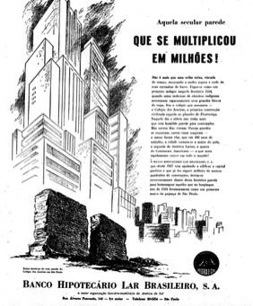

**Figura 14** -- Anuncio Banco Hipotecário Lar Brasileiro. **Fonte**:
Jornal Estado de São Paulo do dia 25/01/1954.

> Com os festejos do IV centenário da fundação de São Paulo, o colégio
> jesuíta mantinha, através da formação religiosa-intelectual, a memória
> do antigo conjunto jesuíta. Além das ações dos antigos alunos através
> da ASIA -- que tem grande visibilidade através das campanhas de
> devolução e reconstrução do Pátio do Colégio
>
> 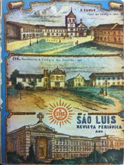--
> pode-se observar nos anuário do próprio colégio a lembrança da ação
> jesuíta em São Paulo e o Pátio do Colégio como identidade da cidade.

# Figura 15 e 16 -

> Anuário do Colégio
>
> São Luiz em São Paulo
>
> \- 1954. **Fonte**:
>
> Acervo da Biblioteca São Luiz
>
> Pouco depois da demolição e devolução do terreno8, com o propósito de
> "*reerguer quando possível no estilo antigo os monumentos primitivos
> sobre os alicerces*
>
> 8 Segundo Cesar Salgado o projeto de lei foi aprovada unanimemente
> pela Assembleia Legislativa e promulgada pelo governador Lucas
> Nogueira Garcez no dia 21 de janeiro de 1954, onde ficava sob a
> responsabilidade da Companhia de Jesus o domínio pleno do terreno
> destinada à construção de uma
>
> *existentes*" (Salgado, 1976, p. 138), o grupo de antigos alunos deu
> início à construção de uma réplica em tamanho real da primeira cabana,
> no mesmo local do antigo conjunto jesuíta. Mesmo com caráter
> provisório, a construção da réplica da antiga moradia jesuíta tinha a
> intensão de fortalecer a memória da Companhia de Jesus -- demarcando o
> território recém-devolvido -- além do fortalecimento dessa memória na
> história da cidade de São Paulo com a inauguração da réplica da Cabana
> em março de 1554 no mesmo local do antigo Pátio do Colégio, como parte
> das comemorações dos 400 anos da cidade.
>
> 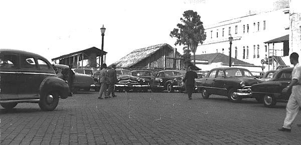
>
> **Figura 17** -- Fotografia da réplica da cabana no terreno do Pátio
> do Colégio -- 1955
>
> **Fonte**: Acervo Estadão.

# O lugar do Pátio na formação intelectual paulistana

> Assim como no colégio São Luiz, outras manifestações da permanência da
> memória do Pátio como importante local para a fundação da cidade podem
> ser observadas nas instituições de formação intelectual existentes na
> cidade. Em 1934, foi inaugurada a reforma da Faculdade de Direito da
> Universidade de São Paulo -- símbolo da intelectualidade paulistana
> que formou as mais influentes personalidades políticas da época.
> Segundo Melo (1996), durante a revolução constitucionalista de 1932, o
> prédio serviu de trincheira e abrigou combatentes, sendo bastante
> danificado. Reformado pelo escritório Ramos de Azevedo, foram
> colocados vitrais -- de autoria
>
> da Casa Conrado9 -- que narravam importantes momentos tanto para a
> Faculdade de Direito quanto para a cidade de São Paulo. Entre eles,
> foram retratados a fundação da cidade de São Paulo, reprodução do
> quadro de Oscar Ferreira (Figura 10) e a imagem do Pátio do Colégio,
> Imagem inspirada no desenho de Thomas Ender (Figura 11).
>
> igreja, escola e da Casa de Anchieta destinada ao museu, além das
> relíquias nele existente conforme escrita no artigo 2º da lei nº
> 2.568.
>
> 9 Segundo Regina Melo (1996), a Casa Conrado era uma ateliê, fundado
> pelo artesão alemão Conrado Sorgenicht em 1889, que trabalhava com
> diversas artes aplicada à arquitetura. Pioneiro na fabricação do
> vitral no Brasil, desevolveu a atividade do vitral criando mais de 600
> obras espalhadas pelo Brasil.
>
> 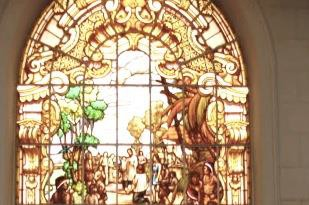
>
> 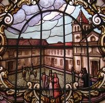**Figura 10** -- Vitral Fundação de
> São Paulo -- Faculdade de Direito/ USP **Fonte:** Site da faculdade de
> direito/USP. **Figura 11** -- Vitral do Páteo do Collegio -- Faculdade
> de Direito/ USP **Fonte:** Site da faculdade de direito/USP.
>
> Ainda no âmbito da formação intelectual em São Paulo, podemos perceber
> a presença da imagem do Pátio do Colégio do século XIX, representado
> ao fundo da imagem, no *Ex-Libris* da Universidade de São Paulo10. O
> Ex-Libris são pequenos selos colados aos livros que identificam seu
> proprietário, trazendo imagens e dizeres particulares que traduzem a
> personalidade e valores de seu titular. No caso da USP, pode-se
> perceber nos Ex-Libris da Faculdade de Arquitetura, Escola Politécnica
> e no Anuário de Faculdade de Filosofia Ciências e Letras, a associação
> da grandeza da USP às origens educacionais da própria cidade de São
> Paulo, representadas pelo colégio jesuítico:
>
> 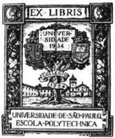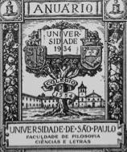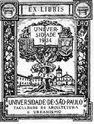
>
> **Figuras 12, 13**-- Ex-Libris da Universidade de São Paulo --
> Faculdade de Arquitetura e Escola Politécnica. **Fonte:** Pottker,
> 2006. **Figura 14** -Anuário da FFLCH-USP. **Fonte**: Lanna, 2004, p.
> 133.
>
> A imagem do Pátio do Colégio é novamente representada no painel de
> azulejos do Colégio Marina Cintra, na rua da Consolação -- São Paulo.
> Símbolo da presença do Estado e do desenvolvimento econômico e social,
> a arquitetura das escolas pública em São Paulo reflete diferentes
> períodos da arquitetura paulista (Oliveira, 2007). Fundado em 1939, o
> projeto do colégio Marina Cintra assume, segundo Oliveira, os
> princípios da arquitetura moderna alegando romper com os estilos
> arquitetônicos vigentes na cidade, em especial o estilo colonial.
>
> 10 Segundo Gisele Pottker (2006), a ilustração foi feita em
> zincogravura por José Wasth Rodrigues.
>
> 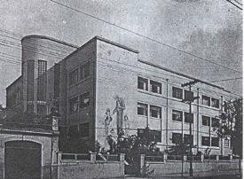
>
> **Figura 12** -- Colégio Marina
> Cintra -- Consolação / SP. **Fonte:** Revista Acrópole
>
> n.48, 1942; p.429. **Figura 13** -- Painel de Anchieta de Paim Vieira.
> **Fonte:** Foto do autor.
>
> Tal decisão ilustra o embate existente no período na construção de uma
> identidade nacional através da arquitetura. Curioso observar que mesmo
> diante de tal posição -- negação do passado colonial -- foi instalado
> na fachada principal do colégio o painel azulejar do Professor Antônio
> Paim Vieira que retrata a cena da fundação da cidade com a imagem de
> Anchieta na catequização de índios tendo ao fundo o representação do
> antigo Pátio do Colégio no estilo colonial.

# O Pátio do Colégio como origem de uma cidade em crescimento

> 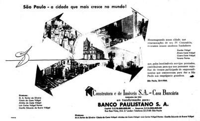
>
> **Figura 18** --Anuncio Banco Paulistano S.A. **Fonte**: Jornal Estado
> de São Paulo, 25/01/1954.
>
> Ainda nos festejos do IV centenário, as diversas manifestações de
> comemoração e lembranças da memória referente à identidade da cidade
> eram encontradas nos principais periódicos da época. Entre a lembrança
> de um passado colonial tendo como importante personagem os
> Bandeirantes de 1554 e a celebração de uma metrópole moderna de 1954
> -- *a cidade que mais cresce no mundo* -- podemos observar também a
> presença do conjunto jesuíta representada na primeira cabana primitiva
> ou na imagem do colégio e sua igreja como podemos observar nos
> anúncios do jornal Estado de São Paulo referente a janeiro de 1954.
>
> 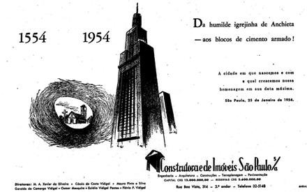
>
> **Figura 19** --Anuncio da Construtora de Imóveis São Paulo.
> **Fonte**: Jornal Estado de São Paulo, 25/01/1954.
>
> 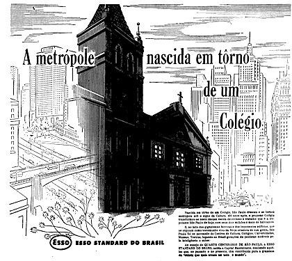
>
> **Figura 20** --Anuncio da Esso . **Fonte**: Jornal Estado de São
> Paulo, 25/01/1954.
>
> A revista Paulistânia, foi outro periódico que expressou sua lembrança
> do antigo conjunto jesuíta. Fundado em 1939, a revista do Clube
> Piratininga -- importante clube na vida social paulistana -- era
> publicada pelo Departamento de Cultura do Clube Piratininga e tinha
> como característica publicar assuntos referentes à São Paulo,
> retratando sua história, sua arquitetura, a educação, a cidade, a arte
> e mesmo temas nacionais e internacionais que pudessem interessar ao
> seu desenvolvimento. Em suas publicações podemos perceber desde 1941
> textos e ilustrações que tratavam o Pátio do Colégio como importante
> local para o desenvolvimento da cidade.
>
> 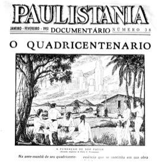
>
> **Figura 21** -- Capa revista Paulistânia de 1951. **Fonte:** Revista
> Paulistania.
>
> 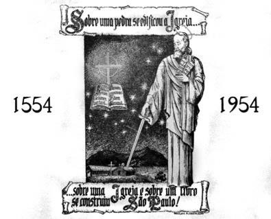
>
> **Figura 22** -- Capa revista Paulistânia de 1954. **Fonte:** Revista
> Paulistania.

# CONSIDERAÇÕES FINAIS

> O artigo observou como, a partir da expulsão da Companhia de Jesus em
> 1760 e até aos festejos do IV Centenário de fundação da cidade de São
> Paulo, a permanência e a apropriação das imagens e da simbologia do
> Pátio do Colégio pela sociedade paulistana -- ora em seu significado
> simbólico e cívico como nos exemplos do colégio Marina Cintra, nas
> apropriações dos selos *Ex-libris* da USP, nos vitrais da Faculdade de
> Direito, nos discursos de políticos e nas manifestações religiosas no
> local; ora na ideia triunfalista da cidade que mais crescia no Brasil,
> manifestada na publicidade e periódicos da época.
>
> A carga ideológica dessas inúmeras imagens do Pátio do Colégio que
> circularam potencializou a correlação de forças que defendia a sua
> reconstrução. Isso mostra que
>
> a análise acerca dos destinos do Pátio não pode ser resumida
> simplesmente a um processo de destruição e reconstrução material do
> conjunto. Uma vez que o conjunto jesuíta é tratado apenas pelas
> diversas transformações físicas, a atual construção (iniciada em 1954)
> acaba sendo analisada como pastiche, simulacro, considerado por alguns
> como uma construção vazia de significados. Se, por outro lado,
> atentarmos para a profusa e contínua circulação de imagens, as ações
> sociais marginais que buscavam reter a memória do Colégio e a dimensão
> sagrada daquele território, essa reconstrução emerge como algo bem
> mais complexo.
>
> Tendo em vista a complexidade do problema, a multiplicidade de atores
> sociais e o poder das representações simbólicas envolvidos na
> devolução do território aos padres jesuítas e na reconstrução do
> Colégio e da Igreja, percebe-se que grande parte da literatura
> existente revela-se simplificadora, deixando de levar em conta uma
> série de importantes significados simbólicos que a cidade atribuiu
> àquele território nos diferentes momentos históricos.

# REFERÊNCIAS BIBLIOGRÁFICAS

> CAMPOS, Eudes. **Arquitetura paulistana sob o Império: aspectos da
> formação da cultura burguesa em São Paulo**. 1997. 814f. Tese
> (Doutorado em Arquitetura) -- FAU USP. São Paulo
>
> CARVALHO, Maria Cristina Wolff de. **Bem Morar em São Paulo,
> 1880-1910: Ramos de Azevedo e os modelos europeus** in ANAIS DO MUSEU
> PAULISTA, v.
>
> 4\. São Paulo, Museu Paulista, 1996.
>
> DONATO, Hernani -- **Pateo do Collegio: Coração de São Paulo*. ***Ed.
> Loyola -- 2008.
>
> MADRE DE DEUS, Frei Gaspar, **Memórias para a História da Capitania de
> São Vicente**. Belo Horizonte: Itatiaia/São Paulo, Edusp, 1975
>
> KEHL, Luis Augusto Bicalho -- **Simbolismo e Profecia na Fundação de
> São Paulo. (A casa de Piratininga*). ***São Paulo: Ed. Terceiro
> Nome.2005.
>
> LEITE, Serafim. **História da Companhia de Jesus no Brasil***.*
> Lisboa: Portugalia; Rio de Janeiro: Instituto Nacional do Livro,
> 1938-1950. 10 v. il.
>
> LIMA, Solange Ferraz de . **Pátio do Colégio, Largo do Palácio*.
> ***Anais do Museu Paulista, São Paulo, v. 6/7, p. 61-82, 2003
>
> LOFEGO, Silvio Luiz -- **IV Centenário da cidade de São Paulo. Uma
> cidade entre o passado e o futur*o. ***São Paulo:Ed. AnnaBlume. 2004.
>
> LOMONACO,Maria Aparecida -- **O Pátio do Colégio.** In: Eduardo Bueno
> (org), ***Os nascimentos de São Paulo**.* Rio de Janeiro: Ediouro,
> 2004
>
> MELLO, Regina Lara Silveira -- **Casa Conrado: Cem anos do vitral
> brasileiro.**
>
> São Paulo: Dissertação de Mestrado. IA/UNICAMP, 1996.
>
> MORAES, Geraldo Dutra de -- **A Igreja e o colégio dos Jesuítas de São
> Paulo**. Prefeitura do Município de São Paulo. 1979 .
>
> OLIVEIRA, Fabiana Valeck de -- **Arquitetura escolar paulista nos anos
> 30.** São Paulo: Dissertação de Mestrado. FAU/USP. 2007
>
> PONCIANO, Levino -- **Todos os centros da Paulicéia,** São Paulo:
> SENAC,2007. POTTKER, Gisele -- **ExLibirs: Resgatando marcas
> bibliográficas no Brasil.**
>
> Florianópois:2006. Monografia de conclusão de curso. CA/UESC.
>
> REIS FILHO, Nestor Goulart. **São Paulo: vila, cidade, metrópole***.*
> São Paulo: Via das Artes, 2004.
>
> TEIXEIRA, Gilberto Lopes. **A restauração e o colégio São Luís.** São
> Paulo: Simpósio Nacional -- Bicentenario de restauração da Companhia
> de Jesus, 2014. Disponível no site: \<
> <http://www.bicentenariosj.com.br/>\>
>
> TOLEDO, Benedito Lima de -- **SÃO PAULO -- Três cidades em um
> século--** 3ª ed. São Paulo:Cosac Naify -- Ed.Duas cidades -- 2004.

# PERIÓDICOS

> AQUELA, **secular parede que se multiplicou em milhões!** *Jornal
> Estado de São Paulo.* São Paulo. 25/01/1954. p. 112
>
> AS COMEMORAÇÕES, **do 383º aniversario da fundação de São Paulo**.
> *Jornal Estado de São Paulo.* São Paulo. 26/01/1937
>
> BARRETO, Plínio. **Novos livros.** *Jornal Estado de São
> Paulo.23/05/1936.*p.03
>
> CARTA **de uma roceira**. *Jornal Estado de São Paulo*, São Paulo.
> 29/08/1975. p.09
>
> MONUMENTO **comemorativo da fundação da cidade de S. Paulo**. *Jornal
> Estado de São Paulo,* São Paulo. 01/08/1909. p.09
>
> O PATIO **do colégio engalado.** *Jornal Estado de São Paulo.
> 25/01/1943. P.03* PATTEO **do Collegio.** *Jornal Estado de São Paulo.
> 02/04/1936.* p.08 PATTEO **DO COLLEGIO**. *Jornal Estado de São Paulo.
> 07/04/1936. p. 08*
