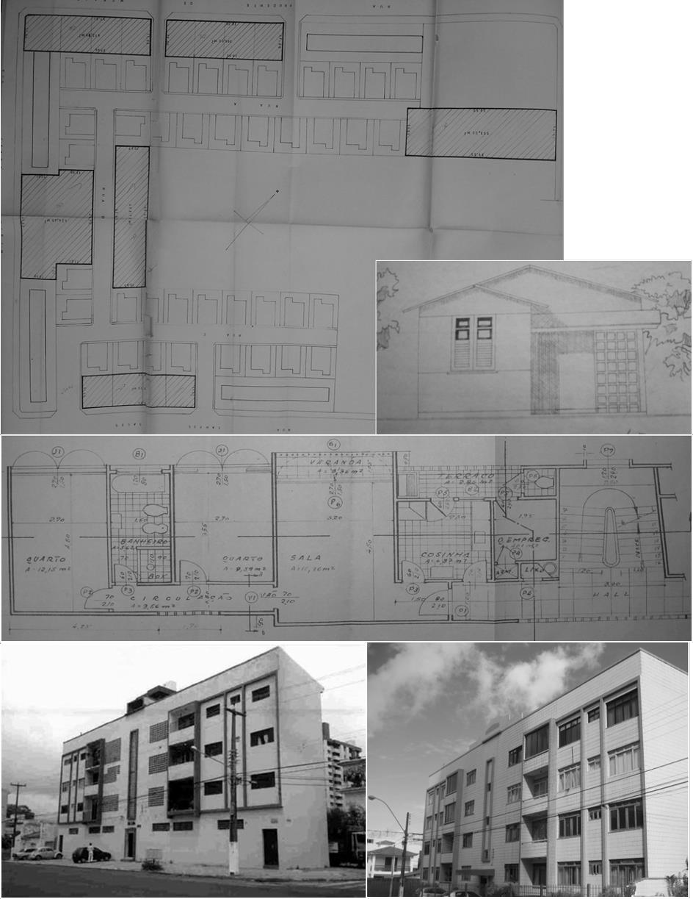

# Resumo

Profissionais vinculados às Caixas e Institutos de Aposentadoria e
Pensões (CAPs/IAPs) se mostraram engajados em pensar e pôr em prática
soluções espaciais, plástico-formais e tecnológicas para a moradia
urbana no Brasil, entre as décadas de 1930 e 1960. Grande parte desse
corpo técnico tem sua trajetória e atuação pouco conhecida,
especialmente no Nordeste do país. O artigo objetiva contribuir para a
discussão sobre a inserção profissional desses projetistas no plano
institucional e na introdução de inovações na habitação, exemplificando
a contribuição de arquitetos e -- sobretudo -- engenheiros que atuaram
junto a esses órgãos em Salvador, Recife, São Luiz, Teresina, Fortaleza,
João Pessoa e, mais especificamente, em Natal, nos anos 1940-1960. Dessa
forma, busca-se ampliar as análises destes agentes na consolidação da
arquitetura moderna no Brasil e dar elementos para o reconhecimento e
debate sobre o valor patrimonial dessa produção. Baseia-se em dados dos
processos de financiamento arquivados nas agências regionais do INSS,
registros do CREA, revistas e legislação da época, além de estudos e
materiais iconográficos publicados sobre os personagens. Um levantamento
inicial permitiu identificar mais de 200 nomes. Esses estavam envolvidos
na concepção, avaliação e fiscalização de projetos e obras, parte dos
quais demonstra a tradução de aspectos do ideário moderno na forma
edificada. Concentrados nos escritórios de Recife e Salvador
encontram-se dentre eles ícones do modernismo reconhecidos
nacionalmente, além de figuras pouco ou -- possivelmente -- jamais
mencionadas na historiografia. Aventa-se que sua circulação (e de suas
ideias) entre estados e regiões foi favorecida pelo modo de estruturação
organizacional das CAPs/IAPs e das ações imobiliárias que realizaram.
Destaca-se, portanto, a relevante contribuição destes corpos técnicos
para a consolidação do repertório modernista na arquitetura no Nordeste
e aponta-se para a reconstituição das trajetórias daqueles profissionais
como perspectiva de continuidade das pesquisas que fundamentaram este
trabalho.

Palavras-chave: Instituições de previdência social, produção de
habitação, atuação de engenheiros e arquitetos, Arquitetura e Urbanismo
Modernos

# Abstract

> *Professionals associated CAPs and IAPs show committed to think and
> put in practice space solutions, formal-plastic and technologic in
> urban habitation in Brazil in the years 30-60'. The large part of this
> technical body have your pathway and acting little unknown, in special
> in the northeast of country. The paper intends contribute to the
> discussion about the professional insertion of these draughtsman in
> introduction of innovation in the habitation, exemplified the
> contribution of architects and engineers who worked in agencies in
> Salvador, Recife, São Luis, Teresina, Fortaleza, João Pessoa, and
> especially in Natal, in the years 1940-1960. Thus, we seek to extend
> analyzes of these agents in the consolidation of modern architecture
> in Brazil and provide elements for the recognition and discussion
> about the patrimonial value of this production. Base on the financing
> processes filed in INSS, CREA records, magazines and at the time
> legislation, plus studies and iconographic material published about
> the personages. An initial survey allowed identifying more than 200
> names. These were involved in the design, evaluation and projects and
> works, of*
>
> *which demonstrates the translation of aspects from modern ideas in
> built form. Concentrated in the offices Recife and Salvador, there are
> among them icons of modernism nationally recognized, and little
> figures or -- possibly -- never mentioned in historiography. It is
> believed that their movement (and their ideas) between states and
> regions was favored by the organizational structure of CAPs / IAPs and
> real estate stocks have done. It is noteworthy, therefore, the
> relevant contribution of these technical staffs to consolidate the
> repertoire of modernist architecture also in the Northeast and it is
> pointed out to rebuilding the trajectories of these professionals as
> prospect of continuing of research underlying this work.*
>
> Keywords: *Social security institutions, housing production, role of
> engineers and architects, Modern Architecture and Urbanism*

# Considerações Iniciais

Entre as décadas de 1930 e 1960, profissionais da área da construção
civil se vincularam às Caixas e Institutos de Aposentadoria e Pensões
(CAPs/IAPs). Essas instituições viabilizaram a instauração da
previdência estatal e o delineamento da primeira política pública de
habitação com abrangência nacional. Para tanto, criou-se uma estrutura
organizacional complexa -- que atenderia às questões trabalhistas, de
saúde e habitacionais --, corporativista e, parcialmente,
descentralizada. Conformaram assim, em seus escritórios federais,
estaduais e municipais, distintos corpos técnicos, nos quais
profissionais como engenheiros, arquitetos e assistentes sociais
dedicaram- se à reflexão e à prática de intervenções no âmbito da
moradia.

Esta estrutura integrou o esforço de ampliação das esferas de atuação do
Estado, intensificada no escopo do projeto nacional-desenvolvimentista
da chamada "Era Vargas" (1930-1945), visando à construção de um Brasil
urbano-industrial. Nesse contexto, a moradia tornou-se fator primordial
para a reprodução da força de trabalho.

A veiculação de diretrizes alinhadas às defendidas no seio do Movimento
Moderno, formuladas na política habitacional que se pretendia instituir
e a concretização de experiências pioneiras na tradução de princípios
arquitetônicos e urbanísticos inovadores, indicam a contribuição desses
órgãos nas transformações em curso nas

cidades brasileiras à época1. A atuação dos corpos técnicos constitui-se
em elemento fundamental nesse processo, sobretudo, no que tange à
aplicação dos instrumentos e

recursos previstos nas localidades em que operaram.

Levantar elementos para discutir a inserção dos engenheiros e arquitetos
nas instituições e na introdução de inovações no âmbito da moradia é o
objetivo deste trabalho. Ao ter como foco a ação das CAPs/IAPs no
Nordeste, exemplificando a contribuição de profissionais que atuaram na
região e, mais especificamente, em Natal-RN, pretende-se colaborar para
a ampliação das análises acerca destes agentes na consolidação da
arquitetura moderna no Brasil. Com isso, busca-se fornecer dados para o
reconhecimento e debate sobre o valor patrimonial desta produção.

Os estudos sobre o tema no país tem apontado a diversidade de programas,
partidos, soluções projetuais, plástico-formais e tecnológicas -- com
diferentes abordagens do moderno ao tradicional -- adotadas, sobretudo,
quando se considera também as

> 1 Assim apontaram Farah (1983), Bonduki (1998), e, mais recentemente,
> Bruna (2010), Almeida (2012/2013), entre outros autores.

realizações fora dos grandes centros urbanos2. Constata-se, igualmente,
o destaque a engenheiros e arquitetos responsáveis pela elaboração de
projetos arquitetônicos e urbanísticos de empreendimentos localizados,
sobremaneira, nas principais cidades do centro-sul. Figuras
particularmente importantes na concepção e implementação da

política já foram alvo de investigações3. No entanto, ainda é restrito o
quadro de profissionais filiados às Caixas e aos Institutos, conhecidos
pela historiografia especializada, especialmente nas demais regiões. Em
relação ao Nordeste, esta lacuna tem sido em parte preenchida por
pesquisadores que trouxeram à tona outros

personagens.

> A formação em engenharia no Brasil, desde seu início em fins do século
> XIX, incluiu uma gama de atribuições relativas ao pensar e agir sobre
> a cidade, nas quais se evidencia a gênese do urbanismo no país (LEME,
> 2005). De forma geral, junto aos arquitetos, estes profissionais tem
> na construção da cidade um papel determinante não somente como agentes
> da ordenação urbanística, mas também na construção material e na
> concepção das infraestruturas e das edificações. Ao completar essa
> ideia, Horacio Capel (2013, p.244/252) acrescenta que, apesar de se
> constituírem, por vezes, agentes subordinados, "*hay que destacar la
> importancia de su trabajo, su excelente formación y su capacidad para
> la innovación*". Nesse último aspecto, o autor destaca pontos
> relacionados à afirmação da "*innovación"* sobre a "*imitación*" que
> se deu em momentos da história, não só com o Movimento Moderno, como:
> a circulação dos técnicos e sua contribuição para "*difundir e
> intercambiar modelos arquitectónicos y urbanísticos*"; a relação com
> as elites e "*su apertura o rechazo al cambio social y tecnológico
> \[que\] explican la incorporación o no de innovaciones constructivas o
> urbanísticas*"; os materiais construtivos no que se refere à
> disponibilidade e à mão de obra especializada, notadamente, para os
> novos elementos e o acesso a livros e a revistas.

A questão da moradia popular figurava como um dos ditos "problemas
urbanos" que estes profissionais buscavam solucionar, propondo inovações
espaciais e tecnológicas visando à construção do "lar conveniente"
(FREITAS, 2005). No Brasil, no interior das instituições que primeiro se
encarregaram da problemática, eles encontraram um espaço privilegiado
para discutir questões e propor soluções relacionadas a novas formas de
habitar na cidade. Essa abertura institucional -- aliada à aceitação por
parte das elites de propostas inovadoras; a ampla circulação de
informações à época; o encantamento pelo "moderno" atingindo vários
grupos sociais e a disponibilidade de materiais, recursos financeiros e
técnicos, entre outros fatores --, criou as condições históricas que
possibilitaram aos corpos técnicos das CAPs/IAPs potencializar sua
capacidade de atuação.

As principais fontes de dados primários foram os processos de
financiamentos prediais concedidos pelos IAPs/CAPs (décadas de 1940 a
1960) em sete capitais do NE4, arquivados no INSS. Complementou-se com
dados documentais (leis, decretos e

> 2 Para aprofundamento da questão, consultar Vasconcelos (2009), Bruna
> (2010) e Almeida (2012/2013).
>
> 3 Estudos como os de Bonduki e Aravecchia (1998) e Almeida (2008/2012)
> apontam nomes e delineiam trajetórias.
>
> 4 Estes foram inventariados na forma de amostragem aleatória (no
> mínimo 30%) nas cidades de São Luís, Teresina, Fortaleza, João Pessoa,
> Recife e Salvador e em sua totalidade em Natal.

resoluções), consultas a estudos acerca dos profissionais e informações
contidas no CREA e em revistas de arquitetura da época.

Este artigo apresenta, inicialmente, a caracterização das formas de
vinculação desses profissionais e sua inserção na estrutura
organizacional das CAPs/IAPs. Em seguida, destaca autores de obras
significativas empreendidas por essas instituições no Nordeste, que
introduzem as contribuições de dois profissionais atuantes em Natal,
apresentadas no terceiro item.

# Estrutura organizacional das CAPs/IAPs e formas de vinculação dos profissionais

Criados para cada carteira profissional, ao longo dos anos 1920 e 1930,
as CAPs e IAPs se configuravam como órgãos federais cujo objetivo
primordial era instaurar e, posteriormente, aprimorar a previdência
estatal no país. Suas funções abrangiam as questões trabalhistas, em
especial a concessão de aposentadorias e pensões, bem como as vinculadas
à saúde, por meio do atendimento médico/hospitalar gratuito ao
trabalhador e sua família. Aplicar recursos no campo da habitação para
construção e/ou financiamento de unidades destinadas aos associados
somente foi permitido a

partir de 1930, mediante decreto n.19.4965.

Estes órgãos foram organizados e balizados por regimentos federais
elaborados no âmbito, sobremaneira, do Conselho Nacional do Trabalho
(CNT)6. Além de responsável pela formulação dos regulamentos de atuação
das CAPs/IAPs em distintas áreas (trabalhista, previdenciária, etc.), o
CNT fiscalizava suas ações, das instituições de seguro social e
entidades congêneres criadas oficialmente. Na moradia,
especificadamente, o Conselho não somente teve um papel normativo --
elaborando diretrizes e prescrições construtivas para a execução das
primeiras ações das Caixas e Institutos no setor --, mas também de
avaliador -- analisando planos e projetos de sedes

administrativas e de edificações individuais ou coletivas para os
associados.

A organização institucional das CAPs/IAPs era representada em seu mais
alto nível, pela presidência, locada no escritório central, no Rio de
Janeiro. Junto a esta funcionava o Conselho Administrativo ou Comissão
Deliberativa, constituída por membros que já exerciam funções públicas,
escolhidos pelo Presidente da República. A partir de fins da década de
1930, num processo de descentralização, estes órgãos passaram a atuar
por zonas ou regiões, instalando escritórios ou delegacias estaduais7.
Essas instâncias eram regidas pelo delegado, nomeado pelo presidente da
CAP/IAP, ao qual se subordinava o Departamento ou Serviço de Engenharia,
composto pela seção financeira e a de projeto e execução, conformada por
engenheiros fiscais e

projetistas e arquitetos: a Carteira Predial.

A atuação e os serviços de engenheiros e arquitetos não vinculados
diretamente aos

> 5 Nessa modalidade, sua atuação perdurou até meados da década de 1960,
> quando parte de suas ações imobiliárias foram transferidas e/ou
> incorporadas pelo Banco Nacional de Habitação (BNH) e, segundo Almeida
> (2012), pelo IPASE cuja ação foi vislumbrada até a década de 1970.
>
> 6 Órgão criado em 1923 e subordinado ao Ministério do Trabalho,
> Indústria e Comércio (MTIC), assim como as CAPs/IAPs.
>
> 7 O Nordeste foi contemplado com sete escritórios que atendiam aos
> estados: Maranhão e Piauí, Ceará, Rio Grande do Norte, Paraíba,
> Pernambuco, Bahia, Alagoas e Sergipe (ALMEIDA, 2012).

órgãos poderiam ocorrer por indicação, em geral, do Departamento de
Engenharia ou pelo delegado de um escritório estadual. Havia também a
possibilidade de recomendação e convite por parte de instituições
públicas ou do Presidente da República, governadores e prefeitos8. Outra
forma de escolha dos profissionais era a chamada "concorrência" 9
(ALMEIDA, 2012).

A abertura das convocações para compor os corpos técnicos que iriam
atuar no setor imobiliário dava-se em distintos níveis: internamente, no
âmbito de uma delegacia estadual, restrita à participação dos
profissionais contratados ou licenciados; internamente, no cerne de um
determinado Instituto ou Caixa, aberta a qualquer profissional associado
ao órgão, na rede de delegacias que o compunha; com abrangência limitada
aos profissionais das CAPs/IAPs em escala nacional, ou acessível a todos
os profissionais liberais e escritórios do ramo (ALMEIDA, 2012).

Nas carteiras prediais estavam envolvidos desde os processos de
avaliação de laudos de financiamentos, empréstimos imobiliários e/ou
edificação de unidades habitacionais -- que incluía análise dos projetos
-- até a concepção, execução e fiscalização das obras. Muitos foram os
engenheiros e arquitetos a transitarem por estas atividades imobiliárias
e/ou a ocuparem cargos administrativos no CNT, no MTIC, nos escritórios
centrais das CAPs/IAPs, e principalmente nas delegacias regionais como
se verá a seguir.

# Engenheiros e Arquitetos das CAPs e IAPs: obras significativas

Inicialmente merece menção, dentre os profissionais engajados na
estruturação da política habitacional das CAPs/IAPs no MTIC, o
engenheiro-arquiteto Rubens Porto, que foi um importante mediador entre
as reflexões, reivindicações, estudos e proposições acerca da moradia
nesse processo. Defendia uma "arquitetura moderna", desprezando o
supérfluo com materiais e elementos decorativos. Sugeriu modelos
habitacionais que se aproximavam de propostas corbusianas e howardianas.
Suas indicações configuraram uma espécie de manual com diretrizes
arquitetônicas que passaram a reger os projetos de moradias e/ou grupos
delas, pelos profissionais daqueles órgãos (PORTO, 1938).

Outros personagens associados diretamente à produção habitacional se
destacam no contexto de criação e ao longo de todo o período de atuação
das Caixas e Institutos, como Carlos Frederico Ferreira, arquiteto chefe
do setor de projeto e engenharia do IAP dos Industriários no Rio de
Janeiro (IAPI-RJ). Diversas obras de sua autoria são consideradas
ímpares no que diz respeito ao partido arquitetônico adotado, à
racionalização do canteiro, ao emprego de materiais e ao número de
unidades habitacionais construídas, e se tornaram referências à
concepção de conjuntos em todo o país. Affonso Reidy, Attílio Corrêa
Lima e Kneese de Mello também atuaram nesse escritório.

> 8 Esta possibilidade abria brechas para interferências e manipulações
> "políticas" ou práticas clientelistas, bastante conhecidas,
> principalmente, no âmbito regional e local.
>
> 9 Processo de inscrição e escolha por critérios estabelecidos pelos
> órgãos. Nessa seleção não se evidenciava, como é comum nos dias de
> hoje, editais e/ou bancas específicas para a determinação dos
> candidatos.

Ao destacar a fundamental contribuição de conhecidos engenheiros10 e
arquitetos11 dos grandes conjuntos residenciais das CAPs/IAPs, locados
em cidades do centro-sul do país, cabe a este estudo trazer à tona a
participação de profissionais envoltos nas atividades imobiliárias
desempenhadas pelas carteiras prediais no Nordeste. Muitos deles
trabalharam exclusivamente nas seções de engenharia dos escritórios
estaduais, dedicando-se à reflexão, à prática e à fiscalização dessas
ações. Ao deixarem este campo de atuação, com o término das funções das
Caixas e Institutos a partir de meados da década de 1960, não foram
sequer mencionados pela historiografia especializada. Em sua tese,
Almeida (2012) atenta para o assunto e aponta a existência de pelo menos
duzentos profissionais vinculados às ações dos órgãos em questão no

campo habitacional, atuantes em sete das nove capitais nordestinas12.

Os escritórios estaduais locados no Recife e em Salvador abrigaram o
maior número de engenheiros e arquitetos licenciados, contratados ou
indicados na região. Esse quadro explica-se, provavelmente, pela
existência de instituições de formação capacitadas nessas capitais. No
Recife, inventariou-se 43 profissionais vinculados às IAPs/CAPs e
atuantes na cidade -- identificando-se 22 engenheiros, sete arquitetos e
oito construtores engajados com projetos e edificações -- egressos, em
sua maioria, da Escola de Belas Artes Pernambucana ou da Escola
Politécnica do Recife. Em Salvador, encontrou-se 34 profissionais,
dentre eles: três arquitetos, oito engenheiros projetistas, um
engenheiro avaliador, três engenheiros ocupando funções administrativas
e sete construtoras.

Diversos personagens atuantes no Nordeste foram responsáveis pela
introdução de inovações arquitetônicas e/ou inserção de modelos
urbanísticos internacionais nas capitais estudadas. Beraldo Dário
Borges, arquiteto recifense do Conjunto José Bonifácio (IPASE-1953) em
São Luís, por exemplo, se distanciou das realizações mais comuns na
cidade à época, concebendo moradias cujas fachadas constituíam-se
basicamente por linhas retas, planos sem elementos decorativos e
cobertura em laje plana de concreto armado. Na implantação, inferem-se
aproximações à concepção de bairros-jardins e à unidade de vizinhança,
como: vias estruturadoras de maior fluxo

margeando-o; adaptação das construções e vias às curvas de nível do
terreno13; existência de *boulevard* central com canteiros bem
arborizados, praças, áreas verdes e

> ruas *cul-de-sac* (Fig.1).
>
> 10 Alguns exemplos são Alberto de Mello Flores (IAPI), Helvécio Xavier
> Lopes (IPASE) e White Lírio da Silva (IAPI), aturam, sobretudo, nos
> IAPs no RJ, SP e BH (PORTO, 1938; SAMPAIO, 1996; BONDUKI, 2002; BRUNA,
> 2010).
>
> 11 Dentre eles estão Álvaro Vital Brasil (IPASE), Marcial Fleury de
> Oliveira (IAPB), Marcos Kruter (IAPI), os irmãos Marcelo, Milton e
> Maurício Roberto (IAPI/IAPC), Nicolau H. Barbieri (IAPB), Paulo
> Antunes Ribeiro (IAPI), Plínio Arruda Botelho (IAPB), Roberto J. G.
> Tibau (IAPB) (PORTO, 1938; SAMPAIO, 1996; BONDUKI, 2002; BRUNA, 2010).
>
> 12 O apontamento dos profissionais emergiu ao longo da mencionada
> pesquisa e sua identificação seguiu critérios estatísticos para o
> levantamento dos processos imobiliários cadastrados nos órgãos (30%);
> o que supõe maior quantidade de técnicos atuantes na região. De
> antemão, atenta-se para o significativo número de construtores,
> particulares e empresas (49), que participaram da edificação dos
> conjuntos/grupos residenciais, bem como de engenheiros civis (126),
> nos escritórios estaduais no Nordeste.
>
> 13 Como operado por Carlos Frederico Ferreira no Conjunto Jardim
> Piratininga (IAPI-1946), em Osasco-SP.
>
> 
>
> Figura 1. Implantação do Conjunto José Bonifácio (IPASE, 1953), em São
> Luís. Fonte: Arquivo do INSS-MA

Certos arquitetos foram pioneiros em suas propostas nas localidades de
atuação, como o arquiteto carioca Ulysses Petrônio Burlamaqui, na
capital paraibana. Único exemplar do gênero, o Edifício Presidente João
Pessoa (IAPB-1957), comportava numa mesma estrutura as funções de morar,
comercial e institucional. Com dezoito pavimentos, era o mais alto da
cidade. Em sua volumetria evidencia-se o binômio forma-função, em que a
mudança de uso é acompanhada por distinções no volume da edificação e/ou
por seu tratamento formal, mediante a utilização de diferentes materiais
construtivos e/ou de revestimento. Elementos como combogós, gradis nas
varandas, *brise-soleil,* planos de vidros, esbeltos pilares cilíndricos
e combinações de pilares de seção circular e pilastras retangulares
intercaladas, são percebidos (Fig.2). A conciliação de duas tipologias
de plantas e o teto-jardim são traços notáveis dessa obra.

> 
>
> Figuras 2 e 3. Edifícios Presidente João Pessoa (IAPB, 1957) e
> Inconfidência (IAPI, 1945), no Recife. Fonte: ALMEIDA (2012)

Projetado pelos conhecidos arquitetos Carlos Frederico Ferreira e Hélio
Duarte, o Edifício Inconfidência (IAPI-1945), no Recife, se destaca
igualmente pela conjunção de plantas diferenciadas (duplex) e uso misto
da edificação. A proposta agrega em planta e no tratamento formal
preceitos do modernismo como a sobriedade das fachadas, planos de vidro,
jogo de volumes, passarela coberta em concreto armado sustentada por
esguios pilotis, redução de espaços internos, dentre outros. Diferencia-
se dos demais da categoria na cidade pelo volume em "L" e pelo jogo de
cheios e vazios, alcançado por meio do tratamento das varandas da
edificação (Fig.3). Algumas acompanham a solução continuada com peitoris
em metal, outras têm o peitoril fechado em alvenaria conformando
balcões. Essa alternância se assemelha ao executado pelos irmãos M.M.M.
Roberto, no Edifício Anchieta (IAPC-1943), em São Paulo.

Diógenes Rebouças e José Bina Fonyat14 projetaram o Conjunto Almirante
Valdermar Mota ou Itapagipe (IAPB-1953), em Salvador, um caso atípico de
tratamento das fachadas principais na região, devido ao uso de placas do
concreto (Fig.4). É um dos principais ícones da arquitetura modernista
no âmbito dos institutos de previdência baianos. Nele são empreendidos
desde as premissas urbanas, de implantação dos edifícios e das moradias,
até os aspectos construtivos relacionados à técnica e ao material.
Utilizou-se concreto armado, panos de vidro, de combogós e aço nos dois
edifícios coletivos que integram o complexo.

> 
>
> Figura 4. Conjunto Almirante Valdemar Mota (IAPB, 1953), em Salvador.
> Fonte: ALMEIDA (2012)

Já o arquiteto pernambucano Hugo de Azevêdo Marques reservou cinquenta
vagas cobertas para automóveis no subsolo do Edifício do Recife
(IAPC-1949), aspecto incomum na produção das CAPs/IAPs não somente no
Nordeste, mas em todo o país, especialmente pelo grande número de vagas
previstas. Observa-se ainda, a

> 14 Ambos desempenharam papel importante na consolidação do modernismo
> na Bahia e eram, à época, professores do curso de arquitetura da
> Escola de Belas Artes de Salvador. Para maiores informações consultar
> Andrade Júnior (2012).

preocupação de orientação das aberturas no sentido predominante do
vento, tirando-se também partido do cenário natural do entorno, marcado
pelo Rio Capibaribe.

O engenheiro civil Almir Ferreira é responsável por um dos poucos casos
regionais de aplicação, na produção das Caixas e Institutos, das
premissas da racionalização dos canteiros de obra15. O Conjunto do
Salvador (IAPI-1952) ou Conjunto dos Industriários, como é conhecido,
foi o maior em extensão e densidade edificado nessa categoria na capital
baiana, sendo um dos maiores no Nordeste (Fig.5).

> 
>
> Figura 5. Conjunto dos Industriários (IAPI, 1952), em Salvador. Fonte:
> ALMEIDA (2013)

Percebe-se que profissionais associados às CAPs/IAPs nordestinos estão
entre figuras destacadas do meio arquitetônico e urbanístico do país da
época, como os arquitetos Diógenes Rebouças, José Bina Fonyat, Hélio
Duarte e Carlos F. Ferreira. Mas outros, inclusive projetistas e
construtores sem formação acadêmica, incumbidos da concepção e
edificação de uma diversidade de moradias ou grupo delas nas capitais da
região permanecem desconhecidos.

# Profissionais natalenses e suas obras: iniciando trajetórias

A inserção, principalmente de engenheiros, segundo diferentes formas de
vínculo, ocorreu em dois momentos distintos da atuação das CAPs/IAPs em
Natal. O primeiro, delineado entre 194616 e 1950, caracteriza-se,
principalmente, pela liberação de crédito imobiliário para construção ou
aquisição direta de moradias, muitas vezes de caráter tradicional, com
baixa qualidade construtiva e carentes de serviços básicos, viabilizada
predominantemente pelo IAPI. Nesse ínterim, foram recorrentes operações
envolvendo casas total ou parcialmente construídas com taipa efetivadas,
em sua maioria, por iniciativa dos associados, e visando, sobretudo,
empréstimos para reforma17 (ALMEIDA, 2007; LIMA, 2011).

> 15 Ação defendida, principalmente, pelo Instituto de Organização
> Racional do Trabalho (IDORT).
>
> 16 Até esse ano registrou-se poucos processos de financiamento, o que
> indica uma etapa provavelmente inicial de instalação dos escritórios
> locais.
>
> 17 O uso de materiais e métodos construtivos do lugar em moradias
> populares foi defendido por Rubens Porto e outros profissionais para a
> política das CAPs/IAPs (ALMEIDA, 2012).

Na década de 1950, mudanças na atuação local caracterizaram um segundo
momento. Ao acompanhar a tendência nacional, o volume de financiamentos
foi comprometido, sobretudo, devido ao agravamento da crise financeira
do sistema previdenciário. No entanto, na contramão desse processo, em
Natal percebe-se uma melhoria no padrão das propostas face ao momento
anterior. Construiu-se, nesse período, a maioria dos conjuntos
natalenses, ação estendida à segunda metade dos anos 1960. À frente
dessa produção estiveram o IAPC e o IPASE, além do Instituto de
previdência do Estado (IPE).

As propostas arquitetônicas e urbanísticas evidenciam a tradução do
repertório modernista nos conjuntos, pequenos grupos de casas e unidades
isoladas financiadas individualmente. Para tanto, parece ter contribuído
os profissionais locados nas agências das CAPs/IAPs. Esses atuaram num
cenário mais amplo de difusão e consolidação do modernismo na
arquitetura residencial em curso nas cidades brasileiras e também em
Natal, onde projetistas "práticos", engenheiros e arquitetos do local e
"de fora" promoviam inovações na moradia18.

Identificou-se cerca de trinta personagens vinculados às atividades
imobiliárias dos órgãos na capital potiguar19, sobre os quais se iniciou
a busca de informações em projeto recente20. Destaca-se a atuação de
engenheiros como Wilson de Oliveira Miranda (1919-1988) e Gentil
Ferreira de Souza (1901-1962) -- prefeitos de Natal entre 1954-1956 e
entre 1931-32/1935-40, respectivamente --, além de Octávio Tavares21.
Esses empreenderam avaliações de imóveis, elaboraram laudos para
financiamento e construção de residências isoladas, assim como se
responsabilizaram por obras individuais.

Ao final dos anos 1940, quando se firmavam inovações na arquitetura
residencial natalense, vislumbra-se a atuação dos engenheiros Luiz Noya
Volfzon (IAPI/CAPESP/IAPC) e Moacyr Maia (IPASE/IAPI/IAPC) nos
escritórios locais. Em meados da década seguinte, registram-se ações de
José Correia da Costa (IPASE), Milson Dantas (IPASE/IAPC/IAPI) e Kleber
de Carvalho Bezerra (IPASE), além do

arquiteto Ubirajara Galvão22 -- expoente do modernismo potiguar --,
entre outros.

Pelo conjunto da obra e participação no sistema CAPs/IAPs, ressalta-se,
dentre os citados, dois projetistas: Moacyr Maia (1926**-**2006) e
Milson Dantas (1922**-**), formados na Escola de Engenharia de
Pernambuco, em 1948 e 1953, nessa ordem.

> 18 Sobre o tema verificar: Trigueiro, Cappi e Nascimento (2010) e Melo
> (2004), autores que citam outros profissionais potiguares "inovadores
> da casa".
>
> 19 Estima-se que cerca de 2.000 pleitos efetivaram-se em Natal, embora
> somente 560 possam ser acessados nos arquivos do INSS-RN (ALMEIDA,
> 2007).
>
> 20 Intitulado "Circulação de ideias: os IAPs na introdução de
> inovações na arquitetura e no urbanismo em Natal (décadas de 1940 a
> 1960)".
>
> 21 Há registros da atuação do primeiro em processos de 1945 a 1967,
> nos quais aparece como "fiscal do instituto"; o segundo é mencionado
> em operações de 1947 a 1952 e o último era engenheiro da Prefeitura do
> Natal, que prestou serviços ao IAPE/IAPTEC/IPASE/IAPC, pelo menos, de
> 1944 e1948.
>
> 22 Esse profissional também participou da atuação das CAPs/IAPs em
> outros estados nordestinos, principalmente no Piauí, mais
> especificadamente nas cidades de Teresina e Parnaíba, onde projetou os
> Conjuntos Monte Castelo e Esperança edificados pelo IPASE. Mais tarde,
> prestou serviços na área junto ao Banco Nacional de Habitação
> (ALMEIDA, 2012).

Maia vinculou-se diretamente aos órgãos, ainda recém**-**formado. Na
década de 1950 projetou o Conjunto Residencial Nova Tirol (IAPC), um
empreendimento inovador, sobretudo, pelo partido urbanístico (Fig.6-10).
A concepção inicial previa um complexo de oito blocos laminares de
apartamentos, quatro com pontos comerciais térreos -- os primeiro de que
se têm registros na cidade -- e 40 casas isoladas, escola, centro social
e áreas verdes. A disposição das vias e acessos, mediante ruas fechadas,
promovia a separação de fluxos de veículos e pedestres.

> 
>
> Figuras 6 a 10. Conjunto Residencial Nova Tirol (IAPC). Fonte: Acervo
> INSS-RN

A apropriação dos debates sobre "habitação mínima" também se manifesta
na área e programa reduzidos, assim como na setorização interna.
Contudo, determinados itens da proposta -- dependências de empregados,
relação frente/fundos e entradas especializadas (social e de serviço) --
demarcam certo conservadorismo na concepção do modo de morar, frente a
experiências mais progressistas dos respectivos órgãos. O mesmo se diz
da casa de padrão médio, projetada por Maia para um segurado do IAPC no
início dos anos 1960. Pode-se dizer que embora demonstre maior
apropriação do léxico modernista -- em especial, aquele da chamada
"Escola Carioca"

--, elementos como um "galinheiro" aos fundos denunciam a permanência de
hábitos rurais, associados ao anseio do "ser moderno" (Fig.11-13).

> Figuras 11 a 13. Casa individual
> projetada por Moacyr Maia (IAPC, 1960-61). Fonte: Acervo do INSS-RN.

Contemporâneo de Moacyr Maia, Milson Dantas vinculou-se indiretamente
aos IAPs, exercendo avaliações de imóveis. Além disso, elaborou para
terceiros projetos de casas posteriormente adquiridas pelos associados.
Dentre esses, destaca-se o grupo de sobrados geminados da Rua Mossoró,
financiado pelo IAPB em 1963, nos quais se verifica o esforço de
aproveitamento dos lotes estreitos (7,4 x 15,5), valorizando áreas
livres e garantindo o arejamento interno, por janelas horizontais e
combogós (Fig.14- 15).

> Figuras 14 e 15. Grupo de casas da Rua
> Mossoró, IAPB-1963. Fonte: Acervo do INSS/RN.

O partido arquitetônico, evidenciado no conjunto, expressa a tradução --
sobretudo plástica -- da "janela em fita" e da cobertura plana, mediante
a adaptação de soluções tradicionais, tais como faixas de revestimento,
frisos e telhado cerâmico. A laje impermeabilizada conforma-se uma
inovação e se diferencia do "teto-jardim". Internamente, a sala de
jantar articula os setores, isolando o "estar", um indício da
necessidade de conciliação de maneiras mais tradicionais de uso dos
espaços "sociais"

-- que se distingue da "sala única" integradora proposta por
modernistas.

Analogamente à produção de Moacyr Maia, percebe-se aqui uma incorporação
parcial de elementos e princípios modernistas, mas ao mesmo tempo
sugere-se a criatividade na articulação de tradição e inovação, em
diferentes dimensões da forma construída. Esses mecanismos fornecem uma
pista para o estudo da difusão dessa nova linguagem da arquitetura na
moradia, a partir das trajetórias desses "novos personagens", aspecto
enfatizado por Carlos Martins (2007).

Os dados coletados neste levantamento inicial apontam a inserção desses
profissionais numa série de atividades relacionadas à construção da
cidade, além da habitação, nas esferas pública e privada. Atuaram em
órgãos como o Departamento de Estradas e Rodagem (DER) -- no qual Maia
exerceu cargo de direção e Milson de técnico -- e no 5º Distrito de
Rios, Portos e Canais. Além disso, junto a outros engenheiros vinculados
às CAPs/IAPs, Moacyr participou da implantação da Escola de Engenharia
do RN (1959), mais tarde incorporada à UFRN.

No âmbito do empreendimento privado, Maia fundou a Companhia de
Investimentos e Construções Ltda. (CICOL), cuja atuação expandiu para
outras regiões do país e exterior. Atuou ainda como diretor de uma
empresa cinematográfica. Já Dantas fundou, em 1978, a "Bripar Tecnologia
e Assistência Técnica Ltda.", hoje administrada por seus descendentes,
que presta serviços especializados na aplicação do método de
pavimentação que concebeu23.

Mediante as ações destes e de outros personagens materializaram-se
diferentes formas de apropriação e tradução das novas concepções de
moradia, arquitetura e cidade no plano local. Nesse contexto,
confrontaram aspectos particulares do mercado imobiliário e construtivo,
da estrutura produtiva e da organização das classes trabalhadoras, das
condições e formas de morar, do meio técnico atuante, entre outros
fatores, que se deve verificar.

# Considerações Finais

As CAPs/IAPs, ao alargarem a atuação do poder público no âmbito
habitacional, impulsionaram a edificação dos primeiros conjuntos
residenciais modernos brasileiros. Articularam, nesse processo, uma gama
de profissionais -- sobretudo engenheiros e arquitetos --, que
contribuíram de forma significativa para a introdução de inovações
arquitetônicas e urbanísticas em grande parte do país. Este corpo
técnico, além de personagens políticos, que participaram do debate e das
reformas nos campos da previdência, saúde e moradia -- e da estruturação
das repartições criadas e/ou ampliadas nesse processo -- foi
indispensável para as mudanças na habitação urbana nas décadas de
1930**-**1960.

> 23 Dessa ideação, Dantas detém a Patente PI7404984 - processo de
> pavimentação e repavimentação mista brita seca-paralelepípedo-asfalto.

Os estudos acerca das contribuições de profissionais atuantes no
Nordeste permitem apontar aproximações com a atuação dessas instituições
principalmente no Sudeste. Evidenciou-se também naquela região a
ressonância de conceitos e referências que eram discutidas e aplicadas
em experiências inovadoras, não somente pelas CAPs/IAPs no Brasil, mas
por diversos agentes em diferentes partes do mundo.

Quatro situações confirmam, nas capitais nordestinas estudadas, o
importante papel desses órgãos para a circulação dessas novas ideias: a
atuação de profissionais do centro-sul do país na concepção e execução
de obras no Nordeste; o deslocamento de técnicos dentro da região para
prestação de serviços; a incorporação, nos diversos escritórios
estaduais, de pessoal formado nas escolas de engenharia e arquitetura de
Recife e de Salvador, difusores de inovações, e, ainda, de outros
centros de ensino do país e do exterior. Em Natal, potiguares formados
noutros estados, especialmente Pernambuco, contribuíram com essas ações
na moradia, traduzindo concepções "modernas" para o plano local.

A identificação dessas figuras e o estudo de suas realizações junto às
CAPs/IAPs, de forma geral, apontam um caminho para o conhecimento das
transformações no campo da construção civil no período, do papel que
desempenharam dentro dos referidos órgãos, e, também, dos caminhos da
própria arquitetura brasileira, na qual se disseminavam os princípios e
o repertório modernistas. Embora se enfatize o reconhecimento, a
compreensão e a valorização do chamado "patrimônio moderno", estudos
mais aprofundados sobre o tema precisam ser desenvolvidos,
possibilitando o entendimento das particularidades da produção
arquitetônica e urbanística na região.

Um primeiro passo seria a reconstituição das trajetórias desses
profissionais quanto à sua formação, contribuições teóricas e práticas,
seus vínculos com as administrações públicas e demais agentes ou atores
urbanos (construtores, incorporadores, proprietários de terra, etc.).
Assim delineiam-se investigações futuras, numa determinada escala de
análise.

# Agradecimentos

Ao CNPq, à CAPES e à FAPESP pelas bolsas e recursos financeiros
concedidos, bem como ao HCUrb pelo apoio e material disponibilizado.

# Referências

ALMEIDA, Caliane Christie Oliveira. *Habitação Social:* origens e
produção (Natal, 1889-1964). 2007. Dissertação (Mestrado em Arquitetura
e Urbanismo) -- Escola de Engenharia de São Carlos, São Carlos, 2007.

. O engenheiro-arquiteto Rubens Porto e os Institutos e Caixas de
Aposentadoria e Pensões (IAPs/CAPs): contribuições para a formulação de
uma política habitacional no Brasil, na década de 1930. *Risco,* São
Carlos, v. 8, p. 35-48, 2008.

. *Habitação social no Nordeste:* a atuação das CAPs e dos IAPs (1930-
1964). 2012. Tese (Doutorado em Arquitetura e Urbanismo) -- Instituto de
Arquitetura e Urbanismo de São Carlos, São Carlos, 2012.

> . *A ação das Caixas e Institutos de Aposentadoria e Pensões em
> periódicos de arquitetura, Nordeste (1930-1964).* Projeto
> (Pós-doutorado em Arquitetura e Urbanismo) -- Instituto de Arquitetura
> e Urbanismo de São Carlos, São Carlos, 2013.

ALMEIDA, Caliane Christie Oliveira; LIMA, Luiza Maria Medeiros**;**
FERREIRA, Angela Lúcia A. Conjunto Residencial Tirol**:** Novas
perspectivas (modernas) para a habitação em Natal-RN nos anos 1950. In:
DOCOMOMO NORTE NORDESTE, 3., 2010, João Pessoa. *Anais Eletrônicos\...*
João Pessoa: UFPB, 2010. v. 1. p. 1-18.

ANDRADE JUNIOR, Nivaldo Vieira de. *Arquitetura Moderna na Bahia,
1947-1951*: Uma história a contrapelo. 2012. Tese (Doutorado em
Arquitetura e Urbanismo) -- Faculdade de Arquitetura, Universidade
Federal da Bahia, Salvador, 2012.

> BONDUKI, Nabil. *Origens da habitação social no Brasil:* arquitetura,
> Lei do Inquilinato e difusão da casa própria. São Paulo: Estação
> Liberdade/ FAPESP, 2002.

BONDUKI, Nabil; ARAVECCHIA, Nilce. Pioneiros da habitação social no
Brasil: a contribuição de Rubens Porto e Carlos Frederico Ferreira. In:
SEMINÁRIO DE HISTÓRIA DA CIDADE E DO URBANISMO, 5, 1998, Campinas.
*Anais*

> *eletrônicos\...* Campinas: PUC-Campinas, 1998.
>
> BRUNA, Paulo. *Os primeiros arquitetos modernos:* Habitação Social no
> Brasil, 1930-1950. São Paulo: EDUSP, 2010.
>
> CAPEL, Horacio. *La morfología de las ciudades.* III. Agentes urbanos
> y mercado inmobiliario. Barcelona: Serbal, 2013.

FERREIRA, Angela Lúcia (Coord.). *Circulação de ideias:* os IAPs na
introdução de inovações na arquitetura e no urbanismo em Natal (décadas
de 1940 a 1960)**.** Projeto de Pesquisa (PROPESQ/UFRN). 2013-2016.

FREITAS, Maria Luiza. *"O lar conveniente"*: os Engenheiros e Arquitetos
e as Inovações Espaciais e Tecnológicas nas Habitações Populares de São
Paulo (1916- 1931). 2005. Dissertação (Mestrado em Arquitetura e
Urbanismo) -- Escola de Engenharia de São Carlos, São Carlos, 2005.

> LEME, Maria Cristina da Silva (Org.). *Urbanismo no Brasil 1895-1965*.
> 2. ed. Salvador: EDUFBA, 2005.

LIMA, Luiza Maria Medeiros; FERREIRA, Angela Lúcia A. Inserções
modernistas na moradia financiada pelos IAPS em Natal (décadas de 1950 E
1960). In: DOCOMOMO NORTE NORDESTE, 4, 2012, Natal. *Anais
eletrônicos\...* Natal: UFRN, 2012. 22p.

LIMA, Luiza Maria Medeiros. *Modernismo à prestação:* traços e linhas da
arquitetura nas moradias financiadas pelos IAPs (Natal, décadas de
1940-1960). 2011. Trabalho de Conclusão de Curso (Graduação em
Arquitetura e Urbanismo) -- Departamento de Arquitetura e Urbanismo,
Universidade Federal do Rio Grande do Norte, Natal, 2011.

> MAIA, Violeta*. O Diplomata da sociedade.* Natal: \[s.n.\], 2006.
> Coletânea de depoimentos -- elaboração própria.

MARTINS, Carlos A. Ferreira. O fixo e o fluxo: arquitetura na fronteira
entre o construído e o sócio-cultural. In: FELDMAN, Sarah; FERNANDES,
Ana (org.). *O urbano e o regional no Brasil contemporâneo.* Salvador:
UFBA/FEUNESP/ANPUR, 2007. p.191-204.

MELO, Alexandra C. Seabra. *Yes, nós temos arquitetura moderna!*
Reconstituição e Análise da Arquitetura Residencial Moderna em Natal nas
décadas de 50 e 60". Natal: 2004. Dissertação (Mestrado em Arquitetura e
Urbanismo) -- Programa de Pós- Graduação em Arquitetura e Urbanismo,
Universidade Federal do Rio Grande do Norte, Natal, 2004.

> PORTO, Rubens. *O problema das casas operárias e os Institutos e
> Caixas de Pensões.* In: Semana da Ação Social, 2, 1938, Rio de
> Janeiro. Rio de Janeiro: Ministério do Trabalho, Indústria e Comércio,
> 1938.

SAMPAIO, Maria Ruth Amaral. A influência da arquitetura moderna em
alguns conjuntos habitacionais construídos pelos IAPS em São Paulo. In:
SEMINÁRIO DE HISTÓRIA DA CIDADE E DO URBANISMO, 4, 1996, Rio de Janeiro.
*Anais\...* Rio de Janeiro: FAU/UFRJ, 1996. p.1142-1151.

TRIGUEIRO, Edja; CAPPI, Fernanda; NASCIMENTO, Maíra. Modernismo
potiguar: vida, reprodução e quase morte. In: DOCOMOMO NORTE NORDESTE, 3. 
Natal. *Anais Eletrônicos*... Natal: PPGAU/UFRN, 2010.

VASCONCELOS, Paulo Eduardo Silva. Os Institutos de Aposentadorias e
Pensões e o Sistema Financeiro de Habitação do Governo Autoritário:
Peças Chaves da História Social em São Luís. In: DOCOMOMO BRASIL, 8,
2009, Rio de Janeiro. *Anais eletrônicos\...* Rio de Janeiro: UFRJ, 2009. 
16p.
