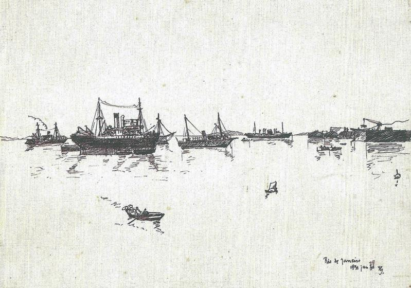
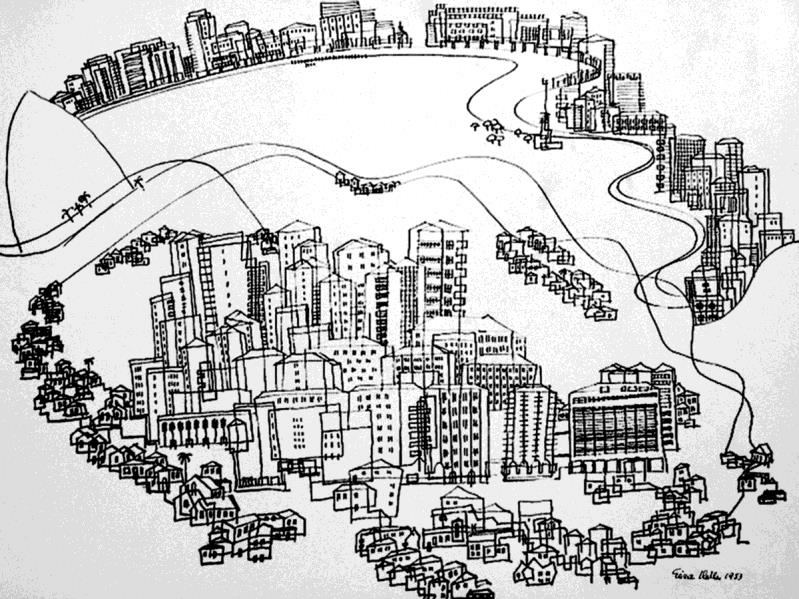
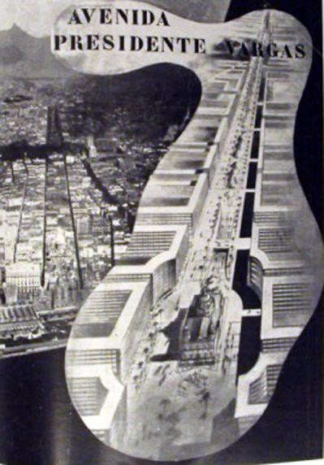
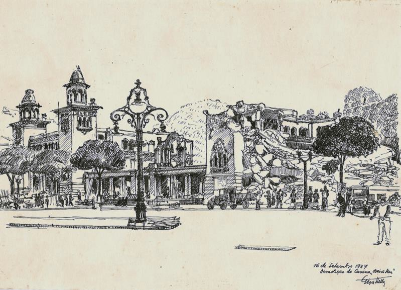
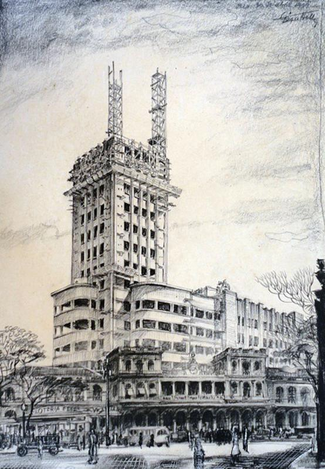
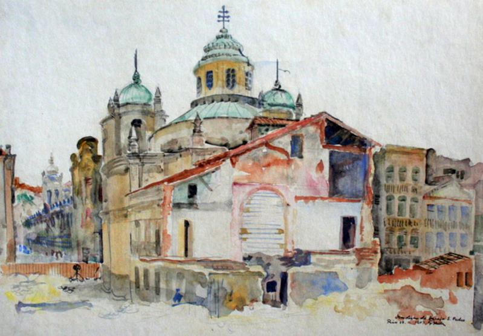
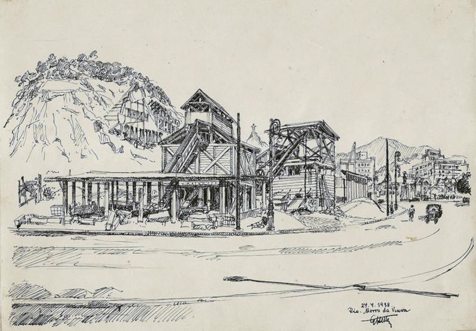
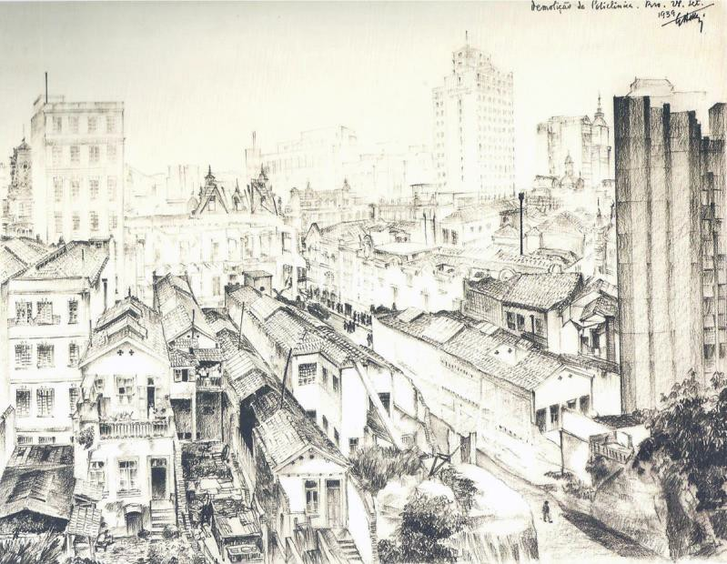

# Resumo

Pretende-se aqui investigar aspectos da representação pictórica e sua
relação com a cidade moderna, através da obra do artista e arquiteto
húngaro Géza Heller, imigrado para a cidade do Rio de Janeiro em 1935. O
artista produziu dezenas de grafites, bicos de pena e aquarelas que
registram importantes transformações da cidade, como a demolição do
casario às abas do Morro do Castelo, a construção dos edifícios da nova
Esplanada, a demolição da primeira geração de edifícios da Avenida
Central para sua verticalização, a demolição dos edifícios do Largo da
Carioca e das quadras que deram passagem à Avenida Presidente Vargas,
entre outros. Registra também a construção de importantes monumentos
modernos, como o edifício do Ministério da Educação e Saúde e a Estação
Central do Brasil, da qual é co-autor. Sua obra é, desta forma, um campo
privilegiado para os estudos relativos à memória da cidade, e às
transformações urbanas, que podem ser estudadas não apenas através de
seus temas, mas igualmente de seu traço. No contexto da nova onda de
transformações urbanas por que passa a cidade do Rio de Janeiro, a obra
de Géza Heller, recentemente divulgada por uma exposição no Parque das
Ruínas, demonstra sua atualidade. Investigando-a à luz de conceitos de
Argan e Boyer, nos sentimos pressionados a rever nossa relação com a
cidade e sua história.

Palavras-chave: Géza Heller, Rio de Janeiro, representação, modernidade,
memória, paisagem urbana

# Abstract

The present article intends to investigate aspects of pictorial
representation and its relation to the modern city, through the work of
Hungarian artist and architect Géza Heller, who immigrated to the city
of Rio de Janeiro in 1935. The artist produced dozens of graffiti,
nozzles pen and watercolors that record important changes in the city,
such as the demolition of the houses to the flaps of the "Morro do
Castelo", the construction of new buildings at the Esplanade, the
demolition of the first generation of buildings at Central Avenue to its
verticalization, the demolition of buildings at "Largo da Carioca" and
at the blocks that gave way to the Presidente Vargas Avenue, among
others. Heller also registers the construction of important modern
monuments such as the Ministry of Education and Health of Brazil (MES)
and the Central Station buildings, of which the last he is co-author.
His work is thus an ideal instrument for studies on the city's memory
and urban transformations, which can be investigated not only through
its themes, but also through his techniques. In Rio de Janeiro's new
wave of urban transformations, the work of Géza Heller, released
recently by an exhibition at "Parque das Ruínas", demonstrates its
relevance. Investigating it at the light of concepts of Argan and Boyer,
we feel pressured to review our relationship with the city and its
history.

Keywords: Géza Heller, Rio de Janeiro, representation, modernity,
memory, cityscape

# Introdução

"Qualquer que seja a sua antiguidade, a obra de arte ocorre como algo
que acontece no presente." G. C. Argan

Este trabalho pretende analisar registros do espaço urbano feitos pelo
arquiteto, desenhista e pintor húngaro Géza Heller, nas décadas de 1930
e 1940, no Rio de janeiro. Parte-se do princípio que o artista, um dos
poucos a se dedicar à temática do espaço urbano e das transformações da
cidade neste importante período de modernização, traduziu, tanto em seu
traço quanto no tema das obras, questões referentes à modernidade
urbana, à memória e à cidade como obra de arte.1 Procuramos investigar
as três camadas que, segundo Argan (1998, p.29), conformam uma obra: as
noções culturais do artista, em sintonia com a sua sociedade; as
habilidades técnicas e representacionais, que se relacionam com seu
fazer

profissional; e a contribuição pessoal do artista.

# O artista

O arquiteto húngaro Géza Heller chegou para fixar residência no Rio de
Janeiro em 1935. Getúlio Vargas já ensaiava seu golpe, e impunha grandes
transformações à cidade. Para levar seu plano de modernização adiante,
implementaria a ditadura do Estado Novo, regime certamente familiar ao
artista europeu, que fugira da Europa do entre-guerras.

Heller formara-se, em 1921, na Escola Superior de Arquitetura de
Budapeste, onde seu irmão mais novo não pôde se matricular devido à lei
que limitava as vagas para judeus. Dez anos depois, devido a esta e
outras leis que indicavam a proximidade da faxina étnica nazista,
embarcou num navio rumo à Montevidéu, onde alguns amigos já residiam.
Desta viagem, existem diversos desenhos feitos a bordo, registrando o
próprio navio e os portos por onde passou: Rio de Janeiro (fig. 1) e
Santos. Segundo o artista, foi nessa passagem que se apaixonou pelo Rio
de Janeiro, aonde viria a fixar residência quatro anos depois.

> 1 "Portanto, ela \[a cidade\] não é apenas (\...) um invólucro ou uma
> concentração de produtos artísticos, mas um produto artístico ela
> mesma. (\...) a obra de arte não é mais a expressão de uma única e bem
> definida personalidade artística, mas de uma soma de componentes não
> necessariamente concentrada numa pessoa ou numa época." (ARGAN, 1998,
> p.73)
>
> 
>
> Figura 1. Géza Heller. Porto do Rio de Janeiro. Fonte: catálogo da
> exposição Géza Heller, 2012, p.16

Como não teve seu diploma imediatamente reconhecido no Brasil, Heller,
assim como diversos outros profissionais do leste europeu, acabou
empregando-se em escritórios de outros arquitetos imigrantes provindos
de países com mais "status" no Brasil, ou já residentes há algum tempo
na cidade. Assim, trabalhou ao lado do escocês Robert Prentice, do
húngaro radicado na cidade desde 1926, Adalbert Szilard, e do francês
Henri Sajous. Exímio desenhista, Heller era o responsável pelas
perspectivas de apresentação dos projetos. Seu agudo senso de observação
do ambiente construído se estende dos detalhes construtivos --
registrados nas muitas cadernetas que o artista levava consigo e onde
desenhava padrões, gradis, e encaixes -- ao ambiente urbano, que ele
registrou em desenhos a bico de pena e que também apareciam
contextualizando as grandes perspectivas de projeto.

Sua contribuição ao desenvolvimento dos projetos ainda não pôde ser
devidamente avaliada. Toda a produção é atribuída aos arquitetos
responsáveis, ainda que saibamos que Heller dirigiu o escritório carioca
de Sajous quando este fixou residência em São Paulo, a partir de 1944.
Apenas na bem documentada evolução do projeto da Estação Ferroviária
Central do Brasil podemos ter certeza da sua visionária capacidade
projetual. Mas esta capacidade de entender o movimento da cidade e
projetar o futuro só nos interessa, aqui, na medida em que complementa a
habilidade de tornar histórica a sua representação da cidade.

O acervo de Heller guarda algumas dezenas de bicos-de-pena, grafites e
aquarelas que retratam a cidade do Rio de Janeiro. Laranjeiras - onde o
arquiteto residiu até se mudar para a cidade mineira de Passa Quatro,
aos 85 anos -- e imediações, junto com o Centro, são os espaços que
privilegiou em suas representações. Alguns de seus registros foram
publicados na revista *Arquitetura e Urbanismo 2,* do Instituto de

Arquitetura do Brasil, o que demonstra a importância concedida a eles
pela classe dos arquitetos já naquela época.

Em 1942, Heller tornou-se aluno de pintura de Alberto da Veiga Guignard
e, já em 1943, expôs na primeira coletiva do grupo que ficou conhecido
como "Grupo Guignard". Ao longo da década de 1940, o interesse pela
cidade persistiu, e a

> 2 Encontramos reproduções nos números de setembro e outubro de 1938 e
> maio e junho de 1939.

pesquisa das técnicas pictóricas correu junto a seu empenho em
documentar as transformações da cidade. Ao final da década, os registros
*in loco* do ambiente urbano se tornam mais raros, embora sejam deste
período algumas de suas mais felizes traduções artísticas da cidade do
Rio de Janeiro. A obra apresentada na figura 2 é testemunho de como
Heller foi capaz de encontrar uma procedente intersecção entre a
linguagem da pintura moderna -- neste caso, a obra de Paul Klee - e a
paisagem da cidade.

> 
>
> Figura 2. Géza Heller. Sem título. Fonte: acervo pessoal de Sylvia
> Heller.

# A Cidade

De 1937 a 1945, o centro do Rio se expandiu em direção a um espaço
inexistente: para o mar, com os aterros; para o céu, com a
verticalização urbana; e para o lugar das antigas colinas do Centro,
demolidas quase todas porque estavam no caminho do "progresso". Sobraram
as colinas do mar do Valongo, lado de dentro da Guanabara, para onde a
cidade ainda não queria ir. Sobreviveram o morro dos poderosos
beneditinos, o Morro da Conceição (devidamente escondido pelo
"arranha-céu" *A Noite*) e os morros da Saúde, Pinto e Gamboa, a beira
mar, zona de prostíbulos e galpões que ficou reservada ao porto de
comércio.

A esplanada do Morro do Castelo e seu aterro adjacente começaram a ser
ocupados em 1930, de acordo com o Plano urbanístico de Alfred Agache.
Trabalhando no escritório de Henri Sajous, localizado no
recém-inaugurado edifício Nilomex, obra de Robert Prentice para a nova
esplanada, Heller registraria as transformações bem abaixo da sua
janela. Seus desenhos mostram a construção dos grandes ministérios, em
especial o edifício modernista do Ministério da Educação e Saúde, das
quadras planejadas e, também, os últimos dias da antiga arquitetura,
alojada nos resquícios do Morro do Castelo. Ao fundo, os marcos
verticais que começam a pontuar a cidade, e outros condenados ao
desaparecimento. Heller registra igualmente as transformações do Largo
da Carioca, ampliado em 1938, com as demolições da Imprensa Nacional e
do Hospital da Ordem Terceira da Penitência. Produz também desenhos que
mostram a demolição de dois grandes monumentos da arquitetura colonial,
destruídos para dar passagem à Avenida Presidente Vargas: a Igreja de
São Pedro dos Clérigos e a Igreja de Bom Jesus do Calvário.

A cidade sofria, desde a década de 1920, os reflexos de todos os
problemas trazidos pela industrialização: crescimento dos subúrbios sem
infraestrutura, deficiência na área de transportes, déficit
habitacional, gerando especulação do solo urbano e ocupações
irregulares. Prado Júnior encomendara ao urbanista Alfred Agache um
plano para solucionar os problemas da cidade, que não chega a ser
implantado, entre outras coisas, devido à Revolução de 1930. No entanto,
"a fórmula apresentada por Agache para a resolução dos problemas da
República Velha -- ou seja, a intervenção do Estado no processo de
reprodução da força de trabalho urbana -- se constituirá na mola mestra
do novo regime que Getúlio Vargas implanta no país." (ABREU, 1997,
p.90).

Aproveitando-se do enfraquecimento das oligarquias rurais, ao qual não
correspondeu imediatamente uma burguesia industrial e financeira
dominante, Getúlio Vargas fez valer seu projeto de modernização,
privilegiando os monumentos institucionais e os grandes eixos viários,
inspirados em Agache.3 À grande perspectiva da larga Avenida Presidente
Vargas (1942), correspondem a eletrificação da Central do Brasil (1935)
e

a abertura da Avenida Brasil (1946), que completavam o plano viário de
Getúlio. Mas a "drástica cirurgia" (LIMA, 1990) representada pela
avenida superestimou o desenvolvimento do centro. Na verdade, a década
de 1940 viu o crescimento de centros de bairro e o *boom* da zona sul. O
contido crescimento da área central pôde facilmente ser absorvido pela
Esplanada do Castelo e pela verticalização do eixo já constituído da
Avenida Central (ABREU, 1997, pp.114-115).

Desta forma, a enorme avenida permaneceu bem diferente das perspectivas
propagandeadas pelo governo e pelas firmas de engenharia e elevadores
elétricos nas revistas, em fotomontagens de maquetes mostrando o futuro
(fig.3). O futuro da Avenida Presidente Vargas, ladeada pelas grandiosas
fileiras de arranha-céus que o capital construiria, jamais se completou.
O futuro da Esplanada do Castelo, realização da utopia agacheana, se
veria ultrapassado antes da ocupação da décima quadra. Enquanto isso,
Géza Heller se preocupava em registrar as obras, resquícios,
trabalhadores, mudanças de plano. O artista apreendera o sentido do
moderno, e sabia que moderno não era o enclave estudado de Agache, mas a
cidade em seu movimento, em seu caminho para um futuro sobre o qual só
se poderia saber que mudaria a cada instante. Um futuro tão mais incerto
quanto mais se apagavam as marcas do passado.

> 3 Maurício de Abreu (1997, pp.113-114) destaca que "O Plano Agache
> havia sugerido a construção "de uma grande avenida de continuação do
> Canal do Mangue" que, exigindo a demolição de todos os prédios
> situados entre as antigas ruas General Câmara e São Pedro,
> "desembaraçaria a bonita Igreja da Candelária, que se inscreveria
> perfeitamente na sua perspectiva". Com pequenas modificações, a
> sugestão de agache foi implementada durante o Estado Novo."
>
> 
>
> Figura 3. Projeto da Av. Presidente Vargas, publicado na revista PDF
> de abril/1941. Fonte:
> <http://dc370.4shared.com/doc/-dGxYUmK/preview.html>

# A representação

O Rio de Janeiro foi a cidade que Heller adotou. Nela, e com ela,
desenvolveu suas habilidades e fez-se artista pleno, sem jamais retornar
à Europa ou tomá-la como referencial. A intensa relação que desenvolveu
com o Rio de Janeiro está registrada em seus desenhos, assim como uma
paixão numa série de cartas de amor. Com a prancheta e a pena, tateou a
cidade até inscrevê-la no mais profundo de sua memória. Ao invés dos
monumentos de praxe, preferia os becos, as obras, o movimento das ruas.
Seus desenhos não são registros de passeios de um turista, nem pesquisas
técnicas de um arquiteto. São a construção da memória afetiva de quem
escolheu o Rio de Janeiro para viver. Desenhando, Heller conheceu e
reconheceu a cidade. Desenhando-a, tornou-se carioca. Ao construir a sua
memória afetiva, construía também a memória histórica da cidade.

Para um imigrante, a criação de uma memória é também esquecimento, ou
superação de uma memória anterior. Talvez Géza Heller construísse assim
uma relação ambígua com sua própria memória. Ao fixar no papel momentos
de transformação da cidade, estivesse também desenhando seu próprio
movimento de transformação. E ao fazê-lo, deixava de lado a lembrança da
difícil experiência anterior.

> A relação entre memória e esquecimento pode-se objetivar num discurso,
> mas, para que a relação exista, deve também existir o documento capaz
> de dar à memória pelo menos a mesma força do esquecimento: o documento
> que se imponha como pilar da memória e que a memória tende,
> inevitavelmente, a rejeitar. (SARLO, 1997, p.41).

Seu traço e seus temas mostram a cidade em transformação. O esforço de
registrar este movimento traduz a consciência de que o moderno não é só
tecnologia, mas também história. Enquanto os modernistas do novo
continente se entendiam como

fundadores de uma história artística,4 Heller preocupava-se em registrar
cada documento pretérito em sua agonia. Por isso sentou-se à frente da
demolição do teatro e do cassino do Passeio Público (fig. 4). Enquanto
os cariocas comemoravam o fim do "emplastro pretensioso"5 que durara
apenas quinze anos, Heller reconhecia o

documento que, a despeito de méritos formais, constituía um capítulo da
história da cidade. Sem ele, como seria o moderno parte desta história?
Argan (1998, p.74) destaca a "artificiosa concentração da historicidade"
nos centros antigos das cidades, enquanto as novas construções modernas
são consideradas desprovidas de historicidade.6 Exatamente porque
compreende a historicidade do moderno, Heller pode ser, a um só tempo,
um documentarista e um projetista, pode valorizar cada

documento do passado, e ainda assim projetar uma nova arquitetura para o
futuro.

> 
>
> Figura 4. Géza Heller. Demolição do Cassino Beira-Mar. Fonte: catálogo
> da exposição Géza Heller, 2012, p.31

Seu interesse pela cidade moderna, que não é a cidade acabada ou ideal,
mas a "cidade do devir"7, traduz-se na técnica rápida dos registros em
bico de pena e, porque não dizer, no maior monumento saído de sua
prancheta: a grande torre do relógio da Estação Central do Brasil. O
grande relógio, de frente para a avenida expressa e a estrada de ferro
mais movimentada do Brasil, marca para a cidade a instauração de um novo
tempo -- e o desenho de Heller, onde se justapõem a antiga e a nova
estação deve ser lido neste sentido (fig.5). Trata-se de uma imagem em
que passado e presente convivem momentaneamente, uma alegoria da
transformação

> 4 Argan (1998, pp.60-61) demonstra como os artistas americanos, "de
> Dewey a Langer e Arheim" subestimavam a gênese histórica da arte,
> "afirmando seu caráter individualista, de experiência criadora
> autônoma". Podemos estender esta ideia ao movimento modernista no
> Brasil.
>
> 5 "O jornal *A Noite* comemorou o fim do emplastro pretencioso e
> floreado", cujo projeto mesclava elementos ecléticos e neocoloniais".
> (PREFEITURA \..., 2012, p.30).
>
> 6 Caberia destacar a primazia das instituições patrimoniais
> brasileiras ao reconhecer o valor histórico dos monumentos modernos,
> embora os tombamentos iniciais se referissem a obras isoladas, e não a
> conjuntos urbanos.
>
> 7 "a cidade moderna contrapõe-se à antiga exatamente na medida em que
> reflete o conceito de uma cidade que, não tendo uma instituição
> carismática, pode continuar a mudar sem uma ordem providencial e que,
> portanto, exatamente a sua mudança contínua é representativa (\...)."
> (ARGAN, 1998, pp.74-75).

moderna:

Cada discurso define uma ordem espacial, uma imagem congelada que
captura o modo pelo qual o presente transitório é percebido.
*Momentaneamente apreendendo forças destrutivas e energéticas*, as
formas representacionais se tornam registros sucintos do que
consideramos ser a realidade do presente. Estes modelos estéticos
transformam nosso senso do real, pois a imagem da cidade é um conceito
abstrato, uma forma construída imaginária.8 (BOYER, 1996, p.31, grifos
nossos).

> 
>
> Figura 5. Géza Heller. Sem Título. Fonte: catálogo da exposição Géza
> Heller, 2012, p.75

Os registros do artista nos chamam ainda mais a atenção por serem
únicos, raros. A comoção que causou na opinião pública a demolição da
igreja setecentista de São Pedro dos Clérigos, para a passagem do leito
da Av. Presidente Vargas, era suposta ter inspirado mais registros
daquela arquitetura prestes a se perder.9 No entanto, são muito raros os
registros da pequena igreja que, em dado momento, encontrava-se isolada
numa esplanada ameaçadora, em ótima posição, no espaço e no tempo, para
ser registrada. As fotografias que se conhecem dela não somam uma
dezena, e, ao que tudo indica, apenas o artista húngaro sentou-se diante
de sua demolição para eternizá-

> 8 No original: "*Every discourse sets up a spatial order, a frozen
> image that captures the manner in which a transitory present is
> perceived*. *Momentarily arresting disruptive and energetic forces,
> representational formes become succinct records of what we consider to
> be present reality. These aesthetic models transform our sense of the
> real, for the image of the city is an abstract concept, an imaginary
> constructed form."*
>
> 9 Evelyn Furquim Werneck Lima (1990, p.39-40) registra a polêmica
> sobre a demolição e as ideias de transladá-la para outros locais,
> publicadas pelos jornais da época.

la (Fig. 6). Os pintores e desenhistas em seus ateliês, e os arquitetos
preocupados demais em projetar esqueceram-se de ver a cidade. Talvez não
fossem capazes de, olhando o furor de sua transformação, entender que
aquela era ela, a cidade, e que não existiria uma nova cidade,
petrificada para registro, em nenhum futuro mais além. Esperaram para
ver o que seria justo registrar, quando a transformação acabasse, mas
ela jamais acabaria. Para os artistas modernos brasileiros, a
experiência estética só poderia estar fora, ou além, da experiência
cotidiana. Não havia sentido em registrar a paisagem urbana que não
correspondia ainda ao ponto zero da história que se pretendia construir.
"A cidade real", como diz Argan (1998, p.74), "reflete as dificuldades
do fazer a arte, e as circunstâncias contraditórias do mundo em que se
faz".

> 
>
> Figura 6. Géza Heller. Demolição da Igreja de São Pedro. Fonte:
> catálogo da exposição Géza Heller, 2012, p.79

Géza Heller sabia que também a técnica era premida pelo tempo. O traço
muda com a cidade, e o registro não é só das obras em curso, ou do morro
a esvair-se, mas do traço sôfrego que, na velocidade emanada da mão,
reflete a velocidade que o artista intui e, ao contrário de querer
paralisar, como na foto, é mais um tema que ele representa. O valor
artístico do desenho de Heller está em superar o momento histórico em
que habita (a data), denunciando, em sua forma, o caráter, o clima e o
sentido contraditório de uma época que, querendo criar monumentos
perenes, testemunhava contra qualquer perenidade.

O traço rápido é o registro do trabalho de artista, enquanto registra
também o trabalho, contemporâneo e correlato, do operário. Ambos,
juntos, são o trabalho da cidade em sua trajetória histórica. Ambos,
tema e técnica, traduzem sensivelmente a aceleração do tempo moderno em
seu momento de paroxismo -- momento em que as coisas já quase não valem
como coisas, mas como símbolos desta aceleração. O traço de Heller
encontra-se exatamente neste ponto, em que o tema quase se perde na
velocidade do traço, em que quase deixamos de enxergá-lo para nos
admirarmos com o ponto a que o artista adequou sua técnica a fim de
captar o sentido do tempo.

A maior parte de seus registros a bico-de-pena comprova seu interesse
pela construção, pelas técnicas e o trabalho que só se vê no decorrer do
processo, do fazer. Quando registra a pedreira do Morro da Viúva
(Fig.7), pertencente à construtora Januzzi &Cia, Heller relega ao
segundo plano a imagem perene do Corcovado, e faz

da pedreira, com cujo granito se construíam os edifícios da nova
Esplanada do Castelo, o foco de sua representação. Seu tema era a cidade
em transformação e, para um arquiteto, a transformação é material. "A
cidade é uma construção", diz Argan (1998, p.75), "e o ponto de partida
de toda construção é a construtibilidade, antes de considerar a cidade
em relação a categorias estéticas, é preciso considerá-la em relação às
técnicas que a tornam não apenas concebível, mas projetada (\...)."

> 
>
> Figura 7. Géza Heller. Morro da Viúva. Fonte: catálogo da exposição
> Géza Heller, 2012, p.23

Seria preciso considerar ainda que o interesse de Heller pelas técnicas
que fazem mudar os processos e a arte também é evidente em sua
experiência como pintor. O artista utilizou todas as técnicas do desenho
sobre papel (lápis, carvão, pastel oleoso, bico de pena, aquarela,
guache), experimentou a gravura e a pintura sobre diversos suportes,
além de ter criado uma técnica especial de monotipia (PREFEITURA\...,
2012, p.16).

Chama a atenção, no cômputo de suas obras, a insistência e esmero com
que registra os antigos sobrados que avistava da janela do escritório de
Henri Sajous, no edifício *Nilomex*, recém-inaugurado na esplanada do
Castelo. Os pequenos sobrados, antes às abas do Morro do Castelo,
aparecem ilhados entre a Avenida Rio Branco e a nova Esplanada, e
ostentam o abandono de quem vê próximo o fim. Essa melancolia e a
lembrança de um tempo mais duradouro não passam despercebidos a Heller,
que faz deles alguns de seus registros mais minuciosos, onde vemos
roupas ao varal, pessoas conversando nos quintais e pequenos pássaros
que ainda procuram o morro que se foi (Fig.8).

> 
>
> Figura 8. Géza Heller. Demolição da Policlínica. Fonte: catálogo da
> exposição Géza Heller, 2012, p.39

# Representação e História

Os registros de Heller são um documento imprescindível para entender a
cidade. Ela aparece neles com toda sua complexidade. Em seus desenhos se
juntam pontas de fios históricos que nunca aparecem unidos nos registros
oficiais, e o sentido artístico da cidade, que só pela própria arte pode
ser essencialmente traduzido. É através deles que podemos construir a
história visual da cidade, compreender retalhos de tecido urbano e
remontar utopias. Mas, principalmente, é através deles que a história da
arquitetura e do urbanismo pode se inserir no seu campo de
pertencimento, que é o da história da arte.

A diferença entre um registro como o de Heller e uma imagem comercial da
cidade, é a mesma que separa a arte da informação. Ao invés da obra
aberta às interpretações presentes, uma falsa certeza; ao invés do
movimento, o produto:

> O que a cultura tecnonocientífica atual quer substituir ao
> probabilismo histórico ou à busca da verdade é a oferta da informação
> exata, incontestável, imediata (\...) que podendo ser verificada, não
> é suscetível de crítica e de demonstração e que, mal deixa de ser
> notícia, precipita-se num passado sem fundo e sem medida, perdendo
> todo significado (ARGAN, 1998, p.28).

Hoje, que o Rio de Janeiro passa por transformações de semelhante monta,
que artista as registra? Que traço pode apreendê-las, ultrapassando a
autoridade dos *posts* em redes sociais como documentos complexos do
novo devir? A quem interessará o trabalho alienado dos milhares de
operários que, ao não saber o que estão fazendo, estão construindo a
cidade? A quem interessará as contradições entre as montagens (agora
computadorizadas e animadas) que a prefeitura apresenta nos vídeos do
metrô e a cidade real? A quem interessará os contrastes que só aparecem
no movimento da mudança?

A relação orgânica com os espaços da cidade foi atropelada pela
velocidade, pelas imagens, pela inexistência das relações interpessoais
e históricas no espaço urbano. O

registro afetivo, pelo qual o artista apreende a cidade, foi
definitivamente substituído pelo simulacro: pelo clique que abole o
mundo fora do quadro, pela ilusão em três dimensões, pelo passeio
virtual dos aplicativos de internet.10

Uma vez que o sentido de arte e história se perdeu para os arquitetos,
talvez não tenhamos, depois dos grandes eventos, documentos como os de
Heller para estudar. Todos os registros terão sido produzidos pela
imprensa oficial, pelo mercado imobiliário ou pelas Instituições
promotoras dos eventos, excluindo da historiografia a cidade real. Os
arquitetos e historiadores da cidade terão que levantar camadas e
camadas para enxergar o que estava bem a sua frente. Alienados tanto dos
princípios da história quanto dos princípios da realidade construtiva,
os arquitetos terão perdido o direito à sua cidade\...

# Referências bibliográficas

> ABREU, Maurício de. *Evolução Urbana do Rio de Janeiro*. Rio de
> Janeiro: IPLANRio, 1997. 3ª Ed.
>
> ARGAN, G.C. *História da Arte como História da Cidade*. São Paulo:
> Martins Fontes, 1998.
>
> BAUDRILLARD, Jean. *Simulacros e Simulações*. Lisboa: Relógio D'Água,
> 1991.
>
> BOYER, Christine. *The City of the Collective Memory: It's Historical
> Imagery and Architectural Entertainments*. Cambridge: MIT Press, 1996.
>
> LIMA, Evelyn F. W. *Avenida Presidente Vargas: uma drástica cirurgia*.
> Rio de Janeiro: Secretaria municipal de Cultura -- DGDC, 1990.
>
> PREFEITURA DO RIO DE JANEIRO / CABBET Produções. *Géza Heller -- um
> carioca sonhador*. (catálogo da exposição). 2012.

SARLO, Beatriz. A história contra o esquecimento. *Paisagens
imaginárias***.** org. Sérgio Miceli. São Paulo: EDUSP, 1997.

> 10 "Hoje a abstração já não é a do mapa, do duplo, do espelho ou do
> conceito. A simulação já não é a simulação de um território, de um ser
> referencial, de uma substância. É a geração pelos modelos de um real
> sem origem nem realidade: hiper-real. O território já não precede o
> mapa, nem lhe sobrevive. É agora o mapa que precede o território --
> precessão dos simulacros -- é ele que engendra os territórios cujos
> fragmentos apodrecem sobre a extensão do mapa." (BAUDRILLARD, 1991,
> p.8).
