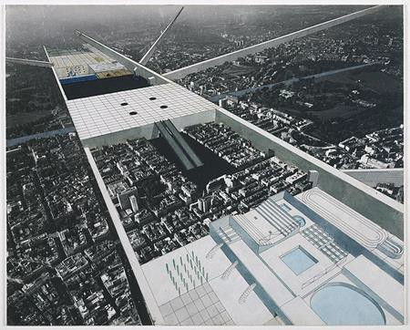
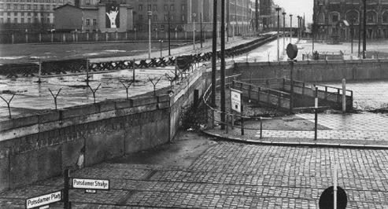
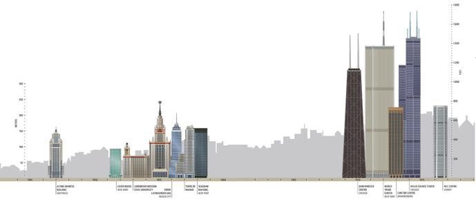
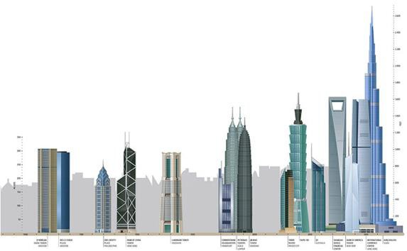
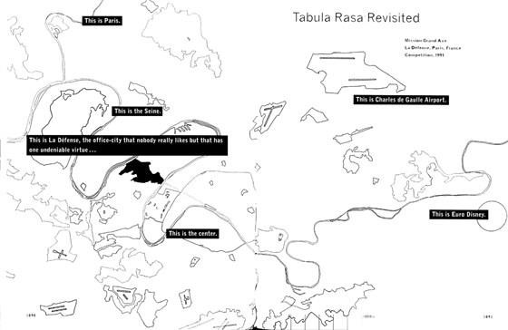
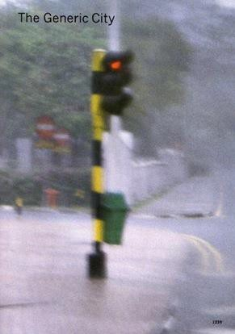

# Resumo

As transformações das últimas décadas demonstram que a revolução
informacional interferiu na organização das cidades, devido ao impacto
dos sistemas de fluxos e redes, quanto à infraestrutura bem como as
ideias de caos e fragmentação. O adensamento das cidades e seu
crescimento exponencial, verificado a partir dos anos 1970, corroboraram
para o aparecimento de uma série de discursos. Estes, por sua vez,
concorrem para a redefinição epistemológica de cidade, tendo em vista os
fenômenos que incidem sobre sua tessitura. Não apenas em relação às
mudanças de infraestrutura, escala e crescimento demográfico e
populacional tornaram-se temas recorrentes para os estudos urbanos, pois
somam-se também a consciência da cidade em partes, ou seja, a inserção
de diversas dinâmicas em um único território. Ações preservacionistas
também ocorrem como estratégia para a reinserção de centros históricos e
de áreas obsoletas, como antigas zonas fabris e portuárias no circuito
mundial. Nesse contexto, houve, sem dúvida, uma transformação na
fisionomia urbana em que se verificam imagens fragmentadas,
conformando-se palimpsestos e dilatação do território ocupado. São
paisagens pulsadas pelas socio-technological changes somadas às ações da
indústria cultural, especialmente vinculadas ao turismo. Fatos que
demandam novos desdobramentos de ocupação territorial, na qual a
arquitetura tem construído imagens distintas de épocas precedentes,
entremeando fluxos informacionais e atividades altamente especializadas.
Ocorrem novos conceitos e nomenclaturas para designar esses processos,
em que destacam-se: cidades globais, cidades genéricas, *junkscpace,
terrain vague*. Terminologias que visam compreender as feições que a
cidade contemporânea vai assumindo, mediante a formação de novos pólos
econômicos e a cristalização de áreas históricas, num jogo de
redefinição do mapa global de imagens midiáticas. Mediante os processos
citados, algumas reflexões acerca dos termos do arquiteto Rem Koolhaas
são apresentados, tais como *Bigness*, *generic city e junkspace*,
vislumbrando-se suas narrativas do espaço urbano.

**Palavras-chave:** Rem Koolhaas, cidade genérica, *junkspace,*
configuração territorial, redes e fluxos informacionais, discurso
profissional

# Abstract

Flows systems and network have been interfered the cities' organization
in the last thirty years, affecting its infrastructure, size and
people's concentration. Furthermore, ideas about chaos and fragment are
contributing to urban dispersion. Among urban theorists, Rem Koolhaas
establishes a set of metaphors when talks about the contemporary city
and its architecture. This is analysed by its scale, considering the
*bigness* instead the form-function for to characterizing the *generic
city*. Its architecture is immersed on the congestion culture: he
considers the urban dispersion and concentration adding informational
technologies as condition metropolitan and sociocultural to produce
architecture. Heritage urban interventions also have been contributing
to new spatial arrangements on the contemporary city. Historical areas
and obsolescence areas as industrial or harbour spaces have been
converting a cultural and tourist activities. There are sights which
were transforming because socio-technological changes and mass cultural.
Place new concepts and terminology to describe these processes, which
include: global cities, generic cities, *junkscpace*, *terrain vague*.
Aim to understand the terminologies that features the contemporary city
takes on, through the formation of new economic poles and
crystallization of historic areas, a game of redefining the global map
of media images. The afore mentioned processes show some reflections on
the terms of the architect Rem Koolhaas shown, such as *Bigness, generic
city and junkspace*, glimpsing their narratives of urban space.

**Keywords:** Rem Koolhaas, generic city, junkspace, territorial
configuration, networks and information flows, professional discourse

# Introdução

A cidade contemporânea tem sido tema de diversos estudos que se
multiplicaram a partir dos anos 1950. Período caracterizado pelo
questionamento, por diversas áreas de conhecimento, das premissas
modernistas, sintetizadas por Le Corbusier na Carta de Atenas1. Ao mesmo
tempo, observam-se diversos acontecimentos, notadamente as mudanças
técnico- informacionais que modificaram a configuração do planeta como
um todo, traduzida pelo aparecimento de um *continuum espacial*.

O processo de sedimentação histórica, sobre o qual se erigiram as
cidades ocidentais, foi fortemente abalado com o crescimento exponencial
da vida urbana decorrente de processos migratórios bem como a fundação
de cidades novas e remodelação de partes periféricas de cidades com o
protótipo de habitação social. A dilatação do tecido urbano culminou
numa outra espécie de aglomeração urbana e imputou aos estudos urbanos
uma reflexão: as metrópoles. Esta nova forma de aglomeração urbana
demanda estudos e reflexões que possam explicá-la e muitos são os
pesquisadores que se dedicam a essa tarefa.

Saskia Sassen (1991), David Harvey (1992), Milton Santos (1996), Rem
Koolhaas (1995), Manuel Castells (1999), Francesc Muñoz (2008), entre
outros fornecem importantes reflexões acerca dos ambientes construídos,
ressaltando aspectos da globalização como fatores incisivos na
reconfiguração e transformação das metrópoles. Isso porque, ao sofrerem
processos de desindustrialização e desregulamentação financeira há a
necessidade de novos padrões econômicos e relações de dependência que
também perpassam conexões cibernéticas em escala planetária.

No bojo da pluralidade de discursos reformuladores, ora exaltando a
tecnologia, ora enfatizando o caráter cultural e histórico do ambiente
construído, o campo disciplinar da arquitetura e urbanismo assistiu à
proliferação publicações cujo enunciado reporta-se à cidade, num embate
entre posturas nostálgicas, irônicas, proféticas que se aproximam de
referências à cidade tradicional ou à cidade do futuro.

Em sua maioria, os discursos estavam orientados por proposições de
outros campos de saber, tais como a linguística e o estruturalismo e,
ainda que tivessem propósitos distintos, permitiram uma análise da
configuração urbana, dos fenômenos e dos processos intrínsecos às
dinâmicas das cidades -- uma tentativa de apreender o real como elemento
de leitura e análise. Desse modo, mais que a forma da cidade,
colocava-se em debate seu conteúdo. Interessava aos discursos a dimensão
sociocultural, política e econômica: fenômenos indispensáveis para a
compreensão da tessitura metropolitana.

O reconhecimento desta conjuntura sociocultural permite estabelecer a
dialógica entre os inúmeros discursos, pois por meio da circulação de
enunciados críticos ao Movimento Moderno, houve a degeneração da sua
primazia e redução de seus questionamentos ao mero funcionalismo. Com
isso, o panorama do II Pós Guerra oferece às ciências humanas e sociais
aplicadas um arsenal de textos críticos abalando as convicções
iluministas de verdade absoluta e determinismo histórico. Estas posturas
apresentavam-se mais inclinadas à percepção do real do que uma
preocupação em elaborar modelos utópicos; ao contrário, aos discursos
dos anos 1960, interessava compreender a cidade enquanto organismo vivo:
objeto que se constrói ao longo do tempo, sujeito a modificações ante
aos fenômenos sociais, culturais, econômicos, políticos e, mais tarde,
ambientais, com a crise tecnológica do final dos anos 1970.

> 1 Apesar de ter sido elaborada em 1933, a Carta de Atenas fora
> publicada em 1943 (MUMFORD, 2002)

Ao longo dos anos 1980, houve uma mudança quanto ao enfoque do
planejamento urbano. As cidades, mergulhadas em sérios problemas de
ordem social e áreas obsoletas precisavam se reinventar ou se renovar
para impulsionar o crescimento via dinâmica econômica. Segundo Vázquez
(2004), posturas com tendências a um planejamento voltado para a
realidade urbana

-- conflitante e mutável, com ações e estratégias de menor prazo,
abandonando-se, em certa medida as influências marxistas nas teorias
urbanas, como fora o caso do grupo Tendenza. Houve, dessa maneira,
interesses comuns entre os setores públicos e privados, resultando em
intervenções nos centros históricos e áreas periféricas com novas
especialidades urbanas: imagens mediáticas.

Pensar, portanto, na cidade contemporânea e sua espacialidade é refletir
de que maneira os fenômenos urbanos deflagram outros conceitos e
representações. No campo da arquitetura e urbanismo, destaca-se Rem
Koolhaas (RK). Para o autor, as mudanças socioeconômicas perpassam a
constituição de um mundo artificial, iniciado em *Delirious New York
(1978)* até *The Generic City* (1995), em que são consideradas as
interferências da revolução tecnológica, à mudança de escala e as
relações entre arquitetura e cidade.

# Crise disciplinar e discursos sobre a cidade (1960-70)

Em arquitetura e urbanismo, o discurso do II pós-guerra prenuncia a
instauração da própria crise disciplinar e resulta num conjunto de
representações e formulações que constituem formações discursivas na
elaboração do panorama teórico dos últimos 40 anos. A insuficiência da
visão positivista e a retomada de uma posição mais humanista,
influenciada pela fenomenologia, pelo existencialismo e, de certo forma,
pelo estruturalismo, levaram à reformulação de conceitos no campo da
arquitetura e do urbanismo. Pode-se dizer que instaurou-se uma crise de
sentido da disciplina (NESBITT, 1996), em que pese a reformulação de
dogmas e fundamentos e a instituição de novos caminhos, como aqueles
preconizados pelos arquitetos mais jovens participantes do TEAM X.

O abalo sobre as convicções do projeto iluminista reflete-se, na
arquitetura e urbanismo, pelo deslocamento do interesse centrado no
objeto isolado para as relações que incidem no ambiente construído,
enaltecendo a paisagem urbana: conjunto de edifícios, espaços públicos,
unidades de vizinhança, entre outros elementos que alteram a
configuração territorial. Consideram-se também a cultura, a sociedade e
seus fenômenos como mediadores e/ou articuladores para a transformação e
configuração espacial das cidades, sob forte influência de novos métodos
de leitura e análise da cidade. A crise das ciências sociais e sociais
aplicadas reforça os novos caminhos definidos pelo paradigma
estruturalista: compreender a cidade como uma estrutura dotada de
elementos que podem ser lidos. Significa que a arquitetura e urbanismo
também se definiria por processos linguísticos. Apesar deste ter sido o
pontapé inicial para a reformulação teórica dos discursos da disciplina,
sua própria crise em meados dos anos 1960, levaria a dispersão de
posturas: algumas centradas no resgate da memória coletiva; aquelas
interessadas no poder comunicativo da arquitetura e do urbanismo; outras
que defenderiam a autonomia e experimentações formais e, por fim,
discussões vinculadas à multiplicidade cultural, ao caos e à
fragmentação.

O paradigma estruturalista e seu desdobramento pós-estruturalista, desse
modo, respaldou posturas e discursos no campo das ciências sociais e
sociais aplicadas, manifestados por uma fissura ao discurso
institucionalizado. Permitiu uma revisão epistemológica da arquitetura e
do urbanismo: de um lado, a colisão entre postulados e práticas acerca
de teorias urbanas, em que se destacam: *A arquitetura da cidade*, de
Rossi (1966); *Learning from Las Vegas*, de Robert Venturi (1972);
*Collage* City, de Colin Rowe (1978). E dominando parte dos debates
posteriores, como uma voz dissonante do viés historicista: Rem Koolhaas,
com *Delirious New York* (1978).

Aldo Rossi destaca-se como referência estruturalista ao propor métodos
de análise, leitura e interpretação da cidade fundamentados na crítica
tipológica. Apresenta a possibilidade do

pensamento analógico da memória, proposto por Carl J. Jung e com fortes
influências de Maurice Halbwachs. É possível perceber a influência em
Aldo Rossi, ao considerar as estruturas urbanas na longa duração
histórica e revelar os arquétipos da cidade, ou melhor, as estruturas
elementares mais ou menos vagas do *habitat* humano, definindo-se o
vocabulário das formas da cidade: as formas que permanecem na longa
duração histórica.

Já próximo à crise estruturalista, o discurso de Robert Venturi e Denise
Scott Brown (1972) corrobora para outra interpretação do tipo, numa
espécie de *reinvenção*: o pato e o galpão decorado que retratam a vida
metropolitana, em que ora a forma se sobrepõe ao espaço, estrutura e
função; ora a função se expressa como o sistema preponderante sobre os
demais. Uma crítica fundamentada nas interpretações da vida cotidiana,
distanciando-se do resgate da memória coletiva proposto por Aldo Rossi.
Venturi enaltece o interesse pela cultura popular, verificando os
complexos sistemas das cidades norte-americana, tais como o sistema
viário e os elementos comunicativos presentes nestes *strips.* Esta
visão de Venturi, conforme aponta Peixoto (2003), foi prosseguida por
Koolhaas, já aproximando-se da terceira fase estruturalista: o
pós-estruturalismo. Isso porque a proposta teórica de *Learning from Las
Vegas* desenvolve-se a partir da experiência do cotidiano, desvelando-se
o cenário dos anos 1970 em defesa das minorias silenciosas.

Outros livros também foram importantes, para esta primeira fase de
reação crítica aos dogmas modernistas, vislumbrando-se outros caminhos
para os discursos cujo tema central era a cidade. Em sua maioria
ressaltavam os aspectos linguísticos e uma espécie de gramática
arquitetônica, colimando em diversas análises e interpretações do espaço
edificado. No entanto, eram textos que ressaltavam as características da
cidade tradicional em detrimento da cidade moderna. Um dos livros que
antagonizam tais configurações espaciais é *Collage City* (1978), de
Collin Rowe e Fred Koetter, ao propor um método de análise do desenho
urbano por meio do formalismo analítico que a figura-fundo
possibilitaria. Suas análises revelam a necessidade de uma cidade de
colisão, isto é, a mestiçagem em diferentes configurações espaciais por
meio de colagem de fragmentos e utopias urbanas e sociais (MONTANER,
2007).

Há um prenúncio de diagramas analíticos das formas urbanas, revelando-se
dois tipos de estrutura de cidade: uma baseada no fundo, massa edificada
dos elementos urbanos cuja legibilidade é horizontal por meio dos vazios
ou reminiscência de uma ocupação densa -- a cidade tradicional e, por
outro lado, a autonomia da figura, vislumbrando-se a leitura vertical
por meio de arranha-céus, em que as funções se separam, com objetos
dispersos e isolados -- a cidade moderna, de ocupação rarefeita. Um
método dialético de análise da cidade, em que entremeia as formas
tradicionais e inovadoras do tecido urbano.

# Rem Koolhaas: escritos sobre a cidade

O panorama dos anos 1950-70 trouxe à tona uma reflexão crítica e novas
posturas teóricas, desdobrando-se em outros discursos nas décadas
seguintes (1980-2000). Neste contexto, destaca-se a figura de Rem
Koolhaas (RK) e suas publicações. Recém-formado nos anos 1970, RK
demonstrava interesse em explorar, por meio de textos e publicações,
suas impressões acerca da cidade, tendo como referência Ludwig
Heiberseimer 2 . Ao explorar temas arquitetônicos articulados com os
fenômenos metropolitanos, RK potencializa um corte nas formações
discursivas recorrentes no campo disciplinar, que tinha como principal
enunciado o resgate da história -- a visão retrospectiva que
caracterizam os primeiros textos críticos às utopias proscritivas.

Ademais o período de graduação (1968-1972), em arquitetura e urbanismo
na Architectural Association de Londres (AA) coincide com as revoltas
estudantis contra o sistema. O

> 2 Em entrevista a Colomina (2007) ao comentar sobre suas principais
> publicações, RK destaca a origem do termo *generic* a partir de
> Großstadtarchitektur, de Ludwig Hilberseimer (1927) em que aborda a
> cidade dos arranha-céus ao contrário do emprego de metrópoles.

ambiente acadêmico da AA favorecia a pesquisa entre estudantes e
professores 3 . Os estudantes exploravam as texturas complexas da cidade
e, mais tarde, ao se tornarem professores, buscavam estratégias
provocativas em relação aos modelos urbanos existentes.

Como aluno de Elia Zenghelis, RK
escreveu textos antecessores de *Delirious New York*, em 1972, já
exaltando as características da cidade moderna: *Berlin Wall as
Architecture* (1971), tornando-se importante referência para *Exodus, or
The Voluntary Prisioners of Architecture* (1972), publicado na Revista
*Casabella*. Outro importante ensaio que revelam as primeiras
experimentações de RK foi *Learning from Manhattan* (1972-74). Entre as
considerações destes artigos estão nos métodos de representação: a
colagem e a utilização de diferentes contextos para expressar os
elementos presentes na metrópole. Nos dois primeiros textos, RK ressalta
o Muro de Berlim como importante elemento arquitetônico, reforçando as
proposições do Superstudio e Archizoom e as investigações formais
recorrentes da época (fig. 1 e 2).

> 
>
> **Figura 1:** Muro de Berlim construído em 1961, demarca a divisão da
> cidade em duas partes. Um espaço residual e significativo da historia
> ociedental. Fonte: ROCCA, 2012.
>
> **Figura 2:** Proposta de Rem Koolhaas para Londres: inserção do Muro
> de Berlim e elementos da cidade modernista sobre o tecido tradicional.
> Vista Geral. Fonte: Gargiani 2008.

Em seguida, o terceiro texto evoca as qualidades da metrópole, já
desenvolvido no IAUS, tendo em vista escritos anteriores acerca da
cidade norte-americana. Um deles de Emilio Ambasz reiterava que a vida
norte-americana denotava a uma outra noção de cidade. O interesse pela
ilha de Manhattan se esboça na exposição do *International Institute of
Design* de Londres, realizada em 1971 (GARGIANI, 2008). A conferência
corroborou para que RK escrevesse *What do with Manhattan?* (1973),
publicado na revista *Architectural Design*. Estes eventos, somados aos
contatos com Colin Rowe e Oswald Mathias Ungers e à publicação de Robert
Venturi, que introduzira as observações às cidades norte-americanas,
contribuíram para que RK escrevesse seu primeiro e mais celebre livro:
*Delirious New York: a Retroactive Manifesto for Manhattan*, em 1978,
onde já prenunciava a transformação das cidades, dotadas pela
artificialidade norte-americana e seu poder de destruição criativa.
Ressalta-se nessa publicação a cultura da congestão e os aspectos da
metrópole, como o arranha céu, uma leitura vertical e não horizontal do
tecido urbano.

Ao abordar a intercambialidade e articulação entre diversos fenômenos do
qual a arquitetura e o urbanismo são parte integrantes, RK se aproxima
do pensamento pós-estruturalista de maneira tal a observar como tais
objetos, frutos de uma racionalidade e aparatos tecnológicos, conjugam e
possibilitam a organização do território, à medida que a cidade se torna
cada vez mais complexa e imensurável ao propagar-se num *continuum
espacial*. De certo modo, há uma busca por desvelar as estruturas
complexas -- no caso, a cidade e as diversas escalas que corroboram para
sua estruturação material e imaterial: uma rede de fenômenos na qual se
insere a vida cotidiana por meio de novos termos ainda não cristalizados
pelos discursos disciplinares.

> 3 Sobre Architectural Association (AA) disponivel em:
> [[http://www.aaschool.ac.uk/AALIFE/LIBRARY/aahistory.php]{.ul},](http://www.aaschool.ac.uk/AALIFE/LIBRARY/aahistory.php)
> acesso em 21/02/2014.

A revolução informacional e os arranjos econômicos do capitalismo tardio
vislumbram novos conceitos e abordagens referentes à ocupação urbana e
territorial, especialmente voltadas para as cidades que concentram os
fenômenos acima citados. Sob esse aspecto, são denominadas por
metrópoles, megalópoles, cidades mundiais ou cidades globais e, ainda,
cidade genérica. O termo cidade genérica (*generic city*) foi definido
por RK, ao elaborar uma espécie de catálogo da produção do seu
escritório *Office Metropolitan Architecture* (OMA), selecionando os
projetos a partir da escala de inserção no território, sendo seu segundo
livro de grande impacto: *S, M, L, XL* (1995). Assim como no livro
anterior, considera as interferências da revolução tecnológica
juntamente com a explosão das cidades, seja pelo seu tamanho ou pela
capacidade de concentrar pessoas, dotando a arquitetura de dimensões e
elementos midiáticos na transformação do território. Muito mais do que
pensar na dispersão e a concentração espacial, Koolhaas apresenta sua
leitura crítica de como a arquitetura se insere no contexto atual,
apontando novos conceitos e terminologias para se pensar a cidade, como

*junkspace4*, este definido como a arquitetura da cidade genérica. Termo
que ressalta a cultura consumista da sociedade técnico-informacional e
os artifícios de organização espacial pela lógica do *shopping center*,
reforçando o caráter genérico de alguns elementos metropolitanos, como o
aeroporto e a aniquilação dos centros históricos mediante a expansão e
adensamento da cidade. Uma rede de ideias que vão entrelaçando os textos
publicados entre 1972 e 2007.

# A cidade genérica: imagens embassadas ou não-figurativas

A cidade contemporânea alastra-se sobre as áreas rurais e/ou naturais,
dispersando-se e conglomerando distintas organizações espaciais,
principalmente, pela apropriação das áreas periféricas, dissolvendo as
bordas existentes cuja escala se propaga para além da territorial.

E, nesse contexto, muito mais que a escala, a arquitetura de grandes
dimensões, configurando- se, por vezes, como uma cidade dentro da
cidade, revelando-se o termo *bigness*, que para RK (1995) se refere ao
tamanho dos edifícios e sua ocupação intensa nas cidades, fenômeno que
ocorre em todo o globo, levando ao que ele define como cultura da
congestão. Ao relatar o aspecto das dimensões arquitetônicas (*Bigness
or the problem of Large, 1995)*, refere-se à complexidade presente na
arquitetura, uma vez que inúmeras descobertas propiciaram a introdução
de novas arquiteturas, especialmente quanto às infraestruturas. Isso
levou a uma arquitetura cada vez mais imponente e verticalizada,
culminando numa disputa pelo arranha- céu mais alto do mundo entre as
cidades historicamente consolidadas e as cidades emergentes no oriente
(fig. 3 e 4).

> 4 Texto publicado em 2001, em suas pesquisas na Universidade de
> Harvard Project on the City, volume 1.
>
> 
>
> **Figura 3:** Linha do Tempo de Arranha-Céus no mundo de 1945-1977.
> Fonte: Architecture Week, 2012.
>
> 
>
> **Figura 4:** Linha do Tempo de Arranha-Céus no mundo de 1980-2011.
> Fonte: Architecture Week, 2012**.**

A artificialidade e a verticalização das cidades já haviam sido
abordadas por Koolhaas em *Delirious New York* (1978) quando ele
demonstra o fascínio pelos arranha-céus -- estes como símbolo midiático
da ideia de progresso e modernidade para a configuração do *continnum
espacial* de atividades altamente especializadas recorrente nos últimos
30 anos. A partir dessa proposição sobre as mudanças substanciais das
cidades, seu olhar se desloca do centro para as periferias, onde a
constituição da metrópole ocorre de forma muito mais aleatória e livre
da rigidez do planejamento urbano. *Delirious New York* (1978) pode ser
considerado o pontapé inicial de suas especulações conceituais acerca
das transformações da cidade, buscando elucidar o cotidiano: de caos e
desordem que vivem em constante mudanças, fruto da própria dinâmica
socioeconômica do espaço urbano.

No livro *S, M, L, XL* (1995), Koolhaas apresenta suas propostas
arquitetônicas distribuídas e inseridas no mundo globalizado e
informacional. Os projetos são apresentados conforme a sua escala com
fragmentos de textos que abordam as diferentes soluções de projeto, para
diferentes escalas, em diferentes partes do mundo. É a produção do OMA
que se coloca como uma constante atividade de criação e destruição,
assim como já fora abordado no Manifesto sobre Nova Iorque: a cidade em
constante transformação. Para ele, a arquitetura é uma pequena parte de
uma paisagem dinâmica na qual está inserida. Na introdução ou
*Foreplays*, Rem Koolhaas revisa seus textos de 1972 e 1978, em que
denomina *Babel*. Em seguida, as obras do OMA são organizadas conforme
as quatro escalas: pequena, média, grande e extra grande, em que se
destacam alguns textos.

Um deles é *Bigness, or the problem of Large* (1995), no qual são
apresentados os desafios das dimensões arquitetônicas, destacando-se o
tamanho do próprio edifício, seja vertical ou horizontalmente falando,
tornando-se, em alguns casos, uma minicidade. São edifícios que se
corporificam a partir de um programa ideológico, independente da vontade
do arquiteto. É essa dimensão que, para RK, há a necessidade de um
manifesto, justificando o próprio texto.

Este texto é uma prévia do subsequente *The generic city (1995),* que
retrata a escala extra grande, culminando numa cidade sem identidade e
de ocupação numa escala territorial*.*

Rem Koolhaas define a arquitetura da cidade genérica como *junkspace*.
Uma arquitetura que 'engole' a própria cidade, sua artificialidade ao
extremo. Essas questões são lançadas pelas pesquisas realizadas na
Havard Design School Project on the City 5 (2001), em que os conceitos
da cultura da congestão e da cidade genérica são, de certa forma,
discutidos a partir de dados rreias, especialmente das cidades asiáticas
e das dinâmicas econômicas dos países em desenvolvimento.

> A partir do termo *Bigness 6* , a cidade torna-se cidade fragmentada,
> desordenada cuja concentração e integração é vista como uma tentativa
> de organização sistemática. No entanto, essa articulação, descortina a
> ideia da *" \[\...\] velha doutrina da forma-segue-a-função \[\...\]
> para o anticlímax do diagrama, duplamente frustrante, uma vez que sua
> estética sugere uma rica orquestração do caos. Nessa paisagem de
> desmembramento e falsa desordem, cada*

*atividade é posta no seu lugar.7" (*KOOLHAAS, 1995, p. 506*).* Ocorre
uma hibridização programática, em que as partes são articuladas de forma
independente, como consequência de uma constatação e revisão teórica dos
alicerces da arquitetura moderna, prestes a se esvair em prol das
experimentações que a realidade virtual simulada introduziu em meados
dos anos 1980: os processos diagramáticos -- conversão de dados do real
em estratégias de projetação. Ao mesmo tempo, RK enfatiza a obsessão dos
arquitetos pela mega-escala, mas que no entanto, não consideraram os
eventos sociais e econômicos que poderiam permitir uma reflexão teórica
desses elementos como problema inexorável da arquitetura contemporânea.
Isso porque a arquitetura deixa de desempenhar seu papel, tornando-se um
mero objeto em meio às transformações sócio-tecnológicas das últimas
décadas. Para RK, ocorre o anonimato da profissão, a perda da sua
dimensão heroica. O arquiteto passa a depender de outras forças para a
convalidação de sua arquitetura: a conectividade com outros campos de
conhecimento

e a rendição às tecnologias, que para ele é uma postura de neutralidade
e a inserção do *star system*, reduzindo-se a arquitetura às imagens
midiáticas de alcance global.

Esse panorama gera um novo tipo de cidade, cabendo a rua o papel de
resíduo, um dispositivo organizativo, imerso no plano metropolitano.
Local em que coexistem passado e presente e onde *Bigness* está presente
em todas as partes. Essa disseminação e seu caráter de complexidade
fazem com que *Bigness* se sobreponha à cidade, garantindo "\[\...\] a
generosidade do urbanismo contra a mediocridade da arquitetura". Isso
porque deixa de estabelecer uma relação com o contexto, permite explorar
a dimensão global da tábula rasa e se coloca como o "último bastião da
arquitetura". E, assim, se constitui o que RK denomina como *generic
city* (1995).

Cidade genérica destituída de identidade e memória, calcada na congestão
e densidade são algumas das características apresentadas por RK ao
narrar a cultura metropolitana. Cidades que se aproximam pela semelhança
entre si, onde o passado é demasiado pequeno frente ao crescimento
humano exponencial; onde a arquitetura como depósito da história perde
sua referência; onde a massa de turista se multiplica cada vez mais;
onde a identidade não existe mais. A cidade como um jogo de arquiteturas
espetaculares, de autoria dos arquitetos pertencentes ao star system,
num processo midiático e inseridas no *continuum espacial*
contemporâneo.

O mundo globalizado está repleto de tantas outras cidades como Atlanta,
cidades genéricas, semelhantes aos aeroportos, umas iguais às outras.
Sem identidade, sem história, sem

> 5 Essas pesquisas estão apresentadas nas seguintes publicações:
> *Project on the city: great leap forward (2001a); Project on the city
> 2: the Harvard design school Guide to Shopping. (2001) e Mutations
> (2001c).*
>
> 6 Este termo, entre tantos outros, verificados nos textos de Rem
> Koolhaas estão na língua original visto que a tradução pode modificar
> suas possíveis conotações enquanto metáforas vivas, aplicadas a
> explicar fenômenos não cristalizados.
>
> 7 Tradução nossa.

memória. Impera a artificialidade. Como o fim de um começo, o último
texto de *S, M, L XL*, intitulado por *The Generic City* (1995), é
antecedido por uma série de imagens embaçadas, em que se destacam
elementos de infraestrutura (semáforos, fios e arborização) em primeiro
plano, com silhuetas disformes de arranha-céus (figura 5). Imagens
capturadas de uma paisagem difusa, sob a ótica de alguém que não mais a
percorre como o *flaneur*, mas a observa de um ponto fixo: de dentro de
um edifício, de dentro de um carro ou de dentro do monitor.

Do mesmo modo, partilhar o passado nessa magnitude estratosférica é uma
proposta perdedora, como o caso de Paris que, em última instância, tem
sua área central histórica convertida em uma caricatura polida, uma
Hyper-Paris (figura 6), quando comparada às dimensões de sua área
periférica e os novos equipamentos aí instalados.

> 
>
> Figura 5: The Generic City. Fonte:
>
> Koolhaas (1995). Figura 6: Relação entre a área histórica em Paris
> \[em preto\] e as áreas
>
> periféricas, que são muito maiores. Fonte: Koolhaas (1995)

A cidade contemporânea, portanto, ao imprimir no território as dinâmicas
da sociedade informacional, promove uma mudança substancial em sua
dimensão e, ao mesmo tempo, na constituição de uma configuração sem
identidade própria. Os fenômenos de dispersão e concentração evidenciam
a mudança de escala em que passa-se a considerar a dimensão territorial
e não apenas a urbana. As imagens deixam de ser precisas e passam a
incorporar a dinâmica e a fugacidade própria desta nova forma de se
apropriar do território.

# Considerações Finais

*The Generic City* deixa bem claro que as mudanças das últimas décadas
consubstanciam a configuração da paisagem territorial, em que se releva
o consumismo como aporte principal na constituição do espaço urbano da
cidade contemporânea. E é o *junkspace* que retrata homogeneidade de um
espaço do acontecimento: flexibilidade extrema da parte interna, com ar
condicionado e elevador e a fachada lisa, do exterior. É o coágulo do
processo de modernização em curso constante. Isto é, o resíduo desta
mesma modernidade cambiante.

A infraestrutura ininterrupta contribui para a expansão do *junkspace*,
capaz de se adequar e adaptar-se a inúmeros programas arquitetônicos. Um
edifício que se aproxima da cidade, reproduzindo suas elementos, dotados
de artificialidade. Edifícios híbridos, com sobreposição e justaposição
de atividades, em que a forma e a função se dissociam e se impõem
verticalmente. É impossível revelar-se apenas pela fachada. Um espaço
condicional que se torna *junkspace* -- um híbrido contemporâneo. Não
obstante, deve-se pensar o espaço e não a arquitetura, sua
representação. Qualquer coisa, qualquer atividade pode ser adicionada e
incorporada a seu contexto. Uma compilação de iconografias de *"ordem
fingida e simulada,*

> *um reino de transformação morfológica".* E, portanto, sem identidade,
> sem memória, sem referências, tal qual a cidade genérica, uma
> hiper-realidade.

# Referências Bibliográficas

CASTELLS, Manuel. 1999. *A sociedade em rede*. A era da informação:
economia, sociedade e cultura. Editora Paz e Terra: São Paulo. v. 1.

> GARGIANI, Roberto. *Rem Koolhaas/OMA:* The Construction of Marveilles.
> EPLF Press: 2008.

HARVEY, David. *A condição pós-moderna*: uma pesquisa sobre as origens
da mudança cultural. Edições Loyola: São Paulo, 1992.

> KOOLHAAS, Rem. *Delirious New York*. Monacelli Press: Nova York, 1978.

. Bigness or the problem of the large. In: KOOLHAAS, Rem; MAU, Bruce.
1995. *S, M, L, XL.* Nova York: Monacelli Press.

. The generic city. In: KOOLHAAS, Rem; MAU, Bruce. 1995. *S, M, L,
XL***.** Nova York: Monacelli Press.

. The global city: introducing a concept and its history. In: KOOLHAAS,
Rem \[*et. al.*\]. 2001. *Mutations*. Actar: Barcelona. p. 104-115.

KOOLHAAS, Rem; MAU, Bruce. 1995. *S, M, L, XL*. Nova York: Monacelli
Press. MONTANER, Josep Maria. *Arquitectura y crítica.* Editorial
Gustavo Gili: Barcelona, 2007. MUÑOZ, Francesc. 2008. *Urbanalización*:
paisajes comunes, lugares globales. Barcelona: Gustavo Gili.

> ROSSI, Aldo. *Arquitetura da cidade (1966).* Editora Martins Fontes:
> São Paulo, 1996. ROWE, Colin; KOETTER, Fred. *Collage City.*
> Cambridge: MIT Press, 1978.
>
> SASSEN, Saskia. *As cidades na economia mundial.* Studio Nobel: São
> Paulo, 1998. VENTURI, Robert; SCOTT B., Denise. *Learning from Las
> Vegas*. Cambridge: MIT Press, 1972.

VÁZQUEZ, Carlos García. *Ciudad Hojaldre*. Editorial Gustavo Gili:
Barcelona, 2004.
