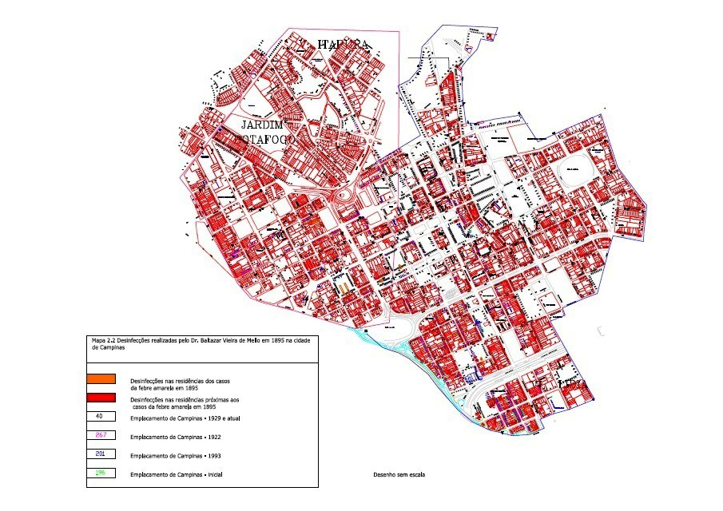

# Resumo

Este trabalho aborda o papel de profissionais que atuaram na gestão e
produção do espaço urbano no final do século XIX, no contexto de
políticas urbanas de controle sanitário exercendo um papel de
policiamento, como um estudo de caso da cidade de Campinas que foi palco
de intensas epidemias de febre amarela. Como estudo de caso,
apresentamos o papel do médico Balthazar Vieira de Mello e seu trabalho
de desinfecções na cidade de Campinas em 1895.

## Introdução

Entre 1889 e 1900 ocorreram grandes epidemias de febre amarela na cidade
de Campinas. Para além do tratamento dos doentes, a atuação das
autoridades sanitárias municipais e estaduais para o combate às
epidemias esteve pautada no saneamento do meio urbano. Dentre as medidas
profiláticas utilizadas pelos agentes sanitários, as desinfecções foram
largamente utilizadas nos períodos epidêmicos, na tentativa de eliminar
substâncias nocivas, que, ainda filiados à *teoria miasmática*,
acreditavam serem as responsáveis pela difusão das epidemias na cidade.

O médico Pedro Luiz Napoleão Chernoviz, no seu *Dicionário de Medicina
Popular*, publicado entre 1842 e 1890 (GUIMARÃES, 2005, p.501), define a
desinfecção como uma prática utilizada para eliminar substâncias nocivas
presentes no ambiente, roupas etc.:

> Operação por meio da qual se destrói as qualidades nocivas que o ar,
> as paredes de um quarto, a roupa ou qualquer objeto, adquirem por
> impregnação de substâncias mui tênues, de natureza múltipla,
> ordinariamente designadas pelo nome de miasmas, de emanações, de
> eflúvios etc. (CHERNOVIZ, 1890, p.825)

Da leitura do verbete *Desinfecção* do Dicionário de medicina popular do
Dr. Chernoviz, nota-se a filiação do médico à *teoria aerista*,
intimamente ligada à *teoria miasmática*, cuja concepção da forma de
propagação de doenças se dava através de substâncias nocivas no ar.
Apesar do dicionário do Dr. Chernoviz ter sido publicado pela primeira
vez em 1842, a na sua segunda edição de 1890 manter os mesmos conceitos
higienistas da metade do século XIX, não incorporando muitas das novas
concepções da bacteriologia, seria ainda de muita difusão no Brasil na
passagem do século XIX para o XX.

Os higienistas acreditavam que as doenças epidêmicas poderiam ser
causadas por uma série de fatores, como o ar, os miasmas, a água, o solo
etc., o que explica o apontamento de uma série de causas para as
doenças. Neste sentido, várias medidas também foram recomendadas e
adotadas pelos higienistas para combater as moléstias que eram difusas
nos centros urbanos no período.

> (\...) A eficácia das medidas, por falta de objetivos precisos, é
> muito rarefeita e o estilo de intervenção dos higienistas é na verdade
> caracterizado, sobretudo, por uma variedade de conselhos e remédios
> empíricos. (SALGADO, 2012, pp.5-6)

A difusão da prática das desinfecções no final do século XIX, como
medida

profilática no combate às epidemias, mesmo aquelas que ainda se
desconheciam as causas, estava justificada por esta concepção ampla dos
higienistas sobre a forma de combate às doenças epidêmicas.

## Desinfecções em Campinas

A prática das desinfecções em Campinas foi muito utilizada durante os
períodos epidêmicos, no intuito de combater a febre amarela, que em 1889
ceifou aproximadamente mil e duzentas vidas e em 1896 cerca de 800
outras1, e também

outras moléstias como a tuberculose e a varíola. Eram realizadas em
residências onde houvesse doentes ou óbitos por moléstias infecciosas;
ainda, em praças, hospitais, cocheiras, estábulos, escolas,
estabelecimentos comerciais, na estação ferroviária faziam a vistoria de
malas e bagagens etc. A prática da desinfecção foi normatizada em
legislação. O Código de Posturas de Campinas de 1880, no artigo 56,
estabelecia as condições para a realização destas práticas da
desinfecção:

> Art. 56. -- Em ocasião de epidemias ou quando lavrarem moléstias
> contagiosas, a câmara nomeará uma comissão que de acordo com peritos,
> determinará as medidas higiênicas a serem adotadas e o modo e o tempo
> de se fazerem as desinfecções pelas casas da cidade. (CÓDIGO DE
> POSTURAS DA CÂMARA MUNICIPAL DA CIDADE DE CAMPINAS, 1880)

O médico Dr. Thomas Alves Filho2, em 28 de novembro de 1893, comunicou
ao Intendente Municipal de Campinas Antonio Alvares Lobo, casos de
"febre palustre com forma tifoidica" e solicitou a desinfecção das
latrinas:

> Tendo-se dado que na casa da **Rua do Pórtico nº 126 quatro casos de
> febre palustre com forma tifoidica** é conveniente mandar desinfectar
> a latrina daquela localidade e pesquise da vizinhança se há algum foco
> que dê origem àqueles fatos.
>
> A pesquisa deve ser feita, devo lembrar-lhes, também **no fundo das
> casas compreendidas entre a Rua do Pórtico e a rua Dr. Costa Aguiar,
> enfim o quarteirão.** (REQUERIMENTO DE DESINFECÇÃO, 1893) **Grifo
> nosso.**

Além de solicitar a desinfecção, o Dr. Thomas Alves Filho ainda
solicitou que se fizesse uma pesquisa **nos arredores do local
mencionado**, para uma possível **identificação do "foco" da doença**.
Neste caso, o médico indicou a localização exata dos casos de febre.
Nesta passagem, pode-se observar a ideia da topografia médica, como um
instrumento de análise científica, utilizado, sobretudo por médicos,
para identificar e mapear as doenças que ocorriam nas cidades, visando
propor às autoridades sanitárias medidas de combate às moléstias que se
difundiam no meio urbano. No século XIX, ainda serviram como forma de
auxiliar os poderes públicos centrais a realizar intervenções
sistemáticas nas cidades, bem como criar leis de caráter sanitário, para
que as medidas propostas fossem cumpridas pela população,

> 1 Conf. SANTOS FILHO, Lycurgo de Castro. O autor aponta em seu estudo
> que não existem dados precisos sobre os mortos na epidemia de 1889,
> embora tenham sido registrados mais de 2.000 casos e cerca de 1.200
> óbitos. Na epidemia de 1896, foram notificados 1.700 casos e cerca de
> 800 mortos. (SANTOS FILHO, 1996, pp.137-143; 237-250)
>
> 2 Thomas Alves Filho (1856-1920). Médico, formado pela Faculdade de
> Medicina do Rio de Janeiro
>
> em 1881; foi médico do Hospital da Beneficência Portuguesa de
> Campinas; vereador da Câmara Municipal de Campinas de 1899 até 1901.
> (SANTOS FILHO, 1996, pp.76-7)

além de obras de saneamento -- água encanada e redes de esgotos.

O médico Dr. Thomas Alves Filho também solicitou a desinfecção da
latrina da casa, pois se acreditava que as emanações provindas das
latrinas e cloacas eram um meio de propagação de doenças e também porque
poderiam infectar o solo e a água. Para desinfectar esses locais,
Chernoviz recomendava que:

> (\...) É preciso destruir o gás hidrogênio sulfurado, de cuja presença
> despendem as propriedades mortais da atmosfera das latrinas.
> Obter-se-á este resultado pelas aspersões e projeções na cova por
> cloreto de cal e pela ventilação por meio de um fogo que dilate o ar
> da mesma, posta em contato com o ar externo por meio de um tubo.
> (CHERNOVIZ, 1890, p.826)

Segundo Lycurgo de Castro Santos Filho, em 1895, a febre amarela somente
se manifestou em Campinas de forma endêmica, apresentando apenas casos
esporádicos. (SANTOS FILHO, 1996, p.236) De qualquer forma, a medida
profilática da desinfecção era constantemente aplicada, como uma forma
de evitar novos surtos epidêmicos.

## O relatório do Dr. Balthazar Vieira de Mello

O médico Balthazar Vieira de Mello3 (1857-?) formado pela Faculdade de
Medicina do Rio de Janeiro em 1883, exerceu a medicina em São Paulo,
onde foi funcionário público. Foi o primeiro Diretor da Inspeção Escolar
Paulista (1911 até 1920), médico do Serviço de Higiene em São Paulo e
atuou em Campinas entre 28 de setembro e 5 de outubro de 1895, quando
empreendeu um trabalho sistemático de controle sanitário do meio urbano.

Um ofício enviado ao Intendente Antonio Alvares Lobo pelo então Diretor
Geral do Serviço Sanitário do Estado de São Paulo, Dr. Joaquim José da
Silva Pinto Junior, no dia 26 de setembro de 1895, informa o envio do
inspetor sanitário Dr. Balthazar Vieira de Mello à Campinas para
realizar o serviço de desinfecção, conforme requisitado pelo intendente:

> De acordo com a requisição do vosso ofício de ontem datado sob o nº
> 170, segue para essa cidade o inspetor sanitário Dr. Balthazar Vieira
> de Mello, que tenho o prazer de apresentar-vos, com seis
> desinfectadores e o material preciso para o serviço de **desinfecção**
> que, como **medida preventiva**, desejais, e julgo conveniente, que
> seja de novo **feita em todas as casas em que se deram casos de febre
> amarela**. (OFÍCIO nº 1268, 1895) **Grifo nosso.**

Cerca de 10 dias após a chegada da equipe em Campinas4, o inspetor
sanitário Dr.

> Balthazar Vieira de Mello, em 7 de outubro de 1895, enviou ao
> Intendente Municipal Antonio Alvares Lobo, um relatório denominado
> "*Sobre as Desinfecções Preventivas*
>
> 3 Disponível em:
> [[http://sbhm.webnode.com.br/news/balthazar-vieira-de-mello/]{.ul}](http://sbhm.webnode.com.br/news/balthazar-vieira-de-mello/)
> Acesso em: 28 fev. 2014. De acordo com Santos Filho, atuou em Campinas
> na primeira epidemia de febre amarela em 1889, e teria ido do Rio de
> Janeiro à Campinas por conta própria. (SANTOS FILHO, 1996, p.58)
>
> 4 "Ainda assim, tendo sido o serviço iniciado em 28 de Setembro,
> estava concluído em 5 de Outubro,
>
> dando disso conhecimento ao Dr. Intendente, e retirando-­‐me com todo
> o pessoal conforme vossa autorização prévia." MELLO, Balthazar Vieira
> de. *Sobre as Desinfecções Preventivas na Cidade de Campinas pelo Dr.
> Balthazar Vieira de Mello Inspector Sanitario*. São Paulo: 1895.
> Arquivo Municipal de Campinas.

*na Cidade de Campinas*", resultado do trabalho que realizou nas casas
da cidade onde ocorreram casos de febre amarela:

> (\...) assumi, naquela Cidade, a superintendência do serviço de
> [desinfecções preventivas]{.ul}, solicitadas pelo digno Dr. Intendente
> para as casas onde se deram casos de febre amarela, na última estação
> calmosa.
>
> Em harmonia com aquela autoridade, e tendo como guia uma **relação dos
> prédios contaminados** por ela fornecida, iniciei o serviço em 28 de
> Setembro último, havendo no dia antecedente percorrido **a zona mais
> compacta**, **que se constituiu propriamente em foco, de onde a
> moléstia se irradiou para outros pontos esparsos pela cidade**.
> (MELLO, 1895, p.1) **Grifo nosso.**

Neste relatório, Balthazar Vieira de Mello descreveu como foram
realizadas as desinfecções, sob sua responsabilidade:

> Para as desinfecções sistemáticas foi empregado exclusivamente o
> sublimado em soluções a dois por mil (2/1000), e para as instalações
> higiênicas os **sulfatos de cobre e de ferro e o cloreto de
> cálcio**5**.**
>
> As primeiras se fizeram em todo o prédio, quando este era de dimensões
> acanhadas, e anti-higiênicas, ou somente nos aposentos onde estiveram
> os doentes, na hipótese oposta, que também as houve.
>
> Num como noutro caso, procedia-se a irrigações amplas nas paredes,
> portas e solos friccionando simultaneamente dois pulverizadores,
> quando o espaço do prédio assim o permitia, ou alternativamente,
> quando o prédio se compunha de dois ou três aposentos, o que era a
> regra. (MELLO, 1895, p.4) **Grifo nosso.**

O inspetor também revelou as dificuldades enfrentadas durante o trabalho
das desinfecções, pela alteração da numeração das ruas6 ou por recusa
dos próprios moradores que não aceitavam que esta medida profilática
fosse realizada em suas residências:

> Nestas condições, o serviço teria sido concluído em menos tempo, se
> não fora a circunstância de se haver alterado a numeração das ruas e
> de terem-se recusado algumas pessoas, obrigando-se a recorrer à força
> pública, uma vez, e a longos argumentos \[ilegível\], outras vezes.
> (MELLO, 1895, p.4)

Balthazar Vieira de Mello também apresentou em seu relatório a relação
das casas onde foram realizadas as desinfecções sistemáticas, ou seja,
em todo o edifício, nos

> 5 O Dr. Balthazar Vieira de Mello descreveu o uso de "sulfatos de
> cobre e de ferro e o cloreto de cálcio", para a desinfecção das
> latrinas. No dicionário do Dr. Chernoviz, o sulfato de ferro é
> indicado como substância eficaz para neutralizar "(\...) as emanações
> das latrinas." (CHERNOVIZ, 1890, p.828)
>
> 6 Consta no acervo do Arquivo Municipal de Campinas o documento
> denominado *Emplacamento de*
>
> *1929*. Nele é possível verificar que a cidade recebera um novo
> emplacamento (numeração dos imóveis por ruas) no ano de 1929. Para tal
> trabalho foram registrados os emplacamentos anteriores da cidade dando
> as correspondências de cada imóvel: um denominado inicial, outro de
> 1893 e um outro ainda de 1922. Neste trabalho de emplacamento de 1929
> consta, portanto, a numeração dos imóveis existentes em todas as ruas
> da cidade nestas 4 datas. A necessidade de uma nova numeração em 1893
> correspondeu à implantação do sistema de coleta de esgoto e de dotação
> de água encanada nos imóveis pela Companhia Campineira de Águas e
> Esgotos. É possível que no momento em que o Dr. Balthazar Vieira de
> Mello recebeu a lista das casas onde deveria realizar as desinfecções,
> em setembro de 1895, a nova numeração de 1893 ainda não estivesse
> inteiramente atualizada nas ruas da cidade.
>
> locais onde o inspetor encontrou péssimas condições de higiene nas
> casas onde se deram casos de febre amarela, na última estação calmosa,
> conforme indicamos na tabela 1:
>
> Tabela 1. Relação das casas nas quais o Dr. Balthazar Vieira de Mello
> realizou desinfecções sistemáticas. As edificações cuja numeração foi
> destacada em **negrito** foram localizadas no mapa de Campinas (Figura
> 1.). Fonte: *Sobre as Desinfecções Preventivas na Cidade de Campinas
> pelo Dr. Balthazar Vieira de Mello Inspector Sanitario*. São Paulo,
> 1895. Arquivo Municipal de Campinas.

+------+----------------------+----------------------+-------------+
|      | > **Ruas**           | > **Números**        | > **Total** |
+======+======================+======================+=============+
| > 1  | > Aquidaban          | > 1, 3, 7, 15        | > 4         |
+------+----------------------+----------------------+-------------+
| > 2  | > **José Paulino**   | > **71, 77**, 115,   | > 11        |
|      |                      | > 121, 141,          |             |
|      |                      | >                    |             |
|      |                      | > 162, 193, **70**,  |             |
|      |                      | > 122, **130**,      |             |
|      |                      | >                    |             |
|      |                      | > **150**            |             |
+------+----------------------+----------------------+-------------+
| > 3  | > **General Câmara** | > **1**, 11,         | > 3         |
|      |                      | > (cortiço), **2**,  |             |
|      |                      | > 8                  |             |
+------+----------------------+----------------------+-------------+
| > 4  | > **Regente Feijó**  | > 9, 47, 97, 117,    | > 17        |
|      |                      | > 139,               |             |
|      |                      | >                    |             |
|      |                      | > 142, 153, 24, 174, |             |
|      |                      | > 192,               |             |
|      |                      | >                    |             |
|      |                      | > 196, 198, 200,     |             |
|      |                      | > 202,               |             |
|      |                      | >                    |             |
|      |                      | > 224, 226           |             |
+------+----------------------+----------------------+-------------+
| > 5  | > **José \[de\]      | > **36**, **58**,    | > 4         |
|      | > Alencar**          | > **92**, **134**    |             |
+------+----------------------+----------------------+-------------+
| > 6  | > **Conceição**      | > 6, 10, 81          | > 3         |
+------+----------------------+----------------------+-------------+
| > 7  | > **Irmã Serafina**  | > 26, 40             | > 2         |
+------+----------------------+----------------------+-------------+
| > 8  | > **Uruguaiana**     | > 3, 4, 5, 9, **21** | > 5         |
+------+----------------------+----------------------+-------------+
| > 9  | > **Visconde do Rio  | > **15**, **21**,    | > 7         |
|      | > Branco**           | > 33, 59, **40**,    |             |
|      |                      | > 50,                |             |
|      |                      | >                    |             |
|      |                      | > **104**            |             |
+------+----------------------+----------------------+-------------+
| > 10 | > **Senador          | > 10, 12, 14         | > 3         |
|      | > Saraiva**          |                      |             |
+------+----------------------+----------------------+-------------+
| > 11 | > General Osório     | > 85, 89, 93         | > 3         |
+------+----------------------+----------------------+-------------+
| > 12 | > América            | > 22, 42, 70         | > 3         |
+------+----------------------+----------------------+-------------+
| > 13 | > **Costa Aguiar**   | > 11, 49, 61, 79,    | > 11        |
|      |                      | > 83, 91,            |             |
|      |                      | >                    |             |
|      |                      | > 95, 101, 44,       |             |
|      |                      | > **76**, 88         |             |
+------+----------------------+----------------------+-------------+
| > 14 | > **Alvares          | > 55, 51, 61, 63,    | > 9         |
|      | > Machado**          | > 67, 20,            |             |
|      |                      | >                    |             |
|      |                      | > 66, 84, 134        |             |
+------+----------------------+----------------------+-------------+
| > 15 | > **Marechal         | > 34, **43**, 99     | > 3         |
|      | > Deodoro**          |                      |             |
+------+----------------------+----------------------+-------------+
| > 16 | > **Bom Jesus**      | > 23, 39, 41, 47,    | > 9         |
|      |                      | > 51, 59,            |             |
|      |                      | >                    |             |
|      |                      | > 69, 34, 83         |             |
+------+----------------------+----------------------+-------------+
| > 17 | > **Barão de         | > **73**, 96         | > 2         |
|      | > Jaguara**          |                      |             |
+------+----------------------+----------------------+-------------+
| > 18 | > **Dr. Quirino**    | > 25, 37             | > 2         |
+------+----------------------+----------------------+-------------+
| > 19 | > **Francisco        | > 117, **78**, 136,  | > 4         |
|      | > Glicério**         | > **150**            |             |
+------+----------------------+----------------------+-------------+
| > 20 | > **13 de Maio**     | > **17**, **19**,    | > 7         |
|      |                      | > 29, 39, 4, **40**, |             |
|      |                      | > **64**             |             |
+------+----------------------+----------------------+-------------+
| > 21 | > **Ferreira         | > 141, 143, 175,     | > 5         |
|      | > Penteado**         | > **187**, 104       |             |
+------+----------------------+----------------------+-------------+
| > 22 | > **Saldanha         | > 93, 113            | > 2         |
|      | > Marinho**          |                      |             |
+------+----------------------+----------------------+-------------+
| > 23 | > São Carlos (rua    | > 25, 37, 39, 59     | > 4         |
|      | > não encontrada no  |                      |             |
|      | > emplacamento de    |                      |             |
|      | > 1929)              |                      |             |
+------+----------------------+----------------------+-------------+
| > 24 | > **Barreto Leme**   | > 1, 84              | > 2         |
+------+----------------------+----------------------+-------------+
| > 25 | > **Benjamin         | > **51**, 54         | > 2         |
|      | > Constant**         |                      |             |
+------+----------------------+----------------------+-------------+
|      |                      | > **Total:**         | > 127       |
+------+----------------------+----------------------+-------------+

> As casas onde foram necessárias as desinfecções sistemáticas,
> localizadas na área mais adensada da cidade, se encontravam em
> precárias condições de higiene:
>
> Devo dizer-vos, como salvaguarda da responsabilidade desta Diretoria,
> que a quase totalidade dos prédios de que vos acabei de falar, exprime
> a mais completa negação das mais rudimentares condições higiênicas,
> circunstância que não pode deixar de ser um óbice de valia às
> vantagens profiláticas das desinfecções domiciliárias. (\...)
>
> Tal é, em parte, o que se pode esperar do emprego desse meio
>
> profilático em casebres destituídos de qualquer camada impermeável que
> os isole do solo e do teto; de paredes cobertas por grossas crostas de
> fuligem e de pó; em nível inferior ao do solo externo, **alguns
> havendo onde as águas de enxurradas penetram pelas portas dos quintais
> para despejarem nas ruas.** (MELLO, 1895, p.2) **Grifo nosso.**

Na observação de Vieira de Mello, sobre as "mais rudimentares condições
higiênicas" dos domicílios, muitos deles "casebres", a ideia da
impermeabilização do solo revela- se presente como método de combater a
propagação das epidemias.

Para o higienista, um "germe patógeno" poderia se propagar no solo
úmido:

> Quer isso dizer que a desinfecção do prédio já não atinge o germe
> patógeno, o qual encontrando um solo francamente permeável, ou sendo
> arrastado por correntes de água, emigram para outro local, onde pode
> permanecer incólume pulular, dadas as suas condições de vitalidade.
> (MELLO, 1895, pp.2,3)

Neste trecho Mello revela que mesmo se procedendo as desinfecções
frequentes, essa medida profilática não seria capaz de eliminar os focos
das epidemias, devido às condições precárias das habitações, sem a
ventilação e impermeabilização adequadas. As preocupações do médico
Balthazar Vieira de Mello sobre a falta de impermeabilização do solo
revelam sua filiação à *teoria localista* sobre a forma de propagação
das doenças.

A *teoria localista* (*boden theory*), cujo maior expoente foi Max von
Pettenkofer, com suas pesquisas sobre o modo de transmissão do cólera,
indicava o solo como fator determinante para a transmissão de doenças.
Para a eclosão de uma epidemia, eram necessários quatro fatores: o germe
específico, causador da doença, determinadas condições relativas ao
lugar, ao tempo e aos indivíduos. O germe, por si só, não seria capaz de
causar uma doença, excluindo, dessa maneira, o contágio direto, de um
indivíduo para outro. De acordo com Jaime Larry Benchimol, outros
fatores ainda eram associados à transmissão das doenças, segundo a
*teoria localista*:

> A suscetibilidade individual era importante, mas ela e o germe,
> sozinhos, tampouco engendravam a doença. As condições de tempo e lugar
> eram indispensáveis para explicar tanto os acometimentos como as
> imunidades, isto é, o fato de certos *períodos* e, ainda, certos
> *lugares*, permanecerem refratários. As variáveis sazonais e locais
> agiam principalmente sobre o germe, que amadureceria e se transformava
> em matéria infectante por efeito delas. (\...) Tanto a imunidade
> permanente de certos lugares como a temporária ou sazonal de outros
> deviam-se às características desse meio. Para que se desenvolvesse
> nele o germe (\...) tinha de ser poroso e úmido, isto é, tinha de
> conter uma proporção exata de ar e água. (\...) Além de possuir um
> grau adequado de umidade, tinha de ser mefítico, isto é, tinha de
> conter matéria orgânica em decomposição. Depositado aí com as dejeções
> dos doentes, o germe sofria um sazonamento, uma maturação, e adquiria
> a capacidade de provocar a doença ao reingressar no corpo humano.
> (BENCHIMOL, 1999, pp.279-80)

O médico também apresentou uma relação de outros locais onde foram
realizadas desinfecções nas instalações higiênicas, conforme indicamos
na tabela 2 "(\...) em

> prédios contíguos aos que se deram casos de moléstia infecciosa, ou de
> tal suspeita, sendo que em alguns quarteirões o serviço se estendeu a
> todas as casas, pois os quintais destas muitas vezes não eram murados
> (\...)" (MELLO, 1895, pp.3,4):
>
> Tabela 2. Relação das casas nas quais o Dr. Balthazar Vieira de Mello
> realizou desinfecções nas instalações higiênicas. As edificações cuja
> numeração foi destacada em **negrito** foram localizadas no mapa de
> Campinas (Mapa 1). Fonte: *Sobre as Desinfecções Preventivas na Cidade
> de Campinas pelo Dr. Balthazar Vieira de Mello Inspetor Sanitário*.
> São Paulo, 1895. Arquivo Municipal de Campinas.

+-----+-----------------------+-----------------------+-------------+
|     | > **Ruas**            | > **Números**         | > **Total** |
+=====+=======================+=======================+=============+
| > 1 | > **Aquidabam**       | > 5, 9, 11, 13, 19,   | > 9         |
|     |                       | > 2, 4, 6,            |             |
|     |                       | >                     |             |
|     |                       | > 8                   |             |
+-----+-----------------------+-----------------------+-------------+
| > 2 | > **José Paulino**    | > 113, 117, 119,      | > 14        |
|     |                       | > **123,**            |             |
|     |                       | >                     |             |
|     |                       | > 137, 139, **165**,  |             |
|     |                       | > **169**, **95**,    |             |
|     |                       | >                     |             |
|     |                       | > 99, 120, 124,       |             |
|     |                       | > **128**, **132**    |             |
+-----+-----------------------+-----------------------+-------------+
| > 3 | > **General Câmara**  | > **3**, 5, **7**,    | > 5         |
|     |                       | > **4**, 6            |             |
+-----+-----------------------+-----------------------+-------------+
| > 4 | > Regente Feijó       | > 11, 15, 19, 7, 135, | > 11        |
|     |                       | > 141,                |             |
|     |                       | >                     |             |
|     |                       | > 155, 128, 132, 194, |             |
|     |                       | > 204                 |             |
+-----+-----------------------+-----------------------+-------------+
| > 5 | > **José \[de\]       | > **34**, **38**,     | > 7         |
|     | > Alencar**           | > **56**, **60**,     |             |
|     |                       | > **94**, **132**,    |             |
|     |                       | >                     |             |
|     |                       | > **136**             |             |
+-----+-----------------------+-----------------------+-------------+
| > 6 | > **Conceição**       | > 4, 8, 12, 79,       | > 5         |
|     |                       | > **83**              |             |
+-----+-----------------------+-----------------------+-------------+
| > 7 | > Irmã Serafina       | > 28                  | > 1         |
+-----+-----------------------+-----------------------+-------------+
| > 8 | > **Uruguaiana**      | > **7**               | > 1         |
+-----+-----------------------+-----------------------+-------------+
| > 9 | > **Visconde do Rio   | > **13**, **17**,     | > 4         |
|     | > Branco**            | > **19**, 23          |             |
+-----+-----------------------+-----------------------+-------------+
|     |                       | > **Total:**          | > 57        |
+-----+-----------------------+-----------------------+-------------+

> A região da cidade na qual foram feitas a maioria das desinfecções
> pelo médico Balthazar Vieira de Mello, em 1895, fora considerada como
> a de maior intensidade de ocorrência da febre amarela em 1889, a qual
> possuía uma intensa ocupação urbana. Na Figura 1, apresentamos um mapa
> de Campinas no qual identificamos parte dos locais onde o Dr.
> Balthazar Vieira de Mello realizou as desinfecções nas residências
> onde se deram casos de febre amarela e nas residências próximas
> daquelas onde ocorreram os casos da doença. Para a elaboração desse
> mapa, utilizamos a referida planta cadastral de 2005 e consideramos a
> numeração da cidade de 1893 conforme consta no Emplacamento de 1929.
>
> A região da cidade na qual foram feitas a maioria das desinfecções
> pelo médico Balthazar Vieira de Mello, em 1895, coincide com aquela
> apontada no estudo realizado pelo Dr. Dafert como a de maior
> intensidade de ocorrência da febre amarela em 1889, ou seja, a Zona 1.
> Esta região possuía uma intensa ocupação urbana.
>
> 
>
> Figura 1. Mapa da cidade de Campinas no qual foram identificados parte
> dos locais onde o Dr. Balthazar Vieira de Mello realizou as
> desinfecções nas residências onde se deram casos de febre amarela e
> nas residências próximas daquelas onde ocorreram os casos de febre
> amarela.

# Conclusão

Como vimos, a prática das desinfecções foi muito utilizada em Campinas
durante o período delimitado para o nosso estudo de caso, entre 1880 e
1900, já determinada no Código de Posturas de 1880 e realizada pela
Intendência Municipal, especialmente nos períodos epidêmicos. A partir
de 1896, o serviço de desinfecções foi reforçado com a vinda da Comissão
Sanitária, que era formada por médicos e desinfectadores. Os agentes
sanitários acreditavam que essa medida, combinada com outras ações de
caráter profilático, era capaz de afastar as epidemias que se propagavam
na cidade. Neste período, ainda não havia consenso sobre a forma de
propagação da febre amarela, se por contágio, infecção e o convencimento
da comunidade científica sobre a transmissão da doença através do
mosquito *Aedes aegypti* somente ocorreu no início do século XX.

No relatório apresentado pelo médico Dr. Balthazar Vieira de Mello, em
1895, sobre as desinfecções realizadas na cidade, observamos que as
desinfecções sistemáticas, ou seja, em todo o imóvel, foram realizadas
em 25 ruas, correspondendo a 127 residências; e as preventivas, ou seja,
realizadas somente nas instalações higiênicas, em nove ruas, somando um
total de 57 residências. Ao analisarmos esse relatório, observamos que
as residências desinfectadas pelo Dr. Balthazar Vieira de Mello estavam
localizadas na mesma região apontada no estudo do Dr. Dafert -- entre o
cruzamento das ruas do Bom Jesus (atual Dr. Campos Salles), com a rua do
Theatro (atual José de Alencar). A região na qual o médico realizou as
desinfecções é também a mesma, na sua maior parte, onde os primeiros
casos de febre amarela em 1889 foram registrados. Segundo o próprio Dr.
Balthazar Vieira de Mello, "(\...) a zona mais **compacta**, que se
constituiu propriamente em foco, de onde a moléstia se irradiou para
outros pontos esparsos pela cidade." (MELLO, 1895, p.1) **Grifo nosso.**

## Referências bibliográficas

> BENCHIMOL, Jayme Larry. *Dos micróbios aos mosquitos: febre amarela e
> a revolução pasteuriana no Brasil*. Rio de Janeiro: Editora
> Fiocruz/Editora UFRJ. 1999. CHERNOVIZ, Pedro Luiz Napoleão.
> *Diccionario de medicina popular e das sciencias accessorias*. 6. ed.
> consideravelmente aumentada, posta a par da ciência. Paris: A. Roger &
> F. Chernoviz, 1890. 2 v. 1890. Volume 1: A a F e Volume 2: G a Z.

CÓDIGO DE POSTURAS DA CÂMARA MUNICIPAL DA CIDADE DE

CAMPINAS DE 1880. Disponível em:
[[http://www.al.sp.gov.br/repositorio/legislacao/resolucao/1880/resolucao-20-]{.ul}](http://www.al.sp.gov.br/repositorio/legislacao/resolucao/1880/resolucao-20-)
[10.06.1880.html]{.ul} Acesso em: 03 mar. 2014.

> GUIMARÃES, Maria Regina Cotrim. *Chernoviz e os manuais de medicina
> popular no Império*. História, Ciências, Saúde -- Manguinhos, vol. 12,
> nº 2 p. 501, maio-ago. 2005. Disponível em:
> [[http://www.scielo.br/pdf/hcsm/v12n2/16.pdf]{.ul}](http://www.scielo.br/pdf/hcsm/v12n2/16.pdf)
> Acesso em: 03 mar. 2014.
>
> MELLO, Balthazar Vieira de. *Sobre as Desinfecções Preventivas na
> Cidade de Campinas pelo Dr. Balthazar Vieira de Mello Inspetor
> Sanitário*. São Paulo, 1895. Arquivo Municipal de Campinas. Saúde --
> Caixa 3. Correspondências 1893-1915. Émile Daufresne e outros
> engenheiros da Câmara. Comunicado de vistorias. Relatórios. Vigilância
> Sanitária. Comunicado de vistorias (residências, escolas, comércio,
> linpeza de ruas, córregos) (1893-1915).

OFÍCIO nº 1268. São Paulo, 26 de Setembro de 1895. Enviado pelo Diretor
Geral do Serviço Sanitário do Estado de São Paulo Dr. Joaquim José da
Silva Pinto Junior ao Intendente Municipal de Campinas Antonio Alvares
Lobo. Arquivo Municipal de Campinas. Saúde -- Vigilância Sanitária --
Caixa 4. Documentos diversos. Correspondências (1893-1915). Fiscalização
-- Correspondência. Enviada pela: Comissão Sanitária (Dr. Emílio Ribas,
Theodoro Bayma, Octavio Machado). Comissão de Saneamento SP -- Campinas.
Diretoria do Serviço Sanitário e outros. Engenheiros da Câmara Municipal
(E. Daufresne) 1893-1915. Documento nº 0582/895.

REQUERIMENTO DE DESINFECÇÃO. Enviado pelo Dr. Thomas Alves Filho ao
Intendente Municipal de Campinas Antonio Alvares Lobo em 28 de Novembro
de 1893. Arquivo Municipal de Campinas. Saúde -- Caixa 3.
Correspondências 1893 -- 1903. Émile Daufresne e outros engenheiros da
Câmara. Comunicado de vistorias. Relatórios. Vigilância Sanitária.
Abaixo-assinado/ Processo/ Requerimento de desinfecção. Documento nº
0403/893.

> SALGADO, Ivone. *Urbanismo Sanitarista em Campinas no final do século
> XIX*. Projeto Integrado CNPq: *Evolução Urbana de Campinas*. Relatório
> Final. Campinas: PUC Campinas, 1992.
>
> SANTOS FILHO, Lycurgo de Castro e NOVAES, José Nogueira. *A Febre
> Amarela em Campinas 1889-1900*. Campinas: CMU/UNICAMP, 1996.
