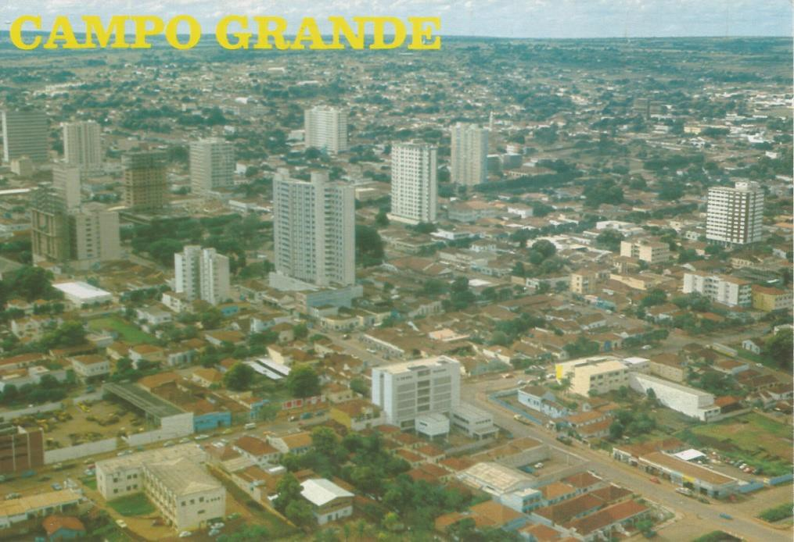
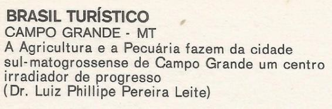
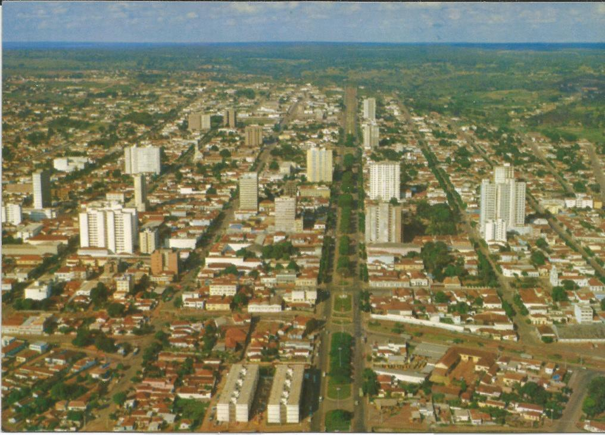
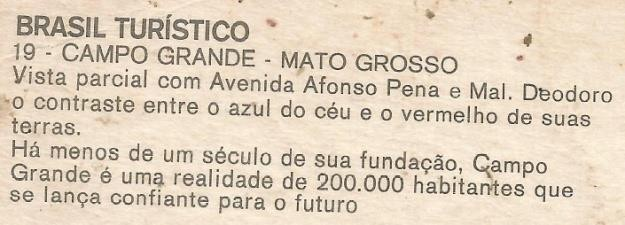
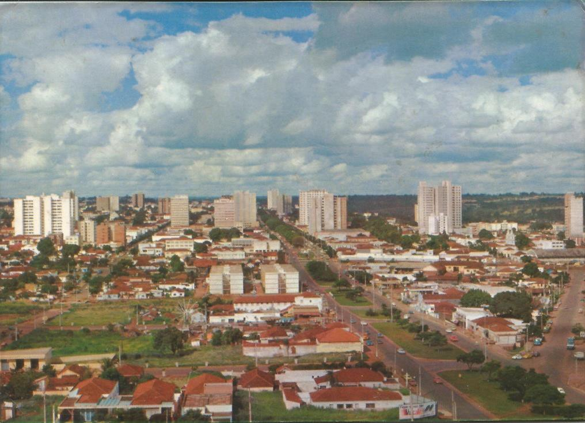
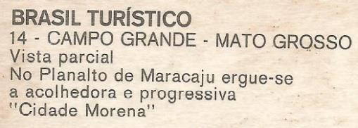

# Resumo

O cartão-postal, em sua tipologia mais recorrente, atua como um meio de
contribuição para o conhecimento e a propagação das cidades ao redor do
mundo, através de textos e representações imagéticas. Pensando nisso,
esse estudo propõe a leitura de três exemplares de postais fotográficos
de Campo Grande-MS, produzidos por volta das décadas de 1960 e 1970,
como uma forma de apreender o contexto histórico e espacial no qual a
própria cidade é inserida como tema e objeto de registro e, então,
identificar os ideais atrelados a suas expressões. Coloca-se, portanto,
a seguinte questão: o que se pode inferir da representação visual de
Campo Grande em cartões postais produzidos em um momento específico de
sua história? Para tanto, o artigo estrutura-se em três partes: a
apresentação dos atributos do postal dentro da configuração abordada,
com destaque para aqueles cujas ilustrações são fotografias; a
identificação de alguns sentidos que direcionam a realização da leitura
e interpretação das imagens; e a análise dos três postais, acompanhada
da breve contextualização histórica de Campo Grande, quanto à sua
formação urbana. Por fim, apontam-se algumas discussões, de forma a
contribuir para a assimilação de parte da história da cidade.

Palavras-chave: imagem, representação, cartões postais, Campo Grande

# Abstract

The postcard, in his most recurrent type, acts as a means of
contributing to the knowledge and the spread of cities around the world,
through text and image representations. In this sense, this study
proposes the reading of three photographic Campo Grande's postcards,
produced around the 1960s and 1970s as a way of apprehending the
historical and spatial context, in which the city is inserted as subject
and object registration, and then identify the ideals tied to their
expressions. Therefore, the following question is asked: what can be
inferred from the visual representation of Campo Grande on postcards
produced at a specific time in its history? So, this article is
structured in three parts: the presentation of the postcard's attributes
in this configuration, especially for those whose illustrations are
photographs; the appointment of some senses that orientate the image's
reading and interpretation; and the analysis of the three postcards,
combined by a brief historical contextualization of Campo Grande, as
regards its urban conformation. Finally, some discussions are pointed to
contribute with the assimilation of part of the city\'s history.

Keywords: image, representation, postcards, Campo Grande

# Introdução

A cidade, como um campo repleto de significações, cujas dimensões
envolvem-se em abordagens diversas, permite sua apreensão através de
variadas formas de representação, expressas em meios como a literatura,
o cinema e a fotografia. Na esfera das representações visuais, uma
ferramenta da comunicação manifesta-se como instrumento de análise da
imagem e fonte documental da cidade: o cartão postal.

Como recordação de viagem -- e, portanto, associado ao turismo-, a
tipologia atual e mais difundida dos postais apresenta a cidade como
tema de suas ilustrações, oferecendo imagens de monumentos, da
arquitetura, ruas, praças e avenidas. Essa concepção dos cartões,
conforme apontado por José Carlos Daltozo, deriva dos chamados "*Gruss
aus"* -- termo que em alemão significa "lembrança de"-, que surgiram na
Alemanha ainda no século XIX, como uma forma barata de recordação para
os turistas (DALTOZO, 2006).

À medida que se expõe como uma reprodução de suas feições, o postal
desempenha o papel de "retrato" da cidade, apresentando sua aparência
para quem está fora. Essa relação é reforçada pela qualificação dos
próprios edifícios, vistas ou monumentos como "cartões postais", quando
considerados marcos memoráveis de uma localidade. Trata-se, no entanto,
de um enquadramento em plano bidimensional que, por sua essência, não
abrange a urbe em muitas de suas dimensões concretas. Do mesmo modo, em
referência ao que já alertava René Magritte, sobre a diferença do objeto
para sua representação1, ainda na década de 1920, pode-se dizer que o
que se vê nas

imagens dos postais não é de fato a cidade, mas sua reduzida e
emoldurada impressão. Nesse sentido, é importante atentar-se para a
escolha de determinados aspectos dentro de recortes específicos, que
parecem direcionar a concepção do que se retrata.

A origem do postal remete à segunda metade do século XIX, quando se
oficializou na Áustria como uma alternativa econômica e prática para o
envio de mensagens. Sua difusão mais concreta ocorreu paralelamente à
incorporação da imagem no verso do texto, com típicas gravuras,
litogravuras e, pouco depois, a fotografia. Essa última, protagonista
das ilustrações dos postais atualmente - e também associada a outros
meios -, tornou-se um instrumento essencial para a divulgação da
arquitetura e da paisagem urbana naquele período e, mais notadamente, a
partir da primeira metade do século XX, com o crescimento da mídia
impressa.

Por meio da técnica fotográfica, e ao longo de seu aprimoramento,
difundiram-se imagens de inúmeras cidades, como Paris, Berlim e Nova
York, bem como suas obras arquitetônicas, que, então, tornaram seu
conhecimento acessível em toda a esfera internacional. De acordo com o
espanhol Ignasi Solà-Morales, essas imagens se fixaram na memória e na
imaginação do mundo, constituindo um dos principais veículos através dos
quais recebemos as informações que nos encaminharam ao conhecimento da
"realidade construída que é a moderna metrópole" (SOLÀ- MORALES,
2012:2).

Como uma ferramenta de rápida e fácil comunicação, a fotografia vem
desempenhando um papel informativo que, para além da ilustração,
consiste na difusão de conceitos e ideias que, sobretudo em conjunto, se
articulam na defesa de um discurso. Através dessa linguagem, uma
narrativa é construída dentro dos moldes da elaboração do produtor -- o
fotógrafo - com ângulos e realces, atuando, assim, como um mediador
entre o objeto retratado -- a cidade - e o receptor da imagem,
influenciando, de certa forma, sua compreensão.

Nesse contexto, podem ser tomadas de maneira elucidativa as imagens
produzidas pelo fotógrafo Guilherme Gaensly no século XIX, a respeito da
cidade de São Paulo. Boris Kossoy afirma que essas fotografias fazem
parte da proposta ideológica das

> 1 O artista belga René Magritte é o autor da famosa obra intitulada
> "Isto não é um cachimbo" (Ceci n'est pas une pipe), produzida no final
> da década de 1920, na qual, ironicamente, reproduziu fielmente em tela
> a imagem de um cachimbo. A obra lança uma reflexão sobre o papel da
> arte, afirmando que, por mais realista que seja, a imagem que se vê
> não é o objeto propriamente dito, mas sua representação.

elites da época, de apresentar uma imagem com atmosfera europeia e
moderna da cidade, fixando-a no imaginário coletivo. Ele afirma que:

> Essa ficção de uma nova identidade encontra na representação
> fotográfica o seu testemunho ideal. A imagem da Pauliceia circulou por
> meio dos cartões postais, álbuns, revistas e livros ilustrados
> contribuindo para reafirmar, nacional e internacionalmente, o perfil
> de cidade cosmopolita, parque industrial único no país, centro de
> atração e oportunidades (KOSSOY, 2011:17).

Guilherme Gaensly é conhecido também pela publicação de séries de
cartões postais de São Paulo, através dos quais propagou as imagens do
novo espaço urbano. Conforme Fernandes Júnior, o trabalho do fotógrafo
ressaltava a importância do café e da ferrovia na economia paulista, com
sequências de instantâneos que traçaram uma espécie de narrativa sobre a
cidade. "Assim mostra São Paulo como uma metrópole promissora e atraente
para os interessados em investimentos e progresso material" (FERNANDES
JUNIOR, 2011:41).

No contexto brasileiro, o cartão postal foi recebido com grande
aceitação já no momento de sua chegada, por volta de 1880. Encontrou o
país em um período de ufanismo e de brilho da *Belle Époque*, "de
transição de uma sociedade eminentemente agrária em seu anseio de
ingressar no ciclo industrial" (TENÓRIO, 2008: 23), e que, portanto, o
incorporou às práticas cotidianas, vendo naquele veículo também um meio
de construir uma imagem condizente com o espírito vivenciado.

Na atualidade, ainda que apresente uso reduzido, em meio às
possibilidades oferecidas pelas mídias digitais, esse veículo
comunicativo permanece presente, entretanto, não só como lembrança e um
indicador das cidades, mas também como documento, capaz de revelar,
através do tempo, as imagens da sua história e da sua identidade.
Contribui, assim, com a perpetuação da paisagem e dos edifícios, além da
possibilidade de seu conhecimento, revelando aspectos importantes de sua
configuração e, ainda, divulgando ideias e juízos.

Partindo-se, portanto, dessa concepção do postal como um instrumento
carregado de informações e significados sobre a cidade - de tal maneira
que possa ser lido e interpretado-, sua análise parece levantar uma
possibilidade para a assimilação da própria história urbana.

Nesse sentido, apresentam-se como objeto de análise desse estudo três
cartões postais fotográficos da cidade de Campo Grande-MS, produzidos
por volta das décadas de 1960 e 1970, como um meio de se refletir e
tentar entender um período de sua trama histórica, considerando-se
também alguns aspectos culturais e econômicos refletidos no cenário
urbano. Os exemplares pertencem à mesma série de produção e reforçam a
própria cidade como tema central da ilustração.

Assim sendo, coloca-se a seguinte questão: o que se pode inferir da
representação visual de Campo Grande em cartões postais produzidos em um
momento específico de sua história?

# Os sentidos da leitura: imagens, representação e contexto

Para a análise da representação visual, algumas ressalvas devem ser
apontadas. É fundamental a compreensão da existência de uma relação de
dependência com a

leitura do receptor, condicionada por suas expectativas e repertório
individual. Por esse motivo, a interpretação deve ser considerada como
parcial, sendo uma dentre diversas possibilidades.

Lucrécia Ferrara fala da representação como uma imagem codificada do
mundo, apontando a utilização de signos - na reprodução - como prática
cultural dentro do processo de comunicação e de apreensão do real. No
tocante ao urbano, a autora afirma que a representação só se caracteriza
na medida em que o interpretante produz um juízo perceptivo sobre os
signos da cidade, que o conduza a uma ação crítica sobre ela (FERRARA,
1999). A interpretação, em geral, estaria, no entanto, associada à
relação que se estabelece entre "o que efetivamente está no objeto e a
memória das informações, experiências emocionais e culturais,
individuais e coletivas" (FERRARA,1986:31).

Assim sendo, a leitura que aqui se propõe busca extrair os significados
subjacentes aos postais com base na análise em conjunto, bem como a
compreensão do momento de sua produção, propondo-se um diálogo com seu
tempo e contexto espacial. Não há, contudo, como já foi dito, um caminho
único para compreender essa significação, considerados os enfoques
variados que podem ser utilizados. Todavia, alguns direcionamentos são
adotados em função da própria abordagem.

Para essa análise, considerando-se que os três postais contemplados
trazem imagens aéreas de Campo Grande, realiza-se uma descrição dos
elementos representados, identificando-se aqueles que recebem maior
evidência na reprodução, bem como sua localização na cidade. Da mesma
forma, são tomadas como contribuições para compreensão da imagem e seu
contexto de emissão a identificação das técnicas utilizadas, bem como a
data aproximada de elaboração. Essa última baseia-se no reconhecimento
de referências temporais na imagem, como a presença ou ausência de
determinados edifícios e demais elementos que compõem a paisagem urbana
-- cujas datas de construção podem ser associadas.

Para além dos aspectos técnicos, considera-se, ainda, a atuação dos
textos ligados à imagem, como os títulos e legendas, que orientam sua
compreensão em uma direção predeterminada. Esses complementos sugerem a
intenção do próprio produtor ou veiculador, informando o que deve ser
visto com maior atenção. Para o semiólogo Roland Barthes2, esse elemento
é considerado como um parasita da imagem, que surge para sublimá-la ou
racionalizá-la, numa inversão da compreensão histórica mais comum de que
a imagem ilustra a palavra. O autor afirma que,

> Na maioria das vezes o texto limita-se a ampliar um conjunto de
> conotações já incluídas na fotografia; mas por vezes, também o texto
> produz (inventa) um significado inteiramente novo, que é, de certo
> modo, projetado retroativamente na imagem, a ponto de nela parecer
> denotado. (BARTHES,1990:21)

Deste modo, em vista da observação de alguns dos aspectos envolvidos na
leitura, parte-se, então, para a contextualização histórica e análise
dos postais de Campo Grande.

> 2 A abordagem de Barthes é, mais especificamente, acerca da fotografia
> jornalística, no entanto, suas considerações aqui levantadas,
> contribuem para a compreensão da fotografia em geral e daquelas
> presentes nos cartões postais.

# Três postais da cidade

Campo Grande teve sua origem na Vila de Santo Antônio, fundada em 1872,
quando uma comitiva protagonizada por mineiros e paulistas chegou à
região do sul do então estado de Mato Grosso, em busca de terras com
solo propício para plantação. Formava-se ali o arraial emancipado em 26
de agosto de 1899.

As primeiras intervenções mais concretas, realizadas no sentido de
organizar a cidade, foram lançadas no Plano de Alinhamento de Ruas e
Praças, elaborado em 1909 pelo engenheiro agrônomo Nilo Javari Barém
(EBNER,1999). O traçado definia o predomínio de ruas e avenidas largas e
quadras retangulares, o que caracteriza sua configuração urbana ainda
hoje.

Ainda no início do século XX, tomou forma um dos grandes fatores que
iriam influenciar o desenvolvimento da cidade, levando-a à condição de
centro socioeconômico e político do sul de Mato Grosso: a construção da
Estrada de Ferro Noroeste do Brasil, em 1914. Conforme apontado no livro
"Campo Grande: imagens da história", publicado pela revista do Arquivo
Histórico de Campo Grande, a construção da ferrovia não só teve grande
influência na organização da cidade, como provocou o intercâmbio de
culturas, através dos passageiros em trânsito e de migrantes, o que
tornou possível a revisão de ideias e oportunidades de negócios (ARCA,
2011).

A partir da década de 1920 e em meados de 1930 e 1940, edificaram-se
consideráveis espaços socioculturais como os teatros, cinemas e clubes,
além do quartel militar e de monumentos que logo se transformariam em
símbolos da cidade, como o Obelisco e o Relógio da Rua 14 de Julho. Até
por volta de 1950, a malha urbana seguia um adensamento contido no
limite do polígono formado pelas rodovias que determinavam as saídas da
cidade. Nos anos seguintes e, sobretudo na década de 1970, iniciou-se um
processo de espraiamento, com a construção de bairros afastados do
centro (EBNER, 1999). Esses anos são caracterizados pelo crescimento
populacional e econômico mais intenso, o que definiu as novas
perspectivas do desenvolvimento. Iniciavam-se, a partir dali, alguns
sinais, ainda que sutis, de verticalização da cidade.

Nesse mesmo período, a população de Campo Grande chegou a ultrapassar a
da então capital Cuiabá, e ganharam força as atuações dos movimentos de
luta pela divisão do estado e criação do Mato Grosso do Sul, anseio
consolidado no ano de 1977 e que levou Campo Grande ao posto de capital.
Traçava-se, assim, um cenário de desenvolvimento urbano e crescimento
populacional e econômico.

Diante desse contexto, entretanto, como podem ser situados os cartões
postais abordados para esse estudo?

Primeiramente, é preciso destacar que, embora consistam em uma parcela
mínima da produção total de postais de Campo Grande até hoje lançada e
circulada, estes exemplares exercem o papel de amostra, entendida como
suficiente para a finalidade da leitura da representação, dentro de um
recorte temporal específico da história3.

> 3 Além disso, de um total de trinta e três postais -- colecionados por
> uma das autoras - identificados como pertencentes ao período entre
> 1960 e 1980, catorze foram classificados como reproduções de vistas
> aéreas gerais da cidade, em meio a imagens de praças, parques,
> monumentos, enquadramentos de edificações e detalhes arquitetônicos.
> Trata-se de um número de expressão significativa e que motivou,
> portanto, a seleção.

Os três postais aqui contemplados foram produzidos pela Mercator e
impressos pela Editora Gráficos Brunner Ltda, de São Paulo, dentro da
série "Brasil Turístico". Apresentam ilustrações fotográficas coloridas,
sem filtros ou aplicações de efeitos especiais evidentes, nas dimensões
padrão de 10,5cm x 15 cm. São omitidas outras referências de produção,
como o nome do fotógrafo ou a data da edição ou veiculação.

No entanto, os títulos "Campo Grande --
MT", presentes no verso das imagens, dão um sinal para a dedução da data
de produção como anterior a 1977, já que a esse ano associa-se a divisão
do estado, relacionando essa cidade ao Mato Grosso do Sul.

> **Figura 1 -- "Campo Grande --MT".
> Vista aérea do centro da cidade, tendo como ponto de referência mais
> próximo o cruzamento da Rua 14 de Julho com a Av. Fernando Corrêa da
> Costa. Em destaque, abaixo da imagem, a legenda no verso. Fonte: da
> autora, sem data.**
>
> **Figura
> 2 -- "Campo Grande --MT". Vista aérea do centro da cidade, tendo como
> ponto de referência mais próximo as Av. Afonso Pena e Noroeste. Em
> destaque, abaixo da imagem, a legenda no verso. Fonte: da autora, sem
> data.**
>
> **Figura 3: "Campo Grande --MT".
> Vista aérea do centro da cidade, tendo como ponto de referência mais
> próximo as Av. Afonso Pena e João Rosa Pires. Em destaque, abaixo da
> imagem, a legenda no verso. Fonte:**
>
> **da autora, sem data.**

É possível identificar ainda a presença do Edifício Galeria Itamaraty
(em destaque nas figuras), projetado pelos arquitetos Rubens Gil de
Camilo e Márcio Zocchio, cuja data de construção remete ao ano de 1966
(ARRUDA, 1999). Na Figura 1, o edifício apresenta-se ainda com seu
arcabouço em construção inicial e, já em estágio avançado, porém não
finalizado nas Figuras 2 e 3. Presume-se, assim, um contexto temporal
que abrange os meados das décadas de 1960 e 1970.

De forma geral, apresentam-se vistas aéreas do centro urbano,
ressaltando-se os edifícios com mais de cinco andares existentes naquele
período, que nos três casos, ocupam o núcleo da imagem. Nota-se que as
fotografias foram tiradas no sentido bairro -- centro, valorizando-se as
vistas voltadas para as áreas leste e nordeste. Nas figuras 1 e 2,
devido ao ângulo do registro, há um predomínio da cidade na composição
da fotografia, em contraposição à figura 3, na qual se evidencia uma
linha divisória horizontal em duas partes -- a cidade e o céu -,
aproximadamente simétricas, embora se enfatize, ainda, o urbano.
Destacam-se, além do azul celeste, os tons avermelhados dos telhados
cerâmicos, característicos das edificações térreas, e o verde saliente
da vegetação.

Manifesta-se no registro, a ortogonalidade que configura o desenho da
área central de Campo Grande. Quadras retangulares, ruas relativamente
largas -- no que tange a escala do contexto analisado - e avenidas
arborizadas. Nas Figuras 2 e 3, destaca-se a Avenida Afonso Pena,
considerada a principal da cidade desde o já citado Plano de
Alinhamento, de 1909, com seu canteiro e dimensões relevantes.

A gradação dos gabaritos das edificações indica o próprio sentido da
densidade ocupacional das zonas da cidade. A ocorrência dos edifícios
altos revela, de certa forma, o crescimento populacional que, no
entanto, manifesta-se ainda timidamente na ocupação do território. Sua
configuração espraiada ratifica-se na presença recorrente de quadras
vazias ao centro e a tendência de prolongamento horizontal nos extremos.

A valorização dos recortes que enquadram a centralidade e os edifícios
novos e elevados, em detrimento de edificações históricas ou de cunho
cultural proeminente, parece configurar parte de uma narrativa que
pretende ressaltar o processo de crescimento urbano, fortemente
associado à concepção de progresso econômico. Esse pressuposto é
reforçado pela leitura das legendas no verso dos três postais. Trechos
como "centro irradiador de progresso", "realidade que se lança confiante
para o futuro" e "progressiva Cidade Morena" realçam uma fala voltada
para a divulgação e motivação do desenvolvimento no sentido almejado.

Por outro lado, nota-se uma valorização do aspecto agradável e bucólico
da cidade, destacado pelos canteiros arborizados e a planificação
organizada, que permite conciliar o ideal modernizador -- ligado à ideia
de avanço - com a possibilidade de vida tranquila e acolhedora.

É inegável, no entanto, a existência de uma contradição entre a cidade
real e a cidade idealizada na representação. Embora a imagem do postal
procure favorecer aspectos condizentes com a defesa do cenário aspirado,
através de seus enquadramentos e recortes, à medida que a fotografia
mantém-se como um retrato verossímil de sua materialidade urbana, esta
manifesta falhas na confirmação do ideal. A cidade que se vê nas
imagens, com suas dimensões reduzidas, revela passos ainda brandos e
iniciais para a condição buscada.

# Considerações finais

Visto o papel do cartão postal como instrumento divulgador da cidade,
dentro de uma configuração relacionada ao turismo e, portanto, que
denota um convite a seu conhecimento, a representação através das
imagens e textos confirma a possibilidade de produzir concepções sobre
aquela.

No entanto, deve-se ressalvar, que técnica fotográfica, apesar da
aproximação, não constitui a realidade. Os princípios que regem sua
construção, como os recortes e ângulos, são responsáveis pelo que se
apreende do que é retratado. Observar, portanto, a imagem e extrair seus
significados, como a própria seleção de um objeto para a representação e
o enquadramento de fragmentos da cidade, permite a identificação de
intenções não explícitas.

Nesse sentido, o que se nota nos postais em geral, e na esfera da cidade
abordada, é que, muitas vezes, evidenciam apenas feições e
características que colaborem com a construção de uma imagem favorável a
um objetivo, revelando não apenas sua realidade, mas, principalmente,
aquilo que se deseja para ela. Assim, "A cidade cartão-postal, uma
dentre várias que coabitam um mesmo irrestrito lugar, é aquela que
queremos levar ao mundo, retratada de forma poética num instantâneo sem
imperfeições" (BELLO HORIZONTE, 2010:7).

O olhar analítico voltado para essa representação encaminha à
compreensão dos processos que constroem e configuram a imagem da cidade
ao longo da história. Pode-se dizer, ainda, que ela atua como um
intercessor entre a cidade e as pessoas que a vivenciam, pois, de certa
forma, media a constituição da memória e do imaginário social, que se
fixarão no tempo.

A análise do postal de Campo Grande possibilita, além da proposição de
algumas possíveis leituras, a retomada do contexto relativo a um período
de sua história, podendo-se, a partir dele, assimilar a própria produção
da paisagem urbana e de suas expressões arquitetônicas. A descrição e a
interpretação do cenário representado indicam alguns dos aspectos
sociais, culturais e econômicos que nele se refletem e podem, dessa
forma, conduzir o balanço de seus valores contribuindo para a escrita da
história da cidade.

# Referências bibliográficas

ARCA. Revista de divulgação do Arquivo Histórico de Campo Grande-MS.
Campo Grande. *Imagens da história*. Campo Grande: Editora, 2011.

ARRUDA, Ângelo Marcos Vieira de; MARAGNO, Gogliardo Vieira de; COSTA,
Mario Sérgio Sobral. *Arquitetura em Campo Grande*. Campo Grande-MS:
Uniderp, 1999.

> BARTHES, Roland. *O óbvio e o obtuso*. Rio de Janeiro: Nova Fronteira,
> 1990.
>
> DALTOZO, L.C. *Cartão-postal: arte e magia*. Presidente Prudente:
> Gráfica Cipola, 2006.
>
> EBNER, Íris de Almeida Rezende. *A cidade e seus vazios*. Campo
> Grande: Ed. UFMS, 1999.
>
> FERNANDES JUNIOR, Rubens. *A cidade multiplicada*. In Guilherme
> Gaensly. p.28-

61\. São Paulo: Cosac Naify, 2011.

> FERRARA, Lucrecia D'Alessio. *Leitura sem palavras*. São Paulo: Ática,
> 1986. (Série Princípios, 100).

FERRARA, Lucrecia D'Alessio. *Olhar Periférico*: Informação, Linguagem,
Percepção Ambiental. São Paulo: Ed. Da Universidade de São Paulo, 1999.

> KOSSOY, Boris. *A São Paulo fotogênica de Guilherme Gaensly*. In
> Guilherme Gaensly. p.10-27. São Paulo: Cosac Naify, 2011.

SOLÁ-MORALES, Ignasi. *Terrain Vague*. In: ArchiDaily Brasil. Disponível
em: \<
[http://www.archdaily.com.br/br/01-35561/terrain-vague-ignasi-de-sola-morales/\>](http://www.archdaily.com.br/br/01-35561/terrain-vague-ignasi-de-sola-morales/).

Acesso em: 25 de abril de 2012.

> TENÓRIO, Douglas Apratto; DANTAS, Cármen Lúcia. *Redescobrindo o
> passado: cartofilia alagoana*. Recife: Fundação Joaquim Nabuco,
> Editora Massangana, 2008.
