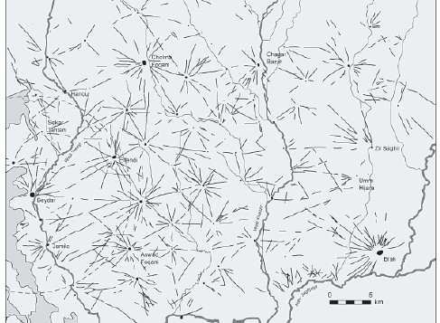
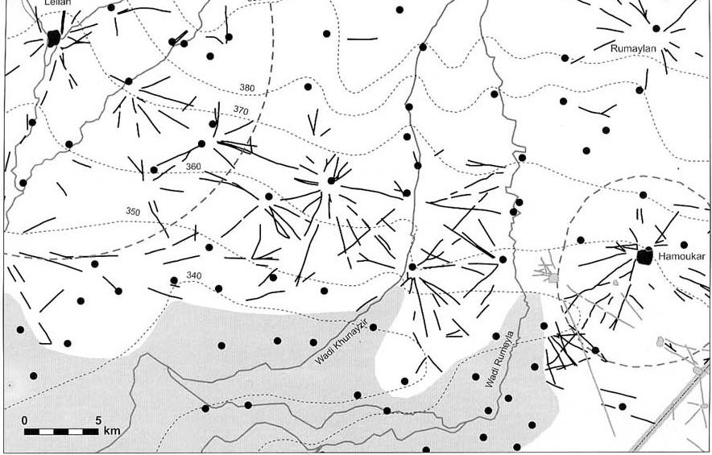

# Resumo

As investigações arqueológicas das últimas décadas comprovam que a
necessidade humana de ordem se mostra na formação dos mais antigos
assentamentos, particularmente na escolha do sítio de implantação e na
formação dos espaços de circulação. As ocupações já indicavam uma
organização das distâncias segundo o tempo desejado para um deslocamento
de acordo com a passagem dos distintos modos, pedestres e veículos. O
objetivo deste artigo é mostrar que o tempo, desenhado pela velocidade,
é desde os primitivos assentamentos humanos, uma ferramenta que modela
as cidades através da configuração das redes de caminhos e de vias
urbanas.

Palavras chave: arqueologia, história, urbanismo, transporte, sistema
viário

# Abstract

Archaeological investigations of the last decades have shown that the
human need for order can be seen in the formation of the oldest
settlements, particularly in the choice of the site of implantation and
in the formation of circulation spaces. The settlements have indicated
an organization of distances according to the desired displacement of
pedestrian and vehicular time. The purpose of this article is to show
that the time, designed by speed, is from early human settlements, a
tool that models the cities through the configuration of networks of
paths and urban roads.

Keywords: history, archeology, city planning, transportation, road
system

# Introdução

Após 1990, com as restrições às explorações arqueológicas devido à
guerra no Iraque, os pesquisadores intensificaram suas atenções ao norte
da Síria e ao sudeste da Turquia. Estas pesquisas recentes, apresentadas
nos trabalhos de Jason Ur, do Instituto Oriental da Universidade de
Chicago, Tony Wilkinson, do Departamento de Arqueologia da Universidade
de Durham e Harvey Weiss da Universidade de Yale, têm um foco regional,
procurando a identificação de zonas de adubação e de sistemas de
estradas antigas, denominadas \"hollow ways\" (Wilkinson 1992, 1997). As
investigações contam com imagens de satélite, dados de sensoriamento
remoto além das avaliações de rádio carbono e transcrição de textos
antigos. As ações têm permitido uma visão do panorama territorial e uma
revisão de cenários urbanos da Mesopotâmia do Sul, até então
considerados os mais antigos pela literatura urbana.

Estas pesquisas permitem observar a estruturação de alguns assentamentos
humanos do 6º milênio a.C. ao 3º milênio a.C. construindo uma hierarquia
de cidades, povoados e aldeias, conectada por uma rede de caminhos.

As primitivas comunidades do Neolítico se implantavam segundo a
proximidade de fontes de água e terras férteis, mas os caminhos que
irradiavam de seus núcleos, a exemplo de Chatal Huyuk, indicavam também
uma necessidade de comunicação e trocas com outros povos. É possível que
estas trilhas se delineassem segundo a

topografia, evitando relevos acidentados, terrenos encharcados, áreas ou
períodos de tempestades, procurando a proximidade de suprimentos e
abrigos (WILKINSON, 2009).

Diferentemente do isolamento das comunidades do Neolítico, os
assentamentos do 5º ao 4º milênio a.C. passaram a fazer parte de uma
constelação com núcleos mais próximos, quando a sobrevivência passou a
exigir o agrupamento de aldeias, povoados e cidades. As investigações
mostram que além da topografia, das qualidades do solo e do acesso à
água, na equação da localização de um assentamento entravam as rotas de
comunicação, com a distância aparecendo como um indicador importante
tanto de posicionamento na relação entre centros urbanos, como entre o
assentamento e o campo e em suas relações espaciais interiores. De fato,
o que os vestígios arqueológicos revelam é que, a antes mesmo do 5º
milênio a.C., a consolidação de aldeias e povoados foi acompanhada pela
organização de suas vias e caminhos.

No 5º milênio a.C., pequenos aglomerados polvilhavam em diferentes
cantos do mundo. Embora este fosse um período de comunidades dispersas,
sem divisões de classes e nem sempre permanentes, escavações recentes na
Mesopotâmia do Norte indicam que grandes cidades existiram no final
deste período, antecedendo o desenvolvimento urbano da Mesopotâmia do
Sul tido como o berço da civilização (BENEVOLO, 2011; BERTMAN, 2003;
GUIMARÃES, 2004). De acordo com Jason Ur (2007, p. 597-598),

o norte da Mesopotâmia apresentava indícios de urbanização 1.000 anos
antes do sul.

O intercâmbio entre as comunidades que se diferenciavam segundo o porte
e o poder de atração era facilitado pelo uso de uma mesma língua, mesmas
tradições culturais e religiosas (RISTVET, 2005, p.55). Um centro urbano
gerava uma série de relações comerciais e atividades sociais com
povoados e aldeias em suas imediações. Comunidades próximas, com até um
dia de percurso ida e volta, provavelmente, faziam trocas habituais e
repetitivas de alimentos, bens perecíveis e acabados, como cestas,
ferramentas, cerâmicas e tecidos. O intercâmbio com comunidades mais
distantes, provavelmente, era mais sazonal, realizado entre centros
urbanos com trocas de bens mais duráveis e de maior valor (RISTVET,
2005).

# Redes de caminhos

Leilan e Hamoukar já existiam como aldeias no 5º milênio a.C., enquanto
Khirbath al- Fakhar e Brak, neste mesmo período, já apresentavam
características de cidade. A primeira com uma extensão de
aproximadamente 300ha e a segunda com grandes espaços de produção e
complexidade do controle administrativo. Leilan, Hamoukar e Brak, que
passou a se chamar Nagar, junto com Chuera, Mouzan e Beydar, formavam,
no 3º milênio a.C., uma rede de cidades na Mesopotâmia do Norte,
sustentada por uma bacia agrícola formada por povoados e aldeias, e
pelos subúrbios e áreas do campo, conectados por uma rede de caminhos
(UR, 2010, p.104-108; 2002, p. 69).

A análise de fotografias do satélite aponta rastros do 3º milênio a.C.
que tinham início em cada cidade e se dirigiam ao campo, de forma
radial, finalizando abruptamente a cerca de 3 ou 5km (UR, 2010, p.153),
o que equivale a uma hora de caminhada (Figura 01). Provavelmente, parte
destes caminhos tinha sedimentado trilhas abertas pelos ancestrais das
aldeias mais antigas. Como não conectavam outras estradas, foram
interpretados por Jason Ur (2006, p.6) como vias de apoio à economia de
subsistência, levando agricultores e animais de tração para as terras
agrícolas, e pastores, com seus rebanhos, para as áreas de pastagens.

> 
>
> Figura 01 - Bacia do Kabhur - "hollow ways" (3º milênio a.C.). Rede de
> caminhos radiais com raios de 3 a 5km.
>
> Fonte: UR, 2003, p.110.
>
> 
>
> Figura 02 - Bacia do Kabur: rede de caminhos (meados ao final do 3º
> milênio a.C.). Caminho linear de aproximadamente 50 km entre as
> cidades de Hamoukar e Leilan -- Síria. Fonte: UR, 2002, p.85.
>
> Ur (2006, p.8, 78) defende que estes caminhos não eram abertos por um
> governo central, mas eram resultantes do tráfego cotidiano de pessoas,
> veículos e animais e que tinham como limite, à dispersão dos
> movimentos, as propriedades e as plantações. As caminhadas diárias
> compactavam o chão e deixavam um rastro que tendia a ser de uso comum.
> Estes mesmos trajetos davam suporte aos deslocamentos de pessoas e de
> bens e levavam as procissões em direção aos santuários que, fora da
> cidade, serviam a agricultores e pastores em seguidas gerações.
>
> Na rede hierarquizada de cidades, com seus povoados e aldeias situados
> em suas áreas de influência, pode-se observar a distribuição de alguns
> assentamentos em arranjos lineares e a intervalos médios de 25 a 30km
> (RISTVT, 2005, p.59), uma distância média percorrida por um nômade com
> seu jumento, de acordo com Heaton (1965, p.37).

Possivelmente, devido à intensificação do intercâmbio, caminhos com
continuidade ligando cidades foram intercalados por uma série de
povoados que pareciam se posicionar estrategicamente nas rotas entre os
grandes centros, pontuando o trajeto (Figura 02). Isto foi interpretado
por Harvey Weiss (1992, p. 93) como resultado de uma estratégia para
otimização da produção e dos transportes.

No 3º milênio a.C., já com o uso de veículos com rodas, Leilan junto com
Mouzan e Brak transformaram a planície do Khabur numa paisagem urbana,
estando as três equidistantes cerca de 50 a 60km, ou seja, cada uma com
controle de 25 a 30km a volta de seu centro que correspondia a um dia de
caminhada ou de viagem em uma carroça.

A Mesopotâmia do Sul era uma planície aluvial entre o Eufrates e o
Tigre, em meio a um deserto de areia que sofria tanto a inconstância das
dunas sob o regime dos ventos, quanto dos rios que nos picos de cheia
causavam inundações e criavam uma série de lagunas, quando não mudavam
de curso. A sobrevivência dependia da irrigação e construção de canais.

Assim, como a Mesopotâmia do Norte, várias cidades da civilização
suméria na Mesopotâmia do Sul tiveram sua origem em meados do 6º ou 7º
milênio a.C., mas a aglutinação e estruturação de assentamentos, segundo
uma hierarquia entre aldeias, povoados e cidades, foi mais intensa
durante meados do 4º milênio a.C., quando foi palco de um maior processo
de urbanização e regionalização liderado por Uruque. Assim, como na
Mesopotâmia do Norte, vilas e aldeias ficavam próximas aos povoados dos
quais eram subordinadas de variadas maneiras. Estes povoados, por sua
vez, gravitavam no entorno de centros urbanos ou cidades (ADAMS, NISSEN,
1972, p.19).

Esta macrorregião, conhecida como a planície de Sinear, foi ocupada
inicialmente pelos sumérios que construíram as cidades de Eridu, Nippur,
Uruque, Ur, Umma, Churrupaque, Casalu, Isin, Larasa, Quich, Echnuna e
Lagache. Dentre estas doze cidades, as três primeiras são as
consideradas mais antigas (LEICK, 2003), sendo Nipur a responsável pelo
primeiro processo de regionalização na Mesopotâmia do Sul, depois
transferido para Uruque (ADAMS, NISSEN, 1972, p.19).

Além das cidades necessitarem do abastecimento cotidiano das aldeias, a
Mesopotâmia do Sul não tinha pedra, madeira ou metal que só podiam ser
obtidos de lugares distantes. Em contrapartida, seu desenvolvimento
técnico e científico, levado por barcos ou por caravanas de asnos,
influenciou países distantes e levou à criação de colônias e entrepostos
comerciais, como Habuba Kabira,, na Síria, em meados do 4º milênio a.C.

É deste período a ocupação dos assentamentos em linha, com ligações
quase que retilíneas, sem desvios, que, segundo Roaf (1996, p.57),
indicam uma maior organização "substituindo a mais espontânea e
desordenada disposição anterior". Com a implantação dos assentamentos em
linha, ao longo dos rios, a intervalos de 4 e 5km, otimizava-se o
transporte terrestre e hidroviário.

Enquanto na Mesopotâmia do Norte, os caminhos por terra eram as
principais vias de ligação, a Mesopotâmia do Sul tinha o rio como a via
preferencial de conexão entre os assentamentos. Deve-se considerar que o
sistema de canais impunha uma série de barreiras ao transporte por
terra, sem contar que durante o inverno os caminhos ficavam lodacentos
e, durante a primavera, as enchentes os tornavam intransponíveis
(BERTMAN, 2003, p.209). O transporte pelos rios e canais era preferível,
assim como os asnos e os trenós que, melhor do que os veículos com
rodas, transpunham o chão

barrento. Mas os rios Eufrates e Tigre, além de dificultarem a
navegabilidade em alguns trechos, corriam para o sul, assim como os
ventos, o que inviabilizava as viagens de volta de longa distância que
tinham que ser feitas por terra (BERTMAN, 2003, p.254).

A rede de caminhos se ramificou por toda a Mesopotâmia, entretanto,
somente no 1º milênio a.C. são criados os primeiros modelos de estradas
com projetos de pavimentação, de sinalização, de manutenção e de
operação da passagem de veículos. Com a expansão do território e
conquistas de guerra dos governos imperiais assírio, persa e romano, o
acesso rápido de mensagens entre as bases militares tornou-se uma
necessidade. Embora não tenham construído grandes estradas, os assírios
criaram uma sinalização para orientação das rotas e disponibilizaram
postos de guarda e poços de água ao longo dos caminhos para o uso dos
viajantes. Elaboraram também mapas com indicações de distância e tempo
de percurso para o serviço de correios (BERTMAN, 2003, p.209).

Entretanto, as primeiras estradas construídas para viagens em velocidade
foram planejadas pelos persas (BERTMAN, (2003, p.254) que investiram na
geometria, na pavimentação e na operação, para impulsionar a aceleração.
Segundo Heródoto, ninguém viajava tão rápido quanto os mensageiros
persas pois, ao longo da estrada, encontravam balsas ou pontes para
travessia dos rios, e homens e cavalos dispostos a intervalos de um dia
de jornada por cavalgada e, assim, a cada trecho, passavam mensagens de
mão em mão sem interromper o percurso até chegar ao destino final
(BERTMAN, 2003, p.209). Para obterem viagens mais rápidas, os persas
optaram pelas rotas mais diretas e, para isso, atravessavam vales,
florestas, montanhas e desertos. A cada 24 ou 28km havia uma estação
para troca de cavalos, abastecimento e descanso.

Os romanos construíram estradas mais robustas para sobreviverem às
instabilidades do tempo e à passagem das tropas. Os projetos contavam
com especificações para drenagem, geometria, sinalização, gerência de
pavimento e parâmetros para a colocação de postos de serviços de acordo
com a velocidade de deslocamento de seus mensageiros que viajavam com
uma média de 75km por dia. Estes postos, colocados a intervalos
regulares, eram de três tipos. As *mansiones* (sing. *mansio*) distavam
de 32 a 48km uma da outra e ofereciam cavalos e mulas, quartos para
dormir e local para banho. As *mutationes* (sing. *mutatio*) serviam
apenas para a troca de animal, e as *stationes* (sing. *statio*) eram
postos de vigilância (ADKINS, 1998, p.90).

# Redes de vias urbanas

Nas comunidades primitivas, a princípio, para guardar e acessar as
riquezas obtidas no campo, construíram depósitos com acessos que deram
origem às primeiras ruas. A importância do edifício de interesse
coletivo, com sua atratividade, direcionava a caminhada da comunidade
para um destino comum que assim materializava sua rota no chão com maior
visibilidade, tendendo a gerar vias retas para os acessos mais legíveis
e mais rápidos. Logo o contraste entre vias rápidas e lentas, estas
estreitas e tortas, torna- se recorrente na cidade e pode ser notado em
assentamentos humanos de diferentes épocas e culturas, inclusive nos
povoamentos oriundos do florescimento urbano durante a Revolução
Neolítica, como Asikli.

Embora Kostof (1992, p.190) afirme que as primeiras ruas eram todas
iguais, sem hierarquia e sem pavimentação, e que o primeiro registro de
uma hierarquização é de Beycesultan, no oeste da Anatólia (1900-1750
a.C.), indícios de organização das vias já se encontravam no 5º milênio
a.C. em Brak, no 4º milênio a.C., em Habuba Kabira, e na

passagem do 3º para o 2º milênio a.C., tanto nas cidades da Mesopotâmia
do Norte e do Sul, como nas ocupações harapeanas, no Vale do Indo no
Paquistão.

Brak, situada na Bacia do Alto Khabur, que já apresentava
características de cidade no 5º e 4º milênio a.C., com artesanato
especializado, bens de prestígio, procedimentos administrativos e alto
padrão de consumo (UR, 2007, p.596) tinha, em sua acrópole, construções
monumentais que, provavelmente, serviam como depósitos, locais de
festejos e de atividades industriais. O acesso era feito por uma via
mais larga e pavimentada que, em contraste com as demais vias estreitas
e tortas das áreas residenciais, servia para a passagem mais rápida de
um maior número de pessoas e de carga.

Leilan era o centro de uma rede de produção agrícola, na planície do
Habur, na Mesopotâmia do Norte. Entre 2600 e 2400 a.C. (RISTVET, 2005,
p.94, 97), em sua acrópole elevada e murada ficavam grandes e variados
depósitos, com acesso por uma via reta pavimentada que parece fazer
parte de uma trama de vias radiais, no mesmo modelo de Hamoukar, Chuera
e Mozan, cujas pesquisas por sensoriamento remoto indicam a presença de
um padrão de ruas radiais (AKKERMANS e SCHWARTZ, 2003). Estas vias
principais eram, geralmente, prolongamentos dos caminhos externos que
penetravam o portão das muralhas e se dirigiam aos depósitos, que mais
tarde deram lugar aos templos e aos palácios.

Considerando a velocidade de caminhada de um pedestre de 3 a 5km/h, por
mais de

6.000 anos, a cidade se mantem com uma extensão passível de ser
atravessada a pé em uma hora. Entre as ocupações urbanas estudadas, até
a transição do 3º para o 2º milênio a.C., apenas Uruque chegou a 3km de
extensão. A partir do 2º milênio a.C., quando há uma maior diversidade
de veículos, a cidade se expande sob as patas dos eqüinos. É o que
Amarna parece querer demonstrar com 8km de extensão, e, Nínive,
Babilônia e Roma com 5km, no milênio seguinte. De fato, antes de Londres
e Paris, no século XVIII d.C. que que então alcançam 10 km de extensão,
estas foram as maiores cidades, e ainda assim, um pedestre poderia
alcançar o centro de Amarna ou atravessar cada uma delas, em linha reta,
em cerca de uma hora.

Atenas, assim como Mileto, Olinto e Pompeia tinham dimensões aproximadas
para serem atravessadas em 15 a 20 minutos. O mesmo tempo é estimado
para as cidades de Brak, no 4º milênio a.C. e Leilan, no 3º milênio a.C.

Nipur e Ur também são cidades percorríveis de ponta a ponta em
caminhadas de 15 a 20 minutos, embora apresentassem configurações
distintas. Nipur, cujo assentamento inicia em 5000 a.C. teve sua maior
expansão durante a dinastia de Ur III (2200-2100 a.C), quando alcança
135ha, e, posteriormente, no período cassita (1720-1350 a.C.) quando
atinge cerca de 1,5 km x 0,75km (GIBSON, 1992).

As cidades medievais já precisavam de cerca de meia hora para serem
atravessadas, como Florença e Bologna, com aproximadamente 2,5 x 2km;
Milão, no século XIV, com 2,5 x 2km; e Pádua, na sua última muralha, com
3 x 2,75km.

Vale destacar que várias destas comunidades tinham dimensões semelhantes
às unidades modernas de planejamento, como o módulo de 1,2 x 0,8km
adotado por Le Corbusier em Chandigard, na Índia; a unidade ambiental de
planejamento de 1 x 1km recomendada por Cândido Malta Campos Filho
(2003) para a cidade de São Paulo; ou mesmo a unidade de vizinhança de
Clarence Perry com 0,8 x 0,8km (FERRARI, 1988).

Em meados do século XVIII, Paris alcança 10km de extensão, o que
representa pouco mais de 2 horas numa caminhada. Somente Amarna, 3.000
anos antes, apresentou um comprimento semelhante, embora tivesse uma
pequena largura de 800m

A extensão da cidade industrial, a partir do século XIX, passa a ser
grande demais para o pedestre, ou seja, seu atravessamento, em curto
espaço de tempo, só é possível de ser vencido pelo veículo motorizado.

Em meados do século XX, apesar da existência de redes de avenidas
atravessando as cidades e possibilitando a passagem dos veículos com a
velocidade de 60 a 80 km/h, é impossível cruzar grandes centros
metropolitanos, como Londres e São Paulo com um diâmetro de 50km, devido
aos congestionamentos. Com o objetivo de reduzirem o tempo de passagem,
as cidades do século XX passam a construir vias elevadas. Ao final do
século, reconhece-se que as soluções veiculares para o transporte urbano
demonstravam um descaso com os espaços e os períodos da permanência,
agredidos pelos impactos ambientais e da paisagem. As novas diretrizes
para os projetos urbanos se voltam então para o planejamento da
circulação mais agradável, que significa investimento no tempo e na
paisagem de contemplação.

# Conclusão

Os caminhos traçados segundo a duração do percurso fizeram da velocidade
uma das primeiras ferramentas de desenho das constelações de aldeias,
povoados e cidades; e do tempo a primeira medida do espaço. De fato, o
alvorecer da história urbana mostra que o homem, objetivamente, atua
sobre o espaço, mas o interpreta segundo as suas percepções do tempo,
práticas, afetivas ou estéticas.

# Referências bibliográficas

> ADAMS, Rober McC; NISSEN, Hans J. *The Uruk countryside: the natural
> setting of urban societies.* Oxford: The University Chicago Press,
> 1972.
>
> ADKINS, Lesley; ADKINS, A. Roy. *Handbook to life in ancient Rome.*
> New York: Oxford University Press, 1998.
>
> AKKERMANS, Peter M.; SCHWARTZ, Glenn M. *The Archaelogy of Syria: from
> complex hunter-gatherers to early urban societies (16000 -- 300
> b.C.*). Cambridge: Cambridge University Press, 2003.
>
> BERTMAN, Stephen. *Handbook to life in Mesopotamia.* New York: Oxford
> University Press, 2003.

CAMPOS FILHO, Cândido Malta. *Reinvente seu bairro:* caminhos para você
participar do planejamento de sua cidade. São Paulo: Ed.34, 2003.

> FERRARI, Celson. *Curso de planejamento municipal integrado***.** São
> Paulo: Pioneira, 1988.
>
> GIBSON, McGuire. *Nippur: sacred city of Enlil supreme god of sumer
> and akkad Al- Rafidan*. Chicago: The Oriental Institute of the
> University of Chicago, 7 fev. 2007.

Disponível em:
\<[http://oi.uchicago.edu/research/projects/nip/nsc.html\>.](http://oi.uchicago.edu/research/projects/nip/nsc.html)
Acesso em: 20 mar. 2012.

GIBSON, McGuire. *Patterns of occupation at Nippur*. Chicago: The
Oriental Institute of the University of Chicago, 7 fev. 2007. Disponível
em:

\<[http://oi.uchicago.edu/research/projects/nip/pon.html\>.](http://oi.uchicago.edu/research/projects/nip/pon.html)
Acesso em: 20 mar. 2012.

> KOSTOF, Spiro. *The city assembled:the elements of urban form through
> history*. Londres: Thames and Hudson, 2004.
>
> KOSTOF, Spiro. *The city shaped: urban patterns and meanings throught
> history.*

Londres: Thames and Hudson, 2001.

> LEICK, G. *Mesopotâmia: a invenção da cidade***.** Rio de Janeiro:
> Imago, 2003.
>
> ROAF, Michael. *Mesopotâmia e o antigo Médio Oriente*. Madri: Del
> Prado, 1996, v.1.

Ur, Jason. Settlement and landscape in Northern Mesopotamia: Tell
Hamoukar Survey: 2000-2001. *Akkadica,* Chicago: Oriental Institute
Publications, n. 123, p. 57-88, 2002. Disponível em:
\<[http://oi.uchicago.edu/pdf/Ur_Akkadica123_2002.pdf\>](http://oi.uchicago.edu/pdf/Ur_Akkadica123_2002.pdf).
Acesso em: 30 mai. 2013.

UR, Jason A. CORONA satellite photography and ancient road networks: a
Northern Mesopotamian case study. *Antiquity*, Durham: Durham
University, v. 77, n. 295, p. 102- 115, 2003. Disponível em:
\<<http://antiquity.ac.uk/ant/077/Ant0770102.htm>\>. Acesso

em: 09 set. 2013.

Ur, Jason. Emergent landscapes of movement in Early Bronze Age Northern
Mesopotamia. In: *Landscapes of Movement: Paths, Trails, and Roads.*
Philadelphia: University of Pennsylvania, p. 180-203, 2006. Disponível
em:

\<[http://ccat.sas.upenn.edu/\~cerickso/Roads/Papers/JUr_ebatracks.pdf\>](http://ccat.sas.upenn.edu/%7Ecerickso/Roads/Papers/JUr_ebatracks.pdf).
Acesso em: 30 mai. 2013.

Ur, Jason, et al. Early Mesopotamian urbanism: a new view from the
North*. Antiquity,*

Durham: Durham University, v. 81, n. 313, p. 585-600, 2007. Disponível
em:

\<http://nrs.harvard.edu/urn-3:HUL.InstRepos:4269009\>. Acesso em: 30
mai. 2013.

> Ur, Jason. *Urbanism and cultural landscapes in Northeastern Syria:*
> the Tell Hamoukar Survey 2000-2001. Chicago: The University of Chicago
> Oriental Institute, v. 137, 2010. Disponível em:
> \<https://oi.uchicago.edu/pdf/oip137.pdf\>. Acesso em: 30 mai. 2013.
>
> WEISS, Harvey. Tell Leilan 1989: new data for mid-third Millennium
> Urbanization and State. In: *Mitteilungen der Deutschen
> Orient-Gesellschaft zu Berlin*, Berlim, n. 122, p. 193-218, 1990.
> Disponíve[l em:
> \<http://leilan.](http://leilan.yale.edu/pubs/all.html)y[ale.edu/pubs/all.html](http://leilan.yale.edu/pubs/all.html)\>.

WEISS, Harvey et all. The genesis and collapse of third millennium North
Mesopotamiam Civilization. *Science-New Series,* v. 261, n. 5124, p.
995-1004, 20 nov.

1993\. Disponível em:

\<<http://leilan.yale.edu/pubs/files/Weiss_and_Courty_1993_Genesis_Collapse_Akkadia>
n_Empire_in_Liverani_ed_Akkad_The_First_World_Empire.pdf\>. Acesso em:
17 jul. 2013.

> WEISS, Harvey. Tell Leilan on the Habur Plains of Syria. *The Biblical
> Archaeologist,*

Boston: The American Schools of Oriental Research Stable, v. 48, n. 1,
mar. 1985, p. 5-

34\. Disponíve[l em:
\<http://www.jstor.org/st](http://www.jstor.org/stable/3209945)a[ble/3209945\>](http://www.jstor.org/stable/3209945).
Acesso em: 17 jul. 2013.

WEISS, Harvey; COURTY, Marie-Agnes. The genesis and collapse of the
akkadian empire: the accidental refraction of historical law. In:
LIVERANI, Mario (Ed.). *Akkad: the first world empire -- Structure,
Ideology, traditions***.** Roma: Herder, p. 131-151, 1993. Disponível
em:

\<<http://leilan.yale.edu/pubs/files/Weiss_and_Courty_1993_Genesis_Collapse_Akkadia>
n_Empire_in_Liverani_ed_Akkad_The_First_World_Empire.pdf\>. Acesso em:
17 jul. 2013.

> WILKINSON, Toby. *Pathways and highways: routes in Bronze Age
> Eurasia.*

ArchAtlas. 07 mar. 2009. Disponível em:

\<<http://www.archatlas.org/workshop09/works09-wilkinson.php> \>.
Acesso: set. 2013.

WILKINSON, T.J. Linear hollows in the Jazira,Upper Mesopotamia,
*Antiquity* , n. 67, p. 548--62, 1993

WILKINSON, T.J. The structure and dynamics of dry-farming states in
Upper Mesopotamia, *Current Anthropology*, v. 35, p. 483--520, 1994.

> WILKINSON, T.J. Archaeological survey of the Tell Beydar region,
> Syria, 1997. A preliminary report. In: K. Van Lerberghe & G. Voet
> (eds.), *Tell Beydar.Environmental and technical studies*, p. 1--37,
> 2000.
>
> WILKINSON, T.J. & D. TUCKER. *Settlement development in the North
> Jazira, Iraq*. Warminster: Aris & Phillips, 1995.
