# Resumo

A inquietação em busca de reflexões sobre a produção do espaço urbano
por meio de projetos de habitação de interesse social se deve ao fato de
que é comum a constatação sobre a falta de planejamento e critérios
técnicos com que o setor privado, ávido pelo lucro fácil e imediato,
produz nossas cidades. Porém, os altos investimentos na habitação feitos
pelo BNH e agora pelo PMCMV mostram que uma parcela significativa das
cidades poderia apresentar excelente qualidade urbanística e ambiental
se o Estado, financiador dessas ações, valorizasse o projeto. Grande
parte do território das cidades brasileiras já foi estruturado por
projetos de habitação de interesse social ou pela sua ausência. Segundo
Bonduki (1998) as novas relações de trabalho após a abolição da
escravatura (1888) geraram forte incremento demográfico e a iniciativa
privada foi o primeiro agente que construiu habitação econômica. Os
modelos de habitação desenvolvidos pelos empreendedores foram o cortiço
e as vilas operárias. Na década de 1940, a crise dessa produção rentista
fez com que o trabalhador construísse por conta própria nas franjas das
cidades gerando bairros populares e favelas. Também a partir da década
de 1940, o poder público percebeu que a habitação era uma questão social
e ofereceu empreendimentos que apresentavam soluções de "moderna"
arquitetura até projetos de baixa qualidade carimbados por todo
território nacional. Nossas cidades têm em seu território a marca dessas
experiências. Essa cicatriz é o que nos interessa. Interessa, portanto,
aprender com esses processos. Para tanto vamos analisar paisagens de
empreendimentos habitacionais selecionando diferentes concepções: a
habitação feita pelo setor privado, pelo Estado e pelo morador.

Palavras-chave: habitação de interesse social, paisagem, espaço urbano,
cidade

# Abstract

The anxiety in search of reflections on the production of urban space
through projects of social housing is due to the fact that it is common
the observation about the lack of planning and technical criteria by the
private sector on producing our cities. However, the high investments
made by BNH and nowadays by the PMCMV show that a significant portion of
the cities could present excellent urban and environmental quality if
the state valued the project. Much of the territory of the brazilian
cities have been structured by social housing projects or by its
absence. According Bonduki (1998) the new labor relations after the
abolition of slavery (1888) generated strong demographic growth and the
private sector was the first agent who built affordable housing. The
housing models developed by entrepreneurs were the tenement and working
villages. In the 1940s, the rentier production crisis forced the worker
to build on their own on the fringes of cities generating popular
neighborhoods and slums. Also from the 1940s the government realized
that housing was a social issue and offered solutions of \"modern\"
architecture and low quality projects throughout the country. Our cities
have in their territory the mark of those experiences. This scar is what
interests us. We are concerned, therefore, in learn from these
processes. For this we will analyze landscapes of housing

developments selecting different concepts: housing made by the private
sector, by the state and by the resident.

Keywords: social housing, landscape, urban space, city

# Introdução

O presente artigo pretende refletir sobre a paisagem urbana criada a
partir de Programas Habitacionais de Interesse Social no Brasil. Para
tal análise foram eleitos ambientes onde a implantação ou a ausência de
programas habitacionais foram determinantes para a produção do espaço
urbano.

O arquiteto e urbanista Nabil Bonduki (1998) em *"Origens da habitação
social no Brasil - Arquitetura Moderna, Lei do inquilinato e Difusão da
Casa Própria"* nos dá o panorama de como as cidades brasileiras foram
estruturadas pelos projetos de habitação de interesse social ou pela sua
ausência. Segundo o autor, as novas relações de trabalho após a abolição
da escravatura (1888) geraram forte incremento demográfico nas maiores
cidades brasileiras. A iniciativa privada foi o primeiro agente que
construiu habitação para baixa renda. Os modelos de habitação
desenvolvidos pelos empreendedores foram o cortiço (habitação coletiva
para aluguel) e as vilas operárias. Na década de 40, a crise dessa
produção rentista fez com que o trabalhador construísse por conta
própria nas franjas das cidades gerando bairros populares e favelas.
Também a partir da década de 40, o poder público percebeu que a
habitação era uma questão social e ofereceu empreendimentos que
apresentavam soluções de "moderna" arquitetura até projetos de baixa
qualidade carimbados por todo território nacional. Nossas cidades têm em
seu território a marca dessas experiências. Essa cicatriz é o que nos
interessa ou melhor interessa aprender com esses processos e extrair o
que podemos melhorar, retirar, acrescentar e quais são os elementos que
são imprescindíveis para criar cidades mais saudáveis, ou seja,
legíveis, diversificadas, com boa inserção no contexto urbano, com
paisagismo adequado e equipamentos públicos de qualidade.

A inquietação em busca de reflexões sobre a produção do espaço urbano
por meio de projetos de habitação de interesse social se deve ao fato de
que é comum a constatação sobre a falta de planejamento e critérios
técnicos com que o setor privado, ávido pelo lucro fácil e imediato,
produz nossas cidades. Porém, os altos investimentos na habitação desde
1964 nos mostram que:

> \[\...\] uma parcela expressiva do espaço urbano brasileiro poderia
> apresentar uma excelente qualidade urbanística e ambiental, se esta
> intervenção, financiada pelo Estado e produzida pelo setor formal da
> construção civil, tivesse sido realizada valorizando o projeto. No
> entanto, predominam -- salvo raríssimas exceções -- projetos
> medíocres, uniformes, monótonos e desvinculados do meio físico da
> cidade, uma intervenção urbanística muito inferior aos IAPs. (BONDUKI,
> 1998, p.318)

Bonduki escreveu esse texto dez anos antes do lançamento do Programa
Minha Casa Minha Vida (PMCMV) que têm como objetivo de garantir o
direito à moradia para a população brasileira. Os vultosos recursos
investidos e a meta de construção de 2 milhões de unidades nos dão a
certeza que grande parte do espaço urbano construído nas cidades são
fruto dessa política habitacional. Nos cabe, então, neste artigo
analisar

algumas paisagens, criadas pela construção de empreendimentos
habitacionais para a população de baixa renda, percebendo erros e
acertos para refletir sobre estratégias para a construção de cidades
mais saudáveis.

# A cabeça pensa onde o pé pisa

Para Cullen (1996, p.195) existem duas formas de se projetar um
ambiente. A primeira: Objetivamente, "através do senso comum e da lógica
baseada em princípios benevolentes da saúde, amenidade, conveniência e
privacidade". Projetar "empregando os valores subjetivos daqueles que
habitarão o mundo criado", seria uma segunda forma que, para o autor,
não exclui a primeira, complementa.

Essa lição é uma das formas de interpretar a expressão *"A cabeça pensa
onde o pé pisa",* muita usada em materiais de formação do MST*,* talvez
cunhada por Frei Beto e difundida por Leonardo Boff (1997)*.*

> A cabeça pensa a partir de onde os pés pisam. Para compreender, é
> essencial conhecer o lugar social de quem olha. Vale dizer: como
> alguém vive, com quem convive, que experiências tem, em que trabalha,
> que desejos alimenta, como assume os dramas da vida e da morte e que
> esperanças o animam. Isso faz da compreensão sempre uma interpretação.
> (BOFF, 1997, p.5)

A segunda lição é que o ambiente construído é um dos fatores
determinantes no desenvolvimento humano e intelectual. Não há dúvida que
elementos como funcionalidade, usabilidade, sensoraliedade, diversidade,
identidade e a própria qualidade da infraestrutura configuram a
distinção e o reconhecimento dos ambientes em suas múltiplas funções
propiciando o "encontro de pessoas e serviços tendente a gerar um *calor
cívico*" (CULLEN, 1996, p.137). Fica claro que, para o autor, a relação
entre os edifícios e o ambiente em que eles estão inseridos é de
fundamental importância.

> Se me fosse pedido para definir o conceito de paisagem urbana, diria
> que um edifício é arquitectura, mas dois seriam já paisagem urbana,
> porque a relação de dois edifícios próximos já é suficiente para
> libertar a arte da paisagem urbana. \[\...\] Multiplique-se isto a
> escala de uma cidade e obtém-se a arte do ambiente urbano; as
> possibilidades de relacionação aumentam, juntamente com as hipóteses a
> explorar, e os partidos a tomar. (CULLEN, 1996, p.135)

Solà-Morales (2002) traz a definição de paisagem em suas distintas áreas
de significação; primeiro, como a noção de paisagem para descrever a
relação dos espaços naturais com seu processo de 'domesticação' através
da jardinagem, pintura ou poesia; depois, como um pressentimento de
nossa relação com a cidade, um ponto de vista próprio da experiência
entre o natural e o urbano para o homem moderno. (SOLÀ- MORALES, 2002,
p.153)

Para o autor, a cidade contemporânea está em permanente processo de
formação e de devastação, e já não é mais compreendida através de uma
visão que encontra na ordem dos traçados o suporte de uma
inteligibilidade estável:

> La cuidad actual se apropia de su energía pero también sus conflitos
> sociales, geológicos, ambientales, aceptando com fatalismo convivir
> com ellos. (SOLÀ-MORALES, 2002, p.157)

Para Cullen existe, sem dúvida, uma arte de relacionamento, e seu
objetivo é a reunião de elementos para a criação de um ambiente (CULLEN,
1996, p.10). A paisagem seria, então, criada a partir de um jogo no qual
são misturados (e organizados) elementos formais e os elementos
subjetivos de cada comunidade.

# Analisando Paisagens

Ao propor analisar algumas paisagens de empreendimentos habitacionais no
Brasil tomamos como base o estudo desenvolvido por Nabil Bonduki (1998).
Selecionamos imagens da habitação produzida pelo setor privado, pelo
estado e pelo morador. Faremos ensaios sobre algumas dessas paisagens
acrescentando a produção do PMCMV (2009).

# Vila Maria Zélia -- 1919 - A habitação feita pelo setor privado

Segundo Bonduki (1998, p.43) do final do século XIX até a década de 1930
surgiram várias formas de moradia para a população de baixa e média
renda sempre construídas pela iniciativa privada que as cedia mediante
contrato de aluguel (produção rentista). As formas que mais foram usadas
são o cortiço-corredor, o cortiço-casa de cômodos, os vários tipos de
vilas e correr de casas geminadas.

A Vila Maria Zélia foi construída em 1919, junto a Cia. Nacional de
Tecidos de Juta em São Paulo. Ela era composta por cerca de duzentas
casas além de diversos equipamentos como: igreja, biblioteca, teatro,
creche, jardim de infância, grupo escolar, consultório médico e dentário
e comércio. A vila foi construída com o claro objetivo de manter o
controle patronal na medida em que todos os serviços e o comércio eram
comandados pelo industrial.

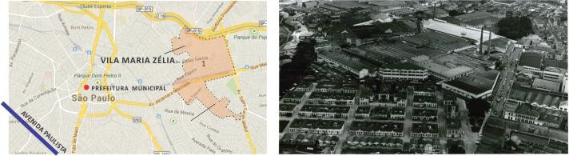A Vila, segundo Bonduki (p.65), "foi
precursora dos conjuntos residenciais propostos, com outra visão, pelos
arquitetos do movimento moderno e por Vargas, através dos Institutos de
Aposentadorias e Pensões". O carácter precursor da vila residia no fato
de ser segregada do tecido urbano e introduzir ao projeto um conjunto de
equipamentos coletivos necessários ao desenvolvimento de atividades no
tempo livre.

> Figura 1 -- A) Localização da Vila. Fonte: Google Earth, modificado
> pelo autor, 2014 e B) vista aérea. Fonte:
> [cultura.sp.gov.br,](http://www.cultura.sp.gov.br/) 2014

A necessidade de maior aproveitamento do lote e redução do uso de
materiais gerou como solução a casa geminada, sem recuos laterais e
frontais. Por ser uma vila particular admitia-se não haver muros na
frente das residências. Essas soluções

marcavam a paisagem como pode ser observado na vista aérea (fig. 1B),
onde a vila aparece em meio às fábricas.

A diversidade de tipologias das unidades residenciais dão identidade aos
setores ocupados pelas várias etnias que ali foram morar: a casa dos
poloneses tinha alpendre e uma fina estrutura que sustentava sua
cobertura (fig. 2A); a casa italiana, uma platibanda triangular que
escondia o telhado (fig. 2B); na casa espanhola a platibanda tinha
contornos arredondados (fig. 2C) e a casa portuguesa misturava a
geometria triangular e a curva (fig. 2D).

> 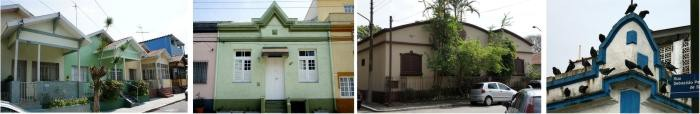
>
> Figura 2 - A) casas dos poloneses, B) dos italianos, C) dos espanhóis
> e D) detalhe de uma residência portuguesa. Fonte: Site São Paulo
> Antiga / Douglas Nascimento

Outro fator que marca a paisagem da Vila são os prédios institucionais e
comerciais que estão dispostos no limite e no interior da Vila. A
grandiosidade e qualidade com que foram construídos quebram a ordem,
diferenciando da escala das unidade residenciais. Entre os prédios mais
importantes estão a Escola dos Meninos, A Escola das Meninas e o Armazém
Central (fig. 3 A, B e C), todos abandonados nos dias atuais.

> 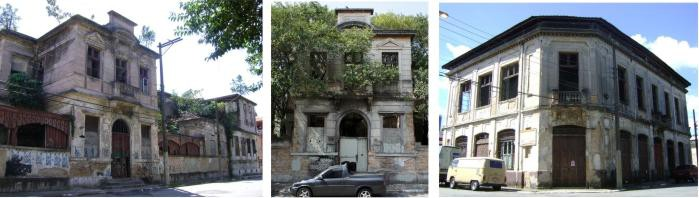
>
> Figura 3 -- A) Escola dos meninos, B) Escola das Meninas e C) Armazém.
> Fonte: Site São Paulo Antiga / Douglas Nascimento

Sabe-se que nem todas as vilas operárias tiveram a qualidade urbana e
arquitetônica aqui apresentada, mas pode-se dizer que esta vila
sintetiza um modelo de paisagem que o industrial queria construir para o
trabalhador.

# Conjunto Residencial Prefeito Mendes de Moraes (Pedregulho) -- 1947 -- A habitação feita pelo Estado (Era Vargas)

A década de 1940 foi marcada pela criação da Fundação Casa Popular e do
Departamento de Habitação Popular da Prefeitura do Distrito Federal e,
também, pela adoção de uma política habitacional pelos Institutos de
Aposentadorias e Pensões (IAPs). Embora essas ações aparentemente não
tivessem nenhuma relação, era sinal do "reconhecimento de que a provisão
habitacional era uma responsabilidade do Estado e que exigia sua
intervenção para ser equacionada de forma adequada. Enfim era uma
questão social" (BONDUKI, 1998, p.14).

O Pedregulho, como é chamado o Conjunto Residencial Prefeito Mendes de
Moraes, foi projetado pelo arquiteto Affonso Eduardo Reidy, em 1947. O
conjunto localiza-se no limite do bairros São Cristóvão e Benfica, no
Rio de Janeiro, e é composto por 328 unidades habitacionais, escola,
academia, lavanderia e outros espaços de convívio e lazer.

> 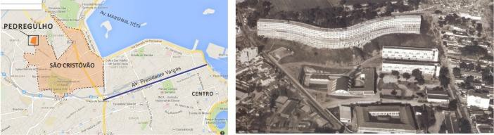
>
> Figura 4 - A) Localização do Conjunto. Fonte: Google Earth, modificado
> pelo autor, 2014 e B) vista aérea. Fonte:
> [archdaily.com,](http://www.archdaily.com/) 2014

Usando da ferramenta da visão serial descrita por Cullen (1996, p.19)
vamos descrever o caminho de um transeunte que desce do ônibus na rua
Prefeito Olímpio de Melo do bairro de Benfica, caminha pela rua Lopes
Trovão até o cruzamento com a rua Capitão Félix onde vira a esquerda até
encontrar com a rua Ferreira Araújo. Até nesse momento do percurso, o
que o pedestre encontrou foram cenários de uma cidade pouco planejada em
pequenos lotes privados onde cada indivíduo foi construindo sua morada
na medida em que as condições financeiras lhe eram oportunizadas.
Criando assim uma paisagem em constante transformação e com pouca
qualidade urbanística. Porém ao subir a rua Ferreira de Araújo se depara
com algo diferente daquilo tudo que vira antes. Ali não se vê apenas
habitações e sim "um projeto de arquitetura moderna, um projeto de
cidade, um projeto social" (CAIXETA, 2002, p.61).

> 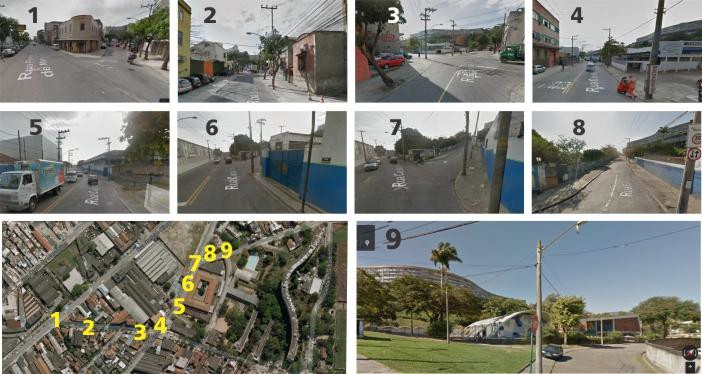
>
> Figura 5 -- Montagem com imagens que retratam o percurso do ponto 1
> (rua Olímpio de Melo com rua Lopes Trovão) de ônibus até o conjunto
> Pedregulho. Fon[te: googlemaps.com,](http://www.googlemaps.com/) de
> 2014- modificadas pelo autor

No Pedregulho, "aparece de forma mais acabada a relação entre habitação
social, modernização, educação popular e transformação da sociedade"
(BONDUKI, 1998, p.139). Essa concepção influenciava de tal forma na
paisagem que a escola do conjunto foi construída antes dos blocos
habitacionais. A intenção agora não era fazer uma vila para o controle
do industrial ou do estado e sim fazer um espaço coletivo e de convívio
para o pleno desenvolvimento da população.

> 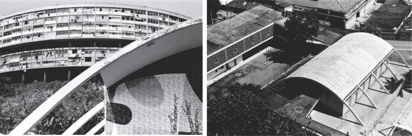
>
> Figura 6 -- A) vista do edifício da academia com o bloco de
> apartamentos ao fundo e B) academia e escola vistas do bloco de
> apartamentos. Fon[te: archdaily.com](http://www.archdaily.com/) /
> Pedro Vannuchi

As características da arquitetura modernista, os ensinamentos de Le
Corbusier e a experiência alemã no período entre guerras influenciam os
projetos e a paisagem criadas pelos conjuntos desse período. São
características comuns: blocos lineares e baixos (geralmente 3 ou 4
pavimentos) em muitos caso com o uso de pilotis deixando o térreo com
espaço coletivo, poucos ornamentos e industrialização da construção
sempre buscando a economia através da padronização e racionalização.

Apesar de serem paisagens com características tão semelhantes isso não
impediu que os arquitetos criassem diversas soluções produzindo espaços
diferenciados e com qualidade.

> 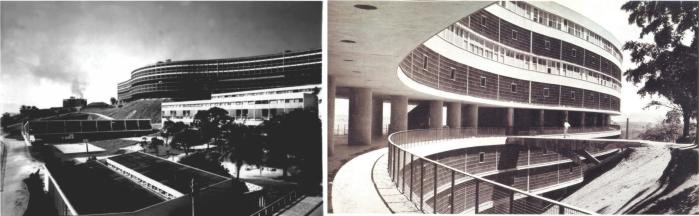
>
> Figura 7 - A) vista do conjunto. Fonte:
> [archdaily.com](http://www.archdaily.com/) / Pedro Vannuchi e B)
> detalhe dos pilotis no prédio de apartamentos. Fonte:
> [archdaily.com](http://www.archdaily.com/) / Nabil Bonduki

Conjuntos como o Pedregulho e vários outros construídos pelos IAPs foram
prova evidente da capacidade do Estado enfrentar o problema habitacional
brasileiro. A arquitetura moderna buscava traçar diretrizes projetuais
para habitação mínima que aliavam economia, prática, técnica e estética.
Porém a arquitetura moderna pareceu desconsiderar a participação
popular, produzindo obras arquitetônicas de grande qualidade, porém sem
nenhum diálogo com a cultura dos que dela necessitavam. Para

Cullen (1996, p.195) existem duas formas para se projetar um ambiente:
objetivamente e empregando valores subjetivos daqueles que ali viverão,
a falta dessa complementariedade parece ser uma das explicações do
abandono do Conjunto nos dias atuais.

# Banco Nacional da Habitação (BNH) - A habitação feita pelo Estado (1964 -- 1986)

Se outrora - nos projetos da Fundação Casa Popular e IAPs - havia um
conceito de projeto e cidade a ser transformada primando pela qualidade
dos espaços, a riqueza das formas e a correta inserção na malha urbana o
que se vê na política implementada pelo BNH é preocupação com a
quantidade em detrimento da qualidade. Essa premissa geraria um
"divórcio entre arquitetura e moradia popular, com graves repercussões
na qualidade do espaço urbano. (BONDUKI, 1998, p.318)."

Duas imagens sintetizam a produção feita em larga escala pelo BNH em
todo o Brasil: a imensidão de casas idênticas em pequenos lotes
individualizados e blocos habitacionais em formato H, monótonos e
repetitivos desvinculados do contexto urbano.

> 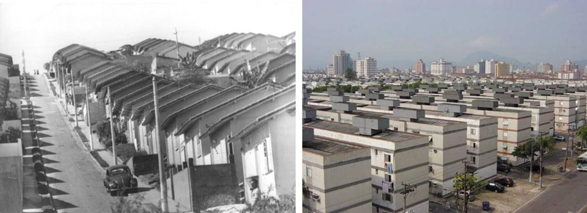
>
> Figura 8 - A) conjunto residencial da Pavuna (RJ). Fonte:
> exposicoesvirtuais.arquivonacional.gov.br/, 2014 e B) Conjunto
> Humberto de Alencar Castelo Branco, em Santos. Fonte:
> [novomilenio.inf.br/real/ed119z.htm,](http://www.novomilenio.inf.br/real/ed119z.htm)
> 2014

Para Benetti (2012) o modelo de habitação do BNH com unidades
residenciais distantes dos equipamentos da cidade "comprometem
gravemente a possibilidade de melhoria social das famílias, à medida em
que são lugares ermos, carentes de possibilidade de trabalho, emprego,
cultura, lazer e educação". Ainda segundo o autor o alto custo dos
transportes provoca o confinamento das populações nesses espaços sem
qualidade para o pleno desenvolvimento humano.

A monotonia, a repetição e a segregação levam a constatar que a
concepção de paisagem urbana está sendo desrespeitada, decretando o
fracasso de programas e políticas que reproduzem modelos e padrões:

> \... se ao cabo de todo esse esforço a cidade se apresenta monótona,
> incaracterística ou amorfa, ela não cumpre a sua função. É um
> fracasso. É como empilhar lenha para uma fogueira e esquecer de lhe
> deitar fogo. (CULLEN, 1996, p.10)

# Auto empreendimento na periferia - A habitação feita pelo trabalhador

> Para as maiorias, sobram as terras que a legislação urbanística ou
> ambiental vetou para a construção ou não disponibilizou para o mercado
> formal, ou os espaços precários das periferias e as viagens cotidianas
> "à cidade". (ROLNIK, 2008)

Exemplo dessa paisagem em Goiânia é o setor Estrela Dalva na região
Noroeste. A ocupação da região começou em 1979 com a ocupação da Fazenda
Caveiras gerando o bairro chamado Jardim Nova Esperança (MOYSÉS, 2001).
Com a vitória do movimento popular e a definitiva ocupação da área
alguns empresários começaram a lotear áreas no entorno criando um
mercado de terras baratas pois não havia equipamentos nem serviços
naquela região.

> 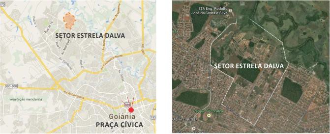
>
> Figura 9 - A) Localização do setor e B) imagem de satélite Fonte:
> Google Earth, modificado pelo autor, 2014

O Bairro Estrela Dalva é um dos bairros criados pela iniciativa privada.
O loteamento foi feito com lotes, ruas e calçadas mínimas. Cada lote era
financiado em centenas de prestações. De posse do lote cada morador se
mudava para o bairro de forma precária seja para casa de um cômodo para
toda família ou em barraco de lona.

> 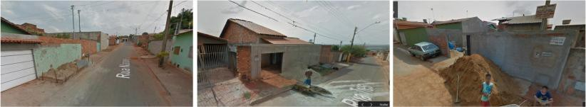
>
> Figura 10 -- sequência de imagens do Setor estrela Dalva. Fon[te:
> googlemaps.com.br,](http://www.googlemaps.com.br/) 2014

Ao adentrar as ruas do bairro o que encontramos até hoje é uma paisagem
em construção, onde várias casas ainda são construídas ou ampliadas nos
fins de semana, que é quando trabalhador/morador pode fazer o serviço.
Muitas das residências não tem iluminação e ventilação adequados podendo
ocasionar o surgimento de doenças respiratórias, por exemplo.

A monotonia das ruas estreitas só é quebrada quando há um terreno baldio
ao lado, geralmente reservado para um equipamento público que, na
maioria das vezes, não tem previsão de ser construído.

> 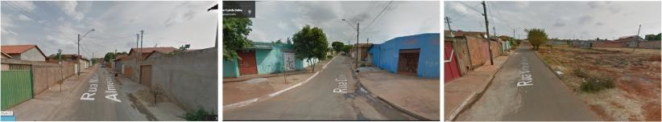
>
> Figura 11 - imagens do Setor Estrela Dalva. Fonte:
> [googlemaps.com.br,](http://www.googlemaps.com.br/) 2014

A topografia plana na cidade de Goiânia facilita essas ocupações gerando
bairros com uma certa organização espacial. As ocupações em outras
cidades, onde a terra não tem valor para o mercado formal pois a
inclinação é muito grande, gera aglomerados ainda mais insalubres.

Cabe aqui deixar claro que a péssima qualidade da paisagem não pode ser
atribuída ao trabalhador (ao auto empreendedor), pois é fruto de um
projeto urbano onde pouco espaço é destinado a espaços públicos e as
calçadas, ruas e lotes são extremamente pequenos.

# Programa Minha Casa Minha Vida (PMCMV) - A habitação feita pelo Estado (2009 -- dias atuais)

O PMCMV, lançado em 2009 pelo então Presidente Luiz Inácio da Silva
dentro do Programa de Aceleração do Crescimento (PAC), resolveu
'terceirizar' para a iniciativa privada a produção de habitação para
famílias de 0 a 3 salários mínimos, reservando apenas 3% dos recursos
para a produção feita pelas cooperativas e associações populares.

A lógica especulativa, terra e projetos baratos, é o que rege o
planejamento urbano erando impactos sociais em toda a cidade, pois que o
PMCMV, igualmente ao BNH, induz a uma "política habitacional com
interesse apenas na quantidade de moradias e não na sua fundamental
condição urbana". (MARICATO, 2011, p.67)

A paisagem que é criada pelo programa não difere em nada dos conjuntos
do BNH: pequenas casas em série na periferia ou blocos de habitação
repetidos exaustivamente. A novidade é que a iniciativa privada parece
procurar cada vez mais alternativas de baixar o custo da unidade sem
nenhuma preocupação com a qualidade e localização das habitações
surgindo soluções cada vez mais distantes do ideal colocado pelo
Movimento Moderno.

> 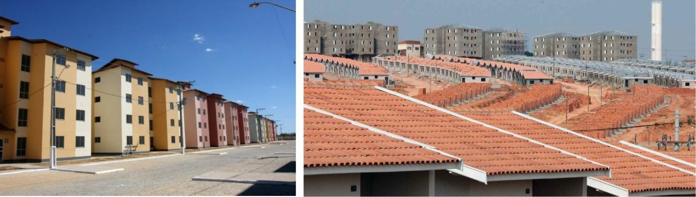
>
> Figura 12 -- A) imagem de conjuntos de edifícios do PMCMV Fonte:
> Mcidades, 2012 e B) Residencial Casas do Parque, em Campinas (SP).
> Fonte: Ricardo Stuckert/Arquivo/PR, 2013

As empreiteiras colocam como fator primordial a necessidade de
racionalização e simplificação do projeto. Essa diretriz pode gerar
bairros e setores de péssima qualidade urbanística como se pode observar
no Bairro São Jorge no município de Queimados (RJ). Nesse empreendimento
o projeto da casa de duas águas difundido em larga escala desde o BNH
foi "adaptado" e se juntaram quatro unidades resultando na paisagem que
pode ser conferida na imagem abaixo.

> 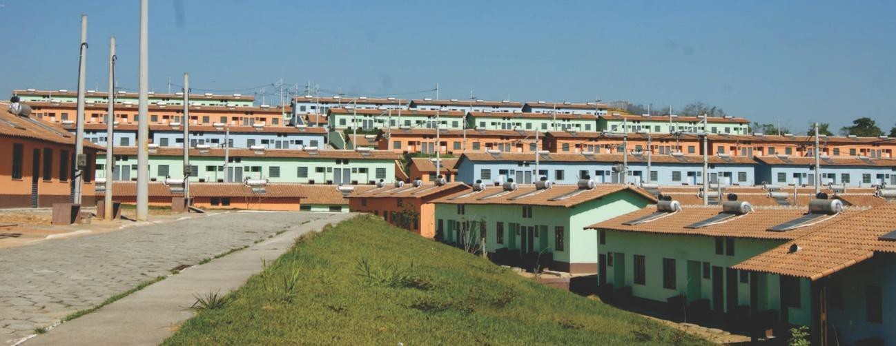
>
> Figura 13 -- PMCMV em Queimados. Fonte:
> [pmdb-rj.org.br/novo/406-unidades-habitacionais-serao-entregues-em-](http://pmdb-rj.org.br/novo/406-unidades-habitacionais-serao-entregues-em-queimados-nesta-sexta)
> [queimados-nesta-sexta,](http://pmdb-rj.org.br/novo/406-unidades-habitacionais-serao-entregues-em-queimados-nesta-sexta)
> acessado em 2014

# Considerações Finais

Como já foi alertado por Bonduki (1998, p.318) parte significativa das
nossas cidades estão sendo produzidas por programas habitacionais e
essas soluções tem criado em sua maioria espaços urbanos sem qualidade.
A foto do bairro de Benfica (fig.15 A) deixa claro, em uma vista aérea,
como o tecido urbano é marcado pelos programas habitacionais. Na imagem
aparecem três diferentes formas de ocupação do território: a habitação
feita pelo Estado (era Vargas), a habitação feita pelo trabalhador (auto
construção na periferia) e um outro momento da habitação feita pelo
Estado com parceria da iniciativa privada (PMCMV).

> 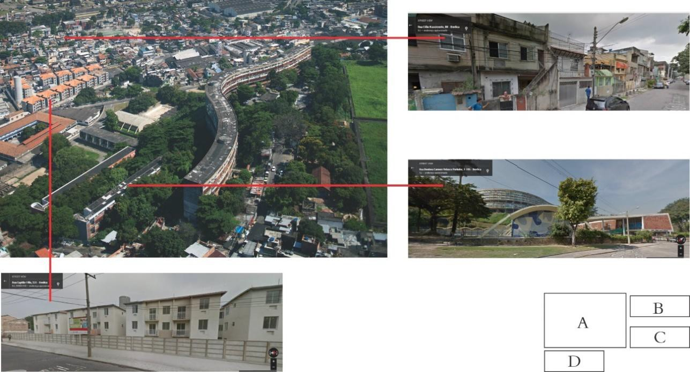
>
> Figura 14 -- A) foto aérea do Bairro de Benfica no Rio de Janeiro.
> Fonte: gentilmente cedida por Leonardo Finotti, 2010, B) vista da Rua
> Célio Nascimento, C) Vista da Rua Doutora Carmem Portinho, D) vista da
> rua Capitão Felix (B, C e D retiradas d[e
> mapas.google.com.br,](http://www.mpas.google.com.br/) 2014)

Ao analisar a imagem é flagrante a diferença de qualidade de inserção
urbana e ambiental do Conjunto Pedregulho se comparado com os demais
modelos de ocupação do território. O conjunto do PMCMV ocupa todo o
terreno, os blocos de habitação são implantados sem a preocupação de
inserção no contexto urbano e sem criar um espaço em que a construção e
o meio ambiente estejam em harmonia. No caso da habitação feita pelo
trabalhador, o pouco acesso à recursos financeiros o obriga a construir
em pouco espaço, com materiais de baixa qualidade e sem nenhuma
assistência técnica, criando, muitas vezes, ambientes insalubres e
distantes dos equipamentos urbanos.

Para a qualificação dos projetos, Arantes (2011) acredita ser necessário
o enfrentamento de "pertinentes e diversos desafios". A integração entre
arquitetos e trabalhadores, gerando debates desde as alternativas de
projeto e produção até a relação do espaço com a cidade, é o primeiro
desafio e que parece ter sido negligenciado nos diferentes casos
discutidos neste artigo. Para o autor um outro desafio é discutir a
propriedade da terra "que deve ser coletiva ou estatal, como barreira à
mercantilização e fragmentação dos resultados da luta social." Por fim o
autor coloca o desafio de que o desenho urbano crie espaços mais
generosos com o entorno oferecendo uma vivência mais prazerosa da
cidade. Assim Arantes acredita que a conquista individual da casa passa
a ser uma conquista coletiva da cidade.

> Mais do que uma questão urbanística, trata-se de um elo fundamental
> para que a conquista de um grupo organizado se apresente a todos como
> forma de alargamento da experiência social e urbana. Desse modo, a
> organização popular se revela portadora de uma proposta de
> fortalecimento da vida pública, em que política, festa e território se
> entrelaçam numa pequena centralidade de civilização em meio à
> barbárie. (ARANTES, 2011, p.247)

O projeto de habitação social, então, tem que ter a responsabilidade de
ser um projeto de cidade, como fora outrora nos conjuntos modernistas
porém agora com o entendimento que só o efetivo envolvimento com a
população pode trazer como produto um espaço que de fato tenha as
características necessárias para o pleno desenvolvimento das comunidades
atendidas pois a "cabeça pensa onde o pé pisa".

# Referências Bibliográficas

> [ARANTES, P. F. **Arquitetura Nova**. São Paulo: Editora
> 34](http://www.usinactah.org.br/files/livroaraquiteturanova.pdf),
> 2011. BENETTI*,* Pablo. **Habitação Social e Cidade**. Rio Books -
> Prourb, 2012.
>
> BOFF, Leonardo. **A águia e a galinha: Uma metáfora da condição
> humana.** 25. Ed. Petrópolis: Vozes, 1997
>
> BONDUKI, Nabil Georges. **Origens da habitação social no Brasil
> Arquitetura Moderna, Lei do inquilinato e Difusão da Casa Própria**.
> Editoria: Estação Liberdade, 1998.
>
> CAIXETA, E. M. M. P. . **Uma arquitetura para a cidade: a obra de
> Affonso Eduardo Reidy.** ARQTEXTO (UFRGS), Porto Alegre, v. 2, p.
> 58-67, 2002.
>
> CULLEN, G. **Paisagem urbana**. Lisboa: Edições 70, 1996.
>
> MARICATO, E. **O impasse da política urbana no Brasil***.* Petrópolis:
> Vozes, 2011.
>
> MOYSÉS, A. . **A produção de territórios segregados na Região Noroeste
> de Goiânia - Sessão Temática: Urbanização e Regularização da Cidade
> Ilegal.** In: II ENCONTRO DEMOCRACIA, IGUALDADE E QUALIDADE DE VIDA. O
> DESAFIO PARA AS CIDADES NO SÉCULO XXI, 2001, Belém - Pará. II Encontro

democracia, igualdade e qualidade de vida. O Desafio para as Cidades do
Século XXI. Rio de Janeiro: IPPUR/UFRJ, 2001.

> ROLNIK, Raquel. **A lógica da desordem**. Le Monde Diplomatique,
> Brasil, ano 2, n. 13, 2008.

SOLÀ-MORALES, Ignasi de. **Territórios**. Barcelona: GG, 2002.
